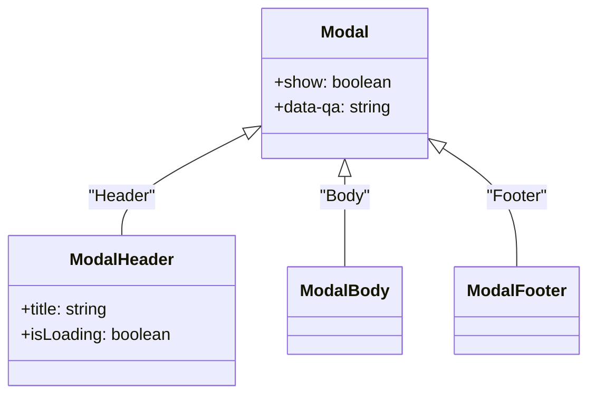

# Diagram: web/portal/src/components/molecules/Modal.molecule.test.js


> Auto-generated by Obscura crawlers

## Diagram 1



### SVG

<svg id="container" width="555.5703125" xmlns="http://www.w3.org/2000/svg" class="classDiagram" height="378" viewBox="0 0 555.5703125 378" role="graphics-document document" aria-roledescription="class"><style>#container{font-family:"trebuchet ms",verdana,arial,sans-serif;font-size:16px;fill:#333;}@keyframes edge-animation-frame{from{stroke-dashoffset:0;}}@keyframes dash{to{stroke-dashoffset:0;}}#container .edge-animation-slow{stroke-dasharray:9,5!important;stroke-dashoffset:900;animation:dash 50s linear infinite;stroke-linecap:round;}#container .edge-animation-fast{stroke-dasharray:9,5!important;stroke-dashoffset:900;animation:dash 20s linear infinite;stroke-linecap:round;}#container .error-icon{fill:#552222;}#container .error-text{fill:#552222;stroke:#552222;}#container .edge-thickness-normal{stroke-width:1px;}#container .edge-thickness-thick{stroke-width:3.5px;}#container .edge-pattern-solid{stroke-dasharray:0;}#container .edge-thickness-invisible{stroke-width:0;fill:none;}#container .edge-pattern-dashed{stroke-dasharray:3;}#container .edge-pattern-dotted{stroke-dasharray:2;}#container .marker{fill:#333333;stroke:#333333;}#container .marker.cross{stroke:#333333;}#container svg{font-family:"trebuchet ms",verdana,arial,sans-serif;font-size:16px;}#container p{margin:0;}#container g.classGroup text{fill:#9370DB;stroke:none;font-family:"trebuchet ms",verdana,arial,sans-serif;font-size:10px;}#container g.classGroup text .title{font-weight:bolder;}#container .nodeLabel,#container .edgeLabel{color:#131300;}#container .edgeLabel .label rect{fill:#ECECFF;}#container .label text{fill:#131300;}#container .labelBkg{background:#ECECFF;}#container .edgeLabel .label span{background:#ECECFF;}#container .classTitle{font-weight:bolder;}#container .node rect,#container .node circle,#container .node ellipse,#container .node polygon,#container .node path{fill:#ECECFF;stroke:#9370DB;stroke-width:1px;}#container .divider{stroke:#9370DB;stroke-width:1;}#container g.clickable{cursor:pointer;}#container g.classGroup rect{fill:#ECECFF;stroke:#9370DB;}#container g.classGroup line{stroke:#9370DB;stroke-width:1;}#container .classLabel .box{stroke:none;stroke-width:0;fill:#ECECFF;opacity:0.5;}#container .classLabel .label{fill:#9370DB;font-size:10px;}#container .relation{stroke:#333333;stroke-width:1;fill:none;}#container .dashed-line{stroke-dasharray:3;}#container .dotted-line{stroke-dasharray:1 2;}#container #compositionStart,#container .composition{fill:#333333!important;stroke:#333333!important;stroke-width:1;}#container #compositionEnd,#container .composition{fill:#333333!important;stroke:#333333!important;stroke-width:1;}#container #dependencyStart,#container .dependency{fill:#333333!important;stroke:#333333!important;stroke-width:1;}#container #dependencyStart,#container .dependency{fill:#333333!important;stroke:#333333!important;stroke-width:1;}#container #extensionStart,#container .extension{fill:transparent!important;stroke:#333333!important;stroke-width:1;}#container #extensionEnd,#container .extension{fill:transparent!important;stroke:#333333!important;stroke-width:1;}#container #aggregationStart,#container .aggregation{fill:transparent!important;stroke:#333333!important;stroke-width:1;}#container #aggregationEnd,#container .aggregation{fill:transparent!important;stroke:#333333!important;stroke-width:1;}#container #lollipopStart,#container .lollipop{fill:#ECECFF!important;stroke:#333333!important;stroke-width:1;}#container #lollipopEnd,#container .lollipop{fill:#ECECFF!important;stroke:#333333!important;stroke-width:1;}#container .edgeTerminals{font-size:11px;line-height:initial;}#container .classTitleText{text-anchor:middle;font-size:18px;fill:#333;}#container .label-icon{display:inline-block;height:1em;overflow:visible;vertical-align:-0.125em;}#container .node .label-icon path{fill:currentColor;stroke:revert;stroke-width:revert;}#container :root{--mermaid-font-family:"trebuchet ms",verdana,arial,sans-serif;}</style><g><defs><marker id="container_class-aggregationStart" class="marker aggregation class" refX="18" refY="7" markerWidth="190" markerHeight="240" orient="auto"><path d="M 18,7 L9,13 L1,7 L9,1 Z"></path></marker></defs><defs><marker id="container_class-aggregationEnd" class="marker aggregation class" refX="1" refY="7" markerWidth="20" markerHeight="28" orient="auto"><path d="M 18,7 L9,13 L1,7 L9,1 Z"></path></marker></defs><defs><marker id="container_class-extensionStart" class="marker extension class" refX="18" refY="7" markerWidth="190" markerHeight="240" orient="auto"><path d="M 1,7 L18,13 V 1 Z"></path></marker></defs><defs><marker id="container_class-extensionEnd" class="marker extension class" refX="1" refY="7" markerWidth="20" markerHeight="28" orient="auto"><path d="M 1,1 V 13 L18,7 Z"></path></marker></defs><defs><marker id="container_class-compositionStart" class="marker composition class" refX="18" refY="7" markerWidth="190" markerHeight="240" orient="auto"><path d="M 18,7 L9,13 L1,7 L9,1 Z"></path></marker></defs><defs><marker id="container_class-compositionEnd" class="marker composition class" refX="1" refY="7" markerWidth="20" markerHeight="28" orient="auto"><path d="M 18,7 L9,13 L1,7 L9,1 Z"></path></marker></defs><defs><marker id="container_class-dependencyStart" class="marker dependency class" refX="6" refY="7" markerWidth="190" markerHeight="240" orient="auto"><path d="M 5,7 L9,13 L1,7 L9,1 Z"></path></marker></defs><defs><marker id="container_class-dependencyEnd" class="marker dependency class" refX="13" refY="7" markerWidth="20" markerHeight="28" orient="auto"><path d="M 18,7 L9,13 L14,7 L9,1 Z"></path></marker></defs><defs><marker id="container_class-lollipopStart" class="marker lollipop class" refX="13" refY="7" markerWidth="190" markerHeight="240" orient="auto"><circle stroke="black" fill="transparent" cx="7" cy="7" r="6"></circle></marker></defs><defs><marker id="container_class-lollipopEnd" class="marker lollipop class" refX="1" refY="7" markerWidth="190" markerHeight="240" orient="auto"><circle stroke="black" fill="transparent" cx="7" cy="7" r="6"></circle></marker></defs><g class="root"><g class="clusters"></g><g class="edgePaths"><path d="M232.627,129.409L213.326,139.34C194.026,149.272,155.425,169.136,136.125,185.235C116.824,201.333,116.824,213.667,116.824,219.833L116.824,226" id="id_Modal_ModalHeader_1" class="edge-thickness-normal edge-pattern-solid relation" style=";;;" data-edge="true" data-et="edge" data-id="id_Modal_ModalHeader_1" data-points="W3sieCI6MjQ3Ljk2NDg0Mzc1LCJ5IjoxMjEuNTE1NDgxNzg4ODQyNzh9LHsieCI6MTE2LjgyNDIxODc1LCJ5IjoxODl9LHsieCI6MTE2LjgyNDIxODc1LCJ5IjoyMjZ9XQ==" marker-start="url(#container_class-extensionStart)"></path><path d="M328.641,169.25L328.641,172.542C328.641,175.833,328.641,182.417,328.641,196.875C328.641,211.333,328.641,233.667,328.641,244.833L328.641,256" id="id_Modal_ModalBody_2" class="edge-thickness-normal edge-pattern-solid relation" style=";;;" data-edge="true" data-et="edge" data-id="id_Modal_ModalBody_2" data-points="W3sieCI6MzI4LjY0MDYyNSwieSI6MTUyfSx7IngiOjMyOC42NDA2MjUsInkiOjE4OX0seyJ4IjozMjguNjQwNjI1LCJ5IjoyNTZ9XQ==" marker-start="url(#container_class-extensionStart)"></path><path d="M423.6,144.305L434.6,151.754C445.6,159.203,467.601,174.102,478.601,192.717C489.602,211.333,489.602,233.667,489.602,244.833L489.602,256" id="id_Modal_ModalFooter_3" class="edge-thickness-normal edge-pattern-solid relation" style=";;;" data-edge="true" data-et="edge" data-id="id_Modal_ModalFooter_3" data-points="W3sieCI6NDA5LjMxNjQwNjI1LCJ5IjoxMzQuNjMyMjYyMjkxODk5MjJ9LHsieCI6NDg5LjYwMTU2MjUsInkiOjE4OX0seyJ4Ijo0ODkuNjAxNTYyNSwieSI6MjU2fV0=" marker-start="url(#container_class-extensionStart)"></path></g><g class="edgeLabels"><g class="edgeLabel" transform="translate(116.82421875, 189)"><g class="label" data-id="id_Modal_ModalHeader_1" transform="translate(-32.7265625, -12)"><foreignObject width="65.453125" height="24"><div xmlns="http://www.w3.org/1999/xhtml" class="labelBkg" style="display: table-cell; white-space: nowrap; line-height: 1.5; max-width: 200px; text-align: center;"><span class="edgeLabel"><p>"Header"</p></span></div></foreignObject></g></g><g class="edgeLabel" transform="translate(328.640625, 189)"><g class="label" data-id="id_Modal_ModalBody_2" transform="translate(-24.640625, -12)"><foreignObject width="49.28125" height="24"><div xmlns="http://www.w3.org/1999/xhtml" class="labelBkg" style="display: table-cell; white-space: nowrap; line-height: 1.5; max-width: 200px; text-align: center;"><span class="edgeLabel"><p>"Body"</p></span></div></foreignObject></g></g><g class="edgeLabel" transform="translate(489.6015625, 189)"><g class="label" data-id="id_Modal_ModalFooter_3" transform="translate(-29.625, -12)"><foreignObject width="59.25" height="24"><div xmlns="http://www.w3.org/1999/xhtml" class="labelBkg" style="display: table-cell; white-space: nowrap; line-height: 1.5; max-width: 200px; text-align: center;"><span class="edgeLabel"><p>"Footer"</p></span></div></foreignObject></g></g></g><g class="nodes"><g class="node default" id="classId-Modal-0" transform="translate(328.640625, 80)"><g class="basic label-container"><path d="M-80.67578125 -72 L80.67578125 -72 L80.67578125 72 L-80.67578125 72" stroke="none" stroke-width="0" fill="#ECECFF" style=""></path><path d="M-80.67578125 -72 C-45.38494600736402 -72, -10.094110764728043 -72, 80.67578125 -72 M-80.67578125 -72 C-21.861742459160972 -72, 36.952296331678056 -72, 80.67578125 -72 M80.67578125 -72 C80.67578125 -34.63655989496776, 80.67578125 2.726880210064479, 80.67578125 72 M80.67578125 -72 C80.67578125 -39.51523309176299, 80.67578125 -7.030466183525974, 80.67578125 72 M80.67578125 72 C17.974439682415138 72, -44.726901885169724 72, -80.67578125 72 M80.67578125 72 C32.345790093347155 72, -15.98420106330569 72, -80.67578125 72 M-80.67578125 72 C-80.67578125 41.754870415026076, -80.67578125 11.50974083005216, -80.67578125 -72 M-80.67578125 72 C-80.67578125 19.52013437905798, -80.67578125 -32.95973124188404, -80.67578125 -72" stroke="#9370DB" stroke-width="1.3" fill="none" stroke-dasharray="0 0" style=""></path></g><g class="annotation-group text" transform="translate(0, -48)"></g><g class="label-group text" transform="translate(-22.4453125, -48)"><g class="label" style="font-weight: bolder" transform="translate(0,-12)"><foreignObject width="44.890625" height="24"><div xmlns="http://www.w3.org/1999/xhtml" style="display: table-cell; white-space: nowrap; line-height: 1.5; max-width: 95px; text-align: center;"><span class="nodeLabel markdown-node-label" style=""><p>Modal</p></span></div></foreignObject></g></g><g class="members-group text" transform="translate(-68.67578125, 0)"><g class="label" style="" transform="translate(0,-12)"><foreignObject width="113.234375" height="24"><div xmlns="http://www.w3.org/1999/xhtml" style="display: table-cell; white-space: nowrap; line-height: 1.5; max-width: 171px; text-align: center;"><span class="nodeLabel markdown-node-label" style=""><p>+show: boolean</p></span></div></foreignObject></g><g class="label" style="" transform="translate(0,12)"><foreignObject width="114.90625" height="24"><div xmlns="http://www.w3.org/1999/xhtml" style="display: table-cell; white-space: nowrap; line-height: 1.5; max-width: 173px; text-align: center;"><span class="nodeLabel markdown-node-label" style=""><p>+data-qa: string</p></span></div></foreignObject></g></g><g class="methods-group text" transform="translate(-68.67578125, 72)"></g><g class="divider" style=""><path d="M-80.67578125 -24 C-43.62333031267486 -24, -6.570879375349719 -24, 80.67578125 -24 M-80.67578125 -24 C-26.772848361327597 -24, 27.130084527344806 -24, 80.67578125 -24" stroke="#9370DB" stroke-width="1.3" fill="none" stroke-dasharray="0 0" style=""></path></g><g class="divider" style=""><path d="M-80.67578125 48 C-17.02585877432894 48, 46.62406370134212 48, 80.67578125 48 M-80.67578125 48 C-47.49727092434486 48, -14.318760598689721 48, 80.67578125 48" stroke="#9370DB" stroke-width="1.3" fill="none" stroke-dasharray="0 0" style=""></path></g></g><g class="node default" id="classId-ModalHeader-1" transform="translate(116.82421875, 298)"><g class="basic label-container"><path d="M-108.82421875 -72 L108.82421875 -72 L108.82421875 72 L-108.82421875 72" stroke="none" stroke-width="0" fill="#ECECFF" style=""></path><path d="M-108.82421875 -72 C-46.90141447901724 -72, 15.021389791965518 -72, 108.82421875 -72 M-108.82421875 -72 C-38.27769352640178 -72, 32.26883169719645 -72, 108.82421875 -72 M108.82421875 -72 C108.82421875 -19.419004447952595, 108.82421875 33.16199110409481, 108.82421875 72 M108.82421875 -72 C108.82421875 -25.95822363861658, 108.82421875 20.08355272276684, 108.82421875 72 M108.82421875 72 C36.727029785215976 72, -35.37015917956805 72, -108.82421875 72 M108.82421875 72 C30.222086158361336 72, -48.38004643327733 72, -108.82421875 72 M-108.82421875 72 C-108.82421875 32.34991353875997, -108.82421875 -7.3001729224800584, -108.82421875 -72 M-108.82421875 72 C-108.82421875 29.555921406717403, -108.82421875 -12.888157186565195, -108.82421875 -72" stroke="#9370DB" stroke-width="1.3" fill="none" stroke-dasharray="0 0" style=""></path></g><g class="annotation-group text" transform="translate(0, -48)"></g><g class="label-group text" transform="translate(-48.9140625, -48)"><g class="label" style="font-weight: bolder" transform="translate(0,-12)"><foreignObject width="97.828125" height="24"><div xmlns="http://www.w3.org/1999/xhtml" style="display: table-cell; white-space: nowrap; line-height: 1.5; max-width: 148px; text-align: center;"><span class="nodeLabel markdown-node-label" style=""><p>ModalHeader</p></span></div></foreignObject></g></g><g class="members-group text" transform="translate(-96.82421875, 0)"><g class="label" style="" transform="translate(0,-12)"><foreignObject width="86.859375" height="24"><div xmlns="http://www.w3.org/1999/xhtml" style="display: table-cell; white-space: nowrap; line-height: 1.5; max-width: 145px; text-align: center;"><span class="nodeLabel markdown-node-label" style=""><p>+title: string</p></span></div></foreignObject></g><g class="label" style="" transform="translate(0,12)"><foreignObject width="144.734375" height="24"><div xmlns="http://www.w3.org/1999/xhtml" style="display: table-cell; white-space: nowrap; line-height: 1.5; max-width: 202px; text-align: center;"><span class="nodeLabel markdown-node-label" style=""><p>+isLoading: boolean</p></span></div></foreignObject></g></g><g class="methods-group text" transform="translate(-96.82421875, 72)"></g><g class="divider" style=""><path d="M-108.82421875 -24 C-34.24106821747871 -24, 40.342082315042575 -24, 108.82421875 -24 M-108.82421875 -24 C-58.3486962547839 -24, -7.8731737595678055 -24, 108.82421875 -24" stroke="#9370DB" stroke-width="1.3" fill="none" stroke-dasharray="0 0" style=""></path></g><g class="divider" style=""><path d="M-108.82421875 48 C-43.85300644485204 48, 21.118205860295916 48, 108.82421875 48 M-108.82421875 48 C-31.299605806170916 48, 46.22500713765817 48, 108.82421875 48" stroke="#9370DB" stroke-width="1.3" fill="none" stroke-dasharray="0 0" style=""></path></g></g><g class="node default" id="classId-ModalBody-2" transform="translate(328.640625, 298)"><g class="basic label-container"><path d="M-52.9921875 -42 L52.9921875 -42 L52.9921875 42 L-52.9921875 42" stroke="none" stroke-width="0" fill="#ECECFF" style=""></path><path d="M-52.9921875 -42 C-17.934576271905243 -42, 17.123034956189514 -42, 52.9921875 -42 M-52.9921875 -42 C-15.052329112697848 -42, 22.887529274604304 -42, 52.9921875 -42 M52.9921875 -42 C52.9921875 -12.13892102185239, 52.9921875 17.72215795629522, 52.9921875 42 M52.9921875 -42 C52.9921875 -23.78573796200766, 52.9921875 -5.571475924015317, 52.9921875 42 M52.9921875 42 C28.636997890443784 42, 4.281808280887567 42, -52.9921875 42 M52.9921875 42 C19.212236065364614 42, -14.567715369270772 42, -52.9921875 42 M-52.9921875 42 C-52.9921875 23.00991875724161, -52.9921875 4.019837514483221, -52.9921875 -42 M-52.9921875 42 C-52.9921875 9.062431804842568, -52.9921875 -23.875136390314864, -52.9921875 -42" stroke="#9370DB" stroke-width="1.3" fill="none" stroke-dasharray="0 0" style=""></path></g><g class="annotation-group text" transform="translate(0, -18)"></g><g class="label-group text" transform="translate(-40.9921875, -18)"><g class="label" style="font-weight: bolder" transform="translate(0,-12)"><foreignObject width="81.984375" height="24"><div xmlns="http://www.w3.org/1999/xhtml" style="display: table-cell; white-space: nowrap; line-height: 1.5; max-width: 131px; text-align: center;"><span class="nodeLabel markdown-node-label" style=""><p>ModalBody</p></span></div></foreignObject></g></g><g class="members-group text" transform="translate(-40.9921875, 30)"></g><g class="methods-group text" transform="translate(-40.9921875, 60)"></g><g class="divider" style=""><path d="M-52.9921875 6 C-21.183048002678436 6, 10.626091494643127 6, 52.9921875 6 M-52.9921875 6 C-19.85750994506386 6, 13.27716760987228 6, 52.9921875 6" stroke="#9370DB" stroke-width="1.3" fill="none" stroke-dasharray="0 0" style=""></path></g><g class="divider" style=""><path d="M-52.9921875 24 C-17.20958806445269 24, 18.573011371094623 24, 52.9921875 24 M-52.9921875 24 C-26.34065074353433 24, 0.3108860129313413 24, 52.9921875 24" stroke="#9370DB" stroke-width="1.3" fill="none" stroke-dasharray="0 0" style=""></path></g></g><g class="node default" id="classId-ModalFooter-3" transform="translate(489.6015625, 298)"><g class="basic label-container"><path d="M-57.96875 -42 L57.96875 -42 L57.96875 42 L-57.96875 42" stroke="none" stroke-width="0" fill="#ECECFF" style=""></path><path d="M-57.96875 -42 C-29.563153698581782 -42, -1.1575573971635649 -42, 57.96875 -42 M-57.96875 -42 C-31.74090324393311 -42, -5.513056487866223 -42, 57.96875 -42 M57.96875 -42 C57.96875 -10.211597466400818, 57.96875 21.576805067198364, 57.96875 42 M57.96875 -42 C57.96875 -19.502229010965692, 57.96875 2.9955419780686157, 57.96875 42 M57.96875 42 C15.62544389208719 42, -26.71786221582562 42, -57.96875 42 M57.96875 42 C14.845370290049487 42, -28.278009419901025 42, -57.96875 42 M-57.96875 42 C-57.96875 14.829607484839755, -57.96875 -12.34078503032049, -57.96875 -42 M-57.96875 42 C-57.96875 13.921476210672967, -57.96875 -14.157047578654065, -57.96875 -42" stroke="#9370DB" stroke-width="1.3" fill="none" stroke-dasharray="0 0" style=""></path></g><g class="annotation-group text" transform="translate(0, -18)"></g><g class="label-group text" transform="translate(-45.96875, -18)"><g class="label" style="font-weight: bolder" transform="translate(0,-12)"><foreignObject width="91.9375" height="24"><div xmlns="http://www.w3.org/1999/xhtml" style="display: table-cell; white-space: nowrap; line-height: 1.5; max-width: 142px; text-align: center;"><span class="nodeLabel markdown-node-label" style=""><p>ModalFooter</p></span></div></foreignObject></g></g><g class="members-group text" transform="translate(-45.96875, 30)"></g><g class="methods-group text" transform="translate(-45.96875, 60)"></g><g class="divider" style=""><path d="M-57.96875 6 C-12.786671197432888 6, 32.395407605134224 6, 57.96875 6 M-57.96875 6 C-21.872488368388723 6, 14.223773263222554 6, 57.96875 6" stroke="#9370DB" stroke-width="1.3" fill="none" stroke-dasharray="0 0" style=""></path></g><g class="divider" style=""><path d="M-57.96875 24 C-13.492464847020187 24, 30.983820305959625 24, 57.96875 24 M-57.96875 24 C-22.01781540200504 24, 13.933119195989917 24, 57.96875 24" stroke="#9370DB" stroke-width="1.3" fill="none" stroke-dasharray="0 0" style=""></path></g></g></g></g></g></svg>

## Diagram 2

```mermaid
flowchart LR
A[Render Modal show=true] --> B{screen.queryByTestId("Test Modal")}
B --> C[expect element toBeInTheDocument()]
D[Render Modal show=false] --> E{screen.queryByTestId("Test Modal")}
E --> F[expect element not.toBeInTheDocument()]
G[Render Modal.Header title="Test Title" isLoading=false] --> H[screen.getByText("Test Title")]
H --> I[expect titleElement toBeInTheDocument()]
J[Render Modal.Header title="Loading Title" isLoading=true] --> K[screen.getByText(/Loading Title/).querySelector("span")]
K --> L[expect loader not.toBeEmptyDOMElement()]
M[Render Modal.Body children "Test Body Content"] --> N[screen.getByText("Test Body Content")]
N --> O[expect bodyContent toBeInTheDocument()]
P[Render Modal.Footer children "Test Footer Content"] --> Q[screen.getByText("Test Footer Content")]
Q --> R[expect footerContent toBeInTheDocument()]
```

> SVG rendering failed for this diagram.
