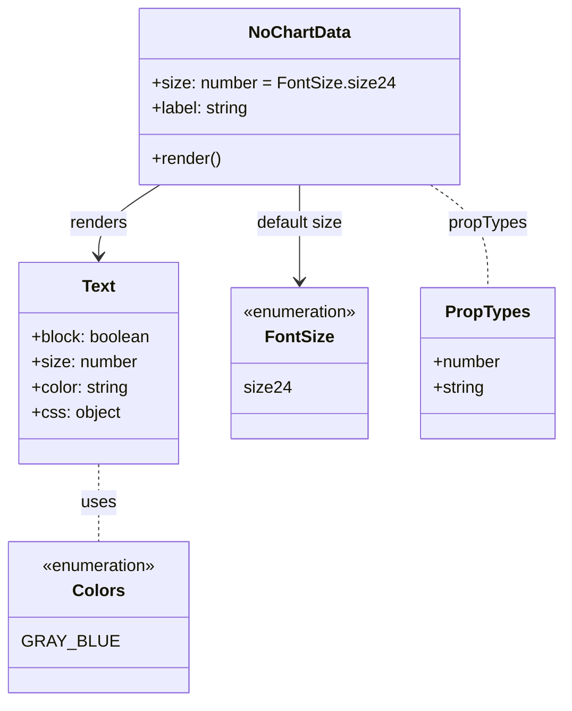

# Diagram: web/portal/src/components/molecules/NoChartData.molecule.js


> Auto-generated by Obscura crawlers

## Diagram 1



### SVG

<svg id="container" width="535.296875" xmlns="http://www.w3.org/2000/svg" class="classDiagram" height="668" viewBox="0 0 535.296875 668" role="graphics-document document" aria-roledescription="class"><style>#container{font-family:"trebuchet ms",verdana,arial,sans-serif;font-size:16px;fill:#333;}@keyframes edge-animation-frame{from{stroke-dashoffset:0;}}@keyframes dash{to{stroke-dashoffset:0;}}#container .edge-animation-slow{stroke-dasharray:9,5!important;stroke-dashoffset:900;animation:dash 50s linear infinite;stroke-linecap:round;}#container .edge-animation-fast{stroke-dasharray:9,5!important;stroke-dashoffset:900;animation:dash 20s linear infinite;stroke-linecap:round;}#container .error-icon{fill:#552222;}#container .error-text{fill:#552222;stroke:#552222;}#container .edge-thickness-normal{stroke-width:1px;}#container .edge-thickness-thick{stroke-width:3.5px;}#container .edge-pattern-solid{stroke-dasharray:0;}#container .edge-thickness-invisible{stroke-width:0;fill:none;}#container .edge-pattern-dashed{stroke-dasharray:3;}#container .edge-pattern-dotted{stroke-dasharray:2;}#container .marker{fill:#333333;stroke:#333333;}#container .marker.cross{stroke:#333333;}#container svg{font-family:"trebuchet ms",verdana,arial,sans-serif;font-size:16px;}#container p{margin:0;}#container g.classGroup text{fill:#9370DB;stroke:none;font-family:"trebuchet ms",verdana,arial,sans-serif;font-size:10px;}#container g.classGroup text .title{font-weight:bolder;}#container .nodeLabel,#container .edgeLabel{color:#131300;}#container .edgeLabel .label rect{fill:#ECECFF;}#container .label text{fill:#131300;}#container .labelBkg{background:#ECECFF;}#container .edgeLabel .label span{background:#ECECFF;}#container .classTitle{font-weight:bolder;}#container .node rect,#container .node circle,#container .node ellipse,#container .node polygon,#container .node path{fill:#ECECFF;stroke:#9370DB;stroke-width:1px;}#container .divider{stroke:#9370DB;stroke-width:1;}#container g.clickable{cursor:pointer;}#container g.classGroup rect{fill:#ECECFF;stroke:#9370DB;}#container g.classGroup line{stroke:#9370DB;stroke-width:1;}#container .classLabel .box{stroke:none;stroke-width:0;fill:#ECECFF;opacity:0.5;}#container .classLabel .label{fill:#9370DB;font-size:10px;}#container .relation{stroke:#333333;stroke-width:1;fill:none;}#container .dashed-line{stroke-dasharray:3;}#container .dotted-line{stroke-dasharray:1 2;}#container #compositionStart,#container .composition{fill:#333333!important;stroke:#333333!important;stroke-width:1;}#container #compositionEnd,#container .composition{fill:#333333!important;stroke:#333333!important;stroke-width:1;}#container #dependencyStart,#container .dependency{fill:#333333!important;stroke:#333333!important;stroke-width:1;}#container #dependencyStart,#container .dependency{fill:#333333!important;stroke:#333333!important;stroke-width:1;}#container #extensionStart,#container .extension{fill:transparent!important;stroke:#333333!important;stroke-width:1;}#container #extensionEnd,#container .extension{fill:transparent!important;stroke:#333333!important;stroke-width:1;}#container #aggregationStart,#container .aggregation{fill:transparent!important;stroke:#333333!important;stroke-width:1;}#container #aggregationEnd,#container .aggregation{fill:transparent!important;stroke:#333333!important;stroke-width:1;}#container #lollipopStart,#container .lollipop{fill:#ECECFF!important;stroke:#333333!important;stroke-width:1;}#container #lollipopEnd,#container .lollipop{fill:#ECECFF!important;stroke:#333333!important;stroke-width:1;}#container .edgeTerminals{font-size:11px;line-height:initial;}#container .classTitleText{text-anchor:middle;font-size:18px;fill:#333;}#container .label-icon{display:inline-block;height:1em;overflow:visible;vertical-align:-0.125em;}#container .node .label-icon path{fill:currentColor;stroke:revert;stroke-width:revert;}#container :root{--mermaid-font-family:"trebuchet ms",verdana,arial,sans-serif;}</style><g><defs><marker id="container_class-aggregationStart" class="marker aggregation class" refX="18" refY="7" markerWidth="190" markerHeight="240" orient="auto"><path d="M 18,7 L9,13 L1,7 L9,1 Z"></path></marker></defs><defs><marker id="container_class-aggregationEnd" class="marker aggregation class" refX="1" refY="7" markerWidth="20" markerHeight="28" orient="auto"><path d="M 18,7 L9,13 L1,7 L9,1 Z"></path></marker></defs><defs><marker id="container_class-extensionStart" class="marker extension class" refX="18" refY="7" markerWidth="190" markerHeight="240" orient="auto"><path d="M 1,7 L18,13 V 1 Z"></path></marker></defs><defs><marker id="container_class-extensionEnd" class="marker extension class" refX="1" refY="7" markerWidth="20" markerHeight="28" orient="auto"><path d="M 1,1 V 13 L18,7 Z"></path></marker></defs><defs><marker id="container_class-compositionStart" class="marker composition class" refX="18" refY="7" markerWidth="190" markerHeight="240" orient="auto"><path d="M 18,7 L9,13 L1,7 L9,1 Z"></path></marker></defs><defs><marker id="container_class-compositionEnd" class="marker composition class" refX="1" refY="7" markerWidth="20" markerHeight="28" orient="auto"><path d="M 18,7 L9,13 L1,7 L9,1 Z"></path></marker></defs><defs><marker id="container_class-dependencyStart" class="marker dependency class" refX="6" refY="7" markerWidth="190" markerHeight="240" orient="auto"><path d="M 5,7 L9,13 L1,7 L9,1 Z"></path></marker></defs><defs><marker id="container_class-dependencyEnd" class="marker dependency class" refX="13" refY="7" markerWidth="20" markerHeight="28" orient="auto"><path d="M 18,7 L9,13 L14,7 L9,1 Z"></path></marker></defs><defs><marker id="container_class-lollipopStart" class="marker lollipop class" refX="13" refY="7" markerWidth="190" markerHeight="240" orient="auto"><circle stroke="black" fill="transparent" cx="7" cy="7" r="6"></circle></marker></defs><defs><marker id="container_class-lollipopEnd" class="marker lollipop class" refX="1" refY="7" markerWidth="190" markerHeight="240" orient="auto"><circle stroke="black" fill="transparent" cx="7" cy="7" r="6"></circle></marker></defs><g class="root"><g class="clusters"></g><g class="edgePaths"><path d="M147.535,176L137.613,182.167C127.691,188.333,107.848,200.667,97.926,212C88.004,223.333,88.004,233.667,88.004,238.833L88.004,244" id="id_NoChartData_Text_1" class="edge-thickness-normal edge-pattern-solid relation" style=";;;" data-edge="true" data-et="edge" data-id="id_NoChartData_Text_1" data-points="W3sieCI6MTQ3LjUzNTI1MzA5OTE3MzU2LCJ5IjoxNzZ9LHsieCI6ODguMDAzOTA2MjUsInkiOjIxM30seyJ4Ijo4OC4wMDM5MDYyNSwieSI6MjUwfV0=" marker-end="url(#container_class-dependencyEnd)"></path><path d="M408.397,176L417.626,182.167C426.855,188.333,445.312,200.667,454.541,217C463.77,233.333,463.77,253.667,463.77,263.833L463.77,274" id="id_NoChartData_PropTypes_2" class="edge-thickness-normal edge-pattern-dashed relation" style=";;;" data-edge="true" data-et="edge" data-id="id_NoChartData_PropTypes_2" data-points="W3sieCI6NDA4LjM5NzMzOTg3NjAzMzEsInkiOjE3Nn0seyJ4Ijo0NjMuNzY5NTMxMjUsInkiOjIxM30seyJ4Ijo0NjMuNzY5NTMxMjUsInkiOjI3NH1d"></path><path d="M88.004,442L88.004,448.167C88.004,454.333,88.004,466.667,88.004,479C88.004,491.333,88.004,503.667,88.004,509.833L88.004,516" id="id_Text_Colors_3" class="edge-thickness-normal edge-pattern-dashed relation" style=";;;" data-edge="true" data-et="edge" data-id="id_Text_Colors_3" data-points="W3sieCI6ODguMDAzOTA2MjUsInkiOjQ0Mn0seyJ4Ijo4OC4wMDM5MDYyNSwieSI6NDc5fSx7IngiOjg4LjAwMzkwNjI1LCJ5Ijo1MTZ9XQ=="></path><path d="M282.688,176L282.688,182.167C282.688,188.333,282.688,200.667,282.688,216C282.688,231.333,282.688,249.667,282.688,258.833L282.688,268" id="id_NoChartData_FontSize_4" class="edge-thickness-normal edge-pattern-solid relation" style=";;;" data-edge="true" data-et="edge" data-id="id_NoChartData_FontSize_4" data-points="W3sieCI6MjgyLjY4NzUsInkiOjE3Nn0seyJ4IjoyODIuNjg3NSwieSI6MjEzfSx7IngiOjI4Mi42ODc1LCJ5IjoyNzR9XQ==" marker-end="url(#container_class-dependencyEnd)"></path></g><g class="edgeLabels"><g class="edgeLabel" transform="translate(88.00390625, 213)"><g class="label" data-id="id_NoChartData_Text_1" transform="translate(-27.75, -12)"><foreignObject width="55.5" height="24"><div xmlns="http://www.w3.org/1999/xhtml" class="labelBkg" style="display: table-cell; white-space: nowrap; line-height: 1.5; max-width: 200px; text-align: center;"><span class="edgeLabel"><p>renders</p></span></div></foreignObject></g></g><g class="edgeLabel" transform="translate(463.76953125, 213)"><g class="label" data-id="id_NoChartData_PropTypes_2" transform="translate(-37.625, -12)"><foreignObject width="75.25" height="24"><div xmlns="http://www.w3.org/1999/xhtml" class="labelBkg" style="display: table-cell; white-space: nowrap; line-height: 1.5; max-width: 200px; text-align: center;"><span class="edgeLabel"><p>propTypes</p></span></div></foreignObject></g></g><g class="edgeLabel" transform="translate(88.00390625, 479)"><g class="label" data-id="id_Text_Colors_3" transform="translate(-16.4921875, -12)"><foreignObject width="32.984375" height="24"><div xmlns="http://www.w3.org/1999/xhtml" class="labelBkg" style="display: table-cell; white-space: nowrap; line-height: 1.5; max-width: 200px; text-align: center;"><span class="edgeLabel"><p>uses</p></span></div></foreignObject></g></g><g class="edgeLabel" transform="translate(282.6875, 213)"><g class="label" data-id="id_NoChartData_FontSize_4" transform="translate(-41.8046875, -12)"><foreignObject width="83.609375" height="24"><div xmlns="http://www.w3.org/1999/xhtml" class="labelBkg" style="display: table-cell; white-space: nowrap; line-height: 1.5; max-width: 200px; text-align: center;"><span class="edgeLabel"><p>default size</p></span></div></foreignObject></g></g></g><g class="nodes"><g class="node default" id="classId-NoChartData-0" transform="translate(282.6875, 92)"><g class="basic label-container"><path d="M-147.625 -84 L147.625 -84 L147.625 84 L-147.625 84" stroke="none" stroke-width="0" fill="#ECECFF" style=""></path><path d="M-147.625 -84 C-55.21226503938618 -84, 37.200469921227636 -84, 147.625 -84 M-147.625 -84 C-60.52907151526766 -84, 26.56685696946468 -84, 147.625 -84 M147.625 -84 C147.625 -43.837148853821446, 147.625 -3.674297707642893, 147.625 84 M147.625 -84 C147.625 -30.98179902030877, 147.625 22.03640195938246, 147.625 84 M147.625 84 C31.106288936648212 84, -85.41242212670358 84, -147.625 84 M147.625 84 C60.031578126154 84, -27.561843747691995 84, -147.625 84 M-147.625 84 C-147.625 26.05458855954369, -147.625 -31.890822880912623, -147.625 -84 M-147.625 84 C-147.625 27.557011096247557, -147.625 -28.885977807504887, -147.625 -84" stroke="#9370DB" stroke-width="1.3" fill="none" stroke-dasharray="0 0" style=""></path></g><g class="annotation-group text" transform="translate(0, -60)"></g><g class="label-group text" transform="translate(-46.6875, -60)"><g class="label" style="font-weight: bolder" transform="translate(0,-12)"><foreignObject width="93.375" height="24"><div xmlns="http://www.w3.org/1999/xhtml" style="display: table-cell; white-space: nowrap; line-height: 1.5; max-width: 142px; text-align: center;"><span class="nodeLabel markdown-node-label" style=""><p>NoChartData</p></span></div></foreignObject></g></g><g class="members-group text" transform="translate(-135.625, -12)"><g class="label" style="" transform="translate(0,-12)"><foreignObject width="224.5625" height="24"><div xmlns="http://www.w3.org/1999/xhtml" style="display: table-cell; white-space: nowrap; line-height: 1.5; max-width: 282px; text-align: center;"><span class="nodeLabel markdown-node-label" style=""><p>+size: number = FontSize.size24</p></span></div></foreignObject></g><g class="label" style="" transform="translate(0,12)"><foreignObject width="94.09375" height="24"><div xmlns="http://www.w3.org/1999/xhtml" style="display: table-cell; white-space: nowrap; line-height: 1.5; max-width: 152px; text-align: center;"><span class="nodeLabel markdown-node-label" style=""><p>+label: string</p></span></div></foreignObject></g></g><g class="methods-group text" transform="translate(-135.625, 60)"><g class="label" style="" transform="translate(0,-12)"><foreignObject width="66.609375" height="24"><div xmlns="http://www.w3.org/1999/xhtml" style="display: table-cell; white-space: nowrap; line-height: 1.5; max-width: 124px; text-align: center;"><span class="nodeLabel markdown-node-label" style=""><p>+render()</p></span></div></foreignObject></g></g><g class="divider" style=""><path d="M-147.625 -36 C-39.6305468158434 -36, 68.3639063683132 -36, 147.625 -36 M-147.625 -36 C-47.47319849659233 -36, 52.67860300681534 -36, 147.625 -36" stroke="#9370DB" stroke-width="1.3" fill="none" stroke-dasharray="0 0" style=""></path></g><g class="divider" style=""><path d="M-147.625 36 C-67.31223238390142 36, 13.000535232197166 36, 147.625 36 M-147.625 36 C-52.91566365287298 36, 41.79367269425404 36, 147.625 36" stroke="#9370DB" stroke-width="1.3" fill="none" stroke-dasharray="0 0" style=""></path></g></g><g class="node default" id="classId-Text-1" transform="translate(88.00390625, 346)"><g class="basic label-container"><path d="M-77.12890625 -96 L77.12890625 -96 L77.12890625 96 L-77.12890625 96" stroke="none" stroke-width="0" fill="#ECECFF" style=""></path><path d="M-77.12890625 -96 C-36.840645408045546 -96, 3.447615433908908 -96, 77.12890625 -96 M-77.12890625 -96 C-15.764939406336545 -96, 45.59902743732691 -96, 77.12890625 -96 M77.12890625 -96 C77.12890625 -35.00092505705329, 77.12890625 25.998149885893426, 77.12890625 96 M77.12890625 -96 C77.12890625 -25.232985677149898, 77.12890625 45.534028645700204, 77.12890625 96 M77.12890625 96 C15.906651342654698 96, -45.315603564690605 96, -77.12890625 96 M77.12890625 96 C21.212464073582368 96, -34.703978102835265 96, -77.12890625 96 M-77.12890625 96 C-77.12890625 47.305055108928634, -77.12890625 -1.3898897821427312, -77.12890625 -96 M-77.12890625 96 C-77.12890625 49.35745944910217, -77.12890625 2.7149188982043455, -77.12890625 -96" stroke="#9370DB" stroke-width="1.3" fill="none" stroke-dasharray="0 0" style=""></path></g><g class="annotation-group text" transform="translate(0, -72)"></g><g class="label-group text" transform="translate(-15.3828125, -72)"><g class="label" style="font-weight: bolder" transform="translate(0,-12)"><foreignObject width="30.765625" height="24"><div xmlns="http://www.w3.org/1999/xhtml" style="display: table-cell; white-space: nowrap; line-height: 1.5; max-width: 80px; text-align: center;"><span class="nodeLabel markdown-node-label" style=""><p>Text</p></span></div></foreignObject></g></g><g class="members-group text" transform="translate(-65.12890625, -24)"><g class="label" style="" transform="translate(0,-12)"><foreignObject width="114.875" height="24"><div xmlns="http://www.w3.org/1999/xhtml" style="display: table-cell; white-space: nowrap; line-height: 1.5; max-width: 172px; text-align: center;"><span class="nodeLabel markdown-node-label" style=""><p>+block: boolean</p></span></div></foreignObject></g><g class="label" style="" transform="translate(0,12)"><foreignObject width="100.453125" height="24"><div xmlns="http://www.w3.org/1999/xhtml" style="display: table-cell; white-space: nowrap; line-height: 1.5; max-width: 159px; text-align: center;"><span class="nodeLabel markdown-node-label" style=""><p>+size: number</p></span></div></foreignObject></g><g class="label" style="" transform="translate(0,36)"><foreignObject width="94.65625" height="24"><div xmlns="http://www.w3.org/1999/xhtml" style="display: table-cell; white-space: nowrap; line-height: 1.5; max-width: 153px; text-align: center;"><span class="nodeLabel markdown-node-label" style=""><p>+color: string</p></span></div></foreignObject></g><g class="label" style="" transform="translate(0,60)"><foreignObject width="83.96875" height="24"><div xmlns="http://www.w3.org/1999/xhtml" style="display: table-cell; white-space: nowrap; line-height: 1.5; max-width: 142px; text-align: center;"><span class="nodeLabel markdown-node-label" style=""><p>+css: object</p></span></div></foreignObject></g></g><g class="methods-group text" transform="translate(-65.12890625, 96)"></g><g class="divider" style=""><path d="M-77.12890625 -48 C-29.279547344532077 -48, 18.569811560935847 -48, 77.12890625 -48 M-77.12890625 -48 C-24.197168269996894 -48, 28.734569710006213 -48, 77.12890625 -48" stroke="#9370DB" stroke-width="1.3" fill="none" stroke-dasharray="0 0" style=""></path></g><g class="divider" style=""><path d="M-77.12890625 72 C-42.29938633024054 72, -7.469866410481075 72, 77.12890625 72 M-77.12890625 72 C-25.75009349126698 72, 25.62871926746604 72, 77.12890625 72" stroke="#9370DB" stroke-width="1.3" fill="none" stroke-dasharray="0 0" style=""></path></g></g><g class="node default" id="classId-Colors-2" transform="translate(88.00390625, 588)"><g class="basic label-container"><path d="M-80.00390625 -72 L80.00390625 -72 L80.00390625 72 L-80.00390625 72" stroke="none" stroke-width="0" fill="#ECECFF" style=""></path><path d="M-80.00390625 -72 C-23.734361757659762 -72, 32.535182734680475 -72, 80.00390625 -72 M-80.00390625 -72 C-25.54832146417302 -72, 28.907263321653957 -72, 80.00390625 -72 M80.00390625 -72 C80.00390625 -28.835065600726224, 80.00390625 14.329868798547551, 80.00390625 72 M80.00390625 -72 C80.00390625 -38.42783651328306, 80.00390625 -4.855673026566123, 80.00390625 72 M80.00390625 72 C25.390876414329888 72, -29.222153421340224 72, -80.00390625 72 M80.00390625 72 C36.65268826990775 72, -6.698529710184502 72, -80.00390625 72 M-80.00390625 72 C-80.00390625 39.634961359384775, -80.00390625 7.26992271876955, -80.00390625 -72 M-80.00390625 72 C-80.00390625 42.74932748431831, -80.00390625 13.498654968636615, -80.00390625 -72" stroke="#9370DB" stroke-width="1.3" fill="none" stroke-dasharray="0 0" style=""></path></g><g class="annotation-group text" transform="translate(-55.5546875, -48)"><g class="label" style="" transform="translate(0,-12)"><foreignObject width="111.109375" height="24"><div xmlns="http://www.w3.org/1999/xhtml" style="display: table-cell; white-space: nowrap; line-height: 1.5; max-width: 161px; text-align: center;"><span class="nodeLabel markdown-node-label" style=""><p>«enumeration»</p></span></div></foreignObject></g></g><g class="label-group text" transform="translate(-23.1015625, -24)"><g class="label" style="font-weight: bolder" transform="translate(0,-12)"><foreignObject width="46.203125" height="24"><div xmlns="http://www.w3.org/1999/xhtml" style="display: table-cell; white-space: nowrap; line-height: 1.5; max-width: 95px; text-align: center;"><span class="nodeLabel markdown-node-label" style=""><p>Colors</p></span></div></foreignObject></g></g><g class="members-group text" transform="translate(-68.00390625, 24)"><g class="label" style="" transform="translate(0,-12)"><foreignObject width="80.453125" height="24"><div xmlns="http://www.w3.org/1999/xhtml" style="display: table-cell; white-space: nowrap; line-height: 1.5; max-width: 130px; text-align: center;"><span class="nodeLabel markdown-node-label" style=""><p>GRAY_BLUE</p></span></div></foreignObject></g></g><g class="methods-group text" transform="translate(-68.00390625, 72)"></g><g class="divider" style=""><path d="M-80.00390625 0 C-39.686119344130304 0, 0.6316675617393912 0, 80.00390625 0 M-80.00390625 0 C-23.871393804129134 0, 32.26111864174173 0, 80.00390625 0" stroke="#9370DB" stroke-width="1.3" fill="none" stroke-dasharray="0 0" style=""></path></g><g class="divider" style=""><path d="M-80.00390625 48 C-20.67922842279725 48, 38.6454494044055 48, 80.00390625 48 M-80.00390625 48 C-19.447287045052725 48, 41.10933215989455 48, 80.00390625 48" stroke="#9370DB" stroke-width="1.3" fill="none" stroke-dasharray="0 0" style=""></path></g></g><g class="node default" id="classId-FontSize-3" transform="translate(282.6875, 346)"><g class="basic label-container"><path d="M-67.5546875 -72 L67.5546875 -72 L67.5546875 72 L-67.5546875 72" stroke="none" stroke-width="0" fill="#ECECFF" style=""></path><path d="M-67.5546875 -72 C-31.500686393445022 -72, 4.553314713109955 -72, 67.5546875 -72 M-67.5546875 -72 C-14.437573203974907 -72, 38.67954109205019 -72, 67.5546875 -72 M67.5546875 -72 C67.5546875 -37.70493823303613, 67.5546875 -3.4098764660722622, 67.5546875 72 M67.5546875 -72 C67.5546875 -26.353362567366275, 67.5546875 19.29327486526745, 67.5546875 72 M67.5546875 72 C35.56896408115545 72, 3.5832406623108994 72, -67.5546875 72 M67.5546875 72 C40.431767821329174 72, 13.308848142658348 72, -67.5546875 72 M-67.5546875 72 C-67.5546875 16.630718452141252, -67.5546875 -38.738563095717495, -67.5546875 -72 M-67.5546875 72 C-67.5546875 30.83562511260225, -67.5546875 -10.328749774795497, -67.5546875 -72" stroke="#9370DB" stroke-width="1.3" fill="none" stroke-dasharray="0 0" style=""></path></g><g class="annotation-group text" transform="translate(-55.5546875, -48)"><g class="label" style="" transform="translate(0,-12)"><foreignObject width="111.109375" height="24"><div xmlns="http://www.w3.org/1999/xhtml" style="display: table-cell; white-space: nowrap; line-height: 1.5; max-width: 161px; text-align: center;"><span class="nodeLabel markdown-node-label" style=""><p>«enumeration»</p></span></div></foreignObject></g></g><g class="label-group text" transform="translate(-30.84375, -24)"><g class="label" style="font-weight: bolder" transform="translate(0,-12)"><foreignObject width="61.6875" height="24"><div xmlns="http://www.w3.org/1999/xhtml" style="display: table-cell; white-space: nowrap; line-height: 1.5; max-width: 111px; text-align: center;"><span class="nodeLabel markdown-node-label" style=""><p>FontSize</p></span></div></foreignObject></g></g><g class="members-group text" transform="translate(-55.5546875, 24)"><g class="label" style="" transform="translate(0,-12)"><foreignObject width="43.265625" height="24"><div xmlns="http://www.w3.org/1999/xhtml" style="display: table-cell; white-space: nowrap; line-height: 1.5; max-width: 94px; text-align: center;"><span class="nodeLabel markdown-node-label" style=""><p>size24</p></span></div></foreignObject></g></g><g class="methods-group text" transform="translate(-55.5546875, 72)"></g><g class="divider" style=""><path d="M-67.5546875 0 C-24.553547801745474 0, 18.447591896509053 0, 67.5546875 0 M-67.5546875 0 C-37.707830970382744 0, -7.860974440765496 0, 67.5546875 0" stroke="#9370DB" stroke-width="1.3" fill="none" stroke-dasharray="0 0" style=""></path></g><g class="divider" style=""><path d="M-67.5546875 48 C-40.01725808536517 48, -12.479828670730335 48, 67.5546875 48 M-67.5546875 48 C-37.438108016112665 48, -7.321528532225322 48, 67.5546875 48" stroke="#9370DB" stroke-width="1.3" fill="none" stroke-dasharray="0 0" style=""></path></g></g><g class="node default" id="classId-PropTypes-4" transform="translate(463.76953125, 346)"><g class="basic label-container"><path d="M-63.52734375 -72 L63.52734375 -72 L63.52734375 72 L-63.52734375 72" stroke="none" stroke-width="0" fill="#ECECFF" style=""></path><path d="M-63.52734375 -72 C-32.192335919034974 -72, -0.8573280880699556 -72, 63.52734375 -72 M-63.52734375 -72 C-30.750669834996586 -72, 2.026004080006828 -72, 63.52734375 -72 M63.52734375 -72 C63.52734375 -18.85639707343166, 63.52734375 34.28720585313668, 63.52734375 72 M63.52734375 -72 C63.52734375 -28.373703399037424, 63.52734375 15.252593201925151, 63.52734375 72 M63.52734375 72 C16.332592312113142 72, -30.862159125773715 72, -63.52734375 72 M63.52734375 72 C19.110975415887708 72, -25.305392918224584 72, -63.52734375 72 M-63.52734375 72 C-63.52734375 15.757850194339646, -63.52734375 -40.48429961132071, -63.52734375 -72 M-63.52734375 72 C-63.52734375 31.46654527112844, -63.52734375 -9.066909457743122, -63.52734375 -72" stroke="#9370DB" stroke-width="1.3" fill="none" stroke-dasharray="0 0" style=""></path></g><g class="annotation-group text" transform="translate(0, -48)"></g><g class="label-group text" transform="translate(-38.2578125, -48)"><g class="label" style="font-weight: bolder" transform="translate(0,-12)"><foreignObject width="76.515625" height="24"><div xmlns="http://www.w3.org/1999/xhtml" style="display: table-cell; white-space: nowrap; line-height: 1.5; max-width: 125px; text-align: center;"><span class="nodeLabel markdown-node-label" style=""><p>PropTypes</p></span></div></foreignObject></g></g><g class="members-group text" transform="translate(-51.52734375, 0)"><g class="label" style="" transform="translate(0,-12)"><foreignObject width="64.796875" height="24"><div xmlns="http://www.w3.org/1999/xhtml" style="display: table-cell; white-space: nowrap; line-height: 1.5; max-width: 123px; text-align: center;"><span class="nodeLabel markdown-node-label" style=""><p>+number</p></span></div></foreignObject></g><g class="label" style="" transform="translate(0,12)"><foreignObject width="49.625" height="24"><div xmlns="http://www.w3.org/1999/xhtml" style="display: table-cell; white-space: nowrap; line-height: 1.5; max-width: 108px; text-align: center;"><span class="nodeLabel markdown-node-label" style=""><p>+string</p></span></div></foreignObject></g></g><g class="methods-group text" transform="translate(-51.52734375, 72)"></g><g class="divider" style=""><path d="M-63.52734375 -24 C-33.428222269578164 -24, -3.3291007891563282 -24, 63.52734375 -24 M-63.52734375 -24 C-22.802680624130538 -24, 17.921982501738924 -24, 63.52734375 -24" stroke="#9370DB" stroke-width="1.3" fill="none" stroke-dasharray="0 0" style=""></path></g><g class="divider" style=""><path d="M-63.52734375 48 C-37.82293555286526 48, -12.11852735573052 48, 63.52734375 48 M-63.52734375 48 C-18.831872939919982 48, 25.863597870160035 48, 63.52734375 48" stroke="#9370DB" stroke-width="1.3" fill="none" stroke-dasharray="0 0" style=""></path></g></g></g></g></g></svg>

## Diagram 2

```mermaid
flowchart TD
A[NoChartData(size = FontSize.size24, label)] --> B[Create <Text> element]
B --> C[Set props: block, size, color, css]
C --> D[css: display:flex; justifyContent:center; alignItems:center; height:100%; cursor:default]
D --> E[Render label text centered]
E --> F[Output DOM node]
```

> SVG rendering failed for this diagram.
