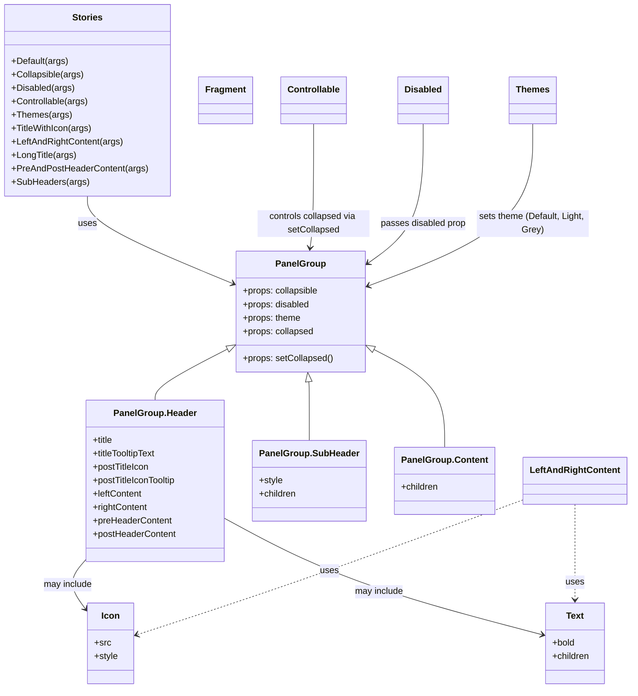

# Diagram: web/portal/src/components/molecules/PanelGroup.molecule.stories.js

> Auto-generated by Obscura crawlers

## Mermaid

### SVG

<svg id="container" width="1100.59765625" xmlns="http://www.w3.org/2000/svg" class="classDiagram" height="1228" viewBox="0 0 1100.59765625 1228" role="graphics-document document" aria-roledescription="class"><g><defs><marker id="container_class-aggregationStart" class="marker aggregation class" refX="18" refY="7" markerWidth="190" markerHeight="240" orient="auto"><path d="M 18,7 L9,13 L1,7 L9,1 Z"></path></marker></defs><defs><marker id="container_class-aggregationEnd" class="marker aggregation class" refX="1" refY="7" markerWidth="20" markerHeight="28" orient="auto"><path d="M 18,7 L9,13 L1,7 L9,1 Z"></path></marker></defs><defs><marker id="container_class-extensionStart" class="marker extension class" refX="18" refY="7" markerWidth="190" markerHeight="240" orient="auto"><path d="M 1,7 L18,13 V 1 Z"></path></marker></defs><defs><marker id="container_class-extensionEnd" class="marker extension class" refX="1" refY="7" markerWidth="20" markerHeight="28" orient="auto"><path d="M 1,1 V 13 L18,7 Z"></path></marker></defs><defs><marker id="container_class-compositionStart" class="marker composition class" refX="18" refY="7" markerWidth="190" markerHeight="240" orient="auto"><path d="M 18,7 L9,13 L1,7 L9,1 Z"></path></marker></defs><defs><marker id="container_class-compositionEnd" class="marker composition class" refX="1" refY="7" markerWidth="20" markerHeight="28" orient="auto"><path d="M 18,7 L9,13 L1,7 L9,1 Z"></path></marker></defs><defs><marker id="container_class-dependencyStart" class="marker dependency class" refX="6" refY="7" markerWidth="190" markerHeight="240" orient="auto"><path d="M 5,7 L9,13 L1,7 L9,1 Z"></path></marker></defs><defs><marker id="container_class-dependencyEnd" class="marker dependency class" refX="13" refY="7" markerWidth="20" markerHeight="28" orient="auto"><path d="M 18,7 L9,13 L14,7 L9,1 Z"></path></marker></defs><defs><marker id="container_class-lollipopStart" class="marker lollipop class" refX="13" refY="7" markerWidth="190" markerHeight="240" orient="auto"><circle stroke="black" fill="transparent" cx="7" cy="7" r="6"></circle></marker></defs><defs><marker id="container_class-lollipopEnd" class="marker lollipop class" refX="1" refY="7" markerWidth="190" markerHeight="240" orient="auto"><circle stroke="black" fill="transparent" cx="7" cy="7" r="6"></circle></marker></defs><g class="root"><g class="clusters"></g><g class="edgePaths"><path d="M402.052,624.064L381.539,634.886C361.025,645.709,319.999,667.355,299.486,682.344C278.973,697.333,278.973,705.667,278.973,709.833L278.973,714" id="id_PanelGroup_PanelGroup.Header_1" class="edge-thickness-normal edge-pattern-solid relation" style=";;;" data-edge="true" data-et="edge" data-id="id_PanelGroup_PanelGroup.Header_1" data-points="W3sieCI6NDE3LjMwODU5Mzc1LCJ5Ijo2MTYuMDE0MjU2MDUxMDczOX0seyJ4IjoyNzguOTcyNjU2MjUsInkiOjY4OX0seyJ4IjoyNzguOTcyNjU2MjUsInkiOjcxNH1d" marker-start="url(#container_class-extensionStart)"></path><path d="M548.34,681.088L548.523,682.406C548.705,683.725,549.069,686.363,549.251,703.848C549.434,721.333,549.434,753.667,549.434,769.833L549.434,786" id="id_PanelGroup_PanelGroup.SubHeader_2" class="edge-thickness-normal edge-pattern-solid relation" style=";;;" data-edge="true" data-et="edge" data-id="id_PanelGroup_PanelGroup.SubHeader_2" data-points="W3sieCI6NTQ1Ljk3OTY0NjM4MTU3OSwieSI6NjY0fSx7IngiOjU0OS40MzM1OTM3NSwieSI6Njg5fSx7IngiOjU0OS40MzM1OTM3NSwieSI6Nzg2fV0=" marker-start="url(#container_class-extensionStart)"></path><path d="M660.034,624.684L680.163,635.403C700.292,646.122,740.55,667.561,760.68,696.447C780.809,725.333,780.809,761.667,780.809,779.833L780.809,798" id="id_PanelGroup_PanelGroup.Content_3" class="edge-thickness-normal edge-pattern-solid relation" style=";;;" data-edge="true" data-et="edge" data-id="id_PanelGroup_PanelGroup.Content_3" data-points="W3sieCI6NjQ0LjgwODU5Mzc1LCJ5Ijo2MTYuNTc1NTc1NTc1NTc1Nn0seyJ4Ijo3ODAuODA4NTkzNzUsInkiOjY4OX0seyJ4Ijo3ODAuODA4NTkzNzUsInkiOjc5OH1d" marker-start="url(#container_class-extensionStart)"></path><path d="M153.453,350L153.453,358.167C153.453,366.333,153.453,382.667,196.506,408.734C239.558,434.801,325.663,470.601,368.716,488.501L411.768,506.402" id="id_Stories_PanelGroup_4" class="edge-thickness-normal edge-pattern-solid relation" style=";;;" data-edge="true" data-et="edge" data-id="id_Stories_PanelGroup_4" data-points="W3sieCI6MTUzLjQ1MzEyNSwieSI6MzUwfSx7IngiOjE1My40NTMxMjUsInkiOjM5OX0seyJ4Ijo0MTcuMzA4NTkzNzUsInkiOjUwOC43MDUyNjY1MzM1NjM3fV0=" marker-end="url(#container_class-dependencyEnd)"></path><path d="M155.082,997.186L148.879,1004.155C142.676,1011.124,130.27,1025.062,130.093,1040.185C129.915,1055.308,141.968,1071.616,147.994,1079.77L154.02,1087.924" id="id_PanelGroup.Header_Icon_5" class="edge-thickness-normal edge-pattern-solid relation" style=";;;" data-edge="true" data-et="edge" data-id="id_PanelGroup.Header_Icon_5" data-points="W3sieCI6MTU1LjA4MjAzMTI1LCJ5Ijo5OTcuMTg2MjA4OTAzMTEzMn0seyJ4IjoxMTcuODYzMjgxMjUsInkiOjEwMzl9LHsieCI6MTU3LjU4NTkzNzUsInkiOjEwOTIuNzQ5NDQyMzQzMTI4N31d" marker-end="url(#container_class-dependencyEnd)"></path><path d="M402.863,927.578L435.93,946.148C468.996,964.719,535.129,1001.859,625.464,1035.925C715.799,1069.991,830.335,1100.982,887.604,1116.477L944.872,1131.973" id="id_PanelGroup.Header_Text_6" class="edge-thickness-normal edge-pattern-solid relation" style=";;;" data-edge="true" data-et="edge" data-id="id_PanelGroup.Header_Text_6" data-points="W3sieCI6NDAyLjg2MzI4MTI1LCJ5Ijo5MjcuNTc3OTIxNjA1NzAxNH0seyJ4Ijo2MDEuMjYxNzE4NzUsInkiOjEwMzl9LHsieCI6OTUwLjY2NDA2MjUsInkiOjExMzMuNTQwMDE4MjI5NzcyNn1d" marker-end="url(#container_class-dependencyEnd)"></path><path d="M915.613,891.134L849.796,915.779C783.978,940.423,652.342,989.711,540.563,1029.9C428.783,1070.089,336.858,1101.179,290.896,1116.723L244.934,1132.268" id="id_LeftAndRightContent_Icon_7" class="edge-thickness-normal edge-pattern-dashed relation" style=";;;" data-edge="true" data-et="edge" data-id="id_LeftAndRightContent_Icon_7" data-points="W3sieCI6OTE1LjYxMzI4MTI1LCJ5Ijo4OTEuMTM0MzM1MzUzNTM1M30seyJ4Ijo1MjAuNzA3MDMxMjUsInkiOjEwMzl9LHsieCI6MjM5LjI1LCJ5IjoxMTM0LjE5MDM3NDAzMzQwMzd9XQ==" marker-end="url(#container_class-dependencyEnd)"></path><path d="M1004.105,900L1004.105,923.167C1004.105,946.333,1004.105,992.667,1004.105,1021C1004.105,1049.333,1004.105,1059.667,1004.105,1064.833L1004.105,1070" id="id_LeftAndRightContent_Text_8" class="edge-thickness-normal edge-pattern-dashed relation" style=";;;" data-edge="true" data-et="edge" data-id="id_LeftAndRightContent_Text_8" data-points="W3sieCI6MTAwNC4xMDU0Njg3NSwieSI6OTAwfSx7IngiOjEwMDQuMTA1NDY4NzUsInkiOjEwMzl9LHsieCI6MTAwNC4xMDU0Njg3NSwieSI6MTA3Nn1d" marker-end="url(#container_class-dependencyEnd)"></path><path d="M548.273,221L548.273,250.667C548.273,280.333,548.273,339.667,547.487,376.506C546.7,413.345,545.128,427.69,544.341,434.863L543.555,442.036" id="id_Controllable_PanelGroup_9" class="edge-thickness-normal edge-pattern-solid relation" style=";;;" data-edge="true" data-et="edge" data-id="id_Controllable_PanelGroup_9" data-points="W3sieCI6NTQ4LjI3MzQzNzUsInkiOjIyMX0seyJ4Ijo1NDguMjczNDM3NSwieSI6Mzk5fSx7IngiOjU0Mi45MDA2NTE4NzEwMTkxLCJ5Ijo0NDh9XQ==" marker-end="url(#container_class-dependencyEnd)"></path><path d="M745.219,221L745.219,250.667C745.219,280.333,745.219,339.667,729.29,381.01C713.362,422.354,681.505,445.709,665.576,457.386L649.648,469.063" id="id_Disabled_PanelGroup_10" class="edge-thickness-normal edge-pattern-solid relation" style=";;;" data-edge="true" data-et="edge" data-id="id_Disabled_PanelGroup_10" data-points="W3sieCI6NzQ1LjIxODc1LCJ5IjoyMjF9LHsieCI6NzQ1LjIxODc1LCJ5IjozOTl9LHsieCI6NjQ0LjgwODU5Mzc1LCJ5Ijo0NzIuNjEwMzA1NTE3NTU1ODR9XQ==" marker-end="url(#container_class-dependencyEnd)"></path><path d="M942.164,221L942.164,250.667C942.164,280.333,942.164,339.667,893.539,387.903C844.914,436.14,747.664,473.279,699.039,491.849L650.414,510.419" id="id_Themes_PanelGroup_11" class="edge-thickness-normal edge-pattern-solid relation" style=";;;" data-edge="true" data-et="edge" data-id="id_Themes_PanelGroup_11" data-points="W3sieCI6OTQyLjE2NDA2MjUsInkiOjIyMX0seyJ4Ijo5NDIuMTY0MDYyNSwieSI6Mzk5fSx7IngiOjY0NC44MDg1OTM3NSwieSI6NTEyLjU1OTIwMTA4NzAwODJ9XQ==" marker-end="url(#container_class-dependencyEnd)"></path></g><g class="edgeLabels"><g class="edgeLabel"><g class="label" data-id="id_PanelGroup_PanelGroup.Header_1" transform="translate(0, 0)"><foreignObject width="0" height="0">

</foreignObject></g></g><g class="edgeLabel"><g class="label" data-id="id_PanelGroup_PanelGroup.SubHeader_2" transform="translate(0, 0)"><foreignObject width="0" height="0">

</foreignObject></g></g><g class="edgeLabel"><g class="label" data-id="id_PanelGroup_PanelGroup.Content_3" transform="translate(0, 0)"><foreignObject width="0" height="0">

</foreignObject></g></g><g class="edgeLabel" transform="translate(153.453125, 399)"><g class="label" data-id="id_Stories_PanelGroup_4" transform="translate(-16.4921875, -12)"><foreignObject width="32.984375" height="24">

uses

</foreignObject></g></g><g class="edgeLabel" transform="translate(121.08936, 1043.36527)"><g class="label" data-id="id_PanelGroup.Header_Icon_5" transform="translate(-44.0625, -12)"><foreignObject width="88.125" height="24">

may include

</foreignObject></g></g><g class="edgeLabel" transform="translate(666.13946, 1056.55438)"><g class="label" data-id="id_PanelGroup.Header_Text_6" transform="translate(-44.0625, -12)"><foreignObject width="88.125" height="24">

may include

</foreignObject></g></g><g class="edgeLabel" transform="translate(579.03395, 1017.16051)"><g class="label" data-id="id_LeftAndRightContent_Icon_7" transform="translate(-16.4921875, -12)"><foreignObject width="32.984375" height="24">

uses

</foreignObject></g></g><g class="edgeLabel" transform="translate(1004.10546875, 1039)"><g class="label" data-id="id_LeftAndRightContent_Text_8" transform="translate(-16.4921875, -12)"><foreignObject width="32.984375" height="24">

uses

</foreignObject></g></g><g class="edgeLabel" transform="translate(548.2734375, 399)"><g class="label" data-id="id_Controllable_PanelGroup_9" transform="translate(-100, -24)"><foreignObject width="200" height="48">

controls collapsed via setCollapsed

</foreignObject></g></g><g class="edgeLabel" transform="translate(745.21875, 399)"><g class="label" data-id="id_Disabled_PanelGroup_10" transform="translate(-76.9453125, -12)"><foreignObject width="153.890625" height="24">

passes disabled prop

</foreignObject></g></g><g class="edgeLabel" transform="translate(942.1640625, 399)"><g class="label" data-id="id_Themes_PanelGroup_11" transform="translate(-100, -24)"><foreignObject width="200" height="48">

sets theme (Default, Light, Grey)

</foreignObject></g></g></g><g class="nodes"><g class="node default" id="classId-PanelGroup-0" transform="translate(531.05859375, 556)"><g class="basic label-container"><path d="M-113.75 -108 L113.75 -108 L113.75 108 L-113.75 108" stroke="none" stroke-width="0" fill="#ECECFF" style=""></path><path d="M-113.75 -108 C-40.09130035102844 -108, 33.567399297943126 -108, 113.75 -108 M-113.75 -108 C-31.208120335456385 -108, 51.33375932908723 -108, 113.75 -108 M113.75 -108 C113.75 -30.88321508434312, 113.75 46.23356983131376, 113.75 108 M113.75 -108 C113.75 -31.3312989633138, 113.75 45.3374020733724, 113.75 108 M113.75 108 C60.04858822674461 108, 6.347176453489226 108, -113.75 108 M113.75 108 C66.93517638434393 108, 20.120352768687866 108, -113.75 108 M-113.75 108 C-113.75 39.69895692274528, -113.75 -28.602086154509436, -113.75 -108 M-113.75 108 C-113.75 59.963071976684624, -113.75 11.926143953369248, -113.75 -108" stroke="#9370DB" stroke-width="1.3" fill="none" stroke-dasharray="0 0" style=""></path></g><g class="annotation-group text" transform="translate(0, -84)"></g><g class="label-group text" transform="translate(-42.328125, -84)"><g class="label" style="font-weight: bolder" transform="translate(0,-12)"><foreignObject width="84.65625" height="24">

PanelGroup

</foreignObject></g></g><g class="members-group text" transform="translate(-101.75, -36)"><g class="label" style="" transform="translate(0,-12)"><foreignObject width="136.578125" height="24">

+props: collapsible

</foreignObject></g><g class="label" style="" transform="translate(0,12)"><foreignObject width="120.09375" height="24">

+props: disabled

</foreignObject></g><g class="label" style="" transform="translate(0,36)"><foreignObject width="103.890625" height="24">

+props: theme

</foreignObject></g><g class="label" style="" transform="translate(0,60)"><foreignObject width="127.53125" height="24">

+props: collapsed

</foreignObject></g></g><g class="methods-group text" transform="translate(-101.75, 84)"><g class="label" style="" transform="translate(0,-12)"><foreignObject width="161.171875" height="24">

+props: setCollapsed()

</foreignObject></g></g><g class="divider" style=""><path d="M-113.75 -60 C-23.09159805061597 -60, 67.56680389876806 -60, 113.75 -60 M-113.75 -60 C-67.64054365617613 -60, -21.53108731235227 -60, 113.75 -60" stroke="#9370DB" stroke-width="1.3" fill="none" stroke-dasharray="0 0" style=""></path></g><g class="divider" style=""><path d="M-113.75 60 C-60.756153731202616 60, -7.762307462405232 60, 113.75 60 M-113.75 60 C-49.86237449523381 60, 14.025251009532383 60, 113.75 60" stroke="#9370DB" stroke-width="1.3" fill="none" stroke-dasharray="0 0" style=""></path></g></g><g class="node default" id="classId-PanelGroup.Header-1" transform="translate(278.97265625, 858)"><g class="basic label-container"><path d="M-123.890625 -144 L123.890625 -144 L123.890625 144 L-123.890625 144" stroke="none" stroke-width="0" fill="#ECECFF" style=""></path><path d="M-123.890625 -144 C-31.729518252093442 -144, 60.431588495813116 -144, 123.890625 -144 M-123.890625 -144 C-63.64058417274643 -144, -3.3905433454928584 -144, 123.890625 -144 M123.890625 -144 C123.890625 -38.17115345239014, 123.890625 67.65769309521971, 123.890625 144 M123.890625 -144 C123.890625 -52.16630056479153, 123.890625 39.667398870416946, 123.890625 144 M123.890625 144 C26.677210235062944 144, -70.53620452987411 144, -123.890625 144 M123.890625 144 C73.93831274694625 144, 23.98600049389252 144, -123.890625 144 M-123.890625 144 C-123.890625 40.26581009802506, -123.890625 -63.46837980394989, -123.890625 -144 M-123.890625 144 C-123.890625 57.4806307432912, -123.890625 -29.0387385134176, -123.890625 -144" stroke="#9370DB" stroke-width="1.3" fill="none" stroke-dasharray="0 0" style=""></path></g><g class="annotation-group text" transform="translate(0, -120)"></g><g class="label-group text" transform="translate(-70.640625, -120)"><g class="label" style="font-weight: bolder" transform="translate(0,-12)"><foreignObject width="141.28125" height="24">

PanelGroup.Header

</foreignObject></g></g><g class="members-group text" transform="translate(-111.890625, -72)"><g class="label" style="" transform="translate(0,-12)"><foreignObject width="37.140625" height="24">

+title

</foreignObject></g><g class="label" style="" transform="translate(0,12)"><foreignObject width="117.203125" height="24">

+titleTooltipText

</foreignObject></g><g class="label" style="" transform="translate(0,36)"><foreignObject width="102.578125" height="24">

+postTitleIcon

</foreignObject></g><g class="label" style="" transform="translate(0,60)"><foreignObject width="153.140625" height="24">

+postTitleIconTooltip

</foreignObject></g><g class="label" style="" transform="translate(0,84)"><foreignObject width="89.21875" height="24">

+leftContent

</foreignObject></g><g class="label" style="" transform="translate(0,108)"><foreignObject width="98.921875" height="24">

+rightContent

</foreignObject></g><g class="label" style="" transform="translate(0,132)"><foreignObject width="141.28125" height="24">

+preHeaderContent

</foreignObject></g><g class="label" style="" transform="translate(0,156)"><foreignObject width="149.46875" height="24">

+postHeaderContent

</foreignObject></g></g><g class="methods-group text" transform="translate(-111.890625, 144)"></g><g class="divider" style=""><path d="M-123.890625 -96 C-32.103535421808985 -96, 59.68355415638203 -96, 123.890625 -96 M-123.890625 -96 C-43.28676714846361 -96, 37.31709070307278 -96, 123.890625 -96" stroke="#9370DB" stroke-width="1.3" fill="none" stroke-dasharray="0 0" style=""></path></g><g class="divider" style=""><path d="M-123.890625 120 C-28.00083706836729 120, 67.88895086326542 120, 123.890625 120 M-123.890625 120 C-43.00452125557767 120, 37.88158248884466 120, 123.890625 120" stroke="#9370DB" stroke-width="1.3" fill="none" stroke-dasharray="0 0" style=""></path></g></g><g class="node default" id="classId-PanelGroup.SubHeader-2" transform="translate(549.43359375, 858)"><g class="basic label-container"><path d="M-96.5703125 -72 L96.5703125 -72 L96.5703125 72 L-96.5703125 72" stroke="none" stroke-width="0" fill="#ECECFF" style=""></path><path d="M-96.5703125 -72 C-26.41744697942741 -72, 43.73541854114518 -72, 96.5703125 -72 M-96.5703125 -72 C-33.72281588681128 -72, 29.124680726377434 -72, 96.5703125 -72 M96.5703125 -72 C96.5703125 -40.076886876282934, 96.5703125 -8.153773752565868, 96.5703125 72 M96.5703125 -72 C96.5703125 -20.817072707948235, 96.5703125 30.36585458410353, 96.5703125 72 M96.5703125 72 C41.00352838822867 72, -14.563255723542653 72, -96.5703125 72 M96.5703125 72 C39.72207698734672 72, -17.126158525306565 72, -96.5703125 72 M-96.5703125 72 C-96.5703125 33.31341878838866, -96.5703125 -5.373162423222681, -96.5703125 -72 M-96.5703125 72 C-96.5703125 33.40883123613981, -96.5703125 -5.182337527720378, -96.5703125 -72" stroke="#9370DB" stroke-width="1.3" fill="none" stroke-dasharray="0 0" style=""></path></g><g class="annotation-group text" transform="translate(0, -48)"></g><g class="label-group text" transform="translate(-84.5703125, -48)"><g class="label" style="font-weight: bolder" transform="translate(0,-12)"><foreignObject width="169.140625" height="24">

PanelGroup.SubHeader

</foreignObject></g></g><g class="members-group text" transform="translate(-84.5703125, 0)"><g class="label" style="" transform="translate(0,-12)"><foreignObject width="42.359375" height="24">

+style

</foreignObject></g><g class="label" style="" transform="translate(0,12)"><foreignObject width="67.5" height="24">

+children

</foreignObject></g></g><g class="methods-group text" transform="translate(-84.5703125, 72)"></g><g class="divider" style=""><path d="M-96.5703125 -24 C-34.566244093266555 -24, 27.43782431346689 -24, 96.5703125 -24 M-96.5703125 -24 C-31.851472330658822 -24, 32.867367838682355 -24, 96.5703125 -24" stroke="#9370DB" stroke-width="1.3" fill="none" stroke-dasharray="0 0" style=""></path></g><g class="divider" style=""><path d="M-96.5703125 48 C-23.62486648484699 48, 49.32057953030602 48, 96.5703125 48 M-96.5703125 48 C-48.188672652270775 48, 0.19296719545845065 48, 96.5703125 48" stroke="#9370DB" stroke-width="1.3" fill="none" stroke-dasharray="0 0" style=""></path></g></g><g class="node default" id="classId-PanelGroup.Content-3" transform="translate(780.80859375, 858)"><g class="basic label-container"><path d="M-84.8046875 -60 L84.8046875 -60 L84.8046875 60 L-84.8046875 60" stroke="none" stroke-width="0" fill="#ECECFF" style=""></path><path d="M-84.8046875 -60 C-36.26799613817035 -60, 12.268695223659293 -60, 84.8046875 -60 M-84.8046875 -60 C-17.44510127062817 -60, 49.91448495874366 -60, 84.8046875 -60 M84.8046875 -60 C84.8046875 -32.19476108993713, 84.8046875 -4.38952217987427, 84.8046875 60 M84.8046875 -60 C84.8046875 -28.287736635167853, 84.8046875 3.4245267296642936, 84.8046875 60 M84.8046875 60 C31.420756102567857 60, -21.963175294864286 60, -84.8046875 60 M84.8046875 60 C23.49588462997677 60, -37.81291824004646 60, -84.8046875 60 M-84.8046875 60 C-84.8046875 32.770506387179275, -84.8046875 5.541012774358549, -84.8046875 -60 M-84.8046875 60 C-84.8046875 18.190915049727067, -84.8046875 -23.618169900545865, -84.8046875 -60" stroke="#9370DB" stroke-width="1.3" fill="none" stroke-dasharray="0 0" style=""></path></g><g class="annotation-group text" transform="translate(0, -36)"></g><g class="label-group text" transform="translate(-72.8046875, -36)"><g class="label" style="font-weight: bolder" transform="translate(0,-12)"><foreignObject width="145.609375" height="24">

PanelGroup.Content

</foreignObject></g></g><g class="members-group text" transform="translate(-72.8046875, 12)"><g class="label" style="" transform="translate(0,-12)"><foreignObject width="67.5" height="24">

+children

</foreignObject></g></g><g class="methods-group text" transform="translate(-72.8046875, 60)"></g><g class="divider" style=""><path d="M-84.8046875 -12 C-48.54777018723772 -12, -12.290852874475434 -12, 84.8046875 -12 M-84.8046875 -12 C-49.783355446003696 -12, -14.762023392007393 -12, 84.8046875 -12" stroke="#9370DB" stroke-width="1.3" fill="none" stroke-dasharray="0 0" style=""></path></g><g class="divider" style=""><path d="M-84.8046875 36 C-21.812866750542398 36, 41.178953998915205 36, 84.8046875 36 M-84.8046875 36 C-47.63189132716307 36, -10.459095154326135 36, 84.8046875 36" stroke="#9370DB" stroke-width="1.3" fill="none" stroke-dasharray="0 0" style=""></path></g></g><g class="node default" id="classId-Stories-4" transform="translate(153.453125, 179)"><g class="basic label-container"><path d="M-145.453125 -171 L145.453125 -171 L145.453125 171 L-145.453125 171" stroke="none" stroke-width="0" fill="#ECECFF" style=""></path><path d="M-145.453125 -171 C-40.588859972784405 -171, 64.27540505443119 -171, 145.453125 -171 M-145.453125 -171 C-37.95796686057979 -171, 69.53719127884042 -171, 145.453125 -171 M145.453125 -171 C145.453125 -51.44799857149897, 145.453125 68.10400285700206, 145.453125 171 M145.453125 -171 C145.453125 -65.50135413129885, 145.453125 39.99729173740229, 145.453125 171 M145.453125 171 C62.845825619962824 171, -19.761473760074352 171, -145.453125 171 M145.453125 171 C77.89305412861404 171, 10.33298325722808 171, -145.453125 171 M-145.453125 171 C-145.453125 38.99142339659295, -145.453125 -93.0171532068141, -145.453125 -171 M-145.453125 171 C-145.453125 74.54273654931792, -145.453125 -21.914526901364155, -145.453125 -171" stroke="#9370DB" stroke-width="1.3" fill="none" stroke-dasharray="0 0" style=""></path></g><g class="annotation-group text" transform="translate(0, -147)"></g><g class="label-group text" transform="translate(-25.9375, -147)"><g class="label" style="font-weight: bolder" transform="translate(0,-12)"><foreignObject width="51.875" height="24">

Stories

</foreignObject></g></g><g class="members-group text" transform="translate(-133.453125, -99)"></g><g class="methods-group text" transform="translate(-133.453125, -69)"><g class="label" style="" transform="translate(0,-12)"><foreignObject width="101.1875" height="24">

+Default(args)

</foreignObject></g><g class="label" style="" transform="translate(0,12)"><foreignObject width="128.984375" height="24">

+Collapsible(args)

</foreignObject></g><g class="label" style="" transform="translate(0,36)"><foreignObject width="111.90625" height="24">

+Disabled(args)

</foreignObject></g><g class="label" style="" transform="translate(0,60)"><foreignObject width="137.6875" height="24">

+Controllable(args)

</foreignObject></g><g class="label" style="" transform="translate(0,84)"><foreignObject width="104.15625" height="24">

+Themes(args)

</foreignObject></g><g class="label" style="" transform="translate(0,108)"><foreignObject width="143.25" height="24">

+TitleWithIcon(args)

</foreignObject></g><g class="label" style="" transform="translate(0,132)"><foreignObject width="198.640625" height="24">

+LeftAndRightContent(args)

</foreignObject></g><g class="label" style="" transform="translate(0,156)"><foreignObject width="115.015625" height="24">

+LongTitle(args)

</foreignObject></g><g class="label" style="" transform="translate(0,180)"><foreignObject width="240.96875" height="24">

+PreAndPostHeaderContent(args)

</foreignObject></g><g class="label" style="" transform="translate(0,204)"><foreignObject width="135.421875" height="24">

+SubHeaders(args)

</foreignObject></g></g><g class="divider" style=""><path d="M-145.453125 -123 C-60.512545575665854 -123, 24.428033848668292 -123, 145.453125 -123 M-145.453125 -123 C-83.87664847199065 -123, -22.30017194398131 -123, 145.453125 -123" stroke="#9370DB" stroke-width="1.3" fill="none" stroke-dasharray="0 0" style=""></path></g><g class="divider" style=""><path d="M-145.453125 -99 C-81.78720503029909 -99, -18.121285060598183 -99, 145.453125 -99 M-145.453125 -99 C-62.817914930715276 -99, 19.81729513856945 -99, 145.453125 -99" stroke="#9370DB" stroke-width="1.3" fill="none" stroke-dasharray="0 0" style=""></path></g></g><g class="node default" id="classId-Icon-5" transform="translate(198.41796875, 1148)"><g class="basic label-container"><path d="M-40.83203125 -72 L40.83203125 -72 L40.83203125 72 L-40.83203125 72" stroke="none" stroke-width="0" fill="#ECECFF" style=""></path><path d="M-40.83203125 -72 C-12.810684092641832 -72, 15.210663064716336 -72, 40.83203125 -72 M-40.83203125 -72 C-13.40144186724363 -72, 14.02914751551274 -72, 40.83203125 -72 M40.83203125 -72 C40.83203125 -41.69461655723193, 40.83203125 -11.389233114463863, 40.83203125 72 M40.83203125 -72 C40.83203125 -31.12675107565839, 40.83203125 9.74649784868322, 40.83203125 72 M40.83203125 72 C8.956692352628359 72, -22.918646544743282 72, -40.83203125 72 M40.83203125 72 C11.49431303667032 72, -17.84340517665936 72, -40.83203125 72 M-40.83203125 72 C-40.83203125 30.546553705909275, -40.83203125 -10.90689258818145, -40.83203125 -72 M-40.83203125 72 C-40.83203125 14.956332107526329, -40.83203125 -42.08733578494734, -40.83203125 -72" stroke="#9370DB" stroke-width="1.3" fill="none" stroke-dasharray="0 0" style=""></path></g><g class="annotation-group text" transform="translate(0, -48)"></g><g class="label-group text" transform="translate(-15.3046875, -48)"><g class="label" style="font-weight: bolder" transform="translate(0,-12)"><foreignObject width="30.609375" height="24">

Icon

</foreignObject></g></g><g class="members-group text" transform="translate(-28.83203125, 0)"><g class="label" style="" transform="translate(0,-12)"><foreignObject width="28.8125" height="24">

+src

</foreignObject></g><g class="label" style="" transform="translate(0,12)"><foreignObject width="42.359375" height="24">

+style

</foreignObject></g></g><g class="methods-group text" transform="translate(-28.83203125, 72)"></g><g class="divider" style=""><path d="M-40.83203125 -24 C-18.18113909787085 -24, 4.469753054258298 -24, 40.83203125 -24 M-40.83203125 -24 C-10.524078208290291 -24, 19.783874833419418 -24, 40.83203125 -24" stroke="#9370DB" stroke-width="1.3" fill="none" stroke-dasharray="0 0" style=""></path></g><g class="divider" style=""><path d="M-40.83203125 48 C-8.388108486883915 48, 24.05581427623217 48, 40.83203125 48 M-40.83203125 48 C-22.587141769629117 48, -4.342252289258234 48, 40.83203125 48" stroke="#9370DB" stroke-width="1.3" fill="none" stroke-dasharray="0 0" style=""></path></g></g><g class="node default" id="classId-Text-6" transform="translate(1004.10546875, 1148)"><g class="basic label-container"><path d="M-53.44140625 -72 L53.44140625 -72 L53.44140625 72 L-53.44140625 72" stroke="none" stroke-width="0" fill="#ECECFF" style=""></path><path d="M-53.44140625 -72 C-29.80334920235355 -72, -6.165292154707103 -72, 53.44140625 -72 M-53.44140625 -72 C-26.095543056474487 -72, 1.2503201370510268 -72, 53.44140625 -72 M53.44140625 -72 C53.44140625 -19.844955970121774, 53.44140625 32.31008805975645, 53.44140625 72 M53.44140625 -72 C53.44140625 -25.235783035023296, 53.44140625 21.528433929953408, 53.44140625 72 M53.44140625 72 C10.78289897782711 72, -31.87560829434578 72, -53.44140625 72 M53.44140625 72 C11.67288637566812 72, -30.09563349866376 72, -53.44140625 72 M-53.44140625 72 C-53.44140625 21.067569771227305, -53.44140625 -29.86486045754539, -53.44140625 -72 M-53.44140625 72 C-53.44140625 31.747329440425645, -53.44140625 -8.50534111914871, -53.44140625 -72" stroke="#9370DB" stroke-width="1.3" fill="none" stroke-dasharray="0 0" style=""></path></g><g class="annotation-group text" transform="translate(0, -48)"></g><g class="label-group text" transform="translate(-15.3828125, -48)"><g class="label" style="font-weight: bolder" transform="translate(0,-12)"><foreignObject width="30.765625" height="24">

Text

</foreignObject></g></g><g class="members-group text" transform="translate(-41.44140625, 0)"><g class="label" style="" transform="translate(0,-12)"><foreignObject width="41.015625" height="24">

+bold

</foreignObject></g><g class="label" style="" transform="translate(0,12)"><foreignObject width="67.5" height="24">

+children

</foreignObject></g></g><g class="methods-group text" transform="translate(-41.44140625, 72)"></g><g class="divider" style=""><path d="M-53.44140625 -24 C-27.341041428502322 -24, -1.2406766070046444 -24, 53.44140625 -24 M-53.44140625 -24 C-27.842964922873584 -24, -2.244523595747168 -24, 53.44140625 -24" stroke="#9370DB" stroke-width="1.3" fill="none" stroke-dasharray="0 0" style=""></path></g><g class="divider" style=""><path d="M-53.44140625 48 C-12.337253994963746 48, 28.76689826007251 48, 53.44140625 48 M-53.44140625 48 C-17.840499882815678 48, 17.760406484368644 48, 53.44140625 48" stroke="#9370DB" stroke-width="1.3" fill="none" stroke-dasharray="0 0" style=""></path></g></g><g class="node default" id="classId-Fragment-7" transform="translate(395.046875, 179)"><g class="basic label-container"><path d="M-46.140625 -42 L46.140625 -42 L46.140625 42 L-46.140625 42" stroke="none" stroke-width="0" fill="#ECECFF" style=""></path><path d="M-46.140625 -42 C-18.303087200163187 -42, 9.534450599673626 -42, 46.140625 -42 M-46.140625 -42 C-26.871781905284053 -42, -7.602938810568105 -42, 46.140625 -42 M46.140625 -42 C46.140625 -8.81512998416212, 46.140625 24.36974003167576, 46.140625 42 M46.140625 -42 C46.140625 -17.994872840163815, 46.140625 6.01025431967237, 46.140625 42 M46.140625 42 C12.005189767004971 42, -22.130245465990058 42, -46.140625 42 M46.140625 42 C11.962336577990008 42, -22.215951844019983 42, -46.140625 42 M-46.140625 42 C-46.140625 21.95007685072897, -46.140625 1.9001537014579384, -46.140625 -42 M-46.140625 42 C-46.140625 16.30864361339681, -46.140625 -9.382712773206379, -46.140625 -42" stroke="#9370DB" stroke-width="1.3" fill="none" stroke-dasharray="0 0" style=""></path></g><g class="annotation-group text" transform="translate(0, -18)"></g><g class="label-group text" transform="translate(-34.140625, -18)"><g class="label" style="font-weight: bolder" transform="translate(0,-12)"><foreignObject width="68.28125" height="24">

Fragment

</foreignObject></g></g><g class="members-group text" transform="translate(-34.140625, 30)"></g><g class="methods-group text" transform="translate(-34.140625, 60)"></g><g class="divider" style=""><path d="M-46.140625 6 C-16.462243191452078 6, 13.216138617095844 6, 46.140625 6 M-46.140625 6 C-19.654260367791526 6, 6.832104264416948 6, 46.140625 6" stroke="#9370DB" stroke-width="1.3" fill="none" stroke-dasharray="0 0" style=""></path></g><g class="divider" style=""><path d="M-46.140625 24 C-13.081490779721513 24, 19.977643440556974 24, 46.140625 24 M-46.140625 24 C-18.790205581905948 24, 8.560213836188105 24, 46.140625 24" stroke="#9370DB" stroke-width="1.3" fill="none" stroke-dasharray="0 0" style=""></path></g></g><g class="node default" id="classId-LeftAndRightContent-8" transform="translate(1004.10546875, 858)"><g class="basic label-container"><path d="M-88.4921875 -42 L88.4921875 -42 L88.4921875 42 L-88.4921875 42" stroke="none" stroke-width="0" fill="#ECECFF" style=""></path><path d="M-88.4921875 -42 C-40.57015882460011 -42, 7.351869850799787 -42, 88.4921875 -42 M-88.4921875 -42 C-28.338148029156734 -42, 31.81589144168653 -42, 88.4921875 -42 M88.4921875 -42 C88.4921875 -17.62393583195706, 88.4921875 6.752128336085882, 88.4921875 42 M88.4921875 -42 C88.4921875 -20.26853408782539, 88.4921875 1.4629318243492193, 88.4921875 42 M88.4921875 42 C31.829231007883152 42, -24.833725484233696 42, -88.4921875 42 M88.4921875 42 C51.41002784712925 42, 14.3278681942585 42, -88.4921875 42 M-88.4921875 42 C-88.4921875 9.621917131966555, -88.4921875 -22.75616573606689, -88.4921875 -42 M-88.4921875 42 C-88.4921875 22.65308119926921, -88.4921875 3.3061623985384188, -88.4921875 -42" stroke="#9370DB" stroke-width="1.3" fill="none" stroke-dasharray="0 0" style=""></path></g><g class="annotation-group text" transform="translate(0, -18)"></g><g class="label-group text" transform="translate(-76.4921875, -18)"><g class="label" style="font-weight: bolder" transform="translate(0,-12)"><foreignObject width="152.984375" height="24">

LeftAndRightContent

</foreignObject></g></g><g class="members-group text" transform="translate(-76.4921875, 30)"></g><g class="methods-group text" transform="translate(-76.4921875, 60)"></g><g class="divider" style=""><path d="M-88.4921875 6 C-33.56036385333476 6, 21.371459793330473 6, 88.4921875 6 M-88.4921875 6 C-19.447243739548426 6, 49.59770002090315 6, 88.4921875 6" stroke="#9370DB" stroke-width="1.3" fill="none" stroke-dasharray="0 0" style=""></path></g><g class="divider" style=""><path d="M-88.4921875 24 C-18.06992240050485 24, 52.3523426989903 24, 88.4921875 24 M-88.4921875 24 C-38.7829860680118 24, 10.926215363976397 24, 88.4921875 24" stroke="#9370DB" stroke-width="1.3" fill="none" stroke-dasharray="0 0" style=""></path></g></g><g class="node default" id="classId-Controllable-9" transform="translate(548.2734375, 179)"><g class="basic label-container"><path d="M-57.0859375 -42 L57.0859375 -42 L57.0859375 42 L-57.0859375 42" stroke="none" stroke-width="0" fill="#ECECFF" style=""></path><path d="M-57.0859375 -42 C-14.27277502569838 -42, 28.54038744860324 -42, 57.0859375 -42 M-57.0859375 -42 C-33.76087421340266 -42, -10.435810926805317 -42, 57.0859375 -42 M57.0859375 -42 C57.0859375 -11.5221569005049, 57.0859375 18.9556861989902, 57.0859375 42 M57.0859375 -42 C57.0859375 -12.233989395851726, 57.0859375 17.53202120829655, 57.0859375 42 M57.0859375 42 C23.55208891430415 42, -9.9817596713917 42, -57.0859375 42 M57.0859375 42 C14.300482646222946 42, -28.484972207554108 42, -57.0859375 42 M-57.0859375 42 C-57.0859375 24.81009772612989, -57.0859375 7.620195452259779, -57.0859375 -42 M-57.0859375 42 C-57.0859375 19.016025108886367, -57.0859375 -3.967949782227265, -57.0859375 -42" stroke="#9370DB" stroke-width="1.3" fill="none" stroke-dasharray="0 0" style=""></path></g><g class="annotation-group text" transform="translate(0, -18)"></g><g class="label-group text" transform="translate(-45.0859375, -18)"><g class="label" style="font-weight: bolder" transform="translate(0,-12)"><foreignObject width="90.171875" height="24">

Controllable

</foreignObject></g></g><g class="members-group text" transform="translate(-45.0859375, 30)"></g><g class="methods-group text" transform="translate(-45.0859375, 60)"></g><g class="divider" style=""><path d="M-57.0859375 6 C-12.362049544123948 6, 32.3618384117521 6, 57.0859375 6 M-57.0859375 6 C-20.655281384501627 6, 15.775374730996745 6, 57.0859375 6" stroke="#9370DB" stroke-width="1.3" fill="none" stroke-dasharray="0 0" style=""></path></g><g class="divider" style=""><path d="M-57.0859375 24 C-27.40564329242273 24, 2.274650915154538 24, 57.0859375 24 M-57.0859375 24 C-19.205122753759277 24, 18.675691992481447 24, 57.0859375 24" stroke="#9370DB" stroke-width="1.3" fill="none" stroke-dasharray="0 0" style=""></path></g></g><g class="node default" id="classId-Disabled-10" transform="translate(745.21875, 179)"><g class="basic label-container"><path d="M-43.9609375 -42 L43.9609375 -42 L43.9609375 42 L-43.9609375 42" stroke="none" stroke-width="0" fill="#ECECFF" style=""></path><path d="M-43.9609375 -42 C-21.46795248417134 -42, 1.0250325316573168 -42, 43.9609375 -42 M-43.9609375 -42 C-20.21249247462273 -42, 3.535952550754537 -42, 43.9609375 -42 M43.9609375 -42 C43.9609375 -21.054195433452325, 43.9609375 -0.10839086690464939, 43.9609375 42 M43.9609375 -42 C43.9609375 -15.743664849048429, 43.9609375 10.512670301903142, 43.9609375 42 M43.9609375 42 C23.9722948826944 42, 3.9836522653887982 42, -43.9609375 42 M43.9609375 42 C15.051170474994173 42, -13.858596550011654 42, -43.9609375 42 M-43.9609375 42 C-43.9609375 22.966865155634473, -43.9609375 3.9337303112689455, -43.9609375 -42 M-43.9609375 42 C-43.9609375 14.480151341507327, -43.9609375 -13.039697316985347, -43.9609375 -42" stroke="#9370DB" stroke-width="1.3" fill="none" stroke-dasharray="0 0" style=""></path></g><g class="annotation-group text" transform="translate(0, -18)"></g><g class="label-group text" transform="translate(-31.9609375, -18)"><g class="label" style="font-weight: bolder" transform="translate(0,-12)"><foreignObject width="63.921875" height="24">

Disabled

</foreignObject></g></g><g class="members-group text" transform="translate(-31.9609375, 30)"></g><g class="methods-group text" transform="translate(-31.9609375, 60)"></g><g class="divider" style=""><path d="M-43.9609375 6 C-19.372726470795232 6, 5.2154845584095355 6, 43.9609375 6 M-43.9609375 6 C-21.339949477824614 6, 1.2810385443507712 6, 43.9609375 6" stroke="#9370DB" stroke-width="1.3" fill="none" stroke-dasharray="0 0" style=""></path></g><g class="divider" style=""><path d="M-43.9609375 24 C-17.82077894902275 24, 8.319379601954502 24, 43.9609375 24 M-43.9609375 24 C-17.324790304035833 24, 9.311356891928334 24, 43.9609375 24" stroke="#9370DB" stroke-width="1.3" fill="none" stroke-dasharray="0 0" style=""></path></g></g><g class="node default" id="classId-Themes-11" transform="translate(942.1640625, 179)"><g class="basic label-container"><path d="M-40.3984375 -42 L40.3984375 -42 L40.3984375 42 L-40.3984375 42" stroke="none" stroke-width="0" fill="#ECECFF" style=""></path><path d="M-40.3984375 -42 C-13.433185504685621 -42, 13.532066490628758 -42, 40.3984375 -42 M-40.3984375 -42 C-16.261385412552173 -42, 7.875666674895655 -42, 40.3984375 -42 M40.3984375 -42 C40.3984375 -15.958045971728094, 40.3984375 10.083908056543812, 40.3984375 42 M40.3984375 -42 C40.3984375 -21.022699434188183, 40.3984375 -0.04539886837636686, 40.3984375 42 M40.3984375 42 C12.412847297104037 42, -15.572742905791927 42, -40.3984375 42 M40.3984375 42 C9.644357194698234 42, -21.109723110603532 42, -40.3984375 42 M-40.3984375 42 C-40.3984375 18.213067100624855, -40.3984375 -5.57386579875029, -40.3984375 -42 M-40.3984375 42 C-40.3984375 16.09826546770441, -40.3984375 -9.803469064591177, -40.3984375 -42" stroke="#9370DB" stroke-width="1.3" fill="none" stroke-dasharray="0 0" style=""></path></g><g class="annotation-group text" transform="translate(0, -18)"></g><g class="label-group text" transform="translate(-28.3984375, -18)"><g class="label" style="font-weight: bolder" transform="translate(0,-12)"><foreignObject width="56.796875" height="24">

Themes

</foreignObject></g></g><g class="members-group text" transform="translate(-28.3984375, 30)"></g><g class="methods-group text" transform="translate(-28.3984375, 60)"></g><g class="divider" style=""><path d="M-40.3984375 6 C-8.349683511642354 6, 23.699070476715292 6, 40.3984375 6 M-40.3984375 6 C-12.45893693168253 6, 15.48056363663494 6, 40.3984375 6" stroke="#9370DB" stroke-width="1.3" fill="none" stroke-dasharray="0 0" style=""></path></g><g class="divider" style=""><path d="M-40.3984375 24 C-23.10257243730831 24, -5.806707374616622 24, 40.3984375 24 M-40.3984375 24 C-16.342389954927032 24, 7.713657590145935 24, 40.3984375 24" stroke="#9370DB" stroke-width="1.3" fill="none" stroke-dasharray="0 0" style=""></path></g></g></g></g></g></svg>
