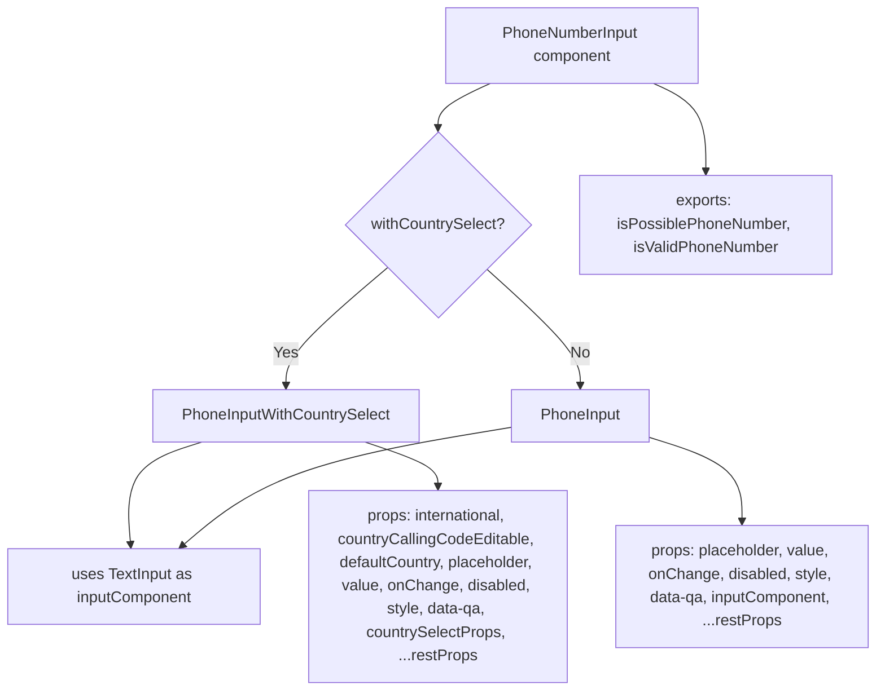
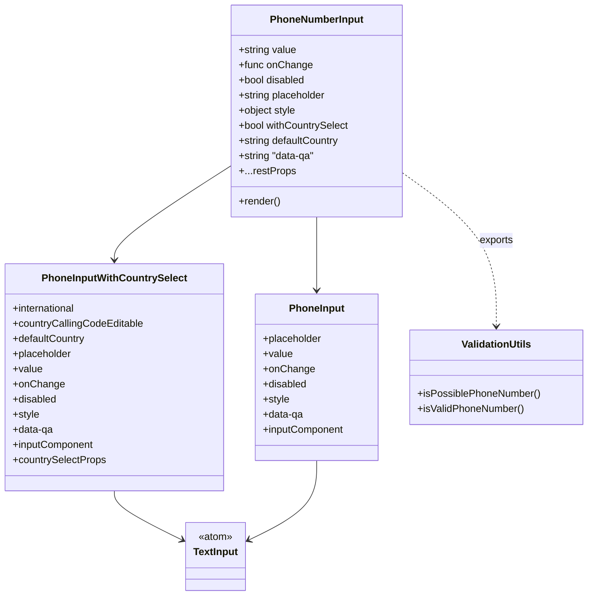

# Diagram: web/portal/src/components/molecules/PhoneInput.molecule.js

> Auto-generated by Obscura crawlers

## Diagram 1

### SVG

<svg id="container" width="903.828125" xmlns="http://www.w3.org/2000/svg" class="flowchart" height="736.703125" viewBox="0 0 903.828125 736.703125" role="graphics-document document" aria-roledescription="flowchart-v2"><g><marker id="container_flowchart-v2-pointEnd" class="marker flowchart-v2" viewBox="0 0 10 10" refX="5" refY="5" markerUnits="userSpaceOnUse" markerWidth="8" markerHeight="8" orient="auto"><path d="M 0 0 L 10 5 L 0 10 z" class="arrowMarkerPath" style="stroke-width: 1; stroke-dasharray: 1, 0;"></path></marker><marker id="container_flowchart-v2-pointStart" class="marker flowchart-v2" viewBox="0 0 10 10" refX="4.5" refY="5" markerUnits="userSpaceOnUse" markerWidth="8" markerHeight="8" orient="auto"><path d="M 0 5 L 10 10 L 10 0 z" class="arrowMarkerPath" style="stroke-width: 1; stroke-dasharray: 1, 0;"></path></marker><marker id="container_flowchart-v2-circleEnd" class="marker flowchart-v2" viewBox="0 0 10 10" refX="11" refY="5" markerUnits="userSpaceOnUse" markerWidth="11" markerHeight="11" orient="auto"><circle cx="5" cy="5" r="5" class="arrowMarkerPath" style="stroke-width: 1; stroke-dasharray: 1, 0;"></circle></marker><marker id="container_flowchart-v2-circleStart" class="marker flowchart-v2" viewBox="0 0 10 10" refX="-1" refY="5" markerUnits="userSpaceOnUse" markerWidth="11" markerHeight="11" orient="auto"><circle cx="5" cy="5" r="5" class="arrowMarkerPath" style="stroke-width: 1; stroke-dasharray: 1, 0;"></circle></marker><marker id="container_flowchart-v2-crossEnd" class="marker cross flowchart-v2" viewBox="0 0 11 11" refX="12" refY="5.2" markerUnits="userSpaceOnUse" markerWidth="11" markerHeight="11" orient="auto"><path d="M 1,1 l 9,9 M 10,1 l -9,9" class="arrowMarkerPath" style="stroke-width: 2; stroke-dasharray: 1, 0;"></path></marker><marker id="container_flowchart-v2-crossStart" class="marker cross flowchart-v2" viewBox="0 0 11 11" refX="-1" refY="5.2" markerUnits="userSpaceOnUse" markerWidth="11" markerHeight="11" orient="auto"><path d="M 1,1 l 9,9 M 10,1 l -9,9" class="arrowMarkerPath" style="stroke-width: 2; stroke-dasharray: 1, 0;"></path></marker><g class="root"><g class="clusters"></g><g class="edgePaths"><path d="M505.889,86L496.893,90.167C487.897,94.333,469.906,102.667,460.91,110.333C451.914,118,451.914,125,451.914,128.5L451.914,132" id="L_A_B_0" class="edge-thickness-normal edge-pattern-solid edge-thickness-normal edge-pattern-solid flowchart-link" style=";" data-edge="true" data-et="edge" data-id="L_A_B_0" data-points="W3sieCI6NTA1Ljg4ODk3NzA1MDc4MTI1LCJ5Ijo4Nn0seyJ4Ijo0NTEuOTE0MDYyNSwieSI6MTExfSx7IngiOjQ1MS45MTQwNjI1LCJ5IjoxMzZ9XQ==" marker-end="url(#container_flowchart-v2-pointEnd)"></path><path d="M399.821,276.61L382.344,291.459C364.866,306.308,329.912,336.005,312.434,356.354C294.957,376.703,294.957,387.703,294.957,393.203L294.957,398.703" id="L_B_C_0" class="edge-thickness-normal edge-pattern-solid edge-thickness-normal edge-pattern-solid flowchart-link" style=";" data-edge="true" data-et="edge" data-id="L_B_C_0" data-points="W3sieCI6Mzk5LjgyMTAyOTMyMTIzNjg0LCJ5IjoyNzYuNjEwMDkxODIxMjM2ODR9LHsieCI6Mjk0Ljk1NzAzMTI1LCJ5IjozNjUuNzAzMTI1fSx7IngiOjI5NC45NTcwMzEyNSwieSI6NDAyLjcwMzEyNX1d" marker-end="url(#container_flowchart-v2-pointEnd)"></path><path d="M502.428,278.189L518.502,292.775C534.576,307.36,566.723,336.532,582.797,356.617C598.871,376.703,598.871,387.703,598.871,393.203L598.871,398.703" id="L_B_D_0" class="edge-thickness-normal edge-pattern-solid edge-thickness-normal edge-pattern-solid flowchart-link" style=";" data-edge="true" data-et="edge" data-id="L_B_D_0" data-points="W3sieCI6NTAyLjQyODE3NDA3OTIwOTU1LCJ5IjoyNzguMTg5MDEzNDIwNzkwNDV9LHsieCI6NTk4Ljg3MTA5Mzc1LCJ5IjozNjUuNzAzMTI1fSx7IngiOjU5OC44NzEwOTM3NSwieSI6NDAyLjcwMzEyNX1d" marker-end="url(#container_flowchart-v2-pointEnd)"></path><path d="M208.268,456.703L194.89,460.87C181.512,465.036,154.756,473.37,142.518,493.038C130.28,512.707,132.559,543.71,133.699,559.212L134.839,574.714" id="L_C_E_0" class="edge-thickness-normal edge-pattern-solid edge-thickness-normal edge-pattern-solid flowchart-link" style=";" data-edge="true" data-et="edge" data-id="L_C_E_0" data-points="W3sieCI6MjA4LjI2NzgwMzQ4NTU3NjksInkiOjQ1Ni43MDMxMjV9LHsieCI6MTI4LCJ5Ijo0ODEuNzAzMTI1fSx7IngiOjEzNS4xMzIzNTI5NDExNzY0NiwieSI6NTc4LjcwMzEyNX1d" marker-end="url(#container_flowchart-v2-pointEnd)"></path><path d="M526.629,441.67L486.35,448.342C446.072,455.014,365.514,468.359,308.256,490.745C250.997,513.131,217.038,544.559,200.058,560.272L183.078,575.986" id="L_D_E_0" class="edge-thickness-normal edge-pattern-solid edge-thickness-normal edge-pattern-solid flowchart-link" style=";" data-edge="true" data-et="edge" data-id="L_D_E_0" data-points="W3sieCI6NTI2LjYyODkwNjI1LCJ5Ijo0NDEuNjcwMDc0NTUzMjcxNDN9LHsieCI6Mjg0Ljk1NzAzMTI1LCJ5Ijo0ODEuNzAzMTI1fSx7IngiOjE4MC4xNDIwODk4NDM3NSwieSI6NTc4LjcwMzEyNX1d" marker-end="url(#container_flowchart-v2-pointEnd)"></path><path d="M376.454,456.703L389.031,460.87C401.607,465.036,426.761,473.37,439.337,481.036C451.914,488.703,451.914,495.703,451.914,499.203L451.914,502.703" id="L_C_F_0" class="edge-thickness-normal edge-pattern-solid edge-thickness-normal edge-pattern-solid flowchart-link" style=";" data-edge="true" data-et="edge" data-id="L_C_F_0" data-points="W3sieCI6Mzc2LjQ1Mzk1MTMyMjExNTM2LCJ5Ijo0NTYuNzAzMTI1fSx7IngiOjQ1MS45MTQwNjI1LCJ5Ijo0ODEuNzAzMTI1fSx7IngiOjQ1MS45MTQwNjI1LCJ5Ijo1MDYuNzAzMTI1fV0=" marker-end="url(#container_flowchart-v2-pointEnd)"></path><path d="M671.113,452.203L686.899,457.12C702.685,462.037,734.257,471.87,750.042,488.287C765.828,504.703,765.828,527.703,765.828,539.203L765.828,550.703" id="L_D_G_0" class="edge-thickness-normal edge-pattern-solid edge-thickness-normal edge-pattern-solid flowchart-link" style=";" data-edge="true" data-et="edge" data-id="L_D_G_0" data-points="W3sieCI6NjcxLjExMzI4MTI1LCJ5Ijo0NTIuMjAzNDg3NjQ5NDQ2N30seyJ4Ijo3NjUuODI4MTI1LCJ5Ijo0ODEuNzAzMTI1fSx7IngiOjc2NS44MjgxMjUsInkiOjU1NC43MDMxMjV9XQ==" marker-end="url(#container_flowchart-v2-pointEnd)"></path><path d="M674.291,86L683.287,90.167C692.282,94.333,710.274,102.667,719.27,117.892C728.266,133.117,728.266,155.234,728.266,166.293L728.266,177.352" id="L_A_H_0" class="edge-thickness-normal edge-pattern-solid edge-thickness-normal edge-pattern-solid flowchart-link" style=";" data-edge="true" data-et="edge" data-id="L_A_H_0" data-points="W3sieCI6Njc0LjI5MDcxMDQ0OTIxODgsInkiOjg2fSx7IngiOjcyOC4yNjU2MjUsInkiOjExMX0seyJ4Ijo3MjguMjY1NjI1LCJ5IjoxODEuMzUxNTYyNX1d" marker-end="url(#container_flowchart-v2-pointEnd)"></path></g><g class="edgeLabels"><g class="edgeLabel"><g class="label" data-id="L_A_B_0" transform="translate(0, 0)"><foreignObject width="0" height="0">

</foreignObject></g></g><g class="edgeLabel" transform="translate(294.95703125, 365.703125)"><g class="label" data-id="L_B_C_0" transform="translate(-12.03125, -12)"><foreignObject width="24.0625" height="24">

Yes

</foreignObject></g></g><g class="edgeLabel" transform="translate(598.87109375, 365.703125)"><g class="label" data-id="L_B_D_0" transform="translate(-10.140625, -12)"><foreignObject width="20.28125" height="24">

No

</foreignObject></g></g><g class="edgeLabel"><g class="label" data-id="L_C_E_0" transform="translate(0, 0)"><foreignObject width="0" height="0">

</foreignObject></g></g><g class="edgeLabel"><g class="label" data-id="L_D_E_0" transform="translate(0, 0)"><foreignObject width="0" height="0">

</foreignObject></g></g><g class="edgeLabel"><g class="label" data-id="L_C_F_0" transform="translate(0, 0)"><foreignObject width="0" height="0">

</foreignObject></g></g><g class="edgeLabel"><g class="label" data-id="L_D_G_0" transform="translate(0, 0)"><foreignObject width="0" height="0">

</foreignObject></g></g><g class="edgeLabel"><g class="label" data-id="L_A_H_0" transform="translate(0, 0)"><foreignObject width="0" height="0">

</foreignObject></g></g></g><g class="nodes"><g class="node default" id="flowchart-A-0" transform="translate(590.08984375, 47)"><rect class="basic label-container" style="" x="-130" y="-39" width="260" height="78"></rect><g class="label" style="" transform="translate(-100, -24)"><rect></rect><foreignObject width="200" height="48">

PhoneNumberInput component

</foreignObject></g></g><g class="node default" id="flowchart-B-1" transform="translate(451.9140625, 232.3515625)"><polygon points="96.3515625,0 192.703125,-96.3515625 96.3515625,-192.703125 0,-96.3515625" class="label-container" transform="translate(-95.8515625, 96.3515625)"></polygon><g class="label" style="" transform="translate(-69.3515625, -12)"><rect></rect><foreignObject width="138.703125" height="24">

withCountrySelect?

</foreignObject></g></g><g class="node default" id="flowchart-C-3" transform="translate(294.95703125, 429.703125)"><rect class="basic label-container" style="" x="-139.03125" y="-27" width="278.0625" height="54"></rect><g class="label" style="" transform="translate(-109.03125, -12)"><rect></rect><foreignObject width="218.0625" height="24">

PhoneInputWithCountrySelect

</foreignObject></g></g><g class="node default" id="flowchart-D-5" transform="translate(598.87109375, 429.703125)"><rect class="basic label-container" style="" x="-72.2421875" y="-27" width="144.484375" height="54"></rect><g class="label" style="" transform="translate(-42.2421875, -12)"><rect></rect><foreignObject width="84.484375" height="24">

PhoneInput

</foreignObject></g></g><g class="node default" id="flowchart-E-7" transform="translate(138, 617.703125)"><rect class="basic label-container" style="" x="-130" y="-39" width="260" height="78"></rect><g class="label" style="" transform="translate(-100, -24)"><rect></rect><foreignObject width="200" height="48">

uses TextInput as inputComponent

</foreignObject></g></g><g class="node default" id="flowchart-F-11" transform="translate(451.9140625, 617.703125)"><rect class="basic label-container" style="" x="-133.9140625" y="-111" width="267.828125" height="222"></rect><g class="label" style="" transform="translate(-103.9140625, -96)"><rect></rect><foreignObject width="207.828125" height="192">

props: international, countryCallingCodeEditable, defaultCountry, placeholder, value, onChange, disabled, style, data-qa, countrySelectProps, ...restProps

</foreignObject></g></g><g class="node default" id="flowchart-G-13" transform="translate(765.828125, 617.703125)"><rect class="basic label-container" style="" x="-130" y="-63" width="260" height="126"></rect><g class="label" style="" transform="translate(-100, -48)"><rect></rect><foreignObject width="200" height="96">

props: placeholder, value, onChange, disabled, style, data-qa, inputComponent, ...restProps

</foreignObject></g></g><g class="node default" id="flowchart-H-15" transform="translate(728.265625, 232.3515625)"><rect class="basic label-container" style="" x="-130" y="-51" width="260" height="102"></rect><g class="label" style="" transform="translate(-100, -36)"><rect></rect><foreignObject width="200" height="72">

exports: isPossiblePhoneNumber, isValidPhoneNumber

</foreignObject></g></g></g></g></g></svg>

## Diagram 2

### SVG

<svg id="container" width="927.6015625" xmlns="http://www.w3.org/2000/svg" class="classDiagram" height="944" viewBox="0 0 927.6015625 944" role="graphics-document document" aria-roledescription="class"><g><defs><marker id="container_class-aggregationStart" class="marker aggregation class" refX="18" refY="7" markerWidth="190" markerHeight="240" orient="auto"><path d="M 18,7 L9,13 L1,7 L9,1 Z"></path></marker></defs><defs><marker id="container_class-aggregationEnd" class="marker aggregation class" refX="1" refY="7" markerWidth="20" markerHeight="28" orient="auto"><path d="M 18,7 L9,13 L1,7 L9,1 Z"></path></marker></defs><defs><marker id="container_class-extensionStart" class="marker extension class" refX="18" refY="7" markerWidth="190" markerHeight="240" orient="auto"><path d="M 1,7 L18,13 V 1 Z"></path></marker></defs><defs><marker id="container_class-extensionEnd" class="marker extension class" refX="1" refY="7" markerWidth="20" markerHeight="28" orient="auto"><path d="M 1,1 V 13 L18,7 Z"></path></marker></defs><defs><marker id="container_class-compositionStart" class="marker composition class" refX="18" refY="7" markerWidth="190" markerHeight="240" orient="auto"><path d="M 18,7 L9,13 L1,7 L9,1 Z"></path></marker></defs><defs><marker id="container_class-compositionEnd" class="marker composition class" refX="1" refY="7" markerWidth="20" markerHeight="28" orient="auto"><path d="M 18,7 L9,13 L1,7 L9,1 Z"></path></marker></defs><defs><marker id="container_class-dependencyStart" class="marker dependency class" refX="6" refY="7" markerWidth="190" markerHeight="240" orient="auto"><path d="M 5,7 L9,13 L1,7 L9,1 Z"></path></marker></defs><defs><marker id="container_class-dependencyEnd" class="marker dependency class" refX="13" refY="7" markerWidth="20" markerHeight="28" orient="auto"><path d="M 18,7 L9,13 L14,7 L9,1 Z"></path></marker></defs><defs><marker id="container_class-lollipopStart" class="marker lollipop class" refX="13" refY="7" markerWidth="190" markerHeight="240" orient="auto"><circle stroke="black" fill="transparent" cx="7" cy="7" r="6"></circle></marker></defs><defs><marker id="container_class-lollipopEnd" class="marker lollipop class" refX="1" refY="7" markerWidth="190" markerHeight="240" orient="auto"><circle stroke="black" fill="transparent" cx="7" cy="7" r="6"></circle></marker></defs><g class="root"><g class="clusters"></g><g class="edgePaths"><path d="M362.543,263.367L331.986,282.973C301.428,302.578,240.314,341.789,209.757,366.561C179.199,391.333,179.199,401.667,179.199,406.833L179.199,412" id="id_PhoneNumberInput_PhoneInputWithCountrySelect_1" class="edge-thickness-normal edge-pattern-solid relation" style=";;;" data-edge="true" data-et="edge" data-id="id_PhoneNumberInput_PhoneInputWithCountrySelect_1" data-points="W3sieCI6MzYyLjU0Mjk2ODc1LCJ5IjoyNjMuMzY3MzUyOTI2NzkzNX0seyJ4IjoxNzkuMTk5MjE4NzUsInkiOjM4MX0seyJ4IjoxNzkuMTk5MjE4NzUsInkiOjQxOH1d" marker-end="url(#container_class-dependencyEnd)"></path><path d="M498.715,344L498.715,350.167C498.715,356.333,498.715,368.667,498.715,388C498.715,407.333,498.715,433.667,498.715,446.833L498.715,460" id="id_PhoneNumberInput_PhoneInput_2" class="edge-thickness-normal edge-pattern-solid relation" style=";;;" data-edge="true" data-et="edge" data-id="id_PhoneNumberInput_PhoneInput_2" data-points="W3sieCI6NDk4LjcxNDg0Mzc1LCJ5IjozNDR9LHsieCI6NDk4LjcxNDg0Mzc1LCJ5IjozODF9LHsieCI6NDk4LjcxNDg0Mzc1LCJ5Ijo0NjZ9XQ==" marker-end="url(#container_class-dependencyEnd)"></path><path d="M179.199,778L179.199,782.167C179.199,786.333,179.199,794.667,197.132,807.701C215.065,820.736,250.931,838.471,268.864,847.339L286.797,856.207" id="id_PhoneInputWithCountrySelect_TextInput_3" class="edge-thickness-normal edge-pattern-solid relation" style=";;;" data-edge="true" data-et="edge" data-id="id_PhoneInputWithCountrySelect_TextInput_3" data-points="W3sieCI6MTc5LjE5OTIxODc1LCJ5Ijo3Nzh9LHsieCI6MTc5LjE5OTIxODc1LCJ5Ijo4MDN9LHsieCI6MjkyLjE3NTc4MTI1LCJ5Ijo4NTguODY2NzQxNjQ5OTU4NH1d" marker-end="url(#container_class-dependencyEnd)"></path><path d="M498.715,730L498.715,742.167C498.715,754.333,498.715,778.667,480.782,799.701C462.849,820.736,426.983,838.471,409.05,847.339L391.117,856.207" id="id_PhoneInput_TextInput_4" class="edge-thickness-normal edge-pattern-solid relation" style=";;;" data-edge="true" data-et="edge" data-id="id_PhoneInput_TextInput_4" data-points="W3sieCI6NDk4LjcxNDg0Mzc1LCJ5Ijo3MzB9LHsieCI6NDk4LjcxNDg0Mzc1LCJ5Ijo4MDN9LHsieCI6Mzg1LjczODI4MTI1LCJ5Ijo4NTguODY2NzQxNjQ5OTU4NH1d" marker-end="url(#container_class-dependencyEnd)"></path><path d="M634.887,274.085L659.625,291.904C684.363,309.724,733.84,345.362,758.578,385.848C783.316,426.333,783.316,471.667,783.316,494.333L783.316,517" id="id_PhoneNumberInput_ValidationUtils_5" class="edge-thickness-normal edge-pattern-dashed relation" style=";;;" data-edge="true" data-et="edge" data-id="id_PhoneNumberInput_ValidationUtils_5" data-points="W3sieCI6NjM0Ljg4NjcxODc1LCJ5IjoyNzQuMDg1MzE2NjQzMzMzNn0seyJ4Ijo3ODMuMzE2NDA2MjUsInkiOjM4MX0seyJ4Ijo3ODMuMzE2NDA2MjUsInkiOjUyM31d" marker-end="url(#container_class-dependencyEnd)"></path></g><g class="edgeLabels"><g class="edgeLabel"><g class="label" data-id="id_PhoneNumberInput_PhoneInputWithCountrySelect_1" transform="translate(0, 0)"><foreignObject width="0" height="0">

</foreignObject></g></g><g class="edgeLabel"><g class="label" data-id="id_PhoneNumberInput_PhoneInput_2" transform="translate(0, 0)"><foreignObject width="0" height="0">

</foreignObject></g></g><g class="edgeLabel"><g class="label" data-id="id_PhoneInputWithCountrySelect_TextInput_3" transform="translate(0, 0)"><foreignObject width="0" height="0">

</foreignObject></g></g><g class="edgeLabel"><g class="label" data-id="id_PhoneInput_TextInput_4" transform="translate(0, 0)"><foreignObject width="0" height="0">

</foreignObject></g></g><g class="edgeLabel" transform="translate(783.31640625, 381)"><g class="label" data-id="id_PhoneNumberInput_ValidationUtils_5" transform="translate(-27.3046875, -12)"><foreignObject width="54.609375" height="24">

exports

</foreignObject></g></g></g><g class="nodes"><g class="node default" id="classId-PhoneNumberInput-0" transform="translate(498.71484375, 176)"><g class="basic label-container"><path d="M-136.171875 -168 L136.171875 -168 L136.171875 168 L-136.171875 168" stroke="none" stroke-width="0" fill="#ECECFF" style=""></path><path d="M-136.171875 -168 C-32.13506488035421 -168, 71.90174523929159 -168, 136.171875 -168 M-136.171875 -168 C-78.28575865171382 -168, -20.399642303427655 -168, 136.171875 -168 M136.171875 -168 C136.171875 -46.913602714065746, 136.171875 74.17279457186851, 136.171875 168 M136.171875 -168 C136.171875 -67.24439442329184, 136.171875 33.511211153416326, 136.171875 168 M136.171875 168 C66.16909139698055 168, -3.8336922060389043 168, -136.171875 168 M136.171875 168 C64.54903851591186 168, -7.0737979681762795 168, -136.171875 168 M-136.171875 168 C-136.171875 66.34732702884106, -136.171875 -35.30534594231787, -136.171875 -168 M-136.171875 168 C-136.171875 69.20456763006301, -136.171875 -29.59086473987398, -136.171875 -168" stroke="#9370DB" stroke-width="1.3" fill="none" stroke-dasharray="0 0" style=""></path></g><g class="annotation-group text" transform="translate(0, -144)"></g><g class="label-group text" transform="translate(-71.40625, -144)"><g class="label" style="font-weight: bolder" transform="translate(0,-12)"><foreignObject width="142.8125" height="24">

PhoneNumberInput

</foreignObject></g></g><g class="members-group text" transform="translate(-124.171875, -96)"><g class="label" style="" transform="translate(0,-12)"><foreignObject width="92.75" height="24">

+string value

</foreignObject></g><g class="label" style="" transform="translate(0,12)"><foreignObject width="115.453125" height="24">

+func onChange

</foreignObject></g><g class="label" style="" transform="translate(0,36)"><foreignObject width="107.609375" height="24">

+bool disabled

</foreignObject></g><g class="label" style="" transform="translate(0,60)"><foreignObject width="140.515625" height="24">

+string placeholder

</foreignObject></g><g class="label" style="" transform="translate(0,84)"><foreignObject width="92.078125" height="24">

+object style

</foreignObject></g><g class="label" style="" transform="translate(0,108)"><foreignObject width="176.9375" height="24">

+bool withCountrySelect

</foreignObject></g><g class="label" style="" transform="translate(0,132)"><foreignObject width="162.140625" height="24">

+string defaultCountry

</foreignObject></g><g class="label" style="" transform="translate(0,156)"><foreignObject width="123.515625" height="24">

+string "data-qa"

</foreignObject></g><g class="label" style="" transform="translate(0,180)"><foreignObject width="87.375" height="24">

+...restProps

</foreignObject></g></g><g class="methods-group text" transform="translate(-124.171875, 144)"><g class="label" style="" transform="translate(0,-12)"><foreignObject width="66.609375" height="24">

+render()

</foreignObject></g></g><g class="divider" style=""><path d="M-136.171875 -120 C-64.60626512604077 -120, 6.959344747918465 -120, 136.171875 -120 M-136.171875 -120 C-76.86205431985692 -120, -17.55223363971386 -120, 136.171875 -120" stroke="#9370DB" stroke-width="1.3" fill="none" stroke-dasharray="0 0" style=""></path></g><g class="divider" style=""><path d="M-136.171875 120 C-64.91114087954823 120, 6.349593240903545 120, 136.171875 120 M-136.171875 120 C-56.34242554517951 120, 23.487023909640982 120, 136.171875 120" stroke="#9370DB" stroke-width="1.3" fill="none" stroke-dasharray="0 0" style=""></path></g></g><g class="node default" id="classId-PhoneInputWithCountrySelect-1" transform="translate(179.19921875, 598)"><g class="basic label-container"><path d="M-171.19921875 -180 L171.19921875 -180 L171.19921875 180 L-171.19921875 180" stroke="none" stroke-width="0" fill="#ECECFF" style=""></path><path d="M-171.19921875 -180 C-58.81332642088539 -180, 53.57256590822922 -180, 171.19921875 -180 M-171.19921875 -180 C-35.660299137433014 -180, 99.87862047513397 -180, 171.19921875 -180 M171.19921875 -180 C171.19921875 -81.78977033907647, 171.19921875 16.420459321847062, 171.19921875 180 M171.19921875 -180 C171.19921875 -97.2066731589353, 171.19921875 -14.413346317870605, 171.19921875 180 M171.19921875 180 C56.6376964938554 180, -57.9238257622892 180, -171.19921875 180 M171.19921875 180 C40.22668140242442 180, -90.74585594515116 180, -171.19921875 180 M-171.19921875 180 C-171.19921875 83.86778445142338, -171.19921875 -12.264431097153249, -171.19921875 -180 M-171.19921875 180 C-171.19921875 41.62237106525808, -171.19921875 -96.75525786948384, -171.19921875 -180" stroke="#9370DB" stroke-width="1.3" fill="none" stroke-dasharray="0 0" style=""></path></g><g class="annotation-group text" transform="translate(0, -156)"></g><g class="label-group text" transform="translate(-110.5078125, -156)"><g class="label" style="font-weight: bolder" transform="translate(0,-12)"><foreignObject width="221.015625" height="24">

PhoneInputWithCountrySelect

</foreignObject></g></g><g class="members-group text" transform="translate(-159.19921875, -108)"><g class="label" style="" transform="translate(0,-12)"><foreignObject width="102.625" height="24">

+international

</foreignObject></g><g class="label" style="" transform="translate(0,12)"><foreignObject width="207.890625" height="24">

+countryCallingCodeEditable

</foreignObject></g><g class="label" style="" transform="translate(0,36)"><foreignObject width="116.265625" height="24">

+defaultCountry

</foreignObject></g><g class="label" style="" transform="translate(0,60)"><foreignObject width="94.640625" height="24">

+placeholder

</foreignObject></g><g class="label" style="" transform="translate(0,84)"><foreignObject width="46.71875" height="24">

+value

</foreignObject></g><g class="label" style="" transform="translate(0,108)"><foreignObject width="79.75" height="24">

+onChange

</foreignObject></g><g class="label" style="" transform="translate(0,132)"><foreignObject width="70.484375" height="24">

+disabled

</foreignObject></g><g class="label" style="" transform="translate(0,156)"><foreignObject width="42.359375" height="24">

+style

</foreignObject></g><g class="label" style="" transform="translate(0,180)"><foreignObject width="65.1875" height="24">

+data-qa

</foreignObject></g><g class="label" style="" transform="translate(0,204)"><foreignObject width="130.265625" height="24">

+inputComponent

</foreignObject></g><g class="label" style="" transform="translate(0,228)"><foreignObject width="148.359375" height="24">

+countrySelectProps

</foreignObject></g></g><g class="methods-group text" transform="translate(-159.19921875, 180)"></g><g class="divider" style=""><path d="M-171.19921875 -132 C-94.60610206075118 -132, -18.012985371502367 -132, 171.19921875 -132 M-171.19921875 -132 C-45.27629062219482 -132, 80.64663750561036 -132, 171.19921875 -132" stroke="#9370DB" stroke-width="1.3" fill="none" stroke-dasharray="0 0" style=""></path></g><g class="divider" style=""><path d="M-171.19921875 156 C-69.78138580482242 156, 31.63644714035516 156, 171.19921875 156 M-171.19921875 156 C-65.6276432143265 156, 39.943932321347006 156, 171.19921875 156" stroke="#9370DB" stroke-width="1.3" fill="none" stroke-dasharray="0 0" style=""></path></g></g><g class="node default" id="classId-PhoneInput-2" transform="translate(498.71484375, 598)"><g class="basic label-container"><path d="M-98.31640625 -132 L98.31640625 -132 L98.31640625 132 L-98.31640625 132" stroke="none" stroke-width="0" fill="#ECECFF" style=""></path><path d="M-98.31640625 -132 C-55.909849834179965 -132, -13.503293418359931 -132, 98.31640625 -132 M-98.31640625 -132 C-22.517004389998633 -132, 53.282397470002735 -132, 98.31640625 -132 M98.31640625 -132 C98.31640625 -43.29099604738994, 98.31640625 45.41800790522012, 98.31640625 132 M98.31640625 -132 C98.31640625 -29.31188356979213, 98.31640625 73.37623286041574, 98.31640625 132 M98.31640625 132 C47.46900999163727 132, -3.3783862667254567 132, -98.31640625 132 M98.31640625 132 C56.74655942566738 132, 15.176712601334756 132, -98.31640625 132 M-98.31640625 132 C-98.31640625 72.10430531914, -98.31640625 12.208610638279993, -98.31640625 -132 M-98.31640625 132 C-98.31640625 38.75810658495534, -98.31640625 -54.483786830089315, -98.31640625 -132" stroke="#9370DB" stroke-width="1.3" fill="none" stroke-dasharray="0 0" style=""></path></g><g class="annotation-group text" transform="translate(0, -108)"></g><g class="label-group text" transform="translate(-42.3671875, -108)"><g class="label" style="font-weight: bolder" transform="translate(0,-12)"><foreignObject width="84.734375" height="24">

PhoneInput

</foreignObject></g></g><g class="members-group text" transform="translate(-86.31640625, -60)"><g class="label" style="" transform="translate(0,-12)"><foreignObject width="94.640625" height="24">

+placeholder

</foreignObject></g><g class="label" style="" transform="translate(0,12)"><foreignObject width="46.71875" height="24">

+value

</foreignObject></g><g class="label" style="" transform="translate(0,36)"><foreignObject width="79.75" height="24">

+onChange

</foreignObject></g><g class="label" style="" transform="translate(0,60)"><foreignObject width="70.484375" height="24">

+disabled

</foreignObject></g><g class="label" style="" transform="translate(0,84)"><foreignObject width="42.359375" height="24">

+style

</foreignObject></g><g class="label" style="" transform="translate(0,108)"><foreignObject width="65.1875" height="24">

+data-qa

</foreignObject></g><g class="label" style="" transform="translate(0,132)"><foreignObject width="130.265625" height="24">

+inputComponent

</foreignObject></g></g><g class="methods-group text" transform="translate(-86.31640625, 132)"></g><g class="divider" style=""><path d="M-98.31640625 -84 C-49.85264607982887 -84, -1.3888859096577448 -84, 98.31640625 -84 M-98.31640625 -84 C-21.157686669907207 -84, 56.001032910185586 -84, 98.31640625 -84" stroke="#9370DB" stroke-width="1.3" fill="none" stroke-dasharray="0 0" style=""></path></g><g class="divider" style=""><path d="M-98.31640625 108 C-38.811078914126405 108, 20.69424842174719 108, 98.31640625 108 M-98.31640625 108 C-29.068686499430385 108, 40.17903325113923 108, 98.31640625 108" stroke="#9370DB" stroke-width="1.3" fill="none" stroke-dasharray="0 0" style=""></path></g></g><g class="node default" id="classId-TextInput-3" transform="translate(338.95703125, 882)"><g class="basic label-container"><path d="M-46.78125 -54 L46.78125 -54 L46.78125 54 L-46.78125 54" stroke="none" stroke-width="0" fill="#ECECFF" style=""></path><path d="M-46.78125 -54 C-21.07886454718964 -54, 4.6235209056207225 -54, 46.78125 -54 M-46.78125 -54 C-18.462016191043105 -54, 9.85721761791379 -54, 46.78125 -54 M46.78125 -54 C46.78125 -29.389432521266077, 46.78125 -4.7788650425321535, 46.78125 54 M46.78125 -54 C46.78125 -30.454163277551498, 46.78125 -6.908326555102995, 46.78125 54 M46.78125 54 C15.356463060919015 54, -16.06832387816197 54, -46.78125 54 M46.78125 54 C13.993646785302232 54, -18.793956429395536 54, -46.78125 54 M-46.78125 54 C-46.78125 15.012683853300054, -46.78125 -23.974632293399893, -46.78125 -54 M-46.78125 54 C-46.78125 28.155881981297256, -46.78125 2.3117639625945117, -46.78125 -54" stroke="#9370DB" stroke-width="1.3" fill="none" stroke-dasharray="0 0" style=""></path></g><g class="annotation-group text" transform="translate(-27.65625, -30)"><g class="label" style="" transform="translate(0,-12)"><foreignObject width="55.3125" height="24">

«atom»

</foreignObject></g></g><g class="label-group text" transform="translate(-34.78125, -6)"><g class="label" style="font-weight: bolder" transform="translate(0,-12)"><foreignObject width="69.5625" height="24">

TextInput

</foreignObject></g></g><g class="members-group text" transform="translate(-34.78125, 42)"></g><g class="methods-group text" transform="translate(-34.78125, 72)"></g><g class="divider" style=""><path d="M-46.78125 18 C-14.583575660347663 18, 17.614098679304675 18, 46.78125 18 M-46.78125 18 C-26.731141721899746 18, -6.6810334437994925 18, 46.78125 18" stroke="#9370DB" stroke-width="1.3" fill="none" stroke-dasharray="0 0" style=""></path></g><g class="divider" style=""><path d="M-46.78125 36 C-11.350113836124045 36, 24.08102232775191 36, 46.78125 36 M-46.78125 36 C-14.47864299451367 36, 17.82396401097266 36, 46.78125 36" stroke="#9370DB" stroke-width="1.3" fill="none" stroke-dasharray="0 0" style=""></path></g></g><g class="node default" id="classId-ValidationUtils-4" transform="translate(783.31640625, 598)"><g class="basic label-container"><path d="M-136.28515625 -75 L136.28515625 -75 L136.28515625 75 L-136.28515625 75" stroke="none" stroke-width="0" fill="#ECECFF" style=""></path><path d="M-136.28515625 -75 C-64.32199684932581 -75, 7.641162551348373 -75, 136.28515625 -75 M-136.28515625 -75 C-41.21886426389514 -75, 53.847427722209716 -75, 136.28515625 -75 M136.28515625 -75 C136.28515625 -42.95681079751606, 136.28515625 -10.913621595032126, 136.28515625 75 M136.28515625 -75 C136.28515625 -29.806549259592884, 136.28515625 15.386901480814231, 136.28515625 75 M136.28515625 75 C60.91320293401631 75, -14.458750381967377 75, -136.28515625 75 M136.28515625 75 C66.14202059454068 75, -4.001115060918636 75, -136.28515625 75 M-136.28515625 75 C-136.28515625 41.80617619275976, -136.28515625 8.612352385519515, -136.28515625 -75 M-136.28515625 75 C-136.28515625 41.715167264840915, -136.28515625 8.43033452968183, -136.28515625 -75" stroke="#9370DB" stroke-width="1.3" fill="none" stroke-dasharray="0 0" style=""></path></g><g class="annotation-group text" transform="translate(0, -51)"></g><g class="label-group text" transform="translate(-53.7890625, -51)"><g class="label" style="font-weight: bolder" transform="translate(0,-12)"><foreignObject width="107.578125" height="24">

ValidationUtils

</foreignObject></g></g><g class="members-group text" transform="translate(-124.28515625, -3)"></g><g class="methods-group text" transform="translate(-124.28515625, 27)"><g class="label" style="" transform="translate(0,-12)"><foreignObject width="194.78125" height="24">

+isPossiblePhoneNumber()

</foreignObject></g><g class="label" style="" transform="translate(0,12)"><foreignObject width="170.0625" height="24">

+isValidPhoneNumber()

</foreignObject></g></g><g class="divider" style=""><path d="M-136.28515625 -27 C-36.97977324749304 -27, 62.325609755013915 -27, 136.28515625 -27 M-136.28515625 -27 C-27.98402942846097 -27, 80.31709739307806 -27, 136.28515625 -27" stroke="#9370DB" stroke-width="1.3" fill="none" stroke-dasharray="0 0" style=""></path></g><g class="divider" style=""><path d="M-136.28515625 -3 C-40.89868635185802 -3, 54.487783546283964 -3, 136.28515625 -3 M-136.28515625 -3 C-54.623673087068426 -3, 27.03781007586315 -3, 136.28515625 -3" stroke="#9370DB" stroke-width="1.3" fill="none" stroke-dasharray="0 0" style=""></path></g></g></g></g></g></svg>
