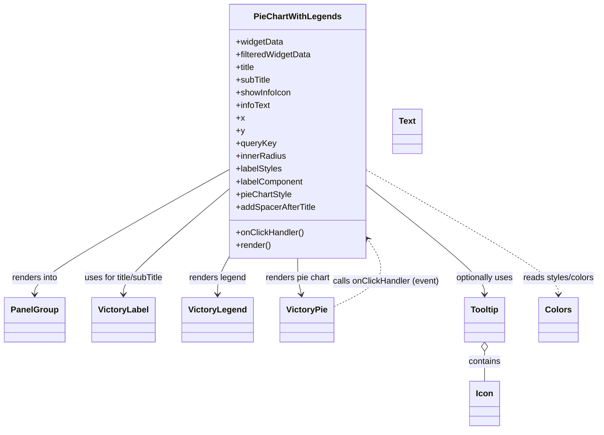
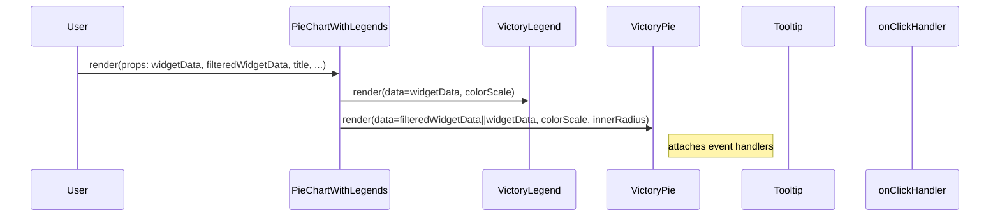

# Diagram: web/portal/src/components/molecules/PieChartWithLegends.molecule.js


> Auto-generated by Obscura crawlers

## Diagram 1



### SVG

<svg id="container" width="1124.25390625" xmlns="http://www.w3.org/2000/svg" class="classDiagram" height="836" viewBox="0 0 1124.25390625 836" role="graphics-document document" aria-roledescription="class"><style>#container{font-family:"trebuchet ms",verdana,arial,sans-serif;font-size:16px;fill:#333;}@keyframes edge-animation-frame{from{stroke-dashoffset:0;}}@keyframes dash{to{stroke-dashoffset:0;}}#container .edge-animation-slow{stroke-dasharray:9,5!important;stroke-dashoffset:900;animation:dash 50s linear infinite;stroke-linecap:round;}#container .edge-animation-fast{stroke-dasharray:9,5!important;stroke-dashoffset:900;animation:dash 20s linear infinite;stroke-linecap:round;}#container .error-icon{fill:#552222;}#container .error-text{fill:#552222;stroke:#552222;}#container .edge-thickness-normal{stroke-width:1px;}#container .edge-thickness-thick{stroke-width:3.5px;}#container .edge-pattern-solid{stroke-dasharray:0;}#container .edge-thickness-invisible{stroke-width:0;fill:none;}#container .edge-pattern-dashed{stroke-dasharray:3;}#container .edge-pattern-dotted{stroke-dasharray:2;}#container .marker{fill:#333333;stroke:#333333;}#container .marker.cross{stroke:#333333;}#container svg{font-family:"trebuchet ms",verdana,arial,sans-serif;font-size:16px;}#container p{margin:0;}#container g.classGroup text{fill:#9370DB;stroke:none;font-family:"trebuchet ms",verdana,arial,sans-serif;font-size:10px;}#container g.classGroup text .title{font-weight:bolder;}#container .nodeLabel,#container .edgeLabel{color:#131300;}#container .edgeLabel .label rect{fill:#ECECFF;}#container .label text{fill:#131300;}#container .labelBkg{background:#ECECFF;}#container .edgeLabel .label span{background:#ECECFF;}#container .classTitle{font-weight:bolder;}#container .node rect,#container .node circle,#container .node ellipse,#container .node polygon,#container .node path{fill:#ECECFF;stroke:#9370DB;stroke-width:1px;}#container .divider{stroke:#9370DB;stroke-width:1;}#container g.clickable{cursor:pointer;}#container g.classGroup rect{fill:#ECECFF;stroke:#9370DB;}#container g.classGroup line{stroke:#9370DB;stroke-width:1;}#container .classLabel .box{stroke:none;stroke-width:0;fill:#ECECFF;opacity:0.5;}#container .classLabel .label{fill:#9370DB;font-size:10px;}#container .relation{stroke:#333333;stroke-width:1;fill:none;}#container .dashed-line{stroke-dasharray:3;}#container .dotted-line{stroke-dasharray:1 2;}#container #compositionStart,#container .composition{fill:#333333!important;stroke:#333333!important;stroke-width:1;}#container #compositionEnd,#container .composition{fill:#333333!important;stroke:#333333!important;stroke-width:1;}#container #dependencyStart,#container .dependency{fill:#333333!important;stroke:#333333!important;stroke-width:1;}#container #dependencyStart,#container .dependency{fill:#333333!important;stroke:#333333!important;stroke-width:1;}#container #extensionStart,#container .extension{fill:transparent!important;stroke:#333333!important;stroke-width:1;}#container #extensionEnd,#container .extension{fill:transparent!important;stroke:#333333!important;stroke-width:1;}#container #aggregationStart,#container .aggregation{fill:transparent!important;stroke:#333333!important;stroke-width:1;}#container #aggregationEnd,#container .aggregation{fill:transparent!important;stroke:#333333!important;stroke-width:1;}#container #lollipopStart,#container .lollipop{fill:#ECECFF!important;stroke:#333333!important;stroke-width:1;}#container #lollipopEnd,#container .lollipop{fill:#ECECFF!important;stroke:#333333!important;stroke-width:1;}#container .edgeTerminals{font-size:11px;line-height:initial;}#container .classTitleText{text-anchor:middle;font-size:18px;fill:#333;}#container .label-icon{display:inline-block;height:1em;overflow:visible;vertical-align:-0.125em;}#container .node .label-icon path{fill:currentColor;stroke:revert;stroke-width:revert;}#container :root{--mermaid-font-family:"trebuchet ms",verdana,arial,sans-serif;}</style><g><defs><marker id="container_class-aggregationStart" class="marker aggregation class" refX="18" refY="7" markerWidth="190" markerHeight="240" orient="auto"><path d="M 18,7 L9,13 L1,7 L9,1 Z"></path></marker></defs><defs><marker id="container_class-aggregationEnd" class="marker aggregation class" refX="1" refY="7" markerWidth="20" markerHeight="28" orient="auto"><path d="M 18,7 L9,13 L1,7 L9,1 Z"></path></marker></defs><defs><marker id="container_class-extensionStart" class="marker extension class" refX="18" refY="7" markerWidth="190" markerHeight="240" orient="auto"><path d="M 1,7 L18,13 V 1 Z"></path></marker></defs><defs><marker id="container_class-extensionEnd" class="marker extension class" refX="1" refY="7" markerWidth="20" markerHeight="28" orient="auto"><path d="M 1,1 V 13 L18,7 Z"></path></marker></defs><defs><marker id="container_class-compositionStart" class="marker composition class" refX="18" refY="7" markerWidth="190" markerHeight="240" orient="auto"><path d="M 18,7 L9,13 L1,7 L9,1 Z"></path></marker></defs><defs><marker id="container_class-compositionEnd" class="marker composition class" refX="1" refY="7" markerWidth="20" markerHeight="28" orient="auto"><path d="M 18,7 L9,13 L1,7 L9,1 Z"></path></marker></defs><defs><marker id="container_class-dependencyStart" class="marker dependency class" refX="6" refY="7" markerWidth="190" markerHeight="240" orient="auto"><path d="M 5,7 L9,13 L1,7 L9,1 Z"></path></marker></defs><defs><marker id="container_class-dependencyEnd" class="marker dependency class" refX="13" refY="7" markerWidth="20" markerHeight="28" orient="auto"><path d="M 18,7 L9,13 L14,7 L9,1 Z"></path></marker></defs><defs><marker id="container_class-lollipopStart" class="marker lollipop class" refX="13" refY="7" markerWidth="190" markerHeight="240" orient="auto"><circle stroke="black" fill="transparent" cx="7" cy="7" r="6"></circle></marker></defs><defs><marker id="container_class-lollipopEnd" class="marker lollipop class" refX="1" refY="7" markerWidth="190" markerHeight="240" orient="auto"><circle stroke="black" fill="transparent" cx="7" cy="7" r="6"></circle></marker></defs><g class="root"><g class="clusters"></g><g class="edgePaths"><path d="M418.93,323.794L359.496,359.328C300.063,394.862,181.195,465.931,121.762,508.632C62.328,551.333,62.328,565.667,62.328,572.833L62.328,580" id="id_PieChartWithLegends_PanelGroup_1" class="edge-thickness-normal edge-pattern-solid relation" style=";;;" data-edge="true" data-et="edge" data-id="id_PieChartWithLegends_PanelGroup_1" data-points="W3sieCI6NDE4LjkyOTY4NzUsInkiOjMyMy43OTM1MTU1OTI4MDEyfSx7IngiOjYyLjMyODEyNSwieSI6NTM3fSx7IngiOjYyLjMyODEyNSwieSI6NTg2fV0=" marker-end="url(#container_class-dependencyEnd)"></path><path d="M418.93,361.973L386.483,391.144C354.036,420.315,289.143,478.658,256.697,514.995C224.25,551.333,224.25,565.667,224.25,572.833L224.25,580" id="id_PieChartWithLegends_VictoryLabel_2" class="edge-thickness-normal edge-pattern-solid relation" style=";;;" data-edge="true" data-et="edge" data-id="id_PieChartWithLegends_VictoryLabel_2" data-points="W3sieCI6NDE4LjkyOTY4NzUsInkiOjM2MS45NzI1NzI5NDIzNjMwNn0seyJ4IjoyMjQuMjUsInkiOjUzN30seyJ4IjoyMjQuMjUsInkiOjU4Nn1d" marker-end="url(#container_class-dependencyEnd)"></path><path d="M672.469,350.464L710.933,381.553C749.397,412.643,826.326,474.821,864.79,513.077C903.254,551.333,903.254,565.667,903.254,572.833L903.254,580" id="id_PieChartWithLegends_Tooltip_3" class="edge-thickness-normal edge-pattern-solid relation" style=";;;" data-edge="true" data-et="edge" data-id="id_PieChartWithLegends_Tooltip_3" data-points="W3sieCI6NjcyLjQ2ODc1LCJ5IjozNTAuNDYzNzUxMTc0NDI3fSx7IngiOjkwMy4yNTM5MDYyNSwieSI6NTM3fSx7IngiOjkwMy4yNTM5MDYyNSwieSI6NTg2fV0=" marker-end="url(#container_class-dependencyEnd)"></path><path d="M903.254,687.25L903.254,690.542C903.254,693.833,903.254,700.417,903.254,709.875C903.254,719.333,903.254,731.667,903.254,737.833L903.254,744" id="id_Tooltip_Icon_4" class="edge-thickness-normal edge-pattern-solid relation" style=";;;" data-edge="true" data-et="edge" data-id="id_Tooltip_Icon_4" data-points="W3sieCI6OTAzLjI1MzkwNjI1LCJ5Ijo2NzB9LHsieCI6OTAzLjI1MzkwNjI1LCJ5Ijo3MDd9LHsieCI6OTAzLjI1MzkwNjI1LCJ5Ijo3NDR9XQ==" marker-start="url(#container_class-aggregationStart)"></path><path d="M421.258,488L417.024,496.167C412.789,504.333,404.32,520.667,400.086,536C395.852,551.333,395.852,565.667,395.852,572.833L395.852,580" id="id_PieChartWithLegends_VictoryLegend_5" class="edge-thickness-normal edge-pattern-solid relation" style=";;;" data-edge="true" data-et="edge" data-id="id_PieChartWithLegends_VictoryLegend_5" data-points="W3sieCI6NDIxLjI1ODI1ODU0MjM4NzUsInkiOjQ4OH0seyJ4IjozOTUuODUxNTYyNSwieSI6NTM3fSx7IngiOjM5NS44NTE1NjI1LCJ5Ijo1ODZ9XQ==" marker-end="url(#container_class-dependencyEnd)"></path><path d="M545.699,488L545.699,496.167C545.699,504.333,545.699,520.667,546.745,536.01C547.79,551.354,549.881,565.708,550.926,572.886L551.971,580.063" id="id_PieChartWithLegends_VictoryPie_6" class="edge-thickness-normal edge-pattern-solid relation" style=";;;" data-edge="true" data-et="edge" data-id="id_PieChartWithLegends_VictoryPie_6" data-points="W3sieCI6NTQ1LjY5OTIxODc1LCJ5Ijo0ODh9LHsieCI6NTQ1LjY5OTIxODc1LCJ5Ijo1Mzd9LHsieCI6NTUyLjgzNTkzNzUsInkiOjU4Nn1d" marker-end="url(#container_class-dependencyEnd)"></path><path d="M672.469,321.02L734.963,357.016C797.457,393.013,922.445,465.007,984.939,508.17C1047.434,551.333,1047.434,565.667,1047.434,572.833L1047.434,580" id="id_PieChartWithLegends_Colors_7" class="edge-thickness-normal edge-pattern-dashed relation" style=";;;" data-edge="true" data-et="edge" data-id="id_PieChartWithLegends_Colors_7" data-points="W3sieCI6NjcyLjQ2ODc1LCJ5IjozMjEuMDE5NTAyNjYyNjM4OTZ9LHsieCI6MTA0Ny40MzM1OTM3NSwieSI6NTM3fSx7IngiOjEwNDcuNDMzNTkzNzUsInkiOjU4Nn1d" marker-end="url(#container_class-dependencyEnd)"></path><path d="M608.047,601.556L628.021,590.796C647.996,580.037,687.945,558.519,699.216,533.952C710.486,509.386,693.077,481.772,684.373,467.966L675.669,454.159" id="id_VictoryPie_PieChartWithLegends_8" class="edge-thickness-normal edge-pattern-dashed relation" style=";;;" data-edge="true" data-et="edge" data-id="id_VictoryPie_PieChartWithLegends_8" data-points="W3sieCI6NjA4LjA0Njg3NSwieSI6NjAxLjU1NTczNTM5MjcyNTl9LHsieCI6NzI3Ljg5NDUzMTI1LCJ5Ijo1Mzd9LHsieCI6NjcyLjQ2ODc1LCJ5Ijo0NDkuMDgzMDc5NjI3ODAzM31d" marker-end="url(#container_class-dependencyEnd)"></path></g><g class="edgeLabels"><g class="edgeLabel" transform="translate(62.328125, 537)"><g class="label" data-id="id_PieChartWithLegends_PanelGroup_1" transform="translate(-44.25, -12)"><foreignObject width="88.5" height="24"><div xmlns="http://www.w3.org/1999/xhtml" class="labelBkg" style="display: table-cell; white-space: nowrap; line-height: 1.5; max-width: 200px; text-align: center;"><span class="edgeLabel"><p>renders into</p></span></div></foreignObject></g></g><g class="edgeLabel" transform="translate(224.25, 537)"><g class="label" data-id="id_PieChartWithLegends_VictoryLabel_2" transform="translate(-78.6328125, -12)"><foreignObject width="157.265625" height="24"><div xmlns="http://www.w3.org/1999/xhtml" class="labelBkg" style="display: table-cell; white-space: nowrap; line-height: 1.5; max-width: 200px; text-align: center;"><span class="edgeLabel"><p>uses for title/subTitle</p></span></div></foreignObject></g></g><g class="edgeLabel" transform="translate(903.25390625, 537)"><g class="label" data-id="id_PieChartWithLegends_Tooltip_3" transform="translate(-55.359375, -12)"><foreignObject width="110.71875" height="24"><div xmlns="http://www.w3.org/1999/xhtml" class="labelBkg" style="display: table-cell; white-space: nowrap; line-height: 1.5; max-width: 200px; text-align: center;"><span class="edgeLabel"><p>optionally uses</p></span></div></foreignObject></g></g><g class="edgeLabel" transform="translate(903.25390625, 707)"><g class="label" data-id="id_Tooltip_Icon_4" transform="translate(-30.890625, -12)"><foreignObject width="61.78125" height="24"><div xmlns="http://www.w3.org/1999/xhtml" class="labelBkg" style="display: table-cell; white-space: nowrap; line-height: 1.5; max-width: 200px; text-align: center;"><span class="edgeLabel"><p>contains</p></span></div></foreignObject></g></g><g class="edgeLabel" transform="translate(395.8515625, 537)"><g class="label" data-id="id_PieChartWithLegends_VictoryLegend_5" transform="translate(-54.3984375, -12)"><foreignObject width="108.796875" height="24"><div xmlns="http://www.w3.org/1999/xhtml" class="labelBkg" style="display: table-cell; white-space: nowrap; line-height: 1.5; max-width: 200px; text-align: center;"><span class="edgeLabel"><p>renders legend</p></span></div></foreignObject></g></g><g class="edgeLabel" transform="translate(545.69921875, 537)"><g class="label" data-id="id_PieChartWithLegends_VictoryPie_6" transform="translate(-62.1953125, -12)"><foreignObject width="124.390625" height="24"><div xmlns="http://www.w3.org/1999/xhtml" class="labelBkg" style="display: table-cell; white-space: nowrap; line-height: 1.5; max-width: 200px; text-align: center;"><span class="edgeLabel"><p>renders pie chart</p></span></div></foreignObject></g></g><g class="edgeLabel" transform="translate(1047.43359375, 537)"><g class="label" data-id="id_PieChartWithLegends_Colors_7" transform="translate(-68.8203125, -12)"><foreignObject width="137.640625" height="24"><div xmlns="http://www.w3.org/1999/xhtml" class="labelBkg" style="display: table-cell; white-space: nowrap; line-height: 1.5; max-width: 200px; text-align: center;"><span class="edgeLabel"><p>reads styles/colors</p></span></div></foreignObject></g></g><g class="edgeLabel" transform="translate(713.72073, 544.6347)"><g class="label" data-id="id_VictoryPie_PieChartWithLegends_8" transform="translate(-100, -24)"><foreignObject width="200" height="48"><div xmlns="http://www.w3.org/1999/xhtml" class="labelBkg" style="display: table; white-space: break-spaces; line-height: 1.5; max-width: 200px; text-align: center; width: 200px;"><span class="edgeLabel"><p>calls onClickHandler (event)</p></span></div></foreignObject></g></g></g><g class="nodes"><g class="node default" id="classId-PieChartWithLegends-0" transform="translate(545.69921875, 248)"><g class="basic label-container"><path d="M-126.76953125 -240 L126.76953125 -240 L126.76953125 240 L-126.76953125 240" stroke="none" stroke-width="0" fill="#ECECFF" style=""></path><path d="M-126.76953125 -240 C-68.37067199240607 -240, -9.971812734812133 -240, 126.76953125 -240 M-126.76953125 -240 C-58.39562376581766 -240, 9.978283718364679 -240, 126.76953125 -240 M126.76953125 -240 C126.76953125 -97.60333459375889, 126.76953125 44.793330812482225, 126.76953125 240 M126.76953125 -240 C126.76953125 -54.873159371088946, 126.76953125 130.2536812578221, 126.76953125 240 M126.76953125 240 C66.05832118750942 240, 5.347111125018827 240, -126.76953125 240 M126.76953125 240 C62.465205804003574 240, -1.839119641992852 240, -126.76953125 240 M-126.76953125 240 C-126.76953125 135.62115182252552, -126.76953125 31.242303645051066, -126.76953125 -240 M-126.76953125 240 C-126.76953125 91.54037100571543, -126.76953125 -56.91925798856914, -126.76953125 -240" stroke="#9370DB" stroke-width="1.3" fill="none" stroke-dasharray="0 0" style=""></path></g><g class="annotation-group text" transform="translate(0, -216)"></g><g class="label-group text" transform="translate(-78.2734375, -216)"><g class="label" style="font-weight: bolder" transform="translate(0,-12)"><foreignObject width="156.546875" height="24"><div xmlns="http://www.w3.org/1999/xhtml" style="display: table-cell; white-space: nowrap; line-height: 1.5; max-width: 204px; text-align: center;"><span class="nodeLabel markdown-node-label" style=""><p>PieChartWithLegends</p></span></div></foreignObject></g></g><g class="members-group text" transform="translate(-114.76953125, -168)"><g class="label" style="" transform="translate(0,-12)"><foreignObject width="89.3125" height="24"><div xmlns="http://www.w3.org/1999/xhtml" style="display: table-cell; white-space: nowrap; line-height: 1.5; max-width: 147px; text-align: center;"><span class="nodeLabel markdown-node-label" style=""><p>+widgetData</p></span></div></foreignObject></g><g class="label" style="" transform="translate(0,12)"><foreignObject width="142.953125" height="24"><div xmlns="http://www.w3.org/1999/xhtml" style="display: table-cell; white-space: nowrap; line-height: 1.5; max-width: 200px; text-align: center;"><span class="nodeLabel markdown-node-label" style=""><p>+filteredWidgetData</p></span></div></foreignObject></g><g class="label" style="" transform="translate(0,36)"><foreignObject width="37.140625" height="24"><div xmlns="http://www.w3.org/1999/xhtml" style="display: table-cell; white-space: nowrap; line-height: 1.5; max-width: 95px; text-align: center;"><span class="nodeLabel markdown-node-label" style=""><p>+title</p></span></div></foreignObject></g><g class="label" style="" transform="translate(0,60)"><foreignObject width="66.015625" height="24"><div xmlns="http://www.w3.org/1999/xhtml" style="display: table-cell; white-space: nowrap; line-height: 1.5; max-width: 123px; text-align: center;"><span class="nodeLabel markdown-node-label" style=""><p>+subTitle</p></span></div></foreignObject></g><g class="label" style="" transform="translate(0,84)"><foreignObject width="105.0625" height="24"><div xmlns="http://www.w3.org/1999/xhtml" style="display: table-cell; white-space: nowrap; line-height: 1.5; max-width: 162px; text-align: center;"><span class="nodeLabel markdown-node-label" style=""><p>+showInfoIcon</p></span></div></foreignObject></g><g class="label" style="" transform="translate(0,108)"><foreignObject width="65.921875" height="24"><div xmlns="http://www.w3.org/1999/xhtml" style="display: table-cell; white-space: nowrap; line-height: 1.5; max-width: 124px; text-align: center;"><span class="nodeLabel markdown-node-label" style=""><p>+infoText</p></span></div></foreignObject></g><g class="label" style="" transform="translate(0,132)"><foreignObject width="15.1875" height="24"><div xmlns="http://www.w3.org/1999/xhtml" style="display: table-cell; white-space: nowrap; line-height: 1.5; max-width: 73px; text-align: center;"><span class="nodeLabel markdown-node-label" style=""><p>+x</p></span></div></foreignObject></g><g class="label" style="" transform="translate(0,156)"><foreignObject width="15.703125" height="24"><div xmlns="http://www.w3.org/1999/xhtml" style="display: table-cell; white-space: nowrap; line-height: 1.5; max-width: 73px; text-align: center;"><span class="nodeLabel markdown-node-label" style=""><p>+y</p></span></div></foreignObject></g><g class="label" style="" transform="translate(0,180)"><foreignObject width="75.375" height="24"><div xmlns="http://www.w3.org/1999/xhtml" style="display: table-cell; white-space: nowrap; line-height: 1.5; max-width: 133px; text-align: center;"><span class="nodeLabel markdown-node-label" style=""><p>+queryKey</p></span></div></foreignObject></g><g class="label" style="" transform="translate(0,204)"><foreignObject width="95.234375" height="24"><div xmlns="http://www.w3.org/1999/xhtml" style="display: table-cell; white-space: nowrap; line-height: 1.5; max-width: 153px; text-align: center;"><span class="nodeLabel markdown-node-label" style=""><p>+innerRadius</p></span></div></foreignObject></g><g class="label" style="" transform="translate(0,228)"><foreignObject width="87.296875" height="24"><div xmlns="http://www.w3.org/1999/xhtml" style="display: table-cell; white-space: nowrap; line-height: 1.5; max-width: 145px; text-align: center;"><span class="nodeLabel markdown-node-label" style=""><p>+labelStyles</p></span></div></foreignObject></g><g class="label" style="" transform="translate(0,252)"><foreignObject width="128.015625" height="24"><div xmlns="http://www.w3.org/1999/xhtml" style="display: table-cell; white-space: nowrap; line-height: 1.5; max-width: 186px; text-align: center;"><span class="nodeLabel markdown-node-label" style=""><p>+labelComponent</p></span></div></foreignObject></g><g class="label" style="" transform="translate(0,276)"><foreignObject width="105.171875" height="24"><div xmlns="http://www.w3.org/1999/xhtml" style="display: table-cell; white-space: nowrap; line-height: 1.5; max-width: 163px; text-align: center;"><span class="nodeLabel markdown-node-label" style=""><p>+pieChartStyle</p></span></div></foreignObject></g><g class="label" style="" transform="translate(0,300)"><foreignObject width="151.265625" height="24"><div xmlns="http://www.w3.org/1999/xhtml" style="display: table-cell; white-space: nowrap; line-height: 1.5; max-width: 209px; text-align: center;"><span class="nodeLabel markdown-node-label" style=""><p>+addSpacerAfterTitle</p></span></div></foreignObject></g></g><g class="methods-group text" transform="translate(-114.76953125, 192)"><g class="label" style="" transform="translate(0,-12)"><foreignObject width="128.953125" height="24"><div xmlns="http://www.w3.org/1999/xhtml" style="display: table-cell; white-space: nowrap; line-height: 1.5; max-width: 186px; text-align: center;"><span class="nodeLabel markdown-node-label" style=""><p>+onClickHandler()</p></span></div></foreignObject></g><g class="label" style="" transform="translate(0,12)"><foreignObject width="66.609375" height="24"><div xmlns="http://www.w3.org/1999/xhtml" style="display: table-cell; white-space: nowrap; line-height: 1.5; max-width: 124px; text-align: center;"><span class="nodeLabel markdown-node-label" style=""><p>+render()</p></span></div></foreignObject></g></g><g class="divider" style=""><path d="M-126.76953125 -192 C-53.13258286584171 -192, 20.504365518316575 -192, 126.76953125 -192 M-126.76953125 -192 C-29.736868055356936 -192, 67.29579513928613 -192, 126.76953125 -192" stroke="#9370DB" stroke-width="1.3" fill="none" stroke-dasharray="0 0" style=""></path></g><g class="divider" style=""><path d="M-126.76953125 168 C-54.71058608763521 168, 17.348359074729586 168, 126.76953125 168 M-126.76953125 168 C-61.887615386066756 168, 2.9943004778664886 168, 126.76953125 168" stroke="#9370DB" stroke-width="1.3" fill="none" stroke-dasharray="0 0" style=""></path></g></g><g class="node default" id="classId-PanelGroup-1" transform="translate(62.328125, 628)"><g class="basic label-container"><path d="M-54.328125 -42 L54.328125 -42 L54.328125 42 L-54.328125 42" stroke="none" stroke-width="0" fill="#ECECFF" style=""></path><path d="M-54.328125 -42 C-25.31028198107854 -42, 3.707561037842922 -42, 54.328125 -42 M-54.328125 -42 C-23.74531335625029 -42, 6.837498287499422 -42, 54.328125 -42 M54.328125 -42 C54.328125 -24.538416021042696, 54.328125 -7.0768320420853925, 54.328125 42 M54.328125 -42 C54.328125 -16.773405928589717, 54.328125 8.453188142820565, 54.328125 42 M54.328125 42 C24.8621161060617 42, -4.603892787876603 42, -54.328125 42 M54.328125 42 C18.28481372057712 42, -17.75849755884576 42, -54.328125 42 M-54.328125 42 C-54.328125 16.3082148401334, -54.328125 -9.383570319733202, -54.328125 -42 M-54.328125 42 C-54.328125 21.31272611050653, -54.328125 0.6254522210130631, -54.328125 -42" stroke="#9370DB" stroke-width="1.3" fill="none" stroke-dasharray="0 0" style=""></path></g><g class="annotation-group text" transform="translate(0, -18)"></g><g class="label-group text" transform="translate(-42.328125, -18)"><g class="label" style="font-weight: bolder" transform="translate(0,-12)"><foreignObject width="84.65625" height="24"><div xmlns="http://www.w3.org/1999/xhtml" style="display: table-cell; white-space: nowrap; line-height: 1.5; max-width: 134px; text-align: center;"><span class="nodeLabel markdown-node-label" style=""><p>PanelGroup</p></span></div></foreignObject></g></g><g class="members-group text" transform="translate(-42.328125, 30)"></g><g class="methods-group text" transform="translate(-42.328125, 60)"></g><g class="divider" style=""><path d="M-54.328125 6 C-23.527574497841446 6, 7.272976004317108 6, 54.328125 6 M-54.328125 6 C-31.57895267315319 6, -8.829780346306379 6, 54.328125 6" stroke="#9370DB" stroke-width="1.3" fill="none" stroke-dasharray="0 0" style=""></path></g><g class="divider" style=""><path d="M-54.328125 24 C-11.484724535182878 24, 31.358675929634245 24, 54.328125 24 M-54.328125 24 C-23.985153063805136 24, 6.357818872389728 24, 54.328125 24" stroke="#9370DB" stroke-width="1.3" fill="none" stroke-dasharray="0 0" style=""></path></g></g><g class="node default" id="classId-VictoryLabel-2" transform="translate(224.25, 628)"><g class="basic label-container"><path d="M-57.59375 -42 L57.59375 -42 L57.59375 42 L-57.59375 42" stroke="none" stroke-width="0" fill="#ECECFF" style=""></path><path d="M-57.59375 -42 C-28.225513221857586 -42, 1.1427235562848281 -42, 57.59375 -42 M-57.59375 -42 C-33.86447869481561 -42, -10.13520738963122 -42, 57.59375 -42 M57.59375 -42 C57.59375 -18.18118125596791, 57.59375 5.637637488064179, 57.59375 42 M57.59375 -42 C57.59375 -19.923971084395426, 57.59375 2.1520578312091487, 57.59375 42 M57.59375 42 C27.496607324504264 42, -2.6005353509914713 42, -57.59375 42 M57.59375 42 C27.849492843240416 42, -1.8947643135191683 42, -57.59375 42 M-57.59375 42 C-57.59375 9.492370002304845, -57.59375 -23.01525999539031, -57.59375 -42 M-57.59375 42 C-57.59375 13.121259050179741, -57.59375 -15.757481899640517, -57.59375 -42" stroke="#9370DB" stroke-width="1.3" fill="none" stroke-dasharray="0 0" style=""></path></g><g class="annotation-group text" transform="translate(0, -18)"></g><g class="label-group text" transform="translate(-45.59375, -18)"><g class="label" style="font-weight: bolder" transform="translate(0,-12)"><foreignObject width="91.1875" height="24"><div xmlns="http://www.w3.org/1999/xhtml" style="display: table-cell; white-space: nowrap; line-height: 1.5; max-width: 140px; text-align: center;"><span class="nodeLabel markdown-node-label" style=""><p>VictoryLabel</p></span></div></foreignObject></g></g><g class="members-group text" transform="translate(-45.59375, 30)"></g><g class="methods-group text" transform="translate(-45.59375, 60)"></g><g class="divider" style=""><path d="M-57.59375 6 C-26.395982390419853 6, 4.801785219160294 6, 57.59375 6 M-57.59375 6 C-15.997678539104307 6, 25.598392921791387 6, 57.59375 6" stroke="#9370DB" stroke-width="1.3" fill="none" stroke-dasharray="0 0" style=""></path></g><g class="divider" style=""><path d="M-57.59375 24 C-23.90972149244748 24, 9.774307015105038 24, 57.59375 24 M-57.59375 24 C-31.96347340421037 24, -6.3331968084207375 24, 57.59375 24" stroke="#9370DB" stroke-width="1.3" fill="none" stroke-dasharray="0 0" style=""></path></g></g><g class="node default" id="classId-VictoryLegend-3" transform="translate(395.8515625, 628)"><g class="basic label-container"><path d="M-64.0078125 -42 L64.0078125 -42 L64.0078125 42 L-64.0078125 42" stroke="none" stroke-width="0" fill="#ECECFF" style=""></path><path d="M-64.0078125 -42 C-31.94483951926363 -42, 0.11813346147273762 -42, 64.0078125 -42 M-64.0078125 -42 C-22.688698963052786 -42, 18.630414573894427 -42, 64.0078125 -42 M64.0078125 -42 C64.0078125 -10.633255443625732, 64.0078125 20.733489112748536, 64.0078125 42 M64.0078125 -42 C64.0078125 -20.036731917545293, 64.0078125 1.9265361649094146, 64.0078125 42 M64.0078125 42 C14.944863402141557 42, -34.118085695716886 42, -64.0078125 42 M64.0078125 42 C21.724708901813315 42, -20.55839469637337 42, -64.0078125 42 M-64.0078125 42 C-64.0078125 8.796182272896424, -64.0078125 -24.407635454207153, -64.0078125 -42 M-64.0078125 42 C-64.0078125 13.9521879208297, -64.0078125 -14.095624158340598, -64.0078125 -42" stroke="#9370DB" stroke-width="1.3" fill="none" stroke-dasharray="0 0" style=""></path></g><g class="annotation-group text" transform="translate(0, -18)"></g><g class="label-group text" transform="translate(-52.0078125, -18)"><g class="label" style="font-weight: bolder" transform="translate(0,-12)"><foreignObject width="104.015625" height="24"><div xmlns="http://www.w3.org/1999/xhtml" style="display: table-cell; white-space: nowrap; line-height: 1.5; max-width: 152px; text-align: center;"><span class="nodeLabel markdown-node-label" style=""><p>VictoryLegend</p></span></div></foreignObject></g></g><g class="members-group text" transform="translate(-52.0078125, 30)"></g><g class="methods-group text" transform="translate(-52.0078125, 60)"></g><g class="divider" style=""><path d="M-64.0078125 6 C-29.15154460239455 6, 5.704723295210897 6, 64.0078125 6 M-64.0078125 6 C-33.73040467199833 6, -3.452996843996665 6, 64.0078125 6" stroke="#9370DB" stroke-width="1.3" fill="none" stroke-dasharray="0 0" style=""></path></g><g class="divider" style=""><path d="M-64.0078125 24 C-22.95428209541968 24, 18.099248309160643 24, 64.0078125 24 M-64.0078125 24 C-26.49737836370526 24, 11.013055772589482 24, 64.0078125 24" stroke="#9370DB" stroke-width="1.3" fill="none" stroke-dasharray="0 0" style=""></path></g></g><g class="node default" id="classId-VictoryPie-4" transform="translate(558.953125, 628)"><g class="basic label-container"><path d="M-49.09375 -42 L49.09375 -42 L49.09375 42 L-49.09375 42" stroke="none" stroke-width="0" fill="#ECECFF" style=""></path><path d="M-49.09375 -42 C-22.34296185173868 -42, 4.407826296522643 -42, 49.09375 -42 M-49.09375 -42 C-11.401351626243326 -42, 26.29104674751335 -42, 49.09375 -42 M49.09375 -42 C49.09375 -24.668448061655088, 49.09375 -7.336896123310176, 49.09375 42 M49.09375 -42 C49.09375 -14.180184070774903, 49.09375 13.639631858450194, 49.09375 42 M49.09375 42 C12.98200299239344 42, -23.12974401521312 42, -49.09375 42 M49.09375 42 C14.98924817015434 42, -19.11525365969132 42, -49.09375 42 M-49.09375 42 C-49.09375 21.3039939350612, -49.09375 0.6079878701224004, -49.09375 -42 M-49.09375 42 C-49.09375 16.889182560389532, -49.09375 -8.221634879220936, -49.09375 -42" stroke="#9370DB" stroke-width="1.3" fill="none" stroke-dasharray="0 0" style=""></path></g><g class="annotation-group text" transform="translate(0, -18)"></g><g class="label-group text" transform="translate(-37.09375, -18)"><g class="label" style="font-weight: bolder" transform="translate(0,-12)"><foreignObject width="74.1875" height="24"><div xmlns="http://www.w3.org/1999/xhtml" style="display: table-cell; white-space: nowrap; line-height: 1.5; max-width: 123px; text-align: center;"><span class="nodeLabel markdown-node-label" style=""><p>VictoryPie</p></span></div></foreignObject></g></g><g class="members-group text" transform="translate(-37.09375, 30)"></g><g class="methods-group text" transform="translate(-37.09375, 60)"></g><g class="divider" style=""><path d="M-49.09375 6 C-24.465599913254366 6, 0.16255017349126888 6, 49.09375 6 M-49.09375 6 C-16.140085120364006 6, 16.813579759271988 6, 49.09375 6" stroke="#9370DB" stroke-width="1.3" fill="none" stroke-dasharray="0 0" style=""></path></g><g class="divider" style=""><path d="M-49.09375 24 C-11.734599209670172 24, 25.624551580659656 24, 49.09375 24 M-49.09375 24 C-26.909246429648572 24, -4.7247428592971445 24, 49.09375 24" stroke="#9370DB" stroke-width="1.3" fill="none" stroke-dasharray="0 0" style=""></path></g></g><g class="node default" id="classId-Tooltip-5" transform="translate(903.25390625, 628)"><g class="basic label-container"><path d="M-37.7265625 -42 L37.7265625 -42 L37.7265625 42 L-37.7265625 42" stroke="none" stroke-width="0" fill="#ECECFF" style=""></path><path d="M-37.7265625 -42 C-11.74697100205611 -42, 14.23262049588778 -42, 37.7265625 -42 M-37.7265625 -42 C-11.918563120892923 -42, 13.889436258214154 -42, 37.7265625 -42 M37.7265625 -42 C37.7265625 -23.807547470286437, 37.7265625 -5.615094940572874, 37.7265625 42 M37.7265625 -42 C37.7265625 -24.449699347154528, 37.7265625 -6.899398694309056, 37.7265625 42 M37.7265625 42 C18.811196548131843 42, -0.10416940373631434 42, -37.7265625 42 M37.7265625 42 C11.315517045638252 42, -15.095528408723496 42, -37.7265625 42 M-37.7265625 42 C-37.7265625 14.92964199890853, -37.7265625 -12.140716002182941, -37.7265625 -42 M-37.7265625 42 C-37.7265625 14.534791797178222, -37.7265625 -12.930416405643555, -37.7265625 -42" stroke="#9370DB" stroke-width="1.3" fill="none" stroke-dasharray="0 0" style=""></path></g><g class="annotation-group text" transform="translate(0, -18)"></g><g class="label-group text" transform="translate(-25.7265625, -18)"><g class="label" style="font-weight: bolder" transform="translate(0,-12)"><foreignObject width="51.453125" height="24"><div xmlns="http://www.w3.org/1999/xhtml" style="display: table-cell; white-space: nowrap; line-height: 1.5; max-width: 101px; text-align: center;"><span class="nodeLabel markdown-node-label" style=""><p>Tooltip</p></span></div></foreignObject></g></g><g class="members-group text" transform="translate(-25.7265625, 30)"></g><g class="methods-group text" transform="translate(-25.7265625, 60)"></g><g class="divider" style=""><path d="M-37.7265625 6 C-9.247507237738617 6, 19.231548024522766 6, 37.7265625 6 M-37.7265625 6 C-22.02738076333869 6, -6.328199026677385 6, 37.7265625 6" stroke="#9370DB" stroke-width="1.3" fill="none" stroke-dasharray="0 0" style=""></path></g><g class="divider" style=""><path d="M-37.7265625 24 C-15.522820748566925 24, 6.68092100286615 24, 37.7265625 24 M-37.7265625 24 C-9.09072081695476 24, 19.54512086609048 24, 37.7265625 24" stroke="#9370DB" stroke-width="1.3" fill="none" stroke-dasharray="0 0" style=""></path></g></g><g class="node default" id="classId-Icon-6" transform="translate(903.25390625, 786)"><g class="basic label-container"><path d="M-27.3046875 -42 L27.3046875 -42 L27.3046875 42 L-27.3046875 42" stroke="none" stroke-width="0" fill="#ECECFF" style=""></path><path d="M-27.3046875 -42 C-15.349059855222663 -42, -3.393432210445326 -42, 27.3046875 -42 M-27.3046875 -42 C-11.275582221267204 -42, 4.753523057465593 -42, 27.3046875 -42 M27.3046875 -42 C27.3046875 -15.271359143529324, 27.3046875 11.457281712941352, 27.3046875 42 M27.3046875 -42 C27.3046875 -12.098106741584363, 27.3046875 17.803786516831273, 27.3046875 42 M27.3046875 42 C14.461171364300544 42, 1.6176552286010875 42, -27.3046875 42 M27.3046875 42 C14.07348063529824 42, 0.8422737705964813 42, -27.3046875 42 M-27.3046875 42 C-27.3046875 9.774988621297958, -27.3046875 -22.450022757404085, -27.3046875 -42 M-27.3046875 42 C-27.3046875 20.471437423487327, -27.3046875 -1.0571251530253463, -27.3046875 -42" stroke="#9370DB" stroke-width="1.3" fill="none" stroke-dasharray="0 0" style=""></path></g><g class="annotation-group text" transform="translate(0, -18)"></g><g class="label-group text" transform="translate(-15.3046875, -18)"><g class="label" style="font-weight: bolder" transform="translate(0,-12)"><foreignObject width="30.609375" height="24"><div xmlns="http://www.w3.org/1999/xhtml" style="display: table-cell; white-space: nowrap; line-height: 1.5; max-width: 81px; text-align: center;"><span class="nodeLabel markdown-node-label" style=""><p>Icon</p></span></div></foreignObject></g></g><g class="members-group text" transform="translate(-15.3046875, 30)"></g><g class="methods-group text" transform="translate(-15.3046875, 60)"></g><g class="divider" style=""><path d="M-27.3046875 6 C-7.46724028786657 6, 12.37020692426686 6, 27.3046875 6 M-27.3046875 6 C-6.266893181220372 6, 14.770901137559257 6, 27.3046875 6" stroke="#9370DB" stroke-width="1.3" fill="none" stroke-dasharray="0 0" style=""></path></g><g class="divider" style=""><path d="M-27.3046875 24 C-11.81312959755878 24, 3.6784283048824413 24, 27.3046875 24 M-27.3046875 24 C-9.72519840736307 24, 7.85429068527386 24, 27.3046875 24" stroke="#9370DB" stroke-width="1.3" fill="none" stroke-dasharray="0 0" style=""></path></g></g><g class="node default" id="classId-Text-7" transform="translate(749.8515625, 248)"><g class="basic label-container"><path d="M-27.3828125 -42 L27.3828125 -42 L27.3828125 42 L-27.3828125 42" stroke="none" stroke-width="0" fill="#ECECFF" style=""></path><path d="M-27.3828125 -42 C-9.425717282267094 -42, 8.531377935465812 -42, 27.3828125 -42 M-27.3828125 -42 C-9.542889172523612 -42, 8.297034154952776 -42, 27.3828125 -42 M27.3828125 -42 C27.3828125 -11.175242205936037, 27.3828125 19.649515588127926, 27.3828125 42 M27.3828125 -42 C27.3828125 -18.033337208215325, 27.3828125 5.933325583569349, 27.3828125 42 M27.3828125 42 C7.742168178361645 42, -11.89847614327671 42, -27.3828125 42 M27.3828125 42 C5.698310037196876 42, -15.986192425606248 42, -27.3828125 42 M-27.3828125 42 C-27.3828125 17.612847779736985, -27.3828125 -6.774304440526031, -27.3828125 -42 M-27.3828125 42 C-27.3828125 22.3984147625983, -27.3828125 2.7968295251965998, -27.3828125 -42" stroke="#9370DB" stroke-width="1.3" fill="none" stroke-dasharray="0 0" style=""></path></g><g class="annotation-group text" transform="translate(0, -18)"></g><g class="label-group text" transform="translate(-15.3828125, -18)"><g class="label" style="font-weight: bolder" transform="translate(0,-12)"><foreignObject width="30.765625" height="24"><div xmlns="http://www.w3.org/1999/xhtml" style="display: table-cell; white-space: nowrap; line-height: 1.5; max-width: 80px; text-align: center;"><span class="nodeLabel markdown-node-label" style=""><p>Text</p></span></div></foreignObject></g></g><g class="members-group text" transform="translate(-15.3828125, 30)"></g><g class="methods-group text" transform="translate(-15.3828125, 60)"></g><g class="divider" style=""><path d="M-27.3828125 6 C-10.727586874310006 6, 5.9276387513799875 6, 27.3828125 6 M-27.3828125 6 C-11.919308721065855 6, 3.54419505786829 6, 27.3828125 6" stroke="#9370DB" stroke-width="1.3" fill="none" stroke-dasharray="0 0" style=""></path></g><g class="divider" style=""><path d="M-27.3828125 24 C-15.67807689814423 24, -3.97334129628846 24, 27.3828125 24 M-27.3828125 24 C-11.263239091083207 24, 4.856334317833586 24, 27.3828125 24" stroke="#9370DB" stroke-width="1.3" fill="none" stroke-dasharray="0 0" style=""></path></g></g><g class="node default" id="classId-Colors-8" transform="translate(1047.43359375, 628)"><g class="basic label-container"><path d="M-35.1015625 -42 L35.1015625 -42 L35.1015625 42 L-35.1015625 42" stroke="none" stroke-width="0" fill="#ECECFF" style=""></path><path d="M-35.1015625 -42 C-8.823300806510058 -42, 17.454960886979883 -42, 35.1015625 -42 M-35.1015625 -42 C-10.02525551991548 -42, 15.051051460169042 -42, 35.1015625 -42 M35.1015625 -42 C35.1015625 -22.55403790819827, 35.1015625 -3.1080758163965427, 35.1015625 42 M35.1015625 -42 C35.1015625 -11.031114140535546, 35.1015625 19.937771718928907, 35.1015625 42 M35.1015625 42 C16.98048356027242 42, -1.1405953794551635 42, -35.1015625 42 M35.1015625 42 C19.30652690849219 42, 3.511491316984383 42, -35.1015625 42 M-35.1015625 42 C-35.1015625 14.934010373088189, -35.1015625 -12.131979253823623, -35.1015625 -42 M-35.1015625 42 C-35.1015625 14.475372139906622, -35.1015625 -13.049255720186757, -35.1015625 -42" stroke="#9370DB" stroke-width="1.3" fill="none" stroke-dasharray="0 0" style=""></path></g><g class="annotation-group text" transform="translate(0, -18)"></g><g class="label-group text" transform="translate(-23.1015625, -18)"><g class="label" style="font-weight: bolder" transform="translate(0,-12)"><foreignObject width="46.203125" height="24"><div xmlns="http://www.w3.org/1999/xhtml" style="display: table-cell; white-space: nowrap; line-height: 1.5; max-width: 95px; text-align: center;"><span class="nodeLabel markdown-node-label" style=""><p>Colors</p></span></div></foreignObject></g></g><g class="members-group text" transform="translate(-23.1015625, 30)"></g><g class="methods-group text" transform="translate(-23.1015625, 60)"></g><g class="divider" style=""><path d="M-35.1015625 6 C-14.7874700344581 6, 5.526622431083801 6, 35.1015625 6 M-35.1015625 6 C-19.533776327990303 6, -3.9659901559806023 6, 35.1015625 6" stroke="#9370DB" stroke-width="1.3" fill="none" stroke-dasharray="0 0" style=""></path></g><g class="divider" style=""><path d="M-35.1015625 24 C-7.526410246038974 24, 20.04874200792205 24, 35.1015625 24 M-35.1015625 24 C-20.294407051764992 24, -5.487251603529984 24, 35.1015625 24" stroke="#9370DB" stroke-width="1.3" fill="none" stroke-dasharray="0 0" style=""></path></g></g></g></g></g></svg>

## Diagram 2



### SVG

<svg id="container" width="1689" xmlns="http://www.w3.org/2000/svg" height="364" viewBox="-50 -10 1689 364" role="graphics-document document" aria-roledescription="sequence"><g><rect x="1439" y="278" fill="#eaeaea" stroke="#666" width="150" height="65" name="Handler" rx="3" ry="3" class="actor actor-bottom"></rect><text x="1514" y="310.5" dominant-baseline="central" alignment-baseline="central" class="actor actor-box" style="text-anchor: middle; font-size: 16px; font-weight: 400;"><tspan x="1514" dy="0">onClickHandler</tspan></text></g><g><rect x="1239" y="278" fill="#eaeaea" stroke="#666" width="150" height="65" name="TooltipComp" rx="3" ry="3" class="actor actor-bottom"></rect><text x="1314" y="310.5" dominant-baseline="central" alignment-baseline="central" class="actor actor-box" style="text-anchor: middle; font-size: 16px; font-weight: 400;"><tspan x="1314" dy="0">Tooltip</tspan></text></g><g><rect x="994" y="278" fill="#eaeaea" stroke="#666" width="150" height="65" name="Pie" rx="3" ry="3" class="actor actor-bottom"></rect><text x="1069" y="310.5" dominant-baseline="central" alignment-baseline="central" class="actor actor-box" style="text-anchor: middle; font-size: 16px; font-weight: 400;"><tspan x="1069" dy="0">VictoryPie</tspan></text></g><g><rect x="794" y="278" fill="#eaeaea" stroke="#666" width="150" height="65" name="Legend" rx="3" ry="3" class="actor actor-bottom"></rect><text x="869" y="310.5" dominant-baseline="central" alignment-baseline="central" class="actor actor-box" style="text-anchor: middle; font-size: 16px; font-weight: 400;"><tspan x="869" dy="0">VictoryLegend</tspan></text></g><g><rect x="448" y="278" fill="#eaeaea" stroke="#666" width="174" height="65" name="PieComponent" rx="3" ry="3" class="actor actor-bottom"></rect><text x="535" y="310.5" dominant-baseline="central" alignment-baseline="central" class="actor actor-box" style="text-anchor: middle; font-size: 16px; font-weight: 400;"><tspan x="535" dy="0">PieChartWithLegends</tspan></text></g><g><rect x="0" y="278" fill="#eaeaea" stroke="#666" width="150" height="65" name="User" rx="3" ry="3" class="actor actor-bottom"></rect><text x="75" y="310.5" dominant-baseline="central" alignment-baseline="central" class="actor actor-box" style="text-anchor: middle; font-size: 16px; font-weight: 400;"><tspan x="75" dy="0">User</tspan></text></g><g><line id="actor5" x1="1514" y1="65" x2="1514" y2="278" class="actor-line 200" stroke-width="0.5px" stroke="#999" name="Handler"></line><g id="root-5"><rect x="1439" y="0" fill="#eaeaea" stroke="#666" width="150" height="65" name="Handler" rx="3" ry="3" class="actor actor-top"></rect><text x="1514" y="32.5" dominant-baseline="central" alignment-baseline="central" class="actor actor-box" style="text-anchor: middle; font-size: 16px; font-weight: 400;"><tspan x="1514" dy="0">onClickHandler</tspan></text></g></g><g><line id="actor4" x1="1314" y1="65" x2="1314" y2="278" class="actor-line 200" stroke-width="0.5px" stroke="#999" name="TooltipComp"></line><g id="root-4"><rect x="1239" y="0" fill="#eaeaea" stroke="#666" width="150" height="65" name="TooltipComp" rx="3" ry="3" class="actor actor-top"></rect><text x="1314" y="32.5" dominant-baseline="central" alignment-baseline="central" class="actor actor-box" style="text-anchor: middle; font-size: 16px; font-weight: 400;"><tspan x="1314" dy="0">Tooltip</tspan></text></g></g><g><line id="actor3" x1="1069" y1="65" x2="1069" y2="278" class="actor-line 200" stroke-width="0.5px" stroke="#999" name="Pie"></line><g id="root-3"><rect x="994" y="0" fill="#eaeaea" stroke="#666" width="150" height="65" name="Pie" rx="3" ry="3" class="actor actor-top"></rect><text x="1069" y="32.5" dominant-baseline="central" alignment-baseline="central" class="actor actor-box" style="text-anchor: middle; font-size: 16px; font-weight: 400;"><tspan x="1069" dy="0">VictoryPie</tspan></text></g></g><g><line id="actor2" x1="869" y1="65" x2="869" y2="278" class="actor-line 200" stroke-width="0.5px" stroke="#999" name="Legend"></line><g id="root-2"><rect x="794" y="0" fill="#eaeaea" stroke="#666" width="150" height="65" name="Legend" rx="3" ry="3" class="actor actor-top"></rect><text x="869" y="32.5" dominant-baseline="central" alignment-baseline="central" class="actor actor-box" style="text-anchor: middle; font-size: 16px; font-weight: 400;"><tspan x="869" dy="0">VictoryLegend</tspan></text></g></g><g><line id="actor1" x1="535" y1="65" x2="535" y2="278" class="actor-line 200" stroke-width="0.5px" stroke="#999" name="PieComponent"></line><g id="root-1"><rect x="448" y="0" fill="#eaeaea" stroke="#666" width="174" height="65" name="PieComponent" rx="3" ry="3" class="actor actor-top"></rect><text x="535" y="32.5" dominant-baseline="central" alignment-baseline="central" class="actor actor-box" style="text-anchor: middle; font-size: 16px; font-weight: 400;"><tspan x="535" dy="0">PieChartWithLegends</tspan></text></g></g><g><line id="actor0" x1="75" y1="65" x2="75" y2="278" class="actor-line 200" stroke-width="0.5px" stroke="#999" name="User"></line><g id="root-0"><rect x="0" y="0" fill="#eaeaea" stroke="#666" width="150" height="65" name="User" rx="3" ry="3" class="actor actor-top"></rect><text x="75" y="32.5" dominant-baseline="central" alignment-baseline="central" class="actor actor-box" style="text-anchor: middle; font-size: 16px; font-weight: 400;"><tspan x="75" dy="0">User</tspan></text></g></g><style>#container{font-family:"trebuchet ms",verdana,arial,sans-serif;font-size:16px;fill:#333;}@keyframes edge-animation-frame{from{stroke-dashoffset:0;}}@keyframes dash{to{stroke-dashoffset:0;}}#container .edge-animation-slow{stroke-dasharray:9,5!important;stroke-dashoffset:900;animation:dash 50s linear infinite;stroke-linecap:round;}#container .edge-animation-fast{stroke-dasharray:9,5!important;stroke-dashoffset:900;animation:dash 20s linear infinite;stroke-linecap:round;}#container .error-icon{fill:#552222;}#container .error-text{fill:#552222;stroke:#552222;}#container .edge-thickness-normal{stroke-width:1px;}#container .edge-thickness-thick{stroke-width:3.5px;}#container .edge-pattern-solid{stroke-dasharray:0;}#container .edge-thickness-invisible{stroke-width:0;fill:none;}#container .edge-pattern-dashed{stroke-dasharray:3;}#container .edge-pattern-dotted{stroke-dasharray:2;}#container .marker{fill:#333333;stroke:#333333;}#container .marker.cross{stroke:#333333;}#container svg{font-family:"trebuchet ms",verdana,arial,sans-serif;font-size:16px;}#container p{margin:0;}#container .actor{stroke:hsl(259.6261682243, 59.7765363128%, 87.9019607843%);fill:#ECECFF;}#container text.actor&gt;tspan{fill:black;stroke:none;}#container .actor-line{stroke:hsl(259.6261682243, 59.7765363128%, 87.9019607843%);}#container .innerArc{stroke-width:1.5;stroke-dasharray:none;}#container .messageLine0{stroke-width:1.5;stroke-dasharray:none;stroke:#333;}#container .messageLine1{stroke-width:1.5;stroke-dasharray:2,2;stroke:#333;}#container #arrowhead path{fill:#333;stroke:#333;}#container .sequenceNumber{fill:white;}#container #sequencenumber{fill:#333;}#container #crosshead path{fill:#333;stroke:#333;}#container .messageText{fill:#333;stroke:none;}#container .labelBox{stroke:hsl(259.6261682243, 59.7765363128%, 87.9019607843%);fill:#ECECFF;}#container .labelText,#container .labelText&gt;tspan{fill:black;stroke:none;}#container .loopText,#container .loopText&gt;tspan{fill:black;stroke:none;}#container .loopLine{stroke-width:2px;stroke-dasharray:2,2;stroke:hsl(259.6261682243, 59.7765363128%, 87.9019607843%);fill:hsl(259.6261682243, 59.7765363128%, 87.9019607843%);}#container .note{stroke:#aaaa33;fill:#fff5ad;}#container .noteText,#container .noteText&gt;tspan{fill:black;stroke:none;}#container .activation0{fill:#f4f4f4;stroke:#666;}#container .activation1{fill:#f4f4f4;stroke:#666;}#container .activation2{fill:#f4f4f4;stroke:#666;}#container .actorPopupMenu{position:absolute;}#container .actorPopupMenuPanel{position:absolute;fill:#ECECFF;box-shadow:0px 8px 16px 0px rgba(0,0,0,0.2);filter:drop-shadow(3px 5px 2px rgb(0 0 0 / 0.4));}#container .actor-man line{stroke:hsl(259.6261682243, 59.7765363128%, 87.9019607843%);fill:#ECECFF;}#container .actor-man circle,#container line{stroke:hsl(259.6261682243, 59.7765363128%, 87.9019607843%);fill:#ECECFF;stroke-width:2px;}#container :root{--mermaid-font-family:"trebuchet ms",verdana,arial,sans-serif;}</style><g></g><defs><symbol id="computer" width="24" height="24"><path transform="scale(.5)" d="M2 2v13h20v-13h-20zm18 11h-16v-9h16v9zm-10.228 6l.466-1h3.524l.467 1h-4.457zm14.228 3h-24l2-6h2.104l-1.33 4h18.45l-1.297-4h2.073l2 6zm-5-10h-14v-7h14v7z"></path></symbol></defs><defs><symbol id="database" fill-rule="evenodd" clip-rule="evenodd"><path transform="scale(.5)" d="M12.258.001l.256.004.255.005.253.008.251.01.249.012.247.015.246.016.242.019.241.02.239.023.236.024.233.027.231.028.229.031.225.032.223.034.22.036.217.038.214.04.211.041.208.043.205.045.201.046.198.048.194.05.191.051.187.053.183.054.18.056.175.057.172.059.168.06.163.061.16.063.155.064.15.066.074.033.073.033.071.034.07.034.069.035.068.035.067.035.066.035.064.036.064.036.062.036.06.036.06.037.058.037.058.037.055.038.055.038.053.038.052.038.051.039.05.039.048.039.047.039.045.04.044.04.043.04.041.04.04.041.039.041.037.041.036.041.034.041.033.042.032.042.03.042.029.042.027.042.026.043.024.043.023.043.021.043.02.043.018.044.017.043.015.044.013.044.012.044.011.045.009.044.007.045.006.045.004.045.002.045.001.045v17l-.001.045-.002.045-.004.045-.006.045-.007.045-.009.044-.011.045-.012.044-.013.044-.015.044-.017.043-.018.044-.02.043-.021.043-.023.043-.024.043-.026.043-.027.042-.029.042-.03.042-.032.042-.033.042-.034.041-.036.041-.037.041-.039.041-.04.041-.041.04-.043.04-.044.04-.045.04-.047.039-.048.039-.05.039-.051.039-.052.038-.053.038-.055.038-.055.038-.058.037-.058.037-.06.037-.06.036-.062.036-.064.036-.064.036-.066.035-.067.035-.068.035-.069.035-.07.034-.071.034-.073.033-.074.033-.15.066-.155.064-.16.063-.163.061-.168.06-.172.059-.175.057-.18.056-.183.054-.187.053-.191.051-.194.05-.198.048-.201.046-.205.045-.208.043-.211.041-.214.04-.217.038-.22.036-.223.034-.225.032-.229.031-.231.028-.233.027-.236.024-.239.023-.241.02-.242.019-.246.016-.247.015-.249.012-.251.01-.253.008-.255.005-.256.004-.258.001-.258-.001-.256-.004-.255-.005-.253-.008-.251-.01-.249-.012-.247-.015-.245-.016-.243-.019-.241-.02-.238-.023-.236-.024-.234-.027-.231-.028-.228-.031-.226-.032-.223-.034-.22-.036-.217-.038-.214-.04-.211-.041-.208-.043-.204-.045-.201-.046-.198-.048-.195-.05-.19-.051-.187-.053-.184-.054-.179-.056-.176-.057-.172-.059-.167-.06-.164-.061-.159-.063-.155-.064-.151-.066-.074-.033-.072-.033-.072-.034-.07-.034-.069-.035-.068-.035-.067-.035-.066-.035-.064-.036-.063-.036-.062-.036-.061-.036-.06-.037-.058-.037-.057-.037-.056-.038-.055-.038-.053-.038-.052-.038-.051-.039-.049-.039-.049-.039-.046-.039-.046-.04-.044-.04-.043-.04-.041-.04-.04-.041-.039-.041-.037-.041-.036-.041-.034-.041-.033-.042-.032-.042-.03-.042-.029-.042-.027-.042-.026-.043-.024-.043-.023-.043-.021-.043-.02-.043-.018-.044-.017-.043-.015-.044-.013-.044-.012-.044-.011-.045-.009-.044-.007-.045-.006-.045-.004-.045-.002-.045-.001-.045v-17l.001-.045.002-.045.004-.045.006-.045.007-.045.009-.044.011-.045.012-.044.013-.044.015-.044.017-.043.018-.044.02-.043.021-.043.023-.043.024-.043.026-.043.027-.042.029-.042.03-.042.032-.042.033-.042.034-.041.036-.041.037-.041.039-.041.04-.041.041-.04.043-.04.044-.04.046-.04.046-.039.049-.039.049-.039.051-.039.052-.038.053-.038.055-.038.056-.038.057-.037.058-.037.06-.037.061-.036.062-.036.063-.036.064-.036.066-.035.067-.035.068-.035.069-.035.07-.034.072-.034.072-.033.074-.033.151-.066.155-.064.159-.063.164-.061.167-.06.172-.059.176-.057.179-.056.184-.054.187-.053.19-.051.195-.05.198-.048.201-.046.204-.045.208-.043.211-.041.214-.04.217-.038.22-.036.223-.034.226-.032.228-.031.231-.028.234-.027.236-.024.238-.023.241-.02.243-.019.245-.016.247-.015.249-.012.251-.01.253-.008.255-.005.256-.004.258-.001.258.001zm-9.258 20.499v.01l.001.021.003.021.004.022.005.021.006.022.007.022.009.023.01.022.011.023.012.023.013.023.015.023.016.024.017.023.018.024.019.024.021.024.022.025.023.024.024.025.052.049.056.05.061.051.066.051.07.051.075.051.079.052.084.052.088.052.092.052.097.052.102.051.105.052.11.052.114.051.119.051.123.051.127.05.131.05.135.05.139.048.144.049.147.047.152.047.155.047.16.045.163.045.167.043.171.043.176.041.178.041.183.039.187.039.19.037.194.035.197.035.202.033.204.031.209.03.212.029.216.027.219.025.222.024.226.021.23.02.233.018.236.016.24.015.243.012.246.01.249.008.253.005.256.004.259.001.26-.001.257-.004.254-.005.25-.008.247-.011.244-.012.241-.014.237-.016.233-.018.231-.021.226-.021.224-.024.22-.026.216-.027.212-.028.21-.031.205-.031.202-.034.198-.034.194-.036.191-.037.187-.039.183-.04.179-.04.175-.042.172-.043.168-.044.163-.045.16-.046.155-.046.152-.047.148-.048.143-.049.139-.049.136-.05.131-.05.126-.05.123-.051.118-.052.114-.051.11-.052.106-.052.101-.052.096-.052.092-.052.088-.053.083-.051.079-.052.074-.052.07-.051.065-.051.06-.051.056-.05.051-.05.023-.024.023-.025.021-.024.02-.024.019-.024.018-.024.017-.024.015-.023.014-.024.013-.023.012-.023.01-.023.01-.022.008-.022.006-.022.006-.022.004-.022.004-.021.001-.021.001-.021v-4.127l-.077.055-.08.053-.083.054-.085.053-.087.052-.09.052-.093.051-.095.05-.097.05-.1.049-.102.049-.105.048-.106.047-.109.047-.111.046-.114.045-.115.045-.118.044-.12.043-.122.042-.124.042-.126.041-.128.04-.13.04-.132.038-.134.038-.135.037-.138.037-.139.035-.142.035-.143.034-.144.033-.147.032-.148.031-.15.03-.151.03-.153.029-.154.027-.156.027-.158.026-.159.025-.161.024-.162.023-.163.022-.165.021-.166.02-.167.019-.169.018-.169.017-.171.016-.173.015-.173.014-.175.013-.175.012-.177.011-.178.01-.179.008-.179.008-.181.006-.182.005-.182.004-.184.003-.184.002h-.37l-.184-.002-.184-.003-.182-.004-.182-.005-.181-.006-.179-.008-.179-.008-.178-.01-.176-.011-.176-.012-.175-.013-.173-.014-.172-.015-.171-.016-.17-.017-.169-.018-.167-.019-.166-.02-.165-.021-.163-.022-.162-.023-.161-.024-.159-.025-.157-.026-.156-.027-.155-.027-.153-.029-.151-.03-.15-.03-.148-.031-.146-.032-.145-.033-.143-.034-.141-.035-.14-.035-.137-.037-.136-.037-.134-.038-.132-.038-.13-.04-.128-.04-.126-.041-.124-.042-.122-.042-.12-.044-.117-.043-.116-.045-.113-.045-.112-.046-.109-.047-.106-.047-.105-.048-.102-.049-.1-.049-.097-.05-.095-.05-.093-.052-.09-.051-.087-.052-.085-.053-.083-.054-.08-.054-.077-.054v4.127zm0-5.654v.011l.001.021.003.021.004.021.005.022.006.022.007.022.009.022.01.022.011.023.012.023.013.023.015.024.016.023.017.024.018.024.019.024.021.024.022.024.023.025.024.024.052.05.056.05.061.05.066.051.07.051.075.052.079.051.084.052.088.052.092.052.097.052.102.052.105.052.11.051.114.051.119.052.123.05.127.051.131.05.135.049.139.049.144.048.147.048.152.047.155.046.16.045.163.045.167.044.171.042.176.042.178.04.183.04.187.038.19.037.194.036.197.034.202.033.204.032.209.03.212.028.216.027.219.025.222.024.226.022.23.02.233.018.236.016.24.014.243.012.246.01.249.008.253.006.256.003.259.001.26-.001.257-.003.254-.006.25-.008.247-.01.244-.012.241-.015.237-.016.233-.018.231-.02.226-.022.224-.024.22-.025.216-.027.212-.029.21-.03.205-.032.202-.033.198-.035.194-.036.191-.037.187-.039.183-.039.179-.041.175-.042.172-.043.168-.044.163-.045.16-.045.155-.047.152-.047.148-.048.143-.048.139-.05.136-.049.131-.05.126-.051.123-.051.118-.051.114-.052.11-.052.106-.052.101-.052.096-.052.092-.052.088-.052.083-.052.079-.052.074-.051.07-.052.065-.051.06-.05.056-.051.051-.049.023-.025.023-.024.021-.025.02-.024.019-.024.018-.024.017-.024.015-.023.014-.023.013-.024.012-.022.01-.023.01-.023.008-.022.006-.022.006-.022.004-.021.004-.022.001-.021.001-.021v-4.139l-.077.054-.08.054-.083.054-.085.052-.087.053-.09.051-.093.051-.095.051-.097.05-.1.049-.102.049-.105.048-.106.047-.109.047-.111.046-.114.045-.115.044-.118.044-.12.044-.122.042-.124.042-.126.041-.128.04-.13.039-.132.039-.134.038-.135.037-.138.036-.139.036-.142.035-.143.033-.144.033-.147.033-.148.031-.15.03-.151.03-.153.028-.154.028-.156.027-.158.026-.159.025-.161.024-.162.023-.163.022-.165.021-.166.02-.167.019-.169.018-.169.017-.171.016-.173.015-.173.014-.175.013-.175.012-.177.011-.178.009-.179.009-.179.007-.181.007-.182.005-.182.004-.184.003-.184.002h-.37l-.184-.002-.184-.003-.182-.004-.182-.005-.181-.007-.179-.007-.179-.009-.178-.009-.176-.011-.176-.012-.175-.013-.173-.014-.172-.015-.171-.016-.17-.017-.169-.018-.167-.019-.166-.02-.165-.021-.163-.022-.162-.023-.161-.024-.159-.025-.157-.026-.156-.027-.155-.028-.153-.028-.151-.03-.15-.03-.148-.031-.146-.033-.145-.033-.143-.033-.141-.035-.14-.036-.137-.036-.136-.037-.134-.038-.132-.039-.13-.039-.128-.04-.126-.041-.124-.042-.122-.043-.12-.043-.117-.044-.116-.044-.113-.046-.112-.046-.109-.046-.106-.047-.105-.048-.102-.049-.1-.049-.097-.05-.095-.051-.093-.051-.09-.051-.087-.053-.085-.052-.083-.054-.08-.054-.077-.054v4.139zm0-5.666v.011l.001.02.003.022.004.021.005.022.006.021.007.022.009.023.01.022.011.023.012.023.013.023.015.023.016.024.017.024.018.023.019.024.021.025.022.024.023.024.024.025.052.05.056.05.061.05.066.051.07.051.075.052.079.051.084.052.088.052.092.052.097.052.102.052.105.051.11.052.114.051.119.051.123.051.127.05.131.05.135.05.139.049.144.048.147.048.152.047.155.046.16.045.163.045.167.043.171.043.176.042.178.04.183.04.187.038.19.037.194.036.197.034.202.033.204.032.209.03.212.028.216.027.219.025.222.024.226.021.23.02.233.018.236.017.24.014.243.012.246.01.249.008.253.006.256.003.259.001.26-.001.257-.003.254-.006.25-.008.247-.01.244-.013.241-.014.237-.016.233-.018.231-.02.226-.022.224-.024.22-.025.216-.027.212-.029.21-.03.205-.032.202-.033.198-.035.194-.036.191-.037.187-.039.183-.039.179-.041.175-.042.172-.043.168-.044.163-.045.16-.045.155-.047.152-.047.148-.048.143-.049.139-.049.136-.049.131-.051.126-.05.123-.051.118-.052.114-.051.11-.052.106-.052.101-.052.096-.052.092-.052.088-.052.083-.052.079-.052.074-.052.07-.051.065-.051.06-.051.056-.05.051-.049.023-.025.023-.025.021-.024.02-.024.019-.024.018-.024.017-.024.015-.023.014-.024.013-.023.012-.023.01-.022.01-.023.008-.022.006-.022.006-.022.004-.022.004-.021.001-.021.001-.021v-4.153l-.077.054-.08.054-.083.053-.085.053-.087.053-.09.051-.093.051-.095.051-.097.05-.1.049-.102.048-.105.048-.106.048-.109.046-.111.046-.114.046-.115.044-.118.044-.12.043-.122.043-.124.042-.126.041-.128.04-.13.039-.132.039-.134.038-.135.037-.138.036-.139.036-.142.034-.143.034-.144.033-.147.032-.148.032-.15.03-.151.03-.153.028-.154.028-.156.027-.158.026-.159.024-.161.024-.162.023-.163.023-.165.021-.166.02-.167.019-.169.018-.169.017-.171.016-.173.015-.173.014-.175.013-.175.012-.177.01-.178.01-.179.009-.179.007-.181.006-.182.006-.182.004-.184.003-.184.001-.185.001-.185-.001-.184-.001-.184-.003-.182-.004-.182-.006-.181-.006-.179-.007-.179-.009-.178-.01-.176-.01-.176-.012-.175-.013-.173-.014-.172-.015-.171-.016-.17-.017-.169-.018-.167-.019-.166-.02-.165-.021-.163-.023-.162-.023-.161-.024-.159-.024-.157-.026-.156-.027-.155-.028-.153-.028-.151-.03-.15-.03-.148-.032-.146-.032-.145-.033-.143-.034-.141-.034-.14-.036-.137-.036-.136-.037-.134-.038-.132-.039-.13-.039-.128-.041-.126-.041-.124-.041-.122-.043-.12-.043-.117-.044-.116-.044-.113-.046-.112-.046-.109-.046-.106-.048-.105-.048-.102-.048-.1-.05-.097-.049-.095-.051-.093-.051-.09-.052-.087-.052-.085-.053-.083-.053-.08-.054-.077-.054v4.153zm8.74-8.179l-.257.004-.254.005-.25.008-.247.011-.244.012-.241.014-.237.016-.233.018-.231.021-.226.022-.224.023-.22.026-.216.027-.212.028-.21.031-.205.032-.202.033-.198.034-.194.036-.191.038-.187.038-.183.04-.179.041-.175.042-.172.043-.168.043-.163.045-.16.046-.155.046-.152.048-.148.048-.143.048-.139.049-.136.05-.131.05-.126.051-.123.051-.118.051-.114.052-.11.052-.106.052-.101.052-.096.052-.092.052-.088.052-.083.052-.079.052-.074.051-.07.052-.065.051-.06.05-.056.05-.051.05-.023.025-.023.024-.021.024-.02.025-.019.024-.018.024-.017.023-.015.024-.014.023-.013.023-.012.023-.01.023-.01.022-.008.022-.006.023-.006.021-.004.022-.004.021-.001.021-.001.021.001.021.001.021.004.021.004.022.006.021.006.023.008.022.01.022.01.023.012.023.013.023.014.023.015.024.017.023.018.024.019.024.02.025.021.024.023.024.023.025.051.05.056.05.06.05.065.051.07.052.074.051.079.052.083.052.088.052.092.052.096.052.101.052.106.052.11.052.114.052.118.051.123.051.126.051.131.05.136.05.139.049.143.048.148.048.152.048.155.046.16.046.163.045.168.043.172.043.175.042.179.041.183.04.187.038.191.038.194.036.198.034.202.033.205.032.21.031.212.028.216.027.22.026.224.023.226.022.231.021.233.018.237.016.241.014.244.012.247.011.25.008.254.005.257.004.26.001.26-.001.257-.004.254-.005.25-.008.247-.011.244-.012.241-.014.237-.016.233-.018.231-.021.226-.022.224-.023.22-.026.216-.027.212-.028.21-.031.205-.032.202-.033.198-.034.194-.036.191-.038.187-.038.183-.04.179-.041.175-.042.172-.043.168-.043.163-.045.16-.046.155-.046.152-.048.148-.048.143-.048.139-.049.136-.05.131-.05.126-.051.123-.051.118-.051.114-.052.11-.052.106-.052.101-.052.096-.052.092-.052.088-.052.083-.052.079-.052.074-.051.07-.052.065-.051.06-.05.056-.05.051-.05.023-.025.023-.024.021-.024.02-.025.019-.024.018-.024.017-.023.015-.024.014-.023.013-.023.012-.023.01-.023.01-.022.008-.022.006-.023.006-.021.004-.022.004-.021.001-.021.001-.021-.001-.021-.001-.021-.004-.021-.004-.022-.006-.021-.006-.023-.008-.022-.01-.022-.01-.023-.012-.023-.013-.023-.014-.023-.015-.024-.017-.023-.018-.024-.019-.024-.02-.025-.021-.024-.023-.024-.023-.025-.051-.05-.056-.05-.06-.05-.065-.051-.07-.052-.074-.051-.079-.052-.083-.052-.088-.052-.092-.052-.096-.052-.101-.052-.106-.052-.11-.052-.114-.052-.118-.051-.123-.051-.126-.051-.131-.05-.136-.05-.139-.049-.143-.048-.148-.048-.152-.048-.155-.046-.16-.046-.163-.045-.168-.043-.172-.043-.175-.042-.179-.041-.183-.04-.187-.038-.191-.038-.194-.036-.198-.034-.202-.033-.205-.032-.21-.031-.212-.028-.216-.027-.22-.026-.224-.023-.226-.022-.231-.021-.233-.018-.237-.016-.241-.014-.244-.012-.247-.011-.25-.008-.254-.005-.257-.004-.26-.001-.26.001z"></path></symbol></defs><defs><symbol id="clock" width="24" height="24"><path transform="scale(.5)" d="M12 2c5.514 0 10 4.486 10 10s-4.486 10-10 10-10-4.486-10-10 4.486-10 10-10zm0-2c-6.627 0-12 5.373-12 12s5.373 12 12 12 12-5.373 12-12-5.373-12-12-12zm5.848 12.459c.202.038.202.333.001.372-1.907.361-6.045 1.111-6.547 1.111-.719 0-1.301-.582-1.301-1.301 0-.512.77-5.447 1.125-7.445.034-.192.312-.181.343.014l.985 6.238 5.394 1.011z"></path></symbol></defs><defs><marker id="arrowhead" refX="7.9" refY="5" markerUnits="userSpaceOnUse" markerWidth="12" markerHeight="12" orient="auto-start-reverse"><path d="M -1 0 L 10 5 L 0 10 z"></path></marker></defs><defs><marker id="crosshead" markerWidth="15" markerHeight="8" orient="auto" refX="4" refY="4.5"><path fill="none" stroke="#000000" stroke-width="1pt" d="M 1,2 L 6,7 M 6,2 L 1,7" style="stroke-dasharray: 0, 0;"></path></marker></defs><defs><marker id="filled-head" refX="15.5" refY="7" markerWidth="20" markerHeight="28" orient="auto"><path d="M 18,7 L9,13 L14,7 L9,1 Z"></path></marker></defs><defs><marker id="sequencenumber" refX="15" refY="15" markerWidth="60" markerHeight="40" orient="auto"><circle cx="15" cy="15" r="6"></circle></marker></defs><g><rect x="1094" y="219" fill="#EDF2AE" stroke="#666" width="195" height="39" class="note"></rect><text x="1192" y="224" text-anchor="middle" dominant-baseline="middle" alignment-baseline="middle" class="noteText" dy="1em" style="font-size: 16px; font-weight: 400;"><tspan x="1192">attaches event handlers</tspan></text></g><text x="304" y="80" text-anchor="middle" dominant-baseline="middle" alignment-baseline="middle" class="messageText" dy="1em" style="font-size: 16px; font-weight: 400;">render(props: widgetData, filteredWidgetData, title, ...)</text><line x1="76" y1="113" x2="531" y2="113" class="messageLine0" stroke-width="2" stroke="none" marker-end="url(#arrowhead)" style="fill: none;"></line><text x="701" y="128" text-anchor="middle" dominant-baseline="middle" alignment-baseline="middle" class="messageText" dy="1em" style="font-size: 16px; font-weight: 400;">render(data=widgetData, colorScale)</text><line x1="536" y1="161" x2="865" y2="161" class="messageLine0" stroke-width="2" stroke="none" marker-end="url(#arrowhead)" style="fill: none;"></line><text x="801" y="176" text-anchor="middle" dominant-baseline="middle" alignment-baseline="middle" class="messageText" dy="1em" style="font-size: 16px; font-weight: 400;">render(data=filteredWidgetData||widgetData, colorScale, innerRadius)</text><line x1="536" y1="209" x2="1065" y2="209" class="messageLine0" stroke-width="2" stroke="none" marker-end="url(#arrowhead)" style="fill: none;"></line></svg>

## Diagram 3

```mermaid
Pie->>Handler: onClick(queryKey, datum.searchOption, props)
```

> SVG rendering failed for this diagram.
