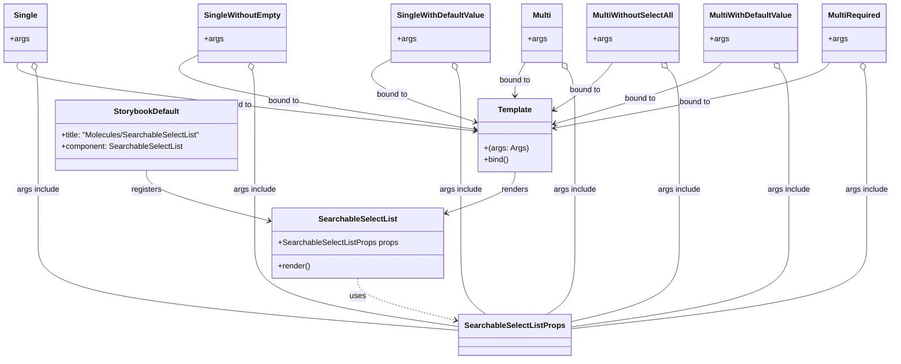

# Diagram: web/portal/src/components/molecules/SearchableSelectList.molecule.stories.tsx

> Auto-generated by Obscura crawlers

## Mermaid

### SVG

<svg id="container" width="1805.294921875" xmlns="http://www.w3.org/2000/svg" class="classDiagram" height="736" viewBox="17.33203125 0 1805.294921875 736" role="graphics-document document" aria-roledescription="class"><g><defs><marker id="container_class-aggregationStart" class="marker aggregation class" refX="18" refY="7" markerWidth="190" markerHeight="240" orient="auto"><path d="M 18,7 L9,13 L1,7 L9,1 Z"></path></marker></defs><defs><marker id="container_class-aggregationEnd" class="marker aggregation class" refX="1" refY="7" markerWidth="20" markerHeight="28" orient="auto"><path d="M 18,7 L9,13 L1,7 L9,1 Z"></path></marker></defs><defs><marker id="container_class-extensionStart" class="marker extension class" refX="18" refY="7" markerWidth="190" markerHeight="240" orient="auto"><path d="M 1,7 L18,13 V 1 Z"></path></marker></defs><defs><marker id="container_class-extensionEnd" class="marker extension class" refX="1" refY="7" markerWidth="20" markerHeight="28" orient="auto"><path d="M 1,1 V 13 L18,7 Z"></path></marker></defs><defs><marker id="container_class-compositionStart" class="marker composition class" refX="18" refY="7" markerWidth="190" markerHeight="240" orient="auto"><path d="M 18,7 L9,13 L1,7 L9,1 Z"></path></marker></defs><defs><marker id="container_class-compositionEnd" class="marker composition class" refX="1" refY="7" markerWidth="20" markerHeight="28" orient="auto"><path d="M 18,7 L9,13 L1,7 L9,1 Z"></path></marker></defs><defs><marker id="container_class-dependencyStart" class="marker dependency class" refX="6" refY="7" markerWidth="190" markerHeight="240" orient="auto"><path d="M 5,7 L9,13 L1,7 L9,1 Z"></path></marker></defs><defs><marker id="container_class-dependencyEnd" class="marker dependency class" refX="13" refY="7" markerWidth="20" markerHeight="28" orient="auto"><path d="M 18,7 L9,13 L14,7 L9,1 Z"></path></marker></defs><defs><marker id="container_class-lollipopStart" class="marker lollipop class" refX="13" refY="7" markerWidth="190" markerHeight="240" orient="auto"><circle stroke="black" fill="transparent" cx="7" cy="7" r="6"></circle></marker></defs><defs><marker id="container_class-lollipopEnd" class="marker lollipop class" refX="1" refY="7" markerWidth="190" markerHeight="240" orient="auto"><circle stroke="black" fill="transparent" cx="7" cy="7" r="6"></circle></marker></defs><g class="root"><g class="clusters"></g><g class="edgePaths"><path d="M318.105,349L318.105,355.667C318.105,362.333,318.105,375.667,360.281,392.992C402.457,410.317,486.808,431.635,528.984,442.294L571.159,452.952" id="id_StorybookDefault_SearchableSelectList_1" class="edge-thickness-normal edge-pattern-solid relation" style=";;;" data-edge="true" data-et="edge" data-id="id_StorybookDefault_SearchableSelectList_1" data-points="W3sieCI6MzE4LjEwNTQ2ODc1LCJ5IjozNDl9LHsieCI6MzE4LjEwNTQ2ODc1LCJ5IjozODl9LHsieCI6NTc2Ljk3NjU2MjUsInkiOjQ1NC40MjIzMTA1NzY1NTczfV0=" marker-end="url(#container_class-dependencyEnd)"></path><path d="M1064.574,352L1064.574,358.167C1064.574,364.333,1064.574,376.667,1041.731,390.734C1018.888,404.801,973.201,420.602,950.358,428.502L927.514,436.402" id="id_Template_SearchableSelectList_2" class="edge-thickness-normal edge-pattern-solid relation" style=";;;" data-edge="true" data-et="edge" data-id="id_Template_SearchableSelectList_2" data-points="W3sieCI6MTA2NC41NzQyMTg3NSwieSI6MzUyfSx7IngiOjEwNjQuNTc0MjE4NzUsInkiOjM4OX0seyJ4Ijo5MjEuODQzNzUsInkiOjQzOC4zNjM1NjMxMjQzNjQ3Nn1d" marker-end="url(#container_class-dependencyEnd)"></path><path d="M51.248,128L49.559,134.167C47.871,140.333,44.494,152.667,200.266,176.065C356.038,199.463,670.959,233.925,828.419,251.157L985.879,268.388" id="id_Single_Template_3" class="edge-thickness-normal edge-pattern-solid relation" style=";;;" data-edge="true" data-et="edge" data-id="id_Single_Template_3" data-points="W3sieCI6NTEuMjQ3Nzg1MTE1OTc5MzgsInkiOjEyOH0seyJ4Ijo0MS4xMTcxODc1LCJ5IjoxNjV9LHsieCI6OTkxLjg0Mzc1LCJ5IjoyNjkuMDQwODg0NzE1OTQwNTR9XQ==" marker-end="url(#container_class-dependencyEnd)"></path><path d="M428.879,110.543L410.417,119.619C391.954,128.695,355.03,146.848,447.868,172.623C540.707,198.399,763.309,231.798,874.609,248.498L985.91,265.197" id="id_SingleWithoutEmpty_Template_4" class="edge-thickness-normal edge-pattern-solid relation" style=";;;" data-edge="true" data-et="edge" data-id="id_SingleWithoutEmpty_Template_4" data-points="W3sieCI6NDI4Ljg3ODkwNjI1LCJ5IjoxMTAuNTQzMTE4NDY2ODk4OTZ9LHsieCI6MzE4LjEwNTQ2ODc1LCJ5IjoxNjV9LHsieCI6OTkxLjg0Mzc1LCJ5IjoyNjYuMDg3NTM3MTU0MTAwNn1d" marker-end="url(#container_class-dependencyEnd)"></path><path d="M818.602,120.535L804.783,127.946C790.964,135.356,763.326,150.178,791.253,171.805C819.18,193.433,902.672,221.865,944.418,236.082L986.164,250.298" id="id_SingleWithDefaultValue_Template_5" class="edge-thickness-normal edge-pattern-solid relation" style=";;;" data-edge="true" data-et="edge" data-id="id_SingleWithDefaultValue_Template_5" data-points="W3sieCI6ODE4LjYwMTU2MjUsInkiOjEyMC41MzQ2ODM4Mjg2MTA5Mn0seyJ4Ijo3MzUuNjg3NSwieSI6MTY1fSx7IngiOjk5MS44NDM3NSwieSI6MjUyLjIzMjE2MzQzMDEzMjQzfV0=" marker-end="url(#container_class-dependencyEnd)"></path><path d="M1085.121,128L1081.696,134.167C1078.272,140.333,1071.423,152.667,1067.999,164C1064.574,175.333,1064.574,185.667,1064.574,190.833L1064.574,196" id="id_Multi_Template_6" class="edge-thickness-normal edge-pattern-solid relation" style=";;;" data-edge="true" data-et="edge" data-id="id_Multi_Template_6" data-points="W3sieCI6MTA4NS4xMjA3NTE0NDk3NDIzLCJ5IjoxMjh9LHsieCI6MTA2NC41NzQyMTg3NSwieSI6MTY1fSx7IngiOjEwNjQuNTc0MjE4NzUsInkiOjIwMn1d" marker-end="url(#container_class-dependencyEnd)"></path><path d="M1260.668,128L1256.567,134.167C1252.466,140.333,1244.264,152.667,1224.541,169.036C1204.818,185.406,1173.573,205.812,1157.951,216.015L1142.328,226.218" id="id_MultiWithoutSelectAll_Template_7" class="edge-thickness-normal edge-pattern-solid relation" style=";;;" data-edge="true" data-et="edge" data-id="id_MultiWithoutSelectAll_Template_7" data-points="W3sieCI6MTI2MC42Njc4Mjc4MDI4MzUsInkiOjEyOH0seyJ4IjoxMjM2LjA2MjUsInkiOjE2NX0seyJ4IjoxMTM3LjMwNDY4NzUsInkiOjIyOS40OTkzMDUyNTUwMDU2fV0=" marker-end="url(#container_class-dependencyEnd)"></path><path d="M1479.823,128L1474.018,134.167C1468.214,140.333,1456.604,152.667,1400.477,173.649C1344.35,194.631,1243.705,224.262,1193.383,239.077L1143.06,253.893" id="id_MultiWithDefaultValue_Template_8" class="edge-thickness-normal edge-pattern-solid relation" style=";;;" data-edge="true" data-et="edge" data-id="id_MultiWithDefaultValue_Template_8" data-points="W3sieCI6MTQ3OS44MjMxOTE4NDkyMjY4LCJ5IjoxMjh9LHsieCI6MTQ0NC45OTQxNDA2MjUsInkiOjE2NX0seyJ4IjoxMTM3LjMwNDY4NzUsInkiOjI1NS41ODczMTM1NjY5MzYyMn1d" marker-end="url(#container_class-dependencyEnd)"></path><path d="M1696.104,128L1691.194,134.167C1686.285,140.333,1676.466,152.667,1584.316,175.062C1492.165,197.458,1317.684,229.915,1230.444,246.144L1143.203,262.373" id="id_MultiRequired_Template_9" class="edge-thickness-normal edge-pattern-solid relation" style=";;;" data-edge="true" data-et="edge" data-id="id_MultiRequired_Template_9" data-points="W3sieCI6MTY5Ni4xMDQwMzkxNDMwNDEzLCJ5IjoxMjh9LHsieCI6MTY2Ni42NDY0ODQzNzUsInkiOjE2NX0seyJ4IjoxMTM3LjMwNDY4NzUsInkiOjI2My40NzAzNzQxMzEwMTIzNn1d" marker-end="url(#container_class-dependencyEnd)"></path><path d="M749.41,570L749.41,576.167C749.41,582.333,749.41,594.667,782.714,609.181C816.017,623.696,882.624,640.392,915.927,648.74L949.231,657.088" id="id_SearchableSelectList_SearchableSelectListProps_10" class="edge-thickness-normal edge-pattern-dashed relation" style=";;;" data-edge="true" data-et="edge" data-id="id_SearchableSelectList_SearchableSelectListProps_10" data-points="W3sieCI6NzQ5LjQxMDE1NjI1LCJ5Ijo1NzB9LHsieCI6NzQ5LjQxMDE1NjI1LCJ5Ijo2MDd9LHsieCI6OTU1LjA1MDc4MTI1LCJ5Ijo2NTguNTQ2NTE1OTUxNTEzNH1d" marker-end="url(#container_class-dependencyEnd)"></path><path d="M88.659,144.638L89.588,148.031C90.518,151.425,92.376,158.213,93.305,180.273C94.234,202.333,94.234,239.667,94.234,277C94.234,314.333,94.234,351.667,94.234,388.5C94.234,425.333,94.234,461.667,94.234,498C94.234,534.333,94.234,570.667,237.704,600.514C381.173,630.361,668.112,653.722,811.581,665.403L955.051,677.083" id="id_Single_SearchableSelectListProps_11" class="edge-thickness-normal edge-pattern-solid relation" style=";;;" data-edge="true" data-et="edge" data-id="id_Single_SearchableSelectListProps_11" data-points="W3sieCI6ODQuMTAzNzc3Mzg0MDIwNjIsInkiOjEyOH0seyJ4Ijo5NC4yMzQzNzUsInkiOjE2NX0seyJ4Ijo5NC4yMzQzNzUsInkiOjI3N30seyJ4Ijo5NC4yMzQzNzUsInkiOjM4OX0seyJ4Ijo5NC4yMzQzNzUsInkiOjQ5OH0seyJ4Ijo5NC4yMzQzNzUsInkiOjYwN30seyJ4Ijo5NTUuMDUwNzgxMjUsInkiOjY3Ny4wODMxNzM5ODQ2MzAxfV0=" marker-start="url(#container_class-aggregationStart)"></path><path d="M536.401,144.638L537.331,148.031C538.26,151.425,540.118,158.213,541.047,180.273C541.977,202.333,541.977,239.667,541.977,277C541.977,314.333,541.977,351.667,541.977,388.5C541.977,425.333,541.977,461.667,541.977,498C541.977,534.333,541.977,570.667,610.822,599.241C679.668,627.815,817.359,648.629,886.205,659.036L955.051,669.444" id="id_SingleWithoutEmpty_SearchableSelectListProps_12" class="edge-thickness-normal edge-pattern-solid relation" style=";;;" data-edge="true" data-et="edge" data-id="id_SingleWithoutEmpty_SearchableSelectListProps_12" data-points="W3sieCI6NTMxLjg0NTk2NDg4NDAyMDYsInkiOjEyOH0seyJ4Ijo1NDEuOTc2NTYyNSwieSI6MTY1fSx7IngiOjU0MS45NzY1NjI1LCJ5IjoyNzd9LHsieCI6NTQxLjk3NjU2MjUsInkiOjM4OX0seyJ4Ijo1NDEuOTc2NTYyNSwieSI6NDk4fSx7IngiOjU0MS45NzY1NjI1LCJ5Ijo2MDd9LHsieCI6OTU1LjA1MDc4MTI1LCJ5Ijo2NjkuNDQzNTY5OTA2OTQwMn1d" marker-start="url(#container_class-aggregationStart)"></path><path d="M948.094,143.931L949.553,147.442C951.011,150.954,953.927,157.977,955.386,180.155C956.844,202.333,956.844,239.667,956.844,277C956.844,314.333,956.844,351.667,956.844,388.5C956.844,425.333,956.844,461.667,956.844,498C956.844,534.333,956.844,570.667,965.253,595C973.662,619.333,990.481,631.667,998.89,637.833L1007.3,644" id="id_SingleWithDefaultValue_SearchableSelectListProps_13" class="edge-thickness-normal edge-pattern-solid relation" style=";;;" data-edge="true" data-et="edge" data-id="id_SingleWithDefaultValue_SearchableSelectListProps_13" data-points="W3sieCI6OTQxLjQ3ODczNzExMzQwMjEsInkiOjEyOH0seyJ4Ijo5NTYuODQzNzUsInkiOjE2NX0seyJ4Ijo5NTYuODQzNzUsInkiOjI3N30seyJ4Ijo5NTYuODQzNzUsInkiOjM4OX0seyJ4Ijo5NTYuODQzNzUsInkiOjQ5OH0seyJ4Ijo5NTYuODQzNzUsInkiOjYwN30seyJ4IjoxMDA3LjI5OTc5MjMyNTk0OTQsInkiOjY0NH1d" marker-start="url(#container_class-aggregationStart)"></path><path d="M1167.892,142.364L1170.401,146.137C1172.91,149.909,1177.928,157.455,1180.436,179.894C1182.945,202.333,1182.945,239.667,1182.945,277C1182.945,314.333,1182.945,351.667,1182.945,388.5C1182.945,425.333,1182.945,461.667,1182.945,498C1182.945,534.333,1182.945,570.667,1173.705,595C1164.465,619.333,1145.986,631.667,1136.746,637.833L1127.506,644" id="id_Multi_SearchableSelectListProps_14" class="edge-thickness-normal edge-pattern-solid relation" style=";;;" data-edge="true" data-et="edge" data-id="id_Multi_SearchableSelectListProps_14" data-points="W3sieCI6MTE1OC4zMzk5ODQ2OTcxNjUsInkiOjEyOH0seyJ4IjoxMTgyLjk0NTMxMjUsInkiOjE2NX0seyJ4IjoxMTgyLjk0NTMxMjUsInkiOjI3N30seyJ4IjoxMTgyLjk0NTMxMjUsInkiOjM4OX0seyJ4IjoxMTgyLjk0NTMxMjUsInkiOjQ5OH0seyJ4IjoxMTgyLjk0NTMxMjUsInkiOjYwN30seyJ4IjoxMTI3LjUwNTY4NjMxMzI5MSwieSI6NjQ0fV0=" marker-start="url(#container_class-aggregationStart)"></path><path d="M1368.871,140.561L1372.706,144.634C1376.54,148.707,1384.208,156.854,1388.043,179.593C1391.877,202.333,1391.877,239.667,1391.877,277C1391.877,314.333,1391.877,351.667,1391.877,388.5C1391.877,425.333,1391.877,461.667,1391.877,498C1391.877,534.333,1391.877,570.667,1355.58,597.594C1319.284,624.522,1246.691,642.043,1210.394,650.804L1174.098,659.565" id="id_MultiWithoutSelectAll_SearchableSelectListProps_15" class="edge-thickness-normal edge-pattern-solid relation" style=";;;" data-edge="true" data-et="edge" data-id="id_MultiWithoutSelectAll_SearchableSelectListProps_15" data-points="W3sieCI6MTM1Ny4wNDc5MDE5MDA3NzMyLCJ5IjoxMjh9LHsieCI6MTM5MS44NzY5NTMxMjUsInkiOjE2NX0seyJ4IjoxMzkxLjg3Njk1MzEyNSwieSI6Mjc3fSx7IngiOjEzOTEuODc2OTUzMTI1LCJ5IjozODl9LHsieCI6MTM5MS44NzY5NTMxMjUsInkiOjQ5OH0seyJ4IjoxMzkxLjg3Njk1MzEyNSwieSI6NjA3fSx7IngiOjExNzQuMDk3NjU2MjUsInkiOjY1OS41NjQ2ODI5MjU2NjQ5fV0=" marker-start="url(#container_class-aggregationStart)"></path><path d="M1594.057,141.568L1597.122,145.474C1600.188,149.379,1606.32,157.189,1609.385,179.761C1612.451,202.333,1612.451,239.667,1612.451,277C1612.451,314.333,1612.451,351.667,1612.451,388.5C1612.451,425.333,1612.451,461.667,1612.451,498C1612.451,534.333,1612.451,570.667,1539.392,599.368C1466.333,628.069,1320.215,649.138,1247.157,659.673L1174.098,670.207" id="id_MultiWithDefaultValue_SearchableSelectListProps_16" class="edge-thickness-normal edge-pattern-solid relation" style=";;;" data-edge="true" data-et="edge" data-id="id_MultiWithDefaultValue_SearchableSelectListProps_16" data-points="W3sieCI6MTU4My40MDQ4NjA2NjM2NTk3LCJ5IjoxMjh9LHsieCI6MTYxMi40NTExNzE4NzUsInkiOjE2NX0seyJ4IjoxNjEyLjQ1MTE3MTg3NSwieSI6Mjc3fSx7IngiOjE2MTIuNDUxMTcxODc1LCJ5IjozODl9LHsieCI6MTYxMi40NTExNzE4NzUsInkiOjQ5OH0seyJ4IjoxNjEyLjQ1MTE3MTg3NSwieSI6NjA3fSx7IngiOjExNzQuMDk3NjU2MjUsInkiOjY3MC4yMDc0OTEyNzQ5MTQyfV0=" marker-start="url(#container_class-aggregationStart)"></path><path d="M1764.856,144.638L1765.786,148.031C1766.715,151.425,1768.573,158.213,1769.502,180.273C1770.432,202.333,1770.432,239.667,1770.432,277C1770.432,314.333,1770.432,351.667,1770.432,388.5C1770.432,425.333,1770.432,461.667,1770.432,498C1770.432,534.333,1770.432,570.667,1671.043,599.957C1571.654,629.247,1372.876,651.495,1273.487,662.618L1174.098,673.742" id="id_MultiRequired_SearchableSelectListProps_17" class="edge-thickness-normal edge-pattern-solid relation" style=";;;" data-edge="true" data-et="edge" data-id="id_MultiRequired_SearchableSelectListProps_17" data-points="W3sieCI6MTc2MC4zMDEwNDMwMDkwMjA1LCJ5IjoxMjh9LHsieCI6MTc3MC40MzE2NDA2MjUsInkiOjE2NX0seyJ4IjoxNzcwLjQzMTY0MDYyNSwieSI6Mjc3fSx7IngiOjE3NzAuNDMxNjQwNjI1LCJ5IjozODl9LHsieCI6MTc3MC40MzE2NDA2MjUsInkiOjQ5OH0seyJ4IjoxNzcwLjQzMTY0MDYyNSwieSI6NjA3fSx7IngiOjExNzQuMDk3NjU2MjUsInkiOjY3My43NDIwNjkwMTUxMzI5fV0=" marker-start="url(#container_class-aggregationStart)"></path></g><g class="edgeLabels"><g class="edgeLabel" transform="translate(318.10546875, 389)"><g class="label" data-id="id_StorybookDefault_SearchableSelectList_1" transform="translate(-31.1953125, -12)"><foreignObject width="62.390625" height="24">

registers

</foreignObject></g></g><g class="edgeLabel" transform="translate(1064.57421875, 389)"><g class="label" data-id="id_Template_SearchableSelectList_2" transform="translate(-27.75, -12)"><foreignObject width="55.5" height="24">

renders

</foreignObject></g></g><g class="edgeLabel" transform="translate(497.41339, 214.93387)"><g class="label" data-id="id_Single_Template_3" transform="translate(-33.1171875, -12)"><foreignObject width="66.234375" height="24">

bound to

</foreignObject></g></g><g class="edgeLabel" transform="translate(593.94007, 206.38616)"><g class="label" data-id="id_SingleWithoutEmpty_Template_4" transform="translate(-33.1171875, -12)"><foreignObject width="66.234375" height="24">

bound to

</foreignObject></g></g><g class="edgeLabel" transform="translate(819.23464, 193.45138)"><g class="label" data-id="id_SingleWithDefaultValue_Template_5" transform="translate(-33.1171875, -12)"><foreignObject width="66.234375" height="24">

bound to

</foreignObject></g></g><g class="edgeLabel" transform="translate(1064.57421875, 165)"><g class="label" data-id="id_Multi_Template_6" transform="translate(-33.1171875, -12)"><foreignObject width="66.234375" height="24">

bound to

</foreignObject></g></g><g class="edgeLabel" transform="translate(1205.28505, 185.10093)"><g class="label" data-id="id_MultiWithoutSelectAll_Template_7" transform="translate(-33.1171875, -12)"><foreignObject width="66.234375" height="24">

bound to

</foreignObject></g></g><g class="edgeLabel" transform="translate(1315.52207, 203.11807)"><g class="label" data-id="id_MultiWithDefaultValue_Template_8" transform="translate(-33.1171875, -12)"><foreignObject width="66.234375" height="24">

bound to

</foreignObject></g></g><g class="edgeLabel" transform="translate(1425.22389, 209.91044)"><g class="label" data-id="id_MultiRequired_Template_9" transform="translate(-33.1171875, -12)"><foreignObject width="66.234375" height="24">

bound to

</foreignObject></g></g><g class="edgeLabel" transform="translate(749.41015625, 607)"><g class="label" data-id="id_SearchableSelectList_SearchableSelectListProps_10" transform="translate(-16.4921875, -12)"><foreignObject width="32.984375" height="24">

uses

</foreignObject></g></g><g class="edgeLabel" transform="translate(94.234375, 389)"><g class="label" data-id="id_Single_SearchableSelectListProps_11" transform="translate(-44.1953125, -12)"><foreignObject width="88.390625" height="24">

args include

</foreignObject></g></g><g class="edgeLabel" transform="translate(541.9765625, 389)"><g class="label" data-id="id_SingleWithoutEmpty_SearchableSelectListProps_12" transform="translate(-44.1953125, -12)"><foreignObject width="88.390625" height="24">

args include

</foreignObject></g></g><g class="edgeLabel" transform="translate(956.84375, 389)"><g class="label" data-id="id_SingleWithDefaultValue_SearchableSelectListProps_13" transform="translate(-44.1953125, -12)"><foreignObject width="88.390625" height="24">

args include

</foreignObject></g></g><g class="edgeLabel" transform="translate(1182.9453125, 389)"><g class="label" data-id="id_Multi_SearchableSelectListProps_14" transform="translate(-44.1953125, -12)"><foreignObject width="88.390625" height="24">

args include

</foreignObject></g></g><g class="edgeLabel" transform="translate(1391.876953125, 389)"><g class="label" data-id="id_MultiWithoutSelectAll_SearchableSelectListProps_15" transform="translate(-44.1953125, -12)"><foreignObject width="88.390625" height="24">

args include

</foreignObject></g></g><g class="edgeLabel" transform="translate(1612.451171875, 389)"><g class="label" data-id="id_MultiWithDefaultValue_SearchableSelectListProps_16" transform="translate(-44.1953125, -12)"><foreignObject width="88.390625" height="24">

args include

</foreignObject></g></g><g class="edgeLabel" transform="translate(1770.431640625, 389)"><g class="label" data-id="id_MultiRequired_SearchableSelectListProps_17" transform="translate(-44.1953125, -12)"><foreignObject width="88.390625" height="24">

args include

</foreignObject></g></g></g><g class="nodes"><g class="node default" id="classId-SearchableSelectList-0" transform="translate(749.41015625, 498)"><g class="basic label-container"><path d="M-172.43359375 -72 L172.43359375 -72 L172.43359375 72 L-172.43359375 72" stroke="none" stroke-width="0" fill="#ECECFF" style=""></path><path d="M-172.43359375 -72 C-84.93517254822821 -72, 2.5632486535435817 -72, 172.43359375 -72 M-172.43359375 -72 C-42.71871468322664 -72, 86.99616438354673 -72, 172.43359375 -72 M172.43359375 -72 C172.43359375 -27.782926434611795, 172.43359375 16.43414713077641, 172.43359375 72 M172.43359375 -72 C172.43359375 -24.88873444341398, 172.43359375 22.22253111317204, 172.43359375 72 M172.43359375 72 C70.20434063832543 72, -32.02491247334913 72, -172.43359375 72 M172.43359375 72 C46.559960695323056 72, -79.31367235935389 72, -172.43359375 72 M-172.43359375 72 C-172.43359375 15.968450124405969, -172.43359375 -40.06309975118806, -172.43359375 -72 M-172.43359375 72 C-172.43359375 32.11672618237853, -172.43359375 -7.766547635242944, -172.43359375 -72" stroke="#9370DB" stroke-width="1.3" fill="none" stroke-dasharray="0 0" style=""></path></g><g class="annotation-group text" transform="translate(0, -48)"></g><g class="label-group text" transform="translate(-76.6015625, -48)"><g class="label" style="font-weight: bolder" transform="translate(0,-12)"><foreignObject width="153.203125" height="24">

SearchableSelectList

</foreignObject></g></g><g class="members-group text" transform="translate(-160.43359375, 0)"><g class="label" style="" transform="translate(0,-12)"><foreignObject width="244.265625" height="24">

+SearchableSelectListProps props

</foreignObject></g></g><g class="methods-group text" transform="translate(-160.43359375, 48)"><g class="label" style="" transform="translate(0,-12)"><foreignObject width="66.609375" height="24">

+render()

</foreignObject></g></g><g class="divider" style=""><path d="M-172.43359375 -24 C-45.91753620985767 -24, 80.59852133028465 -24, 172.43359375 -24 M-172.43359375 -24 C-40.30664160709486 -24, 91.82031053581028 -24, 172.43359375 -24" stroke="#9370DB" stroke-width="1.3" fill="none" stroke-dasharray="0 0" style=""></path></g><g class="divider" style=""><path d="M-172.43359375 24 C-59.08281753798323 24, 54.26795867403354 24, 172.43359375 24 M-172.43359375 24 C-84.67835705209977 24, 3.07687964580046 24, 172.43359375 24" stroke="#9370DB" stroke-width="1.3" fill="none" stroke-dasharray="0 0" style=""></path></g></g><g class="node default" id="classId-Template-1" transform="translate(1064.57421875, 277)"><g class="basic label-container"><path d="M-72.73046875 -75 L72.73046875 -75 L72.73046875 75 L-72.73046875 75" stroke="none" stroke-width="0" fill="#ECECFF" style=""></path><path d="M-72.73046875 -75 C-31.825443800794574 -75, 9.079581148410853 -75, 72.73046875 -75 M-72.73046875 -75 C-38.92529996770355 -75, -5.120131185407104 -75, 72.73046875 -75 M72.73046875 -75 C72.73046875 -25.54742938416573, 72.73046875 23.905141231668537, 72.73046875 75 M72.73046875 -75 C72.73046875 -24.003730926888878, 72.73046875 26.992538146222245, 72.73046875 75 M72.73046875 75 C25.355404235883007 75, -22.019660278233985 75, -72.73046875 75 M72.73046875 75 C29.9344283269537 75, -12.8616120960926 75, -72.73046875 75 M-72.73046875 75 C-72.73046875 24.65503708055664, -72.73046875 -25.689925838886722, -72.73046875 -75 M-72.73046875 75 C-72.73046875 20.518021172013967, -72.73046875 -33.96395765597207, -72.73046875 -75" stroke="#9370DB" stroke-width="1.3" fill="none" stroke-dasharray="0 0" style=""></path></g><g class="annotation-group text" transform="translate(0, -51)"></g><g class="label-group text" transform="translate(-33.9140625, -51)"><g class="label" style="font-weight: bolder" transform="translate(0,-12)"><foreignObject width="67.828125" height="24">

Template

</foreignObject></g></g><g class="members-group text" transform="translate(-60.73046875, -3)"></g><g class="methods-group text" transform="translate(-60.73046875, 27)"><g class="label" style="" transform="translate(0,-12)"><foreignObject width="87.546875" height="24">

+(args: Args)

</foreignObject></g><g class="label" style="" transform="translate(0,12)"><foreignObject width="51.3125" height="24">

+bind()

</foreignObject></g></g><g class="divider" style=""><path d="M-72.73046875 -27 C-23.26145602040696 -27, 26.20755670918608 -27, 72.73046875 -27 M-72.73046875 -27 C-25.359084959306692 -27, 22.012298831386616 -27, 72.73046875 -27" stroke="#9370DB" stroke-width="1.3" fill="none" stroke-dasharray="0 0" style=""></path></g><g class="divider" style=""><path d="M-72.73046875 -3 C-23.056801700262277 -3, 26.616865349475447 -3, 72.73046875 -3 M-72.73046875 -3 C-37.82159008976237 -3, -2.912711429524734 -3, 72.73046875 -3" stroke="#9370DB" stroke-width="1.3" fill="none" stroke-dasharray="0 0" style=""></path></g></g><g class="node default" id="classId-StorybookDefault-2" transform="translate(318.10546875, 277)"><g class="basic label-container"><path d="M-188.87109375 -72 L188.87109375 -72 L188.87109375 72 L-188.87109375 72" stroke="none" stroke-width="0" fill="#ECECFF" style=""></path><path d="M-188.87109375 -72 C-89.95676450256786 -72, 8.957564744864271 -72, 188.87109375 -72 M-188.87109375 -72 C-97.84810859946953 -72, -6.825123448939053 -72, 188.87109375 -72 M188.87109375 -72 C188.87109375 -15.010951713909499, 188.87109375 41.978096572181, 188.87109375 72 M188.87109375 -72 C188.87109375 -18.623319376113592, 188.87109375 34.753361247772816, 188.87109375 72 M188.87109375 72 C50.118012455645584 72, -88.63506883870883 72, -188.87109375 72 M188.87109375 72 C76.07878998709202 72, -36.713513775815954 72, -188.87109375 72 M-188.87109375 72 C-188.87109375 15.237234584655567, -188.87109375 -41.525530830688865, -188.87109375 -72 M-188.87109375 72 C-188.87109375 34.37476692790945, -188.87109375 -3.250466144181104, -188.87109375 -72" stroke="#9370DB" stroke-width="1.3" fill="none" stroke-dasharray="0 0" style=""></path></g><g class="annotation-group text" transform="translate(0, -48)"></g><g class="label-group text" transform="translate(-64.7890625, -48)"><g class="label" style="font-weight: bolder" transform="translate(0,-12)"><foreignObject width="129.578125" height="24">

StorybookDefault

</foreignObject></g></g><g class="members-group text" transform="translate(-176.87109375, 0)"><g class="label" style="" transform="translate(0,-12)"><foreignObject width="288.953125" height="24">

+title: "Molecules/SearchableSelectList"

</foreignObject></g><g class="label" style="" transform="translate(0,12)"><foreignObject width="248.78125" height="24">

+component: SearchableSelectList

</foreignObject></g></g><g class="methods-group text" transform="translate(-176.87109375, 72)"></g><g class="divider" style=""><path d="M-188.87109375 -24 C-109.28621823849049 -24, -29.701342726980982 -24, 188.87109375 -24 M-188.87109375 -24 C-111.93565250540532 -24, -35.00021126081063 -24, 188.87109375 -24" stroke="#9370DB" stroke-width="1.3" fill="none" stroke-dasharray="0 0" style=""></path></g><g class="divider" style=""><path d="M-188.87109375 48 C-97.29686667371935 48, -5.7226395974387 48, 188.87109375 48 M-188.87109375 48 C-81.02877504839083 48, 26.813543653218346 48, 188.87109375 48" stroke="#9370DB" stroke-width="1.3" fill="none" stroke-dasharray="0 0" style=""></path></g></g><g class="node default" id="classId-Single-3" transform="translate(67.67578125, 68)"><g class="basic label-container"><path d="M-42.34375 -60 L42.34375 -60 L42.34375 60 L-42.34375 60" stroke="none" stroke-width="0" fill="#ECECFF" style=""></path><path d="M-42.34375 -60 C-14.44253681083806 -60, 13.45867637832388 -60, 42.34375 -60 M-42.34375 -60 C-18.119768257709772 -60, 6.104213484580455 -60, 42.34375 -60 M42.34375 -60 C42.34375 -25.941326278921075, 42.34375 8.11734744215785, 42.34375 60 M42.34375 -60 C42.34375 -23.2384046991096, 42.34375 13.523190601780797, 42.34375 60 M42.34375 60 C10.012941323081314 60, -22.31786735383737 60, -42.34375 60 M42.34375 60 C13.211229378250774 60, -15.921291243498452 60, -42.34375 60 M-42.34375 60 C-42.34375 21.064812813415884, -42.34375 -17.870374373168232, -42.34375 -60 M-42.34375 60 C-42.34375 27.623886780116287, -42.34375 -4.752226439767426, -42.34375 -60" stroke="#9370DB" stroke-width="1.3" fill="none" stroke-dasharray="0 0" style=""></path></g><g class="annotation-group text" transform="translate(0, -36)"></g><g class="label-group text" transform="translate(-22.609375, -36)"><g class="label" style="font-weight: bolder" transform="translate(0,-12)"><foreignObject width="45.21875" height="24">

Single

</foreignObject></g></g><g class="members-group text" transform="translate(-30.34375, 12)"><g class="label" style="" transform="translate(0,-12)"><foreignObject width="38.078125" height="24">

+args

</foreignObject></g></g><g class="methods-group text" transform="translate(-30.34375, 60)"></g><g class="divider" style=""><path d="M-42.34375 -12 C-14.024797195090432 -12, 14.294155609819136 -12, 42.34375 -12 M-42.34375 -12 C-12.476395066215495 -12, 17.39095986756901 -12, 42.34375 -12" stroke="#9370DB" stroke-width="1.3" fill="none" stroke-dasharray="0 0" style=""></path></g><g class="divider" style=""><path d="M-42.34375 36 C-16.40203791106801 36, 9.53967417786398 36, 42.34375 36 M-42.34375 36 C-17.28183198787839 36, 7.780086024243218 36, 42.34375 36" stroke="#9370DB" stroke-width="1.3" fill="none" stroke-dasharray="0 0" style=""></path></g></g><g class="node default" id="classId-SingleWithoutEmpty-4" transform="translate(515.41796875, 68)"><g class="basic label-container"><path d="M-86.5390625 -60 L86.5390625 -60 L86.5390625 60 L-86.5390625 60" stroke="none" stroke-width="0" fill="#ECECFF" style=""></path><path d="M-86.5390625 -60 C-41.783059544528925 -60, 2.9729434109421504 -60, 86.5390625 -60 M-86.5390625 -60 C-19.901516827548676 -60, 46.73602884490265 -60, 86.5390625 -60 M86.5390625 -60 C86.5390625 -31.419836947061064, 86.5390625 -2.8396738941221287, 86.5390625 60 M86.5390625 -60 C86.5390625 -29.453261832283243, 86.5390625 1.0934763354335146, 86.5390625 60 M86.5390625 60 C20.57443037410988 60, -45.39020175178024 60, -86.5390625 60 M86.5390625 60 C51.267819099479915 60, 15.99657569895983 60, -86.5390625 60 M-86.5390625 60 C-86.5390625 24.07374440551591, -86.5390625 -11.85251118896818, -86.5390625 -60 M-86.5390625 60 C-86.5390625 16.10484529105546, -86.5390625 -27.790309417889077, -86.5390625 -60" stroke="#9370DB" stroke-width="1.3" fill="none" stroke-dasharray="0 0" style=""></path></g><g class="annotation-group text" transform="translate(0, -36)"></g><g class="label-group text" transform="translate(-74.5390625, -36)"><g class="label" style="font-weight: bolder" transform="translate(0,-12)"><foreignObject width="149.078125" height="24">

SingleWithoutEmpty

</foreignObject></g></g><g class="members-group text" transform="translate(-74.5390625, 12)"><g class="label" style="" transform="translate(0,-12)"><foreignObject width="38.078125" height="24">

+args

</foreignObject></g></g><g class="methods-group text" transform="translate(-74.5390625, 60)"></g><g class="divider" style=""><path d="M-86.5390625 -12 C-26.33602802467778 -12, 33.86700645064444 -12, 86.5390625 -12 M-86.5390625 -12 C-35.127367711242925 -12, 16.28432707751415 -12, 86.5390625 -12" stroke="#9370DB" stroke-width="1.3" fill="none" stroke-dasharray="0 0" style=""></path></g><g class="divider" style=""><path d="M-86.5390625 36 C-30.28252434901274 36, 25.97401380197452 36, 86.5390625 36 M-86.5390625 36 C-18.105994568745842 36, 50.327073362508315 36, 86.5390625 36" stroke="#9370DB" stroke-width="1.3" fill="none" stroke-dasharray="0 0" style=""></path></g></g><g class="node default" id="classId-SingleWithDefaultValue-5" transform="translate(916.5625, 68)"><g class="basic label-container"><path d="M-97.9609375 -60 L97.9609375 -60 L97.9609375 60 L-97.9609375 60" stroke="none" stroke-width="0" fill="#ECECFF" style=""></path><path d="M-97.9609375 -60 C-24.70075808041568 -60, 48.55942133916864 -60, 97.9609375 -60 M-97.9609375 -60 C-48.165012372646466 -60, 1.6309127547070688 -60, 97.9609375 -60 M97.9609375 -60 C97.9609375 -29.951109234519148, 97.9609375 0.09778153096170428, 97.9609375 60 M97.9609375 -60 C97.9609375 -15.948119393937354, 97.9609375 28.103761212125292, 97.9609375 60 M97.9609375 60 C30.096669560799185 60, -37.76759837840163 60, -97.9609375 60 M97.9609375 60 C49.783818396187385 60, 1.6066992923747705 60, -97.9609375 60 M-97.9609375 60 C-97.9609375 17.54423812135697, -97.9609375 -24.911523757286062, -97.9609375 -60 M-97.9609375 60 C-97.9609375 31.74572405182166, -97.9609375 3.4914481036433216, -97.9609375 -60" stroke="#9370DB" stroke-width="1.3" fill="none" stroke-dasharray="0 0" style=""></path></g><g class="annotation-group text" transform="translate(0, -36)"></g><g class="label-group text" transform="translate(-85.9609375, -36)"><g class="label" style="font-weight: bolder" transform="translate(0,-12)"><foreignObject width="171.921875" height="24">

SingleWithDefaultValue

</foreignObject></g></g><g class="members-group text" transform="translate(-85.9609375, 12)"><g class="label" style="" transform="translate(0,-12)"><foreignObject width="38.078125" height="24">

+args

</foreignObject></g></g><g class="methods-group text" transform="translate(-85.9609375, 60)"></g><g class="divider" style=""><path d="M-97.9609375 -12 C-53.54597780729368 -12, -9.131018114587363 -12, 97.9609375 -12 M-97.9609375 -12 C-25.618377804002293 -12, 46.724181891995414 -12, 97.9609375 -12" stroke="#9370DB" stroke-width="1.3" fill="none" stroke-dasharray="0 0" style=""></path></g><g class="divider" style=""><path d="M-97.9609375 36 C-38.7819785968701 36, 20.396980306259806 36, 97.9609375 36 M-97.9609375 36 C-36.33201328083286 36, 25.29691093833428 36, 97.9609375 36" stroke="#9370DB" stroke-width="1.3" fill="none" stroke-dasharray="0 0" style=""></path></g></g><g class="node default" id="classId-Multi-6" transform="translate(1118.439453125, 68)"><g class="basic label-container"><path d="M-40.33203125 -60 L40.33203125 -60 L40.33203125 60 L-40.33203125 60" stroke="none" stroke-width="0" fill="#ECECFF" style=""></path><path d="M-40.33203125 -60 C-20.440654748631136 -60, -0.5492782472622721 -60, 40.33203125 -60 M-40.33203125 -60 C-10.554801954663773 -60, 19.222427340672454 -60, 40.33203125 -60 M40.33203125 -60 C40.33203125 -24.172897130909917, 40.33203125 11.654205738180167, 40.33203125 60 M40.33203125 -60 C40.33203125 -13.35979797485028, 40.33203125 33.28040405029944, 40.33203125 60 M40.33203125 60 C17.606881596133032 60, -5.1182680577339354 60, -40.33203125 60 M40.33203125 60 C19.43669535449552 60, -1.4586405410089611 60, -40.33203125 60 M-40.33203125 60 C-40.33203125 27.848169750600654, -40.33203125 -4.303660498798692, -40.33203125 -60 M-40.33203125 60 C-40.33203125 34.05654112707424, -40.33203125 8.113082254148473, -40.33203125 -60" stroke="#9370DB" stroke-width="1.3" fill="none" stroke-dasharray="0 0" style=""></path></g><g class="annotation-group text" transform="translate(0, -36)"></g><g class="label-group text" transform="translate(-18.5859375, -36)"><g class="label" style="font-weight: bolder" transform="translate(0,-12)"><foreignObject width="37.171875" height="24">

Multi

</foreignObject></g></g><g class="members-group text" transform="translate(-28.33203125, 12)"><g class="label" style="" transform="translate(0,-12)"><foreignObject width="38.078125" height="24">

+args

</foreignObject></g></g><g class="methods-group text" transform="translate(-28.33203125, 60)"></g><g class="divider" style=""><path d="M-40.33203125 -12 C-23.91410518856102 -12, -7.496179127122041 -12, 40.33203125 -12 M-40.33203125 -12 C-20.724114919942068 -12, -1.1161985898841351 -12, 40.33203125 -12" stroke="#9370DB" stroke-width="1.3" fill="none" stroke-dasharray="0 0" style=""></path></g><g class="divider" style=""><path d="M-40.33203125 36 C-9.92893179317974 36, 20.47416766364052 36, 40.33203125 36 M-40.33203125 36 C-24.051486119430255 36, -7.770940988860509 36, 40.33203125 36" stroke="#9370DB" stroke-width="1.3" fill="none" stroke-dasharray="0 0" style=""></path></g></g><g class="node default" id="classId-MultiWithoutSelectAll-7" transform="translate(1300.568359375, 68)"><g class="basic label-container"><path d="M-91.796875 -60 L91.796875 -60 L91.796875 60 L-91.796875 60" stroke="none" stroke-width="0" fill="#ECECFF" style=""></path><path d="M-91.796875 -60 C-45.2497548936033 -60, 1.2973652127933946 -60, 91.796875 -60 M-91.796875 -60 C-44.89625723636664 -60, 2.0043605272667264 -60, 91.796875 -60 M91.796875 -60 C91.796875 -35.84568001931054, 91.796875 -11.691360038621085, 91.796875 60 M91.796875 -60 C91.796875 -16.487737130976583, 91.796875 27.024525738046833, 91.796875 60 M91.796875 60 C23.997441682753134 60, -43.80199163449373 60, -91.796875 60 M91.796875 60 C31.86613332779639 60, -28.06460834440722 60, -91.796875 60 M-91.796875 60 C-91.796875 26.33502794152188, -91.796875 -7.329944116956241, -91.796875 -60 M-91.796875 60 C-91.796875 27.610000111709617, -91.796875 -4.779999776580766, -91.796875 -60" stroke="#9370DB" stroke-width="1.3" fill="none" stroke-dasharray="0 0" style=""></path></g><g class="annotation-group text" transform="translate(0, -36)"></g><g class="label-group text" transform="translate(-79.796875, -36)"><g class="label" style="font-weight: bolder" transform="translate(0,-12)"><foreignObject width="159.59375" height="24">

MultiWithoutSelectAll

</foreignObject></g></g><g class="members-group text" transform="translate(-79.796875, 12)"><g class="label" style="" transform="translate(0,-12)"><foreignObject width="38.078125" height="24">

+args

</foreignObject></g></g><g class="methods-group text" transform="translate(-79.796875, 60)"></g><g class="divider" style=""><path d="M-91.796875 -12 C-42.31308394128403 -12, 7.170707117431945 -12, 91.796875 -12 M-91.796875 -12 C-32.72292330098788 -12, 26.35102839802424 -12, 91.796875 -12" stroke="#9370DB" stroke-width="1.3" fill="none" stroke-dasharray="0 0" style=""></path></g><g class="divider" style=""><path d="M-91.796875 36 C-53.929131887591126 36, -16.06138877518225 36, 91.796875 36 M-91.796875 36 C-39.99444385649815 36, 11.807987287003698 36, 91.796875 36" stroke="#9370DB" stroke-width="1.3" fill="none" stroke-dasharray="0 0" style=""></path></g></g><g class="node default" id="classId-MultiWithDefaultValue-8" transform="translate(1536.302734375, 68)"><g class="basic label-container"><path d="M-93.9375 -60 L93.9375 -60 L93.9375 60 L-93.9375 60" stroke="none" stroke-width="0" fill="#ECECFF" style=""></path><path d="M-93.9375 -60 C-51.986100869354466 -60, -10.034701738708932 -60, 93.9375 -60 M-93.9375 -60 C-39.62958294521082 -60, 14.678334109578358 -60, 93.9375 -60 M93.9375 -60 C93.9375 -20.986037384406615, 93.9375 18.02792523118677, 93.9375 60 M93.9375 -60 C93.9375 -27.480019627196803, 93.9375 5.039960745606393, 93.9375 60 M93.9375 60 C24.559490223360484 60, -44.81851955327903 60, -93.9375 60 M93.9375 60 C47.85893146009152 60, 1.7803629201830375 60, -93.9375 60 M-93.9375 60 C-93.9375 19.899453785934455, -93.9375 -20.20109242813109, -93.9375 -60 M-93.9375 60 C-93.9375 17.062134472957794, -93.9375 -25.87573105408441, -93.9375 -60" stroke="#9370DB" stroke-width="1.3" fill="none" stroke-dasharray="0 0" style=""></path></g><g class="annotation-group text" transform="translate(0, -36)"></g><g class="label-group text" transform="translate(-81.9375, -36)"><g class="label" style="font-weight: bolder" transform="translate(0,-12)"><foreignObject width="163.875" height="24">

MultiWithDefaultValue

</foreignObject></g></g><g class="members-group text" transform="translate(-81.9375, 12)"><g class="label" style="" transform="translate(0,-12)"><foreignObject width="38.078125" height="24">

+args

</foreignObject></g></g><g class="methods-group text" transform="translate(-81.9375, 60)"></g><g class="divider" style=""><path d="M-93.9375 -12 C-24.688125773667537 -12, 44.56124845266493 -12, 93.9375 -12 M-93.9375 -12 C-44.872465924907324 -12, 4.192568150185352 -12, 93.9375 -12" stroke="#9370DB" stroke-width="1.3" fill="none" stroke-dasharray="0 0" style=""></path></g><g class="divider" style=""><path d="M-93.9375 36 C-34.25489637043997 36, 25.427707259120055 36, 93.9375 36 M-93.9375 36 C-38.370815240973556 36, 17.195869518052888 36, 93.9375 36" stroke="#9370DB" stroke-width="1.3" fill="none" stroke-dasharray="0 0" style=""></path></g></g><g class="node default" id="classId-MultiRequired-9" transform="translate(1743.873046875, 68)"><g class="basic label-container"><path d="M-63.6328125 -60 L63.6328125 -60 L63.6328125 60 L-63.6328125 60" stroke="none" stroke-width="0" fill="#ECECFF" style=""></path><path d="M-63.6328125 -60 C-24.56149639410797 -60, 14.509819711784061 -60, 63.6328125 -60 M-63.6328125 -60 C-28.228387409892484 -60, 7.176037680215032 -60, 63.6328125 -60 M63.6328125 -60 C63.6328125 -33.577479922534025, 63.6328125 -7.154959845068049, 63.6328125 60 M63.6328125 -60 C63.6328125 -22.86554955555774, 63.6328125 14.268900888884517, 63.6328125 60 M63.6328125 60 C27.845886823636327 60, -7.941038852727345 60, -63.6328125 60 M63.6328125 60 C24.901868800462488 60, -13.829074899075025 60, -63.6328125 60 M-63.6328125 60 C-63.6328125 29.74958738925953, -63.6328125 -0.5008252214809374, -63.6328125 -60 M-63.6328125 60 C-63.6328125 13.31008767798285, -63.6328125 -33.3798246440343, -63.6328125 -60" stroke="#9370DB" stroke-width="1.3" fill="none" stroke-dasharray="0 0" style=""></path></g><g class="annotation-group text" transform="translate(0, -36)"></g><g class="label-group text" transform="translate(-51.6328125, -36)"><g class="label" style="font-weight: bolder" transform="translate(0,-12)"><foreignObject width="103.265625" height="24">

MultiRequired

</foreignObject></g></g><g class="members-group text" transform="translate(-51.6328125, 12)"><g class="label" style="" transform="translate(0,-12)"><foreignObject width="38.078125" height="24">

+args

</foreignObject></g></g><g class="methods-group text" transform="translate(-51.6328125, 60)"></g><g class="divider" style=""><path d="M-63.6328125 -12 C-28.76075310263331 -12, 6.111306294733382 -12, 63.6328125 -12 M-63.6328125 -12 C-15.112736161711013 -12, 33.407340176577975 -12, 63.6328125 -12" stroke="#9370DB" stroke-width="1.3" fill="none" stroke-dasharray="0 0" style=""></path></g><g class="divider" style=""><path d="M-63.6328125 36 C-22.16658096467947 36, 19.299650570641063 36, 63.6328125 36 M-63.6328125 36 C-37.425679612575024 36, -11.218546725150048 36, 63.6328125 36" stroke="#9370DB" stroke-width="1.3" fill="none" stroke-dasharray="0 0" style=""></path></g></g><g class="node default" id="classId-SearchableSelectListProps-10" transform="translate(1064.57421875, 686)"><g class="basic label-container"><path d="M-109.5234375 -42 L109.5234375 -42 L109.5234375 42 L-109.5234375 42" stroke="none" stroke-width="0" fill="#ECECFF" style=""></path><path d="M-109.5234375 -42 C-63.84939100690853 -42, -18.175344513817066 -42, 109.5234375 -42 M-109.5234375 -42 C-35.143407901844384 -42, 39.23662169631123 -42, 109.5234375 -42 M109.5234375 -42 C109.5234375 -11.510704443529665, 109.5234375 18.97859111294067, 109.5234375 42 M109.5234375 -42 C109.5234375 -11.314775932790173, 109.5234375 19.370448134419654, 109.5234375 42 M109.5234375 42 C26.681806269357594 42, -56.15982496128481 42, -109.5234375 42 M109.5234375 42 C41.59813202889157 42, -26.32717344221686 42, -109.5234375 42 M-109.5234375 42 C-109.5234375 17.318997223130665, -109.5234375 -7.362005553738669, -109.5234375 -42 M-109.5234375 42 C-109.5234375 23.966221383656425, -109.5234375 5.93244276731285, -109.5234375 -42" stroke="#9370DB" stroke-width="1.3" fill="none" stroke-dasharray="0 0" style=""></path></g><g class="annotation-group text" transform="translate(0, -18)"></g><g class="label-group text" transform="translate(-97.5234375, -18)"><g class="label" style="font-weight: bolder" transform="translate(0,-12)"><foreignObject width="195.046875" height="24">

SearchableSelectListProps

</foreignObject></g></g><g class="members-group text" transform="translate(-97.5234375, 30)"></g><g class="methods-group text" transform="translate(-97.5234375, 60)"></g><g class="divider" style=""><path d="M-109.5234375 6 C-46.80712331586343 6, 15.909190868273143 6, 109.5234375 6 M-109.5234375 6 C-50.509129288051085 6, 8.50517892389783 6, 109.5234375 6" stroke="#9370DB" stroke-width="1.3" fill="none" stroke-dasharray="0 0" style=""></path></g><g class="divider" style=""><path d="M-109.5234375 24 C-28.725236309007016 24, 52.07296488198597 24, 109.5234375 24 M-109.5234375 24 C-25.56788988583112 24, 58.38765772833776 24, 109.5234375 24" stroke="#9370DB" stroke-width="1.3" fill="none" stroke-dasharray="0 0" style=""></path></g></g></g></g></g></svg>
