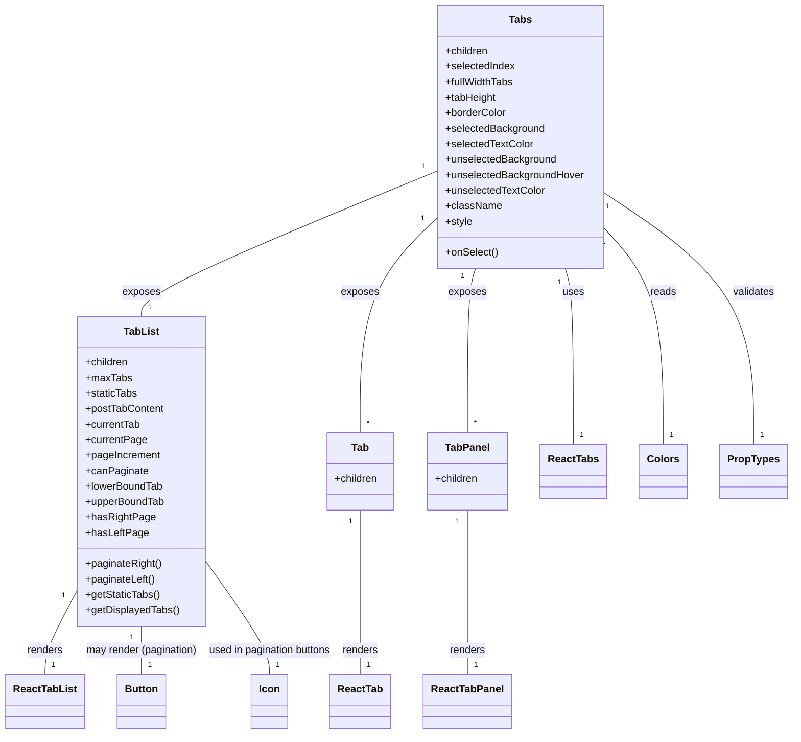

# Diagram: web/portal/src/components/molecules/Tabs.molecule.js


> Auto-generated by Obscura crawlers

## Diagram 1



### SVG

<svg id="container" width="1218.16796875" xmlns="http://www.w3.org/2000/svg" class="classDiagram" height="1136" viewBox="0 0 1218.16796875 1136" role="graphics-document document" aria-roledescription="class"><style>#container{font-family:"trebuchet ms",verdana,arial,sans-serif;font-size:16px;fill:#333;}@keyframes edge-animation-frame{from{stroke-dashoffset:0;}}@keyframes dash{to{stroke-dashoffset:0;}}#container .edge-animation-slow{stroke-dasharray:9,5!important;stroke-dashoffset:900;animation:dash 50s linear infinite;stroke-linecap:round;}#container .edge-animation-fast{stroke-dasharray:9,5!important;stroke-dashoffset:900;animation:dash 20s linear infinite;stroke-linecap:round;}#container .error-icon{fill:#552222;}#container .error-text{fill:#552222;stroke:#552222;}#container .edge-thickness-normal{stroke-width:1px;}#container .edge-thickness-thick{stroke-width:3.5px;}#container .edge-pattern-solid{stroke-dasharray:0;}#container .edge-thickness-invisible{stroke-width:0;fill:none;}#container .edge-pattern-dashed{stroke-dasharray:3;}#container .edge-pattern-dotted{stroke-dasharray:2;}#container .marker{fill:#333333;stroke:#333333;}#container .marker.cross{stroke:#333333;}#container svg{font-family:"trebuchet ms",verdana,arial,sans-serif;font-size:16px;}#container p{margin:0;}#container g.classGroup text{fill:#9370DB;stroke:none;font-family:"trebuchet ms",verdana,arial,sans-serif;font-size:10px;}#container g.classGroup text .title{font-weight:bolder;}#container .nodeLabel,#container .edgeLabel{color:#131300;}#container .edgeLabel .label rect{fill:#ECECFF;}#container .label text{fill:#131300;}#container .labelBkg{background:#ECECFF;}#container .edgeLabel .label span{background:#ECECFF;}#container .classTitle{font-weight:bolder;}#container .node rect,#container .node circle,#container .node ellipse,#container .node polygon,#container .node path{fill:#ECECFF;stroke:#9370DB;stroke-width:1px;}#container .divider{stroke:#9370DB;stroke-width:1;}#container g.clickable{cursor:pointer;}#container g.classGroup rect{fill:#ECECFF;stroke:#9370DB;}#container g.classGroup line{stroke:#9370DB;stroke-width:1;}#container .classLabel .box{stroke:none;stroke-width:0;fill:#ECECFF;opacity:0.5;}#container .classLabel .label{fill:#9370DB;font-size:10px;}#container .relation{stroke:#333333;stroke-width:1;fill:none;}#container .dashed-line{stroke-dasharray:3;}#container .dotted-line{stroke-dasharray:1 2;}#container #compositionStart,#container .composition{fill:#333333!important;stroke:#333333!important;stroke-width:1;}#container #compositionEnd,#container .composition{fill:#333333!important;stroke:#333333!important;stroke-width:1;}#container #dependencyStart,#container .dependency{fill:#333333!important;stroke:#333333!important;stroke-width:1;}#container #dependencyStart,#container .dependency{fill:#333333!important;stroke:#333333!important;stroke-width:1;}#container #extensionStart,#container .extension{fill:transparent!important;stroke:#333333!important;stroke-width:1;}#container #extensionEnd,#container .extension{fill:transparent!important;stroke:#333333!important;stroke-width:1;}#container #aggregationStart,#container .aggregation{fill:transparent!important;stroke:#333333!important;stroke-width:1;}#container #aggregationEnd,#container .aggregation{fill:transparent!important;stroke:#333333!important;stroke-width:1;}#container #lollipopStart,#container .lollipop{fill:#ECECFF!important;stroke:#333333!important;stroke-width:1;}#container #lollipopEnd,#container .lollipop{fill:#ECECFF!important;stroke:#333333!important;stroke-width:1;}#container .edgeTerminals{font-size:11px;line-height:initial;}#container .classTitleText{text-anchor:middle;font-size:18px;fill:#333;}#container .label-icon{display:inline-block;height:1em;overflow:visible;vertical-align:-0.125em;}#container .node .label-icon path{fill:currentColor;stroke:revert;stroke-width:revert;}#container :root{--mermaid-font-family:"trebuchet ms",verdana,arial,sans-serif;}</style><g><defs><marker id="container_class-aggregationStart" class="marker aggregation class" refX="18" refY="7" markerWidth="190" markerHeight="240" orient="auto"><path d="M 18,7 L9,13 L1,7 L9,1 Z"></path></marker></defs><defs><marker id="container_class-aggregationEnd" class="marker aggregation class" refX="1" refY="7" markerWidth="20" markerHeight="28" orient="auto"><path d="M 18,7 L9,13 L1,7 L9,1 Z"></path></marker></defs><defs><marker id="container_class-extensionStart" class="marker extension class" refX="18" refY="7" markerWidth="190" markerHeight="240" orient="auto"><path d="M 1,7 L18,13 V 1 Z"></path></marker></defs><defs><marker id="container_class-extensionEnd" class="marker extension class" refX="1" refY="7" markerWidth="20" markerHeight="28" orient="auto"><path d="M 1,1 V 13 L18,7 Z"></path></marker></defs><defs><marker id="container_class-compositionStart" class="marker composition class" refX="18" refY="7" markerWidth="190" markerHeight="240" orient="auto"><path d="M 18,7 L9,13 L1,7 L9,1 Z"></path></marker></defs><defs><marker id="container_class-compositionEnd" class="marker composition class" refX="1" refY="7" markerWidth="20" markerHeight="28" orient="auto"><path d="M 18,7 L9,13 L1,7 L9,1 Z"></path></marker></defs><defs><marker id="container_class-dependencyStart" class="marker dependency class" refX="6" refY="7" markerWidth="190" markerHeight="240" orient="auto"><path d="M 5,7 L9,13 L1,7 L9,1 Z"></path></marker></defs><defs><marker id="container_class-dependencyEnd" class="marker dependency class" refX="13" refY="7" markerWidth="20" markerHeight="28" orient="auto"><path d="M 18,7 L9,13 L14,7 L9,1 Z"></path></marker></defs><defs><marker id="container_class-lollipopStart" class="marker lollipop class" refX="13" refY="7" markerWidth="190" markerHeight="240" orient="auto"><circle stroke="black" fill="transparent" cx="7" cy="7" r="6"></circle></marker></defs><defs><marker id="container_class-lollipopEnd" class="marker lollipop class" refX="1" refY="7" markerWidth="190" markerHeight="240" orient="auto"><circle stroke="black" fill="transparent" cx="7" cy="7" r="6"></circle></marker></defs><g class="root"><g class="clusters"></g><g class="edgePaths"><path d="M877.624,416L879.694,422.167C881.764,428.333,885.903,440.667,887.973,486C890.043,531.333,890.043,609.667,890.043,648.833L890.043,688" id="id_Tabs_ReactTabs_1" class="edge-thickness-normal edge-pattern-solid relation" style=";;;" data-edge="true" data-et="edge" data-id="id_Tabs_ReactTabs_1" data-points="W3sieCI6ODc3LjYyMzc3NjI1Nzc4LCJ5Ijo0MTZ9LHsieCI6ODkwLjA0Mjk2ODc1LCJ5Ijo0NTN9LHsieCI6ODkwLjA0Mjk2ODc1LCJ5Ijo2ODh9XQ=="></path><path d="M114.824,915.788L106.829,930.99C98.833,946.192,82.842,976.596,74.847,997.965C66.852,1019.333,66.852,1031.667,66.852,1037.833L66.852,1044" id="id_TabList_ReactTabList_2" class="edge-thickness-normal edge-pattern-solid relation" style=";;;" data-edge="true" data-et="edge" data-id="id_TabList_ReactTabList_2" data-points="W3sieCI6MTE0LjgyNDIxODc1LCJ5Ijo5MTUuNzg4MTU0MjI1NjU0Mn0seyJ4Ijo2Ni44NTE1NjI1LCJ5IjoxMDA3fSx7IngiOjY2Ljg1MTU2MjUsInkiOjEwNDR9XQ=="></path><path d="M563.586,790L563.586,826.167C563.586,862.333,563.586,934.667,563.586,977C563.586,1019.333,563.586,1031.667,563.586,1037.833L563.586,1044" id="id_Tab_ReactTab_3" class="edge-thickness-normal edge-pattern-solid relation" style=";;;" data-edge="true" data-et="edge" data-id="id_Tab_ReactTab_3" data-points="W3sieCI6NTYzLjU4NTkzNzUsInkiOjc5MH0seyJ4Ijo1NjMuNTg1OTM3NSwieSI6MTAwN30seyJ4Ijo1NjMuNTg1OTM3NSwieSI6MTA0NH1d"></path><path d="M728.258,790L728.258,826.167C728.258,862.333,728.258,934.667,728.258,977C728.258,1019.333,728.258,1031.667,728.258,1037.833L728.258,1044" id="id_TabPanel_ReactTabPanel_4" class="edge-thickness-normal edge-pattern-solid relation" style=";;;" data-edge="true" data-et="edge" data-id="id_TabPanel_ReactTabPanel_4" data-points="W3sieCI6NzI4LjI1NzgxMjUsInkiOjc5MH0seyJ4Ijo3MjguMjU3ODEyNSwieSI6MTAwN30seyJ4Ijo3MjguMjU3ODEyNSwieSI6MTA0NH1d"></path><path d="M212.539,970L212.539,976.167C212.539,982.333,212.539,994.667,212.539,1007C212.539,1019.333,212.539,1031.667,212.539,1037.833L212.539,1044" id="id_TabList_Button_5" class="edge-thickness-normal edge-pattern-solid relation" style=";;;" data-edge="true" data-et="edge" data-id="id_TabList_Button_5" data-points="W3sieCI6MjEyLjUzOTA2MjUsInkiOjk3MH0seyJ4IjoyMTIuNTM5MDYyNSwieSI6MTAwN30seyJ4IjoyMTIuNTM5MDYyNSwieSI6MTA0NH1d"></path><path d="M310.254,861.783L328.2,885.986C346.146,910.189,382.038,958.594,399.984,988.964C417.93,1019.333,417.93,1031.667,417.93,1037.833L417.93,1044" id="id_TabList_Icon_6" class="edge-thickness-normal edge-pattern-solid relation" style=";;;" data-edge="true" data-et="edge" data-id="id_TabList_Icon_6" data-points="W3sieCI6MzEwLjI1MzkwNjI1LCJ5Ijo4NjEuNzgzMDkyNDMwNTgyfSx7IngiOjQxNy45Mjk2ODc1LCJ5IjoxMDA3fSx7IngiOjQxNy45Mjk2ODc1LCJ5IjoxMDQ0fV0="></path><path d="M937.779,355.916L952.241,372.097C966.703,388.277,995.627,420.639,1010.089,475.986C1024.551,531.333,1024.551,609.667,1024.551,648.833L1024.551,688" id="id_Tabs_Colors_7" class="edge-thickness-normal edge-pattern-solid relation" style=";;;" data-edge="true" data-et="edge" data-id="id_Tabs_Colors_7" data-points="W3sieCI6OTM3Ljc3OTI5Njg3NSwieSI6MzU1LjkxNjAxNzU5MDc4NzUzfSx7IngiOjEwMjQuNTUwNzgxMjUsInkiOjQ1M30seyJ4IjoxMDI0LjU1MDc4MTI1LCJ5Ijo2ODh9XQ=="></path><path d="M937.779,300.378L974.801,325.815C1011.823,351.252,1085.867,402.126,1122.888,466.73C1159.91,531.333,1159.91,609.667,1159.91,648.833L1159.91,688" id="id_Tabs_PropTypes_8" class="edge-thickness-normal edge-pattern-solid relation" style=";;;" data-edge="true" data-et="edge" data-id="id_Tabs_PropTypes_8" data-points="W3sieCI6OTM3Ljc3OTI5Njg3NSwieSI6MzAwLjM3ODM0MTY1Nzg5NjZ9LHsieCI6MTE1OS45MTAxNTYyNSwieSI6NDUzfSx7IngiOjExNTkuOTEwMTU2MjUsInkiOjY4OH1d"></path><path d="M680.521,263.959L602.524,295.466C524.527,326.973,368.533,389.986,290.536,427.66C212.539,465.333,212.539,477.667,212.539,483.833L212.539,490" id="id_Tabs_TabList_9" class="edge-thickness-normal edge-pattern-solid relation" style=";;;" data-edge="true" data-et="edge" data-id="id_Tabs_TabList_9" data-points="W3sieCI6NjgwLjUyMTQ4NDM3NSwieSI6MjYzLjk1OTM5OTYwMzg4MjZ9LHsieCI6MjEyLjUzOTA2MjUsInkiOjQ1M30seyJ4IjoyMTIuNTM5MDYyNSwieSI6NDkwfV0="></path><path d="M680.521,338.238L661.032,357.365C641.543,376.492,602.564,414.746,583.075,470.04C563.586,525.333,563.586,597.667,563.586,633.833L563.586,670" id="id_Tabs_Tab_10" class="edge-thickness-normal edge-pattern-solid relation" style=";;;" data-edge="true" data-et="edge" data-id="id_Tabs_Tab_10" data-points="W3sieCI6NjgwLjUyMTQ4NDM3NSwieSI6MzM4LjIzODAwMzk2MDl9LHsieCI6NTYzLjU4NTkzNzUsInkiOjQ1M30seyJ4Ijo1NjMuNTg1OTM3NSwieSI6NjcwfV0="></path><path d="M740.677,416L738.607,422.167C736.537,428.333,732.398,440.667,730.328,483C728.258,525.333,728.258,597.667,728.258,633.833L728.258,670" id="id_Tabs_TabPanel_11" class="edge-thickness-normal edge-pattern-solid relation" style=";;;" data-edge="true" data-et="edge" data-id="id_Tabs_TabPanel_11" data-points="W3sieCI6NzQwLjY3NzAwNDk5MjIyLCJ5Ijo0MTZ9LHsieCI6NzI4LjI1NzgxMjUsInkiOjQ1M30seyJ4Ijo3MjguMjU3ODEyNSwieSI6NjcwfV0="></path></g><g class="edgeLabels"><g class="edgeLabel" transform="translate(890.04296875, 453)"><g class="label" data-id="id_Tabs_ReactTabs_1" transform="translate(-16.4921875, -12)"><foreignObject width="32.984375" height="24"><div xmlns="http://www.w3.org/1999/xhtml" class="labelBkg" style="display: table-cell; white-space: nowrap; line-height: 1.5; max-width: 200px; text-align: center;"><span class="edgeLabel"><p>uses</p></span></div></foreignObject></g></g><g class="edgeLabel" transform="translate(66.8515625, 1007)"><g class="label" data-id="id_TabList_ReactTabList_2" transform="translate(-27.75, -12)"><foreignObject width="55.5" height="24"><div xmlns="http://www.w3.org/1999/xhtml" class="labelBkg" style="display: table-cell; white-space: nowrap; line-height: 1.5; max-width: 200px; text-align: center;"><span class="edgeLabel"><p>renders</p></span></div></foreignObject></g></g><g class="edgeLabel" transform="translate(563.5859375, 1007)"><g class="label" data-id="id_Tab_ReactTab_3" transform="translate(-27.75, -12)"><foreignObject width="55.5" height="24"><div xmlns="http://www.w3.org/1999/xhtml" class="labelBkg" style="display: table-cell; white-space: nowrap; line-height: 1.5; max-width: 200px; text-align: center;"><span class="edgeLabel"><p>renders</p></span></div></foreignObject></g></g><g class="edgeLabel" transform="translate(728.2578125, 1007)"><g class="label" data-id="id_TabPanel_ReactTabPanel_4" transform="translate(-27.75, -12)"><foreignObject width="55.5" height="24"><div xmlns="http://www.w3.org/1999/xhtml" class="labelBkg" style="display: table-cell; white-space: nowrap; line-height: 1.5; max-width: 200px; text-align: center;"><span class="edgeLabel"><p>renders</p></span></div></foreignObject></g></g><g class="edgeLabel" transform="translate(212.5390625, 1007)"><g class="label" data-id="id_TabList_Button_5" transform="translate(-87.484375, -12)"><foreignObject width="174.96875" height="24"><div xmlns="http://www.w3.org/1999/xhtml" class="labelBkg" style="display: table-cell; white-space: nowrap; line-height: 1.5; max-width: 200px; text-align: center;"><span class="edgeLabel"><p>may render (pagination)</p></span></div></foreignObject></g></g><g class="edgeLabel" transform="translate(417.9296875, 1007)"><g class="label" data-id="id_TabList_Icon_6" transform="translate(-97.90625, -12)"><foreignObject width="195.8125" height="24"><div xmlns="http://www.w3.org/1999/xhtml" class="labelBkg" style="display: table-cell; white-space: nowrap; line-height: 1.5; max-width: 200px; text-align: center;"><span class="edgeLabel"><p>used in pagination buttons</p></span></div></foreignObject></g></g><g class="edgeLabel" transform="translate(1024.55078125, 453)"><g class="label" data-id="id_Tabs_Colors_7" transform="translate(-20.0078125, -12)"><foreignObject width="40.015625" height="24"><div xmlns="http://www.w3.org/1999/xhtml" class="labelBkg" style="display: table-cell; white-space: nowrap; line-height: 1.5; max-width: 200px; text-align: center;"><span class="edgeLabel"><p>reads</p></span></div></foreignObject></g></g><g class="edgeLabel" transform="translate(1159.91015625, 453)"><g class="label" data-id="id_Tabs_PropTypes_8" transform="translate(-32.6875, -12)"><foreignObject width="65.375" height="24"><div xmlns="http://www.w3.org/1999/xhtml" class="labelBkg" style="display: table-cell; white-space: nowrap; line-height: 1.5; max-width: 200px; text-align: center;"><span class="edgeLabel"><p>validates</p></span></div></foreignObject></g></g><g class="edgeLabel" transform="translate(212.5390625, 453)"><g class="label" data-id="id_Tabs_TabList_9" transform="translate(-29.4296875, -12)"><foreignObject width="58.859375" height="24"><div xmlns="http://www.w3.org/1999/xhtml" class="labelBkg" style="display: table-cell; white-space: nowrap; line-height: 1.5; max-width: 200px; text-align: center;"><span class="edgeLabel"><p>exposes</p></span></div></foreignObject></g></g><g class="edgeLabel" transform="translate(563.5859375, 453)"><g class="label" data-id="id_Tabs_Tab_10" transform="translate(-29.4296875, -12)"><foreignObject width="58.859375" height="24"><div xmlns="http://www.w3.org/1999/xhtml" class="labelBkg" style="display: table-cell; white-space: nowrap; line-height: 1.5; max-width: 200px; text-align: center;"><span class="edgeLabel"><p>exposes</p></span></div></foreignObject></g></g><g class="edgeLabel" transform="translate(728.2578125, 453)"><g class="label" data-id="id_Tabs_TabPanel_11" transform="translate(-29.4296875, -12)"><foreignObject width="58.859375" height="24"><div xmlns="http://www.w3.org/1999/xhtml" class="labelBkg" style="display: table-cell; white-space: nowrap; line-height: 1.5; max-width: 200px; text-align: center;"><span class="edgeLabel"><p>exposes</p></span></div></foreignObject></g></g><g class="edgeTerminals" transform="translate(868.9720792744939, 437.3634750354361)"><g class="inner" transform="translate(0, 0)"><foreignObject style="width: 9px; height: 12px;"><div xmlns="http://www.w3.org/1999/xhtml" style="display: inline-block; padding-right: 1px; white-space: nowrap;"><span class="edgeLabel">1</span></div></foreignObject></g></g><g class="edgeTerminals" transform="translate(93.40233312771743, 924.2942014898608)"><g class="inner" transform="translate(0, 0)"><foreignObject style="width: 9px; height: 12px;"><div xmlns="http://www.w3.org/1999/xhtml" style="display: inline-block; padding-right: 1px; white-space: nowrap;"><span class="edgeLabel">1</span></div></foreignObject></g></g><g class="edgeTerminals" transform="translate(548.58593875, 807.5000010714286)"><g class="inner" transform="translate(0, 0)"><foreignObject style="width: 9px; height: 12px;"><div xmlns="http://www.w3.org/1999/xhtml" style="display: inline-block; padding-right: 1px; white-space: nowrap;"><span class="edgeLabel">1</span></div></foreignObject></g></g><g class="edgeTerminals" transform="translate(713.25781125, 807.4999989285714)"><g class="inner" transform="translate(0, 0)"><foreignObject style="width: 9px; height: 12px;"><div xmlns="http://www.w3.org/1999/xhtml" style="display: inline-block; padding-right: 1px; white-space: nowrap;"><span class="edgeLabel">1</span></div></foreignObject></g></g><g class="edgeTerminals" transform="translate(197.53906125000003, 987.4999989285715)"><g class="inner" transform="translate(0, 0)"><foreignObject style="width: 9px; height: 12px;"><div xmlns="http://www.w3.org/1999/xhtml" style="display: inline-block; padding-right: 1px; white-space: nowrap;"><span class="edgeLabel">1</span></div></foreignObject></g></g><g class="edgeTerminals" transform="translate(308.6280350954675, 884.7745376633831)"><g class="inner" transform="translate(0, 0)"><foreignObject style="width: 9px; height: 12px;"><div xmlns="http://www.w3.org/1999/xhtml" style="display: inline-block; padding-right: 1px; white-space: nowrap;"><span class="edgeLabel">1</span></div></foreignObject></g></g><g class="edgeTerminals" transform="translate(938.257303843494, 378.9599215543647)"><g class="inner" transform="translate(0, 0)"><foreignObject style="width: 9px; height: 12px;"><div xmlns="http://www.w3.org/1999/xhtml" style="display: inline-block; padding-right: 1px; white-space: nowrap;"><span class="edgeLabel">1</span></div></foreignObject></g></g><g class="edgeTerminals" transform="translate(943.7084532470287, 322.65153386855366)"><g class="inner" transform="translate(0, 0)"><foreignObject style="width: 9px; height: 12px;"><div xmlns="http://www.w3.org/1999/xhtml" style="display: inline-block; padding-right: 1px; white-space: nowrap;"><span class="edgeLabel">1</span></div></foreignObject></g></g><g class="edgeTerminals" transform="translate(658.6771625269737, 256.60578956218995)"><g class="inner" transform="translate(0, 0)"><foreignObject style="width: 9px; height: 12px;"><div xmlns="http://www.w3.org/1999/xhtml" style="display: inline-block; padding-right: 1px; white-space: nowrap;"><span class="edgeLabel">1</span></div></foreignObject></g></g><g class="edgeTerminals" transform="translate(657.5249417683096, 339.7901222884685)"><g class="inner" transform="translate(0, 0)"><foreignObject style="width: 9px; height: 12px;"><div xmlns="http://www.w3.org/1999/xhtml" style="display: inline-block; padding-right: 1px; white-space: nowrap;"><span class="edgeLabel">1</span></div></foreignObject></g></g><g class="edgeTerminals" transform="translate(720.8880638033211, 427.8172644830937)"><g class="inner" transform="translate(0, 0)"><foreignObject style="width: 9px; height: 12px;"><div xmlns="http://www.w3.org/1999/xhtml" style="display: inline-block; padding-right: 1px; white-space: nowrap;"><span class="edgeLabel">1</span></div></foreignObject></g></g><g class="edgeTerminals" transform="translate(900.042969375, 665.5000005357143)"><g class="inner" transform="translate(0, 0)"></g><foreignObject style="width: 9px; height: 12px;"><div xmlns="http://www.w3.org/1999/xhtml" style="display: inline-block; padding-right: 1px; white-space: nowrap;"><span class="edgeLabel">1</span></div></foreignObject></g><g class="edgeTerminals" transform="translate(76.85156124999996, 1021.4999989285714)"><g class="inner" transform="translate(0, 0)"></g><foreignObject style="width: 9px; height: 12px;"><div xmlns="http://www.w3.org/1999/xhtml" style="display: inline-block; padding-right: 1px; white-space: nowrap;"><span class="edgeLabel">1</span></div></foreignObject></g><g class="edgeTerminals" transform="translate(573.58593875, 1021.5000010714286)"><g class="inner" transform="translate(0, 0)"></g><foreignObject style="width: 9px; height: 12px;"><div xmlns="http://www.w3.org/1999/xhtml" style="display: inline-block; padding-right: 1px; white-space: nowrap;"><span class="edgeLabel">1</span></div></foreignObject></g><g class="edgeTerminals" transform="translate(738.25781125, 1021.4999989285714)"><g class="inner" transform="translate(0, 0)"></g><foreignObject style="width: 9px; height: 12px;"><div xmlns="http://www.w3.org/1999/xhtml" style="display: inline-block; padding-right: 1px; white-space: nowrap;"><span class="edgeLabel">1</span></div></foreignObject></g><g class="edgeTerminals" transform="translate(222.53906124999997, 1021.4999989285714)"><g class="inner" transform="translate(0, 0)"></g><foreignObject style="width: 9px; height: 12px;"><div xmlns="http://www.w3.org/1999/xhtml" style="display: inline-block; padding-right: 1px; white-space: nowrap;"><span class="edgeLabel">1</span></div></foreignObject></g><g class="edgeTerminals" transform="translate(427.9296887499999, 1021.5000010714286)"><g class="inner" transform="translate(0, 0)"></g><foreignObject style="width: 9px; height: 12px;"><div xmlns="http://www.w3.org/1999/xhtml" style="display: inline-block; padding-right: 1px; white-space: nowrap;"><span class="edgeLabel">1</span></div></foreignObject></g><g class="edgeTerminals" transform="translate(1034.550780625, 665.4999994642857)"><g class="inner" transform="translate(0, 0)"></g><foreignObject style="width: 9px; height: 12px;"><div xmlns="http://www.w3.org/1999/xhtml" style="display: inline-block; padding-right: 1px; white-space: nowrap;"><span class="edgeLabel">1</span></div></foreignObject></g><g class="edgeTerminals" transform="translate(1169.910158125, 665.5000016071428)"><g class="inner" transform="translate(0, 0)"></g><foreignObject style="width: 9px; height: 12px;"><div xmlns="http://www.w3.org/1999/xhtml" style="display: inline-block; padding-right: 1px; white-space: nowrap;"><span class="edgeLabel">1</span></div></foreignObject></g><g class="edgeTerminals" transform="translate(222.53906124999997, 467.4999989285714)"><g class="inner" transform="translate(0, 0)"></g><foreignObject style="width: 9px; height: 12px;"><div xmlns="http://www.w3.org/1999/xhtml" style="display: inline-block; padding-right: 1px; white-space: nowrap;"><span class="edgeLabel">1</span></div></foreignObject></g><g class="edgeTerminals" transform="translate(573.58593875, 647.5000010714286)"><g class="inner" transform="translate(0, 0)"></g><foreignObject style="width: 9px; height: 12px;"><div xmlns="http://www.w3.org/1999/xhtml" style="display: inline-block; padding-right: 1px; white-space: nowrap;"><span class="edgeLabel">*</span></div></foreignObject></g><g class="edgeTerminals" transform="translate(738.25781125, 647.4999989285714)"><g class="inner" transform="translate(0, 0)"></g><foreignObject style="width: 9px; height: 12px;"><div xmlns="http://www.w3.org/1999/xhtml" style="display: inline-block; padding-right: 1px; white-space: nowrap;"><span class="edgeLabel">*</span></div></foreignObject></g></g><g class="nodes"><g class="node default" id="classId-Tabs-0" transform="translate(809.150390625, 212)"><g class="basic label-container"><path d="M-128.62890625 -204 L128.62890625 -204 L128.62890625 204 L-128.62890625 204" stroke="none" stroke-width="0" fill="#ECECFF" style=""></path><path d="M-128.62890625 -204 C-35.27524804885154 -204, 58.078410152296925 -204, 128.62890625 -204 M-128.62890625 -204 C-47.21330030676957 -204, 34.20230563646086 -204, 128.62890625 -204 M128.62890625 -204 C128.62890625 -81.45506122769328, 128.62890625 41.089877544613444, 128.62890625 204 M128.62890625 -204 C128.62890625 -61.065896030746956, 128.62890625 81.86820793850609, 128.62890625 204 M128.62890625 204 C70.99164095660653 204, 13.354375663213062 204, -128.62890625 204 M128.62890625 204 C48.58335820690978 204, -31.462189836180443 204, -128.62890625 204 M-128.62890625 204 C-128.62890625 64.17207328510003, -128.62890625 -75.65585342979995, -128.62890625 -204 M-128.62890625 204 C-128.62890625 48.39073001601224, -128.62890625 -107.21853996797552, -128.62890625 -204" stroke="#9370DB" stroke-width="1.3" fill="none" stroke-dasharray="0 0" style=""></path></g><g class="annotation-group text" transform="translate(0, -180)"></g><g class="label-group text" transform="translate(-16.9453125, -180)"><g class="label" style="font-weight: bolder" transform="translate(0,-12)"><foreignObject width="33.890625" height="24"><div xmlns="http://www.w3.org/1999/xhtml" style="display: table-cell; white-space: nowrap; line-height: 1.5; max-width: 83px; text-align: center;"><span class="nodeLabel markdown-node-label" style=""><p>Tabs</p></span></div></foreignObject></g></g><g class="members-group text" transform="translate(-116.62890625, -132)"><g class="label" style="" transform="translate(0,-12)"><foreignObject width="67.5" height="24"><div xmlns="http://www.w3.org/1999/xhtml" style="display: table-cell; white-space: nowrap; line-height: 1.5; max-width: 125px; text-align: center;"><span class="nodeLabel markdown-node-label" style=""><p>+children</p></span></div></foreignObject></g><g class="label" style="" transform="translate(0,12)"><foreignObject width="108.984375" height="24"><div xmlns="http://www.w3.org/1999/xhtml" style="display: table-cell; white-space: nowrap; line-height: 1.5; max-width: 167px; text-align: center;"><span class="nodeLabel markdown-node-label" style=""><p>+selectedIndex</p></span></div></foreignObject></g><g class="label" style="" transform="translate(0,36)"><foreignObject width="107.40625" height="24"><div xmlns="http://www.w3.org/1999/xhtml" style="display: table-cell; white-space: nowrap; line-height: 1.5; max-width: 165px; text-align: center;"><span class="nodeLabel markdown-node-label" style=""><p>+fullWidthTabs</p></span></div></foreignObject></g><g class="label" style="" transform="translate(0,60)"><foreignObject width="79.375" height="24"><div xmlns="http://www.w3.org/1999/xhtml" style="display: table-cell; white-space: nowrap; line-height: 1.5; max-width: 137px; text-align: center;"><span class="nodeLabel markdown-node-label" style=""><p>+tabHeight</p></span></div></foreignObject></g><g class="label" style="" transform="translate(0,84)"><foreignObject width="95.109375" height="24"><div xmlns="http://www.w3.org/1999/xhtml" style="display: table-cell; white-space: nowrap; line-height: 1.5; max-width: 153px; text-align: center;"><span class="nodeLabel markdown-node-label" style=""><p>+borderColor</p></span></div></foreignObject></g><g class="label" style="" transform="translate(0,108)"><foreignObject width="154.765625" height="24"><div xmlns="http://www.w3.org/1999/xhtml" style="display: table-cell; white-space: nowrap; line-height: 1.5; max-width: 212px; text-align: center;"><span class="nodeLabel markdown-node-label" style=""><p>+selectedBackground</p></span></div></foreignObject></g><g class="label" style="" transform="translate(0,132)"><foreignObject width="136.59375" height="24"><div xmlns="http://www.w3.org/1999/xhtml" style="display: table-cell; white-space: nowrap; line-height: 1.5; max-width: 195px; text-align: center;"><span class="nodeLabel markdown-node-label" style=""><p>+selectedTextColor</p></span></div></foreignObject></g><g class="label" style="" transform="translate(0,156)"><foreignObject width="173.453125" height="24"><div xmlns="http://www.w3.org/1999/xhtml" style="display: table-cell; white-space: nowrap; line-height: 1.5; max-width: 231px; text-align: center;"><span class="nodeLabel markdown-node-label" style=""><p>+unselectedBackground</p></span></div></foreignObject></g><g class="label" style="" transform="translate(0,180)"><foreignObject width="216.3125" height="24"><div xmlns="http://www.w3.org/1999/xhtml" style="display: table-cell; white-space: nowrap; line-height: 1.5; max-width: 274px; text-align: center;"><span class="nodeLabel markdown-node-label" style=""><p>+unselectedBackgroundHover</p></span></div></foreignObject></g><g class="label" style="" transform="translate(0,204)"><foreignObject width="155.28125" height="24"><div xmlns="http://www.w3.org/1999/xhtml" style="display: table-cell; white-space: nowrap; line-height: 1.5; max-width: 213px; text-align: center;"><span class="nodeLabel markdown-node-label" style=""><p>+unselectedTextColor</p></span></div></foreignObject></g><g class="label" style="" transform="translate(0,228)"><foreignObject width="85.640625" height="24"><div xmlns="http://www.w3.org/1999/xhtml" style="display: table-cell; white-space: nowrap; line-height: 1.5; max-width: 143px; text-align: center;"><span class="nodeLabel markdown-node-label" style=""><p>+className</p></span></div></foreignObject></g><g class="label" style="" transform="translate(0,252)"><foreignObject width="42.359375" height="24"><div xmlns="http://www.w3.org/1999/xhtml" style="display: table-cell; white-space: nowrap; line-height: 1.5; max-width: 100px; text-align: center;"><span class="nodeLabel markdown-node-label" style=""><p>+style</p></span></div></foreignObject></g></g><g class="methods-group text" transform="translate(-116.62890625, 180)"><g class="label" style="" transform="translate(0,-12)"><foreignObject width="81.265625" height="24"><div xmlns="http://www.w3.org/1999/xhtml" style="display: table-cell; white-space: nowrap; line-height: 1.5; max-width: 139px; text-align: center;"><span class="nodeLabel markdown-node-label" style=""><p>+onSelect()</p></span></div></foreignObject></g></g><g class="divider" style=""><path d="M-128.62890625 -156 C-75.13886439895865 -156, -21.64882254791729 -156, 128.62890625 -156 M-128.62890625 -156 C-73.80288629753625 -156, -18.97686634507248 -156, 128.62890625 -156" stroke="#9370DB" stroke-width="1.3" fill="none" stroke-dasharray="0 0" style=""></path></g><g class="divider" style=""><path d="M-128.62890625 156 C-44.11253788463935 156, 40.4038304807213 156, 128.62890625 156 M-128.62890625 156 C-38.64602753906014 156, 51.336851171879715 156, 128.62890625 156" stroke="#9370DB" stroke-width="1.3" fill="none" stroke-dasharray="0 0" style=""></path></g></g><g class="node default" id="classId-TabList-1" transform="translate(212.5390625, 730)"><g class="basic label-container"><path d="M-97.71484375 -240 L97.71484375 -240 L97.71484375 240 L-97.71484375 240" stroke="none" stroke-width="0" fill="#ECECFF" style=""></path><path d="M-97.71484375 -240 C-21.078615541575033 -240, 55.557612666849934 -240, 97.71484375 -240 M-97.71484375 -240 C-31.78036131503076 -240, 34.15412111993848 -240, 97.71484375 -240 M97.71484375 -240 C97.71484375 -92.58549642538532, 97.71484375 54.82900714922937, 97.71484375 240 M97.71484375 -240 C97.71484375 -78.64110697635482, 97.71484375 82.71778604729036, 97.71484375 240 M97.71484375 240 C33.64268710563364 240, -30.429469538732718 240, -97.71484375 240 M97.71484375 240 C36.73549155565244 240, -24.243860638695125 240, -97.71484375 240 M-97.71484375 240 C-97.71484375 63.71947515240174, -97.71484375 -112.56104969519652, -97.71484375 -240 M-97.71484375 240 C-97.71484375 125.67732920072552, -97.71484375 11.354658401451047, -97.71484375 -240" stroke="#9370DB" stroke-width="1.3" fill="none" stroke-dasharray="0 0" style=""></path></g><g class="annotation-group text" transform="translate(0, -216)"></g><g class="label-group text" transform="translate(-26.3984375, -216)"><g class="label" style="font-weight: bolder" transform="translate(0,-12)"><foreignObject width="52.796875" height="24"><div xmlns="http://www.w3.org/1999/xhtml" style="display: table-cell; white-space: nowrap; line-height: 1.5; max-width: 102px; text-align: center;"><span class="nodeLabel markdown-node-label" style=""><p>TabList</p></span></div></foreignObject></g></g><g class="members-group text" transform="translate(-85.71484375, -168)"><g class="label" style="" transform="translate(0,-12)"><foreignObject width="67.5" height="24"><div xmlns="http://www.w3.org/1999/xhtml" style="display: table-cell; white-space: nowrap; line-height: 1.5; max-width: 125px; text-align: center;"><span class="nodeLabel markdown-node-label" style=""><p>+children</p></span></div></foreignObject></g><g class="label" style="" transform="translate(0,12)"><foreignObject width="71.3125" height="24"><div xmlns="http://www.w3.org/1999/xhtml" style="display: table-cell; white-space: nowrap; line-height: 1.5; max-width: 129px; text-align: center;"><span class="nodeLabel markdown-node-label" style=""><p>+maxTabs</p></span></div></foreignObject></g><g class="label" style="" transform="translate(0,36)"><foreignObject width="80.921875" height="24"><div xmlns="http://www.w3.org/1999/xhtml" style="display: table-cell; white-space: nowrap; line-height: 1.5; max-width: 138px; text-align: center;"><span class="nodeLabel markdown-node-label" style=""><p>+staticTabs</p></span></div></foreignObject></g><g class="label" style="" transform="translate(0,60)"><foreignObject width="122.53125" height="24"><div xmlns="http://www.w3.org/1999/xhtml" style="display: table-cell; white-space: nowrap; line-height: 1.5; max-width: 180px; text-align: center;"><span class="nodeLabel markdown-node-label" style=""><p>+postTabContent</p></span></div></foreignObject></g><g class="label" style="" transform="translate(0,84)"><foreignObject width="86.21875" height="24"><div xmlns="http://www.w3.org/1999/xhtml" style="display: table-cell; white-space: nowrap; line-height: 1.5; max-width: 144px; text-align: center;"><span class="nodeLabel markdown-node-label" style=""><p>+currentTab</p></span></div></foreignObject></g><g class="label" style="" transform="translate(0,108)"><foreignObject width="94.28125" height="24"><div xmlns="http://www.w3.org/1999/xhtml" style="display: table-cell; white-space: nowrap; line-height: 1.5; max-width: 152px; text-align: center;"><span class="nodeLabel markdown-node-label" style=""><p>+currentPage</p></span></div></foreignObject></g><g class="label" style="" transform="translate(0,132)"><foreignObject width="116.40625" height="24"><div xmlns="http://www.w3.org/1999/xhtml" style="display: table-cell; white-space: nowrap; line-height: 1.5; max-width: 174px; text-align: center;"><span class="nodeLabel markdown-node-label" style=""><p>+pageIncrement</p></span></div></foreignObject></g><g class="label" style="" transform="translate(0,156)"><foreignObject width="95.6875" height="24"><div xmlns="http://www.w3.org/1999/xhtml" style="display: table-cell; white-space: nowrap; line-height: 1.5; max-width: 153px; text-align: center;"><span class="nodeLabel markdown-node-label" style=""><p>+canPaginate</p></span></div></foreignObject></g><g class="label" style="" transform="translate(0,180)"><foreignObject width="121.3125" height="24"><div xmlns="http://www.w3.org/1999/xhtml" style="display: table-cell; white-space: nowrap; line-height: 1.5; max-width: 179px; text-align: center;"><span class="nodeLabel markdown-node-label" style=""><p>+lowerBoundTab</p></span></div></foreignObject></g><g class="label" style="" transform="translate(0,204)"><foreignObject width="124.21875" height="24"><div xmlns="http://www.w3.org/1999/xhtml" style="display: table-cell; white-space: nowrap; line-height: 1.5; max-width: 182px; text-align: center;"><span class="nodeLabel markdown-node-label" style=""><p>+upperBoundTab</p></span></div></foreignObject></g><g class="label" style="" transform="translate(0,228)"><foreignObject width="104.796875" height="24"><div xmlns="http://www.w3.org/1999/xhtml" style="display: table-cell; white-space: nowrap; line-height: 1.5; max-width: 162px; text-align: center;"><span class="nodeLabel markdown-node-label" style=""><p>+hasRightPage</p></span></div></foreignObject></g><g class="label" style="" transform="translate(0,252)"><foreignObject width="94.546875" height="24"><div xmlns="http://www.w3.org/1999/xhtml" style="display: table-cell; white-space: nowrap; line-height: 1.5; max-width: 152px; text-align: center;"><span class="nodeLabel markdown-node-label" style=""><p>+hasLeftPage</p></span></div></foreignObject></g></g><g class="methods-group text" transform="translate(-85.71484375, 144)"><g class="label" style="" transform="translate(0,-12)"><foreignObject width="119.078125" height="24"><div xmlns="http://www.w3.org/1999/xhtml" style="display: table-cell; white-space: nowrap; line-height: 1.5; max-width: 176px; text-align: center;"><span class="nodeLabel markdown-node-label" style=""><p>+paginateRight()</p></span></div></foreignObject></g><g class="label" style="" transform="translate(0,12)"><foreignObject width="108.84375" height="24"><div xmlns="http://www.w3.org/1999/xhtml" style="display: table-cell; white-space: nowrap; line-height: 1.5; max-width: 166px; text-align: center;"><span class="nodeLabel markdown-node-label" style=""><p>+paginateLeft()</p></span></div></foreignObject></g><g class="label" style="" transform="translate(0,36)"><foreignObject width="115.09375" height="24"><div xmlns="http://www.w3.org/1999/xhtml" style="display: table-cell; white-space: nowrap; line-height: 1.5; max-width: 172px; text-align: center;"><span class="nodeLabel markdown-node-label" style=""><p>+getStaticTabs()</p></span></div></foreignObject></g><g class="label" style="" transform="translate(0,60)"><foreignObject width="145.03125" height="24"><div xmlns="http://www.w3.org/1999/xhtml" style="display: table-cell; white-space: nowrap; line-height: 1.5; max-width: 202px; text-align: center;"><span class="nodeLabel markdown-node-label" style=""><p>+getDisplayedTabs()</p></span></div></foreignObject></g></g><g class="divider" style=""><path d="M-97.71484375 -192 C-21.97807906561367 -192, 53.75868561877266 -192, 97.71484375 -192 M-97.71484375 -192 C-31.44668378466784 -192, 34.82147618066432 -192, 97.71484375 -192" stroke="#9370DB" stroke-width="1.3" fill="none" stroke-dasharray="0 0" style=""></path></g><g class="divider" style=""><path d="M-97.71484375 120 C-51.54604766519214 120, -5.377251580384282 120, 97.71484375 120 M-97.71484375 120 C-22.971306027698887 120, 51.772231694602226 120, 97.71484375 120" stroke="#9370DB" stroke-width="1.3" fill="none" stroke-dasharray="0 0" style=""></path></g></g><g class="node default" id="classId-Tab-2" transform="translate(563.5859375, 730)"><g class="basic label-container"><path d="M-52.29296875 -60 L52.29296875 -60 L52.29296875 60 L-52.29296875 60" stroke="none" stroke-width="0" fill="#ECECFF" style=""></path><path d="M-52.29296875 -60 C-30.086246145155997 -60, -7.879523540311993 -60, 52.29296875 -60 M-52.29296875 -60 C-12.300345011198601 -60, 27.692278727602798 -60, 52.29296875 -60 M52.29296875 -60 C52.29296875 -22.178348226768826, 52.29296875 15.643303546462349, 52.29296875 60 M52.29296875 -60 C52.29296875 -21.40240779158828, 52.29296875 17.195184416823437, 52.29296875 60 M52.29296875 60 C14.833695203748427 60, -22.625578342503147 60, -52.29296875 60 M52.29296875 60 C27.957113556380836 60, 3.6212583627616723 60, -52.29296875 60 M-52.29296875 60 C-52.29296875 29.450731282289166, -52.29296875 -1.0985374354216688, -52.29296875 -60 M-52.29296875 60 C-52.29296875 25.301706932165516, -52.29296875 -9.396586135668969, -52.29296875 -60" stroke="#9370DB" stroke-width="1.3" fill="none" stroke-dasharray="0 0" style=""></path></g><g class="annotation-group text" transform="translate(0, -36)"></g><g class="label-group text" transform="translate(-13.0859375, -36)"><g class="label" style="font-weight: bolder" transform="translate(0,-12)"><foreignObject width="26.171875" height="24"><div xmlns="http://www.w3.org/1999/xhtml" style="display: table-cell; white-space: nowrap; line-height: 1.5; max-width: 76px; text-align: center;"><span class="nodeLabel markdown-node-label" style=""><p>Tab</p></span></div></foreignObject></g></g><g class="members-group text" transform="translate(-40.29296875, 12)"><g class="label" style="" transform="translate(0,-12)"><foreignObject width="67.5" height="24"><div xmlns="http://www.w3.org/1999/xhtml" style="display: table-cell; white-space: nowrap; line-height: 1.5; max-width: 125px; text-align: center;"><span class="nodeLabel markdown-node-label" style=""><p>+children</p></span></div></foreignObject></g></g><g class="methods-group text" transform="translate(-40.29296875, 60)"></g><g class="divider" style=""><path d="M-52.29296875 -12 C-24.035229107115054 -12, 4.222510535769892 -12, 52.29296875 -12 M-52.29296875 -12 C-23.666712203036774 -12, 4.959544343926453 -12, 52.29296875 -12" stroke="#9370DB" stroke-width="1.3" fill="none" stroke-dasharray="0 0" style=""></path></g><g class="divider" style=""><path d="M-52.29296875 36 C-21.23139665013126 36, 9.830175449737482 36, 52.29296875 36 M-52.29296875 36 C-20.583674180201637 36, 11.125620389596726 36, 52.29296875 36" stroke="#9370DB" stroke-width="1.3" fill="none" stroke-dasharray="0 0" style=""></path></g></g><g class="node default" id="classId-TabPanel-3" transform="translate(728.2578125, 730)"><g class="basic label-container"><path d="M-62.37890625 -60 L62.37890625 -60 L62.37890625 60 L-62.37890625 60" stroke="none" stroke-width="0" fill="#ECECFF" style=""></path><path d="M-62.37890625 -60 C-30.14987555466014 -60, 2.079155140679717 -60, 62.37890625 -60 M-62.37890625 -60 C-29.477191129705318 -60, 3.424523990589364 -60, 62.37890625 -60 M62.37890625 -60 C62.37890625 -18.71566749164282, 62.37890625 22.568665016714363, 62.37890625 60 M62.37890625 -60 C62.37890625 -33.84585803585246, 62.37890625 -7.691716071704917, 62.37890625 60 M62.37890625 60 C32.70203857172365 60, 3.025170893447296 60, -62.37890625 60 M62.37890625 60 C31.78181590649401 60, 1.184725562988021 60, -62.37890625 60 M-62.37890625 60 C-62.37890625 22.071987090946514, -62.37890625 -15.856025818106971, -62.37890625 -60 M-62.37890625 60 C-62.37890625 17.432944154499864, -62.37890625 -25.13411169100027, -62.37890625 -60" stroke="#9370DB" stroke-width="1.3" fill="none" stroke-dasharray="0 0" style=""></path></g><g class="annotation-group text" transform="translate(0, -36)"></g><g class="label-group text" transform="translate(-33.2578125, -36)"><g class="label" style="font-weight: bolder" transform="translate(0,-12)"><foreignObject width="66.515625" height="24"><div xmlns="http://www.w3.org/1999/xhtml" style="display: table-cell; white-space: nowrap; line-height: 1.5; max-width: 116px; text-align: center;"><span class="nodeLabel markdown-node-label" style=""><p>TabPanel</p></span></div></foreignObject></g></g><g class="members-group text" transform="translate(-50.37890625, 12)"><g class="label" style="" transform="translate(0,-12)"><foreignObject width="67.5" height="24"><div xmlns="http://www.w3.org/1999/xhtml" style="display: table-cell; white-space: nowrap; line-height: 1.5; max-width: 125px; text-align: center;"><span class="nodeLabel markdown-node-label" style=""><p>+children</p></span></div></foreignObject></g></g><g class="methods-group text" transform="translate(-50.37890625, 60)"></g><g class="divider" style=""><path d="M-62.37890625 -12 C-18.662970901741843 -12, 25.052964446516313 -12, 62.37890625 -12 M-62.37890625 -12 C-26.01857776352943 -12, 10.341750722941143 -12, 62.37890625 -12" stroke="#9370DB" stroke-width="1.3" fill="none" stroke-dasharray="0 0" style=""></path></g><g class="divider" style=""><path d="M-62.37890625 36 C-29.216305134309415 36, 3.9462959813811693 36, 62.37890625 36 M-62.37890625 36 C-36.69815910596732 36, -11.017411961934634 36, 62.37890625 36" stroke="#9370DB" stroke-width="1.3" fill="none" stroke-dasharray="0 0" style=""></path></g></g><g class="node default" id="classId-ReactTabs-4" transform="translate(890.04296875, 730)"><g class="basic label-container"><path d="M-49.40625 -42 L49.40625 -42 L49.40625 42 L-49.40625 42" stroke="none" stroke-width="0" fill="#ECECFF" style=""></path><path d="M-49.40625 -42 C-28.37501305318979 -42, -7.343776106379579 -42, 49.40625 -42 M-49.40625 -42 C-16.074112909200515 -42, 17.25802418159897 -42, 49.40625 -42 M49.40625 -42 C49.40625 -16.953814558132553, 49.40625 8.092370883734894, 49.40625 42 M49.40625 -42 C49.40625 -13.680062308015007, 49.40625 14.639875383969986, 49.40625 42 M49.40625 42 C20.044997708574687 42, -9.316254582850625 42, -49.40625 42 M49.40625 42 C19.670677122579058 42, -10.064895754841885 42, -49.40625 42 M-49.40625 42 C-49.40625 10.351158731749805, -49.40625 -21.29768253650039, -49.40625 -42 M-49.40625 42 C-49.40625 22.545485482540897, -49.40625 3.0909709650817945, -49.40625 -42" stroke="#9370DB" stroke-width="1.3" fill="none" stroke-dasharray="0 0" style=""></path></g><g class="annotation-group text" transform="translate(0, -18)"></g><g class="label-group text" transform="translate(-37.40625, -18)"><g class="label" style="font-weight: bolder" transform="translate(0,-12)"><foreignObject width="74.8125" height="24"><div xmlns="http://www.w3.org/1999/xhtml" style="display: table-cell; white-space: nowrap; line-height: 1.5; max-width: 123px; text-align: center;"><span class="nodeLabel markdown-node-label" style=""><p>ReactTabs</p></span></div></foreignObject></g></g><g class="members-group text" transform="translate(-37.40625, 30)"></g><g class="methods-group text" transform="translate(-37.40625, 60)"></g><g class="divider" style=""><path d="M-49.40625 6 C-9.913422690105463 6, 29.579404619789074 6, 49.40625 6 M-49.40625 6 C-20.88556963114769 6, 7.635110737704622 6, 49.40625 6" stroke="#9370DB" stroke-width="1.3" fill="none" stroke-dasharray="0 0" style=""></path></g><g class="divider" style=""><path d="M-49.40625 24 C-28.030254162251868 24, -6.654258324503736 24, 49.40625 24 M-49.40625 24 C-18.954753606597304 24, 11.496742786805392 24, 49.40625 24" stroke="#9370DB" stroke-width="1.3" fill="none" stroke-dasharray="0 0" style=""></path></g></g><g class="node default" id="classId-ReactTabList-5" transform="translate(66.8515625, 1086)"><g class="basic label-container"><path d="M-58.8515625 -42 L58.8515625 -42 L58.8515625 42 L-58.8515625 42" stroke="none" stroke-width="0" fill="#ECECFF" style=""></path><path d="M-58.8515625 -42 C-32.568821108512125 -42, -6.2860797170242435 -42, 58.8515625 -42 M-58.8515625 -42 C-14.435116193135357 -42, 29.981330113729285 -42, 58.8515625 -42 M58.8515625 -42 C58.8515625 -24.057963605212205, 58.8515625 -6.11592721042441, 58.8515625 42 M58.8515625 -42 C58.8515625 -12.6806626783363, 58.8515625 16.6386746433274, 58.8515625 42 M58.8515625 42 C14.610508684766522 42, -29.630545130466956 42, -58.8515625 42 M58.8515625 42 C15.27873445029087 42, -28.29409359941826 42, -58.8515625 42 M-58.8515625 42 C-58.8515625 24.167997104369867, -58.8515625 6.335994208739734, -58.8515625 -42 M-58.8515625 42 C-58.8515625 22.756972682588113, -58.8515625 3.5139453651762267, -58.8515625 -42" stroke="#9370DB" stroke-width="1.3" fill="none" stroke-dasharray="0 0" style=""></path></g><g class="annotation-group text" transform="translate(0, -18)"></g><g class="label-group text" transform="translate(-46.8515625, -18)"><g class="label" style="font-weight: bolder" transform="translate(0,-12)"><foreignObject width="93.703125" height="24"><div xmlns="http://www.w3.org/1999/xhtml" style="display: table-cell; white-space: nowrap; line-height: 1.5; max-width: 142px; text-align: center;"><span class="nodeLabel markdown-node-label" style=""><p>ReactTabList</p></span></div></foreignObject></g></g><g class="members-group text" transform="translate(-46.8515625, 30)"></g><g class="methods-group text" transform="translate(-46.8515625, 60)"></g><g class="divider" style=""><path d="M-58.8515625 6 C-23.4354036514559 6, 11.9807551970882 6, 58.8515625 6 M-58.8515625 6 C-24.773257096123785 6, 9.305048307752429 6, 58.8515625 6" stroke="#9370DB" stroke-width="1.3" fill="none" stroke-dasharray="0 0" style=""></path></g><g class="divider" style=""><path d="M-58.8515625 24 C-13.903553421172418 24, 31.044455657655163 24, 58.8515625 24 M-58.8515625 24 C-13.18370754688791 24, 32.48414740622418 24, 58.8515625 24" stroke="#9370DB" stroke-width="1.3" fill="none" stroke-dasharray="0 0" style=""></path></g></g><g class="node default" id="classId-ReactTab-6" transform="translate(563.5859375, 1086)"><g class="basic label-container"><path d="M-45.5390625 -42 L45.5390625 -42 L45.5390625 42 L-45.5390625 42" stroke="none" stroke-width="0" fill="#ECECFF" style=""></path><path d="M-45.5390625 -42 C-17.624459599999156 -42, 10.290143300001688 -42, 45.5390625 -42 M-45.5390625 -42 C-26.103111190856936 -42, -6.6671598817138715 -42, 45.5390625 -42 M45.5390625 -42 C45.5390625 -17.51729193558063, 45.5390625 6.96541612883874, 45.5390625 42 M45.5390625 -42 C45.5390625 -21.831439044848953, 45.5390625 -1.6628780896979052, 45.5390625 42 M45.5390625 42 C17.295323518109043 42, -10.948415463781913 42, -45.5390625 42 M45.5390625 42 C13.400194383576434 42, -18.738673732847133 42, -45.5390625 42 M-45.5390625 42 C-45.5390625 20.87365372110939, -45.5390625 -0.25269255778121646, -45.5390625 -42 M-45.5390625 42 C-45.5390625 14.930744352285938, -45.5390625 -12.138511295428124, -45.5390625 -42" stroke="#9370DB" stroke-width="1.3" fill="none" stroke-dasharray="0 0" style=""></path></g><g class="annotation-group text" transform="translate(0, -18)"></g><g class="label-group text" transform="translate(-33.5390625, -18)"><g class="label" style="font-weight: bolder" transform="translate(0,-12)"><foreignObject width="67.078125" height="24"><div xmlns="http://www.w3.org/1999/xhtml" style="display: table-cell; white-space: nowrap; line-height: 1.5; max-width: 116px; text-align: center;"><span class="nodeLabel markdown-node-label" style=""><p>ReactTab</p></span></div></foreignObject></g></g><g class="members-group text" transform="translate(-33.5390625, 30)"></g><g class="methods-group text" transform="translate(-33.5390625, 60)"></g><g class="divider" style=""><path d="M-45.5390625 6 C-10.804435167919806 6, 23.93019216416039 6, 45.5390625 6 M-45.5390625 6 C-21.297909025137 6, 2.943244449726002 6, 45.5390625 6" stroke="#9370DB" stroke-width="1.3" fill="none" stroke-dasharray="0 0" style=""></path></g><g class="divider" style=""><path d="M-45.5390625 24 C-10.939394707998275 24, 23.66027308400345 24, 45.5390625 24 M-45.5390625 24 C-19.854798435855123 24, 5.8294656282897535 24, 45.5390625 24" stroke="#9370DB" stroke-width="1.3" fill="none" stroke-dasharray="0 0" style=""></path></g></g><g class="node default" id="classId-ReactTabPanel-7" transform="translate(728.2578125, 1086)"><g class="basic label-container"><path d="M-65.71875 -42 L65.71875 -42 L65.71875 42 L-65.71875 42" stroke="none" stroke-width="0" fill="#ECECFF" style=""></path><path d="M-65.71875 -42 C-15.528806577219079 -42, 34.66113684556184 -42, 65.71875 -42 M-65.71875 -42 C-38.0960376437736 -42, -10.473325287547198 -42, 65.71875 -42 M65.71875 -42 C65.71875 -25.1382204202347, 65.71875 -8.276440840469398, 65.71875 42 M65.71875 -42 C65.71875 -23.820993845767184, 65.71875 -5.641987691534368, 65.71875 42 M65.71875 42 C23.23745978326457 42, -19.243830433470862 42, -65.71875 42 M65.71875 42 C14.765297419890786 42, -36.18815516021843 42, -65.71875 42 M-65.71875 42 C-65.71875 23.20137954700178, -65.71875 4.402759094003557, -65.71875 -42 M-65.71875 42 C-65.71875 17.05982831013501, -65.71875 -7.880343379729979, -65.71875 -42" stroke="#9370DB" stroke-width="1.3" fill="none" stroke-dasharray="0 0" style=""></path></g><g class="annotation-group text" transform="translate(0, -18)"></g><g class="label-group text" transform="translate(-53.71875, -18)"><g class="label" style="font-weight: bolder" transform="translate(0,-12)"><foreignObject width="107.4375" height="24"><div xmlns="http://www.w3.org/1999/xhtml" style="display: table-cell; white-space: nowrap; line-height: 1.5; max-width: 156px; text-align: center;"><span class="nodeLabel markdown-node-label" style=""><p>ReactTabPanel</p></span></div></foreignObject></g></g><g class="members-group text" transform="translate(-53.71875, 30)"></g><g class="methods-group text" transform="translate(-53.71875, 60)"></g><g class="divider" style=""><path d="M-65.71875 6 C-34.69582103885596 6, -3.6728920777119214 6, 65.71875 6 M-65.71875 6 C-15.35437773917743 6, 35.00999452164514 6, 65.71875 6" stroke="#9370DB" stroke-width="1.3" fill="none" stroke-dasharray="0 0" style=""></path></g><g class="divider" style=""><path d="M-65.71875 24 C-13.614656082908425 24, 38.48943783418315 24, 65.71875 24 M-65.71875 24 C-22.15217534269403 24, 21.41439931461194 24, 65.71875 24" stroke="#9370DB" stroke-width="1.3" fill="none" stroke-dasharray="0 0" style=""></path></g></g><g class="node default" id="classId-Button-8" transform="translate(212.5390625, 1086)"><g class="basic label-container"><path d="M-36.8359375 -42 L36.8359375 -42 L36.8359375 42 L-36.8359375 42" stroke="none" stroke-width="0" fill="#ECECFF" style=""></path><path d="M-36.8359375 -42 C-20.52481781648122 -42, -4.213698132962442 -42, 36.8359375 -42 M-36.8359375 -42 C-8.081701484683776 -42, 20.672534530632447 -42, 36.8359375 -42 M36.8359375 -42 C36.8359375 -21.139685599845937, 36.8359375 -0.2793711996918731, 36.8359375 42 M36.8359375 -42 C36.8359375 -21.72815459043681, 36.8359375 -1.4563091808736175, 36.8359375 42 M36.8359375 42 C18.355177152128668 42, -0.12558319574266363 42, -36.8359375 42 M36.8359375 42 C7.563467878187591 42, -21.709001743624817 42, -36.8359375 42 M-36.8359375 42 C-36.8359375 9.84376900284802, -36.8359375 -22.31246199430396, -36.8359375 -42 M-36.8359375 42 C-36.8359375 20.086600798546506, -36.8359375 -1.826798402906988, -36.8359375 -42" stroke="#9370DB" stroke-width="1.3" fill="none" stroke-dasharray="0 0" style=""></path></g><g class="annotation-group text" transform="translate(0, -18)"></g><g class="label-group text" transform="translate(-24.8359375, -18)"><g class="label" style="font-weight: bolder" transform="translate(0,-12)"><foreignObject width="49.671875" height="24"><div xmlns="http://www.w3.org/1999/xhtml" style="display: table-cell; white-space: nowrap; line-height: 1.5; max-width: 99px; text-align: center;"><span class="nodeLabel markdown-node-label" style=""><p>Button</p></span></div></foreignObject></g></g><g class="members-group text" transform="translate(-24.8359375, 30)"></g><g class="methods-group text" transform="translate(-24.8359375, 60)"></g><g class="divider" style=""><path d="M-36.8359375 6 C-19.383164566312452 6, -1.9303916326249038 6, 36.8359375 6 M-36.8359375 6 C-14.602963136262154 6, 7.630011227475691 6, 36.8359375 6" stroke="#9370DB" stroke-width="1.3" fill="none" stroke-dasharray="0 0" style=""></path></g><g class="divider" style=""><path d="M-36.8359375 24 C-17.505937427158127 24, 1.824062645683746 24, 36.8359375 24 M-36.8359375 24 C-20.523492320073576 24, -4.211047140147151 24, 36.8359375 24" stroke="#9370DB" stroke-width="1.3" fill="none" stroke-dasharray="0 0" style=""></path></g></g><g class="node default" id="classId-Icon-9" transform="translate(417.9296875, 1086)"><g class="basic label-container"><path d="M-27.3046875 -42 L27.3046875 -42 L27.3046875 42 L-27.3046875 42" stroke="none" stroke-width="0" fill="#ECECFF" style=""></path><path d="M-27.3046875 -42 C-12.77821575430912 -42, 1.748255991381761 -42, 27.3046875 -42 M-27.3046875 -42 C-6.459613045253636 -42, 14.385461409492727 -42, 27.3046875 -42 M27.3046875 -42 C27.3046875 -11.868743469005935, 27.3046875 18.26251306198813, 27.3046875 42 M27.3046875 -42 C27.3046875 -19.56553500548553, 27.3046875 2.868929989028942, 27.3046875 42 M27.3046875 42 C12.54289993463165 42, -2.218887630736699 42, -27.3046875 42 M27.3046875 42 C7.889093094277669 42, -11.526501311444662 42, -27.3046875 42 M-27.3046875 42 C-27.3046875 20.35439642681974, -27.3046875 -1.2912071463605201, -27.3046875 -42 M-27.3046875 42 C-27.3046875 10.371219693139615, -27.3046875 -21.25756061372077, -27.3046875 -42" stroke="#9370DB" stroke-width="1.3" fill="none" stroke-dasharray="0 0" style=""></path></g><g class="annotation-group text" transform="translate(0, -18)"></g><g class="label-group text" transform="translate(-15.3046875, -18)"><g class="label" style="font-weight: bolder" transform="translate(0,-12)"><foreignObject width="30.609375" height="24"><div xmlns="http://www.w3.org/1999/xhtml" style="display: table-cell; white-space: nowrap; line-height: 1.5; max-width: 81px; text-align: center;"><span class="nodeLabel markdown-node-label" style=""><p>Icon</p></span></div></foreignObject></g></g><g class="members-group text" transform="translate(-15.3046875, 30)"></g><g class="methods-group text" transform="translate(-15.3046875, 60)"></g><g class="divider" style=""><path d="M-27.3046875 6 C-8.468368066017863 6, 10.367951367964274 6, 27.3046875 6 M-27.3046875 6 C-11.737588686233973 6, 3.8295101275320533 6, 27.3046875 6" stroke="#9370DB" stroke-width="1.3" fill="none" stroke-dasharray="0 0" style=""></path></g><g class="divider" style=""><path d="M-27.3046875 24 C-9.517282295487878 24, 8.270122909024245 24, 27.3046875 24 M-27.3046875 24 C-8.686073704092337 24, 9.932540091815326 24, 27.3046875 24" stroke="#9370DB" stroke-width="1.3" fill="none" stroke-dasharray="0 0" style=""></path></g></g><g class="node default" id="classId-Colors-10" transform="translate(1024.55078125, 730)"><g class="basic label-container"><path d="M-35.1015625 -42 L35.1015625 -42 L35.1015625 42 L-35.1015625 42" stroke="none" stroke-width="0" fill="#ECECFF" style=""></path><path d="M-35.1015625 -42 C-18.494523948845163 -42, -1.8874853976903267 -42, 35.1015625 -42 M-35.1015625 -42 C-14.362784477263016 -42, 6.375993545473968 -42, 35.1015625 -42 M35.1015625 -42 C35.1015625 -17.64950667422973, 35.1015625 6.700986651540539, 35.1015625 42 M35.1015625 -42 C35.1015625 -16.08554622183028, 35.1015625 9.828907556339438, 35.1015625 42 M35.1015625 42 C11.029087920299041 42, -13.043386659401918 42, -35.1015625 42 M35.1015625 42 C11.000503651831526 42, -13.100555196336948 42, -35.1015625 42 M-35.1015625 42 C-35.1015625 20.39680427357643, -35.1015625 -1.2063914528471429, -35.1015625 -42 M-35.1015625 42 C-35.1015625 9.32690674807261, -35.1015625 -23.34618650385478, -35.1015625 -42" stroke="#9370DB" stroke-width="1.3" fill="none" stroke-dasharray="0 0" style=""></path></g><g class="annotation-group text" transform="translate(0, -18)"></g><g class="label-group text" transform="translate(-23.1015625, -18)"><g class="label" style="font-weight: bolder" transform="translate(0,-12)"><foreignObject width="46.203125" height="24"><div xmlns="http://www.w3.org/1999/xhtml" style="display: table-cell; white-space: nowrap; line-height: 1.5; max-width: 95px; text-align: center;"><span class="nodeLabel markdown-node-label" style=""><p>Colors</p></span></div></foreignObject></g></g><g class="members-group text" transform="translate(-23.1015625, 30)"></g><g class="methods-group text" transform="translate(-23.1015625, 60)"></g><g class="divider" style=""><path d="M-35.1015625 6 C-14.219999907071767 6, 6.661562685856467 6, 35.1015625 6 M-35.1015625 6 C-9.594306604165304 6, 15.912949291669392 6, 35.1015625 6" stroke="#9370DB" stroke-width="1.3" fill="none" stroke-dasharray="0 0" style=""></path></g><g class="divider" style=""><path d="M-35.1015625 24 C-16.510784357642375 24, 2.079993784715249 24, 35.1015625 24 M-35.1015625 24 C-13.717531879963659 24, 7.666498740072683 24, 35.1015625 24" stroke="#9370DB" stroke-width="1.3" fill="none" stroke-dasharray="0 0" style=""></path></g></g><g class="node default" id="classId-PropTypes-11" transform="translate(1159.91015625, 730)"><g class="basic label-container"><path d="M-50.2578125 -42 L50.2578125 -42 L50.2578125 42 L-50.2578125 42" stroke="none" stroke-width="0" fill="#ECECFF" style=""></path><path d="M-50.2578125 -42 C-28.361706122875432 -42, -6.465599745750865 -42, 50.2578125 -42 M-50.2578125 -42 C-15.509212862931776 -42, 19.23938677413645 -42, 50.2578125 -42 M50.2578125 -42 C50.2578125 -14.286114363196823, 50.2578125 13.427771273606353, 50.2578125 42 M50.2578125 -42 C50.2578125 -21.500621437578396, 50.2578125 -1.001242875156791, 50.2578125 42 M50.2578125 42 C19.760290962487574 42, -10.737230575024853 42, -50.2578125 42 M50.2578125 42 C24.27699581689055 42, -1.7038208662188978 42, -50.2578125 42 M-50.2578125 42 C-50.2578125 11.95283396550931, -50.2578125 -18.09433206898138, -50.2578125 -42 M-50.2578125 42 C-50.2578125 16.189034175787956, -50.2578125 -9.621931648424088, -50.2578125 -42" stroke="#9370DB" stroke-width="1.3" fill="none" stroke-dasharray="0 0" style=""></path></g><g class="annotation-group text" transform="translate(0, -18)"></g><g class="label-group text" transform="translate(-38.2578125, -18)"><g class="label" style="font-weight: bolder" transform="translate(0,-12)"><foreignObject width="76.515625" height="24"><div xmlns="http://www.w3.org/1999/xhtml" style="display: table-cell; white-space: nowrap; line-height: 1.5; max-width: 125px; text-align: center;"><span class="nodeLabel markdown-node-label" style=""><p>PropTypes</p></span></div></foreignObject></g></g><g class="members-group text" transform="translate(-38.2578125, 30)"></g><g class="methods-group text" transform="translate(-38.2578125, 60)"></g><g class="divider" style=""><path d="M-50.2578125 6 C-11.352645614563883 6, 27.552521270872234 6, 50.2578125 6 M-50.2578125 6 C-19.88200370123364 6, 10.493805097532722 6, 50.2578125 6" stroke="#9370DB" stroke-width="1.3" fill="none" stroke-dasharray="0 0" style=""></path></g><g class="divider" style=""><path d="M-50.2578125 24 C-26.309059517363544 24, -2.360306534727087 24, 50.2578125 24 M-50.2578125 24 C-10.628234245732251 24, 29.001344008535497 24, 50.2578125 24" stroke="#9370DB" stroke-width="1.3" fill="none" stroke-dasharray="0 0" style=""></path></g></g></g></g></g></svg>

## Diagram 2

```mermaid
flowchart TD
    A[Start TabList render] --> B{maxTabs === NO_PAGINATION?}
    B -->|Yes| C[canPaginate = false]
    B -->|No| D[pageIncrement = maxTabs - staticTabs]
    D --> E{children.length > pageIncrement?}
    E -->|No| C
    E -->|Yes| F[canPaginate = true]
    F --> G[lowerBoundTab = floor(currentTab / pageIncrement) * pageIncrement]
    G --> H[upperBoundTab = min(lowerBoundTab + pageIncrement, children.length)]
    H --> I[getDisplayedTabs() computes nonStaticTabs slice]
    I --> J{index >= lowerBoundTab && index < upperBoundTab}
    J -->|True| K[display component]
    J -->|False| L[cloneElement with style display:none]
    H --> M{upperBoundTab < getDisplayedTabs().length}
    M -->|True| N[hasRightPage = true => show Right Button]
    M -->|False| O[no right page]
    G --> P{lowerBoundTab > 0}
    P -->|True| Q[hasLeftPage = true => show Left Button]
    P -->|False| R[no left page]
    N --> S[paginateRight() increments currentTab and currentPage]
    Q --> T[paginateLeft() decrements currentTab and currentPage]
    S --> U[recompute bounds and displayed tabs]
    T --> U
    U --> V[Render TabList with static tabs, optional pagination buttons, displayed tabs, postTabContent]
    V --> Z[End]
```

> SVG rendering failed for this diagram.
