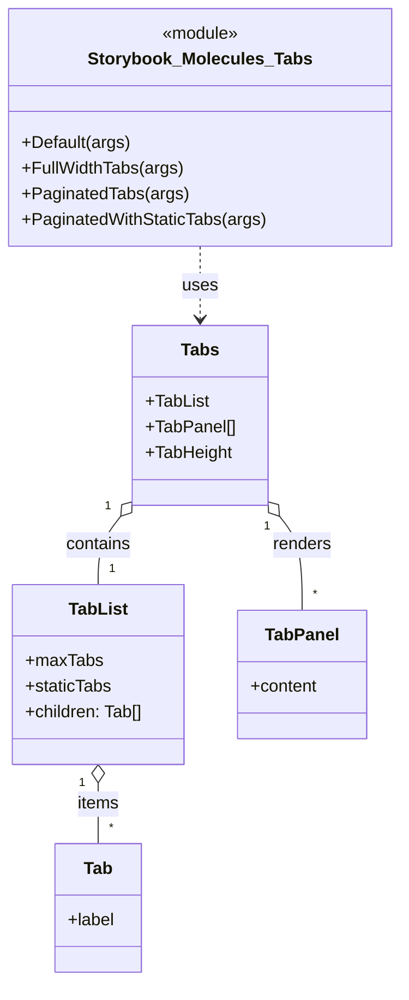

# Diagram: web/portal/src/components/molecules/Tabs.molecule.stories.js


> Auto-generated by Obscura crawlers

## Diagram 1



### SVG

<svg id="container" width="368.08984375" xmlns="http://www.w3.org/2000/svg" class="classDiagram" height="916" viewBox="0 0 368.08984375 916" role="graphics-document document" aria-roledescription="class"><style>#container{font-family:"trebuchet ms",verdana,arial,sans-serif;font-size:16px;fill:#333;}@keyframes edge-animation-frame{from{stroke-dashoffset:0;}}@keyframes dash{to{stroke-dashoffset:0;}}#container .edge-animation-slow{stroke-dasharray:9,5!important;stroke-dashoffset:900;animation:dash 50s linear infinite;stroke-linecap:round;}#container .edge-animation-fast{stroke-dasharray:9,5!important;stroke-dashoffset:900;animation:dash 20s linear infinite;stroke-linecap:round;}#container .error-icon{fill:#552222;}#container .error-text{fill:#552222;stroke:#552222;}#container .edge-thickness-normal{stroke-width:1px;}#container .edge-thickness-thick{stroke-width:3.5px;}#container .edge-pattern-solid{stroke-dasharray:0;}#container .edge-thickness-invisible{stroke-width:0;fill:none;}#container .edge-pattern-dashed{stroke-dasharray:3;}#container .edge-pattern-dotted{stroke-dasharray:2;}#container .marker{fill:#333333;stroke:#333333;}#container .marker.cross{stroke:#333333;}#container svg{font-family:"trebuchet ms",verdana,arial,sans-serif;font-size:16px;}#container p{margin:0;}#container g.classGroup text{fill:#9370DB;stroke:none;font-family:"trebuchet ms",verdana,arial,sans-serif;font-size:10px;}#container g.classGroup text .title{font-weight:bolder;}#container .nodeLabel,#container .edgeLabel{color:#131300;}#container .edgeLabel .label rect{fill:#ECECFF;}#container .label text{fill:#131300;}#container .labelBkg{background:#ECECFF;}#container .edgeLabel .label span{background:#ECECFF;}#container .classTitle{font-weight:bolder;}#container .node rect,#container .node circle,#container .node ellipse,#container .node polygon,#container .node path{fill:#ECECFF;stroke:#9370DB;stroke-width:1px;}#container .divider{stroke:#9370DB;stroke-width:1;}#container g.clickable{cursor:pointer;}#container g.classGroup rect{fill:#ECECFF;stroke:#9370DB;}#container g.classGroup line{stroke:#9370DB;stroke-width:1;}#container .classLabel .box{stroke:none;stroke-width:0;fill:#ECECFF;opacity:0.5;}#container .classLabel .label{fill:#9370DB;font-size:10px;}#container .relation{stroke:#333333;stroke-width:1;fill:none;}#container .dashed-line{stroke-dasharray:3;}#container .dotted-line{stroke-dasharray:1 2;}#container #compositionStart,#container .composition{fill:#333333!important;stroke:#333333!important;stroke-width:1;}#container #compositionEnd,#container .composition{fill:#333333!important;stroke:#333333!important;stroke-width:1;}#container #dependencyStart,#container .dependency{fill:#333333!important;stroke:#333333!important;stroke-width:1;}#container #dependencyStart,#container .dependency{fill:#333333!important;stroke:#333333!important;stroke-width:1;}#container #extensionStart,#container .extension{fill:transparent!important;stroke:#333333!important;stroke-width:1;}#container #extensionEnd,#container .extension{fill:transparent!important;stroke:#333333!important;stroke-width:1;}#container #aggregationStart,#container .aggregation{fill:transparent!important;stroke:#333333!important;stroke-width:1;}#container #aggregationEnd,#container .aggregation{fill:transparent!important;stroke:#333333!important;stroke-width:1;}#container #lollipopStart,#container .lollipop{fill:#ECECFF!important;stroke:#333333!important;stroke-width:1;}#container #lollipopEnd,#container .lollipop{fill:#ECECFF!important;stroke:#333333!important;stroke-width:1;}#container .edgeTerminals{font-size:11px;line-height:initial;}#container .classTitleText{text-anchor:middle;font-size:18px;fill:#333;}#container .label-icon{display:inline-block;height:1em;overflow:visible;vertical-align:-0.125em;}#container .node .label-icon path{fill:currentColor;stroke:revert;stroke-width:revert;}#container :root{--mermaid-font-family:"trebuchet ms",verdana,arial,sans-serif;}</style><g><defs><marker id="container_class-aggregationStart" class="marker aggregation class" refX="18" refY="7" markerWidth="190" markerHeight="240" orient="auto"><path d="M 18,7 L9,13 L1,7 L9,1 Z"></path></marker></defs><defs><marker id="container_class-aggregationEnd" class="marker aggregation class" refX="1" refY="7" markerWidth="20" markerHeight="28" orient="auto"><path d="M 18,7 L9,13 L1,7 L9,1 Z"></path></marker></defs><defs><marker id="container_class-extensionStart" class="marker extension class" refX="18" refY="7" markerWidth="190" markerHeight="240" orient="auto"><path d="M 1,7 L18,13 V 1 Z"></path></marker></defs><defs><marker id="container_class-extensionEnd" class="marker extension class" refX="1" refY="7" markerWidth="20" markerHeight="28" orient="auto"><path d="M 1,1 V 13 L18,7 Z"></path></marker></defs><defs><marker id="container_class-compositionStart" class="marker composition class" refX="18" refY="7" markerWidth="190" markerHeight="240" orient="auto"><path d="M 18,7 L9,13 L1,7 L9,1 Z"></path></marker></defs><defs><marker id="container_class-compositionEnd" class="marker composition class" refX="1" refY="7" markerWidth="20" markerHeight="28" orient="auto"><path d="M 18,7 L9,13 L1,7 L9,1 Z"></path></marker></defs><defs><marker id="container_class-dependencyStart" class="marker dependency class" refX="6" refY="7" markerWidth="190" markerHeight="240" orient="auto"><path d="M 5,7 L9,13 L1,7 L9,1 Z"></path></marker></defs><defs><marker id="container_class-dependencyEnd" class="marker dependency class" refX="13" refY="7" markerWidth="20" markerHeight="28" orient="auto"><path d="M 18,7 L9,13 L14,7 L9,1 Z"></path></marker></defs><defs><marker id="container_class-lollipopStart" class="marker lollipop class" refX="13" refY="7" markerWidth="190" markerHeight="240" orient="auto"><circle stroke="black" fill="transparent" cx="7" cy="7" r="6"></circle></marker></defs><defs><marker id="container_class-lollipopEnd" class="marker lollipop class" refX="1" refY="7" markerWidth="190" markerHeight="240" orient="auto"><circle stroke="black" fill="transparent" cx="7" cy="7" r="6"></circle></marker></defs><g class="root"><g class="clusters"></g><g class="edgePaths"><path d="M111.938,479.963L108.112,484.803C104.286,489.642,96.633,499.321,92.807,510.327C88.98,521.333,88.98,533.667,88.98,539.833L88.98,546" id="id_Tabs_TabList_1" class="edge-thickness-normal edge-pattern-solid relation" style=";;;" data-edge="true" data-et="edge" data-id="id_Tabs_TabList_1" data-points="W3sieCI6MTIyLjYzNjcxODc1LCJ5Ijo0NjYuNDMxODcyOTMyOTE0MTN9LHsieCI6ODguOTgwNDY4NzUsInkiOjUwOX0seyJ4Ijo4OC45ODA0Njg3NSwieSI6NTQ2fV0=" marker-start="url(#container_class-aggregationStart)"></path><path d="M88.98,731.25L88.98,734.542C88.98,737.833,88.98,744.417,88.98,753.875C88.98,763.333,88.98,775.667,88.98,781.833L88.98,788" id="id_TabList_Tab_2" class="edge-thickness-normal edge-pattern-solid relation" style=";;;" data-edge="true" data-et="edge" data-id="id_TabList_Tab_2" data-points="W3sieCI6ODguOTgwNDY4NzUsInkiOjcxNH0seyJ4Ijo4OC45ODA0Njg3NSwieSI6NzUxfSx7IngiOjg4Ljk4MDQ2ODc1LCJ5Ijo3ODh9XQ==" marker-start="url(#container_class-aggregationStart)"></path><path d="M257.359,479.963L261.185,484.803C265.011,489.642,272.664,499.321,276.49,514.327C280.316,529.333,280.316,549.667,280.316,559.833L280.316,570" id="id_Tabs_TabPanel_3" class="edge-thickness-normal edge-pattern-solid relation" style=";;;" data-edge="true" data-et="edge" data-id="id_Tabs_TabPanel_3" data-points="W3sieCI6MjQ2LjY2MDE1NjI1LCJ5Ijo0NjYuNDMxODcyOTMyOTE0MTN9LHsieCI6MjgwLjMxNjQwNjI1LCJ5Ijo1MDl9LHsieCI6MjgwLjMxNjQwNjI1LCJ5Ijo1NzB9XQ==" marker-start="url(#container_class-aggregationStart)"></path><path d="M184.648,230L184.648,236.167C184.648,242.333,184.648,254.667,184.648,266C184.648,277.333,184.648,287.667,184.648,292.833L184.648,298" id="id_Storybook_Molecules_Tabs_Tabs_4" class="edge-thickness-normal edge-pattern-dashed relation" style=";;;" data-edge="true" data-et="edge" data-id="id_Storybook_Molecules_Tabs_Tabs_4" data-points="W3sieCI6MTg0LjY0ODQzNzUsInkiOjIzMH0seyJ4IjoxODQuNjQ4NDM3NSwieSI6MjY3fSx7IngiOjE4NC42NDg0Mzc1LCJ5IjozMDR9XQ==" marker-end="url(#container_class-dependencyEnd)"></path></g><g class="edgeLabels"><g class="edgeLabel" transform="translate(88.98046875, 509)"><g class="label" data-id="id_Tabs_TabList_1" transform="translate(-30.890625, -12)"><foreignObject width="61.78125" height="24"><div xmlns="http://www.w3.org/1999/xhtml" class="labelBkg" style="display: table-cell; white-space: nowrap; line-height: 1.5; max-width: 200px; text-align: center;"><span class="edgeLabel"><p>contains</p></span></div></foreignObject></g></g><g class="edgeLabel" transform="translate(88.98046875, 751)"><g class="label" data-id="id_TabList_Tab_2" transform="translate(-19.9765625, -12)"><foreignObject width="39.953125" height="24"><div xmlns="http://www.w3.org/1999/xhtml" class="labelBkg" style="display: table-cell; white-space: nowrap; line-height: 1.5; max-width: 200px; text-align: center;"><span class="edgeLabel"><p>items</p></span></div></foreignObject></g></g><g class="edgeLabel" transform="translate(280.31640625, 509)"><g class="label" data-id="id_Tabs_TabPanel_3" transform="translate(-27.75, -12)"><foreignObject width="55.5" height="24"><div xmlns="http://www.w3.org/1999/xhtml" class="labelBkg" style="display: table-cell; white-space: nowrap; line-height: 1.5; max-width: 200px; text-align: center;"><span class="edgeLabel"><p>renders</p></span></div></foreignObject></g></g><g class="edgeLabel" transform="translate(184.6484375, 267)"><g class="label" data-id="id_Storybook_Molecules_Tabs_Tabs_4" transform="translate(-16.4921875, -12)"><foreignObject width="32.984375" height="24"><div xmlns="http://www.w3.org/1999/xhtml" class="labelBkg" style="display: table-cell; white-space: nowrap; line-height: 1.5; max-width: 200px; text-align: center;"><span class="edgeLabel"><p>uses</p></span></div></foreignObject></g></g><g class="edgeTerminals" transform="translate(100.01650625810579, 470.8563524972276)"><g class="inner" transform="translate(0, 0)"><foreignObject style="width: 9px; height: 12px;"><div xmlns="http://www.w3.org/1999/xhtml" style="display: inline-block; padding-right: 1px; white-space: nowrap;"><span class="edgeLabel">1</span></div></foreignObject></g></g><g class="edgeTerminals" transform="translate(73.98046937500001, 731.5000005357143)"><g class="inner" transform="translate(0, 0)"><foreignObject style="width: 9px; height: 12px;"><div xmlns="http://www.w3.org/1999/xhtml" style="display: inline-block; padding-right: 1px; white-space: nowrap;"><span class="edgeLabel">1</span></div></foreignObject></g></g><g class="edgeTerminals" transform="translate(245.7472889655739, 489.46264911710153)"><g class="inner" transform="translate(0, 0)"><foreignObject style="width: 9px; height: 12px;"><div xmlns="http://www.w3.org/1999/xhtml" style="display: inline-block; padding-right: 1px; white-space: nowrap;"><span class="edgeLabel">1</span></div></foreignObject></g></g><g class="edgeTerminals" transform="translate(98.98046937499998, 523.5000005357143)"><g class="inner" transform="translate(0, 0)"></g><foreignObject style="width: 9px; height: 12px;"><div xmlns="http://www.w3.org/1999/xhtml" style="display: inline-block; padding-right: 1px; white-space: nowrap;"><span class="edgeLabel">1</span></div></foreignObject></g><g class="edgeTerminals" transform="translate(98.98046937499998, 765.5000005357143)"><g class="inner" transform="translate(0, 0)"></g><foreignObject style="width: 9px; height: 12px;"><div xmlns="http://www.w3.org/1999/xhtml" style="display: inline-block; padding-right: 1px; white-space: nowrap;"><span class="edgeLabel">*</span></div></foreignObject></g><g class="edgeTerminals" transform="translate(290.3164081249999, 547.5000016071428)"><g class="inner" transform="translate(0, 0)"></g><foreignObject style="width: 9px; height: 12px;"><div xmlns="http://www.w3.org/1999/xhtml" style="display: inline-block; padding-right: 1px; white-space: nowrap;"><span class="edgeLabel">*</span></div></foreignObject></g></g><g class="nodes"><g class="node default" id="classId-Tabs-0" transform="translate(184.6484375, 388)"><g class="basic label-container"><path d="M-62.01171875 -84 L62.01171875 -84 L62.01171875 84 L-62.01171875 84" stroke="none" stroke-width="0" fill="#ECECFF" style=""></path><path d="M-62.01171875 -84 C-31.355092171444866 -84, -0.6984655928897325 -84, 62.01171875 -84 M-62.01171875 -84 C-24.816223730180212 -84, 12.379271289639576 -84, 62.01171875 -84 M62.01171875 -84 C62.01171875 -17.845355470153493, 62.01171875 48.309289059693015, 62.01171875 84 M62.01171875 -84 C62.01171875 -22.783128994722965, 62.01171875 38.43374201055407, 62.01171875 84 M62.01171875 84 C26.259420714529575 84, -9.492877320940849 84, -62.01171875 84 M62.01171875 84 C24.613274750891627 84, -12.785169248216746 84, -62.01171875 84 M-62.01171875 84 C-62.01171875 17.53149130273769, -62.01171875 -48.93701739452462, -62.01171875 -84 M-62.01171875 84 C-62.01171875 32.014556271172715, -62.01171875 -19.97088745765457, -62.01171875 -84" stroke="#9370DB" stroke-width="1.3" fill="none" stroke-dasharray="0 0" style=""></path></g><g class="annotation-group text" transform="translate(0, -60)"></g><g class="label-group text" transform="translate(-16.9453125, -60)"><g class="label" style="font-weight: bolder" transform="translate(0,-12)"><foreignObject width="33.890625" height="24"><div xmlns="http://www.w3.org/1999/xhtml" style="display: table-cell; white-space: nowrap; line-height: 1.5; max-width: 83px; text-align: center;"><span class="nodeLabel markdown-node-label" style=""><p>Tabs</p></span></div></foreignObject></g></g><g class="members-group text" transform="translate(-50.01171875, -12)"><g class="label" style="" transform="translate(0,-12)"><foreignObject width="58.59375" height="24"><div xmlns="http://www.w3.org/1999/xhtml" style="display: table-cell; white-space: nowrap; line-height: 1.5; max-width: 116px; text-align: center;"><span class="nodeLabel markdown-node-label" style=""><p>+TabList</p></span></div></foreignObject></g><g class="label" style="" transform="translate(0,12)"><foreignObject width="83.078125" height="24"><div xmlns="http://www.w3.org/1999/xhtml" style="display: table-cell; white-space: nowrap; line-height: 1.5; max-width: 140px; text-align: center;"><span class="nodeLabel markdown-node-label" style=""><p>+TabPanel[]</p></span></div></foreignObject></g><g class="label" style="" transform="translate(0,36)"><foreignObject width="80.453125" height="24"><div xmlns="http://www.w3.org/1999/xhtml" style="display: table-cell; white-space: nowrap; line-height: 1.5; max-width: 138px; text-align: center;"><span class="nodeLabel markdown-node-label" style=""><p>+TabHeight</p></span></div></foreignObject></g></g><g class="methods-group text" transform="translate(-50.01171875, 84)"></g><g class="divider" style=""><path d="M-62.01171875 -36 C-34.257928450881316 -36, -6.504138151762632 -36, 62.01171875 -36 M-62.01171875 -36 C-18.928799461568666 -36, 24.15411982686267 -36, 62.01171875 -36" stroke="#9370DB" stroke-width="1.3" fill="none" stroke-dasharray="0 0" style=""></path></g><g class="divider" style=""><path d="M-62.01171875 60 C-23.016338702433877 60, 15.979041345132245 60, 62.01171875 60 M-62.01171875 60 C-29.32040318000724 60, 3.37091238998552 60, 62.01171875 60" stroke="#9370DB" stroke-width="1.3" fill="none" stroke-dasharray="0 0" style=""></path></g></g><g class="node default" id="classId-TabList-1" transform="translate(88.98046875, 630)"><g class="basic label-container"><path d="M-80.98046875 -84 L80.98046875 -84 L80.98046875 84 L-80.98046875 84" stroke="none" stroke-width="0" fill="#ECECFF" style=""></path><path d="M-80.98046875 -84 C-16.32469076895282 -84, 48.33108721209436 -84, 80.98046875 -84 M-80.98046875 -84 C-25.01233362468843 -84, 30.95580150062314 -84, 80.98046875 -84 M80.98046875 -84 C80.98046875 -43.85521157849142, 80.98046875 -3.7104231569828414, 80.98046875 84 M80.98046875 -84 C80.98046875 -34.231834151945804, 80.98046875 15.536331696108391, 80.98046875 84 M80.98046875 84 C17.08904691759504 84, -46.80237491480992 84, -80.98046875 84 M80.98046875 84 C21.284989623776674 84, -38.41048950244665 84, -80.98046875 84 M-80.98046875 84 C-80.98046875 20.803476686488153, -80.98046875 -42.39304662702369, -80.98046875 -84 M-80.98046875 84 C-80.98046875 49.987514656370614, -80.98046875 15.975029312741228, -80.98046875 -84" stroke="#9370DB" stroke-width="1.3" fill="none" stroke-dasharray="0 0" style=""></path></g><g class="annotation-group text" transform="translate(0, -60)"></g><g class="label-group text" transform="translate(-26.3984375, -60)"><g class="label" style="font-weight: bolder" transform="translate(0,-12)"><foreignObject width="52.796875" height="24"><div xmlns="http://www.w3.org/1999/xhtml" style="display: table-cell; white-space: nowrap; line-height: 1.5; max-width: 102px; text-align: center;"><span class="nodeLabel markdown-node-label" style=""><p>TabList</p></span></div></foreignObject></g></g><g class="members-group text" transform="translate(-68.98046875, -12)"><g class="label" style="" transform="translate(0,-12)"><foreignObject width="71.3125" height="24"><div xmlns="http://www.w3.org/1999/xhtml" style="display: table-cell; white-space: nowrap; line-height: 1.5; max-width: 129px; text-align: center;"><span class="nodeLabel markdown-node-label" style=""><p>+maxTabs</p></span></div></foreignObject></g><g class="label" style="" transform="translate(0,12)"><foreignObject width="80.921875" height="24"><div xmlns="http://www.w3.org/1999/xhtml" style="display: table-cell; white-space: nowrap; line-height: 1.5; max-width: 138px; text-align: center;"><span class="nodeLabel markdown-node-label" style=""><p>+staticTabs</p></span></div></foreignObject></g><g class="label" style="" transform="translate(0,36)"><foreignObject width="111.5625" height="24"><div xmlns="http://www.w3.org/1999/xhtml" style="display: table-cell; white-space: nowrap; line-height: 1.5; max-width: 169px; text-align: center;"><span class="nodeLabel markdown-node-label" style=""><p>+children: Tab[]</p></span></div></foreignObject></g></g><g class="methods-group text" transform="translate(-68.98046875, 84)"></g><g class="divider" style=""><path d="M-80.98046875 -36 C-47.720778232973196 -36, -14.461087715946391 -36, 80.98046875 -36 M-80.98046875 -36 C-17.873781857568254 -36, 45.23290503486349 -36, 80.98046875 -36" stroke="#9370DB" stroke-width="1.3" fill="none" stroke-dasharray="0 0" style=""></path></g><g class="divider" style=""><path d="M-80.98046875 60 C-24.869997835216978 60, 31.240473079566044 60, 80.98046875 60 M-80.98046875 60 C-42.119750649613714 60, -3.2590325492274275 60, 80.98046875 60" stroke="#9370DB" stroke-width="1.3" fill="none" stroke-dasharray="0 0" style=""></path></g></g><g class="node default" id="classId-Tab-2" transform="translate(88.98046875, 848)"><g class="basic label-container"><path d="M-40.65234375 -60 L40.65234375 -60 L40.65234375 60 L-40.65234375 60" stroke="none" stroke-width="0" fill="#ECECFF" style=""></path><path d="M-40.65234375 -60 C-15.859537186704383 -60, 8.933269376591234 -60, 40.65234375 -60 M-40.65234375 -60 C-8.43867343186114 -60, 23.77499688627772 -60, 40.65234375 -60 M40.65234375 -60 C40.65234375 -14.644894276481224, 40.65234375 30.71021144703755, 40.65234375 60 M40.65234375 -60 C40.65234375 -19.50561612394724, 40.65234375 20.988767752105517, 40.65234375 60 M40.65234375 60 C21.002082495389807 60, 1.3518212407796142 60, -40.65234375 60 M40.65234375 60 C17.93844310308486 60, -4.775457543830278 60, -40.65234375 60 M-40.65234375 60 C-40.65234375 25.513392506690508, -40.65234375 -8.973214986618984, -40.65234375 -60 M-40.65234375 60 C-40.65234375 29.931935601808163, -40.65234375 -0.13612879638367303, -40.65234375 -60" stroke="#9370DB" stroke-width="1.3" fill="none" stroke-dasharray="0 0" style=""></path></g><g class="annotation-group text" transform="translate(0, -36)"></g><g class="label-group text" transform="translate(-13.0859375, -36)"><g class="label" style="font-weight: bolder" transform="translate(0,-12)"><foreignObject width="26.171875" height="24"><div xmlns="http://www.w3.org/1999/xhtml" style="display: table-cell; white-space: nowrap; line-height: 1.5; max-width: 76px; text-align: center;"><span class="nodeLabel markdown-node-label" style=""><p>Tab</p></span></div></foreignObject></g></g><g class="members-group text" transform="translate(-28.65234375, 12)"><g class="label" style="" transform="translate(0,-12)"><foreignObject width="44.21875" height="24"><div xmlns="http://www.w3.org/1999/xhtml" style="display: table-cell; white-space: nowrap; line-height: 1.5; max-width: 102px; text-align: center;"><span class="nodeLabel markdown-node-label" style=""><p>+label</p></span></div></foreignObject></g></g><g class="methods-group text" transform="translate(-28.65234375, 60)"></g><g class="divider" style=""><path d="M-40.65234375 -12 C-8.205109365310783 -12, 24.242125019378435 -12, 40.65234375 -12 M-40.65234375 -12 C-15.258160526835454 -12, 10.136022696329093 -12, 40.65234375 -12" stroke="#9370DB" stroke-width="1.3" fill="none" stroke-dasharray="0 0" style=""></path></g><g class="divider" style=""><path d="M-40.65234375 36 C-17.67485830110924 36, 5.302627147781521 36, 40.65234375 36 M-40.65234375 36 C-12.171753894677689 36, 16.308835960644622 36, 40.65234375 36" stroke="#9370DB" stroke-width="1.3" fill="none" stroke-dasharray="0 0" style=""></path></g></g><g class="node default" id="classId-TabPanel-3" transform="translate(280.31640625, 630)"><g class="basic label-container"><path d="M-60.35546875 -60 L60.35546875 -60 L60.35546875 60 L-60.35546875 60" stroke="none" stroke-width="0" fill="#ECECFF" style=""></path><path d="M-60.35546875 -60 C-12.554734279381854 -60, 35.24600019123629 -60, 60.35546875 -60 M-60.35546875 -60 C-24.086141085549194 -60, 12.183186578901612 -60, 60.35546875 -60 M60.35546875 -60 C60.35546875 -31.672964768085958, 60.35546875 -3.3459295361719157, 60.35546875 60 M60.35546875 -60 C60.35546875 -18.981369619130724, 60.35546875 22.03726076173855, 60.35546875 60 M60.35546875 60 C34.36286444750967 60, 8.370260145019344 60, -60.35546875 60 M60.35546875 60 C30.233535343375394 60, 0.11160193675078744 60, -60.35546875 60 M-60.35546875 60 C-60.35546875 22.130215332690412, -60.35546875 -15.739569334619176, -60.35546875 -60 M-60.35546875 60 C-60.35546875 18.692382413505975, -60.35546875 -22.61523517298805, -60.35546875 -60" stroke="#9370DB" stroke-width="1.3" fill="none" stroke-dasharray="0 0" style=""></path></g><g class="annotation-group text" transform="translate(0, -36)"></g><g class="label-group text" transform="translate(-33.2578125, -36)"><g class="label" style="font-weight: bolder" transform="translate(0,-12)"><foreignObject width="66.515625" height="24"><div xmlns="http://www.w3.org/1999/xhtml" style="display: table-cell; white-space: nowrap; line-height: 1.5; max-width: 116px; text-align: center;"><span class="nodeLabel markdown-node-label" style=""><p>TabPanel</p></span></div></foreignObject></g></g><g class="members-group text" transform="translate(-48.35546875, 12)"><g class="label" style="" transform="translate(0,-12)"><foreignObject width="63.453125" height="24"><div xmlns="http://www.w3.org/1999/xhtml" style="display: table-cell; white-space: nowrap; line-height: 1.5; max-width: 121px; text-align: center;"><span class="nodeLabel markdown-node-label" style=""><p>+content</p></span></div></foreignObject></g></g><g class="methods-group text" transform="translate(-48.35546875, 60)"></g><g class="divider" style=""><path d="M-60.35546875 -12 C-35.16312155716038 -12, -9.970774364320754 -12, 60.35546875 -12 M-60.35546875 -12 C-35.386890107157114 -12, -10.418311464314229 -12, 60.35546875 -12" stroke="#9370DB" stroke-width="1.3" fill="none" stroke-dasharray="0 0" style=""></path></g><g class="divider" style=""><path d="M-60.35546875 36 C-25.884076500649037 36, 8.587315748701926 36, 60.35546875 36 M-60.35546875 36 C-21.502639219902875 36, 17.35019031019425 36, 60.35546875 36" stroke="#9370DB" stroke-width="1.3" fill="none" stroke-dasharray="0 0" style=""></path></g></g><g class="node default" id="classId-Storybook_Molecules_Tabs-4" transform="translate(184.6484375, 119)"><g class="basic label-container"><path d="M-175.44140625 -111 L175.44140625 -111 L175.44140625 111 L-175.44140625 111" stroke="none" stroke-width="0" fill="#ECECFF" style=""></path><path d="M-175.44140625 -111 C-41.40871810533508 -111, 92.62397003932983 -111, 175.44140625 -111 M-175.44140625 -111 C-87.68747147567696 -111, 0.06646329864608447 -111, 175.44140625 -111 M175.44140625 -111 C175.44140625 -64.95656244093266, 175.44140625 -18.9131248818653, 175.44140625 111 M175.44140625 -111 C175.44140625 -61.46524737189665, 175.44140625 -11.930494743793304, 175.44140625 111 M175.44140625 111 C73.45310499476108 111, -28.535196260477846 111, -175.44140625 111 M175.44140625 111 C57.2360528891802 111, -60.9693004716396 111, -175.44140625 111 M-175.44140625 111 C-175.44140625 29.07476108705268, -175.44140625 -52.85047782589464, -175.44140625 -111 M-175.44140625 111 C-175.44140625 42.909254336551754, -175.44140625 -25.18149132689649, -175.44140625 -111" stroke="#9370DB" stroke-width="1.3" fill="none" stroke-dasharray="0 0" style=""></path></g><g class="annotation-group text" transform="translate(-36.6015625, -87)"><g class="label" style="" transform="translate(0,-12)"><foreignObject width="73.203125" height="24"><div xmlns="http://www.w3.org/1999/xhtml" style="display: table-cell; white-space: nowrap; line-height: 1.5; max-width: 123px; text-align: center;"><span class="nodeLabel markdown-node-label" style=""><p>«module»</p></span></div></foreignObject></g></g><g class="label-group text" transform="translate(-99.4453125, -63)"><g class="label" style="font-weight: bolder" transform="translate(0,-12)"><foreignObject width="198.890625" height="24"><div xmlns="http://www.w3.org/1999/xhtml" style="display: table-cell; white-space: nowrap; line-height: 1.5; max-width: 245px; text-align: center;"><span class="nodeLabel markdown-node-label" style=""><p>Storybook_Molecules_Tabs</p></span></div></foreignObject></g></g><g class="members-group text" transform="translate(-163.44140625, -15)"></g><g class="methods-group text" transform="translate(-163.44140625, 15)"><g class="label" style="" transform="translate(0,-12)"><foreignObject width="101.1875" height="24"><div xmlns="http://www.w3.org/1999/xhtml" style="display: table-cell; white-space: nowrap; line-height: 1.5; max-width: 159px; text-align: center;"><span class="nodeLabel markdown-node-label" style=""><p>+Default(args)</p></span></div></foreignObject></g><g class="label" style="" transform="translate(0,12)"><foreignObject width="150.234375" height="24"><div xmlns="http://www.w3.org/1999/xhtml" style="display: table-cell; white-space: nowrap; line-height: 1.5; max-width: 208px; text-align: center;"><span class="nodeLabel markdown-node-label" style=""><p>+FullWidthTabs(args)</p></span></div></foreignObject></g><g class="label" style="" transform="translate(0,36)"><foreignObject width="153.53125" height="24"><div xmlns="http://www.w3.org/1999/xhtml" style="display: table-cell; white-space: nowrap; line-height: 1.5; max-width: 211px; text-align: center;"><span class="nodeLabel markdown-node-label" style=""><p>+PaginatedTabs(args)</p></span></div></foreignObject></g><g class="label" style="" transform="translate(0,60)"><foreignObject width="227.4375" height="24"><div xmlns="http://www.w3.org/1999/xhtml" style="display: table-cell; white-space: nowrap; line-height: 1.5; max-width: 285px; text-align: center;"><span class="nodeLabel markdown-node-label" style=""><p>+PaginatedWithStaticTabs(args)</p></span></div></foreignObject></g></g><g class="divider" style=""><path d="M-175.44140625 -39 C-50.408273482613126 -39, 74.62485928477375 -39, 175.44140625 -39 M-175.44140625 -39 C-103.0896967506582 -39, -30.73798725131641 -39, 175.44140625 -39" stroke="#9370DB" stroke-width="1.3" fill="none" stroke-dasharray="0 0" style=""></path></g><g class="divider" style=""><path d="M-175.44140625 -15 C-51.74955288093737 -15, 71.94230048812526 -15, 175.44140625 -15 M-175.44140625 -15 C-82.94711092428875 -15, 9.547184401422498 -15, 175.44140625 -15" stroke="#9370DB" stroke-width="1.3" fill="none" stroke-dasharray="0 0" style=""></path></g></g></g></g></g></svg>

## Diagram 2

```mermaid
flowchart LR
  Component[Tabs component (Molecules/Tabs)]
  Default[Default\nfullWidthTabs: false]
  FullWidth[FullWidthTabs\nfullWidthTabs: true]
  Paginated[PaginatedTabs\nfullWidthTabs: false\nmaxTabs: 4\n10 Tabs / 10 Panels]
  PaginatedStatic[PaginatedWithStaticTabs\nfullWidthTabs: false\nmaxTabs: 4\nstaticTabs: 1\n11 Tabs / 11 Panels]
  Component --> Default
  Component --> FullWidth
  Component --> Paginated
  Component --> PaginatedStatic
  subgraph PaginatedStructure
    PL[Tabs.TabList maxTabs=4]
    PL --> T1[Tab 1]
    PL --> T2[Tab 2]
    PL --> T3[Tab 3]
    PL --> T4[Tab 4]
    PL --> T5[Tab 5]
    PL --> T6[Tab 6]
    PL --> T7[Tab 7]
    PL --> T8[Tab 8]
    PL --> T9[Tab 9]
    PL --> T10[Tab 10]
    P1[TabPanel 1] -->|paired with| T1
    P2[TabPanel 2] -->|paired with| T2
    P3[TabPanel 3] -->|paired with| T3
    P4[TabPanel 4] -->|paired with| T4
    P5[TabPanel 5] -->|paired with| T5
    P6[TabPanel 6] -->|paired with| T6
    P7[TabPanel 7] -->|paired with| T7
    P8[TabPanel 8] -->|paired with| T8
    P9[TabPanel 9] -->|paired with| T9
    P10[TabPanel 10] -->|paired with| T10
  end
  Paginated --> PaginatedStructure
  subgraph PaginatedStaticStructure
    PSL[Tabs.TabList maxTabs=4 staticTabs=1]
    PSL --> S0[Static Tab]
    PSL --> ST1[Tab 1]
    PSL --> ST2[Tab 2]
    PSL --> ST3[Tab 3]
    PSL --> ST4[Tab 4]
    PSL --> ST5[Tab 5]
    PSL --> ST6[Tab 6]
    PSL --> ST7[Tab 7]
    PSL --> ST8[Tab 8]
    PSL --> ST9[Tab 9]
    PSL --> ST10[Tab 10]
    SP0[TabPanel Static] -->|paired with| S0
  end
  PaginatedStatic --> PaginatedStaticStructure
```

> SVG rendering failed for this diagram.
