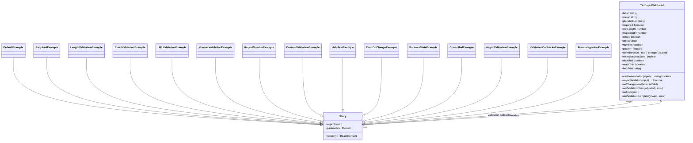

# Diagram: web/portal/src/components/molecules/TextInputValidated.molecule.stories.tsx


> Auto-generated by Obscura crawlers

## Diagram 1



### SVG

<svg id="container" width="4007.6875" xmlns="http://www.w3.org/2000/svg" class="classDiagram" height="858" viewBox="0 0 4007.6875 858" role="graphics-document document" aria-roledescription="class"><style>#container{font-family:"trebuchet ms",verdana,arial,sans-serif;font-size:16px;fill:#333;}@keyframes edge-animation-frame{from{stroke-dashoffset:0;}}@keyframes dash{to{stroke-dashoffset:0;}}#container .edge-animation-slow{stroke-dasharray:9,5!important;stroke-dashoffset:900;animation:dash 50s linear infinite;stroke-linecap:round;}#container .edge-animation-fast{stroke-dasharray:9,5!important;stroke-dashoffset:900;animation:dash 20s linear infinite;stroke-linecap:round;}#container .error-icon{fill:#552222;}#container .error-text{fill:#552222;stroke:#552222;}#container .edge-thickness-normal{stroke-width:1px;}#container .edge-thickness-thick{stroke-width:3.5px;}#container .edge-pattern-solid{stroke-dasharray:0;}#container .edge-thickness-invisible{stroke-width:0;fill:none;}#container .edge-pattern-dashed{stroke-dasharray:3;}#container .edge-pattern-dotted{stroke-dasharray:2;}#container .marker{fill:#333333;stroke:#333333;}#container .marker.cross{stroke:#333333;}#container svg{font-family:"trebuchet ms",verdana,arial,sans-serif;font-size:16px;}#container p{margin:0;}#container g.classGroup text{fill:#9370DB;stroke:none;font-family:"trebuchet ms",verdana,arial,sans-serif;font-size:10px;}#container g.classGroup text .title{font-weight:bolder;}#container .nodeLabel,#container .edgeLabel{color:#131300;}#container .edgeLabel .label rect{fill:#ECECFF;}#container .label text{fill:#131300;}#container .labelBkg{background:#ECECFF;}#container .edgeLabel .label span{background:#ECECFF;}#container .classTitle{font-weight:bolder;}#container .node rect,#container .node circle,#container .node ellipse,#container .node polygon,#container .node path{fill:#ECECFF;stroke:#9370DB;stroke-width:1px;}#container .divider{stroke:#9370DB;stroke-width:1;}#container g.clickable{cursor:pointer;}#container g.classGroup rect{fill:#ECECFF;stroke:#9370DB;}#container g.classGroup line{stroke:#9370DB;stroke-width:1;}#container .classLabel .box{stroke:none;stroke-width:0;fill:#ECECFF;opacity:0.5;}#container .classLabel .label{fill:#9370DB;font-size:10px;}#container .relation{stroke:#333333;stroke-width:1;fill:none;}#container .dashed-line{stroke-dasharray:3;}#container .dotted-line{stroke-dasharray:1 2;}#container #compositionStart,#container .composition{fill:#333333!important;stroke:#333333!important;stroke-width:1;}#container #compositionEnd,#container .composition{fill:#333333!important;stroke:#333333!important;stroke-width:1;}#container #dependencyStart,#container .dependency{fill:#333333!important;stroke:#333333!important;stroke-width:1;}#container #dependencyStart,#container .dependency{fill:#333333!important;stroke:#333333!important;stroke-width:1;}#container #extensionStart,#container .extension{fill:transparent!important;stroke:#333333!important;stroke-width:1;}#container #extensionEnd,#container .extension{fill:transparent!important;stroke:#333333!important;stroke-width:1;}#container #aggregationStart,#container .aggregation{fill:transparent!important;stroke:#333333!important;stroke-width:1;}#container #aggregationEnd,#container .aggregation{fill:transparent!important;stroke:#333333!important;stroke-width:1;}#container #lollipopStart,#container .lollipop{fill:#ECECFF!important;stroke:#333333!important;stroke-width:1;}#container #lollipopEnd,#container .lollipop{fill:#ECECFF!important;stroke:#333333!important;stroke-width:1;}#container .edgeTerminals{font-size:11px;line-height:initial;}#container .classTitleText{text-anchor:middle;font-size:18px;fill:#333;}#container .label-icon{display:inline-block;height:1em;overflow:visible;vertical-align:-0.125em;}#container .node .label-icon path{fill:currentColor;stroke:revert;stroke-width:revert;}#container :root{--mermaid-font-family:"trebuchet ms",verdana,arial,sans-serif;}</style><g><defs><marker id="container_class-aggregationStart" class="marker aggregation class" refX="18" refY="7" markerWidth="190" markerHeight="240" orient="auto"><path d="M 18,7 L9,13 L1,7 L9,1 Z"></path></marker></defs><defs><marker id="container_class-aggregationEnd" class="marker aggregation class" refX="1" refY="7" markerWidth="20" markerHeight="28" orient="auto"><path d="M 18,7 L9,13 L1,7 L9,1 Z"></path></marker></defs><defs><marker id="container_class-extensionStart" class="marker extension class" refX="18" refY="7" markerWidth="190" markerHeight="240" orient="auto"><path d="M 1,7 L18,13 V 1 Z"></path></marker></defs><defs><marker id="container_class-extensionEnd" class="marker extension class" refX="1" refY="7" markerWidth="20" markerHeight="28" orient="auto"><path d="M 1,1 V 13 L18,7 Z"></path></marker></defs><defs><marker id="container_class-compositionStart" class="marker composition class" refX="18" refY="7" markerWidth="190" markerHeight="240" orient="auto"><path d="M 18,7 L9,13 L1,7 L9,1 Z"></path></marker></defs><defs><marker id="container_class-compositionEnd" class="marker composition class" refX="1" refY="7" markerWidth="20" markerHeight="28" orient="auto"><path d="M 18,7 L9,13 L1,7 L9,1 Z"></path></marker></defs><defs><marker id="container_class-dependencyStart" class="marker dependency class" refX="6" refY="7" markerWidth="190" markerHeight="240" orient="auto"><path d="M 5,7 L9,13 L1,7 L9,1 Z"></path></marker></defs><defs><marker id="container_class-dependencyEnd" class="marker dependency class" refX="13" refY="7" markerWidth="20" markerHeight="28" orient="auto"><path d="M 18,7 L9,13 L14,7 L9,1 Z"></path></marker></defs><defs><marker id="container_class-lollipopStart" class="marker lollipop class" refX="13" refY="7" markerWidth="190" markerHeight="240" orient="auto"><circle stroke="black" fill="transparent" cx="7" cy="7" r="6"></circle></marker></defs><defs><marker id="container_class-lollipopEnd" class="marker lollipop class" refX="1" refY="7" markerWidth="190" markerHeight="240" orient="auto"><circle stroke="black" fill="transparent" cx="7" cy="7" r="6"></circle></marker></defs><g class="root"><g class="clusters"></g><g class="edgePaths"><path d="M77.563,350L77.563,399.167C77.563,448.333,77.563,546.667,375.25,614.61C672.938,682.553,1268.314,720.106,1566.002,738.883L1863.69,757.659" id="id_DefaultExample_Story_1" class="edge-thickness-normal edge-pattern-solid relation" style=";;;" data-edge="true" data-et="edge" data-id="id_DefaultExample_Story_1" data-points="W3sieCI6NzcuNTYyNSwieSI6MzUwfSx7IngiOjc3LjU2MjUsInkiOjY0NX0seyJ4IjoxODgwLjkwNjI1LCJ5Ijo3NTguNzQ0OTU3MjU5Mzg4MX1d" marker-end="url(#container_class-extensionEnd)"></path><path d="M273.031,350L273.031,399.167C273.031,448.333,273.031,546.667,538.142,614.452C803.254,682.238,1333.476,719.476,1598.587,738.094L1863.699,756.713" id="id_RequiredExample_Story_2" class="edge-thickness-normal edge-pattern-solid relation" style=";;;" data-edge="true" data-et="edge" data-id="id_RequiredExample_Story_2" data-points="W3sieCI6MjczLjAzMTI1LCJ5IjozNTB9LHsieCI6MjczLjAzMTI1LCJ5Ijo2NDV9LHsieCI6MTg4MC45MDYyNSwieSI6NzU3LjkyMTg0NzcyMjA4OX1d" marker-end="url(#container_class-extensionEnd)"></path><path d="M503.836,350L503.836,399.167C503.836,448.333,503.836,546.667,730.482,614.213C957.128,681.759,1410.42,718.519,1637.067,736.898L1863.713,755.278" id="id_LengthValidationExample_Story_3" class="edge-thickness-normal edge-pattern-solid relation" style=";;;" data-edge="true" data-et="edge" data-id="id_LengthValidationExample_Story_3" data-points="W3sieCI6NTAzLjgzNTkzNzUsInkiOjM1MH0seyJ4Ijo1MDMuODM1OTM3NSwieSI6NjQ1fSx7IngiOjE4ODAuOTA2MjUsInkiOjc1Ni42NzIyNzc4Mzk0NDU0fV0=" marker-end="url(#container_class-extensionEnd)"></path><path d="M758.492,350L758.492,399.167C758.492,448.333,758.492,546.667,942.7,613.846C1126.908,681.025,1495.323,717.049,1679.53,735.062L1863.738,753.074" id="id_EmailValidationExample_Story_4" class="edge-thickness-normal edge-pattern-solid relation" style=";;;" data-edge="true" data-et="edge" data-id="id_EmailValidationExample_Story_4" data-points="W3sieCI6NzU4LjQ5MjE4NzUsInkiOjM1MH0seyJ4Ijo3NTguNDkyMTg3NSwieSI6NjQ1fSx7IngiOjE4ODAuOTA2MjUsInkiOjc1NC43NTI2OTU4NDMyMjQ0fV0=" marker-end="url(#container_class-extensionEnd)"></path><path d="M1001.617,350L1001.617,399.167C1001.617,448.333,1001.617,546.667,1145.311,613.32C1289.006,679.973,1576.394,714.946,1720.088,732.432L1863.783,749.919" id="id_URLValidationExample_Story_5" class="edge-thickness-normal edge-pattern-solid relation" style=";;;" data-edge="true" data-et="edge" data-id="id_URLValidationExample_Story_5" data-points="W3sieCI6MTAwMS42MTcxODc1LCJ5IjozNTB9LHsieCI6MTAwMS42MTcxODc1LCJ5Ijo2NDV9LHsieCI6MTg4MC45MDYyNSwieSI6NzUyLjAwMjU1MzU4NjAyMDR9XQ==" marker-end="url(#container_class-extensionEnd)"></path><path d="M1253.875,350L1253.875,399.167C1253.875,448.333,1253.875,546.667,1355.543,612.411C1457.21,678.156,1660.546,711.312,1762.213,727.89L1863.881,744.468" id="id_NumberValidationExample_Story_6" class="edge-thickness-normal edge-pattern-solid relation" style=";;;" data-edge="true" data-et="edge" data-id="id_NumberValidationExample_Story_6" data-points="W3sieCI6MTI1My44NzUsInkiOjM1MH0seyJ4IjoxMjUzLjg3NSwieSI6NjQ1fSx7IngiOjE4ODAuOTA2MjUsInkiOjc0Ny4yNDQxOTEwNjU3Njk3fV0=" marker-end="url(#container_class-extensionEnd)"></path><path d="M1509.641,350L1509.641,399.167C1509.641,448.333,1509.641,546.667,1568.728,610.536C1627.816,674.405,1745.991,703.81,1805.079,718.512L1864.167,733.214" id="id_ReportNumberExample_Story_7" class="edge-thickness-normal edge-pattern-solid relation" style=";;;" data-edge="true" data-et="edge" data-id="id_ReportNumberExample_Story_7" data-points="W3sieCI6MTUwOS42NDA2MjUsInkiOjM1MH0seyJ4IjoxNTA5LjY0MDYyNSwieSI6NjQ1fSx7IngiOjE4ODAuOTA2MjUsInkiOjczNy4zNzk1MDAzNjE0NzQ4fV0=" marker-end="url(#container_class-extensionEnd)"></path><path d="M1763.656,350L1763.656,399.167C1763.656,448.333,1763.656,546.667,1780.648,604.685C1797.64,662.703,1831.624,680.407,1848.616,689.259L1865.608,698.11" id="id_CustomValidationExample_Story_8" class="edge-thickness-normal edge-pattern-solid relation" style=";;;" data-edge="true" data-et="edge" data-id="id_CustomValidationExample_Story_8" data-points="W3sieCI6MTc2My42NTYyNSwieSI6MzUwfSx7IngiOjE3NjMuNjU2MjUsInkiOjY0NX0seyJ4IjoxODgwLjkwNjI1LCJ5Ijo3MDYuMDc5OTUwMjIwMzA4OH1d" marker-end="url(#container_class-extensionEnd)"></path><path d="M1995.93,350L1995.93,399.167C1995.93,448.333,1995.93,546.667,1995.93,599.125C1995.93,651.583,1995.93,658.167,1995.93,661.458L1995.93,664.75" id="id_HelpTextExample_Story_9" class="edge-thickness-normal edge-pattern-solid relation" style=";;;" data-edge="true" data-et="edge" data-id="id_HelpTextExample_Story_9" data-points="W3sieCI6MTk5NS45Mjk2ODc1LCJ5IjozNTB9LHsieCI6MTk5NS45Mjk2ODc1LCJ5Ijo2NDV9LHsieCI6MTk5NS45Mjk2ODc1LCJ5Ijo2ODJ9XQ==" marker-end="url(#container_class-extensionEnd)"></path><path d="M2219.031,350L2219.031,399.167C2219.031,448.333,2219.031,546.667,2203.545,604.232C2188.06,661.798,2157.088,678.595,2141.602,686.994L2126.117,695.393" id="id_ErrorOnChangeExample_Story_10" class="edge-thickness-normal edge-pattern-solid relation" style=";;;" data-edge="true" data-et="edge" data-id="id_ErrorOnChangeExample_Story_10" data-points="W3sieCI6MjIxOS4wMzEyNSwieSI6MzUwfSx7IngiOjIyMTkuMDMxMjUsInkiOjY0NX0seyJ4IjoyMTEwLjk1MzEyNSwieSI6NzAzLjYxNjU5MTM3ODY0NjN9XQ==" marker-end="url(#container_class-extensionEnd)"></path><path d="M2457.758,350L2457.758,399.167C2457.758,448.333,2457.758,546.667,2402.738,610.249C2347.719,673.831,2237.679,702.661,2182.66,717.076L2127.64,731.492" id="id_SuccessStateExample_Story_11" class="edge-thickness-normal edge-pattern-solid relation" style=";;;" data-edge="true" data-et="edge" data-id="id_SuccessStateExample_Story_11" data-points="W3sieCI6MjQ1Ny43NTc4MTI1LCJ5IjozNTB9LHsieCI6MjQ1Ny43NTc4MTI1LCJ5Ijo2NDV9LHsieCI6MjExMC45NTMxMjUsInkiOjczNS44NjM2MDI1MzA3MDM0fV0=" marker-end="url(#container_class-extensionEnd)"></path><path d="M2679.758,350L2679.758,399.167C2679.758,448.333,2679.758,546.667,2587.788,612.107C2495.818,677.547,2311.879,710.094,2219.909,726.368L2127.939,742.642" id="id_ControlledExample_Story_12" class="edge-thickness-normal edge-pattern-solid relation" style=";;;" data-edge="true" data-et="edge" data-id="id_ControlledExample_Story_12" data-points="W3sieCI6MjY3OS43NTc4MTI1LCJ5IjozNTB9LHsieCI6MjY3OS43NTc4MTI1LCJ5Ijo2NDV9LHsieCI6MjExMC45NTMxMjUsInkiOjc0NS42NDcxNzIzOTgwMzV9XQ==" marker-end="url(#container_class-extensionEnd)"></path><path d="M2911.875,350L2911.875,399.167C2911.875,448.333,2911.875,546.667,2781.238,613.091C2650.602,679.515,2389.328,714.031,2258.691,731.288L2128.055,748.546" id="id_AsyncValidationExample_Story_13" class="edge-thickness-normal edge-pattern-solid relation" style=";;;" data-edge="true" data-et="edge" data-id="id_AsyncValidationExample_Story_13" data-points="W3sieCI6MjkxMS44NzUsInkiOjM1MH0seyJ4IjoyOTExLjg3NSwieSI6NjQ1fSx7IngiOjIxMTAuOTUzMTI1LCJ5Ijo3NTAuODA0OTQ4NzgwNzE2Nn1d" marker-end="url(#container_class-extensionEnd)"></path><path d="M3177.328,350L3177.328,399.167C3177.328,448.333,3177.328,546.667,3002.459,613.744C2827.59,680.821,2477.852,716.641,2302.982,734.551L2128.113,752.462" id="id_ValidationCallbacksExample_Story_14" class="edge-thickness-normal edge-pattern-solid relation" style=";;;" data-edge="true" data-et="edge" data-id="id_ValidationCallbacksExample_Story_14" data-points="W3sieCI6MzE3Ny4zMjgxMjUsInkiOjM1MH0seyJ4IjozMTc3LjMyODEyNSwieSI6NjQ1fSx7IngiOjIxMTAuOTUzMTI1LCJ5Ijo3NTQuMjE5MTg1NDE5ODIxNX1d" marker-end="url(#container_class-extensionEnd)"></path><path d="M3443.695,350L3443.695,399.167C3443.695,448.333,3443.695,546.667,3224.437,614.158C3005.178,681.65,2566.661,718.3,2347.402,736.625L2128.143,754.95" id="id_FormIntegrationExample_Story_15" class="edge-thickness-normal edge-pattern-solid relation" style=";;;" data-edge="true" data-et="edge" data-id="id_FormIntegrationExample_Story_15" data-points="W3sieCI6MzQ0My42OTUzMTI1LCJ5IjozNTB9LHsieCI6MzQ0My42OTUzMTI1LCJ5Ijo2NDV9LHsieCI6MjExMC45NTMxMjUsInkiOjc1Ni4zODY2Nzg4MjYyMDg1fV0=" marker-end="url(#container_class-extensionEnd)"></path><path d="M2110.953,758.523L2402.02,739.603C2693.087,720.682,3275.221,682.841,3565.369,658.738C3855.517,634.636,3853.679,624.272,3852.76,619.09L3851.841,613.908" id="id_Story_TextInputValidated_16" class="edge-thickness-normal edge-pattern-solid relation" style=";;;" data-edge="true" data-et="edge" data-id="id_Story_TextInputValidated_16" data-points="W3sieCI6MjExMC45NTMxMjUsInkiOjc1OC41MjMwMjM5NzU2NTcxfSx7IngiOjM4NTcuMzU1NDY4NzUsInkiOjY0NX0seyJ4IjozODUwLjc5MzIzNTM0ODY2NSwieSI6NjA4fV0=" marker-end="url(#container_class-dependencyEnd)"></path><path d="M3680.924,608L3678.525,614.167C3676.127,620.333,3671.331,632.667,3410.667,657.539C3150.003,682.412,2633.47,719.824,2375.204,738.53L2116.937,757.236" id="id_TextInputValidated_Story_17" class="edge-thickness-normal edge-pattern-solid relation" style=";;;" data-edge="true" data-et="edge" data-id="id_TextInputValidated_Story_17" data-points="W3sieCI6MzY4MC45MjM1MjA5NTY5NzMzLCJ5Ijo2MDh9LHsieCI6MzY2Ni41MzUxNTYyNSwieSI6NjQ1fSx7IngiOjIxMTAuOTUzMTI1LCJ5Ijo3NTcuNjY4OTg2OTY0NDAwNn1d" marker-end="url(#container_class-dependencyEnd)"></path></g><g class="edgeLabels"><g class="edgeLabel"><g class="label" data-id="id_DefaultExample_Story_1" transform="translate(0, 0)"><foreignObject width="0" height="0"><div xmlns="http://www.w3.org/1999/xhtml" class="labelBkg" style="display: table-cell; white-space: nowrap; line-height: 1.5; max-width: 200px; text-align: center;"><span class="edgeLabel"></span></div></foreignObject></g></g><g class="edgeLabel"><g class="label" data-id="id_RequiredExample_Story_2" transform="translate(0, 0)"><foreignObject width="0" height="0"><div xmlns="http://www.w3.org/1999/xhtml" class="labelBkg" style="display: table-cell; white-space: nowrap; line-height: 1.5; max-width: 200px; text-align: center;"><span class="edgeLabel"></span></div></foreignObject></g></g><g class="edgeLabel"><g class="label" data-id="id_LengthValidationExample_Story_3" transform="translate(0, 0)"><foreignObject width="0" height="0"><div xmlns="http://www.w3.org/1999/xhtml" class="labelBkg" style="display: table-cell; white-space: nowrap; line-height: 1.5; max-width: 200px; text-align: center;"><span class="edgeLabel"></span></div></foreignObject></g></g><g class="edgeLabel"><g class="label" data-id="id_EmailValidationExample_Story_4" transform="translate(0, 0)"><foreignObject width="0" height="0"><div xmlns="http://www.w3.org/1999/xhtml" class="labelBkg" style="display: table-cell; white-space: nowrap; line-height: 1.5; max-width: 200px; text-align: center;"><span class="edgeLabel"></span></div></foreignObject></g></g><g class="edgeLabel"><g class="label" data-id="id_URLValidationExample_Story_5" transform="translate(0, 0)"><foreignObject width="0" height="0"><div xmlns="http://www.w3.org/1999/xhtml" class="labelBkg" style="display: table-cell; white-space: nowrap; line-height: 1.5; max-width: 200px; text-align: center;"><span class="edgeLabel"></span></div></foreignObject></g></g><g class="edgeLabel"><g class="label" data-id="id_NumberValidationExample_Story_6" transform="translate(0, 0)"><foreignObject width="0" height="0"><div xmlns="http://www.w3.org/1999/xhtml" class="labelBkg" style="display: table-cell; white-space: nowrap; line-height: 1.5; max-width: 200px; text-align: center;"><span class="edgeLabel"></span></div></foreignObject></g></g><g class="edgeLabel"><g class="label" data-id="id_ReportNumberExample_Story_7" transform="translate(0, 0)"><foreignObject width="0" height="0"><div xmlns="http://www.w3.org/1999/xhtml" class="labelBkg" style="display: table-cell; white-space: nowrap; line-height: 1.5; max-width: 200px; text-align: center;"><span class="edgeLabel"></span></div></foreignObject></g></g><g class="edgeLabel"><g class="label" data-id="id_CustomValidationExample_Story_8" transform="translate(0, 0)"><foreignObject width="0" height="0"><div xmlns="http://www.w3.org/1999/xhtml" class="labelBkg" style="display: table-cell; white-space: nowrap; line-height: 1.5; max-width: 200px; text-align: center;"><span class="edgeLabel"></span></div></foreignObject></g></g><g class="edgeLabel"><g class="label" data-id="id_HelpTextExample_Story_9" transform="translate(0, 0)"><foreignObject width="0" height="0"><div xmlns="http://www.w3.org/1999/xhtml" class="labelBkg" style="display: table-cell; white-space: nowrap; line-height: 1.5; max-width: 200px; text-align: center;"><span class="edgeLabel"></span></div></foreignObject></g></g><g class="edgeLabel"><g class="label" data-id="id_ErrorOnChangeExample_Story_10" transform="translate(0, 0)"><foreignObject width="0" height="0"><div xmlns="http://www.w3.org/1999/xhtml" class="labelBkg" style="display: table-cell; white-space: nowrap; line-height: 1.5; max-width: 200px; text-align: center;"><span class="edgeLabel"></span></div></foreignObject></g></g><g class="edgeLabel"><g class="label" data-id="id_SuccessStateExample_Story_11" transform="translate(0, 0)"><foreignObject width="0" height="0"><div xmlns="http://www.w3.org/1999/xhtml" class="labelBkg" style="display: table-cell; white-space: nowrap; line-height: 1.5; max-width: 200px; text-align: center;"><span class="edgeLabel"></span></div></foreignObject></g></g><g class="edgeLabel"><g class="label" data-id="id_ControlledExample_Story_12" transform="translate(0, 0)"><foreignObject width="0" height="0"><div xmlns="http://www.w3.org/1999/xhtml" class="labelBkg" style="display: table-cell; white-space: nowrap; line-height: 1.5; max-width: 200px; text-align: center;"><span class="edgeLabel"></span></div></foreignObject></g></g><g class="edgeLabel"><g class="label" data-id="id_AsyncValidationExample_Story_13" transform="translate(0, 0)"><foreignObject width="0" height="0"><div xmlns="http://www.w3.org/1999/xhtml" class="labelBkg" style="display: table-cell; white-space: nowrap; line-height: 1.5; max-width: 200px; text-align: center;"><span class="edgeLabel"></span></div></foreignObject></g></g><g class="edgeLabel"><g class="label" data-id="id_ValidationCallbacksExample_Story_14" transform="translate(0, 0)"><foreignObject width="0" height="0"><div xmlns="http://www.w3.org/1999/xhtml" class="labelBkg" style="display: table-cell; white-space: nowrap; line-height: 1.5; max-width: 200px; text-align: center;"><span class="edgeLabel"></span></div></foreignObject></g></g><g class="edgeLabel"><g class="label" data-id="id_FormIntegrationExample_Story_15" transform="translate(0, 0)"><foreignObject width="0" height="0"><div xmlns="http://www.w3.org/1999/xhtml" class="labelBkg" style="display: table-cell; white-space: nowrap; line-height: 1.5; max-width: 200px; text-align: center;"><span class="edgeLabel"></span></div></foreignObject></g></g><g class="edgeLabel" transform="translate(3002.90344, 700.54274)"><g class="label" data-id="id_Story_TextInputValidated_16" transform="translate(-27.75, -12)"><foreignObject width="55.5" height="24"><div xmlns="http://www.w3.org/1999/xhtml" class="labelBkg" style="display: table-cell; white-space: nowrap; line-height: 1.5; max-width: 200px; text-align: center;"><span class="edgeLabel"><p>renders</p></span></div></foreignObject></g></g><g class="edgeLabel" transform="translate(2908.54187, 699.90057)"><g class="label" data-id="id_TextInputValidated_Story_17" transform="translate(-71.7890625, -12)"><foreignObject width="143.578125" height="24"><div xmlns="http://www.w3.org/1999/xhtml" class="labelBkg" style="display: table-cell; white-space: nowrap; line-height: 1.5; max-width: 200px; text-align: center;"><span class="edgeLabel"><p>validation callbacks</p></span></div></foreignObject></g></g><g class="edgeTerminals" transform="translate(2129.3892721222874, 772.3562607878649)"><g class="inner" transform="translate(0, 0)"><foreignObject style="width: 36px; height: 12px;"><div xmlns="http://www.w3.org/1999/xhtml" style="display: inline-block; padding-right: 1px; white-space: nowrap;"><span class="edgeLabel">uses</span></div></foreignObject></g></g><g class="edgeTerminals" transform="translate(3660.600773949783, 618.8736369715547)"><g class="inner" transform="translate(0, 0)"><foreignObject style="width: 72px; height: 12px;"><div xmlns="http://www.w3.org/1999/xhtml" style="display: inline-block; padding-right: 1px; white-space: nowrap;"><span class="edgeLabel">triggers</span></div></foreignObject></g></g></g><g class="nodes"><g class="node default" id="classId-TextInputValidated-0" transform="translate(3797.5859375, 308)"><g class="basic label-container"><path d="M-202.1015625 -300 L202.1015625 -300 L202.1015625 300 L-202.1015625 300" stroke="none" stroke-width="0" fill="#ECECFF" style=""></path><path d="M-202.1015625 -300 C-42.47025639904558 -300, 117.16104970190884 -300, 202.1015625 -300 M-202.1015625 -300 C-106.30060015401709 -300, -10.49963780803418 -300, 202.1015625 -300 M202.1015625 -300 C202.1015625 -86.71016477420784, 202.1015625 126.57967045158432, 202.1015625 300 M202.1015625 -300 C202.1015625 -161.84653296391355, 202.1015625 -23.693065927827092, 202.1015625 300 M202.1015625 300 C113.03298962469155 300, 23.964416749383105 300, -202.1015625 300 M202.1015625 300 C102.17903459994909 300, 2.256506699898182 300, -202.1015625 300 M-202.1015625 300 C-202.1015625 158.49840027313672, -202.1015625 16.996800546273448, -202.1015625 -300 M-202.1015625 300 C-202.1015625 128.0732905856452, -202.1015625 -43.85341882870961, -202.1015625 -300" stroke="#9370DB" stroke-width="1.3" fill="none" stroke-dasharray="0 0" style=""></path></g><g class="annotation-group text" transform="translate(0, -276)"></g><g class="label-group text" transform="translate(-69.296875, -276)"><g class="label" style="font-weight: bolder" transform="translate(0,-12)"><foreignObject width="138.59375" height="24"><div xmlns="http://www.w3.org/1999/xhtml" style="display: table-cell; white-space: nowrap; line-height: 1.5; max-width: 186px; text-align: center;"><span class="nodeLabel markdown-node-label" style=""><p>TextInputValidated</p></span></div></foreignObject></g></g><g class="members-group text" transform="translate(-190.1015625, -228)"><g class="label" style="" transform="translate(0,-12)"><foreignObject width="94.09375" height="24"><div xmlns="http://www.w3.org/1999/xhtml" style="display: table-cell; white-space: nowrap; line-height: 1.5; max-width: 152px; text-align: center;"><span class="nodeLabel markdown-node-label" style=""><p>+label: string</p></span></div></foreignObject></g><g class="label" style="" transform="translate(0,12)"><foreignObject width="96.421875" height="24"><div xmlns="http://www.w3.org/1999/xhtml" style="display: table-cell; white-space: nowrap; line-height: 1.5; max-width: 154px; text-align: center;"><span class="nodeLabel markdown-node-label" style=""><p>+value: string</p></span></div></foreignObject></g><g class="label" style="" transform="translate(0,36)"><foreignObject width="144.515625" height="24"><div xmlns="http://www.w3.org/1999/xhtml" style="display: table-cell; white-space: nowrap; line-height: 1.5; max-width: 203px; text-align: center;"><span class="nodeLabel markdown-node-label" style=""><p>+placeholder: string</p></span></div></foreignObject></g><g class="label" style="" transform="translate(0,60)"><foreignObject width="137.296875" height="24"><div xmlns="http://www.w3.org/1999/xhtml" style="display: table-cell; white-space: nowrap; line-height: 1.5; max-width: 195px; text-align: center;"><span class="nodeLabel markdown-node-label" style=""><p>+required: boolean</p></span></div></foreignObject></g><g class="label" style="" transform="translate(0,84)"><foreignObject width="149.609375" height="24"><div xmlns="http://www.w3.org/1999/xhtml" style="display: table-cell; white-space: nowrap; line-height: 1.5; max-width: 208px; text-align: center;"><span class="nodeLabel markdown-node-label" style=""><p>+minLength: number</p></span></div></foreignObject></g><g class="label" style="" transform="translate(0,108)"><foreignObject width="152.1875" height="24"><div xmlns="http://www.w3.org/1999/xhtml" style="display: table-cell; white-space: nowrap; line-height: 1.5; max-width: 210px; text-align: center;"><span class="nodeLabel markdown-node-label" style=""><p>+maxLength: number</p></span></div></foreignObject></g><g class="label" style="" transform="translate(0,132)"><foreignObject width="116.015625" height="24"><div xmlns="http://www.w3.org/1999/xhtml" style="display: table-cell; white-space: nowrap; line-height: 1.5; max-width: 173px; text-align: center;"><span class="nodeLabel markdown-node-label" style=""><p>+email: boolean</p></span></div></foreignObject></g><g class="label" style="" transform="translate(0,156)"><foreignObject width="95.84375" height="24"><div xmlns="http://www.w3.org/1999/xhtml" style="display: table-cell; white-space: nowrap; line-height: 1.5; max-width: 153px; text-align: center;"><span class="nodeLabel markdown-node-label" style=""><p>+url: boolean</p></span></div></foreignObject></g><g class="label" style="" transform="translate(0,180)"><foreignObject width="132.46875" height="24"><div xmlns="http://www.w3.org/1999/xhtml" style="display: table-cell; white-space: nowrap; line-height: 1.5; max-width: 190px; text-align: center;"><span class="nodeLabel markdown-node-label" style=""><p>+number: boolean</p></span></div></foreignObject></g><g class="label" style="" transform="translate(0,204)"><foreignObject width="122.015625" height="24"><div xmlns="http://www.w3.org/1999/xhtml" style="display: table-cell; white-space: nowrap; line-height: 1.5; max-width: 179px; text-align: center;"><span class="nodeLabel markdown-node-label" style=""><p>+pattern: RegExp</p></span></div></foreignObject></g><g class="label" style="" transform="translate(0,228)"><foreignObject width="292.375" height="24"><div xmlns="http://www.w3.org/1999/xhtml" style="display: table-cell; white-space: nowrap; line-height: 1.5; max-width: 350px; text-align: center;"><span class="nodeLabel markdown-node-label" style=""><p>+showErrorOn: "blur"|"change"|"submit"</p></span></div></foreignObject></g><g class="label" style="" transform="translate(0,252)"><foreignObject width="206.71875" height="24"><div xmlns="http://www.w3.org/1999/xhtml" style="display: table-cell; white-space: nowrap; line-height: 1.5; max-width: 264px; text-align: center;"><span class="nodeLabel markdown-node-label" style=""><p>+showSuccessState: boolean</p></span></div></foreignObject></g><g class="label" style="" transform="translate(0,276)"><foreignObject width="138.015625" height="24"><div xmlns="http://www.w3.org/1999/xhtml" style="display: table-cell; white-space: nowrap; line-height: 1.5; max-width: 195px; text-align: center;"><span class="nodeLabel markdown-node-label" style=""><p>+disabled: boolean</p></span></div></foreignObject></g><g class="label" style="" transform="translate(0,300)"><foreignObject width="140.953125" height="24"><div xmlns="http://www.w3.org/1999/xhtml" style="display: table-cell; white-space: nowrap; line-height: 1.5; max-width: 198px; text-align: center;"><span class="nodeLabel markdown-node-label" style=""><p>+readOnly: boolean</p></span></div></foreignObject></g><g class="label" style="" transform="translate(0,324)"><foreignObject width="119.5625" height="24"><div xmlns="http://www.w3.org/1999/xhtml" style="display: table-cell; white-space: nowrap; line-height: 1.5; max-width: 178px; text-align: center;"><span class="nodeLabel markdown-node-label" style=""><p>+helpText: string</p></span></div></foreignObject></g></g><g class="methods-group text" transform="translate(-190.1015625, 156)"><g class="label" style="" transform="translate(0,-12)"><foreignObject width="310.90625" height="24"><div xmlns="http://www.w3.org/1999/xhtml" style="display: table-cell; white-space: nowrap; line-height: 1.5; max-width: 368px; text-align: center;"><span class="nodeLabel markdown-node-label" style=""><p>+customValidation(input) : : string|boolean</p></span></div></foreignObject></g><g class="label" style="" transform="translate(0,12)"><foreignObject width="249.359375" height="24"><div xmlns="http://www.w3.org/1999/xhtml" style="display: table-cell; white-space: nowrap; line-height: 1.5; max-width: 307px; text-align: center;"><span class="nodeLabel markdown-node-label" style=""><p>+asyncValidation(input) : : Promise</p></span></div></foreignObject></g><g class="label" style="" transform="translate(0,36)"><foreignObject width="214.6875" height="24"><div xmlns="http://www.w3.org/1999/xhtml" style="display: table-cell; white-space: nowrap; line-height: 1.5; max-width: 272px; text-align: center;"><span class="nodeLabel markdown-node-label" style=""><p>+onChange(newValue, isValid)</p></span></div></foreignObject></g><g class="label" style="" transform="translate(0,60)"><foreignObject width="255.140625" height="24"><div xmlns="http://www.w3.org/1999/xhtml" style="display: table-cell; white-space: nowrap; line-height: 1.5; max-width: 313px; text-align: center;"><span class="nodeLabel markdown-node-label" style=""><p>+onValidationChange(isValid, error)</p></span></div></foreignObject></g><g class="label" style="" transform="translate(0,84)"><foreignObject width="108.984375" height="24"><div xmlns="http://www.w3.org/1999/xhtml" style="display: table-cell; white-space: nowrap; line-height: 1.5; max-width: 166px; text-align: center;"><span class="nodeLabel markdown-node-label" style=""><p>+onError(error)</p></span></div></foreignObject></g><g class="label" style="" transform="translate(0,108)"><foreignObject width="270.890625" height="24"><div xmlns="http://www.w3.org/1999/xhtml" style="display: table-cell; white-space: nowrap; line-height: 1.5; max-width: 328px; text-align: center;"><span class="nodeLabel markdown-node-label" style=""><p>+onValidationComplete(isValid, error)</p></span></div></foreignObject></g></g><g class="divider" style=""><path d="M-202.1015625 -252 C-99.62455739013683 -252, 2.8524477197263423 -252, 202.1015625 -252 M-202.1015625 -252 C-61.83404835390101 -252, 78.43346579219798 -252, 202.1015625 -252" stroke="#9370DB" stroke-width="1.3" fill="none" stroke-dasharray="0 0" style=""></path></g><g class="divider" style=""><path d="M-202.1015625 132 C-118.27974060038434 132, -34.45791870076869 132, 202.1015625 132 M-202.1015625 132 C-100.14010660391575 132, 1.8213492921684917 132, 202.1015625 132" stroke="#9370DB" stroke-width="1.3" fill="none" stroke-dasharray="0 0" style=""></path></g></g><g class="node default" id="classId-Story-1" transform="translate(1995.9296875, 766)"><g class="basic label-container"><path d="M-115.0234375 -84 L115.0234375 -84 L115.0234375 84 L-115.0234375 84" stroke="none" stroke-width="0" fill="#ECECFF" style=""></path><path d="M-115.0234375 -84 C-52.55403414776329 -84, 9.915369204473421 -84, 115.0234375 -84 M-115.0234375 -84 C-39.1335581669948 -84, 36.756321166010395 -84, 115.0234375 -84 M115.0234375 -84 C115.0234375 -18.47036911969583, 115.0234375 47.05926176060834, 115.0234375 84 M115.0234375 -84 C115.0234375 -26.967750037766805, 115.0234375 30.06449992446639, 115.0234375 84 M115.0234375 84 C24.500080377974058 84, -66.02327674405188 84, -115.0234375 84 M115.0234375 84 C23.318599906338378 84, -68.38623768732324 84, -115.0234375 84 M-115.0234375 84 C-115.0234375 49.90242062882718, -115.0234375 15.80484125765436, -115.0234375 -84 M-115.0234375 84 C-115.0234375 21.273931917942768, -115.0234375 -41.452136164114464, -115.0234375 -84" stroke="#9370DB" stroke-width="1.3" fill="none" stroke-dasharray="0 0" style=""></path></g><g class="annotation-group text" transform="translate(0, -60)"></g><g class="label-group text" transform="translate(-19.546875, -60)"><g class="label" style="font-weight: bolder" transform="translate(0,-12)"><foreignObject width="39.09375" height="24"><div xmlns="http://www.w3.org/1999/xhtml" style="display: table-cell; white-space: nowrap; line-height: 1.5; max-width: 88px; text-align: center;"><span class="nodeLabel markdown-node-label" style=""><p>Story</p></span></div></foreignObject></g></g><g class="members-group text" transform="translate(-103.0234375, -12)"><g class="label" style="" transform="translate(0,-12)"><foreignObject width="96.25" height="24"><div xmlns="http://www.w3.org/1999/xhtml" style="display: table-cell; white-space: nowrap; line-height: 1.5; max-width: 154px; text-align: center;"><span class="nodeLabel markdown-node-label" style=""><p>+args: Record</p></span></div></foreignObject></g><g class="label" style="" transform="translate(0,12)"><foreignObject width="148.625" height="24"><div xmlns="http://www.w3.org/1999/xhtml" style="display: table-cell; white-space: nowrap; line-height: 1.5; max-width: 206px; text-align: center;"><span class="nodeLabel markdown-node-label" style=""><p>+parameters: Record</p></span></div></foreignObject></g></g><g class="methods-group text" transform="translate(-103.0234375, 60)"><g class="label" style="" transform="translate(0,-12)"><foreignObject width="186.5" height="24"><div xmlns="http://www.w3.org/1999/xhtml" style="display: table-cell; white-space: nowrap; line-height: 1.5; max-width: 244px; text-align: center;"><span class="nodeLabel markdown-node-label" style=""><p>+render() : : ReactElement</p></span></div></foreignObject></g></g><g class="divider" style=""><path d="M-115.0234375 -36 C-60.50076001201626 -36, -5.978082524032516 -36, 115.0234375 -36 M-115.0234375 -36 C-60.51766660188161 -36, -6.011895703763216 -36, 115.0234375 -36" stroke="#9370DB" stroke-width="1.3" fill="none" stroke-dasharray="0 0" style=""></path></g><g class="divider" style=""><path d="M-115.0234375 36 C-25.179737554167303 36, 64.6639623916654 36, 115.0234375 36 M-115.0234375 36 C-67.63493904808698 36, -20.246440596173954 36, 115.0234375 36" stroke="#9370DB" stroke-width="1.3" fill="none" stroke-dasharray="0 0" style=""></path></g></g><g class="node default" id="classId-DefaultExample-2" transform="translate(77.5625, 308)"><g class="basic label-container"><path d="M-69.5625 -42 L69.5625 -42 L69.5625 42 L-69.5625 42" stroke="none" stroke-width="0" fill="#ECECFF" style=""></path><path d="M-69.5625 -42 C-33.41884201890049 -42, 2.724815962199017 -42, 69.5625 -42 M-69.5625 -42 C-19.45062616980242 -42, 30.661247660395162 -42, 69.5625 -42 M69.5625 -42 C69.5625 -17.235482830210803, 69.5625 7.529034339578395, 69.5625 42 M69.5625 -42 C69.5625 -13.483049680165283, 69.5625 15.033900639669433, 69.5625 42 M69.5625 42 C29.564597193495622 42, -10.433305613008756 42, -69.5625 42 M69.5625 42 C15.736088632866014 42, -38.09032273426797 42, -69.5625 42 M-69.5625 42 C-69.5625 23.274260018424037, -69.5625 4.548520036848075, -69.5625 -42 M-69.5625 42 C-69.5625 23.446670212807362, -69.5625 4.893340425614724, -69.5625 -42" stroke="#9370DB" stroke-width="1.3" fill="none" stroke-dasharray="0 0" style=""></path></g><g class="annotation-group text" transform="translate(0, -18)"></g><g class="label-group text" transform="translate(-57.5625, -18)"><g class="label" style="font-weight: bolder" transform="translate(0,-12)"><foreignObject width="115.125" height="24"><div xmlns="http://www.w3.org/1999/xhtml" style="display: table-cell; white-space: nowrap; line-height: 1.5; max-width: 164px; text-align: center;"><span class="nodeLabel markdown-node-label" style=""><p>DefaultExample</p></span></div></foreignObject></g></g><g class="members-group text" transform="translate(-57.5625, 30)"></g><g class="methods-group text" transform="translate(-57.5625, 60)"></g><g class="divider" style=""><path d="M-69.5625 6 C-16.762701314887913 6, 36.037097370224174 6, 69.5625 6 M-69.5625 6 C-19.133659424473535 6, 31.29518115105293 6, 69.5625 6" stroke="#9370DB" stroke-width="1.3" fill="none" stroke-dasharray="0 0" style=""></path></g><g class="divider" style=""><path d="M-69.5625 24 C-27.975273047808912 24, 13.611953904382176 24, 69.5625 24 M-69.5625 24 C-17.716478640859805 24, 34.12954271828039 24, 69.5625 24" stroke="#9370DB" stroke-width="1.3" fill="none" stroke-dasharray="0 0" style=""></path></g></g><g class="node default" id="classId-RequiredExample-3" transform="translate(273.03125, 308)"><g class="basic label-container"><path d="M-75.90625 -42 L75.90625 -42 L75.90625 42 L-75.90625 42" stroke="none" stroke-width="0" fill="#ECECFF" style=""></path><path d="M-75.90625 -42 C-28.799633328876 -42, 18.306983342248003 -42, 75.90625 -42 M-75.90625 -42 C-18.212840899621355 -42, 39.48056820075729 -42, 75.90625 -42 M75.90625 -42 C75.90625 -22.108772310506684, 75.90625 -2.217544621013367, 75.90625 42 M75.90625 -42 C75.90625 -20.949542918883846, 75.90625 0.10091416223230709, 75.90625 42 M75.90625 42 C34.1471194664223 42, -7.612011067155393 42, -75.90625 42 M75.90625 42 C41.91750630613236 42, 7.92876261226472 42, -75.90625 42 M-75.90625 42 C-75.90625 13.910869492150148, -75.90625 -14.178261015699704, -75.90625 -42 M-75.90625 42 C-75.90625 23.660815160353625, -75.90625 5.32163032070725, -75.90625 -42" stroke="#9370DB" stroke-width="1.3" fill="none" stroke-dasharray="0 0" style=""></path></g><g class="annotation-group text" transform="translate(0, -18)"></g><g class="label-group text" transform="translate(-63.90625, -18)"><g class="label" style="font-weight: bolder" transform="translate(0,-12)"><foreignObject width="127.8125" height="24"><div xmlns="http://www.w3.org/1999/xhtml" style="display: table-cell; white-space: nowrap; line-height: 1.5; max-width: 177px; text-align: center;"><span class="nodeLabel markdown-node-label" style=""><p>RequiredExample</p></span></div></foreignObject></g></g><g class="members-group text" transform="translate(-63.90625, 30)"></g><g class="methods-group text" transform="translate(-63.90625, 60)"></g><g class="divider" style=""><path d="M-75.90625 6 C-30.586984212463783 6, 14.732281575072435 6, 75.90625 6 M-75.90625 6 C-22.654105619862996 6, 30.598038760274008 6, 75.90625 6" stroke="#9370DB" stroke-width="1.3" fill="none" stroke-dasharray="0 0" style=""></path></g><g class="divider" style=""><path d="M-75.90625 24 C-31.77623570457328 24, 12.353778590853437 24, 75.90625 24 M-75.90625 24 C-43.936597787915154 24, -11.966945575830309 24, 75.90625 24" stroke="#9370DB" stroke-width="1.3" fill="none" stroke-dasharray="0 0" style=""></path></g></g><g class="node default" id="classId-LengthValidationExample-4" transform="translate(503.8359375, 308)"><g class="basic label-container"><path d="M-104.8984375 -42 L104.8984375 -42 L104.8984375 42 L-104.8984375 42" stroke="none" stroke-width="0" fill="#ECECFF" style=""></path><path d="M-104.8984375 -42 C-45.08963682976776 -42, 14.719163840464475 -42, 104.8984375 -42 M-104.8984375 -42 C-35.39516773520744 -42, 34.108102029585126 -42, 104.8984375 -42 M104.8984375 -42 C104.8984375 -20.54422322147666, 104.8984375 0.9115535570466804, 104.8984375 42 M104.8984375 -42 C104.8984375 -24.64722384184657, 104.8984375 -7.294447683693143, 104.8984375 42 M104.8984375 42 C59.67901416594511 42, 14.459590831890225 42, -104.8984375 42 M104.8984375 42 C32.129662598384954 42, -40.63911230323009 42, -104.8984375 42 M-104.8984375 42 C-104.8984375 10.560891861241185, -104.8984375 -20.87821627751763, -104.8984375 -42 M-104.8984375 42 C-104.8984375 18.885489583491356, -104.8984375 -4.229020833017287, -104.8984375 -42" stroke="#9370DB" stroke-width="1.3" fill="none" stroke-dasharray="0 0" style=""></path></g><g class="annotation-group text" transform="translate(0, -18)"></g><g class="label-group text" transform="translate(-92.8984375, -18)"><g class="label" style="font-weight: bolder" transform="translate(0,-12)"><foreignObject width="185.796875" height="24"><div xmlns="http://www.w3.org/1999/xhtml" style="display: table-cell; white-space: nowrap; line-height: 1.5; max-width: 234px; text-align: center;"><span class="nodeLabel markdown-node-label" style=""><p>LengthValidationExample</p></span></div></foreignObject></g></g><g class="members-group text" transform="translate(-92.8984375, 30)"></g><g class="methods-group text" transform="translate(-92.8984375, 60)"></g><g class="divider" style=""><path d="M-104.8984375 6 C-36.14044768916547 6, 32.61754212166906 6, 104.8984375 6 M-104.8984375 6 C-21.78177546893913 6, 61.33488656212174 6, 104.8984375 6" stroke="#9370DB" stroke-width="1.3" fill="none" stroke-dasharray="0 0" style=""></path></g><g class="divider" style=""><path d="M-104.8984375 24 C-24.663462390488377 24, 55.57151271902325 24, 104.8984375 24 M-104.8984375 24 C-27.383209670869974 24, 50.13201815826005 24, 104.8984375 24" stroke="#9370DB" stroke-width="1.3" fill="none" stroke-dasharray="0 0" style=""></path></g></g><g class="node default" id="classId-EmailValidationExample-5" transform="translate(758.4921875, 308)"><g class="basic label-container"><path d="M-99.7578125 -42 L99.7578125 -42 L99.7578125 42 L-99.7578125 42" stroke="none" stroke-width="0" fill="#ECECFF" style=""></path><path d="M-99.7578125 -42 C-57.586496165439 -42, -15.415179830878003 -42, 99.7578125 -42 M-99.7578125 -42 C-34.68911300629351 -42, 30.37958648741298 -42, 99.7578125 -42 M99.7578125 -42 C99.7578125 -15.566188728119101, 99.7578125 10.867622543761797, 99.7578125 42 M99.7578125 -42 C99.7578125 -9.998964354783809, 99.7578125 22.002071290432383, 99.7578125 42 M99.7578125 42 C23.442570368810422 42, -52.872671762379156 42, -99.7578125 42 M99.7578125 42 C45.6307422450785 42, -8.496328009842998 42, -99.7578125 42 M-99.7578125 42 C-99.7578125 12.206230532760838, -99.7578125 -17.587538934478324, -99.7578125 -42 M-99.7578125 42 C-99.7578125 16.89722627344546, -99.7578125 -8.205547453109077, -99.7578125 -42" stroke="#9370DB" stroke-width="1.3" fill="none" stroke-dasharray="0 0" style=""></path></g><g class="annotation-group text" transform="translate(0, -18)"></g><g class="label-group text" transform="translate(-87.7578125, -18)"><g class="label" style="font-weight: bolder" transform="translate(0,-12)"><foreignObject width="175.515625" height="24"><div xmlns="http://www.w3.org/1999/xhtml" style="display: table-cell; white-space: nowrap; line-height: 1.5; max-width: 225px; text-align: center;"><span class="nodeLabel markdown-node-label" style=""><p>EmailValidationExample</p></span></div></foreignObject></g></g><g class="members-group text" transform="translate(-87.7578125, 30)"></g><g class="methods-group text" transform="translate(-87.7578125, 60)"></g><g class="divider" style=""><path d="M-99.7578125 6 C-36.368467165032826 6, 27.02087816993435 6, 99.7578125 6 M-99.7578125 6 C-28.896671640167924 6, 41.96446921966415 6, 99.7578125 6" stroke="#9370DB" stroke-width="1.3" fill="none" stroke-dasharray="0 0" style=""></path></g><g class="divider" style=""><path d="M-99.7578125 24 C-36.409630038616996 24, 26.93855242276601 24, 99.7578125 24 M-99.7578125 24 C-26.757498019547086 24, 46.24281646090583 24, 99.7578125 24" stroke="#9370DB" stroke-width="1.3" fill="none" stroke-dasharray="0 0" style=""></path></g></g><g class="node default" id="classId-URLValidationExample-6" transform="translate(1001.6171875, 308)"><g class="basic label-container"><path d="M-93.3671875 -42 L93.3671875 -42 L93.3671875 42 L-93.3671875 42" stroke="none" stroke-width="0" fill="#ECECFF" style=""></path><path d="M-93.3671875 -42 C-33.452749516330854 -42, 26.46168846733829 -42, 93.3671875 -42 M-93.3671875 -42 C-29.342715962065 -42, 34.68175557587 -42, 93.3671875 -42 M93.3671875 -42 C93.3671875 -11.082376893804337, 93.3671875 19.835246212391326, 93.3671875 42 M93.3671875 -42 C93.3671875 -20.345112735455533, 93.3671875 1.3097745290889335, 93.3671875 42 M93.3671875 42 C37.1605833469107 42, -19.046020806178603 42, -93.3671875 42 M93.3671875 42 C22.31418911608847 42, -48.73880926782306 42, -93.3671875 42 M-93.3671875 42 C-93.3671875 12.119066968232005, -93.3671875 -17.76186606353599, -93.3671875 -42 M-93.3671875 42 C-93.3671875 18.510953876681846, -93.3671875 -4.978092246636308, -93.3671875 -42" stroke="#9370DB" stroke-width="1.3" fill="none" stroke-dasharray="0 0" style=""></path></g><g class="annotation-group text" transform="translate(0, -18)"></g><g class="label-group text" transform="translate(-81.3671875, -18)"><g class="label" style="font-weight: bolder" transform="translate(0,-12)"><foreignObject width="162.734375" height="24"><div xmlns="http://www.w3.org/1999/xhtml" style="display: table-cell; white-space: nowrap; line-height: 1.5; max-width: 212px; text-align: center;"><span class="nodeLabel markdown-node-label" style=""><p>URLValidationExample</p></span></div></foreignObject></g></g><g class="members-group text" transform="translate(-81.3671875, 30)"></g><g class="methods-group text" transform="translate(-81.3671875, 60)"></g><g class="divider" style=""><path d="M-93.3671875 6 C-43.88691205489988 6, 5.593363390200238 6, 93.3671875 6 M-93.3671875 6 C-27.119708104239507 6, 39.127771291520986 6, 93.3671875 6" stroke="#9370DB" stroke-width="1.3" fill="none" stroke-dasharray="0 0" style=""></path></g><g class="divider" style=""><path d="M-93.3671875 24 C-31.24792234465474 24, 30.87134281069052 24, 93.3671875 24 M-93.3671875 24 C-45.773955834210135 24, 1.8192758315797306 24, 93.3671875 24" stroke="#9370DB" stroke-width="1.3" fill="none" stroke-dasharray="0 0" style=""></path></g></g><g class="node default" id="classId-NumberValidationExample-7" transform="translate(1253.875, 308)"><g class="basic label-container"><path d="M-108.890625 -42 L108.890625 -42 L108.890625 42 L-108.890625 42" stroke="none" stroke-width="0" fill="#ECECFF" style=""></path><path d="M-108.890625 -42 C-31.704684433012716 -42, 45.48125613397457 -42, 108.890625 -42 M-108.890625 -42 C-38.779119370878306 -42, 31.33238625824339 -42, 108.890625 -42 M108.890625 -42 C108.890625 -20.29177308058921, 108.890625 1.4164538388215817, 108.890625 42 M108.890625 -42 C108.890625 -10.235014375671351, 108.890625 21.529971248657297, 108.890625 42 M108.890625 42 C35.00172797913889 42, -38.88716904172222 42, -108.890625 42 M108.890625 42 C42.64698858198294 42, -23.596647836034123 42, -108.890625 42 M-108.890625 42 C-108.890625 17.02232279105751, -108.890625 -7.955354417884983, -108.890625 -42 M-108.890625 42 C-108.890625 16.2123172182214, -108.890625 -9.575365563557199, -108.890625 -42" stroke="#9370DB" stroke-width="1.3" fill="none" stroke-dasharray="0 0" style=""></path></g><g class="annotation-group text" transform="translate(0, -18)"></g><g class="label-group text" transform="translate(-96.890625, -18)"><g class="label" style="font-weight: bolder" transform="translate(0,-12)"><foreignObject width="193.78125" height="24"><div xmlns="http://www.w3.org/1999/xhtml" style="display: table-cell; white-space: nowrap; line-height: 1.5; max-width: 243px; text-align: center;"><span class="nodeLabel markdown-node-label" style=""><p>NumberValidationExample</p></span></div></foreignObject></g></g><g class="members-group text" transform="translate(-96.890625, 30)"></g><g class="methods-group text" transform="translate(-96.890625, 60)"></g><g class="divider" style=""><path d="M-108.890625 6 C-23.584862691793717 6, 61.72089961641257 6, 108.890625 6 M-108.890625 6 C-26.950949082250602 6, 54.988726835498795 6, 108.890625 6" stroke="#9370DB" stroke-width="1.3" fill="none" stroke-dasharray="0 0" style=""></path></g><g class="divider" style=""><path d="M-108.890625 24 C-62.01013982574932 24, -15.12965465149864 24, 108.890625 24 M-108.890625 24 C-39.12799873211824 24, 30.634627535763514 24, 108.890625 24" stroke="#9370DB" stroke-width="1.3" fill="none" stroke-dasharray="0 0" style=""></path></g></g><g class="node default" id="classId-ReportNumberExample-8" transform="translate(1509.640625, 308)"><g class="basic label-container"><path d="M-96.875 -42 L96.875 -42 L96.875 42 L-96.875 42" stroke="none" stroke-width="0" fill="#ECECFF" style=""></path><path d="M-96.875 -42 C-25.473897126728062 -42, 45.927205746543876 -42, 96.875 -42 M-96.875 -42 C-40.120357335887476 -42, 16.634285328225047 -42, 96.875 -42 M96.875 -42 C96.875 -22.482231789093042, 96.875 -2.964463578186084, 96.875 42 M96.875 -42 C96.875 -19.426150224889877, 96.875 3.1476995502202456, 96.875 42 M96.875 42 C45.14486907903191 42, -6.585261841936173 42, -96.875 42 M96.875 42 C49.92539464674494 42, 2.975789293489882 42, -96.875 42 M-96.875 42 C-96.875 17.378575165109485, -96.875 -7.24284966978103, -96.875 -42 M-96.875 42 C-96.875 19.57229970921042, -96.875 -2.855400581579161, -96.875 -42" stroke="#9370DB" stroke-width="1.3" fill="none" stroke-dasharray="0 0" style=""></path></g><g class="annotation-group text" transform="translate(0, -18)"></g><g class="label-group text" transform="translate(-84.875, -18)"><g class="label" style="font-weight: bolder" transform="translate(0,-12)"><foreignObject width="169.75" height="24"><div xmlns="http://www.w3.org/1999/xhtml" style="display: table-cell; white-space: nowrap; line-height: 1.5; max-width: 219px; text-align: center;"><span class="nodeLabel markdown-node-label" style=""><p>ReportNumberExample</p></span></div></foreignObject></g></g><g class="members-group text" transform="translate(-84.875, 30)"></g><g class="methods-group text" transform="translate(-84.875, 60)"></g><g class="divider" style=""><path d="M-96.875 6 C-22.522757879809063 6, 51.82948424038187 6, 96.875 6 M-96.875 6 C-37.05039330825487 6, 22.774213383490263 6, 96.875 6" stroke="#9370DB" stroke-width="1.3" fill="none" stroke-dasharray="0 0" style=""></path></g><g class="divider" style=""><path d="M-96.875 24 C-31.926314013488735 24, 33.02237197302253 24, 96.875 24 M-96.875 24 C-54.04388712758932 24, -11.212774255178644 24, 96.875 24" stroke="#9370DB" stroke-width="1.3" fill="none" stroke-dasharray="0 0" style=""></path></g></g><g class="node default" id="classId-CustomValidationExample-9" transform="translate(1763.65625, 308)"><g class="basic label-container"><path d="M-107.140625 -42 L107.140625 -42 L107.140625 42 L-107.140625 42" stroke="none" stroke-width="0" fill="#ECECFF" style=""></path><path d="M-107.140625 -42 C-54.958883031588826 -42, -2.777141063177652 -42, 107.140625 -42 M-107.140625 -42 C-52.76248709209319 -42, 1.6156508158136234 -42, 107.140625 -42 M107.140625 -42 C107.140625 -18.473769399205143, 107.140625 5.052461201589715, 107.140625 42 M107.140625 -42 C107.140625 -15.02743330052121, 107.140625 11.94513339895758, 107.140625 42 M107.140625 42 C23.222129465354243 42, -60.696366069291514 42, -107.140625 42 M107.140625 42 C35.34140745811119 42, -36.457810083777616 42, -107.140625 42 M-107.140625 42 C-107.140625 17.297587996016652, -107.140625 -7.404824007966695, -107.140625 -42 M-107.140625 42 C-107.140625 23.08637190304437, -107.140625 4.172743806088739, -107.140625 -42" stroke="#9370DB" stroke-width="1.3" fill="none" stroke-dasharray="0 0" style=""></path></g><g class="annotation-group text" transform="translate(0, -18)"></g><g class="label-group text" transform="translate(-95.140625, -18)"><g class="label" style="font-weight: bolder" transform="translate(0,-12)"><foreignObject width="190.28125" height="24"><div xmlns="http://www.w3.org/1999/xhtml" style="display: table-cell; white-space: nowrap; line-height: 1.5; max-width: 239px; text-align: center;"><span class="nodeLabel markdown-node-label" style=""><p>CustomValidationExample</p></span></div></foreignObject></g></g><g class="members-group text" transform="translate(-95.140625, 30)"></g><g class="methods-group text" transform="translate(-95.140625, 60)"></g><g class="divider" style=""><path d="M-107.140625 6 C-47.85441892575468 6, 11.431787148490642 6, 107.140625 6 M-107.140625 6 C-62.199648637512254 6, -17.25867227502451 6, 107.140625 6" stroke="#9370DB" stroke-width="1.3" fill="none" stroke-dasharray="0 0" style=""></path></g><g class="divider" style=""><path d="M-107.140625 24 C-43.41085994173953 24, 20.318905116520938 24, 107.140625 24 M-107.140625 24 C-36.47195694728818 24, 34.196711105423645 24, 107.140625 24" stroke="#9370DB" stroke-width="1.3" fill="none" stroke-dasharray="0 0" style=""></path></g></g><g class="node default" id="classId-HelpTextExample-10" transform="translate(1995.9296875, 308)"><g class="basic label-container"><path d="M-75.1328125 -42 L75.1328125 -42 L75.1328125 42 L-75.1328125 42" stroke="none" stroke-width="0" fill="#ECECFF" style=""></path><path d="M-75.1328125 -42 C-40.69659325555126 -42, -6.260374011102513 -42, 75.1328125 -42 M-75.1328125 -42 C-35.67320922320532 -42, 3.786394053589362 -42, 75.1328125 -42 M75.1328125 -42 C75.1328125 -23.595160618947137, 75.1328125 -5.190321237894274, 75.1328125 42 M75.1328125 -42 C75.1328125 -8.782735548768756, 75.1328125 24.43452890246249, 75.1328125 42 M75.1328125 42 C28.778365436635553 42, -17.576081626728893 42, -75.1328125 42 M75.1328125 42 C21.029154457743907 42, -33.074503584512186 42, -75.1328125 42 M-75.1328125 42 C-75.1328125 12.945576567115172, -75.1328125 -16.108846865769657, -75.1328125 -42 M-75.1328125 42 C-75.1328125 8.685984218115948, -75.1328125 -24.628031563768104, -75.1328125 -42" stroke="#9370DB" stroke-width="1.3" fill="none" stroke-dasharray="0 0" style=""></path></g><g class="annotation-group text" transform="translate(0, -18)"></g><g class="label-group text" transform="translate(-63.1328125, -18)"><g class="label" style="font-weight: bolder" transform="translate(0,-12)"><foreignObject width="126.265625" height="24"><div xmlns="http://www.w3.org/1999/xhtml" style="display: table-cell; white-space: nowrap; line-height: 1.5; max-width: 175px; text-align: center;"><span class="nodeLabel markdown-node-label" style=""><p>HelpTextExample</p></span></div></foreignObject></g></g><g class="members-group text" transform="translate(-63.1328125, 30)"></g><g class="methods-group text" transform="translate(-63.1328125, 60)"></g><g class="divider" style=""><path d="M-75.1328125 6 C-44.352404013805995 6, -13.571995527611989 6, 75.1328125 6 M-75.1328125 6 C-29.701529554728964 6, 15.729753390542072 6, 75.1328125 6" stroke="#9370DB" stroke-width="1.3" fill="none" stroke-dasharray="0 0" style=""></path></g><g class="divider" style=""><path d="M-75.1328125 24 C-24.645486171589766 24, 25.841840156820467 24, 75.1328125 24 M-75.1328125 24 C-42.25588872721546 24, -9.378964954430927 24, 75.1328125 24" stroke="#9370DB" stroke-width="1.3" fill="none" stroke-dasharray="0 0" style=""></path></g></g><g class="node default" id="classId-ErrorOnChangeExample-11" transform="translate(2219.03125, 308)"><g class="basic label-container"><path d="M-97.96875 -42 L97.96875 -42 L97.96875 42 L-97.96875 42" stroke="none" stroke-width="0" fill="#ECECFF" style=""></path><path d="M-97.96875 -42 C-57.196907802707145 -42, -16.42506560541429 -42, 97.96875 -42 M-97.96875 -42 C-43.02049655480003 -42, 11.927756890399934 -42, 97.96875 -42 M97.96875 -42 C97.96875 -10.445420280812087, 97.96875 21.109159438375826, 97.96875 42 M97.96875 -42 C97.96875 -9.000485435431592, 97.96875 23.999029129136815, 97.96875 42 M97.96875 42 C53.09290817311894 42, 8.217066346237885 42, -97.96875 42 M97.96875 42 C30.97743823783017 42, -36.01387352433966 42, -97.96875 42 M-97.96875 42 C-97.96875 13.70830803674291, -97.96875 -14.58338392651418, -97.96875 -42 M-97.96875 42 C-97.96875 18.551475213811106, -97.96875 -4.897049572377789, -97.96875 -42" stroke="#9370DB" stroke-width="1.3" fill="none" stroke-dasharray="0 0" style=""></path></g><g class="annotation-group text" transform="translate(0, -18)"></g><g class="label-group text" transform="translate(-85.96875, -18)"><g class="label" style="font-weight: bolder" transform="translate(0,-12)"><foreignObject width="171.9375" height="24"><div xmlns="http://www.w3.org/1999/xhtml" style="display: table-cell; white-space: nowrap; line-height: 1.5; max-width: 221px; text-align: center;"><span class="nodeLabel markdown-node-label" style=""><p>ErrorOnChangeExample</p></span></div></foreignObject></g></g><g class="members-group text" transform="translate(-85.96875, 30)"></g><g class="methods-group text" transform="translate(-85.96875, 60)"></g><g class="divider" style=""><path d="M-97.96875 6 C-27.29168437771449 6, 43.38538124457102 6, 97.96875 6 M-97.96875 6 C-32.687252344628746 6, 32.59424531074251 6, 97.96875 6" stroke="#9370DB" stroke-width="1.3" fill="none" stroke-dasharray="0 0" style=""></path></g><g class="divider" style=""><path d="M-97.96875 24 C-21.122446390950486 24, 55.72385721809903 24, 97.96875 24 M-97.96875 24 C-20.53558977424082 24, 56.89757045151836 24, 97.96875 24" stroke="#9370DB" stroke-width="1.3" fill="none" stroke-dasharray="0 0" style=""></path></g></g><g class="node default" id="classId-SuccessStateExample-12" transform="translate(2457.7578125, 308)"><g class="basic label-container"><path d="M-90.7578125 -42 L90.7578125 -42 L90.7578125 42 L-90.7578125 42" stroke="none" stroke-width="0" fill="#ECECFF" style=""></path><path d="M-90.7578125 -42 C-52.09852004123288 -42, -13.439227582465762 -42, 90.7578125 -42 M-90.7578125 -42 C-25.653004782675296 -42, 39.45180293464941 -42, 90.7578125 -42 M90.7578125 -42 C90.7578125 -22.310482622489854, 90.7578125 -2.6209652449797076, 90.7578125 42 M90.7578125 -42 C90.7578125 -20.852091169520552, 90.7578125 0.29581766095889606, 90.7578125 42 M90.7578125 42 C20.018215868708282 42, -50.721380762583436 42, -90.7578125 42 M90.7578125 42 C43.748389582798914 42, -3.261033334402171 42, -90.7578125 42 M-90.7578125 42 C-90.7578125 19.84528319277736, -90.7578125 -2.3094336144452825, -90.7578125 -42 M-90.7578125 42 C-90.7578125 24.062719000469784, -90.7578125 6.1254380009395675, -90.7578125 -42" stroke="#9370DB" stroke-width="1.3" fill="none" stroke-dasharray="0 0" style=""></path></g><g class="annotation-group text" transform="translate(0, -18)"></g><g class="label-group text" transform="translate(-78.7578125, -18)"><g class="label" style="font-weight: bolder" transform="translate(0,-12)"><foreignObject width="157.515625" height="24"><div xmlns="http://www.w3.org/1999/xhtml" style="display: table-cell; white-space: nowrap; line-height: 1.5; max-width: 205px; text-align: center;"><span class="nodeLabel markdown-node-label" style=""><p>SuccessStateExample</p></span></div></foreignObject></g></g><g class="members-group text" transform="translate(-78.7578125, 30)"></g><g class="methods-group text" transform="translate(-78.7578125, 60)"></g><g class="divider" style=""><path d="M-90.7578125 6 C-49.69544624658674 6, -8.633079993173482 6, 90.7578125 6 M-90.7578125 6 C-32.21700841979293 6, 26.323795660414135 6, 90.7578125 6" stroke="#9370DB" stroke-width="1.3" fill="none" stroke-dasharray="0 0" style=""></path></g><g class="divider" style=""><path d="M-90.7578125 24 C-52.173100449403066 24, -13.588388398806131 24, 90.7578125 24 M-90.7578125 24 C-49.65881215158749 24, -8.55981180317498 24, 90.7578125 24" stroke="#9370DB" stroke-width="1.3" fill="none" stroke-dasharray="0 0" style=""></path></g></g><g class="node default" id="classId-ControlledExample-13" transform="translate(2679.7578125, 308)"><g class="basic label-container"><path d="M-81.2421875 -42 L81.2421875 -42 L81.2421875 42 L-81.2421875 42" stroke="none" stroke-width="0" fill="#ECECFF" style=""></path><path d="M-81.2421875 -42 C-22.433297108232544 -42, 36.37559328353491 -42, 81.2421875 -42 M-81.2421875 -42 C-38.83184165302827 -42, 3.578504193943459 -42, 81.2421875 -42 M81.2421875 -42 C81.2421875 -16.617745331783848, 81.2421875 8.764509336432305, 81.2421875 42 M81.2421875 -42 C81.2421875 -13.09629639350604, 81.2421875 15.807407212987918, 81.2421875 42 M81.2421875 42 C27.936330409715524 42, -25.369526680568953 42, -81.2421875 42 M81.2421875 42 C28.539738898942815 42, -24.16270970211437 42, -81.2421875 42 M-81.2421875 42 C-81.2421875 22.990870466625537, -81.2421875 3.981740933251075, -81.2421875 -42 M-81.2421875 42 C-81.2421875 8.8194493183519, -81.2421875 -24.3611013632962, -81.2421875 -42" stroke="#9370DB" stroke-width="1.3" fill="none" stroke-dasharray="0 0" style=""></path></g><g class="annotation-group text" transform="translate(0, -18)"></g><g class="label-group text" transform="translate(-69.2421875, -18)"><g class="label" style="font-weight: bolder" transform="translate(0,-12)"><foreignObject width="138.484375" height="24"><div xmlns="http://www.w3.org/1999/xhtml" style="display: table-cell; white-space: nowrap; line-height: 1.5; max-width: 187px; text-align: center;"><span class="nodeLabel markdown-node-label" style=""><p>ControlledExample</p></span></div></foreignObject></g></g><g class="members-group text" transform="translate(-69.2421875, 30)"></g><g class="methods-group text" transform="translate(-69.2421875, 60)"></g><g class="divider" style=""><path d="M-81.2421875 6 C-44.312813449265846 6, -7.383439398531692 6, 81.2421875 6 M-81.2421875 6 C-44.163840844900484 6, -7.0854941898009685 6, 81.2421875 6" stroke="#9370DB" stroke-width="1.3" fill="none" stroke-dasharray="0 0" style=""></path></g><g class="divider" style=""><path d="M-81.2421875 24 C-29.022879530476246 24, 23.19642843904751 24, 81.2421875 24 M-81.2421875 24 C-42.33390675817155 24, -3.4256260163431023 24, 81.2421875 24" stroke="#9370DB" stroke-width="1.3" fill="none" stroke-dasharray="0 0" style=""></path></g></g><g class="node default" id="classId-AsyncValidationExample-14" transform="translate(2911.875, 308)"><g class="basic label-container"><path d="M-100.875 -42 L100.875 -42 L100.875 42 L-100.875 42" stroke="none" stroke-width="0" fill="#ECECFF" style=""></path><path d="M-100.875 -42 C-46.96760954900396 -42, 6.93978090199208 -42, 100.875 -42 M-100.875 -42 C-56.95597601834758 -42, -13.036952036695155 -42, 100.875 -42 M100.875 -42 C100.875 -18.3854348561507, 100.875 5.229130287698602, 100.875 42 M100.875 -42 C100.875 -15.057057985726647, 100.875 11.885884028546705, 100.875 42 M100.875 42 C45.97395951622555 42, -8.927080967548903 42, -100.875 42 M100.875 42 C27.205400670217713 42, -46.46419865956457 42, -100.875 42 M-100.875 42 C-100.875 9.179934183777462, -100.875 -23.640131632445076, -100.875 -42 M-100.875 42 C-100.875 11.601472475144455, -100.875 -18.79705504971109, -100.875 -42" stroke="#9370DB" stroke-width="1.3" fill="none" stroke-dasharray="0 0" style=""></path></g><g class="annotation-group text" transform="translate(0, -18)"></g><g class="label-group text" transform="translate(-88.875, -18)"><g class="label" style="font-weight: bolder" transform="translate(0,-12)"><foreignObject width="177.75" height="24"><div xmlns="http://www.w3.org/1999/xhtml" style="display: table-cell; white-space: nowrap; line-height: 1.5; max-width: 226px; text-align: center;"><span class="nodeLabel markdown-node-label" style=""><p>AsyncValidationExample</p></span></div></foreignObject></g></g><g class="members-group text" transform="translate(-88.875, 30)"></g><g class="methods-group text" transform="translate(-88.875, 60)"></g><g class="divider" style=""><path d="M-100.875 6 C-47.83576776302129 6, 5.203464473957425 6, 100.875 6 M-100.875 6 C-57.35076904273847 6, -13.82653808547694 6, 100.875 6" stroke="#9370DB" stroke-width="1.3" fill="none" stroke-dasharray="0 0" style=""></path></g><g class="divider" style=""><path d="M-100.875 24 C-34.426961841680566 24, 32.02107631663887 24, 100.875 24 M-100.875 24 C-44.0221706103519 24, 12.8306587792962 24, 100.875 24" stroke="#9370DB" stroke-width="1.3" fill="none" stroke-dasharray="0 0" style=""></path></g></g><g class="node default" id="classId-ValidationCallbacksExample-15" transform="translate(3177.328125, 308)"><g class="basic label-container"><path d="M-114.578125 -42 L114.578125 -42 L114.578125 42 L-114.578125 42" stroke="none" stroke-width="0" fill="#ECECFF" style=""></path><path d="M-114.578125 -42 C-40.33316639522364 -42, 33.911792209552715 -42, 114.578125 -42 M-114.578125 -42 C-66.32600015857467 -42, -18.073875317149344 -42, 114.578125 -42 M114.578125 -42 C114.578125 -18.347849310447213, 114.578125 5.304301379105574, 114.578125 42 M114.578125 -42 C114.578125 -8.769751808055467, 114.578125 24.460496383889065, 114.578125 42 M114.578125 42 C47.221341012871534 42, -20.135442974256932 42, -114.578125 42 M114.578125 42 C53.04715886951689 42, -8.483807260966216 42, -114.578125 42 M-114.578125 42 C-114.578125 21.835554585637507, -114.578125 1.6711091712750132, -114.578125 -42 M-114.578125 42 C-114.578125 21.89460958019138, -114.578125 1.789219160382757, -114.578125 -42" stroke="#9370DB" stroke-width="1.3" fill="none" stroke-dasharray="0 0" style=""></path></g><g class="annotation-group text" transform="translate(0, -18)"></g><g class="label-group text" transform="translate(-102.578125, -18)"><g class="label" style="font-weight: bolder" transform="translate(0,-12)"><foreignObject width="205.15625" height="24"><div xmlns="http://www.w3.org/1999/xhtml" style="display: table-cell; white-space: nowrap; line-height: 1.5; max-width: 253px; text-align: center;"><span class="nodeLabel markdown-node-label" style=""><p>ValidationCallbacksExample</p></span></div></foreignObject></g></g><g class="members-group text" transform="translate(-102.578125, 30)"></g><g class="methods-group text" transform="translate(-102.578125, 60)"></g><g class="divider" style=""><path d="M-114.578125 6 C-45.219409631057346 6, 24.13930573788531 6, 114.578125 6 M-114.578125 6 C-29.63244496219471 6, 55.31323507561058 6, 114.578125 6" stroke="#9370DB" stroke-width="1.3" fill="none" stroke-dasharray="0 0" style=""></path></g><g class="divider" style=""><path d="M-114.578125 24 C-63.12247801001724 24, -11.66683102003448 24, 114.578125 24 M-114.578125 24 C-33.66592288459 24, 47.246279230819994 24, 114.578125 24" stroke="#9370DB" stroke-width="1.3" fill="none" stroke-dasharray="0 0" style=""></path></g></g><g class="node default" id="classId-FormIntegrationExample-16" transform="translate(3443.6953125, 308)"><g class="basic label-container"><path d="M-101.7890625 -42 L101.7890625 -42 L101.7890625 42 L-101.7890625 42" stroke="none" stroke-width="0" fill="#ECECFF" style=""></path><path d="M-101.7890625 -42 C-49.01182195311043 -42, 3.7654185937791453 -42, 101.7890625 -42 M-101.7890625 -42 C-56.46386065800169 -42, -11.138658816003385 -42, 101.7890625 -42 M101.7890625 -42 C101.7890625 -11.219290798857262, 101.7890625 19.561418402285476, 101.7890625 42 M101.7890625 -42 C101.7890625 -11.128100829923838, 101.7890625 19.743798340152324, 101.7890625 42 M101.7890625 42 C36.702310756765755 42, -28.38444098646849 42, -101.7890625 42 M101.7890625 42 C34.49069831375594 42, -32.807665872488116 42, -101.7890625 42 M-101.7890625 42 C-101.7890625 24.173452583614498, -101.7890625 6.3469051672289964, -101.7890625 -42 M-101.7890625 42 C-101.7890625 19.577629385105624, -101.7890625 -2.8447412297887524, -101.7890625 -42" stroke="#9370DB" stroke-width="1.3" fill="none" stroke-dasharray="0 0" style=""></path></g><g class="annotation-group text" transform="translate(0, -18)"></g><g class="label-group text" transform="translate(-89.7890625, -18)"><g class="label" style="font-weight: bolder" transform="translate(0,-12)"><foreignObject width="179.578125" height="24"><div xmlns="http://www.w3.org/1999/xhtml" style="display: table-cell; white-space: nowrap; line-height: 1.5; max-width: 228px; text-align: center;"><span class="nodeLabel markdown-node-label" style=""><p>FormIntegrationExample</p></span></div></foreignObject></g></g><g class="members-group text" transform="translate(-89.7890625, 30)"></g><g class="methods-group text" transform="translate(-89.7890625, 60)"></g><g class="divider" style=""><path d="M-101.7890625 6 C-52.83289758765888 6, -3.8767326753177542 6, 101.7890625 6 M-101.7890625 6 C-20.78442642276896 6, 60.22020965446208 6, 101.7890625 6" stroke="#9370DB" stroke-width="1.3" fill="none" stroke-dasharray="0 0" style=""></path></g><g class="divider" style=""><path d="M-101.7890625 24 C-29.899008913784513 24, 41.991044672430974 24, 101.7890625 24 M-101.7890625 24 C-60.44914752413611 24, -19.109232548272217 24, 101.7890625 24" stroke="#9370DB" stroke-width="1.3" fill="none" stroke-dasharray="0 0" style=""></path></g></g></g></g></g></svg>

## Diagram 2

```mermaid
flowchart LR
  A[User types into input] --> B[onChange handler]
  B --> C{Synchronous validation}
  C -->|passes| D[update value state]
  C -->|fails| E[set error message]
  B --> F{customValidation / pattern / type checks}
  F -->|sync valid| G[onValidationChange(true)]
  F -->|sync invalid| H[onValidationChange(false) / onError(error)]
  B --> I{asyncValidation provided?}
  I -->|yes| J[run async validation Promise]
  J -->|resolves true| G
  J -->|resolves error string| H
  G --> K[showSuccessState? -> UI success styling]
  H --> L[showErrorOn matches? -> UI error styling]
  D --> M[Story-specific state updates (setValue)]
  E --> H
  M --> N[FormIntegration updates fieldErrors and isFormValid]
  N --> O[Submit button enabled/disabled]
```

> SVG rendering failed for this diagram.
