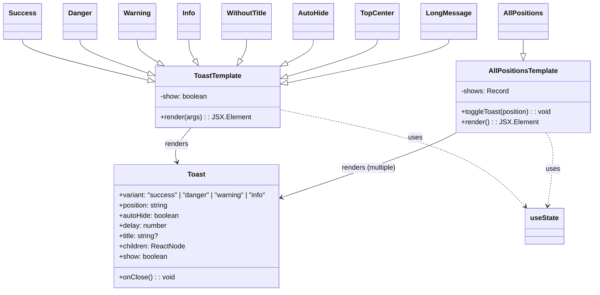
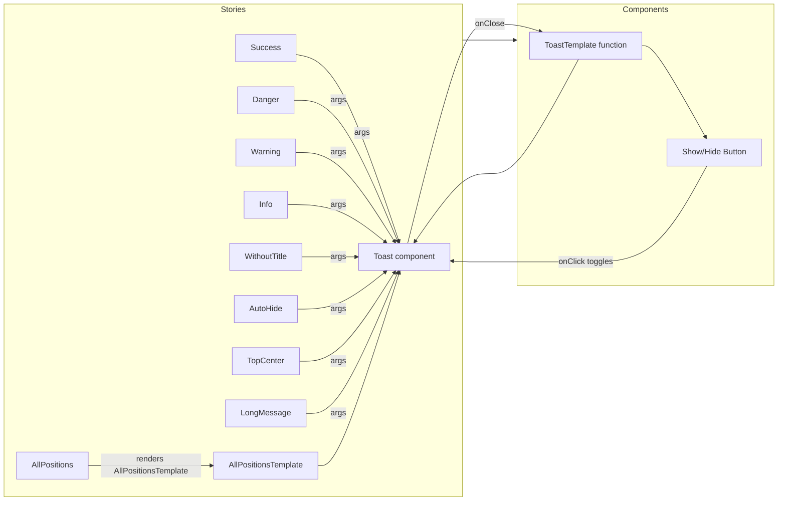

# Diagram: web/portal/src/components/molecules/Toast.molecule.stories.tsx

> Auto-generated by Obscura crawlers

## Diagram 1

### SVG

<svg id="container" width="1349.15625" xmlns="http://www.w3.org/2000/svg" class="classDiagram" height="680" viewBox="0 0 1349.15625 680" role="graphics-document document" aria-roledescription="class"><g><defs><marker id="container_class-aggregationStart" class="marker aggregation class" refX="18" refY="7" markerWidth="190" markerHeight="240" orient="auto"><path d="M 18,7 L9,13 L1,7 L9,1 Z"></path></marker></defs><defs><marker id="container_class-aggregationEnd" class="marker aggregation class" refX="1" refY="7" markerWidth="20" markerHeight="28" orient="auto"><path d="M 18,7 L9,13 L1,7 L9,1 Z"></path></marker></defs><defs><marker id="container_class-extensionStart" class="marker extension class" refX="18" refY="7" markerWidth="190" markerHeight="240" orient="auto"><path d="M 1,7 L18,13 V 1 Z"></path></marker></defs><defs><marker id="container_class-extensionEnd" class="marker extension class" refX="1" refY="7" markerWidth="20" markerHeight="28" orient="auto"><path d="M 1,1 V 13 L18,7 Z"></path></marker></defs><defs><marker id="container_class-compositionStart" class="marker composition class" refX="18" refY="7" markerWidth="190" markerHeight="240" orient="auto"><path d="M 18,7 L9,13 L1,7 L9,1 Z"></path></marker></defs><defs><marker id="container_class-compositionEnd" class="marker composition class" refX="1" refY="7" markerWidth="20" markerHeight="28" orient="auto"><path d="M 18,7 L9,13 L1,7 L9,1 Z"></path></marker></defs><defs><marker id="container_class-dependencyStart" class="marker dependency class" refX="6" refY="7" markerWidth="190" markerHeight="240" orient="auto"><path d="M 5,7 L9,13 L1,7 L9,1 Z"></path></marker></defs><defs><marker id="container_class-dependencyEnd" class="marker dependency class" refX="13" refY="7" markerWidth="20" markerHeight="28" orient="auto"><path d="M 18,7 L9,13 L14,7 L9,1 Z"></path></marker></defs><defs><marker id="container_class-lollipopStart" class="marker lollipop class" refX="13" refY="7" markerWidth="190" markerHeight="240" orient="auto"><circle stroke="black" fill="transparent" cx="7" cy="7" r="6"></circle></marker></defs><defs><marker id="container_class-lollipopEnd" class="marker lollipop class" refX="1" refY="7" markerWidth="190" markerHeight="240" orient="auto"><circle stroke="black" fill="transparent" cx="7" cy="7" r="6"></circle></marker></defs><g class="root"><g class="clusters"></g><g class="edgePaths"><path d="M428.499,298L421.238,306.167C413.976,314.333,399.453,330.667,393.821,344.046C388.19,357.425,391.45,367.849,393.081,373.061L394.711,378.274" id="id_ToastTemplate_Toast_1" class="edge-thickness-normal edge-pattern-solid relation" style=";;;" data-edge="true" data-et="edge" data-id="id_ToastTemplate_Toast_1" data-points="W3sieCI6NDI4LjQ5OTEyODM1NzQzOCwieSI6Mjk4fSx7IngiOjM4NC45Mjk2ODc1LCJ5IjozNDd9LHsieCI6Mzk2LjUwMTc2OTY4MjMyMDQ2LCJ5IjozODR9XQ==" marker-end="url(#container_class-dependencyEnd)"></path><path d="M1028.128,310L1016.68,316.167C1005.233,322.333,982.339,334.667,918.644,359.093C854.948,383.52,750.451,420.04,698.202,438.3L645.953,456.561" id="id_AllPositionsTemplate_Toast_2" class="edge-thickness-normal edge-pattern-solid relation" style=";;;" data-edge="true" data-et="edge" data-id="id_AllPositionsTemplate_Toast_2" data-points="W3sieCI6MTAyOC4xMjc1MTgwNzg1MTI0LCJ5IjozMTB9LHsieCI6OTU5LjQ0NTMxMjUsInkiOjM0N30seyJ4Ijo2NDAuMjg5MDYyNSwieSI6NDU4LjU0MDAzNDk5NjY4MTM2fV0=" marker-end="url(#container_class-dependencyEnd)"></path><path d="M632.676,255.811L704.131,271.009C775.586,286.207,918.496,316.604,1011.482,354.247C1104.468,391.89,1147.53,436.78,1169.061,459.225L1190.592,481.67" id="id_ToastTemplate_useState_3" class="edge-thickness-normal edge-pattern-dashed relation" style=";;;" data-edge="true" data-et="edge" data-id="id_ToastTemplate_useState_3" data-points="W3sieCI6NjMyLjY3NTc4MTI1LCJ5IjoyNTUuODEwNjkxMTExMzR9LHsieCI6MTA2MS40MDYyNSwieSI6MzQ3fSx7IngiOjExOTQuNzQ1NTc1Nzk0MTk4OSwieSI6NDg2fV0=" marker-end="url(#container_class-dependencyEnd)"></path><path d="M1237.837,310L1241.786,316.167C1245.734,322.333,1253.631,334.667,1254.333,363.011C1255.035,391.354,1248.543,435.709,1245.297,457.886L1242.051,480.063" id="id_AllPositionsTemplate_useState_4" class="edge-thickness-normal edge-pattern-dashed relation" style=";;;" data-edge="true" data-et="edge" data-id="id_AllPositionsTemplate_useState_4" data-points="W3sieCI6MTIzNy44MzczNTc5NTQ1NDU1LCJ5IjozMTB9LHsieCI6MTI2MS41MjczNDM3NSwieSI6MzQ3fSx7IngiOjEyNDEuMTgyNTE0Njc1NDE0MywieSI6NDg2fV0=" marker-end="url(#container_class-dependencyEnd)"></path><path d="M48.586,92L48.586,96.167C48.586,100.333,48.586,108.667,96.423,124.579C144.261,140.491,239.936,163.983,287.773,175.728L335.611,187.474" id="id_Success_ToastTemplate_5" class="edge-thickness-normal edge-pattern-solid relation" style=";;;" data-edge="true" data-et="edge" data-id="id_Success_ToastTemplate_5" data-points="W3sieCI6NDguNTg1OTM3NSwieSI6OTJ9LHsieCI6NDguNTg1OTM3NSwieSI6MTE3fSx7IngiOjM1Mi4zNjMyODEyNSwieSI6MTkxLjU4NzEyNTA0NTA5NTc3fV0=" marker-end="url(#container_class-extensionEnd)"></path><path d="M177.156,92L177.156,96.167C177.156,100.333,177.156,108.667,203.64,121.987C230.124,135.307,283.092,153.615,309.576,162.769L336.06,171.922" id="id_Danger_ToastTemplate_6" class="edge-thickness-normal edge-pattern-solid relation" style=";;;" data-edge="true" data-et="edge" data-id="id_Danger_ToastTemplate_6" data-points="W3sieCI6MTc3LjE1NjI1LCJ5Ijo5Mn0seyJ4IjoxNzcuMTU2MjUsInkiOjExN30seyJ4IjozNTIuMzYzMjgxMjUsInkiOjE3Ny41NTczNTU3MjgxNDA5Mn1d" marker-end="url(#container_class-extensionEnd)"></path><path d="M307.172,92L307.172,96.167C307.172,100.333,307.172,108.667,315.18,117.543C323.187,126.419,339.203,135.837,347.211,140.546L355.219,145.256" id="id_Warning_ToastTemplate_7" class="edge-thickness-normal edge-pattern-solid relation" style=";;;" data-edge="true" data-et="edge" data-id="id_Warning_ToastTemplate_7" data-points="W3sieCI6MzA3LjE3MTg3NSwieSI6OTJ9LHsieCI6MzA3LjE3MTg3NSwieSI6MTE3fSx7IngiOjM3MC4wODgwNTE4OTIyMDE4NiwieSI6MTU0fV0=" marker-end="url(#container_class-extensionEnd)"></path><path d="M425.609,92L425.609,96.167C425.609,100.333,425.609,108.667,427.891,116.55C430.172,124.433,434.735,131.866,437.016,135.582L439.298,139.299" id="id_Info_ToastTemplate_8" class="edge-thickness-normal edge-pattern-solid relation" style=";;;" data-edge="true" data-et="edge" data-id="id_Info_ToastTemplate_8" data-points="W3sieCI6NDI1LjYwOTM3NSwieSI6OTJ9LHsieCI6NDI1LjYwOTM3NSwieSI6MTE3fSx7IngiOjQ0OC4zMjE5OTY4NDYzMzAyNSwieSI6MTU0fV0=" marker-end="url(#container_class-extensionEnd)"></path><path d="M559.43,92L559.43,96.167C559.43,100.333,559.43,108.667,557.148,116.55C554.867,124.433,550.304,131.866,548.023,135.582L545.741,139.299" id="id_WithoutTitle_ToastTemplate_9" class="edge-thickness-normal edge-pattern-solid relation" style=";;;" data-edge="true" data-et="edge" data-id="id_WithoutTitle_ToastTemplate_9" data-points="W3sieCI6NTU5LjQyOTY4NzUsInkiOjkyfSx7IngiOjU1OS40Mjk2ODc1LCJ5IjoxMTd9LHsieCI6NTM2LjcxNzA2NTY1MzY2OTcsInkiOjE1NH1d" marker-end="url(#container_class-extensionEnd)"></path><path d="M712.563,92L712.563,96.167C712.563,100.333,712.563,108.667,701.824,118.153C691.086,127.639,669.61,138.277,658.871,143.596L648.133,148.916" id="id_AutoHide_ToastTemplate_10" class="edge-thickness-normal edge-pattern-solid relation" style=";;;" data-edge="true" data-et="edge" data-id="id_AutoHide_ToastTemplate_10" data-points="W3sieCI6NzEyLjU2MjUsInkiOjkyfSx7IngiOjcxMi41NjI1LCJ5IjoxMTd9LHsieCI6NjMyLjY3NTc4MTI1LCJ5IjoxNTYuNTcyNTA4OTIwNDg3ODV9XQ==" marker-end="url(#container_class-extensionEnd)"></path><path d="M857.656,92L857.656,96.167C857.656,100.333,857.656,108.667,822.914,123.204C788.173,137.742,718.689,158.484,683.947,168.855L649.205,179.227" id="id_TopCenter_ToastTemplate_11" class="edge-thickness-normal edge-pattern-solid relation" style=";;;" data-edge="true" data-et="edge" data-id="id_TopCenter_ToastTemplate_11" data-points="W3sieCI6ODU3LjY1NjI1LCJ5Ijo5Mn0seyJ4Ijo4NTcuNjU2MjUsInkiOjExN30seyJ4Ijo2MzIuNjc1NzgxMjUsInkiOjE4NC4xNjA3OTE2NTU1MjI4N31d" marker-end="url(#container_class-extensionEnd)"></path><path d="M1017.883,92L1017.883,96.167C1017.883,100.333,1017.883,108.667,956.497,125.569C895.111,142.472,772.338,167.944,710.952,180.681L649.566,193.417" id="id_LongMessage_ToastTemplate_12" class="edge-thickness-normal edge-pattern-solid relation" style=";;;" data-edge="true" data-et="edge" data-id="id_LongMessage_ToastTemplate_12" data-points="W3sieCI6MTAxNy44ODI4MTI1LCJ5Ijo5Mn0seyJ4IjoxMDE3Ljg4MjgxMjUsInkiOjExN30seyJ4Ijo2MzIuNjc1NzgxMjUsInkiOjE5Ni45MjEwMTQ0NzY1ODk4NX1d" marker-end="url(#container_class-extensionEnd)"></path><path d="M1184.055,92L1184.055,96.167C1184.055,100.333,1184.055,108.667,1184.055,114.125C1184.055,119.583,1184.055,122.167,1184.055,123.458L1184.055,124.75" id="id_AllPositions_AllPositionsTemplate_13" class="edge-thickness-normal edge-pattern-solid relation" style=";;;" data-edge="true" data-et="edge" data-id="id_AllPositions_AllPositionsTemplate_13" data-points="W3sieCI6MTE4NC4wNTQ2ODc1LCJ5Ijo5Mn0seyJ4IjoxMTg0LjA1NDY4NzUsInkiOjExN30seyJ4IjoxMTg0LjA1NDY4NzUsInkiOjE0Mn1d" marker-end="url(#container_class-extensionEnd)"></path></g><g class="edgeLabels"><g class="edgeLabel" transform="translate(393.83428, 336.98553)"><g class="label" data-id="id_ToastTemplate_Toast_1" transform="translate(-27.75, -12)"><foreignObject width="55.5" height="24">

renders

</foreignObject></g></g><g class="edgeLabel" transform="translate(836.69037, 389.9009)"><g class="label" data-id="id_AllPositionsTemplate_Toast_2" transform="translate(-65.46875, -12)"><foreignObject width="130.9375" height="24">

renders (multiple)

</foreignObject></g></g><g class="edgeLabel" transform="translate(941.24109, 321.44134)"><g class="label" data-id="id_ToastTemplate_useState_3" transform="translate(-16.4921875, -12)"><foreignObject width="32.984375" height="24">

uses

</foreignObject></g></g><g class="edgeLabel" transform="translate(1254.53626, 394.76448)"><g class="label" data-id="id_AllPositionsTemplate_useState_4" transform="translate(-16.4921875, -12)"><foreignObject width="32.984375" height="24">

uses

</foreignObject></g></g><g class="edgeLabel"><g class="label" data-id="id_Success_ToastTemplate_5" transform="translate(0, 0)"><foreignObject width="0" height="0">

</foreignObject></g></g><g class="edgeLabel"><g class="label" data-id="id_Danger_ToastTemplate_6" transform="translate(0, 0)"><foreignObject width="0" height="0">

</foreignObject></g></g><g class="edgeLabel"><g class="label" data-id="id_Warning_ToastTemplate_7" transform="translate(0, 0)"><foreignObject width="0" height="0">

</foreignObject></g></g><g class="edgeLabel"><g class="label" data-id="id_Info_ToastTemplate_8" transform="translate(0, 0)"><foreignObject width="0" height="0">

</foreignObject></g></g><g class="edgeLabel"><g class="label" data-id="id_WithoutTitle_ToastTemplate_9" transform="translate(0, 0)"><foreignObject width="0" height="0">

</foreignObject></g></g><g class="edgeLabel"><g class="label" data-id="id_AutoHide_ToastTemplate_10" transform="translate(0, 0)"><foreignObject width="0" height="0">

</foreignObject></g></g><g class="edgeLabel"><g class="label" data-id="id_TopCenter_ToastTemplate_11" transform="translate(0, 0)"><foreignObject width="0" height="0">

</foreignObject></g></g><g class="edgeLabel"><g class="label" data-id="id_LongMessage_ToastTemplate_12" transform="translate(0, 0)"><foreignObject width="0" height="0">

</foreignObject></g></g><g class="edgeLabel"><g class="label" data-id="id_AllPositions_AllPositionsTemplate_13" transform="translate(0, 0)"><foreignObject width="0" height="0">

</foreignObject></g></g></g><g class="nodes"><g class="node default" id="classId-Toast-0" transform="translate(441.5390625, 528)"><g class="basic label-container"><path d="M-198.75 -144 L198.75 -144 L198.75 144 L-198.75 144" stroke="none" stroke-width="0" fill="#ECECFF" style=""></path><path d="M-198.75 -144 C-40.97107997024298 -144, 116.80784005951404 -144, 198.75 -144 M-198.75 -144 C-104.05058727220556 -144, -9.351174544411123 -144, 198.75 -144 M198.75 -144 C198.75 -28.841584244384734, 198.75 86.31683151123053, 198.75 144 M198.75 -144 C198.75 -60.640545898247055, 198.75 22.71890820350589, 198.75 144 M198.75 144 C41.401788072276474 144, -115.94642385544705 144, -198.75 144 M198.75 144 C83.18078733052565 144, -32.38842533894871 144, -198.75 144 M-198.75 144 C-198.75 48.92681934651718, -198.75 -46.146361306965645, -198.75 -144 M-198.75 144 C-198.75 68.05812634308054, -198.75 -7.88374731383891, -198.75 -144" stroke="#9370DB" stroke-width="1.3" fill="none" stroke-dasharray="0 0" style=""></path></g><g class="annotation-group text" transform="translate(0, -120)"></g><g class="label-group text" transform="translate(-19.734375, -120)"><g class="label" style="font-weight: bolder" transform="translate(0,-12)"><foreignObject width="39.46875" height="24">

Toast

</foreignObject></g></g><g class="members-group text" transform="translate(-186.75, -72)"><g class="label" style="" transform="translate(0,-12)"><foreignObject width="353.765625" height="24">

+variant: "success" | "danger" | "warning" | "info"

</foreignObject></g><g class="label" style="" transform="translate(0,12)"><foreignObject width="117.546875" height="24">

+position: string

</foreignObject></g><g class="label" style="" transform="translate(0,36)"><foreignObject width="141.84375" height="24">

+autoHide: boolean

</foreignObject></g><g class="label" style="" transform="translate(0,60)"><foreignObject width="112.171875" height="24">

+delay: number

</foreignObject></g><g class="label" style="" transform="translate(0,84)"><foreignObject width="93.875" height="24">

+title: string?

</foreignObject></g><g class="label" style="" transform="translate(0,108)"><foreignObject width="154.265625" height="24">

+children: ReactNode

</foreignObject></g><g class="label" style="" transform="translate(0,132)"><foreignObject width="113.234375" height="24">

+show: boolean

</foreignObject></g></g><g class="methods-group text" transform="translate(-186.75, 120)"><g class="label" style="" transform="translate(0,-12)"><foreignObject width="127.65625" height="24">

+onClose() : : void

</foreignObject></g></g><g class="divider" style=""><path d="M-198.75 -96 C-69.4254206658018 -96, 59.89915866839641 -96, 198.75 -96 M-198.75 -96 C-80.49942634182757 -96, 37.751147316344856 -96, 198.75 -96" stroke="#9370DB" stroke-width="1.3" fill="none" stroke-dasharray="0 0" style=""></path></g><g class="divider" style=""><path d="M-198.75 96 C-93.17176480402505 96, 12.40647039194991 96, 198.75 96 M-198.75 96 C-50.551162655844394 96, 97.64767468831121 96, 198.75 96" stroke="#9370DB" stroke-width="1.3" fill="none" stroke-dasharray="0 0" style=""></path></g></g><g class="node default" id="classId-ToastTemplate-1" transform="translate(492.51953125, 226)"><g class="basic label-container"><path d="M-140.15625 -72 L140.15625 -72 L140.15625 72 L-140.15625 72" stroke="none" stroke-width="0" fill="#ECECFF" style=""></path><path d="M-140.15625 -72 C-67.95606445033245 -72, 4.2441210993351035 -72, 140.15625 -72 M-140.15625 -72 C-33.85221972775349 -72, 72.45181054449301 -72, 140.15625 -72 M140.15625 -72 C140.15625 -39.16317640648576, 140.15625 -6.326352812971521, 140.15625 72 M140.15625 -72 C140.15625 -41.928798079317545, 140.15625 -11.857596158635083, 140.15625 72 M140.15625 72 C46.58479942214632 72, -46.986651155707364 72, -140.15625 72 M140.15625 72 C45.581061091093346 72, -48.99412781781331 72, -140.15625 72 M-140.15625 72 C-140.15625 33.162871792983054, -140.15625 -5.674256414033891, -140.15625 -72 M-140.15625 72 C-140.15625 42.699939170783544, -140.15625 13.399878341567089, -140.15625 -72" stroke="#9370DB" stroke-width="1.3" fill="none" stroke-dasharray="0 0" style=""></path></g><g class="annotation-group text" transform="translate(0, -48)"></g><g class="label-group text" transform="translate(-53.640625, -48)"><g class="label" style="font-weight: bolder" transform="translate(0,-12)"><foreignObject width="107.28125" height="24">

ToastTemplate

</foreignObject></g></g><g class="members-group text" transform="translate(-128.15625, 0)"><g class="label" style="" transform="translate(0,-12)"><foreignObject width="111.703125" height="24">

-show: boolean

</foreignObject></g></g><g class="methods-group text" transform="translate(-128.15625, 48)"><g class="label" style="" transform="translate(0,-12)"><foreignObject width="202.671875" height="24">

+render(args) : : JSX.Element

</foreignObject></g></g><g class="divider" style=""><path d="M-140.15625 -24 C-54.37140387677783 -24, 31.413442246444333 -24, 140.15625 -24 M-140.15625 -24 C-62.44553442387962 -24, 15.265181152240757 -24, 140.15625 -24" stroke="#9370DB" stroke-width="1.3" fill="none" stroke-dasharray="0 0" style=""></path></g><g class="divider" style=""><path d="M-140.15625 24 C-60.1793582750511 24, 19.7975334498978 24, 140.15625 24 M-140.15625 24 C-48.46961463914887 24, 43.217020721702255 24, 140.15625 24" stroke="#9370DB" stroke-width="1.3" fill="none" stroke-dasharray="0 0" style=""></path></g></g><g class="node default" id="classId-AllPositionsTemplate-2" transform="translate(1184.0546875, 226)"><g class="basic label-container"><path d="M-157.1015625 -84 L157.1015625 -84 L157.1015625 84 L-157.1015625 84" stroke="none" stroke-width="0" fill="#ECECFF" style=""></path><path d="M-157.1015625 -84 C-81.52775393663349 -84, -5.953945373266976 -84, 157.1015625 -84 M-157.1015625 -84 C-52.20890529249337 -84, 52.68375191501326 -84, 157.1015625 -84 M157.1015625 -84 C157.1015625 -46.37927287319599, 157.1015625 -8.758545746391974, 157.1015625 84 M157.1015625 -84 C157.1015625 -42.59832434532874, 157.1015625 -1.196648690657483, 157.1015625 84 M157.1015625 84 C31.883213118656712 84, -93.33513626268658 84, -157.1015625 84 M157.1015625 84 C91.58754041127881 84, 26.073518322557618 84, -157.1015625 84 M-157.1015625 84 C-157.1015625 50.22947789797023, -157.1015625 16.458955795940454, -157.1015625 -84 M-157.1015625 84 C-157.1015625 38.86271219096567, -157.1015625 -6.274575618068667, -157.1015625 -84" stroke="#9370DB" stroke-width="1.3" fill="none" stroke-dasharray="0 0" style=""></path></g><g class="annotation-group text" transform="translate(0, -60)"></g><g class="label-group text" transform="translate(-77.234375, -60)"><g class="label" style="font-weight: bolder" transform="translate(0,-12)"><foreignObject width="154.46875" height="24">

AllPositionsTemplate

</foreignObject></g></g><g class="members-group text" transform="translate(-145.1015625, -12)"><g class="label" style="" transform="translate(0,-12)"><foreignObject width="109.765625" height="24">

-shows: Record

</foreignObject></g></g><g class="methods-group text" transform="translate(-145.1015625, 36)"><g class="label" style="" transform="translate(0,-12)"><foreignObject width="212.96875" height="24">

+toggleToast(position) : : void

</foreignObject></g><g class="label" style="" transform="translate(0,12)"><foreignObject width="172.34375" height="24">

+render() : : JSX.Element

</foreignObject></g></g><g class="divider" style=""><path d="M-157.1015625 -36 C-39.61568215544878 -36, 77.87019818910244 -36, 157.1015625 -36 M-157.1015625 -36 C-33.5878861059297 -36, 89.9257902881406 -36, 157.1015625 -36" stroke="#9370DB" stroke-width="1.3" fill="none" stroke-dasharray="0 0" style=""></path></g><g class="divider" style=""><path d="M-157.1015625 12 C-48.83870975527657 12, 59.424142989446864 12, 157.1015625 12 M-157.1015625 12 C-80.12538848518902 12, -3.149214470378041 12, 157.1015625 12" stroke="#9370DB" stroke-width="1.3" fill="none" stroke-dasharray="0 0" style=""></path></g></g><g class="node default" id="classId-useState-3" transform="translate(1235.03515625, 528)"><g class="basic label-container"><path d="M-44.171875 -42 L44.171875 -42 L44.171875 42 L-44.171875 42" stroke="none" stroke-width="0" fill="#ECECFF" style=""></path><path d="M-44.171875 -42 C-14.384348463367374 -42, 15.403178073265252 -42, 44.171875 -42 M-44.171875 -42 C-10.282912397468074 -42, 23.606050205063852 -42, 44.171875 -42 M44.171875 -42 C44.171875 -20.835810819763616, 44.171875 0.3283783604727688, 44.171875 42 M44.171875 -42 C44.171875 -14.768147285089022, 44.171875 12.463705429821957, 44.171875 42 M44.171875 42 C26.167051612584515 42, 8.16222822516903 42, -44.171875 42 M44.171875 42 C20.37145115977066 42, -3.4289726804586778 42, -44.171875 42 M-44.171875 42 C-44.171875 18.69960749032772, -44.171875 -4.600785019344563, -44.171875 -42 M-44.171875 42 C-44.171875 19.50401200865111, -44.171875 -2.991975982697781, -44.171875 -42" stroke="#9370DB" stroke-width="1.3" fill="none" stroke-dasharray="0 0" style=""></path></g><g class="annotation-group text" transform="translate(0, -18)"></g><g class="label-group text" transform="translate(-32.171875, -18)"><g class="label" style="font-weight: bolder" transform="translate(0,-12)"><foreignObject width="64.34375" height="24">

useState

</foreignObject></g></g><g class="members-group text" transform="translate(-32.171875, 30)"></g><g class="methods-group text" transform="translate(-32.171875, 60)"></g><g class="divider" style=""><path d="M-44.171875 6 C-9.804074960053882 6, 24.563725079892237 6, 44.171875 6 M-44.171875 6 C-23.411602820725832 6, -2.651330641451665 6, 44.171875 6" stroke="#9370DB" stroke-width="1.3" fill="none" stroke-dasharray="0 0" style=""></path></g><g class="divider" style=""><path d="M-44.171875 24 C-16.258567142456844 24, 11.654740715086312 24, 44.171875 24 M-44.171875 24 C-21.31149190304471 24, 1.5488911939105776 24, 44.171875 24" stroke="#9370DB" stroke-width="1.3" fill="none" stroke-dasharray="0 0" style=""></path></g></g><g class="node default" id="classId-Success-4" transform="translate(48.5859375, 50)"><g class="basic label-container"><path d="M-40.5859375 -42 L40.5859375 -42 L40.5859375 42 L-40.5859375 42" stroke="none" stroke-width="0" fill="#ECECFF" style=""></path><path d="M-40.5859375 -42 C-17.024110740674416 -42, 6.537716018651167 -42, 40.5859375 -42 M-40.5859375 -42 C-13.587867157877191 -42, 13.410203184245617 -42, 40.5859375 -42 M40.5859375 -42 C40.5859375 -13.570412328656833, 40.5859375 14.859175342686335, 40.5859375 42 M40.5859375 -42 C40.5859375 -16.428482848318485, 40.5859375 9.14303430336303, 40.5859375 42 M40.5859375 42 C8.193601917742129 42, -24.198733664515743 42, -40.5859375 42 M40.5859375 42 C12.140705677285379 42, -16.304526145429243 42, -40.5859375 42 M-40.5859375 42 C-40.5859375 21.12933094562515, -40.5859375 0.2586618912502985, -40.5859375 -42 M-40.5859375 42 C-40.5859375 13.435199823696884, -40.5859375 -15.129600352606232, -40.5859375 -42" stroke="#9370DB" stroke-width="1.3" fill="none" stroke-dasharray="0 0" style=""></path></g><g class="annotation-group text" transform="translate(0, -18)"></g><g class="label-group text" transform="translate(-28.5859375, -18)"><g class="label" style="font-weight: bolder" transform="translate(0,-12)"><foreignObject width="57.171875" height="24">

Success

</foreignObject></g></g><g class="members-group text" transform="translate(-28.5859375, 30)"></g><g class="methods-group text" transform="translate(-28.5859375, 60)"></g><g class="divider" style=""><path d="M-40.5859375 6 C-16.9440630578299 6, 6.6978113843401985 6, 40.5859375 6 M-40.5859375 6 C-18.455747931669446 6, 3.6744416366611077 6, 40.5859375 6" stroke="#9370DB" stroke-width="1.3" fill="none" stroke-dasharray="0 0" style=""></path></g><g class="divider" style=""><path d="M-40.5859375 24 C-12.719131299111101 24, 15.147674901777798 24, 40.5859375 24 M-40.5859375 24 C-10.726496912379218 24, 19.132943675241563 24, 40.5859375 24" stroke="#9370DB" stroke-width="1.3" fill="none" stroke-dasharray="0 0" style=""></path></g></g><g class="node default" id="classId-Danger-5" transform="translate(177.15625, 50)"><g class="basic label-container"><path d="M-37.984375 -42 L37.984375 -42 L37.984375 42 L-37.984375 42" stroke="none" stroke-width="0" fill="#ECECFF" style=""></path><path d="M-37.984375 -42 C-20.586809367620447 -42, -3.1892437352408933 -42, 37.984375 -42 M-37.984375 -42 C-11.074111105651877 -42, 15.836152788696246 -42, 37.984375 -42 M37.984375 -42 C37.984375 -12.631625345145697, 37.984375 16.736749309708607, 37.984375 42 M37.984375 -42 C37.984375 -11.544657437107563, 37.984375 18.910685125784873, 37.984375 42 M37.984375 42 C21.24444164139765 42, 4.5045082827953 42, -37.984375 42 M37.984375 42 C11.285453418840323 42, -15.413468162319354 42, -37.984375 42 M-37.984375 42 C-37.984375 20.475887147488965, -37.984375 -1.0482257050220696, -37.984375 -42 M-37.984375 42 C-37.984375 14.19347244636733, -37.984375 -13.613055107265339, -37.984375 -42" stroke="#9370DB" stroke-width="1.3" fill="none" stroke-dasharray="0 0" style=""></path></g><g class="annotation-group text" transform="translate(0, -18)"></g><g class="label-group text" transform="translate(-25.984375, -18)"><g class="label" style="font-weight: bolder" transform="translate(0,-12)"><foreignObject width="51.96875" height="24">

Danger

</foreignObject></g></g><g class="members-group text" transform="translate(-25.984375, 30)"></g><g class="methods-group text" transform="translate(-25.984375, 60)"></g><g class="divider" style=""><path d="M-37.984375 6 C-22.737450356710852 6, -7.490525713421704 6, 37.984375 6 M-37.984375 6 C-17.19479817972053 6, 3.5947786405589426 6, 37.984375 6" stroke="#9370DB" stroke-width="1.3" fill="none" stroke-dasharray="0 0" style=""></path></g><g class="divider" style=""><path d="M-37.984375 24 C-10.824200833954436 24, 16.33597333209113 24, 37.984375 24 M-37.984375 24 C-9.08627836745232 24, 19.81181826509536 24, 37.984375 24" stroke="#9370DB" stroke-width="1.3" fill="none" stroke-dasharray="0 0" style=""></path></g></g><g class="node default" id="classId-Warning-6" transform="translate(307.171875, 50)"><g class="basic label-container"><path d="M-42.03125 -42 L42.03125 -42 L42.03125 42 L-42.03125 42" stroke="none" stroke-width="0" fill="#ECECFF" style=""></path><path d="M-42.03125 -42 C-13.561263064509308 -42, 14.908723870981383 -42, 42.03125 -42 M-42.03125 -42 C-14.516757123543709 -42, 12.997735752912583 -42, 42.03125 -42 M42.03125 -42 C42.03125 -22.680497621813377, 42.03125 -3.3609952436267534, 42.03125 42 M42.03125 -42 C42.03125 -24.109184348551214, 42.03125 -6.218368697102427, 42.03125 42 M42.03125 42 C9.208149867661959 42, -23.614950264676082 42, -42.03125 42 M42.03125 42 C21.285397090014136 42, 0.5395441800282725 42, -42.03125 42 M-42.03125 42 C-42.03125 14.829931941805338, -42.03125 -12.340136116389324, -42.03125 -42 M-42.03125 42 C-42.03125 14.000122623603062, -42.03125 -13.999754752793876, -42.03125 -42" stroke="#9370DB" stroke-width="1.3" fill="none" stroke-dasharray="0 0" style=""></path></g><g class="annotation-group text" transform="translate(0, -18)"></g><g class="label-group text" transform="translate(-30.03125, -18)"><g class="label" style="font-weight: bolder" transform="translate(0,-12)"><foreignObject width="60.0625" height="24">

Warning

</foreignObject></g></g><g class="members-group text" transform="translate(-30.03125, 30)"></g><g class="methods-group text" transform="translate(-30.03125, 60)"></g><g class="divider" style=""><path d="M-42.03125 6 C-24.710294857514295 6, -7.389339715028591 6, 42.03125 6 M-42.03125 6 C-18.8672452258566 6, 4.296759548286801 6, 42.03125 6" stroke="#9370DB" stroke-width="1.3" fill="none" stroke-dasharray="0 0" style=""></path></g><g class="divider" style=""><path d="M-42.03125 24 C-20.613282555505776 24, 0.8046848889884473 24, 42.03125 24 M-42.03125 24 C-24.441578155390363 24, -6.851906310780727 24, 42.03125 24" stroke="#9370DB" stroke-width="1.3" fill="none" stroke-dasharray="0 0" style=""></path></g></g><g class="node default" id="classId-Info-7" transform="translate(425.609375, 50)"><g class="basic label-container"><path d="M-26.40625 -42 L26.40625 -42 L26.40625 42 L-26.40625 42" stroke="none" stroke-width="0" fill="#ECECFF" style=""></path><path d="M-26.40625 -42 C-9.322972624648418 -42, 7.760304750703163 -42, 26.40625 -42 M-26.40625 -42 C-9.395871430929255 -42, 7.614507138141491 -42, 26.40625 -42 M26.40625 -42 C26.40625 -18.575713893553242, 26.40625 4.848572212893515, 26.40625 42 M26.40625 -42 C26.40625 -17.80252178769179, 26.40625 6.394956424616417, 26.40625 42 M26.40625 42 C5.603595579771277 42, -15.199058840457447 42, -26.40625 42 M26.40625 42 C11.100708934806716 42, -4.204832130386567 42, -26.40625 42 M-26.40625 42 C-26.40625 10.848618566333052, -26.40625 -20.302762867333897, -26.40625 -42 M-26.40625 42 C-26.40625 18.322130322893752, -26.40625 -5.355739354212496, -26.40625 -42" stroke="#9370DB" stroke-width="1.3" fill="none" stroke-dasharray="0 0" style=""></path></g><g class="annotation-group text" transform="translate(0, -18)"></g><g class="label-group text" transform="translate(-14.40625, -18)"><g class="label" style="font-weight: bolder" transform="translate(0,-12)"><foreignObject width="28.8125" height="24">

Info

</foreignObject></g></g><g class="members-group text" transform="translate(-14.40625, 30)"></g><g class="methods-group text" transform="translate(-14.40625, 60)"></g><g class="divider" style=""><path d="M-26.40625 6 C-9.888639189775837 6, 6.6289716204483256 6, 26.40625 6 M-26.40625 6 C-6.148216088211626 6, 14.109817823576748 6, 26.40625 6" stroke="#9370DB" stroke-width="1.3" fill="none" stroke-dasharray="0 0" style=""></path></g><g class="divider" style=""><path d="M-26.40625 24 C-11.681334527283903 24, 3.0435809454321934 24, 26.40625 24 M-26.40625 24 C-13.433862096945687 24, -0.4614741938913731 24, 26.40625 24" stroke="#9370DB" stroke-width="1.3" fill="none" stroke-dasharray="0 0" style=""></path></g></g><g class="node default" id="classId-WithoutTitle-8" transform="translate(559.4296875, 50)"><g class="basic label-container"><path d="M-57.4140625 -42 L57.4140625 -42 L57.4140625 42 L-57.4140625 42" stroke="none" stroke-width="0" fill="#ECECFF" style=""></path><path d="M-57.4140625 -42 C-16.41551768087683 -42, 24.583027138246337 -42, 57.4140625 -42 M-57.4140625 -42 C-17.743185679491887 -42, 21.927691141016226 -42, 57.4140625 -42 M57.4140625 -42 C57.4140625 -10.702235722309457, 57.4140625 20.595528555381087, 57.4140625 42 M57.4140625 -42 C57.4140625 -14.26203414562237, 57.4140625 13.475931708755262, 57.4140625 42 M57.4140625 42 C25.29985479289114 42, -6.8143529142177215 42, -57.4140625 42 M57.4140625 42 C23.155538732733532 42, -11.102985034532935 42, -57.4140625 42 M-57.4140625 42 C-57.4140625 14.14755684331724, -57.4140625 -13.70488631336552, -57.4140625 -42 M-57.4140625 42 C-57.4140625 19.584599864650958, -57.4140625 -2.8308002706980844, -57.4140625 -42" stroke="#9370DB" stroke-width="1.3" fill="none" stroke-dasharray="0 0" style=""></path></g><g class="annotation-group text" transform="translate(0, -18)"></g><g class="label-group text" transform="translate(-45.4140625, -18)"><g class="label" style="font-weight: bolder" transform="translate(0,-12)"><foreignObject width="90.828125" height="24">

WithoutTitle

</foreignObject></g></g><g class="members-group text" transform="translate(-45.4140625, 30)"></g><g class="methods-group text" transform="translate(-45.4140625, 60)"></g><g class="divider" style=""><path d="M-57.4140625 6 C-19.386048960570662 6, 18.641964578858676 6, 57.4140625 6 M-57.4140625 6 C-12.40385741880403 6, 32.60634766239194 6, 57.4140625 6" stroke="#9370DB" stroke-width="1.3" fill="none" stroke-dasharray="0 0" style=""></path></g><g class="divider" style=""><path d="M-57.4140625 24 C-22.956173234735147 24, 11.501716030529707 24, 57.4140625 24 M-57.4140625 24 C-28.041319943078385 24, 1.3314226138432304 24, 57.4140625 24" stroke="#9370DB" stroke-width="1.3" fill="none" stroke-dasharray="0 0" style=""></path></g></g><g class="node default" id="classId-AutoHide-9" transform="translate(712.5625, 50)"><g class="basic label-container"><path d="M-45.71875 -42 L45.71875 -42 L45.71875 42 L-45.71875 42" stroke="none" stroke-width="0" fill="#ECECFF" style=""></path><path d="M-45.71875 -42 C-14.352736375342062 -42, 17.013277249315877 -42, 45.71875 -42 M-45.71875 -42 C-24.642181824722872 -42, -3.565613649445744 -42, 45.71875 -42 M45.71875 -42 C45.71875 -24.087750353166935, 45.71875 -6.175500706333871, 45.71875 42 M45.71875 -42 C45.71875 -20.219300744777946, 45.71875 1.561398510444107, 45.71875 42 M45.71875 42 C13.485587631478737 42, -18.747574737042527 42, -45.71875 42 M45.71875 42 C10.784399321062722 42, -24.149951357874556 42, -45.71875 42 M-45.71875 42 C-45.71875 8.615534993801504, -45.71875 -24.768930012396993, -45.71875 -42 M-45.71875 42 C-45.71875 9.350793454296735, -45.71875 -23.29841309140653, -45.71875 -42" stroke="#9370DB" stroke-width="1.3" fill="none" stroke-dasharray="0 0" style=""></path></g><g class="annotation-group text" transform="translate(0, -18)"></g><g class="label-group text" transform="translate(-33.71875, -18)"><g class="label" style="font-weight: bolder" transform="translate(0,-12)"><foreignObject width="67.4375" height="24">

AutoHide

</foreignObject></g></g><g class="members-group text" transform="translate(-33.71875, 30)"></g><g class="methods-group text" transform="translate(-33.71875, 60)"></g><g class="divider" style=""><path d="M-45.71875 6 C-20.061432391534687 6, 5.5958852169306255 6, 45.71875 6 M-45.71875 6 C-21.329520543772645 6, 3.0597089124547097 6, 45.71875 6" stroke="#9370DB" stroke-width="1.3" fill="none" stroke-dasharray="0 0" style=""></path></g><g class="divider" style=""><path d="M-45.71875 24 C-18.889166193229954 24, 7.940417613540092 24, 45.71875 24 M-45.71875 24 C-15.24185478569606 24, 15.235040428607881 24, 45.71875 24" stroke="#9370DB" stroke-width="1.3" fill="none" stroke-dasharray="0 0" style=""></path></g></g><g class="node default" id="classId-TopCenter-10" transform="translate(857.65625, 50)"><g class="basic label-container"><path d="M-49.375 -42 L49.375 -42 L49.375 42 L-49.375 42" stroke="none" stroke-width="0" fill="#ECECFF" style=""></path><path d="M-49.375 -42 C-21.444281343439993 -42, 6.486437313120014 -42, 49.375 -42 M-49.375 -42 C-20.572885150968776 -42, 8.229229698062447 -42, 49.375 -42 M49.375 -42 C49.375 -9.386121222394422, 49.375 23.227757555211156, 49.375 42 M49.375 -42 C49.375 -23.87319473325184, 49.375 -5.746389466503679, 49.375 42 M49.375 42 C18.4801811576217 42, -12.414637684756599 42, -49.375 42 M49.375 42 C15.211711401948008 42, -18.951577196103983 42, -49.375 42 M-49.375 42 C-49.375 11.047067984725743, -49.375 -19.905864030548514, -49.375 -42 M-49.375 42 C-49.375 21.16758119884017, -49.375 0.3351623976803424, -49.375 -42" stroke="#9370DB" stroke-width="1.3" fill="none" stroke-dasharray="0 0" style=""></path></g><g class="annotation-group text" transform="translate(0, -18)"></g><g class="label-group text" transform="translate(-37.375, -18)"><g class="label" style="font-weight: bolder" transform="translate(0,-12)"><foreignObject width="74.75" height="24">

TopCenter

</foreignObject></g></g><g class="members-group text" transform="translate(-37.375, 30)"></g><g class="methods-group text" transform="translate(-37.375, 60)"></g><g class="divider" style=""><path d="M-49.375 6 C-12.567007072485659 6, 24.240985855028683 6, 49.375 6 M-49.375 6 C-16.334540098961845 6, 16.70591980207631 6, 49.375 6" stroke="#9370DB" stroke-width="1.3" fill="none" stroke-dasharray="0 0" style=""></path></g><g class="divider" style=""><path d="M-49.375 24 C-25.614566277681533 24, -1.8541325553630656 24, 49.375 24 M-49.375 24 C-23.395770806535324 24, 2.583458386929351 24, 49.375 24" stroke="#9370DB" stroke-width="1.3" fill="none" stroke-dasharray="0 0" style=""></path></g></g><g class="node default" id="classId-LongMessage-11" transform="translate(1017.8828125, 50)"><g class="basic label-container"><path d="M-60.8515625 -42 L60.8515625 -42 L60.8515625 42 L-60.8515625 42" stroke="none" stroke-width="0" fill="#ECECFF" style=""></path><path d="M-60.8515625 -42 C-25.827283818967068 -42, 9.196994862065864 -42, 60.8515625 -42 M-60.8515625 -42 C-28.18469173176038 -42, 4.482179036479238 -42, 60.8515625 -42 M60.8515625 -42 C60.8515625 -10.692202570894572, 60.8515625 20.615594858210855, 60.8515625 42 M60.8515625 -42 C60.8515625 -15.785632369908825, 60.8515625 10.42873526018235, 60.8515625 42 M60.8515625 42 C32.323646363613726 42, 3.795730227227452 42, -60.8515625 42 M60.8515625 42 C33.54062497853866 42, 6.2296874570773255 42, -60.8515625 42 M-60.8515625 42 C-60.8515625 21.28340421123379, -60.8515625 0.5668084224675809, -60.8515625 -42 M-60.8515625 42 C-60.8515625 22.242390699897832, -60.8515625 2.484781399795665, -60.8515625 -42" stroke="#9370DB" stroke-width="1.3" fill="none" stroke-dasharray="0 0" style=""></path></g><g class="annotation-group text" transform="translate(0, -18)"></g><g class="label-group text" transform="translate(-48.8515625, -18)"><g class="label" style="font-weight: bolder" transform="translate(0,-12)"><foreignObject width="97.703125" height="24">

LongMessage

</foreignObject></g></g><g class="members-group text" transform="translate(-48.8515625, 30)"></g><g class="methods-group text" transform="translate(-48.8515625, 60)"></g><g class="divider" style=""><path d="M-60.8515625 6 C-26.34560895787216 6, 8.160344584255682 6, 60.8515625 6 M-60.8515625 6 C-17.417482774541497 6, 26.016596950917005 6, 60.8515625 6" stroke="#9370DB" stroke-width="1.3" fill="none" stroke-dasharray="0 0" style=""></path></g><g class="divider" style=""><path d="M-60.8515625 24 C-18.23300409082063 24, 24.385554318358743 24, 60.8515625 24 M-60.8515625 24 C-23.38025733607717 24, 14.091047827845657 24, 60.8515625 24" stroke="#9370DB" stroke-width="1.3" fill="none" stroke-dasharray="0 0" style=""></path></g></g><g class="node default" id="classId-AllPositions-12" transform="translate(1184.0546875, 50)"><g class="basic label-container"><path d="M-55.3203125 -42 L55.3203125 -42 L55.3203125 42 L-55.3203125 42" stroke="none" stroke-width="0" fill="#ECECFF" style=""></path><path d="M-55.3203125 -42 C-19.39054021099556 -42, 16.53923207800888 -42, 55.3203125 -42 M-55.3203125 -42 C-23.99289598974742 -42, 7.3345205205051585 -42, 55.3203125 -42 M55.3203125 -42 C55.3203125 -10.198793708942226, 55.3203125 21.602412582115548, 55.3203125 42 M55.3203125 -42 C55.3203125 -22.13988760704743, 55.3203125 -2.2797752140948617, 55.3203125 42 M55.3203125 42 C18.31074335971696 42, -18.698825780566082 42, -55.3203125 42 M55.3203125 42 C32.405618061855336 42, 9.490923623710664 42, -55.3203125 42 M-55.3203125 42 C-55.3203125 20.984125589058856, -55.3203125 -0.03174882188228878, -55.3203125 -42 M-55.3203125 42 C-55.3203125 15.799102196357563, -55.3203125 -10.401795607284875, -55.3203125 -42" stroke="#9370DB" stroke-width="1.3" fill="none" stroke-dasharray="0 0" style=""></path></g><g class="annotation-group text" transform="translate(0, -18)"></g><g class="label-group text" transform="translate(-43.3203125, -18)"><g class="label" style="font-weight: bolder" transform="translate(0,-12)"><foreignObject width="86.640625" height="24">

AllPositions

</foreignObject></g></g><g class="members-group text" transform="translate(-43.3203125, 30)"></g><g class="methods-group text" transform="translate(-43.3203125, 60)"></g><g class="divider" style=""><path d="M-55.3203125 6 C-20.212050536820712 6, 14.896211426358576 6, 55.3203125 6 M-55.3203125 6 C-18.844842231542067 6, 17.630628036915866 6, 55.3203125 6" stroke="#9370DB" stroke-width="1.3" fill="none" stroke-dasharray="0 0" style=""></path></g><g class="divider" style=""><path d="M-55.3203125 24 C-12.188711046131445 24, 30.94289040773711 24, 55.3203125 24 M-55.3203125 24 C-32.90426104143957 24, -10.48820958287913 24, 55.3203125 24" stroke="#9370DB" stroke-width="1.3" fill="none" stroke-dasharray="0 0" style=""></path></g></g></g></g></g></svg>

## Diagram 2

### SVG

<svg id="container" width="1570.796875" xmlns="http://www.w3.org/2000/svg" class="flowchart" height="998" viewBox="0 0 1570.796875 998" role="graphics-document document" aria-roledescription="flowchart-v2"><g><marker id="container_flowchart-v2-pointEnd" class="marker flowchart-v2" viewBox="0 0 10 10" refX="5" refY="5" markerUnits="userSpaceOnUse" markerWidth="8" markerHeight="8" orient="auto"><path d="M 0 0 L 10 5 L 0 10 z" class="arrowMarkerPath" style="stroke-width: 1; stroke-dasharray: 1, 0;"></path></marker><marker id="container_flowchart-v2-pointStart" class="marker flowchart-v2" viewBox="0 0 10 10" refX="4.5" refY="5" markerUnits="userSpaceOnUse" markerWidth="8" markerHeight="8" orient="auto"><path d="M 0 5 L 10 10 L 10 0 z" class="arrowMarkerPath" style="stroke-width: 1; stroke-dasharray: 1, 0;"></path></marker><marker id="container_flowchart-v2-circleEnd" class="marker flowchart-v2" viewBox="0 0 10 10" refX="11" refY="5" markerUnits="userSpaceOnUse" markerWidth="11" markerHeight="11" orient="auto"><circle cx="5" cy="5" r="5" class="arrowMarkerPath" style="stroke-width: 1; stroke-dasharray: 1, 0;"></circle></marker><marker id="container_flowchart-v2-circleStart" class="marker flowchart-v2" viewBox="0 0 10 10" refX="-1" refY="5" markerUnits="userSpaceOnUse" markerWidth="11" markerHeight="11" orient="auto"><circle cx="5" cy="5" r="5" class="arrowMarkerPath" style="stroke-width: 1; stroke-dasharray: 1, 0;"></circle></marker><marker id="container_flowchart-v2-crossEnd" class="marker cross flowchart-v2" viewBox="0 0 11 11" refX="12" refY="5.2" markerUnits="userSpaceOnUse" markerWidth="11" markerHeight="11" orient="auto"><path d="M 1,1 l 9,9 M 10,1 l -9,9" class="arrowMarkerPath" style="stroke-width: 2; stroke-dasharray: 1, 0;"></path></marker><marker id="container_flowchart-v2-crossStart" class="marker cross flowchart-v2" viewBox="0 0 11 11" refX="-1" refY="5.2" markerUnits="userSpaceOnUse" markerWidth="11" markerHeight="11" orient="auto"><path d="M 1,1 l 9,9 M 10,1 l -9,9" class="arrowMarkerPath" style="stroke-width: 2; stroke-dasharray: 1, 0;"></path></marker><g class="root"><g class="clusters"><g class="cluster" id="Components" data-look="classic"><rect style="" x="1038.34375" y="8" width="524.453125" height="561"></rect><g class="cluster-label" transform="translate(1254.9375, 8)"><foreignObject width="91.265625" height="24">

Components

</foreignObject></g></g><g class="cluster" id="Storybook" data-look="classic"><rect style="" x="8" y="8" width="922.671875" height="982"></rect><g class="cluster-label" transform="translate(444.09375, 8)"><foreignObject width="50.484375" height="24">

Stories

</foreignObject></g></g></g><g class="edgePaths"><path d="M592.313,107.922L606.996,110.935C621.68,113.948,651.047,119.974,686.085,182.19C721.123,244.406,761.832,362.812,782.187,422.014L802.542,481.217" id="L_S1_ToastComp_0" class="edge-thickness-normal edge-pattern-solid edge-thickness-normal edge-pattern-solid flowchart-link" style=";" data-edge="true" data-et="edge" data-id="L_S1_ToastComp_0" data-points="W3sieCI6NTkyLjMxMjUsInkiOjEwNy45MjIwOTA0MTM1OTQxfSx7IngiOjY4MC40MTQwNjI1LCJ5IjoxMjZ9LHsieCI6ODAzLjg0MjExMDU4OTM3ODIsInkiOjQ4NX1d" marker-end="url(#container_flowchart-v2-pointEnd)"></path><path d="M589.805,200L604.906,200C620.008,200,650.211,200,685.256,246.887C720.301,293.773,760.188,387.546,780.131,434.433L800.075,481.319" id="L_S2_ToastComp_0" class="edge-thickness-normal edge-pattern-solid edge-thickness-normal edge-pattern-solid flowchart-link" style=";" data-edge="true" data-et="edge" data-id="L_S2_ToastComp_0" data-points="W3sieCI6NTg5LjgwNDY4NzUsInkiOjIwMH0seyJ4Ijo2ODAuNDE0MDYyNSwieSI6MjAwfSx7IngiOjgwMS42NDAzOTk2Mzk0MjMxLCJ5Ijo0ODV9XQ==" marker-end="url(#container_flowchart-v2-pointEnd)"></path><path d="M593.813,304L608.246,304C622.68,304,651.547,304,684.869,333.605C718.192,363.209,755.969,422.419,774.858,452.023L793.747,481.628" id="L_S3_ToastComp_0" class="edge-thickness-normal edge-pattern-solid edge-thickness-normal edge-pattern-solid flowchart-link" style=";" data-edge="true" data-et="edge" data-id="L_S3_ToastComp_0" data-points="W3sieCI6NTkzLjgxMjUsInkiOjMwNH0seyJ4Ijo2ODAuNDE0MDYyNSwieSI6MzA0fSx7IngiOjc5NS44OTgwOTk0NTkxMzQ2LCJ5Ijo0ODV9XQ==" marker-end="url(#container_flowchart-v2-pointEnd)"></path><path d="M578.531,408L595.512,408C612.492,408,646.453,408,679.285,420.422C712.117,432.844,743.82,457.688,759.671,470.111L775.523,482.533" id="L_S4_ToastComp_0" class="edge-thickness-normal edge-pattern-solid edge-thickness-normal edge-pattern-solid flowchart-link" style=";" data-edge="true" data-et="edge" data-id="L_S4_ToastComp_0" data-points="W3sieCI6NTc4LjUzMTI1LCJ5Ijo0MDh9LHsieCI6NjgwLjQxNDA2MjUsInkiOjQwOH0seyJ4Ijo3NzguNjcxMTk4OTE4MjY5MywieSI6NDg1fV0=" marker-end="url(#container_flowchart-v2-pointEnd)"></path><path d="M608.734,512L620.681,512C632.628,512,656.521,512,674.495,512C692.469,512,704.523,512,710.551,512L716.578,512" id="L_S5_ToastComp_0" class="edge-thickness-normal edge-pattern-solid edge-thickness-normal edge-pattern-solid flowchart-link" style=";" data-edge="true" data-et="edge" data-id="L_S5_ToastComp_0" data-points="W3sieCI6NjA4LjczNDM3NSwieSI6NTEyfSx7IngiOjY4MC40MTQwNjI1LCJ5Ijo1MTJ9LHsieCI6NzIwLjU3ODEyNSwieSI6NTEyfV0=" marker-end="url(#container_flowchart-v2-pointEnd)"></path><path d="M597.734,616L611.514,616C625.294,616,652.854,616,682.486,603.578C712.117,591.156,743.82,566.312,759.671,553.889L775.523,541.467" id="L_S6_ToastComp_0" class="edge-thickness-normal edge-pattern-solid edge-thickness-normal edge-pattern-solid flowchart-link" style=";" data-edge="true" data-et="edge" data-id="L_S6_ToastComp_0" data-points="W3sieCI6NTk3LjczNDM3NSwieSI6NjE2fSx7IngiOjY4MC40MTQwNjI1LCJ5Ijo2MTZ9LHsieCI6Nzc4LjY3MTE5ODkxODI2OTMsInkiOjUzOX1d" marker-end="url(#container_flowchart-v2-pointEnd)"></path><path d="M600.922,720L614.171,720C627.419,720,653.917,720,686.054,690.395C718.192,660.791,755.969,601.581,774.858,571.977L793.747,542.372" id="L_S7_ToastComp_0" class="edge-thickness-normal edge-pattern-solid edge-thickness-normal edge-pattern-solid flowchart-link" style=";" data-edge="true" data-et="edge" data-id="L_S7_ToastComp_0" data-points="W3sieCI6NjAwLjkyMTg3NSwieSI6NzIwfSx7IngiOjY4MC40MTQwNjI1LCJ5Ijo3MjB9LHsieCI6Nzk1Ljg5ODA5OTQ1OTEzNDYsInkiOjUzOX1d" marker-end="url(#container_flowchart-v2-pointEnd)"></path><path d="M612.078,824L623.467,824C634.857,824,657.635,824,688.968,777.113C720.301,730.227,760.188,636.454,780.131,589.567L800.075,542.681" id="L_S8_ToastComp_0" class="edge-thickness-normal edge-pattern-solid edge-thickness-normal edge-pattern-solid flowchart-link" style=";" data-edge="true" data-et="edge" data-id="L_S8_ToastComp_0" data-points="W3sieCI6NjEyLjA3ODEyNSwieSI6ODI0fSx7IngiOjY4MC40MTQwNjI1LCJ5Ijo4MjR9LHsieCI6ODAxLjY0MDM5OTYzOTQyMzEsInkiOjUzOX1d" marker-end="url(#container_flowchart-v2-pointEnd)"></path><path d="M178.172,928L199.005,928C219.839,928,261.505,928,302.505,928C343.505,928,383.839,928,404.005,928L424.172,928" id="L_S9_AllPos_0" class="edge-thickness-normal edge-pattern-solid edge-thickness-normal edge-pattern-solid flowchart-link" style=";" data-edge="true" data-et="edge" data-id="L_S9_AllPos_0" data-points="W3sieCI6MTc4LjE3MTg3NSwieSI6OTI4fSx7IngiOjMwMy4xNzE4NzUsInkiOjkyOH0seyJ4Ijo0MjguMTcxODc1LCJ5Ijo5Mjh9XQ==" marker-end="url(#container_flowchart-v2-pointEnd)"></path><path d="M1163.618,118L1142.739,156C1121.86,194,1080.102,270,1050.25,308C1020.398,346,1002.453,346,984.508,346C966.563,346,948.617,346,923.625,368.623C898.633,391.245,866.594,436.49,850.575,459.113L834.556,481.736" id="L_ToastTemplateComp_ToastComp_0" class="edge-thickness-normal edge-pattern-solid edge-thickness-normal edge-pattern-solid flowchart-link" style=";" data-edge="true" data-et="edge" data-id="L_ToastTemplateComp_ToastComp_0" data-points="W3sieCI6MTE2My42MTgwMTQ3MDU4ODI0LCJ5IjoxMTh9LHsieCI6MTAzOC4zNDM3NSwieSI6MzQ2fSx7IngiOjk4NC41MDc4MTI1LCJ5IjozNDZ9LHsieCI6OTMwLjY3MTg3NSwieSI6MzQ2fSx7IngiOjgzMi4yNDQwNzAwMzAxMjA1LCJ5Ijo0ODV9XQ==" marker-end="url(#container_flowchart-v2-pointEnd)"></path><path d="M1293.563,91L1297.729,91C1301.896,91,1310.229,91,1331.837,121.422C1353.445,151.843,1388.328,212.687,1405.769,243.108L1423.211,273.53" id="L_ToastTemplateComp_Button_0" class="edge-thickness-normal edge-pattern-solid edge-thickness-normal edge-pattern-solid flowchart-link" style=";" data-edge="true" data-et="edge" data-id="L_ToastTemplateComp_Button_0" data-points="W3sieCI6MTI5My41NjI1LCJ5Ijo5MX0seyJ4IjoxMzE4LjU2MjUsInkiOjkxfSx7IngiOjE0MjUuMjAwMDQ0MDE0MDg0NiwieSI6Mjc3fV0=" marker-end="url(#container_flowchart-v2-pointEnd)"></path><path d="M640.25,928L646.944,928C653.638,928,667.026,928,694.2,863.802C721.375,799.604,762.335,671.207,782.816,607.009L803.296,542.811" id="L_AllPos_ToastComp_0" class="edge-thickness-normal edge-pattern-solid edge-thickness-normal edge-pattern-solid flowchart-link" style=";" data-edge="true" data-et="edge" data-id="L_AllPos_ToastComp_0" data-points="W3sieCI6NjQwLjI1LCJ5Ijo5Mjh9LHsieCI6NjgwLjQxNDA2MjUsInkiOjkyOH0seyJ4Ijo4MDQuNTExNTQ5NzI5NTY3MywieSI6NTM5fV0=" marker-end="url(#container_flowchart-v2-pointEnd)"></path><path d="M1425.555,331L1407.723,362.833C1389.891,394.667,1354.227,458.333,1313.043,490.167C1271.859,522,1225.156,522,1178.453,522C1131.75,522,1085.047,522,1052.723,522C1020.398,522,1002.453,522,984.508,522C966.563,522,948.617,522,936.142,521.702C923.667,521.404,916.662,520.808,913.16,520.51L909.657,520.212" id="L_Button_ToastComp_0" class="edge-thickness-normal edge-pattern-solid edge-thickness-normal edge-pattern-solid flowchart-link" style=";" data-edge="true" data-et="edge" data-id="L_Button_ToastComp_0" data-points="W3sieCI6MTQyNS41NTUwODE3MDg3MTU1LCJ5IjozMzF9LHsieCI6MTMxOC41NjI1LCJ5Ijo1MjJ9LHsieCI6MTE3OC40NTMxMjUsInkiOjUyMn0seyJ4IjoxMDM4LjM0Mzc1LCJ5Ijo1MjJ9LHsieCI6OTg0LjUwNzgxMjUsInkiOjUyMn0seyJ4Ijo5MzAuNjcxODc1LCJ5Ijo1MjJ9LHsieCI6OTA1LjY3MTg3NSwieSI6NTE5Ljg3MzE4ODg4NzQxMn1d" marker-end="url(#container_flowchart-v2-pointEnd)"></path><path d="M819.965,485L838.416,412.167C856.867,339.333,893.77,193.667,921.193,120.833C948.617,48,966.563,48,984.508,48C1002.453,48,1020.398,48,1037.423,50.471C1054.447,52.942,1070.55,57.884,1078.602,60.355L1086.654,62.826" id="L_ToastComp_ToastTemplateComp_0" class="edge-thickness-normal edge-pattern-solid edge-thickness-normal edge-pattern-solid flowchart-link" style=";" data-edge="true" data-et="edge" data-id="L_ToastComp_ToastTemplateComp_0" data-points="W3sieCI6ODE5Ljk2NTAxMjEyMjg0NDksInkiOjQ4NX0seyJ4Ijo5MzAuNjcxODc1LCJ5Ijo0OH0seyJ4Ijo5ODQuNTA3ODEyNSwieSI6NDh9LHsieCI6MTAzOC4zNDM3NSwieSI6NDh9LHsieCI6MTA5MC40Nzc0NzA5MzAyMzI2LCJ5Ijo2NH1d" marker-end="url(#container_flowchart-v2-pointEnd)"></path><path d="M930.672,80L939.645,80C948.617,80,966.563,80,983.841,80C1001.12,80,1017.732,80,1026.038,80L1034.344,80" id="L_Storybook_Components_0" class="edge-thickness-normal edge-pattern-solid edge-thickness-normal edge-pattern-solid flowchart-link" style=";" data-edge="true" data-et="edge" data-id="L_Storybook_Components_0" data-points="W3sieCI6NTkyLjMxMjUsInkiOjg5LjY0MTU1MTc3OTQxNjQ3fSx7IngiOjY4MC40MTQwNjI1LCJ5Ijo4MH0seyJ4Ijo4MTMuMTI1LCJ5Ijo4MH0seyJ4Ijo5MzAuNjcxODc1LCJ5Ijo4MH0seyJ4Ijo5ODQuNTA3ODEyNSwieSI6ODB9LHsieCI6MTAzOC4zNDM3NSwieSI6ODB9LHsieCI6MTA2My4zNDM3NSwieSI6ODEuOTYyNzUyMzE0MDQwMzd9XQ==" marker-end="url(#container_flowchart-v2-pointEnd)"></path></g><g class="edgeLabels"><g class="edgeLabel" transform="translate(727.5074, 262.9746)"><g class="label" data-id="L_S1_ToastComp_0" transform="translate(-15.1640625, -12)"><foreignObject width="30.328125" height="24">

args

</foreignObject></g></g><g class="edgeLabel" transform="translate(680.4140625, 200)"><g class="label" data-id="L_S2_ToastComp_0" transform="translate(-15.1640625, -12)"><foreignObject width="30.328125" height="24">

args

</foreignObject></g></g><g class="edgeLabel" transform="translate(680.4140625, 304)"><g class="label" data-id="L_S3_ToastComp_0" transform="translate(-15.1640625, -12)"><foreignObject width="30.328125" height="24">

args

</foreignObject></g></g><g class="edgeLabel" transform="translate(680.4140625, 408)"><g class="label" data-id="L_S4_ToastComp_0" transform="translate(-15.1640625, -12)"><foreignObject width="30.328125" height="24">

args

</foreignObject></g></g><g class="edgeLabel" transform="translate(680.4140625, 512)"><g class="label" data-id="L_S5_ToastComp_0" transform="translate(-15.1640625, -12)"><foreignObject width="30.328125" height="24">

args

</foreignObject></g></g><g class="edgeLabel" transform="translate(680.4140625, 616)"><g class="label" data-id="L_S6_ToastComp_0" transform="translate(-15.1640625, -12)"><foreignObject width="30.328125" height="24">

args

</foreignObject></g></g><g class="edgeLabel" transform="translate(680.4140625, 720)"><g class="label" data-id="L_S7_ToastComp_0" transform="translate(-15.1640625, -12)"><foreignObject width="30.328125" height="24">

args

</foreignObject></g></g><g class="edgeLabel" transform="translate(680.4140625, 824)"><g class="label" data-id="L_S8_ToastComp_0" transform="translate(-15.1640625, -12)"><foreignObject width="30.328125" height="24">

args

</foreignObject></g></g><g class="edgeLabel" transform="translate(303.171875, 928)"><g class="label" data-id="L_S9_AllPos_0" transform="translate(-100, -24)"><foreignObject width="200" height="48">

renders AllPositionsTemplate

</foreignObject></g></g><g class="edgeLabel"><g class="label" data-id="L_ToastTemplateComp_ToastComp_0" transform="translate(0, 0)"><foreignObject width="0" height="0">

</foreignObject></g></g><g class="edgeLabel"><g class="label" data-id="L_ToastTemplateComp_Button_0" transform="translate(0, 0)"><foreignObject width="0" height="0">

</foreignObject></g></g><g class="edgeLabel"><g class="label" data-id="L_AllPos_ToastComp_0" transform="translate(0, 0)"><foreignObject width="0" height="0">

</foreignObject></g></g><g class="edgeLabel" transform="translate(1178.453125, 522)"><g class="label" data-id="L_Button_ToastComp_0" transform="translate(-54.5625, -12)"><foreignObject width="109.125" height="24">

onClick toggles

</foreignObject></g></g><g class="edgeLabel" transform="translate(984.5078125, 48)"><g class="label" data-id="L_ToastComp_ToastTemplateComp_0" transform="translate(-28.8359375, -12)"><foreignObject width="57.671875" height="24">

onClose

</foreignObject></g></g><g class="edgeLabel"><g class="label" data-id="L_Storybook_Components_0" transform="translate(0, 0)"><foreignObject width="0" height="0">

</foreignObject></g></g></g><g class="nodes"><g class="node default" id="flowchart-S1-0" transform="translate(534.2109375, 96)"><rect class="basic label-container" style="" x="-58.1015625" y="-27" width="116.203125" height="54"></rect><g class="label" style="" transform="translate(-28.1015625, -12)"><rect></rect><foreignObject width="56.203125" height="24">

Success

</foreignObject></g></g><g class="node default" id="flowchart-ToastComp-1" transform="translate(813.125, 512)"><rect class="basic label-container" style="" x="-92.546875" y="-27" width="185.09375" height="54"></rect><g class="label" style="" transform="translate(-62.546875, -12)"><rect></rect><foreignObject width="125.09375" height="24">

Toast component

</foreignObject></g></g><g class="node default" id="flowchart-S2-2" transform="translate(534.2109375, 200)"><rect class="basic label-container" style="" x="-55.59375" y="-27" width="111.1875" height="54"></rect><g class="label" style="" transform="translate(-25.59375, -12)"><rect></rect><foreignObject width="51.1875" height="24">

Danger

</foreignObject></g></g><g class="node default" id="flowchart-S3-4" transform="translate(534.2109375, 304)"><rect class="basic label-container" style="" x="-59.6015625" y="-27" width="119.203125" height="54"></rect><g class="label" style="" transform="translate(-29.6015625, -12)"><rect></rect><foreignObject width="59.203125" height="24">

Warning

</foreignObject></g></g><g class="node default" id="flowchart-S4-6" transform="translate(534.2109375, 408)"><rect class="basic label-container" style="" x="-44.3203125" y="-27" width="88.640625" height="54"></rect><g class="label" style="" transform="translate(-14.3203125, -12)"><rect></rect><foreignObject width="28.640625" height="24">

Info

</foreignObject></g></g><g class="node default" id="flowchart-S5-8" transform="translate(534.2109375, 512)"><rect class="basic label-container" style="" x="-74.5234375" y="-27" width="149.046875" height="54"></rect><g class="label" style="" transform="translate(-44.5234375, -12)"><rect></rect><foreignObject width="89.046875" height="24">

WithoutTitle

</foreignObject></g></g><g class="node default" id="flowchart-S6-10" transform="translate(534.2109375, 616)"><rect class="basic label-container" style="" x="-63.5234375" y="-27" width="127.046875" height="54"></rect><g class="label" style="" transform="translate(-33.5234375, -12)"><rect></rect><foreignObject width="67.046875" height="24">

AutoHide

</foreignObject></g></g><g class="node default" id="flowchart-S7-12" transform="translate(534.2109375, 720)"><rect class="basic label-container" style="" x="-66.7109375" y="-27" width="133.421875" height="54"></rect><g class="label" style="" transform="translate(-36.7109375, -12)"><rect></rect><foreignObject width="73.421875" height="24">

TopCenter

</foreignObject></g></g><g class="node default" id="flowchart-S8-14" transform="translate(534.2109375, 824)"><rect class="basic label-container" style="" x="-77.8671875" y="-27" width="155.734375" height="54"></rect><g class="label" style="" transform="translate(-47.8671875, -12)"><rect></rect><foreignObject width="95.734375" height="24">

LongMessage

</foreignObject></g></g><g class="node default" id="flowchart-S9-16" transform="translate(105.5859375, 928)"><rect class="basic label-container" style="" x="-72.5859375" y="-27" width="145.171875" height="54"></rect><g class="label" style="" transform="translate(-42.5859375, -12)"><rect></rect><foreignObject width="85.171875" height="24">

AllPositions

</foreignObject></g></g><g class="node default" id="flowchart-AllPos-17" transform="translate(534.2109375, 928)"><rect class="basic label-container" style="" x="-106.0390625" y="-27" width="212.078125" height="54"></rect><g class="label" style="" transform="translate(-76.0390625, -12)"><rect></rect><foreignObject width="152.078125" height="24">

AllPositionsTemplate

</foreignObject></g></g><g class="node default" id="flowchart-ToastTemplateComp-19" transform="translate(1178.453125, 91)"><rect class="basic label-container" style="" x="-115.109375" y="-27" width="230.21875" height="54"></rect><g class="label" style="" transform="translate(-85.109375, -12)"><rect></rect><foreignObject width="170.21875" height="24">

ToastTemplate function

</foreignObject></g></g><g class="node default" id="flowchart-Button-21" transform="translate(1440.6796875, 304)"><rect class="basic label-container" style="" x="-97.1171875" y="-27" width="194.234375" height="54"></rect><g class="label" style="" transform="translate(-67.1171875, -12)"><rect></rect><foreignObject width="134.234375" height="24">

Show/Hide Button

</foreignObject></g></g></g></g></g></svg>
