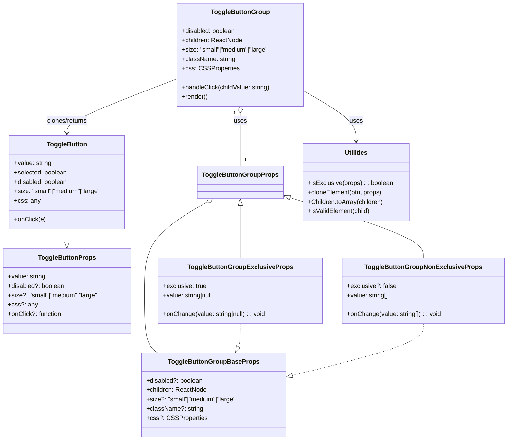

# Diagram: web/portal/src/components/molecules/ToggleButtonGroup.molecule.tsx

> Auto-generated by Obscura crawlers

## Mermaid

### SVG

<svg id="container" width="1284.65625" xmlns="http://www.w3.org/2000/svg" class="classDiagram" height="1126" viewBox="0 0 1284.65625 1126" role="graphics-document document" aria-roledescription="class"><g><defs><marker id="container_class-aggregationStart" class="marker aggregation class" refX="18" refY="7" markerWidth="190" markerHeight="240" orient="auto"><path d="M 18,7 L9,13 L1,7 L9,1 Z"></path></marker></defs><defs><marker id="container_class-aggregationEnd" class="marker aggregation class" refX="1" refY="7" markerWidth="20" markerHeight="28" orient="auto"><path d="M 18,7 L9,13 L1,7 L9,1 Z"></path></marker></defs><defs><marker id="container_class-extensionStart" class="marker extension class" refX="18" refY="7" markerWidth="190" markerHeight="240" orient="auto"><path d="M 1,7 L18,13 V 1 Z"></path></marker></defs><defs><marker id="container_class-extensionEnd" class="marker extension class" refX="1" refY="7" markerWidth="20" markerHeight="28" orient="auto"><path d="M 1,1 V 13 L18,7 Z"></path></marker></defs><defs><marker id="container_class-compositionStart" class="marker composition class" refX="18" refY="7" markerWidth="190" markerHeight="240" orient="auto"><path d="M 18,7 L9,13 L1,7 L9,1 Z"></path></marker></defs><defs><marker id="container_class-compositionEnd" class="marker composition class" refX="1" refY="7" markerWidth="20" markerHeight="28" orient="auto"><path d="M 18,7 L9,13 L1,7 L9,1 Z"></path></marker></defs><defs><marker id="container_class-dependencyStart" class="marker dependency class" refX="6" refY="7" markerWidth="190" markerHeight="240" orient="auto"><path d="M 5,7 L9,13 L1,7 L9,1 Z"></path></marker></defs><defs><marker id="container_class-dependencyEnd" class="marker dependency class" refX="13" refY="7" markerWidth="20" markerHeight="28" orient="auto"><path d="M 18,7 L9,13 L14,7 L9,1 Z"></path></marker></defs><defs><marker id="container_class-lollipopStart" class="marker lollipop class" refX="13" refY="7" markerWidth="190" markerHeight="240" orient="auto"><circle stroke="black" fill="transparent" cx="7" cy="7" r="6"></circle></marker></defs><defs><marker id="container_class-lollipopEnd" class="marker lollipop class" refX="1" refY="7" markerWidth="190" markerHeight="240" orient="auto"><circle stroke="black" fill="transparent" cx="7" cy="7" r="6"></circle></marker></defs><g class="root"><g class="clusters"></g><g class="edgePaths"><path d="M614.613,289.25L614.613,292.542C614.613,295.833,614.613,302.417,614.613,324.875C614.613,347.333,614.613,385.667,614.613,404.833L614.613,424" id="id_ToggleButtonGroup_ToggleButtonGroupProps_1" class="edge-thickness-normal edge-pattern-solid relation" style=";;;" data-edge="true" data-et="edge" data-id="id_ToggleButtonGroup_ToggleButtonGroupProps_1" data-points="W3sieCI6NjE0LjYxMzI4MTI1LCJ5IjoyNzJ9LHsieCI6NjE0LjYxMzI4MTI1LCJ5IjozMDl9LHsieCI6NjE0LjYxMzI4MTI1LCJ5Ijo0MjR9XQ==" marker-start="url(#container_class-aggregationStart)"></path><path d="M614.613,525.25L614.613,539.542C614.613,553.833,614.613,582.417,614.613,604.875C614.613,627.333,614.613,643.667,614.613,651.833L614.613,660" id="id_ToggleButtonGroupProps_ToggleButtonGroupExclusiveProps_2" class="edge-thickness-normal edge-pattern-solid relation" style=";;;" data-edge="true" data-et="edge" data-id="id_ToggleButtonGroupProps_ToggleButtonGroupExclusiveProps_2" data-points="W3sieCI6NjE0LjYxMzI4MTI1LCJ5Ijo1MDh9LHsieCI6NjE0LjYxMzI4MTI1LCJ5Ijo2MTF9LHsieCI6NjE0LjYxMzI4MTI1LCJ5Ijo2NjB9XQ==" marker-start="url(#container_class-extensionStart)"></path><path d="M735.095,504.008L791.62,521.84C848.146,539.672,961.196,575.336,1017.721,601.335C1074.246,627.333,1074.246,643.667,1074.246,651.833L1074.246,660" id="id_ToggleButtonGroupProps_ToggleButtonGroupNonExclusiveProps_3" class="edge-thickness-normal edge-pattern-solid relation" style=";;;" data-edge="true" data-et="edge" data-id="id_ToggleButtonGroupProps_ToggleButtonGroupNonExclusiveProps_3" data-points="W3sieCI6NzE4LjY0NDUzMTI1LCJ5Ijo0OTguODE4NjU2MTk2MzUyNH0seyJ4IjoxMDc0LjI0NjA5Mzc1LCJ5Ijo2MTF9LHsieCI6MTA3NC4yNDYwOTM3NSwieSI6NjYwfV0=" marker-start="url(#container_class-extensionStart)"></path><path d="M529.651,516.86L503.441,532.55C477.231,548.24,424.811,579.62,398.601,617.477C372.391,655.333,372.391,699.667,372.391,744C372.391,788.333,372.391,832.667,377.833,859C383.275,885.333,394.16,893.667,399.603,897.833L405.045,902" id="id_ToggleButtonGroupProps_ToggleButtonGroupBaseProps_4" class="edge-thickness-normal edge-pattern-solid relation" style=";;;" data-edge="true" data-et="edge" data-id="id_ToggleButtonGroupProps_ToggleButtonGroupBaseProps_4" data-points="W3sieCI6NTQ0LjQ1MjIzNTk5MTM3OTMsInkiOjUwOH0seyJ4IjozNzIuMzkwNjI1LCJ5Ijo2MTF9LHsieCI6MzcyLjM5MDYyNSwieSI6NzQ0fSx7IngiOjM3Mi4zOTA2MjUsInkiOjg3N30seyJ4Ijo0MDUuMDQ0ODkyNTA0Njk5MjUsInkiOjkwMn1d" marker-start="url(#container_class-aggregationStart)"></path><path d="M776.574,234.56L797.824,246.967C819.074,259.373,861.574,284.187,882.824,305.26C904.074,326.333,904.074,343.667,904.074,352.333L904.074,361" id="id_ToggleButtonGroup_Utilities_5" class="edge-thickness-normal edge-pattern-solid relation" style=";;;" data-edge="true" data-et="edge" data-id="id_ToggleButtonGroup_Utilities_5" data-points="W3sieCI6Nzc2LjU3NDIxODc1LCJ5IjoyMzQuNTU5OTAzOTE2MjIzNn0seyJ4Ijo5MDQuMDc0MjE4NzUsInkiOjMwOX0seyJ4Ijo5MDQuMDc0MjE4NzUsInkiOjM2N31d" marker-end="url(#container_class-dependencyEnd)"></path><path d="M452.652,201.938L405.993,219.781C359.333,237.625,266.014,273.313,219.355,296.323C172.695,319.333,172.695,329.667,172.695,334.833L172.695,340" id="id_ToggleButtonGroup_ToggleButton_6" class="edge-thickness-normal edge-pattern-solid relation" style=";;;" data-edge="true" data-et="edge" data-id="id_ToggleButtonGroup_ToggleButton_6" data-points="W3sieCI6NDUyLjY1MjM0Mzc1LCJ5IjoyMDEuOTM3NzM1ODk5MDkwNDN9LHsieCI6MTcyLjY5NTMxMjUsInkiOjMwOX0seyJ4IjoxNzIuNjk1MzEyNSwieSI6MzQ2fV0=" marker-end="url(#container_class-dependencyEnd)"></path><path d="M172.695,586L172.695,590.167C172.695,594.333,172.695,602.667,172.695,608.125C172.695,613.583,172.695,616.167,172.695,617.458L172.695,618.75" id="id_ToggleButton_ToggleButtonProps_7" class="edge-thickness-normal edge-pattern-dashed relation" style=";;;" data-edge="true" data-et="edge" data-id="id_ToggleButton_ToggleButtonProps_7" data-points="W3sieCI6MTcyLjY5NTMxMjUsInkiOjU4Nn0seyJ4IjoxNzIuNjk1MzEyNSwieSI6NjExfSx7IngiOjE3Mi42OTUzMTI1LCJ5Ijo2MzZ9XQ==" marker-end="url(#container_class-extensionEnd)"></path><path d="M614.613,828L614.613,836.167C614.613,844.333,614.613,860.667,613.784,870.444C612.954,880.222,611.295,883.443,610.465,885.054L609.636,886.665" id="id_ToggleButtonGroupExclusiveProps_ToggleButtonGroupBaseProps_8" class="edge-thickness-normal edge-pattern-dashed relation" style=";;;" data-edge="true" data-et="edge" data-id="id_ToggleButtonGroupExclusiveProps_ToggleButtonGroupBaseProps_8" data-points="W3sieCI6NjE0LjYxMzI4MTI1LCJ5Ijo4Mjh9LHsieCI6NjE0LjYxMzI4MTI1LCJ5Ijo4Nzd9LHsieCI6NjAxLjczNjk3NDI3MTYxNjUsInkiOjkwMn1d" marker-end="url(#container_class-extensionEnd)"></path><path d="M1074.246,828L1074.246,836.167C1074.246,844.333,1074.246,860.667,1019.767,882.553C965.287,904.439,856.329,931.878,801.85,945.598L747.37,959.317" id="id_ToggleButtonGroupNonExclusiveProps_ToggleButtonGroupBaseProps_9" class="edge-thickness-normal edge-pattern-dashed relation" style=";;;" data-edge="true" data-et="edge" data-id="id_ToggleButtonGroupNonExclusiveProps_ToggleButtonGroupBaseProps_9" data-points="W3sieCI6MTA3NC4yNDYwOTM3NSwieSI6ODI4fSx7IngiOjEwNzQuMjQ2MDkzNzUsInkiOjg3N30seyJ4Ijo3MzAuNjQyNTc4MTI1LCJ5Ijo5NjMuNTI5NTU3NTE1NTc4NX1d" marker-end="url(#container_class-extensionEnd)"></path></g><g class="edgeLabels"><g class="edgeLabel" transform="translate(614.61328125, 309)"><g class="label" data-id="id_ToggleButtonGroup_ToggleButtonGroupProps_1" transform="translate(-16.4921875, -12)"><foreignObject width="32.984375" height="24">

uses

</foreignObject></g></g><g class="edgeLabel"><g class="label" data-id="id_ToggleButtonGroupProps_ToggleButtonGroupExclusiveProps_2" transform="translate(0, 0)"><foreignObject width="0" height="0">

</foreignObject></g></g><g class="edgeLabel"><g class="label" data-id="id_ToggleButtonGroupProps_ToggleButtonGroupNonExclusiveProps_3" transform="translate(0, 0)"><foreignObject width="0" height="0">

</foreignObject></g></g><g class="edgeLabel"><g class="label" data-id="id_ToggleButtonGroupProps_ToggleButtonGroupBaseProps_4" transform="translate(0, 0)"><foreignObject width="0" height="0">

</foreignObject></g></g><g class="edgeLabel" transform="translate(904.07421875, 309)"><g class="label" data-id="id_ToggleButtonGroup_Utilities_5" transform="translate(-16.4921875, -12)"><foreignObject width="32.984375" height="24">

uses

</foreignObject></g></g><g class="edgeLabel" transform="translate(172.6953125, 309)"><g class="label" data-id="id_ToggleButtonGroup_ToggleButton_6" transform="translate(-53.7734375, -12)"><foreignObject width="107.546875" height="24">

clones/returns

</foreignObject></g></g><g class="edgeLabel"><g class="label" data-id="id_ToggleButton_ToggleButtonProps_7" transform="translate(0, 0)"><foreignObject width="0" height="0">

</foreignObject></g></g><g class="edgeLabel"><g class="label" data-id="id_ToggleButtonGroupExclusiveProps_ToggleButtonGroupBaseProps_8" transform="translate(0, 0)"><foreignObject width="0" height="0">

</foreignObject></g></g><g class="edgeLabel"><g class="label" data-id="id_ToggleButtonGroupNonExclusiveProps_ToggleButtonGroupBaseProps_9" transform="translate(0, 0)"><foreignObject width="0" height="0">

</foreignObject></g></g><g class="edgeTerminals" transform="translate(599.613280625, 289.49999946428574)"><g class="inner" transform="translate(0, 0)"><foreignObject style="width: 9px; height: 12px;">
1
</foreignObject></g></g><g class="edgeTerminals" transform="translate(624.613280625, 401.49999946428574)"><g class="inner" transform="translate(0, 0)"></g><foreignObject style="width: 9px; height: 12px;">
1
</foreignObject></g></g><g class="nodes"><g class="node default" id="classId-ToggleButtonGroup-0" transform="translate(614.61328125, 140)"><g class="basic label-container"><path d="M-161.9609375 -132 L161.9609375 -132 L161.9609375 132 L-161.9609375 132" stroke="none" stroke-width="0" fill="#ECECFF" style=""></path><path d="M-161.9609375 -132 C-43.98304193794317 -132, 73.99485362411366 -132, 161.9609375 -132 M-161.9609375 -132 C-51.4226371229484 -132, 59.1156632541032 -132, 161.9609375 -132 M161.9609375 -132 C161.9609375 -50.130069326091075, 161.9609375 31.73986134781785, 161.9609375 132 M161.9609375 -132 C161.9609375 -35.317647241472, 161.9609375 61.364705517055995, 161.9609375 132 M161.9609375 132 C65.7279358955343 132, -30.505065708931397 132, -161.9609375 132 M161.9609375 132 C47.97065788271023 132, -66.01962173457954 132, -161.9609375 132 M-161.9609375 132 C-161.9609375 62.04219063479779, -161.9609375 -7.915618730404418, -161.9609375 -132 M-161.9609375 132 C-161.9609375 29.3259233571316, -161.9609375 -73.3481532857368, -161.9609375 -132" stroke="#9370DB" stroke-width="1.3" fill="none" stroke-dasharray="0 0" style=""></path></g><g class="annotation-group text" transform="translate(0, -108)"></g><g class="label-group text" transform="translate(-71.109375, -108)"><g class="label" style="font-weight: bolder" transform="translate(0,-12)"><foreignObject width="142.21875" height="24">

ToggleButtonGroup

</foreignObject></g></g><g class="members-group text" transform="translate(-149.9609375, -60)"><g class="label" style="" transform="translate(0,-12)"><foreignObject width="138.015625" height="24">

+disabled: boolean

</foreignObject></g><g class="label" style="" transform="translate(0,12)"><foreignObject width="154.265625" height="24">

+children: ReactNode

</foreignObject></g><g class="label" style="" transform="translate(0,36)"><foreignObject width="228.8125" height="24">

+size: "small"|"medium"|"large"

</foreignObject></g><g class="label" style="" transform="translate(0,60)"><foreignObject width="135.359375" height="24">

+className: string

</foreignObject></g><g class="label" style="" transform="translate(0,84)"><foreignObject width="139.453125" height="24">

+css: CSSProperties

</foreignObject></g></g><g class="methods-group text" transform="translate(-149.9609375, 84)"><g class="label" style="" transform="translate(0,-12)"><foreignObject width="227.5" height="24">

+handleClick(childValue: string)

</foreignObject></g><g class="label" style="" transform="translate(0,12)"><foreignObject width="66.609375" height="24">

+render()

</foreignObject></g></g><g class="divider" style=""><path d="M-161.9609375 -84 C-96.20365323147618 -84, -30.446368962952363 -84, 161.9609375 -84 M-161.9609375 -84 C-71.13166839562768 -84, 19.69760070874463 -84, 161.9609375 -84" stroke="#9370DB" stroke-width="1.3" fill="none" stroke-dasharray="0 0" style=""></path></g><g class="divider" style=""><path d="M-161.9609375 60 C-43.228245004351095 60, 75.50444749129781 60, 161.9609375 60 M-161.9609375 60 C-79.03817741656664 60, 3.88458266686672 60, 161.9609375 60" stroke="#9370DB" stroke-width="1.3" fill="none" stroke-dasharray="0 0" style=""></path></g></g><g class="node default" id="classId-ToggleButton-1" transform="translate(172.6953125, 466)"><g class="basic label-container"><path d="M-150.8828125 -120 L150.8828125 -120 L150.8828125 120 L-150.8828125 120" stroke="none" stroke-width="0" fill="#ECECFF" style=""></path><path d="M-150.8828125 -120 C-57.04381125316971 -120, 36.795189993660586 -120, 150.8828125 -120 M-150.8828125 -120 C-49.58464133353225 -120, 51.71352983293551 -120, 150.8828125 -120 M150.8828125 -120 C150.8828125 -44.440300385584706, 150.8828125 31.119399228830588, 150.8828125 120 M150.8828125 -120 C150.8828125 -57.59504158244902, 150.8828125 4.8099168351019586, 150.8828125 120 M150.8828125 120 C89.25251578193402 120, 27.622219063868044 120, -150.8828125 120 M150.8828125 120 C76.00522527631398 120, 1.1276380526279581 120, -150.8828125 120 M-150.8828125 120 C-150.8828125 35.3402058498103, -150.8828125 -49.319588300379394, -150.8828125 -120 M-150.8828125 120 C-150.8828125 55.362490584426, -150.8828125 -9.275018831148003, -150.8828125 -120" stroke="#9370DB" stroke-width="1.3" fill="none" stroke-dasharray="0 0" style=""></path></g><g class="annotation-group text" transform="translate(0, -96)"></g><g class="label-group text" transform="translate(-48.953125, -96)"><g class="label" style="font-weight: bolder" transform="translate(0,-12)"><foreignObject width="97.90625" height="24">

ToggleButton

</foreignObject></g></g><g class="members-group text" transform="translate(-138.8828125, -48)"><g class="label" style="" transform="translate(0,-12)"><foreignObject width="96.421875" height="24">

+value: string

</foreignObject></g><g class="label" style="" transform="translate(0,12)"><foreignObject width="136.5" height="24">

+selected: boolean

</foreignObject></g><g class="label" style="" transform="translate(0,36)"><foreignObject width="138.015625" height="24">

+disabled: boolean

</foreignObject></g><g class="label" style="" transform="translate(0,60)"><foreignObject width="228.8125" height="24">

+size: "small"|"medium"|"large"

</foreignObject></g><g class="label" style="" transform="translate(0,84)"><foreignObject width="64.34375" height="24">

+css: any

</foreignObject></g></g><g class="methods-group text" transform="translate(-138.8828125, 96)"><g class="label" style="" transform="translate(0,-12)"><foreignObject width="79.640625" height="24">

+onClick(e)

</foreignObject></g></g><g class="divider" style=""><path d="M-150.8828125 -72 C-81.93016167772143 -72, -12.977510855442858 -72, 150.8828125 -72 M-150.8828125 -72 C-59.507336081723835 -72, 31.86814033655233 -72, 150.8828125 -72" stroke="#9370DB" stroke-width="1.3" fill="none" stroke-dasharray="0 0" style=""></path></g><g class="divider" style=""><path d="M-150.8828125 72 C-68.53114928383384 72, 13.820513932332318 72, 150.8828125 72 M-150.8828125 72 C-52.35811256423477 72, 46.166587371530454 72, 150.8828125 72" stroke="#9370DB" stroke-width="1.3" fill="none" stroke-dasharray="0 0" style=""></path></g></g><g class="node default" id="classId-ToggleButtonProps-2" transform="translate(172.6953125, 744)"><g class="basic label-container"><path d="M-164.6953125 -108 L164.6953125 -108 L164.6953125 108 L-164.6953125 108" stroke="none" stroke-width="0" fill="#ECECFF" style=""></path><path d="M-164.6953125 -108 C-91.71507552975724 -108, -18.734838559514486 -108, 164.6953125 -108 M-164.6953125 -108 C-92.07463140346157 -108, -19.453950306923133 -108, 164.6953125 -108 M164.6953125 -108 C164.6953125 -50.623541820818595, 164.6953125 6.7529163583628105, 164.6953125 108 M164.6953125 -108 C164.6953125 -51.679116967249854, 164.6953125 4.641766065500292, 164.6953125 108 M164.6953125 108 C47.089076137217035 108, -70.51716022556593 108, -164.6953125 108 M164.6953125 108 C97.87748244853452 108, 31.059652397069044 108, -164.6953125 108 M-164.6953125 108 C-164.6953125 30.706651273010337, -164.6953125 -46.586697453979326, -164.6953125 -108 M-164.6953125 108 C-164.6953125 53.21802966789174, -164.6953125 -1.563940664216517, -164.6953125 -108" stroke="#9370DB" stroke-width="1.3" fill="none" stroke-dasharray="0 0" style=""></path></g><g class="annotation-group text" transform="translate(0, -84)"></g><g class="label-group text" transform="translate(-69.875, -84)"><g class="label" style="font-weight: bolder" transform="translate(0,-12)"><foreignObject width="139.75" height="24">

ToggleButtonProps

</foreignObject></g></g><g class="members-group text" transform="translate(-152.6953125, -36)"><g class="label" style="" transform="translate(0,-12)"><foreignObject width="96.421875" height="24">

+value: string

</foreignObject></g><g class="label" style="" transform="translate(0,12)"><foreignObject width="145.359375" height="24">

+disabled?: boolean

</foreignObject></g><g class="label" style="" transform="translate(0,36)"><foreignObject width="235.515625" height="24">

+size?: "small"|"medium"|"large"

</foreignObject></g><g class="label" style="" transform="translate(0,60)"><foreignObject width="71.203125" height="24">

+css?: any

</foreignObject></g><g class="label" style="" transform="translate(0,84)"><foreignObject width="136.28125" height="24">

+onClick?: function

</foreignObject></g></g><g class="methods-group text" transform="translate(-152.6953125, 108)"></g><g class="divider" style=""><path d="M-164.6953125 -60 C-97.81865926365037 -60, -30.94200602730075 -60, 164.6953125 -60 M-164.6953125 -60 C-66.81955699680495 -60, 31.056198506390103 -60, 164.6953125 -60" stroke="#9370DB" stroke-width="1.3" fill="none" stroke-dasharray="0 0" style=""></path></g><g class="divider" style=""><path d="M-164.6953125 84 C-98.6457179555626 84, -32.596123411125205 84, 164.6953125 84 M-164.6953125 84 C-77.90537271310785 84, 8.884567073784297 84, 164.6953125 84" stroke="#9370DB" stroke-width="1.3" fill="none" stroke-dasharray="0 0" style=""></path></g></g><g class="node default" id="classId-ToggleButtonGroupBaseProps-3" transform="translate(546.111328125, 1010)"><g class="basic label-container"><path d="M-184.53125 -108 L184.53125 -108 L184.53125 108 L-184.53125 108" stroke="none" stroke-width="0" fill="#ECECFF" style=""></path><path d="M-184.53125 -108 C-45.08406971123057 -108, 94.36311057753886 -108, 184.53125 -108 M-184.53125 -108 C-84.95964842617929 -108, 14.61195314764143 -108, 184.53125 -108 M184.53125 -108 C184.53125 -49.36252037656394, 184.53125 9.274959246872115, 184.53125 108 M184.53125 -108 C184.53125 -59.56483705058947, 184.53125 -11.129674101178935, 184.53125 108 M184.53125 108 C58.05829521422369 108, -68.41465957155262 108, -184.53125 108 M184.53125 108 C99.11713116905884 108, 13.703012338117674 108, -184.53125 108 M-184.53125 108 C-184.53125 37.14541405753691, -184.53125 -33.70917188492618, -184.53125 -108 M-184.53125 108 C-184.53125 54.72966023293132, -184.53125 1.4593204658626462, -184.53125 -108" stroke="#9370DB" stroke-width="1.3" fill="none" stroke-dasharray="0 0" style=""></path></g><g class="annotation-group text" transform="translate(0, -84)"></g><g class="label-group text" transform="translate(-109.546875, -84)"><g class="label" style="font-weight: bolder" transform="translate(0,-12)"><foreignObject width="219.09375" height="24">

ToggleButtonGroupBaseProps

</foreignObject></g></g><g class="members-group text" transform="translate(-172.53125, -36)"><g class="label" style="" transform="translate(0,-12)"><foreignObject width="145.359375" height="24">

+disabled?: boolean

</foreignObject></g><g class="label" style="" transform="translate(0,12)"><foreignObject width="154.265625" height="24">

+children: ReactNode

</foreignObject></g><g class="label" style="" transform="translate(0,36)"><foreignObject width="235.515625" height="24">

+size?: "small"|"medium"|"large"

</foreignObject></g><g class="label" style="" transform="translate(0,60)"><foreignObject width="142.0625" height="24">

+className?: string

</foreignObject></g><g class="label" style="" transform="translate(0,84)"><foreignObject width="146.3125" height="24">

+css?: CSSProperties

</foreignObject></g></g><g class="methods-group text" transform="translate(-172.53125, 108)"></g><g class="divider" style=""><path d="M-184.53125 -60 C-89.02798910987258 -60, 6.475271780254843 -60, 184.53125 -60 M-184.53125 -60 C-59.05304524315757 -60, 66.42515951368486 -60, 184.53125 -60" stroke="#9370DB" stroke-width="1.3" fill="none" stroke-dasharray="0 0" style=""></path></g><g class="divider" style=""><path d="M-184.53125 84 C-44.280858663702276 84, 95.96953267259545 84, 184.53125 84 M-184.53125 84 C-82.01926279744596 84, 20.492724405108078 84, 184.53125 84" stroke="#9370DB" stroke-width="1.3" fill="none" stroke-dasharray="0 0" style=""></path></g></g><g class="node default" id="classId-ToggleButtonGroupExclusiveProps-4" transform="translate(614.61328125, 744)"><g class="basic label-container"><path d="M-207.22265625 -84 L207.22265625 -84 L207.22265625 84 L-207.22265625 84" stroke="none" stroke-width="0" fill="#ECECFF" style=""></path><path d="M-207.22265625 -84 C-62.84638802624892 -84, 81.52988019750217 -84, 207.22265625 -84 M-207.22265625 -84 C-55.87128523636312 -84, 95.48008577727376 -84, 207.22265625 -84 M207.22265625 -84 C207.22265625 -35.623230609841194, 207.22265625 12.753538780317612, 207.22265625 84 M207.22265625 -84 C207.22265625 -24.338191058677488, 207.22265625 35.323617882645024, 207.22265625 84 M207.22265625 84 C72.75880669688505 84, -61.70504285622991 84, -207.22265625 84 M207.22265625 84 C73.69808408354098 84, -59.82648808291805 84, -207.22265625 84 M-207.22265625 84 C-207.22265625 38.26967117129433, -207.22265625 -7.460657657411346, -207.22265625 -84 M-207.22265625 84 C-207.22265625 20.87739625220658, -207.22265625 -42.24520749558684, -207.22265625 -84" stroke="#9370DB" stroke-width="1.3" fill="none" stroke-dasharray="0 0" style=""></path></g><g class="annotation-group text" transform="translate(0, -60)"></g><g class="label-group text" transform="translate(-125.5859375, -60)"><g class="label" style="font-weight: bolder" transform="translate(0,-12)"><foreignObject width="251.171875" height="24">

ToggleButtonGroupExclusiveProps

</foreignObject></g></g><g class="members-group text" transform="translate(-195.22265625, -12)"><g class="label" style="" transform="translate(0,-12)"><foreignObject width="112.40625" height="24">

+exclusive: true

</foreignObject></g><g class="label" style="" transform="translate(0,12)"><foreignObject width="130.9375" height="24">

+value: string|null

</foreignObject></g></g><g class="methods-group text" transform="translate(-195.22265625, 60)"><g class="label" style="" transform="translate(0,-12)"><foreignObject width="264.859375" height="24">

+onChange(value: string|null) : : void

</foreignObject></g></g><g class="divider" style=""><path d="M-207.22265625 -36 C-111.4706339705389 -36, -15.718611691077797 -36, 207.22265625 -36 M-207.22265625 -36 C-59.03882267388329 -36, 89.14501090223342 -36, 207.22265625 -36" stroke="#9370DB" stroke-width="1.3" fill="none" stroke-dasharray="0 0" style=""></path></g><g class="divider" style=""><path d="M-207.22265625 36 C-120.82907521115268 36, -34.43549417230537 36, 207.22265625 36 M-207.22265625 36 C-82.37623158993796 36, 42.47019307012408 36, 207.22265625 36" stroke="#9370DB" stroke-width="1.3" fill="none" stroke-dasharray="0 0" style=""></path></g></g><g class="node default" id="classId-ToggleButtonGroupNonExclusiveProps-5" transform="translate(1074.24609375, 744)"><g class="basic label-container"><path d="M-202.41015625 -84 L202.41015625 -84 L202.41015625 84 L-202.41015625 84" stroke="none" stroke-width="0" fill="#ECECFF" style=""></path><path d="M-202.41015625 -84 C-84.57517506204749 -84, 33.259806125905016 -84, 202.41015625 -84 M-202.41015625 -84 C-117.23423951543357 -84, -32.058322780867144 -84, 202.41015625 -84 M202.41015625 -84 C202.41015625 -33.13622794076481, 202.41015625 17.727544118470377, 202.41015625 84 M202.41015625 -84 C202.41015625 -33.66069486978843, 202.41015625 16.67861026042314, 202.41015625 84 M202.41015625 84 C91.4500742191662 84, -19.510007811667606 84, -202.41015625 84 M202.41015625 84 C103.06627013776311 84, 3.7223840255262246 84, -202.41015625 84 M-202.41015625 84 C-202.41015625 20.15460023249335, -202.41015625 -43.6907995350133, -202.41015625 -84 M-202.41015625 84 C-202.41015625 49.48010505821555, -202.41015625 14.9602101164311, -202.41015625 -84" stroke="#9370DB" stroke-width="1.3" fill="none" stroke-dasharray="0 0" style=""></path></g><g class="annotation-group text" transform="translate(0, -60)"></g><g class="label-group text" transform="translate(-140.1796875, -60)"><g class="label" style="font-weight: bolder" transform="translate(0,-12)"><foreignObject width="280.359375" height="24">

ToggleButtonGroupNonExclusiveProps

</foreignObject></g></g><g class="members-group text" transform="translate(-190.41015625, -12)"><g class="label" style="" transform="translate(0,-12)"><foreignObject width="123.5625" height="24">

+exclusive?: false

</foreignObject></g><g class="label" style="" transform="translate(0,12)"><foreignObject width="106.734375" height="24">

+value: string[]

</foreignObject></g></g><g class="methods-group text" transform="translate(-190.41015625, 60)"><g class="label" style="" transform="translate(0,-12)"><foreignObject width="240.640625" height="24">

+onChange(value: string[]) : : void

</foreignObject></g></g><g class="divider" style=""><path d="M-202.41015625 -36 C-110.26380321063252 -36, -18.117450171265034 -36, 202.41015625 -36 M-202.41015625 -36 C-108.21105948322608 -36, -14.01196271645216 -36, 202.41015625 -36" stroke="#9370DB" stroke-width="1.3" fill="none" stroke-dasharray="0 0" style=""></path></g><g class="divider" style=""><path d="M-202.41015625 36 C-87.78405528434715 36, 26.842045681305706 36, 202.41015625 36 M-202.41015625 36 C-88.57416461801611 36, 25.261827013967775 36, 202.41015625 36" stroke="#9370DB" stroke-width="1.3" fill="none" stroke-dasharray="0 0" style=""></path></g></g><g class="node default" id="classId-ToggleButtonGroupProps-6" transform="translate(614.61328125, 466)"><g class="basic label-container"><path d="M-104.03125 -42 L104.03125 -42 L104.03125 42 L-104.03125 42" stroke="none" stroke-width="0" fill="#ECECFF" style=""></path><path d="M-104.03125 -42 C-52.50051739089826 -42, -0.9697847817965197 -42, 104.03125 -42 M-104.03125 -42 C-50.96324178328327 -42, 2.104766433433454 -42, 104.03125 -42 M104.03125 -42 C104.03125 -17.61212169219128, 104.03125 6.775756615617439, 104.03125 42 M104.03125 -42 C104.03125 -21.808152406098685, 104.03125 -1.6163048121973702, 104.03125 42 M104.03125 42 C41.74021245367239 42, -20.550825092655217 42, -104.03125 42 M104.03125 42 C39.41171744837179 42, -25.207815103256422 42, -104.03125 42 M-104.03125 42 C-104.03125 17.218462035313365, -104.03125 -7.5630759293732694, -104.03125 -42 M-104.03125 42 C-104.03125 24.797286383287215, -104.03125 7.59457276657443, -104.03125 -42" stroke="#9370DB" stroke-width="1.3" fill="none" stroke-dasharray="0 0" style=""></path></g><g class="annotation-group text" transform="translate(0, -18)"></g><g class="label-group text" transform="translate(-92.03125, -18)"><g class="label" style="font-weight: bolder" transform="translate(0,-12)"><foreignObject width="184.0625" height="24">

ToggleButtonGroupProps

</foreignObject></g></g><g class="members-group text" transform="translate(-92.03125, 30)"></g><g class="methods-group text" transform="translate(-92.03125, 60)"></g><g class="divider" style=""><path d="M-104.03125 6 C-37.18189661184982 6, 29.667456776300355 6, 104.03125 6 M-104.03125 6 C-30.25310756215093 6, 43.52503487569814 6, 104.03125 6" stroke="#9370DB" stroke-width="1.3" fill="none" stroke-dasharray="0 0" style=""></path></g><g class="divider" style=""><path d="M-104.03125 24 C-35.73158912482927 24, 32.56807175034146 24, 104.03125 24 M-104.03125 24 C-21.256347641055953 24, 61.518554717888094 24, 104.03125 24" stroke="#9370DB" stroke-width="1.3" fill="none" stroke-dasharray="0 0" style=""></path></g></g><g class="node default" id="classId-Utilities-7" transform="translate(904.07421875, 466)"><g class="basic label-container"><path d="M-135.4296875 -99 L135.4296875 -99 L135.4296875 99 L-135.4296875 99" stroke="none" stroke-width="0" fill="#ECECFF" style=""></path><path d="M-135.4296875 -99 C-39.10579071548179 -99, 57.21810606903642 -99, 135.4296875 -99 M-135.4296875 -99 C-71.71745902450351 -99, -8.005230549007024 -99, 135.4296875 -99 M135.4296875 -99 C135.4296875 -29.635785895018287, 135.4296875 39.728428209963425, 135.4296875 99 M135.4296875 -99 C135.4296875 -53.23307688913402, 135.4296875 -7.466153778268037, 135.4296875 99 M135.4296875 99 C28.96975193931563 99, -77.49018362136874 99, -135.4296875 99 M135.4296875 99 C69.34362554050433 99, 3.257563581008668 99, -135.4296875 99 M-135.4296875 99 C-135.4296875 24.02326341131115, -135.4296875 -50.9534731773777, -135.4296875 -99 M-135.4296875 99 C-135.4296875 22.997526855506578, -135.4296875 -53.004946288986844, -135.4296875 -99" stroke="#9370DB" stroke-width="1.3" fill="none" stroke-dasharray="0 0" style=""></path></g><g class="annotation-group text" transform="translate(0, -75)"></g><g class="label-group text" transform="translate(-28.8125, -75)"><g class="label" style="font-weight: bolder" transform="translate(0,-12)"><foreignObject width="57.625" height="24">

Utilities

</foreignObject></g></g><g class="members-group text" transform="translate(-123.4296875, -27)"></g><g class="methods-group text" transform="translate(-123.4296875, 3)"><g class="label" style="" transform="translate(0,-12)"><foreignObject width="218.046875" height="24">

+isExclusive(props) : : boolean

</foreignObject></g><g class="label" style="" transform="translate(0,12)"><foreignObject width="191.671875" height="24">

+cloneElement(btn, props)

</foreignObject></g><g class="label" style="" transform="translate(0,36)"><foreignObject width="194.0625" height="24">

+Children.toArray(children)

</foreignObject></g><g class="label" style="" transform="translate(0,60)"><foreignObject width="160.984375" height="24">

+isValidElement(child)

</foreignObject></g></g><g class="divider" style=""><path d="M-135.4296875 -51 C-49.886499039747775 -51, 35.65668942050445 -51, 135.4296875 -51 M-135.4296875 -51 C-52.406610178400925 -51, 30.61646714319815 -51, 135.4296875 -51" stroke="#9370DB" stroke-width="1.3" fill="none" stroke-dasharray="0 0" style=""></path></g><g class="divider" style=""><path d="M-135.4296875 -27 C-66.32999945432479 -27, 2.769688591350416 -27, 135.4296875 -27 M-135.4296875 -27 C-62.23875706557223 -27, 10.95217336885554 -27, 135.4296875 -27" stroke="#9370DB" stroke-width="1.3" fill="none" stroke-dasharray="0 0" style=""></path></g></g></g></g></g></svg>
