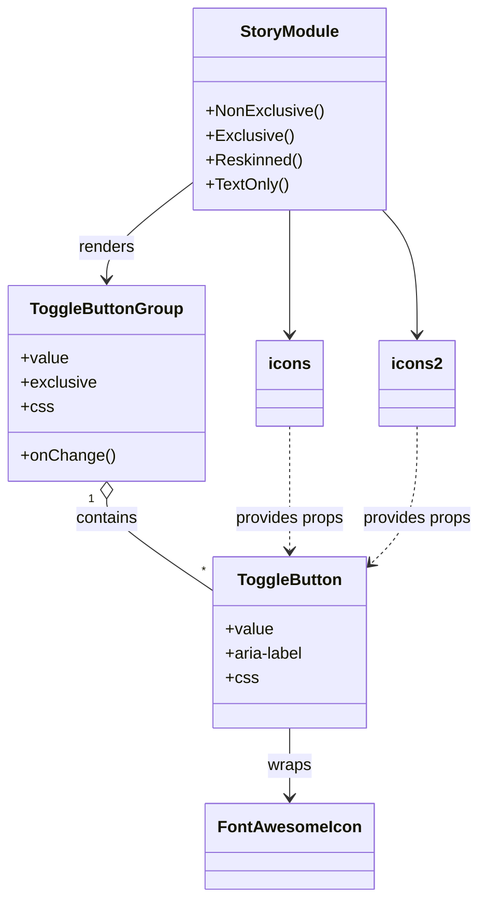

# Diagram: web/portal/src/components/molecules/ToggleButtonGroup.stories.tsx


> Auto-generated by Obscura crawlers

## Diagram 1



### SVG

<svg id="container" width="464.90625" xmlns="http://www.w3.org/2000/svg" class="classDiagram" height="880" viewBox="0 0 464.90625 880" role="graphics-document document" aria-roledescription="class"><style>#container{font-family:"trebuchet ms",verdana,arial,sans-serif;font-size:16px;fill:#333;}@keyframes edge-animation-frame{from{stroke-dashoffset:0;}}@keyframes dash{to{stroke-dashoffset:0;}}#container .edge-animation-slow{stroke-dasharray:9,5!important;stroke-dashoffset:900;animation:dash 50s linear infinite;stroke-linecap:round;}#container .edge-animation-fast{stroke-dasharray:9,5!important;stroke-dashoffset:900;animation:dash 20s linear infinite;stroke-linecap:round;}#container .error-icon{fill:#552222;}#container .error-text{fill:#552222;stroke:#552222;}#container .edge-thickness-normal{stroke-width:1px;}#container .edge-thickness-thick{stroke-width:3.5px;}#container .edge-pattern-solid{stroke-dasharray:0;}#container .edge-thickness-invisible{stroke-width:0;fill:none;}#container .edge-pattern-dashed{stroke-dasharray:3;}#container .edge-pattern-dotted{stroke-dasharray:2;}#container .marker{fill:#333333;stroke:#333333;}#container .marker.cross{stroke:#333333;}#container svg{font-family:"trebuchet ms",verdana,arial,sans-serif;font-size:16px;}#container p{margin:0;}#container g.classGroup text{fill:#9370DB;stroke:none;font-family:"trebuchet ms",verdana,arial,sans-serif;font-size:10px;}#container g.classGroup text .title{font-weight:bolder;}#container .nodeLabel,#container .edgeLabel{color:#131300;}#container .edgeLabel .label rect{fill:#ECECFF;}#container .label text{fill:#131300;}#container .labelBkg{background:#ECECFF;}#container .edgeLabel .label span{background:#ECECFF;}#container .classTitle{font-weight:bolder;}#container .node rect,#container .node circle,#container .node ellipse,#container .node polygon,#container .node path{fill:#ECECFF;stroke:#9370DB;stroke-width:1px;}#container .divider{stroke:#9370DB;stroke-width:1;}#container g.clickable{cursor:pointer;}#container g.classGroup rect{fill:#ECECFF;stroke:#9370DB;}#container g.classGroup line{stroke:#9370DB;stroke-width:1;}#container .classLabel .box{stroke:none;stroke-width:0;fill:#ECECFF;opacity:0.5;}#container .classLabel .label{fill:#9370DB;font-size:10px;}#container .relation{stroke:#333333;stroke-width:1;fill:none;}#container .dashed-line{stroke-dasharray:3;}#container .dotted-line{stroke-dasharray:1 2;}#container #compositionStart,#container .composition{fill:#333333!important;stroke:#333333!important;stroke-width:1;}#container #compositionEnd,#container .composition{fill:#333333!important;stroke:#333333!important;stroke-width:1;}#container #dependencyStart,#container .dependency{fill:#333333!important;stroke:#333333!important;stroke-width:1;}#container #dependencyStart,#container .dependency{fill:#333333!important;stroke:#333333!important;stroke-width:1;}#container #extensionStart,#container .extension{fill:transparent!important;stroke:#333333!important;stroke-width:1;}#container #extensionEnd,#container .extension{fill:transparent!important;stroke:#333333!important;stroke-width:1;}#container #aggregationStart,#container .aggregation{fill:transparent!important;stroke:#333333!important;stroke-width:1;}#container #aggregationEnd,#container .aggregation{fill:transparent!important;stroke:#333333!important;stroke-width:1;}#container #lollipopStart,#container .lollipop{fill:#ECECFF!important;stroke:#333333!important;stroke-width:1;}#container #lollipopEnd,#container .lollipop{fill:#ECECFF!important;stroke:#333333!important;stroke-width:1;}#container .edgeTerminals{font-size:11px;line-height:initial;}#container .classTitleText{text-anchor:middle;font-size:18px;fill:#333;}#container .label-icon{display:inline-block;height:1em;overflow:visible;vertical-align:-0.125em;}#container .node .label-icon path{fill:currentColor;stroke:revert;stroke-width:revert;}#container :root{--mermaid-font-family:"trebuchet ms",verdana,arial,sans-serif;}</style><g><defs><marker id="container_class-aggregationStart" class="marker aggregation class" refX="18" refY="7" markerWidth="190" markerHeight="240" orient="auto"><path d="M 18,7 L9,13 L1,7 L9,1 Z"></path></marker></defs><defs><marker id="container_class-aggregationEnd" class="marker aggregation class" refX="1" refY="7" markerWidth="20" markerHeight="28" orient="auto"><path d="M 18,7 L9,13 L1,7 L9,1 Z"></path></marker></defs><defs><marker id="container_class-extensionStart" class="marker extension class" refX="18" refY="7" markerWidth="190" markerHeight="240" orient="auto"><path d="M 1,7 L18,13 V 1 Z"></path></marker></defs><defs><marker id="container_class-extensionEnd" class="marker extension class" refX="1" refY="7" markerWidth="20" markerHeight="28" orient="auto"><path d="M 1,1 V 13 L18,7 Z"></path></marker></defs><defs><marker id="container_class-compositionStart" class="marker composition class" refX="18" refY="7" markerWidth="190" markerHeight="240" orient="auto"><path d="M 18,7 L9,13 L1,7 L9,1 Z"></path></marker></defs><defs><marker id="container_class-compositionEnd" class="marker composition class" refX="1" refY="7" markerWidth="20" markerHeight="28" orient="auto"><path d="M 18,7 L9,13 L1,7 L9,1 Z"></path></marker></defs><defs><marker id="container_class-dependencyStart" class="marker dependency class" refX="6" refY="7" markerWidth="190" markerHeight="240" orient="auto"><path d="M 5,7 L9,13 L1,7 L9,1 Z"></path></marker></defs><defs><marker id="container_class-dependencyEnd" class="marker dependency class" refX="13" refY="7" markerWidth="20" markerHeight="28" orient="auto"><path d="M 18,7 L9,13 L14,7 L9,1 Z"></path></marker></defs><defs><marker id="container_class-lollipopStart" class="marker lollipop class" refX="13" refY="7" markerWidth="190" markerHeight="240" orient="auto"><circle stroke="black" fill="transparent" cx="7" cy="7" r="6"></circle></marker></defs><defs><marker id="container_class-lollipopEnd" class="marker lollipop class" refX="1" refY="7" markerWidth="190" markerHeight="240" orient="auto"><circle stroke="black" fill="transparent" cx="7" cy="7" r="6"></circle></marker></defs><g class="root"><g class="clusters"></g><g class="edgePaths"><path d="M181.832,179.413L168.296,190.011C154.76,200.609,127.689,221.804,114.153,237.569C100.617,253.333,100.617,263.667,100.617,268.833L100.617,274" id="id_StoryModule_ToggleButtonGroup_1" class="edge-thickness-normal edge-pattern-solid relation" style=";;;" data-edge="true" data-et="edge" data-id="id_StoryModule_ToggleButtonGroup_1" data-points="W3sieCI6MTgxLjgzMjAzMTI1LCJ5IjoxNzkuNDEzMjQwOTgyMjc5Mzh9LHsieCI6MTAwLjYxNzE4NzUsInkiOjI0M30seyJ4IjoxMDAuNjE3MTg3NSwieSI6MjgwfV0=" marker-end="url(#container_class-dependencyEnd)"></path><path d="M274.32,206L274.32,212.167C274.32,218.333,274.32,230.667,274.32,251C274.32,271.333,274.32,299.667,274.32,313.833L274.32,328" id="id_StoryModule_icons_2" class="edge-thickness-normal edge-pattern-solid relation" style=";;;" data-edge="true" data-et="edge" data-id="id_StoryModule_icons_2" data-points="W3sieCI6Mjc0LjMyMDMxMjUsInkiOjIwNn0seyJ4IjoyNzQuMzIwMzEyNSwieSI6MjQzfSx7IngiOjI3NC4zMjAzMTI1LCJ5IjozMzR9XQ==" marker-end="url(#container_class-dependencyEnd)"></path><path d="M366.809,204.97L372.792,211.308C378.776,217.647,390.743,230.323,396.727,250.828C402.711,271.333,402.711,299.667,402.711,313.833L402.711,328" id="id_StoryModule_icons2_3" class="edge-thickness-normal edge-pattern-solid relation" style=";;;" data-edge="true" data-et="edge" data-id="id_StoryModule_icons2_3" data-points="W3sieCI6MzY2LjgwODU5Mzc1LCJ5IjoyMDQuOTY5ODE4NjY4NjEzODd9LHsieCI6NDAyLjcxMDkzNzUsInkiOjI0M30seyJ4Ijo0MDIuNzEwOTM3NSwieSI6MzM0fV0=" marker-end="url(#container_class-dependencyEnd)"></path><path d="M100.617,489.25L100.617,492.542C100.617,495.833,100.617,502.417,116.958,517.091C133.299,531.766,165.982,554.532,182.323,565.915L198.664,577.299" id="id_ToggleButtonGroup_ToggleButton_4" class="edge-thickness-normal edge-pattern-solid relation" style=";;;" data-edge="true" data-et="edge" data-id="id_ToggleButtonGroup_ToggleButton_4" data-points="W3sieCI6MTAwLjYxNzE4NzUsInkiOjQ3Mn0seyJ4IjoxMDAuNjE3MTg3NSwieSI6NTA5fSx7IngiOjE5OC42NjQwNjI1LCJ5Ijo1NzcuMjk4NTUxNzY3NTYzMX1d" marker-start="url(#container_class-aggregationStart)"></path><path d="M274.32,714L274.32,720.167C274.32,726.333,274.32,738.667,274.32,750C274.32,761.333,274.32,771.667,274.32,776.833L274.32,782" id="id_ToggleButton_FontAwesomeIcon_5" class="edge-thickness-normal edge-pattern-solid relation" style=";;;" data-edge="true" data-et="edge" data-id="id_ToggleButton_FontAwesomeIcon_5" data-points="W3sieCI6Mjc0LjMyMDMxMjUsInkiOjcxNH0seyJ4IjoyNzQuMzIwMzEyNSwieSI6NzUxfSx7IngiOjI3NC4zMjAzMTI1LCJ5Ijo3ODh9XQ==" marker-end="url(#container_class-dependencyEnd)"></path><path d="M274.32,418L274.32,433.167C274.32,448.333,274.32,478.667,274.32,499C274.32,519.333,274.32,529.667,274.32,534.833L274.32,540" id="id_icons_ToggleButton_6" class="edge-thickness-normal edge-pattern-dashed relation" style=";;;" data-edge="true" data-et="edge" data-id="id_icons_ToggleButton_6" data-points="W3sieCI6Mjc0LjMyMDMxMjUsInkiOjQxOH0seyJ4IjoyNzQuMzIwMzEyNSwieSI6NTA5fSx7IngiOjI3NC4zMjAzMTI1LCJ5Ijo1NDZ9XQ==" marker-end="url(#container_class-dependencyEnd)"></path><path d="M402.711,418L402.711,433.167C402.711,448.333,402.711,478.667,394.65,501.431C386.588,524.195,370.466,539.389,362.404,546.986L354.343,554.584" id="id_icons2_ToggleButton_7" class="edge-thickness-normal edge-pattern-dashed relation" style=";;;" data-edge="true" data-et="edge" data-id="id_icons2_ToggleButton_7" data-points="W3sieCI6NDAyLjcxMDkzNzUsInkiOjQxOH0seyJ4Ijo0MDIuNzEwOTM3NSwieSI6NTA5fSx7IngiOjM0OS45NzY1NjI1LCJ5Ijo1NTguNjk4Nzk1MTgwNzIyOX1d" marker-end="url(#container_class-dependencyEnd)"></path></g><g class="edgeLabels"><g class="edgeLabel" transform="translate(100.6171875, 243)"><g class="label" data-id="id_StoryModule_ToggleButtonGroup_1" transform="translate(-27.75, -12)"><foreignObject width="55.5" height="24"><div xmlns="http://www.w3.org/1999/xhtml" class="labelBkg" style="display: table-cell; white-space: nowrap; line-height: 1.5; max-width: 200px; text-align: center;"><span class="edgeLabel"><p>renders</p></span></div></foreignObject></g></g><g class="edgeLabel"><g class="label" data-id="id_StoryModule_icons_2" transform="translate(0, 0)"><foreignObject width="0" height="0"><div xmlns="http://www.w3.org/1999/xhtml" class="labelBkg" style="display: table-cell; white-space: nowrap; line-height: 1.5; max-width: 200px; text-align: center;"><span class="edgeLabel"></span></div></foreignObject></g></g><g class="edgeLabel"><g class="label" data-id="id_StoryModule_icons2_3" transform="translate(0, 0)"><foreignObject width="0" height="0"><div xmlns="http://www.w3.org/1999/xhtml" class="labelBkg" style="display: table-cell; white-space: nowrap; line-height: 1.5; max-width: 200px; text-align: center;"><span class="edgeLabel"></span></div></foreignObject></g></g><g class="edgeLabel" transform="translate(100.6171875, 509)"><g class="label" data-id="id_ToggleButtonGroup_ToggleButton_4" transform="translate(-30.890625, -12)"><foreignObject width="61.78125" height="24"><div xmlns="http://www.w3.org/1999/xhtml" class="labelBkg" style="display: table-cell; white-space: nowrap; line-height: 1.5; max-width: 200px; text-align: center;"><span class="edgeLabel"><p>contains</p></span></div></foreignObject></g></g><g class="edgeLabel" transform="translate(274.3203125, 751)"><g class="label" data-id="id_ToggleButton_FontAwesomeIcon_5" transform="translate(-21.390625, -12)"><foreignObject width="42.78125" height="24"><div xmlns="http://www.w3.org/1999/xhtml" class="labelBkg" style="display: table-cell; white-space: nowrap; line-height: 1.5; max-width: 200px; text-align: center;"><span class="edgeLabel"><p>wraps</p></span></div></foreignObject></g></g><g class="edgeLabel" transform="translate(274.3203125, 509)"><g class="label" data-id="id_icons_ToggleButton_6" transform="translate(-54.1953125, -12)"><foreignObject width="108.390625" height="24"><div xmlns="http://www.w3.org/1999/xhtml" class="labelBkg" style="display: table-cell; white-space: nowrap; line-height: 1.5; max-width: 200px; text-align: center;"><span class="edgeLabel"><p>provides props</p></span></div></foreignObject></g></g><g class="edgeLabel" transform="translate(402.7109375, 509)"><g class="label" data-id="id_icons2_ToggleButton_7" transform="translate(-54.1953125, -12)"><foreignObject width="108.390625" height="24"><div xmlns="http://www.w3.org/1999/xhtml" class="labelBkg" style="display: table-cell; white-space: nowrap; line-height: 1.5; max-width: 200px; text-align: center;"><span class="edgeLabel"><p>provides props</p></span></div></foreignObject></g></g><g class="edgeTerminals" transform="translate(85.61718875000004, 489.5000010714286)"><g class="inner" transform="translate(0, 0)"><foreignObject style="width: 9px; height: 12px;"><div xmlns="http://www.w3.org/1999/xhtml" style="display: inline-block; padding-right: 1px; white-space: nowrap;"><span class="edgeLabel">1</span></div></foreignObject></g></g><g class="edgeTerminals" transform="translate(187.87829237850048, 549.9876813306015)"><g class="inner" transform="translate(0, 0)"></g><foreignObject style="width: 9px; height: 12px;"><div xmlns="http://www.w3.org/1999/xhtml" style="display: inline-block; padding-right: 1px; white-space: nowrap;"><span class="edgeLabel">*</span></div></foreignObject></g></g><g class="nodes"><g class="node default" id="classId-ToggleButtonGroup-0" transform="translate(100.6171875, 376)"><g class="basic label-container"><path d="M-92.6171875 -96 L92.6171875 -96 L92.6171875 96 L-92.6171875 96" stroke="none" stroke-width="0" fill="#ECECFF" style=""></path><path d="M-92.6171875 -96 C-42.85038853253667 -96, 6.916410434926661 -96, 92.6171875 -96 M-92.6171875 -96 C-35.04646406706988 -96, 22.524259365860246 -96, 92.6171875 -96 M92.6171875 -96 C92.6171875 -57.36325964524258, 92.6171875 -18.726519290485157, 92.6171875 96 M92.6171875 -96 C92.6171875 -26.656223171259825, 92.6171875 42.68755365748035, 92.6171875 96 M92.6171875 96 C36.17908392876795 96, -20.259019642464096 96, -92.6171875 96 M92.6171875 96 C51.95029891339872 96, 11.283410326797437 96, -92.6171875 96 M-92.6171875 96 C-92.6171875 31.949111342040638, -92.6171875 -32.101777315918724, -92.6171875 -96 M-92.6171875 96 C-92.6171875 42.76034318213043, -92.6171875 -10.479313635739146, -92.6171875 -96" stroke="#9370DB" stroke-width="1.3" fill="none" stroke-dasharray="0 0" style=""></path></g><g class="annotation-group text" transform="translate(0, -72)"></g><g class="label-group text" transform="translate(-71.109375, -72)"><g class="label" style="font-weight: bolder" transform="translate(0,-12)"><foreignObject width="142.21875" height="24"><div xmlns="http://www.w3.org/1999/xhtml" style="display: table-cell; white-space: nowrap; line-height: 1.5; max-width: 190px; text-align: center;"><span class="nodeLabel markdown-node-label" style=""><p>ToggleButtonGroup</p></span></div></foreignObject></g></g><g class="members-group text" transform="translate(-80.6171875, -24)"><g class="label" style="" transform="translate(0,-12)"><foreignObject width="46.71875" height="24"><div xmlns="http://www.w3.org/1999/xhtml" style="display: table-cell; white-space: nowrap; line-height: 1.5; max-width: 104px; text-align: center;"><span class="nodeLabel markdown-node-label" style=""><p>+value</p></span></div></foreignObject></g><g class="label" style="" transform="translate(0,12)"><foreignObject width="74.34375" height="24"><div xmlns="http://www.w3.org/1999/xhtml" style="display: table-cell; white-space: nowrap; line-height: 1.5; max-width: 132px; text-align: center;"><span class="nodeLabel markdown-node-label" style=""><p>+exclusive</p></span></div></foreignObject></g><g class="label" style="" transform="translate(0,36)"><foreignObject width="30.421875" height="24"><div xmlns="http://www.w3.org/1999/xhtml" style="display: table-cell; white-space: nowrap; line-height: 1.5; max-width: 88px; text-align: center;"><span class="nodeLabel markdown-node-label" style=""><p>+css</p></span></div></foreignObject></g></g><g class="methods-group text" transform="translate(-80.6171875, 72)"><g class="label" style="" transform="translate(0,-12)"><foreignObject width="90.125" height="24"><div xmlns="http://www.w3.org/1999/xhtml" style="display: table-cell; white-space: nowrap; line-height: 1.5; max-width: 147px; text-align: center;"><span class="nodeLabel markdown-node-label" style=""><p>+onChange()</p></span></div></foreignObject></g></g><g class="divider" style=""><path d="M-92.6171875 -48 C-43.18152391207583 -48, 6.254139675848336 -48, 92.6171875 -48 M-92.6171875 -48 C-24.883514498372307 -48, 42.850158503255386 -48, 92.6171875 -48" stroke="#9370DB" stroke-width="1.3" fill="none" stroke-dasharray="0 0" style=""></path></g><g class="divider" style=""><path d="M-92.6171875 48 C-26.72090957779838 48, 39.17536834440324 48, 92.6171875 48 M-92.6171875 48 C-19.000276122416665 48, 54.61663525516667 48, 92.6171875 48" stroke="#9370DB" stroke-width="1.3" fill="none" stroke-dasharray="0 0" style=""></path></g></g><g class="node default" id="classId-ToggleButton-1" transform="translate(274.3203125, 630)"><g class="basic label-container"><path d="M-75.65625 -84 L75.65625 -84 L75.65625 84 L-75.65625 84" stroke="none" stroke-width="0" fill="#ECECFF" style=""></path><path d="M-75.65625 -84 C-41.75092069172962 -84, -7.845591383459237 -84, 75.65625 -84 M-75.65625 -84 C-31.221350349605473 -84, 13.213549300789055 -84, 75.65625 -84 M75.65625 -84 C75.65625 -43.50729865319723, 75.65625 -3.0145973063944638, 75.65625 84 M75.65625 -84 C75.65625 -44.75379796905466, 75.65625 -5.5075959381093185, 75.65625 84 M75.65625 84 C35.53968995837037 84, -4.576870083259266 84, -75.65625 84 M75.65625 84 C42.06682197042354 84, 8.47739394084708 84, -75.65625 84 M-75.65625 84 C-75.65625 35.35620470194941, -75.65625 -13.287590596101182, -75.65625 -84 M-75.65625 84 C-75.65625 17.915703133087916, -75.65625 -48.16859373382417, -75.65625 -84" stroke="#9370DB" stroke-width="1.3" fill="none" stroke-dasharray="0 0" style=""></path></g><g class="annotation-group text" transform="translate(0, -60)"></g><g class="label-group text" transform="translate(-48.953125, -60)"><g class="label" style="font-weight: bolder" transform="translate(0,-12)"><foreignObject width="97.90625" height="24"><div xmlns="http://www.w3.org/1999/xhtml" style="display: table-cell; white-space: nowrap; line-height: 1.5; max-width: 146px; text-align: center;"><span class="nodeLabel markdown-node-label" style=""><p>ToggleButton</p></span></div></foreignObject></g></g><g class="members-group text" transform="translate(-63.65625, -12)"><g class="label" style="" transform="translate(0,-12)"><foreignObject width="46.71875" height="24"><div xmlns="http://www.w3.org/1999/xhtml" style="display: table-cell; white-space: nowrap; line-height: 1.5; max-width: 104px; text-align: center;"><span class="nodeLabel markdown-node-label" style=""><p>+value</p></span></div></foreignObject></g><g class="label" style="" transform="translate(0,12)"><foreignObject width="78.359375" height="24"><div xmlns="http://www.w3.org/1999/xhtml" style="display: table-cell; white-space: nowrap; line-height: 1.5; max-width: 136px; text-align: center;"><span class="nodeLabel markdown-node-label" style=""><p>+aria-label</p></span></div></foreignObject></g><g class="label" style="" transform="translate(0,36)"><foreignObject width="30.421875" height="24"><div xmlns="http://www.w3.org/1999/xhtml" style="display: table-cell; white-space: nowrap; line-height: 1.5; max-width: 88px; text-align: center;"><span class="nodeLabel markdown-node-label" style=""><p>+css</p></span></div></foreignObject></g></g><g class="methods-group text" transform="translate(-63.65625, 84)"></g><g class="divider" style=""><path d="M-75.65625 -36 C-37.77194168447303 -36, 0.11236663105394484 -36, 75.65625 -36 M-75.65625 -36 C-37.75994510144404 -36, 0.13635979711192192 -36, 75.65625 -36" stroke="#9370DB" stroke-width="1.3" fill="none" stroke-dasharray="0 0" style=""></path></g><g class="divider" style=""><path d="M-75.65625 60 C-27.592556392087296 60, 20.471137215825408 60, 75.65625 60 M-75.65625 60 C-22.354963991677458 60, 30.946322016645084 60, 75.65625 60" stroke="#9370DB" stroke-width="1.3" fill="none" stroke-dasharray="0 0" style=""></path></g></g><g class="node default" id="classId-FontAwesomeIcon-2" transform="translate(274.3203125, 830)"><g class="basic label-container"><path d="M-78.140625 -42 L78.140625 -42 L78.140625 42 L-78.140625 42" stroke="none" stroke-width="0" fill="#ECECFF" style=""></path><path d="M-78.140625 -42 C-46.093549588923246 -42, -14.046474177846491 -42, 78.140625 -42 M-78.140625 -42 C-26.135566305738372 -42, 25.869492388523255 -42, 78.140625 -42 M78.140625 -42 C78.140625 -12.893968198933063, 78.140625 16.212063602133874, 78.140625 42 M78.140625 -42 C78.140625 -18.42269039949223, 78.140625 5.154619201015542, 78.140625 42 M78.140625 42 C18.653353800370084 42, -40.83391739925983 42, -78.140625 42 M78.140625 42 C15.74635825063848 42, -46.64790849872304 42, -78.140625 42 M-78.140625 42 C-78.140625 24.75427412862295, -78.140625 7.508548257245899, -78.140625 -42 M-78.140625 42 C-78.140625 14.391328309641956, -78.140625 -13.217343380716088, -78.140625 -42" stroke="#9370DB" stroke-width="1.3" fill="none" stroke-dasharray="0 0" style=""></path></g><g class="annotation-group text" transform="translate(0, -18)"></g><g class="label-group text" transform="translate(-66.140625, -18)"><g class="label" style="font-weight: bolder" transform="translate(0,-12)"><foreignObject width="132.28125" height="24"><div xmlns="http://www.w3.org/1999/xhtml" style="display: table-cell; white-space: nowrap; line-height: 1.5; max-width: 181px; text-align: center;"><span class="nodeLabel markdown-node-label" style=""><p>FontAwesomeIcon</p></span></div></foreignObject></g></g><g class="members-group text" transform="translate(-66.140625, 30)"></g><g class="methods-group text" transform="translate(-66.140625, 60)"></g><g class="divider" style=""><path d="M-78.140625 6 C-32.19344099222032 6, 13.753743015559365 6, 78.140625 6 M-78.140625 6 C-30.114447920361904 6, 17.91172915927619 6, 78.140625 6" stroke="#9370DB" stroke-width="1.3" fill="none" stroke-dasharray="0 0" style=""></path></g><g class="divider" style=""><path d="M-78.140625 24 C-26.441265011862292 24, 25.258094976275416 24, 78.140625 24 M-78.140625 24 C-35.65073913873316 24, 6.839146722533684 24, 78.140625 24" stroke="#9370DB" stroke-width="1.3" fill="none" stroke-dasharray="0 0" style=""></path></g></g><g class="node default" id="classId-StoryModule-3" transform="translate(274.3203125, 107)"><g class="basic label-container"><path d="M-92.48828125 -99 L92.48828125 -99 L92.48828125 99 L-92.48828125 99" stroke="none" stroke-width="0" fill="#ECECFF" style=""></path><path d="M-92.48828125 -99 C-22.285532602550276 -99, 47.91721604489945 -99, 92.48828125 -99 M-92.48828125 -99 C-36.62334886113912 -99, 19.241583527721758 -99, 92.48828125 -99 M92.48828125 -99 C92.48828125 -34.89359577936828, 92.48828125 29.212808441263434, 92.48828125 99 M92.48828125 -99 C92.48828125 -31.353566094471503, 92.48828125 36.29286781105699, 92.48828125 99 M92.48828125 99 C46.50194634898664 99, 0.515611447973285 99, -92.48828125 99 M92.48828125 99 C26.747636222454688 99, -38.993008805090625 99, -92.48828125 99 M-92.48828125 99 C-92.48828125 49.6054643774057, -92.48828125 0.21092875481140538, -92.48828125 -99 M-92.48828125 99 C-92.48828125 51.15198340258987, -92.48828125 3.3039668051797406, -92.48828125 -99" stroke="#9370DB" stroke-width="1.3" fill="none" stroke-dasharray="0 0" style=""></path></g><g class="annotation-group text" transform="translate(0, -75)"></g><g class="label-group text" transform="translate(-46.6328125, -75)"><g class="label" style="font-weight: bolder" transform="translate(0,-12)"><foreignObject width="93.265625" height="24"><div xmlns="http://www.w3.org/1999/xhtml" style="display: table-cell; white-space: nowrap; line-height: 1.5; max-width: 142px; text-align: center;"><span class="nodeLabel markdown-node-label" style=""><p>StoryModule</p></span></div></foreignObject></g></g><g class="members-group text" transform="translate(-80.48828125, -27)"></g><g class="methods-group text" transform="translate(-80.48828125, 3)"><g class="label" style="" transform="translate(0,-12)"><foreignObject width="114.34375" height="24"><div xmlns="http://www.w3.org/1999/xhtml" style="display: table-cell; white-space: nowrap; line-height: 1.5; max-width: 172px; text-align: center;"><span class="nodeLabel markdown-node-label" style=""><p>+NonExclusive()</p></span></div></foreignObject></g><g class="label" style="" transform="translate(0,12)"><foreignObject width="84.703125" height="24"><div xmlns="http://www.w3.org/1999/xhtml" style="display: table-cell; white-space: nowrap; line-height: 1.5; max-width: 142px; text-align: center;"><span class="nodeLabel markdown-node-label" style=""><p>+Exclusive()</p></span></div></foreignObject></g><g class="label" style="" transform="translate(0,36)"><foreignObject width="93.734375" height="24"><div xmlns="http://www.w3.org/1999/xhtml" style="display: table-cell; white-space: nowrap; line-height: 1.5; max-width: 151px; text-align: center;"><span class="nodeLabel markdown-node-label" style=""><p>+Reskinned()</p></span></div></foreignObject></g><g class="label" style="" transform="translate(0,60)"><foreignObject width="79.90625" height="24"><div xmlns="http://www.w3.org/1999/xhtml" style="display: table-cell; white-space: nowrap; line-height: 1.5; max-width: 137px; text-align: center;"><span class="nodeLabel markdown-node-label" style=""><p>+TextOnly()</p></span></div></foreignObject></g></g><g class="divider" style=""><path d="M-92.48828125 -51 C-44.395928977053565 -51, 3.6964232958928704 -51, 92.48828125 -51 M-92.48828125 -51 C-46.60495562120221 -51, -0.7216299924044165 -51, 92.48828125 -51" stroke="#9370DB" stroke-width="1.3" fill="none" stroke-dasharray="0 0" style=""></path></g><g class="divider" style=""><path d="M-92.48828125 -27 C-41.845077913181974 -27, 8.798125423636051 -27, 92.48828125 -27 M-92.48828125 -27 C-54.591100268031504 -27, -16.693919286063007 -27, 92.48828125 -27" stroke="#9370DB" stroke-width="1.3" fill="none" stroke-dasharray="0 0" style=""></path></g></g><g class="node default" id="classId-icons-4" transform="translate(274.3203125, 376)"><g class="basic label-container"><path d="M-31.0859375 -42 L31.0859375 -42 L31.0859375 42 L-31.0859375 42" stroke="none" stroke-width="0" fill="#ECECFF" style=""></path><path d="M-31.0859375 -42 C-16.097834306697553 -42, -1.1097311133951067 -42, 31.0859375 -42 M-31.0859375 -42 C-12.221319379427818 -42, 6.643298741144363 -42, 31.0859375 -42 M31.0859375 -42 C31.0859375 -21.083578875670838, 31.0859375 -0.16715775134167643, 31.0859375 42 M31.0859375 -42 C31.0859375 -21.89507014555548, 31.0859375 -1.7901402911109585, 31.0859375 42 M31.0859375 42 C13.64340382717359 42, -3.7991298456528213 42, -31.0859375 42 M31.0859375 42 C7.212609558829808 42, -16.660718382340384 42, -31.0859375 42 M-31.0859375 42 C-31.0859375 16.94275193230686, -31.0859375 -8.114496135386283, -31.0859375 -42 M-31.0859375 42 C-31.0859375 17.96961468386559, -31.0859375 -6.06077063226882, -31.0859375 -42" stroke="#9370DB" stroke-width="1.3" fill="none" stroke-dasharray="0 0" style=""></path></g><g class="annotation-group text" transform="translate(0, -18)"></g><g class="label-group text" transform="translate(-19.0859375, -18)"><g class="label" style="font-weight: bolder" transform="translate(0,-12)"><foreignObject width="38.171875" height="24"><div xmlns="http://www.w3.org/1999/xhtml" style="display: table-cell; white-space: nowrap; line-height: 1.5; max-width: 88px; text-align: center;"><span class="nodeLabel markdown-node-label" style=""><p>icons</p></span></div></foreignObject></g></g><g class="members-group text" transform="translate(-19.0859375, 30)"></g><g class="methods-group text" transform="translate(-19.0859375, 60)"></g><g class="divider" style=""><path d="M-31.0859375 6 C-13.923251410833359 6, 3.239434678333282 6, 31.0859375 6 M-31.0859375 6 C-10.350369231598371 6, 10.385199036803257 6, 31.0859375 6" stroke="#9370DB" stroke-width="1.3" fill="none" stroke-dasharray="0 0" style=""></path></g><g class="divider" style=""><path d="M-31.0859375 24 C-18.502999088045577 24, -5.9200606760911505 24, 31.0859375 24 M-31.0859375 24 C-14.192348853752087 24, 2.7012397924958265 24, 31.0859375 24" stroke="#9370DB" stroke-width="1.3" fill="none" stroke-dasharray="0 0" style=""></path></g></g><g class="node default" id="classId-icons2-5" transform="translate(402.7109375, 376)"><g class="basic label-container"><path d="M-35.140625 -42 L35.140625 -42 L35.140625 42 L-35.140625 42" stroke="none" stroke-width="0" fill="#ECECFF" style=""></path><path d="M-35.140625 -42 C-15.260258782736585 -42, 4.62010743452683 -42, 35.140625 -42 M-35.140625 -42 C-8.525634024917213 -42, 18.089356950165573 -42, 35.140625 -42 M35.140625 -42 C35.140625 -15.86842210674515, 35.140625 10.2631557865097, 35.140625 42 M35.140625 -42 C35.140625 -15.689345860558745, 35.140625 10.621308278882509, 35.140625 42 M35.140625 42 C8.00532529602211 42, -19.12997440795578 42, -35.140625 42 M35.140625 42 C8.675855620006317 42, -17.788913759987366 42, -35.140625 42 M-35.140625 42 C-35.140625 12.585993723896781, -35.140625 -16.828012552206438, -35.140625 -42 M-35.140625 42 C-35.140625 10.7427285628928, -35.140625 -20.5145428742144, -35.140625 -42" stroke="#9370DB" stroke-width="1.3" fill="none" stroke-dasharray="0 0" style=""></path></g><g class="annotation-group text" transform="translate(0, -18)"></g><g class="label-group text" transform="translate(-23.140625, -18)"><g class="label" style="font-weight: bolder" transform="translate(0,-12)"><foreignObject width="46.28125" height="24"><div xmlns="http://www.w3.org/1999/xhtml" style="display: table-cell; white-space: nowrap; line-height: 1.5; max-width: 96px; text-align: center;"><span class="nodeLabel markdown-node-label" style=""><p>icons2</p></span></div></foreignObject></g></g><g class="members-group text" transform="translate(-23.140625, 30)"></g><g class="methods-group text" transform="translate(-23.140625, 60)"></g><g class="divider" style=""><path d="M-35.140625 6 C-12.01374349339067 6, 11.11313801321866 6, 35.140625 6 M-35.140625 6 C-7.090578501952223 6, 20.959467996095555 6, 35.140625 6" stroke="#9370DB" stroke-width="1.3" fill="none" stroke-dasharray="0 0" style=""></path></g><g class="divider" style=""><path d="M-35.140625 24 C-19.43446804102721 24, -3.728311082054418 24, 35.140625 24 M-35.140625 24 C-17.530030324227777 24, 0.08056435154444586 24, 35.140625 24" stroke="#9370DB" stroke-width="1.3" fill="none" stroke-dasharray="0 0" style=""></path></g></g></g></g></g></svg>

## Diagram 2

```mermaid
flowchart LR
Storybook[Story Module: ToggleButtonGroup stories] --> NonExclusive[NonExclusive story]
Storybook --> Exclusive[Exclusive story]
Storybook --> Reskinned[Reskinned story]
Storybook --> TextOnly[TextOnly story]
NonExclusive --> TBG1[ToggleButtonGroup (non-exclusive)]
Exclusive --> TBG2[ToggleButtonGroup (exclusive)]
Reskinned --> TBG3[ToggleButtonGroup (reskinned)]
TextOnly --> TBG4[ToggleButtonGroup (text-only)]
TBG1 --> TB1[ToggleButton]
TBG2 --> TB2[ToggleButton]
TBG3 --> TB3[ToggleButton]
TBG4 --> TB4[ToggleButton]
TB1 --> FA1[FontAwesomeIcon or Text]
TB2 --> FA2[FontAwesomeIcon or Text]
TB3 --> FA3[FontAwesomeIcon or Text]
TB4 --> TextNode[Text Label]
state StateHooks {
  direction LR
  S1: useState(value)
  S2: setValue
}
Storybook --> StateHooks
StateHooks --> TBG1
StateHooks --> TBG2
StateHooks --> TBG3
StateHooks --> TBG4
```

> SVG rendering failed for this diagram.
