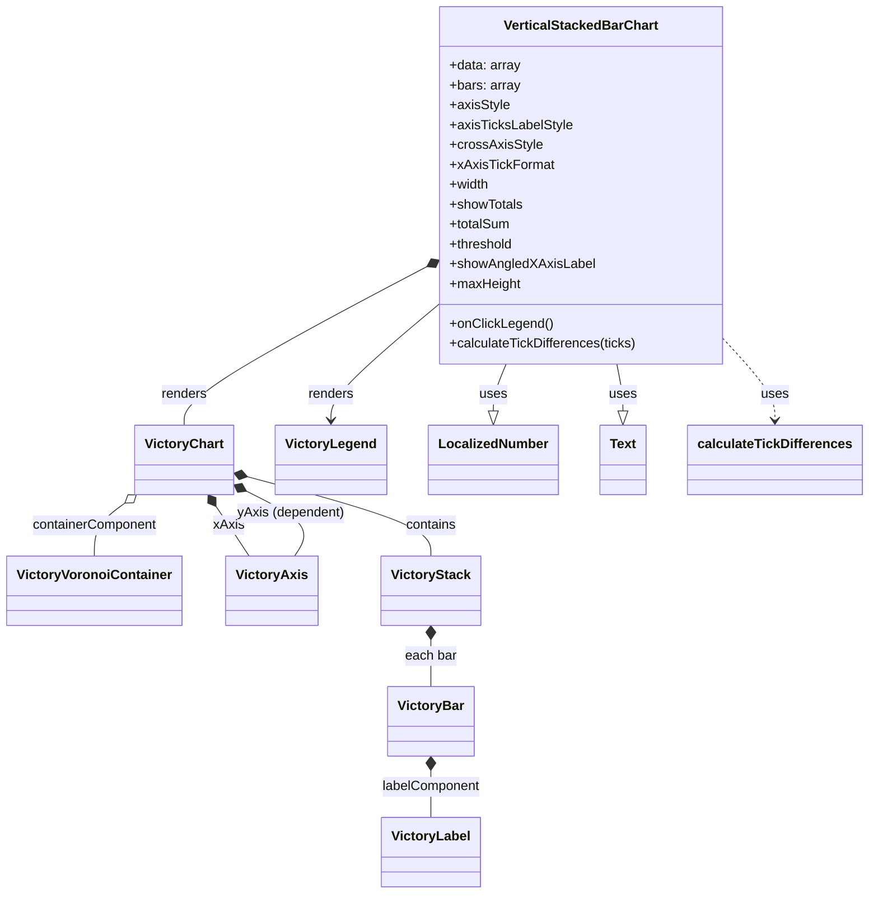

# Diagram: web/portal/src/components/molecules/VerticalStackedBarChart.molecule.js


> Auto-generated by Obscura crawlers

## Diagram 1



### SVG

<svg id="container" width="1019.33984375" xmlns="http://www.w3.org/2000/svg" class="classDiagram" height="1080" viewBox="0 0 1019.33984375 1080" role="graphics-document document" aria-roledescription="class"><style>#container{font-family:"trebuchet ms",verdana,arial,sans-serif;font-size:16px;fill:#333;}@keyframes edge-animation-frame{from{stroke-dashoffset:0;}}@keyframes dash{to{stroke-dashoffset:0;}}#container .edge-animation-slow{stroke-dasharray:9,5!important;stroke-dashoffset:900;animation:dash 50s linear infinite;stroke-linecap:round;}#container .edge-animation-fast{stroke-dasharray:9,5!important;stroke-dashoffset:900;animation:dash 20s linear infinite;stroke-linecap:round;}#container .error-icon{fill:#552222;}#container .error-text{fill:#552222;stroke:#552222;}#container .edge-thickness-normal{stroke-width:1px;}#container .edge-thickness-thick{stroke-width:3.5px;}#container .edge-pattern-solid{stroke-dasharray:0;}#container .edge-thickness-invisible{stroke-width:0;fill:none;}#container .edge-pattern-dashed{stroke-dasharray:3;}#container .edge-pattern-dotted{stroke-dasharray:2;}#container .marker{fill:#333333;stroke:#333333;}#container .marker.cross{stroke:#333333;}#container svg{font-family:"trebuchet ms",verdana,arial,sans-serif;font-size:16px;}#container p{margin:0;}#container g.classGroup text{fill:#9370DB;stroke:none;font-family:"trebuchet ms",verdana,arial,sans-serif;font-size:10px;}#container g.classGroup text .title{font-weight:bolder;}#container .nodeLabel,#container .edgeLabel{color:#131300;}#container .edgeLabel .label rect{fill:#ECECFF;}#container .label text{fill:#131300;}#container .labelBkg{background:#ECECFF;}#container .edgeLabel .label span{background:#ECECFF;}#container .classTitle{font-weight:bolder;}#container .node rect,#container .node circle,#container .node ellipse,#container .node polygon,#container .node path{fill:#ECECFF;stroke:#9370DB;stroke-width:1px;}#container .divider{stroke:#9370DB;stroke-width:1;}#container g.clickable{cursor:pointer;}#container g.classGroup rect{fill:#ECECFF;stroke:#9370DB;}#container g.classGroup line{stroke:#9370DB;stroke-width:1;}#container .classLabel .box{stroke:none;stroke-width:0;fill:#ECECFF;opacity:0.5;}#container .classLabel .label{fill:#9370DB;font-size:10px;}#container .relation{stroke:#333333;stroke-width:1;fill:none;}#container .dashed-line{stroke-dasharray:3;}#container .dotted-line{stroke-dasharray:1 2;}#container #compositionStart,#container .composition{fill:#333333!important;stroke:#333333!important;stroke-width:1;}#container #compositionEnd,#container .composition{fill:#333333!important;stroke:#333333!important;stroke-width:1;}#container #dependencyStart,#container .dependency{fill:#333333!important;stroke:#333333!important;stroke-width:1;}#container #dependencyStart,#container .dependency{fill:#333333!important;stroke:#333333!important;stroke-width:1;}#container #extensionStart,#container .extension{fill:transparent!important;stroke:#333333!important;stroke-width:1;}#container #extensionEnd,#container .extension{fill:transparent!important;stroke:#333333!important;stroke-width:1;}#container #aggregationStart,#container .aggregation{fill:transparent!important;stroke:#333333!important;stroke-width:1;}#container #aggregationEnd,#container .aggregation{fill:transparent!important;stroke:#333333!important;stroke-width:1;}#container #lollipopStart,#container .lollipop{fill:#ECECFF!important;stroke:#333333!important;stroke-width:1;}#container #lollipopEnd,#container .lollipop{fill:#ECECFF!important;stroke:#333333!important;stroke-width:1;}#container .edgeTerminals{font-size:11px;line-height:initial;}#container .classTitleText{text-anchor:middle;font-size:18px;fill:#333;}#container .label-icon{display:inline-block;height:1em;overflow:visible;vertical-align:-0.125em;}#container .node .label-icon path{fill:currentColor;stroke:revert;stroke-width:revert;}#container :root{--mermaid-font-family:"trebuchet ms",verdana,arial,sans-serif;}</style><g><defs><marker id="container_class-aggregationStart" class="marker aggregation class" refX="18" refY="7" markerWidth="190" markerHeight="240" orient="auto"><path d="M 18,7 L9,13 L1,7 L9,1 Z"></path></marker></defs><defs><marker id="container_class-aggregationEnd" class="marker aggregation class" refX="1" refY="7" markerWidth="20" markerHeight="28" orient="auto"><path d="M 18,7 L9,13 L1,7 L9,1 Z"></path></marker></defs><defs><marker id="container_class-extensionStart" class="marker extension class" refX="18" refY="7" markerWidth="190" markerHeight="240" orient="auto"><path d="M 1,7 L18,13 V 1 Z"></path></marker></defs><defs><marker id="container_class-extensionEnd" class="marker extension class" refX="1" refY="7" markerWidth="20" markerHeight="28" orient="auto"><path d="M 1,1 V 13 L18,7 Z"></path></marker></defs><defs><marker id="container_class-compositionStart" class="marker composition class" refX="18" refY="7" markerWidth="190" markerHeight="240" orient="auto"><path d="M 18,7 L9,13 L1,7 L9,1 Z"></path></marker></defs><defs><marker id="container_class-compositionEnd" class="marker composition class" refX="1" refY="7" markerWidth="20" markerHeight="28" orient="auto"><path d="M 18,7 L9,13 L1,7 L9,1 Z"></path></marker></defs><defs><marker id="container_class-dependencyStart" class="marker dependency class" refX="6" refY="7" markerWidth="190" markerHeight="240" orient="auto"><path d="M 5,7 L9,13 L1,7 L9,1 Z"></path></marker></defs><defs><marker id="container_class-dependencyEnd" class="marker dependency class" refX="13" refY="7" markerWidth="20" markerHeight="28" orient="auto"><path d="M 18,7 L9,13 L14,7 L9,1 Z"></path></marker></defs><defs><marker id="container_class-lollipopStart" class="marker lollipop class" refX="13" refY="7" markerWidth="190" markerHeight="240" orient="auto"><circle stroke="black" fill="transparent" cx="7" cy="7" r="6"></circle></marker></defs><defs><marker id="container_class-lollipopEnd" class="marker lollipop class" refX="1" refY="7" markerWidth="190" markerHeight="240" orient="auto"><circle stroke="black" fill="transparent" cx="7" cy="7" r="6"></circle></marker></defs><g class="root"><g class="clusters"></g><g class="edgePaths"><path d="M495.983,325.351L449.772,350.626C403.56,375.901,311.138,426.45,264.926,457.892C218.715,489.333,218.715,501.667,218.715,507.833L218.715,514" id="id_VerticalStackedBarChart_VictoryChart_1" class="edge-thickness-normal edge-pattern-solid relation" style=";;;" data-edge="true" data-et="edge" data-id="id_VerticalStackedBarChart_VictoryChart_1" data-points="W3sieCI6NTExLjExNzE4NzUsInkiOjMxNy4wNzM2NzkwNTQ4ODE0fSx7IngiOjIxOC43MTQ4NDM3NSwieSI6NDc3fSx7IngiOjIxOC43MTQ4NDM3NSwieSI6NTE0fV0=" marker-start="url(#container_class-compositionStart)"></path><path d="M147.298,607.63L140.988,612.191C134.678,616.753,122.058,625.877,115.748,636.605C109.438,647.333,109.438,659.667,109.438,665.833L109.438,672" id="id_VictoryChart_VictoryVoronoiContainer_2" class="edge-thickness-normal edge-pattern-solid relation" style=";;;" data-edge="true" data-et="edge" data-id="id_VictoryChart_VictoryVoronoiContainer_2" data-points="W3sieCI6MTYxLjI3NzM0Mzc1LCJ5Ijo1OTcuNTIzMzYwMTQyOTg0OH0seyJ4IjoxMDkuNDM3NSwieSI6NjM1fSx7IngiOjEwOS40Mzc1LCJ5Ijo2NzJ9XQ==" marker-start="url(#container_class-aggregationStart)"></path><path d="M254.616,612.564L256.989,616.303C259.362,620.043,264.109,627.521,270.53,637.427C276.951,647.333,285.047,659.667,289.094,665.833L293.142,672" id="id_VictoryChart_VictoryAxis_3" class="edge-thickness-normal edge-pattern-solid relation" style=";;;" data-edge="true" data-et="edge" data-id="id_VictoryChart_VictoryAxis_3" data-points="W3sieCI6MjQ1LjM3MTg4NDg4OTI0MDUsInkiOjU5OH0seyJ4IjoyNjguODU1NDY4NzUsInkiOjYzNX0seyJ4IjoyOTMuMTQyMjA3Mjc4NDgxLCJ5Ijo2NzJ9XQ==" marker-start="url(#container_class-compositionStart)"></path><path d="M291.498,593.373L305.009,600.311C318.521,607.248,345.543,621.124,355.007,634.229C364.471,647.333,356.375,659.667,352.327,665.833L348.28,672" id="id_VictoryChart_VictoryAxis_4" class="edge-thickness-normal edge-pattern-solid relation" style=";;;" data-edge="true" data-et="edge" data-id="id_VictoryChart_VictoryAxis_4" data-points="W3sieCI6Mjc2LjE1MjM0Mzc1LCJ5Ijo1ODUuNDkzMTE5MzgyNTIxN30seyJ4IjozNzIuNTY2NDA2MjUsInkiOjYzNX0seyJ4IjozNDguMjc5NjY3NzIxNTE5LCJ5Ijo2NzJ9XQ==" marker-start="url(#container_class-compositionStart)"></path><path d="M292.804,576.033L329.151,585.861C365.497,595.689,438.19,615.344,474.536,631.339C510.883,647.333,510.883,659.667,510.883,665.833L510.883,672" id="id_VictoryChart_VictoryStack_5" class="edge-thickness-normal edge-pattern-solid relation" style=";;;" data-edge="true" data-et="edge" data-id="id_VictoryChart_VictoryStack_5" data-points="W3sieCI6Mjc2LjE1MjM0Mzc1LCJ5Ijo1NzEuNTMwNjYzODE0NDI2MX0seyJ4Ijo1MTAuODgyODEyNSwieSI6NjM1fSx7IngiOjUxMC44ODI4MTI1LCJ5Ijo2NzJ9XQ==" marker-start="url(#container_class-compositionStart)"></path><path d="M510.883,773.25L510.883,776.542C510.883,779.833,510.883,786.417,510.883,795.875C510.883,805.333,510.883,817.667,510.883,823.833L510.883,830" id="id_VictoryStack_VictoryBar_6" class="edge-thickness-normal edge-pattern-solid relation" style=";;;" data-edge="true" data-et="edge" data-id="id_VictoryStack_VictoryBar_6" data-points="W3sieCI6NTEwLjg4MjgxMjUsInkiOjc1Nn0seyJ4Ijo1MTAuODgyODEyNSwieSI6NzkzfSx7IngiOjUxMC44ODI4MTI1LCJ5Ijo4MzB9XQ==" marker-start="url(#container_class-compositionStart)"></path><path d="M510.883,931.25L510.883,934.542C510.883,937.833,510.883,944.417,510.883,953.875C510.883,963.333,510.883,975.667,510.883,981.833L510.883,988" id="id_VictoryBar_VictoryLabel_7" class="edge-thickness-normal edge-pattern-solid relation" style=";;;" data-edge="true" data-et="edge" data-id="id_VictoryBar_VictoryLabel_7" data-points="W3sieCI6NTEwLjg4MjgxMjUsInkiOjkxNH0seyJ4Ijo1MTAuODgyODEyNSwieSI6OTUxfSx7IngiOjUxMC44ODI4MTI1LCJ5Ijo5ODh9XQ==" marker-start="url(#container_class-compositionStart)"></path><path d="M724.414,440L725.645,446.167C726.876,452.333,729.338,464.667,730.57,474.125C731.801,483.583,731.801,490.167,731.801,493.458L731.801,496.75" id="id_VerticalStackedBarChart_Text_8" class="edge-thickness-normal edge-pattern-solid relation" style=";;;" data-edge="true" data-et="edge" data-id="id_VerticalStackedBarChart_Text_8" data-points="W3sieCI6NzI0LjQxMzY5MTk0NjY0MDMsInkiOjQ0MH0seyJ4Ijo3MzEuODAwNzgxMjUsInkiOjQ3N30seyJ4Ijo3MzEuODAwNzgxMjUsInkiOjUxNH1d" marker-end="url(#container_class-extensionEnd)"></path><path d="M594.209,440L591.723,446.167C589.237,452.333,584.265,464.667,581.779,474.125C579.293,483.583,579.293,490.167,579.293,493.458L579.293,496.75" id="id_VerticalStackedBarChart_LocalizedNumber_9" class="edge-thickness-normal edge-pattern-solid relation" style=";;;" data-edge="true" data-et="edge" data-id="id_VerticalStackedBarChart_LocalizedNumber_9" data-points="W3sieCI6NTk0LjIwOTM5MzUyNzY2OCwieSI6NDQwfSx7IngiOjU3OS4yOTI5Njg3NSwieSI6NDc3fSx7IngiOjU3OS4yOTI5Njg3NSwieSI6NTE0fV0=" marker-end="url(#container_class-extensionEnd)"></path><path d="M511.117,371.885L490.958,389.404C470.798,406.923,430.479,441.962,410.32,464.647C390.16,487.333,390.16,497.667,390.16,502.833L390.16,508" id="id_VerticalStackedBarChart_VictoryLegend_10" class="edge-thickness-normal edge-pattern-solid relation" style=";;;" data-edge="true" data-et="edge" data-id="id_VerticalStackedBarChart_VictoryLegend_10" data-points="W3sieCI6NTExLjExNzE4NzUsInkiOjM3MS44ODQ2MDg2NzU4MTc1fSx7IngiOjM5MC4xNjAxNTYyNSwieSI6NDc3fSx7IngiOjM5MC4xNjAxNTYyNSwieSI6NTE0fV0=" marker-end="url(#container_class-dependencyEnd)"></path><path d="M851.461,412.029L861.261,422.857C871.061,433.686,890.661,455.343,900.462,471.338C910.262,487.333,910.262,497.667,910.262,502.833L910.262,508" id="id_VerticalStackedBarChart_calculateTickDifferences_11" class="edge-thickness-normal edge-pattern-dashed relation" style=";;;" data-edge="true" data-et="edge" data-id="id_VerticalStackedBarChart_calculateTickDifferences_11" data-points="W3sieCI6ODUxLjQ2MDkzNzUsInkiOjQxMi4wMjg5MzM1ODU4MTk4fSx7IngiOjkxMC4yNjE3MTg3NSwieSI6NDc3fSx7IngiOjkxMC4yNjE3MTg3NSwieSI6NTE0fV0=" marker-end="url(#container_class-dependencyEnd)"></path></g><g class="edgeLabels"><g class="edgeLabel" transform="translate(218.71484375, 477)"><g class="label" data-id="id_VerticalStackedBarChart_VictoryChart_1" transform="translate(-27.75, -12)"><foreignObject width="55.5" height="24"><div xmlns="http://www.w3.org/1999/xhtml" class="labelBkg" style="display: table-cell; white-space: nowrap; line-height: 1.5; max-width: 200px; text-align: center;"><span class="edgeLabel"><p>renders</p></span></div></foreignObject></g></g><g class="edgeLabel" transform="translate(109.4375, 635)"><g class="label" data-id="id_VictoryChart_VictoryVoronoiContainer_2" transform="translate(-76.5, -12)"><foreignObject width="153" height="24"><div xmlns="http://www.w3.org/1999/xhtml" class="labelBkg" style="display: table-cell; white-space: nowrap; line-height: 1.5; max-width: 200px; text-align: center;"><span class="edgeLabel"><p>containerComponent</p></span></div></foreignObject></g></g><g class="edgeLabel" transform="translate(268.97498, 635.18207)"><g class="label" data-id="id_VictoryChart_VictoryAxis_3" transform="translate(-18.34375, -12)"><foreignObject width="36.6875" height="24"><div xmlns="http://www.w3.org/1999/xhtml" class="labelBkg" style="display: table-cell; white-space: nowrap; line-height: 1.5; max-width: 200px; text-align: center;"><span class="edgeLabel"><p>xAxis</p></span></div></foreignObject></g></g><g class="edgeLabel" transform="translate(344.04523, 620.35489)"><g class="label" data-id="id_VictoryChart_VictoryAxis_4" transform="translate(-65.3671875, -12)"><foreignObject width="130.734375" height="24"><div xmlns="http://www.w3.org/1999/xhtml" class="labelBkg" style="display: table-cell; white-space: nowrap; line-height: 1.5; max-width: 200px; text-align: center;"><span class="edgeLabel"><p>yAxis (dependent)</p></span></div></foreignObject></g></g><g class="edgeLabel" transform="translate(510.8828125, 635)"><g class="label" data-id="id_VictoryChart_VictoryStack_5" transform="translate(-30.890625, -12)"><foreignObject width="61.78125" height="24"><div xmlns="http://www.w3.org/1999/xhtml" class="labelBkg" style="display: table-cell; white-space: nowrap; line-height: 1.5; max-width: 200px; text-align: center;"><span class="edgeLabel"><p>contains</p></span></div></foreignObject></g></g><g class="edgeLabel" transform="translate(510.8828125, 793)"><g class="label" data-id="id_VictoryStack_VictoryBar_6" transform="translate(-31.3828125, -12)"><foreignObject width="62.765625" height="24"><div xmlns="http://www.w3.org/1999/xhtml" class="labelBkg" style="display: table-cell; white-space: nowrap; line-height: 1.5; max-width: 200px; text-align: center;"><span class="edgeLabel"><p>each bar</p></span></div></foreignObject></g></g><g class="edgeLabel" transform="translate(510.8828125, 951)"><g class="label" data-id="id_VictoryBar_VictoryLabel_7" transform="translate(-60.015625, -12)"><foreignObject width="120.03125" height="24"><div xmlns="http://www.w3.org/1999/xhtml" class="labelBkg" style="display: table-cell; white-space: nowrap; line-height: 1.5; max-width: 200px; text-align: center;"><span class="edgeLabel"><p>labelComponent</p></span></div></foreignObject></g></g><g class="edgeLabel" transform="translate(731.80078125, 477)"><g class="label" data-id="id_VerticalStackedBarChart_Text_8" transform="translate(-16.4921875, -12)"><foreignObject width="32.984375" height="24"><div xmlns="http://www.w3.org/1999/xhtml" class="labelBkg" style="display: table-cell; white-space: nowrap; line-height: 1.5; max-width: 200px; text-align: center;"><span class="edgeLabel"><p>uses</p></span></div></foreignObject></g></g><g class="edgeLabel" transform="translate(579.29296875, 477)"><g class="label" data-id="id_VerticalStackedBarChart_LocalizedNumber_9" transform="translate(-16.4921875, -12)"><foreignObject width="32.984375" height="24"><div xmlns="http://www.w3.org/1999/xhtml" class="labelBkg" style="display: table-cell; white-space: nowrap; line-height: 1.5; max-width: 200px; text-align: center;"><span class="edgeLabel"><p>uses</p></span></div></foreignObject></g></g><g class="edgeLabel" transform="translate(390.16015625, 477)"><g class="label" data-id="id_VerticalStackedBarChart_VictoryLegend_10" transform="translate(-27.75, -12)"><foreignObject width="55.5" height="24"><div xmlns="http://www.w3.org/1999/xhtml" class="labelBkg" style="display: table-cell; white-space: nowrap; line-height: 1.5; max-width: 200px; text-align: center;"><span class="edgeLabel"><p>renders</p></span></div></foreignObject></g></g><g class="edgeLabel" transform="translate(910.26171875, 477)"><g class="label" data-id="id_VerticalStackedBarChart_calculateTickDifferences_11" transform="translate(-16.4921875, -12)"><foreignObject width="32.984375" height="24"><div xmlns="http://www.w3.org/1999/xhtml" class="labelBkg" style="display: table-cell; white-space: nowrap; line-height: 1.5; max-width: 200px; text-align: center;"><span class="edgeLabel"><p>uses</p></span></div></foreignObject></g></g></g><g class="nodes"><g class="node default" id="classId-VerticalStackedBarChart-0" transform="translate(681.2890625, 224)"><g class="basic label-container"><path d="M-170.171875 -216 L170.171875 -216 L170.171875 216 L-170.171875 216" stroke="none" stroke-width="0" fill="#ECECFF" style=""></path><path d="M-170.171875 -216 C-87.07528292947384 -216, -3.9786908589476866 -216, 170.171875 -216 M-170.171875 -216 C-93.70534020178941 -216, -17.238805403578823 -216, 170.171875 -216 M170.171875 -216 C170.171875 -46.06358651545358, 170.171875 123.87282696909284, 170.171875 216 M170.171875 -216 C170.171875 -88.08140827913374, 170.171875 39.83718344173252, 170.171875 216 M170.171875 216 C56.87792346716908 216, -56.416028065661834 216, -170.171875 216 M170.171875 216 C38.36139495663295 216, -93.4490850867341 216, -170.171875 216 M-170.171875 216 C-170.171875 70.48398185067776, -170.171875 -75.03203629864447, -170.171875 -216 M-170.171875 216 C-170.171875 60.85865269071536, -170.171875 -94.28269461856928, -170.171875 -216" stroke="#9370DB" stroke-width="1.3" fill="none" stroke-dasharray="0 0" style=""></path></g><g class="annotation-group text" transform="translate(0, -192)"></g><g class="label-group text" transform="translate(-89.421875, -192)"><g class="label" style="font-weight: bolder" transform="translate(0,-12)"><foreignObject width="178.84375" height="24"><div xmlns="http://www.w3.org/1999/xhtml" style="display: table-cell; white-space: nowrap; line-height: 1.5; max-width: 225px; text-align: center;"><span class="nodeLabel markdown-node-label" style=""><p>VerticalStackedBarChart</p></span></div></foreignObject></g></g><g class="members-group text" transform="translate(-158.171875, -144)"><g class="label" style="" transform="translate(0,-12)"><foreignObject width="85.546875" height="24"><div xmlns="http://www.w3.org/1999/xhtml" style="display: table-cell; white-space: nowrap; line-height: 1.5; max-width: 143px; text-align: center;"><span class="nodeLabel markdown-node-label" style=""><p>+data: array</p></span></div></foreignObject></g><g class="label" style="" transform="translate(0,12)"><foreignObject width="84.359375" height="24"><div xmlns="http://www.w3.org/1999/xhtml" style="display: table-cell; white-space: nowrap; line-height: 1.5; max-width: 142px; text-align: center;"><span class="nodeLabel markdown-node-label" style=""><p>+bars: array</p></span></div></foreignObject></g><g class="label" style="" transform="translate(0,36)"><foreignObject width="71.8125" height="24"><div xmlns="http://www.w3.org/1999/xhtml" style="display: table-cell; white-space: nowrap; line-height: 1.5; max-width: 129px; text-align: center;"><span class="nodeLabel markdown-node-label" style=""><p>+axisStyle</p></span></div></foreignObject></g><g class="label" style="" transform="translate(0,60)"><foreignObject width="147.25" height="24"><div xmlns="http://www.w3.org/1999/xhtml" style="display: table-cell; white-space: nowrap; line-height: 1.5; max-width: 205px; text-align: center;"><span class="nodeLabel markdown-node-label" style=""><p>+axisTicksLabelStyle</p></span></div></foreignObject></g><g class="label" style="" transform="translate(0,84)"><foreignObject width="109.984375" height="24"><div xmlns="http://www.w3.org/1999/xhtml" style="display: table-cell; white-space: nowrap; line-height: 1.5; max-width: 167px; text-align: center;"><span class="nodeLabel markdown-node-label" style=""><p>+crossAxisStyle</p></span></div></foreignObject></g><g class="label" style="" transform="translate(0,108)"><foreignObject width="123.734375" height="24"><div xmlns="http://www.w3.org/1999/xhtml" style="display: table-cell; white-space: nowrap; line-height: 1.5; max-width: 181px; text-align: center;"><span class="nodeLabel markdown-node-label" style=""><p>+xAxisTickFormat</p></span></div></foreignObject></g><g class="label" style="" transform="translate(0,132)"><foreignObject width="48.703125" height="24"><div xmlns="http://www.w3.org/1999/xhtml" style="display: table-cell; white-space: nowrap; line-height: 1.5; max-width: 106px; text-align: center;"><span class="nodeLabel markdown-node-label" style=""><p>+width</p></span></div></foreignObject></g><g class="label" style="" transform="translate(0,156)"><foreignObject width="88.765625" height="24"><div xmlns="http://www.w3.org/1999/xhtml" style="display: table-cell; white-space: nowrap; line-height: 1.5; max-width: 146px; text-align: center;"><span class="nodeLabel markdown-node-label" style=""><p>+showTotals</p></span></div></foreignObject></g><g class="label" style="" transform="translate(0,180)"><foreignObject width="73.4375" height="24"><div xmlns="http://www.w3.org/1999/xhtml" style="display: table-cell; white-space: nowrap; line-height: 1.5; max-width: 131px; text-align: center;"><span class="nodeLabel markdown-node-label" style=""><p>+totalSum</p></span></div></foreignObject></g><g class="label" style="" transform="translate(0,204)"><foreignObject width="77.84375" height="24"><div xmlns="http://www.w3.org/1999/xhtml" style="display: table-cell; white-space: nowrap; line-height: 1.5; max-width: 135px; text-align: center;"><span class="nodeLabel markdown-node-label" style=""><p>+threshold</p></span></div></foreignObject></g><g class="label" style="" transform="translate(0,228)"><foreignObject width="172.390625" height="24"><div xmlns="http://www.w3.org/1999/xhtml" style="display: table-cell; white-space: nowrap; line-height: 1.5; max-width: 230px; text-align: center;"><span class="nodeLabel markdown-node-label" style=""><p>+showAngledXAxisLabel</p></span></div></foreignObject></g><g class="label" style="" transform="translate(0,252)"><foreignObject width="85.75" height="24"><div xmlns="http://www.w3.org/1999/xhtml" style="display: table-cell; white-space: nowrap; line-height: 1.5; max-width: 143px; text-align: center;"><span class="nodeLabel markdown-node-label" style=""><p>+maxHeight</p></span></div></foreignObject></g></g><g class="methods-group text" transform="translate(-158.171875, 168)"><g class="label" style="" transform="translate(0,-12)"><foreignObject width="122.9375" height="24"><div xmlns="http://www.w3.org/1999/xhtml" style="display: table-cell; white-space: nowrap; line-height: 1.5; max-width: 180px; text-align: center;"><span class="nodeLabel markdown-node-label" style=""><p>+onClickLegend()</p></span></div></foreignObject></g><g class="label" style="" transform="translate(0,12)"><foreignObject width="226.921875" height="24"><div xmlns="http://www.w3.org/1999/xhtml" style="display: table-cell; white-space: nowrap; line-height: 1.5; max-width: 284px; text-align: center;"><span class="nodeLabel markdown-node-label" style=""><p>+calculateTickDifferences(ticks)</p></span></div></foreignObject></g></g><g class="divider" style=""><path d="M-170.171875 -168 C-55.943385175282685 -168, 58.28510464943463 -168, 170.171875 -168 M-170.171875 -168 C-94.56905774495635 -168, -18.966240489912707 -168, 170.171875 -168" stroke="#9370DB" stroke-width="1.3" fill="none" stroke-dasharray="0 0" style=""></path></g><g class="divider" style=""><path d="M-170.171875 144 C-59.05911602703388 144, 52.05364294593224 144, 170.171875 144 M-170.171875 144 C-86.24852038292406 144, -2.325165765848112 144, 170.171875 144" stroke="#9370DB" stroke-width="1.3" fill="none" stroke-dasharray="0 0" style=""></path></g></g><g class="node default" id="classId-VictoryChart-1" transform="translate(218.71484375, 556)"><g class="basic label-container"><path d="M-57.4375 -42 L57.4375 -42 L57.4375 42 L-57.4375 42" stroke="none" stroke-width="0" fill="#ECECFF" style=""></path><path d="M-57.4375 -42 C-20.091378408652908 -42, 17.254743182694185 -42, 57.4375 -42 M-57.4375 -42 C-17.237249363571486 -42, 22.963001272857028 -42, 57.4375 -42 M57.4375 -42 C57.4375 -16.218823457778605, 57.4375 9.56235308444279, 57.4375 42 M57.4375 -42 C57.4375 -9.780579681037345, 57.4375 22.43884063792531, 57.4375 42 M57.4375 42 C16.00494875581029 42, -25.42760248837942 42, -57.4375 42 M57.4375 42 C32.90658607284122 42, 8.37567214568245 42, -57.4375 42 M-57.4375 42 C-57.4375 13.636645621228602, -57.4375 -14.726708757542795, -57.4375 -42 M-57.4375 42 C-57.4375 9.961476114879417, -57.4375 -22.077047770241165, -57.4375 -42" stroke="#9370DB" stroke-width="1.3" fill="none" stroke-dasharray="0 0" style=""></path></g><g class="annotation-group text" transform="translate(0, -18)"></g><g class="label-group text" transform="translate(-45.4375, -18)"><g class="label" style="font-weight: bolder" transform="translate(0,-12)"><foreignObject width="90.875" height="24"><div xmlns="http://www.w3.org/1999/xhtml" style="display: table-cell; white-space: nowrap; line-height: 1.5; max-width: 139px; text-align: center;"><span class="nodeLabel markdown-node-label" style=""><p>VictoryChart</p></span></div></foreignObject></g></g><g class="members-group text" transform="translate(-45.4375, 30)"></g><g class="methods-group text" transform="translate(-45.4375, 60)"></g><g class="divider" style=""><path d="M-57.4375 6 C-28.215825357018023 6, 1.0058492859639543 6, 57.4375 6 M-57.4375 6 C-27.349018841395395 6, 2.7394623172092096 6, 57.4375 6" stroke="#9370DB" stroke-width="1.3" fill="none" stroke-dasharray="0 0" style=""></path></g><g class="divider" style=""><path d="M-57.4375 24 C-32.379029144110895 24, -7.32055828822179 24, 57.4375 24 M-57.4375 24 C-12.449622615474787 24, 32.538254769050425 24, 57.4375 24" stroke="#9370DB" stroke-width="1.3" fill="none" stroke-dasharray="0 0" style=""></path></g></g><g class="node default" id="classId-VictoryVoronoiContainer-2" transform="translate(109.4375, 714)"><g class="basic label-container"><path d="M-101.4375 -42 L101.4375 -42 L101.4375 42 L-101.4375 42" stroke="none" stroke-width="0" fill="#ECECFF" style=""></path><path d="M-101.4375 -42 C-35.40250667696263 -42, 30.63248664607474 -42, 101.4375 -42 M-101.4375 -42 C-59.350152348452575 -42, -17.26280469690515 -42, 101.4375 -42 M101.4375 -42 C101.4375 -15.99625507034908, 101.4375 10.007489859301842, 101.4375 42 M101.4375 -42 C101.4375 -10.021522080093693, 101.4375 21.956955839812615, 101.4375 42 M101.4375 42 C28.24012483614652 42, -44.95725032770696 42, -101.4375 42 M101.4375 42 C59.88181511065535 42, 18.326130221310706 42, -101.4375 42 M-101.4375 42 C-101.4375 21.80796867982382, -101.4375 1.6159373596476385, -101.4375 -42 M-101.4375 42 C-101.4375 23.92546755582704, -101.4375 5.850935111654081, -101.4375 -42" stroke="#9370DB" stroke-width="1.3" fill="none" stroke-dasharray="0 0" style=""></path></g><g class="annotation-group text" transform="translate(0, -18)"></g><g class="label-group text" transform="translate(-89.4375, -18)"><g class="label" style="font-weight: bolder" transform="translate(0,-12)"><foreignObject width="178.875" height="24"><div xmlns="http://www.w3.org/1999/xhtml" style="display: table-cell; white-space: nowrap; line-height: 1.5; max-width: 227px; text-align: center;"><span class="nodeLabel markdown-node-label" style=""><p>VictoryVoronoiContainer</p></span></div></foreignObject></g></g><g class="members-group text" transform="translate(-89.4375, 30)"></g><g class="methods-group text" transform="translate(-89.4375, 60)"></g><g class="divider" style=""><path d="M-101.4375 6 C-48.17179129955988 6, 5.093917400880244 6, 101.4375 6 M-101.4375 6 C-25.26951074086149 6, 50.89847851827702 6, 101.4375 6" stroke="#9370DB" stroke-width="1.3" fill="none" stroke-dasharray="0 0" style=""></path></g><g class="divider" style=""><path d="M-101.4375 24 C-31.751855674115177 24, 37.933788651769646 24, 101.4375 24 M-101.4375 24 C-56.685697853668636 24, -11.933895707337271 24, 101.4375 24" stroke="#9370DB" stroke-width="1.3" fill="none" stroke-dasharray="0 0" style=""></path></g></g><g class="node default" id="classId-VictoryAxis-3" transform="translate(320.7109375, 714)"><g class="basic label-container"><path d="M-52.5546875 -42 L52.5546875 -42 L52.5546875 42 L-52.5546875 42" stroke="none" stroke-width="0" fill="#ECECFF" style=""></path><path d="M-52.5546875 -42 C-31.276530990852763 -42, -9.998374481705525 -42, 52.5546875 -42 M-52.5546875 -42 C-10.597040216904198 -42, 31.360607066191605 -42, 52.5546875 -42 M52.5546875 -42 C52.5546875 -24.85343104535495, 52.5546875 -7.7068620907098975, 52.5546875 42 M52.5546875 -42 C52.5546875 -16.399428222059523, 52.5546875 9.201143555880954, 52.5546875 42 M52.5546875 42 C12.660687606982378 42, -27.233312286035243 42, -52.5546875 42 M52.5546875 42 C18.235446419873796 42, -16.08379466025241 42, -52.5546875 42 M-52.5546875 42 C-52.5546875 22.254253606184353, -52.5546875 2.5085072123687056, -52.5546875 -42 M-52.5546875 42 C-52.5546875 9.421921385265577, -52.5546875 -23.156157229468846, -52.5546875 -42" stroke="#9370DB" stroke-width="1.3" fill="none" stroke-dasharray="0 0" style=""></path></g><g class="annotation-group text" transform="translate(0, -18)"></g><g class="label-group text" transform="translate(-40.5546875, -18)"><g class="label" style="font-weight: bolder" transform="translate(0,-12)"><foreignObject width="81.109375" height="24"><div xmlns="http://www.w3.org/1999/xhtml" style="display: table-cell; white-space: nowrap; line-height: 1.5; max-width: 129px; text-align: center;"><span class="nodeLabel markdown-node-label" style=""><p>VictoryAxis</p></span></div></foreignObject></g></g><g class="members-group text" transform="translate(-40.5546875, 30)"></g><g class="methods-group text" transform="translate(-40.5546875, 60)"></g><g class="divider" style=""><path d="M-52.5546875 6 C-11.183210868837698 6, 30.188265762324605 6, 52.5546875 6 M-52.5546875 6 C-26.069420179214372 6, 0.41584714157125546 6, 52.5546875 6" stroke="#9370DB" stroke-width="1.3" fill="none" stroke-dasharray="0 0" style=""></path></g><g class="divider" style=""><path d="M-52.5546875 24 C-13.738520949823126 24, 25.077645600353748 24, 52.5546875 24 M-52.5546875 24 C-21.466673276979222 24, 9.621340946041556 24, 52.5546875 24" stroke="#9370DB" stroke-width="1.3" fill="none" stroke-dasharray="0 0" style=""></path></g></g><g class="node default" id="classId-VictoryStack-4" transform="translate(510.8828125, 714)"><g class="basic label-container"><path d="M-57.8203125 -42 L57.8203125 -42 L57.8203125 42 L-57.8203125 42" stroke="none" stroke-width="0" fill="#ECECFF" style=""></path><path d="M-57.8203125 -42 C-18.285353570317454 -42, 21.24960535936509 -42, 57.8203125 -42 M-57.8203125 -42 C-17.897950783071934 -42, 22.02441093385613 -42, 57.8203125 -42 M57.8203125 -42 C57.8203125 -11.949269987379392, 57.8203125 18.101460025241217, 57.8203125 42 M57.8203125 -42 C57.8203125 -13.34973507712979, 57.8203125 15.30052984574042, 57.8203125 42 M57.8203125 42 C16.069407260621126 42, -25.681497978757747 42, -57.8203125 42 M57.8203125 42 C26.409760076740888 42, -5.0007923465182245 42, -57.8203125 42 M-57.8203125 42 C-57.8203125 23.938403097411175, -57.8203125 5.8768061948223504, -57.8203125 -42 M-57.8203125 42 C-57.8203125 22.274329987408343, -57.8203125 2.5486599748166867, -57.8203125 -42" stroke="#9370DB" stroke-width="1.3" fill="none" stroke-dasharray="0 0" style=""></path></g><g class="annotation-group text" transform="translate(0, -18)"></g><g class="label-group text" transform="translate(-45.8203125, -18)"><g class="label" style="font-weight: bolder" transform="translate(0,-12)"><foreignObject width="91.640625" height="24"><div xmlns="http://www.w3.org/1999/xhtml" style="display: table-cell; white-space: nowrap; line-height: 1.5; max-width: 140px; text-align: center;"><span class="nodeLabel markdown-node-label" style=""><p>VictoryStack</p></span></div></foreignObject></g></g><g class="members-group text" transform="translate(-45.8203125, 30)"></g><g class="methods-group text" transform="translate(-45.8203125, 60)"></g><g class="divider" style=""><path d="M-57.8203125 6 C-30.812067793445486 6, -3.803823086890972 6, 57.8203125 6 M-57.8203125 6 C-16.487320050752025 6, 24.84567239849595 6, 57.8203125 6" stroke="#9370DB" stroke-width="1.3" fill="none" stroke-dasharray="0 0" style=""></path></g><g class="divider" style=""><path d="M-57.8203125 24 C-17.319487482655333 24, 23.181337534689334 24, 57.8203125 24 M-57.8203125 24 C-19.80648335750007 24, 18.20734578499986 24, 57.8203125 24" stroke="#9370DB" stroke-width="1.3" fill="none" stroke-dasharray="0 0" style=""></path></g></g><g class="node default" id="classId-VictoryBar-5" transform="translate(510.8828125, 872)"><g class="basic label-container"><path d="M-50.1484375 -42 L50.1484375 -42 L50.1484375 42 L-50.1484375 42" stroke="none" stroke-width="0" fill="#ECECFF" style=""></path><path d="M-50.1484375 -42 C-26.006368925734055 -42, -1.8643003514681098 -42, 50.1484375 -42 M-50.1484375 -42 C-22.46042114123638 -42, 5.227595217527238 -42, 50.1484375 -42 M50.1484375 -42 C50.1484375 -20.740190753917588, 50.1484375 0.5196184921648239, 50.1484375 42 M50.1484375 -42 C50.1484375 -20.335056758246676, 50.1484375 1.3298864835066482, 50.1484375 42 M50.1484375 42 C24.212894047998297 42, -1.7226494040034055 42, -50.1484375 42 M50.1484375 42 C17.579160149036632 42, -14.990117201926736 42, -50.1484375 42 M-50.1484375 42 C-50.1484375 17.19167567729327, -50.1484375 -7.616648645413463, -50.1484375 -42 M-50.1484375 42 C-50.1484375 17.351094531204204, -50.1484375 -7.297810937591592, -50.1484375 -42" stroke="#9370DB" stroke-width="1.3" fill="none" stroke-dasharray="0 0" style=""></path></g><g class="annotation-group text" transform="translate(0, -18)"></g><g class="label-group text" transform="translate(-38.1484375, -18)"><g class="label" style="font-weight: bolder" transform="translate(0,-12)"><foreignObject width="76.296875" height="24"><div xmlns="http://www.w3.org/1999/xhtml" style="display: table-cell; white-space: nowrap; line-height: 1.5; max-width: 125px; text-align: center;"><span class="nodeLabel markdown-node-label" style=""><p>VictoryBar</p></span></div></foreignObject></g></g><g class="members-group text" transform="translate(-38.1484375, 30)"></g><g class="methods-group text" transform="translate(-38.1484375, 60)"></g><g class="divider" style=""><path d="M-50.1484375 6 C-30.010664289704565 6, -9.87289107940913 6, 50.1484375 6 M-50.1484375 6 C-12.969779073212635 6, 24.20887935357473 6, 50.1484375 6" stroke="#9370DB" stroke-width="1.3" fill="none" stroke-dasharray="0 0" style=""></path></g><g class="divider" style=""><path d="M-50.1484375 24 C-15.180861681366181 24, 19.786714137267637 24, 50.1484375 24 M-50.1484375 24 C-20.88258118511817 24, 8.38327512976366 24, 50.1484375 24" stroke="#9370DB" stroke-width="1.3" fill="none" stroke-dasharray="0 0" style=""></path></g></g><g class="node default" id="classId-VictoryLabel-6" transform="translate(510.8828125, 1030)"><g class="basic label-container"><path d="M-57.59375 -42 L57.59375 -42 L57.59375 42 L-57.59375 42" stroke="none" stroke-width="0" fill="#ECECFF" style=""></path><path d="M-57.59375 -42 C-27.505988332490368 -42, 2.581773335019264 -42, 57.59375 -42 M-57.59375 -42 C-28.14785507832211 -42, 1.298039843355781 -42, 57.59375 -42 M57.59375 -42 C57.59375 -17.403576812819388, 57.59375 7.192846374361224, 57.59375 42 M57.59375 -42 C57.59375 -18.88821223248598, 57.59375 4.22357553502804, 57.59375 42 M57.59375 42 C23.829822320701346 42, -9.934105358597307 42, -57.59375 42 M57.59375 42 C24.37636611942559 42, -8.84101776114882 42, -57.59375 42 M-57.59375 42 C-57.59375 23.805411822308614, -57.59375 5.610823644617227, -57.59375 -42 M-57.59375 42 C-57.59375 18.26248840177313, -57.59375 -5.475023196453741, -57.59375 -42" stroke="#9370DB" stroke-width="1.3" fill="none" stroke-dasharray="0 0" style=""></path></g><g class="annotation-group text" transform="translate(0, -18)"></g><g class="label-group text" transform="translate(-45.59375, -18)"><g class="label" style="font-weight: bolder" transform="translate(0,-12)"><foreignObject width="91.1875" height="24"><div xmlns="http://www.w3.org/1999/xhtml" style="display: table-cell; white-space: nowrap; line-height: 1.5; max-width: 140px; text-align: center;"><span class="nodeLabel markdown-node-label" style=""><p>VictoryLabel</p></span></div></foreignObject></g></g><g class="members-group text" transform="translate(-45.59375, 30)"></g><g class="methods-group text" transform="translate(-45.59375, 60)"></g><g class="divider" style=""><path d="M-57.59375 6 C-13.901147863402443 6, 29.791454273195114 6, 57.59375 6 M-57.59375 6 C-19.33926080351899 6, 18.91522839296202 6, 57.59375 6" stroke="#9370DB" stroke-width="1.3" fill="none" stroke-dasharray="0 0" style=""></path></g><g class="divider" style=""><path d="M-57.59375 24 C-12.213410130246075 24, 33.16692973950785 24, 57.59375 24 M-57.59375 24 C-32.12112095102728 24, -6.648491902054566 24, 57.59375 24" stroke="#9370DB" stroke-width="1.3" fill="none" stroke-dasharray="0 0" style=""></path></g></g><g class="node default" id="classId-VictoryLegend-7" transform="translate(390.16015625, 556)"><g class="basic label-container"><path d="M-64.0078125 -42 L64.0078125 -42 L64.0078125 42 L-64.0078125 42" stroke="none" stroke-width="0" fill="#ECECFF" style=""></path><path d="M-64.0078125 -42 C-32.99568454044969 -42, -1.9835565808993678 -42, 64.0078125 -42 M-64.0078125 -42 C-37.68340014982042 -42, -11.358987799640843 -42, 64.0078125 -42 M64.0078125 -42 C64.0078125 -9.418805506593067, 64.0078125 23.162388986813866, 64.0078125 42 M64.0078125 -42 C64.0078125 -20.47743810976049, 64.0078125 1.0451237804790168, 64.0078125 42 M64.0078125 42 C29.781829871060346 42, -4.4441527578793085 42, -64.0078125 42 M64.0078125 42 C36.681034425775366 42, 9.354256351550738 42, -64.0078125 42 M-64.0078125 42 C-64.0078125 24.85166695024365, -64.0078125 7.703333900487301, -64.0078125 -42 M-64.0078125 42 C-64.0078125 10.580707504688142, -64.0078125 -20.838584990623715, -64.0078125 -42" stroke="#9370DB" stroke-width="1.3" fill="none" stroke-dasharray="0 0" style=""></path></g><g class="annotation-group text" transform="translate(0, -18)"></g><g class="label-group text" transform="translate(-52.0078125, -18)"><g class="label" style="font-weight: bolder" transform="translate(0,-12)"><foreignObject width="104.015625" height="24"><div xmlns="http://www.w3.org/1999/xhtml" style="display: table-cell; white-space: nowrap; line-height: 1.5; max-width: 152px; text-align: center;"><span class="nodeLabel markdown-node-label" style=""><p>VictoryLegend</p></span></div></foreignObject></g></g><g class="members-group text" transform="translate(-52.0078125, 30)"></g><g class="methods-group text" transform="translate(-52.0078125, 60)"></g><g class="divider" style=""><path d="M-64.0078125 6 C-13.155169833285562 6, 37.697472833428876 6, 64.0078125 6 M-64.0078125 6 C-31.898548311799154 6, 0.21071587640169298 6, 64.0078125 6" stroke="#9370DB" stroke-width="1.3" fill="none" stroke-dasharray="0 0" style=""></path></g><g class="divider" style=""><path d="M-64.0078125 24 C-33.11273943564043 24, -2.217666371280856 24, 64.0078125 24 M-64.0078125 24 C-20.120345635378357 24, 23.767121229243287 24, 64.0078125 24" stroke="#9370DB" stroke-width="1.3" fill="none" stroke-dasharray="0 0" style=""></path></g></g><g class="node default" id="classId-LocalizedNumber-8" transform="translate(579.29296875, 556)"><g class="basic label-container"><path d="M-75.125 -42 L75.125 -42 L75.125 42 L-75.125 42" stroke="none" stroke-width="0" fill="#ECECFF" style=""></path><path d="M-75.125 -42 C-22.859038122235482 -42, 29.406923755529036 -42, 75.125 -42 M-75.125 -42 C-32.283616612090654 -42, 10.557766775818692 -42, 75.125 -42 M75.125 -42 C75.125 -22.247491557849187, 75.125 -2.494983115698375, 75.125 42 M75.125 -42 C75.125 -17.31670430357482, 75.125 7.36659139285036, 75.125 42 M75.125 42 C23.13850103784189 42, -28.847997924316218 42, -75.125 42 M75.125 42 C20.382117208914487 42, -34.36076558217103 42, -75.125 42 M-75.125 42 C-75.125 15.204168205685122, -75.125 -11.591663588629757, -75.125 -42 M-75.125 42 C-75.125 14.399784035623323, -75.125 -13.200431928753353, -75.125 -42" stroke="#9370DB" stroke-width="1.3" fill="none" stroke-dasharray="0 0" style=""></path></g><g class="annotation-group text" transform="translate(0, -18)"></g><g class="label-group text" transform="translate(-63.125, -18)"><g class="label" style="font-weight: bolder" transform="translate(0,-12)"><foreignObject width="126.25" height="24"><div xmlns="http://www.w3.org/1999/xhtml" style="display: table-cell; white-space: nowrap; line-height: 1.5; max-width: 176px; text-align: center;"><span class="nodeLabel markdown-node-label" style=""><p>LocalizedNumber</p></span></div></foreignObject></g></g><g class="members-group text" transform="translate(-63.125, 30)"></g><g class="methods-group text" transform="translate(-63.125, 60)"></g><g class="divider" style=""><path d="M-75.125 6 C-44.604539037881835 6, -14.08407807576367 6, 75.125 6 M-75.125 6 C-22.702475607861587 6, 29.720048784276827 6, 75.125 6" stroke="#9370DB" stroke-width="1.3" fill="none" stroke-dasharray="0 0" style=""></path></g><g class="divider" style=""><path d="M-75.125 24 C-18.713604431545846 24, 37.69779113690831 24, 75.125 24 M-75.125 24 C-16.48583769054823 24, 42.15332461890354 24, 75.125 24" stroke="#9370DB" stroke-width="1.3" fill="none" stroke-dasharray="0 0" style=""></path></g></g><g class="node default" id="classId-Text-9" transform="translate(731.80078125, 556)"><g class="basic label-container"><path d="M-27.3828125 -42 L27.3828125 -42 L27.3828125 42 L-27.3828125 42" stroke="none" stroke-width="0" fill="#ECECFF" style=""></path><path d="M-27.3828125 -42 C-9.108542470495557 -42, 9.165727559008886 -42, 27.3828125 -42 M-27.3828125 -42 C-14.38500328376914 -42, -1.3871940675382817 -42, 27.3828125 -42 M27.3828125 -42 C27.3828125 -19.293611773944527, 27.3828125 3.412776452110947, 27.3828125 42 M27.3828125 -42 C27.3828125 -10.543669129966116, 27.3828125 20.91266174006777, 27.3828125 42 M27.3828125 42 C16.06712631272384 42, 4.7514401254476795 42, -27.3828125 42 M27.3828125 42 C15.53405379040313 42, 3.6852950808062594 42, -27.3828125 42 M-27.3828125 42 C-27.3828125 11.211900444238086, -27.3828125 -19.576199111523827, -27.3828125 -42 M-27.3828125 42 C-27.3828125 19.078444910839156, -27.3828125 -3.8431101783216874, -27.3828125 -42" stroke="#9370DB" stroke-width="1.3" fill="none" stroke-dasharray="0 0" style=""></path></g><g class="annotation-group text" transform="translate(0, -18)"></g><g class="label-group text" transform="translate(-15.3828125, -18)"><g class="label" style="font-weight: bolder" transform="translate(0,-12)"><foreignObject width="30.765625" height="24"><div xmlns="http://www.w3.org/1999/xhtml" style="display: table-cell; white-space: nowrap; line-height: 1.5; max-width: 80px; text-align: center;"><span class="nodeLabel markdown-node-label" style=""><p>Text</p></span></div></foreignObject></g></g><g class="members-group text" transform="translate(-15.3828125, 30)"></g><g class="methods-group text" transform="translate(-15.3828125, 60)"></g><g class="divider" style=""><path d="M-27.3828125 6 C-14.172433543378094 6, -0.9620545867561887 6, 27.3828125 6 M-27.3828125 6 C-12.228496136503257 6, 2.925820226993487 6, 27.3828125 6" stroke="#9370DB" stroke-width="1.3" fill="none" stroke-dasharray="0 0" style=""></path></g><g class="divider" style=""><path d="M-27.3828125 24 C-8.537397607226534 24, 10.308017285546931 24, 27.3828125 24 M-27.3828125 24 C-8.205460366486466 24, 10.971891767027067 24, 27.3828125 24" stroke="#9370DB" stroke-width="1.3" fill="none" stroke-dasharray="0 0" style=""></path></g></g><g class="node default" id="classId-calculateTickDifferences-10" transform="translate(910.26171875, 556)"><g class="basic label-container"><path d="M-101.078125 -42 L101.078125 -42 L101.078125 42 L-101.078125 42" stroke="none" stroke-width="0" fill="#ECECFF" style=""></path><path d="M-101.078125 -42 C-40.364194048042656 -42, 20.34973690391469 -42, 101.078125 -42 M-101.078125 -42 C-36.14470533238837 -42, 28.78871433522326 -42, 101.078125 -42 M101.078125 -42 C101.078125 -24.88963205204658, 101.078125 -7.7792641040931585, 101.078125 42 M101.078125 -42 C101.078125 -20.061388874964752, 101.078125 1.8772222500704956, 101.078125 42 M101.078125 42 C49.033309106091636 42, -3.011506787816728 42, -101.078125 42 M101.078125 42 C60.19934029901316 42, 19.320555598026317 42, -101.078125 42 M-101.078125 42 C-101.078125 24.155984542208007, -101.078125 6.311969084416013, -101.078125 -42 M-101.078125 42 C-101.078125 13.164328506590426, -101.078125 -15.671342986819148, -101.078125 -42" stroke="#9370DB" stroke-width="1.3" fill="none" stroke-dasharray="0 0" style=""></path></g><g class="annotation-group text" transform="translate(0, -18)"></g><g class="label-group text" transform="translate(-89.078125, -18)"><g class="label" style="font-weight: bolder" transform="translate(0,-12)"><foreignObject width="178.15625" height="24"><div xmlns="http://www.w3.org/1999/xhtml" style="display: table-cell; white-space: nowrap; line-height: 1.5; max-width: 225px; text-align: center;"><span class="nodeLabel markdown-node-label" style=""><p>calculateTickDifferences</p></span></div></foreignObject></g></g><g class="members-group text" transform="translate(-89.078125, 30)"></g><g class="methods-group text" transform="translate(-89.078125, 60)"></g><g class="divider" style=""><path d="M-101.078125 6 C-50.43642649036518 6, 0.20527201926964267 6, 101.078125 6 M-101.078125 6 C-35.50555583358812 6, 30.067013332823763 6, 101.078125 6" stroke="#9370DB" stroke-width="1.3" fill="none" stroke-dasharray="0 0" style=""></path></g><g class="divider" style=""><path d="M-101.078125 24 C-25.37557962309198 24, 50.32696575381604 24, 101.078125 24 M-101.078125 24 C-47.60221166502517 24, 5.873701669949654 24, 101.078125 24" stroke="#9370DB" stroke-width="1.3" fill="none" stroke-dasharray="0 0" style=""></path></g></g></g></g></g></svg>

## Diagram 2

```mermaid
flowchart TD
    subgraph DataPrep
        A[Incoming data[]] --> B[summedData = sum of bars per datum]
        C[bars[] definitions] --> B
        D[calculateTickDifferences(ticks)] 
    end
    B --> E[VictoryChart(domain, padding, width, height)]
    E --> F[VictoryAxis (x)]
    E --> G[VictoryAxis (y, dependent)]
    E --> H[VictoryStack colorScale]
    H --> I{for each bar in bars}
    I --> J[VictoryBar (data=summedData, x=formatXAxisName, y=bar.y)]
    J --> K[labels via VictoryLabel]
    J --> L[events.onClick -> bar.onClick(datum)]
    E --> M[VictoryVoronoiContainer (tooltip radius)]
    E --> N[Optional threshold axis]
    A --> O[VictoryLegend (legendLabels, colorScale)]
    O --> P[onClick -> onLegendClickHandler -> onClickLegend(prop)]
    style O stroke:#333,stroke-width:1px
    style H stroke:#333,stroke-width:1px
```

> SVG rendering failed for this diagram.
