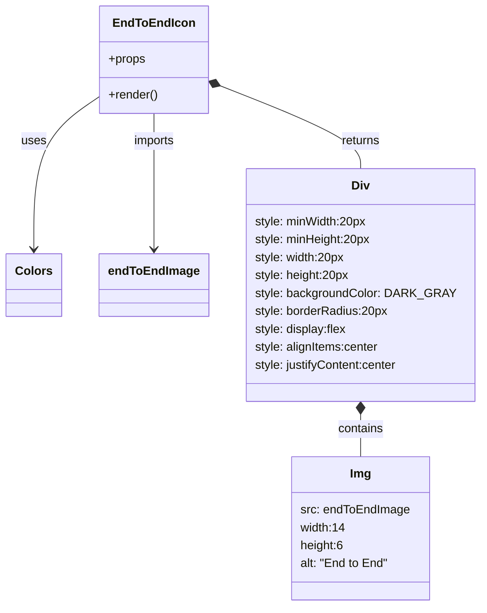

# Diagram: web/portal/src/components/multimodal-components/EndToEndTabIcon.js

> Auto-generated by Obscura crawlers

## Mermaid

### SVG

<svg id="container" width="618.9921875" xmlns="http://www.w3.org/2000/svg" class="classDiagram" height="812" viewBox="0 0 618.9921875 812" role="graphics-document document" aria-roledescription="class"><g><defs><marker id="container_class-aggregationStart" class="marker aggregation class" refX="18" refY="7" markerWidth="190" markerHeight="240" orient="auto"><path d="M 18,7 L9,13 L1,7 L9,1 Z"></path></marker></defs><defs><marker id="container_class-aggregationEnd" class="marker aggregation class" refX="1" refY="7" markerWidth="20" markerHeight="28" orient="auto"><path d="M 18,7 L9,13 L1,7 L9,1 Z"></path></marker></defs><defs><marker id="container_class-extensionStart" class="marker extension class" refX="18" refY="7" markerWidth="190" markerHeight="240" orient="auto"><path d="M 1,7 L18,13 V 1 Z"></path></marker></defs><defs><marker id="container_class-extensionEnd" class="marker extension class" refX="1" refY="7" markerWidth="20" markerHeight="28" orient="auto"><path d="M 1,1 V 13 L18,7 Z"></path></marker></defs><defs><marker id="container_class-compositionStart" class="marker composition class" refX="18" refY="7" markerWidth="190" markerHeight="240" orient="auto"><path d="M 18,7 L9,13 L1,7 L9,1 Z"></path></marker></defs><defs><marker id="container_class-compositionEnd" class="marker composition class" refX="1" refY="7" markerWidth="20" markerHeight="28" orient="auto"><path d="M 18,7 L9,13 L1,7 L9,1 Z"></path></marker></defs><defs><marker id="container_class-dependencyStart" class="marker dependency class" refX="6" refY="7" markerWidth="190" markerHeight="240" orient="auto"><path d="M 5,7 L9,13 L1,7 L9,1 Z"></path></marker></defs><defs><marker id="container_class-dependencyEnd" class="marker dependency class" refX="13" refY="7" markerWidth="20" markerHeight="28" orient="auto"><path d="M 18,7 L9,13 L14,7 L9,1 Z"></path></marker></defs><defs><marker id="container_class-lollipopStart" class="marker lollipop class" refX="13" refY="7" markerWidth="190" markerHeight="240" orient="auto"><circle stroke="black" fill="transparent" cx="7" cy="7" r="6"></circle></marker></defs><defs><marker id="container_class-lollipopEnd" class="marker lollipop class" refX="1" refY="7" markerWidth="190" markerHeight="240" orient="auto"><circle stroke="black" fill="transparent" cx="7" cy="7" r="6"></circle></marker></defs><g class="root"><g class="clusters"></g><g class="edgePaths"><path d="M127.41,129.745L113.359,139.621C99.307,149.497,71.204,169.248,57.153,203.291C43.102,237.333,43.102,285.667,43.102,309.833L43.102,334" id="id_EndToEndIcon_Colors_1" class="edge-thickness-normal edge-pattern-solid relation" style=";;;" data-edge="true" data-et="edge" data-id="id_EndToEndIcon_Colors_1" data-points="W3sieCI6MTI3LjQxMDE1NjI1LCJ5IjoxMjkuNzQ0ODc0MzEzNjM2Nn0seyJ4Ijo0My4xMDE1NjI1LCJ5IjoxODl9LHsieCI6NDMuMTAxNTYyNSwieSI6MzQwfV0=" marker-end="url(#container_class-dependencyEnd)"></path><path d="M198.188,152L198.188,158.167C198.188,164.333,198.188,176.667,198.188,207C198.188,237.333,198.188,285.667,198.188,309.833L198.188,334" id="id_EndToEndIcon_endToEndImage_2" class="edge-thickness-normal edge-pattern-solid relation" style=";;;" data-edge="true" data-et="edge" data-id="id_EndToEndIcon_endToEndImage_2" data-points="W3sieCI6MTk4LjE4NzUsInkiOjE1Mn0seyJ4IjoxOTguMTg3NSwieSI6MTg5fSx7IngiOjE5OC4xODc1LCJ5IjozNDB9XQ==" marker-end="url(#container_class-dependencyEnd)"></path><path d="M284.93,115.492L314.872,127.744C344.814,139.995,404.698,164.497,434.64,182.915C464.582,201.333,464.582,213.667,464.582,219.833L464.582,226" id="id_EndToEndIcon_Div_3" class="edge-thickness-normal edge-pattern-solid relation" style=";;;" data-edge="true" data-et="edge" data-id="id_EndToEndIcon_Div_3" data-points="W3sieCI6MjY4Ljk2NDg0Mzc1LCJ5IjoxMDguOTU5NzkyOTUyNzY5MTl9LHsieCI6NDY0LjU4MjAzMTI1LCJ5IjoxODl9LHsieCI6NDY0LjU4MjAzMTI1LCJ5IjoyMjZ9XQ==" marker-start="url(#container_class-compositionStart)"></path><path d="M464.582,555.25L464.582,558.542C464.582,561.833,464.582,568.417,464.582,577.875C464.582,587.333,464.582,599.667,464.582,605.833L464.582,612" id="id_Div_Img_4" class="edge-thickness-normal edge-pattern-solid relation" style=";;;" data-edge="true" data-et="edge" data-id="id_Div_Img_4" data-points="W3sieCI6NDY0LjU4MjAzMTI1LCJ5Ijo1Mzh9LHsieCI6NDY0LjU4MjAzMTI1LCJ5Ijo1NzV9LHsieCI6NDY0LjU4MjAzMTI1LCJ5Ijo2MTJ9XQ==" marker-start="url(#container_class-compositionStart)"></path></g><g class="edgeLabels"><g class="edgeLabel" transform="translate(43.1015625, 189)"><g class="label" data-id="id_EndToEndIcon_Colors_1" transform="translate(-16.4921875, -12)"><foreignObject width="32.984375" height="24">

uses

</foreignObject></g></g><g class="edgeLabel" transform="translate(198.1875, 189)"><g class="label" data-id="id_EndToEndIcon_endToEndImage_2" transform="translate(-28.25, -12)"><foreignObject width="56.5" height="24">

imports

</foreignObject></g></g><g class="edgeLabel" transform="translate(464.58203125, 189)"><g class="label" data-id="id_EndToEndIcon_Div_3" transform="translate(-26.265625, -12)"><foreignObject width="52.53125" height="24">

returns

</foreignObject></g></g><g class="edgeLabel" transform="translate(464.58203125, 575)"><g class="label" data-id="id_Div_Img_4" transform="translate(-30.890625, -12)"><foreignObject width="61.78125" height="24">

contains

</foreignObject></g></g></g><g class="nodes"><g class="node default" id="classId-EndToEndIcon-0" transform="translate(198.1875, 80)"><g class="basic label-container"><path d="M-70.77734375 -72 L70.77734375 -72 L70.77734375 72 L-70.77734375 72" stroke="none" stroke-width="0" fill="#ECECFF" style=""></path><path d="M-70.77734375 -72 C-41.62321227809865 -72, -12.469080806197304 -72, 70.77734375 -72 M-70.77734375 -72 C-16.928723926128548 -72, 36.919895897742904 -72, 70.77734375 -72 M70.77734375 -72 C70.77734375 -36.82895011826458, 70.77734375 -1.6579002365291586, 70.77734375 72 M70.77734375 -72 C70.77734375 -28.193463165394746, 70.77734375 15.613073669210507, 70.77734375 72 M70.77734375 72 C21.02761288556588 72, -28.72211797886824 72, -70.77734375 72 M70.77734375 72 C22.467433233179776 72, -25.84247728364045 72, -70.77734375 72 M-70.77734375 72 C-70.77734375 40.820802259746586, -70.77734375 9.641604519493178, -70.77734375 -72 M-70.77734375 72 C-70.77734375 18.93537089025932, -70.77734375 -34.12925821948136, -70.77734375 -72" stroke="#9370DB" stroke-width="1.3" fill="none" stroke-dasharray="0 0" style=""></path></g><g class="annotation-group text" transform="translate(0, -48)"></g><g class="label-group text" transform="translate(-50.9453125, -48)"><g class="label" style="font-weight: bolder" transform="translate(0,-12)"><foreignObject width="101.890625" height="24">

EndToEndIcon

</foreignObject></g></g><g class="members-group text" transform="translate(-58.77734375, 0)"><g class="label" style="" transform="translate(0,-12)"><foreignObject width="49.515625" height="24">

+props

</foreignObject></g></g><g class="methods-group text" transform="translate(-58.77734375, 48)"><g class="label" style="" transform="translate(0,-12)"><foreignObject width="66.609375" height="24">

+render()

</foreignObject></g></g><g class="divider" style=""><path d="M-70.77734375 -24 C-42.25949016679182 -24, -13.741636583583642 -24, 70.77734375 -24 M-70.77734375 -24 C-40.33157562103295 -24, -9.885807492065894 -24, 70.77734375 -24" stroke="#9370DB" stroke-width="1.3" fill="none" stroke-dasharray="0 0" style=""></path></g><g class="divider" style=""><path d="M-70.77734375 24 C-25.176351264103886 24, 20.42464122179223 24, 70.77734375 24 M-70.77734375 24 C-19.648317912294317 24, 31.480707925411366 24, 70.77734375 24" stroke="#9370DB" stroke-width="1.3" fill="none" stroke-dasharray="0 0" style=""></path></g></g><g class="node default" id="classId-Colors-1" transform="translate(43.1015625, 382)"><g class="basic label-container"><path d="M-35.1015625 -42 L35.1015625 -42 L35.1015625 42 L-35.1015625 42" stroke="none" stroke-width="0" fill="#ECECFF" style=""></path><path d="M-35.1015625 -42 C-11.346363020757526 -42, 12.408836458484949 -42, 35.1015625 -42 M-35.1015625 -42 C-16.497742200982376 -42, 2.1060780980352476 -42, 35.1015625 -42 M35.1015625 -42 C35.1015625 -13.739925779604622, 35.1015625 14.520148440790756, 35.1015625 42 M35.1015625 -42 C35.1015625 -9.096395120514025, 35.1015625 23.80720975897195, 35.1015625 42 M35.1015625 42 C10.382877806839346 42, -14.335806886321308 42, -35.1015625 42 M35.1015625 42 C7.922461141626801 42, -19.256640216746398 42, -35.1015625 42 M-35.1015625 42 C-35.1015625 23.993989165008156, -35.1015625 5.987978330016311, -35.1015625 -42 M-35.1015625 42 C-35.1015625 22.24809058769291, -35.1015625 2.4961811753858214, -35.1015625 -42" stroke="#9370DB" stroke-width="1.3" fill="none" stroke-dasharray="0 0" style=""></path></g><g class="annotation-group text" transform="translate(0, -18)"></g><g class="label-group text" transform="translate(-23.1015625, -18)"><g class="label" style="font-weight: bolder" transform="translate(0,-12)"><foreignObject width="46.203125" height="24">

Colors

</foreignObject></g></g><g class="members-group text" transform="translate(-23.1015625, 30)"></g><g class="methods-group text" transform="translate(-23.1015625, 60)"></g><g class="divider" style=""><path d="M-35.1015625 6 C-18.599358256760656 6, -2.097154013521312 6, 35.1015625 6 M-35.1015625 6 C-19.233391134427606 6, -3.3652197688552086 6, 35.1015625 6" stroke="#9370DB" stroke-width="1.3" fill="none" stroke-dasharray="0 0" style=""></path></g><g class="divider" style=""><path d="M-35.1015625 24 C-14.550668070488964 24, 6.000226359022072 24, 35.1015625 24 M-35.1015625 24 C-7.268677772925269 24, 20.564206954149462 24, 35.1015625 24" stroke="#9370DB" stroke-width="1.3" fill="none" stroke-dasharray="0 0" style=""></path></g></g><g class="node default" id="classId-endToEndImage-2" transform="translate(198.1875, 382)"><g class="basic label-container"><path d="M-69.984375 -42 L69.984375 -42 L69.984375 42 L-69.984375 42" stroke="none" stroke-width="0" fill="#ECECFF" style=""></path><path d="M-69.984375 -42 C-23.91708211001498 -42, 22.15021077997004 -42, 69.984375 -42 M-69.984375 -42 C-22.972583403305272 -42, 24.039208193389456 -42, 69.984375 -42 M69.984375 -42 C69.984375 -19.578091937260456, 69.984375 2.843816125479087, 69.984375 42 M69.984375 -42 C69.984375 -22.35971450093369, 69.984375 -2.7194290018673826, 69.984375 42 M69.984375 42 C30.25085192889145 42, -9.4826711422171 42, -69.984375 42 M69.984375 42 C14.913857825938798 42, -40.1566593481224 42, -69.984375 42 M-69.984375 42 C-69.984375 16.374340243493542, -69.984375 -9.251319513012916, -69.984375 -42 M-69.984375 42 C-69.984375 14.29798877758089, -69.984375 -13.404022444838219, -69.984375 -42" stroke="#9370DB" stroke-width="1.3" fill="none" stroke-dasharray="0 0" style=""></path></g><g class="annotation-group text" transform="translate(0, -18)"></g><g class="label-group text" transform="translate(-57.984375, -18)"><g class="label" style="font-weight: bolder" transform="translate(0,-12)"><foreignObject width="115.96875" height="24">

endToEndImage

</foreignObject></g></g><g class="members-group text" transform="translate(-57.984375, 30)"></g><g class="methods-group text" transform="translate(-57.984375, 60)"></g><g class="divider" style=""><path d="M-69.984375 6 C-28.524285093024908 6, 12.935804813950185 6, 69.984375 6 M-69.984375 6 C-29.24736481073912 6, 11.489645378521757 6, 69.984375 6" stroke="#9370DB" stroke-width="1.3" fill="none" stroke-dasharray="0 0" style=""></path></g><g class="divider" style=""><path d="M-69.984375 24 C-27.274992884919406 24, 15.434389230161187 24, 69.984375 24 M-69.984375 24 C-19.080359703152922 24, 31.823655593694156 24, 69.984375 24" stroke="#9370DB" stroke-width="1.3" fill="none" stroke-dasharray="0 0" style=""></path></g></g><g class="node default" id="classId-Div-3" transform="translate(464.58203125, 382)"><g class="basic label-container"><path d="M-146.41015625 -156 L146.41015625 -156 L146.41015625 156 L-146.41015625 156" stroke="none" stroke-width="0" fill="#ECECFF" style=""></path><path d="M-146.41015625 -156 C-86.7484741239939 -156, -27.086791997987802 -156, 146.41015625 -156 M-146.41015625 -156 C-57.02552788788583 -156, 32.35910047422834 -156, 146.41015625 -156 M146.41015625 -156 C146.41015625 -67.30606463393065, 146.41015625 21.38787073213871, 146.41015625 156 M146.41015625 -156 C146.41015625 -66.85965091491514, 146.41015625 22.280698170169728, 146.41015625 156 M146.41015625 156 C73.51491722495452 156, 0.619678199909032 156, -146.41015625 156 M146.41015625 156 C34.79708168333133 156, -76.81599288333734 156, -146.41015625 156 M-146.41015625 156 C-146.41015625 67.69740523433838, -146.41015625 -20.605189531323248, -146.41015625 -156 M-146.41015625 156 C-146.41015625 55.979472649338476, -146.41015625 -44.04105470132305, -146.41015625 -156" stroke="#9370DB" stroke-width="1.3" fill="none" stroke-dasharray="0 0" style=""></path></g><g class="annotation-group text" transform="translate(0, -132)"></g><g class="label-group text" transform="translate(-11.5703125, -132)"><g class="label" style="font-weight: bolder" transform="translate(0,-12)"><foreignObject width="23.140625" height="24">

Div

</foreignObject></g></g><g class="members-group text" transform="translate(-134.41015625, -84)"><g class="label" style="" transform="translate(0,-12)"><foreignObject width="150.3125" height="24">

style: minWidth:20px

</foreignObject></g><g class="label" style="" transform="translate(0,12)"><foreignObject width="155.515625" height="24">

style: minHeight:20px

</foreignObject></g><g class="label" style="" transform="translate(0,36)"><foreignObject width="120.96875" height="24">

style: width:20px

</foreignObject></g><g class="label" style="" transform="translate(0,60)"><foreignObject width="126.40625" height="24">

style: height:20px

</foreignObject></g><g class="label" style="" transform="translate(0,84)"><foreignObject width="257.25" height="24">

style: backgroundColor: DARK_GRAY

</foreignObject></g><g class="label" style="" transform="translate(0,108)"><foreignObject width="178.359375" height="24">

style: borderRadius:20px

</foreignObject></g><g class="label" style="" transform="translate(0,132)"><foreignObject width="124.15625" height="24">

style: display:flex

</foreignObject></g><g class="label" style="" transform="translate(0,156)"><foreignObject width="167.75" height="24">

style: alignItems:center

</foreignObject></g><g class="label" style="" transform="translate(0,180)"><foreignObject width="193.765625" height="24">

style: justifyContent:center

</foreignObject></g></g><g class="methods-group text" transform="translate(-134.41015625, 156)"></g><g class="divider" style=""><path d="M-146.41015625 -108 C-32.26361217301343 -108, 81.88293190397314 -108, 146.41015625 -108 M-146.41015625 -108 C-78.77543751411532 -108, -11.14071877823065 -108, 146.41015625 -108" stroke="#9370DB" stroke-width="1.3" fill="none" stroke-dasharray="0 0" style=""></path></g><g class="divider" style=""><path d="M-146.41015625 132 C-55.88526619027468 132, 34.639623869450645 132, 146.41015625 132 M-146.41015625 132 C-77.1850583971288 132, -7.959960544257598 132, 146.41015625 132" stroke="#9370DB" stroke-width="1.3" fill="none" stroke-dasharray="0 0" style=""></path></g></g><g class="node default" id="classId-Img-4" transform="translate(464.58203125, 708)"><g class="basic label-container"><path d="M-90.9921875 -96 L90.9921875 -96 L90.9921875 96 L-90.9921875 96" stroke="none" stroke-width="0" fill="#ECECFF" style=""></path><path d="M-90.9921875 -96 C-37.81868932235093 -96, 15.354808855298145 -96, 90.9921875 -96 M-90.9921875 -96 C-50.50644481927707 -96, -10.020702138554142 -96, 90.9921875 -96 M90.9921875 -96 C90.9921875 -39.70938532277597, 90.9921875 16.581229354448055, 90.9921875 96 M90.9921875 -96 C90.9921875 -35.98889395894675, 90.9921875 24.022212082106506, 90.9921875 96 M90.9921875 96 C52.98190300304749 96, 14.971618506094984 96, -90.9921875 96 M90.9921875 96 C39.65680401560486 96, -11.678579468790275 96, -90.9921875 96 M-90.9921875 96 C-90.9921875 50.723988168089306, -90.9921875 5.447976336178613, -90.9921875 -96 M-90.9921875 96 C-90.9921875 49.31139576573077, -90.9921875 2.6227915314615444, -90.9921875 -96" stroke="#9370DB" stroke-width="1.3" fill="none" stroke-dasharray="0 0" style=""></path></g><g class="annotation-group text" transform="translate(0, -72)"></g><g class="label-group text" transform="translate(-13.515625, -72)"><g class="label" style="font-weight: bolder" transform="translate(0,-12)"><foreignObject width="27.03125" height="24">

Img

</foreignObject></g></g><g class="members-group text" transform="translate(-78.9921875, -24)"><g class="label" style="" transform="translate(0,-12)"><foreignObject width="144.46875" height="24">

src: endToEndImage

</foreignObject></g><g class="label" style="" transform="translate(0,12)"><foreignObject width="59.359375" height="24">

width:14

</foreignObject></g><g class="label" style="" transform="translate(0,36)"><foreignObject width="58.515625" height="24">

height:6

</foreignObject></g><g class="label" style="" transform="translate(0,60)"><foreignObject width="117.96875" height="24">

alt: "End to End"

</foreignObject></g></g><g class="methods-group text" transform="translate(-78.9921875, 96)"></g><g class="divider" style=""><path d="M-90.9921875 -48 C-51.54853040499671 -48, -12.104873309993422 -48, 90.9921875 -48 M-90.9921875 -48 C-43.56826687802312 -48, 3.8556537439537664 -48, 90.9921875 -48" stroke="#9370DB" stroke-width="1.3" fill="none" stroke-dasharray="0 0" style=""></path></g><g class="divider" style=""><path d="M-90.9921875 72 C-39.56065880468742 72, 11.870869890625158 72, 90.9921875 72 M-90.9921875 72 C-19.816661511759975 72, 51.35886447648005 72, 90.9921875 72" stroke="#9370DB" stroke-width="1.3" fill="none" stroke-dasharray="0 0" style=""></path></g></g></g></g></g></svg>
