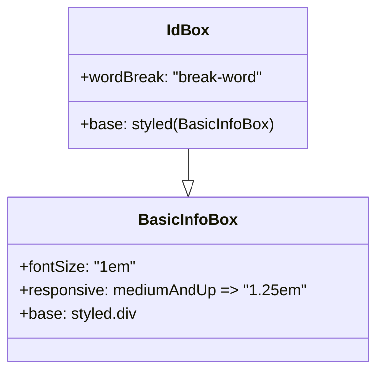

# Diagram: web/portal/src/components/multimodal-components/InfoBoxes.js

> Auto-generated by Obscura crawlers

## Mermaid

### SVG

<svg id="container" width="375.8671875" xmlns="http://www.w3.org/2000/svg" class="classDiagram" height="378" viewBox="0 0 375.8671875 378" role="graphics-document document" aria-roledescription="class"><g><defs><marker id="container_class-aggregationStart" class="marker aggregation class" refX="18" refY="7" markerWidth="190" markerHeight="240" orient="auto"><path d="M 18,7 L9,13 L1,7 L9,1 Z"></path></marker></defs><defs><marker id="container_class-aggregationEnd" class="marker aggregation class" refX="1" refY="7" markerWidth="20" markerHeight="28" orient="auto"><path d="M 18,7 L9,13 L1,7 L9,1 Z"></path></marker></defs><defs><marker id="container_class-extensionStart" class="marker extension class" refX="18" refY="7" markerWidth="190" markerHeight="240" orient="auto"><path d="M 1,7 L18,13 V 1 Z"></path></marker></defs><defs><marker id="container_class-extensionEnd" class="marker extension class" refX="1" refY="7" markerWidth="20" markerHeight="28" orient="auto"><path d="M 1,1 V 13 L18,7 Z"></path></marker></defs><defs><marker id="container_class-compositionStart" class="marker composition class" refX="18" refY="7" markerWidth="190" markerHeight="240" orient="auto"><path d="M 18,7 L9,13 L1,7 L9,1 Z"></path></marker></defs><defs><marker id="container_class-compositionEnd" class="marker composition class" refX="1" refY="7" markerWidth="20" markerHeight="28" orient="auto"><path d="M 18,7 L9,13 L1,7 L9,1 Z"></path></marker></defs><defs><marker id="container_class-dependencyStart" class="marker dependency class" refX="6" refY="7" markerWidth="190" markerHeight="240" orient="auto"><path d="M 5,7 L9,13 L1,7 L9,1 Z"></path></marker></defs><defs><marker id="container_class-dependencyEnd" class="marker dependency class" refX="13" refY="7" markerWidth="20" markerHeight="28" orient="auto"><path d="M 18,7 L9,13 L14,7 L9,1 Z"></path></marker></defs><defs><marker id="container_class-lollipopStart" class="marker lollipop class" refX="13" refY="7" markerWidth="190" markerHeight="240" orient="auto"><circle stroke="black" fill="transparent" cx="7" cy="7" r="6"></circle></marker></defs><defs><marker id="container_class-lollipopEnd" class="marker lollipop class" refX="1" refY="7" markerWidth="190" markerHeight="240" orient="auto"><circle stroke="black" fill="transparent" cx="7" cy="7" r="6"></circle></marker></defs><g class="root"><g class="clusters"></g><g class="edgePaths"><path d="M187.934,152L187.934,156.167C187.934,160.333,187.934,168.667,187.934,174.125C187.934,179.583,187.934,182.167,187.934,183.458L187.934,184.75" id="id_IdBox_BasicInfoBox_1" class="edge-thickness-normal edge-pattern-solid relation" style=";;;" data-edge="true" data-et="edge" data-id="id_IdBox_BasicInfoBox_1" data-points="W3sieCI6MTg3LjkzMzU5Mzc1LCJ5IjoxNTJ9LHsieCI6MTg3LjkzMzU5Mzc1LCJ5IjoxNzd9LHsieCI6MTg3LjkzMzU5Mzc1LCJ5IjoyMDJ9XQ==" marker-end="url(#container_class-extensionEnd)"></path></g><g class="edgeLabels"><g class="edgeLabel"><g class="label" data-id="id_IdBox_BasicInfoBox_1" transform="translate(0, 0)"><foreignObject width="0" height="0">

</foreignObject></g></g></g><g class="nodes"><g class="node default" id="classId-BasicInfoBox-0" transform="translate(187.93359375, 286)"><g class="basic label-container"><path d="M-179.93359375 -84 L179.93359375 -84 L179.93359375 84 L-179.93359375 84" stroke="none" stroke-width="0" fill="#ECECFF" style=""></path><path d="M-179.93359375 -84 C-68.88344367404073 -84, 42.16670640191853 -84, 179.93359375 -84 M-179.93359375 -84 C-92.89592037411866 -84, -5.85824699823732 -84, 179.93359375 -84 M179.93359375 -84 C179.93359375 -31.30206434741573, 179.93359375 21.39587130516854, 179.93359375 84 M179.93359375 -84 C179.93359375 -48.59609800500315, 179.93359375 -13.192196010006299, 179.93359375 84 M179.93359375 84 C88.39452653174145 84, -3.1445406865171037 84, -179.93359375 84 M179.93359375 84 C75.5637999228671 84, -28.80599390426579 84, -179.93359375 84 M-179.93359375 84 C-179.93359375 40.31308133805016, -179.93359375 -3.3738373238996786, -179.93359375 -84 M-179.93359375 84 C-179.93359375 42.67535576487822, -179.93359375 1.3507115297564383, -179.93359375 -84" stroke="#9370DB" stroke-width="1.3" fill="none" stroke-dasharray="0 0" style=""></path></g><g class="annotation-group text" transform="translate(0, -60)"></g><g class="label-group text" transform="translate(-47.1953125, -60)"><g class="label" style="font-weight: bolder" transform="translate(0,-12)"><foreignObject width="94.390625" height="24">

BasicInfoBox

</foreignObject></g></g><g class="members-group text" transform="translate(-167.93359375, -12)"><g class="label" style="" transform="translate(0,-12)"><foreignObject width="116.328125" height="24">

+fontSize: "1em"

</foreignObject></g><g class="label" style="" transform="translate(0,12)"><foreignObject width="288.671875" height="24">

+responsive: mediumAndUp =&gt; "1.25em"

</foreignObject></g><g class="label" style="" transform="translate(0,36)"><foreignObject width="119.71875" height="24">

+base: styled.div

</foreignObject></g></g><g class="methods-group text" transform="translate(-167.93359375, 84)"></g><g class="divider" style=""><path d="M-179.93359375 -36 C-105.41838852337763 -36, -30.90318329675526 -36, 179.93359375 -36 M-179.93359375 -36 C-56.56740454594396 -36, 66.79878465811208 -36, 179.93359375 -36" stroke="#9370DB" stroke-width="1.3" fill="none" stroke-dasharray="0 0" style=""></path></g><g class="divider" style=""><path d="M-179.93359375 60 C-75.6444931944962 60, 28.644607361007587 60, 179.93359375 60 M-179.93359375 60 C-104.35568092256652 60, -28.77776809513304 60, 179.93359375 60" stroke="#9370DB" stroke-width="1.3" fill="none" stroke-dasharray="0 0" style=""></path></g></g><g class="node default" id="classId-IdBox-1" transform="translate(187.93359375, 80)"><g class="basic label-container"><path d="M-121.21875 -72 L121.21875 -72 L121.21875 72 L-121.21875 72" stroke="none" stroke-width="0" fill="#ECECFF" style=""></path><path d="M-121.21875 -72 C-58.62319973171857 -72, 3.972350536562857 -72, 121.21875 -72 M-121.21875 -72 C-59.80748406499207 -72, 1.6037818700158653 -72, 121.21875 -72 M121.21875 -72 C121.21875 -22.732761147848322, 121.21875 26.534477704303356, 121.21875 72 M121.21875 -72 C121.21875 -41.24629094436113, 121.21875 -10.492581888722256, 121.21875 72 M121.21875 72 C70.20445543344819 72, 19.190160866896377 72, -121.21875 72 M121.21875 72 C35.93668160238512 72, -49.34538679522976 72, -121.21875 72 M-121.21875 72 C-121.21875 24.909227443819702, -121.21875 -22.181545112360595, -121.21875 -72 M-121.21875 72 C-121.21875 22.946385989965528, -121.21875 -26.107228020068945, -121.21875 -72" stroke="#9370DB" stroke-width="1.3" fill="none" stroke-dasharray="0 0" style=""></path></g><g class="annotation-group text" transform="translate(0, -48)"></g><g class="label-group text" transform="translate(-20.75, -48)"><g class="label" style="font-weight: bolder" transform="translate(0,-12)"><foreignObject width="41.5" height="24">

IdBox

</foreignObject></g></g><g class="members-group text" transform="translate(-109.21875, 0)"><g class="label" style="" transform="translate(0,-12)"><foreignObject width="188.484375" height="24">

+wordBreak: "break-word"

</foreignObject></g></g><g class="methods-group text" transform="translate(-109.21875, 48)"><g class="label" style="" transform="translate(0,-12)"><foreignObject width="197.6875" height="24">

+base: styled(BasicInfoBox)

</foreignObject></g></g><g class="divider" style=""><path d="M-121.21875 -24 C-24.979754013339914 -24, 71.25924197332017 -24, 121.21875 -24 M-121.21875 -24 C-65.49466143483457 -24, -9.770572869669138 -24, 121.21875 -24" stroke="#9370DB" stroke-width="1.3" fill="none" stroke-dasharray="0 0" style=""></path></g><g class="divider" style=""><path d="M-121.21875 24 C-25.884305670358998 24, 69.450138659282 24, 121.21875 24 M-121.21875 24 C-61.652006569265225 24, -2.0852631385304505 24, 121.21875 24" stroke="#9370DB" stroke-width="1.3" fill="none" stroke-dasharray="0 0" style=""></path></g></g></g></g></g></svg>
