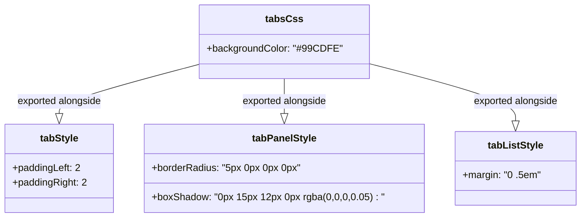

# Diagram: web/portal/src/components/multimodal-components/tabStyles.js

> Auto-generated by Obscura crawlers

## Mermaid

### SVG

<svg id="container" width="928.28125" xmlns="http://www.w3.org/2000/svg" class="classDiagram" height="354" viewBox="0 0 928.28125 354" role="graphics-document document" aria-roledescription="class"><g><defs><marker id="container_class-aggregationStart" class="marker aggregation class" refX="18" refY="7" markerWidth="190" markerHeight="240" orient="auto"><path d="M 18,7 L9,13 L1,7 L9,1 Z"></path></marker></defs><defs><marker id="container_class-aggregationEnd" class="marker aggregation class" refX="1" refY="7" markerWidth="20" markerHeight="28" orient="auto"><path d="M 18,7 L9,13 L1,7 L9,1 Z"></path></marker></defs><defs><marker id="container_class-extensionStart" class="marker extension class" refX="18" refY="7" markerWidth="190" markerHeight="240" orient="auto"><path d="M 1,7 L18,13 V 1 Z"></path></marker></defs><defs><marker id="container_class-extensionEnd" class="marker extension class" refX="1" refY="7" markerWidth="20" markerHeight="28" orient="auto"><path d="M 1,1 V 13 L18,7 Z"></path></marker></defs><defs><marker id="container_class-compositionStart" class="marker composition class" refX="18" refY="7" markerWidth="190" markerHeight="240" orient="auto"><path d="M 18,7 L9,13 L1,7 L9,1 Z"></path></marker></defs><defs><marker id="container_class-compositionEnd" class="marker composition class" refX="1" refY="7" markerWidth="20" markerHeight="28" orient="auto"><path d="M 18,7 L9,13 L1,7 L9,1 Z"></path></marker></defs><defs><marker id="container_class-dependencyStart" class="marker dependency class" refX="6" refY="7" markerWidth="190" markerHeight="240" orient="auto"><path d="M 5,7 L9,13 L1,7 L9,1 Z"></path></marker></defs><defs><marker id="container_class-dependencyEnd" class="marker dependency class" refX="13" refY="7" markerWidth="20" markerHeight="28" orient="auto"><path d="M 18,7 L9,13 L14,7 L9,1 Z"></path></marker></defs><defs><marker id="container_class-lollipopStart" class="marker lollipop class" refX="13" refY="7" markerWidth="190" markerHeight="240" orient="auto"><circle stroke="black" fill="transparent" cx="7" cy="7" r="6"></circle></marker></defs><defs><marker id="container_class-lollipopEnd" class="marker lollipop class" refX="1" refY="7" markerWidth="190" markerHeight="240" orient="auto"><circle stroke="black" fill="transparent" cx="7" cy="7" r="6"></circle></marker></defs><g class="root"><g class="clusters"></g><g class="edgePaths"><path d="M322.18,103.824L284.465,114.02C246.751,124.216,171.323,144.608,133.609,158.096C95.895,171.583,95.895,178.167,95.895,181.458L95.895,184.75" id="id_tabsCss_tabStyle_1" class="edge-thickness-normal edge-pattern-solid relation" style=";;;" data-edge="true" data-et="edge" data-id="id_tabsCss_tabStyle_1" data-points="W3sieCI6MzIyLjE3OTY4NzUsInkiOjEwMy44MjQyNzE2NTQ0MDA1NX0seyJ4Ijo5NS44OTQ1MzEyNSwieSI6MTY1fSx7IngiOjk1Ljg5NDUzMTI1LCJ5IjoyMDJ9XQ==" marker-end="url(#container_class-extensionEnd)"></path><path d="M454.691,128L454.691,134.167C454.691,140.333,454.691,152.667,454.691,162.125C454.691,171.583,454.691,178.167,454.691,181.458L454.691,184.75" id="id_tabsCss_tabPanelStyle_2" class="edge-thickness-normal edge-pattern-solid relation" style=";;;" data-edge="true" data-et="edge" data-id="id_tabsCss_tabPanelStyle_2" data-points="W3sieCI6NDU0LjY5MTQwNjI1LCJ5IjoxMjh9LHsieCI6NDU0LjY5MTQwNjI1LCJ5IjoxNjV9LHsieCI6NDU0LjY5MTQwNjI1LCJ5IjoyMDJ9XQ==" marker-end="url(#container_class-extensionEnd)"></path><path d="M587.203,102.905L626.492,113.254C665.781,123.603,744.359,144.302,783.648,159.943C822.938,175.583,822.938,186.167,822.938,191.458L822.938,196.75" id="id_tabsCss_tabListStyle_3" class="edge-thickness-normal edge-pattern-solid relation" style=";;;" data-edge="true" data-et="edge" data-id="id_tabsCss_tabListStyle_3" data-points="W3sieCI6NTg3LjIwMzEyNSwieSI6MTAyLjkwNTAxODUxMDQ2NDUyfSx7IngiOjgyMi45Mzc1LCJ5IjoxNjV9LHsieCI6ODIyLjkzNzUsInkiOjIxNH1d" marker-end="url(#container_class-extensionEnd)"></path></g><g class="edgeLabels"><g class="edgeLabel" transform="translate(95.89453125, 165)"><g class="label" data-id="id_tabsCss_tabStyle_1" transform="translate(-69.890625, -12)"><foreignObject width="139.78125" height="24">

exported alongside

</foreignObject></g></g><g class="edgeLabel" transform="translate(454.69140625, 165)"><g class="label" data-id="id_tabsCss_tabPanelStyle_2" transform="translate(-69.890625, -12)"><foreignObject width="139.78125" height="24">

exported alongside

</foreignObject></g></g><g class="edgeLabel" transform="translate(822.9375, 165)"><g class="label" data-id="id_tabsCss_tabListStyle_3" transform="translate(-69.890625, -12)"><foreignObject width="139.78125" height="24">

exported alongside

</foreignObject></g></g></g><g class="nodes"><g class="node default" id="classId-tabsCss-0" transform="translate(454.69140625, 68)"><g class="basic label-container"><path d="M-132.51171875 -60 L132.51171875 -60 L132.51171875 60 L-132.51171875 60" stroke="none" stroke-width="0" fill="#ECECFF" style=""></path><path d="M-132.51171875 -60 C-36.97573460378477 -60, 58.560249542430455 -60, 132.51171875 -60 M-132.51171875 -60 C-77.0693646176513 -60, -21.627010485302606 -60, 132.51171875 -60 M132.51171875 -60 C132.51171875 -15.604413534889268, 132.51171875 28.791172930221464, 132.51171875 60 M132.51171875 -60 C132.51171875 -25.38008324803632, 132.51171875 9.239833503927358, 132.51171875 60 M132.51171875 60 C76.24113363496934 60, 19.970548519938674 60, -132.51171875 60 M132.51171875 60 C36.9374994210107 60, -58.6367199079786 60, -132.51171875 60 M-132.51171875 60 C-132.51171875 13.120475055192323, -132.51171875 -33.759049889615355, -132.51171875 -60 M-132.51171875 60 C-132.51171875 26.17785858043481, -132.51171875 -7.644282839130383, -132.51171875 -60" stroke="#9370DB" stroke-width="1.3" fill="none" stroke-dasharray="0 0" style=""></path></g><g class="annotation-group text" transform="translate(0, -36)"></g><g class="label-group text" transform="translate(-28.2265625, -36)"><g class="label" style="font-weight: bolder" transform="translate(0,-12)"><foreignObject width="56.453125" height="24">

tabsCss

</foreignObject></g></g><g class="members-group text" transform="translate(-120.51171875, 12)"><g class="label" style="" transform="translate(0,-12)"><foreignObject width="212.796875" height="24">

+backgroundColor: "#99CDFE"

</foreignObject></g></g><g class="methods-group text" transform="translate(-120.51171875, 60)"></g><g class="divider" style=""><path d="M-132.51171875 -12 C-48.823776961399034 -12, 34.86416482720193 -12, 132.51171875 -12 M-132.51171875 -12 C-27.376315101643613 -12, 77.75908854671277 -12, 132.51171875 -12" stroke="#9370DB" stroke-width="1.3" fill="none" stroke-dasharray="0 0" style=""></path></g><g class="divider" style=""><path d="M-132.51171875 36 C-52.48934000263371 36, 27.53303874473258 36, 132.51171875 36 M-132.51171875 36 C-53.06853226909078 36, 26.374654211818438 36, 132.51171875 36" stroke="#9370DB" stroke-width="1.3" fill="none" stroke-dasharray="0 0" style=""></path></g></g><g class="node default" id="classId-tabStyle-1" transform="translate(95.89453125, 274)"><g class="basic label-container"><path d="M-87.89453125 -72 L87.89453125 -72 L87.89453125 72 L-87.89453125 72" stroke="none" stroke-width="0" fill="#ECECFF" style=""></path><path d="M-87.89453125 -72 C-43.68795649232668 -72, 0.518618265346646 -72, 87.89453125 -72 M-87.89453125 -72 C-40.60513460027644 -72, 6.684262049447113 -72, 87.89453125 -72 M87.89453125 -72 C87.89453125 -16.458458508860275, 87.89453125 39.08308298227945, 87.89453125 72 M87.89453125 -72 C87.89453125 -37.04174766477037, 87.89453125 -2.083495329540739, 87.89453125 72 M87.89453125 72 C35.116499067509174 72, -17.66153311498165 72, -87.89453125 72 M87.89453125 72 C41.79944364023501 72, -4.295643969529976 72, -87.89453125 72 M-87.89453125 72 C-87.89453125 39.45218463356223, -87.89453125 6.904369267124466, -87.89453125 -72 M-87.89453125 72 C-87.89453125 30.595628172707393, -87.89453125 -10.808743654585214, -87.89453125 -72" stroke="#9370DB" stroke-width="1.3" fill="none" stroke-dasharray="0 0" style=""></path></g><g class="annotation-group text" transform="translate(0, -48)"></g><g class="label-group text" transform="translate(-30.6796875, -48)"><g class="label" style="font-weight: bolder" transform="translate(0,-12)"><foreignObject width="61.359375" height="24">

tabStyle

</foreignObject></g></g><g class="members-group text" transform="translate(-75.89453125, 0)"><g class="label" style="" transform="translate(0,-12)"><foreignObject width="110.875" height="24">

+paddingLeft: 2

</foreignObject></g><g class="label" style="" transform="translate(0,12)"><foreignObject width="121.109375" height="24">

+paddingRight: 2

</foreignObject></g></g><g class="methods-group text" transform="translate(-75.89453125, 72)"></g><g class="divider" style=""><path d="M-87.89453125 -24 C-49.90267107145218 -24, -11.910810892904365 -24, 87.89453125 -24 M-87.89453125 -24 C-24.29885143115022 -24, 39.29682838769956 -24, 87.89453125 -24" stroke="#9370DB" stroke-width="1.3" fill="none" stroke-dasharray="0 0" style=""></path></g><g class="divider" style=""><path d="M-87.89453125 48 C-36.366461069383035 48, 15.161609111233929 48, 87.89453125 48 M-87.89453125 48 C-33.02820969693729 48, 21.838111856125423 48, 87.89453125 48" stroke="#9370DB" stroke-width="1.3" fill="none" stroke-dasharray="0 0" style=""></path></g></g><g class="node default" id="classId-tabPanelStyle-2" transform="translate(454.69140625, 274)"><g class="basic label-container"><path d="M-220.90234375 -72 L220.90234375 -72 L220.90234375 72 L-220.90234375 72" stroke="none" stroke-width="0" fill="#ECECFF" style=""></path><path d="M-220.90234375 -72 C-95.55887460159747 -72, 29.784594546805067 -72, 220.90234375 -72 M-220.90234375 -72 C-127.68573173629802 -72, -34.46911972259605 -72, 220.90234375 -72 M220.90234375 -72 C220.90234375 -38.897890707476705, 220.90234375 -5.79578141495341, 220.90234375 72 M220.90234375 -72 C220.90234375 -17.169870852812934, 220.90234375 37.66025829437413, 220.90234375 72 M220.90234375 72 C90.26023832551994 72, -40.38186709896013 72, -220.90234375 72 M220.90234375 72 C54.75281937355325 72, -111.3967050028935 72, -220.90234375 72 M-220.90234375 72 C-220.90234375 16.06447916843925, -220.90234375 -39.8710416631215, -220.90234375 -72 M-220.90234375 72 C-220.90234375 16.978084022593706, -220.90234375 -38.04383195481259, -220.90234375 -72" stroke="#9370DB" stroke-width="1.3" fill="none" stroke-dasharray="0 0" style=""></path></g><g class="annotation-group text" transform="translate(0, -48)"></g><g class="label-group text" transform="translate(-50.8515625, -48)"><g class="label" style="font-weight: bolder" transform="translate(0,-12)"><foreignObject width="101.703125" height="24">

tabPanelStyle

</foreignObject></g></g><g class="members-group text" transform="translate(-208.90234375, 0)"><g class="label" style="" transform="translate(0,-12)"><foreignObject width="242.9375" height="24">

+borderRadius: "5px 0px 0px 0px"

</foreignObject></g></g><g class="methods-group text" transform="translate(-208.90234375, 48)"><g class="label" style="" transform="translate(0,-12)"><foreignObject width="366.953125" height="24">

+boxShadow: "0px 15px 12px 0px rgba(0,0,0,0.05) : "

</foreignObject></g></g><g class="divider" style=""><path d="M-220.90234375 -24 C-88.65777819056649 -24, 43.58678736886702 -24, 220.90234375 -24 M-220.90234375 -24 C-58.2398050953401 -24, 104.4227335593198 -24, 220.90234375 -24" stroke="#9370DB" stroke-width="1.3" fill="none" stroke-dasharray="0 0" style=""></path></g><g class="divider" style=""><path d="M-220.90234375 24 C-125.62375707416778 24, -30.34517039833557 24, 220.90234375 24 M-220.90234375 24 C-97.91726464308864 24, 25.067814463822714 24, 220.90234375 24" stroke="#9370DB" stroke-width="1.3" fill="none" stroke-dasharray="0 0" style=""></path></g></g><g class="node default" id="classId-tabListStyle-3" transform="translate(822.9375, 274)"><g class="basic label-container"><path d="M-97.34375 -60 L97.34375 -60 L97.34375 60 L-97.34375 60" stroke="none" stroke-width="0" fill="#ECECFF" style=""></path><path d="M-97.34375 -60 C-35.89723100156053 -60, 25.549287996878945 -60, 97.34375 -60 M-97.34375 -60 C-46.68944338916544 -60, 3.9648632216691198 -60, 97.34375 -60 M97.34375 -60 C97.34375 -27.552224473982143, 97.34375 4.895551052035714, 97.34375 60 M97.34375 -60 C97.34375 -29.72710307055483, 97.34375 0.5457938588903417, 97.34375 60 M97.34375 60 C46.02235275587798 60, -5.299044488244036 60, -97.34375 60 M97.34375 60 C41.55369153658315 60, -14.236366926833696 60, -97.34375 60 M-97.34375 60 C-97.34375 33.95174337124653, -97.34375 7.903486742493058, -97.34375 -60 M-97.34375 60 C-97.34375 20.91859804438142, -97.34375 -18.162803911237162, -97.34375 -60" stroke="#9370DB" stroke-width="1.3" fill="none" stroke-dasharray="0 0" style=""></path></g><g class="annotation-group text" transform="translate(0, -36)"></g><g class="label-group text" transform="translate(-43.984375, -36)"><g class="label" style="font-weight: bolder" transform="translate(0,-12)"><foreignObject width="87.96875" height="24">

tabListStyle

</foreignObject></g></g><g class="members-group text" transform="translate(-85.34375, 12)"><g class="label" style="" transform="translate(0,-12)"><foreignObject width="126.703125" height="24">

+margin: "0 .5em"

</foreignObject></g></g><g class="methods-group text" transform="translate(-85.34375, 60)"></g><g class="divider" style=""><path d="M-97.34375 -12 C-37.20999137872173 -12, 22.923767242556536 -12, 97.34375 -12 M-97.34375 -12 C-31.984004489379004 -12, 33.37574102124199 -12, 97.34375 -12" stroke="#9370DB" stroke-width="1.3" fill="none" stroke-dasharray="0 0" style=""></path></g><g class="divider" style=""><path d="M-97.34375 36 C-39.74945332053243 36, 17.844843358935137 36, 97.34375 36 M-97.34375 36 C-36.602815198822924 36, 24.138119602354152 36, 97.34375 36" stroke="#9370DB" stroke-width="1.3" fill="none" stroke-dasharray="0 0" style=""></path></g></g></g></g></g></svg>
