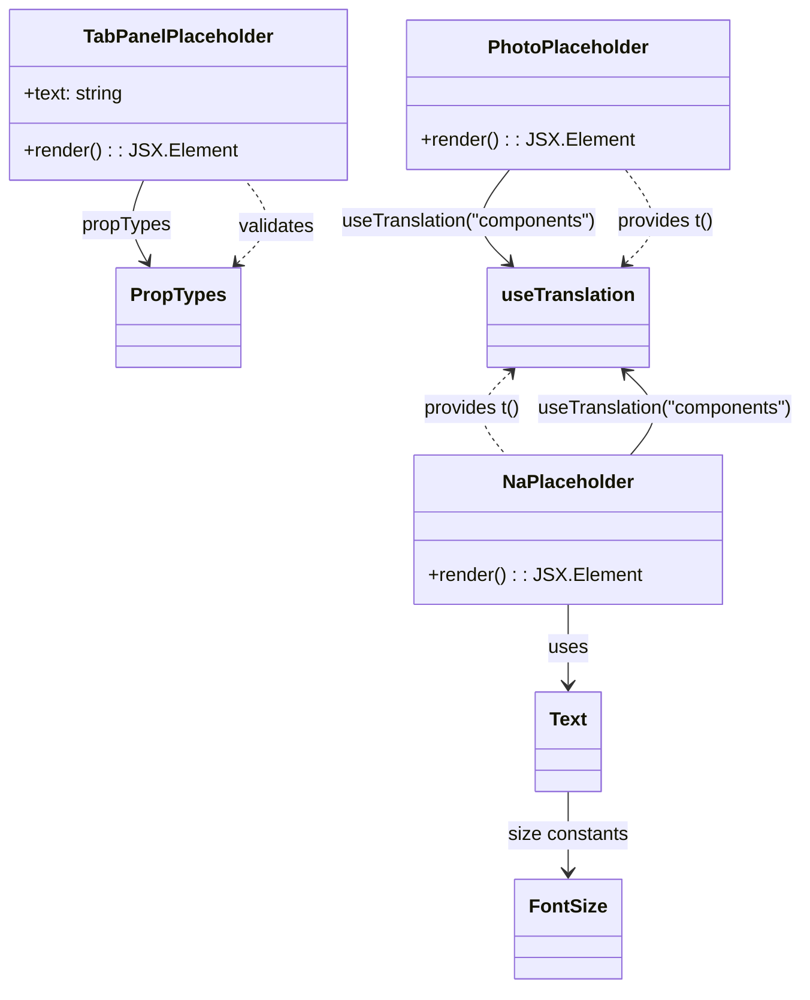

# Diagram: web/portal/src/components/no-data-placeholders.js

> Auto-generated by Obscura crawlers

## Mermaid

### SVG

<svg id="container" width="671.307861328125" xmlns="http://www.w3.org/2000/svg" class="classDiagram" height="834" viewBox="0 0 671.307861328125 834" role="graphics-document document" aria-roledescription="class"><g><defs><marker id="container_class-aggregationStart" class="marker aggregation class" refX="18" refY="7" markerWidth="190" markerHeight="240" orient="auto"><path d="M 18,7 L9,13 L1,7 L9,1 Z"></path></marker></defs><defs><marker id="container_class-aggregationEnd" class="marker aggregation class" refX="1" refY="7" markerWidth="20" markerHeight="28" orient="auto"><path d="M 18,7 L9,13 L1,7 L9,1 Z"></path></marker></defs><defs><marker id="container_class-extensionStart" class="marker extension class" refX="18" refY="7" markerWidth="190" markerHeight="240" orient="auto"><path d="M 1,7 L18,13 V 1 Z"></path></marker></defs><defs><marker id="container_class-extensionEnd" class="marker extension class" refX="1" refY="7" markerWidth="20" markerHeight="28" orient="auto"><path d="M 1,1 V 13 L18,7 Z"></path></marker></defs><defs><marker id="container_class-compositionStart" class="marker composition class" refX="18" refY="7" markerWidth="190" markerHeight="240" orient="auto"><path d="M 18,7 L9,13 L1,7 L9,1 Z"></path></marker></defs><defs><marker id="container_class-compositionEnd" class="marker composition class" refX="1" refY="7" markerWidth="20" markerHeight="28" orient="auto"><path d="M 18,7 L9,13 L1,7 L9,1 Z"></path></marker></defs><defs><marker id="container_class-dependencyStart" class="marker dependency class" refX="6" refY="7" markerWidth="190" markerHeight="240" orient="auto"><path d="M 5,7 L9,13 L1,7 L9,1 Z"></path></marker></defs><defs><marker id="container_class-dependencyEnd" class="marker dependency class" refX="13" refY="7" markerWidth="20" markerHeight="28" orient="auto"><path d="M 18,7 L9,13 L14,7 L9,1 Z"></path></marker></defs><defs><marker id="container_class-lollipopStart" class="marker lollipop class" refX="13" refY="7" markerWidth="190" markerHeight="240" orient="auto"><circle stroke="black" fill="transparent" cx="7" cy="7" r="6"></circle></marker></defs><defs><marker id="container_class-lollipopEnd" class="marker lollipop class" refX="1" refY="7" markerWidth="190" markerHeight="240" orient="auto"><circle stroke="black" fill="transparent" cx="7" cy="7" r="6"></circle></marker></defs><g class="root"><g class="clusters"></g><g class="edgePaths"><path d="M114.762,152L112.207,158.167C109.652,164.333,104.543,176.667,105.017,188.132C105.491,199.597,111.548,210.194,114.577,215.492L117.605,220.791" id="id_TabPanelPlaceholder_PropTypes_1" class="edge-thickness-normal edge-pattern-solid relation" style=";;;" data-edge="true" data-et="edge" data-id="id_TabPanelPlaceholder_PropTypes_1" data-points="W3sieCI6MTE0Ljc2MTg2MjA5ODYyMzg1LCJ5IjoxNTJ9LHsieCI6OTkuNDMzNTkzNzUsInkiOjE4OX0seyJ4IjoxMjAuNTgyNzIzNDk2ODM1NDQsInkiOjIyNn1d" marker-end="url(#container_class-dependencyEnd)"></path><path d="M420.602,143L414.58,150.667C408.557,158.333,396.512,173.667,396.438,186.822C396.364,199.977,408.262,210.954,414.211,216.443L420.16,221.931" id="id_PhotoPlaceholder_useTranslation_2" class="edge-thickness-normal edge-pattern-solid relation" style=";;;" data-edge="true" data-et="edge" data-id="id_PhotoPlaceholder_useTranslation_2" data-points="W3sieCI6NDIwLjYwMjExNzk3NTkxNzQ1LCJ5IjoxNDN9LHsieCI6Mzg0LjQ2Njc5Njg3NSwieSI6MTg5fSx7IngiOjQyNC41Njk2NDQ5NzYyNjU4LCJ5IjoyMjZ9XQ==" marker-end="url(#container_class-dependencyEnd)"></path><path d="M524.036,384L529.316,377.833C534.596,371.667,545.156,359.333,544.488,347.678C543.819,336.023,531.921,325.046,525.973,319.557L520.024,314.069" id="id_NaPlaceholder_useTranslation_3" class="edge-thickness-normal edge-pattern-solid relation" style=";;;" data-edge="true" data-et="edge" data-id="id_NaPlaceholder_useTranslation_3" data-points="W3sieCI6NTI0LjAzNTU0Njg3NSwieSI6Mzg0fSx7IngiOjU1NS43MTY3OTY4NzUsInkiOjM0N30seyJ4Ijo1MTUuNjEzOTQ4NzczNzM0MSwieSI6MzEwfV0=" marker-end="url(#container_class-dependencyEnd)"></path><path d="M470.092,510L470.092,516.167C470.092,522.333,470.092,534.667,470.092,546C470.092,557.333,470.092,567.667,470.092,572.833L470.092,578" id="id_NaPlaceholder_Text_4" class="edge-thickness-normal edge-pattern-solid relation" style=";;;" data-edge="true" data-et="edge" data-id="id_NaPlaceholder_Text_4" data-points="W3sieCI6NDcwLjA5MTc5Njg3NSwieSI6NTEwfSx7IngiOjQ3MC4wOTE3OTY4NzUsInkiOjU0N30seyJ4Ijo0NzAuMDkxNzk2ODc1LCJ5Ijo1ODR9XQ==" marker-end="url(#container_class-dependencyEnd)"></path><path d="M470.092,668L470.092,674.167C470.092,680.333,470.092,692.667,470.092,704C470.092,715.333,470.092,725.667,470.092,730.833L470.092,736" id="id_Text_FontSize_5" class="edge-thickness-normal edge-pattern-solid relation" style=";;;" data-edge="true" data-et="edge" data-id="id_Text_FontSize_5" data-points="W3sieCI6NDcwLjA5MTc5Njg3NSwieSI6NjY4fSx7IngiOjQ3MC4wOTE3OTY4NzUsInkiOjcwNX0seyJ4Ijo0NzAuMDkxNzk2ODc1LCJ5Ijo3NDJ9XQ==" marker-end="url(#container_class-dependencyEnd)"></path><path d="M189.965,221.715L195.31,216.263C200.655,210.81,211.346,199.905,212.31,188.286C213.274,176.667,204.511,164.333,200.129,158.167L195.748,152" id="id_PropTypes_TabPanelPlaceholder_6" class="edge-thickness-normal edge-pattern-dashed relation" style=";;;" data-edge="true" data-et="edge" data-id="id_PropTypes_TabPanelPlaceholder_6" data-points="W3sieCI6MTg1Ljc2NDMzOTM5ODczNDIsInkiOjIyNn0seyJ4IjoyMjIuMDM3MTA5Mzc1LCJ5IjoxODl9LHsieCI6MTk1Ljc0NzY3MDU4NDg2MjQsInkiOjE1Mn1d" marker-start="url(#container_class-dependencyStart)"></path><path d="M520.024,221.931L525.973,216.443C531.921,210.954,543.819,199.977,543.745,186.822C543.672,173.667,531.627,158.333,525.604,150.667L519.581,143" id="id_useTranslation_PhotoPlaceholder_7" class="edge-thickness-normal edge-pattern-dashed relation" style=";;;" data-edge="true" data-et="edge" data-id="id_useTranslation_PhotoPlaceholder_7" data-points="W3sieCI6NTE1LjYxMzk0ODc3MzczNDEsInkiOjIyNn0seyJ4Ijo1NTUuNzE2Nzk2ODc1LCJ5IjoxODl9LHsieCI6NTE5LjU4MTQ3NTc3NDA4MjYsInkiOjE0M31d" marker-start="url(#container_class-dependencyStart)"></path><path d="M420.16,314.069L414.211,319.557C408.262,325.046,396.364,336.023,395.696,347.678C395.027,359.333,405.588,371.667,410.868,377.833L416.148,384" id="id_useTranslation_NaPlaceholder_8" class="edge-thickness-normal edge-pattern-dashed relation" style=";;;" data-edge="true" data-et="edge" data-id="id_useTranslation_NaPlaceholder_8" data-points="W3sieCI6NDI0LjU2OTY0NDk3NjI2NTgsInkiOjMxMH0seyJ4IjozODQuNDY2Nzk2ODc1LCJ5IjozNDd9LHsieCI6NDE2LjE0ODA0Njg3NSwieSI6Mzg0fV0=" marker-start="url(#container_class-dependencyStart)"></path></g><g class="edgeLabels"><g class="edgeLabel" transform="translate(100.0709, 190.11495)"><g class="label" data-id="id_TabPanelPlaceholder_PropTypes_1" transform="translate(-37.625, -12)"><foreignObject width="75.25" height="24">

propTypes

</foreignObject></g></g><g class="edgeLabel" transform="translate(385.6812, 187.45407)"><g class="label" data-id="id_PhotoPlaceholder_useTranslation_2" transform="translate(-109.7421875, -12)"><foreignObject width="219.484375" height="24">

useTranslation("components")

</foreignObject></g></g><g class="edgeLabel" transform="translate(553.56566, 345.0153)"><g class="label" data-id="id_NaPlaceholder_useTranslation_3" transform="translate(-109.7421875, -12)"><foreignObject width="219.484375" height="24">

useTranslation("components")

</foreignObject></g></g><g class="edgeLabel" transform="translate(470.091796875, 547)"><g class="label" data-id="id_NaPlaceholder_Text_4" transform="translate(-16.4921875, -12)"><foreignObject width="32.984375" height="24">

uses

</foreignObject></g></g><g class="edgeLabel" transform="translate(470.091796875, 705)"><g class="label" data-id="id_Text_FontSize_5" transform="translate(-51.171875, -12)"><foreignObject width="102.34375" height="24">

size constants

</foreignObject></g></g><g class="edgeLabel" transform="translate(222.037109375, 189)"><g class="label" data-id="id_PropTypes_TabPanelPlaceholder_6" transform="translate(-32.6875, -12)"><foreignObject width="65.375" height="24">

validates

</foreignObject></g></g><g class="edgeLabel" transform="translate(554.50239, 187.45407)"><g class="label" data-id="id_useTranslation_PhotoPlaceholder_7" transform="translate(-41.5078125, -12)"><foreignObject width="83.015625" height="24">

provides t()

</foreignObject></g></g><g class="edgeLabel" transform="translate(384.466796875, 347)"><g class="label" data-id="id_useTranslation_NaPlaceholder_8" transform="translate(-41.5078125, -12)"><foreignObject width="83.015625" height="24">

provides t()

</foreignObject></g></g></g><g class="nodes"><g class="node default" id="classId-TabPanelPlaceholder-0" transform="translate(144.58984375, 80)"><g class="basic label-container"><path d="M-136.58984375 -72 L136.58984375 -72 L136.58984375 72 L-136.58984375 72" stroke="none" stroke-width="0" fill="#ECECFF" style=""></path><path d="M-136.58984375 -72 C-78.96215294439266 -72, -21.334462138785312 -72, 136.58984375 -72 M-136.58984375 -72 C-73.81952539673094 -72, -11.049207043461877 -72, 136.58984375 -72 M136.58984375 -72 C136.58984375 -39.952713321254166, 136.58984375 -7.905426642508331, 136.58984375 72 M136.58984375 -72 C136.58984375 -20.02927372032407, 136.58984375 31.94145255935186, 136.58984375 72 M136.58984375 72 C46.56625693521981 72, -43.457329879560376 72, -136.58984375 72 M136.58984375 72 C75.18614265896713 72, 13.78244156793427 72, -136.58984375 72 M-136.58984375 72 C-136.58984375 15.967067918273997, -136.58984375 -40.065864163452005, -136.58984375 -72 M-136.58984375 72 C-136.58984375 34.55852895646386, -136.58984375 -2.88294208707228, -136.58984375 -72" stroke="#9370DB" stroke-width="1.3" fill="none" stroke-dasharray="0 0" style=""></path></g><g class="annotation-group text" transform="translate(0, -48)"></g><g class="label-group text" transform="translate(-76.8359375, -48)"><g class="label" style="font-weight: bolder" transform="translate(0,-12)"><foreignObject width="153.671875" height="24">

TabPanelPlaceholder

</foreignObject></g></g><g class="members-group text" transform="translate(-124.58984375, 0)"><g class="label" style="" transform="translate(0,-12)"><foreignObject width="85.34375" height="24">

+text: string

</foreignObject></g></g><g class="methods-group text" transform="translate(-124.58984375, 48)"><g class="label" style="" transform="translate(0,-12)"><foreignObject width="172.34375" height="24">

+render() : : JSX.Element

</foreignObject></g></g><g class="divider" style=""><path d="M-136.58984375 -24 C-49.19436734356374 -24, 38.20110906287252 -24, 136.58984375 -24 M-136.58984375 -24 C-58.119508616919504 -24, 20.350826516160993 -24, 136.58984375 -24" stroke="#9370DB" stroke-width="1.3" fill="none" stroke-dasharray="0 0" style=""></path></g><g class="divider" style=""><path d="M-136.58984375 24 C-45.44879033352058 24, 45.692263082958846 24, 136.58984375 24 M-136.58984375 24 C-70.68219096593903 24, -4.774538181878057 24, 136.58984375 24" stroke="#9370DB" stroke-width="1.3" fill="none" stroke-dasharray="0 0" style=""></path></g></g><g class="node default" id="classId-PhotoPlaceholder-1" transform="translate(470.091796875, 80)"><g class="basic label-container"><path d="M-130.734375 -63 L130.734375 -63 L130.734375 63 L-130.734375 63" stroke="none" stroke-width="0" fill="#ECECFF" style=""></path><path d="M-130.734375 -63 C-28.173097545861594 -63, 74.38817990827681 -63, 130.734375 -63 M-130.734375 -63 C-29.249635727684307 -63, 72.23510354463139 -63, 130.734375 -63 M130.734375 -63 C130.734375 -25.654722623019737, 130.734375 11.690554753960527, 130.734375 63 M130.734375 -63 C130.734375 -18.646540610613854, 130.734375 25.70691877877229, 130.734375 63 M130.734375 63 C48.201691374428535 63, -34.33099225114293 63, -130.734375 63 M130.734375 63 C39.210615906122996 63, -52.31314318775401 63, -130.734375 63 M-130.734375 63 C-130.734375 24.53508696385056, -130.734375 -13.92982607229888, -130.734375 -63 M-130.734375 63 C-130.734375 21.865730752771604, -130.734375 -19.26853849445679, -130.734375 -63" stroke="#9370DB" stroke-width="1.3" fill="none" stroke-dasharray="0 0" style=""></path></g><g class="annotation-group text" transform="translate(0, -39)"></g><g class="label-group text" transform="translate(-65.125, -39)"><g class="label" style="font-weight: bolder" transform="translate(0,-12)"><foreignObject width="130.25" height="24">

PhotoPlaceholder

</foreignObject></g></g><g class="members-group text" transform="translate(-118.734375, 9)"></g><g class="methods-group text" transform="translate(-118.734375, 39)"><g class="label" style="" transform="translate(0,-12)"><foreignObject width="172.34375" height="24">

+render() : : JSX.Element

</foreignObject></g></g><g class="divider" style=""><path d="M-130.734375 -15 C-39.75216608272537 -15, 51.230042834549266 -15, 130.734375 -15 M-130.734375 -15 C-39.6042985859397 -15, 51.525777828120596 -15, 130.734375 -15" stroke="#9370DB" stroke-width="1.3" fill="none" stroke-dasharray="0 0" style=""></path></g><g class="divider" style=""><path d="M-130.734375 9 C-55.4392715708928 9, 19.8558318582144 9, 130.734375 9 M-130.734375 9 C-49.40073712137114 9, 31.932900757257727 9, 130.734375 9" stroke="#9370DB" stroke-width="1.3" fill="none" stroke-dasharray="0 0" style=""></path></g></g><g class="node default" id="classId-NaPlaceholder-2" transform="translate(470.091796875, 447)"><g class="basic label-container"><path d="M-124.8046875 -63 L124.8046875 -63 L124.8046875 63 L-124.8046875 63" stroke="none" stroke-width="0" fill="#ECECFF" style=""></path><path d="M-124.8046875 -63 C-63.7422312906648 -63, -2.679775081329595 -63, 124.8046875 -63 M-124.8046875 -63 C-40.972792597438925 -63, 42.85910230512215 -63, 124.8046875 -63 M124.8046875 -63 C124.8046875 -18.275205816843318, 124.8046875 26.449588366313364, 124.8046875 63 M124.8046875 -63 C124.8046875 -37.66214822325917, 124.8046875 -12.324296446518346, 124.8046875 63 M124.8046875 63 C32.32245869515421 63, -60.15977010969158 63, -124.8046875 63 M124.8046875 63 C27.707890392951597 63, -69.3889067140968 63, -124.8046875 63 M-124.8046875 63 C-124.8046875 16.23835094397024, -124.8046875 -30.52329811205952, -124.8046875 -63 M-124.8046875 63 C-124.8046875 16.700561703450212, -124.8046875 -29.598876593099575, -124.8046875 -63" stroke="#9370DB" stroke-width="1.3" fill="none" stroke-dasharray="0 0" style=""></path></g><g class="annotation-group text" transform="translate(0, -39)"></g><g class="label-group text" transform="translate(-53.265625, -39)"><g class="label" style="font-weight: bolder" transform="translate(0,-12)"><foreignObject width="106.53125" height="24">

NaPlaceholder

</foreignObject></g></g><g class="members-group text" transform="translate(-112.8046875, 9)"></g><g class="methods-group text" transform="translate(-112.8046875, 39)"><g class="label" style="" transform="translate(0,-12)"><foreignObject width="172.34375" height="24">

+render() : : JSX.Element

</foreignObject></g></g><g class="divider" style=""><path d="M-124.8046875 -15 C-37.31880643414988 -15, 50.167074631700245 -15, 124.8046875 -15 M-124.8046875 -15 C-52.85757565226261 -15, 19.08953619547478 -15, 124.8046875 -15" stroke="#9370DB" stroke-width="1.3" fill="none" stroke-dasharray="0 0" style=""></path></g><g class="divider" style=""><path d="M-124.8046875 9 C-29.44338600324157 9, 65.91791549351686 9, 124.8046875 9 M-124.8046875 9 C-58.94704827255585 9, 6.910590954888306 9, 124.8046875 9" stroke="#9370DB" stroke-width="1.3" fill="none" stroke-dasharray="0 0" style=""></path></g></g><g class="node default" id="classId-PropTypes-3" transform="translate(144.58984375, 268)"><g class="basic label-container"><path d="M-50.2578125 -42 L50.2578125 -42 L50.2578125 42 L-50.2578125 42" stroke="none" stroke-width="0" fill="#ECECFF" style=""></path><path d="M-50.2578125 -42 C-20.759183473197893 -42, 8.739445553604213 -42, 50.2578125 -42 M-50.2578125 -42 C-10.413607214923566 -42, 29.430598070152868 -42, 50.2578125 -42 M50.2578125 -42 C50.2578125 -22.37737219374245, 50.2578125 -2.754744387484898, 50.2578125 42 M50.2578125 -42 C50.2578125 -14.531057239530249, 50.2578125 12.937885520939503, 50.2578125 42 M50.2578125 42 C18.103337666508743 42, -14.051137166982514 42, -50.2578125 42 M50.2578125 42 C13.012128484807903 42, -24.233555530384194 42, -50.2578125 42 M-50.2578125 42 C-50.2578125 23.662636700043034, -50.2578125 5.325273400086068, -50.2578125 -42 M-50.2578125 42 C-50.2578125 23.04500416676767, -50.2578125 4.090008333535337, -50.2578125 -42" stroke="#9370DB" stroke-width="1.3" fill="none" stroke-dasharray="0 0" style=""></path></g><g class="annotation-group text" transform="translate(0, -18)"></g><g class="label-group text" transform="translate(-38.2578125, -18)"><g class="label" style="font-weight: bolder" transform="translate(0,-12)"><foreignObject width="76.515625" height="24">

PropTypes

</foreignObject></g></g><g class="members-group text" transform="translate(-38.2578125, 30)"></g><g class="methods-group text" transform="translate(-38.2578125, 60)"></g><g class="divider" style=""><path d="M-50.2578125 6 C-22.82271117949856 6, 4.6123901410028765 6, 50.2578125 6 M-50.2578125 6 C-25.993676141246432 6, -1.7295397824928642 6, 50.2578125 6" stroke="#9370DB" stroke-width="1.3" fill="none" stroke-dasharray="0 0" style=""></path></g><g class="divider" style=""><path d="M-50.2578125 24 C-21.261511925684655 24, 7.7347886486306905 24, 50.2578125 24 M-50.2578125 24 C-13.938497244029584 24, 22.380818011940832 24, 50.2578125 24" stroke="#9370DB" stroke-width="1.3" fill="none" stroke-dasharray="0 0" style=""></path></g></g><g class="node default" id="classId-useTranslation-4" transform="translate(470.091796875, 268)"><g class="basic label-container"><path d="M-66.0859375 -42 L66.0859375 -42 L66.0859375 42 L-66.0859375 42" stroke="none" stroke-width="0" fill="#ECECFF" style=""></path><path d="M-66.0859375 -42 C-34.72151579208449 -42, -3.3570940841689705 -42, 66.0859375 -42 M-66.0859375 -42 C-36.549676311000226 -42, -7.01341512200046 -42, 66.0859375 -42 M66.0859375 -42 C66.0859375 -22.913930707325058, 66.0859375 -3.8278614146501155, 66.0859375 42 M66.0859375 -42 C66.0859375 -15.961156514150819, 66.0859375 10.077686971698363, 66.0859375 42 M66.0859375 42 C25.766917005416296 42, -14.552103489167408 42, -66.0859375 42 M66.0859375 42 C21.069286638558104 42, -23.94736422288379 42, -66.0859375 42 M-66.0859375 42 C-66.0859375 14.09549775668058, -66.0859375 -13.809004486638841, -66.0859375 -42 M-66.0859375 42 C-66.0859375 23.566325094269704, -66.0859375 5.132650188539408, -66.0859375 -42" stroke="#9370DB" stroke-width="1.3" fill="none" stroke-dasharray="0 0" style=""></path></g><g class="annotation-group text" transform="translate(0, -18)"></g><g class="label-group text" transform="translate(-54.0859375, -18)"><g class="label" style="font-weight: bolder" transform="translate(0,-12)"><foreignObject width="108.171875" height="24">

useTranslation

</foreignObject></g></g><g class="members-group text" transform="translate(-54.0859375, 30)"></g><g class="methods-group text" transform="translate(-54.0859375, 60)"></g><g class="divider" style=""><path d="M-66.0859375 6 C-28.89678658131796 6, 8.292364337364077 6, 66.0859375 6 M-66.0859375 6 C-35.81754941526894 6, -5.549161330537878 6, 66.0859375 6" stroke="#9370DB" stroke-width="1.3" fill="none" stroke-dasharray="0 0" style=""></path></g><g class="divider" style=""><path d="M-66.0859375 24 C-26.18065763414328 24, 13.72462223171344 24, 66.0859375 24 M-66.0859375 24 C-37.61634268512085 24, -9.146747870241697 24, 66.0859375 24" stroke="#9370DB" stroke-width="1.3" fill="none" stroke-dasharray="0 0" style=""></path></g></g><g class="node default" id="classId-Text-5" transform="translate(470.091796875, 626)"><g class="basic label-container"><path d="M-27.3828125 -42 L27.3828125 -42 L27.3828125 42 L-27.3828125 42" stroke="none" stroke-width="0" fill="#ECECFF" style=""></path><path d="M-27.3828125 -42 C-7.424186400572182 -42, 12.534439698855635 -42, 27.3828125 -42 M-27.3828125 -42 C-8.975434905703075 -42, 9.43194268859385 -42, 27.3828125 -42 M27.3828125 -42 C27.3828125 -15.370051258570715, 27.3828125 11.25989748285857, 27.3828125 42 M27.3828125 -42 C27.3828125 -23.63469613828123, 27.3828125 -5.2693922765624635, 27.3828125 42 M27.3828125 42 C6.273226734886844 42, -14.836359030226312 42, -27.3828125 42 M27.3828125 42 C9.798489531886744 42, -7.785833436226511 42, -27.3828125 42 M-27.3828125 42 C-27.3828125 21.243258362603264, -27.3828125 0.48651672520652767, -27.3828125 -42 M-27.3828125 42 C-27.3828125 19.323594377755946, -27.3828125 -3.352811244488109, -27.3828125 -42" stroke="#9370DB" stroke-width="1.3" fill="none" stroke-dasharray="0 0" style=""></path></g><g class="annotation-group text" transform="translate(0, -18)"></g><g class="label-group text" transform="translate(-15.3828125, -18)"><g class="label" style="font-weight: bolder" transform="translate(0,-12)"><foreignObject width="30.765625" height="24">

Text

</foreignObject></g></g><g class="members-group text" transform="translate(-15.3828125, 30)"></g><g class="methods-group text" transform="translate(-15.3828125, 60)"></g><g class="divider" style=""><path d="M-27.3828125 6 C-15.657864656759761 6, -3.9329168135195225 6, 27.3828125 6 M-27.3828125 6 C-13.644081348499185 6, 0.09464980300163006 6, 27.3828125 6" stroke="#9370DB" stroke-width="1.3" fill="none" stroke-dasharray="0 0" style=""></path></g><g class="divider" style=""><path d="M-27.3828125 24 C-7.2535989507558085 24, 12.875614598488383 24, 27.3828125 24 M-27.3828125 24 C-15.713608173087065 24, -4.044403846174131 24, 27.3828125 24" stroke="#9370DB" stroke-width="1.3" fill="none" stroke-dasharray="0 0" style=""></path></g></g><g class="node default" id="classId-FontSize-6" transform="translate(470.091796875, 784)"><g class="basic label-container"><path d="M-42.84375 -42 L42.84375 -42 L42.84375 42 L-42.84375 42" stroke="none" stroke-width="0" fill="#ECECFF" style=""></path><path d="M-42.84375 -42 C-21.728583130861516 -42, -0.6134162617230317 -42, 42.84375 -42 M-42.84375 -42 C-18.790204626189027 -42, 5.263340747621946 -42, 42.84375 -42 M42.84375 -42 C42.84375 -12.04690032153923, 42.84375 17.90619935692154, 42.84375 42 M42.84375 -42 C42.84375 -9.380874880221882, 42.84375 23.238250239556237, 42.84375 42 M42.84375 42 C20.70939578130003 42, -1.4249584373999369 42, -42.84375 42 M42.84375 42 C14.61169030434586 42, -13.62036939130828 42, -42.84375 42 M-42.84375 42 C-42.84375 14.351149446723262, -42.84375 -13.297701106553475, -42.84375 -42 M-42.84375 42 C-42.84375 13.155189067606443, -42.84375 -15.689621864787114, -42.84375 -42" stroke="#9370DB" stroke-width="1.3" fill="none" stroke-dasharray="0 0" style=""></path></g><g class="annotation-group text" transform="translate(0, -18)"></g><g class="label-group text" transform="translate(-30.84375, -18)"><g class="label" style="font-weight: bolder" transform="translate(0,-12)"><foreignObject width="61.6875" height="24">

FontSize

</foreignObject></g></g><g class="members-group text" transform="translate(-30.84375, 30)"></g><g class="methods-group text" transform="translate(-30.84375, 60)"></g><g class="divider" style=""><path d="M-42.84375 6 C-11.489816776414386 6, 19.864116447171227 6, 42.84375 6 M-42.84375 6 C-17.379379245200774 6, 8.084991509598453 6, 42.84375 6" stroke="#9370DB" stroke-width="1.3" fill="none" stroke-dasharray="0 0" style=""></path></g><g class="divider" style=""><path d="M-42.84375 24 C-13.097218717868909 24, 16.649312564262182 24, 42.84375 24 M-42.84375 24 C-10.764284445966396 24, 21.315181108067208 24, 42.84375 24" stroke="#9370DB" stroke-width="1.3" fill="none" stroke-dasharray="0 0" style=""></path></g></g></g></g></g></svg>
