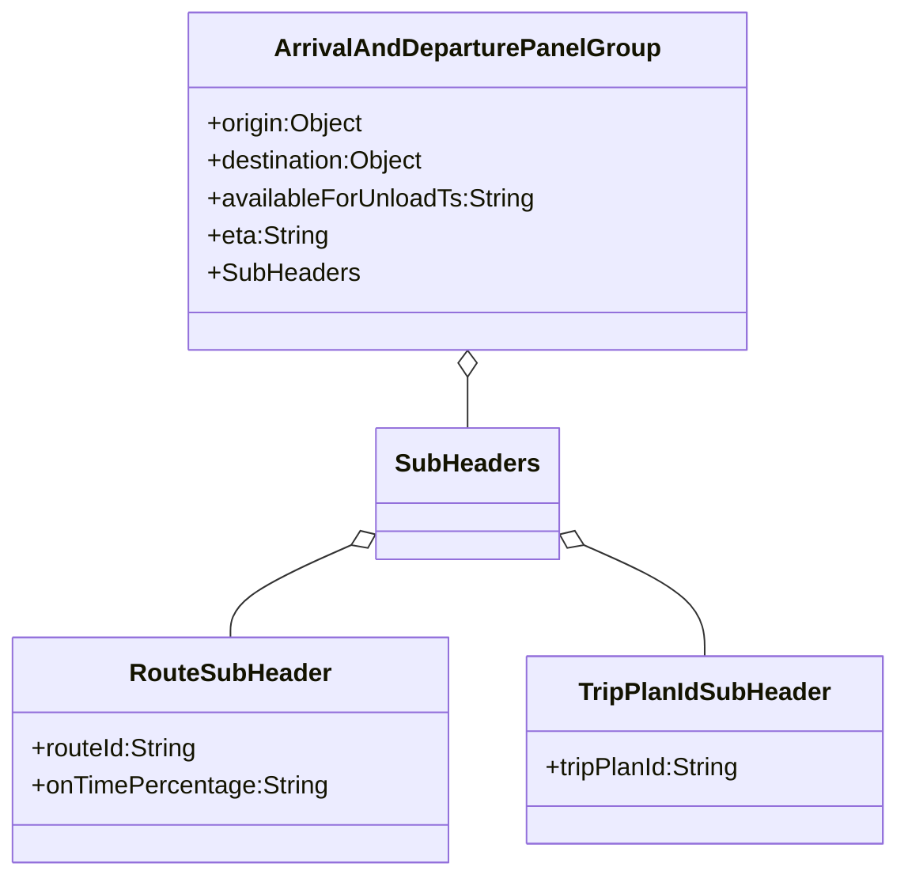

# Diagram: web/portal/src/components/organisms/ArrivalAndDeparturePanelGroup.organism.stories.js


> Auto-generated by Obscura crawlers

## Diagram 1



### SVG

<svg id="container" width="568.765625" xmlns="http://www.w3.org/2000/svg" class="classDiagram" height="560" viewBox="0 0 568.765625 560" role="graphics-document document" aria-roledescription="class"><style>#container{font-family:"trebuchet ms",verdana,arial,sans-serif;font-size:16px;fill:#333;}@keyframes edge-animation-frame{from{stroke-dashoffset:0;}}@keyframes dash{to{stroke-dashoffset:0;}}#container .edge-animation-slow{stroke-dasharray:9,5!important;stroke-dashoffset:900;animation:dash 50s linear infinite;stroke-linecap:round;}#container .edge-animation-fast{stroke-dasharray:9,5!important;stroke-dashoffset:900;animation:dash 20s linear infinite;stroke-linecap:round;}#container .error-icon{fill:#552222;}#container .error-text{fill:#552222;stroke:#552222;}#container .edge-thickness-normal{stroke-width:1px;}#container .edge-thickness-thick{stroke-width:3.5px;}#container .edge-pattern-solid{stroke-dasharray:0;}#container .edge-thickness-invisible{stroke-width:0;fill:none;}#container .edge-pattern-dashed{stroke-dasharray:3;}#container .edge-pattern-dotted{stroke-dasharray:2;}#container .marker{fill:#333333;stroke:#333333;}#container .marker.cross{stroke:#333333;}#container svg{font-family:"trebuchet ms",verdana,arial,sans-serif;font-size:16px;}#container p{margin:0;}#container g.classGroup text{fill:#9370DB;stroke:none;font-family:"trebuchet ms",verdana,arial,sans-serif;font-size:10px;}#container g.classGroup text .title{font-weight:bolder;}#container .nodeLabel,#container .edgeLabel{color:#131300;}#container .edgeLabel .label rect{fill:#ECECFF;}#container .label text{fill:#131300;}#container .labelBkg{background:#ECECFF;}#container .edgeLabel .label span{background:#ECECFF;}#container .classTitle{font-weight:bolder;}#container .node rect,#container .node circle,#container .node ellipse,#container .node polygon,#container .node path{fill:#ECECFF;stroke:#9370DB;stroke-width:1px;}#container .divider{stroke:#9370DB;stroke-width:1;}#container g.clickable{cursor:pointer;}#container g.classGroup rect{fill:#ECECFF;stroke:#9370DB;}#container g.classGroup line{stroke:#9370DB;stroke-width:1;}#container .classLabel .box{stroke:none;stroke-width:0;fill:#ECECFF;opacity:0.5;}#container .classLabel .label{fill:#9370DB;font-size:10px;}#container .relation{stroke:#333333;stroke-width:1;fill:none;}#container .dashed-line{stroke-dasharray:3;}#container .dotted-line{stroke-dasharray:1 2;}#container #compositionStart,#container .composition{fill:#333333!important;stroke:#333333!important;stroke-width:1;}#container #compositionEnd,#container .composition{fill:#333333!important;stroke:#333333!important;stroke-width:1;}#container #dependencyStart,#container .dependency{fill:#333333!important;stroke:#333333!important;stroke-width:1;}#container #dependencyStart,#container .dependency{fill:#333333!important;stroke:#333333!important;stroke-width:1;}#container #extensionStart,#container .extension{fill:transparent!important;stroke:#333333!important;stroke-width:1;}#container #extensionEnd,#container .extension{fill:transparent!important;stroke:#333333!important;stroke-width:1;}#container #aggregationStart,#container .aggregation{fill:transparent!important;stroke:#333333!important;stroke-width:1;}#container #aggregationEnd,#container .aggregation{fill:transparent!important;stroke:#333333!important;stroke-width:1;}#container #lollipopStart,#container .lollipop{fill:#ECECFF!important;stroke:#333333!important;stroke-width:1;}#container #lollipopEnd,#container .lollipop{fill:#ECECFF!important;stroke:#333333!important;stroke-width:1;}#container .edgeTerminals{font-size:11px;line-height:initial;}#container .classTitleText{text-anchor:middle;font-size:18px;fill:#333;}#container .label-icon{display:inline-block;height:1em;overflow:visible;vertical-align:-0.125em;}#container .node .label-icon path{fill:currentColor;stroke:revert;stroke-width:revert;}#container :root{--mermaid-font-family:"trebuchet ms",verdana,arial,sans-serif;}</style><g><defs><marker id="container_class-aggregationStart" class="marker aggregation class" refX="18" refY="7" markerWidth="190" markerHeight="240" orient="auto"><path d="M 18,7 L9,13 L1,7 L9,1 Z"></path></marker></defs><defs><marker id="container_class-aggregationEnd" class="marker aggregation class" refX="1" refY="7" markerWidth="20" markerHeight="28" orient="auto"><path d="M 18,7 L9,13 L1,7 L9,1 Z"></path></marker></defs><defs><marker id="container_class-extensionStart" class="marker extension class" refX="18" refY="7" markerWidth="190" markerHeight="240" orient="auto"><path d="M 1,7 L18,13 V 1 Z"></path></marker></defs><defs><marker id="container_class-extensionEnd" class="marker extension class" refX="1" refY="7" markerWidth="20" markerHeight="28" orient="auto"><path d="M 1,1 V 13 L18,7 Z"></path></marker></defs><defs><marker id="container_class-compositionStart" class="marker composition class" refX="18" refY="7" markerWidth="190" markerHeight="240" orient="auto"><path d="M 18,7 L9,13 L1,7 L9,1 Z"></path></marker></defs><defs><marker id="container_class-compositionEnd" class="marker composition class" refX="1" refY="7" markerWidth="20" markerHeight="28" orient="auto"><path d="M 18,7 L9,13 L1,7 L9,1 Z"></path></marker></defs><defs><marker id="container_class-dependencyStart" class="marker dependency class" refX="6" refY="7" markerWidth="190" markerHeight="240" orient="auto"><path d="M 5,7 L9,13 L1,7 L9,1 Z"></path></marker></defs><defs><marker id="container_class-dependencyEnd" class="marker dependency class" refX="13" refY="7" markerWidth="20" markerHeight="28" orient="auto"><path d="M 18,7 L9,13 L14,7 L9,1 Z"></path></marker></defs><defs><marker id="container_class-lollipopStart" class="marker lollipop class" refX="13" refY="7" markerWidth="190" markerHeight="240" orient="auto"><circle stroke="black" fill="transparent" cx="7" cy="7" r="6"></circle></marker></defs><defs><marker id="container_class-lollipopEnd" class="marker lollipop class" refX="1" refY="7" markerWidth="190" markerHeight="240" orient="auto"><circle stroke="black" fill="transparent" cx="7" cy="7" r="6"></circle></marker></defs><g class="root"><g class="clusters"></g><g class="edgePaths"><path d="M295.754,241.25L295.754,242.542C295.754,243.833,295.754,246.417,295.754,251.875C295.754,257.333,295.754,265.667,295.754,269.833L295.754,274" id="id_ArrivalAndDeparturePanelGroup_SubHeaders_1" class="edge-thickness-normal edge-pattern-solid relation" style=";;;" data-edge="true" data-et="edge" data-id="id_ArrivalAndDeparturePanelGroup_SubHeaders_1" data-points="W3sieCI6Mjk1Ljc1MzkwNjI1LCJ5IjoyMjR9LHsieCI6Mjk1Ljc1MzkwNjI1LCJ5IjoyNDl9LHsieCI6Mjk1Ljc1MzkwNjI1LCJ5IjoyNzR9XQ==" marker-start="url(#container_class-aggregationStart)"></path><path d="M223.82,347.983L210.694,353.819C197.567,359.655,171.315,371.328,158.189,381.331C145.063,391.333,145.063,399.667,145.063,403.833L145.063,408" id="id_SubHeaders_RouteSubHeader_2" class="edge-thickness-normal edge-pattern-solid relation" style=";;;" data-edge="true" data-et="edge" data-id="id_SubHeaders_RouteSubHeader_2" data-points="W3sieCI6MjM5LjU4MjAzMTI1LCJ5IjozNDAuOTc0OTg1MDk0NzQ1Nn0seyJ4IjoxNDUuMDYyNSwieSI6MzgzfSx7IngiOjE0NS4wNjI1LCJ5Ijo0MDh9XQ==" marker-start="url(#container_class-aggregationStart)"></path><path d="M367.688,347.983L380.814,353.819C393.94,359.655,420.193,371.328,433.319,383.331C446.445,395.333,446.445,407.667,446.445,413.833L446.445,420" id="id_SubHeaders_TripPlanIdSubHeader_3" class="edge-thickness-normal edge-pattern-solid relation" style=";;;" data-edge="true" data-et="edge" data-id="id_SubHeaders_TripPlanIdSubHeader_3" data-points="W3sieCI6MzUxLjkyNTc4MTI1LCJ5IjozNDAuOTc0OTg1MDk0NzQ1Nn0seyJ4Ijo0NDYuNDQ1MzEyNSwieSI6MzgzfSx7IngiOjQ0Ni40NDUzMTI1LCJ5Ijo0MjB9XQ==" marker-start="url(#container_class-aggregationStart)"></path></g><g class="edgeLabels"><g class="edgeLabel"><g class="label" data-id="id_ArrivalAndDeparturePanelGroup_SubHeaders_1" transform="translate(0, 0)"><foreignObject width="0" height="0"><div xmlns="http://www.w3.org/1999/xhtml" class="labelBkg" style="display: table-cell; white-space: nowrap; line-height: 1.5; max-width: 200px; text-align: center;"><span class="edgeLabel"></span></div></foreignObject></g></g><g class="edgeLabel"><g class="label" data-id="id_SubHeaders_RouteSubHeader_2" transform="translate(0, 0)"><foreignObject width="0" height="0"><div xmlns="http://www.w3.org/1999/xhtml" class="labelBkg" style="display: table-cell; white-space: nowrap; line-height: 1.5; max-width: 200px; text-align: center;"><span class="edgeLabel"></span></div></foreignObject></g></g><g class="edgeLabel"><g class="label" data-id="id_SubHeaders_TripPlanIdSubHeader_3" transform="translate(0, 0)"><foreignObject width="0" height="0"><div xmlns="http://www.w3.org/1999/xhtml" class="labelBkg" style="display: table-cell; white-space: nowrap; line-height: 1.5; max-width: 200px; text-align: center;"><span class="edgeLabel"></span></div></foreignObject></g></g></g><g class="nodes"><g class="node default" id="classId-ArrivalAndDeparturePanelGroup-0" transform="translate(295.75390625, 116)"><g class="basic label-container"><path d="M-175.56640625 -108 L175.56640625 -108 L175.56640625 108 L-175.56640625 108" stroke="none" stroke-width="0" fill="#ECECFF" style=""></path><path d="M-175.56640625 -108 C-87.67041137054207 -108, 0.22558350891586088 -108, 175.56640625 -108 M-175.56640625 -108 C-53.755309306272565 -108, 68.05578763745487 -108, 175.56640625 -108 M175.56640625 -108 C175.56640625 -61.07184177290492, 175.56640625 -14.143683545809836, 175.56640625 108 M175.56640625 -108 C175.56640625 -33.53187326879154, 175.56640625 40.936253462416914, 175.56640625 108 M175.56640625 108 C88.38488061719607 108, 1.2033549843921492 108, -175.56640625 108 M175.56640625 108 C101.77716174987276 108, 27.98791724974552 108, -175.56640625 108 M-175.56640625 108 C-175.56640625 29.393105376710196, -175.56640625 -49.21378924657961, -175.56640625 -108 M-175.56640625 108 C-175.56640625 46.89700032693201, -175.56640625 -14.205999346135982, -175.56640625 -108" stroke="#9370DB" stroke-width="1.3" fill="none" stroke-dasharray="0 0" style=""></path></g><g class="annotation-group text" transform="translate(0, -84)"></g><g class="label-group text" transform="translate(-117.4296875, -84)"><g class="label" style="font-weight: bolder" transform="translate(0,-12)"><foreignObject width="234.859375" height="24"><div xmlns="http://www.w3.org/1999/xhtml" style="display: table-cell; white-space: nowrap; line-height: 1.5; max-width: 282px; text-align: center;"><span class="nodeLabel markdown-node-label" style=""><p>ArrivalAndDeparturePanelGroup</p></span></div></foreignObject></g></g><g class="members-group text" transform="translate(-163.56640625, -36)"><g class="label" style="" transform="translate(0,-12)"><foreignObject width="101.265625" height="24"><div xmlns="http://www.w3.org/1999/xhtml" style="display: table-cell; white-space: nowrap; line-height: 1.5; max-width: 159px; text-align: center;"><span class="nodeLabel markdown-node-label" style=""><p>+origin:Object</p></span></div></foreignObject></g><g class="label" style="" transform="translate(0,12)"><foreignObject width="142.171875" height="24"><div xmlns="http://www.w3.org/1999/xhtml" style="display: table-cell; white-space: nowrap; line-height: 1.5; max-width: 200px; text-align: center;"><span class="nodeLabel markdown-node-label" style=""><p>+destination:Object</p></span></div></foreignObject></g><g class="label" style="" transform="translate(0,36)"><foreignObject width="209.703125" height="24"><div xmlns="http://www.w3.org/1999/xhtml" style="display: table-cell; white-space: nowrap; line-height: 1.5; max-width: 268px; text-align: center;"><span class="nodeLabel markdown-node-label" style=""><p>+availableForUnloadTs:String</p></span></div></foreignObject></g><g class="label" style="" transform="translate(0,60)"><foreignObject width="77.796875" height="24"><div xmlns="http://www.w3.org/1999/xhtml" style="display: table-cell; white-space: nowrap; line-height: 1.5; max-width: 136px; text-align: center;"><span class="nodeLabel markdown-node-label" style=""><p>+eta:String</p></span></div></foreignObject></g><g class="label" style="" transform="translate(0,84)"><foreignObject width="94.734375" height="24"><div xmlns="http://www.w3.org/1999/xhtml" style="display: table-cell; white-space: nowrap; line-height: 1.5; max-width: 152px; text-align: center;"><span class="nodeLabel markdown-node-label" style=""><p>+SubHeaders</p></span></div></foreignObject></g></g><g class="methods-group text" transform="translate(-163.56640625, 108)"></g><g class="divider" style=""><path d="M-175.56640625 -60 C-104.3860408051863 -60, -33.205675360372595 -60, 175.56640625 -60 M-175.56640625 -60 C-54.47382025047142 -60, 66.61876574905716 -60, 175.56640625 -60" stroke="#9370DB" stroke-width="1.3" fill="none" stroke-dasharray="0 0" style=""></path></g><g class="divider" style=""><path d="M-175.56640625 84 C-93.15125788174281 84, -10.736109513485616 84, 175.56640625 84 M-175.56640625 84 C-87.18792376238055 84, 1.1905587252389012 84, 175.56640625 84" stroke="#9370DB" stroke-width="1.3" fill="none" stroke-dasharray="0 0" style=""></path></g></g><g class="node default" id="classId-SubHeaders-1" transform="translate(295.75390625, 316)"><g class="basic label-container"><path d="M-56.171875 -42 L56.171875 -42 L56.171875 42 L-56.171875 42" stroke="none" stroke-width="0" fill="#ECECFF" style=""></path><path d="M-56.171875 -42 C-31.449008014518935 -42, -6.726141029037869 -42, 56.171875 -42 M-56.171875 -42 C-32.14787582800328 -42, -8.123876656006566 -42, 56.171875 -42 M56.171875 -42 C56.171875 -24.52460623126107, 56.171875 -7.049212462522142, 56.171875 42 M56.171875 -42 C56.171875 -12.296768330405957, 56.171875 17.406463339188086, 56.171875 42 M56.171875 42 C29.015280659011356 42, 1.8586863180227127 42, -56.171875 42 M56.171875 42 C18.9315496991074 42, -18.3087756017852 42, -56.171875 42 M-56.171875 42 C-56.171875 8.855110668994115, -56.171875 -24.28977866201177, -56.171875 -42 M-56.171875 42 C-56.171875 22.987237687240025, -56.171875 3.9744753744800505, -56.171875 -42" stroke="#9370DB" stroke-width="1.3" fill="none" stroke-dasharray="0 0" style=""></path></g><g class="annotation-group text" transform="translate(0, -18)"></g><g class="label-group text" transform="translate(-44.171875, -18)"><g class="label" style="font-weight: bolder" transform="translate(0,-12)"><foreignObject width="88.34375" height="24"><div xmlns="http://www.w3.org/1999/xhtml" style="display: table-cell; white-space: nowrap; line-height: 1.5; max-width: 137px; text-align: center;"><span class="nodeLabel markdown-node-label" style=""><p>SubHeaders</p></span></div></foreignObject></g></g><g class="members-group text" transform="translate(-44.171875, 30)"></g><g class="methods-group text" transform="translate(-44.171875, 60)"></g><g class="divider" style=""><path d="M-56.171875 6 C-28.759268687642326 6, -1.3466623752846516 6, 56.171875 6 M-56.171875 6 C-19.973677115244968 6, 16.224520769510065 6, 56.171875 6" stroke="#9370DB" stroke-width="1.3" fill="none" stroke-dasharray="0 0" style=""></path></g><g class="divider" style=""><path d="M-56.171875 24 C-33.46316028041643 24, -10.754445560832856 24, 56.171875 24 M-56.171875 24 C-31.360615211809776 24, -6.549355423619552 24, 56.171875 24" stroke="#9370DB" stroke-width="1.3" fill="none" stroke-dasharray="0 0" style=""></path></g></g><g class="node default" id="classId-RouteSubHeader-2" transform="translate(145.0625, 480)"><g class="basic label-container"><path d="M-137.0625 -72 L137.0625 -72 L137.0625 72 L-137.0625 72" stroke="none" stroke-width="0" fill="#ECECFF" style=""></path><path d="M-137.0625 -72 C-29.5360078829641 -72, 77.9904842340718 -72, 137.0625 -72 M-137.0625 -72 C-34.63116404368972 -72, 67.80017191262056 -72, 137.0625 -72 M137.0625 -72 C137.0625 -18.632706056621267, 137.0625 34.73458788675747, 137.0625 72 M137.0625 -72 C137.0625 -41.455650597734206, 137.0625 -10.911301195468411, 137.0625 72 M137.0625 72 C41.50357652380799 72, -54.05534695238401 72, -137.0625 72 M137.0625 72 C67.04840831231186 72, -2.9656833753762726 72, -137.0625 72 M-137.0625 72 C-137.0625 35.074413417936846, -137.0625 -1.8511731641263083, -137.0625 -72 M-137.0625 72 C-137.0625 39.5035817391797, -137.0625 7.007163478359402, -137.0625 -72" stroke="#9370DB" stroke-width="1.3" fill="none" stroke-dasharray="0 0" style=""></path></g><g class="annotation-group text" transform="translate(0, -48)"></g><g class="label-group text" transform="translate(-61.828125, -48)"><g class="label" style="font-weight: bolder" transform="translate(0,-12)"><foreignObject width="123.65625" height="24"><div xmlns="http://www.w3.org/1999/xhtml" style="display: table-cell; white-space: nowrap; line-height: 1.5; max-width: 173px; text-align: center;"><span class="nodeLabel markdown-node-label" style=""><p>RouteSubHeader</p></span></div></foreignObject></g></g><g class="members-group text" transform="translate(-125.0625, 0)"><g class="label" style="" transform="translate(0,-12)"><foreignObject width="107.609375" height="24"><div xmlns="http://www.w3.org/1999/xhtml" style="display: table-cell; white-space: nowrap; line-height: 1.5; max-width: 166px; text-align: center;"><span class="nodeLabel markdown-node-label" style=""><p>+routeId:String</p></span></div></foreignObject></g><g class="label" style="" transform="translate(0,12)"><foreignObject width="188.296875" height="24"><div xmlns="http://www.w3.org/1999/xhtml" style="display: table-cell; white-space: nowrap; line-height: 1.5; max-width: 246px; text-align: center;"><span class="nodeLabel markdown-node-label" style=""><p>+onTimePercentage:String</p></span></div></foreignObject></g></g><g class="methods-group text" transform="translate(-125.0625, 72)"></g><g class="divider" style=""><path d="M-137.0625 -24 C-78.66937107651373 -24, -20.276242153027468 -24, 137.0625 -24 M-137.0625 -24 C-69.41645119567322 -24, -1.7704023913464368 -24, 137.0625 -24" stroke="#9370DB" stroke-width="1.3" fill="none" stroke-dasharray="0 0" style=""></path></g><g class="divider" style=""><path d="M-137.0625 48 C-32.43748039691609 48, 72.18753920616783 48, 137.0625 48 M-137.0625 48 C-29.15236120443656 48, 78.75777759112688 48, 137.0625 48" stroke="#9370DB" stroke-width="1.3" fill="none" stroke-dasharray="0 0" style=""></path></g></g><g class="node default" id="classId-TripPlanIdSubHeader-3" transform="translate(446.4453125, 480)"><g class="basic label-container"><path d="M-114.3203125 -60 L114.3203125 -60 L114.3203125 60 L-114.3203125 60" stroke="none" stroke-width="0" fill="#ECECFF" style=""></path><path d="M-114.3203125 -60 C-30.641899411527177 -60, 53.036513676945646 -60, 114.3203125 -60 M-114.3203125 -60 C-37.00205319317422 -60, 40.31620611365156 -60, 114.3203125 -60 M114.3203125 -60 C114.3203125 -32.855913458616726, 114.3203125 -5.711826917233459, 114.3203125 60 M114.3203125 -60 C114.3203125 -19.17498801900203, 114.3203125 21.65002396199594, 114.3203125 60 M114.3203125 60 C36.40196331495949 60, -41.516385870081024 60, -114.3203125 60 M114.3203125 60 C66.92619638074676 60, 19.53208026149352 60, -114.3203125 60 M-114.3203125 60 C-114.3203125 30.746617287686465, -114.3203125 1.4932345753729308, -114.3203125 -60 M-114.3203125 60 C-114.3203125 29.69294880906595, -114.3203125 -0.6141023818681006, -114.3203125 -60" stroke="#9370DB" stroke-width="1.3" fill="none" stroke-dasharray="0 0" style=""></path></g><g class="annotation-group text" transform="translate(0, -36)"></g><g class="label-group text" transform="translate(-77.921875, -36)"><g class="label" style="font-weight: bolder" transform="translate(0,-12)"><foreignObject width="155.84375" height="24"><div xmlns="http://www.w3.org/1999/xhtml" style="display: table-cell; white-space: nowrap; line-height: 1.5; max-width: 205px; text-align: center;"><span class="nodeLabel markdown-node-label" style=""><p>TripPlanIdSubHeader</p></span></div></foreignObject></g></g><g class="members-group text" transform="translate(-102.3203125, 12)"><g class="label" style="" transform="translate(0,-12)"><foreignObject width="126.71875" height="24"><div xmlns="http://www.w3.org/1999/xhtml" style="display: table-cell; white-space: nowrap; line-height: 1.5; max-width: 185px; text-align: center;"><span class="nodeLabel markdown-node-label" style=""><p>+tripPlanId:String</p></span></div></foreignObject></g></g><g class="methods-group text" transform="translate(-102.3203125, 60)"></g><g class="divider" style=""><path d="M-114.3203125 -12 C-25.756798290393363 -12, 62.806715919213275 -12, 114.3203125 -12 M-114.3203125 -12 C-44.94345981757776 -12, 24.43339286484448 -12, 114.3203125 -12" stroke="#9370DB" stroke-width="1.3" fill="none" stroke-dasharray="0 0" style=""></path></g><g class="divider" style=""><path d="M-114.3203125 36 C-56.8382535649008 36, 0.6438053701983932 36, 114.3203125 36 M-114.3203125 36 C-34.81389958715168 36, 44.69251332569664 36, 114.3203125 36" stroke="#9370DB" stroke-width="1.3" fill="none" stroke-dasharray="0 0" style=""></path></g></g></g></g></g></svg>

## Diagram 2

```mermaid
flowchart TD
    Storybook["Storybook: ArrivalAndDeparturePanelGroup"] -->|uses| Template[Template(args) -> <ArrivalAndDeparturePanelGroup {...args}/>]
    Template --> DefaultStory[Default.args]
    Template --> WithRouteSubHeaderStory[WithRouteSubHeader(args)]
    Template --> WithTripIdSubHeaderStory[WithTripIdSubHeader(args)]
    DefaultStory -->|provides| Origin[origin: mockOrigin]
    DefaultStory -->|provides| Destination[destination: mockDestination]
    DefaultStory -->|provides| ETA[eta / availableForUnloadTs]
    WithRouteSubHeaderStory -->|extracts| RouteProps{routeId, onTimePercentage}
    WithRouteSubHeaderStory -->|renders child| RouteSubHeaderComp[ArrivalAndDeparturePanelGroup.RouteSubHeader]
    WithTripIdSubHeaderStory -->|extracts| TripProps{tripPlanId}
    WithTripIdSubHeaderStory -->|renders child| TripSubHeaderComp[ArrivalAndDeparturePanelGroup.TripPlanIdSubHeader]
```

> SVG rendering failed for this diagram.
