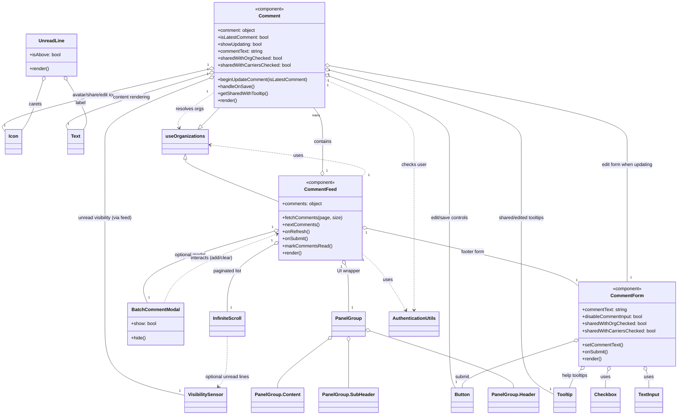

# Diagram: web/portal/src/components/organisms/CommentFeed.organism.js

> Auto-generated by Obscura crawlers

## Mermaid

### SVG

<svg id="container" width="2286.929931640625" xmlns="http://www.w3.org/2000/svg" class="classDiagram" height="1416" viewBox="123.08187866210938 0 2286.929931640625 1416" role="graphics-document document" aria-roledescription="class"><g><defs><marker id="container_class-aggregationStart" class="marker aggregation class" refX="18" refY="7" markerWidth="190" markerHeight="240" orient="auto"><path d="M 18,7 L9,13 L1,7 L9,1 Z"></path></marker></defs><defs><marker id="container_class-aggregationEnd" class="marker aggregation class" refX="1" refY="7" markerWidth="20" markerHeight="28" orient="auto"><path d="M 18,7 L9,13 L1,7 L9,1 Z"></path></marker></defs><defs><marker id="container_class-extensionStart" class="marker extension class" refX="18" refY="7" markerWidth="190" markerHeight="240" orient="auto"><path d="M 1,7 L18,13 V 1 Z"></path></marker></defs><defs><marker id="container_class-extensionEnd" class="marker extension class" refX="1" refY="7" markerWidth="20" markerHeight="28" orient="auto"><path d="M 1,1 V 13 L18,7 Z"></path></marker></defs><defs><marker id="container_class-compositionStart" class="marker composition class" refX="18" refY="7" markerWidth="190" markerHeight="240" orient="auto"><path d="M 18,7 L9,13 L1,7 L9,1 Z"></path></marker></defs><defs><marker id="container_class-compositionEnd" class="marker composition class" refX="1" refY="7" markerWidth="20" markerHeight="28" orient="auto"><path d="M 18,7 L9,13 L1,7 L9,1 Z"></path></marker></defs><defs><marker id="container_class-dependencyStart" class="marker dependency class" refX="6" refY="7" markerWidth="190" markerHeight="240" orient="auto"><path d="M 5,7 L9,13 L1,7 L9,1 Z"></path></marker></defs><defs><marker id="container_class-dependencyEnd" class="marker dependency class" refX="13" refY="7" markerWidth="20" markerHeight="28" orient="auto"><path d="M 18,7 L9,13 L14,7 L9,1 Z"></path></marker></defs><defs><marker id="container_class-lollipopStart" class="marker lollipop class" refX="13" refY="7" markerWidth="190" markerHeight="240" orient="auto"><circle stroke="black" fill="transparent" cx="7" cy="7" r="6"></circle></marker></defs><defs><marker id="container_class-lollipopEnd" class="marker lollipop class" refX="1" refY="7" markerWidth="190" markerHeight="240" orient="auto"><circle stroke="black" fill="transparent" cx="7" cy="7" r="6"></circle></marker></defs><g class="root"><g class="clusters"></g><g class="edgePaths"><path d="M1211.314,582.751L1211.343,579.459C1211.372,576.167,1211.429,569.584,1211.458,553.125C1211.486,536.667,1211.486,510.333,1211.486,484C1211.486,457.667,1211.486,431.333,1206.602,412C1201.718,392.667,1191.949,380.333,1187.064,374.167L1182.18,368" id="id_CommentFeed_Comment_1" class="edge-thickness-normal edge-pattern-solid relation" style=";;;" data-edge="true" data-et="edge" data-id="id_CommentFeed_Comment_1" data-points="W3sieCI6MTIxMS4xNjM3Mjc5ODY4Nzg1LCJ5Ijo2MDB9LHsieCI6MTIxMS40ODYzMjgxMjUsInkiOjU2M30seyJ4IjoxMjExLjQ4NjMyODEyNSwieSI6NDg0fSx7IngiOjEyMTEuNDg2MzI4MTI1LCJ5Ijo0MDV9LHsieCI6MTE4Mi4xODAxMTk1Mjc2NDk4LCJ5IjozNjh9XQ==" marker-start="url(#container_class-aggregationStart)"></path><path d="M1365.506,779.035L1473.551,803.362C1581.595,827.69,1797.684,876.345,1916.141,909.035C2034.598,941.726,2055.422,958.451,2065.834,966.814L2076.246,975.177" id="id_CommentFeed_CommentForm_2" class="edge-thickness-normal edge-pattern-solid relation" style=";;;" data-edge="true" data-et="edge" data-id="id_CommentFeed_CommentForm_2" data-points="W3sieCI6MTM0OC42Nzc3MzQzNzUsInkiOjc3NS4yNDU2NDE3ODQ0NDQ4fSx7IngiOjIwMTMuNzczNDM3NSwieSI6OTI1fSx7IngiOjIwNzYuMjQ2MDkzNzUsInkiOjk3NS4xNzY1MDkzMzQyMTE2fV0=" marker-start="url(#container_class-aggregationStart)"></path><path d="M1298.439,903.073L1300.473,906.727C1302.507,910.382,1306.575,917.691,1308.609,944.512C1310.643,971.333,1310.643,1017.667,1310.643,1040.833L1310.643,1064" id="id_CommentFeed_PanelGroup_3" class="edge-thickness-normal edge-pattern-solid relation" style=";;;" data-edge="true" data-et="edge" data-id="id_CommentFeed_PanelGroup_3" data-points="W3sieCI6MTI5MC4wNTA0NjgzMTgzNzAxLCJ5Ijo4ODh9LHsieCI6MTMxMC42NDI1NzgxMjUsInkiOjkyNX0seyJ4IjoxMzEwLjY0MjU3ODEyNSwieSI6MTA2NH1d" marker-start="url(#container_class-aggregationStart)"></path><path d="M1056.333,835.807L1031.465,850.672C1006.598,865.538,956.863,895.269,931.996,933.301C907.129,971.333,907.129,1017.667,907.129,1040.833L907.129,1064" id="id_CommentFeed_InfiniteScroll_4" class="edge-thickness-normal edge-pattern-solid relation" style=";;;" data-edge="true" data-et="edge" data-id="id_CommentFeed_InfiniteScroll_4" data-points="W3sieCI6MTA3MS4xMzg2NzE4NzUsInkiOjgyNi45NTU3NTQ5NTI0OTA5fSx7IngiOjkwNy4xMjg5MDYyNSwieSI6OTI1fSx7IngiOjkwNy4xMjg5MDYyNSwieSI6MTA2NH1d" marker-start="url(#container_class-aggregationStart)"></path><path d="M1054.566,788.878L976.037,811.565C897.508,834.252,740.449,879.626,670.836,920.48C601.224,961.333,619.057,997.667,627.973,1015.833L636.89,1034" id="id_CommentFeed_BatchCommentModal_5" class="edge-thickness-normal edge-pattern-solid relation" style=";;;" data-edge="true" data-et="edge" data-id="id_CommentFeed_BatchCommentModal_5" data-points="W3sieCI6MTA3MS4xMzg2NzE4NzUsInkiOjc4NC4wOTAzMTE5NjEyNjkxfSx7IngiOjU4My4zOTA2MjUsInkiOjkyNX0seyJ4Ijo2MzYuODg5Njg2MjA1MTEwNSwieSI6MTAzNH1d" marker-start="url(#container_class-aggregationStart)"></path><path d="M1348.678,862.952L1360.742,873.294C1372.806,883.635,1396.934,904.317,1422.329,936.967C1447.723,969.616,1474.384,1014.233,1487.714,1036.541L1501.044,1058.849" id="id_CommentFeed_AuthenticationUtils_6" class="edge-thickness-normal edge-pattern-dashed relation" style=";;;" data-edge="true" data-et="edge" data-id="id_CommentFeed_AuthenticationUtils_6" data-points="W3sieCI6MTM0OC42Nzc3MzQzNzUsInkiOjg2Mi45NTIyODA1MjY0OTU5fSx7IngiOjE0MjEuMDYyNSwieSI6OTI1fSx7IngiOjE1MDQuMTIxNzE5NjEzMjU5OCwieSI6MTA2NH1d" marker-end="url(#container_class-dependencyEnd)"></path><path d="M1348.678,601.985L1355.027,595.487C1361.376,588.99,1374.074,575.995,1289.558,558.041C1205.043,540.086,1023.314,517.173,932.45,505.716L841.586,494.259" id="id_CommentFeed_useOrganizations_7" class="edge-thickness-normal edge-pattern-dashed relation" style=";;;" data-edge="true" data-et="edge" data-id="id_CommentFeed_useOrganizations_7" data-points="W3sieCI6MTM0OC42Nzc3MzQzNzUsInkiOjYwMS45ODQ3MzgzODgxNDR9LHsieCI6MTM4Ni43NzE0ODQzNzUsInkiOjU2M30seyJ4Ijo4MzUuNjMyODEyNSwieSI6NDkzLjUwODcxNDI4Nzk0MDl9XQ==" marker-end="url(#container_class-dependencyEnd)"></path><path d="M1246.674,225.459L1412.083,255.383C1577.492,285.306,1908.311,345.153,2073.72,388.243C2239.129,431.333,2239.129,457.667,2239.129,484C2239.129,510.333,2239.129,536.667,2239.129,580C2239.129,623.333,2239.129,683.667,2239.129,744C2239.129,804.333,2239.129,864.667,2239.129,901C2239.129,937.333,2239.129,949.667,2239.129,955.833L2239.129,962" id="id_Comment_CommentForm_8" class="edge-thickness-normal edge-pattern-solid relation" style=";;;" data-edge="true" data-et="edge" data-id="id_Comment_CommentForm_8" data-points="W3sieCI6MTIyOS42OTkyMTg3NSwieSI6MjIyLjM4ODM0ODg1MDYxNDAyfSx7IngiOjIyMzkuMTI4OTA2MjUsInkiOjQwNX0seyJ4IjoyMjM5LjEyODkwNjI1LCJ5Ijo0ODR9LHsieCI6MjIzOS4xMjg5MDYyNSwieSI6NTYzfSx7IngiOjIyMzkuMTI4OTA2MjUsInkiOjc0NH0seyJ4IjoyMjM5LjEyODkwNjI1LCJ5Ijo5MjV9LHsieCI6MjIzOS4xMjg5MDYyNSwieSI6OTYyfV0=" marker-start="url(#container_class-aggregationStart)"></path><path d="M1229.699,272.25L1279.619,294.375C1329.539,316.5,1429.379,360.75,1479.299,396.042C1529.219,431.333,1529.219,457.667,1529.219,484C1529.219,510.333,1529.219,536.667,1529.219,580C1529.219,623.333,1529.219,683.667,1529.219,744C1529.219,804.333,1529.219,864.667,1529.219,917C1529.219,969.333,1529.219,1013.667,1529.219,1035.833L1529.219,1058" id="id_Comment_AuthenticationUtils_9" class="edge-thickness-normal edge-pattern-dashed relation" style=";;;" data-edge="true" data-et="edge" data-id="id_Comment_AuthenticationUtils_9" data-points="W3sieCI6MTIyOS42OTkyMTg3NSwieSI6MjcyLjI0OTgwODUyMDgyMzM2fSx7IngiOjE1MjkuMjE4NzUsInkiOjQwNX0seyJ4IjoxNTI5LjIxODc1LCJ5Ijo0ODR9LHsieCI6MTUyOS4yMTg3NSwieSI6NTYzfSx7IngiOjE1MjkuMjE4NzUsInkiOjc0NH0seyJ4IjoxNTI5LjIxODc1LCJ5Ijo5MjV9LHsieCI6MTUyOS4yMTg3NSwieSI6MTA2NH1d" marker-end="url(#container_class-dependencyEnd)"></path><path d="M849.52,319.732L829.012,333.943C808.505,348.154,767.491,376.577,749.225,396.036C730.959,415.494,735.441,425.988,737.682,431.235L739.923,436.482" id="id_Comment_useOrganizations_10" class="edge-thickness-normal edge-pattern-dashed relation" style=";;;" data-edge="true" data-et="edge" data-id="id_Comment_useOrganizations_10" data-points="W3sieCI6ODQ5LjUxOTUzMTI1LCJ5IjozMTkuNzMxNjMwOTQ3MzMxNjd9LHsieCI6NzI2LjQ3NjU2MjUsInkiOjQwNX0seyJ4Ijo3NDIuMjc5ODY1NTA2MzI5MSwieSI6NDQyfV0=" marker-end="url(#container_class-dependencyEnd)"></path><path d="M1246.406,241.14L1352.686,268.45C1458.965,295.76,1671.524,350.38,1777.803,390.857C1884.082,431.333,1884.082,457.667,1884.082,484C1884.082,510.333,1884.082,536.667,1884.082,580C1884.082,623.333,1884.082,683.667,1884.082,744C1884.082,804.333,1884.082,864.667,1884.082,925C1884.082,985.333,1884.082,1045.667,1884.082,1106C1884.082,1166.333,1884.082,1226.667,1902.472,1266.645C1920.862,1306.624,1957.642,1326.247,1976.032,1336.059L1994.422,1345.871" id="id_Comment_Tooltip_11" class="edge-thickness-normal edge-pattern-solid relation" style=";;;" data-edge="true" data-et="edge" data-id="id_Comment_Tooltip_11" data-points="W3sieCI6MTIyOS42OTkyMTg3NSwieSI6MjM2Ljg0NjQ1NTU4MjAyNDY1fSx7IngiOjE4ODQuMDgyMDMxMjUsInkiOjQwNX0seyJ4IjoxODg0LjA4MjAzMTI1LCJ5Ijo0ODR9LHsieCI6MTg4NC4wODIwMzEyNSwieSI6NTYzfSx7IngiOjE4ODQuMDgyMDMxMjUsInkiOjc0NH0seyJ4IjoxODg0LjA4MjAzMTI1LCJ5Ijo5MjV9LHsieCI6MTg4NC4wODIwMzEyNSwieSI6MTEwNn0seyJ4IjoxODg0LjA4MjAzMTI1LCJ5IjoxMjg3fSx7IngiOjE5OTQuNDIxODc1LCJ5IjoxMzQ1Ljg3MTIwNDMyNjYwNn1d" marker-start="url(#container_class-aggregationStart)"></path><path d="M832.706,235.444L709.467,263.703C586.228,291.963,339.751,348.481,225.403,385.45C111.055,422.418,128.837,439.836,137.728,448.545L146.619,457.254" id="id_Comment_Icon_12" class="edge-thickness-normal edge-pattern-solid relation" style=";;;" data-edge="true" data-et="edge" data-id="id_Comment_Icon_12" data-points="W3sieCI6ODQ5LjUxOTUzMTI1LCJ5IjoyMzEuNTg4NjM5NTcyMDMzNTd9LHsieCI6OTMuMjczNDM3NSwieSI6NDA1fSx7IngiOjE0Ni42MTkxNDA2MjUsInkiOjQ1Ny4yNTQwNjI0MzE4ODkxN31d" marker-start="url(#container_class-aggregationStart)"></path><path d="M833.019,250.953L748.764,276.628C664.51,302.302,496.001,353.651,416.625,386.128C337.248,418.605,347.004,432.209,351.882,439.012L356.76,445.814" id="id_Comment_Text_13" class="edge-thickness-normal edge-pattern-solid relation" style=";;;" data-edge="true" data-et="edge" data-id="id_Comment_Text_13" data-points="W3sieCI6ODQ5LjUxOTUzMTI1LCJ5IjoyNDUuOTI1MTUxNjcxNDAyNH0seyJ4IjozMjcuNDkyMTg3NSwieSI6NDA1fSx7IngiOjM1Ni43NTk3NjU2MjUsInkiOjQ0NS44MTQxNjk5NzA2OTQ3fV0=" marker-start="url(#container_class-aggregationStart)"></path><path d="M1245.944,261.697L1312.813,285.581C1379.681,309.465,1513.419,357.232,1580.288,394.283C1647.156,431.333,1647.156,457.667,1647.156,484C1647.156,510.333,1647.156,536.667,1647.156,580C1647.156,623.333,1647.156,683.667,1647.156,744C1647.156,804.333,1647.156,864.667,1647.156,925C1647.156,985.333,1647.156,1045.667,1647.156,1106C1647.156,1166.333,1647.156,1226.667,1650.68,1263C1654.205,1299.333,1661.253,1311.667,1664.777,1317.833L1668.302,1324" id="id_Comment_Button_14" class="edge-thickness-normal edge-pattern-solid relation" style=";;;" data-edge="true" data-et="edge" data-id="id_Comment_Button_14" data-points="W3sieCI6MTIyOS42OTkyMTg3NSwieSI6MjU1Ljg5NTE2NjI2ODAzNDg3fSx7IngiOjE2NDcuMTU2MjUsInkiOjQwNX0seyJ4IjoxNjQ3LjE1NjI1LCJ5Ijo0ODR9LHsieCI6MTY0Ny4xNTYyNSwieSI6NTYzfSx7IngiOjE2NDcuMTU2MjUsInkiOjc0NH0seyJ4IjoxNjQ3LjE1NjI1LCJ5Ijo5MjV9LHsieCI6MTY0Ny4xNTYyNSwieSI6MTEwNn0seyJ4IjoxNjQ3LjE1NjI1LCJ5IjoxMjg3fSx7IngiOjE2NjguMzAxNzIwNzI3ODQ4LCJ5IjoxMzI0fV0=" marker-start="url(#container_class-aggregationStart)"></path><path d="M833.44,268.082L774.691,290.901C715.942,313.721,598.444,359.361,539.694,395.347C480.945,431.333,480.945,457.667,480.945,484C480.945,510.333,480.945,536.667,480.945,580C480.945,623.333,480.945,683.667,480.945,744C480.945,804.333,480.945,864.667,480.945,925C480.945,985.333,480.945,1045.667,480.945,1106C480.945,1166.333,480.945,1226.667,527.073,1267.368C573.2,1308.069,665.454,1329.139,711.582,1339.673L757.709,1350.208" id="id_Comment_VisibilitySensor_15" class="edge-thickness-normal edge-pattern-solid relation" style=";;;" data-edge="true" data-et="edge" data-id="id_Comment_VisibilitySensor_15" data-points="W3sieCI6ODQ5LjUxOTUzMTI1LCJ5IjoyNjEuODM1OTU3NzExNjE2NzR9LHsieCI6NDgwLjk0NTMxMjUsInkiOjQwNX0seyJ4Ijo0ODAuOTQ1MzEyNSwieSI6NDg0fSx7IngiOjQ4MC45NDUzMTI1LCJ5Ijo1NjN9LHsieCI6NDgwLjk0NTMxMjUsInkiOjc0NH0seyJ4Ijo0ODAuOTQ1MzEyNSwieSI6OTI1fSx7IngiOjQ4MC45NDUzMTI1LCJ5IjoxMTA2fSx7IngiOjQ4MC45NDUzMTI1LCJ5IjoxMjg3fSx7IngiOjc1Ny43MDg5ODQzNzUsInkiOjEzNTAuMjA3NzYxNDA5NzY5M31d" marker-start="url(#container_class-aggregationStart)"></path><path d="M2302.797,1266.028L2304.187,1269.523C2305.578,1273.019,2308.359,1280.009,2309.75,1289.671C2311.141,1299.333,2311.141,1311.667,2311.141,1317.833L2311.141,1324" id="id_CommentForm_TextInput_16" class="edge-thickness-normal edge-pattern-solid relation" style=";;;" data-edge="true" data-et="edge" data-id="id_CommentForm_TextInput_16" data-points="W3sieCI6MjI5Ni40MTk5OTc0MTAyMjEsInkiOjEyNTB9LHsieCI6MjMxMS4xNDA2MjUsInkiOjEyODd9LHsieCI6MjMxMS4xNDA2MjUsInkiOjEzMjR9XQ==" marker-start="url(#container_class-aggregationStart)"></path><path d="M2175.461,1266.028L2174.07,1269.523C2172.68,1273.019,2169.898,1280.009,2168.508,1289.671C2167.117,1299.333,2167.117,1311.667,2167.117,1317.833L2167.117,1324" id="id_CommentForm_Checkbox_17" class="edge-thickness-normal edge-pattern-solid relation" style=";;;" data-edge="true" data-et="edge" data-id="id_CommentForm_Checkbox_17" data-points="W3sieCI6MjE4MS44Mzc4MTUwODk3NzksInkiOjEyNTB9LHsieCI6MjE2Ny4xMTcxODc1LCJ5IjoxMjg3fSx7IngiOjIxNjcuMTE3MTg3NSwieSI6MTMyNH1d" marker-start="url(#container_class-aggregationStart)"></path><path d="M2059.87,1165.335L1998.609,1185.613C1937.348,1205.89,1814.826,1246.445,1753.566,1272.889C1692.305,1299.333,1692.305,1311.667,1692.305,1317.833L1692.305,1324" id="id_CommentForm_Button_18" class="edge-thickness-normal edge-pattern-solid relation" style=";;;" data-edge="true" data-et="edge" data-id="id_CommentForm_Button_18" data-points="W3sieCI6MjA3Ni4yNDYwOTM3NSwieSI6MTE1OS45MTQ1NjM0OTUxODE3fSx7IngiOjE2OTIuMzA0Njg3NSwieSI6MTI4N30seyJ4IjoxNjkyLjMwNDY4NzUsInkiOjEzMjR9XQ==" marker-start="url(#container_class-aggregationStart)"></path><path d="M2082.996,1262.2L2078.865,1266.334C2074.733,1270.467,2066.47,1278.733,2060.304,1289.033C2054.139,1299.333,2050.071,1311.667,2048.036,1317.833L2046.002,1324" id="id_CommentForm_Tooltip_19" class="edge-thickness-normal edge-pattern-solid relation" style=";;;" data-edge="true" data-et="edge" data-id="id_CommentForm_Tooltip_19" data-points="W3sieCI6MjA5NS4xOTEwNjA5NDYxMzI0LCJ5IjoxMjUwfSx7IngiOjIwNTguMjA3MDMxMjUsInkiOjEyODd9LHsieCI6MjA0Ni4wMDIzNzM0MTc3MjE2LCJ5IjoxMzI0fV0=" marker-start="url(#container_class-aggregationStart)"></path><path d="M264.235,276.331L256.942,297.776C249.649,319.221,235.063,362.11,224.136,389.722C213.209,417.333,205.941,429.667,202.307,435.833L198.673,442" id="id_UnreadLine_Icon_20" class="edge-thickness-normal edge-pattern-solid relation" style=";;;" data-edge="true" data-et="edge" data-id="id_UnreadLine_Icon_20" data-points="W3sieCI6MjY5Ljc4OTE0MzUwNTE4NDMsInkiOjI2MH0seyJ4IjoyMjAuNDc2NTYyNSwieSI6NDA1fSx7IngiOjE5OC42NzMzODMxMDkxNzcyMiwieSI6NDQyfV0=" marker-start="url(#container_class-aggregationStart)"></path><path d="M348.72,274.604L362.383,296.337C376.045,318.069,403.37,361.535,413.399,389.434C423.428,417.333,416.16,429.667,412.526,435.833L408.892,442" id="id_UnreadLine_Text_21" class="edge-thickness-normal edge-pattern-solid relation" style=";;;" data-edge="true" data-et="edge" data-id="id_UnreadLine_Text_21" data-points="W3sieCI6MzM5LjUzOTE0MzUwNTE4NDMsInkiOjI2MH0seyJ4Ijo0MzAuNjk1MzEyNSwieSI6NDA1fSx7IngiOjQwOC44OTIxMzMxMDkxNzcyLCJ5Ijo0NDJ9XQ==" marker-start="url(#container_class-aggregationStart)"></path><path d="M1381.36,1129.224L1461.43,1155.52C1541.5,1181.816,1701.641,1234.408,1781.711,1266.871C1861.781,1299.333,1861.781,1311.667,1861.781,1317.833L1861.781,1324" id="id_PanelGroup_PanelGroup.Header_22" class="edge-thickness-normal edge-pattern-solid relation" style=";;;" data-edge="true" data-et="edge" data-id="id_PanelGroup_PanelGroup.Header_22" data-points="W3sieCI6MTM2NC45NzA3MDMxMjUsInkiOjExMjMuODQxOTUzNjI1ODM4Nn0seyJ4IjoxODYxLjc4MTI1LCJ5IjoxMjg3fSx7IngiOjE4NjEuNzgxMjUsInkiOjEzMjR9XQ==" marker-start="url(#container_class-aggregationStart)"></path><path d="M1310.643,1165.25L1310.643,1185.542C1310.643,1205.833,1310.643,1246.417,1310.643,1272.875C1310.643,1299.333,1310.643,1311.667,1310.643,1317.833L1310.643,1324" id="id_PanelGroup_PanelGroup.SubHeader_23" class="edge-thickness-normal edge-pattern-solid relation" style=";;;" data-edge="true" data-et="edge" data-id="id_PanelGroup_PanelGroup.SubHeader_23" data-points="W3sieCI6MTMxMC42NDI1NzgxMjUsInkiOjExNDh9LHsieCI6MTMxMC42NDI1NzgxMjUsInkiOjEyODd9LHsieCI6MTMxMC42NDI1NzgxMjUsInkiOjEzMjR9XQ==" marker-start="url(#container_class-aggregationStart)"></path><path d="M1243.367,1158.629L1216.017,1180.024C1188.667,1201.419,1133.967,1244.21,1106.617,1271.771C1079.268,1299.333,1079.268,1311.667,1079.268,1317.833L1079.268,1324" id="id_PanelGroup_PanelGroup.Content_24" class="edge-thickness-normal edge-pattern-solid relation" style=";;;" data-edge="true" data-et="edge" data-id="id_PanelGroup_PanelGroup.Content_24" data-points="W3sieCI6MTI1Ni45NTMzNTE2MDU2NjI5LCJ5IjoxMTQ4fSx7IngiOjEwNzkuMjY3NTc4MTI1LCJ5IjoxMjg3fSx7IngiOjEwNzkuMjY3NTc4MTI1LCJ5IjoxMzI0fV0=" marker-start="url(#container_class-aggregationStart)"></path><path d="M907.129,1148L907.129,1171.167C907.129,1194.333,907.129,1240.667,901.576,1269.299C896.023,1297.93,884.916,1308.861,879.363,1314.326L873.81,1319.791" id="id_InfiniteScroll_VisibilitySensor_25" class="edge-thickness-normal edge-pattern-dashed relation" style=";;;" data-edge="true" data-et="edge" data-id="id_InfiniteScroll_VisibilitySensor_25" data-points="W3sieCI6OTA3LjEyODkwNjI1LCJ5IjoxMTQ4fSx7IngiOjkwNy4xMjg5MDYyNSwieSI6MTI4N30seyJ4Ijo4NjkuNTMzNDAwOTA5ODEwMSwieSI6MTMyNH1d" marker-end="url(#container_class-dependencyEnd)"></path><path d="M696.602,1034L702.751,1015.833C708.901,997.667,721.201,961.333,782.689,922.142C844.177,882.951,954.853,840.902,1010.192,819.878L1065.53,798.853" id="id_BatchCommentModal_CommentFeed_26" class="edge-thickness-normal edge-pattern-dashed relation" style=";;;" data-edge="true" data-et="edge" data-id="id_BatchCommentModal_CommentFeed_26" data-points="W3sieCI6Njk2LjYwMTcwMjc3OTY5NjEsInkiOjEwMzR9LHsieCI6NzMzLjUsInkiOjkyNX0seyJ4IjoxMDcxLjEzODY3MTg3NSwieSI6Nzk2LjcyMjE5Mjg0MTEyNDh9XQ==" marker-end="url(#container_class-dependencyEnd)"></path><path d="M760.219,543.25L760.219,546.542C760.219,549.833,760.219,556.417,812.039,580.566C863.859,604.715,967.499,646.43,1019.319,667.288L1071.139,688.145" id="id_useOrganizations_CommentFeed_27" class="edge-thickness-normal edge-pattern-solid relation" style=";;;" data-edge="true" data-et="edge" data-id="id_useOrganizations_CommentFeed_27" data-points="W3sieCI6NzYwLjIxODc1LCJ5Ijo1MjZ9LHsieCI6NzYwLjIxODc1LCJ5Ijo1NjN9LHsieCI6MTA3MS4xMzg2NzE4NzUsInkiOjY4OC4xNDUyNjUxNzg2NjA2fV0=" marker-start="url(#container_class-extensionStart)"></path><path d="M812.04,429.499L815.922,425.416C819.805,421.333,827.569,413.166,837.257,402.916C846.944,392.667,858.554,380.333,864.359,374.167L870.164,368" id="id_useOrganizations_Comment_28" class="edge-thickness-normal edge-pattern-solid relation" style=";;;" data-edge="true" data-et="edge" data-id="id_useOrganizations_Comment_28" data-points="W3sieCI6ODAwLjE1MzQzMTU2NjQ1NTcsInkiOjQ0Mn0seyJ4Ijo4MzUuMzMzOTg0Mzc1LCJ5Ijo0MDV9LHsieCI6ODcwLjE2NDM1MDUxODQzMzEsInkiOjM2OH1d" marker-start="url(#container_class-extensionStart)"></path></g><g class="edgeLabels"><g class="edgeLabel" transform="translate(1211.486328125, 484)"><g class="label" data-id="id_CommentFeed_Comment_1" transform="translate(-30.890625, -12)"><foreignObject width="61.78125" height="24">

contains

</foreignObject></g></g><g class="edgeLabel" transform="translate(1720.31111, 858.9234)"><g class="label" data-id="id_CommentFeed_CommentForm_2" transform="translate(-41.5, -12)"><foreignObject width="83" height="24">

footer form

</foreignObject></g></g><g class="edgeLabel" transform="translate(1310.642578125, 925)"><g class="label" data-id="id_CommentFeed_PanelGroup_3" transform="translate(-39.625, -12)"><foreignObject width="79.25" height="24">

UI wrapper

</foreignObject></g></g><g class="edgeLabel" transform="translate(907.12890625, 925)"><g class="label" data-id="id_CommentFeed_InfiniteScroll_4" transform="translate(-49.65625, -12)"><foreignObject width="99.3125" height="24">

paginated list

</foreignObject></g></g><g class="edgeLabel" transform="translate(768.93918, 871.3953)"><g class="label" data-id="id_CommentFeed_BatchCommentModal_5" transform="translate(-55.59375, -12)"><foreignObject width="111.1875" height="24">

optional modal

</foreignObject></g></g><g class="edgeLabel" transform="translate(1438.14023, 953.57966)"><g class="label" data-id="id_CommentFeed_AuthenticationUtils_6" transform="translate(-16.4921875, -12)"><foreignObject width="32.984375" height="24">

uses

</foreignObject></g></g><g class="edgeLabel" transform="translate(1138.24125, 531.66363)"><g class="label" data-id="id_CommentFeed_useOrganizations_7" transform="translate(-16.4921875, -12)"><foreignObject width="32.984375" height="24">

uses

</foreignObject></g></g><g class="edgeLabel" transform="translate(2239.12890625, 563)"><g class="label" data-id="id_Comment_CommentForm_8" transform="translate(-89.875, -12)"><foreignObject width="179.75" height="24">

edit form when updating

</foreignObject></g></g><g class="edgeLabel" transform="translate(1529.21875, 563)"><g class="label" data-id="id_Comment_AuthenticationUtils_9" transform="translate(-42.453125, -12)"><foreignObject width="84.90625" height="24">

checks user

</foreignObject></g></g><g class="edgeLabel" transform="translate(771.4635, 373.82421)"><g class="label" data-id="id_Comment_useOrganizations_10" transform="translate(-47.484375, -12)"><foreignObject width="94.96875" height="24">

resolves orgs

</foreignObject></g></g><g class="edgeLabel" transform="translate(1884.08203125, 744)"><g class="label" data-id="id_Comment_Tooltip_11" transform="translate(-82.0546875, -12)"><foreignObject width="164.109375" height="24">

shared/edited tooltips

</foreignObject></g></g><g class="edgeLabel" transform="translate(435.00386, 326.63935)"><g class="label" data-id="id_Comment_Icon_12" transform="translate(-85.2734375, -12)"><foreignObject width="170.546875" height="24">

avatar/share/edit icons

</foreignObject></g></g><g class="edgeLabel" transform="translate(564.48469, 332.78243)"><g class="label" data-id="id_Comment_Text_13" transform="translate(-65.0859375, -12)"><foreignObject width="130.171875" height="24">

content rendering

</foreignObject></g></g><g class="edgeLabel" transform="translate(1647.15625, 744)"><g class="label" data-id="id_Comment_Button_14" transform="translate(-65.9921875, -12)"><foreignObject width="131.984375" height="24">

edit/save controls

</foreignObject></g></g><g class="edgeLabel" transform="translate(480.9453125, 744)"><g class="label" data-id="id_Comment_VisibilitySensor_15" transform="translate(-94.3828125, -12)"><foreignObject width="188.765625" height="24">

unread visibility (via feed)

</foreignObject></g></g><g class="edgeLabel" transform="translate(2311.140625, 1287)"><g class="label" data-id="id_CommentForm_TextInput_16" transform="translate(-16.4921875, -12)"><foreignObject width="32.984375" height="24">

uses

</foreignObject></g></g><g class="edgeLabel" transform="translate(2167.1171875, 1287)"><g class="label" data-id="id_CommentForm_Checkbox_17" transform="translate(-16.4921875, -12)"><foreignObject width="32.984375" height="24">

uses

</foreignObject></g></g><g class="edgeLabel" transform="translate(1692.3046875, 1287)"><g class="label" data-id="id_CommentForm_Button_18" transform="translate(-25.1484375, -12)"><foreignObject width="50.296875" height="24">

submit

</foreignObject></g></g><g class="edgeLabel" transform="translate(2062.92725, 1282.27774)"><g class="label" data-id="id_CommentForm_Tooltip_19" transform="translate(-46.359375, -12)"><foreignObject width="92.71875" height="24">

help tooltips

</foreignObject></g></g><g class="edgeLabel" transform="translate(238.21902, 352.82962)"><g class="label" data-id="id_UnreadLine_Icon_20" transform="translate(-21.9296875, -12)"><foreignObject width="43.859375" height="24">

carets

</foreignObject></g></g><g class="edgeLabel" transform="translate(396.5458, 350.67917)"><g class="label" data-id="id_UnreadLine_Text_21" transform="translate(-18.1171875, -12)"><foreignObject width="36.234375" height="24">

label

</foreignObject></g></g><g class="edgeLabel"><g class="label" data-id="id_PanelGroup_PanelGroup.Header_22" transform="translate(0, 0)"><foreignObject width="0" height="0">

</foreignObject></g></g><g class="edgeLabel"><g class="label" data-id="id_PanelGroup_PanelGroup.SubHeader_23" transform="translate(0, 0)"><foreignObject width="0" height="0">

</foreignObject></g></g><g class="edgeLabel"><g class="label" data-id="id_PanelGroup_PanelGroup.Content_24" transform="translate(0, 0)"><foreignObject width="0" height="0">

</foreignObject></g></g><g class="edgeLabel" transform="translate(907.12890625, 1287)"><g class="label" data-id="id_InfiniteScroll_VisibilitySensor_25" transform="translate(-77.78125, -12)"><foreignObject width="155.5625" height="24">

optional unread lines

</foreignObject></g></g><g class="edgeLabel" transform="translate(848.53244, 881.29615)"><g class="label" data-id="id_BatchCommentModal_CommentFeed_26" transform="translate(-74.515625, -12)"><foreignObject width="149.03125" height="24">

interacts (add/clear)

</foreignObject></g></g><g class="edgeLabel"><g class="label" data-id="id_useOrganizations_CommentFeed_27" transform="translate(0, 0)"><foreignObject width="0" height="0">

</foreignObject></g></g><g class="edgeLabel"><g class="label" data-id="id_useOrganizations_Comment_28" transform="translate(0, 0)"><foreignObject width="0" height="0">

</foreignObject></g></g><g class="edgeTerminals" transform="translate(1226.3157338739336, 582.631444433153)"><g class="inner" transform="translate(0, 0)"><foreignObject style="width: 9px; height: 12px;">
1
</foreignObject></g></g><g class="edgeTerminals" transform="translate(1362.4553701549085, 793.7233787516838)"><g class="inner" transform="translate(0, 0)"><foreignObject style="width: 9px; height: 12px;">
1
</foreignObject></g></g><g class="edgeTerminals" transform="translate(1285.4539000801196, 910.5858702889349)"><g class="inner" transform="translate(0, 0)"><foreignObject style="width: 9px; height: 12px;">
1
</foreignObject></g></g><g class="edgeTerminals" transform="translate(1048.4214018515518, 823.06016727461)"><g class="inner" transform="translate(0, 0)"><foreignObject style="width: 9px; height: 12px;">
1
</foreignObject></g></g><g class="edgeTerminals" transform="translate(1050.1629927435729, 774.5367303324372)"><g class="inner" transform="translate(0, 0)"><foreignObject style="width: 9px; height: 12px;">
1
</foreignObject></g></g><g class="edgeTerminals" transform="translate(1352.202197205154, 885.7300819643162)"><g class="inner" transform="translate(0, 0)"><foreignObject style="width: 9px; height: 12px;">
1
</foreignObject></g></g><g class="edgeTerminals" transform="translate(1371.6367352137502, 599.9514574450358)"><g class="inner" transform="translate(0, 0)"><foreignObject style="width: 9px; height: 12px;">
1
</foreignObject></g></g><g class="edgeTerminals" transform="translate(1244.2494544099618, 240.26404742178806)"><g class="inner" transform="translate(0, 0)"><foreignObject style="width: 9px; height: 12px;">
1
</foreignObject></g></g><g class="edgeTerminals" transform="translate(1239.6202947592217, 293.0541898248033)"><g class="inner" transform="translate(0, 0)"><foreignObject style="width: 9px; height: 12px;">
1
</foreignObject></g></g><g class="edgeTerminals" transform="translate(826.5919143655098, 317.37059951466006)"><g class="inner" transform="translate(0, 0)"><foreignObject style="width: 9px; height: 12px;">
1
</foreignObject></g></g><g class="edgeTerminals" transform="translate(1242.9153756135804, 255.72986432251784)"><g class="inner" transform="translate(0, 0)"><foreignObject style="width: 9px; height: 12px;">
1
</foreignObject></g></g><g class="edgeTerminals" transform="translate(829.1096619175281, 220.87942659974357)"><g class="inner" transform="translate(0, 0)"><foreignObject style="width: 9px; height: 12px;">
1
</foreignObject></g></g><g class="edgeTerminals" transform="translate(828.4071209132293, 236.677661752303)"><g class="inner" transform="translate(0, 0)"><foreignObject style="width: 9px; height: 12px;">
1
</foreignObject></g></g><g class="edgeTerminals" transform="translate(1241.1341033948613, 275.9074975071666)"><g class="inner" transform="translate(0, 0)"><foreignObject style="width: 9px; height: 12px;">
1
</foreignObject></g></g><g class="edgeTerminals" transform="translate(827.7758242901915, 254.18996740853802)"><g class="inner" transform="translate(0, 0)"><foreignObject style="width: 9px; height: 12px;">
1
</foreignObject></g></g><g class="edgeTerminals" transform="translate(1176.2872958575613, 386.03156362184575)"><g class="inner" transform="translate(0, 0)"></g><foreignObject style="width: 36px; height: 12px;">
many
</foreignObject></g><g class="edgeTerminals" transform="translate(2066.9951044189215, 947.5230548874538)"><g class="inner" transform="translate(0, 0)"></g><foreignObject style="width: 9px; height: 12px;">
1
</foreignObject></g><g class="edgeTerminals" transform="translate(1320.6425790624999, 1041.5000008035713)"><g class="inner" transform="translate(0, 0)"></g><foreignObject style="width: 9px; height: 12px;">
1
</foreignObject></g><g class="edgeTerminals" transform="translate(917.1289081249998, 1041.5000016071428)"><g class="inner" transform="translate(0, 0)"></g><foreignObject style="width: 9px; height: 12px;">
1
</foreignObject></g><g class="edgeTerminals" transform="translate(637.6445716477552, 1006.6811441326955)"><g class="inner" transform="translate(0, 0)"></g><foreignObject style="width: 9px; height: 12px;">
1
</foreignObject></g><g class="edgeTerminals" transform="translate(2249.1289081249997, 939.5000016071428)"><g class="inner" transform="translate(0, 0)"></g><foreignObject style="width: 9px; height: 12px;">
1
</foreignObject></g><g class="edgeTerminals" transform="translate(1981.043051524989, 1319.3992385396348)"><g class="inner" transform="translate(0, 0)"></g><foreignObject style="width: 9px; height: 12px;">
1
</foreignObject></g><g class="edgeTerminals" transform="translate(139.613916462369, 429.29259228170156)"><g class="inner" transform="translate(0, 0)"></g><foreignObject style="width: 9px; height: 12px;">
1
</foreignObject></g><g class="edgeTerminals" transform="translate(353.7514651470779, 417.8515229403548)"><g class="inner" transform="translate(0, 0)"></g><foreignObject style="width: 9px; height: 12px;">
1
</foreignObject></g><g class="edgeTerminals" transform="translate(1667.6417317386552, 1296.3634283924048)"><g class="inner" transform="translate(0, 0)"></g><foreignObject style="width: 9px; height: 12px;">
1
</foreignObject></g><g class="edgeTerminals" transform="translate(738.987990649128, 1326.6879252571498)"><g class="inner" transform="translate(0, 0)"></g><foreignObject style="width: 9px; height: 12px;">
1
</foreignObject></g></g><g class="nodes"><g class="node default" id="classId-UnreadLine-0" transform="translate(294.275390625, 188)"><g class="basic label-container"><path d="M-85.56640625 -72 L85.56640625 -72 L85.56640625 72 L-85.56640625 72" stroke="none" stroke-width="0" fill="#ECECFF" style=""></path><path d="M-85.56640625 -72 C-38.47468430696299 -72, 8.617037636074016 -72, 85.56640625 -72 M-85.56640625 -72 C-17.530789196936382 -72, 50.504827856127235 -72, 85.56640625 -72 M85.56640625 -72 C85.56640625 -19.85531481388582, 85.56640625 32.28937037222836, 85.56640625 72 M85.56640625 -72 C85.56640625 -20.720130210661665, 85.56640625 30.55973957867667, 85.56640625 72 M85.56640625 72 C31.210734639298792 72, -23.144936971402416 72, -85.56640625 72 M85.56640625 72 C33.39058759750281 72, -18.785231054994384 72, -85.56640625 72 M-85.56640625 72 C-85.56640625 32.09029912199985, -85.56640625 -7.819401756000303, -85.56640625 -72 M-85.56640625 72 C-85.56640625 27.596916478162598, -85.56640625 -16.806167043674805, -85.56640625 -72" stroke="#9370DB" stroke-width="1.3" fill="none" stroke-dasharray="0 0" style=""></path></g><g class="annotation-group text" transform="translate(0, -48)"></g><g class="label-group text" transform="translate(-41.7109375, -48)"><g class="label" style="font-weight: bolder" transform="translate(0,-12)"><foreignObject width="83.421875" height="24">

UnreadLine

</foreignObject></g></g><g class="members-group text" transform="translate(-73.56640625, 0)"><g class="label" style="" transform="translate(0,-12)"><foreignObject width="105.421875" height="24">

+isAbove: bool

</foreignObject></g></g><g class="methods-group text" transform="translate(-73.56640625, 48)"><g class="label" style="" transform="translate(0,-12)"><foreignObject width="66.609375" height="24">

+render()

</foreignObject></g></g><g class="divider" style=""><path d="M-85.56640625 -24 C-20.06985145475278 -24, 45.42670334049444 -24, 85.56640625 -24 M-85.56640625 -24 C-30.772760739217603 -24, 24.020884771564795 -24, 85.56640625 -24" stroke="#9370DB" stroke-width="1.3" fill="none" stroke-dasharray="0 0" style=""></path></g><g class="divider" style=""><path d="M-85.56640625 24 C-34.45817794365534 24, 16.650050362689313 24, 85.56640625 24 M-85.56640625 24 C-40.47862816511344 24, 4.609149919773117 24, 85.56640625 24" stroke="#9370DB" stroke-width="1.3" fill="none" stroke-dasharray="0 0" style=""></path></g></g><g class="node default" id="classId-CommentForm-1" transform="translate(2239.12890625, 1106)"><g class="basic label-container"><path d="M-162.8828125 -144 L162.8828125 -144 L162.8828125 144 L-162.8828125 144" stroke="none" stroke-width="0" fill="#ECECFF" style=""></path><path d="M-162.8828125 -144 C-74.08494654228498 -144, 14.712919415430036 -144, 162.8828125 -144 M-162.8828125 -144 C-74.61777129087497 -144, 13.64726991825006 -144, 162.8828125 -144 M162.8828125 -144 C162.8828125 -79.6505155797289, 162.8828125 -15.301031159457807, 162.8828125 144 M162.8828125 -144 C162.8828125 -52.75408134530008, 162.8828125 38.49183730939984, 162.8828125 144 M162.8828125 144 C87.91144657570712 144, 12.940080651414235 144, -162.8828125 144 M162.8828125 144 C45.611831789074415 144, -71.65914892185117 144, -162.8828125 144 M-162.8828125 144 C-162.8828125 39.38078831292751, -162.8828125 -65.23842337414499, -162.8828125 -144 M-162.8828125 144 C-162.8828125 53.40256599642744, -162.8828125 -37.19486800714512, -162.8828125 -144" stroke="#9370DB" stroke-width="1.3" fill="none" stroke-dasharray="0 0" style=""></path></g><g class="annotation-group text" transform="translate(-50.2109375, -120)"><g class="label" style="" transform="translate(0,-12)"><foreignObject width="100.421875" height="24">

«component»

</foreignObject></g></g><g class="label-group text" transform="translate(-53.015625, -96)"><g class="label" style="font-weight: bolder" transform="translate(0,-12)"><foreignObject width="106.03125" height="24">

CommentForm

</foreignObject></g></g><g class="members-group text" transform="translate(-150.8828125, -48)"><g class="label" style="" transform="translate(0,-12)"><foreignObject width="155.234375" height="24">

+commentText: string

</foreignObject></g><g class="label" style="" transform="translate(0,12)"><foreignObject width="209.90625" height="24">

+disableCommentInput: bool

</foreignObject></g><g class="label" style="" transform="translate(0,36)"><foreignObject width="217.578125" height="24">

+sharedWithOrgChecked: bool

</foreignObject></g><g class="label" style="" transform="translate(0,60)"><foreignObject width="248.75" height="24">

+sharedWithCarriersChecked: bool

</foreignObject></g></g><g class="methods-group text" transform="translate(-150.8828125, 72)"><g class="label" style="" transform="translate(0,-12)"><foreignObject width="139.109375" height="24">

+setCommentText()

</foreignObject></g><g class="label" style="" transform="translate(0,12)"><foreignObject width="88.609375" height="24">

+onSubmit()

</foreignObject></g><g class="label" style="" transform="translate(0,36)"><foreignObject width="66.609375" height="24">

+render()

</foreignObject></g></g><g class="divider" style=""><path d="M-162.8828125 -72 C-74.39751231375186 -72, 14.087787872496278 -72, 162.8828125 -72 M-162.8828125 -72 C-57.94807128193074 -72, 46.986669936138526 -72, 162.8828125 -72" stroke="#9370DB" stroke-width="1.3" fill="none" stroke-dasharray="0 0" style=""></path></g><g class="divider" style=""><path d="M-162.8828125 48 C-63.147689918077376 48, 36.58743266384525 48, 162.8828125 48 M-162.8828125 48 C-94.04084157461645 48, -25.1988706492329 48, 162.8828125 48" stroke="#9370DB" stroke-width="1.3" fill="none" stroke-dasharray="0 0" style=""></path></g></g><g class="node default" id="classId-Comment-2" transform="translate(1039.609375, 188)"><g class="basic label-container"><path d="M-190.08984375 -180 L190.08984375 -180 L190.08984375 180 L-190.08984375 180" stroke="none" stroke-width="0" fill="#ECECFF" style=""></path><path d="M-190.08984375 -180 C-69.55618869562055 -180, 50.9774663587589 -180, 190.08984375 -180 M-190.08984375 -180 C-108.98476266607035 -180, -27.879681582140705 -180, 190.08984375 -180 M190.08984375 -180 C190.08984375 -50.77056319641517, 190.08984375 78.45887360716966, 190.08984375 180 M190.08984375 -180 C190.08984375 -82.26908778981965, 190.08984375 15.4618244203607, 190.08984375 180 M190.08984375 180 C59.37195511635812 180, -71.34593351728375 180, -190.08984375 180 M190.08984375 180 C67.31021283928281 180, -55.469418071434376 180, -190.08984375 180 M-190.08984375 180 C-190.08984375 46.39525836952788, -190.08984375 -87.20948326094424, -190.08984375 -180 M-190.08984375 180 C-190.08984375 55.02135987453008, -190.08984375 -69.95728025093985, -190.08984375 -180" stroke="#9370DB" stroke-width="1.3" fill="none" stroke-dasharray="0 0" style=""></path></g><g class="annotation-group text" transform="translate(-50.2109375, -156)"><g class="label" style="" transform="translate(0,-12)"><foreignObject width="100.421875" height="24">

«component»

</foreignObject></g></g><g class="label-group text" transform="translate(-34.7578125, -132)"><g class="label" style="font-weight: bolder" transform="translate(0,-12)"><foreignObject width="69.515625" height="24">

Comment

</foreignObject></g></g><g class="members-group text" transform="translate(-178.08984375, -84)"><g class="label" style="" transform="translate(0,-12)"><foreignObject width="129.578125" height="24">

+comment: object

</foreignObject></g><g class="label" style="" transform="translate(0,12)"><foreignObject width="174.296875" height="24">

+isLatestComment: bool

</foreignObject></g><g class="label" style="" transform="translate(0,36)"><foreignObject width="152.96875" height="24">

+showUpdating: bool

</foreignObject></g><g class="label" style="" transform="translate(0,60)"><foreignObject width="155.234375" height="24">

+commentText: string

</foreignObject></g><g class="label" style="" transform="translate(0,84)"><foreignObject width="217.578125" height="24">

+sharedWithOrgChecked: bool

</foreignObject></g><g class="label" style="" transform="translate(0,108)"><foreignObject width="248.75" height="24">

+sharedWithCarriersChecked: bool

</foreignObject></g></g><g class="methods-group text" transform="translate(-178.08984375, 84)"><g class="label" style="" transform="translate(0,-12)"><foreignObject width="305.96875" height="24">

+beginUpdateComment(isLatestComment)

</foreignObject></g><g class="label" style="" transform="translate(0,12)"><foreignObject width="122.875" height="24">

+handleOnSave()

</foreignObject></g><g class="label" style="" transform="translate(0,36)"><foreignObject width="175.140625" height="24">

+getSharedWithTooltip()

</foreignObject></g><g class="label" style="" transform="translate(0,60)"><foreignObject width="66.609375" height="24">

+render()

</foreignObject></g></g><g class="divider" style=""><path d="M-190.08984375 -108 C-111.44305864387417 -108, -32.796273537748334 -108, 190.08984375 -108 M-190.08984375 -108 C-39.90058545795927 -108, 110.28867283408147 -108, 190.08984375 -108" stroke="#9370DB" stroke-width="1.3" fill="none" stroke-dasharray="0 0" style=""></path></g><g class="divider" style=""><path d="M-190.08984375 60 C-98.31656077212892 60, -6.543277794257847 60, 190.08984375 60 M-190.08984375 60 C-62.789191007536104 60, 64.51146173492779 60, 190.08984375 60" stroke="#9370DB" stroke-width="1.3" fill="none" stroke-dasharray="0 0" style=""></path></g></g><g class="node default" id="classId-CommentFeed-3" transform="translate(1209.908203125, 744)"><g class="basic label-container"><path d="M-138.76953125 -144 L138.76953125 -144 L138.76953125 144 L-138.76953125 144" stroke="none" stroke-width="0" fill="#ECECFF" style=""></path><path d="M-138.76953125 -144 C-40.41017860857309 -144, 57.94917403285382 -144, 138.76953125 -144 M-138.76953125 -144 C-64.25089829836807 -144, 10.267734653263858 -144, 138.76953125 -144 M138.76953125 -144 C138.76953125 -61.1130606578665, 138.76953125 21.773878684267004, 138.76953125 144 M138.76953125 -144 C138.76953125 -34.742603709608574, 138.76953125 74.51479258078285, 138.76953125 144 M138.76953125 144 C56.51797782989635 144, -25.733575590207295 144, -138.76953125 144 M138.76953125 144 C35.30784251815625 144, -68.1538462136875 144, -138.76953125 144 M-138.76953125 144 C-138.76953125 81.63009608993335, -138.76953125 19.260192179866678, -138.76953125 -144 M-138.76953125 144 C-138.76953125 38.346293284023574, -138.76953125 -67.30741343195285, -138.76953125 -144" stroke="#9370DB" stroke-width="1.3" fill="none" stroke-dasharray="0 0" style=""></path></g><g class="annotation-group text" transform="translate(-50.2109375, -120)"><g class="label" style="" transform="translate(0,-12)"><foreignObject width="100.421875" height="24">

«component»

</foreignObject></g></g><g class="label-group text" transform="translate(-52.0078125, -96)"><g class="label" style="font-weight: bolder" transform="translate(0,-12)"><foreignObject width="104.015625" height="24">

CommentFeed

</foreignObject></g></g><g class="members-group text" transform="translate(-126.76953125, -48)"><g class="label" style="" transform="translate(0,-12)"><foreignObject width="136.984375" height="24">

+comments: object

</foreignObject></g></g><g class="methods-group text" transform="translate(-126.76953125, 0)"><g class="label" style="" transform="translate(0,-12)"><foreignObject width="201.53125" height="24">

+fetchComments(page, size)

</foreignObject></g><g class="label" style="" transform="translate(0,12)"><foreignObject width="126.59375" height="24">

+nextComments()

</foreignObject></g><g class="label" style="" transform="translate(0,36)"><foreignObject width="91.859375" height="24">

+onRefresh()

</foreignObject></g><g class="label" style="" transform="translate(0,60)"><foreignObject width="88.609375" height="24">

+onSubmit()

</foreignObject></g><g class="label" style="" transform="translate(0,84)"><foreignObject width="168.171875" height="24">

+markCommentsRead()

</foreignObject></g><g class="label" style="" transform="translate(0,108)"><foreignObject width="66.609375" height="24">

+render()

</foreignObject></g></g><g class="divider" style=""><path d="M-138.76953125 -72 C-66.00237320132919 -72, 6.764784847341616 -72, 138.76953125 -72 M-138.76953125 -72 C-46.31661582984928 -72, 46.136299590301434 -72, 138.76953125 -72" stroke="#9370DB" stroke-width="1.3" fill="none" stroke-dasharray="0 0" style=""></path></g><g class="divider" style=""><path d="M-138.76953125 -24 C-76.47498284777905 -24, -14.180434445558092 -24, 138.76953125 -24 M-138.76953125 -24 C-53.511911757851365 -24, 31.74570773429727 -24, 138.76953125 -24" stroke="#9370DB" stroke-width="1.3" fill="none" stroke-dasharray="0 0" style=""></path></g></g><g class="node default" id="classId-BatchCommentModal-4" transform="translate(672.228515625, 1106)"><g class="basic label-container"><path d="M-94.296875 -72 L94.296875 -72 L94.296875 72 L-94.296875 72" stroke="none" stroke-width="0" fill="#ECECFF" style=""></path><path d="M-94.296875 -72 C-49.57140641171999 -72, -4.845937823439982 -72, 94.296875 -72 M-94.296875 -72 C-30.490707490869326 -72, 33.31546001826135 -72, 94.296875 -72 M94.296875 -72 C94.296875 -41.15107973619719, 94.296875 -10.302159472394372, 94.296875 72 M94.296875 -72 C94.296875 -22.705440455049356, 94.296875 26.58911908990129, 94.296875 72 M94.296875 72 C42.69137492786111 72, -8.914125144277776 72, -94.296875 72 M94.296875 72 C27.031091624869134 72, -40.23469175026173 72, -94.296875 72 M-94.296875 72 C-94.296875 41.36236307455821, -94.296875 10.724726149116421, -94.296875 -72 M-94.296875 72 C-94.296875 15.820237349000273, -94.296875 -40.359525301999454, -94.296875 -72" stroke="#9370DB" stroke-width="1.3" fill="none" stroke-dasharray="0 0" style=""></path></g><g class="annotation-group text" transform="translate(0, -48)"></g><g class="label-group text" transform="translate(-77.90625, -48)"><g class="label" style="font-weight: bolder" transform="translate(0,-12)"><foreignObject width="155.8125" height="24">

BatchCommentModal

</foreignObject></g></g><g class="members-group text" transform="translate(-82.296875, 0)"><g class="label" style="" transform="translate(0,-12)"><foreignObject width="86.6875" height="24">

+show: bool

</foreignObject></g></g><g class="methods-group text" transform="translate(-82.296875, 48)"><g class="label" style="" transform="translate(0,-12)"><foreignObject width="50.53125" height="24">

+hide()

</foreignObject></g></g><g class="divider" style=""><path d="M-94.296875 -24 C-45.08051428212016 -24, 4.1358464357596745 -24, 94.296875 -24 M-94.296875 -24 C-40.606347821509466 -24, 13.084179356981068 -24, 94.296875 -24" stroke="#9370DB" stroke-width="1.3" fill="none" stroke-dasharray="0 0" style=""></path></g><g class="divider" style=""><path d="M-94.296875 24 C-52.26612238599164 24, -10.235369771983287 24, 94.296875 24 M-94.296875 24 C-27.669839557652494 24, 38.95719588469501 24, 94.296875 24" stroke="#9370DB" stroke-width="1.3" fill="none" stroke-dasharray="0 0" style=""></path></g></g><g class="node default" id="classId-PanelGroup-5" transform="translate(1310.642578125, 1106)"><g class="basic label-container"><path d="M-54.328125 -42 L54.328125 -42 L54.328125 42 L-54.328125 42" stroke="none" stroke-width="0" fill="#ECECFF" style=""></path><path d="M-54.328125 -42 C-29.440870776397393 -42, -4.553616552794786 -42, 54.328125 -42 M-54.328125 -42 C-20.54805980378545 -42, 13.232005392429102 -42, 54.328125 -42 M54.328125 -42 C54.328125 -14.349373763202493, 54.328125 13.301252473595014, 54.328125 42 M54.328125 -42 C54.328125 -20.573307426231352, 54.328125 0.8533851475372956, 54.328125 42 M54.328125 42 C13.38427533557033 42, -27.55957432885934 42, -54.328125 42 M54.328125 42 C31.14678967153197 42, 7.965454343063939 42, -54.328125 42 M-54.328125 42 C-54.328125 16.067263741711052, -54.328125 -9.865472516577896, -54.328125 -42 M-54.328125 42 C-54.328125 16.523984862062616, -54.328125 -8.952030275874769, -54.328125 -42" stroke="#9370DB" stroke-width="1.3" fill="none" stroke-dasharray="0 0" style=""></path></g><g class="annotation-group text" transform="translate(0, -18)"></g><g class="label-group text" transform="translate(-42.328125, -18)"><g class="label" style="font-weight: bolder" transform="translate(0,-12)"><foreignObject width="84.65625" height="24">

PanelGroup

</foreignObject></g></g><g class="members-group text" transform="translate(-42.328125, 30)"></g><g class="methods-group text" transform="translate(-42.328125, 60)"></g><g class="divider" style=""><path d="M-54.328125 6 C-22.28006386574232 6, 9.767997268515359 6, 54.328125 6 M-54.328125 6 C-24.51920680619602 6, 5.289711387607959 6, 54.328125 6" stroke="#9370DB" stroke-width="1.3" fill="none" stroke-dasharray="0 0" style=""></path></g><g class="divider" style=""><path d="M-54.328125 24 C-26.50385481949961 24, 1.3204153610007765 24, 54.328125 24 M-54.328125 24 C-16.12182475565764 24, 22.084475488684717 24, 54.328125 24" stroke="#9370DB" stroke-width="1.3" fill="none" stroke-dasharray="0 0" style=""></path></g></g><g class="node default" id="classId-InfiniteScroll-6" transform="translate(907.12890625, 1106)"><g class="basic label-container"><path d="M-58.7890625 -42 L58.7890625 -42 L58.7890625 42 L-58.7890625 42" stroke="none" stroke-width="0" fill="#ECECFF" style=""></path><path d="M-58.7890625 -42 C-18.768244943007126 -42, 21.25257261398575 -42, 58.7890625 -42 M-58.7890625 -42 C-23.829179848512865 -42, 11.13070280297427 -42, 58.7890625 -42 M58.7890625 -42 C58.7890625 -24.45880935993124, 58.7890625 -6.917618719862482, 58.7890625 42 M58.7890625 -42 C58.7890625 -17.260724685709892, 58.7890625 7.478550628580216, 58.7890625 42 M58.7890625 42 C12.785864397502507 42, -33.217333704994985 42, -58.7890625 42 M58.7890625 42 C26.48721892227529 42, -5.814624655449421 42, -58.7890625 42 M-58.7890625 42 C-58.7890625 10.550491745361985, -58.7890625 -20.89901650927603, -58.7890625 -42 M-58.7890625 42 C-58.7890625 10.796162217815322, -58.7890625 -20.407675564369356, -58.7890625 -42" stroke="#9370DB" stroke-width="1.3" fill="none" stroke-dasharray="0 0" style=""></path></g><g class="annotation-group text" transform="translate(0, -18)"></g><g class="label-group text" transform="translate(-46.7890625, -18)"><g class="label" style="font-weight: bolder" transform="translate(0,-12)"><foreignObject width="93.578125" height="24">

InfiniteScroll

</foreignObject></g></g><g class="members-group text" transform="translate(-46.7890625, 30)"></g><g class="methods-group text" transform="translate(-46.7890625, 60)"></g><g class="divider" style=""><path d="M-58.7890625 6 C-23.398641002163565 6, 11.99178049567287 6, 58.7890625 6 M-58.7890625 6 C-13.685818819524805 6, 31.41742486095039 6, 58.7890625 6" stroke="#9370DB" stroke-width="1.3" fill="none" stroke-dasharray="0 0" style=""></path></g><g class="divider" style=""><path d="M-58.7890625 24 C-20.37834922624812 24, 18.032364047503762 24, 58.7890625 24 M-58.7890625 24 C-15.773642663822201 24, 27.241777172355597 24, 58.7890625 24" stroke="#9370DB" stroke-width="1.3" fill="none" stroke-dasharray="0 0" style=""></path></g></g><g class="node default" id="classId-VisibilitySensor-7" transform="translate(826.857421875, 1366)"><g class="basic label-container"><path d="M-69.1484375 -42 L69.1484375 -42 L69.1484375 42 L-69.1484375 42" stroke="none" stroke-width="0" fill="#ECECFF" style=""></path><path d="M-69.1484375 -42 C-25.534147552062592 -42, 18.080142395874816 -42, 69.1484375 -42 M-69.1484375 -42 C-16.64886863560499 -42, 35.85070022879002 -42, 69.1484375 -42 M69.1484375 -42 C69.1484375 -10.796966217062582, 69.1484375 20.406067565874835, 69.1484375 42 M69.1484375 -42 C69.1484375 -12.267580450922278, 69.1484375 17.464839098155444, 69.1484375 42 M69.1484375 42 C14.051436888358978 42, -41.045563723282044 42, -69.1484375 42 M69.1484375 42 C32.708172700272456 42, -3.7320920994550875 42, -69.1484375 42 M-69.1484375 42 C-69.1484375 23.199226101429062, -69.1484375 4.398452202858124, -69.1484375 -42 M-69.1484375 42 C-69.1484375 17.180857459044383, -69.1484375 -7.638285081911235, -69.1484375 -42" stroke="#9370DB" stroke-width="1.3" fill="none" stroke-dasharray="0 0" style=""></path></g><g class="annotation-group text" transform="translate(0, -18)"></g><g class="label-group text" transform="translate(-57.1484375, -18)"><g class="label" style="font-weight: bolder" transform="translate(0,-12)"><foreignObject width="114.296875" height="24">

VisibilitySensor

</foreignObject></g></g><g class="members-group text" transform="translate(-57.1484375, 30)"></g><g class="methods-group text" transform="translate(-57.1484375, 60)"></g><g class="divider" style=""><path d="M-69.1484375 6 C-34.921049358022074 6, -0.6936612160441484 6, 69.1484375 6 M-69.1484375 6 C-34.03468465410251 6, 1.079068191794974 6, 69.1484375 6" stroke="#9370DB" stroke-width="1.3" fill="none" stroke-dasharray="0 0" style=""></path></g><g class="divider" style=""><path d="M-69.1484375 24 C-29.457403078884084 24, 10.233631342231831 24, 69.1484375 24 M-69.1484375 24 C-25.854928519530745 24, 17.43858046093851 24, 69.1484375 24" stroke="#9370DB" stroke-width="1.3" fill="none" stroke-dasharray="0 0" style=""></path></g></g><g class="node default" id="classId-Tooltip-8" transform="translate(2032.1484375, 1366)"><g class="basic label-container"><path d="M-37.7265625 -42 L37.7265625 -42 L37.7265625 42 L-37.7265625 42" stroke="none" stroke-width="0" fill="#ECECFF" style=""></path><path d="M-37.7265625 -42 C-16.622687572711875 -42, 4.4811873545762495 -42, 37.7265625 -42 M-37.7265625 -42 C-14.111792035260269 -42, 9.502978429479462 -42, 37.7265625 -42 M37.7265625 -42 C37.7265625 -13.080236053197378, 37.7265625 15.839527893605243, 37.7265625 42 M37.7265625 -42 C37.7265625 -24.332983986180942, 37.7265625 -6.665967972361884, 37.7265625 42 M37.7265625 42 C12.841978769790305 42, -12.04260496041939 42, -37.7265625 42 M37.7265625 42 C11.951286117304505 42, -13.82399026539099 42, -37.7265625 42 M-37.7265625 42 C-37.7265625 17.7306072545489, -37.7265625 -6.5387854909022, -37.7265625 -42 M-37.7265625 42 C-37.7265625 18.873779899839604, -37.7265625 -4.252440200320791, -37.7265625 -42" stroke="#9370DB" stroke-width="1.3" fill="none" stroke-dasharray="0 0" style=""></path></g><g class="annotation-group text" transform="translate(0, -18)"></g><g class="label-group text" transform="translate(-25.7265625, -18)"><g class="label" style="font-weight: bolder" transform="translate(0,-12)"><foreignObject width="51.453125" height="24">

Tooltip

</foreignObject></g></g><g class="members-group text" transform="translate(-25.7265625, 30)"></g><g class="methods-group text" transform="translate(-25.7265625, 60)"></g><g class="divider" style=""><path d="M-37.7265625 6 C-12.156016496292366 6, 13.414529507415267 6, 37.7265625 6 M-37.7265625 6 C-17.96716474561372 6, 1.7922330087725626 6, 37.7265625 6" stroke="#9370DB" stroke-width="1.3" fill="none" stroke-dasharray="0 0" style=""></path></g><g class="divider" style=""><path d="M-37.7265625 24 C-17.272371591253854 24, 3.181819317492291 24, 37.7265625 24 M-37.7265625 24 C-15.24704732295519 24, 7.23246785408962 24, 37.7265625 24" stroke="#9370DB" stroke-width="1.3" fill="none" stroke-dasharray="0 0" style=""></path></g></g><g class="node default" id="classId-Icon-9" transform="translate(173.923828125, 484)"><g class="basic label-container"><path d="M-27.3046875 -42 L27.3046875 -42 L27.3046875 42 L-27.3046875 42" stroke="none" stroke-width="0" fill="#ECECFF" style=""></path><path d="M-27.3046875 -42 C-12.26923127111683 -42, 2.7662249577663403 -42, 27.3046875 -42 M-27.3046875 -42 C-10.249082990665588 -42, 6.8065215186688235 -42, 27.3046875 -42 M27.3046875 -42 C27.3046875 -21.687589114685615, 27.3046875 -1.3751782293712296, 27.3046875 42 M27.3046875 -42 C27.3046875 -15.96024484827361, 27.3046875 10.079510303452778, 27.3046875 42 M27.3046875 42 C5.811736249758507 42, -15.681215000482986 42, -27.3046875 42 M27.3046875 42 C12.631080422108742 42, -2.042526655782517 42, -27.3046875 42 M-27.3046875 42 C-27.3046875 19.22765107600001, -27.3046875 -3.544697847999977, -27.3046875 -42 M-27.3046875 42 C-27.3046875 10.030140040360664, -27.3046875 -21.939719919278673, -27.3046875 -42" stroke="#9370DB" stroke-width="1.3" fill="none" stroke-dasharray="0 0" style=""></path></g><g class="annotation-group text" transform="translate(0, -18)"></g><g class="label-group text" transform="translate(-15.3046875, -18)"><g class="label" style="font-weight: bolder" transform="translate(0,-12)"><foreignObject width="30.609375" height="24">

Icon

</foreignObject></g></g><g class="members-group text" transform="translate(-15.3046875, 30)"></g><g class="methods-group text" transform="translate(-15.3046875, 60)"></g><g class="divider" style=""><path d="M-27.3046875 6 C-9.563697711340492 6, 8.177292077319017 6, 27.3046875 6 M-27.3046875 6 C-10.615418066323375 6, 6.0738513673532495 6, 27.3046875 6" stroke="#9370DB" stroke-width="1.3" fill="none" stroke-dasharray="0 0" style=""></path></g><g class="divider" style=""><path d="M-27.3046875 24 C-12.741569534551672 24, 1.8215484308966552 24, 27.3046875 24 M-27.3046875 24 C-14.160932031887791 24, -1.0171765637755819 24, 27.3046875 24" stroke="#9370DB" stroke-width="1.3" fill="none" stroke-dasharray="0 0" style=""></path></g></g><g class="node default" id="classId-Text-10" transform="translate(384.142578125, 484)"><g class="basic label-container"><path d="M-27.3828125 -42 L27.3828125 -42 L27.3828125 42 L-27.3828125 42" stroke="none" stroke-width="0" fill="#ECECFF" style=""></path><path d="M-27.3828125 -42 C-13.956056616371551 -42, -0.5293007327431027 -42, 27.3828125 -42 M-27.3828125 -42 C-13.819844492687453 -42, -0.2568764853749066 -42, 27.3828125 -42 M27.3828125 -42 C27.3828125 -18.542373002323735, 27.3828125 4.915253995352529, 27.3828125 42 M27.3828125 -42 C27.3828125 -22.92856004162051, 27.3828125 -3.8571200832410213, 27.3828125 42 M27.3828125 42 C6.036365927955554 42, -15.310080644088892 42, -27.3828125 42 M27.3828125 42 C5.85364416235813 42, -15.67552417528374 42, -27.3828125 42 M-27.3828125 42 C-27.3828125 21.897792905882042, -27.3828125 1.7955858117640844, -27.3828125 -42 M-27.3828125 42 C-27.3828125 19.8255900050721, -27.3828125 -2.348819989855798, -27.3828125 -42" stroke="#9370DB" stroke-width="1.3" fill="none" stroke-dasharray="0 0" style=""></path></g><g class="annotation-group text" transform="translate(0, -18)"></g><g class="label-group text" transform="translate(-15.3828125, -18)"><g class="label" style="font-weight: bolder" transform="translate(0,-12)"><foreignObject width="30.765625" height="24">

Text

</foreignObject></g></g><g class="members-group text" transform="translate(-15.3828125, 30)"></g><g class="methods-group text" transform="translate(-15.3828125, 60)"></g><g class="divider" style=""><path d="M-27.3828125 6 C-10.348429840060561 6, 6.685952819878878 6, 27.3828125 6 M-27.3828125 6 C-8.892651331490125 6, 9.59750983701975 6, 27.3828125 6" stroke="#9370DB" stroke-width="1.3" fill="none" stroke-dasharray="0 0" style=""></path></g><g class="divider" style=""><path d="M-27.3828125 24 C-8.409922241578215 24, 10.56296801684357 24, 27.3828125 24 M-27.3828125 24 C-13.285388369372166 24, 0.8120357612556681 24, 27.3828125 24" stroke="#9370DB" stroke-width="1.3" fill="none" stroke-dasharray="0 0" style=""></path></g></g><g class="node default" id="classId-Button-11" transform="translate(1692.3046875, 1366)"><g class="basic label-container"><path d="M-36.8359375 -42 L36.8359375 -42 L36.8359375 42 L-36.8359375 42" stroke="none" stroke-width="0" fill="#ECECFF" style=""></path><path d="M-36.8359375 -42 C-13.307142795198335 -42, 10.221651909603331 -42, 36.8359375 -42 M-36.8359375 -42 C-22.008696253613174 -42, -7.181455007226347 -42, 36.8359375 -42 M36.8359375 -42 C36.8359375 -17.36342790042962, 36.8359375 7.273144199140759, 36.8359375 42 M36.8359375 -42 C36.8359375 -18.48254364742555, 36.8359375 5.034912705148898, 36.8359375 42 M36.8359375 42 C19.534467607212818 42, 2.232997714425636 42, -36.8359375 42 M36.8359375 42 C19.64701960291407 42, 2.458101705828142 42, -36.8359375 42 M-36.8359375 42 C-36.8359375 14.168103586140525, -36.8359375 -13.66379282771895, -36.8359375 -42 M-36.8359375 42 C-36.8359375 9.712566338681334, -36.8359375 -22.57486732263733, -36.8359375 -42" stroke="#9370DB" stroke-width="1.3" fill="none" stroke-dasharray="0 0" style=""></path></g><g class="annotation-group text" transform="translate(0, -18)"></g><g class="label-group text" transform="translate(-24.8359375, -18)"><g class="label" style="font-weight: bolder" transform="translate(0,-12)"><foreignObject width="49.671875" height="24">

Button

</foreignObject></g></g><g class="members-group text" transform="translate(-24.8359375, 30)"></g><g class="methods-group text" transform="translate(-24.8359375, 60)"></g><g class="divider" style=""><path d="M-36.8359375 6 C-11.584932469854692 6, 13.666072560290615 6, 36.8359375 6 M-36.8359375 6 C-12.916088535920313 6, 11.003760428159374 6, 36.8359375 6" stroke="#9370DB" stroke-width="1.3" fill="none" stroke-dasharray="0 0" style=""></path></g><g class="divider" style=""><path d="M-36.8359375 24 C-9.692458565781315 24, 17.45102036843737 24, 36.8359375 24 M-36.8359375 24 C-8.25220968972867 24, 20.33151812054266 24, 36.8359375 24" stroke="#9370DB" stroke-width="1.3" fill="none" stroke-dasharray="0 0" style=""></path></g></g><g class="node default" id="classId-TextInput-12" transform="translate(2311.140625, 1366)"><g class="basic label-container"><path d="M-46.78125 -42 L46.78125 -42 L46.78125 42 L-46.78125 42" stroke="none" stroke-width="0" fill="#ECECFF" style=""></path><path d="M-46.78125 -42 C-14.933335121476407 -42, 16.914579757047186 -42, 46.78125 -42 M-46.78125 -42 C-14.273388207747331 -42, 18.234473584505338 -42, 46.78125 -42 M46.78125 -42 C46.78125 -9.68202944916343, 46.78125 22.63594110167314, 46.78125 42 M46.78125 -42 C46.78125 -13.249541177941207, 46.78125 15.500917644117585, 46.78125 42 M46.78125 42 C22.675986510316008 42, -1.4292769793679838 42, -46.78125 42 M46.78125 42 C17.14315568205236 42, -12.49493863589528 42, -46.78125 42 M-46.78125 42 C-46.78125 21.003275068706326, -46.78125 0.006550137412652646, -46.78125 -42 M-46.78125 42 C-46.78125 20.056103022920425, -46.78125 -1.8877939541591502, -46.78125 -42" stroke="#9370DB" stroke-width="1.3" fill="none" stroke-dasharray="0 0" style=""></path></g><g class="annotation-group text" transform="translate(0, -18)"></g><g class="label-group text" transform="translate(-34.78125, -18)"><g class="label" style="font-weight: bolder" transform="translate(0,-12)"><foreignObject width="69.5625" height="24">

TextInput

</foreignObject></g></g><g class="members-group text" transform="translate(-34.78125, 30)"></g><g class="methods-group text" transform="translate(-34.78125, 60)"></g><g class="divider" style=""><path d="M-46.78125 6 C-22.16035724680493 6, 2.460535506390137 6, 46.78125 6 M-46.78125 6 C-16.26935995008717 6, 14.242530099825657 6, 46.78125 6" stroke="#9370DB" stroke-width="1.3" fill="none" stroke-dasharray="0 0" style=""></path></g><g class="divider" style=""><path d="M-46.78125 24 C-26.300590114756325 24, -5.81993022951265 24, 46.78125 24 M-46.78125 24 C-21.92462109908292 24, 2.9320078018341604 24, 46.78125 24" stroke="#9370DB" stroke-width="1.3" fill="none" stroke-dasharray="0 0" style=""></path></g></g><g class="node default" id="classId-Checkbox-13" transform="translate(2167.1171875, 1366)"><g class="basic label-container"><path d="M-47.2421875 -42 L47.2421875 -42 L47.2421875 42 L-47.2421875 42" stroke="none" stroke-width="0" fill="#ECECFF" style=""></path><path d="M-47.2421875 -42 C-9.450409005832952 -42, 28.341369488334095 -42, 47.2421875 -42 M-47.2421875 -42 C-20.258908601280694 -42, 6.724370297438611 -42, 47.2421875 -42 M47.2421875 -42 C47.2421875 -10.64280560422742, 47.2421875 20.71438879154516, 47.2421875 42 M47.2421875 -42 C47.2421875 -22.196048589596607, 47.2421875 -2.3920971791932146, 47.2421875 42 M47.2421875 42 C27.773348245124758 42, 8.304508990249516 42, -47.2421875 42 M47.2421875 42 C26.799904972110873 42, 6.357622444221747 42, -47.2421875 42 M-47.2421875 42 C-47.2421875 15.031750069907865, -47.2421875 -11.93649986018427, -47.2421875 -42 M-47.2421875 42 C-47.2421875 13.8209388259937, -47.2421875 -14.3581223480126, -47.2421875 -42" stroke="#9370DB" stroke-width="1.3" fill="none" stroke-dasharray="0 0" style=""></path></g><g class="annotation-group text" transform="translate(0, -18)"></g><g class="label-group text" transform="translate(-35.2421875, -18)"><g class="label" style="font-weight: bolder" transform="translate(0,-12)"><foreignObject width="70.484375" height="24">

Checkbox

</foreignObject></g></g><g class="members-group text" transform="translate(-35.2421875, 30)"></g><g class="methods-group text" transform="translate(-35.2421875, 60)"></g><g class="divider" style=""><path d="M-47.2421875 6 C-17.90668110873577 6, 11.428825282528457 6, 47.2421875 6 M-47.2421875 6 C-22.85452457129558 6, 1.5331383574088377 6, 47.2421875 6" stroke="#9370DB" stroke-width="1.3" fill="none" stroke-dasharray="0 0" style=""></path></g><g class="divider" style=""><path d="M-47.2421875 24 C-23.033852693370918 24, 1.1744821132581649 24, 47.2421875 24 M-47.2421875 24 C-16.847372108021307 24, 13.547443283957385 24, 47.2421875 24" stroke="#9370DB" stroke-width="1.3" fill="none" stroke-dasharray="0 0" style=""></path></g></g><g class="node default" id="classId-AuthenticationUtils-14" transform="translate(1529.21875, 1106)"><g class="basic label-container"><path d="M-82.9375 -42 L82.9375 -42 L82.9375 42 L-82.9375 42" stroke="none" stroke-width="0" fill="#ECECFF" style=""></path><path d="M-82.9375 -42 C-39.59480377256639 -42, 3.7478924548672268 -42, 82.9375 -42 M-82.9375 -42 C-17.82764816027243 -42, 47.28220367945514 -42, 82.9375 -42 M82.9375 -42 C82.9375 -10.873085830042548, 82.9375 20.253828339914904, 82.9375 42 M82.9375 -42 C82.9375 -18.39494407062329, 82.9375 5.210111858753422, 82.9375 42 M82.9375 42 C34.67871559543537 42, -13.580068809129259 42, -82.9375 42 M82.9375 42 C26.0376911714879 42, -30.8621176570242 42, -82.9375 42 M-82.9375 42 C-82.9375 24.073221496434304, -82.9375 6.146442992868607, -82.9375 -42 M-82.9375 42 C-82.9375 16.92356323328705, -82.9375 -8.152873533425897, -82.9375 -42" stroke="#9370DB" stroke-width="1.3" fill="none" stroke-dasharray="0 0" style=""></path></g><g class="annotation-group text" transform="translate(0, -18)"></g><g class="label-group text" transform="translate(-70.9375, -18)"><g class="label" style="font-weight: bolder" transform="translate(0,-12)"><foreignObject width="141.875" height="24">

AuthenticationUtils

</foreignObject></g></g><g class="members-group text" transform="translate(-70.9375, 30)"></g><g class="methods-group text" transform="translate(-70.9375, 60)"></g><g class="divider" style=""><path d="M-82.9375 6 C-46.901108589150205 6, -10.86471717830041 6, 82.9375 6 M-82.9375 6 C-31.892539014790437 6, 19.152421970419127 6, 82.9375 6" stroke="#9370DB" stroke-width="1.3" fill="none" stroke-dasharray="0 0" style=""></path></g><g class="divider" style=""><path d="M-82.9375 24 C-46.821375349875 24, -10.705250699749996 24, 82.9375 24 M-82.9375 24 C-28.820119914403165 24, 25.29726017119367 24, 82.9375 24" stroke="#9370DB" stroke-width="1.3" fill="none" stroke-dasharray="0 0" style=""></path></g></g><g class="node default" id="classId-useOrganizations-15" transform="translate(760.21875, 484)"><g class="basic label-container"><path d="M-75.4140625 -42 L75.4140625 -42 L75.4140625 42 L-75.4140625 42" stroke="none" stroke-width="0" fill="#ECECFF" style=""></path><path d="M-75.4140625 -42 C-39.28490745465997 -42, -3.1557524093199447 -42, 75.4140625 -42 M-75.4140625 -42 C-30.655308219910516 -42, 14.103446060178968 -42, 75.4140625 -42 M75.4140625 -42 C75.4140625 -21.990120063359733, 75.4140625 -1.9802401267194654, 75.4140625 42 M75.4140625 -42 C75.4140625 -14.029917529937045, 75.4140625 13.94016494012591, 75.4140625 42 M75.4140625 42 C30.661277035289068 42, -14.091508429421864 42, -75.4140625 42 M75.4140625 42 C26.22574619727706 42, -22.962570105445877 42, -75.4140625 42 M-75.4140625 42 C-75.4140625 19.003651234408174, -75.4140625 -3.9926975311836514, -75.4140625 -42 M-75.4140625 42 C-75.4140625 16.901847695083447, -75.4140625 -8.196304609833106, -75.4140625 -42" stroke="#9370DB" stroke-width="1.3" fill="none" stroke-dasharray="0 0" style=""></path></g><g class="annotation-group text" transform="translate(0, -18)"></g><g class="label-group text" transform="translate(-63.4140625, -18)"><g class="label" style="font-weight: bolder" transform="translate(0,-12)"><foreignObject width="126.828125" height="24">

useOrganizations

</foreignObject></g></g><g class="members-group text" transform="translate(-63.4140625, 30)"></g><g class="methods-group text" transform="translate(-63.4140625, 60)"></g><g class="divider" style=""><path d="M-75.4140625 6 C-26.30048727728027 6, 22.813087945439463 6, 75.4140625 6 M-75.4140625 6 C-29.1762400539183 6, 17.061582392163402 6, 75.4140625 6" stroke="#9370DB" stroke-width="1.3" fill="none" stroke-dasharray="0 0" style=""></path></g><g class="divider" style=""><path d="M-75.4140625 24 C-39.559832687077794 24, -3.7056028741555878 24, 75.4140625 24 M-75.4140625 24 C-24.947942522678254 24, 25.518177454643492 24, 75.4140625 24" stroke="#9370DB" stroke-width="1.3" fill="none" stroke-dasharray="0 0" style=""></path></g></g><g class="node default" id="classId-PanelGroup.Header-16" transform="translate(1861.78125, 1366)"><g class="basic label-container"><path d="M-82.640625 -42 L82.640625 -42 L82.640625 42 L-82.640625 42" stroke="none" stroke-width="0" fill="#ECECFF" style=""></path><path d="M-82.640625 -42 C-22.660977585794818 -42, 37.318669828410364 -42, 82.640625 -42 M-82.640625 -42 C-46.13537620005931 -42, -9.630127400118624 -42, 82.640625 -42 M82.640625 -42 C82.640625 -20.380834248337834, 82.640625 1.238331503324332, 82.640625 42 M82.640625 -42 C82.640625 -20.35241659723842, 82.640625 1.2951668055231593, 82.640625 42 M82.640625 42 C26.37276021003847 42, -29.895104579923057 42, -82.640625 42 M82.640625 42 C38.58994131997693 42, -5.46074236004614 42, -82.640625 42 M-82.640625 42 C-82.640625 19.425067764996392, -82.640625 -3.1498644700072163, -82.640625 -42 M-82.640625 42 C-82.640625 9.819720730685766, -82.640625 -22.360558538628467, -82.640625 -42" stroke="#9370DB" stroke-width="1.3" fill="none" stroke-dasharray="0 0" style=""></path></g><g class="annotation-group text" transform="translate(0, -18)"></g><g class="label-group text" transform="translate(-70.640625, -18)"><g class="label" style="font-weight: bolder" transform="translate(0,-12)"><foreignObject width="141.28125" height="24">

PanelGroup.Header

</foreignObject></g></g><g class="members-group text" transform="translate(-70.640625, 30)"></g><g class="methods-group text" transform="translate(-70.640625, 60)"></g><g class="divider" style=""><path d="M-82.640625 6 C-37.494396239941864 6, 7.6518325201162725 6, 82.640625 6 M-82.640625 6 C-33.471023746478686 6, 15.698577507042629 6, 82.640625 6" stroke="#9370DB" stroke-width="1.3" fill="none" stroke-dasharray="0 0" style=""></path></g><g class="divider" style=""><path d="M-82.640625 24 C-30.8138811640882 24, 21.012862671823598 24, 82.640625 24 M-82.640625 24 C-41.17838049081406 24, 0.2838640183718866 24, 82.640625 24" stroke="#9370DB" stroke-width="1.3" fill="none" stroke-dasharray="0 0" style=""></path></g></g><g class="node default" id="classId-PanelGroup.SubHeader-17" transform="translate(1310.642578125, 1366)"><g class="basic label-container"><path d="M-96.5703125 -42 L96.5703125 -42 L96.5703125 42 L-96.5703125 42" stroke="none" stroke-width="0" fill="#ECECFF" style=""></path><path d="M-96.5703125 -42 C-46.823207003684956 -42, 2.9238984926300873 -42, 96.5703125 -42 M-96.5703125 -42 C-21.829932327982846 -42, 52.91044784403431 -42, 96.5703125 -42 M96.5703125 -42 C96.5703125 -23.116609928575482, 96.5703125 -4.233219857150964, 96.5703125 42 M96.5703125 -42 C96.5703125 -23.620990558234706, 96.5703125 -5.241981116469411, 96.5703125 42 M96.5703125 42 C29.607377167860392 42, -37.355558164279216 42, -96.5703125 42 M96.5703125 42 C44.46403793038515 42, -7.642236639229694 42, -96.5703125 42 M-96.5703125 42 C-96.5703125 9.868463424019652, -96.5703125 -22.263073151960697, -96.5703125 -42 M-96.5703125 42 C-96.5703125 25.116126447511967, -96.5703125 8.232252895023933, -96.5703125 -42" stroke="#9370DB" stroke-width="1.3" fill="none" stroke-dasharray="0 0" style=""></path></g><g class="annotation-group text" transform="translate(0, -18)"></g><g class="label-group text" transform="translate(-84.5703125, -18)"><g class="label" style="font-weight: bolder" transform="translate(0,-12)"><foreignObject width="169.140625" height="24">

PanelGroup.SubHeader

</foreignObject></g></g><g class="members-group text" transform="translate(-84.5703125, 30)"></g><g class="methods-group text" transform="translate(-84.5703125, 60)"></g><g class="divider" style=""><path d="M-96.5703125 6 C-23.9791949617032 6, 48.6119225765936 6, 96.5703125 6 M-96.5703125 6 C-45.292556806106525 6, 5.98519888778695 6, 96.5703125 6" stroke="#9370DB" stroke-width="1.3" fill="none" stroke-dasharray="0 0" style=""></path></g><g class="divider" style=""><path d="M-96.5703125 24 C-50.77484481037284 24, -4.979377120745681 24, 96.5703125 24 M-96.5703125 24 C-54.05630485732635 24, -11.542297214652706 24, 96.5703125 24" stroke="#9370DB" stroke-width="1.3" fill="none" stroke-dasharray="0 0" style=""></path></g></g><g class="node default" id="classId-PanelGroup.Content-18" transform="translate(1079.267578125, 1366)"><g class="basic label-container"><path d="M-84.8046875 -42 L84.8046875 -42 L84.8046875 42 L-84.8046875 42" stroke="none" stroke-width="0" fill="#ECECFF" style=""></path><path d="M-84.8046875 -42 C-45.13441913125159 -42, -5.464150762503181 -42, 84.8046875 -42 M-84.8046875 -42 C-17.319532944045093 -42, 50.16562161190981 -42, 84.8046875 -42 M84.8046875 -42 C84.8046875 -19.940368606796426, 84.8046875 2.1192627864071483, 84.8046875 42 M84.8046875 -42 C84.8046875 -13.96782684318914, 84.8046875 14.06434631362172, 84.8046875 42 M84.8046875 42 C25.489973984872655 42, -33.82473953025469 42, -84.8046875 42 M84.8046875 42 C29.560833672131643 42, -25.683020155736713 42, -84.8046875 42 M-84.8046875 42 C-84.8046875 24.935339409317756, -84.8046875 7.870678818635511, -84.8046875 -42 M-84.8046875 42 C-84.8046875 22.04362069162828, -84.8046875 2.0872413832565613, -84.8046875 -42" stroke="#9370DB" stroke-width="1.3" fill="none" stroke-dasharray="0 0" style=""></path></g><g class="annotation-group text" transform="translate(0, -18)"></g><g class="label-group text" transform="translate(-72.8046875, -18)"><g class="label" style="font-weight: bolder" transform="translate(0,-12)"><foreignObject width="145.609375" height="24">

PanelGroup.Content

</foreignObject></g></g><g class="members-group text" transform="translate(-72.8046875, 30)"></g><g class="methods-group text" transform="translate(-72.8046875, 60)"></g><g class="divider" style=""><path d="M-84.8046875 6 C-44.272285283928284 6, -3.7398830678565673 6, 84.8046875 6 M-84.8046875 6 C-39.11984630338776 6, 6.56499489322448 6, 84.8046875 6" stroke="#9370DB" stroke-width="1.3" fill="none" stroke-dasharray="0 0" style=""></path></g><g class="divider" style=""><path d="M-84.8046875 24 C-37.37462298014328 24, 10.055441539713442 24, 84.8046875 24 M-84.8046875 24 C-34.209838483951614 24, 16.38501053209677 24, 84.8046875 24" stroke="#9370DB" stroke-width="1.3" fill="none" stroke-dasharray="0 0" style=""></path></g></g></g></g></g></svg>
