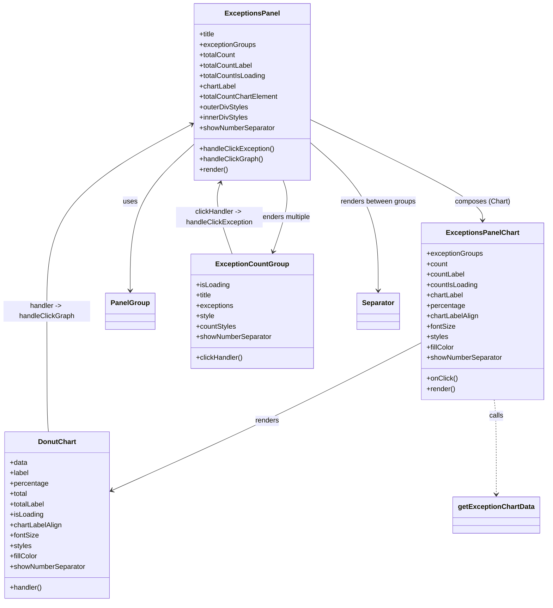

# Diagram: web/portal/src/components/organisms/ExceptionsPanel.organism.js


> Auto-generated by Obscura crawlers

## Diagram 1



### SVG

<svg id="container" width="1254.94140625" xmlns="http://www.w3.org/2000/svg" class="classDiagram" height="1388" viewBox="0 0 1254.94140625 1388" role="graphics-document document" aria-roledescription="class"><style>#container{font-family:"trebuchet ms",verdana,arial,sans-serif;font-size:16px;fill:#333;}@keyframes edge-animation-frame{from{stroke-dashoffset:0;}}@keyframes dash{to{stroke-dashoffset:0;}}#container .edge-animation-slow{stroke-dasharray:9,5!important;stroke-dashoffset:900;animation:dash 50s linear infinite;stroke-linecap:round;}#container .edge-animation-fast{stroke-dasharray:9,5!important;stroke-dashoffset:900;animation:dash 20s linear infinite;stroke-linecap:round;}#container .error-icon{fill:#552222;}#container .error-text{fill:#552222;stroke:#552222;}#container .edge-thickness-normal{stroke-width:1px;}#container .edge-thickness-thick{stroke-width:3.5px;}#container .edge-pattern-solid{stroke-dasharray:0;}#container .edge-thickness-invisible{stroke-width:0;fill:none;}#container .edge-pattern-dashed{stroke-dasharray:3;}#container .edge-pattern-dotted{stroke-dasharray:2;}#container .marker{fill:#333333;stroke:#333333;}#container .marker.cross{stroke:#333333;}#container svg{font-family:"trebuchet ms",verdana,arial,sans-serif;font-size:16px;}#container p{margin:0;}#container g.classGroup text{fill:#9370DB;stroke:none;font-family:"trebuchet ms",verdana,arial,sans-serif;font-size:10px;}#container g.classGroup text .title{font-weight:bolder;}#container .nodeLabel,#container .edgeLabel{color:#131300;}#container .edgeLabel .label rect{fill:#ECECFF;}#container .label text{fill:#131300;}#container .labelBkg{background:#ECECFF;}#container .edgeLabel .label span{background:#ECECFF;}#container .classTitle{font-weight:bolder;}#container .node rect,#container .node circle,#container .node ellipse,#container .node polygon,#container .node path{fill:#ECECFF;stroke:#9370DB;stroke-width:1px;}#container .divider{stroke:#9370DB;stroke-width:1;}#container g.clickable{cursor:pointer;}#container g.classGroup rect{fill:#ECECFF;stroke:#9370DB;}#container g.classGroup line{stroke:#9370DB;stroke-width:1;}#container .classLabel .box{stroke:none;stroke-width:0;fill:#ECECFF;opacity:0.5;}#container .classLabel .label{fill:#9370DB;font-size:10px;}#container .relation{stroke:#333333;stroke-width:1;fill:none;}#container .dashed-line{stroke-dasharray:3;}#container .dotted-line{stroke-dasharray:1 2;}#container #compositionStart,#container .composition{fill:#333333!important;stroke:#333333!important;stroke-width:1;}#container #compositionEnd,#container .composition{fill:#333333!important;stroke:#333333!important;stroke-width:1;}#container #dependencyStart,#container .dependency{fill:#333333!important;stroke:#333333!important;stroke-width:1;}#container #dependencyStart,#container .dependency{fill:#333333!important;stroke:#333333!important;stroke-width:1;}#container #extensionStart,#container .extension{fill:transparent!important;stroke:#333333!important;stroke-width:1;}#container #extensionEnd,#container .extension{fill:transparent!important;stroke:#333333!important;stroke-width:1;}#container #aggregationStart,#container .aggregation{fill:transparent!important;stroke:#333333!important;stroke-width:1;}#container #aggregationEnd,#container .aggregation{fill:transparent!important;stroke:#333333!important;stroke-width:1;}#container #lollipopStart,#container .lollipop{fill:#ECECFF!important;stroke:#333333!important;stroke-width:1;}#container #lollipopEnd,#container .lollipop{fill:#ECECFF!important;stroke:#333333!important;stroke-width:1;}#container .edgeTerminals{font-size:11px;line-height:initial;}#container .classTitleText{text-anchor:middle;font-size:18px;fill:#333;}#container .label-icon{display:inline-block;height:1em;overflow:visible;vertical-align:-0.125em;}#container .node .label-icon path{fill:currentColor;stroke:revert;stroke-width:revert;}#container :root{--mermaid-font-family:"trebuchet ms",verdana,arial,sans-serif;}</style><g><defs><marker id="container_class-aggregationStart" class="marker aggregation class" refX="18" refY="7" markerWidth="190" markerHeight="240" orient="auto"><path d="M 18,7 L9,13 L1,7 L9,1 Z"></path></marker></defs><defs><marker id="container_class-aggregationEnd" class="marker aggregation class" refX="1" refY="7" markerWidth="20" markerHeight="28" orient="auto"><path d="M 18,7 L9,13 L1,7 L9,1 Z"></path></marker></defs><defs><marker id="container_class-extensionStart" class="marker extension class" refX="18" refY="7" markerWidth="190" markerHeight="240" orient="auto"><path d="M 1,7 L18,13 V 1 Z"></path></marker></defs><defs><marker id="container_class-extensionEnd" class="marker extension class" refX="1" refY="7" markerWidth="20" markerHeight="28" orient="auto"><path d="M 1,1 V 13 L18,7 Z"></path></marker></defs><defs><marker id="container_class-compositionStart" class="marker composition class" refX="18" refY="7" markerWidth="190" markerHeight="240" orient="auto"><path d="M 18,7 L9,13 L1,7 L9,1 Z"></path></marker></defs><defs><marker id="container_class-compositionEnd" class="marker composition class" refX="1" refY="7" markerWidth="20" markerHeight="28" orient="auto"><path d="M 18,7 L9,13 L1,7 L9,1 Z"></path></marker></defs><defs><marker id="container_class-dependencyStart" class="marker dependency class" refX="6" refY="7" markerWidth="190" markerHeight="240" orient="auto"><path d="M 5,7 L9,13 L1,7 L9,1 Z"></path></marker></defs><defs><marker id="container_class-dependencyEnd" class="marker dependency class" refX="13" refY="7" markerWidth="20" markerHeight="28" orient="auto"><path d="M 18,7 L9,13 L14,7 L9,1 Z"></path></marker></defs><defs><marker id="container_class-lollipopStart" class="marker lollipop class" refX="13" refY="7" markerWidth="190" markerHeight="240" orient="auto"><circle stroke="black" fill="transparent" cx="7" cy="7" r="6"></circle></marker></defs><defs><marker id="container_class-lollipopEnd" class="marker lollipop class" refX="1" refY="7" markerWidth="190" markerHeight="240" orient="auto"><circle stroke="black" fill="transparent" cx="7" cy="7" r="6"></circle></marker></defs><g class="root"><g class="clusters"></g><g class="edgePaths"><path d="M444.373,332.172L419.866,354.31C395.358,376.448,346.343,420.724,321.836,477.029C297.328,533.333,297.328,601.667,297.328,635.833L297.328,670" id="id_ExceptionsPanel_PanelGroup_1" class="edge-thickness-normal edge-pattern-solid relation" style=";;;" data-edge="true" data-et="edge" data-id="id_ExceptionsPanel_PanelGroup_1" data-points="W3sieCI6NDQ0LjM3MzA0Njg3NSwieSI6MzMyLjE3MjM5NzY4MjAyNDU1fSx7IngiOjI5Ny4zMjgxMjUsInkiOjQ2NX0seyJ4IjoyOTcuMzI4MTI1LCJ5Ijo2NzZ9XQ==" marker-end="url(#container_class-dependencyEnd)"></path><path d="M710.443,275.467L776.657,307.056C842.871,338.645,975.299,401.822,1041.513,440.578C1107.727,479.333,1107.727,493.667,1107.727,500.833L1107.727,508" id="id_ExceptionsPanel_ExceptionsPanelChart_2" class="edge-thickness-normal edge-pattern-solid relation" style=";;;" data-edge="true" data-et="edge" data-id="id_ExceptionsPanel_ExceptionsPanelChart_2" data-points="W3sieCI6NzEwLjQ0MzM1OTM3NSwieSI6Mjc1LjQ2NzMzNzk0MTkwNTV9LHsieCI6MTEwNy43MjY1NjI1LCJ5Ijo0NjV9LHsieCI6MTEwNy43MjY1NjI1LCJ5Ijo1MTR9XQ==" marker-end="url(#container_class-dependencyEnd)"></path><path d="M650.091,416L653,424.167C655.91,432.333,661.729,448.667,657.79,476.058C653.85,503.449,640.151,541.899,633.301,561.123L626.452,580.348" id="id_ExceptionsPanel_ExceptionCountGroup_3" class="edge-thickness-normal edge-pattern-solid relation" style=";;;" data-edge="true" data-et="edge" data-id="id_ExceptionsPanel_ExceptionCountGroup_3" data-points="W3sieCI6NjUwLjA5MDc2MjQxMzUzNzUsInkiOjQxNn0seyJ4Ijo2NjcuNTQ4ODI4MTI1LCJ5Ijo0NjV9LHsieCI6NjI0LjQzODA5NDQyOTM0NzksInkiOjU4Nn1d" marker-end="url(#container_class-dependencyEnd)"></path><path d="M710.443,326.915L737.086,349.93C763.729,372.944,817.015,418.972,843.658,476.153C870.301,533.333,870.301,601.667,870.301,635.833L870.301,670" id="id_ExceptionsPanel_Separator_4" class="edge-thickness-normal edge-pattern-solid relation" style=";;;" data-edge="true" data-et="edge" data-id="id_ExceptionsPanel_Separator_4" data-points="W3sieCI6NzEwLjQ0MzM1OTM3NSwieSI6MzI2LjkxNTQ5MTM2MTA4NzJ9LHsieCI6ODcwLjMwMDc4MTI1LCJ5Ijo0NjV9LHsieCI6ODcwLjMwMDc4MTI1LCJ5Ijo2NzZ9XQ==" marker-end="url(#container_class-dependencyEnd)"></path><path d="M968.512,789.917L913.96,818.097C859.409,846.278,750.306,902.639,631.85,959.552C513.393,1016.465,385.583,1073.93,321.678,1102.662L257.773,1131.395" id="id_ExceptionsPanelChart_DonutChart_5" class="edge-thickness-normal edge-pattern-solid relation" style=";;;" data-edge="true" data-et="edge" data-id="id_ExceptionsPanelChart_DonutChart_5" data-points="W3sieCI6OTY4LjUxMTcxODc1LCJ5Ijo3ODkuOTE2NTk1NDk1MjY5Mn0seyJ4Ijo2NDEuMjAzMTI1LCJ5Ijo5NTl9LHsieCI6MjUyLjMwMDc4MTI1LCJ5IjoxMTMzLjg1NTEzMjM3NDE0NX1d" marker-end="url(#container_class-dependencyEnd)"></path><path d="M1134.896,922L1135.718,928.167C1136.539,934.333,1138.182,946.667,1139.003,983C1139.824,1019.333,1139.824,1079.667,1139.824,1109.833L1139.824,1140" id="id_ExceptionsPanelChart_getExceptionChartData_6" class="edge-thickness-normal edge-pattern-dashed relation" style=";;;" data-edge="true" data-et="edge" data-id="id_ExceptionsPanelChart_getExceptionChartData_6" data-points="W3sieCI6MTEzNC44OTYzNjI4MTEyMDMzLCJ5Ijo5MjJ9LHsieCI6MTEzOS44MjQyMTg3NSwieSI6OTU5fSx7IngiOjExMzkuODI0MjE4NzUsInkiOjExNDZ9XQ==" marker-end="url(#container_class-dependencyEnd)"></path><path d="M530.378,586L523.193,565.833C516.008,545.667,501.638,505.333,497.027,477.942C492.416,450.551,497.564,436.101,500.138,428.877L502.712,421.652" id="id_ExceptionCountGroup_ExceptionsPanel_7" class="edge-thickness-normal edge-pattern-solid relation" style=";;;" data-edge="true" data-et="edge" data-id="id_ExceptionCountGroup_ExceptionsPanel_7" data-points="W3sieCI6NTMwLjM3ODMxMTgyMDY1MjEsInkiOjU4Nn0seyJ4Ijo0ODcuMjY3NTc4MTI1LCJ5Ijo0NjV9LHsieCI6NTA0LjcyNTY0MzgzNjQ2MjQ0LCJ5Ijo0MTZ9XQ==" marker-end="url(#container_class-dependencyEnd)"></path><path d="M111.858,996L111.215,989.833C110.572,983.667,109.286,971.333,108.643,925C108,878.667,108,798.333,108,716C108,633.667,108,549.333,163.182,477.425C218.364,405.517,328.728,346.033,383.909,316.291L439.091,286.55" id="id_DonutChart_ExceptionsPanel_8" class="edge-thickness-normal edge-pattern-solid relation" style=";;;" data-edge="true" data-et="edge" data-id="id_DonutChart_ExceptionsPanel_8" data-points="W3sieCI6MTExLjg1NzUzMjc1MTA5MTcsInkiOjk5Nn0seyJ4IjoxMDgsInkiOjk1OX0seyJ4IjoxMDgsInkiOjcxOH0seyJ4IjoxMDgsInkiOjQ2NX0seyJ4Ijo0NDQuMzczMDQ2ODc1LCJ5IjoyODMuNzAyODI1NjE1Njk4fV0=" marker-end="url(#container_class-dependencyEnd)"></path></g><g class="edgeLabels"><g class="edgeLabel" transform="translate(297.328125, 465)"><g class="label" data-id="id_ExceptionsPanel_PanelGroup_1" transform="translate(-16.4921875, -12)"><foreignObject width="32.984375" height="24"><div xmlns="http://www.w3.org/1999/xhtml" class="labelBkg" style="display: table-cell; white-space: nowrap; line-height: 1.5; max-width: 200px; text-align: center;"><span class="edgeLabel"><p>uses</p></span></div></foreignObject></g></g><g class="edgeLabel" transform="translate(1107.7265625, 465)"><g class="label" data-id="id_ExceptionsPanel_ExceptionsPanelChart_2" transform="translate(-63.171875, -12)"><foreignObject width="126.34375" height="24"><div xmlns="http://www.w3.org/1999/xhtml" class="labelBkg" style="display: table-cell; white-space: nowrap; line-height: 1.5; max-width: 200px; text-align: center;"><span class="edgeLabel"><p>composes (Chart)</p></span></div></foreignObject></g></g><g class="edgeLabel" transform="translate(654.72249, 501)"><g class="label" data-id="id_ExceptionsPanel_ExceptionCountGroup_3" transform="translate(-60.28125, -12)"><foreignObject width="120.5625" height="24"><div xmlns="http://www.w3.org/1999/xhtml" class="labelBkg" style="display: table-cell; white-space: nowrap; line-height: 1.5; max-width: 200px; text-align: center;"><span class="edgeLabel"><p>renders multiple</p></span></div></foreignObject></g></g><g class="edgeLabel" transform="translate(870.30078125, 465)"><g class="label" data-id="id_ExceptionsPanel_Separator_4" transform="translate(-87.953125, -12)"><foreignObject width="175.90625" height="24"><div xmlns="http://www.w3.org/1999/xhtml" class="labelBkg" style="display: table-cell; white-space: nowrap; line-height: 1.5; max-width: 200px; text-align: center;"><span class="edgeLabel"><p>renders between groups</p></span></div></foreignObject></g></g><g class="edgeLabel" transform="translate(614.75324, 970.89218)"><g class="label" data-id="id_ExceptionsPanelChart_DonutChart_5" transform="translate(-27.75, -12)"><foreignObject width="55.5" height="24"><div xmlns="http://www.w3.org/1999/xhtml" class="labelBkg" style="display: table-cell; white-space: nowrap; line-height: 1.5; max-width: 200px; text-align: center;"><span class="edgeLabel"><p>renders</p></span></div></foreignObject></g></g><g class="edgeLabel" transform="translate(1139.82421875, 959)"><g class="label" data-id="id_ExceptionsPanelChart_getExceptionChartData_6" transform="translate(-16.4453125, -12)"><foreignObject width="32.890625" height="24"><div xmlns="http://www.w3.org/1999/xhtml" class="labelBkg" style="display: table-cell; white-space: nowrap; line-height: 1.5; max-width: 200px; text-align: center;"><span class="edgeLabel"><p>calls</p></span></div></foreignObject></g></g><g class="edgeLabel" transform="translate(500.09391, 501)"><g class="label" data-id="id_ExceptionCountGroup_ExceptionsPanel_7" transform="translate(-100, -24)"><foreignObject width="200" height="48"><div xmlns="http://www.w3.org/1999/xhtml" class="labelBkg" style="display: table; white-space: break-spaces; line-height: 1.5; max-width: 200px; text-align: center; width: 200px;"><span class="edgeLabel"><p>clickHandler -&gt; handleClickException</p></span></div></foreignObject></g></g><g class="edgeLabel" transform="translate(108, 718)"><g class="label" data-id="id_DonutChart_ExceptionsPanel_8" transform="translate(-100, -24)"><foreignObject width="200" height="48"><div xmlns="http://www.w3.org/1999/xhtml" class="labelBkg" style="display: table; white-space: break-spaces; line-height: 1.5; max-width: 200px; text-align: center; width: 200px;"><span class="edgeLabel"><p>handler -&gt; handleClickGraph</p></span></div></foreignObject></g></g></g><g class="nodes"><g class="node default" id="classId-ExceptionsPanel-0" transform="translate(577.408203125, 212)"><g class="basic label-container"><path d="M-133.03515625 -204 L133.03515625 -204 L133.03515625 204 L-133.03515625 204" stroke="none" stroke-width="0" fill="#ECECFF" style=""></path><path d="M-133.03515625 -204 C-29.732016298003742 -204, 73.57112365399252 -204, 133.03515625 -204 M-133.03515625 -204 C-54.16122702320892 -204, 24.712702203582154 -204, 133.03515625 -204 M133.03515625 -204 C133.03515625 -87.59894662550778, 133.03515625 28.802106748984443, 133.03515625 204 M133.03515625 -204 C133.03515625 -113.61114157014686, 133.03515625 -23.22228314029371, 133.03515625 204 M133.03515625 204 C27.164395384419933 204, -78.70636548116013 204, -133.03515625 204 M133.03515625 204 C29.835965341359113 204, -73.36322556728177 204, -133.03515625 204 M-133.03515625 204 C-133.03515625 61.072214450907694, -133.03515625 -81.85557109818461, -133.03515625 -204 M-133.03515625 204 C-133.03515625 118.59725773358694, -133.03515625 33.194515467173886, -133.03515625 -204" stroke="#9370DB" stroke-width="1.3" fill="none" stroke-dasharray="0 0" style=""></path></g><g class="annotation-group text" transform="translate(0, -180)"></g><g class="label-group text" transform="translate(-59.7421875, -180)"><g class="label" style="font-weight: bolder" transform="translate(0,-12)"><foreignObject width="119.484375" height="24"><div xmlns="http://www.w3.org/1999/xhtml" style="display: table-cell; white-space: nowrap; line-height: 1.5; max-width: 168px; text-align: center;"><span class="nodeLabel markdown-node-label" style=""><p>ExceptionsPanel</p></span></div></foreignObject></g></g><g class="members-group text" transform="translate(-121.03515625, -132)"><g class="label" style="" transform="translate(0,-12)"><foreignObject width="37.140625" height="24"><div xmlns="http://www.w3.org/1999/xhtml" style="display: table-cell; white-space: nowrap; line-height: 1.5; max-width: 95px; text-align: center;"><span class="nodeLabel markdown-node-label" style=""><p>+title</p></span></div></foreignObject></g><g class="label" style="" transform="translate(0,12)"><foreignObject width="130.171875" height="24"><div xmlns="http://www.w3.org/1999/xhtml" style="display: table-cell; white-space: nowrap; line-height: 1.5; max-width: 188px; text-align: center;"><span class="nodeLabel markdown-node-label" style=""><p>+exceptionGroups</p></span></div></foreignObject></g><g class="label" style="" transform="translate(0,36)"><foreignObject width="84.140625" height="24"><div xmlns="http://www.w3.org/1999/xhtml" style="display: table-cell; white-space: nowrap; line-height: 1.5; max-width: 142px; text-align: center;"><span class="nodeLabel markdown-node-label" style=""><p>+totalCount</p></span></div></foreignObject></g><g class="label" style="" transform="translate(0,60)"><foreignObject width="123.5625" height="24"><div xmlns="http://www.w3.org/1999/xhtml" style="display: table-cell; white-space: nowrap; line-height: 1.5; max-width: 181px; text-align: center;"><span class="nodeLabel markdown-node-label" style=""><p>+totalCountLabel</p></span></div></foreignObject></g><g class="label" style="" transform="translate(0,84)"><foreignObject width="153.5625" height="24"><div xmlns="http://www.w3.org/1999/xhtml" style="display: table-cell; white-space: nowrap; line-height: 1.5; max-width: 212px; text-align: center;"><span class="nodeLabel markdown-node-label" style=""><p>+totalCountIsLoading</p></span></div></foreignObject></g><g class="label" style="" transform="translate(0,108)"><foreignObject width="85.09375" height="24"><div xmlns="http://www.w3.org/1999/xhtml" style="display: table-cell; white-space: nowrap; line-height: 1.5; max-width: 143px; text-align: center;"><span class="nodeLabel markdown-node-label" style=""><p>+chartLabel</p></span></div></foreignObject></g><g class="label" style="" transform="translate(0,132)"><foreignObject width="182.328125" height="24"><div xmlns="http://www.w3.org/1999/xhtml" style="display: table-cell; white-space: nowrap; line-height: 1.5; max-width: 240px; text-align: center;"><span class="nodeLabel markdown-node-label" style=""><p>+totalCountChartElement</p></span></div></foreignObject></g><g class="label" style="" transform="translate(0,156)"><foreignObject width="112.859375" height="24"><div xmlns="http://www.w3.org/1999/xhtml" style="display: table-cell; white-space: nowrap; line-height: 1.5; max-width: 170px; text-align: center;"><span class="nodeLabel markdown-node-label" style=""><p>+outerDivStyles</p></span></div></foreignObject></g><g class="label" style="" transform="translate(0,180)"><foreignObject width="111.921875" height="24"><div xmlns="http://www.w3.org/1999/xhtml" style="display: table-cell; white-space: nowrap; line-height: 1.5; max-width: 169px; text-align: center;"><span class="nodeLabel markdown-node-label" style=""><p>+innerDivStyles</p></span></div></foreignObject></g><g class="label" style="" transform="translate(0,204)"><foreignObject width="174.875" height="24"><div xmlns="http://www.w3.org/1999/xhtml" style="display: table-cell; white-space: nowrap; line-height: 1.5; max-width: 233px; text-align: center;"><span class="nodeLabel markdown-node-label" style=""><p>+showNumberSeparator</p></span></div></foreignObject></g></g><g class="methods-group text" transform="translate(-121.03515625, 132)"><g class="label" style="" transform="translate(0,-12)"><foreignObject width="173.28125" height="24"><div xmlns="http://www.w3.org/1999/xhtml" style="display: table-cell; white-space: nowrap; line-height: 1.5; max-width: 231px; text-align: center;"><span class="nodeLabel markdown-node-label" style=""><p>+handleClickException()</p></span></div></foreignObject></g><g class="label" style="" transform="translate(0,12)"><foreignObject width="145.84375" height="24"><div xmlns="http://www.w3.org/1999/xhtml" style="display: table-cell; white-space: nowrap; line-height: 1.5; max-width: 203px; text-align: center;"><span class="nodeLabel markdown-node-label" style=""><p>+handleClickGraph()</p></span></div></foreignObject></g><g class="label" style="" transform="translate(0,36)"><foreignObject width="66.609375" height="24"><div xmlns="http://www.w3.org/1999/xhtml" style="display: table-cell; white-space: nowrap; line-height: 1.5; max-width: 124px; text-align: center;"><span class="nodeLabel markdown-node-label" style=""><p>+render()</p></span></div></foreignObject></g></g><g class="divider" style=""><path d="M-133.03515625 -156 C-35.54171490838495 -156, 61.95172643323011 -156, 133.03515625 -156 M-133.03515625 -156 C-26.73234036660439 -156, 79.57047551679122 -156, 133.03515625 -156" stroke="#9370DB" stroke-width="1.3" fill="none" stroke-dasharray="0 0" style=""></path></g><g class="divider" style=""><path d="M-133.03515625 108 C-64.76895117974654 108, 3.4972538905069257 108, 133.03515625 108 M-133.03515625 108 C-55.460598247390664 108, 22.113959755218673 108, 133.03515625 108" stroke="#9370DB" stroke-width="1.3" fill="none" stroke-dasharray="0 0" style=""></path></g></g><g class="node default" id="classId-ExceptionsPanelChart-1" transform="translate(1107.7265625, 718)"><g class="basic label-container"><path d="M-139.21484375 -204 L139.21484375 -204 L139.21484375 204 L-139.21484375 204" stroke="none" stroke-width="0" fill="#ECECFF" style=""></path><path d="M-139.21484375 -204 C-33.479502574593496 -204, 72.25583860081301 -204, 139.21484375 -204 M-139.21484375 -204 C-82.3552622423982 -204, -25.49568073479641 -204, 139.21484375 -204 M139.21484375 -204 C139.21484375 -103.12357471930702, 139.21484375 -2.2471494386140307, 139.21484375 204 M139.21484375 -204 C139.21484375 -68.81441549904619, 139.21484375 66.37116900190762, 139.21484375 204 M139.21484375 204 C75.60362673712278 204, 11.992409724245562 204, -139.21484375 204 M139.21484375 204 C70.76420427466897 204, 2.3135647993379393 204, -139.21484375 204 M-139.21484375 204 C-139.21484375 115.30475494375779, -139.21484375 26.60950988751557, -139.21484375 -204 M-139.21484375 204 C-139.21484375 51.11359030763671, -139.21484375 -101.77281938472657, -139.21484375 -204" stroke="#9370DB" stroke-width="1.3" fill="none" stroke-dasharray="0 0" style=""></path></g><g class="annotation-group text" transform="translate(0, -180)"></g><g class="label-group text" transform="translate(-79.5546875, -180)"><g class="label" style="font-weight: bolder" transform="translate(0,-12)"><foreignObject width="159.109375" height="24"><div xmlns="http://www.w3.org/1999/xhtml" style="display: table-cell; white-space: nowrap; line-height: 1.5; max-width: 207px; text-align: center;"><span class="nodeLabel markdown-node-label" style=""><p>ExceptionsPanelChart</p></span></div></foreignObject></g></g><g class="members-group text" transform="translate(-127.21484375, -132)"><g class="label" style="" transform="translate(0,-12)"><foreignObject width="130.171875" height="24"><div xmlns="http://www.w3.org/1999/xhtml" style="display: table-cell; white-space: nowrap; line-height: 1.5; max-width: 188px; text-align: center;"><span class="nodeLabel markdown-node-label" style=""><p>+exceptionGroups</p></span></div></foreignObject></g><g class="label" style="" transform="translate(0,12)"><foreignObject width="49.125" height="24"><div xmlns="http://www.w3.org/1999/xhtml" style="display: table-cell; white-space: nowrap; line-height: 1.5; max-width: 107px; text-align: center;"><span class="nodeLabel markdown-node-label" style=""><p>+count</p></span></div></foreignObject></g><g class="label" style="" transform="translate(0,36)"><foreignObject width="88.546875" height="24"><div xmlns="http://www.w3.org/1999/xhtml" style="display: table-cell; white-space: nowrap; line-height: 1.5; max-width: 146px; text-align: center;"><span class="nodeLabel markdown-node-label" style=""><p>+countLabel</p></span></div></foreignObject></g><g class="label" style="" transform="translate(0,60)"><foreignObject width="118.546875" height="24"><div xmlns="http://www.w3.org/1999/xhtml" style="display: table-cell; white-space: nowrap; line-height: 1.5; max-width: 177px; text-align: center;"><span class="nodeLabel markdown-node-label" style=""><p>+countIsLoading</p></span></div></foreignObject></g><g class="label" style="" transform="translate(0,84)"><foreignObject width="85.09375" height="24"><div xmlns="http://www.w3.org/1999/xhtml" style="display: table-cell; white-space: nowrap; line-height: 1.5; max-width: 143px; text-align: center;"><span class="nodeLabel markdown-node-label" style=""><p>+chartLabel</p></span></div></foreignObject></g><g class="label" style="" transform="translate(0,108)"><foreignObject width="88.328125" height="24"><div xmlns="http://www.w3.org/1999/xhtml" style="display: table-cell; white-space: nowrap; line-height: 1.5; max-width: 146px; text-align: center;"><span class="nodeLabel markdown-node-label" style=""><p>+percentage</p></span></div></foreignObject></g><g class="label" style="" transform="translate(0,132)"><foreignObject width="121.15625" height="24"><div xmlns="http://www.w3.org/1999/xhtml" style="display: table-cell; white-space: nowrap; line-height: 1.5; max-width: 179px; text-align: center;"><span class="nodeLabel markdown-node-label" style=""><p>+chartLabelAlign</p></span></div></foreignObject></g><g class="label" style="" transform="translate(0,156)"><foreignObject width="66.28125" height="24"><div xmlns="http://www.w3.org/1999/xhtml" style="display: table-cell; white-space: nowrap; line-height: 1.5; max-width: 124px; text-align: center;"><span class="nodeLabel markdown-node-label" style=""><p>+fontSize</p></span></div></foreignObject></g><g class="label" style="" transform="translate(0,180)"><foreignObject width="49.828125" height="24"><div xmlns="http://www.w3.org/1999/xhtml" style="display: table-cell; white-space: nowrap; line-height: 1.5; max-width: 107px; text-align: center;"><span class="nodeLabel markdown-node-label" style=""><p>+styles</p></span></div></foreignObject></g><g class="label" style="" transform="translate(0,204)"><foreignObject width="64.4375" height="24"><div xmlns="http://www.w3.org/1999/xhtml" style="display: table-cell; white-space: nowrap; line-height: 1.5; max-width: 123px; text-align: center;"><span class="nodeLabel markdown-node-label" style=""><p>+fillColor</p></span></div></foreignObject></g><g class="label" style="" transform="translate(0,228)"><foreignObject width="174.875" height="24"><div xmlns="http://www.w3.org/1999/xhtml" style="display: table-cell; white-space: nowrap; line-height: 1.5; max-width: 233px; text-align: center;"><span class="nodeLabel markdown-node-label" style=""><p>+showNumberSeparator</p></span></div></foreignObject></g></g><g class="methods-group text" transform="translate(-127.21484375, 156)"><g class="label" style="" transform="translate(0,-12)"><foreignObject width="70.921875" height="24"><div xmlns="http://www.w3.org/1999/xhtml" style="display: table-cell; white-space: nowrap; line-height: 1.5; max-width: 128px; text-align: center;"><span class="nodeLabel markdown-node-label" style=""><p>+onClick()</p></span></div></foreignObject></g><g class="label" style="" transform="translate(0,12)"><foreignObject width="66.609375" height="24"><div xmlns="http://www.w3.org/1999/xhtml" style="display: table-cell; white-space: nowrap; line-height: 1.5; max-width: 124px; text-align: center;"><span class="nodeLabel markdown-node-label" style=""><p>+render()</p></span></div></foreignObject></g></g><g class="divider" style=""><path d="M-139.21484375 -156 C-39.48263991585604 -156, 60.24956391828792 -156, 139.21484375 -156 M-139.21484375 -156 C-58.26631147342174 -156, 22.682220803156525 -156, 139.21484375 -156" stroke="#9370DB" stroke-width="1.3" fill="none" stroke-dasharray="0 0" style=""></path></g><g class="divider" style=""><path d="M-139.21484375 132 C-69.3756213752615 132, 0.46360099947699496 132, 139.21484375 132 M-139.21484375 132 C-40.47924574666182 132, 58.256352256676365 132, 139.21484375 132" stroke="#9370DB" stroke-width="1.3" fill="none" stroke-dasharray="0 0" style=""></path></g></g><g class="node default" id="classId-PanelGroup-2" transform="translate(297.328125, 718)"><g class="basic label-container"><path d="M-54.328125 -42 L54.328125 -42 L54.328125 42 L-54.328125 42" stroke="none" stroke-width="0" fill="#ECECFF" style=""></path><path d="M-54.328125 -42 C-21.890959131057087 -42, 10.546206737885825 -42, 54.328125 -42 M-54.328125 -42 C-26.030084439668745 -42, 2.267956120662511 -42, 54.328125 -42 M54.328125 -42 C54.328125 -21.290107725489445, 54.328125 -0.5802154509788906, 54.328125 42 M54.328125 -42 C54.328125 -13.767108278959526, 54.328125 14.465783442080948, 54.328125 42 M54.328125 42 C21.28172520460687 42, -11.764674590786257 42, -54.328125 42 M54.328125 42 C30.993475354384596 42, 7.658825708769193 42, -54.328125 42 M-54.328125 42 C-54.328125 15.486007659123072, -54.328125 -11.027984681753857, -54.328125 -42 M-54.328125 42 C-54.328125 14.507412599849001, -54.328125 -12.985174800301998, -54.328125 -42" stroke="#9370DB" stroke-width="1.3" fill="none" stroke-dasharray="0 0" style=""></path></g><g class="annotation-group text" transform="translate(0, -18)"></g><g class="label-group text" transform="translate(-42.328125, -18)"><g class="label" style="font-weight: bolder" transform="translate(0,-12)"><foreignObject width="84.65625" height="24"><div xmlns="http://www.w3.org/1999/xhtml" style="display: table-cell; white-space: nowrap; line-height: 1.5; max-width: 134px; text-align: center;"><span class="nodeLabel markdown-node-label" style=""><p>PanelGroup</p></span></div></foreignObject></g></g><g class="members-group text" transform="translate(-42.328125, 30)"></g><g class="methods-group text" transform="translate(-42.328125, 60)"></g><g class="divider" style=""><path d="M-54.328125 6 C-15.162374793697147 6, 24.003375412605706 6, 54.328125 6 M-54.328125 6 C-29.072303673308138 6, -3.816482346616276 6, 54.328125 6" stroke="#9370DB" stroke-width="1.3" fill="none" stroke-dasharray="0 0" style=""></path></g><g class="divider" style=""><path d="M-54.328125 24 C-12.740895198051597 24, 28.846334603896807 24, 54.328125 24 M-54.328125 24 C-32.28899170545358 24, -10.249858410907159 24, 54.328125 24" stroke="#9370DB" stroke-width="1.3" fill="none" stroke-dasharray="0 0" style=""></path></g></g><g class="node default" id="classId-ExceptionCountGroup-3" transform="translate(577.408203125, 718)"><g class="basic label-container"><path d="M-139.05859375 -132 L139.05859375 -132 L139.05859375 132 L-139.05859375 132" stroke="none" stroke-width="0" fill="#ECECFF" style=""></path><path d="M-139.05859375 -132 C-55.69061787665218 -132, 27.677357996695633 -132, 139.05859375 -132 M-139.05859375 -132 C-54.90772274074581 -132, 29.243148268508378 -132, 139.05859375 -132 M139.05859375 -132 C139.05859375 -65.74996610733643, 139.05859375 0.5000677853271327, 139.05859375 132 M139.05859375 -132 C139.05859375 -61.629944958776335, 139.05859375 8.74011008244733, 139.05859375 132 M139.05859375 132 C28.554943559546217 132, -81.94870663090757 132, -139.05859375 132 M139.05859375 132 C33.19800135112193 132, -72.66259104775614 132, -139.05859375 132 M-139.05859375 132 C-139.05859375 72.50834438194256, -139.05859375 13.016688763885128, -139.05859375 -132 M-139.05859375 132 C-139.05859375 46.40912902405995, -139.05859375 -39.1817419518801, -139.05859375 -132" stroke="#9370DB" stroke-width="1.3" fill="none" stroke-dasharray="0 0" style=""></path></g><g class="annotation-group text" transform="translate(0, -108)"></g><g class="label-group text" transform="translate(-79.2421875, -108)"><g class="label" style="font-weight: bolder" transform="translate(0,-12)"><foreignObject width="158.484375" height="24"><div xmlns="http://www.w3.org/1999/xhtml" style="display: table-cell; white-space: nowrap; line-height: 1.5; max-width: 207px; text-align: center;"><span class="nodeLabel markdown-node-label" style=""><p>ExceptionCountGroup</p></span></div></foreignObject></g></g><g class="members-group text" transform="translate(-127.05859375, -60)"><g class="label" style="" transform="translate(0,-12)"><foreignObject width="77.203125" height="24"><div xmlns="http://www.w3.org/1999/xhtml" style="display: table-cell; white-space: nowrap; line-height: 1.5; max-width: 135px; text-align: center;"><span class="nodeLabel markdown-node-label" style=""><p>+isLoading</p></span></div></foreignObject></g><g class="label" style="" transform="translate(0,12)"><foreignObject width="37.140625" height="24"><div xmlns="http://www.w3.org/1999/xhtml" style="display: table-cell; white-space: nowrap; line-height: 1.5; max-width: 95px; text-align: center;"><span class="nodeLabel markdown-node-label" style=""><p>+title</p></span></div></foreignObject></g><g class="label" style="" transform="translate(0,36)"><foreignObject width="86.21875" height="24"><div xmlns="http://www.w3.org/1999/xhtml" style="display: table-cell; white-space: nowrap; line-height: 1.5; max-width: 144px; text-align: center;"><span class="nodeLabel markdown-node-label" style=""><p>+exceptions</p></span></div></foreignObject></g><g class="label" style="" transform="translate(0,60)"><foreignObject width="42.359375" height="24"><div xmlns="http://www.w3.org/1999/xhtml" style="display: table-cell; white-space: nowrap; line-height: 1.5; max-width: 100px; text-align: center;"><span class="nodeLabel markdown-node-label" style=""><p>+style</p></span></div></foreignObject></g><g class="label" style="" transform="translate(0,84)"><foreignObject width="92.21875" height="24"><div xmlns="http://www.w3.org/1999/xhtml" style="display: table-cell; white-space: nowrap; line-height: 1.5; max-width: 150px; text-align: center;"><span class="nodeLabel markdown-node-label" style=""><p>+countStyles</p></span></div></foreignObject></g><g class="label" style="" transform="translate(0,108)"><foreignObject width="174.875" height="24"><div xmlns="http://www.w3.org/1999/xhtml" style="display: table-cell; white-space: nowrap; line-height: 1.5; max-width: 233px; text-align: center;"><span class="nodeLabel markdown-node-label" style=""><p>+showNumberSeparator</p></span></div></foreignObject></g></g><g class="methods-group text" transform="translate(-127.05859375, 108)"><g class="label" style="" transform="translate(0,-12)"><foreignObject width="109.078125" height="24"><div xmlns="http://www.w3.org/1999/xhtml" style="display: table-cell; white-space: nowrap; line-height: 1.5; max-width: 166px; text-align: center;"><span class="nodeLabel markdown-node-label" style=""><p>+clickHandler()</p></span></div></foreignObject></g></g><g class="divider" style=""><path d="M-139.05859375 -84 C-32.88434058148549 -84, 73.28991258702902 -84, 139.05859375 -84 M-139.05859375 -84 C-35.134247485635385 -84, 68.79009877872923 -84, 139.05859375 -84" stroke="#9370DB" stroke-width="1.3" fill="none" stroke-dasharray="0 0" style=""></path></g><g class="divider" style=""><path d="M-139.05859375 84 C-61.063516976258825 84, 16.93155979748235 84, 139.05859375 84 M-139.05859375 84 C-30.66650874231449 84, 77.72557626537102 84, 139.05859375 84" stroke="#9370DB" stroke-width="1.3" fill="none" stroke-dasharray="0 0" style=""></path></g></g><g class="node default" id="classId-DonutChart-4" transform="translate(131.875, 1188)"><g class="basic label-container"><path d="M-120.42578125 -192 L120.42578125 -192 L120.42578125 192 L-120.42578125 192" stroke="none" stroke-width="0" fill="#ECECFF" style=""></path><path d="M-120.42578125 -192 C-37.724213542432324 -192, 44.97735416513535 -192, 120.42578125 -192 M-120.42578125 -192 C-36.34475934098302 -192, 47.736262568033965 -192, 120.42578125 -192 M120.42578125 -192 C120.42578125 -96.09010062984392, 120.42578125 -0.18020125968783418, 120.42578125 192 M120.42578125 -192 C120.42578125 -66.80211110378909, 120.42578125 58.395777792421825, 120.42578125 192 M120.42578125 192 C67.08291717323758 192, 13.740053096475137 192, -120.42578125 192 M120.42578125 192 C67.10736603620262 192, 13.788950822405255 192, -120.42578125 192 M-120.42578125 192 C-120.42578125 88.40390160302343, -120.42578125 -15.192196793953144, -120.42578125 -192 M-120.42578125 192 C-120.42578125 72.05185801543102, -120.42578125 -47.896283969137954, -120.42578125 -192" stroke="#9370DB" stroke-width="1.3" fill="none" stroke-dasharray="0 0" style=""></path></g><g class="annotation-group text" transform="translate(0, -168)"></g><g class="label-group text" transform="translate(-41.9765625, -168)"><g class="label" style="font-weight: bolder" transform="translate(0,-12)"><foreignObject width="83.953125" height="24"><div xmlns="http://www.w3.org/1999/xhtml" style="display: table-cell; white-space: nowrap; line-height: 1.5; max-width: 133px; text-align: center;"><span class="nodeLabel markdown-node-label" style=""><p>DonutChart</p></span></div></foreignObject></g></g><g class="members-group text" transform="translate(-108.42578125, -120)"><g class="label" style="" transform="translate(0,-12)"><foreignObject width="40.625" height="24"><div xmlns="http://www.w3.org/1999/xhtml" style="display: table-cell; white-space: nowrap; line-height: 1.5; max-width: 98px; text-align: center;"><span class="nodeLabel markdown-node-label" style=""><p>+data</p></span></div></foreignObject></g><g class="label" style="" transform="translate(0,12)"><foreignObject width="44.21875" height="24"><div xmlns="http://www.w3.org/1999/xhtml" style="display: table-cell; white-space: nowrap; line-height: 1.5; max-width: 102px; text-align: center;"><span class="nodeLabel markdown-node-label" style=""><p>+label</p></span></div></foreignObject></g><g class="label" style="" transform="translate(0,36)"><foreignObject width="88.328125" height="24"><div xmlns="http://www.w3.org/1999/xhtml" style="display: table-cell; white-space: nowrap; line-height: 1.5; max-width: 146px; text-align: center;"><span class="nodeLabel markdown-node-label" style=""><p>+percentage</p></span></div></foreignObject></g><g class="label" style="" transform="translate(0,60)"><foreignObject width="41.6875" height="24"><div xmlns="http://www.w3.org/1999/xhtml" style="display: table-cell; white-space: nowrap; line-height: 1.5; max-width: 99px; text-align: center;"><span class="nodeLabel markdown-node-label" style=""><p>+total</p></span></div></foreignObject></g><g class="label" style="" transform="translate(0,84)"><foreignObject width="81.109375" height="24"><div xmlns="http://www.w3.org/1999/xhtml" style="display: table-cell; white-space: nowrap; line-height: 1.5; max-width: 139px; text-align: center;"><span class="nodeLabel markdown-node-label" style=""><p>+totalLabel</p></span></div></foreignObject></g><g class="label" style="" transform="translate(0,108)"><foreignObject width="77.203125" height="24"><div xmlns="http://www.w3.org/1999/xhtml" style="display: table-cell; white-space: nowrap; line-height: 1.5; max-width: 135px; text-align: center;"><span class="nodeLabel markdown-node-label" style=""><p>+isLoading</p></span></div></foreignObject></g><g class="label" style="" transform="translate(0,132)"><foreignObject width="121.15625" height="24"><div xmlns="http://www.w3.org/1999/xhtml" style="display: table-cell; white-space: nowrap; line-height: 1.5; max-width: 179px; text-align: center;"><span class="nodeLabel markdown-node-label" style=""><p>+chartLabelAlign</p></span></div></foreignObject></g><g class="label" style="" transform="translate(0,156)"><foreignObject width="66.28125" height="24"><div xmlns="http://www.w3.org/1999/xhtml" style="display: table-cell; white-space: nowrap; line-height: 1.5; max-width: 124px; text-align: center;"><span class="nodeLabel markdown-node-label" style=""><p>+fontSize</p></span></div></foreignObject></g><g class="label" style="" transform="translate(0,180)"><foreignObject width="49.828125" height="24"><div xmlns="http://www.w3.org/1999/xhtml" style="display: table-cell; white-space: nowrap; line-height: 1.5; max-width: 107px; text-align: center;"><span class="nodeLabel markdown-node-label" style=""><p>+styles</p></span></div></foreignObject></g><g class="label" style="" transform="translate(0,204)"><foreignObject width="64.4375" height="24"><div xmlns="http://www.w3.org/1999/xhtml" style="display: table-cell; white-space: nowrap; line-height: 1.5; max-width: 123px; text-align: center;"><span class="nodeLabel markdown-node-label" style=""><p>+fillColor</p></span></div></foreignObject></g><g class="label" style="" transform="translate(0,228)"><foreignObject width="174.875" height="24"><div xmlns="http://www.w3.org/1999/xhtml" style="display: table-cell; white-space: nowrap; line-height: 1.5; max-width: 233px; text-align: center;"><span class="nodeLabel markdown-node-label" style=""><p>+showNumberSeparator</p></span></div></foreignObject></g></g><g class="methods-group text" transform="translate(-108.42578125, 168)"><g class="label" style="" transform="translate(0,-12)"><foreignObject width="74.890625" height="24"><div xmlns="http://www.w3.org/1999/xhtml" style="display: table-cell; white-space: nowrap; line-height: 1.5; max-width: 132px; text-align: center;"><span class="nodeLabel markdown-node-label" style=""><p>+handler()</p></span></div></foreignObject></g></g><g class="divider" style=""><path d="M-120.42578125 -144 C-62.596791142831165 -144, -4.76780103566233 -144, 120.42578125 -144 M-120.42578125 -144 C-41.054338957609986 -144, 38.31710333478003 -144, 120.42578125 -144" stroke="#9370DB" stroke-width="1.3" fill="none" stroke-dasharray="0 0" style=""></path></g><g class="divider" style=""><path d="M-120.42578125 144 C-53.23821275091575 144, 13.9493557481685 144, 120.42578125 144 M-120.42578125 144 C-40.39267381973161 144, 39.640433610536775 144, 120.42578125 144" stroke="#9370DB" stroke-width="1.3" fill="none" stroke-dasharray="0 0" style=""></path></g></g><g class="node default" id="classId-Separator-5" transform="translate(870.30078125, 718)"><g class="basic label-container"><path d="M-48.2109375 -42 L48.2109375 -42 L48.2109375 42 L-48.2109375 42" stroke="none" stroke-width="0" fill="#ECECFF" style=""></path><path d="M-48.2109375 -42 C-15.049593242709854 -42, 18.111751014580292 -42, 48.2109375 -42 M-48.2109375 -42 C-19.940508508218088 -42, 8.329920483563825 -42, 48.2109375 -42 M48.2109375 -42 C48.2109375 -16.909585018375783, 48.2109375 8.180829963248435, 48.2109375 42 M48.2109375 -42 C48.2109375 -23.95371447412822, 48.2109375 -5.907428948256438, 48.2109375 42 M48.2109375 42 C15.520561942451586 42, -17.169813615096828 42, -48.2109375 42 M48.2109375 42 C22.7228518292456 42, -2.7652338415088025 42, -48.2109375 42 M-48.2109375 42 C-48.2109375 18.866869492987494, -48.2109375 -4.266261014025012, -48.2109375 -42 M-48.2109375 42 C-48.2109375 18.757871939419868, -48.2109375 -4.484256121160264, -48.2109375 -42" stroke="#9370DB" stroke-width="1.3" fill="none" stroke-dasharray="0 0" style=""></path></g><g class="annotation-group text" transform="translate(0, -18)"></g><g class="label-group text" transform="translate(-36.2109375, -18)"><g class="label" style="font-weight: bolder" transform="translate(0,-12)"><foreignObject width="72.421875" height="24"><div xmlns="http://www.w3.org/1999/xhtml" style="display: table-cell; white-space: nowrap; line-height: 1.5; max-width: 122px; text-align: center;"><span class="nodeLabel markdown-node-label" style=""><p>Separator</p></span></div></foreignObject></g></g><g class="members-group text" transform="translate(-36.2109375, 30)"></g><g class="methods-group text" transform="translate(-36.2109375, 60)"></g><g class="divider" style=""><path d="M-48.2109375 6 C-12.430454849782706 6, 23.35002780043459 6, 48.2109375 6 M-48.2109375 6 C-13.187269709803736 6, 21.836398080392527 6, 48.2109375 6" stroke="#9370DB" stroke-width="1.3" fill="none" stroke-dasharray="0 0" style=""></path></g><g class="divider" style=""><path d="M-48.2109375 24 C-24.369397608497575 24, -0.5278577169951504 24, 48.2109375 24 M-48.2109375 24 C-25.732915504454354 24, -3.254893508908708 24, 48.2109375 24" stroke="#9370DB" stroke-width="1.3" fill="none" stroke-dasharray="0 0" style=""></path></g></g><g class="node default" id="classId-getExceptionChartData-6" transform="translate(1139.82421875, 1188)"><g class="basic label-container"><path d="M-96.140625 -42 L96.140625 -42 L96.140625 42 L-96.140625 42" stroke="none" stroke-width="0" fill="#ECECFF" style=""></path><path d="M-96.140625 -42 C-27.475253223967812 -42, 41.190118552064376 -42, 96.140625 -42 M-96.140625 -42 C-54.56853400715391 -42, -12.996443014307815 -42, 96.140625 -42 M96.140625 -42 C96.140625 -20.019506327961125, 96.140625 1.9609873440777505, 96.140625 42 M96.140625 -42 C96.140625 -18.620071391243066, 96.140625 4.7598572175138685, 96.140625 42 M96.140625 42 C27.132417220851877 42, -41.875790558296245 42, -96.140625 42 M96.140625 42 C21.255994849994835 42, -53.62863530001033 42, -96.140625 42 M-96.140625 42 C-96.140625 18.203298716971208, -96.140625 -5.593402566057584, -96.140625 -42 M-96.140625 42 C-96.140625 22.497168681109628, -96.140625 2.9943373622192553, -96.140625 -42" stroke="#9370DB" stroke-width="1.3" fill="none" stroke-dasharray="0 0" style=""></path></g><g class="annotation-group text" transform="translate(0, -18)"></g><g class="label-group text" transform="translate(-84.140625, -18)"><g class="label" style="font-weight: bolder" transform="translate(0,-12)"><foreignObject width="168.28125" height="24"><div xmlns="http://www.w3.org/1999/xhtml" style="display: table-cell; white-space: nowrap; line-height: 1.5; max-width: 215px; text-align: center;"><span class="nodeLabel markdown-node-label" style=""><p>getExceptionChartData</p></span></div></foreignObject></g></g><g class="members-group text" transform="translate(-84.140625, 30)"></g><g class="methods-group text" transform="translate(-84.140625, 60)"></g><g class="divider" style=""><path d="M-96.140625 6 C-39.69339065663558 6, 16.753843686728842 6, 96.140625 6 M-96.140625 6 C-34.328760350970654 6, 27.48310429805869 6, 96.140625 6" stroke="#9370DB" stroke-width="1.3" fill="none" stroke-dasharray="0 0" style=""></path></g><g class="divider" style=""><path d="M-96.140625 24 C-39.85550004233802 24, 16.429624915323956 24, 96.140625 24 M-96.140625 24 C-39.61724744599047 24, 16.906130108019056 24, 96.140625 24" stroke="#9370DB" stroke-width="1.3" fill="none" stroke-dasharray="0 0" style=""></path></g></g></g></g></g></svg>

## Diagram 2

```mermaid
flowchart LR
    subgraph Input
        EG[exceptionGroups]
        TOTAL[totalCount]
    end
    EG --> |filter includeInDonutChart| FilteredGroups[filtered groups]
    FilteredGroups --> |map & flat| ChartExceptions[chartExceptions (array of exceptions)]
    ChartExceptions --> SumCounts[exceptionsCount = sum(count)]
    ChartExceptions --> getExceptionChartData[getExceptionChartData(chartExceptions, totalCount, exceptionsCount)]
    SumCounts --> getExceptionChartData
    getExceptionChartData --> ChartData[chartData]
    ChartData --> Donut[DonutChart(data=chartData)]
    TOTAL --> Donut
    Donut -->|onClick| ClickGraph[handleClickGraph()]
    ExceptionList[ExceptionCountGroup items] -->|click| ClickException[handleClickException()]
    EG --> ExceptionList
    style Donut fill:#f9f,stroke:#333,stroke-width:1px
    style ExceptionList fill:#fffae6,stroke:#333,stroke-width:1px
```

> SVG rendering failed for this diagram.
