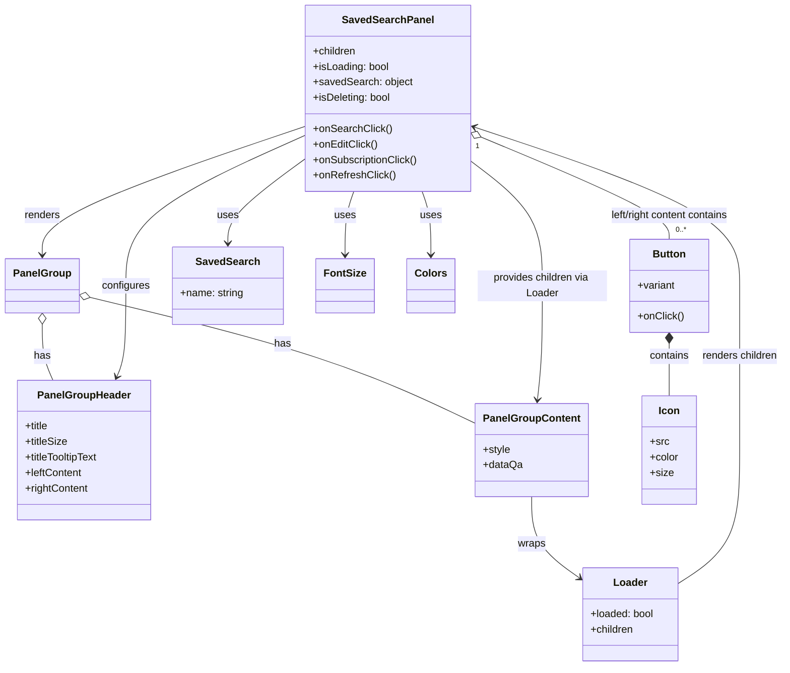

# Diagram: web/portal/src/components/organisms/SavedSearchPanel.organism.js

> Auto-generated by Obscura crawlers

## Mermaid

### SVG

<svg id="container" width="1199.77734375" xmlns="http://www.w3.org/2000/svg" class="classDiagram" height="1030" viewBox="0 0 1199.77734375 1030" role="graphics-document document" aria-roledescription="class"><g><defs><marker id="container_class-aggregationStart" class="marker aggregation class" refX="18" refY="7" markerWidth="190" markerHeight="240" orient="auto"><path d="M 18,7 L9,13 L1,7 L9,1 Z"></path></marker></defs><defs><marker id="container_class-aggregationEnd" class="marker aggregation class" refX="1" refY="7" markerWidth="20" markerHeight="28" orient="auto"><path d="M 18,7 L9,13 L1,7 L9,1 Z"></path></marker></defs><defs><marker id="container_class-extensionStart" class="marker extension class" refX="18" refY="7" markerWidth="190" markerHeight="240" orient="auto"><path d="M 1,7 L18,13 V 1 Z"></path></marker></defs><defs><marker id="container_class-extensionEnd" class="marker extension class" refX="1" refY="7" markerWidth="20" markerHeight="28" orient="auto"><path d="M 1,1 V 13 L18,7 Z"></path></marker></defs><defs><marker id="container_class-compositionStart" class="marker composition class" refX="18" refY="7" markerWidth="190" markerHeight="240" orient="auto"><path d="M 18,7 L9,13 L1,7 L9,1 Z"></path></marker></defs><defs><marker id="container_class-compositionEnd" class="marker composition class" refX="1" refY="7" markerWidth="20" markerHeight="28" orient="auto"><path d="M 18,7 L9,13 L1,7 L9,1 Z"></path></marker></defs><defs><marker id="container_class-dependencyStart" class="marker dependency class" refX="6" refY="7" markerWidth="190" markerHeight="240" orient="auto"><path d="M 5,7 L9,13 L1,7 L9,1 Z"></path></marker></defs><defs><marker id="container_class-dependencyEnd" class="marker dependency class" refX="13" refY="7" markerWidth="20" markerHeight="28" orient="auto"><path d="M 18,7 L9,13 L14,7 L9,1 Z"></path></marker></defs><defs><marker id="container_class-lollipopStart" class="marker lollipop class" refX="13" refY="7" markerWidth="190" markerHeight="240" orient="auto"><circle stroke="black" fill="transparent" cx="7" cy="7" r="6"></circle></marker></defs><defs><marker id="container_class-lollipopEnd" class="marker lollipop class" refX="1" refY="7" markerWidth="190" markerHeight="240" orient="auto"><circle stroke="black" fill="transparent" cx="7" cy="7" r="6"></circle></marker></defs><g class="root"><g class="clusters"></g><g class="edgePaths"><path d="M460.23,195.762L393.913,218.635C327.596,241.508,194.962,287.254,128.645,320.294C62.328,353.333,62.328,373.667,62.328,383.833L62.328,394" id="id_SavedSearchPanel_PanelGroup_1" class="edge-thickness-normal edge-pattern-solid relation" style=";;;" data-edge="true" data-et="edge" data-id="id_SavedSearchPanel_PanelGroup_1" data-points="W3sieCI6NDYwLjIzMDQ2ODc1LCJ5IjoxOTUuNzYyMjY4Nzg1NTg5MzZ9LHsieCI6NjIuMzI4MTI1LCJ5IjozMzN9LHsieCI6NjIuMzI4MTI1LCJ5Ijo0MDB9XQ==" marker-end="url(#container_class-dependencyEnd)"></path><path d="M62.328,501.25L62.328,509.542C62.328,517.833,62.328,534.417,65.021,548.875C67.714,563.333,73.099,575.667,75.792,581.833L78.485,588" id="id_PanelGroup_PanelGroupHeader_2" class="edge-thickness-normal edge-pattern-solid relation" style=";;;" data-edge="true" data-et="edge" data-id="id_PanelGroup_PanelGroupHeader_2" data-points="W3sieCI6NjIuMzI4MTI1LCJ5Ijo0ODR9LHsieCI6NjIuMzI4MTI1LCJ5Ijo1NTF9LHsieCI6NzguNDg0NzI1MjE1NTE3MjQsInkiOjU4OH1d" marker-start="url(#container_class-aggregationStart)"></path><path d="M133.406,459.499L195.351,474.749C257.295,489.999,381.185,520.5,479.236,553.215C577.286,585.93,649.499,620.861,685.605,638.326L721.711,655.791" id="id_PanelGroup_PanelGroupContent_3" class="edge-thickness-normal edge-pattern-solid relation" style=";;;" data-edge="true" data-et="edge" data-id="id_PanelGroup_PanelGroupContent_3" data-points="W3sieCI6MTE2LjY1NjI1LCJ5Ijo0NTUuMzc1MDgyNzEzNTMzMjN9LHsieCI6NTA1LjA3NDIxODc1LCJ5Ijo1NTF9LHsieCI6NzIxLjcxMDkzNzUsInkiOjY1NS43OTA5Nzk4MTQ2OTY2fV0=" marker-start="url(#container_class-aggregationStart)"></path><path d="M460.23,209.681L415.019,230.234C369.807,250.787,279.384,291.894,234.173,330.613C188.961,369.333,188.961,405.667,188.961,442C188.961,478.333,188.961,514.667,186.668,538.084C184.376,561.5,179.791,572.001,177.498,577.251L175.205,582.501" id="id_SavedSearchPanel_PanelGroupHeader_4" class="edge-thickness-normal edge-pattern-solid relation" style=";;;" data-edge="true" data-et="edge" data-id="id_SavedSearchPanel_PanelGroupHeader_4" data-points="W3sieCI6NDYwLjIzMDQ2ODc1LCJ5IjoyMDkuNjgwOTA4ODg1NzcxMn0seyJ4IjoxODguOTYwOTM3NSwieSI6MzMzfSx7IngiOjE4OC45NjA5Mzc1LCJ5Ijo0NDJ9LHsieCI6MTg4Ljk2MDkzNzUsInkiOjU1MX0seyJ4IjoxNzIuODA0MzM3Mjg0NDgyNzYsInkiOjU4OH1d" marker-end="url(#container_class-dependencyEnd)"></path><path d="M713.996,250.113L731.861,263.928C749.727,277.742,785.457,305.371,803.322,337.352C821.188,369.333,821.188,405.667,821.188,442C821.188,478.333,821.188,514.667,819.928,544.006C818.668,573.346,816.148,595.692,814.888,606.865L813.628,618.038" id="id_SavedSearchPanel_PanelGroupContent_5" class="edge-thickness-normal edge-pattern-solid relation" style=";;;" data-edge="true" data-et="edge" data-id="id_SavedSearchPanel_PanelGroupContent_5" data-points="W3sieCI6NzEzLjk5NjA5Mzc1LCJ5IjoyNTAuMTEzMjc4NzA3Njc0ODV9LHsieCI6ODIxLjE4NzUsInkiOjMzM30seyJ4Ijo4MjEuMTg3NSwieSI6NDQyfSx7IngiOjgyMS4xODc1LCJ5Ijo1NTF9LHsieCI6ODEyLjk1NTMzNDA1MTcyNDEsInkiOjYyNH1d" marker-end="url(#container_class-dependencyEnd)"></path><path d="M804.836,768L804.836,780.167C804.836,792.333,804.836,816.667,817.548,837.745C830.26,858.823,855.684,876.646,868.396,885.558L881.108,894.469" id="id_PanelGroupContent_Loader_6" class="edge-thickness-normal edge-pattern-solid relation" style=";;;" data-edge="true" data-et="edge" data-id="id_PanelGroupContent_Loader_6" data-points="W3sieCI6ODA0LjgzNTkzNzUsInkiOjc2OH0seyJ4Ijo4MDQuODM1OTM3NSwieSI6ODQxfSx7IngiOjg4Ni4wMjE0ODQzNzUsInkiOjg5Ny45MTMyMDA3Njg3NTczfV0=" marker-end="url(#container_class-dependencyEnd)"></path><path d="M1034.623,902.87L1050.879,892.558C1067.135,882.246,1099.648,861.623,1115.904,827.145C1132.16,792.667,1132.16,744.333,1132.16,696C1132.16,647.667,1132.16,599.333,1132.16,557C1132.16,514.667,1132.16,478.333,1132.16,442C1132.16,405.667,1132.16,369.333,1063.415,328.338C994.67,287.342,857.18,241.684,788.435,218.855L719.69,196.026" id="id_Loader_SavedSearchPanel_7" class="edge-thickness-normal edge-pattern-solid relation" style=";;;" data-edge="true" data-et="edge" data-id="id_Loader_SavedSearchPanel_7" data-points="W3sieCI6MTAzNC42MjMwNDY4NzUsInkiOjkwMi44Njk2MTk1NzY5NTQyfSx7IngiOjExMzIuMTYwMTU2MjUsInkiOjg0MX0seyJ4IjoxMTMyLjE2MDE1NjI1LCJ5Ijo2OTZ9LHsieCI6MTEzMi4xNjAxNTYyNSwieSI6NTUxfSx7IngiOjExMzIuMTYwMTU2MjUsInkiOjQ0Mn0seyJ4IjoxMTMyLjE2MDE1NjI1LCJ5IjozMzN9LHsieCI6NzEzLjk5NjA5Mzc1LCJ5IjoxOTQuMTM1NDM4NDY1NzI4M31d" marker-end="url(#container_class-dependencyEnd)"></path><path d="M729.889,212.245L777.585,232.371C825.282,252.497,920.674,292.748,968.37,319.041C1016.066,345.333,1016.066,357.667,1016.066,363.833L1016.066,370" id="id_SavedSearchPanel_Button_8" class="edge-thickness-normal edge-pattern-solid relation" style=";;;" data-edge="true" data-et="edge" data-id="id_SavedSearchPanel_Button_8" data-points="W3sieCI6NzEzLjk5NjA5Mzc1LCJ5IjoyMDUuNTM5MTU3ODMzMzg3OTd9LHsieCI6MTAxNi4wNjY0MDYyNSwieSI6MzMzfSx7IngiOjEwMTYuMDY2NDA2MjUsInkiOjM3MH1d" marker-start="url(#container_class-aggregationStart)"></path><path d="M1016.066,531.25L1016.066,534.542C1016.066,537.833,1016.066,544.417,1016.066,557.875C1016.066,571.333,1016.066,591.667,1016.066,601.833L1016.066,612" id="id_Button_Icon_9" class="edge-thickness-normal edge-pattern-solid relation" style=";;;" data-edge="true" data-et="edge" data-id="id_Button_Icon_9" data-points="W3sieCI6MTAxNi4wNjY0MDYyNSwieSI6NTE0fSx7IngiOjEwMTYuMDY2NDA2MjUsInkiOjU1MX0seyJ4IjoxMDE2LjA2NjQwNjI1LCJ5Ijo2MTJ9XQ==" marker-start="url(#container_class-compositionStart)"></path><path d="M460.23,247.163L441.156,261.469C422.081,275.775,383.931,304.388,364.856,325.86C345.781,347.333,345.781,361.667,345.781,368.833L345.781,376" id="id_SavedSearchPanel_SavedSearch_10" class="edge-thickness-normal edge-pattern-solid relation" style=";;;" data-edge="true" data-et="edge" data-id="id_SavedSearchPanel_SavedSearch_10" data-points="W3sieCI6NDYwLjIzMDQ2ODc1LCJ5IjoyNDcuMTYyNjIyODEyODM4OX0seyJ4IjozNDUuNzgxMjUsInkiOjMzM30seyJ4IjozNDUuNzgxMjUsInkiOjM4Mn1d" marker-end="url(#container_class-dependencyEnd)"></path><path d="M536.218,296L534.038,302.167C531.859,308.333,527.5,320.667,525.32,337C523.141,353.333,523.141,373.667,523.141,383.833L523.141,394" id="id_SavedSearchPanel_FontSize_11" class="edge-thickness-normal edge-pattern-solid relation" style=";;;" data-edge="true" data-et="edge" data-id="id_SavedSearchPanel_FontSize_11" data-points="W3sieCI6NTM2LjIxNzkwODMyMTgyMzIsInkiOjI5Nn0seyJ4Ijo1MjMuMTQwNjI1LCJ5IjozMzN9LHsieCI6NTIzLjE0MDYyNSwieSI6NDAwfV0=" marker-end="url(#container_class-dependencyEnd)"></path><path d="M638.009,296L640.188,302.167C642.368,308.333,646.727,320.667,648.906,337C651.086,353.333,651.086,373.667,651.086,383.833L651.086,394" id="id_SavedSearchPanel_Colors_12" class="edge-thickness-normal edge-pattern-solid relation" style=";;;" data-edge="true" data-et="edge" data-id="id_SavedSearchPanel_Colors_12" data-points="W3sieCI6NjM4LjAwODY1NDE3ODE3NjgsInkiOjI5Nn0seyJ4Ijo2NTEuMDg1OTM3NSwieSI6MzMzfSx7IngiOjY1MS4wODU5Mzc1LCJ5Ijo0MDB9XQ==" marker-end="url(#container_class-dependencyEnd)"></path></g><g class="edgeLabels"><g class="edgeLabel" transform="translate(62.328125, 333)"><g class="label" data-id="id_SavedSearchPanel_PanelGroup_1" transform="translate(-27.75, -12)"><foreignObject width="55.5" height="24">

renders

</foreignObject></g></g><g class="edgeLabel" transform="translate(62.328125, 551)"><g class="label" data-id="id_PanelGroup_PanelGroupHeader_2" transform="translate(-12.703125, -12)"><foreignObject width="25.40625" height="24">

has

</foreignObject></g></g><g class="edgeLabel" transform="translate(427.7018, 531.95162)"><g class="label" data-id="id_PanelGroup_PanelGroupContent_3" transform="translate(-12.703125, -12)"><foreignObject width="25.40625" height="24">

has

</foreignObject></g></g><g class="edgeLabel" transform="translate(188.9609375, 442)"><g class="label" data-id="id_SavedSearchPanel_PanelGroupHeader_4" transform="translate(-37.3046875, -12)"><foreignObject width="74.609375" height="24">

configures

</foreignObject></g></g><g class="edgeLabel" transform="translate(821.1875, 442)"><g class="label" data-id="id_SavedSearchPanel_PanelGroupContent_5" transform="translate(-100, -24)"><foreignObject width="200" height="48">

provides children via Loader

</foreignObject></g></g><g class="edgeLabel" transform="translate(804.8359375, 841)"><g class="label" data-id="id_PanelGroupContent_Loader_6" transform="translate(-21.390625, -12)"><foreignObject width="42.78125" height="24">

wraps

</foreignObject></g></g><g class="edgeLabel" transform="translate(1132.16015625, 551)"><g class="label" data-id="id_Loader_SavedSearchPanel_7" transform="translate(-59.6171875, -12)"><foreignObject width="119.234375" height="24">

renders children

</foreignObject></g></g><g class="edgeLabel" transform="translate(1016.06640625, 333)"><g class="label" data-id="id_SavedSearchPanel_Button_8" transform="translate(-96.09375, -12)"><foreignObject width="192.1875" height="24">

left/right content contains

</foreignObject></g></g><g class="edgeLabel" transform="translate(1016.06640625, 551)"><g class="label" data-id="id_Button_Icon_9" transform="translate(-30.890625, -12)"><foreignObject width="61.78125" height="24">

contains

</foreignObject></g></g><g class="edgeLabel" transform="translate(345.78125, 333)"><g class="label" data-id="id_SavedSearchPanel_SavedSearch_10" transform="translate(-16.4921875, -12)"><foreignObject width="32.984375" height="24">

uses

</foreignObject></g></g><g class="edgeLabel" transform="translate(523.140625, 333)"><g class="label" data-id="id_SavedSearchPanel_FontSize_11" transform="translate(-16.4921875, -12)"><foreignObject width="32.984375" height="24">

uses

</foreignObject></g></g><g class="edgeLabel" transform="translate(651.0859375, 333)"><g class="label" data-id="id_SavedSearchPanel_Colors_12" transform="translate(-16.4921875, -12)"><foreignObject width="32.984375" height="24">

uses

</foreignObject></g></g><g class="edgeTerminals" transform="translate(724.2880183682275, 226.1625987913973)"><g class="inner" transform="translate(0, 0)"><foreignObject style="width: 9px; height: 12px;">
1
</foreignObject></g></g><g class="edgeTerminals" transform="translate(1026.066408125, 347.50000160714285)"><g class="inner" transform="translate(0, 0)"></g><foreignObject style="width: 36px; height: 12px;">
0..*
</foreignObject></g></g><g class="nodes"><g class="node default" id="classId-SavedSearchPanel-0" transform="translate(587.11328125, 152)"><g class="basic label-container"><path d="M-126.8828125 -144 L126.8828125 -144 L126.8828125 144 L-126.8828125 144" stroke="none" stroke-width="0" fill="#ECECFF" style=""></path><path d="M-126.8828125 -144 C-60.716565769328156 -144, 5.449680961343688 -144, 126.8828125 -144 M-126.8828125 -144 C-46.506621382168106 -144, 33.86956973566379 -144, 126.8828125 -144 M126.8828125 -144 C126.8828125 -46.405107143033945, 126.8828125 51.18978571393211, 126.8828125 144 M126.8828125 -144 C126.8828125 -39.07175925673418, 126.8828125 65.85648148653164, 126.8828125 144 M126.8828125 144 C49.86179972946269 144, -27.159213041074622 144, -126.8828125 144 M126.8828125 144 C40.91383088965823 144, -45.05515072068354 144, -126.8828125 144 M-126.8828125 144 C-126.8828125 30.105586410319987, -126.8828125 -83.78882717936003, -126.8828125 -144 M-126.8828125 144 C-126.8828125 48.051650557117085, -126.8828125 -47.89669888576583, -126.8828125 -144" stroke="#9370DB" stroke-width="1.3" fill="none" stroke-dasharray="0 0" style=""></path></g><g class="annotation-group text" transform="translate(0, -120)"></g><g class="label-group text" transform="translate(-66.984375, -120)"><g class="label" style="font-weight: bolder" transform="translate(0,-12)"><foreignObject width="133.96875" height="24">

SavedSearchPanel

</foreignObject></g></g><g class="members-group text" transform="translate(-114.8828125, -72)"><g class="label" style="" transform="translate(0,-12)"><foreignObject width="67.5" height="24">

+children

</foreignObject></g><g class="label" style="" transform="translate(0,12)"><foreignObject width="118.171875" height="24">

+isLoading: bool

</foreignObject></g><g class="label" style="" transform="translate(0,36)"><foreignObject width="152.125" height="24">

+savedSearch: object

</foreignObject></g><g class="label" style="" transform="translate(0,60)"><foreignObject width="121.265625" height="24">

+isDeleting: bool

</foreignObject></g></g><g class="methods-group text" transform="translate(-114.8828125, 48)"><g class="label" style="" transform="translate(0,-12)"><foreignObject width="119.625" height="24">

+onSearchClick()

</foreignObject></g><g class="label" style="" transform="translate(0,12)"><foreignObject width="99.015625" height="24">

+onEditClick()

</foreignObject></g><g class="label" style="" transform="translate(0,36)"><foreignObject width="162.78125" height="24">

+onSubscriptionClick()

</foreignObject></g><g class="label" style="" transform="translate(0,60)"><foreignObject width="125.703125" height="24">

+onRefreshClick()

</foreignObject></g></g><g class="divider" style=""><path d="M-126.8828125 -96 C-39.560422214017095 -96, 47.76196807196581 -96, 126.8828125 -96 M-126.8828125 -96 C-30.04214389427237 -96, 66.79852471145526 -96, 126.8828125 -96" stroke="#9370DB" stroke-width="1.3" fill="none" stroke-dasharray="0 0" style=""></path></g><g class="divider" style=""><path d="M-126.8828125 24 C-53.74840924624759 24, 19.38599400750482 24, 126.8828125 24 M-126.8828125 24 C-74.87860876946021 24, -22.874405038920443 24, 126.8828125 24" stroke="#9370DB" stroke-width="1.3" fill="none" stroke-dasharray="0 0" style=""></path></g></g><g class="node default" id="classId-PanelGroup-1" transform="translate(62.328125, 442)"><g class="basic label-container"><path d="M-54.328125 -42 L54.328125 -42 L54.328125 42 L-54.328125 42" stroke="none" stroke-width="0" fill="#ECECFF" style=""></path><path d="M-54.328125 -42 C-26.045223576556815 -42, 2.2376778468863705 -42, 54.328125 -42 M-54.328125 -42 C-15.554405393334193 -42, 23.219314213331614 -42, 54.328125 -42 M54.328125 -42 C54.328125 -17.116649087941738, 54.328125 7.766701824116524, 54.328125 42 M54.328125 -42 C54.328125 -18.152475139148258, 54.328125 5.695049721703484, 54.328125 42 M54.328125 42 C19.86541506594493 42, -14.59729486811014 42, -54.328125 42 M54.328125 42 C12.770442787073016 42, -28.78723942585397 42, -54.328125 42 M-54.328125 42 C-54.328125 10.021635134453586, -54.328125 -21.956729731092828, -54.328125 -42 M-54.328125 42 C-54.328125 22.53430460193981, -54.328125 3.0686092038796176, -54.328125 -42" stroke="#9370DB" stroke-width="1.3" fill="none" stroke-dasharray="0 0" style=""></path></g><g class="annotation-group text" transform="translate(0, -18)"></g><g class="label-group text" transform="translate(-42.328125, -18)"><g class="label" style="font-weight: bolder" transform="translate(0,-12)"><foreignObject width="84.65625" height="24">

PanelGroup

</foreignObject></g></g><g class="members-group text" transform="translate(-42.328125, 30)"></g><g class="methods-group text" transform="translate(-42.328125, 60)"></g><g class="divider" style=""><path d="M-54.328125 6 C-31.960594993681514 6, -9.593064987363029 6, 54.328125 6 M-54.328125 6 C-20.367434527229094 6, 13.593255945541813 6, 54.328125 6" stroke="#9370DB" stroke-width="1.3" fill="none" stroke-dasharray="0 0" style=""></path></g><g class="divider" style=""><path d="M-54.328125 24 C-25.831806054997095 24, 2.6645128900058097 24, 54.328125 24 M-54.328125 24 C-12.820780435299369 24, 28.686564129401262 24, 54.328125 24" stroke="#9370DB" stroke-width="1.3" fill="none" stroke-dasharray="0 0" style=""></path></g></g><g class="node default" id="classId-PanelGroupHeader-2" transform="translate(125.64453125, 696)"><g class="basic label-container"><path d="M-105.00390625 -108 L105.00390625 -108 L105.00390625 108 L-105.00390625 108" stroke="none" stroke-width="0" fill="#ECECFF" style=""></path><path d="M-105.00390625 -108 C-39.47146297277294 -108, 26.06098030445412 -108, 105.00390625 -108 M-105.00390625 -108 C-58.541562584624955 -108, -12.07921891924991 -108, 105.00390625 -108 M105.00390625 -108 C105.00390625 -45.34821065003355, 105.00390625 17.3035786999329, 105.00390625 108 M105.00390625 -108 C105.00390625 -25.34189007408999, 105.00390625 57.31621985182002, 105.00390625 108 M105.00390625 108 C55.73228966775298 108, 6.4606730855059595 108, -105.00390625 108 M105.00390625 108 C45.23288590982401 108, -14.538134430351974 108, -105.00390625 108 M-105.00390625 108 C-105.00390625 21.65828422217085, -105.00390625 -64.6834315556583, -105.00390625 -108 M-105.00390625 108 C-105.00390625 61.33528678420325, -105.00390625 14.670573568406496, -105.00390625 -108" stroke="#9370DB" stroke-width="1.3" fill="none" stroke-dasharray="0 0" style=""></path></g><g class="annotation-group text" transform="translate(0, -84)"></g><g class="label-group text" transform="translate(-68.8046875, -84)"><g class="label" style="font-weight: bolder" transform="translate(0,-12)"><foreignObject width="137.609375" height="24">

PanelGroupHeader

</foreignObject></g></g><g class="members-group text" transform="translate(-93.00390625, -36)"><g class="label" style="" transform="translate(0,-12)"><foreignObject width="37.140625" height="24">

+title

</foreignObject></g><g class="label" style="" transform="translate(0,12)"><foreignObject width="65.96875" height="24">

+titleSize

</foreignObject></g><g class="label" style="" transform="translate(0,36)"><foreignObject width="117.203125" height="24">

+titleTooltipText

</foreignObject></g><g class="label" style="" transform="translate(0,60)"><foreignObject width="89.21875" height="24">

+leftContent

</foreignObject></g><g class="label" style="" transform="translate(0,84)"><foreignObject width="98.921875" height="24">

+rightContent

</foreignObject></g></g><g class="methods-group text" transform="translate(-93.00390625, 108)"></g><g class="divider" style=""><path d="M-105.00390625 -60 C-48.256065200559924 -60, 8.491775848880152 -60, 105.00390625 -60 M-105.00390625 -60 C-51.55105024668277 -60, 1.9018057566344595 -60, 105.00390625 -60" stroke="#9370DB" stroke-width="1.3" fill="none" stroke-dasharray="0 0" style=""></path></g><g class="divider" style=""><path d="M-105.00390625 84 C-43.80966904298552 84, 17.384568164028963 84, 105.00390625 84 M-105.00390625 84 C-44.6433051399454 84, 15.717295970109205 84, 105.00390625 84" stroke="#9370DB" stroke-width="1.3" fill="none" stroke-dasharray="0 0" style=""></path></g></g><g class="node default" id="classId-PanelGroupContent-3" transform="translate(804.8359375, 696)"><g class="basic label-container"><path d="M-83.125 -72 L83.125 -72 L83.125 72 L-83.125 72" stroke="none" stroke-width="0" fill="#ECECFF" style=""></path><path d="M-83.125 -72 C-30.06608778478003 -72, 22.99282443043994 -72, 83.125 -72 M-83.125 -72 C-32.82475113456625 -72, 17.475497730867502 -72, 83.125 -72 M83.125 -72 C83.125 -15.427109382974763, 83.125 41.145781234050474, 83.125 72 M83.125 -72 C83.125 -28.852710182166803, 83.125 14.294579635666395, 83.125 72 M83.125 72 C32.37916689625372 72, -18.366666207492557 72, -83.125 72 M83.125 72 C18.664131464691877 72, -45.796737070616246 72, -83.125 72 M-83.125 72 C-83.125 15.506592255474608, -83.125 -40.986815489050784, -83.125 -72 M-83.125 72 C-83.125 29.84221096080516, -83.125 -12.315578078389677, -83.125 -72" stroke="#9370DB" stroke-width="1.3" fill="none" stroke-dasharray="0 0" style=""></path></g><g class="annotation-group text" transform="translate(0, -48)"></g><g class="label-group text" transform="translate(-71.125, -48)"><g class="label" style="font-weight: bolder" transform="translate(0,-12)"><foreignObject width="142.25" height="24">

PanelGroupContent

</foreignObject></g></g><g class="members-group text" transform="translate(-71.125, 0)"><g class="label" style="" transform="translate(0,-12)"><foreignObject width="42.359375" height="24">

+style

</foreignObject></g><g class="label" style="" transform="translate(0,12)"><foreignObject width="60.234375" height="24">

+dataQa

</foreignObject></g></g><g class="methods-group text" transform="translate(-71.125, 72)"></g><g class="divider" style=""><path d="M-83.125 -24 C-23.084822150912508 -24, 36.955355698174984 -24, 83.125 -24 M-83.125 -24 C-26.077153912062762 -24, 30.970692175874476 -24, 83.125 -24" stroke="#9370DB" stroke-width="1.3" fill="none" stroke-dasharray="0 0" style=""></path></g><g class="divider" style=""><path d="M-83.125 48 C-49.319838227833586 48, -15.514676455667171 48, 83.125 48 M-83.125 48 C-28.633057714370395 48, 25.85888457125921 48, 83.125 48" stroke="#9370DB" stroke-width="1.3" fill="none" stroke-dasharray="0 0" style=""></path></g></g><g class="node default" id="classId-Button-4" transform="translate(1016.06640625, 442)"><g class="basic label-container"><path d="M-59.87890625 -72 L59.87890625 -72 L59.87890625 72 L-59.87890625 72" stroke="none" stroke-width="0" fill="#ECECFF" style=""></path><path d="M-59.87890625 -72 C-29.538189335589387 -72, 0.8025275788212269 -72, 59.87890625 -72 M-59.87890625 -72 C-33.543654746941996 -72, -7.208403243884 -72, 59.87890625 -72 M59.87890625 -72 C59.87890625 -20.451375384423038, 59.87890625 31.097249231153924, 59.87890625 72 M59.87890625 -72 C59.87890625 -36.84511320830244, 59.87890625 -1.6902264166048866, 59.87890625 72 M59.87890625 72 C27.87096233387407 72, -4.136981582251863 72, -59.87890625 72 M59.87890625 72 C19.976221151495956 72, -19.926463947008088 72, -59.87890625 72 M-59.87890625 72 C-59.87890625 42.02254207008135, -59.87890625 12.0450841401627, -59.87890625 -72 M-59.87890625 72 C-59.87890625 20.189928433568824, -59.87890625 -31.620143132862353, -59.87890625 -72" stroke="#9370DB" stroke-width="1.3" fill="none" stroke-dasharray="0 0" style=""></path></g><g class="annotation-group text" transform="translate(0, -48)"></g><g class="label-group text" transform="translate(-24.8359375, -48)"><g class="label" style="font-weight: bolder" transform="translate(0,-12)"><foreignObject width="49.671875" height="24">

Button

</foreignObject></g></g><g class="members-group text" transform="translate(-47.87890625, 0)"><g class="label" style="" transform="translate(0,-12)"><foreignObject width="58.703125" height="24">

+variant

</foreignObject></g></g><g class="methods-group text" transform="translate(-47.87890625, 48)"><g class="label" style="" transform="translate(0,-12)"><foreignObject width="70.921875" height="24">

+onClick()

</foreignObject></g></g><g class="divider" style=""><path d="M-59.87890625 -24 C-29.773043603231308 -24, 0.3328190435373841 -24, 59.87890625 -24 M-59.87890625 -24 C-23.32579591103449 -24, 13.22731442793102 -24, 59.87890625 -24" stroke="#9370DB" stroke-width="1.3" fill="none" stroke-dasharray="0 0" style=""></path></g><g class="divider" style=""><path d="M-59.87890625 24 C-22.475610103584422 24, 14.927686042831155 24, 59.87890625 24 M-59.87890625 24 C-23.688432636022213 24, 12.502040977955573 24, 59.87890625 24" stroke="#9370DB" stroke-width="1.3" fill="none" stroke-dasharray="0 0" style=""></path></g></g><g class="node default" id="classId-Icon-5" transform="translate(1016.06640625, 696)"><g class="basic label-container"><path d="M-42.05078125 -84 L42.05078125 -84 L42.05078125 84 L-42.05078125 84" stroke="none" stroke-width="0" fill="#ECECFF" style=""></path><path d="M-42.05078125 -84 C-9.848882963438953 -84, 22.353015323122094 -84, 42.05078125 -84 M-42.05078125 -84 C-10.383652799219195 -84, 21.28347565156161 -84, 42.05078125 -84 M42.05078125 -84 C42.05078125 -20.47109144982973, 42.05078125 43.05781710034054, 42.05078125 84 M42.05078125 -84 C42.05078125 -37.114173694196076, 42.05078125 9.771652611607848, 42.05078125 84 M42.05078125 84 C13.0064967726193 84, -16.0377877047614 84, -42.05078125 84 M42.05078125 84 C14.448985564585108 84, -13.152810120829784 84, -42.05078125 84 M-42.05078125 84 C-42.05078125 25.044576268639382, -42.05078125 -33.910847462721236, -42.05078125 -84 M-42.05078125 84 C-42.05078125 29.837617138810018, -42.05078125 -24.324765722379965, -42.05078125 -84" stroke="#9370DB" stroke-width="1.3" fill="none" stroke-dasharray="0 0" style=""></path></g><g class="annotation-group text" transform="translate(0, -60)"></g><g class="label-group text" transform="translate(-15.3046875, -60)"><g class="label" style="font-weight: bolder" transform="translate(0,-12)"><foreignObject width="30.609375" height="24">

Icon

</foreignObject></g></g><g class="members-group text" transform="translate(-30.05078125, -12)"><g class="label" style="" transform="translate(0,-12)"><foreignObject width="28.8125" height="24">

+src

</foreignObject></g><g class="label" style="" transform="translate(0,12)"><foreignObject width="44.796875" height="24">

+color

</foreignObject></g><g class="label" style="" transform="translate(0,36)"><foreignObject width="35.578125" height="24">

+size

</foreignObject></g></g><g class="methods-group text" transform="translate(-30.05078125, 84)"></g><g class="divider" style=""><path d="M-42.05078125 -36 C-22.847272803030343 -36, -3.643764356060686 -36, 42.05078125 -36 M-42.05078125 -36 C-10.71593543230873 -36, 20.61891038538254 -36, 42.05078125 -36" stroke="#9370DB" stroke-width="1.3" fill="none" stroke-dasharray="0 0" style=""></path></g><g class="divider" style=""><path d="M-42.05078125 60 C-13.002922275346428 60, 16.044936699307144 60, 42.05078125 60 M-42.05078125 60 C-21.266691713307065 60, -0.4826021766141295 60, 42.05078125 60" stroke="#9370DB" stroke-width="1.3" fill="none" stroke-dasharray="0 0" style=""></path></g></g><g class="node default" id="classId-Loader-6" transform="translate(960.322265625, 950)"><g class="basic label-container"><path d="M-74.30078125 -72 L74.30078125 -72 L74.30078125 72 L-74.30078125 72" stroke="none" stroke-width="0" fill="#ECECFF" style=""></path><path d="M-74.30078125 -72 C-38.660630843643006 -72, -3.020480437286011 -72, 74.30078125 -72 M-74.30078125 -72 C-28.793285181172052 -72, 16.714210887655895 -72, 74.30078125 -72 M74.30078125 -72 C74.30078125 -18.734973228464114, 74.30078125 34.53005354307177, 74.30078125 72 M74.30078125 -72 C74.30078125 -24.59704887045207, 74.30078125 22.80590225909586, 74.30078125 72 M74.30078125 72 C40.140703734569506 72, 5.980626219139012 72, -74.30078125 72 M74.30078125 72 C17.011806883789795 72, -40.27716748242041 72, -74.30078125 72 M-74.30078125 72 C-74.30078125 40.46116465799659, -74.30078125 8.922329315993181, -74.30078125 -72 M-74.30078125 72 C-74.30078125 25.67873775644808, -74.30078125 -20.64252448710384, -74.30078125 -72" stroke="#9370DB" stroke-width="1.3" fill="none" stroke-dasharray="0 0" style=""></path></g><g class="annotation-group text" transform="translate(0, -48)"></g><g class="label-group text" transform="translate(-25.3046875, -48)"><g class="label" style="font-weight: bolder" transform="translate(0,-12)"><foreignObject width="50.609375" height="24">

Loader

</foreignObject></g></g><g class="members-group text" transform="translate(-62.30078125, 0)"><g class="label" style="" transform="translate(0,-12)"><foreignObject width="99.296875" height="24">

+loaded: bool

</foreignObject></g><g class="label" style="" transform="translate(0,12)"><foreignObject width="67.5" height="24">

+children

</foreignObject></g></g><g class="methods-group text" transform="translate(-62.30078125, 72)"></g><g class="divider" style=""><path d="M-74.30078125 -24 C-25.638425947453307 -24, 23.023929355093387 -24, 74.30078125 -24 M-74.30078125 -24 C-18.784654753273784 -24, 36.73147174345243 -24, 74.30078125 -24" stroke="#9370DB" stroke-width="1.3" fill="none" stroke-dasharray="0 0" style=""></path></g><g class="divider" style=""><path d="M-74.30078125 48 C-42.56308127644616 48, -10.825381302892325 48, 74.30078125 48 M-74.30078125 48 C-22.802902665945787 48, 28.694975918108426 48, 74.30078125 48" stroke="#9370DB" stroke-width="1.3" fill="none" stroke-dasharray="0 0" style=""></path></g></g><g class="node default" id="classId-SavedSearch-7" transform="translate(345.78125, 442)"><g class="basic label-container"><path d="M-84.515625 -60 L84.515625 -60 L84.515625 60 L-84.515625 60" stroke="none" stroke-width="0" fill="#ECECFF" style=""></path><path d="M-84.515625 -60 C-25.44153534235435 -60, 33.6325543152913 -60, 84.515625 -60 M-84.515625 -60 C-20.27069924077759 -60, 43.97422651844482 -60, 84.515625 -60 M84.515625 -60 C84.515625 -34.54939607971645, 84.515625 -9.098792159432904, 84.515625 60 M84.515625 -60 C84.515625 -28.7503138237898, 84.515625 2.4993723524204015, 84.515625 60 M84.515625 60 C24.540830598778953 60, -35.43396380244209 60, -84.515625 60 M84.515625 60 C28.854932146001367 60, -26.805760707997266 60, -84.515625 60 M-84.515625 60 C-84.515625 17.09547548198981, -84.515625 -25.809049036020383, -84.515625 -60 M-84.515625 60 C-84.515625 20.61482133629889, -84.515625 -18.770357327402223, -84.515625 -60" stroke="#9370DB" stroke-width="1.3" fill="none" stroke-dasharray="0 0" style=""></path></g><g class="annotation-group text" transform="translate(0, -36)"></g><g class="label-group text" transform="translate(-46.8125, -36)"><g class="label" style="font-weight: bolder" transform="translate(0,-12)"><foreignObject width="93.625" height="24">

SavedSearch

</foreignObject></g></g><g class="members-group text" transform="translate(-72.515625, 12)"><g class="label" style="" transform="translate(0,-12)"><foreignObject width="98.21875" height="24">

+name: string

</foreignObject></g></g><g class="methods-group text" transform="translate(-72.515625, 60)"></g><g class="divider" style=""><path d="M-84.515625 -12 C-40.85293198859236 -12, 2.8097610228152803 -12, 84.515625 -12 M-84.515625 -12 C-42.28376818089816 -12, -0.05191136179631428 -12, 84.515625 -12" stroke="#9370DB" stroke-width="1.3" fill="none" stroke-dasharray="0 0" style=""></path></g><g class="divider" style=""><path d="M-84.515625 36 C-50.19296646705676 36, -15.870307934113526 36, 84.515625 36 M-84.515625 36 C-49.89440391174074 36, -15.273182823481477 36, 84.515625 36" stroke="#9370DB" stroke-width="1.3" fill="none" stroke-dasharray="0 0" style=""></path></g></g><g class="node default" id="classId-FontSize-8" transform="translate(523.140625, 442)"><g class="basic label-container"><path d="M-42.84375 -42 L42.84375 -42 L42.84375 42 L-42.84375 42" stroke="none" stroke-width="0" fill="#ECECFF" style=""></path><path d="M-42.84375 -42 C-14.258555791225806 -42, 14.326638417548388 -42, 42.84375 -42 M-42.84375 -42 C-10.07321742354624 -42, 22.69731515290752 -42, 42.84375 -42 M42.84375 -42 C42.84375 -16.56352585250849, 42.84375 8.872948294983019, 42.84375 42 M42.84375 -42 C42.84375 -11.133058990257759, 42.84375 19.733882019484483, 42.84375 42 M42.84375 42 C17.13015925690515 42, -8.583431486189703 42, -42.84375 42 M42.84375 42 C10.342890193673135 42, -22.15796961265373 42, -42.84375 42 M-42.84375 42 C-42.84375 8.565149972265168, -42.84375 -24.869700055469664, -42.84375 -42 M-42.84375 42 C-42.84375 25.165727612609498, -42.84375 8.331455225218996, -42.84375 -42" stroke="#9370DB" stroke-width="1.3" fill="none" stroke-dasharray="0 0" style=""></path></g><g class="annotation-group text" transform="translate(0, -18)"></g><g class="label-group text" transform="translate(-30.84375, -18)"><g class="label" style="font-weight: bolder" transform="translate(0,-12)"><foreignObject width="61.6875" height="24">

FontSize

</foreignObject></g></g><g class="members-group text" transform="translate(-30.84375, 30)"></g><g class="methods-group text" transform="translate(-30.84375, 60)"></g><g class="divider" style=""><path d="M-42.84375 6 C-8.77864077141271 6, 25.28646845717458 6, 42.84375 6 M-42.84375 6 C-19.634790695597392 6, 3.5741686088052163 6, 42.84375 6" stroke="#9370DB" stroke-width="1.3" fill="none" stroke-dasharray="0 0" style=""></path></g><g class="divider" style=""><path d="M-42.84375 24 C-13.501486662054404 24, 15.840776675891192 24, 42.84375 24 M-42.84375 24 C-22.148604466846034 24, -1.453458933692069 24, 42.84375 24" stroke="#9370DB" stroke-width="1.3" fill="none" stroke-dasharray="0 0" style=""></path></g></g><g class="node default" id="classId-Colors-9" transform="translate(651.0859375, 442)"><g class="basic label-container"><path d="M-35.1015625 -42 L35.1015625 -42 L35.1015625 42 L-35.1015625 42" stroke="none" stroke-width="0" fill="#ECECFF" style=""></path><path d="M-35.1015625 -42 C-13.939645914415738 -42, 7.222270671168523 -42, 35.1015625 -42 M-35.1015625 -42 C-16.856807112875053 -42, 1.3879482742498936 -42, 35.1015625 -42 M35.1015625 -42 C35.1015625 -15.399262816235915, 35.1015625 11.20147436752817, 35.1015625 42 M35.1015625 -42 C35.1015625 -20.577167394465665, 35.1015625 0.8456652110686704, 35.1015625 42 M35.1015625 42 C9.359245724416809 42, -16.383071051166382 42, -35.1015625 42 M35.1015625 42 C11.956395804454 42, -11.188770891091998 42, -35.1015625 42 M-35.1015625 42 C-35.1015625 20.49015899885438, -35.1015625 -1.0196820022912405, -35.1015625 -42 M-35.1015625 42 C-35.1015625 15.261649780726824, -35.1015625 -11.476700438546352, -35.1015625 -42" stroke="#9370DB" stroke-width="1.3" fill="none" stroke-dasharray="0 0" style=""></path></g><g class="annotation-group text" transform="translate(0, -18)"></g><g class="label-group text" transform="translate(-23.1015625, -18)"><g class="label" style="font-weight: bolder" transform="translate(0,-12)"><foreignObject width="46.203125" height="24">

Colors

</foreignObject></g></g><g class="members-group text" transform="translate(-23.1015625, 30)"></g><g class="methods-group text" transform="translate(-23.1015625, 60)"></g><g class="divider" style=""><path d="M-35.1015625 6 C-11.36779956097892 6, 12.36596337804216 6, 35.1015625 6 M-35.1015625 6 C-12.922496588441437 6, 9.256569323117127 6, 35.1015625 6" stroke="#9370DB" stroke-width="1.3" fill="none" stroke-dasharray="0 0" style=""></path></g><g class="divider" style=""><path d="M-35.1015625 24 C-13.99148627865942 24, 7.118589942681162 24, 35.1015625 24 M-35.1015625 24 C-7.98239298325435 24, 19.1367765334913 24, 35.1015625 24" stroke="#9370DB" stroke-width="1.3" fill="none" stroke-dasharray="0 0" style=""></path></g></g></g></g></g></svg>
