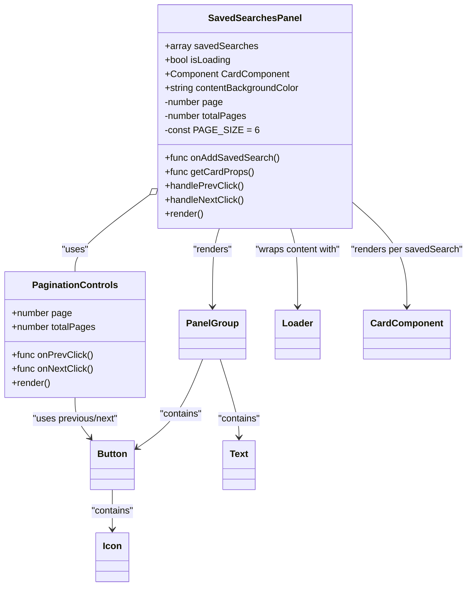

# Diagram: web/portal/src/components/organisms/SavedSearchesPanel.organism.js


> Auto-generated by Obscura crawlers

## Diagram 1



### SVG

<svg id="container" width="798.38671875" xmlns="http://www.w3.org/2000/svg" class="classDiagram" height="1006" viewBox="0 0 798.38671875 1006" role="graphics-document document" aria-roledescription="class"><style>#container{font-family:"trebuchet ms",verdana,arial,sans-serif;font-size:16px;fill:#333;}@keyframes edge-animation-frame{from{stroke-dashoffset:0;}}@keyframes dash{to{stroke-dashoffset:0;}}#container .edge-animation-slow{stroke-dasharray:9,5!important;stroke-dashoffset:900;animation:dash 50s linear infinite;stroke-linecap:round;}#container .edge-animation-fast{stroke-dasharray:9,5!important;stroke-dashoffset:900;animation:dash 20s linear infinite;stroke-linecap:round;}#container .error-icon{fill:#552222;}#container .error-text{fill:#552222;stroke:#552222;}#container .edge-thickness-normal{stroke-width:1px;}#container .edge-thickness-thick{stroke-width:3.5px;}#container .edge-pattern-solid{stroke-dasharray:0;}#container .edge-thickness-invisible{stroke-width:0;fill:none;}#container .edge-pattern-dashed{stroke-dasharray:3;}#container .edge-pattern-dotted{stroke-dasharray:2;}#container .marker{fill:#333333;stroke:#333333;}#container .marker.cross{stroke:#333333;}#container svg{font-family:"trebuchet ms",verdana,arial,sans-serif;font-size:16px;}#container p{margin:0;}#container g.classGroup text{fill:#9370DB;stroke:none;font-family:"trebuchet ms",verdana,arial,sans-serif;font-size:10px;}#container g.classGroup text .title{font-weight:bolder;}#container .nodeLabel,#container .edgeLabel{color:#131300;}#container .edgeLabel .label rect{fill:#ECECFF;}#container .label text{fill:#131300;}#container .labelBkg{background:#ECECFF;}#container .edgeLabel .label span{background:#ECECFF;}#container .classTitle{font-weight:bolder;}#container .node rect,#container .node circle,#container .node ellipse,#container .node polygon,#container .node path{fill:#ECECFF;stroke:#9370DB;stroke-width:1px;}#container .divider{stroke:#9370DB;stroke-width:1;}#container g.clickable{cursor:pointer;}#container g.classGroup rect{fill:#ECECFF;stroke:#9370DB;}#container g.classGroup line{stroke:#9370DB;stroke-width:1;}#container .classLabel .box{stroke:none;stroke-width:0;fill:#ECECFF;opacity:0.5;}#container .classLabel .label{fill:#9370DB;font-size:10px;}#container .relation{stroke:#333333;stroke-width:1;fill:none;}#container .dashed-line{stroke-dasharray:3;}#container .dotted-line{stroke-dasharray:1 2;}#container #compositionStart,#container .composition{fill:#333333!important;stroke:#333333!important;stroke-width:1;}#container #compositionEnd,#container .composition{fill:#333333!important;stroke:#333333!important;stroke-width:1;}#container #dependencyStart,#container .dependency{fill:#333333!important;stroke:#333333!important;stroke-width:1;}#container #dependencyStart,#container .dependency{fill:#333333!important;stroke:#333333!important;stroke-width:1;}#container #extensionStart,#container .extension{fill:transparent!important;stroke:#333333!important;stroke-width:1;}#container #extensionEnd,#container .extension{fill:transparent!important;stroke:#333333!important;stroke-width:1;}#container #aggregationStart,#container .aggregation{fill:transparent!important;stroke:#333333!important;stroke-width:1;}#container #aggregationEnd,#container .aggregation{fill:transparent!important;stroke:#333333!important;stroke-width:1;}#container #lollipopStart,#container .lollipop{fill:#ECECFF!important;stroke:#333333!important;stroke-width:1;}#container #lollipopEnd,#container .lollipop{fill:#ECECFF!important;stroke:#333333!important;stroke-width:1;}#container .edgeTerminals{font-size:11px;line-height:initial;}#container .classTitleText{text-anchor:middle;font-size:18px;fill:#333;}#container .label-icon{display:inline-block;height:1em;overflow:visible;vertical-align:-0.125em;}#container .node .label-icon path{fill:currentColor;stroke:revert;stroke-width:revert;}#container :root{--mermaid-font-family:"trebuchet ms",verdana,arial,sans-serif;}</style><g><defs><marker id="container_class-aggregationStart" class="marker aggregation class" refX="18" refY="7" markerWidth="190" markerHeight="240" orient="auto"><path d="M 18,7 L9,13 L1,7 L9,1 Z"></path></marker></defs><defs><marker id="container_class-aggregationEnd" class="marker aggregation class" refX="1" refY="7" markerWidth="20" markerHeight="28" orient="auto"><path d="M 18,7 L9,13 L1,7 L9,1 Z"></path></marker></defs><defs><marker id="container_class-extensionStart" class="marker extension class" refX="18" refY="7" markerWidth="190" markerHeight="240" orient="auto"><path d="M 1,7 L18,13 V 1 Z"></path></marker></defs><defs><marker id="container_class-extensionEnd" class="marker extension class" refX="1" refY="7" markerWidth="20" markerHeight="28" orient="auto"><path d="M 1,1 V 13 L18,7 Z"></path></marker></defs><defs><marker id="container_class-compositionStart" class="marker composition class" refX="18" refY="7" markerWidth="190" markerHeight="240" orient="auto"><path d="M 18,7 L9,13 L1,7 L9,1 Z"></path></marker></defs><defs><marker id="container_class-compositionEnd" class="marker composition class" refX="1" refY="7" markerWidth="20" markerHeight="28" orient="auto"><path d="M 18,7 L9,13 L1,7 L9,1 Z"></path></marker></defs><defs><marker id="container_class-dependencyStart" class="marker dependency class" refX="6" refY="7" markerWidth="190" markerHeight="240" orient="auto"><path d="M 5,7 L9,13 L1,7 L9,1 Z"></path></marker></defs><defs><marker id="container_class-dependencyEnd" class="marker dependency class" refX="13" refY="7" markerWidth="20" markerHeight="28" orient="auto"><path d="M 18,7 L9,13 L14,7 L9,1 Z"></path></marker></defs><defs><marker id="container_class-lollipopStart" class="marker lollipop class" refX="13" refY="7" markerWidth="190" markerHeight="240" orient="auto"><circle stroke="black" fill="transparent" cx="7" cy="7" r="6"></circle></marker></defs><defs><marker id="container_class-lollipopEnd" class="marker lollipop class" refX="1" refY="7" markerWidth="190" markerHeight="240" orient="auto"><circle stroke="black" fill="transparent" cx="7" cy="7" r="6"></circle></marker></defs><g class="root"><g class="clusters"></g><g class="edgePaths"><path d="M252.737,334.773L231.758,350.478C210.778,366.182,168.819,397.591,147.839,419.462C126.859,441.333,126.859,453.667,126.859,459.833L126.859,466" id="id_SavedSearchesPanel_PaginationControls_1" class="edge-thickness-normal edge-pattern-solid relation" style=";;;" data-edge="true" data-et="edge" data-id="id_SavedSearchesPanel_PaginationControls_1" data-points="W3sieCI6MjY2LjU0Njg3NSwieSI6MzI0LjQzNTkyNjI0NzUxMDF9LHsieCI6MTI2Ljg1OTM3NSwieSI6NDI5fSx7IngiOjEyNi44NTkzNzUsInkiOjQ2Nn1d" marker-start="url(#container_class-aggregationStart)"></path><path d="M373.407,392L371.5,398.167C369.593,404.333,365.779,416.667,363.872,439C361.965,461.333,361.965,493.667,361.965,509.833L361.965,526" id="id_SavedSearchesPanel_PanelGroup_2" class="edge-thickness-normal edge-pattern-solid relation" style=";;;" data-edge="true" data-et="edge" data-id="id_SavedSearchesPanel_PanelGroup_2" data-points="W3sieCI6MzczLjQwNjc5NTg1MTUyODQsInkiOjM5Mn0seyJ4IjozNjEuOTY0ODQzNzUsInkiOjQyOX0seyJ4IjozNjEuOTY0ODQzNzUsInkiOjUzMn1d" marker-end="url(#container_class-dependencyEnd)"></path><path d="M345.423,616L338.662,633.167C331.9,650.333,318.378,684.667,299.973,710.076C281.569,735.485,258.282,751.971,246.638,760.213L234.995,768.456" id="id_PanelGroup_Button_3" class="edge-thickness-normal edge-pattern-solid relation" style=";;;" data-edge="true" data-et="edge" data-id="id_PanelGroup_Button_3" data-points="W3sieCI6MzQ1LjQyMjgxNzg4NzkzMTA1LCJ5Ijo2MTZ9LHsieCI6MzA0Ljg1NTQ2ODc1LCJ5Ijo3MTl9LHsieCI6MjMwLjA5NzY1NjI1LCJ5Ijo3NzEuOTIyOTIwNzUwNDkwMX1d" marker-end="url(#container_class-dependencyEnd)"></path><path d="M375.601,616L381.175,633.167C386.749,650.333,397.896,684.667,403.469,707C409.043,729.333,409.043,739.667,409.043,744.833L409.043,750" id="id_PanelGroup_Text_4" class="edge-thickness-normal edge-pattern-solid relation" style=";;;" data-edge="true" data-et="edge" data-id="id_PanelGroup_Text_4" data-points="W3sieCI6Mzc1LjYwMTI2NjE2Mzc5MzEsInkiOjYxNn0seyJ4Ijo0MDkuMDQyOTY4NzUsInkiOjcxOX0seyJ4Ijo0MDkuMDQyOTY4NzUsInkiOjc1Nn1d" marker-end="url(#container_class-dependencyEnd)"></path><path d="M492.156,392L494.063,398.167C495.97,404.333,499.784,416.667,501.691,439C503.598,461.333,503.598,493.667,503.598,509.833L503.598,526" id="id_SavedSearchesPanel_Loader_5" class="edge-thickness-normal edge-pattern-solid relation" style=";;;" data-edge="true" data-et="edge" data-id="id_SavedSearchesPanel_Loader_5" data-points="W3sieCI6NDkyLjE1NTcwNDE0ODQ3MTYsInkiOjM5Mn0seyJ4Ijo1MDMuNTk3NjU2MjUsInkiOjQyOX0seyJ4Ijo1MDMuNTk3NjU2MjUsInkiOjUzMn1d" marker-end="url(#container_class-dependencyEnd)"></path><path d="M599.016,345.394L614.947,359.328C630.879,373.263,662.742,401.131,678.674,431.232C694.605,461.333,694.605,493.667,694.605,509.833L694.605,526" id="id_SavedSearchesPanel_CardComponent_6" class="edge-thickness-normal edge-pattern-solid relation" style=";;;" data-edge="true" data-et="edge" data-id="id_SavedSearchesPanel_CardComponent_6" data-points="W3sieCI6NTk5LjAxNTYyNSwieSI6MzQ1LjM5NDAwNTQwMDgwODZ9LHsieCI6Njk0LjYwNTQ2ODc1LCJ5Ijo0Mjl9LHsieCI6Njk0LjYwNTQ2ODc1LCJ5Ijo1MzJ9XQ==" marker-end="url(#container_class-dependencyEnd)"></path><path d="M193.262,840L193.262,846.167C193.262,852.333,193.262,864.667,193.262,876C193.262,887.333,193.262,897.667,193.262,902.833L193.262,908" id="id_Button_Icon_7" class="edge-thickness-normal edge-pattern-solid relation" style=";;;" data-edge="true" data-et="edge" data-id="id_Button_Icon_7" data-points="W3sieCI6MTkzLjI2MTcxODc1LCJ5Ijo4NDB9LHsieCI6MTkzLjI2MTcxODc1LCJ5Ijo4Nzd9LHsieCI6MTkzLjI2MTcxODc1LCJ5Ijo5MTR9XQ==" marker-end="url(#container_class-dependencyEnd)"></path><path d="M126.859,682L126.859,688.167C126.859,694.333,126.859,706.667,131.399,718.234C135.939,729.802,145.019,740.605,149.559,746.006L154.099,751.407" id="id_PaginationControls_Button_8" class="edge-thickness-normal edge-pattern-solid relation" style=";;;" data-edge="true" data-et="edge" data-id="id_PaginationControls_Button_8" data-points="W3sieCI6MTI2Ljg1OTM3NSwieSI6NjgyfSx7IngiOjEyNi44NTkzNzUsInkiOjcxOX0seyJ4IjoxNTcuOTU5MjA2ODgyOTExNCwieSI6NzU2fV0=" marker-end="url(#container_class-dependencyEnd)"></path></g><g class="edgeLabels"><g class="edgeLabel" transform="translate(126.859375, 429)"><g class="label" data-id="id_SavedSearchesPanel_PaginationControls_1" transform="translate(-22.7578125, -12)"><foreignObject width="45.515625" height="24"><div xmlns="http://www.w3.org/1999/xhtml" class="labelBkg" style="display: table-cell; white-space: nowrap; line-height: 1.5; max-width: 200px; text-align: center;"><span class="edgeLabel"><p>"uses"</p></span></div></foreignObject></g></g><g class="edgeLabel" transform="translate(361.96484375, 429)"><g class="label" data-id="id_SavedSearchesPanel_PanelGroup_2" transform="translate(-34.015625, -12)"><foreignObject width="68.03125" height="24"><div xmlns="http://www.w3.org/1999/xhtml" class="labelBkg" style="display: table-cell; white-space: nowrap; line-height: 1.5; max-width: 200px; text-align: center;"><span class="edgeLabel"><p>"renders"</p></span></div></foreignObject></g></g><g class="edgeLabel" transform="translate(308.35633, 710.11137)"><g class="label" data-id="id_PanelGroup_Button_3" transform="translate(-37.078125, -12)"><foreignObject width="74.15625" height="24"><div xmlns="http://www.w3.org/1999/xhtml" class="labelBkg" style="display: table-cell; white-space: nowrap; line-height: 1.5; max-width: 200px; text-align: center;"><span class="edgeLabel"><p>"contains"</p></span></div></foreignObject></g></g><g class="edgeLabel" transform="translate(409.04296875, 719)"><g class="label" data-id="id_PanelGroup_Text_4" transform="translate(-37.078125, -12)"><foreignObject width="74.15625" height="24"><div xmlns="http://www.w3.org/1999/xhtml" class="labelBkg" style="display: table-cell; white-space: nowrap; line-height: 1.5; max-width: 200px; text-align: center;"><span class="edgeLabel"><p>"contains"</p></span></div></foreignObject></g></g><g class="edgeLabel" transform="translate(503.59765625, 429)"><g class="label" data-id="id_SavedSearchesPanel_Loader_5" transform="translate(-75.2265625, -12)"><foreignObject width="150.453125" height="24"><div xmlns="http://www.w3.org/1999/xhtml" class="labelBkg" style="display: table-cell; white-space: nowrap; line-height: 1.5; max-width: 200px; text-align: center;"><span class="edgeLabel"><p>"wraps content with"</p></span></div></foreignObject></g></g><g class="edgeLabel" transform="translate(694.60546875, 429)"><g class="label" data-id="id_SavedSearchesPanel_CardComponent_6" transform="translate(-95.78125, -12)"><foreignObject width="191.5625" height="24"><div xmlns="http://www.w3.org/1999/xhtml" class="labelBkg" style="display: table-cell; white-space: nowrap; line-height: 1.5; max-width: 200px; text-align: center;"><span class="edgeLabel"><p>"renders per savedSearch"</p></span></div></foreignObject></g></g><g class="edgeLabel" transform="translate(193.26171875, 877)"><g class="label" data-id="id_Button_Icon_7" transform="translate(-37.078125, -12)"><foreignObject width="74.15625" height="24"><div xmlns="http://www.w3.org/1999/xhtml" class="labelBkg" style="display: table-cell; white-space: nowrap; line-height: 1.5; max-width: 200px; text-align: center;"><span class="edgeLabel"><p>"contains"</p></span></div></foreignObject></g></g><g class="edgeLabel" transform="translate(126.859375, 719)"><g class="label" data-id="id_PaginationControls_Button_8" transform="translate(-75.7265625, -12)"><foreignObject width="151.453125" height="24"><div xmlns="http://www.w3.org/1999/xhtml" class="labelBkg" style="display: table-cell; white-space: nowrap; line-height: 1.5; max-width: 200px; text-align: center;"><span class="edgeLabel"><p>"uses previous/next"</p></span></div></foreignObject></g></g></g><g class="nodes"><g class="node default" id="classId-PaginationControls-0" transform="translate(126.859375, 574)"><g class="basic label-container"><path d="M-118.859375 -108 L118.859375 -108 L118.859375 108 L-118.859375 108" stroke="none" stroke-width="0" fill="#ECECFF" style=""></path><path d="M-118.859375 -108 C-44.13792238869007 -108, 30.583530222619856 -108, 118.859375 -108 M-118.859375 -108 C-67.52545022994049 -108, -16.191525459880978 -108, 118.859375 -108 M118.859375 -108 C118.859375 -30.470711134869077, 118.859375 47.058577730261845, 118.859375 108 M118.859375 -108 C118.859375 -41.74802486179911, 118.859375 24.50395027640178, 118.859375 108 M118.859375 108 C67.94862260638484 108, 17.03787021276969 108, -118.859375 108 M118.859375 108 C42.42672664765081 108, -34.00592170469838 108, -118.859375 108 M-118.859375 108 C-118.859375 61.46531132579205, -118.859375 14.930622651584102, -118.859375 -108 M-118.859375 108 C-118.859375 61.18877349937588, -118.859375 14.377546998751754, -118.859375 -108" stroke="#9370DB" stroke-width="1.3" fill="none" stroke-dasharray="0 0" style=""></path></g><g class="annotation-group text" transform="translate(0, -84)"></g><g class="label-group text" transform="translate(-69.6875, -84)"><g class="label" style="font-weight: bolder" transform="translate(0,-12)"><foreignObject width="139.375" height="24"><div xmlns="http://www.w3.org/1999/xhtml" style="display: table-cell; white-space: nowrap; line-height: 1.5; max-width: 187px; text-align: center;"><span class="nodeLabel markdown-node-label" style=""><p>PaginationControls</p></span></div></foreignObject></g></g><g class="members-group text" transform="translate(-106.859375, -36)"><g class="label" style="" transform="translate(0,-12)"><foreignObject width="103.703125" height="24"><div xmlns="http://www.w3.org/1999/xhtml" style="display: table-cell; white-space: nowrap; line-height: 1.5; max-width: 161px; text-align: center;"><span class="nodeLabel markdown-node-label" style=""><p>+number page</p></span></div></foreignObject></g><g class="label" style="" transform="translate(0,12)"><foreignObject width="144.03125" height="24"><div xmlns="http://www.w3.org/1999/xhtml" style="display: table-cell; white-space: nowrap; line-height: 1.5; max-width: 201px; text-align: center;"><span class="nodeLabel markdown-node-label" style=""><p>+number totalPages</p></span></div></foreignObject></g></g><g class="methods-group text" transform="translate(-106.859375, 36)"><g class="label" style="" transform="translate(0,-12)"><foreignObject width="137.8125" height="24"><div xmlns="http://www.w3.org/1999/xhtml" style="display: table-cell; white-space: nowrap; line-height: 1.5; max-width: 195px; text-align: center;"><span class="nodeLabel markdown-node-label" style=""><p>+func onPrevClick()</p></span></div></foreignObject></g><g class="label" style="" transform="translate(0,12)"><foreignObject width="139.65625" height="24"><div xmlns="http://www.w3.org/1999/xhtml" style="display: table-cell; white-space: nowrap; line-height: 1.5; max-width: 197px; text-align: center;"><span class="nodeLabel markdown-node-label" style=""><p>+func onNextClick()</p></span></div></foreignObject></g><g class="label" style="" transform="translate(0,36)"><foreignObject width="66.609375" height="24"><div xmlns="http://www.w3.org/1999/xhtml" style="display: table-cell; white-space: nowrap; line-height: 1.5; max-width: 124px; text-align: center;"><span class="nodeLabel markdown-node-label" style=""><p>+render()</p></span></div></foreignObject></g></g><g class="divider" style=""><path d="M-118.859375 -60 C-42.30844820066336 -60, 34.24247859867327 -60, 118.859375 -60 M-118.859375 -60 C-49.76697792594349 -60, 19.325419148113014 -60, 118.859375 -60" stroke="#9370DB" stroke-width="1.3" fill="none" stroke-dasharray="0 0" style=""></path></g><g class="divider" style=""><path d="M-118.859375 12 C-42.78388105974916 12, 33.291612880501674 12, 118.859375 12 M-118.859375 12 C-65.39434998646777 12, -11.92932497293556 12, 118.859375 12" stroke="#9370DB" stroke-width="1.3" fill="none" stroke-dasharray="0 0" style=""></path></g></g><g class="node default" id="classId-SavedSearchesPanel-1" transform="translate(432.78125, 200)"><g class="basic label-container"><path d="M-166.234375 -192 L166.234375 -192 L166.234375 192 L-166.234375 192" stroke="none" stroke-width="0" fill="#ECECFF" style=""></path><path d="M-166.234375 -192 C-51.46375784320203 -192, 63.306859313595936 -192, 166.234375 -192 M-166.234375 -192 C-71.76178745525633 -192, 22.71080008948735 -192, 166.234375 -192 M166.234375 -192 C166.234375 -47.37374506320998, 166.234375 97.25250987358004, 166.234375 192 M166.234375 -192 C166.234375 -81.87213414998556, 166.234375 28.25573170002889, 166.234375 192 M166.234375 192 C89.77549311725951 192, 13.31661123451903 192, -166.234375 192 M166.234375 192 C33.415261640380066 192, -99.40385171923987 192, -166.234375 192 M-166.234375 192 C-166.234375 47.49598738550554, -166.234375 -97.00802522898891, -166.234375 -192 M-166.234375 192 C-166.234375 57.40462459398515, -166.234375 -77.1907508120297, -166.234375 -192" stroke="#9370DB" stroke-width="1.3" fill="none" stroke-dasharray="0 0" style=""></path></g><g class="annotation-group text" transform="translate(0, -168)"></g><g class="label-group text" transform="translate(-75.265625, -168)"><g class="label" style="font-weight: bolder" transform="translate(0,-12)"><foreignObject width="150.53125" height="24"><div xmlns="http://www.w3.org/1999/xhtml" style="display: table-cell; white-space: nowrap; line-height: 1.5; max-width: 198px; text-align: center;"><span class="nodeLabel markdown-node-label" style=""><p>SavedSearchesPanel</p></span></div></foreignObject></g></g><g class="members-group text" transform="translate(-154.234375, -120)"><g class="label" style="" transform="translate(0,-12)"><foreignObject width="155.59375" height="24"><div xmlns="http://www.w3.org/1999/xhtml" style="display: table-cell; white-space: nowrap; line-height: 1.5; max-width: 213px; text-align: center;"><span class="nodeLabel markdown-node-label" style=""><p>+array savedSearches</p></span></div></foreignObject></g><g class="label" style="" transform="translate(0,12)"><foreignObject width="114.328125" height="24"><div xmlns="http://www.w3.org/1999/xhtml" style="display: table-cell; white-space: nowrap; line-height: 1.5; max-width: 172px; text-align: center;"><span class="nodeLabel markdown-node-label" style=""><p>+bool isLoading</p></span></div></foreignObject></g><g class="label" style="" transform="translate(0,36)"><foreignObject width="212.578125" height="24"><div xmlns="http://www.w3.org/1999/xhtml" style="display: table-cell; white-space: nowrap; line-height: 1.5; max-width: 270px; text-align: center;"><span class="nodeLabel markdown-node-label" style=""><p>+Component CardComponent</p></span></div></foreignObject></g><g class="label" style="" transform="translate(0,60)"><foreignObject width="233.203125" height="24"><div xmlns="http://www.w3.org/1999/xhtml" style="display: table-cell; white-space: nowrap; line-height: 1.5; max-width: 291px; text-align: center;"><span class="nodeLabel markdown-node-label" style=""><p>+string contentBackgroundColor</p></span></div></foreignObject></g><g class="label" style="" transform="translate(0,84)"><foreignObject width="102.171875" height="24"><div xmlns="http://www.w3.org/1999/xhtml" style="display: table-cell; white-space: nowrap; line-height: 1.5; max-width: 160px; text-align: center;"><span class="nodeLabel markdown-node-label" style=""><p>-number page</p></span></div></foreignObject></g><g class="label" style="" transform="translate(0,108)"><foreignObject width="142.484375" height="24"><div xmlns="http://www.w3.org/1999/xhtml" style="display: table-cell; white-space: nowrap; line-height: 1.5; max-width: 200px; text-align: center;"><span class="nodeLabel markdown-node-label" style=""><p>-number totalPages</p></span></div></foreignObject></g><g class="label" style="" transform="translate(0,132)"><foreignObject width="149.359375" height="24"><div xmlns="http://www.w3.org/1999/xhtml" style="display: table-cell; white-space: nowrap; line-height: 1.5; max-width: 207px; text-align: center;"><span class="nodeLabel markdown-node-label" style=""><p>-const PAGE_SIZE = 6</p></span></div></foreignObject></g></g><g class="methods-group text" transform="translate(-154.234375, 72)"><g class="label" style="" transform="translate(0,-12)"><foreignObject width="193.0625" height="24"><div xmlns="http://www.w3.org/1999/xhtml" style="display: table-cell; white-space: nowrap; line-height: 1.5; max-width: 250px; text-align: center;"><span class="nodeLabel markdown-node-label" style=""><p>+func onAddSavedSearch()</p></span></div></foreignObject></g><g class="label" style="" transform="translate(0,12)"><foreignObject width="150.375" height="24"><div xmlns="http://www.w3.org/1999/xhtml" style="display: table-cell; white-space: nowrap; line-height: 1.5; max-width: 208px; text-align: center;"><span class="nodeLabel markdown-node-label" style=""><p>+func getCardProps()</p></span></div></foreignObject></g><g class="label" style="" transform="translate(0,36)"><foreignObject width="133.75" height="24"><div xmlns="http://www.w3.org/1999/xhtml" style="display: table-cell; white-space: nowrap; line-height: 1.5; max-width: 191px; text-align: center;"><span class="nodeLabel markdown-node-label" style=""><p>+handlePrevClick()</p></span></div></foreignObject></g><g class="label" style="" transform="translate(0,60)"><foreignObject width="135.59375" height="24"><div xmlns="http://www.w3.org/1999/xhtml" style="display: table-cell; white-space: nowrap; line-height: 1.5; max-width: 193px; text-align: center;"><span class="nodeLabel markdown-node-label" style=""><p>+handleNextClick()</p></span></div></foreignObject></g><g class="label" style="" transform="translate(0,84)"><foreignObject width="66.609375" height="24"><div xmlns="http://www.w3.org/1999/xhtml" style="display: table-cell; white-space: nowrap; line-height: 1.5; max-width: 124px; text-align: center;"><span class="nodeLabel markdown-node-label" style=""><p>+render()</p></span></div></foreignObject></g></g><g class="divider" style=""><path d="M-166.234375 -144 C-54.51378759599429 -144, 57.206799808011425 -144, 166.234375 -144 M-166.234375 -144 C-86.72260380019307 -144, -7.210832600386141 -144, 166.234375 -144" stroke="#9370DB" stroke-width="1.3" fill="none" stroke-dasharray="0 0" style=""></path></g><g class="divider" style=""><path d="M-166.234375 48 C-96.51369358315232 48, -26.793012166304635 48, 166.234375 48 M-166.234375 48 C-65.35587183630814 48, 35.52263132738372 48, 166.234375 48" stroke="#9370DB" stroke-width="1.3" fill="none" stroke-dasharray="0 0" style=""></path></g></g><g class="node default" id="classId-PanelGroup-2" transform="translate(361.96484375, 574)"><g class="basic label-container"><path d="M-54.328125 -42 L54.328125 -42 L54.328125 42 L-54.328125 42" stroke="none" stroke-width="0" fill="#ECECFF" style=""></path><path d="M-54.328125 -42 C-26.313540268529557 -42, 1.7010444629408852 -42, 54.328125 -42 M-54.328125 -42 C-10.944056950357428 -42, 32.440011099285144 -42, 54.328125 -42 M54.328125 -42 C54.328125 -15.062184814891246, 54.328125 11.875630370217507, 54.328125 42 M54.328125 -42 C54.328125 -19.329730979676476, 54.328125 3.340538040647047, 54.328125 42 M54.328125 42 C19.659627762981735 42, -15.00886947403653 42, -54.328125 42 M54.328125 42 C32.09514062633447 42, 9.862156252668946 42, -54.328125 42 M-54.328125 42 C-54.328125 23.218070433168553, -54.328125 4.436140866337105, -54.328125 -42 M-54.328125 42 C-54.328125 10.88601767487031, -54.328125 -20.22796465025938, -54.328125 -42" stroke="#9370DB" stroke-width="1.3" fill="none" stroke-dasharray="0 0" style=""></path></g><g class="annotation-group text" transform="translate(0, -18)"></g><g class="label-group text" transform="translate(-42.328125, -18)"><g class="label" style="font-weight: bolder" transform="translate(0,-12)"><foreignObject width="84.65625" height="24"><div xmlns="http://www.w3.org/1999/xhtml" style="display: table-cell; white-space: nowrap; line-height: 1.5; max-width: 134px; text-align: center;"><span class="nodeLabel markdown-node-label" style=""><p>PanelGroup</p></span></div></foreignObject></g></g><g class="members-group text" transform="translate(-42.328125, 30)"></g><g class="methods-group text" transform="translate(-42.328125, 60)"></g><g class="divider" style=""><path d="M-54.328125 6 C-14.000552888308505 6, 26.32701922338299 6, 54.328125 6 M-54.328125 6 C-15.447086893016554 6, 23.433951213966893 6, 54.328125 6" stroke="#9370DB" stroke-width="1.3" fill="none" stroke-dasharray="0 0" style=""></path></g><g class="divider" style=""><path d="M-54.328125 24 C-24.592512785839403 24, 5.143099428321193 24, 54.328125 24 M-54.328125 24 C-13.99842592367974 24, 26.33127315264052 24, 54.328125 24" stroke="#9370DB" stroke-width="1.3" fill="none" stroke-dasharray="0 0" style=""></path></g></g><g class="node default" id="classId-Button-3" transform="translate(193.26171875, 798)"><g class="basic label-container"><path d="M-36.8359375 -42 L36.8359375 -42 L36.8359375 42 L-36.8359375 42" stroke="none" stroke-width="0" fill="#ECECFF" style=""></path><path d="M-36.8359375 -42 C-8.200367149195316 -42, 20.43520320160937 -42, 36.8359375 -42 M-36.8359375 -42 C-21.985332191282534 -42, -7.134726882565069 -42, 36.8359375 -42 M36.8359375 -42 C36.8359375 -11.631002525424584, 36.8359375 18.73799494915083, 36.8359375 42 M36.8359375 -42 C36.8359375 -12.027166139167186, 36.8359375 17.94566772166563, 36.8359375 42 M36.8359375 42 C19.168953483513747 42, 1.501969467027493 42, -36.8359375 42 M36.8359375 42 C9.889528480756947 42, -17.056880538486105 42, -36.8359375 42 M-36.8359375 42 C-36.8359375 15.586958741357154, -36.8359375 -10.826082517285691, -36.8359375 -42 M-36.8359375 42 C-36.8359375 20.494846567372722, -36.8359375 -1.010306865254556, -36.8359375 -42" stroke="#9370DB" stroke-width="1.3" fill="none" stroke-dasharray="0 0" style=""></path></g><g class="annotation-group text" transform="translate(0, -18)"></g><g class="label-group text" transform="translate(-24.8359375, -18)"><g class="label" style="font-weight: bolder" transform="translate(0,-12)"><foreignObject width="49.671875" height="24"><div xmlns="http://www.w3.org/1999/xhtml" style="display: table-cell; white-space: nowrap; line-height: 1.5; max-width: 99px; text-align: center;"><span class="nodeLabel markdown-node-label" style=""><p>Button</p></span></div></foreignObject></g></g><g class="members-group text" transform="translate(-24.8359375, 30)"></g><g class="methods-group text" transform="translate(-24.8359375, 60)"></g><g class="divider" style=""><path d="M-36.8359375 6 C-14.81417977091171 6, 7.207577958176579 6, 36.8359375 6 M-36.8359375 6 C-16.265674667810032 6, 4.304588164379936 6, 36.8359375 6" stroke="#9370DB" stroke-width="1.3" fill="none" stroke-dasharray="0 0" style=""></path></g><g class="divider" style=""><path d="M-36.8359375 24 C-11.835060587569128 24, 13.165816324861744 24, 36.8359375 24 M-36.8359375 24 C-10.499946472131853 24, 15.836044555736294 24, 36.8359375 24" stroke="#9370DB" stroke-width="1.3" fill="none" stroke-dasharray="0 0" style=""></path></g></g><g class="node default" id="classId-Icon-4" transform="translate(193.26171875, 956)"><g class="basic label-container"><path d="M-27.3046875 -42 L27.3046875 -42 L27.3046875 42 L-27.3046875 42" stroke="none" stroke-width="0" fill="#ECECFF" style=""></path><path d="M-27.3046875 -42 C-15.691020719161841 -42, -4.077353938323682 -42, 27.3046875 -42 M-27.3046875 -42 C-14.284143078745632 -42, -1.263598657491265 -42, 27.3046875 -42 M27.3046875 -42 C27.3046875 -18.49962299562925, 27.3046875 5.000754008741502, 27.3046875 42 M27.3046875 -42 C27.3046875 -9.473181198809591, 27.3046875 23.053637602380817, 27.3046875 42 M27.3046875 42 C15.2479314231571 42, 3.1911753463142 42, -27.3046875 42 M27.3046875 42 C8.780508096341645 42, -9.74367130731671 42, -27.3046875 42 M-27.3046875 42 C-27.3046875 10.87985913499644, -27.3046875 -20.24028173000712, -27.3046875 -42 M-27.3046875 42 C-27.3046875 9.27405091376216, -27.3046875 -23.45189817247568, -27.3046875 -42" stroke="#9370DB" stroke-width="1.3" fill="none" stroke-dasharray="0 0" style=""></path></g><g class="annotation-group text" transform="translate(0, -18)"></g><g class="label-group text" transform="translate(-15.3046875, -18)"><g class="label" style="font-weight: bolder" transform="translate(0,-12)"><foreignObject width="30.609375" height="24"><div xmlns="http://www.w3.org/1999/xhtml" style="display: table-cell; white-space: nowrap; line-height: 1.5; max-width: 81px; text-align: center;"><span class="nodeLabel markdown-node-label" style=""><p>Icon</p></span></div></foreignObject></g></g><g class="members-group text" transform="translate(-15.3046875, 30)"></g><g class="methods-group text" transform="translate(-15.3046875, 60)"></g><g class="divider" style=""><path d="M-27.3046875 6 C-13.150251859387994 6, 1.004183781224011 6, 27.3046875 6 M-27.3046875 6 C-13.565201951547715 6, 0.1742835969045693 6, 27.3046875 6" stroke="#9370DB" stroke-width="1.3" fill="none" stroke-dasharray="0 0" style=""></path></g><g class="divider" style=""><path d="M-27.3046875 24 C-6.476268938315272 24, 14.352149623369456 24, 27.3046875 24 M-27.3046875 24 C-13.282077433962387 24, 0.7405326320752259 24, 27.3046875 24" stroke="#9370DB" stroke-width="1.3" fill="none" stroke-dasharray="0 0" style=""></path></g></g><g class="node default" id="classId-Text-5" transform="translate(409.04296875, 798)"><g class="basic label-container"><path d="M-27.3828125 -42 L27.3828125 -42 L27.3828125 42 L-27.3828125 42" stroke="none" stroke-width="0" fill="#ECECFF" style=""></path><path d="M-27.3828125 -42 C-7.542660917316788 -42, 12.297490665366425 -42, 27.3828125 -42 M-27.3828125 -42 C-7.555448648740839 -42, 12.271915202518322 -42, 27.3828125 -42 M27.3828125 -42 C27.3828125 -15.557828518998665, 27.3828125 10.88434296200267, 27.3828125 42 M27.3828125 -42 C27.3828125 -23.129599838563525, 27.3828125 -4.25919967712705, 27.3828125 42 M27.3828125 42 C15.386723122320134 42, 3.390633744640269 42, -27.3828125 42 M27.3828125 42 C13.100274112430016 42, -1.1822642751399677 42, -27.3828125 42 M-27.3828125 42 C-27.3828125 8.87893067355104, -27.3828125 -24.24213865289792, -27.3828125 -42 M-27.3828125 42 C-27.3828125 21.528330995214127, -27.3828125 1.0566619904282533, -27.3828125 -42" stroke="#9370DB" stroke-width="1.3" fill="none" stroke-dasharray="0 0" style=""></path></g><g class="annotation-group text" transform="translate(0, -18)"></g><g class="label-group text" transform="translate(-15.3828125, -18)"><g class="label" style="font-weight: bolder" transform="translate(0,-12)"><foreignObject width="30.765625" height="24"><div xmlns="http://www.w3.org/1999/xhtml" style="display: table-cell; white-space: nowrap; line-height: 1.5; max-width: 80px; text-align: center;"><span class="nodeLabel markdown-node-label" style=""><p>Text</p></span></div></foreignObject></g></g><g class="members-group text" transform="translate(-15.3828125, 30)"></g><g class="methods-group text" transform="translate(-15.3828125, 60)"></g><g class="divider" style=""><path d="M-27.3828125 6 C-8.035826192231966 6, 11.311160115536069 6, 27.3828125 6 M-27.3828125 6 C-14.193145350615447 6, -1.0034782012308945 6, 27.3828125 6" stroke="#9370DB" stroke-width="1.3" fill="none" stroke-dasharray="0 0" style=""></path></g><g class="divider" style=""><path d="M-27.3828125 24 C-7.400384211146701 24, 12.582044077706598 24, 27.3828125 24 M-27.3828125 24 C-7.000065050072227 24, 13.382682399855547 24, 27.3828125 24" stroke="#9370DB" stroke-width="1.3" fill="none" stroke-dasharray="0 0" style=""></path></g></g><g class="node default" id="classId-Loader-6" transform="translate(503.59765625, 574)"><g class="basic label-container"><path d="M-37.3046875 -42 L37.3046875 -42 L37.3046875 42 L-37.3046875 42" stroke="none" stroke-width="0" fill="#ECECFF" style=""></path><path d="M-37.3046875 -42 C-10.586150662453676 -42, 16.13238617509265 -42, 37.3046875 -42 M-37.3046875 -42 C-8.569008462883936 -42, 20.16667057423213 -42, 37.3046875 -42 M37.3046875 -42 C37.3046875 -23.85009552222044, 37.3046875 -5.700191044440878, 37.3046875 42 M37.3046875 -42 C37.3046875 -20.463461143071367, 37.3046875 1.0730777138572662, 37.3046875 42 M37.3046875 42 C11.424998327386774 42, -14.454690845226452 42, -37.3046875 42 M37.3046875 42 C16.468418222897146 42, -4.367851054205708 42, -37.3046875 42 M-37.3046875 42 C-37.3046875 9.502746540002661, -37.3046875 -22.994506919994677, -37.3046875 -42 M-37.3046875 42 C-37.3046875 9.835610603405584, -37.3046875 -22.32877879318883, -37.3046875 -42" stroke="#9370DB" stroke-width="1.3" fill="none" stroke-dasharray="0 0" style=""></path></g><g class="annotation-group text" transform="translate(0, -18)"></g><g class="label-group text" transform="translate(-25.3046875, -18)"><g class="label" style="font-weight: bolder" transform="translate(0,-12)"><foreignObject width="50.609375" height="24"><div xmlns="http://www.w3.org/1999/xhtml" style="display: table-cell; white-space: nowrap; line-height: 1.5; max-width: 101px; text-align: center;"><span class="nodeLabel markdown-node-label" style=""><p>Loader</p></span></div></foreignObject></g></g><g class="members-group text" transform="translate(-25.3046875, 30)"></g><g class="methods-group text" transform="translate(-25.3046875, 60)"></g><g class="divider" style=""><path d="M-37.3046875 6 C-17.518948027913723 6, 2.2667914441725543 6, 37.3046875 6 M-37.3046875 6 C-14.98853529176484 6, 7.327616916470319 6, 37.3046875 6" stroke="#9370DB" stroke-width="1.3" fill="none" stroke-dasharray="0 0" style=""></path></g><g class="divider" style=""><path d="M-37.3046875 24 C-10.581445844251029 24, 16.141795811497943 24, 37.3046875 24 M-37.3046875 24 C-22.000854896816058 24, -6.69702229363212 24, 37.3046875 24" stroke="#9370DB" stroke-width="1.3" fill="none" stroke-dasharray="0 0" style=""></path></g></g><g class="node default" id="classId-CardComponent-7" transform="translate(694.60546875, 574)"><g class="basic label-container"><path d="M-70.734375 -42 L70.734375 -42 L70.734375 42 L-70.734375 42" stroke="none" stroke-width="0" fill="#ECECFF" style=""></path><path d="M-70.734375 -42 C-19.43702873107668 -42, 31.86031753784664 -42, 70.734375 -42 M-70.734375 -42 C-16.125917251366502 -42, 38.482540497266996 -42, 70.734375 -42 M70.734375 -42 C70.734375 -21.183320422536426, 70.734375 -0.3666408450728511, 70.734375 42 M70.734375 -42 C70.734375 -24.61576121337413, 70.734375 -7.231522426748263, 70.734375 42 M70.734375 42 C21.537580869474702 42, -27.659213261050596 42, -70.734375 42 M70.734375 42 C31.08361883821903 42, -8.567137323561937 42, -70.734375 42 M-70.734375 42 C-70.734375 19.551662726417135, -70.734375 -2.8966745471657305, -70.734375 -42 M-70.734375 42 C-70.734375 19.69030917725418, -70.734375 -2.619381645491643, -70.734375 -42" stroke="#9370DB" stroke-width="1.3" fill="none" stroke-dasharray="0 0" style=""></path></g><g class="annotation-group text" transform="translate(0, -18)"></g><g class="label-group text" transform="translate(-58.734375, -18)"><g class="label" style="font-weight: bolder" transform="translate(0,-12)"><foreignObject width="117.46875" height="24"><div xmlns="http://www.w3.org/1999/xhtml" style="display: table-cell; white-space: nowrap; line-height: 1.5; max-width: 167px; text-align: center;"><span class="nodeLabel markdown-node-label" style=""><p>CardComponent</p></span></div></foreignObject></g></g><g class="members-group text" transform="translate(-58.734375, 30)"></g><g class="methods-group text" transform="translate(-58.734375, 60)"></g><g class="divider" style=""><path d="M-70.734375 6 C-25.655937390736092 6, 19.422500218527816 6, 70.734375 6 M-70.734375 6 C-32.84106507110552 6, 5.052244857788963 6, 70.734375 6" stroke="#9370DB" stroke-width="1.3" fill="none" stroke-dasharray="0 0" style=""></path></g><g class="divider" style=""><path d="M-70.734375 24 C-16.29885915616815 24, 38.1366566876637 24, 70.734375 24 M-70.734375 24 C-34.957111039553624 24, 0.8201529208927525 24, 70.734375 24" stroke="#9370DB" stroke-width="1.3" fill="none" stroke-dasharray="0 0" style=""></path></g></g></g></g></g></svg>

## Diagram 2

```mermaid
flowchart LR
    A[SavedSearchesPanel mount] --> B[useTranslation("saved-search")]
    A --> C[useState page = 1]
    A --> D[calculate totalPages = ceil(savedSearches.length / PAGE_SIZE)]
    D --> E[startIndex = (page - 1) * PAGE_SIZE]
    E --> F[pagedSavedSearches = savedSearches.slice(startIndex, startIndex + PAGE_SIZE)]
    F --> G{pagedSavedSearches.length > 0}
    G -- yes --> H[map pagedSavedSearches -> CardComponent with getCardProps]
    G -- no --> I[Render empty state message with + button hint]
    H --> J[PanelGroup.Content -> display grid/list]
    I --> J
    J --> K[PaginationControls render]
    K --> L[Prev Button clicked]
    K --> M[Next Button clicked]
    L --> N[handlePrevClick(): setPage(max(1, page-1))]
    M --> O[handleNextClick(): setPage(min(totalPages, page+1))]
    N --> E
    O --> E
    P[Add Button clicked] --> Q[onAddSavedSearch(event)]
```

> SVG rendering failed for this diagram.
