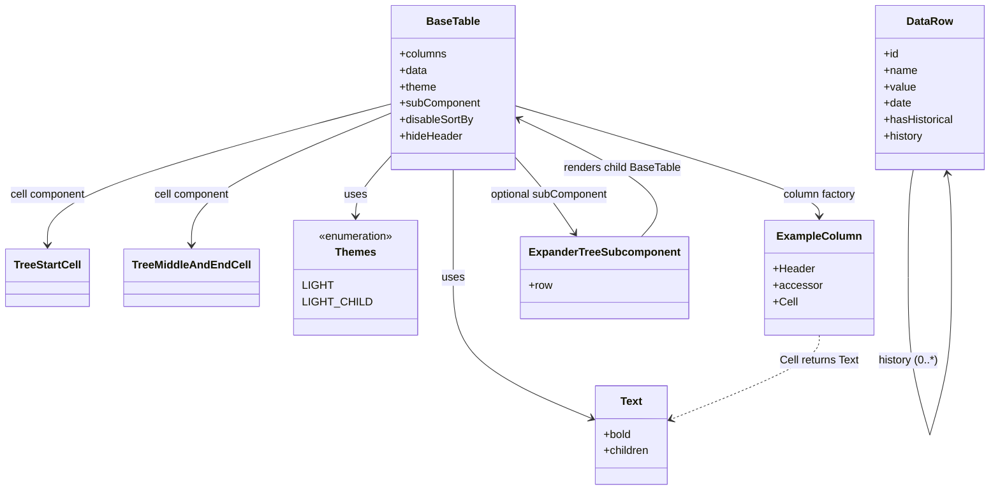
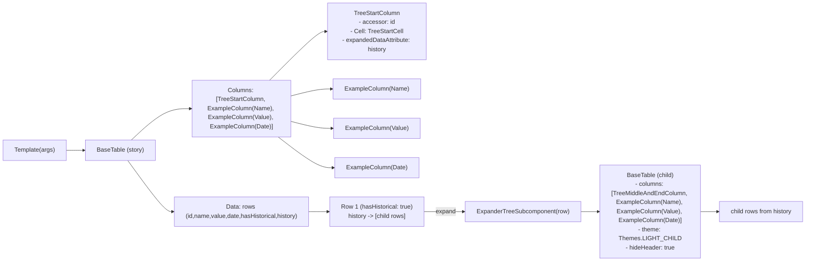

# Diagram: web/portal/src/components/organisms/base-table/BaseTable.organism.stories.js

> Auto-generated by Obscura crawlers

## Diagram 1

### SVG

<svg id="container" width="1418.624267578125" xmlns="http://www.w3.org/2000/svg" class="classDiagram" height="716" viewBox="0 0 1418.624267578125 716" role="graphics-document document" aria-roledescription="class"><g><defs><marker id="container_class-aggregationStart" class="marker aggregation class" refX="18" refY="7" markerWidth="190" markerHeight="240" orient="auto"><path d="M 18,7 L9,13 L1,7 L9,1 Z"></path></marker></defs><defs><marker id="container_class-aggregationEnd" class="marker aggregation class" refX="1" refY="7" markerWidth="20" markerHeight="28" orient="auto"><path d="M 18,7 L9,13 L1,7 L9,1 Z"></path></marker></defs><defs><marker id="container_class-extensionStart" class="marker extension class" refX="18" refY="7" markerWidth="190" markerHeight="240" orient="auto"><path d="M 1,7 L18,13 V 1 Z"></path></marker></defs><defs><marker id="container_class-extensionEnd" class="marker extension class" refX="1" refY="7" markerWidth="20" markerHeight="28" orient="auto"><path d="M 1,1 V 13 L18,7 Z"></path></marker></defs><defs><marker id="container_class-compositionStart" class="marker composition class" refX="18" refY="7" markerWidth="190" markerHeight="240" orient="auto"><path d="M 18,7 L9,13 L1,7 L9,1 Z"></path></marker></defs><defs><marker id="container_class-compositionEnd" class="marker composition class" refX="1" refY="7" markerWidth="20" markerHeight="28" orient="auto"><path d="M 18,7 L9,13 L1,7 L9,1 Z"></path></marker></defs><defs><marker id="container_class-dependencyStart" class="marker dependency class" refX="6" refY="7" markerWidth="190" markerHeight="240" orient="auto"><path d="M 5,7 L9,13 L1,7 L9,1 Z"></path></marker></defs><defs><marker id="container_class-dependencyEnd" class="marker dependency class" refX="13" refY="7" markerWidth="20" markerHeight="28" orient="auto"><path d="M 18,7 L9,13 L14,7 L9,1 Z"></path></marker></defs><defs><marker id="container_class-lollipopStart" class="marker lollipop class" refX="13" refY="7" markerWidth="190" markerHeight="240" orient="auto"><circle stroke="black" fill="transparent" cx="7" cy="7" r="6"></circle></marker></defs><defs><marker id="container_class-lollipopEnd" class="marker lollipop class" refX="1" refY="7" markerWidth="190" markerHeight="240" orient="auto"><circle stroke="black" fill="transparent" cx="7" cy="7" r="6"></circle></marker></defs><g class="root"><g class="clusters"></g><g class="edgePaths"><path d="M638.328,248L638.328,254.167C638.328,260.333,638.328,272.667,638.328,299C638.328,325.333,638.328,365.667,638.328,406C638.328,446.333,638.328,486.667,671.518,520.85C704.708,555.032,771.087,583.065,804.277,597.081L837.466,611.097" id="id_BaseTable_Text_1" class="edge-thickness-normal edge-pattern-solid relation" style=";;;" data-edge="true" data-et="edge" data-id="id_BaseTable_Text_1" data-points="W3sieCI6NjM4LjMyODEyNSwieSI6MjQ4fSx7IngiOjYzOC4zMjgxMjUsInkiOjI4NX0seyJ4Ijo2MzguMzI4MTI1LCJ5Ijo0MDZ9LHsieCI6NjM4LjMyODEyNSwieSI6NTI3fSx7IngiOjg0Mi45OTM3NTAwMDAzNzI1LCJ5Ijo2MTMuNDMxNDA0MTIzMjAxfV0=" marker-end="url(#container_class-dependencyEnd)"></path><path d="M548.609,230.743L540.713,239.786C532.816,248.829,517.023,266.914,509.127,281.124C501.23,295.333,501.23,305.667,501.23,310.833L501.23,316" id="id_BaseTable_Themes_2" class="edge-thickness-normal edge-pattern-solid relation" style=";;;" data-edge="true" data-et="edge" data-id="id_BaseTable_Themes_2" data-points="W3sieCI6NTQ4LjYwOTM3NSwieSI6MjMwLjc0MzE0MDQzOTM1Mzh9LHsieCI6NTAxLjIzMDQ2ODc1LCJ5IjoyODV9LHsieCI6NTAxLjIzMDQ2ODc1LCJ5IjozMjJ9XQ==" marker-end="url(#container_class-dependencyEnd)"></path><path d="M548.609,152.687L468.465,174.739C388.32,196.791,228.031,240.896,147.887,275.114C67.742,309.333,67.742,333.667,67.742,345.833L67.742,358" id="id_BaseTable_TreeStartCell_3" class="edge-thickness-normal edge-pattern-solid relation" style=";;;" data-edge="true" data-et="edge" data-id="id_BaseTable_TreeStartCell_3" data-points="W3sieCI6NTQ4LjYwOTM3NSwieSI6MTUyLjY4NjYyOTY5ODA4OTk0fSx7IngiOjY3Ljc0MjE4NzUsInkiOjI4NX0seyJ4Ijo2Ny43NDIxODc1LCJ5IjozNjR9XQ==" marker-end="url(#container_class-dependencyEnd)"></path><path d="M548.609,166.405L502.434,186.171C456.258,205.937,363.906,245.468,317.73,277.401C271.555,309.333,271.555,333.667,271.555,345.833L271.555,358" id="id_BaseTable_TreeMiddleAndEndCell_4" class="edge-thickness-normal edge-pattern-solid relation" style=";;;" data-edge="true" data-et="edge" data-id="id_BaseTable_TreeMiddleAndEndCell_4" data-points="W3sieCI6NTQ4LjYwOTM3NSwieSI6MTY2LjQwNDc1NDI5NzM5OTJ9LHsieCI6MjcxLjU1NDY4NzUsInkiOjI4NX0seyJ4IjoyNzEuNTU0Njg3NSwieSI6MzY0fV0=" marker-end="url(#container_class-dependencyEnd)"></path><path d="M728.047,154.334L802.242,176.112C876.436,197.89,1024.826,241.445,1099.02,268.389C1173.215,295.333,1173.215,305.667,1173.215,310.833L1173.215,316" id="id_BaseTable_ExampleColumn_5" class="edge-thickness-normal edge-pattern-solid relation" style=";;;" data-edge="true" data-et="edge" data-id="id_BaseTable_ExampleColumn_5" data-points="W3sieCI6NzI4LjA0Njg3NSwieSI6MTU0LjMzNDI1NTkzOTEyMjZ9LHsieCI6MTE3My4yMTQ4NDM3NSwieSI6Mjg1fSx7IngiOjExNzMuMjE0ODQzNzUsInkiOjMyMn1d" marker-end="url(#container_class-dependencyEnd)"></path><path d="M728.047,229.803L736.154,239.003C744.262,248.202,760.477,266.601,774.943,285.141C789.409,303.68,802.127,322.36,808.486,331.7L814.845,341.04" id="id_BaseTable_ExpanderTreeSubcomponent_6" class="edge-thickness-normal edge-pattern-solid relation" style=";;;" data-edge="true" data-et="edge" data-id="id_BaseTable_ExpanderTreeSubcomponent_6" data-points="W3sieCI6NzI4LjA0Njg3NSwieSI6MjI5LjgwMzMzNzAwMzQ3MjV9LHsieCI6Nzc2LjY5MTQwNjI1LCJ5IjoyODV9LHsieCI6ODE4LjIyMjA1NTc4NTMxMTgsInkiOjM0Nn1d" marker-end="url(#container_class-dependencyEnd)"></path><path d="M914.564,346L923.967,335.833C933.369,325.667,952.175,305.333,921.993,276.484C891.811,247.635,812.642,210.27,773.058,191.587L733.473,172.905" id="id_ExpanderTreeSubcomponent_BaseTable_7" class="edge-thickness-normal edge-pattern-solid relation" style=";;;" data-edge="true" data-et="edge" data-id="id_ExpanderTreeSubcomponent_BaseTable_7" data-points="W3sieCI6OTE0LjU2MzczOTY2OTYwOTMsInkiOjM0Nn0seyJ4Ijo5NzAuOTgwNDY4NzUsInkiOjI4NX0seyJ4Ijo3MjguMDQ2ODc1LCJ5IjoxNzAuMzQ0MDM4Nzk4MDEzMTJ9XQ==" marker-end="url(#container_class-dependencyEnd)"></path><path d="M1306.951,248L1305.707,254.167C1304.462,260.333,1301.973,272.667,1300.728,298.992C1299.484,325.317,1299.484,365.633,1299.484,385.792L1299.484,405.95" id="DataRow-cyclic-special-1" class="edge-thickness-normal edge-pattern-solid relation" style=";;;" data-edge="true" data-et="edge" data-id="DataRow-cyclic-special-1" data-points="W3sieCI6MTMwNi45NTEzNDg1Mjc4MTUsInkiOjI0OH0seyJ4IjoxMjk5LjQ4MzU5Mzc1MDc0NSwieSI6Mjg1fSx7IngiOjEyOTkuNDgzNTkzNzUwNzQ1LCJ5Ijo0MDUuOTQ5OTk5OTk5MjU0OTR9XQ=="></path><path d="M1299.484,406.05L1299.484,426.208C1299.484,446.367,1299.484,486.683,1304.762,525C1310.041,563.317,1320.599,599.633,1325.878,617.792L1331.157,635.95" id="DataRow-cyclic-special-mid" class="edge-thickness-normal edge-pattern-solid relation" style=";;;" data-edge="true" data-et="edge" data-id="DataRow-cyclic-special-mid" data-points="W3sieCI6MTI5OS40ODM1OTM3NTA3NDUsInkiOjQwNi4wNTAwMDAwMDA3NDUwNn0seyJ4IjoxMjk5LjQ4MzU5Mzc1MDc0NSwieSI6NTI3fSx7IngiOjEzMzEuMTU2NTU4MjAwMDY5NiwieSI6NjM1Ljk0OTk5OTk5OTI1NDl9XQ=="></path><path d="M1331.186,635.95L1336.464,617.792C1341.743,599.633,1352.301,563.317,1357.58,524.992C1362.859,486.667,1362.859,446.333,1362.859,406C1362.859,365.667,1362.859,325.333,1361.812,299.98C1360.765,274.627,1358.671,264.254,1357.625,259.068L1356.578,253.881" id="DataRow-cyclic-special-2" class="edge-thickness-normal edge-pattern-solid relation" style=";;;" data-edge="true" data-et="edge" data-id="DataRow-cyclic-special-2" data-points="W3sieCI6MTMzMS4xODU2MjkzMDE0MjA1LCJ5Ijo2MzUuOTQ5OTk5OTk5MjU0OX0seyJ4IjoxMzYyLjg1ODU5Mzc1MDc0NSwieSI6NTI3fSx7IngiOjEzNjIuODU4NTkzNzUwNzQ1LCJ5Ijo0MDZ9LHsieCI6MTM2Mi44NTg1OTM3NTA3NDUsInkiOjI4NX0seyJ4IjoxMzU1LjM5MDgzODk3MzY3NSwieSI6MjQ4fV0=" marker-end="url(#container_class-dependencyEnd)"></path><path d="M1173.215,490L1173.215,496.167C1173.215,502.333,1173.215,514.667,1136.922,535.126C1100.63,555.585,1028.044,584.17,991.752,598.463L955.459,612.755" id="id_ExampleColumn_Text_9" class="edge-thickness-normal edge-pattern-dashed relation" style=";;;" data-edge="true" data-et="edge" data-id="id_ExampleColumn_Text_9" data-points="W3sieCI6MTE3My4yMTQ4NDM3NSwieSI6NDkwfSx7IngiOjExNzMuMjE0ODQzNzUsInkiOjUyN30seyJ4Ijo5NDkuODc2NTYyNTAwMzcyNSwieSI6NjE0Ljk1Mzk3MTE3NTE1MDV9XQ==" marker-end="url(#container_class-dependencyEnd)"></path></g><g class="edgeLabels"><g class="edgeLabel" transform="translate(638.328125, 406)"><g class="label" data-id="id_BaseTable_Text_1" transform="translate(-16.4921875, -12)"><foreignObject width="32.984375" height="24">

uses

</foreignObject></g></g><g class="edgeLabel" transform="translate(501.23046875, 285)"><g class="label" data-id="id_BaseTable_Themes_2" transform="translate(-16.4921875, -12)"><foreignObject width="32.984375" height="24">

uses

</foreignObject></g></g><g class="edgeLabel" transform="translate(67.7421875, 285)"><g class="label" data-id="id_BaseTable_TreeStartCell_3" transform="translate(-56.078125, -12)"><foreignObject width="112.15625" height="24">

cell component

</foreignObject></g></g><g class="edgeLabel" transform="translate(271.5546875, 285)"><g class="label" data-id="id_BaseTable_TreeMiddleAndEndCell_4" transform="translate(-56.078125, -12)"><foreignObject width="112.15625" height="24">

cell component

</foreignObject></g></g><g class="edgeLabel" transform="translate(1173.21484375, 285)"><g class="label" data-id="id_BaseTable_ExampleColumn_5" transform="translate(-54.1484375, -12)"><foreignObject width="108.296875" height="24">

column factory

</foreignObject></g></g><g class="edgeLabel" transform="translate(776.69140625, 285)"><g class="label" data-id="id_BaseTable_ExpanderTreeSubcomponent_6" transform="translate(-87.7109375, -12)"><foreignObject width="175.421875" height="24">

optional subComponent

</foreignObject></g></g><g class="edgeLabel" transform="translate(887.08415, 245.40394)"><g class="label" data-id="id_ExpanderTreeSubcomponent_BaseTable_7" transform="translate(-86.578125, -12)"><foreignObject width="173.15625" height="24">

renders child BaseTable

</foreignObject></g></g><g class="edgeLabel"><g class="label" data-id="DataRow-cyclic-special-1" transform="translate(0, 0)"><foreignObject width="0" height="0">

</foreignObject></g></g><g class="edgeLabel" transform="translate(1299.483593750745, 527)"><g class="label" data-id="DataRow-cyclic-special-mid" transform="translate(-43.375, -12)"><foreignObject width="86.75" height="24">

history (0..*)

</foreignObject></g></g><g class="edgeLabel"><g class="label" data-id="DataRow-cyclic-special-2" transform="translate(0, 0)"><foreignObject width="0" height="0">

</foreignObject></g></g><g class="edgeLabel" transform="translate(1173.21484375, 527)"><g class="label" data-id="id_ExampleColumn_Text_9" transform="translate(-58.625, -12)"><foreignObject width="117.25" height="24">

Cell returns Text

</foreignObject></g></g></g><g class="nodes"><g class="node default" id="classId-BaseTable-0" transform="translate(638.328125, 128)"><g class="basic label-container"><path d="M-89.71875 -120 L89.71875 -120 L89.71875 120 L-89.71875 120" stroke="none" stroke-width="0" fill="#ECECFF" style=""></path><path d="M-89.71875 -120 C-39.35966849134639 -120, 10.99941301730722 -120, 89.71875 -120 M-89.71875 -120 C-51.88167311469477 -120, -14.04459622938954 -120, 89.71875 -120 M89.71875 -120 C89.71875 -48.07708068651219, 89.71875 23.84583862697562, 89.71875 120 M89.71875 -120 C89.71875 -53.56490405415647, 89.71875 12.870191891687057, 89.71875 120 M89.71875 120 C38.106343727886944 120, -13.506062544226111 120, -89.71875 120 M89.71875 120 C37.16831041366803 120, -15.382129172663937 120, -89.71875 120 M-89.71875 120 C-89.71875 50.482236134945566, -89.71875 -19.035527730108868, -89.71875 -120 M-89.71875 120 C-89.71875 26.345095616312165, -89.71875 -67.30980876737567, -89.71875 -120" stroke="#9370DB" stroke-width="1.3" fill="none" stroke-dasharray="0 0" style=""></path></g><g class="annotation-group text" transform="translate(0, -96)"></g><g class="label-group text" transform="translate(-37.359375, -96)"><g class="label" style="font-weight: bolder" transform="translate(0,-12)"><foreignObject width="74.71875" height="24">

BaseTable

</foreignObject></g></g><g class="members-group text" transform="translate(-77.71875, -48)"><g class="label" style="" transform="translate(0,-12)"><foreignObject width="69.21875" height="24">

+columns

</foreignObject></g><g class="label" style="" transform="translate(0,12)"><foreignObject width="40.625" height="24">

+data

</foreignObject></g><g class="label" style="" transform="translate(0,36)"><foreignObject width="54.21875" height="24">

+theme

</foreignObject></g><g class="label" style="" transform="translate(0,60)"><foreignObject width="118.078125" height="24">

+subComponent

</foreignObject></g><g class="label" style="" transform="translate(0,84)"><foreignObject width="108.53125" height="24">

+disableSortBy

</foreignObject></g><g class="label" style="" transform="translate(0,108)"><foreignObject width="92.78125" height="24">

+hideHeader

</foreignObject></g></g><g class="methods-group text" transform="translate(-77.71875, 120)"></g><g class="divider" style=""><path d="M-89.71875 -72 C-51.421660560981906 -72, -13.124571121963811 -72, 89.71875 -72 M-89.71875 -72 C-33.48791645181067 -72, 22.74291709637866 -72, 89.71875 -72" stroke="#9370DB" stroke-width="1.3" fill="none" stroke-dasharray="0 0" style=""></path></g><g class="divider" style=""><path d="M-89.71875 96 C-36.0674381048313 96, 17.583873790337407 96, 89.71875 96 M-89.71875 96 C-29.0845975984828 96, 31.549554803034397 96, 89.71875 96" stroke="#9370DB" stroke-width="1.3" fill="none" stroke-dasharray="0 0" style=""></path></g></g><g class="node default" id="classId-Text-1" transform="translate(896.4351562503725, 636)"><g class="basic label-container"><path d="M-53.44140625 -72 L53.44140625 -72 L53.44140625 72 L-53.44140625 72" stroke="none" stroke-width="0" fill="#ECECFF" style=""></path><path d="M-53.44140625 -72 C-27.96386987653669 -72, -2.486333503073382 -72, 53.44140625 -72 M-53.44140625 -72 C-26.937387833501976 -72, -0.43336941700395215 -72, 53.44140625 -72 M53.44140625 -72 C53.44140625 -39.75980249387448, 53.44140625 -7.519604987748963, 53.44140625 72 M53.44140625 -72 C53.44140625 -40.35719319284394, 53.44140625 -8.714386385687874, 53.44140625 72 M53.44140625 72 C19.238182045600055 72, -14.96504215879989 72, -53.44140625 72 M53.44140625 72 C21.48909813513872 72, -10.463209979722564 72, -53.44140625 72 M-53.44140625 72 C-53.44140625 38.99763833980482, -53.44140625 5.9952766796096455, -53.44140625 -72 M-53.44140625 72 C-53.44140625 33.42637989461193, -53.44140625 -5.147240210776147, -53.44140625 -72" stroke="#9370DB" stroke-width="1.3" fill="none" stroke-dasharray="0 0" style=""></path></g><g class="annotation-group text" transform="translate(0, -48)"></g><g class="label-group text" transform="translate(-15.3828125, -48)"><g class="label" style="font-weight: bolder" transform="translate(0,-12)"><foreignObject width="30.765625" height="24">

Text

</foreignObject></g></g><g class="members-group text" transform="translate(-41.44140625, 0)"><g class="label" style="" transform="translate(0,-12)"><foreignObject width="41.015625" height="24">

+bold

</foreignObject></g><g class="label" style="" transform="translate(0,12)"><foreignObject width="67.5" height="24">

+children

</foreignObject></g></g><g class="methods-group text" transform="translate(-41.44140625, 72)"></g><g class="divider" style=""><path d="M-53.44140625 -24 C-11.740238138623766 -24, 29.960929972752467 -24, 53.44140625 -24 M-53.44140625 -24 C-28.707354808116865 -24, -3.973303366233729 -24, 53.44140625 -24" stroke="#9370DB" stroke-width="1.3" fill="none" stroke-dasharray="0 0" style=""></path></g><g class="divider" style=""><path d="M-53.44140625 48 C-11.352570289169634 48, 30.736265671660732 48, 53.44140625 48 M-53.44140625 48 C-11.053193276937783 48, 31.335019696124434 48, 53.44140625 48" stroke="#9370DB" stroke-width="1.3" fill="none" stroke-dasharray="0 0" style=""></path></g></g><g class="node default" id="classId-TreeStartCell-2" transform="translate(67.7421875, 406)"><g class="basic label-container"><path d="M-59.7421875 -42 L59.7421875 -42 L59.7421875 42 L-59.7421875 42" stroke="none" stroke-width="0" fill="#ECECFF" style=""></path><path d="M-59.7421875 -42 C-28.212982301013664 -42, 3.316222897972672 -42, 59.7421875 -42 M-59.7421875 -42 C-25.22302605486452 -42, 9.296135390270962 -42, 59.7421875 -42 M59.7421875 -42 C59.7421875 -11.112209180793478, 59.7421875 19.775581638413044, 59.7421875 42 M59.7421875 -42 C59.7421875 -12.962603513496902, 59.7421875 16.074792973006197, 59.7421875 42 M59.7421875 42 C18.09475252416511 42, -23.55268245166978 42, -59.7421875 42 M59.7421875 42 C22.431443854045234 42, -14.879299791909531 42, -59.7421875 42 M-59.7421875 42 C-59.7421875 15.496075133572187, -59.7421875 -11.007849732855625, -59.7421875 -42 M-59.7421875 42 C-59.7421875 9.504611332081879, -59.7421875 -22.990777335836242, -59.7421875 -42" stroke="#9370DB" stroke-width="1.3" fill="none" stroke-dasharray="0 0" style=""></path></g><g class="annotation-group text" transform="translate(0, -18)"></g><g class="label-group text" transform="translate(-47.7421875, -18)"><g class="label" style="font-weight: bolder" transform="translate(0,-12)"><foreignObject width="95.484375" height="24">

TreeStartCell

</foreignObject></g></g><g class="members-group text" transform="translate(-47.7421875, 30)"></g><g class="methods-group text" transform="translate(-47.7421875, 60)"></g><g class="divider" style=""><path d="M-59.7421875 6 C-14.54514909879466 6, 30.65188930241068 6, 59.7421875 6 M-59.7421875 6 C-33.44264431529971 6, -7.143101130599419 6, 59.7421875 6" stroke="#9370DB" stroke-width="1.3" fill="none" stroke-dasharray="0 0" style=""></path></g><g class="divider" style=""><path d="M-59.7421875 24 C-14.83942378779976 24, 30.06333992440048 24, 59.7421875 24 M-59.7421875 24 C-29.178819970350215 24, 1.3845475592995697 24, 59.7421875 24" stroke="#9370DB" stroke-width="1.3" fill="none" stroke-dasharray="0 0" style=""></path></g></g><g class="node default" id="classId-TreeMiddleAndEndCell-3" transform="translate(271.5546875, 406)"><g class="basic label-container"><path d="M-94.0703125 -42 L94.0703125 -42 L94.0703125 42 L-94.0703125 42" stroke="none" stroke-width="0" fill="#ECECFF" style=""></path><path d="M-94.0703125 -42 C-45.173681551426995 -42, 3.72294939714601 -42, 94.0703125 -42 M-94.0703125 -42 C-47.85866062025611 -42, -1.64700874051222 -42, 94.0703125 -42 M94.0703125 -42 C94.0703125 -12.807669753100843, 94.0703125 16.384660493798314, 94.0703125 42 M94.0703125 -42 C94.0703125 -23.991402201458236, 94.0703125 -5.9828044029164715, 94.0703125 42 M94.0703125 42 C40.19268628477908 42, -13.684939930441843 42, -94.0703125 42 M94.0703125 42 C50.90316889122156 42, 7.736025282443123 42, -94.0703125 42 M-94.0703125 42 C-94.0703125 16.903575087922373, -94.0703125 -8.192849824155253, -94.0703125 -42 M-94.0703125 42 C-94.0703125 24.973596197494064, -94.0703125 7.947192394988129, -94.0703125 -42" stroke="#9370DB" stroke-width="1.3" fill="none" stroke-dasharray="0 0" style=""></path></g><g class="annotation-group text" transform="translate(0, -18)"></g><g class="label-group text" transform="translate(-82.0703125, -18)"><g class="label" style="font-weight: bolder" transform="translate(0,-12)"><foreignObject width="164.140625" height="24">

TreeMiddleAndEndCell

</foreignObject></g></g><g class="members-group text" transform="translate(-82.0703125, 30)"></g><g class="methods-group text" transform="translate(-82.0703125, 60)"></g><g class="divider" style=""><path d="M-94.0703125 6 C-20.263703647518057 6, 53.54290520496389 6, 94.0703125 6 M-94.0703125 6 C-39.25212530739652 6, 15.566061885206963 6, 94.0703125 6" stroke="#9370DB" stroke-width="1.3" fill="none" stroke-dasharray="0 0" style=""></path></g><g class="divider" style=""><path d="M-94.0703125 24 C-28.33305721399445 24, 37.4041980720111 24, 94.0703125 24 M-94.0703125 24 C-33.589945359550896 24, 26.89042178089821 24, 94.0703125 24" stroke="#9370DB" stroke-width="1.3" fill="none" stroke-dasharray="0 0" style=""></path></g></g><g class="node default" id="classId-Themes-4" transform="translate(501.23046875, 406)"><g class="basic label-container"><path d="M-85.60546875 -84 L85.60546875 -84 L85.60546875 84 L-85.60546875 84" stroke="none" stroke-width="0" fill="#ECECFF" style=""></path><path d="M-85.60546875 -84 C-35.67343830848094 -84, 14.258592133038121 -84, 85.60546875 -84 M-85.60546875 -84 C-33.51785200149099 -84, 18.569764747018013 -84, 85.60546875 -84 M85.60546875 -84 C85.60546875 -26.00379734190063, 85.60546875 31.99240531619874, 85.60546875 84 M85.60546875 -84 C85.60546875 -43.351713738784895, 85.60546875 -2.7034274775697895, 85.60546875 84 M85.60546875 84 C30.99390822195455 84, -23.617652306090903 84, -85.60546875 84 M85.60546875 84 C28.947492297959606 84, -27.71048415408079 84, -85.60546875 84 M-85.60546875 84 C-85.60546875 24.752178330695713, -85.60546875 -34.49564333860857, -85.60546875 -84 M-85.60546875 84 C-85.60546875 24.616709070248454, -85.60546875 -34.76658185950309, -85.60546875 -84" stroke="#9370DB" stroke-width="1.3" fill="none" stroke-dasharray="0 0" style=""></path></g><g class="annotation-group text" transform="translate(-55.5546875, -60)"><g class="label" style="" transform="translate(0,-12)"><foreignObject width="111.109375" height="24">

«enumeration»

</foreignObject></g></g><g class="label-group text" transform="translate(-28.3984375, -36)"><g class="label" style="font-weight: bolder" transform="translate(0,-12)"><foreignObject width="56.796875" height="24">

Themes

</foreignObject></g></g><g class="members-group text" transform="translate(-73.60546875, 12)"><g class="label" style="" transform="translate(0,-12)"><foreignObject width="41.9375" height="24">

LIGHT

</foreignObject></g><g class="label" style="" transform="translate(0,12)"><foreignObject width="91.65625" height="24">

LIGHT_CHILD

</foreignObject></g></g><g class="methods-group text" transform="translate(-73.60546875, 84)"></g><g class="divider" style=""><path d="M-85.60546875 -12 C-39.02594236666089 -12, 7.553584016678215 -12, 85.60546875 -12 M-85.60546875 -12 C-39.21329878329939 -12, 7.178871183401213 -12, 85.60546875 -12" stroke="#9370DB" stroke-width="1.3" fill="none" stroke-dasharray="0 0" style=""></path></g><g class="divider" style=""><path d="M-85.60546875 60 C-26.582483698122644 60, 32.44050135375471 60, 85.60546875 60 M-85.60546875 60 C-26.537137856889636 60, 32.53119303622073 60, 85.60546875 60" stroke="#9370DB" stroke-width="1.3" fill="none" stroke-dasharray="0 0" style=""></path></g></g><g class="node default" id="classId-ExampleColumn-5" transform="translate(1173.21484375, 406)"><g class="basic label-container"><path d="M-76.21875 -84 L76.21875 -84 L76.21875 84 L-76.21875 84" stroke="none" stroke-width="0" fill="#ECECFF" style=""></path><path d="M-76.21875 -84 C-43.38937816375855 -84, -10.560006327517101 -84, 76.21875 -84 M-76.21875 -84 C-39.404136556482825 -84, -2.589523112965651 -84, 76.21875 -84 M76.21875 -84 C76.21875 -48.69460454593323, 76.21875 -13.389209091866462, 76.21875 84 M76.21875 -84 C76.21875 -43.43679300467213, 76.21875 -2.8735860093442653, 76.21875 84 M76.21875 84 C15.860896231391315 84, -44.49695753721737 84, -76.21875 84 M76.21875 84 C17.37245918446518 84, -41.47383163106964 84, -76.21875 84 M-76.21875 84 C-76.21875 29.4306654583159, -76.21875 -25.1386690833682, -76.21875 -84 M-76.21875 84 C-76.21875 37.425576829883475, -76.21875 -9.14884634023305, -76.21875 -84" stroke="#9370DB" stroke-width="1.3" fill="none" stroke-dasharray="0 0" style=""></path></g><g class="annotation-group text" transform="translate(0, -60)"></g><g class="label-group text" transform="translate(-58.296875, -60)"><g class="label" style="font-weight: bolder" transform="translate(0,-12)"><foreignObject width="116.59375" height="24">

ExampleColumn

</foreignObject></g></g><g class="members-group text" transform="translate(-64.21875, -12)"><g class="label" style="" transform="translate(0,-12)"><foreignObject width="60.59375" height="24">

+Header

</foreignObject></g><g class="label" style="" transform="translate(0,12)"><foreignObject width="70.140625" height="24">

+accessor

</foreignObject></g><g class="label" style="" transform="translate(0,36)"><foreignObject width="34.734375" height="24">

+Cell

</foreignObject></g></g><g class="methods-group text" transform="translate(-64.21875, 84)"></g><g class="divider" style=""><path d="M-76.21875 -36 C-36.17035797195177 -36, 3.8780340560964532 -36, 76.21875 -36 M-76.21875 -36 C-38.086878768224125 -36, 0.04499246355175046 -36, 76.21875 -36" stroke="#9370DB" stroke-width="1.3" fill="none" stroke-dasharray="0 0" style=""></path></g><g class="divider" style=""><path d="M-76.21875 60 C-27.38628282924654 60, 21.44618434150692 60, 76.21875 60 M-76.21875 60 C-24.434540153934684 60, 27.349669692130632 60, 76.21875 60" stroke="#9370DB" stroke-width="1.3" fill="none" stroke-dasharray="0 0" style=""></path></g></g><g class="node default" id="classId-ExpanderTreeSubcomponent-6" transform="translate(859.0718750003725, 406)"><g class="basic label-container"><path d="M-117.5234375 -60 L117.5234375 -60 L117.5234375 60 L-117.5234375 60" stroke="none" stroke-width="0" fill="#ECECFF" style=""></path><path d="M-117.5234375 -60 C-47.964775328106796 -60, 21.593886843786407 -60, 117.5234375 -60 M-117.5234375 -60 C-59.292339129790626 -60, -1.0612407595812527 -60, 117.5234375 -60 M117.5234375 -60 C117.5234375 -16.05853966739965, 117.5234375 27.8829206652007, 117.5234375 60 M117.5234375 -60 C117.5234375 -29.178157866701483, 117.5234375 1.6436842665970346, 117.5234375 60 M117.5234375 60 C62.367619088650805 60, 7.211800677301611 60, -117.5234375 60 M117.5234375 60 C47.79955410374575 60, -21.924329292508503 60, -117.5234375 60 M-117.5234375 60 C-117.5234375 17.028765674067515, -117.5234375 -25.94246865186497, -117.5234375 -60 M-117.5234375 60 C-117.5234375 33.83193254501177, -117.5234375 7.663865090023535, -117.5234375 -60" stroke="#9370DB" stroke-width="1.3" fill="none" stroke-dasharray="0 0" style=""></path></g><g class="annotation-group text" transform="translate(0, -36)"></g><g class="label-group text" transform="translate(-105.5234375, -36)"><g class="label" style="font-weight: bolder" transform="translate(0,-12)"><foreignObject width="211.046875" height="24">

ExpanderTreeSubcomponent

</foreignObject></g></g><g class="members-group text" transform="translate(-105.5234375, 12)"><g class="label" style="" transform="translate(0,-12)"><foreignObject width="34.5" height="24">

+row

</foreignObject></g></g><g class="methods-group text" transform="translate(-105.5234375, 60)"></g><g class="divider" style=""><path d="M-117.5234375 -12 C-33.52624804727208 -12, 50.47094140545585 -12, 117.5234375 -12 M-117.5234375 -12 C-51.98138651844852 -12, 13.560664463102967 -12, 117.5234375 -12" stroke="#9370DB" stroke-width="1.3" fill="none" stroke-dasharray="0 0" style=""></path></g><g class="divider" style=""><path d="M-117.5234375 36 C-32.087628729227916 36, 53.34818004154417 36, 117.5234375 36 M-117.5234375 36 C-51.853875901391305 36, 13.81568569721739 36, 117.5234375 36" stroke="#9370DB" stroke-width="1.3" fill="none" stroke-dasharray="0 0" style=""></path></g></g><g class="node default" id="classId-DataRow-7" transform="translate(1331.171093750745, 128)"><g class="basic label-container"><path d="M-79.453125 -120 L79.453125 -120 L79.453125 120 L-79.453125 120" stroke="none" stroke-width="0" fill="#ECECFF" style=""></path><path d="M-79.453125 -120 C-30.91132880709231 -120, 17.63046738581538 -120, 79.453125 -120 M-79.453125 -120 C-38.39978609165764 -120, 2.653552816684723 -120, 79.453125 -120 M79.453125 -120 C79.453125 -70.67894197657795, 79.453125 -21.35788395315589, 79.453125 120 M79.453125 -120 C79.453125 -39.79707471792588, 79.453125 40.40585056414824, 79.453125 120 M79.453125 120 C31.99754871925021 120, -15.458027561499577 120, -79.453125 120 M79.453125 120 C36.04882450101181 120, -7.355475997976384 120, -79.453125 120 M-79.453125 120 C-79.453125 36.022228143443115, -79.453125 -47.95554371311377, -79.453125 -120 M-79.453125 120 C-79.453125 27.531183671525795, -79.453125 -64.93763265694841, -79.453125 -120" stroke="#9370DB" stroke-width="1.3" fill="none" stroke-dasharray="0 0" style=""></path></g><g class="annotation-group text" transform="translate(0, -96)"></g><g class="label-group text" transform="translate(-32.375, -96)"><g class="label" style="font-weight: bolder" transform="translate(0,-12)"><foreignObject width="64.75" height="24">

DataRow

</foreignObject></g></g><g class="members-group text" transform="translate(-67.453125, -48)"><g class="label" style="" transform="translate(0,-12)"><foreignObject width="22.078125" height="24">

+id

</foreignObject></g><g class="label" style="" transform="translate(0,12)"><foreignObject width="48.5" height="24">

+name

</foreignObject></g><g class="label" style="" transform="translate(0,36)"><foreignObject width="46.71875" height="24">

+value

</foreignObject></g><g class="label" style="" transform="translate(0,60)"><foreignObject width="40.515625" height="24">

+date

</foreignObject></g><g class="label" style="" transform="translate(0,84)"><foreignObject width="102.53125" height="24">

+hasHistorical

</foreignObject></g><g class="label" style="" transform="translate(0,108)"><foreignObject width="58.28125" height="24">

+history

</foreignObject></g></g><g class="methods-group text" transform="translate(-67.453125, 120)"></g><g class="divider" style=""><path d="M-79.453125 -72 C-21.229830388938787 -72, 36.99346422212243 -72, 79.453125 -72 M-79.453125 -72 C-21.186366966230878 -72, 37.080391067538244 -72, 79.453125 -72" stroke="#9370DB" stroke-width="1.3" fill="none" stroke-dasharray="0 0" style=""></path></g><g class="divider" style=""><path d="M-79.453125 96 C-24.019866851090427 96, 31.413391297819146 96, 79.453125 96 M-79.453125 96 C-24.782801804317785 96, 29.88752139136443 96, 79.453125 96" stroke="#9370DB" stroke-width="1.3" fill="none" stroke-dasharray="0 0" style=""></path></g></g><g class="label edgeLabel" id="DataRow---DataRow---1" transform="translate(1299.483593750745, 406)"><rect width="0.1" height="0.1"></rect><g class="label" style="" transform="translate(0, 0)"><rect></rect><foreignObject width="0" height="0">

</foreignObject></g></g><g class="label edgeLabel" id="DataRow---DataRow---2" transform="translate(1331.171093750745, 636)"><rect width="0.1" height="0.1"></rect><g class="label" style="" transform="translate(0, 0)"><rect></rect><foreignObject width="0" height="0">

</foreignObject></g></g></g></g></g></svg>

## Diagram 2

### SVG

<svg id="container" width="2137.640625" xmlns="http://www.w3.org/2000/svg" class="flowchart" height="702" viewBox="0 0 2137.640625 702" role="graphics-document document" aria-roledescription="flowchart-v2"><g><marker id="container_flowchart-v2-pointEnd" class="marker flowchart-v2" viewBox="0 0 10 10" refX="5" refY="5" markerUnits="userSpaceOnUse" markerWidth="8" markerHeight="8" orient="auto"><path d="M 0 0 L 10 5 L 0 10 z" class="arrowMarkerPath" style="stroke-width: 1; stroke-dasharray: 1, 0;"></path></marker><marker id="container_flowchart-v2-pointStart" class="marker flowchart-v2" viewBox="0 0 10 10" refX="4.5" refY="5" markerUnits="userSpaceOnUse" markerWidth="8" markerHeight="8" orient="auto"><path d="M 0 5 L 10 10 L 10 0 z" class="arrowMarkerPath" style="stroke-width: 1; stroke-dasharray: 1, 0;"></path></marker><marker id="container_flowchart-v2-circleEnd" class="marker flowchart-v2" viewBox="0 0 10 10" refX="11" refY="5" markerUnits="userSpaceOnUse" markerWidth="11" markerHeight="11" orient="auto"><circle cx="5" cy="5" r="5" class="arrowMarkerPath" style="stroke-width: 1; stroke-dasharray: 1, 0;"></circle></marker><marker id="container_flowchart-v2-circleStart" class="marker flowchart-v2" viewBox="0 0 10 10" refX="-1" refY="5" markerUnits="userSpaceOnUse" markerWidth="11" markerHeight="11" orient="auto"><circle cx="5" cy="5" r="5" class="arrowMarkerPath" style="stroke-width: 1; stroke-dasharray: 1, 0;"></circle></marker><marker id="container_flowchart-v2-crossEnd" class="marker cross flowchart-v2" viewBox="0 0 11 11" refX="12" refY="5.2" markerUnits="userSpaceOnUse" markerWidth="11" markerHeight="11" orient="auto"><path d="M 1,1 l 9,9 M 10,1 l -9,9" class="arrowMarkerPath" style="stroke-width: 2; stroke-dasharray: 1, 0;"></path></marker><marker id="container_flowchart-v2-crossStart" class="marker cross flowchart-v2" viewBox="0 0 11 11" refX="-1" refY="5.2" markerUnits="userSpaceOnUse" markerWidth="11" markerHeight="11" orient="auto"><path d="M 1,1 l 9,9 M 10,1 l -9,9" class="arrowMarkerPath" style="stroke-width: 2; stroke-dasharray: 1, 0;"></path></marker><g class="root"><g class="clusters"></g><g class="edgePaths"><path d="M175.594,403L179.76,403C183.927,403,192.26,403,199.927,403C207.594,403,214.594,403,218.094,403L221.594,403" id="L_Template_BaseTableNode_0" class="edge-thickness-normal edge-pattern-solid edge-thickness-normal edge-pattern-solid flowchart-link" style=";" data-edge="true" data-et="edge" data-id="L_Template_BaseTableNode_0" data-points="W3sieCI6MTc1LjU5Mzc1LCJ5Ijo0MDN9LHsieCI6MjAwLjU5Mzc1LCJ5Ijo0MDN9LHsieCI6MjI1LjU5Mzc1LCJ5Ijo0MDN9XQ==" marker-end="url(#container_flowchart-v2-pointEnd)"></path><path d="M345.125,376L360.117,361.167C375.109,346.333,405.094,316.667,431.852,301.833C458.609,287,482.141,287,493.906,287L505.672,287" id="L_BaseTableNode_Columns_0" class="edge-thickness-normal edge-pattern-solid edge-thickness-normal edge-pattern-solid flowchart-link" style=";" data-edge="true" data-et="edge" data-id="L_BaseTableNode_Columns_0" data-points="W3sieCI6MzQ1LjEyNTA2NzM0OTEzNzksInkiOjM3Nn0seyJ4Ijo0MzUuMDc4MTI1LCJ5IjoyODd9LHsieCI6NTA5LjY3MTg3NSwieSI6Mjg3fV0=" marker-end="url(#container_flowchart-v2-pointEnd)"></path><path d="M714.89,212L736.453,190.5C758.015,169,801.14,126,826.203,104.5C851.266,83,858.266,83,861.766,83L865.266,83" id="L_Columns_TreeStartColumn_0" class="edge-thickness-normal edge-pattern-solid edge-thickness-normal edge-pattern-solid flowchart-link" style=";" data-edge="true" data-et="edge" data-id="L_Columns_TreeStartColumn_0" data-points="W3sieCI6NzE0Ljg5MDE2NTQ0MTE3NjUsInkiOjIxMn0seyJ4Ijo4NDQuMjY1NjI1LCJ5Ijo4M30seyJ4Ijo4NjkuMjY1NjI1LCJ5Ijo4M31d" marker-end="url(#container_flowchart-v2-pointEnd)"></path><path d="M769.672,253.959L782.104,250.799C794.536,247.639,819.401,241.32,837.93,238.16C856.458,235,868.651,235,874.747,235L880.844,235" id="L_Columns_ExampleName_0" class="edge-thickness-normal edge-pattern-solid edge-thickness-normal edge-pattern-solid flowchart-link" style=";" data-edge="true" data-et="edge" data-id="L_Columns_ExampleName_0" data-points="W3sieCI6NzY5LjY3MTg3NSwieSI6MjUzLjk1ODkxMjQ3ODk5OH0seyJ4Ijo4NDQuMjY1NjI1LCJ5IjoyMzV9LHsieCI6ODg0Ljg0Mzc1LCJ5IjoyMzV9XQ==" marker-end="url(#container_flowchart-v2-pointEnd)"></path><path d="M769.672,320.041L782.104,323.201C794.536,326.361,819.401,332.68,838.142,335.84C856.883,339,869.5,339,875.809,339L882.117,339" id="L_Columns_ExampleValue_0" class="edge-thickness-normal edge-pattern-solid edge-thickness-normal edge-pattern-solid flowchart-link" style=";" data-edge="true" data-et="edge" data-id="L_Columns_ExampleValue_0" data-points="W3sieCI6NzY5LjY3MTg3NSwieSI6MzIwLjA0MTA4NzUyMTAwMn0seyJ4Ijo4NDQuMjY1NjI1LCJ5IjozMzl9LHsieCI6ODg2LjExNzE4NzUsInkiOjMzOX1d" marker-end="url(#container_flowchart-v2-pointEnd)"></path><path d="M738.034,362L755.739,375.5C773.445,389,808.855,416,833.404,429.5C857.953,443,871.641,443,878.484,443L885.328,443" id="L_Columns_ExampleDate_0" class="edge-thickness-normal edge-pattern-solid edge-thickness-normal edge-pattern-solid flowchart-link" style=";" data-edge="true" data-et="edge" data-id="L_Columns_ExampleDate_0" data-points="W3sieCI6NzM4LjAzNDI1NDgwNzY5MjMsInkiOjM2Mn0seyJ4Ijo4NDQuMjY1NjI1LCJ5Ijo0NDN9LHsieCI6ODg5LjMyODEyNSwieSI6NDQzfV0=" marker-end="url(#container_flowchart-v2-pointEnd)"></path><path d="M336.678,430L353.078,453.5C369.478,477,402.278,524,422.178,547.5C442.078,571,449.078,571,452.578,571L456.078,571" id="L_BaseTableNode_Data_0" class="edge-thickness-normal edge-pattern-solid edge-thickness-normal edge-pattern-solid flowchart-link" style=";" data-edge="true" data-et="edge" data-id="L_BaseTableNode_Data_0" data-points="W3sieCI6MzM2LjY3ODQzMTkxOTY0MjgzLCJ5Ijo0MzB9LHsieCI6NDM1LjA3ODEyNSwieSI6NTcxfSx7IngiOjQ2MC4wNzgxMjUsInkiOjU3MX1d" marker-end="url(#container_flowchart-v2-pointEnd)"></path><path d="M819.266,571L823.432,571C827.599,571,835.932,571,843.599,571C851.266,571,858.266,571,861.766,571L865.266,571" id="L_Data_Row1_0" class="edge-thickness-normal edge-pattern-solid edge-thickness-normal edge-pattern-solid flowchart-link" style=";" data-edge="true" data-et="edge" data-id="L_Data_Row1_0" data-points="W3sieCI6ODE5LjI2NTYyNSwieSI6NTcxfSx7IngiOjg0NC4yNjU2MjUsInkiOjU3MX0seyJ4Ijo4NjkuMjY1NjI1LCJ5Ijo1NzF9XQ==" marker-end="url(#container_flowchart-v2-pointEnd)"></path><path d="M1129.266,571L1137.876,571C1146.487,571,1163.708,571,1180.263,571C1196.818,571,1212.706,571,1220.65,571L1228.594,571" id="L_Row1_Subcomponent_0" class="edge-thickness-normal edge-pattern-solid edge-thickness-normal edge-pattern-solid flowchart-link" style=";" data-edge="true" data-et="edge" data-id="L_Row1_Subcomponent_0" data-points="W3sieCI6MTEyOS4yNjU2MjUsInkiOjU3MX0seyJ4IjoxMTgwLjkyOTY4NzUsInkiOjU3MX0seyJ4IjoxMjMyLjU5Mzc1LCJ5Ijo1NzF9XQ==" marker-end="url(#container_flowchart-v2-pointEnd)"></path><path d="M1538.641,571L1542.807,571C1546.974,571,1555.307,571,1562.974,571C1570.641,571,1577.641,571,1581.141,571L1584.641,571" id="L_Subcomponent_ChildBaseTable_0" class="edge-thickness-normal edge-pattern-solid edge-thickness-normal edge-pattern-solid flowchart-link" style=";" data-edge="true" data-et="edge" data-id="L_Subcomponent_ChildBaseTable_0" data-points="W3sieCI6MTUzOC42NDA2MjUsInkiOjU3MX0seyJ4IjoxNTYzLjY0MDYyNSwieSI6NTcxfSx7IngiOjE1ODguNjQwNjI1LCJ5Ijo1NzF9XQ==" marker-end="url(#container_flowchart-v2-pointEnd)"></path><path d="M1852.813,571L1856.979,571C1861.146,571,1869.479,571,1877.146,571C1884.813,571,1891.813,571,1895.313,571L1898.813,571" id="L_ChildBaseTable_ChildData_0" class="edge-thickness-normal edge-pattern-solid edge-thickness-normal edge-pattern-solid flowchart-link" style=";" data-edge="true" data-et="edge" data-id="L_ChildBaseTable_ChildData_0" data-points="W3sieCI6MTg1Mi44MTI1LCJ5Ijo1NzF9LHsieCI6MTg3Ny44MTI1LCJ5Ijo1NzF9LHsieCI6MTkwMi44MTI1LCJ5Ijo1NzF9XQ==" marker-end="url(#container_flowchart-v2-pointEnd)"></path></g><g class="edgeLabels"><g class="edgeLabel"><g class="label" data-id="L_Template_BaseTableNode_0" transform="translate(0, 0)"><foreignObject width="0" height="0">

</foreignObject></g></g><g class="edgeLabel"><g class="label" data-id="L_BaseTableNode_Columns_0" transform="translate(0, 0)"><foreignObject width="0" height="0">

</foreignObject></g></g><g class="edgeLabel"><g class="label" data-id="L_Columns_TreeStartColumn_0" transform="translate(0, 0)"><foreignObject width="0" height="0">

</foreignObject></g></g><g class="edgeLabel"><g class="label" data-id="L_Columns_ExampleName_0" transform="translate(0, 0)"><foreignObject width="0" height="0">

</foreignObject></g></g><g class="edgeLabel"><g class="label" data-id="L_Columns_ExampleValue_0" transform="translate(0, 0)"><foreignObject width="0" height="0">

</foreignObject></g></g><g class="edgeLabel"><g class="label" data-id="L_Columns_ExampleDate_0" transform="translate(0, 0)"><foreignObject width="0" height="0">

</foreignObject></g></g><g class="edgeLabel"><g class="label" data-id="L_BaseTableNode_Data_0" transform="translate(0, 0)"><foreignObject width="0" height="0">

</foreignObject></g></g><g class="edgeLabel"><g class="label" data-id="L_Data_Row1_0" transform="translate(0, 0)"><foreignObject width="0" height="0">

</foreignObject></g></g><g class="edgeLabel" transform="translate(1180.9296875, 571)"><g class="label" data-id="L_Row1_Subcomponent_0" transform="translate(-26.6640625, -12)"><foreignObject width="53.328125" height="24">

expand

</foreignObject></g></g><g class="edgeLabel"><g class="label" data-id="L_Subcomponent_ChildBaseTable_0" transform="translate(0, 0)"><foreignObject width="0" height="0">

</foreignObject></g></g><g class="edgeLabel"><g class="label" data-id="L_ChildBaseTable_ChildData_0" transform="translate(0, 0)"><foreignObject width="0" height="0">

</foreignObject></g></g></g><g class="nodes"><g class="node default" id="flowchart-Template-0" transform="translate(91.796875, 403)"><rect class="basic label-container" style="" x="-83.796875" y="-27" width="167.59375" height="54"></rect><g class="label" style="" transform="translate(-53.796875, -12)"><rect></rect><foreignObject width="107.59375" height="24">

Template(args)

</foreignObject></g></g><g class="node default" id="flowchart-BaseTableNode-2" transform="translate(317.8359375, 403)"><rect class="basic label-container" style="" x="-92.2421875" y="-27" width="184.484375" height="54"></rect><g class="label" style="" transform="translate(-62.2421875, -12)"><rect></rect><foreignObject width="124.484375" height="24">

BaseTable (story)

</foreignObject></g></g><g class="node default" id="flowchart-Columns-4" transform="translate(639.671875, 287)"><rect class="basic label-container" style="" x="-130" y="-75" width="260" height="150"></rect><g class="label" style="" transform="translate(-100, -60)"><rect></rect><foreignObject width="200" height="120">

Columns: [TreeStartColumn, ExampleColumn(Name), ExampleColumn(Value), ExampleColumn(Date)]

</foreignObject></g></g><g class="node default" id="flowchart-TreeStartColumn-6" transform="translate(999.265625, 83)"><rect class="basic label-container" style="" x="-130" y="-75" width="260" height="150"></rect><g class="label" style="" transform="translate(-100, -60)"><rect></rect><foreignObject width="200" height="120">

TreeStartColumn\n- accessor: id\n- Cell: TreeStartCell\n- expandedDataAttribute: history

</foreignObject></g></g><g class="node default" id="flowchart-ExampleName-8" transform="translate(999.265625, 235)"><rect class="basic label-container" style="" x="-114.421875" y="-27" width="228.84375" height="54"></rect><g class="label" style="" transform="translate(-84.421875, -12)"><rect></rect><foreignObject width="168.84375" height="24">

ExampleColumn(Name)

</foreignObject></g></g><g class="node default" id="flowchart-ExampleValue-10" transform="translate(999.265625, 339)"><rect class="basic label-container" style="" x="-113.1484375" y="-27" width="226.296875" height="54"></rect><g class="label" style="" transform="translate(-83.1484375, -12)"><rect></rect><foreignObject width="166.296875" height="24">

ExampleColumn(Value)

</foreignObject></g></g><g class="node default" id="flowchart-ExampleDate-12" transform="translate(999.265625, 443)"><rect class="basic label-container" style="" x="-109.9375" y="-27" width="219.875" height="54"></rect><g class="label" style="" transform="translate(-79.9375, -12)"><rect></rect><foreignObject width="159.875" height="24">

ExampleColumn(Date)

</foreignObject></g></g><g class="node default" id="flowchart-Data-14" transform="translate(639.671875, 571)"><rect class="basic label-container" style="" x="-179.59375" y="-39" width="359.1875" height="78"></rect><g class="label" style="" transform="translate(-149.59375, -24)"><rect></rect><foreignObject width="299.1875" height="48">

Data: rows (id,name,value,date,hasHistorical,history)

</foreignObject></g></g><g class="node default" id="flowchart-Row1-16" transform="translate(999.265625, 571)"><rect class="basic label-container" style="" x="-130" y="-51" width="260" height="102"></rect><g class="label" style="" transform="translate(-100, -36)"><rect></rect><foreignObject width="200" height="72">

Row 1 (hasHistorical: true)\nhistory -&gt; [child rows]

</foreignObject></g></g><g class="node default" id="flowchart-Subcomponent-18" transform="translate(1385.6171875, 571)"><rect class="basic label-container" style="" x="-153.0234375" y="-27" width="306.046875" height="54"></rect><g class="label" style="" transform="translate(-123.0234375, -12)"><rect></rect><foreignObject width="246.046875" height="24">

ExpanderTreeSubcomponent(row)

</foreignObject></g></g><g class="node default" id="flowchart-ChildBaseTable-20" transform="translate(1720.7265625, 571)"><rect class="basic label-container" style="" x="-132.0859375" y="-123" width="264.171875" height="246"></rect><g class="label" style="" transform="translate(-102.0859375, -108)"><rect></rect><foreignObject width="204.171875" height="216">

BaseTable (child)\n- columns: [TreeMiddleAndEndColumn, ExampleColumn(Name), ExampleColumn(Value), ExampleColumn(Date)]\n- theme: Themes.LIGHT_CHILD\n- hideHeader: true

</foreignObject></g></g><g class="node default" id="flowchart-ChildData-22" transform="translate(2016.2265625, 571)"><rect class="basic label-container" style="" x="-113.4140625" y="-27" width="226.828125" height="54"></rect><g class="label" style="" transform="translate(-83.4140625, -12)"><rect></rect><foreignObject width="166.828125" height="24">

child rows from history

</foreignObject></g></g></g></g></g></svg>
