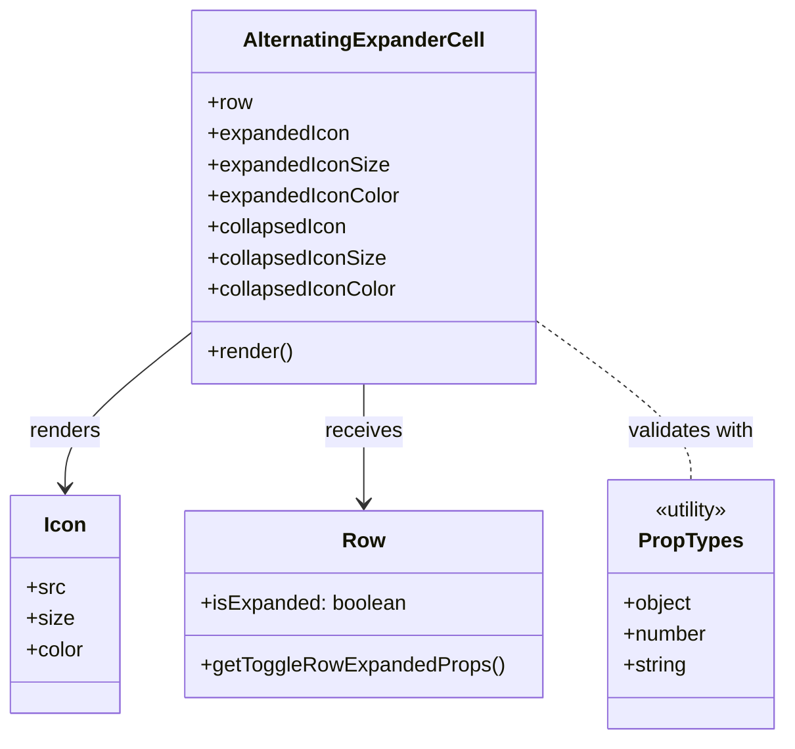

# Diagram: web/portal/src/components/organisms/base-table/Cell/AlternatingExpanderCell.js

> Auto-generated by Obscura crawlers

## Mermaid

### SVG

<svg id="container" width="597.109375" xmlns="http://www.w3.org/2000/svg" class="classDiagram" height="570" viewBox="0 0 597.109375 570" role="graphics-document document" aria-roledescription="class"><g><defs><marker id="container_class-aggregationStart" class="marker aggregation class" refX="18" refY="7" markerWidth="190" markerHeight="240" orient="auto"><path d="M 18,7 L9,13 L1,7 L9,1 Z"></path></marker></defs><defs><marker id="container_class-aggregationEnd" class="marker aggregation class" refX="1" refY="7" markerWidth="20" markerHeight="28" orient="auto"><path d="M 18,7 L9,13 L1,7 L9,1 Z"></path></marker></defs><defs><marker id="container_class-extensionStart" class="marker extension class" refX="18" refY="7" markerWidth="190" markerHeight="240" orient="auto"><path d="M 1,7 L18,13 V 1 Z"></path></marker></defs><defs><marker id="container_class-extensionEnd" class="marker extension class" refX="1" refY="7" markerWidth="20" markerHeight="28" orient="auto"><path d="M 1,1 V 13 L18,7 Z"></path></marker></defs><defs><marker id="container_class-compositionStart" class="marker composition class" refX="18" refY="7" markerWidth="190" markerHeight="240" orient="auto"><path d="M 18,7 L9,13 L1,7 L9,1 Z"></path></marker></defs><defs><marker id="container_class-compositionEnd" class="marker composition class" refX="1" refY="7" markerWidth="20" markerHeight="28" orient="auto"><path d="M 18,7 L9,13 L1,7 L9,1 Z"></path></marker></defs><defs><marker id="container_class-dependencyStart" class="marker dependency class" refX="6" refY="7" markerWidth="190" markerHeight="240" orient="auto"><path d="M 5,7 L9,13 L1,7 L9,1 Z"></path></marker></defs><defs><marker id="container_class-dependencyEnd" class="marker dependency class" refX="13" refY="7" markerWidth="20" markerHeight="28" orient="auto"><path d="M 18,7 L9,13 L14,7 L9,1 Z"></path></marker></defs><defs><marker id="container_class-lollipopStart" class="marker lollipop class" refX="13" refY="7" markerWidth="190" markerHeight="240" orient="auto"><circle stroke="black" fill="transparent" cx="7" cy="7" r="6"></circle></marker></defs><defs><marker id="container_class-lollipopEnd" class="marker lollipop class" refX="1" refY="7" markerWidth="190" markerHeight="240" orient="auto"><circle stroke="black" fill="transparent" cx="7" cy="7" r="6"></circle></marker></defs><g class="root"><g class="clusters"></g><g class="edgePaths"><path d="M146.301,256.264L130.259,269.053C114.217,281.842,82.134,307.421,66.092,327.377C50.051,347.333,50.051,361.667,50.051,368.833L50.051,376" id="id_AlternatingExpanderCell_Icon_1" class="edge-thickness-normal edge-pattern-solid relation" style=";;;" data-edge="true" data-et="edge" data-id="id_AlternatingExpanderCell_Icon_1" data-points="W3sieCI6MTQ2LjMwMDc4MTI1LCJ5IjoyNTYuMjYzNjQ4NzIwNzI4MTZ9LHsieCI6NTAuMDUwNzgxMjUsInkiOjMzM30seyJ4Ijo1MC4wNTA3ODEyNSwieSI6MzgyfV0=" marker-end="url(#container_class-dependencyEnd)"></path><path d="M277.078,296L277.078,302.167C277.078,308.333,277.078,320.667,277.078,336C277.078,351.333,277.078,369.667,277.078,378.833L277.078,388" id="id_AlternatingExpanderCell_Row_2" class="edge-thickness-normal edge-pattern-solid relation" style=";;;" data-edge="true" data-et="edge" data-id="id_AlternatingExpanderCell_Row_2" data-points="W3sieCI6Mjc3LjA3ODEyNSwieSI6Mjk2fSx7IngiOjI3Ny4wNzgxMjUsInkiOjMzM30seyJ4IjoyNzcuMDc4MTI1LCJ5IjozOTR9XQ==" marker-end="url(#container_class-dependencyEnd)"></path><path d="M407.855,247.253L427.477,261.544C447.098,275.835,486.34,304.418,505.961,324.875C525.582,345.333,525.582,357.667,525.582,363.833L525.582,370" id="id_AlternatingExpanderCell_PropTypes_3" class="edge-thickness-normal edge-pattern-dashed relation" style=";;;" data-edge="true" data-et="edge" data-id="id_AlternatingExpanderCell_PropTypes_3" data-points="W3sieCI6NDA3Ljg1NTQ2ODc1LCJ5IjoyNDcuMjUyODI1NTAyNjE3Mn0seyJ4Ijo1MjUuNTgyMDMxMjUsInkiOjMzM30seyJ4Ijo1MjUuNTgyMDMxMjUsInkiOjM3MH1d"></path></g><g class="edgeLabels"><g class="edgeLabel" transform="translate(50.05078125, 333)"><g class="label" data-id="id_AlternatingExpanderCell_Icon_1" transform="translate(-27.75, -12)"><foreignObject width="55.5" height="24">

renders

</foreignObject></g></g><g class="edgeLabel" transform="translate(277.078125, 333)"><g class="label" data-id="id_AlternatingExpanderCell_Row_2" transform="translate(-29.4921875, -12)"><foreignObject width="58.984375" height="24">

receives

</foreignObject></g></g><g class="edgeLabel" transform="translate(525.58203125, 333)"><g class="label" data-id="id_AlternatingExpanderCell_PropTypes_3" transform="translate(-50.375, -12)"><foreignObject width="100.75" height="24">

validates with

</foreignObject></g></g></g><g class="nodes"><g class="node default" id="classId-AlternatingExpanderCell-0" transform="translate(277.078125, 152)"><g class="basic label-container"><path d="M-130.77734375 -144 L130.77734375 -144 L130.77734375 144 L-130.77734375 144" stroke="none" stroke-width="0" fill="#ECECFF" style=""></path><path d="M-130.77734375 -144 C-30.76043316243782 -144, 69.25647742512436 -144, 130.77734375 -144 M-130.77734375 -144 C-60.84372837305578 -144, 9.089887003888435 -144, 130.77734375 -144 M130.77734375 -144 C130.77734375 -56.616270295201545, 130.77734375 30.76745940959691, 130.77734375 144 M130.77734375 -144 C130.77734375 -32.50447407129104, 130.77734375 78.99105185741792, 130.77734375 144 M130.77734375 144 C60.51636859013766 144, -9.74460656972468 144, -130.77734375 144 M130.77734375 144 C58.914527966843366 144, -12.948287816313268 144, -130.77734375 144 M-130.77734375 144 C-130.77734375 56.78544378272346, -130.77734375 -30.429112434553076, -130.77734375 -144 M-130.77734375 144 C-130.77734375 62.57083587711013, -130.77734375 -18.858328245779745, -130.77734375 -144" stroke="#9370DB" stroke-width="1.3" fill="none" stroke-dasharray="0 0" style=""></path></g><g class="annotation-group text" transform="translate(0, -120)"></g><g class="label-group text" transform="translate(-89.0703125, -120)"><g class="label" style="font-weight: bolder" transform="translate(0,-12)"><foreignObject width="178.140625" height="24">

AlternatingExpanderCell

</foreignObject></g></g><g class="members-group text" transform="translate(-118.77734375, -72)"><g class="label" style="" transform="translate(0,-12)"><foreignObject width="34.5" height="24">

+row

</foreignObject></g><g class="label" style="" transform="translate(0,12)"><foreignObject width="110.375" height="24">

+expandedIcon

</foreignObject></g><g class="label" style="" transform="translate(0,36)"><foreignObject width="139.203125" height="24">

+expandedIconSize

</foreignObject></g><g class="label" style="" transform="translate(0,60)"><foreignObject width="148.484375" height="24">

+expandedIconColor

</foreignObject></g><g class="label" style="" transform="translate(0,84)"><foreignObject width="108.703125" height="24">

+collapsedIcon

</foreignObject></g><g class="label" style="" transform="translate(0,108)"><foreignObject width="137.53125" height="24">

+collapsedIconSize

</foreignObject></g><g class="label" style="" transform="translate(0,132)"><foreignObject width="146.8125" height="24">

+collapsedIconColor

</foreignObject></g></g><g class="methods-group text" transform="translate(-118.77734375, 120)"><g class="label" style="" transform="translate(0,-12)"><foreignObject width="66.609375" height="24">

+render()

</foreignObject></g></g><g class="divider" style=""><path d="M-130.77734375 -96 C-49.081908311052615 -96, 32.61352712789477 -96, 130.77734375 -96 M-130.77734375 -96 C-69.49041359520515 -96, -8.203483440410324 -96, 130.77734375 -96" stroke="#9370DB" stroke-width="1.3" fill="none" stroke-dasharray="0 0" style=""></path></g><g class="divider" style=""><path d="M-130.77734375 96 C-70.18525793416384 96, -9.593172118327686 96, 130.77734375 96 M-130.77734375 96 C-70.97035367182124 96, -11.163363593642472 96, 130.77734375 96" stroke="#9370DB" stroke-width="1.3" fill="none" stroke-dasharray="0 0" style=""></path></g></g><g class="node default" id="classId-Icon-1" transform="translate(50.05078125, 466)"><g class="basic label-container"><path d="M-42.05078125 -84 L42.05078125 -84 L42.05078125 84 L-42.05078125 84" stroke="none" stroke-width="0" fill="#ECECFF" style=""></path><path d="M-42.05078125 -84 C-22.659985471503262 -84, -3.269189693006524 -84, 42.05078125 -84 M-42.05078125 -84 C-13.292252083980962 -84, 15.466277082038076 -84, 42.05078125 -84 M42.05078125 -84 C42.05078125 -17.534510471136315, 42.05078125 48.93097905772737, 42.05078125 84 M42.05078125 -84 C42.05078125 -48.18813322065205, 42.05078125 -12.376266441304097, 42.05078125 84 M42.05078125 84 C14.953049116907827 84, -12.144683016184345 84, -42.05078125 84 M42.05078125 84 C17.566805431312694 84, -6.917170387374611 84, -42.05078125 84 M-42.05078125 84 C-42.05078125 41.67223438056995, -42.05078125 -0.6555312388601067, -42.05078125 -84 M-42.05078125 84 C-42.05078125 22.701447733521483, -42.05078125 -38.59710453295703, -42.05078125 -84" stroke="#9370DB" stroke-width="1.3" fill="none" stroke-dasharray="0 0" style=""></path></g><g class="annotation-group text" transform="translate(0, -60)"></g><g class="label-group text" transform="translate(-15.3046875, -60)"><g class="label" style="font-weight: bolder" transform="translate(0,-12)"><foreignObject width="30.609375" height="24">

Icon

</foreignObject></g></g><g class="members-group text" transform="translate(-30.05078125, -12)"><g class="label" style="" transform="translate(0,-12)"><foreignObject width="28.8125" height="24">

+src

</foreignObject></g><g class="label" style="" transform="translate(0,12)"><foreignObject width="35.578125" height="24">

+size

</foreignObject></g><g class="label" style="" transform="translate(0,36)"><foreignObject width="44.796875" height="24">

+color

</foreignObject></g></g><g class="methods-group text" transform="translate(-30.05078125, 84)"></g><g class="divider" style=""><path d="M-42.05078125 -36 C-21.81962120328853 -36, -1.5884611565770612 -36, 42.05078125 -36 M-42.05078125 -36 C-16.08878866086989 -36, 9.873203928260217 -36, 42.05078125 -36" stroke="#9370DB" stroke-width="1.3" fill="none" stroke-dasharray="0 0" style=""></path></g><g class="divider" style=""><path d="M-42.05078125 60 C-24.412259849331793 60, -6.773738448663586 60, 42.05078125 60 M-42.05078125 60 C-15.91761684642318 60, 10.215547557153641 60, 42.05078125 60" stroke="#9370DB" stroke-width="1.3" fill="none" stroke-dasharray="0 0" style=""></path></g></g><g class="node default" id="classId-Row-2" transform="translate(277.078125, 466)"><g class="basic label-container"><path d="M-134.9765625 -72 L134.9765625 -72 L134.9765625 72 L-134.9765625 72" stroke="none" stroke-width="0" fill="#ECECFF" style=""></path><path d="M-134.9765625 -72 C-64.50930318315064 -72, 5.95795613369873 -72, 134.9765625 -72 M-134.9765625 -72 C-65.33495950315384 -72, 4.30664349369232 -72, 134.9765625 -72 M134.9765625 -72 C134.9765625 -15.140932514875665, 134.9765625 41.71813497024867, 134.9765625 72 M134.9765625 -72 C134.9765625 -42.24396503251043, 134.9765625 -12.487930065020869, 134.9765625 72 M134.9765625 72 C63.264267653486584 72, -8.448027193026832 72, -134.9765625 72 M134.9765625 72 C69.38372264922154 72, 3.7908827984430786 72, -134.9765625 72 M-134.9765625 72 C-134.9765625 24.48675176352873, -134.9765625 -23.02649647294254, -134.9765625 -72 M-134.9765625 72 C-134.9765625 19.250591862695842, -134.9765625 -33.498816274608316, -134.9765625 -72" stroke="#9370DB" stroke-width="1.3" fill="none" stroke-dasharray="0 0" style=""></path></g><g class="annotation-group text" transform="translate(0, -48)"></g><g class="label-group text" transform="translate(-15.484375, -48)"><g class="label" style="font-weight: bolder" transform="translate(0,-12)"><foreignObject width="30.96875" height="24">

Row

</foreignObject></g></g><g class="members-group text" transform="translate(-122.9765625, 0)"><g class="label" style="" transform="translate(0,-12)"><foreignObject width="159.09375" height="24">

+isExpanded: boolean

</foreignObject></g></g><g class="methods-group text" transform="translate(-122.9765625, 48)"><g class="label" style="" transform="translate(0,-12)"><foreignObject width="230.46875" height="24">

+getToggleRowExpandedProps()

</foreignObject></g></g><g class="divider" style=""><path d="M-134.9765625 -24 C-58.73952562108185 -24, 17.497511257836294 -24, 134.9765625 -24 M-134.9765625 -24 C-72.1387260526389 -24, -9.300889605277803 -24, 134.9765625 -24" stroke="#9370DB" stroke-width="1.3" fill="none" stroke-dasharray="0 0" style=""></path></g><g class="divider" style=""><path d="M-134.9765625 24 C-36.85957675532087 24, 61.257408989358254 24, 134.9765625 24 M-134.9765625 24 C-42.694117663049155 24, 49.58832717390169 24, 134.9765625 24" stroke="#9370DB" stroke-width="1.3" fill="none" stroke-dasharray="0 0" style=""></path></g></g><g class="node default" id="classId-PropTypes-3" transform="translate(525.58203125, 466)"><g class="basic label-container"><path d="M-63.52734375 -96 L63.52734375 -96 L63.52734375 96 L-63.52734375 96" stroke="none" stroke-width="0" fill="#ECECFF" style=""></path><path d="M-63.52734375 -96 C-34.972365134050705 -96, -6.417386518101402 -96, 63.52734375 -96 M-63.52734375 -96 C-22.840132452802536 -96, 17.84707884439493 -96, 63.52734375 -96 M63.52734375 -96 C63.52734375 -35.30263835171705, 63.52734375 25.3947232965659, 63.52734375 96 M63.52734375 -96 C63.52734375 -56.19084880606133, 63.52734375 -16.381697612122665, 63.52734375 96 M63.52734375 96 C16.0563689597598 96, -31.414605830480397 96, -63.52734375 96 M63.52734375 96 C22.64768001487365 96, -18.2319837202527 96, -63.52734375 96 M-63.52734375 96 C-63.52734375 36.440040376019034, -63.52734375 -23.11991924796193, -63.52734375 -96 M-63.52734375 96 C-63.52734375 32.4701774211821, -63.52734375 -31.0596451576358, -63.52734375 -96" stroke="#9370DB" stroke-width="1.3" fill="none" stroke-dasharray="0 0" style=""></path></g><g class="annotation-group text" transform="translate(-30.3125, -72)"><g class="label" style="" transform="translate(0,-12)"><foreignObject width="60.625" height="24">

«utility»

</foreignObject></g></g><g class="label-group text" transform="translate(-38.2578125, -48)"><g class="label" style="font-weight: bolder" transform="translate(0,-12)"><foreignObject width="76.515625" height="24">

PropTypes

</foreignObject></g></g><g class="members-group text" transform="translate(-51.52734375, 0)"><g class="label" style="" transform="translate(0,-12)"><foreignObject width="53.46875" height="24">

+object

</foreignObject></g><g class="label" style="" transform="translate(0,12)"><foreignObject width="64.796875" height="24">

+number

</foreignObject></g><g class="label" style="" transform="translate(0,36)"><foreignObject width="49.625" height="24">

+string

</foreignObject></g></g><g class="methods-group text" transform="translate(-51.52734375, 96)"></g><g class="divider" style=""><path d="M-63.52734375 -24 C-18.015308417699366 -24, 27.49672691460127 -24, 63.52734375 -24 M-63.52734375 -24 C-15.900721455280113 -24, 31.725900839439774 -24, 63.52734375 -24" stroke="#9370DB" stroke-width="1.3" fill="none" stroke-dasharray="0 0" style=""></path></g><g class="divider" style=""><path d="M-63.52734375 72 C-15.95642095659985 72, 31.6145018368003 72, 63.52734375 72 M-63.52734375 72 C-31.28515559768786 72, 0.957032554624277 72, 63.52734375 72" stroke="#9370DB" stroke-width="1.3" fill="none" stroke-dasharray="0 0" style=""></path></g></g></g></g></g></svg>
