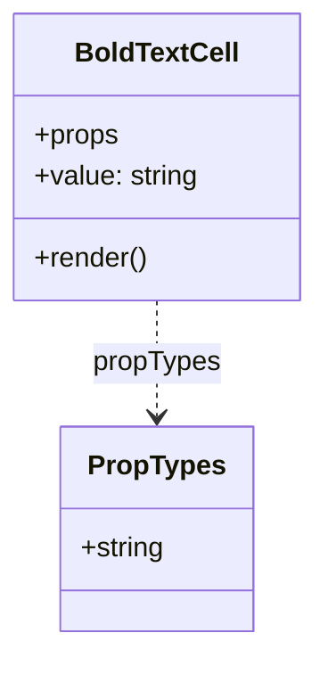
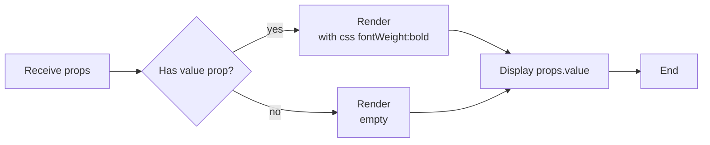

# Diagram: web/portal/src/components/organisms/base-table/Cell/BoldTextCell.js

> Auto-generated by Obscura crawlers

## Diagram 1

### SVG

<svg id="container" width="182.15625" xmlns="http://www.w3.org/2000/svg" class="classDiagram" height="378" viewBox="0 0 182.15625 378" role="graphics-document document" aria-roledescription="class"><g><defs><marker id="container_class-aggregationStart" class="marker aggregation class" refX="18" refY="7" markerWidth="190" markerHeight="240" orient="auto"><path d="M 18,7 L9,13 L1,7 L9,1 Z"></path></marker></defs><defs><marker id="container_class-aggregationEnd" class="marker aggregation class" refX="1" refY="7" markerWidth="20" markerHeight="28" orient="auto"><path d="M 18,7 L9,13 L1,7 L9,1 Z"></path></marker></defs><defs><marker id="container_class-extensionStart" class="marker extension class" refX="18" refY="7" markerWidth="190" markerHeight="240" orient="auto"><path d="M 1,7 L18,13 V 1 Z"></path></marker></defs><defs><marker id="container_class-extensionEnd" class="marker extension class" refX="1" refY="7" markerWidth="20" markerHeight="28" orient="auto"><path d="M 1,1 V 13 L18,7 Z"></path></marker></defs><defs><marker id="container_class-compositionStart" class="marker composition class" refX="18" refY="7" markerWidth="190" markerHeight="240" orient="auto"><path d="M 18,7 L9,13 L1,7 L9,1 Z"></path></marker></defs><defs><marker id="container_class-compositionEnd" class="marker composition class" refX="1" refY="7" markerWidth="20" markerHeight="28" orient="auto"><path d="M 18,7 L9,13 L1,7 L9,1 Z"></path></marker></defs><defs><marker id="container_class-dependencyStart" class="marker dependency class" refX="6" refY="7" markerWidth="190" markerHeight="240" orient="auto"><path d="M 5,7 L9,13 L1,7 L9,1 Z"></path></marker></defs><defs><marker id="container_class-dependencyEnd" class="marker dependency class" refX="13" refY="7" markerWidth="20" markerHeight="28" orient="auto"><path d="M 18,7 L9,13 L14,7 L9,1 Z"></path></marker></defs><defs><marker id="container_class-lollipopStart" class="marker lollipop class" refX="13" refY="7" markerWidth="190" markerHeight="240" orient="auto"><circle stroke="black" fill="transparent" cx="7" cy="7" r="6"></circle></marker></defs><defs><marker id="container_class-lollipopEnd" class="marker lollipop class" refX="1" refY="7" markerWidth="190" markerHeight="240" orient="auto"><circle stroke="black" fill="transparent" cx="7" cy="7" r="6"></circle></marker></defs><g class="root"><g class="clusters"></g><g class="edgePaths"><path d="M91.078,176L91.078,182.167C91.078,188.333,91.078,200.667,91.078,212C91.078,223.333,91.078,233.667,91.078,238.833L91.078,244" id="id_BoldTextCell_PropTypes_1" class="edge-thickness-normal edge-pattern-dashed relation" style=";;;" data-edge="true" data-et="edge" data-id="id_BoldTextCell_PropTypes_1" data-points="W3sieCI6OTEuMDc4MTI1LCJ5IjoxNzZ9LHsieCI6OTEuMDc4MTI1LCJ5IjoyMTN9LHsieCI6OTEuMDc4MTI1LCJ5IjoyNTB9XQ==" marker-end="url(#container_class-dependencyEnd)"></path></g><g class="edgeLabels"><g class="edgeLabel" transform="translate(91.078125, 213)"><g class="label" data-id="id_BoldTextCell_PropTypes_1" transform="translate(-37.625, -12)"><foreignObject width="75.25" height="24">

propTypes

</foreignObject></g></g></g><g class="nodes"><g class="node default" id="classId-BoldTextCell-0" transform="translate(91.078125, 92)"><g class="basic label-container"><path d="M-83.078125 -84 L83.078125 -84 L83.078125 84 L-83.078125 84" stroke="none" stroke-width="0" fill="#ECECFF" style=""></path><path d="M-83.078125 -84 C-49.302832085192904 -84, -15.527539170385808 -84, 83.078125 -84 M-83.078125 -84 C-33.800538947302876 -84, 15.477047105394249 -84, 83.078125 -84 M83.078125 -84 C83.078125 -29.108536285455614, 83.078125 25.782927429088772, 83.078125 84 M83.078125 -84 C83.078125 -45.96399882102389, 83.078125 -7.927997642047785, 83.078125 84 M83.078125 84 C39.67678527796751 84, -3.724554444064978 84, -83.078125 84 M83.078125 84 C26.403623315007643 84, -30.270878369984715 84, -83.078125 84 M-83.078125 84 C-83.078125 29.459808406360878, -83.078125 -25.080383187278244, -83.078125 -84 M-83.078125 84 C-83.078125 21.41187209511417, -83.078125 -41.17625580977166, -83.078125 -84" stroke="#9370DB" stroke-width="1.3" fill="none" stroke-dasharray="0 0" style=""></path></g><g class="annotation-group text" transform="translate(0, -60)"></g><g class="label-group text" transform="translate(-45.734375, -60)"><g class="label" style="font-weight: bolder" transform="translate(0,-12)"><foreignObject width="91.46875" height="24">

BoldTextCell

</foreignObject></g></g><g class="members-group text" transform="translate(-71.078125, -12)"><g class="label" style="" transform="translate(0,-12)"><foreignObject width="49.515625" height="24">

+props

</foreignObject></g><g class="label" style="" transform="translate(0,12)"><foreignObject width="96.421875" height="24">

+value: string

</foreignObject></g></g><g class="methods-group text" transform="translate(-71.078125, 60)"><g class="label" style="" transform="translate(0,-12)"><foreignObject width="66.609375" height="24">

+render()

</foreignObject></g></g><g class="divider" style=""><path d="M-83.078125 -36 C-47.58911571708536 -36, -12.100106434170726 -36, 83.078125 -36 M-83.078125 -36 C-21.819097483004263 -36, 39.43993003399147 -36, 83.078125 -36" stroke="#9370DB" stroke-width="1.3" fill="none" stroke-dasharray="0 0" style=""></path></g><g class="divider" style=""><path d="M-83.078125 36 C-28.340248434611297 36, 26.397628130777406 36, 83.078125 36 M-83.078125 36 C-49.249803651160676 36, -15.421482302321351 36, 83.078125 36" stroke="#9370DB" stroke-width="1.3" fill="none" stroke-dasharray="0 0" style=""></path></g></g><g class="node default" id="classId-PropTypes-1" transform="translate(91.078125, 310)"><g class="basic label-container"><path d="M-55.94140625 -60 L55.94140625 -60 L55.94140625 60 L-55.94140625 60" stroke="none" stroke-width="0" fill="#ECECFF" style=""></path><path d="M-55.94140625 -60 C-23.820708331901706 -60, 8.299989586196588 -60, 55.94140625 -60 M-55.94140625 -60 C-18.840659409018883 -60, 18.260087431962233 -60, 55.94140625 -60 M55.94140625 -60 C55.94140625 -32.84766517993809, 55.94140625 -5.695330359876188, 55.94140625 60 M55.94140625 -60 C55.94140625 -31.902423934751802, 55.94140625 -3.804847869503604, 55.94140625 60 M55.94140625 60 C23.80876529360748 60, -8.323875662785042 60, -55.94140625 60 M55.94140625 60 C31.392352088035235 60, 6.84329792607047 60, -55.94140625 60 M-55.94140625 60 C-55.94140625 13.700207597742583, -55.94140625 -32.59958480451483, -55.94140625 -60 M-55.94140625 60 C-55.94140625 26.261123732470715, -55.94140625 -7.4777525350585705, -55.94140625 -60" stroke="#9370DB" stroke-width="1.3" fill="none" stroke-dasharray="0 0" style=""></path></g><g class="annotation-group text" transform="translate(0, -36)"></g><g class="label-group text" transform="translate(-38.2578125, -36)"><g class="label" style="font-weight: bolder" transform="translate(0,-12)"><foreignObject width="76.515625" height="24">

PropTypes

</foreignObject></g></g><g class="members-group text" transform="translate(-43.94140625, 12)"><g class="label" style="" transform="translate(0,-12)"><foreignObject width="49.625" height="24">

+string

</foreignObject></g></g><g class="methods-group text" transform="translate(-43.94140625, 60)"></g><g class="divider" style=""><path d="M-55.94140625 -12 C-20.34060770517832 -12, 15.260190839643357 -12, 55.94140625 -12 M-55.94140625 -12 C-26.98470788114386 -12, 1.971990487712283 -12, 55.94140625 -12" stroke="#9370DB" stroke-width="1.3" fill="none" stroke-dasharray="0 0" style=""></path></g><g class="divider" style=""><path d="M-55.94140625 36 C-33.16335200078315 36, -10.385297751566299 36, 55.94140625 36 M-55.94140625 36 C-15.15190099968676 36, 25.63760425062648 36, 55.94140625 36" stroke="#9370DB" stroke-width="1.3" fill="none" stroke-dasharray="0 0" style=""></path></g></g></g></g></g></svg>

## Diagram 2

### SVG

<svg id="container" width="1096.421875" xmlns="http://www.w3.org/2000/svg" class="flowchart" height="222" viewBox="0 0 1096.421875 222" role="graphics-document document" aria-roledescription="flowchart-v2"><g><marker id="container_flowchart-v2-pointEnd" class="marker flowchart-v2" viewBox="0 0 10 10" refX="5" refY="5" markerUnits="userSpaceOnUse" markerWidth="8" markerHeight="8" orient="auto"><path d="M 0 0 L 10 5 L 0 10 z" class="arrowMarkerPath" style="stroke-width: 1; stroke-dasharray: 1, 0;"></path></marker><marker id="container_flowchart-v2-pointStart" class="marker flowchart-v2" viewBox="0 0 10 10" refX="4.5" refY="5" markerUnits="userSpaceOnUse" markerWidth="8" markerHeight="8" orient="auto"><path d="M 0 5 L 10 10 L 10 0 z" class="arrowMarkerPath" style="stroke-width: 1; stroke-dasharray: 1, 0;"></path></marker><marker id="container_flowchart-v2-circleEnd" class="marker flowchart-v2" viewBox="0 0 10 10" refX="11" refY="5" markerUnits="userSpaceOnUse" markerWidth="11" markerHeight="11" orient="auto"><circle cx="5" cy="5" r="5" class="arrowMarkerPath" style="stroke-width: 1; stroke-dasharray: 1, 0;"></circle></marker><marker id="container_flowchart-v2-circleStart" class="marker flowchart-v2" viewBox="0 0 10 10" refX="-1" refY="5" markerUnits="userSpaceOnUse" markerWidth="11" markerHeight="11" orient="auto"><circle cx="5" cy="5" r="5" class="arrowMarkerPath" style="stroke-width: 1; stroke-dasharray: 1, 0;"></circle></marker><marker id="container_flowchart-v2-crossEnd" class="marker cross flowchart-v2" viewBox="0 0 11 11" refX="12" refY="5.2" markerUnits="userSpaceOnUse" markerWidth="11" markerHeight="11" orient="auto"><path d="M 1,1 l 9,9 M 10,1 l -9,9" class="arrowMarkerPath" style="stroke-width: 2; stroke-dasharray: 1, 0;"></path></marker><marker id="container_flowchart-v2-crossStart" class="marker cross flowchart-v2" viewBox="0 0 11 11" refX="-1" refY="5.2" markerUnits="userSpaceOnUse" markerWidth="11" markerHeight="11" orient="auto"><path d="M 1,1 l 9,9 M 10,1 l -9,9" class="arrowMarkerPath" style="stroke-width: 2; stroke-dasharray: 1, 0;"></path></marker><g class="root"><g class="clusters"></g><g class="edgePaths"><path d="M169.016,111L173.182,111C177.349,111,185.682,111,193.349,111C201.016,111,208.016,111,211.516,111L215.016,111" id="L_A_B_0" class="edge-thickness-normal edge-pattern-solid edge-thickness-normal edge-pattern-solid flowchart-link" style=";" data-edge="true" data-et="edge" data-id="L_A_B_0" data-points="W3sieCI6MTY5LjAxNTYyNSwieSI6MTExfSx7IngiOjE5NC4wMTU2MjUsInkiOjExMX0seyJ4IjoyMTkuMDE1NjI1LCJ5IjoxMTF9XQ==" marker-end="url(#container_flowchart-v2-pointEnd)"></path><path d="M358.877,81.846L369.904,76.038C380.931,70.231,402.985,58.615,419.513,52.808C436.042,47,447.044,47,452.546,47L458.047,47" id="L_B_C_0" class="edge-thickness-normal edge-pattern-solid edge-thickness-normal edge-pattern-solid flowchart-link" style=";" data-edge="true" data-et="edge" data-id="L_B_C_0" data-points="W3sieCI6MzU4Ljg3NzM3MTQ1MjAzNCwieSI6ODEuODQ2MTIxNDUyMDM0MDN9LHsieCI6NDI1LjAzOTA2MjUsInkiOjQ3fSx7IngiOjQ2Mi4wNDY4NzUsInkiOjQ3fV0=" marker-end="url(#container_flowchart-v2-pointEnd)"></path><path d="M358.877,140.154L369.904,145.962C380.931,151.769,402.985,163.385,430.049,169.192C457.112,175,489.185,175,505.221,175L521.258,175" id="L_B_D_0" class="edge-thickness-normal edge-pattern-solid edge-thickness-normal edge-pattern-solid flowchart-link" style=";" data-edge="true" data-et="edge" data-id="L_B_D_0" data-points="W3sieCI6MzU4Ljg3NzM3MTQ1MjAzNCwieSI6MTQwLjE1Mzg3ODU0Nzk2NTk3fSx7IngiOjQyNS4wMzkwNjI1LCJ5IjoxNzV9LHsieCI6NTI1LjI1NzgxMjUsInkiOjE3NX1d" marker-end="url(#container_flowchart-v2-pointEnd)"></path><path d="M700.484,47L704.651,47C708.818,47,717.151,47,732.796,52.863C748.441,58.727,771.398,70.454,782.877,76.317L794.355,82.18" id="L_C_E_0" class="edge-thickness-normal edge-pattern-solid edge-thickness-normal edge-pattern-solid flowchart-link" style=";" data-edge="true" data-et="edge" data-id="L_C_E_0" data-points="W3sieCI6NzAwLjQ4NDM3NSwieSI6NDd9LHsieCI6NzI1LjQ4NDM3NSwieSI6NDd9LHsieCI6Nzk3LjkxNzExNDI1NzgxMjUsInkiOjg0fV0=" marker-end="url(#container_flowchart-v2-pointEnd)"></path><path d="M637.273,175L651.975,175C666.677,175,696.081,175,722.261,169.137C748.441,163.273,771.398,151.546,782.877,145.683L794.355,139.82" id="L_D_E_0" class="edge-thickness-normal edge-pattern-solid edge-thickness-normal edge-pattern-solid flowchart-link" style=";" data-edge="true" data-et="edge" data-id="L_D_E_0" data-points="W3sieCI6NjM3LjI3MzQzNzUsInkiOjE3NX0seyJ4Ijo3MjUuNDg0Mzc1LCJ5IjoxNzV9LHsieCI6Nzk3LjkxNzExNDI1NzgxMjUsInkiOjEzOH1d" marker-end="url(#container_flowchart-v2-pointEnd)"></path><path d="M951.063,111L955.229,111C959.396,111,967.729,111,975.396,111C983.063,111,990.063,111,993.563,111L997.063,111" id="L_E_F_0" class="edge-thickness-normal edge-pattern-solid edge-thickness-normal edge-pattern-solid flowchart-link" style=";" data-edge="true" data-et="edge" data-id="L_E_F_0" data-points="W3sieCI6OTUxLjA2MjUsInkiOjExMX0seyJ4Ijo5NzYuMDYyNSwieSI6MTExfSx7IngiOjEwMDEuMDYyNSwieSI6MTExfV0=" marker-end="url(#container_flowchart-v2-pointEnd)"></path></g><g class="edgeLabels"><g class="edgeLabel"><g class="label" data-id="L_A_B_0" transform="translate(0, 0)"><foreignObject width="0" height="0">

</foreignObject></g></g><g class="edgeLabel" transform="translate(425.0390625, 47)"><g class="label" data-id="L_B_C_0" transform="translate(-12.0078125, -12)"><foreignObject width="24.015625" height="24">

yes

</foreignObject></g></g><g class="edgeLabel" transform="translate(425.0390625, 175)"><g class="label" data-id="L_B_D_0" transform="translate(-9.3671875, -12)"><foreignObject width="18.734375" height="24">

no

</foreignObject></g></g><g class="edgeLabel"><g class="label" data-id="L_C_E_0" transform="translate(0, 0)"><foreignObject width="0" height="0">

</foreignObject></g></g><g class="edgeLabel"><g class="label" data-id="L_D_E_0" transform="translate(0, 0)"><foreignObject width="0" height="0">

</foreignObject></g></g><g class="edgeLabel"><g class="label" data-id="L_E_F_0" transform="translate(0, 0)"><foreignObject width="0" height="0">

</foreignObject></g></g></g><g class="nodes"><g class="node default" id="flowchart-A-0" transform="translate(88.5078125, 111)"><rect class="basic label-container" style="" x="-80.5078125" y="-27" width="161.015625" height="54"></rect><g class="label" style="" transform="translate(-50.5078125, -12)"><rect></rect><foreignObject width="101.015625" height="24">

Receive props

</foreignObject></g></g><g class="node default" id="flowchart-B-1" transform="translate(303.5234375, 111)"><polygon points="84.5078125,0 169.015625,-84.5078125 84.5078125,-169.015625 0,-84.5078125" class="label-container" transform="translate(-84.0078125, 84.5078125)"></polygon><g class="label" style="" transform="translate(-57.5078125, -12)"><rect></rect><foreignObject width="115.015625" height="24">

Has value prop?

</foreignObject></g></g><g class="node default" id="flowchart-C-3" transform="translate(581.265625, 47)"><rect class="basic label-container" style="" x="-119.21875" y="-39" width="238.4375" height="78"></rect><g class="label" style="" transform="translate(-89.21875, -24)"><rect></rect><foreignObject width="178.4375" height="48">

Render 

 with css fontWeight:bold

</foreignObject></g></g><g class="node default" id="flowchart-D-5" transform="translate(581.265625, 175)"><rect class="basic label-container" style="" x="-56.0078125" y="-39" width="112.015625" height="78"></rect><g class="label" style="" transform="translate(-26.0078125, -24)"><rect></rect><foreignObject width="52.015625" height="48">

Render 

 empty

</foreignObject></g></g><g class="node default" id="flowchart-E-7" transform="translate(850.7734375, 111)"><rect class="basic label-container" style="" x="-100.2890625" y="-27" width="200.578125" height="54"></rect><g class="label" style="" transform="translate(-70.2890625, -12)"><rect></rect><foreignObject width="140.578125" height="24">

Display props.value

</foreignObject></g></g><g class="node default" id="flowchart-F-11" transform="translate(1044.7421875, 111)"><rect class="basic label-container" style="" x="-43.6796875" y="-27" width="87.359375" height="54"></rect><g class="label" style="" transform="translate(-13.6796875, -12)"><rect></rect><foreignObject width="27.359375" height="24">

End

</foreignObject></g></g></g></g></g></svg>
