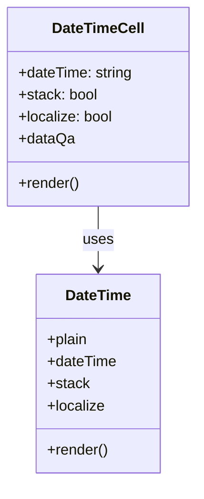

# Diagram: web/portal/src/components/organisms/base-table/Cell/DateTimeCell.js


> Auto-generated by Obscura crawlers

## Diagram 1



### SVG

<svg id="container" width="213.6875" xmlns="http://www.w3.org/2000/svg" class="classDiagram" height="522" viewBox="0 0 213.6875 522" role="graphics-document document" aria-roledescription="class"><style>#container{font-family:"trebuchet ms",verdana,arial,sans-serif;font-size:16px;fill:#333;}@keyframes edge-animation-frame{from{stroke-dashoffset:0;}}@keyframes dash{to{stroke-dashoffset:0;}}#container .edge-animation-slow{stroke-dasharray:9,5!important;stroke-dashoffset:900;animation:dash 50s linear infinite;stroke-linecap:round;}#container .edge-animation-fast{stroke-dasharray:9,5!important;stroke-dashoffset:900;animation:dash 20s linear infinite;stroke-linecap:round;}#container .error-icon{fill:#552222;}#container .error-text{fill:#552222;stroke:#552222;}#container .edge-thickness-normal{stroke-width:1px;}#container .edge-thickness-thick{stroke-width:3.5px;}#container .edge-pattern-solid{stroke-dasharray:0;}#container .edge-thickness-invisible{stroke-width:0;fill:none;}#container .edge-pattern-dashed{stroke-dasharray:3;}#container .edge-pattern-dotted{stroke-dasharray:2;}#container .marker{fill:#333333;stroke:#333333;}#container .marker.cross{stroke:#333333;}#container svg{font-family:"trebuchet ms",verdana,arial,sans-serif;font-size:16px;}#container p{margin:0;}#container g.classGroup text{fill:#9370DB;stroke:none;font-family:"trebuchet ms",verdana,arial,sans-serif;font-size:10px;}#container g.classGroup text .title{font-weight:bolder;}#container .nodeLabel,#container .edgeLabel{color:#131300;}#container .edgeLabel .label rect{fill:#ECECFF;}#container .label text{fill:#131300;}#container .labelBkg{background:#ECECFF;}#container .edgeLabel .label span{background:#ECECFF;}#container .classTitle{font-weight:bolder;}#container .node rect,#container .node circle,#container .node ellipse,#container .node polygon,#container .node path{fill:#ECECFF;stroke:#9370DB;stroke-width:1px;}#container .divider{stroke:#9370DB;stroke-width:1;}#container g.clickable{cursor:pointer;}#container g.classGroup rect{fill:#ECECFF;stroke:#9370DB;}#container g.classGroup line{stroke:#9370DB;stroke-width:1;}#container .classLabel .box{stroke:none;stroke-width:0;fill:#ECECFF;opacity:0.5;}#container .classLabel .label{fill:#9370DB;font-size:10px;}#container .relation{stroke:#333333;stroke-width:1;fill:none;}#container .dashed-line{stroke-dasharray:3;}#container .dotted-line{stroke-dasharray:1 2;}#container #compositionStart,#container .composition{fill:#333333!important;stroke:#333333!important;stroke-width:1;}#container #compositionEnd,#container .composition{fill:#333333!important;stroke:#333333!important;stroke-width:1;}#container #dependencyStart,#container .dependency{fill:#333333!important;stroke:#333333!important;stroke-width:1;}#container #dependencyStart,#container .dependency{fill:#333333!important;stroke:#333333!important;stroke-width:1;}#container #extensionStart,#container .extension{fill:transparent!important;stroke:#333333!important;stroke-width:1;}#container #extensionEnd,#container .extension{fill:transparent!important;stroke:#333333!important;stroke-width:1;}#container #aggregationStart,#container .aggregation{fill:transparent!important;stroke:#333333!important;stroke-width:1;}#container #aggregationEnd,#container .aggregation{fill:transparent!important;stroke:#333333!important;stroke-width:1;}#container #lollipopStart,#container .lollipop{fill:#ECECFF!important;stroke:#333333!important;stroke-width:1;}#container #lollipopEnd,#container .lollipop{fill:#ECECFF!important;stroke:#333333!important;stroke-width:1;}#container .edgeTerminals{font-size:11px;line-height:initial;}#container .classTitleText{text-anchor:middle;font-size:18px;fill:#333;}#container .label-icon{display:inline-block;height:1em;overflow:visible;vertical-align:-0.125em;}#container .node .label-icon path{fill:currentColor;stroke:revert;stroke-width:revert;}#container :root{--mermaid-font-family:"trebuchet ms",verdana,arial,sans-serif;}</style><g><defs><marker id="container_class-aggregationStart" class="marker aggregation class" refX="18" refY="7" markerWidth="190" markerHeight="240" orient="auto"><path d="M 18,7 L9,13 L1,7 L9,1 Z"></path></marker></defs><defs><marker id="container_class-aggregationEnd" class="marker aggregation class" refX="1" refY="7" markerWidth="20" markerHeight="28" orient="auto"><path d="M 18,7 L9,13 L1,7 L9,1 Z"></path></marker></defs><defs><marker id="container_class-extensionStart" class="marker extension class" refX="18" refY="7" markerWidth="190" markerHeight="240" orient="auto"><path d="M 1,7 L18,13 V 1 Z"></path></marker></defs><defs><marker id="container_class-extensionEnd" class="marker extension class" refX="1" refY="7" markerWidth="20" markerHeight="28" orient="auto"><path d="M 1,1 V 13 L18,7 Z"></path></marker></defs><defs><marker id="container_class-compositionStart" class="marker composition class" refX="18" refY="7" markerWidth="190" markerHeight="240" orient="auto"><path d="M 18,7 L9,13 L1,7 L9,1 Z"></path></marker></defs><defs><marker id="container_class-compositionEnd" class="marker composition class" refX="1" refY="7" markerWidth="20" markerHeight="28" orient="auto"><path d="M 18,7 L9,13 L1,7 L9,1 Z"></path></marker></defs><defs><marker id="container_class-dependencyStart" class="marker dependency class" refX="6" refY="7" markerWidth="190" markerHeight="240" orient="auto"><path d="M 5,7 L9,13 L1,7 L9,1 Z"></path></marker></defs><defs><marker id="container_class-dependencyEnd" class="marker dependency class" refX="13" refY="7" markerWidth="20" markerHeight="28" orient="auto"><path d="M 18,7 L9,13 L14,7 L9,1 Z"></path></marker></defs><defs><marker id="container_class-lollipopStart" class="marker lollipop class" refX="13" refY="7" markerWidth="190" markerHeight="240" orient="auto"><circle stroke="black" fill="transparent" cx="7" cy="7" r="6"></circle></marker></defs><defs><marker id="container_class-lollipopEnd" class="marker lollipop class" refX="1" refY="7" markerWidth="190" markerHeight="240" orient="auto"><circle stroke="black" fill="transparent" cx="7" cy="7" r="6"></circle></marker></defs><g class="root"><g class="clusters"></g><g class="edgePaths"><path d="M106.844,224L106.844,230.167C106.844,236.333,106.844,248.667,106.844,260C106.844,271.333,106.844,281.667,106.844,286.833L106.844,292" id="id_DateTimeCell_DateTime_1" class="edge-thickness-normal edge-pattern-solid relation" style=";;;" data-edge="true" data-et="edge" data-id="id_DateTimeCell_DateTime_1" data-points="W3sieCI6MTA2Ljg0Mzc1LCJ5IjoyMjR9LHsieCI6MTA2Ljg0Mzc1LCJ5IjoyNjF9LHsieCI6MTA2Ljg0Mzc1LCJ5IjoyOTh9XQ==" marker-end="url(#container_class-dependencyEnd)"></path></g><g class="edgeLabels"><g class="edgeLabel" transform="translate(106.84375, 261)"><g class="label" data-id="id_DateTimeCell_DateTime_1" transform="translate(-16.4921875, -12)"><foreignObject width="32.984375" height="24"><div xmlns="http://www.w3.org/1999/xhtml" class="labelBkg" style="display: table-cell; white-space: nowrap; line-height: 1.5; max-width: 200px; text-align: center;"><span class="edgeLabel"><p>uses</p></span></div></foreignObject></g></g></g><g class="nodes"><g class="node default" id="classId-DateTimeCell-0" transform="translate(106.84375, 116)"><g class="basic label-container"><path d="M-98.84375 -108 L98.84375 -108 L98.84375 108 L-98.84375 108" stroke="none" stroke-width="0" fill="#ECECFF" style=""></path><path d="M-98.84375 -108 C-47.24811532220558 -108, 4.347519355588844 -108, 98.84375 -108 M-98.84375 -108 C-25.456795251838756 -108, 47.93015949632249 -108, 98.84375 -108 M98.84375 -108 C98.84375 -64.7808191047549, 98.84375 -21.56163820950981, 98.84375 108 M98.84375 -108 C98.84375 -33.25482991878917, 98.84375 41.49034016242166, 98.84375 108 M98.84375 108 C54.39204629499605 108, 9.940342589992099 108, -98.84375 108 M98.84375 108 C27.349803371742937 108, -44.14414325651413 108, -98.84375 108 M-98.84375 108 C-98.84375 46.45096358556126, -98.84375 -15.098072828877477, -98.84375 -108 M-98.84375 108 C-98.84375 53.0496551943212, -98.84375 -1.9006896113576062, -98.84375 -108" stroke="#9370DB" stroke-width="1.3" fill="none" stroke-dasharray="0 0" style=""></path></g><g class="annotation-group text" transform="translate(0, -84)"></g><g class="label-group text" transform="translate(-48.234375, -84)"><g class="label" style="font-weight: bolder" transform="translate(0,-12)"><foreignObject width="96.46875" height="24"><div xmlns="http://www.w3.org/1999/xhtml" style="display: table-cell; white-space: nowrap; line-height: 1.5; max-width: 145px; text-align: center;"><span class="nodeLabel markdown-node-label" style=""><p>DateTimeCell</p></span></div></foreignObject></g></g><g class="members-group text" transform="translate(-86.84375, -36)"><g class="label" style="" transform="translate(0,-12)"><foreignObject width="125.453125" height="24"><div xmlns="http://www.w3.org/1999/xhtml" style="display: table-cell; white-space: nowrap; line-height: 1.5; max-width: 183px; text-align: center;"><span class="nodeLabel markdown-node-label" style=""><p>+dateTime: string</p></span></div></foreignObject></g><g class="label" style="" transform="translate(0,12)"><foreignObject width="86.703125" height="24"><div xmlns="http://www.w3.org/1999/xhtml" style="display: table-cell; white-space: nowrap; line-height: 1.5; max-width: 144px; text-align: center;"><span class="nodeLabel markdown-node-label" style=""><p>+stack: bool</p></span></div></foreignObject></g><g class="label" style="" transform="translate(0,36)"><foreignObject width="103.734375" height="24"><div xmlns="http://www.w3.org/1999/xhtml" style="display: table-cell; white-space: nowrap; line-height: 1.5; max-width: 161px; text-align: center;"><span class="nodeLabel markdown-node-label" style=""><p>+localize: bool</p></span></div></foreignObject></g><g class="label" style="" transform="translate(0,60)"><foreignObject width="60.234375" height="24"><div xmlns="http://www.w3.org/1999/xhtml" style="display: table-cell; white-space: nowrap; line-height: 1.5; max-width: 118px; text-align: center;"><span class="nodeLabel markdown-node-label" style=""><p>+dataQa</p></span></div></foreignObject></g></g><g class="methods-group text" transform="translate(-86.84375, 84)"><g class="label" style="" transform="translate(0,-12)"><foreignObject width="66.609375" height="24"><div xmlns="http://www.w3.org/1999/xhtml" style="display: table-cell; white-space: nowrap; line-height: 1.5; max-width: 124px; text-align: center;"><span class="nodeLabel markdown-node-label" style=""><p>+render()</p></span></div></foreignObject></g></g><g class="divider" style=""><path d="M-98.84375 -60 C-44.26095347352192 -60, 10.321843052956154 -60, 98.84375 -60 M-98.84375 -60 C-57.112246581846435 -60, -15.38074316369287 -60, 98.84375 -60" stroke="#9370DB" stroke-width="1.3" fill="none" stroke-dasharray="0 0" style=""></path></g><g class="divider" style=""><path d="M-98.84375 60 C-53.77306311905911 60, -8.70237623811822 60, 98.84375 60 M-98.84375 60 C-35.75939480925947 60, 27.324960381481063 60, 98.84375 60" stroke="#9370DB" stroke-width="1.3" fill="none" stroke-dasharray="0 0" style=""></path></g></g><g class="node default" id="classId-DateTime-1" transform="translate(106.84375, 406)"><g class="basic label-container"><path d="M-67.1796875 -108 L67.1796875 -108 L67.1796875 108 L-67.1796875 108" stroke="none" stroke-width="0" fill="#ECECFF" style=""></path><path d="M-67.1796875 -108 C-20.239373167158874 -108, 26.700941165682252 -108, 67.1796875 -108 M-67.1796875 -108 C-14.280238539777365 -108, 38.61921042044527 -108, 67.1796875 -108 M67.1796875 -108 C67.1796875 -31.673031804364584, 67.1796875 44.65393639127083, 67.1796875 108 M67.1796875 -108 C67.1796875 -46.57707179219412, 67.1796875 14.845856415611763, 67.1796875 108 M67.1796875 108 C19.38458932138957 108, -28.41050885722086 108, -67.1796875 108 M67.1796875 108 C21.316291355148905 108, -24.54710478970219 108, -67.1796875 108 M-67.1796875 108 C-67.1796875 24.328090845298647, -67.1796875 -59.34381830940271, -67.1796875 -108 M-67.1796875 108 C-67.1796875 26.3467519542386, -67.1796875 -55.3064960915228, -67.1796875 -108" stroke="#9370DB" stroke-width="1.3" fill="none" stroke-dasharray="0 0" style=""></path></g><g class="annotation-group text" transform="translate(0, -84)"></g><g class="label-group text" transform="translate(-34.625, -84)"><g class="label" style="font-weight: bolder" transform="translate(0,-12)"><foreignObject width="69.25" height="24"><div xmlns="http://www.w3.org/1999/xhtml" style="display: table-cell; white-space: nowrap; line-height: 1.5; max-width: 118px; text-align: center;"><span class="nodeLabel markdown-node-label" style=""><p>DateTime</p></span></div></foreignObject></g></g><g class="members-group text" transform="translate(-55.1796875, -36)"><g class="label" style="" transform="translate(0,-12)"><foreignObject width="44.703125" height="24"><div xmlns="http://www.w3.org/1999/xhtml" style="display: table-cell; white-space: nowrap; line-height: 1.5; max-width: 102px; text-align: center;"><span class="nodeLabel markdown-node-label" style=""><p>+plain</p></span></div></foreignObject></g><g class="label" style="" transform="translate(0,12)"><foreignObject width="75.734375" height="24"><div xmlns="http://www.w3.org/1999/xhtml" style="display: table-cell; white-space: nowrap; line-height: 1.5; max-width: 133px; text-align: center;"><span class="nodeLabel markdown-node-label" style=""><p>+dateTime</p></span></div></foreignObject></g><g class="label" style="" transform="translate(0,36)"><foreignObject width="45.671875" height="24"><div xmlns="http://www.w3.org/1999/xhtml" style="display: table-cell; white-space: nowrap; line-height: 1.5; max-width: 104px; text-align: center;"><span class="nodeLabel markdown-node-label" style=""><p>+stack</p></span></div></foreignObject></g><g class="label" style="" transform="translate(0,60)"><foreignObject width="62.78125" height="24"><div xmlns="http://www.w3.org/1999/xhtml" style="display: table-cell; white-space: nowrap; line-height: 1.5; max-width: 120px; text-align: center;"><span class="nodeLabel markdown-node-label" style=""><p>+localize</p></span></div></foreignObject></g></g><g class="methods-group text" transform="translate(-55.1796875, 84)"><g class="label" style="" transform="translate(0,-12)"><foreignObject width="66.609375" height="24"><div xmlns="http://www.w3.org/1999/xhtml" style="display: table-cell; white-space: nowrap; line-height: 1.5; max-width: 124px; text-align: center;"><span class="nodeLabel markdown-node-label" style=""><p>+render()</p></span></div></foreignObject></g></g><g class="divider" style=""><path d="M-67.1796875 -60 C-21.65571107192652 -60, 23.868265356146964 -60, 67.1796875 -60 M-67.1796875 -60 C-36.8983902813873 -60, -6.6170930627746 -60, 67.1796875 -60" stroke="#9370DB" stroke-width="1.3" fill="none" stroke-dasharray="0 0" style=""></path></g><g class="divider" style=""><path d="M-67.1796875 60 C-37.90735425913847 60, -8.635021018276937 60, 67.1796875 60 M-67.1796875 60 C-16.656460832547566 60, 33.86676583490487 60, 67.1796875 60" stroke="#9370DB" stroke-width="1.3" fill="none" stroke-dasharray="0 0" style=""></path></g></g></g></g></g></svg>

## Diagram 2

```mermaid
flowchart TD
    A[Start] --> B{dateTime present?}
    B -- No --> C[Return null]
    B -- Yes --> D[Render DateTime component\n(DateTime plain dateTime, stack, localize)]
    D --> E[Output DOM]
    C --> F[End]
    E --> F[End]
```

> SVG rendering failed for this diagram.
