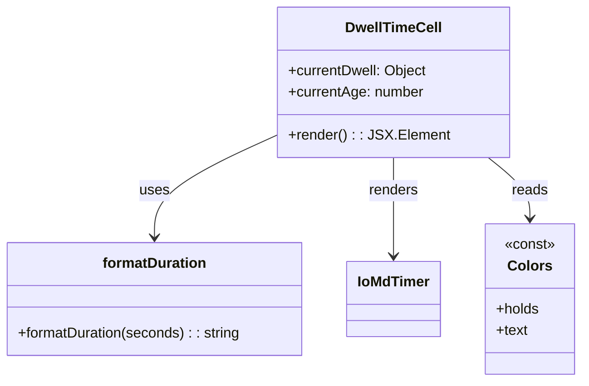

# Diagram: web/portal/src/components/organisms/base-table/Cell/DwellTimeCell.js


> Auto-generated by Obscura crawlers

## Diagram 1



### SVG

<svg id="container" width="651.0078125" xmlns="http://www.w3.org/2000/svg" class="classDiagram" height="426" viewBox="0 0 651.0078125 426" role="graphics-document document" aria-roledescription="class"><style>#container{font-family:"trebuchet ms",verdana,arial,sans-serif;font-size:16px;fill:#333;}@keyframes edge-animation-frame{from{stroke-dashoffset:0;}}@keyframes dash{to{stroke-dashoffset:0;}}#container .edge-animation-slow{stroke-dasharray:9,5!important;stroke-dashoffset:900;animation:dash 50s linear infinite;stroke-linecap:round;}#container .edge-animation-fast{stroke-dasharray:9,5!important;stroke-dashoffset:900;animation:dash 20s linear infinite;stroke-linecap:round;}#container .error-icon{fill:#552222;}#container .error-text{fill:#552222;stroke:#552222;}#container .edge-thickness-normal{stroke-width:1px;}#container .edge-thickness-thick{stroke-width:3.5px;}#container .edge-pattern-solid{stroke-dasharray:0;}#container .edge-thickness-invisible{stroke-width:0;fill:none;}#container .edge-pattern-dashed{stroke-dasharray:3;}#container .edge-pattern-dotted{stroke-dasharray:2;}#container .marker{fill:#333333;stroke:#333333;}#container .marker.cross{stroke:#333333;}#container svg{font-family:"trebuchet ms",verdana,arial,sans-serif;font-size:16px;}#container p{margin:0;}#container g.classGroup text{fill:#9370DB;stroke:none;font-family:"trebuchet ms",verdana,arial,sans-serif;font-size:10px;}#container g.classGroup text .title{font-weight:bolder;}#container .nodeLabel,#container .edgeLabel{color:#131300;}#container .edgeLabel .label rect{fill:#ECECFF;}#container .label text{fill:#131300;}#container .labelBkg{background:#ECECFF;}#container .edgeLabel .label span{background:#ECECFF;}#container .classTitle{font-weight:bolder;}#container .node rect,#container .node circle,#container .node ellipse,#container .node polygon,#container .node path{fill:#ECECFF;stroke:#9370DB;stroke-width:1px;}#container .divider{stroke:#9370DB;stroke-width:1;}#container g.clickable{cursor:pointer;}#container g.classGroup rect{fill:#ECECFF;stroke:#9370DB;}#container g.classGroup line{stroke:#9370DB;stroke-width:1;}#container .classLabel .box{stroke:none;stroke-width:0;fill:#ECECFF;opacity:0.5;}#container .classLabel .label{fill:#9370DB;font-size:10px;}#container .relation{stroke:#333333;stroke-width:1;fill:none;}#container .dashed-line{stroke-dasharray:3;}#container .dotted-line{stroke-dasharray:1 2;}#container #compositionStart,#container .composition{fill:#333333!important;stroke:#333333!important;stroke-width:1;}#container #compositionEnd,#container .composition{fill:#333333!important;stroke:#333333!important;stroke-width:1;}#container #dependencyStart,#container .dependency{fill:#333333!important;stroke:#333333!important;stroke-width:1;}#container #dependencyStart,#container .dependency{fill:#333333!important;stroke:#333333!important;stroke-width:1;}#container #extensionStart,#container .extension{fill:transparent!important;stroke:#333333!important;stroke-width:1;}#container #extensionEnd,#container .extension{fill:transparent!important;stroke:#333333!important;stroke-width:1;}#container #aggregationStart,#container .aggregation{fill:transparent!important;stroke:#333333!important;stroke-width:1;}#container #aggregationEnd,#container .aggregation{fill:transparent!important;stroke:#333333!important;stroke-width:1;}#container #lollipopStart,#container .lollipop{fill:#ECECFF!important;stroke:#333333!important;stroke-width:1;}#container #lollipopEnd,#container .lollipop{fill:#ECECFF!important;stroke:#333333!important;stroke-width:1;}#container .edgeTerminals{font-size:11px;line-height:initial;}#container .classTitleText{text-anchor:middle;font-size:18px;fill:#333;}#container .label-icon{display:inline-block;height:1em;overflow:visible;vertical-align:-0.125em;}#container .node .label-icon path{fill:currentColor;stroke:revert;stroke-width:revert;}#container :root{--mermaid-font-family:"trebuchet ms",verdana,arial,sans-serif;}</style><g><defs><marker id="container_class-aggregationStart" class="marker aggregation class" refX="18" refY="7" markerWidth="190" markerHeight="240" orient="auto"><path d="M 18,7 L9,13 L1,7 L9,1 Z"></path></marker></defs><defs><marker id="container_class-aggregationEnd" class="marker aggregation class" refX="1" refY="7" markerWidth="20" markerHeight="28" orient="auto"><path d="M 18,7 L9,13 L1,7 L9,1 Z"></path></marker></defs><defs><marker id="container_class-extensionStart" class="marker extension class" refX="18" refY="7" markerWidth="190" markerHeight="240" orient="auto"><path d="M 1,7 L18,13 V 1 Z"></path></marker></defs><defs><marker id="container_class-extensionEnd" class="marker extension class" refX="1" refY="7" markerWidth="20" markerHeight="28" orient="auto"><path d="M 1,1 V 13 L18,7 Z"></path></marker></defs><defs><marker id="container_class-compositionStart" class="marker composition class" refX="18" refY="7" markerWidth="190" markerHeight="240" orient="auto"><path d="M 18,7 L9,13 L1,7 L9,1 Z"></path></marker></defs><defs><marker id="container_class-compositionEnd" class="marker composition class" refX="1" refY="7" markerWidth="20" markerHeight="28" orient="auto"><path d="M 18,7 L9,13 L1,7 L9,1 Z"></path></marker></defs><defs><marker id="container_class-dependencyStart" class="marker dependency class" refX="6" refY="7" markerWidth="190" markerHeight="240" orient="auto"><path d="M 5,7 L9,13 L1,7 L9,1 Z"></path></marker></defs><defs><marker id="container_class-dependencyEnd" class="marker dependency class" refX="13" refY="7" markerWidth="20" markerHeight="28" orient="auto"><path d="M 18,7 L9,13 L14,7 L9,1 Z"></path></marker></defs><defs><marker id="container_class-lollipopStart" class="marker lollipop class" refX="13" refY="7" markerWidth="190" markerHeight="240" orient="auto"><circle stroke="black" fill="transparent" cx="7" cy="7" r="6"></circle></marker></defs><defs><marker id="container_class-lollipopEnd" class="marker lollipop class" refX="1" refY="7" markerWidth="190" markerHeight="240" orient="auto"><circle stroke="black" fill="transparent" cx="7" cy="7" r="6"></circle></marker></defs><g class="root"><g class="clusters"></g><g class="edgePaths"><path d="M316.922,148.209L293.092,159.008C269.263,169.806,221.604,191.403,197.775,210.868C173.945,230.333,173.945,247.667,173.945,256.333L173.945,265" id="id_DwellTimeCell_formatDuration_1" class="edge-thickness-normal edge-pattern-solid relation" style=";;;" data-edge="true" data-et="edge" data-id="id_DwellTimeCell_formatDuration_1" data-points="W3sieCI6MzE2LjkyMTg3NSwieSI6MTQ4LjIwOTE2OTY0MTI4OTcyfSx7IngiOjE3My45NDUzMTI1LCJ5IjoyMTN9LHsieCI6MTczLjk0NTMxMjUsInkiOjI3MX1d" marker-end="url(#container_class-dependencyEnd)"></path><path d="M440.961,176L440.961,182.167C440.961,188.333,440.961,200.667,440.961,219C440.961,237.333,440.961,261.667,440.961,273.833L440.961,286" id="id_DwellTimeCell_IoMdTimer_2" class="edge-thickness-normal edge-pattern-solid relation" style=";;;" data-edge="true" data-et="edge" data-id="id_DwellTimeCell_IoMdTimer_2" data-points="W3sieCI6NDQwLjk2MDkzNzUsInkiOjE3Nn0seyJ4Ijo0NDAuOTYwOTM3NSwieSI6MjEzfSx7IngiOjQ0MC45NjA5Mzc1LCJ5IjoyOTJ9XQ==" marker-end="url(#container_class-dependencyEnd)"></path><path d="M546.175,176L553.899,182.167C561.623,188.333,577.071,200.667,584.795,212C592.52,223.333,592.52,233.667,592.52,238.833L592.52,244" id="id_DwellTimeCell_Colors_3" class="edge-thickness-normal edge-pattern-solid relation" style=";;;" data-edge="true" data-et="edge" data-id="id_DwellTimeCell_Colors_3" data-points="W3sieCI6NTQ2LjE3NTE2Nzg3MTkwMDgsInkiOjE3Nn0seyJ4Ijo1OTIuNTE5NTMxMjUsInkiOjIxM30seyJ4Ijo1OTIuNTE5NTMxMjUsInkiOjI1MH1d" marker-end="url(#container_class-dependencyEnd)"></path></g><g class="edgeLabels"><g class="edgeLabel" transform="translate(173.9453125, 213)"><g class="label" data-id="id_DwellTimeCell_formatDuration_1" transform="translate(-16.4921875, -12)"><foreignObject width="32.984375" height="24"><div xmlns="http://www.w3.org/1999/xhtml" class="labelBkg" style="display: table-cell; white-space: nowrap; line-height: 1.5; max-width: 200px; text-align: center;"><span class="edgeLabel"><p>uses</p></span></div></foreignObject></g></g><g class="edgeLabel" transform="translate(440.9609375, 213)"><g class="label" data-id="id_DwellTimeCell_IoMdTimer_2" transform="translate(-27.75, -12)"><foreignObject width="55.5" height="24"><div xmlns="http://www.w3.org/1999/xhtml" class="labelBkg" style="display: table-cell; white-space: nowrap; line-height: 1.5; max-width: 200px; text-align: center;"><span class="edgeLabel"><p>renders</p></span></div></foreignObject></g></g><g class="edgeLabel" transform="translate(592.51953125, 213)"><g class="label" data-id="id_DwellTimeCell_Colors_3" transform="translate(-20.0078125, -12)"><foreignObject width="40.015625" height="24"><div xmlns="http://www.w3.org/1999/xhtml" class="labelBkg" style="display: table-cell; white-space: nowrap; line-height: 1.5; max-width: 200px; text-align: center;"><span class="edgeLabel"><p>reads</p></span></div></foreignObject></g></g></g><g class="nodes"><g class="node default" id="classId-DwellTimeCell-0" transform="translate(440.9609375, 92)"><g class="basic label-container"><path d="M-124.0390625 -84 L124.0390625 -84 L124.0390625 84 L-124.0390625 84" stroke="none" stroke-width="0" fill="#ECECFF" style=""></path><path d="M-124.0390625 -84 C-72.83366728506661 -84, -21.62827207013322 -84, 124.0390625 -84 M-124.0390625 -84 C-42.608177458402565 -84, 38.82270758319487 -84, 124.0390625 -84 M124.0390625 -84 C124.0390625 -21.657988080407108, 124.0390625 40.684023839185784, 124.0390625 84 M124.0390625 -84 C124.0390625 -23.075167321934657, 124.0390625 37.849665356130686, 124.0390625 84 M124.0390625 84 C41.02175920687773 84, -41.995544086244536 84, -124.0390625 84 M124.0390625 84 C72.02065422270178 84, 20.002245945403573 84, -124.0390625 84 M-124.0390625 84 C-124.0390625 26.715217207033966, -124.0390625 -30.569565585932068, -124.0390625 -84 M-124.0390625 84 C-124.0390625 45.47389132262149, -124.0390625 6.947782645242981, -124.0390625 -84" stroke="#9370DB" stroke-width="1.3" fill="none" stroke-dasharray="0 0" style=""></path></g><g class="annotation-group text" transform="translate(0, -60)"></g><g class="label-group text" transform="translate(-51.734375, -60)"><g class="label" style="font-weight: bolder" transform="translate(0,-12)"><foreignObject width="103.46875" height="24"><div xmlns="http://www.w3.org/1999/xhtml" style="display: table-cell; white-space: nowrap; line-height: 1.5; max-width: 152px; text-align: center;"><span class="nodeLabel markdown-node-label" style=""><p>DwellTimeCell</p></span></div></foreignObject></g></g><g class="members-group text" transform="translate(-112.0390625, -12)"><g class="label" style="" transform="translate(0,-12)"><foreignObject width="155.84375" height="24"><div xmlns="http://www.w3.org/1999/xhtml" style="display: table-cell; white-space: nowrap; line-height: 1.5; max-width: 213px; text-align: center;"><span class="nodeLabel markdown-node-label" style=""><p>+currentDwell: Object</p></span></div></foreignObject></g><g class="label" style="" transform="translate(0,12)"><foreignObject width="151.375" height="24"><div xmlns="http://www.w3.org/1999/xhtml" style="display: table-cell; white-space: nowrap; line-height: 1.5; max-width: 210px; text-align: center;"><span class="nodeLabel markdown-node-label" style=""><p>+currentAge: number</p></span></div></foreignObject></g></g><g class="methods-group text" transform="translate(-112.0390625, 60)"><g class="label" style="" transform="translate(0,-12)"><foreignObject width="172.34375" height="24"><div xmlns="http://www.w3.org/1999/xhtml" style="display: table-cell; white-space: nowrap; line-height: 1.5; max-width: 230px; text-align: center;"><span class="nodeLabel markdown-node-label" style=""><p>+render() : : JSX.Element</p></span></div></foreignObject></g></g><g class="divider" style=""><path d="M-124.0390625 -36 C-32.659213440499784 -36, 58.72063561900043 -36, 124.0390625 -36 M-124.0390625 -36 C-68.65208323967909 -36, -13.265103979358187 -36, 124.0390625 -36" stroke="#9370DB" stroke-width="1.3" fill="none" stroke-dasharray="0 0" style=""></path></g><g class="divider" style=""><path d="M-124.0390625 36 C-24.934101489279513 36, 74.17085952144097 36, 124.0390625 36 M-124.0390625 36 C-40.03307772138179 36, 43.97290705723643 36, 124.0390625 36" stroke="#9370DB" stroke-width="1.3" fill="none" stroke-dasharray="0 0" style=""></path></g></g><g class="node default" id="classId-formatDuration-1" transform="translate(173.9453125, 334)"><g class="basic label-container"><path d="M-165.9453125 -63 L165.9453125 -63 L165.9453125 63 L-165.9453125 63" stroke="none" stroke-width="0" fill="#ECECFF" style=""></path><path d="M-165.9453125 -63 C-61.54317682691196 -63, 42.85895884617608 -63, 165.9453125 -63 M-165.9453125 -63 C-70.23229059447861 -63, 25.480731311042774 -63, 165.9453125 -63 M165.9453125 -63 C165.9453125 -15.322055947722106, 165.9453125 32.35588810455579, 165.9453125 63 M165.9453125 -63 C165.9453125 -15.428901216569372, 165.9453125 32.142197566861256, 165.9453125 63 M165.9453125 63 C77.67585722162246 63, -10.59359805675507 63, -165.9453125 63 M165.9453125 63 C58.86376440910641 63, -48.21778368178718 63, -165.9453125 63 M-165.9453125 63 C-165.9453125 28.857868932521193, -165.9453125 -5.284262134957615, -165.9453125 -63 M-165.9453125 63 C-165.9453125 20.240572379078962, -165.9453125 -22.518855241842076, -165.9453125 -63" stroke="#9370DB" stroke-width="1.3" fill="none" stroke-dasharray="0 0" style=""></path></g><g class="annotation-group text" transform="translate(0, -39)"></g><g class="label-group text" transform="translate(-56.609375, -39)"><g class="label" style="font-weight: bolder" transform="translate(0,-12)"><foreignObject width="113.21875" height="24"><div xmlns="http://www.w3.org/1999/xhtml" style="display: table-cell; white-space: nowrap; line-height: 1.5; max-width: 162px; text-align: center;"><span class="nodeLabel markdown-node-label" style=""><p>formatDuration</p></span></div></foreignObject></g></g><g class="members-group text" transform="translate(-153.9453125, 9)"></g><g class="methods-group text" transform="translate(-153.9453125, 39)"><g class="label" style="" transform="translate(0,-12)"><foreignObject width="251.28125" height="24"><div xmlns="http://www.w3.org/1999/xhtml" style="display: table-cell; white-space: nowrap; line-height: 1.5; max-width: 309px; text-align: center;"><span class="nodeLabel markdown-node-label" style=""><p>+formatDuration(seconds) : : string</p></span></div></foreignObject></g></g><g class="divider" style=""><path d="M-165.9453125 -15 C-34.45136952200622 -15, 97.04257345598757 -15, 165.9453125 -15 M-165.9453125 -15 C-58.060783811869996 -15, 49.82374487626001 -15, 165.9453125 -15" stroke="#9370DB" stroke-width="1.3" fill="none" stroke-dasharray="0 0" style=""></path></g><g class="divider" style=""><path d="M-165.9453125 9 C-70.27138346081873 9, 25.40254557836255 9, 165.9453125 9 M-165.9453125 9 C-58.87312099416526 9, 48.199070511669476 9, 165.9453125 9" stroke="#9370DB" stroke-width="1.3" fill="none" stroke-dasharray="0 0" style=""></path></g></g><g class="node default" id="classId-IoMdTimer-2" transform="translate(440.9609375, 334)"><g class="basic label-container"><path d="M-51.0703125 -42 L51.0703125 -42 L51.0703125 42 L-51.0703125 42" stroke="none" stroke-width="0" fill="#ECECFF" style=""></path><path d="M-51.0703125 -42 C-19.029670983293514 -42, 13.010970533412973 -42, 51.0703125 -42 M-51.0703125 -42 C-15.223219523146398 -42, 20.623873453707205 -42, 51.0703125 -42 M51.0703125 -42 C51.0703125 -23.956606553341143, 51.0703125 -5.913213106682285, 51.0703125 42 M51.0703125 -42 C51.0703125 -10.459996398760822, 51.0703125 21.080007202478356, 51.0703125 42 M51.0703125 42 C16.398872389529323 42, -18.272567720941353 42, -51.0703125 42 M51.0703125 42 C11.766226482632383 42, -27.537859534735233 42, -51.0703125 42 M-51.0703125 42 C-51.0703125 9.787912831984016, -51.0703125 -22.424174336031967, -51.0703125 -42 M-51.0703125 42 C-51.0703125 22.632109910896336, -51.0703125 3.264219821792672, -51.0703125 -42" stroke="#9370DB" stroke-width="1.3" fill="none" stroke-dasharray="0 0" style=""></path></g><g class="annotation-group text" transform="translate(0, -18)"></g><g class="label-group text" transform="translate(-39.0703125, -18)"><g class="label" style="font-weight: bolder" transform="translate(0,-12)"><foreignObject width="78.140625" height="24"><div xmlns="http://www.w3.org/1999/xhtml" style="display: table-cell; white-space: nowrap; line-height: 1.5; max-width: 128px; text-align: center;"><span class="nodeLabel markdown-node-label" style=""><p>IoMdTimer</p></span></div></foreignObject></g></g><g class="members-group text" transform="translate(-39.0703125, 30)"></g><g class="methods-group text" transform="translate(-39.0703125, 60)"></g><g class="divider" style=""><path d="M-51.0703125 6 C-18.82620183318476 6, 13.417908833630477 6, 51.0703125 6 M-51.0703125 6 C-23.136236760152666 6, 4.797838979694667 6, 51.0703125 6" stroke="#9370DB" stroke-width="1.3" fill="none" stroke-dasharray="0 0" style=""></path></g><g class="divider" style=""><path d="M-51.0703125 24 C-19.563912001847832 24, 11.942488496304335 24, 51.0703125 24 M-51.0703125 24 C-13.455975755620209 24, 24.158360988759583 24, 51.0703125 24" stroke="#9370DB" stroke-width="1.3" fill="none" stroke-dasharray="0 0" style=""></path></g></g><g class="node default" id="classId-Colors-3" transform="translate(592.51953125, 334)"><g class="basic label-container"><path d="M-50.48828125 -84 L50.48828125 -84 L50.48828125 84 L-50.48828125 84" stroke="none" stroke-width="0" fill="#ECECFF" style=""></path><path d="M-50.48828125 -84 C-24.853066749845294 -84, 0.782147750309413 -84, 50.48828125 -84 M-50.48828125 -84 C-14.260660417197784 -84, 21.966960415604433 -84, 50.48828125 -84 M50.48828125 -84 C50.48828125 -24.587980986687832, 50.48828125 34.824038026624336, 50.48828125 84 M50.48828125 -84 C50.48828125 -29.292067438904944, 50.48828125 25.415865122190112, 50.48828125 84 M50.48828125 84 C29.236210614762683 84, 7.9841399795253665 84, -50.48828125 84 M50.48828125 84 C10.379668166998783 84, -29.728944916002433 84, -50.48828125 84 M-50.48828125 84 C-50.48828125 41.08000807010056, -50.48828125 -1.8399838597988776, -50.48828125 -84 M-50.48828125 84 C-50.48828125 38.684013302948316, -50.48828125 -6.631973394103369, -50.48828125 -84" stroke="#9370DB" stroke-width="1.3" fill="none" stroke-dasharray="0 0" style=""></path></g><g class="annotation-group text" transform="translate(-28.6171875, -60)"><g class="label" style="" transform="translate(0,-12)"><foreignObject width="57.234375" height="24"><div xmlns="http://www.w3.org/1999/xhtml" style="display: table-cell; white-space: nowrap; line-height: 1.5; max-width: 107px; text-align: center;"><span class="nodeLabel markdown-node-label" style=""><p>«const»</p></span></div></foreignObject></g></g><g class="label-group text" transform="translate(-23.1015625, -36)"><g class="label" style="font-weight: bolder" transform="translate(0,-12)"><foreignObject width="46.203125" height="24"><div xmlns="http://www.w3.org/1999/xhtml" style="display: table-cell; white-space: nowrap; line-height: 1.5; max-width: 95px; text-align: center;"><span class="nodeLabel markdown-node-label" style=""><p>Colors</p></span></div></foreignObject></g></g><g class="members-group text" transform="translate(-38.48828125, 12)"><g class="label" style="" transform="translate(0,-12)"><foreignObject width="48.359375" height="24"><div xmlns="http://www.w3.org/1999/xhtml" style="display: table-cell; white-space: nowrap; line-height: 1.5; max-width: 106px; text-align: center;"><span class="nodeLabel markdown-node-label" style=""><p>+holds</p></span></div></foreignObject></g><g class="label" style="" transform="translate(0,12)"><foreignObject width="35.5625" height="24"><div xmlns="http://www.w3.org/1999/xhtml" style="display: table-cell; white-space: nowrap; line-height: 1.5; max-width: 93px; text-align: center;"><span class="nodeLabel markdown-node-label" style=""><p>+text</p></span></div></foreignObject></g></g><g class="methods-group text" transform="translate(-38.48828125, 84)"></g><g class="divider" style=""><path d="M-50.48828125 -12 C-28.417275179514895 -12, -6.346269109029791 -12, 50.48828125 -12 M-50.48828125 -12 C-26.25485309769659 -12, -2.0214249453931785 -12, 50.48828125 -12" stroke="#9370DB" stroke-width="1.3" fill="none" stroke-dasharray="0 0" style=""></path></g><g class="divider" style=""><path d="M-50.48828125 60 C-28.057007980127057 60, -5.625734710254115 60, 50.48828125 60 M-50.48828125 60 C-28.924340853129003 60, -7.360400456258006 60, 50.48828125 60" stroke="#9370DB" stroke-width="1.3" fill="none" stroke-dasharray="0 0" style=""></path></g></g></g></g></g></svg>

## Diagram 2

```mermaid
flowchart TD
    A[dwellTimeSeconds] --> B{dwellTimeSeconds < 0}
    B -->|true| C[useSeconds = 0]
    B -->|false| D[useSeconds = dwellTimeSeconds]
    C --> E[formattedTime = formatDuration(useSeconds)]
    D --> E
    E --> F{dwellTimeSeconds ?}
    F -->|true| G{currentAge && currentAge > 0}
    G -->|true| H[clockColor = Colors.holds.RED\nfontWeight = 600]
    G -->|false| I[clockColor = Colors.holds.LIGHT_GREEN\nfontWeight = 400]
    F -->|false| J[clockColor = Colors.text.LIGHT_GRAY\nfontWeight = 400]
    H --> K[Render IoMdTimer (color=clockColor) + formattedTime]
    I --> K
    J --> K
```

> SVG rendering failed for this diagram.
