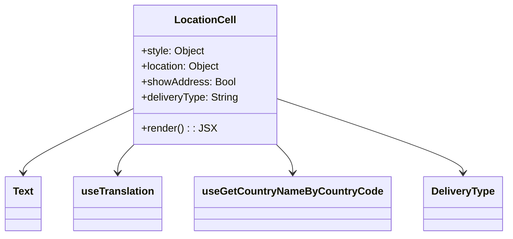

# Diagram: web/portal/src/components/organisms/base-table/Cell/LocationCell.js


> Auto-generated by Obscura crawlers

## Diagram 1



### SVG

<svg id="container" width="758.3125" xmlns="http://www.w3.org/2000/svg" class="classDiagram" height="366" viewBox="0 0 758.3125 366" role="graphics-document document" aria-roledescription="class"><style>#container{font-family:"trebuchet ms",verdana,arial,sans-serif;font-size:16px;fill:#333;}@keyframes edge-animation-frame{from{stroke-dashoffset:0;}}@keyframes dash{to{stroke-dashoffset:0;}}#container .edge-animation-slow{stroke-dasharray:9,5!important;stroke-dashoffset:900;animation:dash 50s linear infinite;stroke-linecap:round;}#container .edge-animation-fast{stroke-dasharray:9,5!important;stroke-dashoffset:900;animation:dash 20s linear infinite;stroke-linecap:round;}#container .error-icon{fill:#552222;}#container .error-text{fill:#552222;stroke:#552222;}#container .edge-thickness-normal{stroke-width:1px;}#container .edge-thickness-thick{stroke-width:3.5px;}#container .edge-pattern-solid{stroke-dasharray:0;}#container .edge-thickness-invisible{stroke-width:0;fill:none;}#container .edge-pattern-dashed{stroke-dasharray:3;}#container .edge-pattern-dotted{stroke-dasharray:2;}#container .marker{fill:#333333;stroke:#333333;}#container .marker.cross{stroke:#333333;}#container svg{font-family:"trebuchet ms",verdana,arial,sans-serif;font-size:16px;}#container p{margin:0;}#container g.classGroup text{fill:#9370DB;stroke:none;font-family:"trebuchet ms",verdana,arial,sans-serif;font-size:10px;}#container g.classGroup text .title{font-weight:bolder;}#container .nodeLabel,#container .edgeLabel{color:#131300;}#container .edgeLabel .label rect{fill:#ECECFF;}#container .label text{fill:#131300;}#container .labelBkg{background:#ECECFF;}#container .edgeLabel .label span{background:#ECECFF;}#container .classTitle{font-weight:bolder;}#container .node rect,#container .node circle,#container .node ellipse,#container .node polygon,#container .node path{fill:#ECECFF;stroke:#9370DB;stroke-width:1px;}#container .divider{stroke:#9370DB;stroke-width:1;}#container g.clickable{cursor:pointer;}#container g.classGroup rect{fill:#ECECFF;stroke:#9370DB;}#container g.classGroup line{stroke:#9370DB;stroke-width:1;}#container .classLabel .box{stroke:none;stroke-width:0;fill:#ECECFF;opacity:0.5;}#container .classLabel .label{fill:#9370DB;font-size:10px;}#container .relation{stroke:#333333;stroke-width:1;fill:none;}#container .dashed-line{stroke-dasharray:3;}#container .dotted-line{stroke-dasharray:1 2;}#container #compositionStart,#container .composition{fill:#333333!important;stroke:#333333!important;stroke-width:1;}#container #compositionEnd,#container .composition{fill:#333333!important;stroke:#333333!important;stroke-width:1;}#container #dependencyStart,#container .dependency{fill:#333333!important;stroke:#333333!important;stroke-width:1;}#container #dependencyStart,#container .dependency{fill:#333333!important;stroke:#333333!important;stroke-width:1;}#container #extensionStart,#container .extension{fill:transparent!important;stroke:#333333!important;stroke-width:1;}#container #extensionEnd,#container .extension{fill:transparent!important;stroke:#333333!important;stroke-width:1;}#container #aggregationStart,#container .aggregation{fill:transparent!important;stroke:#333333!important;stroke-width:1;}#container #aggregationEnd,#container .aggregation{fill:transparent!important;stroke:#333333!important;stroke-width:1;}#container #lollipopStart,#container .lollipop{fill:#ECECFF!important;stroke:#333333!important;stroke-width:1;}#container #lollipopEnd,#container .lollipop{fill:#ECECFF!important;stroke:#333333!important;stroke-width:1;}#container .edgeTerminals{font-size:11px;line-height:initial;}#container .classTitleText{text-anchor:middle;font-size:18px;fill:#333;}#container .label-icon{display:inline-block;height:1em;overflow:visible;vertical-align:-0.125em;}#container .node .label-icon path{fill:currentColor;stroke:revert;stroke-width:revert;}#container :root{--mermaid-font-family:"trebuchet ms",verdana,arial,sans-serif;}</style><g><defs><marker id="container_class-aggregationStart" class="marker aggregation class" refX="18" refY="7" markerWidth="190" markerHeight="240" orient="auto"><path d="M 18,7 L9,13 L1,7 L9,1 Z"></path></marker></defs><defs><marker id="container_class-aggregationEnd" class="marker aggregation class" refX="1" refY="7" markerWidth="20" markerHeight="28" orient="auto"><path d="M 18,7 L9,13 L1,7 L9,1 Z"></path></marker></defs><defs><marker id="container_class-extensionStart" class="marker extension class" refX="18" refY="7" markerWidth="190" markerHeight="240" orient="auto"><path d="M 1,7 L18,13 V 1 Z"></path></marker></defs><defs><marker id="container_class-extensionEnd" class="marker extension class" refX="1" refY="7" markerWidth="20" markerHeight="28" orient="auto"><path d="M 1,1 V 13 L18,7 Z"></path></marker></defs><defs><marker id="container_class-compositionStart" class="marker composition class" refX="18" refY="7" markerWidth="190" markerHeight="240" orient="auto"><path d="M 18,7 L9,13 L1,7 L9,1 Z"></path></marker></defs><defs><marker id="container_class-compositionEnd" class="marker composition class" refX="1" refY="7" markerWidth="20" markerHeight="28" orient="auto"><path d="M 18,7 L9,13 L1,7 L9,1 Z"></path></marker></defs><defs><marker id="container_class-dependencyStart" class="marker dependency class" refX="6" refY="7" markerWidth="190" markerHeight="240" orient="auto"><path d="M 5,7 L9,13 L1,7 L9,1 Z"></path></marker></defs><defs><marker id="container_class-dependencyEnd" class="marker dependency class" refX="13" refY="7" markerWidth="20" markerHeight="28" orient="auto"><path d="M 18,7 L9,13 L14,7 L9,1 Z"></path></marker></defs><defs><marker id="container_class-lollipopStart" class="marker lollipop class" refX="13" refY="7" markerWidth="190" markerHeight="240" orient="auto"><circle stroke="black" fill="transparent" cx="7" cy="7" r="6"></circle></marker></defs><defs><marker id="container_class-lollipopEnd" class="marker lollipop class" refX="1" refY="7" markerWidth="190" markerHeight="240" orient="auto"><circle stroke="black" fill="transparent" cx="7" cy="7" r="6"></circle></marker></defs><g class="root"><g class="clusters"></g><g class="edgePaths"><path d="M198.684,169.488L171.467,182.74C144.25,195.992,89.816,222.496,62.6,238.915C35.383,255.333,35.383,261.667,35.383,264.833L35.383,268" id="id_LocationCell_Text_1" class="edge-thickness-normal edge-pattern-solid relation" style=";;;" data-edge="true" data-et="edge" data-id="id_LocationCell_Text_1" data-points="W3sieCI6MTk4LjY4MzU5Mzc1LCJ5IjoxNjkuNDg3NTc5OTA0NzU3OH0seyJ4IjozNS4zODI4MTI1LCJ5IjoyNDl9LHsieCI6MzUuMzgyODEyNSwieSI6Mjc0fV0=" marker-end="url(#container_class-dependencyEnd)"></path><path d="M203.228,224L199.165,228.167C195.103,232.333,186.977,240.667,182.914,248C178.852,255.333,178.852,261.667,178.852,264.833L178.852,268" id="id_LocationCell_useTranslation_2" class="edge-thickness-normal edge-pattern-solid relation" style=";;;" data-edge="true" data-et="edge" data-id="id_LocationCell_useTranslation_2" data-points="W3sieCI6MjAzLjIyODE3Nzg2NjU0MTM2LCJ5IjoyMjR9LHsieCI6MTc4Ljg1MTU2MjUsInkiOjI0OX0seyJ4IjoxNzguODUxNTYyNSwieSI6Mjc0fV0=" marker-end="url(#container_class-dependencyEnd)"></path><path d="M413.842,224L417.905,228.167C421.968,232.333,430.093,240.667,434.156,248C438.219,255.333,438.219,261.667,438.219,264.833L438.219,268" id="id_LocationCell_useGetCountryNameByCountryCode_3" class="edge-thickness-normal edge-pattern-solid relation" style=";;;" data-edge="true" data-et="edge" data-id="id_LocationCell_useGetCountryNameByCountryCode_3" data-points="W3sieCI6NDEzLjg0MjEzNDYzMzQ1ODYsInkiOjIyNH0seyJ4Ijo0MzguMjE4NzUsInkiOjI0OX0seyJ4Ijo0MzguMjE4NzUsInkiOjI3NH1d" marker-end="url(#container_class-dependencyEnd)"></path><path d="M418.387,154.21L463.807,170.008C509.227,185.806,600.066,217.403,645.486,236.368C690.906,255.333,690.906,261.667,690.906,264.833L690.906,268" id="id_LocationCell_DeliveryType_4" class="edge-thickness-normal edge-pattern-solid relation" style=";;;" data-edge="true" data-et="edge" data-id="id_LocationCell_DeliveryType_4" data-points="W3sieCI6NDE4LjM4NjcxODc1LCJ5IjoxNTQuMjA5NjI5NDcwNzE2MjR9LHsieCI6NjkwLjkwNjI1LCJ5IjoyNDl9LHsieCI6NjkwLjkwNjI1LCJ5IjoyNzR9XQ==" marker-end="url(#container_class-dependencyEnd)"></path></g><g class="edgeLabels"><g class="edgeLabel"><g class="label" data-id="id_LocationCell_Text_1" transform="translate(0, 0)"><foreignObject width="0" height="0"><div xmlns="http://www.w3.org/1999/xhtml" class="labelBkg" style="display: table-cell; white-space: nowrap; line-height: 1.5; max-width: 200px; text-align: center;"><span class="edgeLabel"></span></div></foreignObject></g></g><g class="edgeLabel"><g class="label" data-id="id_LocationCell_useTranslation_2" transform="translate(0, 0)"><foreignObject width="0" height="0"><div xmlns="http://www.w3.org/1999/xhtml" class="labelBkg" style="display: table-cell; white-space: nowrap; line-height: 1.5; max-width: 200px; text-align: center;"><span class="edgeLabel"></span></div></foreignObject></g></g><g class="edgeLabel"><g class="label" data-id="id_LocationCell_useGetCountryNameByCountryCode_3" transform="translate(0, 0)"><foreignObject width="0" height="0"><div xmlns="http://www.w3.org/1999/xhtml" class="labelBkg" style="display: table-cell; white-space: nowrap; line-height: 1.5; max-width: 200px; text-align: center;"><span class="edgeLabel"></span></div></foreignObject></g></g><g class="edgeLabel"><g class="label" data-id="id_LocationCell_DeliveryType_4" transform="translate(0, 0)"><foreignObject width="0" height="0"><div xmlns="http://www.w3.org/1999/xhtml" class="labelBkg" style="display: table-cell; white-space: nowrap; line-height: 1.5; max-width: 200px; text-align: center;"><span class="edgeLabel"></span></div></foreignObject></g></g></g><g class="nodes"><g class="node default" id="classId-LocationCell-0" transform="translate(308.53515625, 116)"><g class="basic label-container"><path d="M-109.8515625 -108 L109.8515625 -108 L109.8515625 108 L-109.8515625 108" stroke="none" stroke-width="0" fill="#ECECFF" style=""></path><path d="M-109.8515625 -108 C-51.25590690598694 -108, 7.33974868802612 -108, 109.8515625 -108 M-109.8515625 -108 C-25.02417661057669 -108, 59.80320927884662 -108, 109.8515625 -108 M109.8515625 -108 C109.8515625 -43.69832597889142, 109.8515625 20.603348042217164, 109.8515625 108 M109.8515625 -108 C109.8515625 -46.204916753615166, 109.8515625 15.590166492769669, 109.8515625 108 M109.8515625 108 C58.38830840229287 108, 6.925054304585743 108, -109.8515625 108 M109.8515625 108 C27.896928928903478 108, -54.057704642193045 108, -109.8515625 108 M-109.8515625 108 C-109.8515625 40.5673770206395, -109.8515625 -26.865245958721005, -109.8515625 -108 M-109.8515625 108 C-109.8515625 23.23990347851081, -109.8515625 -61.52019304297838, -109.8515625 -108" stroke="#9370DB" stroke-width="1.3" fill="none" stroke-dasharray="0 0" style=""></path></g><g class="annotation-group text" transform="translate(0, -84)"></g><g class="label-group text" transform="translate(-44.953125, -84)"><g class="label" style="font-weight: bolder" transform="translate(0,-12)"><foreignObject width="89.90625" height="24"><div xmlns="http://www.w3.org/1999/xhtml" style="display: table-cell; white-space: nowrap; line-height: 1.5; max-width: 139px; text-align: center;"><span class="nodeLabel markdown-node-label" style=""><p>LocationCell</p></span></div></foreignObject></g></g><g class="members-group text" transform="translate(-97.8515625, -36)"><g class="label" style="" transform="translate(0,-12)"><foreignObject width="97.640625" height="24"><div xmlns="http://www.w3.org/1999/xhtml" style="display: table-cell; white-space: nowrap; line-height: 1.5; max-width: 155px; text-align: center;"><span class="nodeLabel markdown-node-label" style=""><p>+style: Object</p></span></div></foreignObject></g><g class="label" style="" transform="translate(0,12)"><foreignObject width="122.421875" height="24"><div xmlns="http://www.w3.org/1999/xhtml" style="display: table-cell; white-space: nowrap; line-height: 1.5; max-width: 180px; text-align: center;"><span class="nodeLabel markdown-node-label" style=""><p>+location: Object</p></span></div></foreignObject></g><g class="label" style="" transform="translate(0,36)"><foreignObject width="144.34375" height="24"><div xmlns="http://www.w3.org/1999/xhtml" style="display: table-cell; white-space: nowrap; line-height: 1.5; max-width: 202px; text-align: center;"><span class="nodeLabel markdown-node-label" style=""><p>+showAddress: Bool</p></span></div></foreignObject></g><g class="label" style="" transform="translate(0,60)"><foreignObject width="150.75" height="24"><div xmlns="http://www.w3.org/1999/xhtml" style="display: table-cell; white-space: nowrap; line-height: 1.5; max-width: 209px; text-align: center;"><span class="nodeLabel markdown-node-label" style=""><p>+deliveryType: String</p></span></div></foreignObject></g></g><g class="methods-group text" transform="translate(-97.8515625, 84)"><g class="label" style="" transform="translate(0,-12)"><foreignObject width="109.140625" height="24"><div xmlns="http://www.w3.org/1999/xhtml" style="display: table-cell; white-space: nowrap; line-height: 1.5; max-width: 167px; text-align: center;"><span class="nodeLabel markdown-node-label" style=""><p>+render() : : JSX</p></span></div></foreignObject></g></g><g class="divider" style=""><path d="M-109.8515625 -60 C-43.05818951337143 -60, 23.735183473257138 -60, 109.8515625 -60 M-109.8515625 -60 C-33.665415646669345 -60, 42.52073120666131 -60, 109.8515625 -60" stroke="#9370DB" stroke-width="1.3" fill="none" stroke-dasharray="0 0" style=""></path></g><g class="divider" style=""><path d="M-109.8515625 60 C-46.754353558206326 60, 16.34285538358735 60, 109.8515625 60 M-109.8515625 60 C-60.126415946686606 60, -10.401269393373212 60, 109.8515625 60" stroke="#9370DB" stroke-width="1.3" fill="none" stroke-dasharray="0 0" style=""></path></g></g><g class="node default" id="classId-Text-1" transform="translate(35.3828125, 316)"><g class="basic label-container"><path d="M-27.3828125 -42 L27.3828125 -42 L27.3828125 42 L-27.3828125 42" stroke="none" stroke-width="0" fill="#ECECFF" style=""></path><path d="M-27.3828125 -42 C-15.061067875657317 -42, -2.7393232513146337 -42, 27.3828125 -42 M-27.3828125 -42 C-15.09340641388912 -42, -2.8040003277782404 -42, 27.3828125 -42 M27.3828125 -42 C27.3828125 -15.921178351865603, 27.3828125 10.157643296268795, 27.3828125 42 M27.3828125 -42 C27.3828125 -11.82837523869317, 27.3828125 18.34324952261366, 27.3828125 42 M27.3828125 42 C10.452033504026893 42, -6.4787454919462135 42, -27.3828125 42 M27.3828125 42 C10.928402236402611 42, -5.526008027194777 42, -27.3828125 42 M-27.3828125 42 C-27.3828125 16.890005091175283, -27.3828125 -8.219989817649434, -27.3828125 -42 M-27.3828125 42 C-27.3828125 25.120769058380322, -27.3828125 8.241538116760644, -27.3828125 -42" stroke="#9370DB" stroke-width="1.3" fill="none" stroke-dasharray="0 0" style=""></path></g><g class="annotation-group text" transform="translate(0, -18)"></g><g class="label-group text" transform="translate(-15.3828125, -18)"><g class="label" style="font-weight: bolder" transform="translate(0,-12)"><foreignObject width="30.765625" height="24"><div xmlns="http://www.w3.org/1999/xhtml" style="display: table-cell; white-space: nowrap; line-height: 1.5; max-width: 80px; text-align: center;"><span class="nodeLabel markdown-node-label" style=""><p>Text</p></span></div></foreignObject></g></g><g class="members-group text" transform="translate(-15.3828125, 30)"></g><g class="methods-group text" transform="translate(-15.3828125, 60)"></g><g class="divider" style=""><path d="M-27.3828125 6 C-15.271302758408389 6, -3.159793016816778 6, 27.3828125 6 M-27.3828125 6 C-5.91470418782454 6, 15.55340412435092 6, 27.3828125 6" stroke="#9370DB" stroke-width="1.3" fill="none" stroke-dasharray="0 0" style=""></path></g><g class="divider" style=""><path d="M-27.3828125 24 C-7.919725566460507 24, 11.543361367078987 24, 27.3828125 24 M-27.3828125 24 C-13.482199418795123 24, 0.41841366240975475 24, 27.3828125 24" stroke="#9370DB" stroke-width="1.3" fill="none" stroke-dasharray="0 0" style=""></path></g></g><g class="node default" id="classId-useTranslation-2" transform="translate(178.8515625, 316)"><g class="basic label-container"><path d="M-66.0859375 -42 L66.0859375 -42 L66.0859375 42 L-66.0859375 42" stroke="none" stroke-width="0" fill="#ECECFF" style=""></path><path d="M-66.0859375 -42 C-35.21868726949775 -42, -4.351437038995492 -42, 66.0859375 -42 M-66.0859375 -42 C-20.17989853744141 -42, 25.72614042511718 -42, 66.0859375 -42 M66.0859375 -42 C66.0859375 -17.014248488569034, 66.0859375 7.971503022861931, 66.0859375 42 M66.0859375 -42 C66.0859375 -10.83311751721724, 66.0859375 20.33376496556552, 66.0859375 42 M66.0859375 42 C31.56459967253018 42, -2.956738154939643 42, -66.0859375 42 M66.0859375 42 C22.087857650897547 42, -21.910222198204906 42, -66.0859375 42 M-66.0859375 42 C-66.0859375 16.007149434009317, -66.0859375 -9.985701131981365, -66.0859375 -42 M-66.0859375 42 C-66.0859375 11.833853300461143, -66.0859375 -18.332293399077713, -66.0859375 -42" stroke="#9370DB" stroke-width="1.3" fill="none" stroke-dasharray="0 0" style=""></path></g><g class="annotation-group text" transform="translate(0, -18)"></g><g class="label-group text" transform="translate(-54.0859375, -18)"><g class="label" style="font-weight: bolder" transform="translate(0,-12)"><foreignObject width="108.171875" height="24"><div xmlns="http://www.w3.org/1999/xhtml" style="display: table-cell; white-space: nowrap; line-height: 1.5; max-width: 157px; text-align: center;"><span class="nodeLabel markdown-node-label" style=""><p>useTranslation</p></span></div></foreignObject></g></g><g class="members-group text" transform="translate(-54.0859375, 30)"></g><g class="methods-group text" transform="translate(-54.0859375, 60)"></g><g class="divider" style=""><path d="M-66.0859375 6 C-19.733812132986813 6, 26.618313234026374 6, 66.0859375 6 M-66.0859375 6 C-26.76810318645571 6, 12.549731127088577 6, 66.0859375 6" stroke="#9370DB" stroke-width="1.3" fill="none" stroke-dasharray="0 0" style=""></path></g><g class="divider" style=""><path d="M-66.0859375 24 C-39.40985209774312 24, -12.733766695486239 24, 66.0859375 24 M-66.0859375 24 C-28.063576136080002 24, 9.958785227839996 24, 66.0859375 24" stroke="#9370DB" stroke-width="1.3" fill="none" stroke-dasharray="0 0" style=""></path></g></g><g class="node default" id="classId-useGetCountryNameByCountryCode-3" transform="translate(438.21875, 316)"><g class="basic label-container"><path d="M-143.28125 -42 L143.28125 -42 L143.28125 42 L-143.28125 42" stroke="none" stroke-width="0" fill="#ECECFF" style=""></path><path d="M-143.28125 -42 C-41.03949744719817 -42, 61.202255105603655 -42, 143.28125 -42 M-143.28125 -42 C-65.50972345189601 -42, 12.261803096207984 -42, 143.28125 -42 M143.28125 -42 C143.28125 -12.325417174597462, 143.28125 17.349165650805077, 143.28125 42 M143.28125 -42 C143.28125 -16.30623666517574, 143.28125 9.387526669648523, 143.28125 42 M143.28125 42 C52.87476420732119 42, -37.531721585357616 42, -143.28125 42 M143.28125 42 C63.823655215966525 42, -15.63393956806695 42, -143.28125 42 M-143.28125 42 C-143.28125 13.141520190190072, -143.28125 -15.716959619619857, -143.28125 -42 M-143.28125 42 C-143.28125 24.372908988586435, -143.28125 6.7458179771728695, -143.28125 -42" stroke="#9370DB" stroke-width="1.3" fill="none" stroke-dasharray="0 0" style=""></path></g><g class="annotation-group text" transform="translate(0, -18)"></g><g class="label-group text" transform="translate(-131.28125, -18)"><g class="label" style="font-weight: bolder" transform="translate(0,-12)"><foreignObject width="262.5625" height="24"><div xmlns="http://www.w3.org/1999/xhtml" style="display: table-cell; white-space: nowrap; line-height: 1.5; max-width: 309px; text-align: center;"><span class="nodeLabel markdown-node-label" style=""><p>useGetCountryNameByCountryCode</p></span></div></foreignObject></g></g><g class="members-group text" transform="translate(-131.28125, 30)"></g><g class="methods-group text" transform="translate(-131.28125, 60)"></g><g class="divider" style=""><path d="M-143.28125 6 C-65.88958594133521 6, 11.502078117329575 6, 143.28125 6 M-143.28125 6 C-29.857736400657743 6, 83.56577719868451 6, 143.28125 6" stroke="#9370DB" stroke-width="1.3" fill="none" stroke-dasharray="0 0" style=""></path></g><g class="divider" style=""><path d="M-143.28125 24 C-79.69713927294592 24, -16.113028545891837 24, 143.28125 24 M-143.28125 24 C-48.11369470881853 24, 47.053860582362944 24, 143.28125 24" stroke="#9370DB" stroke-width="1.3" fill="none" stroke-dasharray="0 0" style=""></path></g></g><g class="node default" id="classId-DeliveryType-4" transform="translate(690.90625, 316)"><g class="basic label-container"><path d="M-59.40625 -42 L59.40625 -42 L59.40625 42 L-59.40625 42" stroke="none" stroke-width="0" fill="#ECECFF" style=""></path><path d="M-59.40625 -42 C-27.94456764787887 -42, 3.5171147042422604 -42, 59.40625 -42 M-59.40625 -42 C-13.941271372938779 -42, 31.523707254122442 -42, 59.40625 -42 M59.40625 -42 C59.40625 -24.841747505728005, 59.40625 -7.68349501145601, 59.40625 42 M59.40625 -42 C59.40625 -23.548356159492194, 59.40625 -5.0967123189843875, 59.40625 42 M59.40625 42 C30.592610303665566 42, 1.7789706073311322 42, -59.40625 42 M59.40625 42 C29.530393974191135 42, -0.34546205161773 42, -59.40625 42 M-59.40625 42 C-59.40625 9.777779182015728, -59.40625 -22.444441635968545, -59.40625 -42 M-59.40625 42 C-59.40625 10.609177998342876, -59.40625 -20.78164400331425, -59.40625 -42" stroke="#9370DB" stroke-width="1.3" fill="none" stroke-dasharray="0 0" style=""></path></g><g class="annotation-group text" transform="translate(0, -18)"></g><g class="label-group text" transform="translate(-47.40625, -18)"><g class="label" style="font-weight: bolder" transform="translate(0,-12)"><foreignObject width="94.8125" height="24"><div xmlns="http://www.w3.org/1999/xhtml" style="display: table-cell; white-space: nowrap; line-height: 1.5; max-width: 143px; text-align: center;"><span class="nodeLabel markdown-node-label" style=""><p>DeliveryType</p></span></div></foreignObject></g></g><g class="members-group text" transform="translate(-47.40625, 30)"></g><g class="methods-group text" transform="translate(-47.40625, 60)"></g><g class="divider" style=""><path d="M-59.40625 6 C-28.78212683024218 6, 1.8419963395156387 6, 59.40625 6 M-59.40625 6 C-32.60255233594448 6, -5.798854671888961 6, 59.40625 6" stroke="#9370DB" stroke-width="1.3" fill="none" stroke-dasharray="0 0" style=""></path></g><g class="divider" style=""><path d="M-59.40625 24 C-15.691315720035881 24, 28.023618559928238 24, 59.40625 24 M-59.40625 24 C-13.906515749649195 24, 31.59321850070161 24, 59.40625 24" stroke="#9370DB" stroke-width="1.3" fill="none" stroke-dasharray="0 0" style=""></path></g></g></g></g></g></svg>

## Diagram 2

```mermaid
flowchart TD
    A[Start: LocationCell render] --> B{showAddress?}
    B -- yes --> C[Render code and name\nRender address\nRender city/state/postal]
    C --> D{countryName?}
    D -- yes --> E[Render countryName]
    D -- no --> F[skip countryName]
    B -- no --> F
    F --> G{deliveryTypeTranslated?}
    G -- yes --> H[Render "Delivery Type: {translated}"]
    G -- no --> I[No delivery type]
    H --> Z[End]
    I --> Z
    E --> Z
```

> SVG rendering failed for this diagram.
