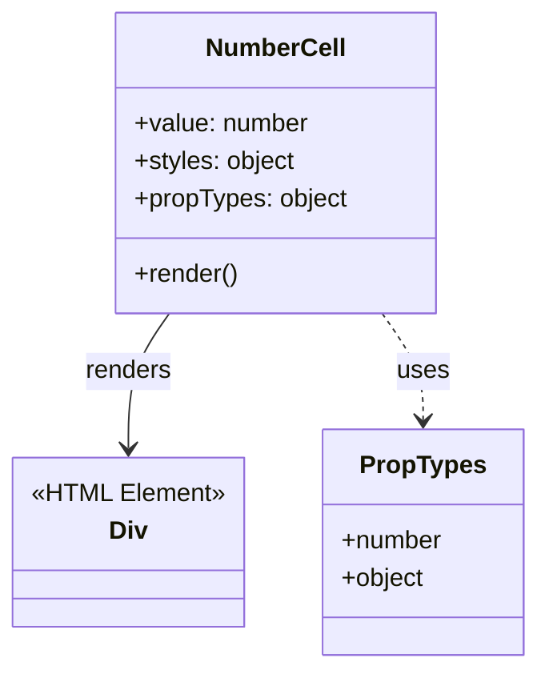

# Diagram: web/portal/src/components/organisms/base-table/Cell/NumberCell.js

> Auto-generated by Obscura crawlers

## Mermaid

### SVG

<svg id="container" width="338.1640625" xmlns="http://www.w3.org/2000/svg" class="classDiagram" height="426" viewBox="0 0 338.1640625 426" role="graphics-document document" aria-roledescription="class"><g><defs><marker id="container_class-aggregationStart" class="marker aggregation class" refX="18" refY="7" markerWidth="190" markerHeight="240" orient="auto"><path d="M 18,7 L9,13 L1,7 L9,1 Z"></path></marker></defs><defs><marker id="container_class-aggregationEnd" class="marker aggregation class" refX="1" refY="7" markerWidth="20" markerHeight="28" orient="auto"><path d="M 18,7 L9,13 L1,7 L9,1 Z"></path></marker></defs><defs><marker id="container_class-extensionStart" class="marker extension class" refX="18" refY="7" markerWidth="190" markerHeight="240" orient="auto"><path d="M 1,7 L18,13 V 1 Z"></path></marker></defs><defs><marker id="container_class-extensionEnd" class="marker extension class" refX="1" refY="7" markerWidth="20" markerHeight="28" orient="auto"><path d="M 1,1 V 13 L18,7 Z"></path></marker></defs><defs><marker id="container_class-compositionStart" class="marker composition class" refX="18" refY="7" markerWidth="190" markerHeight="240" orient="auto"><path d="M 18,7 L9,13 L1,7 L9,1 Z"></path></marker></defs><defs><marker id="container_class-compositionEnd" class="marker composition class" refX="1" refY="7" markerWidth="20" markerHeight="28" orient="auto"><path d="M 18,7 L9,13 L1,7 L9,1 Z"></path></marker></defs><defs><marker id="container_class-dependencyStart" class="marker dependency class" refX="6" refY="7" markerWidth="190" markerHeight="240" orient="auto"><path d="M 5,7 L9,13 L1,7 L9,1 Z"></path></marker></defs><defs><marker id="container_class-dependencyEnd" class="marker dependency class" refX="13" refY="7" markerWidth="20" markerHeight="28" orient="auto"><path d="M 18,7 L9,13 L14,7 L9,1 Z"></path></marker></defs><defs><marker id="container_class-lollipopStart" class="marker lollipop class" refX="13" refY="7" markerWidth="190" markerHeight="240" orient="auto"><circle stroke="black" fill="transparent" cx="7" cy="7" r="6"></circle></marker></defs><defs><marker id="container_class-lollipopEnd" class="marker lollipop class" refX="1" refY="7" markerWidth="190" markerHeight="240" orient="auto"><circle stroke="black" fill="transparent" cx="7" cy="7" r="6"></circle></marker></defs><g class="root"><g class="clusters"></g><g class="edgePaths"><path d="M106.438,200L102.124,206.167C97.81,212.333,89.183,224.667,84.869,239C80.555,253.333,80.555,269.667,80.555,277.833L80.555,286" id="id_NumberCell_Div_1" class="edge-thickness-normal edge-pattern-solid relation" style=";;;" data-edge="true" data-et="edge" data-id="id_NumberCell_Div_1" data-points="W3sieCI6MTA2LjQzODI3ODMxMjk2OTkzLCJ5IjoyMDB9LHsieCI6ODAuNTU0Njg3NSwieSI6MjM3fSx7IngiOjgwLjU1NDY4NzUsInkiOjI5Mn1d" marker-end="url(#container_class-dependencyEnd)"></path><path d="M240.753,200L245.067,206.167C249.381,212.333,258.009,224.667,262.323,236C266.637,247.333,266.637,257.667,266.637,262.833L266.637,268" id="id_NumberCell_PropTypes_2" class="edge-thickness-normal edge-pattern-dashed relation" style=";;;" data-edge="true" data-et="edge" data-id="id_NumberCell_PropTypes_2" data-points="W3sieCI6MjQwLjc1MzEyNzkzNzAzMDA2LCJ5IjoyMDB9LHsieCI6MjY2LjYzNjcxODc1LCJ5IjoyMzd9LHsieCI6MjY2LjYzNjcxODc1LCJ5IjoyNzR9XQ==" marker-end="url(#container_class-dependencyEnd)"></path></g><g class="edgeLabels"><g class="edgeLabel" transform="translate(80.5546875, 237)"><g class="label" data-id="id_NumberCell_Div_1" transform="translate(-27.75, -12)"><foreignObject width="55.5" height="24">

renders

</foreignObject></g></g><g class="edgeLabel" transform="translate(266.63671875, 237)"><g class="label" data-id="id_NumberCell_PropTypes_2" transform="translate(-16.4921875, -12)"><foreignObject width="32.984375" height="24">

uses

</foreignObject></g></g></g><g class="nodes"><g class="node default" id="classId-NumberCell-0" transform="translate(173.595703125, 104)"><g class="basic label-container"><path d="M-101.72265625 -96 L101.72265625 -96 L101.72265625 96 L-101.72265625 96" stroke="none" stroke-width="0" fill="#ECECFF" style=""></path><path d="M-101.72265625 -96 C-23.983960187051224 -96, 53.75473587589755 -96, 101.72265625 -96 M-101.72265625 -96 C-40.473484525216115 -96, 20.77568719956777 -96, 101.72265625 -96 M101.72265625 -96 C101.72265625 -32.88058940560034, 101.72265625 30.23882118879932, 101.72265625 96 M101.72265625 -96 C101.72265625 -49.061823636905906, 101.72265625 -2.1236472738118124, 101.72265625 96 M101.72265625 96 C35.83863814025845 96, -30.045379969483093 96, -101.72265625 96 M101.72265625 96 C51.359553328386845 96, 0.9964504067736897 96, -101.72265625 96 M-101.72265625 96 C-101.72265625 48.191632857630665, -101.72265625 0.3832657152613308, -101.72265625 -96 M-101.72265625 96 C-101.72265625 47.76500355757814, -101.72265625 -0.4699928848437196, -101.72265625 -96" stroke="#9370DB" stroke-width="1.3" fill="none" stroke-dasharray="0 0" style=""></path></g><g class="annotation-group text" transform="translate(0, -72)"></g><g class="label-group text" transform="translate(-42.6484375, -72)"><g class="label" style="font-weight: bolder" transform="translate(0,-12)"><foreignObject width="85.296875" height="24">

NumberCell

</foreignObject></g></g><g class="members-group text" transform="translate(-89.72265625, -24)"><g class="label" style="" transform="translate(0,-12)"><foreignObject width="111.59375" height="24">

+value: number

</foreignObject></g><g class="label" style="" transform="translate(0,12)"><foreignObject width="103.390625" height="24">

+styles: object

</foreignObject></g><g class="label" style="" transform="translate(0,36)"><foreignObject width="136.796875" height="24">

+propTypes: object

</foreignObject></g></g><g class="methods-group text" transform="translate(-89.72265625, 72)"><g class="label" style="" transform="translate(0,-12)"><foreignObject width="66.609375" height="24">

+render()

</foreignObject></g></g><g class="divider" style=""><path d="M-101.72265625 -48 C-59.963538667809146 -48, -18.204421085618293 -48, 101.72265625 -48 M-101.72265625 -48 C-29.896796478377453 -48, 41.92906329324509 -48, 101.72265625 -48" stroke="#9370DB" stroke-width="1.3" fill="none" stroke-dasharray="0 0" style=""></path></g><g class="divider" style=""><path d="M-101.72265625 48 C-59.25984735031371 48, -16.797038450627426 48, 101.72265625 48 M-101.72265625 48 C-23.284746000261578 48, 55.153164249476845 48, 101.72265625 48" stroke="#9370DB" stroke-width="1.3" fill="none" stroke-dasharray="0 0" style=""></path></g></g><g class="node default" id="classId-Div-1" transform="translate(80.5546875, 346)"><g class="basic label-container"><path d="M-72.5546875 -54 L72.5546875 -54 L72.5546875 54 L-72.5546875 54" stroke="none" stroke-width="0" fill="#ECECFF" style=""></path><path d="M-72.5546875 -54 C-19.164742494752517 -54, 34.22520251049497 -54, 72.5546875 -54 M-72.5546875 -54 C-17.340900698747674 -54, 37.87288610250465 -54, 72.5546875 -54 M72.5546875 -54 C72.5546875 -23.05120007463784, 72.5546875 7.897599850724319, 72.5546875 54 M72.5546875 -54 C72.5546875 -12.947633365934095, 72.5546875 28.10473326813181, 72.5546875 54 M72.5546875 54 C18.578466831827896 54, -35.39775383634421 54, -72.5546875 54 M72.5546875 54 C18.57666748050908 54, -35.40135253898184 54, -72.5546875 54 M-72.5546875 54 C-72.5546875 26.77658380305237, -72.5546875 -0.44683239389525653, -72.5546875 -54 M-72.5546875 54 C-72.5546875 17.5176526597999, -72.5546875 -18.9646946804002, -72.5546875 -54" stroke="#9370DB" stroke-width="1.3" fill="none" stroke-dasharray="0 0" style=""></path></g><g class="annotation-group text" transform="translate(-60.5546875, -30)"><g class="label" style="" transform="translate(0,-12)"><foreignObject width="121.109375" height="24">

«HTML Element»

</foreignObject></g></g><g class="label-group text" transform="translate(-11.5703125, -6)"><g class="label" style="font-weight: bolder" transform="translate(0,-12)"><foreignObject width="23.140625" height="24">

Div

</foreignObject></g></g><g class="members-group text" transform="translate(-60.5546875, 42)"></g><g class="methods-group text" transform="translate(-60.5546875, 72)"></g><g class="divider" style=""><path d="M-72.5546875 18 C-27.01133833773885 18, 18.532010824522303 18, 72.5546875 18 M-72.5546875 18 C-32.47991677728926 18, 7.594853945421477 18, 72.5546875 18" stroke="#9370DB" stroke-width="1.3" fill="none" stroke-dasharray="0 0" style=""></path></g><g class="divider" style=""><path d="M-72.5546875 36 C-18.3379407564752 36, 35.8788059870496 36, 72.5546875 36 M-72.5546875 36 C-32.1306973887068 36, 8.2932927225864 36, 72.5546875 36" stroke="#9370DB" stroke-width="1.3" fill="none" stroke-dasharray="0 0" style=""></path></g></g><g class="node default" id="classId-PropTypes-2" transform="translate(266.63671875, 346)"><g class="basic label-container"><path d="M-63.52734375 -72 L63.52734375 -72 L63.52734375 72 L-63.52734375 72" stroke="none" stroke-width="0" fill="#ECECFF" style=""></path><path d="M-63.52734375 -72 C-35.40116479410048 -72, -7.274985838200969 -72, 63.52734375 -72 M-63.52734375 -72 C-23.76138305498187 -72, 16.00457764003626 -72, 63.52734375 -72 M63.52734375 -72 C63.52734375 -31.19680526100526, 63.52734375 9.606389477989481, 63.52734375 72 M63.52734375 -72 C63.52734375 -42.993381427109874, 63.52734375 -13.986762854219748, 63.52734375 72 M63.52734375 72 C19.779334090831554 72, -23.96867556833689 72, -63.52734375 72 M63.52734375 72 C25.241134194768733 72, -13.045075360462533 72, -63.52734375 72 M-63.52734375 72 C-63.52734375 37.43797328293213, -63.52734375 2.875946565864254, -63.52734375 -72 M-63.52734375 72 C-63.52734375 37.20497351692155, -63.52734375 2.409947033843096, -63.52734375 -72" stroke="#9370DB" stroke-width="1.3" fill="none" stroke-dasharray="0 0" style=""></path></g><g class="annotation-group text" transform="translate(0, -48)"></g><g class="label-group text" transform="translate(-38.2578125, -48)"><g class="label" style="font-weight: bolder" transform="translate(0,-12)"><foreignObject width="76.515625" height="24">

PropTypes

</foreignObject></g></g><g class="members-group text" transform="translate(-51.52734375, 0)"><g class="label" style="" transform="translate(0,-12)"><foreignObject width="64.796875" height="24">

+number

</foreignObject></g><g class="label" style="" transform="translate(0,12)"><foreignObject width="53.46875" height="24">

+object

</foreignObject></g></g><g class="methods-group text" transform="translate(-51.52734375, 72)"></g><g class="divider" style=""><path d="M-63.52734375 -24 C-22.36373119534484 -24, 18.79988135931032 -24, 63.52734375 -24 M-63.52734375 -24 C-36.04875369901231 -24, -8.570163648024618 -24, 63.52734375 -24" stroke="#9370DB" stroke-width="1.3" fill="none" stroke-dasharray="0 0" style=""></path></g><g class="divider" style=""><path d="M-63.52734375 48 C-20.613123286652083 48, 22.301097176695833 48, 63.52734375 48 M-63.52734375 48 C-19.15062849053494 48, 25.226086768930116 48, 63.52734375 48" stroke="#9370DB" stroke-width="1.3" fill="none" stroke-dasharray="0 0" style=""></path></g></g></g></g></g></svg>
