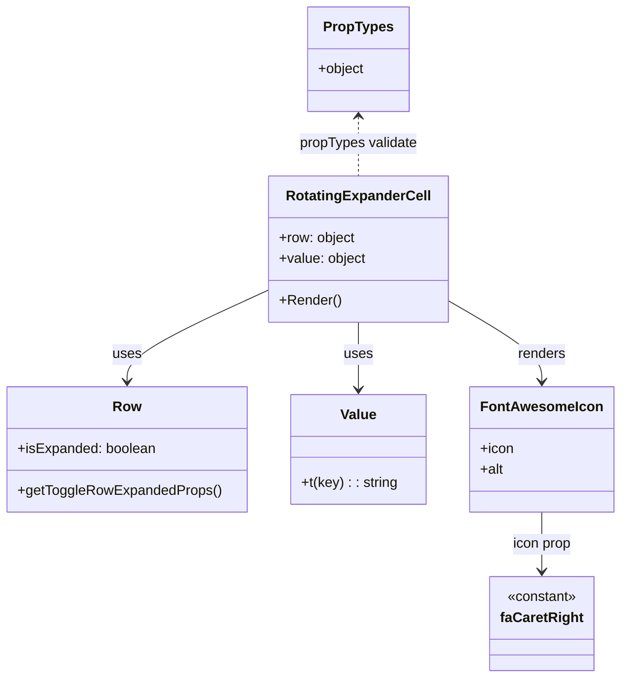

# Diagram: web/portal/src/components/organisms/base-table/Cell/RotatingExpanderCell.js

> Auto-generated by Obscura crawlers

## Mermaid

### SVG

<svg id="container" width="696.8046875" xmlns="http://www.w3.org/2000/svg" class="classDiagram" height="778" viewBox="0 0 696.8046875 778" role="graphics-document document" aria-roledescription="class"><g><defs><marker id="container_class-aggregationStart" class="marker aggregation class" refX="18" refY="7" markerWidth="190" markerHeight="240" orient="auto"><path d="M 18,7 L9,13 L1,7 L9,1 Z"></path></marker></defs><defs><marker id="container_class-aggregationEnd" class="marker aggregation class" refX="1" refY="7" markerWidth="20" markerHeight="28" orient="auto"><path d="M 18,7 L9,13 L1,7 L9,1 Z"></path></marker></defs><defs><marker id="container_class-extensionStart" class="marker extension class" refX="18" refY="7" markerWidth="190" markerHeight="240" orient="auto"><path d="M 1,7 L18,13 V 1 Z"></path></marker></defs><defs><marker id="container_class-extensionEnd" class="marker extension class" refX="1" refY="7" markerWidth="20" markerHeight="28" orient="auto"><path d="M 1,1 V 13 L18,7 Z"></path></marker></defs><defs><marker id="container_class-compositionStart" class="marker composition class" refX="18" refY="7" markerWidth="190" markerHeight="240" orient="auto"><path d="M 18,7 L9,13 L1,7 L9,1 Z"></path></marker></defs><defs><marker id="container_class-compositionEnd" class="marker composition class" refX="1" refY="7" markerWidth="20" markerHeight="28" orient="auto"><path d="M 18,7 L9,13 L1,7 L9,1 Z"></path></marker></defs><defs><marker id="container_class-dependencyStart" class="marker dependency class" refX="6" refY="7" markerWidth="190" markerHeight="240" orient="auto"><path d="M 5,7 L9,13 L1,7 L9,1 Z"></path></marker></defs><defs><marker id="container_class-dependencyEnd" class="marker dependency class" refX="13" refY="7" markerWidth="20" markerHeight="28" orient="auto"><path d="M 18,7 L9,13 L14,7 L9,1 Z"></path></marker></defs><defs><marker id="container_class-lollipopStart" class="marker lollipop class" refX="13" refY="7" markerWidth="190" markerHeight="240" orient="auto"><circle stroke="black" fill="transparent" cx="7" cy="7" r="6"></circle></marker></defs><defs><marker id="container_class-lollipopEnd" class="marker lollipop class" refX="1" refY="7" markerWidth="190" markerHeight="240" orient="auto"><circle stroke="black" fill="transparent" cx="7" cy="7" r="6"></circle></marker></defs><g class="root"><g class="clusters"></g><g class="edgePaths"><path d="M303.473,332.952L276.723,345.293C249.974,357.634,196.475,382.317,169.726,399.825C142.977,417.333,142.977,427.667,142.977,432.833L142.977,438" id="id_RotatingExpanderCell_Row_1" class="edge-thickness-normal edge-pattern-solid relation" style=";;;" data-edge="true" data-et="edge" data-id="id_RotatingExpanderCell_Row_1" data-points="W3sieCI6MzAzLjQ3MjY1NjI1LCJ5IjozMzIuOTUxNzI3MDE0MTA1MX0seyJ4IjoxNDIuOTc2NTYyNSwieSI6NDA3fSx7IngiOjE0Mi45NzY1NjI1LCJ5Ijo0NDR9XQ==" marker-end="url(#container_class-dependencyEnd)"></path><path d="M405.238,370L405.238,376.167C405.238,382.333,405.238,394.667,405.238,407.5C405.238,420.333,405.238,433.667,405.238,440.333L405.238,447" id="id_RotatingExpanderCell_Value_2" class="edge-thickness-normal edge-pattern-solid relation" style=";;;" data-edge="true" data-et="edge" data-id="id_RotatingExpanderCell_Value_2" data-points="W3sieCI6NDA1LjIzODI4MTI1LCJ5IjozNzB9LHsieCI6NDA1LjIzODI4MTI1LCJ5Ijo0MDd9LHsieCI6NDA1LjIzODI4MTI1LCJ5Ijo0NTN9XQ==" marker-end="url(#container_class-dependencyEnd)"></path><path d="M507.004,345.942L524.281,356.118C541.557,366.295,576.111,386.647,593.387,401.99C610.664,417.333,610.664,427.667,610.664,432.833L610.664,438" id="id_RotatingExpanderCell_FontAwesomeIcon_3" class="edge-thickness-normal edge-pattern-solid relation" style=";;;" data-edge="true" data-et="edge" data-id="id_RotatingExpanderCell_FontAwesomeIcon_3" data-points="W3sieCI6NTA3LjAwMzkwNjI1LCJ5IjozNDUuOTQyMDQxMTExMjU5fSx7IngiOjYxMC42NjQwNjI1LCJ5Ijo0MDd9LHsieCI6NjEwLjY2NDA2MjUsInkiOjQ0NH1d" marker-end="url(#container_class-dependencyEnd)"></path><path d="M610.664,588L610.664,594.167C610.664,600.333,610.664,612.667,610.664,624C610.664,635.333,610.664,645.667,610.664,650.833L610.664,656" id="id_FontAwesomeIcon_faCaretRight_4" class="edge-thickness-normal edge-pattern-solid relation" style=";;;" data-edge="true" data-et="edge" data-id="id_FontAwesomeIcon_faCaretRight_4" data-points="W3sieCI6NjEwLjY2NDA2MjUsInkiOjU4OH0seyJ4Ijo2MTAuNjY0MDYyNSwieSI6NjI1fSx7IngiOjYxMC42NjQwNjI1LCJ5Ijo2NjJ9XQ==" marker-end="url(#container_class-dependencyEnd)"></path><path d="M405.238,134L405.238,139.167C405.238,144.333,405.238,154.667,405.238,166C405.238,177.333,405.238,189.667,405.238,195.833L405.238,202" id="id_PropTypes_RotatingExpanderCell_5" class="edge-thickness-normal edge-pattern-dashed relation" style=";;;" data-edge="true" data-et="edge" data-id="id_PropTypes_RotatingExpanderCell_5" data-points="W3sieCI6NDA1LjIzODI4MTI1LCJ5IjoxMjh9LHsieCI6NDA1LjIzODI4MTI1LCJ5IjoxNjV9LHsieCI6NDA1LjIzODI4MTI1LCJ5IjoyMDJ9XQ==" marker-start="url(#container_class-dependencyStart)"></path></g><g class="edgeLabels"><g class="edgeLabel" transform="translate(142.9765625, 407)"><g class="label" data-id="id_RotatingExpanderCell_Row_1" transform="translate(-16.4921875, -12)"><foreignObject width="32.984375" height="24">

uses

</foreignObject></g></g><g class="edgeLabel" transform="translate(405.23828125, 407)"><g class="label" data-id="id_RotatingExpanderCell_Value_2" transform="translate(-16.4921875, -12)"><foreignObject width="32.984375" height="24">

uses

</foreignObject></g></g><g class="edgeLabel" transform="translate(610.6640625, 407)"><g class="label" data-id="id_RotatingExpanderCell_FontAwesomeIcon_3" transform="translate(-27.75, -12)"><foreignObject width="55.5" height="24">

renders

</foreignObject></g></g><g class="edgeLabel" transform="translate(610.6640625, 625)"><g class="label" data-id="id_FontAwesomeIcon_faCaretRight_4" transform="translate(-34.4296875, -12)"><foreignObject width="68.859375" height="24">

icon prop

</foreignObject></g></g><g class="edgeLabel" transform="translate(405.23828125, 165)"><g class="label" data-id="id_PropTypes_RotatingExpanderCell_5" transform="translate(-68.6953125, -12)"><foreignObject width="137.390625" height="24">

propTypes validate

</foreignObject></g></g></g><g class="nodes"><g class="node default" id="classId-RotatingExpanderCell-0" transform="translate(405.23828125, 286)"><g class="basic label-container"><path d="M-101.765625 -84 L101.765625 -84 L101.765625 84 L-101.765625 84" stroke="none" stroke-width="0" fill="#ECECFF" style=""></path><path d="M-101.765625 -84 C-27.887873018934172 -84, 45.989878962131655 -84, 101.765625 -84 M-101.765625 -84 C-48.21276974948123 -84, 5.340085501037535 -84, 101.765625 -84 M101.765625 -84 C101.765625 -48.26198244808791, 101.765625 -12.523964896175826, 101.765625 84 M101.765625 -84 C101.765625 -25.642092037636132, 101.765625 32.715815924727735, 101.765625 84 M101.765625 84 C58.0649586356397 84, 14.364292271279396 84, -101.765625 84 M101.765625 84 C56.11715277836056 84, 10.468680556721125 84, -101.765625 84 M-101.765625 84 C-101.765625 30.168886085891486, -101.765625 -23.662227828217027, -101.765625 -84 M-101.765625 84 C-101.765625 30.136943872664084, -101.765625 -23.726112254671833, -101.765625 -84" stroke="#9370DB" stroke-width="1.3" fill="none" stroke-dasharray="0 0" style=""></path></g><g class="annotation-group text" transform="translate(0, -60)"></g><g class="label-group text" transform="translate(-79.265625, -60)"><g class="label" style="font-weight: bolder" transform="translate(0,-12)"><foreignObject width="158.53125" height="24">

RotatingExpanderCell

</foreignObject></g></g><g class="members-group text" transform="translate(-89.765625, -12)"><g class="label" style="" transform="translate(0,-12)"><foreignObject width="88.125" height="24">

+row: object

</foreignObject></g><g class="label" style="" transform="translate(0,12)"><foreignObject width="100.265625" height="24">

+value: object

</foreignObject></g></g><g class="methods-group text" transform="translate(-89.765625, 60)"><g class="label" style="" transform="translate(0,-12)"><foreignObject width="70.359375" height="24">

+Render()

</foreignObject></g></g><g class="divider" style=""><path d="M-101.765625 -36 C-20.4766496532136 -36, 60.8123256935728 -36, 101.765625 -36 M-101.765625 -36 C-37.20836245066597 -36, 27.348900098668054 -36, 101.765625 -36" stroke="#9370DB" stroke-width="1.3" fill="none" stroke-dasharray="0 0" style=""></path></g><g class="divider" style=""><path d="M-101.765625 36 C-56.4195364958448 36, -11.073447991689605 36, 101.765625 36 M-101.765625 36 C-29.59344046037407 36, 42.57874407925186 36, 101.765625 36" stroke="#9370DB" stroke-width="1.3" fill="none" stroke-dasharray="0 0" style=""></path></g></g><g class="node default" id="classId-Row-1" transform="translate(142.9765625, 516)"><g class="basic label-container"><path d="M-134.9765625 -72 L134.9765625 -72 L134.9765625 72 L-134.9765625 72" stroke="none" stroke-width="0" fill="#ECECFF" style=""></path><path d="M-134.9765625 -72 C-30.601152816250917 -72, 73.77425686749817 -72, 134.9765625 -72 M-134.9765625 -72 C-40.85067335700563 -72, 53.275215785988735 -72, 134.9765625 -72 M134.9765625 -72 C134.9765625 -18.236777383128924, 134.9765625 35.52644523374215, 134.9765625 72 M134.9765625 -72 C134.9765625 -26.169496272267594, 134.9765625 19.661007455464812, 134.9765625 72 M134.9765625 72 C41.56519696125342 72, -51.84616857749316 72, -134.9765625 72 M134.9765625 72 C53.701981413410195 72, -27.57259967317961 72, -134.9765625 72 M-134.9765625 72 C-134.9765625 16.113659650451012, -134.9765625 -39.772680699097975, -134.9765625 -72 M-134.9765625 72 C-134.9765625 22.897286466337576, -134.9765625 -26.205427067324848, -134.9765625 -72" stroke="#9370DB" stroke-width="1.3" fill="none" stroke-dasharray="0 0" style=""></path></g><g class="annotation-group text" transform="translate(0, -48)"></g><g class="label-group text" transform="translate(-15.484375, -48)"><g class="label" style="font-weight: bolder" transform="translate(0,-12)"><foreignObject width="30.96875" height="24">

Row

</foreignObject></g></g><g class="members-group text" transform="translate(-122.9765625, 0)"><g class="label" style="" transform="translate(0,-12)"><foreignObject width="159.09375" height="24">

+isExpanded: boolean

</foreignObject></g></g><g class="methods-group text" transform="translate(-122.9765625, 48)"><g class="label" style="" transform="translate(0,-12)"><foreignObject width="230.46875" height="24">

+getToggleRowExpandedProps()

</foreignObject></g></g><g class="divider" style=""><path d="M-134.9765625 -24 C-33.795275426108944 -24, 67.38601164778211 -24, 134.9765625 -24 M-134.9765625 -24 C-75.9815681376464 -24, -16.986573775292797 -24, 134.9765625 -24" stroke="#9370DB" stroke-width="1.3" fill="none" stroke-dasharray="0 0" style=""></path></g><g class="divider" style=""><path d="M-134.9765625 24 C-59.001492393271874 24, 16.97357771345625 24, 134.9765625 24 M-134.9765625 24 C-48.48099786749195 24, 38.0145667650161 24, 134.9765625 24" stroke="#9370DB" stroke-width="1.3" fill="none" stroke-dasharray="0 0" style=""></path></g></g><g class="node default" id="classId-Value-2" transform="translate(405.23828125, 516)"><g class="basic label-container"><path d="M-77.28515625 -63 L77.28515625 -63 L77.28515625 63 L-77.28515625 63" stroke="none" stroke-width="0" fill="#ECECFF" style=""></path><path d="M-77.28515625 -63 C-17.471894714326332 -63, 42.341366821347336 -63, 77.28515625 -63 M-77.28515625 -63 C-36.765078042831036 -63, 3.755000164337929 -63, 77.28515625 -63 M77.28515625 -63 C77.28515625 -20.891994924422406, 77.28515625 21.21601015115519, 77.28515625 63 M77.28515625 -63 C77.28515625 -33.130932366701686, 77.28515625 -3.261864733403378, 77.28515625 63 M77.28515625 63 C42.55924183955384 63, 7.833327429107683 63, -77.28515625 63 M77.28515625 63 C41.819832521844326 63, 6.354508793688652 63, -77.28515625 63 M-77.28515625 63 C-77.28515625 26.84375632418311, -77.28515625 -9.312487351633777, -77.28515625 -63 M-77.28515625 63 C-77.28515625 25.18218934544297, -77.28515625 -12.635621309114057, -77.28515625 -63" stroke="#9370DB" stroke-width="1.3" fill="none" stroke-dasharray="0 0" style=""></path></g><g class="annotation-group text" transform="translate(0, -39)"></g><g class="label-group text" transform="translate(-19.9140625, -39)"><g class="label" style="font-weight: bolder" transform="translate(0,-12)"><foreignObject width="39.828125" height="24">

Value

</foreignObject></g></g><g class="members-group text" transform="translate(-65.28515625, 9)"></g><g class="methods-group text" transform="translate(-65.28515625, 39)"><g class="label" style="" transform="translate(0,-12)"><foreignObject width="110.65625" height="24">

+t(key) : : string

</foreignObject></g></g><g class="divider" style=""><path d="M-77.28515625 -15 C-45.29827849393749 -15, -13.311400737874969 -15, 77.28515625 -15 M-77.28515625 -15 C-42.816967582544095 -15, -8.34877891508819 -15, 77.28515625 -15" stroke="#9370DB" stroke-width="1.3" fill="none" stroke-dasharray="0 0" style=""></path></g><g class="divider" style=""><path d="M-77.28515625 9 C-42.287993585693236 9, -7.290830921386473 9, 77.28515625 9 M-77.28515625 9 C-30.826136742588155 9, 15.632882764823691 9, 77.28515625 9" stroke="#9370DB" stroke-width="1.3" fill="none" stroke-dasharray="0 0" style=""></path></g></g><g class="node default" id="classId-FontAwesomeIcon-3" transform="translate(610.6640625, 516)"><g class="basic label-container"><path d="M-78.140625 -72 L78.140625 -72 L78.140625 72 L-78.140625 72" stroke="none" stroke-width="0" fill="#ECECFF" style=""></path><path d="M-78.140625 -72 C-32.98098651300192 -72, 12.178651973996153 -72, 78.140625 -72 M-78.140625 -72 C-43.39525752268694 -72, -8.64989004537388 -72, 78.140625 -72 M78.140625 -72 C78.140625 -20.627748560151105, 78.140625 30.74450287969779, 78.140625 72 M78.140625 -72 C78.140625 -30.87682644089518, 78.140625 10.246347118209641, 78.140625 72 M78.140625 72 C20.781960002478193 72, -36.57670499504361 72, -78.140625 72 M78.140625 72 C20.101389521733218 72, -37.937845956533565 72, -78.140625 72 M-78.140625 72 C-78.140625 32.058115033855, -78.140625 -7.883769932289994, -78.140625 -72 M-78.140625 72 C-78.140625 16.6344341299963, -78.140625 -38.7311317400074, -78.140625 -72" stroke="#9370DB" stroke-width="1.3" fill="none" stroke-dasharray="0 0" style=""></path></g><g class="annotation-group text" transform="translate(0, -48)"></g><g class="label-group text" transform="translate(-66.140625, -48)"><g class="label" style="font-weight: bolder" transform="translate(0,-12)"><foreignObject width="132.28125" height="24">

FontAwesomeIcon

</foreignObject></g></g><g class="members-group text" transform="translate(-66.140625, 0)"><g class="label" style="" transform="translate(0,-12)"><foreignObject width="38.546875" height="24">

+icon

</foreignObject></g><g class="label" style="" transform="translate(0,12)"><foreignObject width="26.765625" height="24">

+alt

</foreignObject></g></g><g class="methods-group text" transform="translate(-66.140625, 72)"></g><g class="divider" style=""><path d="M-78.140625 -24 C-45.83286729734618 -24, -13.525109594692367 -24, 78.140625 -24 M-78.140625 -24 C-20.151137109962107 -24, 37.838350780075785 -24, 78.140625 -24" stroke="#9370DB" stroke-width="1.3" fill="none" stroke-dasharray="0 0" style=""></path></g><g class="divider" style=""><path d="M-78.140625 48 C-25.500679199925727 48, 27.139266600148545 48, 78.140625 48 M-78.140625 48 C-40.45842256569852 48, -2.7762201313970394 48, 78.140625 48" stroke="#9370DB" stroke-width="1.3" fill="none" stroke-dasharray="0 0" style=""></path></g></g><g class="node default" id="classId-faCaretRight-4" transform="translate(610.6640625, 716)"><g class="basic label-container"><path d="M-57.7265625 -54 L57.7265625 -54 L57.7265625 54 L-57.7265625 54" stroke="none" stroke-width="0" fill="#ECECFF" style=""></path><path d="M-57.7265625 -54 C-20.073233806572446 -54, 17.580094886855107 -54, 57.7265625 -54 M-57.7265625 -54 C-34.093241815434865 -54, -10.459921130869738 -54, 57.7265625 -54 M57.7265625 -54 C57.7265625 -25.19674006975402, 57.7265625 3.6065198604919573, 57.7265625 54 M57.7265625 -54 C57.7265625 -26.198202306963307, 57.7265625 1.603595386073387, 57.7265625 54 M57.7265625 54 C30.5195998053223 54, 3.3126371106446015 54, -57.7265625 54 M57.7265625 54 C30.791699780171324 54, 3.8568370603426487 54, -57.7265625 54 M-57.7265625 54 C-57.7265625 12.940316998446193, -57.7265625 -28.119366003107615, -57.7265625 -54 M-57.7265625 54 C-57.7265625 15.335721477484675, -57.7265625 -23.32855704503065, -57.7265625 -54" stroke="#9370DB" stroke-width="1.3" fill="none" stroke-dasharray="0 0" style=""></path></g><g class="annotation-group text" transform="translate(-40.4921875, -30)"><g class="label" style="" transform="translate(0,-12)"><foreignObject width="80.984375" height="24">

«constant»

</foreignObject></g></g><g class="label-group text" transform="translate(-45.7265625, -6)"><g class="label" style="font-weight: bolder" transform="translate(0,-12)"><foreignObject width="91.453125" height="24">

faCaretRight

</foreignObject></g></g><g class="members-group text" transform="translate(-45.7265625, 42)"></g><g class="methods-group text" transform="translate(-45.7265625, 72)"></g><g class="divider" style=""><path d="M-57.7265625 18 C-28.724223832923 18, 0.2781148341540032 18, 57.7265625 18 M-57.7265625 18 C-18.084541565134735 18, 21.55747936973053 18, 57.7265625 18" stroke="#9370DB" stroke-width="1.3" fill="none" stroke-dasharray="0 0" style=""></path></g><g class="divider" style=""><path d="M-57.7265625 36 C-19.804758507932817 36, 18.117045484134366 36, 57.7265625 36 M-57.7265625 36 C-20.85371748520032 36, 16.01912752959936 36, 57.7265625 36" stroke="#9370DB" stroke-width="1.3" fill="none" stroke-dasharray="0 0" style=""></path></g></g><g class="node default" id="classId-PropTypes-5" transform="translate(405.23828125, 68)"><g class="basic label-container"><path d="M-57.86328125 -60 L57.86328125 -60 L57.86328125 60 L-57.86328125 60" stroke="none" stroke-width="0" fill="#ECECFF" style=""></path><path d="M-57.86328125 -60 C-11.69762729700249 -60, 34.46802665599502 -60, 57.86328125 -60 M-57.86328125 -60 C-18.30671709605778 -60, 21.249847057884438 -60, 57.86328125 -60 M57.86328125 -60 C57.86328125 -27.847117115296037, 57.86328125 4.305765769407927, 57.86328125 60 M57.86328125 -60 C57.86328125 -18.655850442433533, 57.86328125 22.688299115132935, 57.86328125 60 M57.86328125 60 C25.48817953750897 60, -6.886922174982061 60, -57.86328125 60 M57.86328125 60 C17.726448833395544 60, -22.41038358320891 60, -57.86328125 60 M-57.86328125 60 C-57.86328125 30.46552108293157, -57.86328125 0.9310421658631398, -57.86328125 -60 M-57.86328125 60 C-57.86328125 34.87216262806678, -57.86328125 9.744325256133564, -57.86328125 -60" stroke="#9370DB" stroke-width="1.3" fill="none" stroke-dasharray="0 0" style=""></path></g><g class="annotation-group text" transform="translate(0, -36)"></g><g class="label-group text" transform="translate(-38.2578125, -36)"><g class="label" style="font-weight: bolder" transform="translate(0,-12)"><foreignObject width="76.515625" height="24">

PropTypes

</foreignObject></g></g><g class="members-group text" transform="translate(-45.86328125, 12)"><g class="label" style="" transform="translate(0,-12)"><foreignObject width="53.46875" height="24">

+object

</foreignObject></g></g><g class="methods-group text" transform="translate(-45.86328125, 60)"></g><g class="divider" style=""><path d="M-57.86328125 -12 C-28.426216775488268 -12, 1.010847699023465 -12, 57.86328125 -12 M-57.86328125 -12 C-22.533642389640292 -12, 12.795996470719416 -12, 57.86328125 -12" stroke="#9370DB" stroke-width="1.3" fill="none" stroke-dasharray="0 0" style=""></path></g><g class="divider" style=""><path d="M-57.86328125 36 C-25.848594981905535 36, 6.16609128618893 36, 57.86328125 36 M-57.86328125 36 C-11.682524066729414 36, 34.49823311654117 36, 57.86328125 36" stroke="#9370DB" stroke-width="1.3" fill="none" stroke-dasharray="0 0" style=""></path></g></g></g></g></g></svg>
