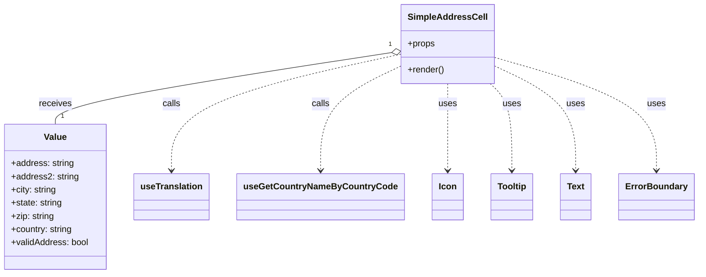

# Diagram: web/portal/src/components/organisms/base-table/Cell/SimpleAddressCell.js


> Auto-generated by Obscura crawlers

## Diagram 1



### SVG

<svg id="container" width="1235.7421875" xmlns="http://www.w3.org/2000/svg" class="classDiagram" height="498" viewBox="0 0 1235.7421875 498" role="graphics-document document" aria-roledescription="class"><style>#container{font-family:"trebuchet ms",verdana,arial,sans-serif;font-size:16px;fill:#333;}@keyframes edge-animation-frame{from{stroke-dashoffset:0;}}@keyframes dash{to{stroke-dashoffset:0;}}#container .edge-animation-slow{stroke-dasharray:9,5!important;stroke-dashoffset:900;animation:dash 50s linear infinite;stroke-linecap:round;}#container .edge-animation-fast{stroke-dasharray:9,5!important;stroke-dashoffset:900;animation:dash 20s linear infinite;stroke-linecap:round;}#container .error-icon{fill:#552222;}#container .error-text{fill:#552222;stroke:#552222;}#container .edge-thickness-normal{stroke-width:1px;}#container .edge-thickness-thick{stroke-width:3.5px;}#container .edge-pattern-solid{stroke-dasharray:0;}#container .edge-thickness-invisible{stroke-width:0;fill:none;}#container .edge-pattern-dashed{stroke-dasharray:3;}#container .edge-pattern-dotted{stroke-dasharray:2;}#container .marker{fill:#333333;stroke:#333333;}#container .marker.cross{stroke:#333333;}#container svg{font-family:"trebuchet ms",verdana,arial,sans-serif;font-size:16px;}#container p{margin:0;}#container g.classGroup text{fill:#9370DB;stroke:none;font-family:"trebuchet ms",verdana,arial,sans-serif;font-size:10px;}#container g.classGroup text .title{font-weight:bolder;}#container .nodeLabel,#container .edgeLabel{color:#131300;}#container .edgeLabel .label rect{fill:#ECECFF;}#container .label text{fill:#131300;}#container .labelBkg{background:#ECECFF;}#container .edgeLabel .label span{background:#ECECFF;}#container .classTitle{font-weight:bolder;}#container .node rect,#container .node circle,#container .node ellipse,#container .node polygon,#container .node path{fill:#ECECFF;stroke:#9370DB;stroke-width:1px;}#container .divider{stroke:#9370DB;stroke-width:1;}#container g.clickable{cursor:pointer;}#container g.classGroup rect{fill:#ECECFF;stroke:#9370DB;}#container g.classGroup line{stroke:#9370DB;stroke-width:1;}#container .classLabel .box{stroke:none;stroke-width:0;fill:#ECECFF;opacity:0.5;}#container .classLabel .label{fill:#9370DB;font-size:10px;}#container .relation{stroke:#333333;stroke-width:1;fill:none;}#container .dashed-line{stroke-dasharray:3;}#container .dotted-line{stroke-dasharray:1 2;}#container #compositionStart,#container .composition{fill:#333333!important;stroke:#333333!important;stroke-width:1;}#container #compositionEnd,#container .composition{fill:#333333!important;stroke:#333333!important;stroke-width:1;}#container #dependencyStart,#container .dependency{fill:#333333!important;stroke:#333333!important;stroke-width:1;}#container #dependencyStart,#container .dependency{fill:#333333!important;stroke:#333333!important;stroke-width:1;}#container #extensionStart,#container .extension{fill:transparent!important;stroke:#333333!important;stroke-width:1;}#container #extensionEnd,#container .extension{fill:transparent!important;stroke:#333333!important;stroke-width:1;}#container #aggregationStart,#container .aggregation{fill:transparent!important;stroke:#333333!important;stroke-width:1;}#container #aggregationEnd,#container .aggregation{fill:transparent!important;stroke:#333333!important;stroke-width:1;}#container #lollipopStart,#container .lollipop{fill:#ECECFF!important;stroke:#333333!important;stroke-width:1;}#container #lollipopEnd,#container .lollipop{fill:#ECECFF!important;stroke:#333333!important;stroke-width:1;}#container .edgeTerminals{font-size:11px;line-height:initial;}#container .classTitleText{text-anchor:middle;font-size:18px;fill:#333;}#container .label-icon{display:inline-block;height:1em;overflow:visible;vertical-align:-0.125em;}#container .node .label-icon path{fill:currentColor;stroke:revert;stroke-width:revert;}#container :root{--mermaid-font-family:"trebuchet ms",verdana,arial,sans-serif;}</style><g><defs><marker id="container_class-aggregationStart" class="marker aggregation class" refX="18" refY="7" markerWidth="190" markerHeight="240" orient="auto"><path d="M 18,7 L9,13 L1,7 L9,1 Z"></path></marker></defs><defs><marker id="container_class-aggregationEnd" class="marker aggregation class" refX="1" refY="7" markerWidth="20" markerHeight="28" orient="auto"><path d="M 18,7 L9,13 L1,7 L9,1 Z"></path></marker></defs><defs><marker id="container_class-extensionStart" class="marker extension class" refX="18" refY="7" markerWidth="190" markerHeight="240" orient="auto"><path d="M 1,7 L18,13 V 1 Z"></path></marker></defs><defs><marker id="container_class-extensionEnd" class="marker extension class" refX="1" refY="7" markerWidth="20" markerHeight="28" orient="auto"><path d="M 1,1 V 13 L18,7 Z"></path></marker></defs><defs><marker id="container_class-compositionStart" class="marker composition class" refX="18" refY="7" markerWidth="190" markerHeight="240" orient="auto"><path d="M 18,7 L9,13 L1,7 L9,1 Z"></path></marker></defs><defs><marker id="container_class-compositionEnd" class="marker composition class" refX="1" refY="7" markerWidth="20" markerHeight="28" orient="auto"><path d="M 18,7 L9,13 L1,7 L9,1 Z"></path></marker></defs><defs><marker id="container_class-dependencyStart" class="marker dependency class" refX="6" refY="7" markerWidth="190" markerHeight="240" orient="auto"><path d="M 5,7 L9,13 L1,7 L9,1 Z"></path></marker></defs><defs><marker id="container_class-dependencyEnd" class="marker dependency class" refX="13" refY="7" markerWidth="20" markerHeight="28" orient="auto"><path d="M 18,7 L9,13 L14,7 L9,1 Z"></path></marker></defs><defs><marker id="container_class-lollipopStart" class="marker lollipop class" refX="13" refY="7" markerWidth="190" markerHeight="240" orient="auto"><circle stroke="black" fill="transparent" cx="7" cy="7" r="6"></circle></marker></defs><defs><marker id="container_class-lollipopEnd" class="marker lollipop class" refX="1" refY="7" markerWidth="190" markerHeight="240" orient="auto"><circle stroke="black" fill="transparent" cx="7" cy="7" r="6"></circle></marker></defs><g class="root"><g class="clusters"></g><g class="edgePaths"><path d="M692.025,95.378L593.448,110.981C494.872,126.585,297.719,157.793,199.143,179.563C100.566,201.333,100.566,213.667,100.566,219.833L100.566,226" id="id_SimpleAddressCell_Value_1" class="edge-thickness-normal edge-pattern-solid relation" style=";;;" data-edge="true" data-et="edge" data-id="id_SimpleAddressCell_Value_1" data-points="W3sieCI6NzA5LjA2MjUsInkiOjkyLjY4MDU4NzQ2NDQ3NDc0fSx7IngiOjEwMC41NjY0MDYyNSwieSI6MTg5fSx7IngiOjEwMC41NjY0MDYyNSwieSI6MjI2fV0=" marker-start="url(#container_class-aggregationStart)"></path><path d="M709.063,98.193L642.422,113.328C575.781,128.462,442.5,158.731,375.859,194.032C309.219,229.333,309.219,269.667,309.219,289.833L309.219,310" id="id_SimpleAddressCell_useTranslation_2" class="edge-thickness-normal edge-pattern-dashed relation" style=";;;" data-edge="true" data-et="edge" data-id="id_SimpleAddressCell_useTranslation_2" data-points="W3sieCI6NzA5LjA2MjUsInkiOjk4LjE5MzI4MDU5MzgwNzk4fSx7IngiOjMwOS4yMTg3NSwieSI6MTg5fSx7IngiOjMwOS4yMTg3NSwieSI6MzE2fV0=" marker-end="url(#container_class-dependencyEnd)"></path><path d="M709.063,119.585L685.65,131.154C662.237,142.723,615.411,165.862,591.999,197.598C568.586,229.333,568.586,269.667,568.586,289.833L568.586,310" id="id_SimpleAddressCell_useGetCountryNameByCountryCode_3" class="edge-thickness-normal edge-pattern-dashed relation" style=";;;" data-edge="true" data-et="edge" data-id="id_SimpleAddressCell_useGetCountryNameByCountryCode_3" data-points="W3sieCI6NzA5LjA2MjUsInkiOjExOS41ODUxMjQ4NDUwNTA0N30seyJ4Ijo1NjguNTg1OTM3NSwieSI6MTg5fSx7IngiOjU2OC41ODU5Mzc1LCJ5IjozMTZ9XQ==" marker-end="url(#container_class-dependencyEnd)"></path><path d="M789.172,152L789.172,158.167C789.172,164.333,789.172,176.667,789.172,203C789.172,229.333,789.172,269.667,789.172,289.833L789.172,310" id="id_SimpleAddressCell_Icon_4" class="edge-thickness-normal edge-pattern-dashed relation" style=";;;" data-edge="true" data-et="edge" data-id="id_SimpleAddressCell_Icon_4" data-points="W3sieCI6Nzg5LjE3MTg3NSwieSI6MTUyfSx7IngiOjc4OS4xNzE4NzUsInkiOjE4OX0seyJ4Ijo3ODkuMTcxODc1LCJ5IjozMTZ9XQ==" marker-end="url(#container_class-dependencyEnd)"></path><path d="M865.156,152L871.664,158.167C878.172,164.333,891.187,176.667,897.695,203C904.203,229.333,904.203,269.667,904.203,289.833L904.203,310" id="id_SimpleAddressCell_Tooltip_5" class="edge-thickness-normal edge-pattern-dashed relation" style=";;;" data-edge="true" data-et="edge" data-id="id_SimpleAddressCell_Tooltip_5" data-points="W3sieCI6ODY1LjE1NTgxOTk1NDEyODQsInkiOjE1Mn0seyJ4Ijo5MDQuMjAzMTI1LCJ5IjoxODl9LHsieCI6OTA0LjIwMzEyNSwieSI6MzE2fV0=" marker-end="url(#container_class-dependencyEnd)"></path><path d="M869.281,117.942L894.286,129.785C919.292,141.628,969.302,165.314,994.307,197.324C1019.313,229.333,1019.313,269.667,1019.313,289.833L1019.313,310" id="id_SimpleAddressCell_Text_6" class="edge-thickness-normal edge-pattern-dashed relation" style=";;;" data-edge="true" data-et="edge" data-id="id_SimpleAddressCell_Text_6" data-points="W3sieCI6ODY5LjI4MTI1LCJ5IjoxMTcuOTQxNjc5Njc5NTQzNzd9LHsieCI6MTAxOS4zMTI1LCJ5IjoxODl9LHsieCI6MTAxOS4zMTI1LCJ5IjozMTZ9XQ==" marker-end="url(#container_class-dependencyEnd)"></path><path d="M869.281,103.407L918.104,117.673C966.927,131.938,1064.573,160.469,1113.396,194.901C1162.219,229.333,1162.219,269.667,1162.219,289.833L1162.219,310" id="id_SimpleAddressCell_ErrorBoundary_7" class="edge-thickness-normal edge-pattern-dashed relation" style=";;;" data-edge="true" data-et="edge" data-id="id_SimpleAddressCell_ErrorBoundary_7" data-points="W3sieCI6ODY5LjI4MTI1LCJ5IjoxMDMuNDA3MDM2NjQ5MjE0NjZ9LHsieCI6MTE2Mi4yMTg3NSwieSI6MTg5fSx7IngiOjExNjIuMjE4NzUsInkiOjMxNn1d" marker-end="url(#container_class-dependencyEnd)"></path></g><g class="edgeLabels"><g class="edgeLabel" transform="translate(100.56640625, 189)"><g class="label" data-id="id_SimpleAddressCell_Value_1" transform="translate(-29.4921875, -12)"><foreignObject width="58.984375" height="24"><div xmlns="http://www.w3.org/1999/xhtml" class="labelBkg" style="display: table-cell; white-space: nowrap; line-height: 1.5; max-width: 200px; text-align: center;"><span class="edgeLabel"><p>receives</p></span></div></foreignObject></g></g><g class="edgeLabel" transform="translate(309.21875, 189)"><g class="label" data-id="id_SimpleAddressCell_useTranslation_2" transform="translate(-16.4453125, -12)"><foreignObject width="32.890625" height="24"><div xmlns="http://www.w3.org/1999/xhtml" class="labelBkg" style="display: table-cell; white-space: nowrap; line-height: 1.5; max-width: 200px; text-align: center;"><span class="edgeLabel"><p>calls</p></span></div></foreignObject></g></g><g class="edgeLabel" transform="translate(568.5859375, 189)"><g class="label" data-id="id_SimpleAddressCell_useGetCountryNameByCountryCode_3" transform="translate(-16.4453125, -12)"><foreignObject width="32.890625" height="24"><div xmlns="http://www.w3.org/1999/xhtml" class="labelBkg" style="display: table-cell; white-space: nowrap; line-height: 1.5; max-width: 200px; text-align: center;"><span class="edgeLabel"><p>calls</p></span></div></foreignObject></g></g><g class="edgeLabel" transform="translate(789.171875, 189)"><g class="label" data-id="id_SimpleAddressCell_Icon_4" transform="translate(-16.4921875, -12)"><foreignObject width="32.984375" height="24"><div xmlns="http://www.w3.org/1999/xhtml" class="labelBkg" style="display: table-cell; white-space: nowrap; line-height: 1.5; max-width: 200px; text-align: center;"><span class="edgeLabel"><p>uses</p></span></div></foreignObject></g></g><g class="edgeLabel" transform="translate(904.203125, 189)"><g class="label" data-id="id_SimpleAddressCell_Tooltip_5" transform="translate(-16.4921875, -12)"><foreignObject width="32.984375" height="24"><div xmlns="http://www.w3.org/1999/xhtml" class="labelBkg" style="display: table-cell; white-space: nowrap; line-height: 1.5; max-width: 200px; text-align: center;"><span class="edgeLabel"><p>uses</p></span></div></foreignObject></g></g><g class="edgeLabel" transform="translate(1019.3125, 189)"><g class="label" data-id="id_SimpleAddressCell_Text_6" transform="translate(-16.4921875, -12)"><foreignObject width="32.984375" height="24"><div xmlns="http://www.w3.org/1999/xhtml" class="labelBkg" style="display: table-cell; white-space: nowrap; line-height: 1.5; max-width: 200px; text-align: center;"><span class="edgeLabel"><p>uses</p></span></div></foreignObject></g></g><g class="edgeLabel" transform="translate(1162.21875, 189)"><g class="label" data-id="id_SimpleAddressCell_ErrorBoundary_7" transform="translate(-16.4921875, -12)"><foreignObject width="32.984375" height="24"><div xmlns="http://www.w3.org/1999/xhtml" class="labelBkg" style="display: table-cell; white-space: nowrap; line-height: 1.5; max-width: 200px; text-align: center;"><span class="edgeLabel"><p>uses</p></span></div></foreignObject></g></g><g class="edgeTerminals" transform="translate(689.4325395431291, 80.6010746269635)"><g class="inner" transform="translate(0, 0)"><foreignObject style="width: 9px; height: 12px;"><div xmlns="http://www.w3.org/1999/xhtml" style="display: inline-block; padding-right: 1px; white-space: nowrap;"><span class="edgeLabel">1</span></div></foreignObject></g></g><g class="edgeTerminals" transform="translate(110.56640812499992, 203.50000160714285)"><g class="inner" transform="translate(0, 0)"></g><foreignObject style="width: 9px; height: 12px;"><div xmlns="http://www.w3.org/1999/xhtml" style="display: inline-block; padding-right: 1px; white-space: nowrap;"><span class="edgeLabel">1</span></div></foreignObject></g></g><g class="nodes"><g class="node default" id="classId-SimpleAddressCell-0" transform="translate(789.171875, 80)"><g class="basic label-container"><path d="M-80.109375 -72 L80.109375 -72 L80.109375 72 L-80.109375 72" stroke="none" stroke-width="0" fill="#ECECFF" style=""></path><path d="M-80.109375 -72 C-24.758706868444705 -72, 30.59196126311059 -72, 80.109375 -72 M-80.109375 -72 C-43.28740276318056 -72, -6.465430526361118 -72, 80.109375 -72 M80.109375 -72 C80.109375 -41.17317513965875, 80.109375 -10.346350279317512, 80.109375 72 M80.109375 -72 C80.109375 -30.169365986331826, 80.109375 11.661268027336348, 80.109375 72 M80.109375 72 C22.21729375616441 72, -35.67478748767118 72, -80.109375 72 M80.109375 72 C34.49690004027779 72, -11.115574919444427 72, -80.109375 72 M-80.109375 72 C-80.109375 39.16277709241645, -80.109375 6.325554184832896, -80.109375 -72 M-80.109375 72 C-80.109375 22.102562053617312, -80.109375 -27.794875892765376, -80.109375 -72" stroke="#9370DB" stroke-width="1.3" fill="none" stroke-dasharray="0 0" style=""></path></g><g class="annotation-group text" transform="translate(0, -48)"></g><g class="label-group text" transform="translate(-68.109375, -48)"><g class="label" style="font-weight: bolder" transform="translate(0,-12)"><foreignObject width="136.21875" height="24"><div xmlns="http://www.w3.org/1999/xhtml" style="display: table-cell; white-space: nowrap; line-height: 1.5; max-width: 184px; text-align: center;"><span class="nodeLabel markdown-node-label" style=""><p>SimpleAddressCell</p></span></div></foreignObject></g></g><g class="members-group text" transform="translate(-68.109375, 0)"><g class="label" style="" transform="translate(0,-12)"><foreignObject width="49.515625" height="24"><div xmlns="http://www.w3.org/1999/xhtml" style="display: table-cell; white-space: nowrap; line-height: 1.5; max-width: 107px; text-align: center;"><span class="nodeLabel markdown-node-label" style=""><p>+props</p></span></div></foreignObject></g></g><g class="methods-group text" transform="translate(-68.109375, 48)"><g class="label" style="" transform="translate(0,-12)"><foreignObject width="66.609375" height="24"><div xmlns="http://www.w3.org/1999/xhtml" style="display: table-cell; white-space: nowrap; line-height: 1.5; max-width: 124px; text-align: center;"><span class="nodeLabel markdown-node-label" style=""><p>+render()</p></span></div></foreignObject></g></g><g class="divider" style=""><path d="M-80.109375 -24 C-16.972213208585224 -24, 46.16494858282955 -24, 80.109375 -24 M-80.109375 -24 C-45.182459753750905 -24, -10.25554450750181 -24, 80.109375 -24" stroke="#9370DB" stroke-width="1.3" fill="none" stroke-dasharray="0 0" style=""></path></g><g class="divider" style=""><path d="M-80.109375 24 C-41.77857898507672 24, -3.4477829701534404 24, 80.109375 24 M-80.109375 24 C-17.283007023594003 24, 45.543360952811994 24, 80.109375 24" stroke="#9370DB" stroke-width="1.3" fill="none" stroke-dasharray="0 0" style=""></path></g></g><g class="node default" id="classId-Value-1" transform="translate(100.56640625, 358)"><g class="basic label-container"><path d="M-92.56640625 -132 L92.56640625 -132 L92.56640625 132 L-92.56640625 132" stroke="none" stroke-width="0" fill="#ECECFF" style=""></path><path d="M-92.56640625 -132 C-25.837115389573313 -132, 40.892175470853374 -132, 92.56640625 -132 M-92.56640625 -132 C-46.726323632731656 -132, -0.8862410154633125 -132, 92.56640625 -132 M92.56640625 -132 C92.56640625 -52.92839570067049, 92.56640625 26.143208598659015, 92.56640625 132 M92.56640625 -132 C92.56640625 -40.114308232791814, 92.56640625 51.77138353441637, 92.56640625 132 M92.56640625 132 C36.192702661918936 132, -20.181000926162127 132, -92.56640625 132 M92.56640625 132 C39.02062211052552 132, -14.525162028948955 132, -92.56640625 132 M-92.56640625 132 C-92.56640625 63.63184033792949, -92.56640625 -4.7363193241410215, -92.56640625 -132 M-92.56640625 132 C-92.56640625 60.56713664892091, -92.56640625 -10.865726702158184, -92.56640625 -132" stroke="#9370DB" stroke-width="1.3" fill="none" stroke-dasharray="0 0" style=""></path></g><g class="annotation-group text" transform="translate(0, -108)"></g><g class="label-group text" transform="translate(-19.9140625, -108)"><g class="label" style="font-weight: bolder" transform="translate(0,-12)"><foreignObject width="39.828125" height="24"><div xmlns="http://www.w3.org/1999/xhtml" style="display: table-cell; white-space: nowrap; line-height: 1.5; max-width: 90px; text-align: center;"><span class="nodeLabel markdown-node-label" style=""><p>Value</p></span></div></foreignObject></g></g><g class="members-group text" transform="translate(-80.56640625, -60)"><g class="label" style="" transform="translate(0,-12)"><foreignObject width="114.5" height="24"><div xmlns="http://www.w3.org/1999/xhtml" style="display: table-cell; white-space: nowrap; line-height: 1.5; max-width: 173px; text-align: center;"><span class="nodeLabel markdown-node-label" style=""><p>+address: string</p></span></div></foreignObject></g><g class="label" style="" transform="translate(0,12)"><foreignObject width="122.265625" height="24"><div xmlns="http://www.w3.org/1999/xhtml" style="display: table-cell; white-space: nowrap; line-height: 1.5; max-width: 180px; text-align: center;"><span class="nodeLabel markdown-node-label" style=""><p>+address2: string</p></span></div></foreignObject></g><g class="label" style="" transform="translate(0,36)"><foreignObject width="83.5" height="24"><div xmlns="http://www.w3.org/1999/xhtml" style="display: table-cell; white-space: nowrap; line-height: 1.5; max-width: 142px; text-align: center;"><span class="nodeLabel markdown-node-label" style=""><p>+city: string</p></span></div></foreignObject></g><g class="label" style="" transform="translate(0,60)"><foreignObject width="93.796875" height="24"><div xmlns="http://www.w3.org/1999/xhtml" style="display: table-cell; white-space: nowrap; line-height: 1.5; max-width: 152px; text-align: center;"><span class="nodeLabel markdown-node-label" style=""><p>+state: string</p></span></div></foreignObject></g><g class="label" style="" transform="translate(0,84)"><foreignObject width="78.234375" height="24"><div xmlns="http://www.w3.org/1999/xhtml" style="display: table-cell; white-space: nowrap; line-height: 1.5; max-width: 136px; text-align: center;"><span class="nodeLabel markdown-node-label" style=""><p>+zip: string</p></span></div></foreignObject></g><g class="label" style="" transform="translate(0,108)"><foreignObject width="112.953125" height="24"><div xmlns="http://www.w3.org/1999/xhtml" style="display: table-cell; white-space: nowrap; line-height: 1.5; max-width: 171px; text-align: center;"><span class="nodeLabel markdown-node-label" style=""><p>+country: string</p></span></div></foreignObject></g><g class="label" style="" transform="translate(0,132)"><foreignObject width="141.21875" height="24"><div xmlns="http://www.w3.org/1999/xhtml" style="display: table-cell; white-space: nowrap; line-height: 1.5; max-width: 199px; text-align: center;"><span class="nodeLabel markdown-node-label" style=""><p>+validAddress: bool</p></span></div></foreignObject></g></g><g class="methods-group text" transform="translate(-80.56640625, 132)"></g><g class="divider" style=""><path d="M-92.56640625 -84 C-34.71438943907928 -84, 23.137627371841447 -84, 92.56640625 -84 M-92.56640625 -84 C-32.08115305201364 -84, 28.40410014597272 -84, 92.56640625 -84" stroke="#9370DB" stroke-width="1.3" fill="none" stroke-dasharray="0 0" style=""></path></g><g class="divider" style=""><path d="M-92.56640625 108 C-46.54397892797747 108, -0.5215516059549401 108, 92.56640625 108 M-92.56640625 108 C-27.809110883713586 108, 36.94818448257283 108, 92.56640625 108" stroke="#9370DB" stroke-width="1.3" fill="none" stroke-dasharray="0 0" style=""></path></g></g><g class="node default" id="classId-useTranslation-2" transform="translate(309.21875, 358)"><g class="basic label-container"><path d="M-66.0859375 -42 L66.0859375 -42 L66.0859375 42 L-66.0859375 42" stroke="none" stroke-width="0" fill="#ECECFF" style=""></path><path d="M-66.0859375 -42 C-37.020777167036 -42, -7.9556168340720035 -42, 66.0859375 -42 M-66.0859375 -42 C-28.839202213603706 -42, 8.407533072792589 -42, 66.0859375 -42 M66.0859375 -42 C66.0859375 -14.440054263965205, 66.0859375 13.11989147206959, 66.0859375 42 M66.0859375 -42 C66.0859375 -17.90629017657179, 66.0859375 6.187419646856419, 66.0859375 42 M66.0859375 42 C31.141357643490004 42, -3.8032222130199926 42, -66.0859375 42 M66.0859375 42 C16.37488161466871 42, -33.33617427066258 42, -66.0859375 42 M-66.0859375 42 C-66.0859375 15.624122087755193, -66.0859375 -10.751755824489614, -66.0859375 -42 M-66.0859375 42 C-66.0859375 9.3608337268738, -66.0859375 -23.2783325462524, -66.0859375 -42" stroke="#9370DB" stroke-width="1.3" fill="none" stroke-dasharray="0 0" style=""></path></g><g class="annotation-group text" transform="translate(0, -18)"></g><g class="label-group text" transform="translate(-54.0859375, -18)"><g class="label" style="font-weight: bolder" transform="translate(0,-12)"><foreignObject width="108.171875" height="24"><div xmlns="http://www.w3.org/1999/xhtml" style="display: table-cell; white-space: nowrap; line-height: 1.5; max-width: 157px; text-align: center;"><span class="nodeLabel markdown-node-label" style=""><p>useTranslation</p></span></div></foreignObject></g></g><g class="members-group text" transform="translate(-54.0859375, 30)"></g><g class="methods-group text" transform="translate(-54.0859375, 60)"></g><g class="divider" style=""><path d="M-66.0859375 6 C-35.01102225902446 6, -3.936107018048922 6, 66.0859375 6 M-66.0859375 6 C-17.96597599444712 6, 30.15398551110576 6, 66.0859375 6" stroke="#9370DB" stroke-width="1.3" fill="none" stroke-dasharray="0 0" style=""></path></g><g class="divider" style=""><path d="M-66.0859375 24 C-21.415907089670725 24, 23.25412332065855 24, 66.0859375 24 M-66.0859375 24 C-34.25026719641073 24, -2.4145968928214643 24, 66.0859375 24" stroke="#9370DB" stroke-width="1.3" fill="none" stroke-dasharray="0 0" style=""></path></g></g><g class="node default" id="classId-useGetCountryNameByCountryCode-3" transform="translate(568.5859375, 358)"><g class="basic label-container"><path d="M-143.28125 -42 L143.28125 -42 L143.28125 42 L-143.28125 42" stroke="none" stroke-width="0" fill="#ECECFF" style=""></path><path d="M-143.28125 -42 C-59.758430746548186 -42, 23.76438850690363 -42, 143.28125 -42 M-143.28125 -42 C-77.52871559093512 -42, -11.776181181870243 -42, 143.28125 -42 M143.28125 -42 C143.28125 -13.22369548363644, 143.28125 15.55260903272712, 143.28125 42 M143.28125 -42 C143.28125 -15.628370014337573, 143.28125 10.743259971324854, 143.28125 42 M143.28125 42 C46.277198483683776 42, -50.72685303263245 42, -143.28125 42 M143.28125 42 C71.24735070058914 42, -0.7865485988217245 42, -143.28125 42 M-143.28125 42 C-143.28125 14.232622567157406, -143.28125 -13.534754865685187, -143.28125 -42 M-143.28125 42 C-143.28125 21.964976597080682, -143.28125 1.9299531941613637, -143.28125 -42" stroke="#9370DB" stroke-width="1.3" fill="none" stroke-dasharray="0 0" style=""></path></g><g class="annotation-group text" transform="translate(0, -18)"></g><g class="label-group text" transform="translate(-131.28125, -18)"><g class="label" style="font-weight: bolder" transform="translate(0,-12)"><foreignObject width="262.5625" height="24"><div xmlns="http://www.w3.org/1999/xhtml" style="display: table-cell; white-space: nowrap; line-height: 1.5; max-width: 309px; text-align: center;"><span class="nodeLabel markdown-node-label" style=""><p>useGetCountryNameByCountryCode</p></span></div></foreignObject></g></g><g class="members-group text" transform="translate(-131.28125, 30)"></g><g class="methods-group text" transform="translate(-131.28125, 60)"></g><g class="divider" style=""><path d="M-143.28125 6 C-37.73970656446413 6, 67.80183687107174 6, 143.28125 6 M-143.28125 6 C-40.732703562461296 6, 61.81584287507741 6, 143.28125 6" stroke="#9370DB" stroke-width="1.3" fill="none" stroke-dasharray="0 0" style=""></path></g><g class="divider" style=""><path d="M-143.28125 24 C-45.71318986116323 24, 51.85487027767354 24, 143.28125 24 M-143.28125 24 C-43.56882398956171 24, 56.143602020876585 24, 143.28125 24" stroke="#9370DB" stroke-width="1.3" fill="none" stroke-dasharray="0 0" style=""></path></g></g><g class="node default" id="classId-Icon-4" transform="translate(789.171875, 358)"><g class="basic label-container"><path d="M-27.3046875 -42 L27.3046875 -42 L27.3046875 42 L-27.3046875 42" stroke="none" stroke-width="0" fill="#ECECFF" style=""></path><path d="M-27.3046875 -42 C-11.33792224028185 -42, 4.6288430194362995 -42, 27.3046875 -42 M-27.3046875 -42 C-7.505855982272045 -42, 12.29297553545591 -42, 27.3046875 -42 M27.3046875 -42 C27.3046875 -12.64326978742108, 27.3046875 16.71346042515784, 27.3046875 42 M27.3046875 -42 C27.3046875 -24.56683779981397, 27.3046875 -7.133675599627942, 27.3046875 42 M27.3046875 42 C15.960606225550684 42, 4.616524951101368 42, -27.3046875 42 M27.3046875 42 C5.753517014302908 42, -15.797653471394185 42, -27.3046875 42 M-27.3046875 42 C-27.3046875 9.041414358101562, -27.3046875 -23.917171283796876, -27.3046875 -42 M-27.3046875 42 C-27.3046875 16.419883306673004, -27.3046875 -9.160233386653992, -27.3046875 -42" stroke="#9370DB" stroke-width="1.3" fill="none" stroke-dasharray="0 0" style=""></path></g><g class="annotation-group text" transform="translate(0, -18)"></g><g class="label-group text" transform="translate(-15.3046875, -18)"><g class="label" style="font-weight: bolder" transform="translate(0,-12)"><foreignObject width="30.609375" height="24"><div xmlns="http://www.w3.org/1999/xhtml" style="display: table-cell; white-space: nowrap; line-height: 1.5; max-width: 81px; text-align: center;"><span class="nodeLabel markdown-node-label" style=""><p>Icon</p></span></div></foreignObject></g></g><g class="members-group text" transform="translate(-15.3046875, 30)"></g><g class="methods-group text" transform="translate(-15.3046875, 60)"></g><g class="divider" style=""><path d="M-27.3046875 6 C-14.341948435440269 6, -1.3792093708805382 6, 27.3046875 6 M-27.3046875 6 C-6.939892941503288 6, 13.424901616993424 6, 27.3046875 6" stroke="#9370DB" stroke-width="1.3" fill="none" stroke-dasharray="0 0" style=""></path></g><g class="divider" style=""><path d="M-27.3046875 24 C-14.608252110086212 24, -1.9118167201724248 24, 27.3046875 24 M-27.3046875 24 C-15.187312896110765 24, -3.0699382922215293 24, 27.3046875 24" stroke="#9370DB" stroke-width="1.3" fill="none" stroke-dasharray="0 0" style=""></path></g></g><g class="node default" id="classId-Tooltip-5" transform="translate(904.203125, 358)"><g class="basic label-container"><path d="M-37.7265625 -42 L37.7265625 -42 L37.7265625 42 L-37.7265625 42" stroke="none" stroke-width="0" fill="#ECECFF" style=""></path><path d="M-37.7265625 -42 C-20.403680054008852 -42, -3.080797608017704 -42, 37.7265625 -42 M-37.7265625 -42 C-12.88109016944053 -42, 11.964382161118941 -42, 37.7265625 -42 M37.7265625 -42 C37.7265625 -23.798158375426024, 37.7265625 -5.596316750852047, 37.7265625 42 M37.7265625 -42 C37.7265625 -17.736212398819475, 37.7265625 6.527575202361049, 37.7265625 42 M37.7265625 42 C17.366687961669573 42, -2.993186576660854 42, -37.7265625 42 M37.7265625 42 C20.478326970636257 42, 3.2300914412725135 42, -37.7265625 42 M-37.7265625 42 C-37.7265625 10.90156948027402, -37.7265625 -20.19686103945196, -37.7265625 -42 M-37.7265625 42 C-37.7265625 9.13418109366686, -37.7265625 -23.73163781266628, -37.7265625 -42" stroke="#9370DB" stroke-width="1.3" fill="none" stroke-dasharray="0 0" style=""></path></g><g class="annotation-group text" transform="translate(0, -18)"></g><g class="label-group text" transform="translate(-25.7265625, -18)"><g class="label" style="font-weight: bolder" transform="translate(0,-12)"><foreignObject width="51.453125" height="24"><div xmlns="http://www.w3.org/1999/xhtml" style="display: table-cell; white-space: nowrap; line-height: 1.5; max-width: 101px; text-align: center;"><span class="nodeLabel markdown-node-label" style=""><p>Tooltip</p></span></div></foreignObject></g></g><g class="members-group text" transform="translate(-25.7265625, 30)"></g><g class="methods-group text" transform="translate(-25.7265625, 60)"></g><g class="divider" style=""><path d="M-37.7265625 6 C-14.617412107486839 6, 8.491738285026322 6, 37.7265625 6 M-37.7265625 6 C-15.553530558027575 6, 6.619501383944851 6, 37.7265625 6" stroke="#9370DB" stroke-width="1.3" fill="none" stroke-dasharray="0 0" style=""></path></g><g class="divider" style=""><path d="M-37.7265625 24 C-13.111683123090664 24, 11.503196253818672 24, 37.7265625 24 M-37.7265625 24 C-10.519584525327996 24, 16.687393449344007 24, 37.7265625 24" stroke="#9370DB" stroke-width="1.3" fill="none" stroke-dasharray="0 0" style=""></path></g></g><g class="node default" id="classId-Text-6" transform="translate(1019.3125, 358)"><g class="basic label-container"><path d="M-27.3828125 -42 L27.3828125 -42 L27.3828125 42 L-27.3828125 42" stroke="none" stroke-width="0" fill="#ECECFF" style=""></path><path d="M-27.3828125 -42 C-8.365888026461135 -42, 10.651036447077729 -42, 27.3828125 -42 M-27.3828125 -42 C-6.50244160835949 -42, 14.37792928328102 -42, 27.3828125 -42 M27.3828125 -42 C27.3828125 -22.44743589478482, 27.3828125 -2.894871789569642, 27.3828125 42 M27.3828125 -42 C27.3828125 -22.390435589500143, 27.3828125 -2.780871179000286, 27.3828125 42 M27.3828125 42 C7.4372813308015076 42, -12.508249838396985 42, -27.3828125 42 M27.3828125 42 C5.639021810303909 42, -16.104768879392182 42, -27.3828125 42 M-27.3828125 42 C-27.3828125 10.626777733190334, -27.3828125 -20.746444533619332, -27.3828125 -42 M-27.3828125 42 C-27.3828125 20.501522234672862, -27.3828125 -0.9969555306542759, -27.3828125 -42" stroke="#9370DB" stroke-width="1.3" fill="none" stroke-dasharray="0 0" style=""></path></g><g class="annotation-group text" transform="translate(0, -18)"></g><g class="label-group text" transform="translate(-15.3828125, -18)"><g class="label" style="font-weight: bolder" transform="translate(0,-12)"><foreignObject width="30.765625" height="24"><div xmlns="http://www.w3.org/1999/xhtml" style="display: table-cell; white-space: nowrap; line-height: 1.5; max-width: 80px; text-align: center;"><span class="nodeLabel markdown-node-label" style=""><p>Text</p></span></div></foreignObject></g></g><g class="members-group text" transform="translate(-15.3828125, 30)"></g><g class="methods-group text" transform="translate(-15.3828125, 60)"></g><g class="divider" style=""><path d="M-27.3828125 6 C-14.65798036930839 6, -1.9331482386167806 6, 27.3828125 6 M-27.3828125 6 C-12.417792032920097 6, 2.5472284341598055 6, 27.3828125 6" stroke="#9370DB" stroke-width="1.3" fill="none" stroke-dasharray="0 0" style=""></path></g><g class="divider" style=""><path d="M-27.3828125 24 C-12.96130905665067 24, 1.4601943866986602 24, 27.3828125 24 M-27.3828125 24 C-16.408376913246983 24, -5.433941326493965 24, 27.3828125 24" stroke="#9370DB" stroke-width="1.3" fill="none" stroke-dasharray="0 0" style=""></path></g></g><g class="node default" id="classId-ErrorBoundary-7" transform="translate(1162.21875, 358)"><g class="basic label-container"><path d="M-65.5234375 -42 L65.5234375 -42 L65.5234375 42 L-65.5234375 42" stroke="none" stroke-width="0" fill="#ECECFF" style=""></path><path d="M-65.5234375 -42 C-28.954906322824513 -42, 7.613624854350974 -42, 65.5234375 -42 M-65.5234375 -42 C-39.129556214645525 -42, -12.73567492929105 -42, 65.5234375 -42 M65.5234375 -42 C65.5234375 -14.094361358556942, 65.5234375 13.811277282886117, 65.5234375 42 M65.5234375 -42 C65.5234375 -14.316110019035573, 65.5234375 13.367779961928854, 65.5234375 42 M65.5234375 42 C29.566956940973355 42, -6.389523618053289 42, -65.5234375 42 M65.5234375 42 C19.91173702091117 42, -25.699963458177663 42, -65.5234375 42 M-65.5234375 42 C-65.5234375 23.191065085976344, -65.5234375 4.382130171952689, -65.5234375 -42 M-65.5234375 42 C-65.5234375 9.283414206328096, -65.5234375 -23.433171587343807, -65.5234375 -42" stroke="#9370DB" stroke-width="1.3" fill="none" stroke-dasharray="0 0" style=""></path></g><g class="annotation-group text" transform="translate(0, -18)"></g><g class="label-group text" transform="translate(-53.5234375, -18)"><g class="label" style="font-weight: bolder" transform="translate(0,-12)"><foreignObject width="107.046875" height="24"><div xmlns="http://www.w3.org/1999/xhtml" style="display: table-cell; white-space: nowrap; line-height: 1.5; max-width: 156px; text-align: center;"><span class="nodeLabel markdown-node-label" style=""><p>ErrorBoundary</p></span></div></foreignObject></g></g><g class="members-group text" transform="translate(-53.5234375, 30)"></g><g class="methods-group text" transform="translate(-53.5234375, 60)"></g><g class="divider" style=""><path d="M-65.5234375 6 C-34.05983274317382 6, -2.5962279863476425 6, 65.5234375 6 M-65.5234375 6 C-35.947201576338045 6, -6.370965652676091 6, 65.5234375 6" stroke="#9370DB" stroke-width="1.3" fill="none" stroke-dasharray="0 0" style=""></path></g><g class="divider" style=""><path d="M-65.5234375 24 C-16.868474232239123 24, 31.786489035521754 24, 65.5234375 24 M-65.5234375 24 C-16.69794386970846 24, 32.12754976058308 24, 65.5234375 24" stroke="#9370DB" stroke-width="1.3" fill="none" stroke-dasharray="0 0" style=""></path></g></g></g></g></g></svg>

## Diagram 2

```mermaid
flowchart TD
    A[Start render SimpleAddressCell] --> B{address === "null" or !address?}
    B -- Yes --> C[return null]
    B -- No --> D[compute address3 = join(city,state,zip)]
    D --> E{validAddress === false?}
    E -- Yes --> F[Render Tooltip with Icon (faMapMarkerAltSlash)]
    E -- No --> G[skip invalid-icon]
    F --> H[Render address block]
    G --> H
    H --> I{address2 ?}
    I -- Yes --> J[Render address2 line]
    I -- No --> K[skip]
    J --> L{address3 ?}
    K --> L
    L -- Yes --> M[Render address3 line]
    L -- No --> N[skip]
    M --> O{country ?}
    N --> O
    O -- No --> P[finish render]
    O -- Yes --> Q[Wrap in ErrorBoundary fallback=country]
    Q --> R[Render t(countryName)]
    R --> P
    C --> P
```

> SVG rendering failed for this diagram.
