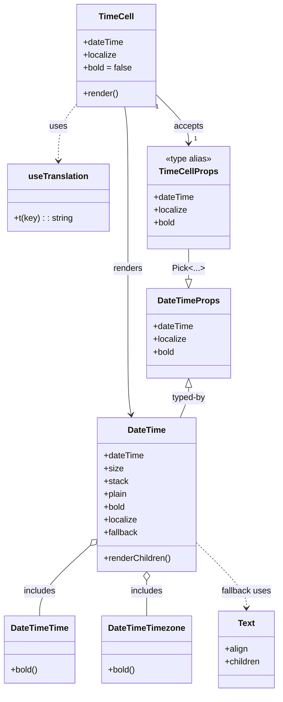

# Diagram: web/portal/src/components/organisms/base-table/Cell/TimeCell.tsx

> Auto-generated by Obscura crawlers

## Mermaid

### SVG

<svg id="container" width="514.8671875" xmlns="http://www.w3.org/2000/svg" class="classDiagram" height="1296" viewBox="0 0 514.8671875 1296" role="graphics-document document" aria-roledescription="class"><g><defs><marker id="container_class-aggregationStart" class="marker aggregation class" refX="18" refY="7" markerWidth="190" markerHeight="240" orient="auto"><path d="M 18,7 L9,13 L1,7 L9,1 Z"></path></marker></defs><defs><marker id="container_class-aggregationEnd" class="marker aggregation class" refX="1" refY="7" markerWidth="20" markerHeight="28" orient="auto"><path d="M 18,7 L9,13 L1,7 L9,1 Z"></path></marker></defs><defs><marker id="container_class-extensionStart" class="marker extension class" refX="18" refY="7" markerWidth="190" markerHeight="240" orient="auto"><path d="M 1,7 L18,13 V 1 Z"></path></marker></defs><defs><marker id="container_class-extensionEnd" class="marker extension class" refX="1" refY="7" markerWidth="20" markerHeight="28" orient="auto"><path d="M 1,1 V 13 L18,7 Z"></path></marker></defs><defs><marker id="container_class-compositionStart" class="marker composition class" refX="18" refY="7" markerWidth="190" markerHeight="240" orient="auto"><path d="M 18,7 L9,13 L1,7 L9,1 Z"></path></marker></defs><defs><marker id="container_class-compositionEnd" class="marker composition class" refX="1" refY="7" markerWidth="20" markerHeight="28" orient="auto"><path d="M 18,7 L9,13 L1,7 L9,1 Z"></path></marker></defs><defs><marker id="container_class-dependencyStart" class="marker dependency class" refX="6" refY="7" markerWidth="190" markerHeight="240" orient="auto"><path d="M 5,7 L9,13 L1,7 L9,1 Z"></path></marker></defs><defs><marker id="container_class-dependencyEnd" class="marker dependency class" refX="13" refY="7" markerWidth="20" markerHeight="28" orient="auto"><path d="M 18,7 L9,13 L14,7 L9,1 Z"></path></marker></defs><defs><marker id="container_class-lollipopStart" class="marker lollipop class" refX="13" refY="7" markerWidth="190" markerHeight="240" orient="auto"><circle stroke="black" fill="transparent" cx="7" cy="7" r="6"></circle></marker></defs><defs><marker id="container_class-lollipopEnd" class="marker lollipop class" refX="1" refY="7" markerWidth="190" markerHeight="240" orient="auto"><circle stroke="black" fill="transparent" cx="7" cy="7" r="6"></circle></marker></defs><g class="root"><g class="clusters"></g><g class="edgePaths"><path d="M228.663,200L229.73,206.167C230.797,212.333,232.931,224.667,233.998,253C235.064,281.333,235.064,325.667,235.064,370C235.064,414.333,235.064,458.667,235.064,501C235.064,543.333,235.064,583.667,235.064,624C235.064,664.333,235.064,704.667,236.018,730.017C236.972,755.366,238.88,765.733,239.834,770.916L240.788,776.099" id="id_TimeCell_DateTime_1" class="edge-thickness-normal edge-pattern-solid relation" style=";;;" data-edge="true" data-et="edge" data-id="id_TimeCell_DateTime_1" data-points="W3sieCI6MjI4LjY2MzI0MDEzMTU3ODk2LCJ5IjoyMDB9LHsieCI6MjM1LjA2NDQ1MzEyNSwieSI6MjM3fSx7IngiOjIzNS4wNjQ0NTMxMjUsInkiOjM3MH0seyJ4IjoyMzUuMDY0NDUzMTI1LCJ5Ijo1MDN9LHsieCI6MjM1LjA2NDQ1MzEyNSwieSI6NjI0fSx7IngiOjIzNS4wNjQ0NTMxMjUsInkiOjc0NX0seyJ4IjoyNDEuODczNzkxNDM2NDY0MSwieSI6NzgyfV0=" marker-end="url(#container_class-dependencyEnd)"></path><path d="M162.757,1023.539L147.695,1037.449C132.632,1051.359,102.508,1079.18,87.445,1100.756C72.383,1122.333,72.383,1137.667,72.383,1145.333L72.383,1153" id="id_DateTime_DateTimeTime_2" class="edge-thickness-normal edge-pattern-solid relation" style=";;;" data-edge="true" data-et="edge" data-id="id_DateTime_DateTimeTime_2" data-points="W3sieCI6MTc1LjQyOTY4NzUsInkiOjEwMTEuODM1NTcyMjA4NzEzNn0seyJ4Ijo3Mi4zODI4MTI1LCJ5IjoxMTA3fSx7IngiOjcyLjM4MjgxMjUsInkiOjExNTN9XQ==" marker-start="url(#container_class-aggregationStart)"></path><path d="M268.375,1087.25L268.375,1090.542C268.375,1093.833,268.375,1100.417,268.375,1111.375C268.375,1122.333,268.375,1137.667,268.375,1145.333L268.375,1153" id="id_DateTime_DateTimeTimezone_3" class="edge-thickness-normal edge-pattern-solid relation" style=";;;" data-edge="true" data-et="edge" data-id="id_DateTime_DateTimeTimezone_3" data-points="W3sieCI6MjY4LjM3NSwieSI6MTA3MH0seyJ4IjoyNjguMzc1LCJ5IjoxMTA3fSx7IngiOjI2OC4zNzUsInkiOjExNTN9XQ==" marker-start="url(#container_class-aggregationStart)"></path><path d="M361.32,1016.911L376.671,1031.926C392.022,1046.94,422.724,1076.97,438.075,1097.152C453.426,1117.333,453.426,1127.667,453.426,1132.833L453.426,1138" id="id_DateTime_Text_4" class="edge-thickness-normal edge-pattern-dashed relation" style=";;;" data-edge="true" data-et="edge" data-id="id_DateTime_Text_4" data-points="W3sieCI6MzYxLjMyMDMxMjUsInkiOjEwMTYuOTEwNzI5NzQwNTY5NX0seyJ4Ijo0NTMuNDI1NzgxMjUsInkiOjExMDd9LHsieCI6NDUzLjQyNTc4MTI1LCJ5IjoxMTQ0fV0=" marker-end="url(#container_class-dependencyEnd)"></path><path d="M138.41,196.089L132.957,202.908C127.505,209.726,116.599,223.363,111.146,240.848C105.693,258.333,105.693,279.667,105.693,290.333L105.693,301" id="id_TimeCell_useTranslation_5" class="edge-thickness-normal edge-pattern-dashed relation" style=";;;" data-edge="true" data-et="edge" data-id="id_TimeCell_useTranslation_5" data-points="W3sieCI6MTM4LjQxMDE1NjI1LCJ5IjoxOTYuMDg5MTM0NTQ2NTIyOTN9LHsieCI6MTA1LjY5MzM1OTM3NSwieSI6MjM3fSx7IngiOjEwNS42OTMzNTkzNzUsInkiOjMwN31d" marker-end="url(#container_class-dependencyEnd)"></path><path d="M347.705,466L347.705,472.167C347.705,478.333,347.705,490.667,347.705,500.125C347.705,509.583,347.705,516.167,347.705,519.458L347.705,522.75" id="id_TimeCellProps_DateTimeProps_6" class="edge-thickness-normal edge-pattern-solid relation" style=";;;" data-edge="true" data-et="edge" data-id="id_TimeCellProps_DateTimeProps_6" data-points="W3sieCI6MzQ3LjcwNTA3ODEyNSwieSI6NDY2fSx7IngiOjM0Ny43MDUwNzgxMjUsInkiOjUwM30seyJ4IjozNDcuNzA1MDc4MTI1LCJ5Ijo1NDB9XQ==" marker-end="url(#container_class-extensionEnd)"></path><path d="M285.699,176.206L296.034,186.338C306.368,196.47,327.036,216.735,337.371,232.034C347.705,247.333,347.705,257.667,347.705,262.833L347.705,268" id="id_TimeCell_TimeCellProps_7" class="edge-thickness-normal edge-pattern-solid relation" style=";;;" data-edge="true" data-et="edge" data-id="id_TimeCell_TimeCellProps_7" data-points="W3sieCI6Mjg1LjY5OTIxODc1LCJ5IjoxNzYuMjA1NjM1NDY1NzEwNjN9LHsieCI6MzQ3LjcwNTA3ODEyNSwieSI6MjM3fSx7IngiOjM0Ny43MDUwNzgxMjUsInkiOjI3NH1d" marker-end="url(#container_class-dependencyEnd)"></path><path d="M347.705,725.25L347.705,728.542C347.705,731.833,347.705,738.417,345.002,747.875C342.3,757.333,336.894,769.667,334.191,775.833L331.488,782" id="id_DateTimeProps_DateTime_8" class="edge-thickness-normal edge-pattern-solid relation" style=";;;" data-edge="true" data-et="edge" data-id="id_DateTimeProps_DateTime_8" data-points="W3sieCI6MzQ3LjcwNTA3ODEyNSwieSI6NzA4fSx7IngiOjM0Ny43MDUwNzgxMjUsInkiOjc0NX0seyJ4IjozMzEuNDg4NDMyMzIwNDQyLCJ5Ijo3ODJ9XQ==" marker-start="url(#container_class-extensionStart)"></path></g><g class="edgeLabels"><g class="edgeLabel" transform="translate(235.064453125, 503)"><g class="label" data-id="id_TimeCell_DateTime_1" transform="translate(-27.75, -12)"><foreignObject width="55.5" height="24">

renders

</foreignObject></g></g><g class="edgeLabel" transform="translate(72.3828125, 1107)"><g class="label" data-id="id_DateTime_DateTimeTime_2" transform="translate(-30.6484375, -12)"><foreignObject width="61.296875" height="24">

includes

</foreignObject></g></g><g class="edgeLabel" transform="translate(268.375, 1107)"><g class="label" data-id="id_DateTime_DateTimeTimezone_3" transform="translate(-30.6484375, -12)"><foreignObject width="61.296875" height="24">

includes

</foreignObject></g></g><g class="edgeLabel" transform="translate(453.42578125, 1107)"><g class="label" data-id="id_DateTime_Text_4" transform="translate(-47.0234375, -12)"><foreignObject width="94.046875" height="24">

fallback uses

</foreignObject></g></g><g class="edgeLabel" transform="translate(105.693359375, 237)"><g class="label" data-id="id_TimeCell_useTranslation_5" transform="translate(-16.4921875, -12)"><foreignObject width="32.984375" height="24">

uses

</foreignObject></g></g><g class="edgeLabel" transform="translate(347.705078125, 503)"><g class="label" data-id="id_TimeCellProps_DateTimeProps_6" transform="translate(-28.46875, -12)"><foreignObject width="56.9375" height="24">

Pick&lt;...&gt;

</foreignObject></g></g><g class="edgeLabel" transform="translate(347.705078125, 237)"><g class="label" data-id="id_TimeCell_TimeCellProps_7" transform="translate(-27.421875, -12)"><foreignObject width="54.84375" height="24">

accepts

</foreignObject></g></g><g class="edgeLabel" transform="translate(347.705078125, 745)"><g class="label" data-id="id_DateTimeProps_DateTime_8" transform="translate(-32.5625, -12)"><foreignObject width="65.125" height="24">

typed-by

</foreignObject></g></g><g class="edgeTerminals" transform="translate(287.69360879745386, 199.16804833267284)"><g class="inner" transform="translate(0, 0)"><foreignObject style="width: 9px; height: 12px;">
1
</foreignObject></g></g><g class="edgeTerminals" transform="translate(357.7050790625, 251.50000080357142)"><g class="inner" transform="translate(0, 0)"></g><foreignObject style="width: 9px; height: 12px;">
1
</foreignObject></g></g><g class="nodes"><g class="node default" id="classId-TimeCell-0" transform="translate(212.0546875, 104)"><g class="basic label-container"><path d="M-73.64453125 -96 L73.64453125 -96 L73.64453125 96 L-73.64453125 96" stroke="none" stroke-width="0" fill="#ECECFF" style=""></path><path d="M-73.64453125 -96 C-25.936433541606327 -96, 21.771664166787346 -96, 73.64453125 -96 M-73.64453125 -96 C-42.42860049980007 -96, -11.212669749600131 -96, 73.64453125 -96 M73.64453125 -96 C73.64453125 -30.026741405944733, 73.64453125 35.94651718811053, 73.64453125 96 M73.64453125 -96 C73.64453125 -46.71967321652901, 73.64453125 2.56065356694198, 73.64453125 96 M73.64453125 96 C35.458695055076994 96, -2.7271411398460117 96, -73.64453125 96 M73.64453125 96 C33.306285191084356 96, -7.0319608678312875 96, -73.64453125 96 M-73.64453125 96 C-73.64453125 19.787293382522932, -73.64453125 -56.425413234954135, -73.64453125 -96 M-73.64453125 96 C-73.64453125 21.40727533742627, -73.64453125 -53.18544932514746, -73.64453125 -96" stroke="#9370DB" stroke-width="1.3" fill="none" stroke-dasharray="0 0" style=""></path></g><g class="annotation-group text" transform="translate(0, -72)"></g><g class="label-group text" transform="translate(-31.3671875, -72)"><g class="label" style="font-weight: bolder" transform="translate(0,-12)"><foreignObject width="62.734375" height="24">

TimeCell

</foreignObject></g></g><g class="members-group text" transform="translate(-61.64453125, -24)"><g class="label" style="" transform="translate(0,-12)"><foreignObject width="75.734375" height="24">

+dateTime

</foreignObject></g><g class="label" style="" transform="translate(0,12)"><foreignObject width="62.78125" height="24">

+localize

</foreignObject></g><g class="label" style="" transform="translate(0,36)"><foreignObject width="91.921875" height="24">

+bold = false

</foreignObject></g></g><g class="methods-group text" transform="translate(-61.64453125, 72)"><g class="label" style="" transform="translate(0,-12)"><foreignObject width="66.609375" height="24">

+render()

</foreignObject></g></g><g class="divider" style=""><path d="M-73.64453125 -48 C-44.03032212050629 -48, -14.416112991012582 -48, 73.64453125 -48 M-73.64453125 -48 C-28.68647526733686 -48, 16.27158071532628 -48, 73.64453125 -48" stroke="#9370DB" stroke-width="1.3" fill="none" stroke-dasharray="0 0" style=""></path></g><g class="divider" style=""><path d="M-73.64453125 48 C-43.27232173851403 48, -12.90011222702806 48, 73.64453125 48 M-73.64453125 48 C-16.91958015199951 48, 39.80537094600098 48, 73.64453125 48" stroke="#9370DB" stroke-width="1.3" fill="none" stroke-dasharray="0 0" style=""></path></g></g><g class="node default" id="classId-DateTime-1" transform="translate(268.375, 926)"><g class="basic label-container"><path d="M-92.9453125 -144 L92.9453125 -144 L92.9453125 144 L-92.9453125 144" stroke="none" stroke-width="0" fill="#ECECFF" style=""></path><path d="M-92.9453125 -144 C-44.167611003631066 -144, 4.610090492737868 -144, 92.9453125 -144 M-92.9453125 -144 C-25.9379301993784 -144, 41.0694521012432 -144, 92.9453125 -144 M92.9453125 -144 C92.9453125 -63.369518265291745, 92.9453125 17.26096346941651, 92.9453125 144 M92.9453125 -144 C92.9453125 -34.77909281755974, 92.9453125 74.44181436488051, 92.9453125 144 M92.9453125 144 C26.208137512786777 144, -40.529037474426445 144, -92.9453125 144 M92.9453125 144 C55.658577600930315 144, 18.37184270186063 144, -92.9453125 144 M-92.9453125 144 C-92.9453125 63.09982561337411, -92.9453125 -17.800348773251784, -92.9453125 -144 M-92.9453125 144 C-92.9453125 52.593419545101185, -92.9453125 -38.81316090979763, -92.9453125 -144" stroke="#9370DB" stroke-width="1.3" fill="none" stroke-dasharray="0 0" style=""></path></g><g class="annotation-group text" transform="translate(0, -120)"></g><g class="label-group text" transform="translate(-34.625, -120)"><g class="label" style="font-weight: bolder" transform="translate(0,-12)"><foreignObject width="69.25" height="24">

DateTime

</foreignObject></g></g><g class="members-group text" transform="translate(-80.9453125, -72)"><g class="label" style="" transform="translate(0,-12)"><foreignObject width="75.734375" height="24">

+dateTime

</foreignObject></g><g class="label" style="" transform="translate(0,12)"><foreignObject width="35.578125" height="24">

+size

</foreignObject></g><g class="label" style="" transform="translate(0,36)"><foreignObject width="45.671875" height="24">

+stack

</foreignObject></g><g class="label" style="" transform="translate(0,60)"><foreignObject width="44.703125" height="24">

+plain

</foreignObject></g><g class="label" style="" transform="translate(0,84)"><foreignObject width="41.015625" height="24">

+bold

</foreignObject></g><g class="label" style="" transform="translate(0,108)"><foreignObject width="62.78125" height="24">

+localize

</foreignObject></g><g class="label" style="" transform="translate(0,132)"><foreignObject width="64.5625" height="24">

+fallback

</foreignObject></g></g><g class="methods-group text" transform="translate(-80.9453125, 120)"><g class="label" style="" transform="translate(0,-12)"><foreignObject width="127.265625" height="24">

+renderChildren()

</foreignObject></g></g><g class="divider" style=""><path d="M-92.9453125 -96 C-46.669974371982754 -96, -0.39463624396550756 -96, 92.9453125 -96 M-92.9453125 -96 C-35.96955774574185 -96, 21.006197008516295 -96, 92.9453125 -96" stroke="#9370DB" stroke-width="1.3" fill="none" stroke-dasharray="0 0" style=""></path></g><g class="divider" style=""><path d="M-92.9453125 96 C-27.74893617726913 96, 37.44744014546174 96, 92.9453125 96 M-92.9453125 96 C-44.680040618560845 96, 3.5852312628783096 96, 92.9453125 96" stroke="#9370DB" stroke-width="1.3" fill="none" stroke-dasharray="0 0" style=""></path></g></g><g class="node default" id="classId-DateTimeTime-2" transform="translate(72.3828125, 1216)"><g class="basic label-container"><path d="M-64.3828125 -63 L64.3828125 -63 L64.3828125 63 L-64.3828125 63" stroke="none" stroke-width="0" fill="#ECECFF" style=""></path><path d="M-64.3828125 -63 C-22.853104944220654 -63, 18.676602611558693 -63, 64.3828125 -63 M-64.3828125 -63 C-15.543018954516981 -63, 33.29677459096604 -63, 64.3828125 -63 M64.3828125 -63 C64.3828125 -30.095031512014145, 64.3828125 2.809936975971709, 64.3828125 63 M64.3828125 -63 C64.3828125 -24.669446719733976, 64.3828125 13.661106560532048, 64.3828125 63 M64.3828125 63 C32.87765100577606 63, 1.3724895115521107 63, -64.3828125 63 M64.3828125 63 C38.52179421759281 63, 12.660775935185633 63, -64.3828125 63 M-64.3828125 63 C-64.3828125 29.089594083206485, -64.3828125 -4.82081183358703, -64.3828125 -63 M-64.3828125 63 C-64.3828125 29.758837374542267, -64.3828125 -3.4823252509154656, -64.3828125 -63" stroke="#9370DB" stroke-width="1.3" fill="none" stroke-dasharray="0 0" style=""></path></g><g class="annotation-group text" transform="translate(0, -39)"></g><g class="label-group text" transform="translate(-52.3828125, -39)"><g class="label" style="font-weight: bolder" transform="translate(0,-12)"><foreignObject width="104.765625" height="24">

DateTimeTime

</foreignObject></g></g><g class="members-group text" transform="translate(-52.3828125, 9)"></g><g class="methods-group text" transform="translate(-52.3828125, 39)"><g class="label" style="" transform="translate(0,-12)"><foreignObject width="51.390625" height="24">

+bold()

</foreignObject></g></g><g class="divider" style=""><path d="M-64.3828125 -15 C-30.751674799389633 -15, 2.879462901220734 -15, 64.3828125 -15 M-64.3828125 -15 C-29.576696764870242 -15, 5.229418970259516 -15, 64.3828125 -15" stroke="#9370DB" stroke-width="1.3" fill="none" stroke-dasharray="0 0" style=""></path></g><g class="divider" style=""><path d="M-64.3828125 9 C-36.823080244352866 9, -9.263347988705725 9, 64.3828125 9 M-64.3828125 9 C-28.841954068939096 9, 6.698904362121809 9, 64.3828125 9" stroke="#9370DB" stroke-width="1.3" fill="none" stroke-dasharray="0 0" style=""></path></g></g><g class="node default" id="classId-DateTimeTimezone-3" transform="translate(268.375, 1216)"><g class="basic label-container"><path d="M-81.609375 -63 L81.609375 -63 L81.609375 63 L-81.609375 63" stroke="none" stroke-width="0" fill="#ECECFF" style=""></path><path d="M-81.609375 -63 C-30.739493544026814 -63, 20.13038791194637 -63, 81.609375 -63 M-81.609375 -63 C-25.06514548803441 -63, 31.47908402393118 -63, 81.609375 -63 M81.609375 -63 C81.609375 -12.901255709707549, 81.609375 37.1974885805849, 81.609375 63 M81.609375 -63 C81.609375 -30.86553379874362, 81.609375 1.2689324025127604, 81.609375 63 M81.609375 63 C20.953846053853972 63, -39.701682892292055 63, -81.609375 63 M81.609375 63 C18.872659332815893 63, -43.864056334368215 63, -81.609375 63 M-81.609375 63 C-81.609375 15.445633063855382, -81.609375 -32.108733872289235, -81.609375 -63 M-81.609375 63 C-81.609375 13.164124873857126, -81.609375 -36.67175025228575, -81.609375 -63" stroke="#9370DB" stroke-width="1.3" fill="none" stroke-dasharray="0 0" style=""></path></g><g class="annotation-group text" transform="translate(0, -39)"></g><g class="label-group text" transform="translate(-69.609375, -39)"><g class="label" style="font-weight: bolder" transform="translate(0,-12)"><foreignObject width="139.21875" height="24">

DateTimeTimezone

</foreignObject></g></g><g class="members-group text" transform="translate(-69.609375, 9)"></g><g class="methods-group text" transform="translate(-69.609375, 39)"><g class="label" style="" transform="translate(0,-12)"><foreignObject width="51.390625" height="24">

+bold()

</foreignObject></g></g><g class="divider" style=""><path d="M-81.609375 -15 C-29.28758694076236 -15, 23.03420111847528 -15, 81.609375 -15 M-81.609375 -15 C-16.58318278953564 -15, 48.44300942092872 -15, 81.609375 -15" stroke="#9370DB" stroke-width="1.3" fill="none" stroke-dasharray="0 0" style=""></path></g><g class="divider" style=""><path d="M-81.609375 9 C-44.73342584658762 9, -7.8574766931752436 9, 81.609375 9 M-81.609375 9 C-42.12405095822543 9, -2.6387269164508638 9, 81.609375 9" stroke="#9370DB" stroke-width="1.3" fill="none" stroke-dasharray="0 0" style=""></path></g></g><g class="node default" id="classId-Text-4" transform="translate(453.42578125, 1216)"><g class="basic label-container"><path d="M-53.44140625 -72 L53.44140625 -72 L53.44140625 72 L-53.44140625 72" stroke="none" stroke-width="0" fill="#ECECFF" style=""></path><path d="M-53.44140625 -72 C-20.733209433535293 -72, 11.974987382929413 -72, 53.44140625 -72 M-53.44140625 -72 C-12.018070857822792 -72, 29.405264534354416 -72, 53.44140625 -72 M53.44140625 -72 C53.44140625 -29.405518689771924, 53.44140625 13.188962620456152, 53.44140625 72 M53.44140625 -72 C53.44140625 -23.364219845743442, 53.44140625 25.271560308513116, 53.44140625 72 M53.44140625 72 C22.832097121862176 72, -7.777212006275647 72, -53.44140625 72 M53.44140625 72 C24.956043796511338 72, -3.529318656977324 72, -53.44140625 72 M-53.44140625 72 C-53.44140625 31.056833908840105, -53.44140625 -9.88633218231979, -53.44140625 -72 M-53.44140625 72 C-53.44140625 38.64504527109255, -53.44140625 5.290090542185098, -53.44140625 -72" stroke="#9370DB" stroke-width="1.3" fill="none" stroke-dasharray="0 0" style=""></path></g><g class="annotation-group text" transform="translate(0, -48)"></g><g class="label-group text" transform="translate(-15.3828125, -48)"><g class="label" style="font-weight: bolder" transform="translate(0,-12)"><foreignObject width="30.765625" height="24">

Text

</foreignObject></g></g><g class="members-group text" transform="translate(-41.44140625, 0)"><g class="label" style="" transform="translate(0,-12)"><foreignObject width="43.1875" height="24">

+align

</foreignObject></g><g class="label" style="" transform="translate(0,12)"><foreignObject width="67.5" height="24">

+children

</foreignObject></g></g><g class="methods-group text" transform="translate(-41.44140625, 72)"></g><g class="divider" style=""><path d="M-53.44140625 -24 C-13.070331600690999 -24, 27.300743048618003 -24, 53.44140625 -24 M-53.44140625 -24 C-15.792206812082973 -24, 21.856992625834053 -24, 53.44140625 -24" stroke="#9370DB" stroke-width="1.3" fill="none" stroke-dasharray="0 0" style=""></path></g><g class="divider" style=""><path d="M-53.44140625 48 C-30.275723090066034 48, -7.110039930132068 48, 53.44140625 48 M-53.44140625 48 C-13.27032031724211 48, 26.90076561551578 48, 53.44140625 48" stroke="#9370DB" stroke-width="1.3" fill="none" stroke-dasharray="0 0" style=""></path></g></g><g class="node default" id="classId-useTranslation-5" transform="translate(105.693359375, 370)"><g class="basic label-container"><path d="M-94.37109375 -63 L94.37109375 -63 L94.37109375 63 L-94.37109375 63" stroke="none" stroke-width="0" fill="#ECECFF" style=""></path><path d="M-94.37109375 -63 C-27.980063701345358 -63, 38.410966347309284 -63, 94.37109375 -63 M-94.37109375 -63 C-31.242075919028863 -63, 31.886941911942273 -63, 94.37109375 -63 M94.37109375 -63 C94.37109375 -37.6628201015284, 94.37109375 -12.325640203056807, 94.37109375 63 M94.37109375 -63 C94.37109375 -15.28954081072608, 94.37109375 32.42091837854784, 94.37109375 63 M94.37109375 63 C37.99207664734732 63, -18.386940455305364 63, -94.37109375 63 M94.37109375 63 C23.902432115074816 63, -46.56622951985037 63, -94.37109375 63 M-94.37109375 63 C-94.37109375 32.07997106915309, -94.37109375 1.1599421383061852, -94.37109375 -63 M-94.37109375 63 C-94.37109375 22.465885810959456, -94.37109375 -18.068228378081088, -94.37109375 -63" stroke="#9370DB" stroke-width="1.3" fill="none" stroke-dasharray="0 0" style=""></path></g><g class="annotation-group text" transform="translate(0, -39)"></g><g class="label-group text" transform="translate(-54.0859375, -39)"><g class="label" style="font-weight: bolder" transform="translate(0,-12)"><foreignObject width="108.171875" height="24">

useTranslation

</foreignObject></g></g><g class="members-group text" transform="translate(-82.37109375, 9)"></g><g class="methods-group text" transform="translate(-82.37109375, 39)"><g class="label" style="" transform="translate(0,-12)"><foreignObject width="110.65625" height="24">

+t(key) : : string

</foreignObject></g></g><g class="divider" style=""><path d="M-94.37109375 -15 C-21.19648950909537 -15, 51.97811473180926 -15, 94.37109375 -15 M-94.37109375 -15 C-33.41473856312587 -15, 27.541616623748254 -15, 94.37109375 -15" stroke="#9370DB" stroke-width="1.3" fill="none" stroke-dasharray="0 0" style=""></path></g><g class="divider" style=""><path d="M-94.37109375 9 C-40.73021187832244 9, 12.910669993355114 9, 94.37109375 9 M-94.37109375 9 C-43.97843975724045 9, 6.414214235519097 9, 94.37109375 9" stroke="#9370DB" stroke-width="1.3" fill="none" stroke-dasharray="0 0" style=""></path></g></g><g class="node default" id="classId-DateTimeProps-6" transform="translate(347.705078125, 624)"><g class="basic label-container"><path d="M-77.640625 -84 L77.640625 -84 L77.640625 84 L-77.640625 84" stroke="none" stroke-width="0" fill="#ECECFF" style=""></path><path d="M-77.640625 -84 C-33.11223939366925 -84, 11.416146212661502 -84, 77.640625 -84 M-77.640625 -84 C-38.13666632856203 -84, 1.3672923428759418 -84, 77.640625 -84 M77.640625 -84 C77.640625 -35.61727969237106, 77.640625 12.765440615257873, 77.640625 84 M77.640625 -84 C77.640625 -47.43816970771234, 77.640625 -10.876339415424681, 77.640625 84 M77.640625 84 C21.42355969178621 84, -34.79350561642758 84, -77.640625 84 M77.640625 84 C25.727612140558747 84, -26.185400718882505 84, -77.640625 84 M-77.640625 84 C-77.640625 37.8118604515851, -77.640625 -8.376279096829805, -77.640625 -84 M-77.640625 84 C-77.640625 42.37925914825586, -77.640625 0.7585182965117241, -77.640625 -84" stroke="#9370DB" stroke-width="1.3" fill="none" stroke-dasharray="0 0" style=""></path></g><g class="annotation-group text" transform="translate(0, -60)"></g><g class="label-group text" transform="translate(-55.546875, -60)"><g class="label" style="font-weight: bolder" transform="translate(0,-12)"><foreignObject width="111.09375" height="24">

DateTimeProps

</foreignObject></g></g><g class="members-group text" transform="translate(-65.640625, -12)"><g class="label" style="" transform="translate(0,-12)"><foreignObject width="75.734375" height="24">

+dateTime

</foreignObject></g><g class="label" style="" transform="translate(0,12)"><foreignObject width="62.78125" height="24">

+localize

</foreignObject></g><g class="label" style="" transform="translate(0,36)"><foreignObject width="41.015625" height="24">

+bold

</foreignObject></g></g><g class="methods-group text" transform="translate(-65.640625, 84)"></g><g class="divider" style=""><path d="M-77.640625 -36 C-39.554511774297744 -36, -1.4683985485954878 -36, 77.640625 -36 M-77.640625 -36 C-29.064696344642364 -36, 19.511232310715272 -36, 77.640625 -36" stroke="#9370DB" stroke-width="1.3" fill="none" stroke-dasharray="0 0" style=""></path></g><g class="divider" style=""><path d="M-77.640625 60 C-27.526639939224502 60, 22.587345121550996 60, 77.640625 60 M-77.640625 60 C-16.939742987464548 60, 43.761139025070904 60, 77.640625 60" stroke="#9370DB" stroke-width="1.3" fill="none" stroke-dasharray="0 0" style=""></path></g></g><g class="node default" id="classId-TimeCellProps-7" transform="translate(347.705078125, 370)"><g class="basic label-container"><path d="M-76.0078125 -96 L76.0078125 -96 L76.0078125 96 L-76.0078125 96" stroke="none" stroke-width="0" fill="#ECECFF" style=""></path><path d="M-76.0078125 -96 C-35.03205468136869 -96, 5.943703137262617 -96, 76.0078125 -96 M-76.0078125 -96 C-40.050550344443145 -96, -4.093288188886291 -96, 76.0078125 -96 M76.0078125 -96 C76.0078125 -20.871911095420387, 76.0078125 54.256177809159226, 76.0078125 96 M76.0078125 -96 C76.0078125 -56.228050653528406, 76.0078125 -16.456101307056812, 76.0078125 96 M76.0078125 96 C26.893492003181144 96, -22.22082849363771 96, -76.0078125 96 M76.0078125 96 C23.84842095806699 96, -28.310970583866023 96, -76.0078125 96 M-76.0078125 96 C-76.0078125 39.68759441948025, -76.0078125 -16.624811161039503, -76.0078125 -96 M-76.0078125 96 C-76.0078125 36.72816096181482, -76.0078125 -22.543678076370355, -76.0078125 -96" stroke="#9370DB" stroke-width="1.3" fill="none" stroke-dasharray="0 0" style=""></path></g><g class="annotation-group text" transform="translate(-44.03125, -72)"><g class="label" style="" transform="translate(0,-12)"><foreignObject width="88.0625" height="24">

«type alias»

</foreignObject></g></g><g class="label-group text" transform="translate(-52.28125, -48)"><g class="label" style="font-weight: bolder" transform="translate(0,-12)"><foreignObject width="104.5625" height="24">

TimeCellProps

</foreignObject></g></g><g class="members-group text" transform="translate(-64.0078125, 0)"><g class="label" style="" transform="translate(0,-12)"><foreignObject width="75.734375" height="24">

+dateTime

</foreignObject></g><g class="label" style="" transform="translate(0,12)"><foreignObject width="62.78125" height="24">

+localize

</foreignObject></g><g class="label" style="" transform="translate(0,36)"><foreignObject width="41.015625" height="24">

+bold

</foreignObject></g></g><g class="methods-group text" transform="translate(-64.0078125, 96)"></g><g class="divider" style=""><path d="M-76.0078125 -24 C-18.463110290758138 -24, 39.081591918483724 -24, 76.0078125 -24 M-76.0078125 -24 C-19.087569010297514 -24, 37.83267447940497 -24, 76.0078125 -24" stroke="#9370DB" stroke-width="1.3" fill="none" stroke-dasharray="0 0" style=""></path></g><g class="divider" style=""><path d="M-76.0078125 72 C-22.44813891802678 72, 31.111534663946443 72, 76.0078125 72 M-76.0078125 72 C-36.52615549269726 72, 2.955501514605487 72, 76.0078125 72" stroke="#9370DB" stroke-width="1.3" fill="none" stroke-dasharray="0 0" style=""></path></g></g></g></g></g></svg>
