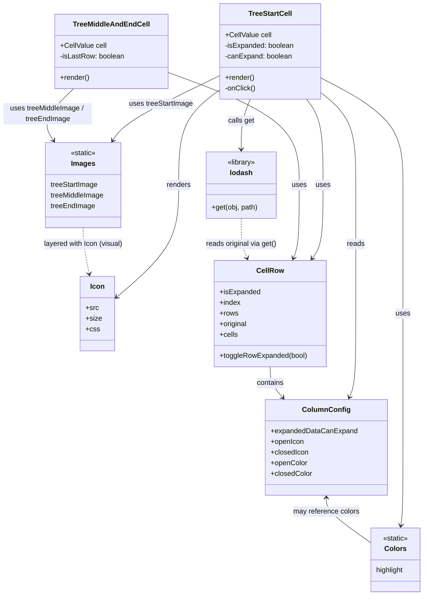

# Diagram: web/portal/src/components/organisms/base-table/Cell/TreeCells.tsx

> Auto-generated by Obscura crawlers

## Mermaid

### SVG

<svg id="container" width="961.6697998046875" xmlns="http://www.w3.org/2000/svg" class="classDiagram" height="1344" viewBox="16.9376220703125 0 961.6697998046875 1344" role="graphics-document document" aria-roledescription="class"><g><defs><marker id="container_class-aggregationStart" class="marker aggregation class" refX="18" refY="7" markerWidth="190" markerHeight="240" orient="auto"><path d="M 18,7 L9,13 L1,7 L9,1 Z"></path></marker></defs><defs><marker id="container_class-aggregationEnd" class="marker aggregation class" refX="1" refY="7" markerWidth="20" markerHeight="28" orient="auto"><path d="M 18,7 L9,13 L1,7 L9,1 Z"></path></marker></defs><defs><marker id="container_class-extensionStart" class="marker extension class" refX="18" refY="7" markerWidth="190" markerHeight="240" orient="auto"><path d="M 1,7 L18,13 V 1 Z"></path></marker></defs><defs><marker id="container_class-extensionEnd" class="marker extension class" refX="1" refY="7" markerWidth="20" markerHeight="28" orient="auto"><path d="M 1,1 V 13 L18,7 Z"></path></marker></defs><defs><marker id="container_class-compositionStart" class="marker composition class" refX="18" refY="7" markerWidth="190" markerHeight="240" orient="auto"><path d="M 18,7 L9,13 L1,7 L9,1 Z"></path></marker></defs><defs><marker id="container_class-compositionEnd" class="marker composition class" refX="1" refY="7" markerWidth="20" markerHeight="28" orient="auto"><path d="M 18,7 L9,13 L1,7 L9,1 Z"></path></marker></defs><defs><marker id="container_class-dependencyStart" class="marker dependency class" refX="6" refY="7" markerWidth="190" markerHeight="240" orient="auto"><path d="M 5,7 L9,13 L1,7 L9,1 Z"></path></marker></defs><defs><marker id="container_class-dependencyEnd" class="marker dependency class" refX="13" refY="7" markerWidth="20" markerHeight="28" orient="auto"><path d="M 18,7 L9,13 L14,7 L9,1 Z"></path></marker></defs><defs><marker id="container_class-lollipopStart" class="marker lollipop class" refX="13" refY="7" markerWidth="190" markerHeight="240" orient="auto"><circle stroke="black" fill="transparent" cx="7" cy="7" r="6"></circle></marker></defs><defs><marker id="container_class-lollipopEnd" class="marker lollipop class" refX="1" refY="7" markerWidth="190" markerHeight="240" orient="auto"><circle stroke="black" fill="transparent" cx="7" cy="7" r="6"></circle></marker></defs><g class="root"><g class="clusters"></g><g class="edgePaths"><path d="M714.056,224L720.26,232.167C726.465,240.333,738.874,256.667,745.079,289C751.283,321.333,751.283,369.667,751.283,416C751.283,462.333,751.283,506.667,747.203,534.204C743.123,561.741,734.963,572.482,730.883,577.852L726.803,583.222" id="id_TreeStartCell_CellRow_1" class="edge-thickness-normal edge-pattern-solid relation" style=";;;" data-edge="true" data-et="edge" data-id="id_TreeStartCell_CellRow_1" data-points="W3sieCI6NzE0LjA1NTkwNjY0ODA4OTEsInkiOjIyNH0seyJ4Ijo3NTEuMjgzMjAzMTI1LCJ5IjoyNzN9LHsieCI6NzUxLjI4MzIwMzEyNSwieSI6NDE4fSx7IngiOjc1MS4yODMyMDMxMjUsInkiOjU1MX0seyJ4Ijo3MjMuMTcyNzk1NTgxMjEwMiwieSI6NTg4fV0=" marker-end="url(#container_class-dependencyEnd)"></path><path d="M746.656,209.252L759.719,219.877C772.782,230.502,798.908,251.751,811.97,286.542C825.033,321.333,825.033,369.667,825.033,416C825.033,462.333,825.033,506.667,825.033,555C825.033,603.333,825.033,655.667,825.033,708C825.033,760.333,825.033,812.667,822.702,844.086C820.372,875.505,815.71,886.01,813.379,891.263L811.048,896.516" id="id_TreeStartCell_ColumnConfig_2" class="edge-thickness-normal edge-pattern-solid relation" style=";;;" data-edge="true" data-et="edge" data-id="id_TreeStartCell_ColumnConfig_2" data-points="W3sieCI6NzQ2LjY1NjI1LCJ5IjoyMDkuMjUyMjU4OTA2NjE4MzV9LHsieCI6ODI1LjAzMzIwMzEyNSwieSI6MjczfSx7IngiOjgyNS4wMzMyMDMxMjUsInkiOjQxOH0seyJ4Ijo4MjUuMDMzMjAzMTI1LCJ5Ijo1NTF9LHsieCI6ODI1LjAzMzIwMzEyNSwieSI6NzA4fSx7IngiOjgyNS4wMzMyMDMxMjUsInkiOjg2NX0seyJ4Ijo4MDguNjE0NDUzMTI1LCJ5Ijo5MDJ9XQ==" marker-end="url(#container_class-dependencyEnd)"></path><path d="M517.352,201.658L501.437,213.548C485.521,225.439,453.691,249.219,437.776,285.276C421.861,321.333,421.861,369.667,421.861,416C421.861,462.333,421.861,506.667,397.725,549.113C373.589,591.56,325.317,632.12,301.181,652.4L277.045,672.68" id="id_TreeStartCell_Icon_3" class="edge-thickness-normal edge-pattern-solid relation" style=";;;" data-edge="true" data-et="edge" data-id="id_TreeStartCell_Icon_3" data-points="W3sieCI6NTE3LjM1MTU2MjUsInkiOjIwMS42NTgxMTkwMjI2MTN9LHsieCI6NDIxLjg2MTMyODEyNSwieSI6MjczfSx7IngiOjQyMS44NjEzMjgxMjUsInkiOjQxOH0seyJ4Ijo0MjEuODYxMzI4MTI1LCJ5Ijo1NTF9LHsieCI6MjcyLjQ1MTE3MTg3NSwieSI6Njc2LjU0MDI2NDI0NzE4ODJ9XQ==" marker-end="url(#container_class-dependencyEnd)"></path><path d="M517.352,170.294L481.204,187.412C445.057,204.529,372.763,238.765,331.749,263.216C290.735,287.667,281,302.334,276.133,309.667L271.266,317.001" id="id_TreeStartCell_Images_4" class="edge-thickness-normal edge-pattern-solid relation" style=";;;" data-edge="true" data-et="edge" data-id="id_TreeStartCell_Images_4" data-points="W3sieCI6NTE3LjM1MTU2MjUsInkiOjE3MC4yOTQxNDUzNzAxNDEyOH0seyJ4IjozMDAuNDY4NzUsInkiOjI3M30seyJ4IjoyNjcuOTQ4MTY4MTAzNDQ4MjcsInkiOjMyMn1d" marker-end="url(#container_class-dependencyEnd)"></path><path d="M746.656,176.53L777.111,192.608C807.566,208.687,868.475,240.843,898.93,281.088C929.385,321.333,929.385,369.667,929.385,416C929.385,462.333,929.385,506.667,929.385,555C929.385,603.333,929.385,655.667,929.385,708C929.385,760.333,929.385,812.667,929.385,863C929.385,913.333,929.385,961.667,929.385,1010C929.385,1058.333,929.385,1106.667,928.557,1136.013C927.729,1165.358,926.074,1175.717,925.246,1180.896L924.418,1186.075" id="id_TreeStartCell_Colors_5" class="edge-thickness-normal edge-pattern-solid relation" style=";;;" data-edge="true" data-et="edge" data-id="id_TreeStartCell_Colors_5" data-points="W3sieCI6NzQ2LjY1NjI1LCJ5IjoxNzYuNTI5ODQ3MTY4MzExOX0seyJ4Ijo5MjkuMzg0NzY1NjI1LCJ5IjoyNzN9LHsieCI6OTI5LjM4NDc2NTYyNSwieSI6NDE4fSx7IngiOjkyOS4zODQ3NjU2MjUsInkiOjU1MX0seyJ4Ijo5MjkuMzg0NzY1NjI1LCJ5Ijo3MDh9LHsieCI6OTI5LjM4NDc2NTYyNSwieSI6ODY1fSx7IngiOjkyOS4zODQ3NjU2MjUsInkiOjEwMTB9LHsieCI6OTI5LjM4NDc2NTYyNSwieSI6MTE1NX0seyJ4Ijo5MjMuNDcwOTE4MTQ3OTM1OCwieSI6MTE5Mn1d" marker-end="url(#container_class-dependencyEnd)"></path><path d="M586.4,224L582.951,232.167C579.503,240.333,572.606,256.667,569.157,275.5C565.709,294.333,565.709,315.667,565.709,326.333L565.709,337" id="id_TreeStartCell_lodash_6" class="edge-thickness-normal edge-pattern-solid relation" style=";;;" data-edge="true" data-et="edge" data-id="id_TreeStartCell_lodash_6" data-points="W3sieCI6NTg2LjM5OTc1NjE3MDM4MjEsInkiOjIyNH0seyJ4Ijo1NjUuNzA4OTg0Mzc1LCJ5IjoyNzN9LHsieCI6NTY1LjcwODk4NDM3NSwieSI6MzQzfV0=" marker-end="url(#container_class-dependencyEnd)"></path><path d="M398.271,162.427L448.276,180.855C498.281,199.284,598.29,236.142,648.294,278.738C698.299,321.333,698.299,369.667,698.299,416C698.299,462.333,698.299,506.667,696.084,534.079C693.869,561.491,689.439,571.982,687.224,577.227L685.009,582.473" id="id_TreeMiddleAndEndCell_CellRow_7" class="edge-thickness-normal edge-pattern-solid relation" style=";;;" data-edge="true" data-et="edge" data-id="id_TreeMiddleAndEndCell_CellRow_7" data-points="W3sieCI6Mzk4LjI3MTQ4NDM3NSwieSI6MTYyLjQyNjU0MjMyNjg3Nzk1fSx7IngiOjY5OC4yOTg4MjgxMjUsInkiOjI3M30seyJ4Ijo2OTguMjk4ODI4MTI1LCJ5Ijo0MTh9LHsieCI6Njk4LjI5ODgyODEyNSwieSI6NTUxfSx7IngiOjY4Mi42NzUxODQxMTYyNDIsInkiOjU4OH1d" marker-end="url(#container_class-dependencyEnd)"></path><path d="M184.394,200L171.661,212.167C158.929,224.333,133.465,248.667,125.599,268.167C117.734,287.667,127.468,302.334,132.336,309.667L137.203,317.001" id="id_TreeMiddleAndEndCell_Images_8" class="edge-thickness-normal edge-pattern-solid relation" style=";;;" data-edge="true" data-et="edge" data-id="id_TreeMiddleAndEndCell_Images_8" data-points="W3sieCI6MTg0LjM5MzcyMjYzMTM2OTQzLCJ5IjoyMDB9LHsieCI6MTA4LCJ5IjoyNzN9LHsieCI6MTQwLjUyMDU4MTg5NjU1MTczLCJ5IjozMjJ9XQ==" marker-end="url(#container_class-dependencyEnd)"></path><path d="M632.004,828L632.004,834.167C632.004,840.333,632.004,852.667,636.813,864.252C641.622,875.837,651.24,886.675,656.049,892.094L660.858,897.512" id="id_CellRow_ColumnConfig_9" class="edge-thickness-normal edge-pattern-solid relation" style=";;;" data-edge="true" data-et="edge" data-id="id_CellRow_ColumnConfig_9" data-points="W3sieCI6NjMyLjAwMzkwNjI1LCJ5Ijo4Mjh9LHsieCI6NjMyLjAwMzkwNjI1LCJ5Ijo4NjV9LHsieCI6NjY0Ljg0MDkwNzg2NjM3OTMsInkiOjkwMn1d" marker-end="url(#container_class-dependencyEnd)"></path><path d="M760.689,1124L760.689,1129.167C760.689,1134.333,760.689,1144.667,776.128,1160.957C791.566,1177.248,822.442,1199.496,837.88,1210.62L853.318,1221.744" id="id_ColumnConfig_Colors_10" class="edge-thickness-normal edge-pattern-solid relation" style=";;;" data-edge="true" data-et="edge" data-id="id_ColumnConfig_Colors_10" data-points="W3sieCI6NzYwLjY4OTQ1MzEyNSwieSI6MTExOH0seyJ4Ijo3NjAuNjg5NDUzMTI1LCJ5IjoxMTU1fSx7IngiOjg1My4zMTgzNTkzNzUsInkiOjEyMjEuNzQzNzEyMjM0Njc0NH1d" marker-start="url(#container_class-dependencyStart)"></path><path d="M204.234,514L204.234,520.167C204.234,526.333,204.234,538.667,206.427,556.019C208.62,573.371,213.005,595.741,215.197,606.927L217.39,618.112" id="id_Images_Icon_11" class="edge-thickness-normal edge-pattern-dashed relation" style=";;;" data-edge="true" data-et="edge" data-id="id_Images_Icon_11" data-points="W3sieCI6MjA0LjIzNDM3NSwieSI6NTE0fSx7IngiOjIwNC4yMzQzNzUsInkiOjU1MX0seyJ4IjoyMTguNTQzOTUxNTMyNjQzMzIsInkiOjYyNH1d" marker-end="url(#container_class-dependencyEnd)"></path><path d="M565.709,493L565.709,502.667C565.709,512.333,565.709,531.667,567.924,546.579C570.139,561.491,574.569,571.982,576.784,577.227L578.999,582.473" id="id_lodash_CellRow_12" class="edge-thickness-normal edge-pattern-dashed relation" style=";;;" data-edge="true" data-et="edge" data-id="id_lodash_CellRow_12" data-points="W3sieCI6NTY1LjcwODk4NDM3NSwieSI6NDkzfSx7IngiOjU2NS43MDg5ODQzNzUsInkiOjU1MX0seyJ4Ijo1ODEuMzMyNjI4MzgzNzU4LCJ5Ijo1ODh9XQ==" marker-end="url(#container_class-dependencyEnd)"></path></g><g class="edgeLabels"><g class="edgeLabel" transform="translate(751.283203125, 418)"><g class="label" data-id="id_TreeStartCell_CellRow_1" transform="translate(-16.4921875, -12)"><foreignObject width="32.984375" height="24">

uses

</foreignObject></g></g><g class="edgeLabel" transform="translate(825.033203125, 551)"><g class="label" data-id="id_TreeStartCell_ColumnConfig_2" transform="translate(-20.0078125, -12)"><foreignObject width="40.015625" height="24">

reads

</foreignObject></g></g><g class="edgeLabel" transform="translate(421.861328125, 418)"><g class="label" data-id="id_TreeStartCell_Icon_3" transform="translate(-27.75, -12)"><foreignObject width="55.5" height="24">

renders

</foreignObject></g></g><g class="edgeLabel" transform="translate(382.33452, 234.23209)"><g class="label" data-id="id_TreeStartCell_Images_4" transform="translate(-72.46875, -12)"><foreignObject width="144.9375" height="24">

uses treeStartImage

</foreignObject></g></g><g class="edgeLabel" transform="translate(929.384765625, 708)"><g class="label" data-id="id_TreeStartCell_Colors_5" transform="translate(-16.4921875, -12)"><foreignObject width="32.984375" height="24">

uses

</foreignObject></g></g><g class="edgeLabel" transform="translate(565.708984375, 273)"><g class="label" data-id="id_TreeStartCell_lodash_6" transform="translate(-29.84375, -12)"><foreignObject width="59.6875" height="24">

calls get

</foreignObject></g></g><g class="edgeLabel" transform="translate(698.298828125, 418)"><g class="label" data-id="id_TreeMiddleAndEndCell_CellRow_7" transform="translate(-16.4921875, -12)"><foreignObject width="32.984375" height="24">

uses

</foreignObject></g></g><g class="edgeLabel" transform="translate(124.93762, 256.81482)"><g class="label" data-id="id_TreeMiddleAndEndCell_Images_8" transform="translate(-100, -24)"><foreignObject width="200" height="48">

uses treeMiddleImage / treeEndImage

</foreignObject></g></g><g class="edgeLabel" transform="translate(632.00390625, 865)"><g class="label" data-id="id_CellRow_ColumnConfig_9" transform="translate(-30.890625, -12)"><foreignObject width="61.78125" height="24">

contains

</foreignObject></g></g><g class="edgeLabel" transform="translate(760.689453125, 1155)"><g class="label" data-id="id_ColumnConfig_Colors_10" transform="translate(-75.375, -12)"><foreignObject width="150.75" height="24">

may reference colors

</foreignObject></g></g><g class="edgeLabel" transform="translate(204.234375, 551)"><g class="label" data-id="id_Images_Icon_11" transform="translate(-90.4921875, -12)"><foreignObject width="180.984375" height="24">

layered with Icon (visual)

</foreignObject></g></g><g class="edgeLabel" transform="translate(565.708984375, 551)"><g class="label" data-id="id_lodash_CellRow_12" transform="translate(-81.109375, -12)"><foreignObject width="162.21875" height="24">

reads original via get()

</foreignObject></g></g></g><g class="nodes"><g class="node default" id="classId-TreeStartCell-0" transform="translate(632.00390625, 116)"><g class="basic label-container"><path d="M-114.65234375 -108 L114.65234375 -108 L114.65234375 108 L-114.65234375 108" stroke="none" stroke-width="0" fill="#ECECFF" style=""></path><path d="M-114.65234375 -108 C-29.299036626863455 -108, 56.05427049627309 -108, 114.65234375 -108 M-114.65234375 -108 C-42.87369234975108 -108, 28.904959050497837 -108, 114.65234375 -108 M114.65234375 -108 C114.65234375 -49.36252270499385, 114.65234375 9.2749545900123, 114.65234375 108 M114.65234375 -108 C114.65234375 -44.97625781936644, 114.65234375 18.047484361267124, 114.65234375 108 M114.65234375 108 C34.991660582353774 108, -44.66902258529245 108, -114.65234375 108 M114.65234375 108 C41.714866276049435 108, -31.22261119790113 108, -114.65234375 108 M-114.65234375 108 C-114.65234375 45.3390989093345, -114.65234375 -17.321802181330995, -114.65234375 -108 M-114.65234375 108 C-114.65234375 37.10682408702921, -114.65234375 -33.78635182594158, -114.65234375 -108" stroke="#9370DB" stroke-width="1.3" fill="none" stroke-dasharray="0 0" style=""></path></g><g class="annotation-group text" transform="translate(0, -84)"></g><g class="label-group text" transform="translate(-47.7421875, -84)"><g class="label" style="font-weight: bolder" transform="translate(0,-12)"><foreignObject width="95.484375" height="24">

TreeStartCell

</foreignObject></g></g><g class="members-group text" transform="translate(-102.65234375, -36)"><g class="label" style="" transform="translate(0,-12)"><foreignObject width="103.90625" height="24">

+CellValue cell

</foreignObject></g><g class="label" style="" transform="translate(0,12)"><foreignObject width="157.5625" height="24">

-isExpanded: boolean

</foreignObject></g><g class="label" style="" transform="translate(0,36)"><foreignObject width="152.859375" height="24">

-canExpand: boolean

</foreignObject></g></g><g class="methods-group text" transform="translate(-102.65234375, 60)"><g class="label" style="" transform="translate(0,-12)"><foreignObject width="66.609375" height="24">

+render()

</foreignObject></g><g class="label" style="" transform="translate(0,12)"><foreignObject width="69.390625" height="24">

-onClick()

</foreignObject></g></g><g class="divider" style=""><path d="M-114.65234375 -60 C-57.396482248062355 -60, -0.14062074612471065 -60, 114.65234375 -60 M-114.65234375 -60 C-58.903713265677254 -60, -3.1550827813545084 -60, 114.65234375 -60" stroke="#9370DB" stroke-width="1.3" fill="none" stroke-dasharray="0 0" style=""></path></g><g class="divider" style=""><path d="M-114.65234375 36 C-49.60181758594251 36, 15.448708578114974 36, 114.65234375 36 M-114.65234375 36 C-50.642575152202355 36, 13.36719344559529 36, 114.65234375 36" stroke="#9370DB" stroke-width="1.3" fill="none" stroke-dasharray="0 0" style=""></path></g></g><g class="node default" id="classId-TreeMiddleAndEndCell-1" transform="translate(272.298828125, 116)"><g class="basic label-container"><path d="M-125.97265625 -84 L125.97265625 -84 L125.97265625 84 L-125.97265625 84" stroke="none" stroke-width="0" fill="#ECECFF" style=""></path><path d="M-125.97265625 -84 C-41.588564843027754 -84, 42.79552656394449 -84, 125.97265625 -84 M-125.97265625 -84 C-44.64440887542854 -84, 36.68383849914292 -84, 125.97265625 -84 M125.97265625 -84 C125.97265625 -26.650269113222407, 125.97265625 30.699461773555186, 125.97265625 84 M125.97265625 -84 C125.97265625 -49.950114878826646, 125.97265625 -15.900229757653292, 125.97265625 84 M125.97265625 84 C63.52532254525956 84, 1.0779888405191258 84, -125.97265625 84 M125.97265625 84 C75.2509354370346 84, 24.529214624069198 84, -125.97265625 84 M-125.97265625 84 C-125.97265625 22.524313819285922, -125.97265625 -38.951372361428156, -125.97265625 -84 M-125.97265625 84 C-125.97265625 30.67963842669584, -125.97265625 -22.640723146608323, -125.97265625 -84" stroke="#9370DB" stroke-width="1.3" fill="none" stroke-dasharray="0 0" style=""></path></g><g class="annotation-group text" transform="translate(0, -60)"></g><g class="label-group text" transform="translate(-82.0703125, -60)"><g class="label" style="font-weight: bolder" transform="translate(0,-12)"><foreignObject width="164.140625" height="24">

TreeMiddleAndEndCell

</foreignObject></g></g><g class="members-group text" transform="translate(-113.97265625, -12)"><g class="label" style="" transform="translate(0,-12)"><foreignObject width="103.90625" height="24">

+CellValue cell

</foreignObject></g><g class="label" style="" transform="translate(0,12)"><foreignObject width="145.875" height="24">

-isLastRow: boolean

</foreignObject></g></g><g class="methods-group text" transform="translate(-113.97265625, 60)"><g class="label" style="" transform="translate(0,-12)"><foreignObject width="66.609375" height="24">

+render()

</foreignObject></g></g><g class="divider" style=""><path d="M-125.97265625 -36 C-31.128362754199927 -36, 63.71593074160015 -36, 125.97265625 -36 M-125.97265625 -36 C-59.92614481449169 -36, 6.120366621016615 -36, 125.97265625 -36" stroke="#9370DB" stroke-width="1.3" fill="none" stroke-dasharray="0 0" style=""></path></g><g class="divider" style=""><path d="M-125.97265625 36 C-49.66332878092595 36, 26.645998688148097 36, 125.97265625 36 M-125.97265625 36 C-58.03953643307396 36, 9.893583383852075 36, 125.97265625 36" stroke="#9370DB" stroke-width="1.3" fill="none" stroke-dasharray="0 0" style=""></path></g></g><g class="node default" id="classId-Icon-2" transform="translate(235.009765625, 708)"><g class="basic label-container"><path d="M-37.44140625 -84 L37.44140625 -84 L37.44140625 84 L-37.44140625 84" stroke="none" stroke-width="0" fill="#ECECFF" style=""></path><path d="M-37.44140625 -84 C-12.197314829118344 -84, 13.046776591763312 -84, 37.44140625 -84 M-37.44140625 -84 C-16.024671251112473 -84, 5.392063747775055 -84, 37.44140625 -84 M37.44140625 -84 C37.44140625 -23.91635373506398, 37.44140625 36.16729252987204, 37.44140625 84 M37.44140625 -84 C37.44140625 -33.64700010526168, 37.44140625 16.705999789476635, 37.44140625 84 M37.44140625 84 C17.241547930844813 84, -2.958310388310373 84, -37.44140625 84 M37.44140625 84 C10.848263944315416 84, -15.744878361369167 84, -37.44140625 84 M-37.44140625 84 C-37.44140625 40.39843014429995, -37.44140625 -3.203139711400098, -37.44140625 -84 M-37.44140625 84 C-37.44140625 40.49310232592621, -37.44140625 -3.013795348147582, -37.44140625 -84" stroke="#9370DB" stroke-width="1.3" fill="none" stroke-dasharray="0 0" style=""></path></g><g class="annotation-group text" transform="translate(0, -60)"></g><g class="label-group text" transform="translate(-15.3046875, -60)"><g class="label" style="font-weight: bolder" transform="translate(0,-12)"><foreignObject width="30.609375" height="24">

Icon

</foreignObject></g></g><g class="members-group text" transform="translate(-25.44140625, -12)"><g class="label" style="" transform="translate(0,-12)"><foreignObject width="28.8125" height="24">

+src

</foreignObject></g><g class="label" style="" transform="translate(0,12)"><foreignObject width="35.578125" height="24">

+size

</foreignObject></g><g class="label" style="" transform="translate(0,36)"><foreignObject width="30.421875" height="24">

+css

</foreignObject></g></g><g class="methods-group text" transform="translate(-25.44140625, 84)"></g><g class="divider" style=""><path d="M-37.44140625 -36 C-19.350158923778817 -36, -1.2589115975576348 -36, 37.44140625 -36 M-37.44140625 -36 C-9.60981896164034 -36, 18.22176832671932 -36, 37.44140625 -36" stroke="#9370DB" stroke-width="1.3" fill="none" stroke-dasharray="0 0" style=""></path></g><g class="divider" style=""><path d="M-37.44140625 60 C-12.651185852300113 60, 12.139034545399774 60, 37.44140625 60 M-37.44140625 60 C-9.314244815785763 60, 18.812916618428474 60, 37.44140625 60" stroke="#9370DB" stroke-width="1.3" fill="none" stroke-dasharray="0 0" style=""></path></g></g><g class="node default" id="classId-Images-3" transform="translate(204.234375, 418)"><g class="basic label-container"><path d="M-87.56640625 -96 L87.56640625 -96 L87.56640625 96 L-87.56640625 96" stroke="none" stroke-width="0" fill="#ECECFF" style=""></path><path d="M-87.56640625 -96 C-45.20990273462848 -96, -2.853399219256957 -96, 87.56640625 -96 M-87.56640625 -96 C-48.40599415158093 -96, -9.245582053161854 -96, 87.56640625 -96 M87.56640625 -96 C87.56640625 -38.1922506387793, 87.56640625 19.6154987224414, 87.56640625 96 M87.56640625 -96 C87.56640625 -26.367466444292305, 87.56640625 43.26506711141539, 87.56640625 96 M87.56640625 96 C50.616304557900655 96, 13.66620286580131 96, -87.56640625 96 M87.56640625 96 C46.254711027834304 96, 4.943015805668608 96, -87.56640625 96 M-87.56640625 96 C-87.56640625 46.15884394777348, -87.56640625 -3.6823121044530467, -87.56640625 -96 M-87.56640625 96 C-87.56640625 36.32224381353463, -87.56640625 -23.355512372930747, -87.56640625 -96" stroke="#9370DB" stroke-width="1.3" fill="none" stroke-dasharray="0 0" style=""></path></g><g class="annotation-group text" transform="translate(-29.0234375, -72)"><g class="label" style="" transform="translate(0,-12)"><foreignObject width="58.046875" height="24">

«static»

</foreignObject></g></g><g class="label-group text" transform="translate(-25.921875, -48)"><g class="label" style="font-weight: bolder" transform="translate(0,-12)"><foreignObject width="51.84375" height="24">

Images

</foreignObject></g></g><g class="members-group text" transform="translate(-75.56640625, 0)"><g class="label" style="" transform="translate(0,-12)"><foreignObject width="107.71875" height="24">

treeStartImage

</foreignObject></g><g class="label" style="" transform="translate(0,12)"><foreignObject width="122.109375" height="24">

treeMiddleImage

</foreignObject></g><g class="label" style="" transform="translate(0,36)"><foreignObject width="100.03125" height="24">

treeEndImage

</foreignObject></g></g><g class="methods-group text" transform="translate(-75.56640625, 96)"></g><g class="divider" style=""><path d="M-87.56640625 -24 C-47.858891529287746 -24, -8.151376808575492 -24, 87.56640625 -24 M-87.56640625 -24 C-42.63266330501179 -24, 2.3010796399764217 -24, 87.56640625 -24" stroke="#9370DB" stroke-width="1.3" fill="none" stroke-dasharray="0 0" style=""></path></g><g class="divider" style=""><path d="M-87.56640625 72 C-27.2947037000188 72, 32.9769988499624 72, 87.56640625 72 M-87.56640625 72 C-26.957131663359704 72, 33.65214292328059 72, 87.56640625 72" stroke="#9370DB" stroke-width="1.3" fill="none" stroke-dasharray="0 0" style=""></path></g></g><g class="node default" id="classId-Colors-4" transform="translate(911.962890625, 1264)"><g class="basic label-container"><path d="M-58.64453125 -72 L58.64453125 -72 L58.64453125 72 L-58.64453125 72" stroke="none" stroke-width="0" fill="#ECECFF" style=""></path><path d="M-58.64453125 -72 C-33.79554593410316 -72, -8.946560618206327 -72, 58.64453125 -72 M-58.64453125 -72 C-19.214890358861993 -72, 20.214750532276014 -72, 58.64453125 -72 M58.64453125 -72 C58.64453125 -21.15356922414842, 58.64453125 29.69286155170316, 58.64453125 72 M58.64453125 -72 C58.64453125 -26.693018282901647, 58.64453125 18.613963434196705, 58.64453125 72 M58.64453125 72 C26.548608465204957 72, -5.547314319590086 72, -58.64453125 72 M58.64453125 72 C19.485189203807728 72, -19.674152842384544 72, -58.64453125 72 M-58.64453125 72 C-58.64453125 27.07408468381771, -58.64453125 -17.85183063236458, -58.64453125 -72 M-58.64453125 72 C-58.64453125 30.22518182419509, -58.64453125 -11.54963635160982, -58.64453125 -72" stroke="#9370DB" stroke-width="1.3" fill="none" stroke-dasharray="0 0" style=""></path></g><g class="annotation-group text" transform="translate(-29.0234375, -48)"><g class="label" style="" transform="translate(0,-12)"><foreignObject width="58.046875" height="24">

«static»

</foreignObject></g></g><g class="label-group text" transform="translate(-23.1015625, -24)"><g class="label" style="font-weight: bolder" transform="translate(0,-12)"><foreignObject width="46.203125" height="24">

Colors

</foreignObject></g></g><g class="members-group text" transform="translate(-46.64453125, 24)"><g class="label" style="" transform="translate(0,-12)"><foreignObject width="64.265625" height="24">

highlight

</foreignObject></g></g><g class="methods-group text" transform="translate(-46.64453125, 72)"></g><g class="divider" style=""><path d="M-58.64453125 0 C-13.22791965196 0, 32.18869194608 0, 58.64453125 0 M-58.64453125 0 C-24.60849974523056 0, 9.42753175953888 0, 58.64453125 0" stroke="#9370DB" stroke-width="1.3" fill="none" stroke-dasharray="0 0" style=""></path></g><g class="divider" style=""><path d="M-58.64453125 48 C-23.30626079766681 48, 12.032009654666382 48, 58.64453125 48 M-58.64453125 48 C-33.97346147690943 48, -9.302391703818856 48, 58.64453125 48" stroke="#9370DB" stroke-width="1.3" fill="none" stroke-dasharray="0 0" style=""></path></g></g><g class="node default" id="classId-lodash-5" transform="translate(565.708984375, 418)"><g class="basic label-container"><path d="M-81.09765625 -75 L81.09765625 -75 L81.09765625 75 L-81.09765625 75" stroke="none" stroke-width="0" fill="#ECECFF" style=""></path><path d="M-81.09765625 -75 C-32.89487084551902 -75, 15.307914558961954 -75, 81.09765625 -75 M-81.09765625 -75 C-46.55526845635279 -75, -12.012880662705584 -75, 81.09765625 -75 M81.09765625 -75 C81.09765625 -19.916928304957693, 81.09765625 35.16614339008461, 81.09765625 75 M81.09765625 -75 C81.09765625 -16.15517470175911, 81.09765625 42.68965059648178, 81.09765625 75 M81.09765625 75 C42.1677944995738 75, 3.2379327491476033 75, -81.09765625 75 M81.09765625 75 C40.439020290324166 75, -0.21961566935166843 75, -81.09765625 75 M-81.09765625 75 C-81.09765625 42.89366245870448, -81.09765625 10.787324917408966, -81.09765625 -75 M-81.09765625 75 C-81.09765625 32.431008555677515, -81.09765625 -10.13798288864497, -81.09765625 -75" stroke="#9370DB" stroke-width="1.3" fill="none" stroke-dasharray="0 0" style=""></path></g><g class="annotation-group text" transform="translate(-32.6640625, -51)"><g class="label" style="" transform="translate(0,-12)"><foreignObject width="65.328125" height="24">

«library»

</foreignObject></g></g><g class="label-group text" transform="translate(-24.59375, -27)"><g class="label" style="font-weight: bolder" transform="translate(0,-12)"><foreignObject width="49.1875" height="24">

lodash

</foreignObject></g></g><g class="members-group text" transform="translate(-69.09765625, 21)"></g><g class="methods-group text" transform="translate(-69.09765625, 51)"><g class="label" style="" transform="translate(0,-12)"><foreignObject width="105.53125" height="24">

+get(obj, path)

</foreignObject></g></g><g class="divider" style=""><path d="M-81.09765625 -3 C-25.33916849687433 -3, 30.41931925625134 -3, 81.09765625 -3 M-81.09765625 -3 C-17.943794834988005 -3, 45.21006658002399 -3, 81.09765625 -3" stroke="#9370DB" stroke-width="1.3" fill="none" stroke-dasharray="0 0" style=""></path></g><g class="divider" style=""><path d="M-81.09765625 21 C-33.729288291711164 21, 13.639079666577672 21, 81.09765625 21 M-81.09765625 21 C-38.179385136479794 21, 4.738885977040411 21, 81.09765625 21" stroke="#9370DB" stroke-width="1.3" fill="none" stroke-dasharray="0 0" style=""></path></g></g><g class="node default" id="classId-CellRow-6" transform="translate(632.00390625, 708)"><g class="basic label-container"><path d="M-125.4765625 -120 L125.4765625 -120 L125.4765625 120 L-125.4765625 120" stroke="none" stroke-width="0" fill="#ECECFF" style=""></path><path d="M-125.4765625 -120 C-52.03858290159722 -120, 21.399396696805553 -120, 125.4765625 -120 M-125.4765625 -120 C-54.57387486702636 -120, 16.328812765947276 -120, 125.4765625 -120 M125.4765625 -120 C125.4765625 -24.6584232267587, 125.4765625 70.6831535464826, 125.4765625 120 M125.4765625 -120 C125.4765625 -39.93566297589801, 125.4765625 40.128674048203976, 125.4765625 120 M125.4765625 120 C58.68915199863821 120, -8.098258502723581 120, -125.4765625 120 M125.4765625 120 C37.975512678968855 120, -49.52553714206229 120, -125.4765625 120 M-125.4765625 120 C-125.4765625 25.505157182818394, -125.4765625 -68.98968563436321, -125.4765625 -120 M-125.4765625 120 C-125.4765625 55.95893912455696, -125.4765625 -8.082121750886074, -125.4765625 -120" stroke="#9370DB" stroke-width="1.3" fill="none" stroke-dasharray="0 0" style=""></path></g><g class="annotation-group text" transform="translate(0, -96)"></g><g class="label-group text" transform="translate(-29.09375, -96)"><g class="label" style="font-weight: bolder" transform="translate(0,-12)"><foreignObject width="58.1875" height="24">

CellRow

</foreignObject></g></g><g class="members-group text" transform="translate(-113.4765625, -48)"><g class="label" style="" transform="translate(0,-12)"><foreignObject width="91.578125" height="24">

+isExpanded

</foreignObject></g><g class="label" style="" transform="translate(0,12)"><foreignObject width="47.78125" height="24">

+index

</foreignObject></g><g class="label" style="" transform="translate(0,36)"><foreignObject width="41.96875" height="24">

+rows

</foreignObject></g><g class="label" style="" transform="translate(0,60)"><foreignObject width="63.46875" height="24">

+original

</foreignObject></g><g class="label" style="" transform="translate(0,84)"><foreignObject width="40.890625" height="24">

+cells

</foreignObject></g></g><g class="methods-group text" transform="translate(-113.4765625, 96)"><g class="label" style="" transform="translate(0,-12)"><foreignObject width="197.859375" height="24">

+toggleRowExpanded(bool)

</foreignObject></g></g><g class="divider" style=""><path d="M-125.4765625 -72 C-53.698814085441256 -72, 18.078934329117487 -72, 125.4765625 -72 M-125.4765625 -72 C-49.05427001480305 -72, 27.368022470393896 -72, 125.4765625 -72" stroke="#9370DB" stroke-width="1.3" fill="none" stroke-dasharray="0 0" style=""></path></g><g class="divider" style=""><path d="M-125.4765625 72 C-66.97001821592833 72, -8.463473931856669 72, 125.4765625 72 M-125.4765625 72 C-68.39262739832552 72, -11.308692296651031 72, 125.4765625 72" stroke="#9370DB" stroke-width="1.3" fill="none" stroke-dasharray="0 0" style=""></path></g></g><g class="node default" id="classId-ColumnConfig-7" transform="translate(760.689453125, 1010)"><g class="basic label-container"><path d="M-133.6953125 -108 L133.6953125 -108 L133.6953125 108 L-133.6953125 108" stroke="none" stroke-width="0" fill="#ECECFF" style=""></path><path d="M-133.6953125 -108 C-55.66784589803137 -108, 22.359620703937253 -108, 133.6953125 -108 M-133.6953125 -108 C-51.22642478254231 -108, 31.24246293491538 -108, 133.6953125 -108 M133.6953125 -108 C133.6953125 -31.79985064226456, 133.6953125 44.40029871547088, 133.6953125 108 M133.6953125 -108 C133.6953125 -48.572587628131714, 133.6953125 10.854824743736572, 133.6953125 108 M133.6953125 108 C40.49475459278371 108, -52.705803314432586 108, -133.6953125 108 M133.6953125 108 C78.36666359863126 108, 23.038014697262525 108, -133.6953125 108 M-133.6953125 108 C-133.6953125 60.031548087353556, -133.6953125 12.063096174707113, -133.6953125 -108 M-133.6953125 108 C-133.6953125 31.881483457505723, -133.6953125 -44.23703308498855, -133.6953125 -108" stroke="#9370DB" stroke-width="1.3" fill="none" stroke-dasharray="0 0" style=""></path></g><g class="annotation-group text" transform="translate(0, -84)"></g><g class="label-group text" transform="translate(-50.375, -84)"><g class="label" style="font-weight: bolder" transform="translate(0,-12)"><foreignObject width="100.75" height="24">

ColumnConfig

</foreignObject></g></g><g class="members-group text" transform="translate(-121.6953125, -36)"><g class="label" style="" transform="translate(0,-12)"><foreignObject width="193.015625" height="24">

+expandedDataCanExpand

</foreignObject></g><g class="label" style="" transform="translate(0,12)"><foreignObject width="75.703125" height="24">

+openIcon

</foreignObject></g><g class="label" style="" transform="translate(0,36)"><foreignObject width="86.125" height="24">

+closedIcon

</foreignObject></g><g class="label" style="" transform="translate(0,60)"><foreignObject width="83.046875" height="24">

+openColor

</foreignObject></g><g class="label" style="" transform="translate(0,84)"><foreignObject width="93.46875" height="24">

+closedColor

</foreignObject></g></g><g class="methods-group text" transform="translate(-121.6953125, 108)"></g><g class="divider" style=""><path d="M-133.6953125 -60 C-28.746410729511823 -60, 76.20249104097635 -60, 133.6953125 -60 M-133.6953125 -60 C-29.304454199152616 -60, 75.08640410169477 -60, 133.6953125 -60" stroke="#9370DB" stroke-width="1.3" fill="none" stroke-dasharray="0 0" style=""></path></g><g class="divider" style=""><path d="M-133.6953125 84 C-27.27984205448641 84, 79.13562839102718 84, 133.6953125 84 M-133.6953125 84 C-53.796821392365004 84, 26.101669715269992 84, 133.6953125 84" stroke="#9370DB" stroke-width="1.3" fill="none" stroke-dasharray="0 0" style=""></path></g></g></g></g></g></svg>
