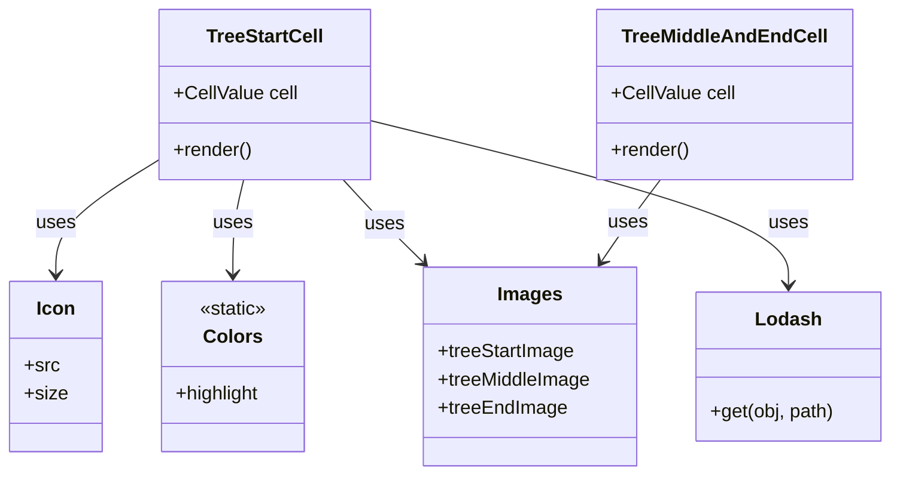
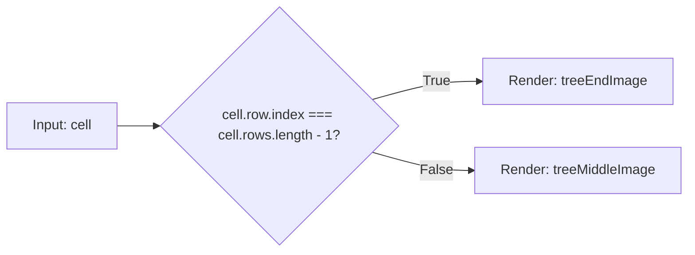

# Diagram: web/portal/src/components/organisms/base-table/Cell/TreeFolderCells.tsx


> Auto-generated by Obscura crawlers

## Diagram 1



### SVG

<svg id="container" width="748.384765625" xmlns="http://www.w3.org/2000/svg" class="classDiagram" height="402" viewBox="0 0 748.384765625 402" role="graphics-document document" aria-roledescription="class"><style>#container{font-family:"trebuchet ms",verdana,arial,sans-serif;font-size:16px;fill:#333;}@keyframes edge-animation-frame{from{stroke-dashoffset:0;}}@keyframes dash{to{stroke-dashoffset:0;}}#container .edge-animation-slow{stroke-dasharray:9,5!important;stroke-dashoffset:900;animation:dash 50s linear infinite;stroke-linecap:round;}#container .edge-animation-fast{stroke-dasharray:9,5!important;stroke-dashoffset:900;animation:dash 20s linear infinite;stroke-linecap:round;}#container .error-icon{fill:#552222;}#container .error-text{fill:#552222;stroke:#552222;}#container .edge-thickness-normal{stroke-width:1px;}#container .edge-thickness-thick{stroke-width:3.5px;}#container .edge-pattern-solid{stroke-dasharray:0;}#container .edge-thickness-invisible{stroke-width:0;fill:none;}#container .edge-pattern-dashed{stroke-dasharray:3;}#container .edge-pattern-dotted{stroke-dasharray:2;}#container .marker{fill:#333333;stroke:#333333;}#container .marker.cross{stroke:#333333;}#container svg{font-family:"trebuchet ms",verdana,arial,sans-serif;font-size:16px;}#container p{margin:0;}#container g.classGroup text{fill:#9370DB;stroke:none;font-family:"trebuchet ms",verdana,arial,sans-serif;font-size:10px;}#container g.classGroup text .title{font-weight:bolder;}#container .nodeLabel,#container .edgeLabel{color:#131300;}#container .edgeLabel .label rect{fill:#ECECFF;}#container .label text{fill:#131300;}#container .labelBkg{background:#ECECFF;}#container .edgeLabel .label span{background:#ECECFF;}#container .classTitle{font-weight:bolder;}#container .node rect,#container .node circle,#container .node ellipse,#container .node polygon,#container .node path{fill:#ECECFF;stroke:#9370DB;stroke-width:1px;}#container .divider{stroke:#9370DB;stroke-width:1;}#container g.clickable{cursor:pointer;}#container g.classGroup rect{fill:#ECECFF;stroke:#9370DB;}#container g.classGroup line{stroke:#9370DB;stroke-width:1;}#container .classLabel .box{stroke:none;stroke-width:0;fill:#ECECFF;opacity:0.5;}#container .classLabel .label{fill:#9370DB;font-size:10px;}#container .relation{stroke:#333333;stroke-width:1;fill:none;}#container .dashed-line{stroke-dasharray:3;}#container .dotted-line{stroke-dasharray:1 2;}#container #compositionStart,#container .composition{fill:#333333!important;stroke:#333333!important;stroke-width:1;}#container #compositionEnd,#container .composition{fill:#333333!important;stroke:#333333!important;stroke-width:1;}#container #dependencyStart,#container .dependency{fill:#333333!important;stroke:#333333!important;stroke-width:1;}#container #dependencyStart,#container .dependency{fill:#333333!important;stroke:#333333!important;stroke-width:1;}#container #extensionStart,#container .extension{fill:transparent!important;stroke:#333333!important;stroke-width:1;}#container #extensionEnd,#container .extension{fill:transparent!important;stroke:#333333!important;stroke-width:1;}#container #aggregationStart,#container .aggregation{fill:transparent!important;stroke:#333333!important;stroke-width:1;}#container #aggregationEnd,#container .aggregation{fill:transparent!important;stroke:#333333!important;stroke-width:1;}#container #lollipopStart,#container .lollipop{fill:#ECECFF!important;stroke:#333333!important;stroke-width:1;}#container #lollipopEnd,#container .lollipop{fill:#ECECFF!important;stroke:#333333!important;stroke-width:1;}#container .edgeTerminals{font-size:11px;line-height:initial;}#container .classTitleText{text-anchor:middle;font-size:18px;fill:#333;}#container .label-icon{display:inline-block;height:1em;overflow:visible;vertical-align:-0.125em;}#container .node .label-icon path{fill:currentColor;stroke:revert;stroke-width:revert;}#container :root{--mermaid-font-family:"trebuchet ms",verdana,arial,sans-serif;}</style><g><defs><marker id="container_class-aggregationStart" class="marker aggregation class" refX="18" refY="7" markerWidth="190" markerHeight="240" orient="auto"><path d="M 18,7 L9,13 L1,7 L9,1 Z"></path></marker></defs><defs><marker id="container_class-aggregationEnd" class="marker aggregation class" refX="1" refY="7" markerWidth="20" markerHeight="28" orient="auto"><path d="M 18,7 L9,13 L1,7 L9,1 Z"></path></marker></defs><defs><marker id="container_class-extensionStart" class="marker extension class" refX="18" refY="7" markerWidth="190" markerHeight="240" orient="auto"><path d="M 1,7 L18,13 V 1 Z"></path></marker></defs><defs><marker id="container_class-extensionEnd" class="marker extension class" refX="1" refY="7" markerWidth="20" markerHeight="28" orient="auto"><path d="M 1,1 V 13 L18,7 Z"></path></marker></defs><defs><marker id="container_class-compositionStart" class="marker composition class" refX="18" refY="7" markerWidth="190" markerHeight="240" orient="auto"><path d="M 18,7 L9,13 L1,7 L9,1 Z"></path></marker></defs><defs><marker id="container_class-compositionEnd" class="marker composition class" refX="1" refY="7" markerWidth="20" markerHeight="28" orient="auto"><path d="M 18,7 L9,13 L1,7 L9,1 Z"></path></marker></defs><defs><marker id="container_class-dependencyStart" class="marker dependency class" refX="6" refY="7" markerWidth="190" markerHeight="240" orient="auto"><path d="M 5,7 L9,13 L1,7 L9,1 Z"></path></marker></defs><defs><marker id="container_class-dependencyEnd" class="marker dependency class" refX="13" refY="7" markerWidth="20" markerHeight="28" orient="auto"><path d="M 18,7 L9,13 L14,7 L9,1 Z"></path></marker></defs><defs><marker id="container_class-lollipopStart" class="marker lollipop class" refX="13" refY="7" markerWidth="190" markerHeight="240" orient="auto"><circle stroke="black" fill="transparent" cx="7" cy="7" r="6"></circle></marker></defs><defs><marker id="container_class-lollipopEnd" class="marker lollipop class" refX="1" refY="7" markerWidth="190" markerHeight="240" orient="auto"><circle stroke="black" fill="transparent" cx="7" cy="7" r="6"></circle></marker></defs><g class="root"><g class="clusters"></g><g class="edgePaths"><path d="M134.188,134.215L119.396,143.346C104.605,152.477,75.023,170.738,60.232,187.036C45.441,203.333,45.441,217.667,45.441,224.833L45.441,232" id="id_TreeStartCell_Icon_1" class="edge-thickness-normal edge-pattern-solid relation" style=";;;" data-edge="true" data-et="edge" data-id="id_TreeStartCell_Icon_1" data-points="W3sieCI6MTM0LjE4NzUsInkiOjEzNC4yMTU0NTUwNjgzNTk4fSx7IngiOjQ1LjQ0MTQwNjI1LCJ5IjoxODl9LHsieCI6NDUuNDQxNDA2MjUsInkiOjIzOH1d" marker-end="url(#container_class-dependencyEnd)"></path><path d="M204.512,152L203.013,158.167C201.515,164.333,198.517,176.667,197.018,190C195.52,203.333,195.52,217.667,195.52,224.833L195.52,232" id="id_TreeStartCell_Colors_2" class="edge-thickness-normal edge-pattern-solid relation" style=";;;" data-edge="true" data-et="edge" data-id="id_TreeStartCell_Colors_2" data-points="W3sieCI6MjA0LjUxMjI5MjE0NDQ5NTQsInkiOjE1Mn0seyJ4IjoxOTUuNTE5NTMxMjUsInkiOjE4OX0seyJ4IjoxOTUuNTE5NTMxMjUsInkiOjIzOH1d" marker-end="url(#container_class-dependencyEnd)"></path><path d="M288.927,152L294.658,158.167C300.39,164.333,311.852,176.667,323.062,188.294C334.273,199.921,345.231,210.843,350.71,216.304L356.189,221.764" id="id_TreeStartCell_Images_3" class="edge-thickness-normal edge-pattern-solid relation" style=";;;" data-edge="true" data-et="edge" data-id="id_TreeStartCell_Images_3" data-points="W3sieCI6Mjg4LjkyNzI4NjQxMDU1MDQ0LCJ5IjoxNTJ9LHsieCI6MzIzLjMxNDQ1MzEyNSwieSI6MTg5fSx7IngiOjM2MC40Mzg2NzgzMzE2MTE2LCJ5IjoyMjZ9XQ==" marker-end="url(#container_class-dependencyEnd)"></path><path d="M309.836,101.731L368.619,116.275C427.403,130.82,544.97,159.91,603.754,183.122C662.537,206.333,662.537,223.667,662.537,232.333L662.537,241" id="id_TreeStartCell_Lodash_4" class="edge-thickness-normal edge-pattern-solid relation" style=";;;" data-edge="true" data-et="edge" data-id="id_TreeStartCell_Lodash_4" data-points="W3sieCI6MzA5LjgzNTkzNzUsInkiOjEwMS43MzA1MDY0NTMxNDMyMn0seyJ4Ijo2NjIuNTM3MTA5Mzc1LCJ5IjoxODl9LHsieCI6NjYyLjUzNzEwOTM3NSwieSI6MjQ3fV0=" marker-end="url(#container_class-dependencyEnd)"></path><path d="M555.113,152L550.45,158.167C545.787,164.333,536.462,176.667,528.162,188.174C519.862,199.68,512.587,210.361,508.95,215.701L505.313,221.041" id="id_TreeMiddleAndEndCell_Images_5" class="edge-thickness-normal edge-pattern-solid relation" style=";;;" data-edge="true" data-et="edge" data-id="id_TreeMiddleAndEndCell_Images_5" data-points="W3sieCI6NTU1LjExMjc5NzQ0ODM5NDUsInkiOjE1Mn0seyJ4Ijo1MjcuMTM2NzE4NzUsInkiOjE4OX0seyJ4Ijo1MDEuOTM1MTI3MTk1MjQ3OTYsInkiOjIyNn1d" marker-end="url(#container_class-dependencyEnd)"></path></g><g class="edgeLabels"><g class="edgeLabel" transform="translate(45.44140625, 189)"><g class="label" data-id="id_TreeStartCell_Icon_1" transform="translate(-16.4921875, -12)"><foreignObject width="32.984375" height="24"><div xmlns="http://www.w3.org/1999/xhtml" class="labelBkg" style="display: table-cell; white-space: nowrap; line-height: 1.5; max-width: 200px; text-align: center;"><span class="edgeLabel"><p>uses</p></span></div></foreignObject></g></g><g class="edgeLabel" transform="translate(195.51953125, 189)"><g class="label" data-id="id_TreeStartCell_Colors_2" transform="translate(-16.4921875, -12)"><foreignObject width="32.984375" height="24"><div xmlns="http://www.w3.org/1999/xhtml" class="labelBkg" style="display: table-cell; white-space: nowrap; line-height: 1.5; max-width: 200px; text-align: center;"><span class="edgeLabel"><p>uses</p></span></div></foreignObject></g></g><g class="edgeLabel" transform="translate(323.314453125, 189)"><g class="label" data-id="id_TreeStartCell_Images_3" transform="translate(-16.4921875, -12)"><foreignObject width="32.984375" height="24"><div xmlns="http://www.w3.org/1999/xhtml" class="labelBkg" style="display: table-cell; white-space: nowrap; line-height: 1.5; max-width: 200px; text-align: center;"><span class="edgeLabel"><p>uses</p></span></div></foreignObject></g></g><g class="edgeLabel" transform="translate(662.537109375, 189)"><g class="label" data-id="id_TreeStartCell_Lodash_4" transform="translate(-16.4921875, -12)"><foreignObject width="32.984375" height="24"><div xmlns="http://www.w3.org/1999/xhtml" class="labelBkg" style="display: table-cell; white-space: nowrap; line-height: 1.5; max-width: 200px; text-align: center;"><span class="edgeLabel"><p>uses</p></span></div></foreignObject></g></g><g class="edgeLabel" transform="translate(527.62482, 188.35446)"><g class="label" data-id="id_TreeMiddleAndEndCell_Images_5" transform="translate(-16.4921875, -12)"><foreignObject width="32.984375" height="24"><div xmlns="http://www.w3.org/1999/xhtml" class="labelBkg" style="display: table-cell; white-space: nowrap; line-height: 1.5; max-width: 200px; text-align: center;"><span class="edgeLabel"><p>uses</p></span></div></foreignObject></g></g></g><g class="nodes"><g class="node default" id="classId-TreeStartCell-0" transform="translate(222.01171875, 80)"><g class="basic label-container"><path d="M-87.82421875 -72 L87.82421875 -72 L87.82421875 72 L-87.82421875 72" stroke="none" stroke-width="0" fill="#ECECFF" style=""></path><path d="M-87.82421875 -72 C-51.406557000594695 -72, -14.98889525118939 -72, 87.82421875 -72 M-87.82421875 -72 C-24.48561763006723 -72, 38.85298348986554 -72, 87.82421875 -72 M87.82421875 -72 C87.82421875 -24.86380876689359, 87.82421875 22.272382466212818, 87.82421875 72 M87.82421875 -72 C87.82421875 -22.873600151954577, 87.82421875 26.252799696090847, 87.82421875 72 M87.82421875 72 C43.44141207480687 72, -0.9413946003862605 72, -87.82421875 72 M87.82421875 72 C51.94916259989779 72, 16.07410644979558 72, -87.82421875 72 M-87.82421875 72 C-87.82421875 23.68982028228079, -87.82421875 -24.620359435438417, -87.82421875 -72 M-87.82421875 72 C-87.82421875 33.87906212725596, -87.82421875 -4.241875745488073, -87.82421875 -72" stroke="#9370DB" stroke-width="1.3" fill="none" stroke-dasharray="0 0" style=""></path></g><g class="annotation-group text" transform="translate(0, -48)"></g><g class="label-group text" transform="translate(-47.7421875, -48)"><g class="label" style="font-weight: bolder" transform="translate(0,-12)"><foreignObject width="95.484375" height="24"><div xmlns="http://www.w3.org/1999/xhtml" style="display: table-cell; white-space: nowrap; line-height: 1.5; max-width: 143px; text-align: center;"><span class="nodeLabel markdown-node-label" style=""><p>TreeStartCell</p></span></div></foreignObject></g></g><g class="members-group text" transform="translate(-75.82421875, 0)"><g class="label" style="" transform="translate(0,-12)"><foreignObject width="103.90625" height="24"><div xmlns="http://www.w3.org/1999/xhtml" style="display: table-cell; white-space: nowrap; line-height: 1.5; max-width: 162px; text-align: center;"><span class="nodeLabel markdown-node-label" style=""><p>+CellValue cell</p></span></div></foreignObject></g></g><g class="methods-group text" transform="translate(-75.82421875, 48)"><g class="label" style="" transform="translate(0,-12)"><foreignObject width="66.609375" height="24"><div xmlns="http://www.w3.org/1999/xhtml" style="display: table-cell; white-space: nowrap; line-height: 1.5; max-width: 124px; text-align: center;"><span class="nodeLabel markdown-node-label" style=""><p>+render()</p></span></div></foreignObject></g></g><g class="divider" style=""><path d="M-87.82421875 -24 C-49.74153463308694 -24, -11.658850516173885 -24, 87.82421875 -24 M-87.82421875 -24 C-39.56353516326664 -24, 8.697148423466714 -24, 87.82421875 -24" stroke="#9370DB" stroke-width="1.3" fill="none" stroke-dasharray="0 0" style=""></path></g><g class="divider" style=""><path d="M-87.82421875 24 C-45.91906293170894 24, -4.013907113417886 24, 87.82421875 24 M-87.82421875 24 C-27.708129364312875 24, 32.40796002137425 24, 87.82421875 24" stroke="#9370DB" stroke-width="1.3" fill="none" stroke-dasharray="0 0" style=""></path></g></g><g class="node default" id="classId-TreeMiddleAndEndCell-1" transform="translate(609.552734375, 80)"><g class="basic label-container"><path d="M-104.98828125 -72 L104.98828125 -72 L104.98828125 72 L-104.98828125 72" stroke="none" stroke-width="0" fill="#ECECFF" style=""></path><path d="M-104.98828125 -72 C-49.43476751321408 -72, 6.118746223571847 -72, 104.98828125 -72 M-104.98828125 -72 C-25.70968209915469 -72, 53.56891705169062 -72, 104.98828125 -72 M104.98828125 -72 C104.98828125 -15.809025879942965, 104.98828125 40.38194824011407, 104.98828125 72 M104.98828125 -72 C104.98828125 -24.62703746175744, 104.98828125 22.745925076485122, 104.98828125 72 M104.98828125 72 C33.97825504232506 72, -37.03177116534988 72, -104.98828125 72 M104.98828125 72 C58.91313607134629 72, 12.837990892692574 72, -104.98828125 72 M-104.98828125 72 C-104.98828125 33.980724630089135, -104.98828125 -4.03855073982173, -104.98828125 -72 M-104.98828125 72 C-104.98828125 42.283811883047704, -104.98828125 12.567623766095416, -104.98828125 -72" stroke="#9370DB" stroke-width="1.3" fill="none" stroke-dasharray="0 0" style=""></path></g><g class="annotation-group text" transform="translate(0, -48)"></g><g class="label-group text" transform="translate(-82.0703125, -48)"><g class="label" style="font-weight: bolder" transform="translate(0,-12)"><foreignObject width="164.140625" height="24"><div xmlns="http://www.w3.org/1999/xhtml" style="display: table-cell; white-space: nowrap; line-height: 1.5; max-width: 213px; text-align: center;"><span class="nodeLabel markdown-node-label" style=""><p>TreeMiddleAndEndCell</p></span></div></foreignObject></g></g><g class="members-group text" transform="translate(-92.98828125, 0)"><g class="label" style="" transform="translate(0,-12)"><foreignObject width="103.90625" height="24"><div xmlns="http://www.w3.org/1999/xhtml" style="display: table-cell; white-space: nowrap; line-height: 1.5; max-width: 162px; text-align: center;"><span class="nodeLabel markdown-node-label" style=""><p>+CellValue cell</p></span></div></foreignObject></g></g><g class="methods-group text" transform="translate(-92.98828125, 48)"><g class="label" style="" transform="translate(0,-12)"><foreignObject width="66.609375" height="24"><div xmlns="http://www.w3.org/1999/xhtml" style="display: table-cell; white-space: nowrap; line-height: 1.5; max-width: 124px; text-align: center;"><span class="nodeLabel markdown-node-label" style=""><p>+render()</p></span></div></foreignObject></g></g><g class="divider" style=""><path d="M-104.98828125 -24 C-56.444101629828666 -24, -7.899922009657331 -24, 104.98828125 -24 M-104.98828125 -24 C-53.86337299977683 -24, -2.738464749553657 -24, 104.98828125 -24" stroke="#9370DB" stroke-width="1.3" fill="none" stroke-dasharray="0 0" style=""></path></g><g class="divider" style=""><path d="M-104.98828125 24 C-37.777139166893875 24, 29.43400291621225 24, 104.98828125 24 M-104.98828125 24 C-45.67846533752773 24, 13.631350574944534 24, 104.98828125 24" stroke="#9370DB" stroke-width="1.3" fill="none" stroke-dasharray="0 0" style=""></path></g></g><g class="node default" id="classId-Icon-2" transform="translate(45.44140625, 310)"><g class="basic label-container"><path d="M-37.44140625 -72 L37.44140625 -72 L37.44140625 72 L-37.44140625 72" stroke="none" stroke-width="0" fill="#ECECFF" style=""></path><path d="M-37.44140625 -72 C-11.366650125026538 -72, 14.708105999946923 -72, 37.44140625 -72 M-37.44140625 -72 C-13.01685272691622 -72, 11.40770079616756 -72, 37.44140625 -72 M37.44140625 -72 C37.44140625 -20.207231473935572, 37.44140625 31.585537052128856, 37.44140625 72 M37.44140625 -72 C37.44140625 -25.5986833095262, 37.44140625 20.802633380947597, 37.44140625 72 M37.44140625 72 C21.239691921532746 72, 5.0379775930654915 72, -37.44140625 72 M37.44140625 72 C18.659349370101676 72, -0.12270750979664768 72, -37.44140625 72 M-37.44140625 72 C-37.44140625 15.962777052360792, -37.44140625 -40.074445895278416, -37.44140625 -72 M-37.44140625 72 C-37.44140625 27.881743352743094, -37.44140625 -16.236513294513813, -37.44140625 -72" stroke="#9370DB" stroke-width="1.3" fill="none" stroke-dasharray="0 0" style=""></path></g><g class="annotation-group text" transform="translate(0, -48)"></g><g class="label-group text" transform="translate(-15.3046875, -48)"><g class="label" style="font-weight: bolder" transform="translate(0,-12)"><foreignObject width="30.609375" height="24"><div xmlns="http://www.w3.org/1999/xhtml" style="display: table-cell; white-space: nowrap; line-height: 1.5; max-width: 81px; text-align: center;"><span class="nodeLabel markdown-node-label" style=""><p>Icon</p></span></div></foreignObject></g></g><g class="members-group text" transform="translate(-25.44140625, 0)"><g class="label" style="" transform="translate(0,-12)"><foreignObject width="28.8125" height="24"><div xmlns="http://www.w3.org/1999/xhtml" style="display: table-cell; white-space: nowrap; line-height: 1.5; max-width: 87px; text-align: center;"><span class="nodeLabel markdown-node-label" style=""><p>+src</p></span></div></foreignObject></g><g class="label" style="" transform="translate(0,12)"><foreignObject width="35.578125" height="24"><div xmlns="http://www.w3.org/1999/xhtml" style="display: table-cell; white-space: nowrap; line-height: 1.5; max-width: 93px; text-align: center;"><span class="nodeLabel markdown-node-label" style=""><p>+size</p></span></div></foreignObject></g></g><g class="methods-group text" transform="translate(-25.44140625, 72)"></g><g class="divider" style=""><path d="M-37.44140625 -24 C-8.92516522823098 -24, 19.59107579353804 -24, 37.44140625 -24 M-37.44140625 -24 C-20.166167322517214 -24, -2.890928395034429 -24, 37.44140625 -24" stroke="#9370DB" stroke-width="1.3" fill="none" stroke-dasharray="0 0" style=""></path></g><g class="divider" style=""><path d="M-37.44140625 48 C-20.208586715568448 48, -2.975767181136895 48, 37.44140625 48 M-37.44140625 48 C-22.3896039880496 48, -7.337801726099201 48, 37.44140625 48" stroke="#9370DB" stroke-width="1.3" fill="none" stroke-dasharray="0 0" style=""></path></g></g><g class="node default" id="classId-Colors-3" transform="translate(195.51953125, 310)"><g class="basic label-container"><path d="M-62.63671875 -72 L62.63671875 -72 L62.63671875 72 L-62.63671875 72" stroke="none" stroke-width="0" fill="#ECECFF" style=""></path><path d="M-62.63671875 -72 C-23.9782837288873 -72, 14.680151292225403 -72, 62.63671875 -72 M-62.63671875 -72 C-35.42288815332989 -72, -8.20905755665978 -72, 62.63671875 -72 M62.63671875 -72 C62.63671875 -30.434771096019617, 62.63671875 11.130457807960767, 62.63671875 72 M62.63671875 -72 C62.63671875 -42.68123242431646, 62.63671875 -13.362464848632925, 62.63671875 72 M62.63671875 72 C35.32522872537929 72, 8.013738700758573 72, -62.63671875 72 M62.63671875 72 C23.004763791023947 72, -16.627191167952105 72, -62.63671875 72 M-62.63671875 72 C-62.63671875 42.88744973120609, -62.63671875 13.77489946241218, -62.63671875 -72 M-62.63671875 72 C-62.63671875 41.09720818297704, -62.63671875 10.194416365954076, -62.63671875 -72" stroke="#9370DB" stroke-width="1.3" fill="none" stroke-dasharray="0 0" style=""></path></g><g class="annotation-group text" transform="translate(-29.0234375, -48)"><g class="label" style="" transform="translate(0,-12)"><foreignObject width="58.046875" height="24"><div xmlns="http://www.w3.org/1999/xhtml" style="display: table-cell; white-space: nowrap; line-height: 1.5; max-width: 108px; text-align: center;"><span class="nodeLabel markdown-node-label" style=""><p>«static»</p></span></div></foreignObject></g></g><g class="label-group text" transform="translate(-23.1015625, -24)"><g class="label" style="font-weight: bolder" transform="translate(0,-12)"><foreignObject width="46.203125" height="24"><div xmlns="http://www.w3.org/1999/xhtml" style="display: table-cell; white-space: nowrap; line-height: 1.5; max-width: 95px; text-align: center;"><span class="nodeLabel markdown-node-label" style=""><p>Colors</p></span></div></foreignObject></g></g><g class="members-group text" transform="translate(-50.63671875, 24)"><g class="label" style="" transform="translate(0,-12)"><foreignObject width="72.25" height="24"><div xmlns="http://www.w3.org/1999/xhtml" style="display: table-cell; white-space: nowrap; line-height: 1.5; max-width: 130px; text-align: center;"><span class="nodeLabel markdown-node-label" style=""><p>+highlight</p></span></div></foreignObject></g></g><g class="methods-group text" transform="translate(-50.63671875, 72)"></g><g class="divider" style=""><path d="M-62.63671875 0 C-31.668541013485502 0, -0.7003632769710038 0, 62.63671875 0 M-62.63671875 0 C-34.11299287149603 0, -5.589266992992066 0, 62.63671875 0" stroke="#9370DB" stroke-width="1.3" fill="none" stroke-dasharray="0 0" style=""></path></g><g class="divider" style=""><path d="M-62.63671875 48 C-23.951255094098762 48, 14.734208561802475 48, 62.63671875 48 M-62.63671875 48 C-14.278435236768772 48, 34.07984827646246 48, 62.63671875 48" stroke="#9370DB" stroke-width="1.3" fill="none" stroke-dasharray="0 0" style=""></path></g></g><g class="node default" id="classId-Images-4" transform="translate(444.720703125, 310)"><g class="basic label-container"><path d="M-89.96875 -84 L89.96875 -84 L89.96875 84 L-89.96875 84" stroke="none" stroke-width="0" fill="#ECECFF" style=""></path><path d="M-89.96875 -84 C-29.166491865450382 -84, 31.635766269099236 -84, 89.96875 -84 M-89.96875 -84 C-34.45155313692166 -84, 21.06564372615668 -84, 89.96875 -84 M89.96875 -84 C89.96875 -37.71212500428597, 89.96875 8.575749991428054, 89.96875 84 M89.96875 -84 C89.96875 -41.95391720469418, 89.96875 0.09216559061164276, 89.96875 84 M89.96875 84 C37.907120965539605 84, -14.15450806892079 84, -89.96875 84 M89.96875 84 C43.7984110658447 84, -2.371927868310607 84, -89.96875 84 M-89.96875 84 C-89.96875 29.85777018776391, -89.96875 -24.284459624472177, -89.96875 -84 M-89.96875 84 C-89.96875 46.84054616972035, -89.96875 9.681092339440696, -89.96875 -84" stroke="#9370DB" stroke-width="1.3" fill="none" stroke-dasharray="0 0" style=""></path></g><g class="annotation-group text" transform="translate(0, -60)"></g><g class="label-group text" transform="translate(-25.921875, -60)"><g class="label" style="font-weight: bolder" transform="translate(0,-12)"><foreignObject width="51.84375" height="24"><div xmlns="http://www.w3.org/1999/xhtml" style="display: table-cell; white-space: nowrap; line-height: 1.5; max-width: 101px; text-align: center;"><span class="nodeLabel markdown-node-label" style=""><p>Images</p></span></div></foreignObject></g></g><g class="members-group text" transform="translate(-77.96875, -12)"><g class="label" style="" transform="translate(0,-12)"><foreignObject width="115.625" height="24"><div xmlns="http://www.w3.org/1999/xhtml" style="display: table-cell; white-space: nowrap; line-height: 1.5; max-width: 173px; text-align: center;"><span class="nodeLabel markdown-node-label" style=""><p>+treeStartImage</p></span></div></foreignObject></g><g class="label" style="" transform="translate(0,12)"><foreignObject width="130.015625" height="24"><div xmlns="http://www.w3.org/1999/xhtml" style="display: table-cell; white-space: nowrap; line-height: 1.5; max-width: 187px; text-align: center;"><span class="nodeLabel markdown-node-label" style=""><p>+treeMiddleImage</p></span></div></foreignObject></g><g class="label" style="" transform="translate(0,36)"><foreignObject width="107.921875" height="24"><div xmlns="http://www.w3.org/1999/xhtml" style="display: table-cell; white-space: nowrap; line-height: 1.5; max-width: 165px; text-align: center;"><span class="nodeLabel markdown-node-label" style=""><p>+treeEndImage</p></span></div></foreignObject></g></g><g class="methods-group text" transform="translate(-77.96875, 84)"></g><g class="divider" style=""><path d="M-89.96875 -36 C-33.93435196081066 -36, 22.100046078378682 -36, 89.96875 -36 M-89.96875 -36 C-20.297752016162733 -36, 49.373245967674535 -36, 89.96875 -36" stroke="#9370DB" stroke-width="1.3" fill="none" stroke-dasharray="0 0" style=""></path></g><g class="divider" style=""><path d="M-89.96875 60 C-37.98269294734325 60, 14.003364105313494 60, 89.96875 60 M-89.96875 60 C-33.837354186866406 60, 22.294041626267187 60, 89.96875 60" stroke="#9370DB" stroke-width="1.3" fill="none" stroke-dasharray="0 0" style=""></path></g></g><g class="node default" id="classId-Lodash-5" transform="translate(662.537109375, 310)"><g class="basic label-container"><path d="M-77.84765625 -63 L77.84765625 -63 L77.84765625 63 L-77.84765625 63" stroke="none" stroke-width="0" fill="#ECECFF" style=""></path><path d="M-77.84765625 -63 C-37.27973147647376 -63, 3.288193297052473 -63, 77.84765625 -63 M-77.84765625 -63 C-19.280488385278993 -63, 39.286679479442014 -63, 77.84765625 -63 M77.84765625 -63 C77.84765625 -17.354317926066308, 77.84765625 28.291364147867384, 77.84765625 63 M77.84765625 -63 C77.84765625 -26.058093069248024, 77.84765625 10.883813861503953, 77.84765625 63 M77.84765625 63 C26.42610647574449 63, -24.99544329851102 63, -77.84765625 63 M77.84765625 63 C29.720623241409122 63, -18.406409767181756 63, -77.84765625 63 M-77.84765625 63 C-77.84765625 19.9504563014737, -77.84765625 -23.0990873970526, -77.84765625 -63 M-77.84765625 63 C-77.84765625 16.29696086044205, -77.84765625 -30.406078279115903, -77.84765625 -63" stroke="#9370DB" stroke-width="1.3" fill="none" stroke-dasharray="0 0" style=""></path></g><g class="annotation-group text" transform="translate(0, -39)"></g><g class="label-group text" transform="translate(-26.1640625, -39)"><g class="label" style="font-weight: bolder" transform="translate(0,-12)"><foreignObject width="52.328125" height="24"><div xmlns="http://www.w3.org/1999/xhtml" style="display: table-cell; white-space: nowrap; line-height: 1.5; max-width: 102px; text-align: center;"><span class="nodeLabel markdown-node-label" style=""><p>Lodash</p></span></div></foreignObject></g></g><g class="members-group text" transform="translate(-65.84765625, 9)"></g><g class="methods-group text" transform="translate(-65.84765625, 39)"><g class="label" style="" transform="translate(0,-12)"><foreignObject width="105.53125" height="24"><div xmlns="http://www.w3.org/1999/xhtml" style="display: table-cell; white-space: nowrap; line-height: 1.5; max-width: 163px; text-align: center;"><span class="nodeLabel markdown-node-label" style=""><p>+get(obj, path)</p></span></div></foreignObject></g></g><g class="divider" style=""><path d="M-77.84765625 -15 C-22.145821035225104 -15, 33.55601417954979 -15, 77.84765625 -15 M-77.84765625 -15 C-21.716527227649323 -15, 34.414601794701355 -15, 77.84765625 -15" stroke="#9370DB" stroke-width="1.3" fill="none" stroke-dasharray="0 0" style=""></path></g><g class="divider" style=""><path d="M-77.84765625 9 C-36.91993733912069 9, 4.007781571758613 9, 77.84765625 9 M-77.84765625 9 C-19.312044397509872 9, 39.223567454980255 9, 77.84765625 9" stroke="#9370DB" stroke-width="1.3" fill="none" stroke-dasharray="0 0" style=""></path></g></g></g></g></g></svg>

## Diagram 2

```mermaid
flowchart LR
    A[Input: cell] --> B{cell exists and has row?}
    B -- No --> Z[null / render nothing]
    B -- Yes --> C{row.isExpanded?}
    C -- True --> D[onClick -> toggleRowExpanded(false)]
    D --> E[Render: Icon(faFolderMinus) with RED color]
    E --> F[Render: treeStartImage with offset]
    C -- False --> G[canExpand = _.get(row.original, expandedDataCanExpand)]
    G --> H{canExpand?}
    H -- True --> I[onClick -> toggleRowExpanded(true)]
    I --> J[Render: Icon(faFolderPlus) with GREEN color]
    H -- False --> K[Render: empty placeholder]
```

> SVG rendering failed for this diagram.

## Diagram 3



### SVG

<svg id="container" width="804.9375" xmlns="http://www.w3.org/2000/svg" class="flowchart" height="294" viewBox="0 0 804.9375 294" role="graphics-document document" aria-roledescription="flowchart-v2"><style>#container{font-family:"trebuchet ms",verdana,arial,sans-serif;font-size:16px;fill:#333;}@keyframes edge-animation-frame{from{stroke-dashoffset:0;}}@keyframes dash{to{stroke-dashoffset:0;}}#container .edge-animation-slow{stroke-dasharray:9,5!important;stroke-dashoffset:900;animation:dash 50s linear infinite;stroke-linecap:round;}#container .edge-animation-fast{stroke-dasharray:9,5!important;stroke-dashoffset:900;animation:dash 20s linear infinite;stroke-linecap:round;}#container .error-icon{fill:#552222;}#container .error-text{fill:#552222;stroke:#552222;}#container .edge-thickness-normal{stroke-width:1px;}#container .edge-thickness-thick{stroke-width:3.5px;}#container .edge-pattern-solid{stroke-dasharray:0;}#container .edge-thickness-invisible{stroke-width:0;fill:none;}#container .edge-pattern-dashed{stroke-dasharray:3;}#container .edge-pattern-dotted{stroke-dasharray:2;}#container .marker{fill:#333333;stroke:#333333;}#container .marker.cross{stroke:#333333;}#container svg{font-family:"trebuchet ms",verdana,arial,sans-serif;font-size:16px;}#container p{margin:0;}#container .label{font-family:"trebuchet ms",verdana,arial,sans-serif;color:#333;}#container .cluster-label text{fill:#333;}#container .cluster-label span{color:#333;}#container .cluster-label span p{background-color:transparent;}#container .label text,#container span{fill:#333;color:#333;}#container .node rect,#container .node circle,#container .node ellipse,#container .node polygon,#container .node path{fill:#ECECFF;stroke:#9370DB;stroke-width:1px;}#container .rough-node .label text,#container .node .label text,#container .image-shape .label,#container .icon-shape .label{text-anchor:middle;}#container .node .katex path{fill:#000;stroke:#000;stroke-width:1px;}#container .rough-node .label,#container .node .label,#container .image-shape .label,#container .icon-shape .label{text-align:center;}#container .node.clickable{cursor:pointer;}#container .root .anchor path{fill:#333333!important;stroke-width:0;stroke:#333333;}#container .arrowheadPath{fill:#333333;}#container .edgePath .path{stroke:#333333;stroke-width:2.0px;}#container .flowchart-link{stroke:#333333;fill:none;}#container .edgeLabel{background-color:rgba(232,232,232, 0.8);text-align:center;}#container .edgeLabel p{background-color:rgba(232,232,232, 0.8);}#container .edgeLabel rect{opacity:0.5;background-color:rgba(232,232,232, 0.8);fill:rgba(232,232,232, 0.8);}#container .labelBkg{background-color:rgba(232, 232, 232, 0.5);}#container .cluster rect{fill:#ffffde;stroke:#aaaa33;stroke-width:1px;}#container .cluster text{fill:#333;}#container .cluster span{color:#333;}#container div.mermaidTooltip{position:absolute;text-align:center;max-width:200px;padding:2px;font-family:"trebuchet ms",verdana,arial,sans-serif;font-size:12px;background:hsl(80, 100%, 96.2745098039%);border:1px solid #aaaa33;border-radius:2px;pointer-events:none;z-index:100;}#container .flowchartTitleText{text-anchor:middle;font-size:18px;fill:#333;}#container rect.text{fill:none;stroke-width:0;}#container .icon-shape,#container .image-shape{background-color:rgba(232,232,232, 0.8);text-align:center;}#container .icon-shape p,#container .image-shape p{background-color:rgba(232,232,232, 0.8);padding:2px;}#container .icon-shape rect,#container .image-shape rect{opacity:0.5;background-color:rgba(232,232,232, 0.8);fill:rgba(232,232,232, 0.8);}#container .label-icon{display:inline-block;height:1em;overflow:visible;vertical-align:-0.125em;}#container .node .label-icon path{fill:currentColor;stroke:revert;stroke-width:revert;}#container :root{--mermaid-font-family:"trebuchet ms",verdana,arial,sans-serif;}</style><g><marker id="container_flowchart-v2-pointEnd" class="marker flowchart-v2" viewBox="0 0 10 10" refX="5" refY="5" markerUnits="userSpaceOnUse" markerWidth="8" markerHeight="8" orient="auto"><path d="M 0 0 L 10 5 L 0 10 z" class="arrowMarkerPath" style="stroke-width: 1; stroke-dasharray: 1, 0;"></path></marker><marker id="container_flowchart-v2-pointStart" class="marker flowchart-v2" viewBox="0 0 10 10" refX="4.5" refY="5" markerUnits="userSpaceOnUse" markerWidth="8" markerHeight="8" orient="auto"><path d="M 0 5 L 10 10 L 10 0 z" class="arrowMarkerPath" style="stroke-width: 1; stroke-dasharray: 1, 0;"></path></marker><marker id="container_flowchart-v2-circleEnd" class="marker flowchart-v2" viewBox="0 0 10 10" refX="11" refY="5" markerUnits="userSpaceOnUse" markerWidth="11" markerHeight="11" orient="auto"><circle cx="5" cy="5" r="5" class="arrowMarkerPath" style="stroke-width: 1; stroke-dasharray: 1, 0;"></circle></marker><marker id="container_flowchart-v2-circleStart" class="marker flowchart-v2" viewBox="0 0 10 10" refX="-1" refY="5" markerUnits="userSpaceOnUse" markerWidth="11" markerHeight="11" orient="auto"><circle cx="5" cy="5" r="5" class="arrowMarkerPath" style="stroke-width: 1; stroke-dasharray: 1, 0;"></circle></marker><marker id="container_flowchart-v2-crossEnd" class="marker cross flowchart-v2" viewBox="0 0 11 11" refX="12" refY="5.2" markerUnits="userSpaceOnUse" markerWidth="11" markerHeight="11" orient="auto"><path d="M 1,1 l 9,9 M 10,1 l -9,9" class="arrowMarkerPath" style="stroke-width: 2; stroke-dasharray: 1, 0;"></path></marker><marker id="container_flowchart-v2-crossStart" class="marker cross flowchart-v2" viewBox="0 0 11 11" refX="-1" refY="5.2" markerUnits="userSpaceOnUse" markerWidth="11" markerHeight="11" orient="auto"><path d="M 1,1 l 9,9 M 10,1 l -9,9" class="arrowMarkerPath" style="stroke-width: 2; stroke-dasharray: 1, 0;"></path></marker><g class="root"><g class="clusters"></g><g class="edgePaths"><path d="M140.266,147L144.432,147C148.599,147,156.932,147,164.599,147C172.266,147,179.266,147,182.766,147L186.266,147" id="L_M_N_0" class="edge-thickness-normal edge-pattern-solid edge-thickness-normal edge-pattern-solid flowchart-link" style=";" data-edge="true" data-et="edge" data-id="L_M_N_0" data-points="W3sieCI6MTQwLjI2NTYyNSwieSI6MTQ3fSx7IngiOjE2NS4yNjU2MjUsInkiOjE0N30seyJ4IjoxOTAuMjY1NjI1LCJ5IjoxNDd9XQ==" marker-end="url(#container_flowchart-v2-pointEnd)"></path><path d="M437.398,116.133L449.737,112.611C462.075,109.089,486.753,102.044,507.458,98.522C528.164,95,544.898,95,553.266,95L561.633,95" id="L_N_O_0" class="edge-thickness-normal edge-pattern-solid edge-thickness-normal edge-pattern-solid flowchart-link" style=";" data-edge="true" data-et="edge" data-id="L_N_O_0" data-points="W3sieCI6NDM3LjM5ODM3NzgxMDg2MzEsInkiOjExNi4xMzI3NTI4MTA4NjMxMX0seyJ4Ijo1MTEuNDI5Njg3NSwieSI6OTV9LHsieCI6NTY1LjYzMjgxMjUsInkiOjk1fV0=" marker-end="url(#container_flowchart-v2-pointEnd)"></path><path d="M437.398,177.867L449.737,181.389C462.075,184.911,486.753,191.956,505.618,195.478C524.484,199,537.539,199,544.066,199L550.594,199" id="L_N_P_0" class="edge-thickness-normal edge-pattern-solid edge-thickness-normal edge-pattern-solid flowchart-link" style=";" data-edge="true" data-et="edge" data-id="L_N_P_0" data-points="W3sieCI6NDM3LjM5ODM3NzgxMDg2MzEsInkiOjE3Ny44NjcyNDcxODkxMzY5fSx7IngiOjUxMS40Mjk2ODc1LCJ5IjoxOTl9LHsieCI6NTU0LjU5Mzc1LCJ5IjoxOTl9XQ==" marker-end="url(#container_flowchart-v2-pointEnd)"></path></g><g class="edgeLabels"><g class="edgeLabel"><g class="label" data-id="L_M_N_0" transform="translate(0, 0)"><foreignObject width="0" height="0"><div xmlns="http://www.w3.org/1999/xhtml" class="labelBkg" style="display: table-cell; white-space: nowrap; line-height: 1.5; max-width: 200px; text-align: center;"><span class="edgeLabel"></span></div></foreignObject></g></g><g class="edgeLabel" transform="translate(511.4296875, 95)"><g class="label" data-id="L_N_O_0" transform="translate(-16.0078125, -12)"><foreignObject width="32.015625" height="24"><div xmlns="http://www.w3.org/1999/xhtml" class="labelBkg" style="display: table-cell; white-space: nowrap; line-height: 1.5; max-width: 200px; text-align: center;"><span class="edgeLabel"><p>True</p></span></div></foreignObject></g></g><g class="edgeLabel" transform="translate(511.4296875, 199)"><g class="label" data-id="L_N_P_0" transform="translate(-18.1640625, -12)"><foreignObject width="36.328125" height="24"><div xmlns="http://www.w3.org/1999/xhtml" class="labelBkg" style="display: table-cell; white-space: nowrap; line-height: 1.5; max-width: 200px; text-align: center;"><span class="edgeLabel"><p>False</p></span></div></foreignObject></g></g></g><g class="nodes"><g class="node default" id="flowchart-M-0" transform="translate(74.1328125, 147)"><rect class="basic label-container" style="" x="-66.1328125" y="-27" width="132.265625" height="54"></rect><g class="label" style="" transform="translate(-36.1328125, -12)"><rect></rect><foreignObject width="72.265625" height="24"><div xmlns="http://www.w3.org/1999/xhtml" style="display: table-cell; white-space: nowrap; line-height: 1.5; max-width: 200px; text-align: center;"><span class="nodeLabel"><p>Input: cell</p></span></div></foreignObject></g></g><g class="node default" id="flowchart-N-1" transform="translate(329.265625, 147)"><polygon points="139,0 278,-139 139,-278 0,-139" class="label-container" transform="translate(-138.5, 139)"></polygon><g class="label" style="" transform="translate(-100, -24)"><rect></rect><foreignObject width="200" height="48"><div xmlns="http://www.w3.org/1999/xhtml" style="display: table; white-space: break-spaces; line-height: 1.5; max-width: 200px; text-align: center; width: 200px;"><span class="nodeLabel"><p>cell.row.index === cell.rows.length - 1?</p></span></div></foreignObject></g></g><g class="node default" id="flowchart-O-3" transform="translate(675.765625, 95)"><rect class="basic label-container" style="" x="-110.1328125" y="-27" width="220.265625" height="54"></rect><g class="label" style="" transform="translate(-80.1328125, -12)"><rect></rect><foreignObject width="160.265625" height="24"><div xmlns="http://www.w3.org/1999/xhtml" style="display: table-cell; white-space: nowrap; line-height: 1.5; max-width: 200px; text-align: center;"><span class="nodeLabel"><p>Render: treeEndImage</p></span></div></foreignObject></g></g><g class="node default" id="flowchart-P-5" transform="translate(675.765625, 199)"><rect class="basic label-container" style="" x="-121.171875" y="-27" width="242.34375" height="54"></rect><g class="label" style="" transform="translate(-91.171875, -12)"><rect></rect><foreignObject width="182.34375" height="24"><div xmlns="http://www.w3.org/1999/xhtml" style="display: table-cell; white-space: nowrap; line-height: 1.5; max-width: 200px; text-align: center;"><span class="nodeLabel"><p>Render: treeMiddleImage</p></span></div></foreignObject></g></g></g></g></g></svg>
