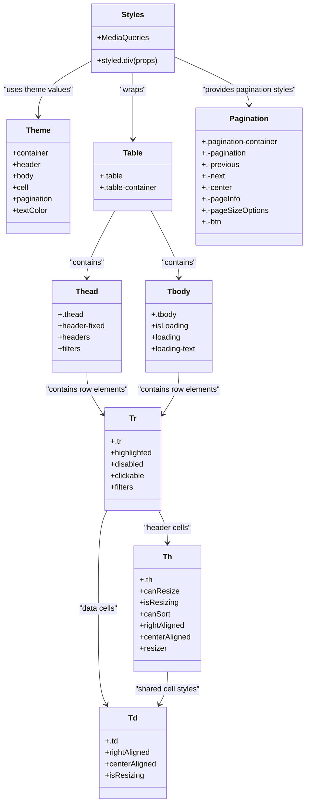

# Diagram: web/portal/src/components/organisms/base-table/Styles/BaseStyle.js

> Auto-generated by Obscura crawlers

## Mermaid

### SVG

<svg id="container" width="651.1953125" xmlns="http://www.w3.org/2000/svg" class="classDiagram" height="1706" viewBox="0 0 651.1953125 1706" role="graphics-document document" aria-roledescription="class"><g><defs><marker id="container_class-aggregationStart" class="marker aggregation class" refX="18" refY="7" markerWidth="190" markerHeight="240" orient="auto"><path d="M 18,7 L9,13 L1,7 L9,1 Z"></path></marker></defs><defs><marker id="container_class-aggregationEnd" class="marker aggregation class" refX="1" refY="7" markerWidth="20" markerHeight="28" orient="auto"><path d="M 18,7 L9,13 L1,7 L9,1 Z"></path></marker></defs><defs><marker id="container_class-extensionStart" class="marker extension class" refX="18" refY="7" markerWidth="190" markerHeight="240" orient="auto"><path d="M 1,7 L18,13 V 1 Z"></path></marker></defs><defs><marker id="container_class-extensionEnd" class="marker extension class" refX="1" refY="7" markerWidth="20" markerHeight="28" orient="auto"><path d="M 1,1 V 13 L18,7 Z"></path></marker></defs><defs><marker id="container_class-compositionStart" class="marker composition class" refX="18" refY="7" markerWidth="190" markerHeight="240" orient="auto"><path d="M 18,7 L9,13 L1,7 L9,1 Z"></path></marker></defs><defs><marker id="container_class-compositionEnd" class="marker composition class" refX="1" refY="7" markerWidth="20" markerHeight="28" orient="auto"><path d="M 18,7 L9,13 L1,7 L9,1 Z"></path></marker></defs><defs><marker id="container_class-dependencyStart" class="marker dependency class" refX="6" refY="7" markerWidth="190" markerHeight="240" orient="auto"><path d="M 5,7 L9,13 L1,7 L9,1 Z"></path></marker></defs><defs><marker id="container_class-dependencyEnd" class="marker dependency class" refX="13" refY="7" markerWidth="20" markerHeight="28" orient="auto"><path d="M 18,7 L9,13 L14,7 L9,1 Z"></path></marker></defs><defs><marker id="container_class-lollipopStart" class="marker lollipop class" refX="13" refY="7" markerWidth="190" markerHeight="240" orient="auto"><circle stroke="black" fill="transparent" cx="7" cy="7" r="6"></circle></marker></defs><defs><marker id="container_class-lollipopEnd" class="marker lollipop class" refX="1" refY="7" markerWidth="190" markerHeight="240" orient="auto"><circle stroke="black" fill="transparent" cx="7" cy="7" r="6"></circle></marker></defs><g class="root"><g class="clusters"></g><g class="edgePaths"><path d="M194.184,132.985L175.373,144.321C156.563,155.656,118.941,178.328,100.131,200.831C81.32,223.333,81.32,245.667,81.32,256.833L81.32,268" id="id_Styles_Theme_1" class="edge-thickness-normal edge-pattern-solid relation" style=";;;" data-edge="true" data-et="edge" data-id="id_Styles_Theme_1" data-points="W3sieCI6MTk0LjE4MzU5Mzc1LCJ5IjoxMzIuOTg0NzI3OTIzNTgxMjZ9LHsieCI6ODEuMzIwMzEyNSwieSI6MjAxfSx7IngiOjgxLjMyMDMxMjUsInkiOjI3NH1d" marker-end="url(#container_class-dependencyEnd)"></path><path d="M282.105,152L282.105,160.167C282.105,168.333,282.105,184.667,282.105,212C282.105,239.333,282.105,277.667,282.105,296.833L282.105,316" id="id_Styles_Table_2" class="edge-thickness-normal edge-pattern-solid relation" style=";;;" data-edge="true" data-et="edge" data-id="id_Styles_Table_2" data-points="W3sieCI6MjgyLjEwNTQ2ODc1LCJ5IjoxNTJ9LHsieCI6MjgyLjEwNTQ2ODc1LCJ5IjoyMDF9LHsieCI6MjgyLjEwNTQ2ODc1LCJ5IjozMjJ9XQ==" marker-end="url(#container_class-dependencyEnd)"></path><path d="M370.027,123.009L396.6,136.008C423.172,149.006,476.316,175.003,502.889,195.168C529.461,215.333,529.461,229.667,529.461,236.833L529.461,244" id="id_Styles_Pagination_3" class="edge-thickness-normal edge-pattern-solid relation" style=";;;" data-edge="true" data-et="edge" data-id="id_Styles_Pagination_3" data-points="W3sieCI6MzcwLjAyNzM0Mzc1LCJ5IjoxMjMuMDA5MTQzNTk3MTEzMjJ9LHsieCI6NTI5LjQ2MDkzNzUsInkiOjIwMX0seyJ4Ijo1MjkuNDYwOTM3NSwieSI6MjUwfV0=" marker-end="url(#container_class-dependencyEnd)"></path><path d="M243.072,466L233.224,484.167C223.375,502.333,203.678,538.667,193.829,562C183.98,585.333,183.98,595.667,183.98,600.833L183.98,606" id="id_Table_Thead_4" class="edge-thickness-normal edge-pattern-solid relation" style=";;;" data-edge="true" data-et="edge" data-id="id_Table_Thead_4" data-points="W3sieCI6MjQzLjA3MjMxOTU3ODcyOTMsInkiOjQ2Nn0seyJ4IjoxODMuOTgwNDY4NzUsInkiOjU3NX0seyJ4IjoxODMuOTgwNDY4NzUsInkiOjYxMn1d" marker-end="url(#container_class-dependencyEnd)"></path><path d="M321.139,466L330.987,484.167C340.836,502.333,360.533,538.667,370.382,562C380.23,585.333,380.23,595.667,380.23,600.833L380.23,606" id="id_Table_Tbody_5" class="edge-thickness-normal edge-pattern-solid relation" style=";;;" data-edge="true" data-et="edge" data-id="id_Table_Tbody_5" data-points="W3sieCI6MzIxLjEzODYxNzkyMTI3MDc0LCJ5Ijo0NjZ9LHsieCI6MzgwLjIzMDQ2ODc1LCJ5Ijo1NzV9LHsieCI6MzgwLjIzMDQ2ODc1LCJ5Ijo2MTJ9XQ==" marker-end="url(#container_class-dependencyEnd)"></path><path d="M183.98,804L183.98,810.167C183.98,816.333,183.98,828.667,189.642,843.199C195.304,857.732,206.627,874.464,212.288,882.831L217.95,891.197" id="id_Thead_Tr_6" class="edge-thickness-normal edge-pattern-solid relation" style=";;;" data-edge="true" data-et="edge" data-id="id_Thead_Tr_6" data-points="W3sieCI6MTgzLjk4MDQ2ODc1LCJ5Ijo4MDR9LHsieCI6MTgzLjk4MDQ2ODc1LCJ5Ijo4NDF9LHsieCI6MjIxLjMxMjUsInkiOjg5Ni4xNjU4MDQxNDAxMjc0fV0=" marker-end="url(#container_class-dependencyEnd)"></path><path d="M380.23,804L380.23,810.167C380.23,816.333,380.23,828.667,374.569,843.199C368.907,857.732,357.584,874.464,351.923,882.831L346.261,891.197" id="id_Tbody_Tr_7" class="edge-thickness-normal edge-pattern-solid relation" style=";;;" data-edge="true" data-et="edge" data-id="id_Tbody_Tr_7" data-points="W3sieCI6MzgwLjIzMDQ2ODc1LCJ5Ijo4MDR9LHsieCI6MzgwLjIzMDQ2ODc1LCJ5Ijo4NDF9LHsieCI6MzQyLjg5ODQzNzUsInkiOjg5Ni4xNjU4MDQxNDAxMjc0fV0=" marker-end="url(#container_class-dependencyEnd)"></path><path d="M336.719,1094L339.838,1100.167C342.956,1106.333,349.193,1118.667,352.311,1130C355.43,1141.333,355.43,1151.667,355.43,1156.833L355.43,1162" id="id_Tr_Th_8" class="edge-thickness-normal edge-pattern-solid relation" style=";;;" data-edge="true" data-et="edge" data-id="id_Tr_Th_8" data-points="W3sieCI6MzM2LjcxOTM2OTYxMjA2OSwieSI6MTA5NH0seyJ4IjozNTUuNDI5Njg3NSwieSI6MTEzMX0seyJ4IjozNTUuNDI5Njg3NSwieSI6MTE2OH1d" marker-end="url(#container_class-dependencyEnd)"></path><path d="M227.492,1094L224.373,1100.167C221.255,1106.333,215.018,1118.667,211.9,1153C208.781,1187.333,208.781,1243.667,208.781,1300C208.781,1356.333,208.781,1412.667,211.698,1446.124C214.615,1479.582,220.449,1490.164,223.366,1495.455L226.283,1500.746" id="id_Tr_Td_9" class="edge-thickness-normal edge-pattern-solid relation" style=";;;" data-edge="true" data-et="edge" data-id="id_Tr_Td_9" data-points="W3sieCI6MjI3LjQ5MTU2Nzg4NzkzMTA0LCJ5IjoxMDk0fSx7IngiOjIwOC43ODEyNSwieSI6MTEzMX0seyJ4IjoyMDguNzgxMjUsInkiOjEzMDB9LHsieCI6MjA4Ljc4MTI1LCJ5IjoxNDY5fSx7IngiOjIyOS4xNzk3MTY4NzAzMDA3NSwieSI6MTUwNn1d" marker-end="url(#container_class-dependencyEnd)"></path><path d="M355.43,1432L355.43,1438.167C355.43,1444.333,355.43,1456.667,352.513,1468.124C349.596,1479.582,343.762,1490.164,340.845,1495.455L337.928,1500.746" id="id_Th_Td_10" class="edge-thickness-normal edge-pattern-solid relation" style=";;;" data-edge="true" data-et="edge" data-id="id_Th_Td_10" data-points="W3sieCI6MzU1LjQyOTY4NzUsInkiOjE0MzJ9LHsieCI6MzU1LjQyOTY4NzUsInkiOjE0Njl9LHsieCI6MzM1LjAzMTIyMDYyOTY5OTI1LCJ5IjoxNTA2fV0=" marker-end="url(#container_class-dependencyEnd)"></path></g><g class="edgeLabels"><g class="edgeLabel" transform="translate(81.3203125, 201)"><g class="label" data-id="id_Styles_Theme_1" transform="translate(-73.3203125, -12)"><foreignObject width="146.640625" height="24">

"uses theme values"

</foreignObject></g></g><g class="edgeLabel" transform="translate(282.10546875, 201)"><g class="label" data-id="id_Styles_Table_2" transform="translate(-27.6484375, -12)"><foreignObject width="55.296875" height="24">

"wraps"

</foreignObject></g></g><g class="edgeLabel" transform="translate(529.4609375, 201)"><g class="label" data-id="id_Styles_Pagination_3" transform="translate(-100, -24)"><foreignObject width="200" height="48">

"provides pagination styles"

</foreignObject></g></g><g class="edgeLabel" transform="translate(183.98046875, 575)"><g class="label" data-id="id_Table_Thead_4" transform="translate(-37.078125, -12)"><foreignObject width="74.15625" height="24">

"contains"

</foreignObject></g></g><g class="edgeLabel" transform="translate(380.23046875, 575)"><g class="label" data-id="id_Table_Tbody_5" transform="translate(-37.078125, -12)"><foreignObject width="74.15625" height="24">

"contains"

</foreignObject></g></g><g class="edgeLabel" transform="translate(183.98046875, 841)"><g class="label" data-id="id_Thead_Tr_6" transform="translate(-88.125, -12)"><foreignObject width="176.25" height="24">

"contains row elements"

</foreignObject></g></g><g class="edgeLabel" transform="translate(380.23046875, 841)"><g class="label" data-id="id_Tbody_Tr_7" transform="translate(-88.125, -12)"><foreignObject width="176.25" height="24">

"contains row elements"

</foreignObject></g></g><g class="edgeLabel" transform="translate(355.4296875, 1131)"><g class="label" data-id="id_Tr_Th_8" transform="translate(-50.390625, -12)"><foreignObject width="100.78125" height="24">

"header cells"

</foreignObject></g></g><g class="edgeLabel" transform="translate(208.78125, 1300)"><g class="label" data-id="id_Tr_Td_9" transform="translate(-41.078125, -12)"><foreignObject width="82.15625" height="24">

"data cells"

</foreignObject></g></g><g class="edgeLabel" transform="translate(355.4296875, 1469)"><g class="label" data-id="id_Th_Td_10" transform="translate(-68.828125, -12)"><foreignObject width="137.65625" height="24">

"shared cell styles"

</foreignObject></g></g></g><g class="nodes"><g class="node default" id="classId-Styles-0" transform="translate(282.10546875, 80)"><g class="basic label-container"><path d="M-87.921875 -72 L87.921875 -72 L87.921875 72 L-87.921875 72" stroke="none" stroke-width="0" fill="#ECECFF" style=""></path><path d="M-87.921875 -72 C-25.112349506239127 -72, 37.697175987521746 -72, 87.921875 -72 M-87.921875 -72 C-24.545595248198026 -72, 38.83068450360395 -72, 87.921875 -72 M87.921875 -72 C87.921875 -21.35965699079282, 87.921875 29.280686018414357, 87.921875 72 M87.921875 -72 C87.921875 -28.888869229135707, 87.921875 14.222261541728585, 87.921875 72 M87.921875 72 C17.5970885405425 72, -52.727697918915 72, -87.921875 72 M87.921875 72 C24.211438231551156 72, -39.49899853689769 72, -87.921875 72 M-87.921875 72 C-87.921875 31.222932019496376, -87.921875 -9.554135961007248, -87.921875 -72 M-87.921875 72 C-87.921875 40.702180826274756, -87.921875 9.404361652549511, -87.921875 -72" stroke="#9370DB" stroke-width="1.3" fill="none" stroke-dasharray="0 0" style=""></path></g><g class="annotation-group text" transform="translate(0, -48)"></g><g class="label-group text" transform="translate(-22.390625, -48)"><g class="label" style="font-weight: bolder" transform="translate(0,-12)"><foreignObject width="44.78125" height="24">

Styles

</foreignObject></g></g><g class="members-group text" transform="translate(-75.921875, 0)"><g class="label" style="" transform="translate(0,-12)"><foreignObject width="107.90625" height="24">

+MediaQueries

</foreignObject></g></g><g class="methods-group text" transform="translate(-75.921875, 48)"><g class="label" style="" transform="translate(0,-12)"><foreignObject width="129.453125" height="24">

+styled.div(props)

</foreignObject></g></g><g class="divider" style=""><path d="M-87.921875 -24 C-51.502964814371175 -24, -15.08405462874235 -24, 87.921875 -24 M-87.921875 -24 C-46.969172730699256 -24, -6.016470461398512 -24, 87.921875 -24" stroke="#9370DB" stroke-width="1.3" fill="none" stroke-dasharray="0 0" style=""></path></g><g class="divider" style=""><path d="M-87.921875 24 C-40.22924094524346 24, 7.463393109513078 24, 87.921875 24 M-87.921875 24 C-20.99366717942526 24, 45.93454064114948 24, 87.921875 24" stroke="#9370DB" stroke-width="1.3" fill="none" stroke-dasharray="0 0" style=""></path></g></g><g class="node default" id="classId-Theme-1" transform="translate(81.3203125, 394)"><g class="basic label-container"><path d="M-67.1640625 -120 L67.1640625 -120 L67.1640625 120 L-67.1640625 120" stroke="none" stroke-width="0" fill="#ECECFF" style=""></path><path d="M-67.1640625 -120 C-30.352203301096253 -120, 6.459655897807494 -120, 67.1640625 -120 M-67.1640625 -120 C-33.82662861542833 -120, -0.4891947308566671 -120, 67.1640625 -120 M67.1640625 -120 C67.1640625 -41.093506992098185, 67.1640625 37.81298601580363, 67.1640625 120 M67.1640625 -120 C67.1640625 -68.80671316010822, 67.1640625 -17.613426320216448, 67.1640625 120 M67.1640625 120 C28.95297538006409 120, -9.258111739871822 120, -67.1640625 120 M67.1640625 120 C16.029261160959443 120, -35.105540178081114 120, -67.1640625 120 M-67.1640625 120 C-67.1640625 71.8226621789738, -67.1640625 23.6453243579476, -67.1640625 -120 M-67.1640625 120 C-67.1640625 48.85208377951216, -67.1640625 -22.295832440975687, -67.1640625 -120" stroke="#9370DB" stroke-width="1.3" fill="none" stroke-dasharray="0 0" style=""></path></g><g class="annotation-group text" transform="translate(0, -96)"></g><g class="label-group text" transform="translate(-24.53125, -96)"><g class="label" style="font-weight: bolder" transform="translate(0,-12)"><foreignObject width="49.0625" height="24">

Theme

</foreignObject></g></g><g class="members-group text" transform="translate(-55.1640625, -48)"><g class="label" style="" transform="translate(0,-12)"><foreignObject width="77.1875" height="24">

+container

</foreignObject></g><g class="label" style="" transform="translate(0,12)"><foreignObject width="59.09375" height="24">

+header

</foreignObject></g><g class="label" style="" transform="translate(0,36)"><foreignObject width="44.28125" height="24">

+body

</foreignObject></g><g class="label" style="" transform="translate(0,60)"><foreignObject width="33.421875" height="24">

+cell

</foreignObject></g><g class="label" style="" transform="translate(0,84)"><foreignObject width="85.796875" height="24">

+pagination

</foreignObject></g><g class="label" style="" transform="translate(0,108)"><foreignObject width="73.671875" height="24">

+textColor

</foreignObject></g></g><g class="methods-group text" transform="translate(-55.1640625, 120)"></g><g class="divider" style=""><path d="M-67.1640625 -72 C-37.24207053867429 -72, -7.320078577348582 -72, 67.1640625 -72 M-67.1640625 -72 C-22.534823997611582 -72, 22.094414504776836 -72, 67.1640625 -72" stroke="#9370DB" stroke-width="1.3" fill="none" stroke-dasharray="0 0" style=""></path></g><g class="divider" style=""><path d="M-67.1640625 96 C-18.988494869675925 96, 29.18707276064815 96, 67.1640625 96 M-67.1640625 96 C-22.21987760071798 96, 22.724307298564042 96, 67.1640625 96" stroke="#9370DB" stroke-width="1.3" fill="none" stroke-dasharray="0 0" style=""></path></g></g><g class="node default" id="classId-Table-2" transform="translate(282.10546875, 394)"><g class="basic label-container"><path d="M-83.62109375 -72 L83.62109375 -72 L83.62109375 72 L-83.62109375 72" stroke="none" stroke-width="0" fill="#ECECFF" style=""></path><path d="M-83.62109375 -72 C-21.993215225350276 -72, 39.63466329929945 -72, 83.62109375 -72 M-83.62109375 -72 C-23.85375558633232 -72, 35.91358257733536 -72, 83.62109375 -72 M83.62109375 -72 C83.62109375 -21.24287339972968, 83.62109375 29.514253200540637, 83.62109375 72 M83.62109375 -72 C83.62109375 -24.381252034957683, 83.62109375 23.237495930084634, 83.62109375 72 M83.62109375 72 C27.85858681570535 72, -27.903920118589298 72, -83.62109375 72 M83.62109375 72 C42.82539708787723 72, 2.0297004257544558 72, -83.62109375 72 M-83.62109375 72 C-83.62109375 34.46286150892911, -83.62109375 -3.0742769821417824, -83.62109375 -72 M-83.62109375 72 C-83.62109375 37.73322340334301, -83.62109375 3.4664468066860223, -83.62109375 -72" stroke="#9370DB" stroke-width="1.3" fill="none" stroke-dasharray="0 0" style=""></path></g><g class="annotation-group text" transform="translate(0, -48)"></g><g class="label-group text" transform="translate(-19.8359375, -48)"><g class="label" style="font-weight: bolder" transform="translate(0,-12)"><foreignObject width="39.671875" height="24">

Table

</foreignObject></g></g><g class="members-group text" transform="translate(-71.62109375, 0)"><g class="label" style="" transform="translate(0,-12)"><foreignObject width="47.75" height="24">

+.table

</foreignObject></g><g class="label" style="" transform="translate(0,12)"><foreignObject width="123.40625" height="24">

+.table-container

</foreignObject></g></g><g class="methods-group text" transform="translate(-71.62109375, 72)"></g><g class="divider" style=""><path d="M-83.62109375 -24 C-22.42602245870892 -24, 38.76904883258216 -24, 83.62109375 -24 M-83.62109375 -24 C-23.989488656347127 -24, 35.642116437305745 -24, 83.62109375 -24" stroke="#9370DB" stroke-width="1.3" fill="none" stroke-dasharray="0 0" style=""></path></g><g class="divider" style=""><path d="M-83.62109375 48 C-46.543006518392886 48, -9.464919286785772 48, 83.62109375 48 M-83.62109375 48 C-29.831594049068634 48, 23.95790565186273 48, 83.62109375 48" stroke="#9370DB" stroke-width="1.3" fill="none" stroke-dasharray="0 0" style=""></path></g></g><g class="node default" id="classId-Thead-3" transform="translate(183.98046875, 708)"><g class="basic label-container"><path d="M-73.16796875 -96 L73.16796875 -96 L73.16796875 96 L-73.16796875 96" stroke="none" stroke-width="0" fill="#ECECFF" style=""></path><path d="M-73.16796875 -96 C-25.343711129965143 -96, 22.480546490069713 -96, 73.16796875 -96 M-73.16796875 -96 C-34.12928425442384 -96, 4.909400241152326 -96, 73.16796875 -96 M73.16796875 -96 C73.16796875 -56.649994633472716, 73.16796875 -17.29998926694543, 73.16796875 96 M73.16796875 -96 C73.16796875 -30.962046907400634, 73.16796875 34.07590618519873, 73.16796875 96 M73.16796875 96 C27.58535537972037 96, -17.997257990559262 96, -73.16796875 96 M73.16796875 96 C19.425053431765313 96, -34.31786188646937 96, -73.16796875 96 M-73.16796875 96 C-73.16796875 55.575630736095285, -73.16796875 15.15126147219057, -73.16796875 -96 M-73.16796875 96 C-73.16796875 25.31975016119594, -73.16796875 -45.36049967760812, -73.16796875 -96" stroke="#9370DB" stroke-width="1.3" fill="none" stroke-dasharray="0 0" style=""></path></g><g class="annotation-group text" transform="translate(0, -72)"></g><g class="label-group text" transform="translate(-22.4609375, -72)"><g class="label" style="font-weight: bolder" transform="translate(0,-12)"><foreignObject width="44.921875" height="24">

Thead

</foreignObject></g></g><g class="members-group text" transform="translate(-61.16796875, -24)"><g class="label" style="" transform="translate(0,-12)"><foreignObject width="52.53125" height="24">

+.thead

</foreignObject></g><g class="label" style="" transform="translate(0,12)"><foreignObject width="99.875" height="24">

+header-fixed

</foreignObject></g><g class="label" style="" transform="translate(0,36)"><foreignObject width="66.328125" height="24">

+headers

</foreignObject></g><g class="label" style="" transform="translate(0,60)"><foreignObject width="49.296875" height="24">

+filters

</foreignObject></g></g><g class="methods-group text" transform="translate(-61.16796875, 96)"></g><g class="divider" style=""><path d="M-73.16796875 -48 C-37.84629716953215 -48, -2.5246255890643 -48, 73.16796875 -48 M-73.16796875 -48 C-18.05909754637912 -48, 37.04977365724176 -48, 73.16796875 -48" stroke="#9370DB" stroke-width="1.3" fill="none" stroke-dasharray="0 0" style=""></path></g><g class="divider" style=""><path d="M-73.16796875 72 C-29.920355307608453 72, 13.327258134783094 72, 73.16796875 72 M-73.16796875 72 C-23.07503009613187 72, 27.017908557736263 72, 73.16796875 72" stroke="#9370DB" stroke-width="1.3" fill="none" stroke-dasharray="0 0" style=""></path></g></g><g class="node default" id="classId-Tbody-4" transform="translate(380.23046875, 708)"><g class="basic label-container"><path d="M-71.421875 -96 L71.421875 -96 L71.421875 96 L-71.421875 96" stroke="none" stroke-width="0" fill="#ECECFF" style=""></path><path d="M-71.421875 -96 C-19.956274870747905 -96, 31.50932525850419 -96, 71.421875 -96 M-71.421875 -96 C-14.960783296487342 -96, 41.500308407025315 -96, 71.421875 -96 M71.421875 -96 C71.421875 -54.74418811333486, 71.421875 -13.488376226669715, 71.421875 96 M71.421875 -96 C71.421875 -20.8815130178303, 71.421875 54.2369739643394, 71.421875 96 M71.421875 96 C41.41387151789422 96, 11.405868035788437 96, -71.421875 96 M71.421875 96 C22.403193358968608 96, -26.615488282062785 96, -71.421875 96 M-71.421875 96 C-71.421875 32.0503154331971, -71.421875 -31.899369133605802, -71.421875 -96 M-71.421875 96 C-71.421875 54.50661763721672, -71.421875 13.013235274433441, -71.421875 -96" stroke="#9370DB" stroke-width="1.3" fill="none" stroke-dasharray="0 0" style=""></path></g><g class="annotation-group text" transform="translate(0, -72)"></g><g class="label-group text" transform="translate(-22.71875, -72)"><g class="label" style="font-weight: bolder" transform="translate(0,-12)"><foreignObject width="45.4375" height="24">

Tbody

</foreignObject></g></g><g class="members-group text" transform="translate(-59.421875, -24)"><g class="label" style="" transform="translate(0,-12)"><foreignObject width="52.609375" height="24">

+.tbody

</foreignObject></g><g class="label" style="" transform="translate(0,12)"><foreignObject width="77.203125" height="24">

+isLoading

</foreignObject></g><g class="label" style="" transform="translate(0,36)"><foreignObject width="62.265625" height="24">

+loading

</foreignObject></g><g class="label" style="" transform="translate(0,60)"><foreignObject width="96.125" height="24">

+loading-text

</foreignObject></g></g><g class="methods-group text" transform="translate(-59.421875, 96)"></g><g class="divider" style=""><path d="M-71.421875 -48 C-18.7796800392978 -48, 33.8625149214044 -48, 71.421875 -48 M-71.421875 -48 C-28.992776671555347 -48, 13.436321656889305 -48, 71.421875 -48" stroke="#9370DB" stroke-width="1.3" fill="none" stroke-dasharray="0 0" style=""></path></g><g class="divider" style=""><path d="M-71.421875 72 C-26.62053099275719 72, 18.180813014485622 72, 71.421875 72 M-71.421875 72 C-36.09606283404373 72, -0.7702506680874563 72, 71.421875 72" stroke="#9370DB" stroke-width="1.3" fill="none" stroke-dasharray="0 0" style=""></path></g></g><g class="node default" id="classId-Tr-5" transform="translate(282.10546875, 986)"><g class="basic label-container"><path d="M-60.79296875 -108 L60.79296875 -108 L60.79296875 108 L-60.79296875 108" stroke="none" stroke-width="0" fill="#ECECFF" style=""></path><path d="M-60.79296875 -108 C-21.06363082216349 -108, 18.66570710567302 -108, 60.79296875 -108 M-60.79296875 -108 C-34.09160256439225 -108, -7.3902363787845005 -108, 60.79296875 -108 M60.79296875 -108 C60.79296875 -54.91531588451453, 60.79296875 -1.8306317690290541, 60.79296875 108 M60.79296875 -108 C60.79296875 -39.01103780188103, 60.79296875 29.97792439623794, 60.79296875 108 M60.79296875 108 C32.697413879335926 108, 4.601859008671845 108, -60.79296875 108 M60.79296875 108 C12.859801112862044 108, -35.07336652427591 108, -60.79296875 108 M-60.79296875 108 C-60.79296875 64.38457828268858, -60.79296875 20.769156565377145, -60.79296875 -108 M-60.79296875 108 C-60.79296875 58.164457012426965, -60.79296875 8.32891402485393, -60.79296875 -108" stroke="#9370DB" stroke-width="1.3" fill="none" stroke-dasharray="0 0" style=""></path></g><g class="annotation-group text" transform="translate(0, -84)"></g><g class="label-group text" transform="translate(-7.2890625, -84)"><g class="label" style="font-weight: bolder" transform="translate(0,-12)"><foreignObject width="14.578125" height="24">

Tr

</foreignObject></g></g><g class="members-group text" transform="translate(-48.79296875, -36)"><g class="label" style="" transform="translate(0,-12)"><foreignObject width="22.5" height="24">

+.tr

</foreignObject></g><g class="label" style="" transform="translate(0,12)"><foreignObject width="90.296875" height="24">

+highlighted

</foreignObject></g><g class="label" style="" transform="translate(0,36)"><foreignObject width="70.484375" height="24">

+disabled

</foreignObject></g><g class="label" style="" transform="translate(0,60)"><foreignObject width="71.96875" height="24">

+clickable

</foreignObject></g><g class="label" style="" transform="translate(0,84)"><foreignObject width="49.296875" height="24">

+filters

</foreignObject></g></g><g class="methods-group text" transform="translate(-48.79296875, 108)"></g><g class="divider" style=""><path d="M-60.79296875 -60 C-12.715509143243317 -60, 35.36195046351337 -60, 60.79296875 -60 M-60.79296875 -60 C-12.572094365377865 -60, 35.64878001924427 -60, 60.79296875 -60" stroke="#9370DB" stroke-width="1.3" fill="none" stroke-dasharray="0 0" style=""></path></g><g class="divider" style=""><path d="M-60.79296875 84 C-24.10899252350957 84, 12.574983702980859 84, 60.79296875 84 M-60.79296875 84 C-25.32329126278956 84, 10.14638622442088 84, 60.79296875 84" stroke="#9370DB" stroke-width="1.3" fill="none" stroke-dasharray="0 0" style=""></path></g></g><g class="node default" id="classId-Th-6" transform="translate(355.4296875, 1300)"><g class="basic label-container"><path d="M-70.5703125 -132 L70.5703125 -132 L70.5703125 132 L-70.5703125 132" stroke="none" stroke-width="0" fill="#ECECFF" style=""></path><path d="M-70.5703125 -132 C-19.16552922179436 -132, 32.23925405641128 -132, 70.5703125 -132 M-70.5703125 -132 C-37.10994978882935 -132, -3.649587077658694 -132, 70.5703125 -132 M70.5703125 -132 C70.5703125 -41.56665860077416, 70.5703125 48.86668279845168, 70.5703125 132 M70.5703125 -132 C70.5703125 -39.44845302312578, 70.5703125 53.10309395374844, 70.5703125 132 M70.5703125 132 C23.127204404904795 132, -24.31590369019041 132, -70.5703125 132 M70.5703125 132 C31.273393367887152 132, -8.023525764225695 132, -70.5703125 132 M-70.5703125 132 C-70.5703125 59.19344145541598, -70.5703125 -13.613117089168043, -70.5703125 -132 M-70.5703125 132 C-70.5703125 50.76741352780739, -70.5703125 -30.465172944385216, -70.5703125 -132" stroke="#9370DB" stroke-width="1.3" fill="none" stroke-dasharray="0 0" style=""></path></g><g class="annotation-group text" transform="translate(0, -108)"></g><g class="label-group text" transform="translate(-8.9375, -108)"><g class="label" style="font-weight: bolder" transform="translate(0,-12)"><foreignObject width="17.875" height="24">

Th

</foreignObject></g></g><g class="members-group text" transform="translate(-58.5703125, -60)"><g class="label" style="" transform="translate(0,-12)"><foreignObject width="25.703125" height="24">

+.th

</foreignObject></g><g class="label" style="" transform="translate(0,12)"><foreignObject width="79.296875" height="24">

+canResize

</foreignObject></g><g class="label" style="" transform="translate(0,36)"><foreignObject width="79.3125" height="24">

+isResizing

</foreignObject></g><g class="label" style="" transform="translate(0,60)"><foreignObject width="63.578125" height="24">

+canSort

</foreignObject></g><g class="label" style="" transform="translate(0,84)"><foreignObject width="96.5" height="24">

+rightAligned

</foreignObject></g><g class="label" style="" transform="translate(0,108)"><foreignObject width="108.203125" height="24">

+centerAligned

</foreignObject></g><g class="label" style="" transform="translate(0,132)"><foreignObject width="56.171875" height="24">

+resizer

</foreignObject></g></g><g class="methods-group text" transform="translate(-58.5703125, 132)"></g><g class="divider" style=""><path d="M-70.5703125 -84 C-27.849044882068775 -84, 14.87222273586245 -84, 70.5703125 -84 M-70.5703125 -84 C-23.523643696212787 -84, 23.523025107574426 -84, 70.5703125 -84" stroke="#9370DB" stroke-width="1.3" fill="none" stroke-dasharray="0 0" style=""></path></g><g class="divider" style=""><path d="M-70.5703125 108 C-29.04300166564444 108, 12.484309168711121 108, 70.5703125 108 M-70.5703125 108 C-34.645082231594955 108, 1.2801480368100897 108, 70.5703125 108" stroke="#9370DB" stroke-width="1.3" fill="none" stroke-dasharray="0 0" style=""></path></g></g><g class="node default" id="classId-Td-7" transform="translate(282.10546875, 1602)"><g class="basic label-container"><path d="M-70.4453125 -96 L70.4453125 -96 L70.4453125 96 L-70.4453125 96" stroke="none" stroke-width="0" fill="#ECECFF" style=""></path><path d="M-70.4453125 -96 C-42.17398962629852 -96, -13.902666752597042 -96, 70.4453125 -96 M-70.4453125 -96 C-17.493930461062888 -96, 35.457451577874224 -96, 70.4453125 -96 M70.4453125 -96 C70.4453125 -23.816801194877655, 70.4453125 48.36639761024469, 70.4453125 96 M70.4453125 -96 C70.4453125 -54.45209025124299, 70.4453125 -12.904180502485985, 70.4453125 96 M70.4453125 96 C17.831756705680426 96, -34.78179908863915 96, -70.4453125 96 M70.4453125 96 C29.82891467134057 96, -10.78748315731886 96, -70.4453125 96 M-70.4453125 96 C-70.4453125 38.9012031402728, -70.4453125 -18.197593719454403, -70.4453125 -96 M-70.4453125 96 C-70.4453125 39.514422229179786, -70.4453125 -16.971155541640428, -70.4453125 -96" stroke="#9370DB" stroke-width="1.3" fill="none" stroke-dasharray="0 0" style=""></path></g><g class="annotation-group text" transform="translate(0, -72)"></g><g class="label-group text" transform="translate(-8.6875, -72)"><g class="label" style="font-weight: bolder" transform="translate(0,-12)"><foreignObject width="17.375" height="24">

Td

</foreignObject></g></g><g class="members-group text" transform="translate(-58.4453125, -24)"><g class="label" style="" transform="translate(0,-12)"><foreignObject width="25.65625" height="24">

+.td

</foreignObject></g><g class="label" style="" transform="translate(0,12)"><foreignObject width="96.5" height="24">

+rightAligned

</foreignObject></g><g class="label" style="" transform="translate(0,36)"><foreignObject width="108.203125" height="24">

+centerAligned

</foreignObject></g><g class="label" style="" transform="translate(0,60)"><foreignObject width="79.3125" height="24">

+isResizing

</foreignObject></g></g><g class="methods-group text" transform="translate(-58.4453125, 96)"></g><g class="divider" style=""><path d="M-70.4453125 -48 C-26.782113715096983 -48, 16.881085069806034 -48, 70.4453125 -48 M-70.4453125 -48 C-35.513424615813186 -48, -0.5815367316263718 -48, 70.4453125 -48" stroke="#9370DB" stroke-width="1.3" fill="none" stroke-dasharray="0 0" style=""></path></g><g class="divider" style=""><path d="M-70.4453125 72 C-16.83337785791157 72, 36.77855678417686 72, 70.4453125 72 M-70.4453125 72 C-14.197248837458744 72, 42.05081482508251 72, 70.4453125 72" stroke="#9370DB" stroke-width="1.3" fill="none" stroke-dasharray="0 0" style=""></path></g></g><g class="node default" id="classId-Pagination-8" transform="translate(529.4609375, 394)"><g class="basic label-container"><path d="M-113.734375 -144 L113.734375 -144 L113.734375 144 L-113.734375 144" stroke="none" stroke-width="0" fill="#ECECFF" style=""></path><path d="M-113.734375 -144 C-59.68783201804329 -144, -5.641289036086576 -144, 113.734375 -144 M-113.734375 -144 C-37.482826406535295 -144, 38.76872218692941 -144, 113.734375 -144 M113.734375 -144 C113.734375 -49.60887919319103, 113.734375 44.78224161361794, 113.734375 144 M113.734375 -144 C113.734375 -55.059091670875375, 113.734375 33.88181665824925, 113.734375 144 M113.734375 144 C49.31680540443233 144, -15.10076419113534 144, -113.734375 144 M113.734375 144 C64.07734653996869 144, 14.420318079937374 144, -113.734375 144 M-113.734375 144 C-113.734375 84.77461583694222, -113.734375 25.54923167388445, -113.734375 -144 M-113.734375 144 C-113.734375 70.7122435337629, -113.734375 -2.575512932474197, -113.734375 -144" stroke="#9370DB" stroke-width="1.3" fill="none" stroke-dasharray="0 0" style=""></path></g><g class="annotation-group text" transform="translate(0, -120)"></g><g class="label-group text" transform="translate(-38.984375, -120)"><g class="label" style="font-weight: bolder" transform="translate(0,-12)"><foreignObject width="77.96875" height="24">

Pagination

</foreignObject></g></g><g class="members-group text" transform="translate(-101.734375, -72)"><g class="label" style="" transform="translate(0,-12)"><foreignObject width="164.484375" height="24">

+.pagination-container

</foreignObject></g><g class="label" style="" transform="translate(0,12)"><foreignObject width="94.484375" height="24">

+.-pagination

</foreignObject></g><g class="label" style="" transform="translate(0,36)"><foreignObject width="79.046875" height="24">

+.-previous

</foreignObject></g><g class="label" style="" transform="translate(0,60)"><foreignObject width="48.171875" height="24">

+.-next

</foreignObject></g><g class="label" style="" transform="translate(0,84)"><foreignObject width="62.53125" height="24">

+.-center

</foreignObject></g><g class="label" style="" transform="translate(0,108)"><foreignObject width="79.984375" height="24">

+.-pageInfo

</foreignObject></g><g class="label" style="" transform="translate(0,132)"><foreignObject width="137.234375" height="24">

+.-pageSizeOptions

</foreignObject></g><g class="label" style="" transform="translate(0,156)"><foreignObject width="41.328125" height="24">

+.-btn

</foreignObject></g></g><g class="methods-group text" transform="translate(-101.734375, 144)"></g><g class="divider" style=""><path d="M-113.734375 -96 C-29.293585021605182 -96, 55.147204956789636 -96, 113.734375 -96 M-113.734375 -96 C-60.84225636560351 -96, -7.950137731207022 -96, 113.734375 -96" stroke="#9370DB" stroke-width="1.3" fill="none" stroke-dasharray="0 0" style=""></path></g><g class="divider" style=""><path d="M-113.734375 120 C-37.49083982486293 120, 38.75269535027414 120, 113.734375 120 M-113.734375 120 C-65.942925586729 120, -18.151476173458008 120, 113.734375 120" stroke="#9370DB" stroke-width="1.3" fill="none" stroke-dasharray="0 0" style=""></path></g></g></g></g></g></svg>
