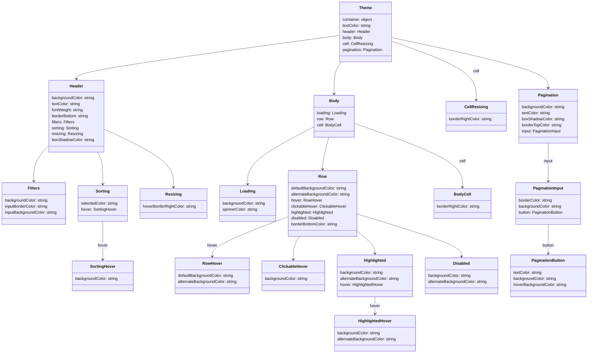

# Diagram: web/portal/src/components/organisms/base-table/Styles/Themes/DarkTheme.js

> Auto-generated by Obscura crawlers

## Mermaid

### SVG

<svg id="container" width="2373.896484375" xmlns="http://www.w3.org/2000/svg" class="classDiagram" height="1416" viewBox="0 0 2373.896484375 1416" role="graphics-document document" aria-roledescription="class"><g><defs><marker id="container_class-aggregationStart" class="marker aggregation class" refX="18" refY="7" markerWidth="190" markerHeight="240" orient="auto"><path d="M 18,7 L9,13 L1,7 L9,1 Z"></path></marker></defs><defs><marker id="container_class-aggregationEnd" class="marker aggregation class" refX="1" refY="7" markerWidth="20" markerHeight="28" orient="auto"><path d="M 18,7 L9,13 L1,7 L9,1 Z"></path></marker></defs><defs><marker id="container_class-extensionStart" class="marker extension class" refX="18" refY="7" markerWidth="190" markerHeight="240" orient="auto"><path d="M 1,7 L18,13 V 1 Z"></path></marker></defs><defs><marker id="container_class-extensionEnd" class="marker extension class" refX="1" refY="7" markerWidth="20" markerHeight="28" orient="auto"><path d="M 1,1 V 13 L18,7 Z"></path></marker></defs><defs><marker id="container_class-compositionStart" class="marker composition class" refX="18" refY="7" markerWidth="190" markerHeight="240" orient="auto"><path d="M 18,7 L9,13 L1,7 L9,1 Z"></path></marker></defs><defs><marker id="container_class-compositionEnd" class="marker composition class" refX="1" refY="7" markerWidth="20" markerHeight="28" orient="auto"><path d="M 18,7 L9,13 L1,7 L9,1 Z"></path></marker></defs><defs><marker id="container_class-dependencyStart" class="marker dependency class" refX="6" refY="7" markerWidth="190" markerHeight="240" orient="auto"><path d="M 5,7 L9,13 L1,7 L9,1 Z"></path></marker></defs><defs><marker id="container_class-dependencyEnd" class="marker dependency class" refX="13" refY="7" markerWidth="20" markerHeight="28" orient="auto"><path d="M 18,7 L9,13 L14,7 L9,1 Z"></path></marker></defs><defs><marker id="container_class-lollipopStart" class="marker lollipop class" refX="13" refY="7" markerWidth="190" markerHeight="240" orient="auto"><circle stroke="black" fill="transparent" cx="7" cy="7" r="6"></circle></marker></defs><defs><marker id="container_class-lollipopEnd" class="marker lollipop class" refX="1" refY="7" markerWidth="190" markerHeight="240" orient="auto"><circle stroke="black" fill="transparent" cx="7" cy="7" r="6"></circle></marker></defs><g class="root"><g class="clusters"></g><g class="edgePaths"><path d="M1370.059,142.237L1193.483,166.031C1016.907,189.825,663.755,237.412,487.179,266.373C310.604,295.333,310.604,305.667,310.604,310.833L310.604,316" id="id_Theme_Header_1" class="edge-thickness-normal edge-pattern-solid relation" style=";;;" data-edge="true" data-et="edge" data-id="id_Theme_Header_1" data-points="W3sieCI6MTM3MC4wNTg1OTM3NSwieSI6MTQyLjIzNzI5MjkwODkwNTl9LHsieCI6MzEwLjYwMzUxNTYyNSwieSI6Mjg1fSx7IngiOjMxMC42MDM1MTU2MjUsInkiOjMyMn1d" marker-end="url(#container_class-dependencyEnd)"></path><path d="M1379.269,248L1374.313,254.167C1369.356,260.333,1359.444,272.667,1354.488,294C1349.531,315.333,1349.531,345.667,1349.531,360.833L1349.531,376" id="id_Theme_Body_2" class="edge-thickness-normal edge-pattern-solid relation" style=";;;" data-edge="true" data-et="edge" data-id="id_Theme_Body_2" data-points="W3sieCI6MTM3OS4yNjg3ODQ4MzI4MDI2LCJ5IjoyNDh9LHsieCI6MTM0OS41MzEyNSwieSI6Mjg1fSx7IngiOjEzNDkuNTMxMjUsInkiOjM4Mn1d" marker-end="url(#container_class-dependencyEnd)"></path><path d="M1581.371,164.926L1638.633,184.938C1695.895,204.95,1810.419,244.975,1867.681,284.154C1924.943,323.333,1924.943,361.667,1924.943,380.833L1924.943,400" id="id_Theme_CellResizing_3" class="edge-thickness-normal edge-pattern-solid relation" style=";;;" data-edge="true" data-et="edge" data-id="id_Theme_CellResizing_3" data-points="W3sieCI6MTU4MS4zNzEwOTM3NSwieSI6MTY0LjkyNTU5NzI2OTYyNDU3fSx7IngiOjE5MjQuOTQzMzU5Mzc1LCJ5IjoyODV9LHsieCI6MTkyNC45NDMzNTkzNzUsInkiOjQwNn1d" marker-end="url(#container_class-dependencyEnd)"></path><path d="M1581.371,150.455L1686.88,172.88C1792.389,195.304,2003.406,240.152,2108.915,273.743C2214.424,307.333,2214.424,329.667,2214.424,340.833L2214.424,352" id="id_Theme_Pagination_4" class="edge-thickness-normal edge-pattern-solid relation" style=";;;" data-edge="true" data-et="edge" data-id="id_Theme_Pagination_4" data-points="W3sieCI6MTU4MS4zNzEwOTM3NSwieSI6MTUwLjQ1NTQzNDU0OTgyNDN9LHsieCI6MjIxNC40MjM4MjgxMjUsInkiOjI4NX0seyJ4IjoyMjE0LjQyMzgyODEyNSwieSI6MzU4fV0=" marker-end="url(#container_class-dependencyEnd)"></path><path d="M198.67,583L188.465,593.667C178.26,604.333,157.851,625.667,147.646,649.5C137.441,673.333,137.441,699.667,137.441,712.833L137.441,726" id="id_Header_Filters_5" class="edge-thickness-normal edge-pattern-solid relation" style=";;;" data-edge="true" data-et="edge" data-id="id_Header_Filters_5" data-points="W3sieCI6MTk4LjY2OTkyMTg3NSwieSI6NTgzLjAwMDA3ODk1NDE5NTN9LHsieCI6MTM3LjQ0MTQwNjI1LCJ5Ijo2NDd9LHsieCI6MTM3LjQ0MTQwNjI1LCJ5Ijo3MzJ9XQ==" marker-end="url(#container_class-dependencyEnd)"></path><path d="M395.083,610L398.7,616.167C402.318,622.333,409.554,634.667,413.171,656C416.789,677.333,416.789,707.667,416.789,722.833L416.789,738" id="id_Header_Sorting_6" class="edge-thickness-normal edge-pattern-solid relation" style=";;;" data-edge="true" data-et="edge" data-id="id_Header_Sorting_6" data-points="W3sieCI6Mzk1LjA4MjYyNDc0MTAyMjEsInkiOjYxMH0seyJ4Ijo0MTYuNzg5MDYyNSwieSI6NjQ3fSx7IngiOjQxNi43ODkwNjI1LCJ5Ijo3NDR9XQ==" marker-end="url(#container_class-dependencyEnd)"></path><path d="M422.537,517.767L469.11,539.306C515.682,560.845,608.827,603.922,655.4,642.628C701.973,681.333,701.973,715.667,701.973,732.833L701.973,750" id="id_Header_Resizing_7" class="edge-thickness-normal edge-pattern-solid relation" style=";;;" data-edge="true" data-et="edge" data-id="id_Header_Resizing_7" data-points="W3sieCI6NDIyLjUzNzEwOTM3NSwieSI6NTE3Ljc2NjkzMzk5MDc0NzZ9LHsieCI6NzAxLjk3MjY1NjI1LCJ5Ijo2NDd9LHsieCI6NzAxLjk3MjY1NjI1LCJ5Ijo3NTZ9XQ==" marker-end="url(#container_class-dependencyEnd)"></path><path d="M416.789,888L416.789,904.167C416.789,920.333,416.789,952.667,416.789,978C416.789,1003.333,416.789,1021.667,416.789,1030.833L416.789,1040" id="id_Sorting_SortingHover_8" class="edge-thickness-normal edge-pattern-solid relation" style=";;;" data-edge="true" data-et="edge" data-id="id_Sorting_SortingHover_8" data-points="W3sieCI6NDE2Ljc4OTA2MjUsInkiOjg4OH0seyJ4Ijo0MTYuNzg5MDYyNSwieSI6OTg1fSx7IngiOjQxNi43ODkwNjI1LCJ5IjoxMDQ2fV0=" marker-end="url(#container_class-dependencyEnd)"></path><path d="M1268.457,508.034L1223.785,531.195C1179.113,554.356,1089.77,600.678,1045.098,639.006C1000.426,677.333,1000.426,707.667,1000.426,722.833L1000.426,738" id="id_Body_Loading_9" class="edge-thickness-normal edge-pattern-solid relation" style=";;;" data-edge="true" data-et="edge" data-id="id_Body_Loading_9" data-points="W3sieCI6MTI2OC40NTcwMzEyNSwieSI6NTA4LjAzNDM4NDc1NTY4MTM0fSx7IngiOjEwMDAuNDI1NzgxMjUsInkiOjY0N30seyJ4IjoxMDAwLjQyNTc4MTI1LCJ5Ijo3NDR9XQ==" marker-end="url(#container_class-dependencyEnd)"></path><path d="M1328.042,550L1323.906,566.167C1319.77,582.333,1311.498,614.667,1307.362,636C1303.227,657.333,1303.227,667.667,1303.227,672.833L1303.227,678" id="id_Body_Row_10" class="edge-thickness-normal edge-pattern-solid relation" style=";;;" data-edge="true" data-et="edge" data-id="id_Body_Row_10" data-points="W3sieCI6MTMyOC4wNDE3ODE3Njc5NTU5LCJ5Ijo1NTB9LHsieCI6MTMwMy4yMjY1NjI1LCJ5Ijo2NDd9LHsieCI6MTMwMy4yMjY1NjI1LCJ5Ijo2ODR9XQ==" marker-end="url(#container_class-dependencyEnd)"></path><path d="M1430.605,494.316L1503.466,519.763C1576.326,545.211,1722.047,596.105,1794.907,638.719C1867.768,681.333,1867.768,715.667,1867.768,732.833L1867.768,750" id="id_Body_BodyCell_11" class="edge-thickness-normal edge-pattern-solid relation" style=";;;" data-edge="true" data-et="edge" data-id="id_Body_BodyCell_11" data-points="W3sieCI6MTQzMC42MDU0Njg3NSwieSI6NDk0LjMxNjEwMzY3MTkzNDJ9LHsieCI6MTg2Ny43Njc1NzgxMjUsInkiOjY0N30seyJ4IjoxODY3Ljc2NzU3ODEyNSwieSI6NzU2fV0=" marker-end="url(#container_class-dependencyEnd)"></path><path d="M1163.602,869.049L1112.737,888.374C1061.873,907.699,960.145,946.35,909.28,972.841C858.416,999.333,858.416,1013.667,858.416,1020.833L858.416,1028" id="id_Row_RowHover_12" class="edge-thickness-normal edge-pattern-solid relation" style=";;;" data-edge="true" data-et="edge" data-id="id_Row_RowHover_12" data-points="W3sieCI6MTE2My42MDE1NjI1LCJ5Ijo4NjkuMDQ4NzA4NDEyNTUyN30seyJ4Ijo4NTguNDE2MDE1NjI1LCJ5Ijo5ODV9LHsieCI6ODU4LjQxNjAxNTYyNSwieSI6MTAzNH1d" marker-end="url(#container_class-dependencyEnd)"></path><path d="M1210.834,948L1206.517,954.167C1202.201,960.333,1193.568,972.667,1189.252,988C1184.936,1003.333,1184.936,1021.667,1184.936,1030.833L1184.936,1040" id="id_Row_ClickableHover_13" class="edge-thickness-normal edge-pattern-solid relation" style=";;;" data-edge="true" data-et="edge" data-id="id_Row_ClickableHover_13" data-points="W3sieCI6MTIxMC44MzM1Nzk4ODE2NTY4LCJ5Ijo5NDh9LHsieCI6MTE4NC45MzU1NDY4NzUsInkiOjk4NX0seyJ4IjoxMTg0LjkzNTU0Njg3NSwieSI6MTA0Nn1d" marker-end="url(#container_class-dependencyEnd)"></path><path d="M1442.852,927.885L1454.731,937.404C1466.61,946.923,1490.368,965.962,1502.248,980.648C1514.127,995.333,1514.127,1005.667,1514.127,1010.833L1514.127,1016" id="id_Row_Highlighted_14" class="edge-thickness-normal edge-pattern-solid relation" style=";;;" data-edge="true" data-et="edge" data-id="id_Row_Highlighted_14" data-points="W3sieCI6MTQ0Mi44NTE1NjI1LCJ5Ijo5MjcuODg1MTY0OTgyNzI4NH0seyJ4IjoxNTE0LjEyNjk1MzEyNSwieSI6OTg1fSx7IngiOjE1MTQuMTI2OTUzMTI1LCJ5IjoxMDIyfV0=" marker-end="url(#container_class-dependencyEnd)"></path><path d="M1442.852,857.997L1513.224,879.164C1583.597,900.331,1724.342,942.666,1794.715,971C1865.088,999.333,1865.088,1013.667,1865.088,1020.833L1865.088,1028" id="id_Row_Disabled_15" class="edge-thickness-normal edge-pattern-solid relation" style=";;;" data-edge="true" data-et="edge" data-id="id_Row_Disabled_15" data-points="W3sieCI6MTQ0Mi44NTE1NjI1LCJ5Ijo4NTcuOTk3MjM5OTIxNzE2Nn0seyJ4IjoxODY1LjA4Nzg5MDYyNSwieSI6OTg1fSx7IngiOjE4NjUuMDg3ODkwNjI1LCJ5IjoxMDM0fV0=" marker-end="url(#container_class-dependencyEnd)"></path><path d="M1514.127,1190L1514.127,1196.167C1514.127,1202.333,1514.127,1214.667,1514.127,1226C1514.127,1237.333,1514.127,1247.667,1514.127,1252.833L1514.127,1258" id="id_Highlighted_HighlightedHover_16" class="edge-thickness-normal edge-pattern-solid relation" style=";;;" data-edge="true" data-et="edge" data-id="id_Highlighted_HighlightedHover_16" data-points="W3sieCI6MTUxNC4xMjY5NTMxMjUsInkiOjExOTB9LHsieCI6MTUxNC4xMjY5NTMxMjUsInkiOjEyMjd9LHsieCI6MTUxNC4xMjY5NTMxMjUsInkiOjEyNjR9XQ==" marker-end="url(#container_class-dependencyEnd)"></path><path d="M2214.424,574L2214.424,586.167C2214.424,598.333,2214.424,622.667,2214.424,648C2214.424,673.333,2214.424,699.667,2214.424,712.833L2214.424,726" id="id_Pagination_PaginationInput_17" class="edge-thickness-normal edge-pattern-solid relation" style=";;;" data-edge="true" data-et="edge" data-id="id_Pagination_PaginationInput_17" data-points="W3sieCI6MjIxNC40MjM4MjgxMjUsInkiOjU3NH0seyJ4IjoyMjE0LjQyMzgyODEyNSwieSI6NjQ3fSx7IngiOjIyMTQuNDIzODI4MTI1LCJ5Ijo3MzJ9XQ==" marker-end="url(#container_class-dependencyEnd)"></path><path d="M2214.424,900L2214.424,914.167C2214.424,928.333,2214.424,956.667,2214.424,976C2214.424,995.333,2214.424,1005.667,2214.424,1010.833L2214.424,1016" id="id_PaginationInput_PaginationButton_18" class="edge-thickness-normal edge-pattern-solid relation" style=";;;" data-edge="true" data-et="edge" data-id="id_PaginationInput_PaginationButton_18" data-points="W3sieCI6MjIxNC40MjM4MjgxMjUsInkiOjkwMH0seyJ4IjoyMjE0LjQyMzgyODEyNSwieSI6OTg1fSx7IngiOjIyMTQuNDIzODI4MTI1LCJ5IjoxMDIyfV0=" marker-end="url(#container_class-dependencyEnd)"></path></g><g class="edgeLabels"><g class="edgeLabel"><g class="label" data-id="id_Theme_Header_1" transform="translate(0, 0)"><foreignObject width="0" height="0">

</foreignObject></g></g><g class="edgeLabel"><g class="label" data-id="id_Theme_Body_2" transform="translate(0, 0)"><foreignObject width="0" height="0">

</foreignObject></g></g><g class="edgeLabel" transform="translate(1924.943359375, 285)"><g class="label" data-id="id_Theme_CellResizing_3" transform="translate(-12.71875, -12)"><foreignObject width="25.4375" height="24">

cell

</foreignObject></g></g><g class="edgeLabel"><g class="label" data-id="id_Theme_Pagination_4" transform="translate(0, 0)"><foreignObject width="0" height="0">

</foreignObject></g></g><g class="edgeLabel"><g class="label" data-id="id_Header_Filters_5" transform="translate(0, 0)"><foreignObject width="0" height="0">

</foreignObject></g></g><g class="edgeLabel"><g class="label" data-id="id_Header_Sorting_6" transform="translate(0, 0)"><foreignObject width="0" height="0">

</foreignObject></g></g><g class="edgeLabel"><g class="label" data-id="id_Header_Resizing_7" transform="translate(0, 0)"><foreignObject width="0" height="0">

</foreignObject></g></g><g class="edgeLabel" transform="translate(416.7890625, 985)"><g class="label" data-id="id_Sorting_SortingHover_8" transform="translate(-20.6875, -12)"><foreignObject width="41.375" height="24">

hover

</foreignObject></g></g><g class="edgeLabel"><g class="label" data-id="id_Body_Loading_9" transform="translate(0, 0)"><foreignObject width="0" height="0">

</foreignObject></g></g><g class="edgeLabel"><g class="label" data-id="id_Body_Row_10" transform="translate(0, 0)"><foreignObject width="0" height="0">

</foreignObject></g></g><g class="edgeLabel" transform="translate(1867.767578125, 647)"><g class="label" data-id="id_Body_BodyCell_11" transform="translate(-12.71875, -12)"><foreignObject width="25.4375" height="24">

cell

</foreignObject></g></g><g class="edgeLabel" transform="translate(858.416015625, 985)"><g class="label" data-id="id_Row_RowHover_12" transform="translate(-20.6875, -12)"><foreignObject width="41.375" height="24">

hover

</foreignObject></g></g><g class="edgeLabel"><g class="label" data-id="id_Row_ClickableHover_13" transform="translate(0, 0)"><foreignObject width="0" height="0">

</foreignObject></g></g><g class="edgeLabel"><g class="label" data-id="id_Row_Highlighted_14" transform="translate(0, 0)"><foreignObject width="0" height="0">

</foreignObject></g></g><g class="edgeLabel"><g class="label" data-id="id_Row_Disabled_15" transform="translate(0, 0)"><foreignObject width="0" height="0">

</foreignObject></g></g><g class="edgeLabel" transform="translate(1514.126953125, 1227)"><g class="label" data-id="id_Highlighted_HighlightedHover_16" transform="translate(-20.6875, -12)"><foreignObject width="41.375" height="24">

hover

</foreignObject></g></g><g class="edgeLabel" transform="translate(2214.423828125, 647)"><g class="label" data-id="id_Pagination_PaginationInput_17" transform="translate(-19.2421875, -12)"><foreignObject width="38.484375" height="24">

input

</foreignObject></g></g><g class="edgeLabel" transform="translate(2214.423828125, 985)"><g class="label" data-id="id_PaginationInput_PaginationButton_18" transform="translate(-24.4296875, -12)"><foreignObject width="48.859375" height="24">

button

</foreignObject></g></g></g><g class="nodes"><g class="node default" id="classId-Theme-0" transform="translate(1475.71484375, 128)"><g class="basic label-container"><path d="M-105.65625 -120 L105.65625 -120 L105.65625 120 L-105.65625 120" stroke="none" stroke-width="0" fill="#ECECFF" style=""></path><path d="M-105.65625 -120 C-25.320275351759676 -120, 55.01569929648065 -120, 105.65625 -120 M-105.65625 -120 C-58.77632687739077 -120, -11.896403754781545 -120, 105.65625 -120 M105.65625 -120 C105.65625 -50.301744992121115, 105.65625 19.39651001575777, 105.65625 120 M105.65625 -120 C105.65625 -37.6388218185307, 105.65625 44.7223563629386, 105.65625 120 M105.65625 120 C45.765502383087124 120, -14.125245233825751 120, -105.65625 120 M105.65625 120 C62.07896870763395 120, 18.501687415267895 120, -105.65625 120 M-105.65625 120 C-105.65625 70.02441384151149, -105.65625 20.048827683022964, -105.65625 -120 M-105.65625 120 C-105.65625 65.32320871676367, -105.65625 10.646417433527361, -105.65625 -120" stroke="#9370DB" stroke-width="1.3" fill="none" stroke-dasharray="0 0" style=""></path></g><g class="annotation-group text" transform="translate(0, -96)"></g><g class="label-group text" transform="translate(-24.53125, -96)"><g class="label" style="font-weight: bolder" transform="translate(0,-12)"><foreignObject width="49.0625" height="24">

Theme

</foreignObject></g></g><g class="members-group text" transform="translate(-93.65625, -48)"><g class="label" style="" transform="translate(0,-12)"><foreignObject width="122.921875" height="24">

container: object

</foreignObject></g><g class="label" style="" transform="translate(0,12)"><foreignObject width="115.640625" height="24">

textColor: string

</foreignObject></g><g class="label" style="" transform="translate(0,36)"><foreignObject width="111.953125" height="24">

header: Header

</foreignObject></g><g class="label" style="" transform="translate(0,60)"><foreignObject width="80.953125" height="24">

body: Body

</foreignObject></g><g class="label" style="" transform="translate(0,84)"><foreignObject width="119.75" height="24">

cell: CellResizing

</foreignObject></g><g class="label" style="" transform="translate(0,108)"><foreignObject width="162.78125" height="24">

pagination: Pagination

</foreignObject></g></g><g class="methods-group text" transform="translate(-93.65625, 120)"></g><g class="divider" style=""><path d="M-105.65625 -72 C-34.26241161085562 -72, 37.131426778288755 -72, 105.65625 -72 M-105.65625 -72 C-36.888959589170554 -72, 31.878330821658892 -72, 105.65625 -72" stroke="#9370DB" stroke-width="1.3" fill="none" stroke-dasharray="0 0" style=""></path></g><g class="divider" style=""><path d="M-105.65625 96 C-33.180305946182585 96, 39.29563810763483 96, 105.65625 96 M-105.65625 96 C-23.308616588815227 96, 59.03901682236955 96, 105.65625 96" stroke="#9370DB" stroke-width="1.3" fill="none" stroke-dasharray="0 0" style=""></path></g></g><g class="node default" id="classId-Header-1" transform="translate(310.603515625, 466)"><g class="basic label-container"><path d="M-111.93359375 -144 L111.93359375 -144 L111.93359375 144 L-111.93359375 144" stroke="none" stroke-width="0" fill="#ECECFF" style=""></path><path d="M-111.93359375 -144 C-57.82968139108842 -144, -3.725769032176842 -144, 111.93359375 -144 M-111.93359375 -144 C-50.63805954362634 -144, 10.657474662747319 -144, 111.93359375 -144 M111.93359375 -144 C111.93359375 -66.27939510224437, 111.93359375 11.44120979551127, 111.93359375 144 M111.93359375 -144 C111.93359375 -74.97884600992177, 111.93359375 -5.957692019843535, 111.93359375 144 M111.93359375 144 C23.68379847196968 144, -64.56599680606064 144, -111.93359375 144 M111.93359375 144 C65.64582239809111 144, 19.358051046182226 144, -111.93359375 144 M-111.93359375 144 C-111.93359375 38.16829756068225, -111.93359375 -67.6634048786355, -111.93359375 -144 M-111.93359375 144 C-111.93359375 58.71768900952628, -111.93359375 -26.564621980947436, -111.93359375 -144" stroke="#9370DB" stroke-width="1.3" fill="none" stroke-dasharray="0 0" style=""></path></g><g class="annotation-group text" transform="translate(0, -120)"></g><g class="label-group text" transform="translate(-26.4765625, -120)"><g class="label" style="font-weight: bolder" transform="translate(0,-12)"><foreignObject width="52.953125" height="24">

Header

</foreignObject></g></g><g class="members-group text" transform="translate(-99.93359375, -72)"><g class="label" style="" transform="translate(0,-12)"><foreignObject width="173.390625" height="24">

backgroundColor: string

</foreignObject></g><g class="label" style="" transform="translate(0,12)"><foreignObject width="115.640625" height="24">

textColor: string

</foreignObject></g><g class="label" style="" transform="translate(0,36)"><foreignObject width="129.234375" height="24">

fontWeight: string

</foreignObject></g><g class="label" style="" transform="translate(0,60)"><foreignObject width="152.171875" height="24">

borderBottom: string

</foreignObject></g><g class="label" style="" transform="translate(0,84)"><foreignObject width="93.796875" height="24">

filters: Filters

</foreignObject></g><g class="label" style="" transform="translate(0,108)"><foreignObject width="111.28125" height="24">

sorting: Sorting

</foreignObject></g><g class="label" style="" transform="translate(0,132)"><foreignObject width="123.03125" height="24">

resizing: Resizing

</foreignObject></g><g class="label" style="" transform="translate(0,156)"><foreignObject width="171.640625" height="24">

boxShadowColor: string

</foreignObject></g></g><g class="methods-group text" transform="translate(-99.93359375, 144)"></g><g class="divider" style=""><path d="M-111.93359375 -96 C-29.217374730030258 -96, 53.498844289939484 -96, 111.93359375 -96 M-111.93359375 -96 C-34.801971624493746 -96, 42.32965050101251 -96, 111.93359375 -96" stroke="#9370DB" stroke-width="1.3" fill="none" stroke-dasharray="0 0" style=""></path></g><g class="divider" style=""><path d="M-111.93359375 120 C-56.35395784728863 120, -0.7743219445772667 120, 111.93359375 120 M-111.93359375 120 C-60.463249984260315 120, -8.99290621852063 120, 111.93359375 120" stroke="#9370DB" stroke-width="1.3" fill="none" stroke-dasharray="0 0" style=""></path></g></g><g class="node default" id="classId-Filters-2" transform="translate(137.44140625, 816)"><g class="basic label-container"><path d="M-129.44140625 -84 L129.44140625 -84 L129.44140625 84 L-129.44140625 84" stroke="none" stroke-width="0" fill="#ECECFF" style=""></path><path d="M-129.44140625 -84 C-45.646944654782416 -84, 38.14751694043517 -84, 129.44140625 -84 M-129.44140625 -84 C-62.70565437027521 -84, 4.0300975094495755 -84, 129.44140625 -84 M129.44140625 -84 C129.44140625 -44.45333572032605, 129.44140625 -4.906671440652104, 129.44140625 84 M129.44140625 -84 C129.44140625 -28.261126931434255, 129.44140625 27.47774613713149, 129.44140625 84 M129.44140625 84 C43.18787283176775 84, -43.0656605864645 84, -129.44140625 84 M129.44140625 84 C37.3432659207804 84, -54.75487440843921 84, -129.44140625 84 M-129.44140625 84 C-129.44140625 32.40750322142429, -129.44140625 -19.184993557151415, -129.44140625 -84 M-129.44140625 84 C-129.44140625 36.66981684997976, -129.44140625 -10.66036630004048, -129.44140625 -84" stroke="#9370DB" stroke-width="1.3" fill="none" stroke-dasharray="0 0" style=""></path></g><g class="annotation-group text" transform="translate(0, -60)"></g><g class="label-group text" transform="translate(-22.6328125, -60)"><g class="label" style="font-weight: bolder" transform="translate(0,-12)"><foreignObject width="45.265625" height="24">

Filters

</foreignObject></g></g><g class="members-group text" transform="translate(-117.44140625, -12)"><g class="label" style="" transform="translate(0,-12)"><foreignObject width="173.390625" height="24">

backgroundColor: string

</foreignObject></g><g class="label" style="" transform="translate(0,12)"><foreignObject width="175.703125" height="24">

inputBorderColor: string

</foreignObject></g><g class="label" style="" transform="translate(0,36)"><foreignObject width="212.25" height="24">

inputBackgroundColor: string

</foreignObject></g></g><g class="methods-group text" transform="translate(-117.44140625, 84)"></g><g class="divider" style=""><path d="M-129.44140625 -36 C-62.58053469183014 -36, 4.280336866339724 -36, 129.44140625 -36 M-129.44140625 -36 C-77.31141393723543 -36, -25.181421624470858 -36, 129.44140625 -36" stroke="#9370DB" stroke-width="1.3" fill="none" stroke-dasharray="0 0" style=""></path></g><g class="divider" style=""><path d="M-129.44140625 60 C-33.26513483043351 60, 62.91113658913298 60, 129.44140625 60 M-129.44140625 60 C-51.374568897095116 60, 26.692268455809767 60, 129.44140625 60" stroke="#9370DB" stroke-width="1.3" fill="none" stroke-dasharray="0 0" style=""></path></g></g><g class="node default" id="classId-Sorting-3" transform="translate(416.7890625, 816)"><g class="basic label-container"><path d="M-99.90625 -72 L99.90625 -72 L99.90625 72 L-99.90625 72" stroke="none" stroke-width="0" fill="#ECECFF" style=""></path><path d="M-99.90625 -72 C-48.84626760325217 -72, 2.2137147934956545 -72, 99.90625 -72 M-99.90625 -72 C-54.90902113363772 -72, -9.911792267275445 -72, 99.90625 -72 M99.90625 -72 C99.90625 -42.285077335468344, 99.90625 -12.570154670936688, 99.90625 72 M99.90625 -72 C99.90625 -39.564811676752136, 99.90625 -7.129623353504272, 99.90625 72 M99.90625 72 C43.840763586916886 72, -12.224722826166229 72, -99.90625 72 M99.90625 72 C22.537261169520193 72, -54.831727660959615 72, -99.90625 72 M-99.90625 72 C-99.90625 30.42836683088732, -99.90625 -11.14326633822536, -99.90625 -72 M-99.90625 72 C-99.90625 19.78532147975001, -99.90625 -32.42935704049998, -99.90625 -72" stroke="#9370DB" stroke-width="1.3" fill="none" stroke-dasharray="0 0" style=""></path></g><g class="annotation-group text" transform="translate(0, -48)"></g><g class="label-group text" transform="translate(-26.828125, -48)"><g class="label" style="font-weight: bolder" transform="translate(0,-12)"><foreignObject width="53.65625" height="24">

Sorting

</foreignObject></g></g><g class="members-group text" transform="translate(-87.90625, 0)"><g class="label" style="" transform="translate(0,-12)"><foreignObject width="148.984375" height="24">

selectedColor: string

</foreignObject></g><g class="label" style="" transform="translate(0,12)"><foreignObject width="144.703125" height="24">

hover: SortingHover

</foreignObject></g></g><g class="methods-group text" transform="translate(-87.90625, 72)"></g><g class="divider" style=""><path d="M-99.90625 -24 C-45.6874030734894 -24, 8.531443853021202 -24, 99.90625 -24 M-99.90625 -24 C-41.23355807721635 -24, 17.439133845567298 -24, 99.90625 -24" stroke="#9370DB" stroke-width="1.3" fill="none" stroke-dasharray="0 0" style=""></path></g><g class="divider" style=""><path d="M-99.90625 48 C-53.44159245860992 48, -6.976934917219836 48, 99.90625 48 M-99.90625 48 C-38.20147743604486 48, 23.503295127910278 48, 99.90625 48" stroke="#9370DB" stroke-width="1.3" fill="none" stroke-dasharray="0 0" style=""></path></g></g><g class="node default" id="classId-SortingHover-4" transform="translate(416.7890625, 1106)"><g class="basic label-container"><path d="M-122.91015625 -60 L122.91015625 -60 L122.91015625 60 L-122.91015625 60" stroke="none" stroke-width="0" fill="#ECECFF" style=""></path><path d="M-122.91015625 -60 C-43.862444474018275 -60, 35.18526730196345 -60, 122.91015625 -60 M-122.91015625 -60 C-56.94145613369817 -60, 9.027243982603665 -60, 122.91015625 -60 M122.91015625 -60 C122.91015625 -25.199726782843825, 122.91015625 9.60054643431235, 122.91015625 60 M122.91015625 -60 C122.91015625 -21.112642129018056, 122.91015625 17.774715741963888, 122.91015625 60 M122.91015625 60 C25.463403474024716 60, -71.98334930195057 60, -122.91015625 60 M122.91015625 60 C26.502013184021465 60, -69.90612988195707 60, -122.91015625 60 M-122.91015625 60 C-122.91015625 33.092312846091005, -122.91015625 6.18462569218201, -122.91015625 -60 M-122.91015625 60 C-122.91015625 16.467013910132415, -122.91015625 -27.06597217973517, -122.91015625 -60" stroke="#9370DB" stroke-width="1.3" fill="none" stroke-dasharray="0 0" style=""></path></g><g class="annotation-group text" transform="translate(0, -36)"></g><g class="label-group text" transform="translate(-48.4296875, -36)"><g class="label" style="font-weight: bolder" transform="translate(0,-12)"><foreignObject width="96.859375" height="24">

SortingHover

</foreignObject></g></g><g class="members-group text" transform="translate(-110.91015625, 12)"><g class="label" style="" transform="translate(0,-12)"><foreignObject width="173.390625" height="24">

backgroundColor: string

</foreignObject></g></g><g class="methods-group text" transform="translate(-110.91015625, 60)"></g><g class="divider" style=""><path d="M-122.91015625 -12 C-48.27018401826781 -12, 26.369788213464375 -12, 122.91015625 -12 M-122.91015625 -12 C-61.911225891484065 -12, -0.9122955329681304 -12, 122.91015625 -12" stroke="#9370DB" stroke-width="1.3" fill="none" stroke-dasharray="0 0" style=""></path></g><g class="divider" style=""><path d="M-122.91015625 36 C-33.27712556161488 36, 56.35590512677024 36, 122.91015625 36 M-122.91015625 36 C-51.58830941409701 36, 19.733537421805977 36, 122.91015625 36" stroke="#9370DB" stroke-width="1.3" fill="none" stroke-dasharray="0 0" style=""></path></g></g><g class="node default" id="classId-Resizing-5" transform="translate(701.97265625, 816)"><g class="basic label-container"><path d="M-135.27734375 -60 L135.27734375 -60 L135.27734375 60 L-135.27734375 60" stroke="none" stroke-width="0" fill="#ECECFF" style=""></path><path d="M-135.27734375 -60 C-37.542246805082684 -60, 60.19285013983463 -60, 135.27734375 -60 M-135.27734375 -60 C-41.4142345272528 -60, 52.448874695494396 -60, 135.27734375 -60 M135.27734375 -60 C135.27734375 -30.889716050790543, 135.27734375 -1.7794321015810866, 135.27734375 60 M135.27734375 -60 C135.27734375 -34.2297415265151, 135.27734375 -8.45948305303019, 135.27734375 60 M135.27734375 60 C79.88459311345227 60, 24.491842476904523 60, -135.27734375 60 M135.27734375 60 C76.16754696888569 60, 17.05775018777139 60, -135.27734375 60 M-135.27734375 60 C-135.27734375 32.940050700240604, -135.27734375 5.880101400481202, -135.27734375 -60 M-135.27734375 60 C-135.27734375 35.124820681358244, -135.27734375 10.249641362716496, -135.27734375 -60" stroke="#9370DB" stroke-width="1.3" fill="none" stroke-dasharray="0 0" style=""></path></g><g class="annotation-group text" transform="translate(0, -36)"></g><g class="label-group text" transform="translate(-30.3046875, -36)"><g class="label" style="font-weight: bolder" transform="translate(0,-12)"><foreignObject width="60.609375" height="24">

Resizing

</foreignObject></g></g><g class="members-group text" transform="translate(-123.27734375, 12)"><g class="label" style="" transform="translate(0,-12)"><foreignObject width="216.25" height="24">

hoverBorderRightColor: string

</foreignObject></g></g><g class="methods-group text" transform="translate(-123.27734375, 60)"></g><g class="divider" style=""><path d="M-135.27734375 -12 C-31.135788021408572 -12, 73.00576770718286 -12, 135.27734375 -12 M-135.27734375 -12 C-53.32543920009857 -12, 28.626465349802857 -12, 135.27734375 -12" stroke="#9370DB" stroke-width="1.3" fill="none" stroke-dasharray="0 0" style=""></path></g><g class="divider" style=""><path d="M-135.27734375 36 C-64.89959797108553 36, 5.478147807828947 36, 135.27734375 36 M-135.27734375 36 C-54.87316661180061 36, 25.531010526398774 36, 135.27734375 36" stroke="#9370DB" stroke-width="1.3" fill="none" stroke-dasharray="0 0" style=""></path></g></g><g class="node default" id="classId-Body-6" transform="translate(1349.53125, 466)"><g class="basic label-container"><path d="M-81.07421875 -84 L81.07421875 -84 L81.07421875 84 L-81.07421875 84" stroke="none" stroke-width="0" fill="#ECECFF" style=""></path><path d="M-81.07421875 -84 C-26.34969487283478 -84, 28.374829004330437 -84, 81.07421875 -84 M-81.07421875 -84 C-47.312970473637826 -84, -13.551722197275652 -84, 81.07421875 -84 M81.07421875 -84 C81.07421875 -32.23631465822957, 81.07421875 19.527370683540866, 81.07421875 84 M81.07421875 -84 C81.07421875 -27.102407104168613, 81.07421875 29.795185791662774, 81.07421875 84 M81.07421875 84 C47.77875015782399 84, 14.483281565647985 84, -81.07421875 84 M81.07421875 84 C20.292684786621116 84, -40.48884917675777 84, -81.07421875 84 M-81.07421875 84 C-81.07421875 41.12060875447473, -81.07421875 -1.758782491050539, -81.07421875 -84 M-81.07421875 84 C-81.07421875 16.96585492235657, -81.07421875 -50.06829015528686, -81.07421875 -84" stroke="#9370DB" stroke-width="1.3" fill="none" stroke-dasharray="0 0" style=""></path></g><g class="annotation-group text" transform="translate(0, -60)"></g><g class="label-group text" transform="translate(-18.5546875, -60)"><g class="label" style="font-weight: bolder" transform="translate(0,-12)"><foreignObject width="37.109375" height="24">

Body

</foreignObject></g></g><g class="members-group text" transform="translate(-69.07421875, -12)"><g class="label" style="" transform="translate(0,-12)"><foreignObject width="119.59375" height="24">

loading: Loading

</foreignObject></g><g class="label" style="" transform="translate(0,12)"><foreignObject width="64.921875" height="24">

row: Row

</foreignObject></g><g class="label" style="" transform="translate(0,36)"><foreignObject width="96.921875" height="24">

cell: BodyCell

</foreignObject></g></g><g class="methods-group text" transform="translate(-69.07421875, 84)"></g><g class="divider" style=""><path d="M-81.07421875 -36 C-37.08966315440868 -36, 6.894892441182634 -36, 81.07421875 -36 M-81.07421875 -36 C-16.996441559800743 -36, 47.08133563039851 -36, 81.07421875 -36" stroke="#9370DB" stroke-width="1.3" fill="none" stroke-dasharray="0 0" style=""></path></g><g class="divider" style=""><path d="M-81.07421875 60 C-38.267671101567934 60, 4.538876546864131 60, 81.07421875 60 M-81.07421875 60 C-28.170449273301763 60, 24.733320203396474 60, 81.07421875 60" stroke="#9370DB" stroke-width="1.3" fill="none" stroke-dasharray="0 0" style=""></path></g></g><g class="node default" id="classId-Loading-7" transform="translate(1000.42578125, 816)"><g class="basic label-container"><path d="M-113.17578125 -72 L113.17578125 -72 L113.17578125 72 L-113.17578125 72" stroke="none" stroke-width="0" fill="#ECECFF" style=""></path><path d="M-113.17578125 -72 C-36.614923583631565 -72, 39.94593408273687 -72, 113.17578125 -72 M-113.17578125 -72 C-29.470770449697255 -72, 54.23424035060549 -72, 113.17578125 -72 M113.17578125 -72 C113.17578125 -16.33152458102817, 113.17578125 39.33695083794366, 113.17578125 72 M113.17578125 -72 C113.17578125 -31.738499149038176, 113.17578125 8.523001701923647, 113.17578125 72 M113.17578125 72 C37.50463883351614 72, -38.16650358296772 72, -113.17578125 72 M113.17578125 72 C64.39717965482988 72, 15.618578059659768 72, -113.17578125 72 M-113.17578125 72 C-113.17578125 17.592312120123303, -113.17578125 -36.815375759753394, -113.17578125 -72 M-113.17578125 72 C-113.17578125 37.99627057803458, -113.17578125 3.9925411560691657, -113.17578125 -72" stroke="#9370DB" stroke-width="1.3" fill="none" stroke-dasharray="0 0" style=""></path></g><g class="annotation-group text" transform="translate(0, -48)"></g><g class="label-group text" transform="translate(-28.9609375, -48)"><g class="label" style="font-weight: bolder" transform="translate(0,-12)"><foreignObject width="57.921875" height="24">

Loading

</foreignObject></g></g><g class="members-group text" transform="translate(-101.17578125, 0)"><g class="label" style="" transform="translate(0,-12)"><foreignObject width="173.390625" height="24">

backgroundColor: string

</foreignObject></g><g class="label" style="" transform="translate(0,12)"><foreignObject width="143.125" height="24">

spinnerColor: string

</foreignObject></g></g><g class="methods-group text" transform="translate(-101.17578125, 72)"></g><g class="divider" style=""><path d="M-113.17578125 -24 C-43.396080204510554 -24, 26.383620840978892 -24, 113.17578125 -24 M-113.17578125 -24 C-34.019624127747306 -24, 45.13653299450539 -24, 113.17578125 -24" stroke="#9370DB" stroke-width="1.3" fill="none" stroke-dasharray="0 0" style=""></path></g><g class="divider" style=""><path d="M-113.17578125 48 C-26.196135412393517 48, 60.78351042521297 48, 113.17578125 48 M-113.17578125 48 C-38.527117137253924 48, 36.12154697549215 48, 113.17578125 48" stroke="#9370DB" stroke-width="1.3" fill="none" stroke-dasharray="0 0" style=""></path></g></g><g class="node default" id="classId-Row-8" transform="translate(1303.2265625, 816)"><g class="basic label-container"><path d="M-139.625 -132 L139.625 -132 L139.625 132 L-139.625 132" stroke="none" stroke-width="0" fill="#ECECFF" style=""></path><path d="M-139.625 -132 C-76.96753384941219 -132, -14.310067698824383 -132, 139.625 -132 M-139.625 -132 C-38.09012726312511 -132, 63.44474547374978 -132, 139.625 -132 M139.625 -132 C139.625 -68.48220289442386, 139.625 -4.964405788847728, 139.625 132 M139.625 -132 C139.625 -30.094716208600587, 139.625 71.81056758279883, 139.625 132 M139.625 132 C65.8099361912126 132, -8.0051276175748 132, -139.625 132 M139.625 132 C50.21416277884093 132, -39.19667444231814 132, -139.625 132 M-139.625 132 C-139.625 65.42998944364676, -139.625 -1.1400211127064779, -139.625 -132 M-139.625 132 C-139.625 79.04518170865077, -139.625 26.09036341730156, -139.625 -132" stroke="#9370DB" stroke-width="1.3" fill="none" stroke-dasharray="0 0" style=""></path></g><g class="annotation-group text" transform="translate(0, -108)"></g><g class="label-group text" transform="translate(-15.484375, -108)"><g class="label" style="font-weight: bolder" transform="translate(0,-12)"><foreignObject width="30.96875" height="24">

Row

</foreignObject></g></g><g class="members-group text" transform="translate(-127.625, -60)"><g class="label" style="" transform="translate(0,-12)"><foreignObject width="225.546875" height="24">

defaultBackgroundColor: string

</foreignObject></g><g class="label" style="" transform="translate(0,12)"><foreignObject width="239.765625" height="24">

alternateBackgroundColor: string

</foreignObject></g><g class="label" style="" transform="translate(0,36)"><foreignObject width="122.734375" height="24">

hover: RowHover

</foreignObject></g><g class="label" style="" transform="translate(0,60)"><foreignObject width="223.09375" height="24">

clickableHover: ClickableHover

</foreignObject></g><g class="label" style="" transform="translate(0,84)"><foreignObject width="174.203125" height="24">

highlighted: Highlighted

</foreignObject></g><g class="label" style="" transform="translate(0,108)"><foreignObject width="133.8125" height="24">

disabled: Disabled

</foreignObject></g><g class="label" style="" transform="translate(0,132)"><foreignObject width="190.4375" height="24">

borderBottomColor: string

</foreignObject></g></g><g class="methods-group text" transform="translate(-127.625, 132)"></g><g class="divider" style=""><path d="M-139.625 -84 C-55.44531838118729 -84, 28.734363237625416 -84, 139.625 -84 M-139.625 -84 C-30.52829046596709 -84, 78.56841906806582 -84, 139.625 -84" stroke="#9370DB" stroke-width="1.3" fill="none" stroke-dasharray="0 0" style=""></path></g><g class="divider" style=""><path d="M-139.625 108 C-57.624202675343014 108, 24.376594649313972 108, 139.625 108 M-139.625 108 C-38.34578041095793 108, 62.93343917808414 108, 139.625 108" stroke="#9370DB" stroke-width="1.3" fill="none" stroke-dasharray="0 0" style=""></path></g></g><g class="node default" id="classId-RowHover-9" transform="translate(858.416015625, 1106)"><g class="basic label-container"><path d="M-150.42578125 -72 L150.42578125 -72 L150.42578125 72 L-150.42578125 72" stroke="none" stroke-width="0" fill="#ECECFF" style=""></path><path d="M-150.42578125 -72 C-56.59697832351448 -72, 37.231824602971045 -72, 150.42578125 -72 M-150.42578125 -72 C-52.3551060350385 -72, 45.715569179922994 -72, 150.42578125 -72 M150.42578125 -72 C150.42578125 -34.38672749455179, 150.42578125 3.226545010896416, 150.42578125 72 M150.42578125 -72 C150.42578125 -33.235041846377136, 150.42578125 5.529916307245728, 150.42578125 72 M150.42578125 72 C75.69668764567656 72, 0.9675940413531237 72, -150.42578125 72 M150.42578125 72 C63.547320177129095 72, -23.33114089574181 72, -150.42578125 72 M-150.42578125 72 C-150.42578125 22.486219509403966, -150.42578125 -27.027560981192067, -150.42578125 -72 M-150.42578125 72 C-150.42578125 19.170475085691116, -150.42578125 -33.65904982861777, -150.42578125 -72" stroke="#9370DB" stroke-width="1.3" fill="none" stroke-dasharray="0 0" style=""></path></g><g class="annotation-group text" transform="translate(0, -48)"></g><g class="label-group text" transform="translate(-37.0859375, -48)"><g class="label" style="font-weight: bolder" transform="translate(0,-12)"><foreignObject width="74.171875" height="24">

RowHover

</foreignObject></g></g><g class="members-group text" transform="translate(-138.42578125, 0)"><g class="label" style="" transform="translate(0,-12)"><foreignObject width="225.546875" height="24">

defaultBackgroundColor: string

</foreignObject></g><g class="label" style="" transform="translate(0,12)"><foreignObject width="239.765625" height="24">

alternateBackgroundColor: string

</foreignObject></g></g><g class="methods-group text" transform="translate(-138.42578125, 72)"></g><g class="divider" style=""><path d="M-150.42578125 -24 C-49.275900992971145 -24, 51.87397926405771 -24, 150.42578125 -24 M-150.42578125 -24 C-72.02051903088815 -24, 6.384743188223695 -24, 150.42578125 -24" stroke="#9370DB" stroke-width="1.3" fill="none" stroke-dasharray="0 0" style=""></path></g><g class="divider" style=""><path d="M-150.42578125 48 C-66.95081914947545 48, 16.5241429510491 48, 150.42578125 48 M-150.42578125 48 C-33.257345128272604 48, 83.91109099345479 48, 150.42578125 48" stroke="#9370DB" stroke-width="1.3" fill="none" stroke-dasharray="0 0" style=""></path></g></g><g class="node default" id="classId-ClickableHover-10" transform="translate(1184.935546875, 1106)"><g class="basic label-container"><path d="M-126.09375 -60 L126.09375 -60 L126.09375 60 L-126.09375 60" stroke="none" stroke-width="0" fill="#ECECFF" style=""></path><path d="M-126.09375 -60 C-43.8627478200152 -60, 38.3682543599696 -60, 126.09375 -60 M-126.09375 -60 C-73.34327724731463 -60, -20.592804494629277 -60, 126.09375 -60 M126.09375 -60 C126.09375 -16.811508521326864, 126.09375 26.37698295734627, 126.09375 60 M126.09375 -60 C126.09375 -32.217993249692796, 126.09375 -4.435986499385592, 126.09375 60 M126.09375 60 C32.77062418050545 60, -60.5525016389891 60, -126.09375 60 M126.09375 60 C36.0558394171906 60, -53.982071165618805 60, -126.09375 60 M-126.09375 60 C-126.09375 14.864739861398682, -126.09375 -30.270520277202635, -126.09375 -60 M-126.09375 60 C-126.09375 16.859788715052893, -126.09375 -26.280422569894213, -126.09375 -60" stroke="#9370DB" stroke-width="1.3" fill="none" stroke-dasharray="0 0" style=""></path></g><g class="annotation-group text" transform="translate(0, -36)"></g><g class="label-group text" transform="translate(-54.796875, -36)"><g class="label" style="font-weight: bolder" transform="translate(0,-12)"><foreignObject width="109.59375" height="24">

ClickableHover

</foreignObject></g></g><g class="members-group text" transform="translate(-114.09375, 12)"><g class="label" style="" transform="translate(0,-12)"><foreignObject width="173.390625" height="24">

backgroundColor: string

</foreignObject></g></g><g class="methods-group text" transform="translate(-114.09375, 60)"></g><g class="divider" style=""><path d="M-126.09375 -12 C-33.19252461243407 -12, 59.70870077513186 -12, 126.09375 -12 M-126.09375 -12 C-46.014322560140485 -12, 34.06510487971903 -12, 126.09375 -12" stroke="#9370DB" stroke-width="1.3" fill="none" stroke-dasharray="0 0" style=""></path></g><g class="divider" style=""><path d="M-126.09375 36 C-36.507563333827235 36, 53.07862333234553 36, 126.09375 36 M-126.09375 36 C-44.34731673339593 36, 37.399116533208144 36, 126.09375 36" stroke="#9370DB" stroke-width="1.3" fill="none" stroke-dasharray="0 0" style=""></path></g></g><g class="node default" id="classId-Highlighted-11" transform="translate(1514.126953125, 1106)"><g class="basic label-container"><path d="M-153.09765625 -84 L153.09765625 -84 L153.09765625 84 L-153.09765625 84" stroke="none" stroke-width="0" fill="#ECECFF" style=""></path><path d="M-153.09765625 -84 C-45.075373354608516 -84, 62.94690954078297 -84, 153.09765625 -84 M-153.09765625 -84 C-48.14472689449403 -84, 56.808202461011945 -84, 153.09765625 -84 M153.09765625 -84 C153.09765625 -28.63156394380853, 153.09765625 26.73687211238294, 153.09765625 84 M153.09765625 -84 C153.09765625 -31.859252008996734, 153.09765625 20.281495982006533, 153.09765625 84 M153.09765625 84 C39.254496141552366 84, -74.58866396689527 84, -153.09765625 84 M153.09765625 84 C45.32245377464241 84, -62.452748700715176 84, -153.09765625 84 M-153.09765625 84 C-153.09765625 31.377480044423983, -153.09765625 -21.245039911152034, -153.09765625 -84 M-153.09765625 84 C-153.09765625 19.984383817843238, -153.09765625 -44.031232364313524, -153.09765625 -84" stroke="#9370DB" stroke-width="1.3" fill="none" stroke-dasharray="0 0" style=""></path></g><g class="annotation-group text" transform="translate(0, -60)"></g><g class="label-group text" transform="translate(-42.4296875, -60)"><g class="label" style="font-weight: bolder" transform="translate(0,-12)"><foreignObject width="84.859375" height="24">

Highlighted

</foreignObject></g></g><g class="members-group text" transform="translate(-141.09765625, -12)"><g class="label" style="" transform="translate(0,-12)"><foreignObject width="173.390625" height="24">

backgroundColor: string

</foreignObject></g><g class="label" style="" transform="translate(0,12)"><foreignObject width="239.765625" height="24">

alternateBackgroundColor: string

</foreignObject></g><g class="label" style="" transform="translate(0,36)"><foreignObject width="176.28125" height="24">

hover: HighlightedHover

</foreignObject></g></g><g class="methods-group text" transform="translate(-141.09765625, 84)"></g><g class="divider" style=""><path d="M-153.09765625 -36 C-63.346157812409174 -36, 26.40534062518165 -36, 153.09765625 -36 M-153.09765625 -36 C-55.36337213769383 -36, 42.37091197461234 -36, 153.09765625 -36" stroke="#9370DB" stroke-width="1.3" fill="none" stroke-dasharray="0 0" style=""></path></g><g class="divider" style=""><path d="M-153.09765625 60 C-33.76076720805668 60, 85.57612183388665 60, 153.09765625 60 M-153.09765625 60 C-56.09912660273048 60, 40.89940304453904 60, 153.09765625 60" stroke="#9370DB" stroke-width="1.3" fill="none" stroke-dasharray="0 0" style=""></path></g></g><g class="node default" id="classId-HighlightedHover-12" transform="translate(1514.126953125, 1336)"><g class="basic label-container"><path d="M-163.8984375 -72 L163.8984375 -72 L163.8984375 72 L-163.8984375 72" stroke="none" stroke-width="0" fill="#ECECFF" style=""></path><path d="M-163.8984375 -72 C-49.33467470484541 -72, 65.22908809030918 -72, 163.8984375 -72 M-163.8984375 -72 C-69.90622776594729 -72, 24.085981968105415 -72, 163.8984375 -72 M163.8984375 -72 C163.8984375 -15.803650256541587, 163.8984375 40.392699486916825, 163.8984375 72 M163.8984375 -72 C163.8984375 -16.772352913525175, 163.8984375 38.45529417294965, 163.8984375 72 M163.8984375 72 C82.85939782373423 72, 1.820358147468454 72, -163.8984375 72 M163.8984375 72 C86.73216454325025 72, 9.565891586500499 72, -163.8984375 72 M-163.8984375 72 C-163.8984375 33.101251668038, -163.8984375 -5.797496663923994, -163.8984375 -72 M-163.8984375 72 C-163.8984375 40.200153748394996, -163.8984375 8.400307496789992, -163.8984375 -72" stroke="#9370DB" stroke-width="1.3" fill="none" stroke-dasharray="0 0" style=""></path></g><g class="annotation-group text" transform="translate(0, -48)"></g><g class="label-group text" transform="translate(-64.03125, -48)"><g class="label" style="font-weight: bolder" transform="translate(0,-12)"><foreignObject width="128.0625" height="24">

HighlightedHover

</foreignObject></g></g><g class="members-group text" transform="translate(-151.8984375, 0)"><g class="label" style="" transform="translate(0,-12)"><foreignObject width="173.390625" height="24">

backgroundColor: string

</foreignObject></g><g class="label" style="" transform="translate(0,12)"><foreignObject width="239.765625" height="24">

alternateBackgroundColor: string

</foreignObject></g></g><g class="methods-group text" transform="translate(-151.8984375, 72)"></g><g class="divider" style=""><path d="M-163.8984375 -24 C-78.23380981204232 -24, 7.430817875915352 -24, 163.8984375 -24 M-163.8984375 -24 C-62.23979712753065 -24, 39.4188432449387 -24, 163.8984375 -24" stroke="#9370DB" stroke-width="1.3" fill="none" stroke-dasharray="0 0" style=""></path></g><g class="divider" style=""><path d="M-163.8984375 48 C-76.1554527950809 48, 11.58753190983819 48, 163.8984375 48 M-163.8984375 48 C-61.52249793177745 48, 40.8534416364451 48, 163.8984375 48" stroke="#9370DB" stroke-width="1.3" fill="none" stroke-dasharray="0 0" style=""></path></g></g><g class="node default" id="classId-Disabled-13" transform="translate(1865.087890625, 1106)"><g class="basic label-container"><path d="M-147.86328125 -72 L147.86328125 -72 L147.86328125 72 L-147.86328125 72" stroke="none" stroke-width="0" fill="#ECECFF" style=""></path><path d="M-147.86328125 -72 C-79.6021259957352 -72, -11.340970741470386 -72, 147.86328125 -72 M-147.86328125 -72 C-53.54861580238274 -72, 40.76604964523452 -72, 147.86328125 -72 M147.86328125 -72 C147.86328125 -16.001863924448514, 147.86328125 39.99627215110297, 147.86328125 72 M147.86328125 -72 C147.86328125 -39.728585271835804, 147.86328125 -7.457170543671609, 147.86328125 72 M147.86328125 72 C82.76223437275196 72, 17.661187495503924 72, -147.86328125 72 M147.86328125 72 C40.53258556425145 72, -66.7981101214971 72, -147.86328125 72 M-147.86328125 72 C-147.86328125 24.329082885115675, -147.86328125 -23.34183422976865, -147.86328125 -72 M-147.86328125 72 C-147.86328125 25.571695775830456, -147.86328125 -20.856608448339088, -147.86328125 -72" stroke="#9370DB" stroke-width="1.3" fill="none" stroke-dasharray="0 0" style=""></path></g><g class="annotation-group text" transform="translate(0, -48)"></g><g class="label-group text" transform="translate(-31.9609375, -48)"><g class="label" style="font-weight: bolder" transform="translate(0,-12)"><foreignObject width="63.921875" height="24">

Disabled

</foreignObject></g></g><g class="members-group text" transform="translate(-135.86328125, 0)"><g class="label" style="" transform="translate(0,-12)"><foreignObject width="173.390625" height="24">

backgroundColor: string

</foreignObject></g><g class="label" style="" transform="translate(0,12)"><foreignObject width="239.765625" height="24">

alternateBackgroundColor: string

</foreignObject></g></g><g class="methods-group text" transform="translate(-135.86328125, 72)"></g><g class="divider" style=""><path d="M-147.86328125 -24 C-29.686119997325676 -24, 88.49104125534865 -24, 147.86328125 -24 M-147.86328125 -24 C-88.60084597970855 -24, -29.338410709417104 -24, 147.86328125 -24" stroke="#9370DB" stroke-width="1.3" fill="none" stroke-dasharray="0 0" style=""></path></g><g class="divider" style=""><path d="M-147.86328125 48 C-56.34778015532872 48, 35.16772093934256 48, 147.86328125 48 M-147.86328125 48 C-87.73694877449483 48, -27.610616298989683 48, 147.86328125 48" stroke="#9370DB" stroke-width="1.3" fill="none" stroke-dasharray="0 0" style=""></path></g></g><g class="node default" id="classId-BodyCell-14" transform="translate(1867.767578125, 816)"><g class="basic label-container"><path d="M-115.41796875 -60 L115.41796875 -60 L115.41796875 60 L-115.41796875 60" stroke="none" stroke-width="0" fill="#ECECFF" style=""></path><path d="M-115.41796875 -60 C-65.36494178255438 -60, -15.311914815108778 -60, 115.41796875 -60 M-115.41796875 -60 C-56.51762746591896 -60, 2.382713818162074 -60, 115.41796875 -60 M115.41796875 -60 C115.41796875 -22.875731227256885, 115.41796875 14.24853754548623, 115.41796875 60 M115.41796875 -60 C115.41796875 -31.465607112103367, 115.41796875 -2.931214224206734, 115.41796875 60 M115.41796875 60 C45.4766817870904 60, -24.4646051758192 60, -115.41796875 60 M115.41796875 60 C54.65732551973737 60, -6.1033177105252605 60, -115.41796875 60 M-115.41796875 60 C-115.41796875 16.786953438692727, -115.41796875 -26.426093122614546, -115.41796875 -60 M-115.41796875 60 C-115.41796875 20.474805567830373, -115.41796875 -19.050388864339254, -115.41796875 -60" stroke="#9370DB" stroke-width="1.3" fill="none" stroke-dasharray="0 0" style=""></path></g><g class="annotation-group text" transform="translate(0, -36)"></g><g class="label-group text" transform="translate(-32.1640625, -36)"><g class="label" style="font-weight: bolder" transform="translate(0,-12)"><foreignObject width="64.328125" height="24">

BodyCell

</foreignObject></g></g><g class="members-group text" transform="translate(-103.41796875, 12)"><g class="label" style="" transform="translate(0,-12)"><foreignObject width="174.671875" height="24">

borderRightColor: string

</foreignObject></g></g><g class="methods-group text" transform="translate(-103.41796875, 60)"></g><g class="divider" style=""><path d="M-115.41796875 -12 C-35.841429852387165 -12, 43.73510904522567 -12, 115.41796875 -12 M-115.41796875 -12 C-62.17321118702751 -12, -8.928453624055024 -12, 115.41796875 -12" stroke="#9370DB" stroke-width="1.3" fill="none" stroke-dasharray="0 0" style=""></path></g><g class="divider" style=""><path d="M-115.41796875 36 C-42.974534427625514 36, 29.468899894748972 36, 115.41796875 36 M-115.41796875 36 C-24.470638217153564 36, 66.47669231569287 36, 115.41796875 36" stroke="#9370DB" stroke-width="1.3" fill="none" stroke-dasharray="0 0" style=""></path></g></g><g class="node default" id="classId-CellResizing-15" transform="translate(1924.943359375, 466)"><g class="basic label-container"><path d="M-121.29296875 -60 L121.29296875 -60 L121.29296875 60 L-121.29296875 60" stroke="none" stroke-width="0" fill="#ECECFF" style=""></path><path d="M-121.29296875 -60 C-71.34140936933369 -60, -21.38984998866738 -60, 121.29296875 -60 M-121.29296875 -60 C-34.137707087419045 -60, 53.01755457516191 -60, 121.29296875 -60 M121.29296875 -60 C121.29296875 -25.65878603607083, 121.29296875 8.682427927858342, 121.29296875 60 M121.29296875 -60 C121.29296875 -27.95929630390885, 121.29296875 4.0814073921822995, 121.29296875 60 M121.29296875 60 C41.17715706035246 60, -38.93865462929509 60, -121.29296875 60 M121.29296875 60 C59.051176669861604 60, -3.1906154102767914 60, -121.29296875 60 M-121.29296875 60 C-121.29296875 29.443696641714745, -121.29296875 -1.112606716570511, -121.29296875 -60 M-121.29296875 60 C-121.29296875 17.743834978016004, -121.29296875 -24.512330043967992, -121.29296875 -60" stroke="#9370DB" stroke-width="1.3" fill="none" stroke-dasharray="0 0" style=""></path></g><g class="annotation-group text" transform="translate(0, -36)"></g><g class="label-group text" transform="translate(-43.9140625, -36)"><g class="label" style="font-weight: bolder" transform="translate(0,-12)"><foreignObject width="87.828125" height="24">

CellResizing

</foreignObject></g></g><g class="members-group text" transform="translate(-109.29296875, 12)"><g class="label" style="" transform="translate(0,-12)"><foreignObject width="174.671875" height="24">

borderRightColor: string

</foreignObject></g></g><g class="methods-group text" transform="translate(-109.29296875, 60)"></g><g class="divider" style=""><path d="M-121.29296875 -12 C-41.048117058827856 -12, 39.19673463234429 -12, 121.29296875 -12 M-121.29296875 -12 C-47.478252917018736 -12, 26.336462915962528 -12, 121.29296875 -12" stroke="#9370DB" stroke-width="1.3" fill="none" stroke-dasharray="0 0" style=""></path></g><g class="divider" style=""><path d="M-121.29296875 36 C-61.34754603274825 36, -1.402123315496496 36, 121.29296875 36 M-121.29296875 36 C-51.089857183402 36, 19.113254383195994 36, 121.29296875 36" stroke="#9370DB" stroke-width="1.3" fill="none" stroke-dasharray="0 0" style=""></path></g></g><g class="node default" id="classId-Pagination-16" transform="translate(2214.423828125, 466)"><g class="basic label-container"><path d="M-118.1875 -108 L118.1875 -108 L118.1875 108 L-118.1875 108" stroke="none" stroke-width="0" fill="#ECECFF" style=""></path><path d="M-118.1875 -108 C-60.54287094001418 -108, -2.8982418800283654 -108, 118.1875 -108 M-118.1875 -108 C-52.8413329383648 -108, 12.504834123270399 -108, 118.1875 -108 M118.1875 -108 C118.1875 -40.97490811673809, 118.1875 26.050183766523816, 118.1875 108 M118.1875 -108 C118.1875 -29.601901781856697, 118.1875 48.79619643628661, 118.1875 108 M118.1875 108 C49.23378888227417 108, -19.719922235451662 108, -118.1875 108 M118.1875 108 C64.32719935519847 108, 10.466898710396933 108, -118.1875 108 M-118.1875 108 C-118.1875 39.411864225570085, -118.1875 -29.17627154885983, -118.1875 -108 M-118.1875 108 C-118.1875 49.70437774331463, -118.1875 -8.59124451337074, -118.1875 -108" stroke="#9370DB" stroke-width="1.3" fill="none" stroke-dasharray="0 0" style=""></path></g><g class="annotation-group text" transform="translate(0, -84)"></g><g class="label-group text" transform="translate(-38.984375, -84)"><g class="label" style="font-weight: bolder" transform="translate(0,-12)"><foreignObject width="77.96875" height="24">

Pagination

</foreignObject></g></g><g class="members-group text" transform="translate(-106.1875, -36)"><g class="label" style="" transform="translate(0,-12)"><foreignObject width="173.390625" height="24">

backgroundColor: string

</foreignObject></g><g class="label" style="" transform="translate(0,12)"><foreignObject width="115.640625" height="24">

textColor: string

</foreignObject></g><g class="label" style="" transform="translate(0,36)"><foreignObject width="171.640625" height="24">

boxShadowColor: string

</foreignObject></g><g class="label" style="" transform="translate(0,60)"><foreignObject width="163.234375" height="24">

borderTopColor: string

</foreignObject></g><g class="label" style="" transform="translate(0,84)"><foreignObject width="162.203125" height="24">

input: PaginationInput

</foreignObject></g></g><g class="methods-group text" transform="translate(-106.1875, 108)"></g><g class="divider" style=""><path d="M-118.1875 -60 C-27.243083245187265 -60, 63.70133350962547 -60, 118.1875 -60 M-118.1875 -60 C-46.78977078224925 -60, 24.6079584355015 -60, 118.1875 -60" stroke="#9370DB" stroke-width="1.3" fill="none" stroke-dasharray="0 0" style=""></path></g><g class="divider" style=""><path d="M-118.1875 84 C-43.4014942299772 84, 31.384511540045594 84, 118.1875 84 M-118.1875 84 C-40.42977805775581 84, 37.32794388448838 84, 118.1875 84" stroke="#9370DB" stroke-width="1.3" fill="none" stroke-dasharray="0 0" style=""></path></g></g><g class="node default" id="classId-PaginationInput-17" transform="translate(2214.423828125, 816)"><g class="basic label-container"><path d="M-132.640625 -84 L132.640625 -84 L132.640625 84 L-132.640625 84" stroke="none" stroke-width="0" fill="#ECECFF" style=""></path><path d="M-132.640625 -84 C-35.82242982513246 -84, 60.99576534973508 -84, 132.640625 -84 M-132.640625 -84 C-66.78981665555183 -84, -0.9390083111036631 -84, 132.640625 -84 M132.640625 -84 C132.640625 -28.726825301101364, 132.640625 26.54634939779727, 132.640625 84 M132.640625 -84 C132.640625 -35.55176577525997, 132.640625 12.896468449480054, 132.640625 84 M132.640625 84 C30.826152746214376 84, -70.98831950757125 84, -132.640625 84 M132.640625 84 C79.16818898493031 84, 25.695752969860635 84, -132.640625 84 M-132.640625 84 C-132.640625 47.868510356943965, -132.640625 11.73702071388793, -132.640625 -84 M-132.640625 84 C-132.640625 24.46912386085208, -132.640625 -35.06175227829584, -132.640625 -84" stroke="#9370DB" stroke-width="1.3" fill="none" stroke-dasharray="0 0" style=""></path></g><g class="annotation-group text" transform="translate(0, -60)"></g><g class="label-group text" transform="translate(-58.390625, -60)"><g class="label" style="font-weight: bolder" transform="translate(0,-12)"><foreignObject width="116.78125" height="24">

PaginationInput

</foreignObject></g></g><g class="members-group text" transform="translate(-120.640625, -12)"><g class="label" style="" transform="translate(0,-12)"><foreignObject width="137" height="24">

borderColor: string

</foreignObject></g><g class="label" style="" transform="translate(0,12)"><foreignObject width="173.390625" height="24">

backgroundColor: string

</foreignObject></g><g class="label" style="" transform="translate(0,36)"><foreignObject width="182.890625" height="24">

button: PaginationButton

</foreignObject></g></g><g class="methods-group text" transform="translate(-120.640625, 84)"></g><g class="divider" style=""><path d="M-132.640625 -36 C-39.807060029360244 -36, 53.02650494127951 -36, 132.640625 -36 M-132.640625 -36 C-30.801779545830783 -36, 71.03706590833843 -36, 132.640625 -36" stroke="#9370DB" stroke-width="1.3" fill="none" stroke-dasharray="0 0" style=""></path></g><g class="divider" style=""><path d="M-132.640625 60 C-44.63915768480368 60, 43.362309630392645 60, 132.640625 60 M-132.640625 60 C-34.51690616621438 60, 63.60681266757123 60, 132.640625 60" stroke="#9370DB" stroke-width="1.3" fill="none" stroke-dasharray="0 0" style=""></path></g></g><g class="node default" id="classId-PaginationButton-18" transform="translate(2214.423828125, 1106)"><g class="basic label-container"><path d="M-151.47265625 -84 L151.47265625 -84 L151.47265625 84 L-151.47265625 84" stroke="none" stroke-width="0" fill="#ECECFF" style=""></path><path d="M-151.47265625 -84 C-55.461980575583055 -84, 40.54869509883389 -84, 151.47265625 -84 M-151.47265625 -84 C-40.977899241581085 -84, 69.51685776683783 -84, 151.47265625 -84 M151.47265625 -84 C151.47265625 -35.82147127555631, 151.47265625 12.357057448887375, 151.47265625 84 M151.47265625 -84 C151.47265625 -35.44807363580522, 151.47265625 13.103852728389555, 151.47265625 84 M151.47265625 84 C81.59914284582949 84, 11.725629441658981 84, -151.47265625 84 M151.47265625 84 C45.37710548925024 84, -60.71844527149952 84, -151.47265625 84 M-151.47265625 84 C-151.47265625 27.296423255647852, -151.47265625 -29.407153488704296, -151.47265625 -84 M-151.47265625 84 C-151.47265625 40.33506272049339, -151.47265625 -3.32987455901322, -151.47265625 -84" stroke="#9370DB" stroke-width="1.3" fill="none" stroke-dasharray="0 0" style=""></path></g><g class="annotation-group text" transform="translate(0, -60)"></g><g class="label-group text" transform="translate(-63.8203125, -60)"><g class="label" style="font-weight: bolder" transform="translate(0,-12)"><foreignObject width="127.640625" height="24">

PaginationButton

</foreignObject></g></g><g class="members-group text" transform="translate(-139.47265625, -12)"><g class="label" style="" transform="translate(0,-12)"><foreignObject width="115.640625" height="24">

textColor: string

</foreignObject></g><g class="label" style="" transform="translate(0,12)"><foreignObject width="173.390625" height="24">

backgroundColor: string

</foreignObject></g><g class="label" style="" transform="translate(0,36)"><foreignObject width="215.125" height="24">

hoverBackgroundColor: string

</foreignObject></g></g><g class="methods-group text" transform="translate(-139.47265625, 84)"></g><g class="divider" style=""><path d="M-151.47265625 -36 C-85.08361474542437 -36, -18.69457324084874 -36, 151.47265625 -36 M-151.47265625 -36 C-85.2166239905012 -36, -18.96059173100241 -36, 151.47265625 -36" stroke="#9370DB" stroke-width="1.3" fill="none" stroke-dasharray="0 0" style=""></path></g><g class="divider" style=""><path d="M-151.47265625 60 C-69.46572361334358 60, 12.541209023312831 60, 151.47265625 60 M-151.47265625 60 C-41.160281850288996 60, 69.15209254942201 60, 151.47265625 60" stroke="#9370DB" stroke-width="1.3" fill="none" stroke-dasharray="0 0" style=""></path></g></g></g></g></g></svg>
