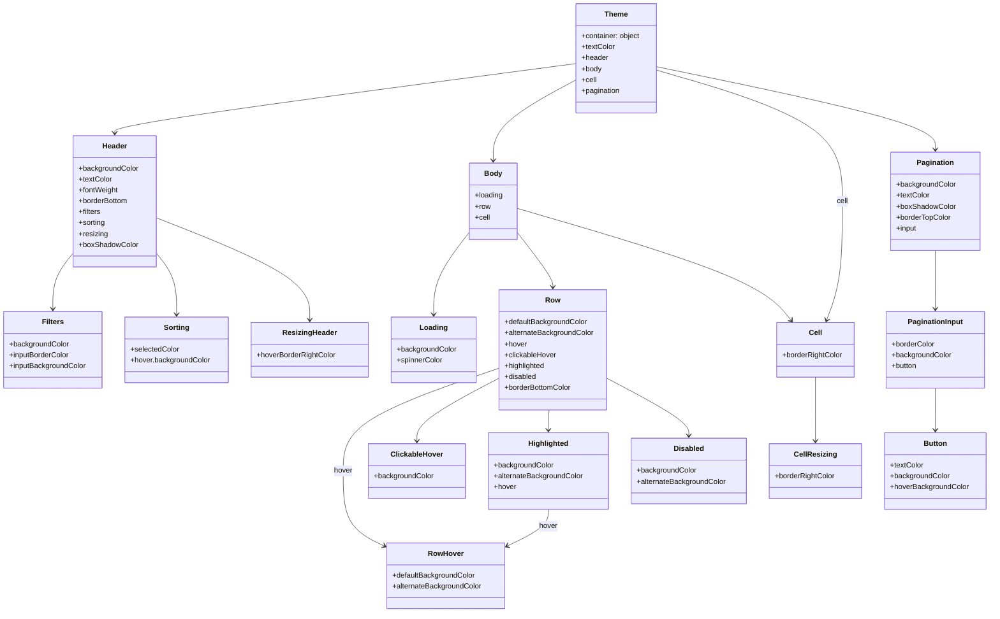

# Diagram: web/portal/src/components/organisms/base-table/Styles/Themes/DefaultTheme.js

> Auto-generated by Obscura crawlers

## Mermaid

### SVG

<svg id="container" width="2164.982421875" xmlns="http://www.w3.org/2000/svg" class="classDiagram" height="1344" viewBox="0 0 2164.982421875 1344" role="graphics-document document" aria-roledescription="class"><g><defs><marker id="container_class-aggregationStart" class="marker aggregation class" refX="18" refY="7" markerWidth="190" markerHeight="240" orient="auto"><path d="M 18,7 L9,13 L1,7 L9,1 Z"></path></marker></defs><defs><marker id="container_class-aggregationEnd" class="marker aggregation class" refX="1" refY="7" markerWidth="20" markerHeight="28" orient="auto"><path d="M 18,7 L9,13 L1,7 L9,1 Z"></path></marker></defs><defs><marker id="container_class-extensionStart" class="marker extension class" refX="18" refY="7" markerWidth="190" markerHeight="240" orient="auto"><path d="M 1,7 L18,13 V 1 Z"></path></marker></defs><defs><marker id="container_class-extensionEnd" class="marker extension class" refX="1" refY="7" markerWidth="20" markerHeight="28" orient="auto"><path d="M 1,1 V 13 L18,7 Z"></path></marker></defs><defs><marker id="container_class-compositionStart" class="marker composition class" refX="18" refY="7" markerWidth="190" markerHeight="240" orient="auto"><path d="M 18,7 L9,13 L1,7 L9,1 Z"></path></marker></defs><defs><marker id="container_class-compositionEnd" class="marker composition class" refX="1" refY="7" markerWidth="20" markerHeight="28" orient="auto"><path d="M 18,7 L9,13 L1,7 L9,1 Z"></path></marker></defs><defs><marker id="container_class-dependencyStart" class="marker dependency class" refX="6" refY="7" markerWidth="190" markerHeight="240" orient="auto"><path d="M 5,7 L9,13 L1,7 L9,1 Z"></path></marker></defs><defs><marker id="container_class-dependencyEnd" class="marker dependency class" refX="13" refY="7" markerWidth="20" markerHeight="28" orient="auto"><path d="M 18,7 L9,13 L14,7 L9,1 Z"></path></marker></defs><defs><marker id="container_class-lollipopStart" class="marker lollipop class" refX="13" refY="7" markerWidth="190" markerHeight="240" orient="auto"><circle stroke="black" fill="transparent" cx="7" cy="7" r="6"></circle></marker></defs><defs><marker id="container_class-lollipopEnd" class="marker lollipop class" refX="1" refY="7" markerWidth="190" markerHeight="240" orient="auto"><circle stroke="black" fill="transparent" cx="7" cy="7" r="6"></circle></marker></defs><g class="root"><g class="clusters"></g><g class="edgePaths"><path d="M1258.262,139.873L1090.603,162.061C922.943,184.249,587.625,228.624,419.966,253.979C252.307,279.333,252.307,285.667,252.307,288.833L252.307,292" id="id_Theme_Header_1" class="edge-thickness-normal edge-pattern-solid relation" style=";;;" data-edge="true" data-et="edge" data-id="id_Theme_Header_1" data-points="W3sieCI6MTI1OC4yNjE3MTg3NSwieSI6MTM5Ljg3MzI1ODY0MzI3OTIzfSx7IngiOjI1Mi4zMDY2NDA2MjUsInkiOjI3M30seyJ4IjoyNTIuMzA2NjQwNjI1LCJ5IjoyOTh9XQ==" marker-end="url(#container_class-dependencyEnd)"></path><path d="M1258.262,176.367L1228.386,192.472C1198.511,208.578,1138.76,240.789,1108.885,270.061C1079.01,299.333,1079.01,325.667,1079.01,338.833L1079.01,352" id="id_Theme_Body_2" class="edge-thickness-normal edge-pattern-solid relation" style=";;;" data-edge="true" data-et="edge" data-id="id_Theme_Body_2" data-points="W3sieCI6MTI1OC4yNjE3MTg3NSwieSI6MTc2LjM2NjY3NTYyMjQ5MDI1fSx7IngiOjEwNzkuMDA5NzY1NjI1LCJ5IjoyNzN9LHsieCI6MTA3OS4wMDk3NjU2MjUsInkiOjM1OH1d" marker-end="url(#container_class-dependencyEnd)"></path><path d="M1437.699,154.292L1505.212,174.077C1572.725,193.861,1707.75,233.431,1775.263,281.382C1842.775,329.333,1842.775,385.667,1842.775,442C1842.775,498.333,1842.775,554.667,1837.129,598.062C1831.482,641.458,1820.189,671.916,1814.543,687.145L1808.897,702.374" id="id_Theme_Cell_3" class="edge-thickness-normal edge-pattern-solid relation" style=";;;" data-edge="true" data-et="edge" data-id="id_Theme_Cell_3" data-points="W3sieCI6MTQzNy42OTkyMTg3NSwieSI6MTU0LjI5MjE0MjgxNDg0OTl9LHsieCI6MTg0Mi43NzUzOTA2MjUsInkiOjI3M30seyJ4IjoxODQyLjc3NTM5MDYyNSwieSI6NDQyfSx7IngiOjE4NDIuNzc1MzkwNjI1LCJ5Ijo2MTF9LHsieCI6MTgwNi44MTA2NzEyNzc4NjYzLCJ5Ijo3MDh9XQ==" marker-end="url(#container_class-dependencyEnd)"></path><path d="M1437.699,146.639L1539.074,167.699C1640.449,188.759,1843.198,230.88,1944.573,261.106C2045.947,291.333,2045.947,309.667,2045.947,318.833L2045.947,328" id="id_Theme_Pagination_4" class="edge-thickness-normal edge-pattern-solid relation" style=";;;" data-edge="true" data-et="edge" data-id="id_Theme_Pagination_4" data-points="W3sieCI6MTQzNy42OTkyMTg3NSwieSI6MTQ2LjYzODczNTgzNzA3MTR9LHsieCI6MjA0NS45NDcyNjU2MjUsInkiOjI3M30seyJ4IjoyMDQ1Ljk0NzI2NTYyNSwieSI6MzM0fV0=" marker-end="url(#container_class-dependencyEnd)"></path><path d="M161.318,555.224L153.848,564.52C146.378,573.816,131.437,592.408,123.966,612.871C116.496,633.333,116.496,655.667,116.496,666.833L116.496,678" id="id_Header_Filters_5" class="edge-thickness-normal edge-pattern-solid relation" style=";;;" data-edge="true" data-et="edge" data-id="id_Header_Filters_5" data-points="W3sieCI6MTYxLjMxODM1OTM3NSwieSI6NTU1LjIyNDA0NTQ0NDc0MDF9LHsieCI6MTE2LjQ5NjA5Mzc1LCJ5Ijo2MTF9LHsieCI6MTE2LjQ5NjA5Mzc1LCJ5Ijo2ODR9XQ==" marker-end="url(#container_class-dependencyEnd)"></path><path d="M343.295,555.224L350.765,564.52C358.236,573.816,373.176,592.408,380.647,614.871C388.117,637.333,388.117,663.667,388.117,676.833L388.117,690" id="id_Header_Sorting_6" class="edge-thickness-normal edge-pattern-solid relation" style=";;;" data-edge="true" data-et="edge" data-id="id_Header_Sorting_6" data-points="W3sieCI6MzQzLjI5NDkyMTg3NSwieSI6NTU1LjIyNDA0NTQ0NDc0MDF9LHsieCI6Mzg4LjExNzE4NzUsInkiOjYxMX0seyJ4IjozODguMTE3MTg3NSwieSI6Njk2fV0=" marker-end="url(#container_class-dependencyEnd)"></path><path d="M343.295,478.053L399.215,500.211C455.134,522.369,566.973,566.684,622.893,604.009C678.813,641.333,678.813,671.667,678.813,686.833L678.813,702" id="id_Header_ResizingHeader_7" class="edge-thickness-normal edge-pattern-solid relation" style=";;;" data-edge="true" data-et="edge" data-id="id_Header_ResizingHeader_7" data-points="W3sieCI6MzQzLjI5NDkyMTg3NSwieSI6NDc4LjA1MzQ3Nzc5Njk2MDI0fSx7IngiOjY3OC44MTI1LCJ5Ijo2MTF9LHsieCI6Njc4LjgxMjUsInkiOjcwOH1d" marker-end="url(#container_class-dependencyEnd)"></path><path d="M1026.6,509.926L1013.602,526.772C1000.604,543.617,974.609,577.309,961.611,607.321C948.613,637.333,948.613,663.667,948.613,676.833L948.613,690" id="id_Body_Loading_8" class="edge-thickness-normal edge-pattern-solid relation" style=";;;" data-edge="true" data-et="edge" data-id="id_Body_Loading_8" data-points="W3sieCI6MTAyNi41OTk2MDkzNzUsInkiOjUwOS45MjYwMzY4NzY3MTMxN30seyJ4Ijo5NDguNjEzMjgxMjUsInkiOjYxMX0seyJ4Ijo5NDguNjEzMjgxMjUsInkiOjY5Nn1d" marker-end="url(#container_class-dependencyEnd)"></path><path d="M1131.42,509.926L1144.418,526.772C1157.415,543.617,1183.411,577.309,1196.409,597.321C1209.406,617.333,1209.406,623.667,1209.406,626.833L1209.406,630" id="id_Body_Row_9" class="edge-thickness-normal edge-pattern-solid relation" style=";;;" data-edge="true" data-et="edge" data-id="id_Body_Row_9" data-points="W3sieCI6MTEzMS40MTk5MjE4NzUsInkiOjUwOS45MjYwMzY4NzY3MTMxN30seyJ4IjoxMjA5LjQwNjI1LCJ5Ijo2MTF9LHsieCI6MTIwOS40MDYyNSwieSI6NjM2fV0=" marker-end="url(#container_class-dependencyEnd)"></path><path d="M1131.42,457.351L1218.848,482.959C1306.277,508.567,1481.133,559.784,1581.168,600.785C1681.202,641.786,1706.414,672.572,1719.02,687.965L1731.626,703.358" id="id_Body_Cell_10" class="edge-thickness-normal edge-pattern-solid relation" style=";;;" data-edge="true" data-et="edge" data-id="id_Body_Cell_10" data-points="W3sieCI6MTEzMS40MTk5MjE4NzUsInkiOjQ1Ny4zNTExNTQ2NTA3NjEzfSx7IngiOjE2NTUuOTkwMjM0Mzc1LCJ5Ijo2MTF9LHsieCI6MTczNS40Mjc4MDkwMTY3MTk3LCJ5Ijo3MDh9XQ==" marker-end="url(#container_class-dependencyEnd)"></path><path d="M1090.844,808.568L1034.13,827.973C977.416,847.378,863.988,886.189,807.274,923.761C750.561,961.333,750.561,997.667,750.561,1036C750.561,1074.333,750.561,1114.667,765.436,1142.071C780.311,1169.476,810.061,1183.952,824.937,1191.19L839.812,1198.428" id="id_Row_RowHover_11" class="edge-thickness-normal edge-pattern-solid relation" style=";;;" data-edge="true" data-et="edge" data-id="id_Row_RowHover_11" data-points="W3sieCI6MTA5MC44NDM3NSwieSI6ODA4LjU2NzY5NDkyMDU5M30seyJ4Ijo3NTAuNTYwNTQ2ODc1LCJ5Ijo5MjV9LHsieCI6NzUwLjU2MDU0Njg3NSwieSI6MTAzNH0seyJ4Ijo3NTAuNTYwNTQ2ODc1LCJ5IjoxMTU1fSx7IngiOjg0NS4yMDcwMzEyNSwieSI6MTIwMS4wNTM2NDc1NjM0OTU2fV0=" marker-end="url(#container_class-dependencyEnd)"></path><path d="M1090.844,830.462L1060.936,846.218C1031.028,861.975,971.212,893.487,941.304,916.41C911.396,939.333,911.396,953.667,911.396,960.833L911.396,968" id="id_Row_ClickableHover_12" class="edge-thickness-normal edge-pattern-solid relation" style=";;;" data-edge="true" data-et="edge" data-id="id_Row_ClickableHover_12" data-points="W3sieCI6MTA5MC44NDM3NSwieSI6ODMwLjQ2MjA4ODk4ODc5OTV9LHsieCI6OTExLjM5NjQ4NDM3NSwieSI6OTI1fSx7IngiOjkxMS4zOTY0ODQzNzUsInkiOjk3NH1d" marker-end="url(#container_class-dependencyEnd)"></path><path d="M1200.304,900L1200.017,904.167C1199.729,908.333,1199.155,916.667,1198.867,924C1198.58,931.333,1198.58,937.667,1198.58,940.833L1198.58,944" id="id_Row_Highlighted_13" class="edge-thickness-normal edge-pattern-solid relation" style=";;;" data-edge="true" data-et="edge" data-id="id_Row_Highlighted_13" data-points="W3sieCI6MTIwMC4zMDM5OTA4NDM5NDkxLCJ5Ijo5MDB9LHsieCI6MTE5OC41ODAwNzgxMjUsInkiOjkyNX0seyJ4IjoxMTk4LjU4MDA3ODEyNSwieSI6OTUwfV0=" marker-end="url(#container_class-dependencyEnd)"></path><path d="M1327.969,830.462L1357.877,846.218C1387.785,861.975,1447.6,893.487,1477.508,914.41C1507.416,935.333,1507.416,945.667,1507.416,950.833L1507.416,956" id="id_Row_Disabled_14" class="edge-thickness-normal edge-pattern-solid relation" style=";;;" data-edge="true" data-et="edge" data-id="id_Row_Disabled_14" data-points="W3sieCI6MTMyNy45Njg3NSwieSI6ODMwLjQ2MjA4ODk4ODc5OTV9LHsieCI6MTUwNy40MTYwMTU2MjUsInkiOjkyNX0seyJ4IjoxNTA3LjQxNjAxNTYyNSwieSI6OTYyfV0=" marker-end="url(#container_class-dependencyEnd)"></path><path d="M1198.58,1118L1198.58,1124.167C1198.58,1130.333,1198.58,1142.667,1183.705,1156.071C1168.83,1169.476,1139.079,1183.952,1124.204,1191.19L1109.329,1198.428" id="id_Highlighted_RowHover_15" class="edge-thickness-normal edge-pattern-solid relation" style=";;;" data-edge="true" data-et="edge" data-id="id_Highlighted_RowHover_15" data-points="W3sieCI6MTE5OC41ODAwNzgxMjUsInkiOjExMTh9LHsieCI6MTE5OC41ODAwNzgxMjUsInkiOjExNTV9LHsieCI6MTEwMy45MzM1OTM3NSwieSI6MTIwMS4wNTM2NDc1NjM0OTU2fV0=" marker-end="url(#container_class-dependencyEnd)"></path><path d="M1784.564,828L1784.564,844.167C1784.564,860.333,1784.564,892.667,1784.564,916C1784.564,939.333,1784.564,953.667,1784.564,960.833L1784.564,968" id="id_Cell_CellResizing_16" class="edge-thickness-normal edge-pattern-solid relation" style=";;;" data-edge="true" data-et="edge" data-id="id_Cell_CellResizing_16" data-points="W3sieCI6MTc4NC41NjQ0NTMxMjUsInkiOjgyOH0seyJ4IjoxNzg0LjU2NDQ1MzEyNSwieSI6OTI1fSx7IngiOjE3ODQuNTY0NDUzMTI1LCJ5Ijo5NzR9XQ==" marker-end="url(#container_class-dependencyEnd)"></path><path d="M2045.947,550L2045.947,560.167C2045.947,570.333,2045.947,590.667,2045.947,612C2045.947,633.333,2045.947,655.667,2045.947,666.833L2045.947,678" id="id_Pagination_PaginationInput_17" class="edge-thickness-normal edge-pattern-solid relation" style=";;;" data-edge="true" data-et="edge" data-id="id_Pagination_PaginationInput_17" data-points="W3sieCI6MjA0NS45NDcyNjU2MjUsInkiOjU1MH0seyJ4IjoyMDQ1Ljk0NzI2NTYyNSwieSI6NjExfSx7IngiOjIwNDUuOTQ3MjY1NjI1LCJ5Ijo2ODR9XQ==" marker-end="url(#container_class-dependencyEnd)"></path><path d="M2045.947,852L2045.947,864.167C2045.947,876.333,2045.947,900.667,2045.947,916C2045.947,931.333,2045.947,937.667,2045.947,940.833L2045.947,944" id="id_PaginationInput_Button_18" class="edge-thickness-normal edge-pattern-solid relation" style=";;;" data-edge="true" data-et="edge" data-id="id_PaginationInput_Button_18" data-points="W3sieCI6MjA0NS45NDcyNjU2MjUsInkiOjg1Mn0seyJ4IjoyMDQ1Ljk0NzI2NTYyNSwieSI6OTI1fSx7IngiOjIwNDUuOTQ3MjY1NjI1LCJ5Ijo5NTB9XQ==" marker-end="url(#container_class-dependencyEnd)"></path></g><g class="edgeLabels"><g class="edgeLabel"><g class="label" data-id="id_Theme_Header_1" transform="translate(0, 0)"><foreignObject width="0" height="0">

</foreignObject></g></g><g class="edgeLabel"><g class="label" data-id="id_Theme_Body_2" transform="translate(0, 0)"><foreignObject width="0" height="0">

</foreignObject></g></g><g class="edgeLabel" transform="translate(1842.775390625, 442)"><g class="label" data-id="id_Theme_Cell_3" transform="translate(-12.71875, -12)"><foreignObject width="25.4375" height="24">

cell

</foreignObject></g></g><g class="edgeLabel"><g class="label" data-id="id_Theme_Pagination_4" transform="translate(0, 0)"><foreignObject width="0" height="0">

</foreignObject></g></g><g class="edgeLabel"><g class="label" data-id="id_Header_Filters_5" transform="translate(0, 0)"><foreignObject width="0" height="0">

</foreignObject></g></g><g class="edgeLabel"><g class="label" data-id="id_Header_Sorting_6" transform="translate(0, 0)"><foreignObject width="0" height="0">

</foreignObject></g></g><g class="edgeLabel"><g class="label" data-id="id_Header_ResizingHeader_7" transform="translate(0, 0)"><foreignObject width="0" height="0">

</foreignObject></g></g><g class="edgeLabel"><g class="label" data-id="id_Body_Loading_8" transform="translate(0, 0)"><foreignObject width="0" height="0">

</foreignObject></g></g><g class="edgeLabel"><g class="label" data-id="id_Body_Row_9" transform="translate(0, 0)"><foreignObject width="0" height="0">

</foreignObject></g></g><g class="edgeLabel"><g class="label" data-id="id_Body_Cell_10" transform="translate(0, 0)"><foreignObject width="0" height="0">

</foreignObject></g></g><g class="edgeLabel" transform="translate(750.560546875, 1034)"><g class="label" data-id="id_Row_RowHover_11" transform="translate(-20.6875, -12)"><foreignObject width="41.375" height="24">

hover

</foreignObject></g></g><g class="edgeLabel"><g class="label" data-id="id_Row_ClickableHover_12" transform="translate(0, 0)"><foreignObject width="0" height="0">

</foreignObject></g></g><g class="edgeLabel"><g class="label" data-id="id_Row_Highlighted_13" transform="translate(0, 0)"><foreignObject width="0" height="0">

</foreignObject></g></g><g class="edgeLabel"><g class="label" data-id="id_Row_Disabled_14" transform="translate(0, 0)"><foreignObject width="0" height="0">

</foreignObject></g></g><g class="edgeLabel" transform="translate(1198.580078125, 1155)"><g class="label" data-id="id_Highlighted_RowHover_15" transform="translate(-20.6875, -12)"><foreignObject width="41.375" height="24">

hover

</foreignObject></g></g><g class="edgeLabel"><g class="label" data-id="id_Cell_CellResizing_16" transform="translate(0, 0)"><foreignObject width="0" height="0">

</foreignObject></g></g><g class="edgeLabel"><g class="label" data-id="id_Pagination_PaginationInput_17" transform="translate(0, 0)"><foreignObject width="0" height="0">

</foreignObject></g></g><g class="edgeLabel"><g class="label" data-id="id_PaginationInput_Button_18" transform="translate(0, 0)"><foreignObject width="0" height="0">

</foreignObject></g></g></g><g class="nodes"><g class="node default" id="classId-Theme-0" transform="translate(1347.98046875, 128)"><g class="basic label-container"><path d="M-89.71875 -120 L89.71875 -120 L89.71875 120 L-89.71875 120" stroke="none" stroke-width="0" fill="#ECECFF" style=""></path><path d="M-89.71875 -120 C-53.816495974654345 -120, -17.91424194930869 -120, 89.71875 -120 M-89.71875 -120 C-35.28295358359393 -120, 19.15284283281214 -120, 89.71875 -120 M89.71875 -120 C89.71875 -30.87416680254273, 89.71875 58.25166639491454, 89.71875 120 M89.71875 -120 C89.71875 -55.117793787177334, 89.71875 9.764412425645332, 89.71875 120 M89.71875 120 C31.735070740976163 120, -26.248608518047675 120, -89.71875 120 M89.71875 120 C51.63519909594596 120, 13.551648191891914 120, -89.71875 120 M-89.71875 120 C-89.71875 39.47173170072843, -89.71875 -41.05653659854315, -89.71875 -120 M-89.71875 120 C-89.71875 55.05688125053072, -89.71875 -9.886237498938556, -89.71875 -120" stroke="#9370DB" stroke-width="1.3" fill="none" stroke-dasharray="0 0" style=""></path></g><g class="annotation-group text" transform="translate(0, -96)"></g><g class="label-group text" transform="translate(-24.53125, -96)"><g class="label" style="font-weight: bolder" transform="translate(0,-12)"><foreignObject width="49.0625" height="24">

Theme

</foreignObject></g></g><g class="members-group text" transform="translate(-77.71875, -48)"><g class="label" style="" transform="translate(0,-12)"><foreignObject width="130.90625" height="24">

+container: object

</foreignObject></g><g class="label" style="" transform="translate(0,12)"><foreignObject width="73.671875" height="24">

+textColor

</foreignObject></g><g class="label" style="" transform="translate(0,36)"><foreignObject width="59.09375" height="24">

+header

</foreignObject></g><g class="label" style="" transform="translate(0,60)"><foreignObject width="44.28125" height="24">

+body

</foreignObject></g><g class="label" style="" transform="translate(0,84)"><foreignObject width="33.421875" height="24">

+cell

</foreignObject></g><g class="label" style="" transform="translate(0,108)"><foreignObject width="85.796875" height="24">

+pagination

</foreignObject></g></g><g class="methods-group text" transform="translate(-77.71875, 120)"></g><g class="divider" style=""><path d="M-89.71875 -72 C-39.977005595880186 -72, 9.764738808239628 -72, 89.71875 -72 M-89.71875 -72 C-49.79545539909609 -72, -9.872160798192184 -72, 89.71875 -72" stroke="#9370DB" stroke-width="1.3" fill="none" stroke-dasharray="0 0" style=""></path></g><g class="divider" style=""><path d="M-89.71875 96 C-46.2856907620332 96, -2.852631524066396 96, 89.71875 96 M-89.71875 96 C-28.00805618394618 96, 33.70263763210764 96, 89.71875 96" stroke="#9370DB" stroke-width="1.3" fill="none" stroke-dasharray="0 0" style=""></path></g></g><g class="node default" id="classId-Header-1" transform="translate(252.306640625, 442)"><g class="basic label-container"><path d="M-90.98828125 -144 L90.98828125 -144 L90.98828125 144 L-90.98828125 144" stroke="none" stroke-width="0" fill="#ECECFF" style=""></path><path d="M-90.98828125 -144 C-34.6818190918374 -144, 21.624643066325206 -144, 90.98828125 -144 M-90.98828125 -144 C-20.881070032054325 -144, 49.22614118589135 -144, 90.98828125 -144 M90.98828125 -144 C90.98828125 -70.3815217308655, 90.98828125 3.2369565382689984, 90.98828125 144 M90.98828125 -144 C90.98828125 -50.458562314190914, 90.98828125 43.08287537161817, 90.98828125 144 M90.98828125 144 C21.572985818945554 144, -47.84230961210889 144, -90.98828125 144 M90.98828125 144 C49.6019101742829 144, 8.215539098565799 144, -90.98828125 144 M-90.98828125 144 C-90.98828125 50.83489479376378, -90.98828125 -42.33021041247244, -90.98828125 -144 M-90.98828125 144 C-90.98828125 78.48534563331476, -90.98828125 12.97069126662953, -90.98828125 -144" stroke="#9370DB" stroke-width="1.3" fill="none" stroke-dasharray="0 0" style=""></path></g><g class="annotation-group text" transform="translate(0, -120)"></g><g class="label-group text" transform="translate(-26.4765625, -120)"><g class="label" style="font-weight: bolder" transform="translate(0,-12)"><foreignObject width="52.953125" height="24">

Header

</foreignObject></g></g><g class="members-group text" transform="translate(-78.98828125, -72)"><g class="label" style="" transform="translate(0,-12)"><foreignObject width="131.5" height="24">

+backgroundColor

</foreignObject></g><g class="label" style="" transform="translate(0,12)"><foreignObject width="73.671875" height="24">

+textColor

</foreignObject></g><g class="label" style="" transform="translate(0,36)"><foreignObject width="87.203125" height="24">

+fontWeight

</foreignObject></g><g class="label" style="" transform="translate(0,60)"><foreignObject width="110.4375" height="24">

+borderBottom

</foreignObject></g><g class="label" style="" transform="translate(0,84)"><foreignObject width="49.296875" height="24">

+filters

</foreignObject></g><g class="label" style="" transform="translate(0,108)"><foreignObject width="58.96875" height="24">

+sorting

</foreignObject></g><g class="label" style="" transform="translate(0,132)"><foreignObject width="63.59375" height="24">

+resizing

</foreignObject></g><g class="label" style="" transform="translate(0,156)"><foreignObject width="129.75" height="24">

+boxShadowColor

</foreignObject></g></g><g class="methods-group text" transform="translate(-78.98828125, 144)"></g><g class="divider" style=""><path d="M-90.98828125 -96 C-50.347016972706456 -96, -9.705752695412912 -96, 90.98828125 -96 M-90.98828125 -96 C-53.96350655774741 -96, -16.938731865494816 -96, 90.98828125 -96" stroke="#9370DB" stroke-width="1.3" fill="none" stroke-dasharray="0 0" style=""></path></g><g class="divider" style=""><path d="M-90.98828125 120 C-29.03154970838164 120, 32.92518183323672 120, 90.98828125 120 M-90.98828125 120 C-51.25692766994856 120, -11.52557408989712 120, 90.98828125 120" stroke="#9370DB" stroke-width="1.3" fill="none" stroke-dasharray="0 0" style=""></path></g></g><g class="node default" id="classId-Filters-2" transform="translate(116.49609375, 768)"><g class="basic label-container"><path d="M-108.49609375 -84 L108.49609375 -84 L108.49609375 84 L-108.49609375 84" stroke="none" stroke-width="0" fill="#ECECFF" style=""></path><path d="M-108.49609375 -84 C-53.598366723889164 -84, 1.2993603022216718 -84, 108.49609375 -84 M-108.49609375 -84 C-44.07423641886534 -84, 20.34762091226932 -84, 108.49609375 -84 M108.49609375 -84 C108.49609375 -18.08887626721068, 108.49609375 47.82224746557864, 108.49609375 84 M108.49609375 -84 C108.49609375 -38.33321118270213, 108.49609375 7.333577634595741, 108.49609375 84 M108.49609375 84 C40.591465565412975 84, -27.31316261917405 84, -108.49609375 84 M108.49609375 84 C39.914078646874586 84, -28.66793645625083 84, -108.49609375 84 M-108.49609375 84 C-108.49609375 50.226557378916866, -108.49609375 16.45311475783373, -108.49609375 -84 M-108.49609375 84 C-108.49609375 24.57461164755047, -108.49609375 -34.85077670489906, -108.49609375 -84" stroke="#9370DB" stroke-width="1.3" fill="none" stroke-dasharray="0 0" style=""></path></g><g class="annotation-group text" transform="translate(0, -60)"></g><g class="label-group text" transform="translate(-22.6328125, -60)"><g class="label" style="font-weight: bolder" transform="translate(0,-12)"><foreignObject width="45.265625" height="24">

Filters

</foreignObject></g></g><g class="members-group text" transform="translate(-96.49609375, -12)"><g class="label" style="" transform="translate(0,-12)"><foreignObject width="131.5" height="24">

+backgroundColor

</foreignObject></g><g class="label" style="" transform="translate(0,12)"><foreignObject width="133.8125" height="24">

+inputBorderColor

</foreignObject></g><g class="label" style="" transform="translate(0,36)"><foreignObject width="170.359375" height="24">

+inputBackgroundColor

</foreignObject></g></g><g class="methods-group text" transform="translate(-96.49609375, 84)"></g><g class="divider" style=""><path d="M-108.49609375 -36 C-25.204322522048884 -36, 58.08744870590223 -36, 108.49609375 -36 M-108.49609375 -36 C-49.037328307708776 -36, 10.421437134582447 -36, 108.49609375 -36" stroke="#9370DB" stroke-width="1.3" fill="none" stroke-dasharray="0 0" style=""></path></g><g class="divider" style=""><path d="M-108.49609375 60 C-46.165550458842056 60, 16.16499283231589 60, 108.49609375 60 M-108.49609375 60 C-27.32180689044668 60, 53.85247996910664 60, 108.49609375 60" stroke="#9370DB" stroke-width="1.3" fill="none" stroke-dasharray="0 0" style=""></path></g></g><g class="node default" id="classId-Sorting-3" transform="translate(388.1171875, 768)"><g class="basic label-container"><path d="M-113.125 -72 L113.125 -72 L113.125 72 L-113.125 72" stroke="none" stroke-width="0" fill="#ECECFF" style=""></path><path d="M-113.125 -72 C-24.648255850674616 -72, 63.82848829865077 -72, 113.125 -72 M-113.125 -72 C-27.196423605767365 -72, 58.73215278846527 -72, 113.125 -72 M113.125 -72 C113.125 -28.111537352177052, 113.125 15.776925295645896, 113.125 72 M113.125 -72 C113.125 -43.168364963601064, 113.125 -14.336729927202121, 113.125 72 M113.125 72 C29.425606746295742 72, -54.273786507408516 72, -113.125 72 M113.125 72 C26.843064550485394 72, -59.43887089902921 72, -113.125 72 M-113.125 72 C-113.125 40.76529529408724, -113.125 9.530590588174476, -113.125 -72 M-113.125 72 C-113.125 31.674088492496914, -113.125 -8.651823015006173, -113.125 -72" stroke="#9370DB" stroke-width="1.3" fill="none" stroke-dasharray="0 0" style=""></path></g><g class="annotation-group text" transform="translate(0, -48)"></g><g class="label-group text" transform="translate(-26.828125, -48)"><g class="label" style="font-weight: bolder" transform="translate(0,-12)"><foreignObject width="53.65625" height="24">

Sorting

</foreignObject></g></g><g class="members-group text" transform="translate(-101.125, 0)"><g class="label" style="" transform="translate(0,-12)"><foreignObject width="107.09375" height="24">

+selectedColor

</foreignObject></g><g class="label" style="" transform="translate(0,12)"><foreignObject width="175.421875" height="24">

+hover.backgroundColor

</foreignObject></g></g><g class="methods-group text" transform="translate(-101.125, 72)"></g><g class="divider" style=""><path d="M-113.125 -24 C-30.557333949307605 -24, 52.01033210138479 -24, 113.125 -24 M-113.125 -24 C-31.56667962115776 -24, 49.99164075768448 -24, 113.125 -24" stroke="#9370DB" stroke-width="1.3" fill="none" stroke-dasharray="0 0" style=""></path></g><g class="divider" style=""><path d="M-113.125 48 C-36.25440544575149 48, 40.616189108497025 48, 113.125 48 M-113.125 48 C-53.468860769589575 48, 6.187278460820849 48, 113.125 48" stroke="#9370DB" stroke-width="1.3" fill="none" stroke-dasharray="0 0" style=""></path></g></g><g class="node default" id="classId-ResizingHeader-4" transform="translate(678.8125, 768)"><g class="basic label-container"><path d="M-127.5703125 -60 L127.5703125 -60 L127.5703125 60 L-127.5703125 60" stroke="none" stroke-width="0" fill="#ECECFF" style=""></path><path d="M-127.5703125 -60 C-48.66252791160922 -60, 30.245256676781565 -60, 127.5703125 -60 M-127.5703125 -60 C-46.2615350676397 -60, 35.0472423647206 -60, 127.5703125 -60 M127.5703125 -60 C127.5703125 -17.902838564602916, 127.5703125 24.194322870794167, 127.5703125 60 M127.5703125 -60 C127.5703125 -34.81777679292017, 127.5703125 -9.635553585840334, 127.5703125 60 M127.5703125 60 C70.4589617490471 60, 13.347610998094211 60, -127.5703125 60 M127.5703125 60 C44.57393495541331 60, -38.422442589173386 60, -127.5703125 60 M-127.5703125 60 C-127.5703125 17.194345745983398, -127.5703125 -25.611308508033204, -127.5703125 -60 M-127.5703125 60 C-127.5703125 24.076681183732376, -127.5703125 -11.846637632535248, -127.5703125 -60" stroke="#9370DB" stroke-width="1.3" fill="none" stroke-dasharray="0 0" style=""></path></g><g class="annotation-group text" transform="translate(0, -36)"></g><g class="label-group text" transform="translate(-56.78125, -36)"><g class="label" style="font-weight: bolder" transform="translate(0,-12)"><foreignObject width="113.5625" height="24">

ResizingHeader

</foreignObject></g></g><g class="members-group text" transform="translate(-115.5703125, 12)"><g class="label" style="" transform="translate(0,-12)"><foreignObject width="174.359375" height="24">

+hoverBorderRightColor

</foreignObject></g></g><g class="methods-group text" transform="translate(-115.5703125, 60)"></g><g class="divider" style=""><path d="M-127.5703125 -12 C-74.59710778605282 -12, -21.623903072105648 -12, 127.5703125 -12 M-127.5703125 -12 C-68.45358948220263 -12, -9.336866464405276 -12, 127.5703125 -12" stroke="#9370DB" stroke-width="1.3" fill="none" stroke-dasharray="0 0" style=""></path></g><g class="divider" style=""><path d="M-127.5703125 36 C-58.36164707438863 36, 10.847018351222744 36, 127.5703125 36 M-127.5703125 36 C-63.204438754005736 36, 1.1614349919885285 36, 127.5703125 36" stroke="#9370DB" stroke-width="1.3" fill="none" stroke-dasharray="0 0" style=""></path></g></g><g class="node default" id="classId-Body-5" transform="translate(1079.009765625, 442)"><g class="basic label-container"><path d="M-52.41015625 -84 L52.41015625 -84 L52.41015625 84 L-52.41015625 84" stroke="none" stroke-width="0" fill="#ECECFF" style=""></path><path d="M-52.41015625 -84 C-16.078718143528057 -84, 20.252719962943885 -84, 52.41015625 -84 M-52.41015625 -84 C-11.466221600008353 -84, 29.477713049983294 -84, 52.41015625 -84 M52.41015625 -84 C52.41015625 -42.35677795963677, 52.41015625 -0.7135559192735457, 52.41015625 84 M52.41015625 -84 C52.41015625 -49.041153873484305, 52.41015625 -14.08230774696861, 52.41015625 84 M52.41015625 84 C16.675911310649916 84, -19.05833362870017 84, -52.41015625 84 M52.41015625 84 C27.297299163834367 84, 2.1844420776687343 84, -52.41015625 84 M-52.41015625 84 C-52.41015625 21.290654512816033, -52.41015625 -41.418690974367934, -52.41015625 -84 M-52.41015625 84 C-52.41015625 19.078255189434856, -52.41015625 -45.84348962113029, -52.41015625 -84" stroke="#9370DB" stroke-width="1.3" fill="none" stroke-dasharray="0 0" style=""></path></g><g class="annotation-group text" transform="translate(0, -60)"></g><g class="label-group text" transform="translate(-18.5546875, -60)"><g class="label" style="font-weight: bolder" transform="translate(0,-12)"><foreignObject width="37.109375" height="24">

Body

</foreignObject></g></g><g class="members-group text" transform="translate(-40.41015625, -12)"><g class="label" style="" transform="translate(0,-12)"><foreignObject width="62.265625" height="24">

+loading

</foreignObject></g><g class="label" style="" transform="translate(0,12)"><foreignObject width="34.5" height="24">

+row

</foreignObject></g><g class="label" style="" transform="translate(0,36)"><foreignObject width="33.421875" height="24">

+cell

</foreignObject></g></g><g class="methods-group text" transform="translate(-40.41015625, 84)"></g><g class="divider" style=""><path d="M-52.41015625 -36 C-29.13615371287689 -36, -5.86215117575378 -36, 52.41015625 -36 M-52.41015625 -36 C-20.999026682659032 -36, 10.412102884681936 -36, 52.41015625 -36" stroke="#9370DB" stroke-width="1.3" fill="none" stroke-dasharray="0 0" style=""></path></g><g class="divider" style=""><path d="M-52.41015625 60 C-30.52199621940078 60, -8.63383618880156 60, 52.41015625 60 M-52.41015625 60 C-25.07421742916567 60, 2.261721391668658 60, 52.41015625 60" stroke="#9370DB" stroke-width="1.3" fill="none" stroke-dasharray="0 0" style=""></path></g></g><g class="node default" id="classId-Loading-6" transform="translate(948.61328125, 768)"><g class="basic label-container"><path d="M-92.23046875 -72 L92.23046875 -72 L92.23046875 72 L-92.23046875 72" stroke="none" stroke-width="0" fill="#ECECFF" style=""></path><path d="M-92.23046875 -72 C-51.61574089253178 -72, -11.001013035063565 -72, 92.23046875 -72 M-92.23046875 -72 C-35.450976158967066 -72, 21.328516432065868 -72, 92.23046875 -72 M92.23046875 -72 C92.23046875 -40.73010136590271, 92.23046875 -9.460202731805431, 92.23046875 72 M92.23046875 -72 C92.23046875 -18.044590613487557, 92.23046875 35.910818773024886, 92.23046875 72 M92.23046875 72 C45.977923937825246 72, -0.2746208743495089 72, -92.23046875 72 M92.23046875 72 C28.923281703370108 72, -34.383905343259784 72, -92.23046875 72 M-92.23046875 72 C-92.23046875 18.723852444742356, -92.23046875 -34.55229511051529, -92.23046875 -72 M-92.23046875 72 C-92.23046875 32.97556465041322, -92.23046875 -6.048870699173563, -92.23046875 -72" stroke="#9370DB" stroke-width="1.3" fill="none" stroke-dasharray="0 0" style=""></path></g><g class="annotation-group text" transform="translate(0, -48)"></g><g class="label-group text" transform="translate(-28.9609375, -48)"><g class="label" style="font-weight: bolder" transform="translate(0,-12)"><foreignObject width="57.921875" height="24">

Loading

</foreignObject></g></g><g class="members-group text" transform="translate(-80.23046875, 0)"><g class="label" style="" transform="translate(0,-12)"><foreignObject width="131.5" height="24">

+backgroundColor

</foreignObject></g><g class="label" style="" transform="translate(0,12)"><foreignObject width="101.234375" height="24">

+spinnerColor

</foreignObject></g></g><g class="methods-group text" transform="translate(-80.23046875, 72)"></g><g class="divider" style=""><path d="M-92.23046875 -24 C-34.0249874865952 -24, 24.180493776809598 -24, 92.23046875 -24 M-92.23046875 -24 C-27.835486088384286 -24, 36.55949657323143 -24, 92.23046875 -24" stroke="#9370DB" stroke-width="1.3" fill="none" stroke-dasharray="0 0" style=""></path></g><g class="divider" style=""><path d="M-92.23046875 48 C-45.675976306200454 48, 0.8785161375990924 48, 92.23046875 48 M-92.23046875 48 C-39.640564281018435 48, 12.94934018796313 48, 92.23046875 48" stroke="#9370DB" stroke-width="1.3" fill="none" stroke-dasharray="0 0" style=""></path></g></g><g class="node default" id="classId-Row-7" transform="translate(1209.40625, 768)"><g class="basic label-container"><path d="M-118.5625 -132 L118.5625 -132 L118.5625 132 L-118.5625 132" stroke="none" stroke-width="0" fill="#ECECFF" style=""></path><path d="M-118.5625 -132 C-40.747182044334025 -132, 37.06813591133195 -132, 118.5625 -132 M-118.5625 -132 C-67.8936723411691 -132, -17.224844682338187 -132, 118.5625 -132 M118.5625 -132 C118.5625 -53.29307927277877, 118.5625 25.413841454442462, 118.5625 132 M118.5625 -132 C118.5625 -61.28152224571258, 118.5625 9.43695550857484, 118.5625 132 M118.5625 132 C62.1022912215206 132, 5.642082443041204 132, -118.5625 132 M118.5625 132 C50.18063230186981 132, -18.201235396260387 132, -118.5625 132 M-118.5625 132 C-118.5625 72.96942334553293, -118.5625 13.938846691065848, -118.5625 -132 M-118.5625 132 C-118.5625 71.71226791845214, -118.5625 11.424535836904283, -118.5625 -132" stroke="#9370DB" stroke-width="1.3" fill="none" stroke-dasharray="0 0" style=""></path></g><g class="annotation-group text" transform="translate(0, -108)"></g><g class="label-group text" transform="translate(-15.484375, -108)"><g class="label" style="font-weight: bolder" transform="translate(0,-12)"><foreignObject width="30.96875" height="24">

Row

</foreignObject></g></g><g class="members-group text" transform="translate(-106.5625, -60)"><g class="label" style="" transform="translate(0,-12)"><foreignObject width="183.65625" height="24">

+defaultBackgroundColor

</foreignObject></g><g class="label" style="" transform="translate(0,12)"><foreignObject width="197.640625" height="24">

+alternateBackgroundColor

</foreignObject></g><g class="label" style="" transform="translate(0,36)"><foreignObject width="49.359375" height="24">

+hover

</foreignObject></g><g class="label" style="" transform="translate(0,60)"><foreignObject width="114.84375" height="24">

+clickableHover

</foreignObject></g><g class="label" style="" transform="translate(0,84)"><foreignObject width="90.296875" height="24">

+highlighted

</foreignObject></g><g class="label" style="" transform="translate(0,108)"><foreignObject width="70.484375" height="24">

+disabled

</foreignObject></g><g class="label" style="" transform="translate(0,132)"><foreignObject width="148.546875" height="24">

+borderBottomColor

</foreignObject></g></g><g class="methods-group text" transform="translate(-106.5625, 132)"></g><g class="divider" style=""><path d="M-118.5625 -84 C-57.45851150320042 -84, 3.6454769935991607 -84, 118.5625 -84 M-118.5625 -84 C-33.43855193181079 -84, 51.685396136378415 -84, 118.5625 -84" stroke="#9370DB" stroke-width="1.3" fill="none" stroke-dasharray="0 0" style=""></path></g><g class="divider" style=""><path d="M-118.5625 108 C-26.70379716706354 108, 65.15490566587292 108, 118.5625 108 M-118.5625 108 C-46.94905095168076 108, 24.66439809663848 108, 118.5625 108" stroke="#9370DB" stroke-width="1.3" fill="none" stroke-dasharray="0 0" style=""></path></g></g><g class="node default" id="classId-RowHover-8" transform="translate(974.5703125, 1264)"><g class="basic label-container"><path d="M-129.36328125 -72 L129.36328125 -72 L129.36328125 72 L-129.36328125 72" stroke="none" stroke-width="0" fill="#ECECFF" style=""></path><path d="M-129.36328125 -72 C-55.49381437217539 -72, 18.375652505649214 -72, 129.36328125 -72 M-129.36328125 -72 C-69.5931145056037 -72, -9.822947761207374 -72, 129.36328125 -72 M129.36328125 -72 C129.36328125 -39.51106948695213, 129.36328125 -7.022138973904262, 129.36328125 72 M129.36328125 -72 C129.36328125 -19.17602785645444, 129.36328125 33.64794428709112, 129.36328125 72 M129.36328125 72 C36.596093753611754 72, -56.17109374277649 72, -129.36328125 72 M129.36328125 72 C40.94271404271042 72, -47.47785316457916 72, -129.36328125 72 M-129.36328125 72 C-129.36328125 36.64243363650617, -129.36328125 1.2848672730123383, -129.36328125 -72 M-129.36328125 72 C-129.36328125 20.21852227331582, -129.36328125 -31.56295545336836, -129.36328125 -72" stroke="#9370DB" stroke-width="1.3" fill="none" stroke-dasharray="0 0" style=""></path></g><g class="annotation-group text" transform="translate(0, -48)"></g><g class="label-group text" transform="translate(-37.0859375, -48)"><g class="label" style="font-weight: bolder" transform="translate(0,-12)"><foreignObject width="74.171875" height="24">

RowHover

</foreignObject></g></g><g class="members-group text" transform="translate(-117.36328125, 0)"><g class="label" style="" transform="translate(0,-12)"><foreignObject width="183.65625" height="24">

+defaultBackgroundColor

</foreignObject></g><g class="label" style="" transform="translate(0,12)"><foreignObject width="197.640625" height="24">

+alternateBackgroundColor

</foreignObject></g></g><g class="methods-group text" transform="translate(-117.36328125, 72)"></g><g class="divider" style=""><path d="M-129.36328125 -24 C-52.94107499906231 -24, 23.481131251875382 -24, 129.36328125 -24 M-129.36328125 -24 C-43.659493784465 -24, 42.04429368107 -24, 129.36328125 -24" stroke="#9370DB" stroke-width="1.3" fill="none" stroke-dasharray="0 0" style=""></path></g><g class="divider" style=""><path d="M-129.36328125 48 C-36.240915381058755 48, 56.88145048788249 48, 129.36328125 48 M-129.36328125 48 C-52.716276238030716 48, 23.93072877393857 48, 129.36328125 48" stroke="#9370DB" stroke-width="1.3" fill="none" stroke-dasharray="0 0" style=""></path></g></g><g class="node default" id="classId-ClickableHover-9" transform="translate(911.396484375, 1034)"><g class="basic label-container"><path d="M-105.1484375 -60 L105.1484375 -60 L105.1484375 60 L-105.1484375 60" stroke="none" stroke-width="0" fill="#ECECFF" style=""></path><path d="M-105.1484375 -60 C-21.847688143807304 -60, 61.45306121238539 -60, 105.1484375 -60 M-105.1484375 -60 C-30.16242169653499 -60, 44.82359410693002 -60, 105.1484375 -60 M105.1484375 -60 C105.1484375 -35.21745387232615, 105.1484375 -10.434907744652307, 105.1484375 60 M105.1484375 -60 C105.1484375 -27.583022527480992, 105.1484375 4.833954945038016, 105.1484375 60 M105.1484375 60 C22.69318006032961 60, -59.76207737934078 60, -105.1484375 60 M105.1484375 60 C60.45711919039467 60, 15.765800880789342 60, -105.1484375 60 M-105.1484375 60 C-105.1484375 22.188194956324544, -105.1484375 -15.623610087350912, -105.1484375 -60 M-105.1484375 60 C-105.1484375 28.38253337824415, -105.1484375 -3.2349332435116978, -105.1484375 -60" stroke="#9370DB" stroke-width="1.3" fill="none" stroke-dasharray="0 0" style=""></path></g><g class="annotation-group text" transform="translate(0, -36)"></g><g class="label-group text" transform="translate(-54.796875, -36)"><g class="label" style="font-weight: bolder" transform="translate(0,-12)"><foreignObject width="109.59375" height="24">

ClickableHover

</foreignObject></g></g><g class="members-group text" transform="translate(-93.1484375, 12)"><g class="label" style="" transform="translate(0,-12)"><foreignObject width="131.5" height="24">

+backgroundColor

</foreignObject></g></g><g class="methods-group text" transform="translate(-93.1484375, 60)"></g><g class="divider" style=""><path d="M-105.1484375 -12 C-26.308187889587103 -12, 52.532061720825794 -12, 105.1484375 -12 M-105.1484375 -12 C-61.348332884172834 -12, -17.548228268345667 -12, 105.1484375 -12" stroke="#9370DB" stroke-width="1.3" fill="none" stroke-dasharray="0 0" style=""></path></g><g class="divider" style=""><path d="M-105.1484375 36 C-62.859893162607904 36, -20.571348825215807 36, 105.1484375 36 M-105.1484375 36 C-57.91975348414558 36, -10.691069468291161 36, 105.1484375 36" stroke="#9370DB" stroke-width="1.3" fill="none" stroke-dasharray="0 0" style=""></path></g></g><g class="node default" id="classId-Highlighted-10" transform="translate(1198.580078125, 1034)"><g class="basic label-container"><path d="M-132.03515625 -84 L132.03515625 -84 L132.03515625 84 L-132.03515625 84" stroke="none" stroke-width="0" fill="#ECECFF" style=""></path><path d="M-132.03515625 -84 C-66.46062383038115 -84, -0.8860914107623046 -84, 132.03515625 -84 M-132.03515625 -84 C-63.03819213640452 -84, 5.958771977190963 -84, 132.03515625 -84 M132.03515625 -84 C132.03515625 -40.52185445043892, 132.03515625 2.9562910991221543, 132.03515625 84 M132.03515625 -84 C132.03515625 -37.40742495885333, 132.03515625 9.185150082293333, 132.03515625 84 M132.03515625 84 C49.69663920860229 84, -32.641877832795416 84, -132.03515625 84 M132.03515625 84 C76.11043372400107 84, 20.185711198002124 84, -132.03515625 84 M-132.03515625 84 C-132.03515625 37.75089342614665, -132.03515625 -8.498213147706707, -132.03515625 -84 M-132.03515625 84 C-132.03515625 22.600528949284232, -132.03515625 -38.798942101431535, -132.03515625 -84" stroke="#9370DB" stroke-width="1.3" fill="none" stroke-dasharray="0 0" style=""></path></g><g class="annotation-group text" transform="translate(0, -60)"></g><g class="label-group text" transform="translate(-42.4296875, -60)"><g class="label" style="font-weight: bolder" transform="translate(0,-12)"><foreignObject width="84.859375" height="24">

Highlighted

</foreignObject></g></g><g class="members-group text" transform="translate(-120.03515625, -12)"><g class="label" style="" transform="translate(0,-12)"><foreignObject width="131.5" height="24">

+backgroundColor

</foreignObject></g><g class="label" style="" transform="translate(0,12)"><foreignObject width="197.640625" height="24">

+alternateBackgroundColor

</foreignObject></g><g class="label" style="" transform="translate(0,36)"><foreignObject width="49.359375" height="24">

+hover

</foreignObject></g></g><g class="methods-group text" transform="translate(-120.03515625, 84)"></g><g class="divider" style=""><path d="M-132.03515625 -36 C-56.53887316083262 -36, 18.957409928334755 -36, 132.03515625 -36 M-132.03515625 -36 C-50.84112740920098 -36, 30.352901431598042 -36, 132.03515625 -36" stroke="#9370DB" stroke-width="1.3" fill="none" stroke-dasharray="0 0" style=""></path></g><g class="divider" style=""><path d="M-132.03515625 60 C-72.61235367703077 60, -13.18955110406155 60, 132.03515625 60 M-132.03515625 60 C-57.74941783147685 60, 16.536320587046305 60, 132.03515625 60" stroke="#9370DB" stroke-width="1.3" fill="none" stroke-dasharray="0 0" style=""></path></g></g><g class="node default" id="classId-Disabled-11" transform="translate(1507.416015625, 1034)"><g class="basic label-container"><path d="M-126.80078125 -72 L126.80078125 -72 L126.80078125 72 L-126.80078125 72" stroke="none" stroke-width="0" fill="#ECECFF" style=""></path><path d="M-126.80078125 -72 C-41.9822532019388 -72, 42.83627484612239 -72, 126.80078125 -72 M-126.80078125 -72 C-40.29471273875677 -72, 46.211355772486456 -72, 126.80078125 -72 M126.80078125 -72 C126.80078125 -35.07496145320349, 126.80078125 1.8500770935930149, 126.80078125 72 M126.80078125 -72 C126.80078125 -16.028823840795475, 126.80078125 39.94235231840905, 126.80078125 72 M126.80078125 72 C30.376205567923748 72, -66.0483701141525 72, -126.80078125 72 M126.80078125 72 C66.29783551465431 72, 5.794889779308633 72, -126.80078125 72 M-126.80078125 72 C-126.80078125 40.079846105367565, -126.80078125 8.159692210735123, -126.80078125 -72 M-126.80078125 72 C-126.80078125 31.693386598880515, -126.80078125 -8.61322680223897, -126.80078125 -72" stroke="#9370DB" stroke-width="1.3" fill="none" stroke-dasharray="0 0" style=""></path></g><g class="annotation-group text" transform="translate(0, -48)"></g><g class="label-group text" transform="translate(-31.9609375, -48)"><g class="label" style="font-weight: bolder" transform="translate(0,-12)"><foreignObject width="63.921875" height="24">

Disabled

</foreignObject></g></g><g class="members-group text" transform="translate(-114.80078125, 0)"><g class="label" style="" transform="translate(0,-12)"><foreignObject width="131.5" height="24">

+backgroundColor

</foreignObject></g><g class="label" style="" transform="translate(0,12)"><foreignObject width="197.640625" height="24">

+alternateBackgroundColor

</foreignObject></g></g><g class="methods-group text" transform="translate(-114.80078125, 72)"></g><g class="divider" style=""><path d="M-126.80078125 -24 C-64.27249485550162 -24, -1.7442084610032396 -24, 126.80078125 -24 M-126.80078125 -24 C-70.06810697420971 -24, -13.335432698419439 -24, 126.80078125 -24" stroke="#9370DB" stroke-width="1.3" fill="none" stroke-dasharray="0 0" style=""></path></g><g class="divider" style=""><path d="M-126.80078125 48 C-66.40035243667236 48, -5.999923623344742 48, 126.80078125 48 M-126.80078125 48 C-56.98969983466094 48, 12.821381580678121 48, 126.80078125 48" stroke="#9370DB" stroke-width="1.3" fill="none" stroke-dasharray="0 0" style=""></path></g></g><g class="node default" id="classId-Cell-12" transform="translate(1784.564453125, 768)"><g class="basic label-container"><path d="M-85.1953125 -60 L85.1953125 -60 L85.1953125 60 L-85.1953125 60" stroke="none" stroke-width="0" fill="#ECECFF" style=""></path><path d="M-85.1953125 -60 C-48.166453741686446 -60, -11.137594983372892 -60, 85.1953125 -60 M-85.1953125 -60 C-46.61051047697116 -60, -8.025708453942315 -60, 85.1953125 -60 M85.1953125 -60 C85.1953125 -16.40550919286858, 85.1953125 27.188981614262843, 85.1953125 60 M85.1953125 -60 C85.1953125 -25.826693565131336, 85.1953125 8.346612869737328, 85.1953125 60 M85.1953125 60 C48.299668285762394 60, 11.404024071524788 60, -85.1953125 60 M85.1953125 60 C20.4663019685309 60, -44.2627085629382 60, -85.1953125 60 M-85.1953125 60 C-85.1953125 16.583681114903612, -85.1953125 -26.832637770192775, -85.1953125 -60 M-85.1953125 60 C-85.1953125 24.50648983365516, -85.1953125 -10.987020332689681, -85.1953125 -60" stroke="#9370DB" stroke-width="1.3" fill="none" stroke-dasharray="0 0" style=""></path></g><g class="annotation-group text" transform="translate(0, -36)"></g><g class="label-group text" transform="translate(-13.609375, -36)"><g class="label" style="font-weight: bolder" transform="translate(0,-12)"><foreignObject width="27.21875" height="24">

Cell

</foreignObject></g></g><g class="members-group text" transform="translate(-73.1953125, 12)"><g class="label" style="" transform="translate(0,-12)"><foreignObject width="132.78125" height="24">

+borderRightColor

</foreignObject></g></g><g class="methods-group text" transform="translate(-73.1953125, 60)"></g><g class="divider" style=""><path d="M-85.1953125 -12 C-24.095003632203053 -12, 37.005305235593895 -12, 85.1953125 -12 M-85.1953125 -12 C-44.804985683184334 -12, -4.4146588663686686 -12, 85.1953125 -12" stroke="#9370DB" stroke-width="1.3" fill="none" stroke-dasharray="0 0" style=""></path></g><g class="divider" style=""><path d="M-85.1953125 36 C-31.250226796417138 36, 22.694858907165724 36, 85.1953125 36 M-85.1953125 36 C-25.063847302487012 36, 35.067617895025975 36, 85.1953125 36" stroke="#9370DB" stroke-width="1.3" fill="none" stroke-dasharray="0 0" style=""></path></g></g><g class="node default" id="classId-CellResizing-13" transform="translate(1784.564453125, 1034)"><g class="basic label-container"><path d="M-100.34765625 -60 L100.34765625 -60 L100.34765625 60 L-100.34765625 60" stroke="none" stroke-width="0" fill="#ECECFF" style=""></path><path d="M-100.34765625 -60 C-59.989046628333654 -60, -19.630437006667307 -60, 100.34765625 -60 M-100.34765625 -60 C-49.1845236583511 -60, 1.9786089332978065 -60, 100.34765625 -60 M100.34765625 -60 C100.34765625 -17.104530933989388, 100.34765625 25.790938132021225, 100.34765625 60 M100.34765625 -60 C100.34765625 -24.13106955184373, 100.34765625 11.73786089631254, 100.34765625 60 M100.34765625 60 C48.31740517386992 60, -3.712845902260156 60, -100.34765625 60 M100.34765625 60 C20.922688201739888 60, -58.502279846520224 60, -100.34765625 60 M-100.34765625 60 C-100.34765625 23.45354429690226, -100.34765625 -13.092911406195483, -100.34765625 -60 M-100.34765625 60 C-100.34765625 15.045341970146396, -100.34765625 -29.90931605970721, -100.34765625 -60" stroke="#9370DB" stroke-width="1.3" fill="none" stroke-dasharray="0 0" style=""></path></g><g class="annotation-group text" transform="translate(0, -36)"></g><g class="label-group text" transform="translate(-43.9140625, -36)"><g class="label" style="font-weight: bolder" transform="translate(0,-12)"><foreignObject width="87.828125" height="24">

CellResizing

</foreignObject></g></g><g class="members-group text" transform="translate(-88.34765625, 12)"><g class="label" style="" transform="translate(0,-12)"><foreignObject width="132.78125" height="24">

+borderRightColor

</foreignObject></g></g><g class="methods-group text" transform="translate(-88.34765625, 60)"></g><g class="divider" style=""><path d="M-100.34765625 -12 C-49.490352239132875 -12, 1.36695177173425 -12, 100.34765625 -12 M-100.34765625 -12 C-27.721121519028358 -12, 44.905413211943284 -12, 100.34765625 -12" stroke="#9370DB" stroke-width="1.3" fill="none" stroke-dasharray="0 0" style=""></path></g><g class="divider" style=""><path d="M-100.34765625 36 C-46.487465058487025 36, 7.3727261330259495 36, 100.34765625 36 M-100.34765625 36 C-34.50799316854855 36, 31.331669912902896 36, 100.34765625 36" stroke="#9370DB" stroke-width="1.3" fill="none" stroke-dasharray="0 0" style=""></path></g></g><g class="node default" id="classId-Pagination-14" transform="translate(2045.947265625, 442)"><g class="basic label-container"><path d="M-97.2421875 -108 L97.2421875 -108 L97.2421875 108 L-97.2421875 108" stroke="none" stroke-width="0" fill="#ECECFF" style=""></path><path d="M-97.2421875 -108 C-48.758357898503625 -108, -0.2745282970072509 -108, 97.2421875 -108 M-97.2421875 -108 C-33.592101038462154 -108, 30.057985423075692 -108, 97.2421875 -108 M97.2421875 -108 C97.2421875 -64.5152814781982, 97.2421875 -21.030562956396423, 97.2421875 108 M97.2421875 -108 C97.2421875 -31.950198929534835, 97.2421875 44.09960214093033, 97.2421875 108 M97.2421875 108 C47.67817651531221 108, -1.885834469375581 108, -97.2421875 108 M97.2421875 108 C53.37105754106412 108, 9.499927582128237 108, -97.2421875 108 M-97.2421875 108 C-97.2421875 39.6199301494143, -97.2421875 -28.760139701171397, -97.2421875 -108 M-97.2421875 108 C-97.2421875 36.29492261101787, -97.2421875 -35.410154777964266, -97.2421875 -108" stroke="#9370DB" stroke-width="1.3" fill="none" stroke-dasharray="0 0" style=""></path></g><g class="annotation-group text" transform="translate(0, -84)"></g><g class="label-group text" transform="translate(-38.984375, -84)"><g class="label" style="font-weight: bolder" transform="translate(0,-12)"><foreignObject width="77.96875" height="24">

Pagination

</foreignObject></g></g><g class="members-group text" transform="translate(-85.2421875, -36)"><g class="label" style="" transform="translate(0,-12)"><foreignObject width="131.5" height="24">

+backgroundColor

</foreignObject></g><g class="label" style="" transform="translate(0,12)"><foreignObject width="73.671875" height="24">

+textColor

</foreignObject></g><g class="label" style="" transform="translate(0,36)"><foreignObject width="129.75" height="24">

+boxShadowColor

</foreignObject></g><g class="label" style="" transform="translate(0,60)"><foreignObject width="121.359375" height="24">

+borderTopColor

</foreignObject></g><g class="label" style="" transform="translate(0,84)"><foreignObject width="46.46875" height="24">

+input

</foreignObject></g></g><g class="methods-group text" transform="translate(-85.2421875, 108)"></g><g class="divider" style=""><path d="M-97.2421875 -60 C-32.875022196678856 -60, 31.49214310664229 -60, 97.2421875 -60 M-97.2421875 -60 C-19.92819286899497 -60, 57.38580176201006 -60, 97.2421875 -60" stroke="#9370DB" stroke-width="1.3" fill="none" stroke-dasharray="0 0" style=""></path></g><g class="divider" style=""><path d="M-97.2421875 84 C-37.93197775533374 84, 21.37823198933252 84, 97.2421875 84 M-97.2421875 84 C-47.602219260680954 84, 2.037748978638092 84, 97.2421875 84" stroke="#9370DB" stroke-width="1.3" fill="none" stroke-dasharray="0 0" style=""></path></g></g><g class="node default" id="classId-PaginationInput-15" transform="translate(2045.947265625, 768)"><g class="basic label-container"><path d="M-106.9453125 -84 L106.9453125 -84 L106.9453125 84 L-106.9453125 84" stroke="none" stroke-width="0" fill="#ECECFF" style=""></path><path d="M-106.9453125 -84 C-31.700867461809366 -84, 43.54357757638127 -84, 106.9453125 -84 M-106.9453125 -84 C-59.31532763228529 -84, -11.685342764570578 -84, 106.9453125 -84 M106.9453125 -84 C106.9453125 -46.68161531101559, 106.9453125 -9.363230622031182, 106.9453125 84 M106.9453125 -84 C106.9453125 -48.569588918474416, 106.9453125 -13.139177836948832, 106.9453125 84 M106.9453125 84 C62.39753563480892 84, 17.849758769617836 84, -106.9453125 84 M106.9453125 84 C47.87390379002823 84, -11.19750491994354 84, -106.9453125 84 M-106.9453125 84 C-106.9453125 25.496855733877304, -106.9453125 -33.00628853224539, -106.9453125 -84 M-106.9453125 84 C-106.9453125 22.543188452844092, -106.9453125 -38.913623094311816, -106.9453125 -84" stroke="#9370DB" stroke-width="1.3" fill="none" stroke-dasharray="0 0" style=""></path></g><g class="annotation-group text" transform="translate(0, -60)"></g><g class="label-group text" transform="translate(-58.390625, -60)"><g class="label" style="font-weight: bolder" transform="translate(0,-12)"><foreignObject width="116.78125" height="24">

PaginationInput

</foreignObject></g></g><g class="members-group text" transform="translate(-94.9453125, -12)"><g class="label" style="" transform="translate(0,-12)"><foreignObject width="95.109375" height="24">

+borderColor

</foreignObject></g><g class="label" style="" transform="translate(0,12)"><foreignObject width="131.5" height="24">

+backgroundColor

</foreignObject></g><g class="label" style="" transform="translate(0,36)"><foreignObject width="56.84375" height="24">

+button

</foreignObject></g></g><g class="methods-group text" transform="translate(-94.9453125, 84)"></g><g class="divider" style=""><path d="M-106.9453125 -36 C-60.71618868646213 -36, -14.487064872924265 -36, 106.9453125 -36 M-106.9453125 -36 C-22.232056141894518 -36, 62.481200216210965 -36, 106.9453125 -36" stroke="#9370DB" stroke-width="1.3" fill="none" stroke-dasharray="0 0" style=""></path></g><g class="divider" style=""><path d="M-106.9453125 60 C-46.029785902614435 60, 14.88574069477113 60, 106.9453125 60 M-106.9453125 60 C-32.763313595293994 60, 41.41868530941201 60, 106.9453125 60" stroke="#9370DB" stroke-width="1.3" fill="none" stroke-dasharray="0 0" style=""></path></g></g><g class="node default" id="classId-Button-16" transform="translate(2045.947265625, 1034)"><g class="basic label-container"><path d="M-111.03515625 -84 L111.03515625 -84 L111.03515625 84 L-111.03515625 84" stroke="none" stroke-width="0" fill="#ECECFF" style=""></path><path d="M-111.03515625 -84 C-38.07144645947868 -84, 34.89226333104264 -84, 111.03515625 -84 M-111.03515625 -84 C-24.090411778175422 -84, 62.854332693649155 -84, 111.03515625 -84 M111.03515625 -84 C111.03515625 -23.8971654302563, 111.03515625 36.2056691394874, 111.03515625 84 M111.03515625 -84 C111.03515625 -42.699831973632826, 111.03515625 -1.3996639472656511, 111.03515625 84 M111.03515625 84 C40.086338253927494 84, -30.862479742145013 84, -111.03515625 84 M111.03515625 84 C22.44005285770092 84, -66.15505053459816 84, -111.03515625 84 M-111.03515625 84 C-111.03515625 19.232875305854677, -111.03515625 -45.53424938829065, -111.03515625 -84 M-111.03515625 84 C-111.03515625 20.187601509071307, -111.03515625 -43.624796981857386, -111.03515625 -84" stroke="#9370DB" stroke-width="1.3" fill="none" stroke-dasharray="0 0" style=""></path></g><g class="annotation-group text" transform="translate(0, -60)"></g><g class="label-group text" transform="translate(-24.8359375, -60)"><g class="label" style="font-weight: bolder" transform="translate(0,-12)"><foreignObject width="49.671875" height="24">

Button

</foreignObject></g></g><g class="members-group text" transform="translate(-99.03515625, -12)"><g class="label" style="" transform="translate(0,-12)"><foreignObject width="73.671875" height="24">

+textColor

</foreignObject></g><g class="label" style="" transform="translate(0,12)"><foreignObject width="131.5" height="24">

+backgroundColor

</foreignObject></g><g class="label" style="" transform="translate(0,36)"><foreignObject width="173.234375" height="24">

+hoverBackgroundColor

</foreignObject></g></g><g class="methods-group text" transform="translate(-99.03515625, 84)"></g><g class="divider" style=""><path d="M-111.03515625 -36 C-57.02206667880009 -36, -3.008977107600174 -36, 111.03515625 -36 M-111.03515625 -36 C-30.957455235483053 -36, 49.120245779033894 -36, 111.03515625 -36" stroke="#9370DB" stroke-width="1.3" fill="none" stroke-dasharray="0 0" style=""></path></g><g class="divider" style=""><path d="M-111.03515625 60 C-35.74615282090066 60, 39.54285060819868 60, 111.03515625 60 M-111.03515625 60 C-65.88673465887601 60, -20.738313067752017 60, 111.03515625 60" stroke="#9370DB" stroke-width="1.3" fill="none" stroke-dasharray="0 0" style=""></path></g></g></g></g></g></svg>
