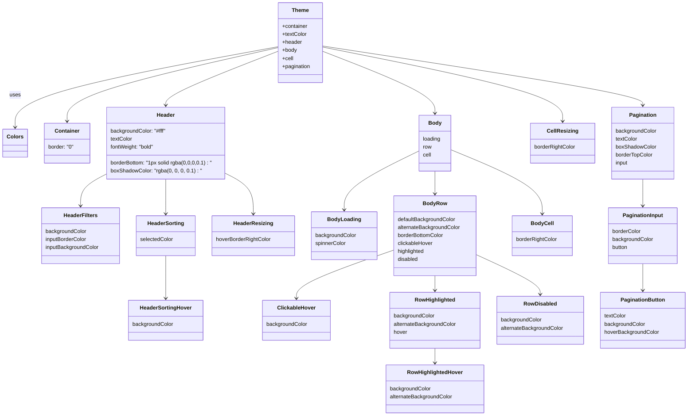

# Diagram: web/portal/src/components/organisms/base-table/Styles/Themes/LightChildTheme.js

> Auto-generated by Obscura crawlers

## Mermaid

### SVG

<svg id="container" width="2055.0625" xmlns="http://www.w3.org/2000/svg" class="classDiagram" height="1248" viewBox="0 0 2055.0625 1248" role="graphics-document document" aria-roledescription="class"><g><defs><marker id="container_class-aggregationStart" class="marker aggregation class" refX="18" refY="7" markerWidth="190" markerHeight="240" orient="auto"><path d="M 18,7 L9,13 L1,7 L9,1 Z"></path></marker></defs><defs><marker id="container_class-aggregationEnd" class="marker aggregation class" refX="1" refY="7" markerWidth="20" markerHeight="28" orient="auto"><path d="M 18,7 L9,13 L1,7 L9,1 Z"></path></marker></defs><defs><marker id="container_class-extensionStart" class="marker extension class" refX="18" refY="7" markerWidth="190" markerHeight="240" orient="auto"><path d="M 1,7 L18,13 V 1 Z"></path></marker></defs><defs><marker id="container_class-extensionEnd" class="marker extension class" refX="1" refY="7" markerWidth="20" markerHeight="28" orient="auto"><path d="M 1,1 V 13 L18,7 Z"></path></marker></defs><defs><marker id="container_class-compositionStart" class="marker composition class" refX="18" refY="7" markerWidth="190" markerHeight="240" orient="auto"><path d="M 18,7 L9,13 L1,7 L9,1 Z"></path></marker></defs><defs><marker id="container_class-compositionEnd" class="marker composition class" refX="1" refY="7" markerWidth="20" markerHeight="28" orient="auto"><path d="M 18,7 L9,13 L1,7 L9,1 Z"></path></marker></defs><defs><marker id="container_class-dependencyStart" class="marker dependency class" refX="6" refY="7" markerWidth="190" markerHeight="240" orient="auto"><path d="M 5,7 L9,13 L1,7 L9,1 Z"></path></marker></defs><defs><marker id="container_class-dependencyEnd" class="marker dependency class" refX="13" refY="7" markerWidth="20" markerHeight="28" orient="auto"><path d="M 18,7 L9,13 L14,7 L9,1 Z"></path></marker></defs><defs><marker id="container_class-lollipopStart" class="marker lollipop class" refX="13" refY="7" markerWidth="190" markerHeight="240" orient="auto"><circle stroke="black" fill="transparent" cx="7" cy="7" r="6"></circle></marker></defs><defs><marker id="container_class-lollipopEnd" class="marker lollipop class" refX="1" refY="7" markerWidth="190" markerHeight="240" orient="auto"><circle stroke="black" fill="transparent" cx="7" cy="7" r="6"></circle></marker></defs><g class="root"><g class="clusters"></g><g class="edgePaths"><path d="M827.416,140.384L696.697,164.487C565.978,188.589,304.54,236.795,173.821,277.064C43.102,317.333,43.102,349.667,43.102,365.833L43.102,382" id="id_Theme_Colors_1" class="edge-thickness-normal edge-pattern-solid relation" style=";;;" data-edge="true" data-et="edge" data-id="id_Theme_Colors_1" data-points="W3sieCI6ODI3LjQxNjAxNTYyNSwieSI6MTQwLjM4NDA1NjIyNTcyODY3fSx7IngiOjQzLjEwMTU2MjUsInkiOjI4NX0seyJ4Ijo0My4xMDE1NjI1LCJ5IjozODh9XQ==" marker-end="url(#container_class-dependencyEnd)"></path><path d="M827.416,143.123L722.399,166.769C617.383,190.415,407.35,237.708,302.333,274.521C197.316,311.333,197.316,337.667,197.316,350.833L197.316,364" id="id_Theme_Container_2" class="edge-thickness-normal edge-pattern-solid relation" style=";;;" data-edge="true" data-et="edge" data-id="id_Theme_Container_2" data-points="W3sieCI6ODI3LjQxNjAxNTYyNSwieSI6MTQzLjEyMzA1NjM2NzEwNDY4fSx7IngiOjE5Ny4zMTY0MDYyNSwieSI6Mjg1fSx7IngiOjE5Ny4zMTY0MDYyNSwieSI6MzcwfV0=" marker-end="url(#container_class-dependencyEnd)"></path><path d="M827.416,154.219L771.58,176.016C715.745,197.813,604.074,241.406,548.238,268.37C492.402,295.333,492.402,305.667,492.402,310.833L492.402,316" id="id_Theme_Header_3" class="edge-thickness-normal edge-pattern-solid relation" style=";;;" data-edge="true" data-et="edge" data-id="id_Theme_Header_3" data-points="W3sieCI6ODI3LjQxNjAxNTYyNSwieSI6MTU0LjIxOTE0ODY3Nzg1MjV9LHsieCI6NDkyLjQwMjM0Mzc1LCJ5IjoyODV9LHsieCI6NDkyLjQwMjM0Mzc1LCJ5IjozMjJ9XQ==" marker-end="url(#container_class-dependencyEnd)"></path><path d="M316.43,521.443L303.101,528.369C289.772,535.295,263.115,549.148,249.786,565.24C236.457,581.333,236.457,599.667,236.457,608.833L236.457,618" id="id_Header_HeaderFilters_4" class="edge-thickness-normal edge-pattern-solid relation" style=";;;" data-edge="true" data-et="edge" data-id="id_Header_HeaderFilters_4" data-points="W3sieCI6MzE2LjQyOTY4NzUsInkiOjUyMS40NDI4MjgzNjI5OTI2fSx7IngiOjIzNi40NTcwMzEyNSwieSI6NTYzfSx7IngiOjIzNi40NTcwMzEyNSwieSI6NjI0fV0=" marker-end="url(#container_class-dependencyEnd)"></path><path d="M492.402,538L492.402,542.167C492.402,546.333,492.402,554.667,492.402,572C492.402,589.333,492.402,615.667,492.402,628.833L492.402,642" id="id_Header_HeaderSorting_5" class="edge-thickness-normal edge-pattern-solid relation" style=";;;" data-edge="true" data-et="edge" data-id="id_Header_HeaderSorting_5" data-points="W3sieCI6NDkyLjQwMjM0Mzc1LCJ5Ijo1Mzh9LHsieCI6NDkyLjQwMjM0Mzc1LCJ5Ijo1NjN9LHsieCI6NDkyLjQwMjM0Mzc1LCJ5Ijo2NDh9XQ==" marker-end="url(#container_class-dependencyEnd)"></path><path d="M492.402,768L492.402,782.167C492.402,796.333,492.402,824.667,492.402,846C492.402,867.333,492.402,881.667,492.402,888.833L492.402,896" id="id_HeaderSorting_HeaderSortingHover_6" class="edge-thickness-normal edge-pattern-solid relation" style=";;;" data-edge="true" data-et="edge" data-id="id_HeaderSorting_HeaderSortingHover_6" data-points="W3sieCI6NDkyLjQwMjM0Mzc1LCJ5Ijo3Njh9LHsieCI6NDkyLjQwMjM0Mzc1LCJ5Ijo4NTN9LHsieCI6NDkyLjQwMjM0Mzc1LCJ5Ijo5MDJ9XQ==" marker-end="url(#container_class-dependencyEnd)"></path><path d="M668.375,519.404L682.676,526.67C696.978,533.936,725.581,548.468,739.882,568.901C754.184,589.333,754.184,615.667,754.184,628.833L754.184,642" id="id_Header_HeaderResizing_7" class="edge-thickness-normal edge-pattern-solid relation" style=";;;" data-edge="true" data-et="edge" data-id="id_Header_HeaderResizing_7" data-points="W3sieCI6NjY4LjM3NSwieSI6NTE5LjQwNDI3NjU5MDY2NX0seyJ4Ijo3NTQuMTgzNTkzNzUsInkiOjU2M30seyJ4Ijo3NTQuMTgzNTkzNzUsInkiOjY0OH1d" marker-end="url(#container_class-dependencyEnd)"></path><path d="M961.744,154.219L1017.58,176.016C1073.415,197.813,1185.087,241.406,1240.922,272.37C1296.758,303.333,1296.758,321.667,1296.758,330.833L1296.758,340" id="id_Theme_Body_8" class="edge-thickness-normal edge-pattern-solid relation" style=";;;" data-edge="true" data-et="edge" data-id="id_Theme_Body_8" data-points="W3sieCI6OTYxLjc0NDE0MDYyNSwieSI6MTU0LjIxOTE0ODY3Nzg1MjV9LHsieCI6MTI5Ni43NTc4MTI1LCJ5IjoyODV9LHsieCI6MTI5Ni43NTc4MTI1LCJ5IjozNDZ9XQ==" marker-end="url(#container_class-dependencyEnd)"></path><path d="M1248.34,453.72L1211.163,471.934C1173.986,490.147,1099.632,526.573,1062.454,555.953C1025.277,585.333,1025.277,607.667,1025.277,618.833L1025.277,630" id="id_Body_BodyLoading_9" class="edge-thickness-normal edge-pattern-solid relation" style=";;;" data-edge="true" data-et="edge" data-id="id_Body_BodyLoading_9" data-points="W3sieCI6MTI0OC4zMzk4NDM3NSwieSI6NDUzLjcyMDI2OTM1NjM5MzZ9LHsieCI6MTAyNS4yNzczNDM3NSwieSI6NTYzfSx7IngiOjEwMjUuMjc3MzQzNzUsInkiOjYzNn1d" marker-end="url(#container_class-dependencyEnd)"></path><path d="M1296.758,514L1296.758,522.167C1296.758,530.333,1296.758,546.667,1296.758,558C1296.758,569.333,1296.758,575.667,1296.758,578.833L1296.758,582" id="id_Body_BodyRow_10" class="edge-thickness-normal edge-pattern-solid relation" style=";;;" data-edge="true" data-et="edge" data-id="id_Body_BodyRow_10" data-points="W3sieCI6MTI5Ni43NTc4MTI1LCJ5Ijo1MTR9LHsieCI6MTI5Ni43NTc4MTI1LCJ5Ijo1NjN9LHsieCI6MTI5Ni43NTc4MTI1LCJ5Ijo1ODh9XQ==" marker-end="url(#container_class-dependencyEnd)"></path><path d="M1172.793,751.363L1124.367,768.302C1075.94,785.242,979.087,819.121,930.661,843.227C882.234,867.333,882.234,881.667,882.234,888.833L882.234,896" id="id_BodyRow_ClickableHover_11" class="edge-thickness-normal edge-pattern-solid relation" style=";;;" data-edge="true" data-et="edge" data-id="id_BodyRow_ClickableHover_11" data-points="W3sieCI6MTE3Mi43OTI5Njg3NSwieSI6NzUxLjM2MjgxMzA5NDg1NjZ9LHsieCI6ODgyLjIzNDM3NSwieSI6ODUzfSx7IngiOjg4Mi4yMzQzNzUsInkiOjkwMn1d" marker-end="url(#container_class-dependencyEnd)"></path><path d="M1296.758,828L1296.758,832.167C1296.758,836.333,1296.758,844.667,1296.758,852C1296.758,859.333,1296.758,865.667,1296.758,868.833L1296.758,872" id="id_BodyRow_RowHighlighted_12" class="edge-thickness-normal edge-pattern-solid relation" style=";;;" data-edge="true" data-et="edge" data-id="id_BodyRow_RowHighlighted_12" data-points="W3sieCI6MTI5Ni43NTc4MTI1LCJ5Ijo4Mjh9LHsieCI6MTI5Ni43NTc4MTI1LCJ5Ijo4NTN9LHsieCI6MTI5Ni43NTc4MTI1LCJ5Ijo4Nzh9XQ==" marker-end="url(#container_class-dependencyEnd)"></path><path d="M1296.758,1046L1296.758,1050.167C1296.758,1054.333,1296.758,1062.667,1296.758,1070C1296.758,1077.333,1296.758,1083.667,1296.758,1086.833L1296.758,1090" id="id_RowHighlighted_RowHighlightedHover_13" class="edge-thickness-normal edge-pattern-solid relation" style=";;;" data-edge="true" data-et="edge" data-id="id_RowHighlighted_RowHighlightedHover_13" data-points="W3sieCI6MTI5Ni43NTc4MTI1LCJ5IjoxMDQ2fSx7IngiOjEyOTYuNzU3ODEyNSwieSI6MTA3MX0seyJ4IjoxMjk2Ljc1NzgxMjUsInkiOjEwOTZ9XQ==" marker-end="url(#container_class-dependencyEnd)"></path><path d="M1420.723,764.781L1452.823,779.484C1484.923,794.187,1549.124,823.594,1581.224,843.463C1613.324,863.333,1613.324,873.667,1613.324,878.833L1613.324,884" id="id_BodyRow_RowDisabled_14" class="edge-thickness-normal edge-pattern-solid relation" style=";;;" data-edge="true" data-et="edge" data-id="id_BodyRow_RowDisabled_14" data-points="W3sieCI6MTQyMC43MjI2NTYyNSwieSI6NzY0Ljc4MDgyNjk4ODgwODF9LHsieCI6MTYxMy4zMjQyMTg3NSwieSI6ODUzfSx7IngiOjE2MTMuMzI0MjE4NzUsInkiOjg5MH1d" marker-end="url(#container_class-dependencyEnd)"></path><path d="M1345.176,449.974L1390.838,468.812C1436.5,487.65,1527.824,525.325,1573.486,557.329C1619.148,589.333,1619.148,615.667,1619.148,628.833L1619.148,642" id="id_Body_BodyCell_15" class="edge-thickness-normal edge-pattern-solid relation" style=";;;" data-edge="true" data-et="edge" data-id="id_Body_BodyCell_15" data-points="W3sieCI6MTM0NS4xNzU3ODEyNSwieSI6NDQ5Ljk3NDQ5NDc0MTQzMzZ9LHsieCI6MTYxOS4xNDg0Mzc1LCJ5Ijo1NjN9LHsieCI6MTYxOS4xNDg0Mzc1LCJ5Ijo2NDh9XQ==" marker-end="url(#container_class-dependencyEnd)"></path><path d="M961.744,141.41L1081.607,165.342C1201.47,189.273,1441.196,237.137,1561.059,274.235C1680.922,311.333,1680.922,337.667,1680.922,350.833L1680.922,364" id="id_Theme_CellResizing_16" class="edge-thickness-normal edge-pattern-solid relation" style=";;;" data-edge="true" data-et="edge" data-id="id_Theme_CellResizing_16" data-points="W3sieCI6OTYxLjc0NDE0MDYyNSwieSI6MTQxLjQwOTg5MTAzNTE3ODIyfSx7IngiOjE2ODAuOTIxODc1LCJ5IjoyODV9LHsieCI6MTY4MC45MjE4NzUsInkiOjM3MH1d" marker-end="url(#container_class-dependencyEnd)"></path><path d="M961.744,138.278L1121.541,162.732C1281.339,187.185,1600.933,236.093,1760.73,265.713C1920.527,295.333,1920.527,305.667,1920.527,310.833L1920.527,316" id="id_Theme_Pagination_17" class="edge-thickness-normal edge-pattern-solid relation" style=";;;" data-edge="true" data-et="edge" data-id="id_Theme_Pagination_17" data-points="W3sieCI6OTYxLjc0NDE0MDYyNSwieSI6MTM4LjI3ODA3MDAwMDA5NTJ9LHsieCI6MTkyMC41MjczNDM3NSwieSI6Mjg1fSx7IngiOjE5MjAuNTI3MzQzNzUsInkiOjMyMn1d" marker-end="url(#container_class-dependencyEnd)"></path><path d="M1920.527,538L1920.527,542.167C1920.527,546.333,1920.527,554.667,1920.527,568C1920.527,581.333,1920.527,599.667,1920.527,608.833L1920.527,618" id="id_Pagination_PaginationInput_18" class="edge-thickness-normal edge-pattern-solid relation" style=";;;" data-edge="true" data-et="edge" data-id="id_Pagination_PaginationInput_18" data-points="W3sieCI6MTkyMC41MjczNDM3NSwieSI6NTM4fSx7IngiOjE5MjAuNTI3MzQzNzUsInkiOjU2M30seyJ4IjoxOTIwLjUyNzM0Mzc1LCJ5Ijo2MjR9XQ==" marker-end="url(#container_class-dependencyEnd)"></path><path d="M1920.527,792L1920.527,802.167C1920.527,812.333,1920.527,832.667,1920.527,846C1920.527,859.333,1920.527,865.667,1920.527,868.833L1920.527,872" id="id_PaginationInput_PaginationButton_19" class="edge-thickness-normal edge-pattern-solid relation" style=";;;" data-edge="true" data-et="edge" data-id="id_PaginationInput_PaginationButton_19" data-points="W3sieCI6MTkyMC41MjczNDM3NSwieSI6NzkyfSx7IngiOjE5MjAuNTI3MzQzNzUsInkiOjg1M30seyJ4IjoxOTIwLjUyNzM0Mzc1LCJ5Ijo4Nzh9XQ==" marker-end="url(#container_class-dependencyEnd)"></path></g><g class="edgeLabels"><g class="edgeLabel" transform="translate(43.1015625, 285)"><g class="label" data-id="id_Theme_Colors_1" transform="translate(-16.4921875, -12)"><foreignObject width="32.984375" height="24">

uses

</foreignObject></g></g><g class="edgeLabel"><g class="label" data-id="id_Theme_Container_2" transform="translate(0, 0)"><foreignObject width="0" height="0">

</foreignObject></g></g><g class="edgeLabel"><g class="label" data-id="id_Theme_Header_3" transform="translate(0, 0)"><foreignObject width="0" height="0">

</foreignObject></g></g><g class="edgeLabel"><g class="label" data-id="id_Header_HeaderFilters_4" transform="translate(0, 0)"><foreignObject width="0" height="0">

</foreignObject></g></g><g class="edgeLabel"><g class="label" data-id="id_Header_HeaderSorting_5" transform="translate(0, 0)"><foreignObject width="0" height="0">

</foreignObject></g></g><g class="edgeLabel"><g class="label" data-id="id_HeaderSorting_HeaderSortingHover_6" transform="translate(0, 0)"><foreignObject width="0" height="0">

</foreignObject></g></g><g class="edgeLabel"><g class="label" data-id="id_Header_HeaderResizing_7" transform="translate(0, 0)"><foreignObject width="0" height="0">

</foreignObject></g></g><g class="edgeLabel"><g class="label" data-id="id_Theme_Body_8" transform="translate(0, 0)"><foreignObject width="0" height="0">

</foreignObject></g></g><g class="edgeLabel"><g class="label" data-id="id_Body_BodyLoading_9" transform="translate(0, 0)"><foreignObject width="0" height="0">

</foreignObject></g></g><g class="edgeLabel"><g class="label" data-id="id_Body_BodyRow_10" transform="translate(0, 0)"><foreignObject width="0" height="0">

</foreignObject></g></g><g class="edgeLabel"><g class="label" data-id="id_BodyRow_ClickableHover_11" transform="translate(0, 0)"><foreignObject width="0" height="0">

</foreignObject></g></g><g class="edgeLabel"><g class="label" data-id="id_BodyRow_RowHighlighted_12" transform="translate(0, 0)"><foreignObject width="0" height="0">

</foreignObject></g></g><g class="edgeLabel"><g class="label" data-id="id_RowHighlighted_RowHighlightedHover_13" transform="translate(0, 0)"><foreignObject width="0" height="0">

</foreignObject></g></g><g class="edgeLabel"><g class="label" data-id="id_BodyRow_RowDisabled_14" transform="translate(0, 0)"><foreignObject width="0" height="0">

</foreignObject></g></g><g class="edgeLabel"><g class="label" data-id="id_Body_BodyCell_15" transform="translate(0, 0)"><foreignObject width="0" height="0">

</foreignObject></g></g><g class="edgeLabel"><g class="label" data-id="id_Theme_CellResizing_16" transform="translate(0, 0)"><foreignObject width="0" height="0">

</foreignObject></g></g><g class="edgeLabel"><g class="label" data-id="id_Theme_Pagination_17" transform="translate(0, 0)"><foreignObject width="0" height="0">

</foreignObject></g></g><g class="edgeLabel"><g class="label" data-id="id_Pagination_PaginationInput_18" transform="translate(0, 0)"><foreignObject width="0" height="0">

</foreignObject></g></g><g class="edgeLabel"><g class="label" data-id="id_PaginationInput_PaginationButton_19" transform="translate(0, 0)"><foreignObject width="0" height="0">

</foreignObject></g></g></g><g class="nodes"><g class="node default" id="classId-Colors-0" transform="translate(43.1015625, 430)"><g class="basic label-container"><path d="M-35.1015625 -42 L35.1015625 -42 L35.1015625 42 L-35.1015625 42" stroke="none" stroke-width="0" fill="#ECECFF" style=""></path><path d="M-35.1015625 -42 C-10.745835865127127 -42, 13.609890769745746 -42, 35.1015625 -42 M-35.1015625 -42 C-11.373575138613116 -42, 12.354412222773767 -42, 35.1015625 -42 M35.1015625 -42 C35.1015625 -18.84418448206971, 35.1015625 4.311631035860579, 35.1015625 42 M35.1015625 -42 C35.1015625 -12.57151562138274, 35.1015625 16.85696875723452, 35.1015625 42 M35.1015625 42 C17.091078643170885 42, -0.91940521365823 42, -35.1015625 42 M35.1015625 42 C21.005666165308178 42, 6.909769830616359 42, -35.1015625 42 M-35.1015625 42 C-35.1015625 21.58153448043475, -35.1015625 1.1630689608695022, -35.1015625 -42 M-35.1015625 42 C-35.1015625 9.124009369973841, -35.1015625 -23.751981260052318, -35.1015625 -42" stroke="#9370DB" stroke-width="1.3" fill="none" stroke-dasharray="0 0" style=""></path></g><g class="annotation-group text" transform="translate(0, -18)"></g><g class="label-group text" transform="translate(-23.1015625, -18)"><g class="label" style="font-weight: bolder" transform="translate(0,-12)"><foreignObject width="46.203125" height="24">

Colors

</foreignObject></g></g><g class="members-group text" transform="translate(-23.1015625, 30)"></g><g class="methods-group text" transform="translate(-23.1015625, 60)"></g><g class="divider" style=""><path d="M-35.1015625 6 C-11.484723511876837 6, 12.132115476246327 6, 35.1015625 6 M-35.1015625 6 C-8.620838214417123 6, 17.859886071165754 6, 35.1015625 6" stroke="#9370DB" stroke-width="1.3" fill="none" stroke-dasharray="0 0" style=""></path></g><g class="divider" style=""><path d="M-35.1015625 24 C-9.903607572279437 24, 15.294347355441126 24, 35.1015625 24 M-35.1015625 24 C-18.279347630586887 24, -1.4571327611737743 24, 35.1015625 24" stroke="#9370DB" stroke-width="1.3" fill="none" stroke-dasharray="0 0" style=""></path></g></g><g class="node default" id="classId-Theme-1" transform="translate(894.580078125, 128)"><g class="basic label-container"><path d="M-67.1640625 -120 L67.1640625 -120 L67.1640625 120 L-67.1640625 120" stroke="none" stroke-width="0" fill="#ECECFF" style=""></path><path d="M-67.1640625 -120 C-30.07995255926395 -120, 7.004157381472098 -120, 67.1640625 -120 M-67.1640625 -120 C-34.750267376192504 -120, -2.3364722523850077 -120, 67.1640625 -120 M67.1640625 -120 C67.1640625 -30.528122535980117, 67.1640625 58.943754928039766, 67.1640625 120 M67.1640625 -120 C67.1640625 -54.38495972253726, 67.1640625 11.230080554925479, 67.1640625 120 M67.1640625 120 C25.14827537520521 120, -16.867511749589582 120, -67.1640625 120 M67.1640625 120 C21.64592758527504 120, -23.87220732944992 120, -67.1640625 120 M-67.1640625 120 C-67.1640625 67.3262538388792, -67.1640625 14.652507677758393, -67.1640625 -120 M-67.1640625 120 C-67.1640625 26.10208465660503, -67.1640625 -67.79583068678994, -67.1640625 -120" stroke="#9370DB" stroke-width="1.3" fill="none" stroke-dasharray="0 0" style=""></path></g><g class="annotation-group text" transform="translate(0, -96)"></g><g class="label-group text" transform="translate(-24.53125, -96)"><g class="label" style="font-weight: bolder" transform="translate(0,-12)"><foreignObject width="49.0625" height="24">

Theme

</foreignObject></g></g><g class="members-group text" transform="translate(-55.1640625, -48)"><g class="label" style="" transform="translate(0,-12)"><foreignObject width="77.1875" height="24">

+container

</foreignObject></g><g class="label" style="" transform="translate(0,12)"><foreignObject width="73.671875" height="24">

+textColor

</foreignObject></g><g class="label" style="" transform="translate(0,36)"><foreignObject width="59.09375" height="24">

+header

</foreignObject></g><g class="label" style="" transform="translate(0,60)"><foreignObject width="44.28125" height="24">

+body

</foreignObject></g><g class="label" style="" transform="translate(0,84)"><foreignObject width="33.421875" height="24">

+cell

</foreignObject></g><g class="label" style="" transform="translate(0,108)"><foreignObject width="85.796875" height="24">

+pagination

</foreignObject></g></g><g class="methods-group text" transform="translate(-55.1640625, 120)"></g><g class="divider" style=""><path d="M-67.1640625 -72 C-19.785051860564657 -72, 27.593958778870686 -72, 67.1640625 -72 M-67.1640625 -72 C-17.515823407838376 -72, 32.13241568432325 -72, 67.1640625 -72" stroke="#9370DB" stroke-width="1.3" fill="none" stroke-dasharray="0 0" style=""></path></g><g class="divider" style=""><path d="M-67.1640625 96 C-29.125718455467933 96, 8.912625589064135 96, 67.1640625 96 M-67.1640625 96 C-29.91608521522464 96, 7.331892069550719 96, 67.1640625 96" stroke="#9370DB" stroke-width="1.3" fill="none" stroke-dasharray="0 0" style=""></path></g></g><g class="node default" id="classId-Container-2" transform="translate(197.31640625, 430)"><g class="basic label-container"><path d="M-69.11328125 -60 L69.11328125 -60 L69.11328125 60 L-69.11328125 60" stroke="none" stroke-width="0" fill="#ECECFF" style=""></path><path d="M-69.11328125 -60 C-26.62137262771381 -60, 15.870535994572379 -60, 69.11328125 -60 M-69.11328125 -60 C-35.6980138670363 -60, -2.2827464840726037 -60, 69.11328125 -60 M69.11328125 -60 C69.11328125 -32.79830168540133, 69.11328125 -5.5966033708026615, 69.11328125 60 M69.11328125 -60 C69.11328125 -32.39659961309571, 69.11328125 -4.793199226191419, 69.11328125 60 M69.11328125 60 C35.91798842727171 60, 2.722695604543418 60, -69.11328125 60 M69.11328125 60 C32.81596156520504 60, -3.4813581195899133 60, -69.11328125 60 M-69.11328125 60 C-69.11328125 28.8370513245304, -69.11328125 -2.3258973509392007, -69.11328125 -60 M-69.11328125 60 C-69.11328125 29.070289893987066, -69.11328125 -1.8594202120258672, -69.11328125 -60" stroke="#9370DB" stroke-width="1.3" fill="none" stroke-dasharray="0 0" style=""></path></g><g class="annotation-group text" transform="translate(0, -36)"></g><g class="label-group text" transform="translate(-35.6015625, -36)"><g class="label" style="font-weight: bolder" transform="translate(0,-12)"><foreignObject width="71.203125" height="24">

Container

</foreignObject></g></g><g class="members-group text" transform="translate(-57.11328125, 12)"><g class="label" style="" transform="translate(0,-12)"><foreignObject width="78.625" height="24">

border: "0"

</foreignObject></g></g><g class="methods-group text" transform="translate(-57.11328125, 60)"></g><g class="divider" style=""><path d="M-69.11328125 -12 C-14.044877724599715 -12, 41.02352580080057 -12, 69.11328125 -12 M-69.11328125 -12 C-23.92202826149063 -12, 21.269224727018738 -12, 69.11328125 -12" stroke="#9370DB" stroke-width="1.3" fill="none" stroke-dasharray="0 0" style=""></path></g><g class="divider" style=""><path d="M-69.11328125 36 C-14.395756000844607 36, 40.32176924831079 36, 69.11328125 36 M-69.11328125 36 C-20.700901921820247 36, 27.711477406359506 36, 69.11328125 36" stroke="#9370DB" stroke-width="1.3" fill="none" stroke-dasharray="0 0" style=""></path></g></g><g class="node default" id="classId-Header-3" transform="translate(492.40234375, 430)"><g class="basic label-container"><path d="M-175.97265625 -108 L175.97265625 -108 L175.97265625 108 L-175.97265625 108" stroke="none" stroke-width="0" fill="#ECECFF" style=""></path><path d="M-175.97265625 -108 C-38.35366426281121 -108, 99.26532772437758 -108, 175.97265625 -108 M-175.97265625 -108 C-45.811174769845195 -108, 84.35030671030961 -108, 175.97265625 -108 M175.97265625 -108 C175.97265625 -24.358337907188783, 175.97265625 59.28332418562243, 175.97265625 108 M175.97265625 -108 C175.97265625 -61.900206505003304, 175.97265625 -15.800413010006608, 175.97265625 108 M175.97265625 108 C49.33569731499237 108, -77.30126162001525 108, -175.97265625 108 M175.97265625 108 C69.15195574944053 108, -37.668744751118936 108, -175.97265625 108 M-175.97265625 108 C-175.97265625 28.72429886203672, -175.97265625 -50.55140227592656, -175.97265625 -108 M-175.97265625 108 C-175.97265625 44.28970576816485, -175.97265625 -19.4205884636703, -175.97265625 -108" stroke="#9370DB" stroke-width="1.3" fill="none" stroke-dasharray="0 0" style=""></path></g><g class="annotation-group text" transform="translate(0, -84)"></g><g class="label-group text" transform="translate(-26.4765625, -84)"><g class="label" style="font-weight: bolder" transform="translate(0,-12)"><foreignObject width="52.953125" height="24">

Header

</foreignObject></g></g><g class="members-group text" transform="translate(-163.97265625, -36)"><g class="label" style="" transform="translate(0,-12)"><foreignObject width="169.53125" height="24">

backgroundColor: "#fff"

</foreignObject></g><g class="label" style="" transform="translate(0,12)"><foreignObject width="65.765625" height="24">

textColor

</foreignObject></g><g class="label" style="" transform="translate(0,36)"><foreignObject width="133.40625" height="24">

fontWeight: "bold"

</foreignObject></g></g><g class="methods-group text" transform="translate(-163.97265625, 60)"><g class="label" style="" transform="translate(0,-12)"><foreignObject width="301.46875" height="24">

borderBottom: "1px solid rgba(0,0,0,0.1) : "

</foreignObject></g><g class="label" style="" transform="translate(0,12)"><foreignObject width="266.125" height="24">

boxShadowColor: "rgba(0, 0, 0, 0.1) : "

</foreignObject></g></g><g class="divider" style=""><path d="M-175.97265625 -60 C-100.72095778954046 -60, -25.469259329080927 -60, 175.97265625 -60 M-175.97265625 -60 C-51.865389470708166 -60, 72.24187730858367 -60, 175.97265625 -60" stroke="#9370DB" stroke-width="1.3" fill="none" stroke-dasharray="0 0" style=""></path></g><g class="divider" style=""><path d="M-175.97265625 36 C-67.03697855773423 36, 41.89869913453154 36, 175.97265625 36 M-175.97265625 36 C-92.6337353197836 36, -9.294814389567193 36, 175.97265625 36" stroke="#9370DB" stroke-width="1.3" fill="none" stroke-dasharray="0 0" style=""></path></g></g><g class="node default" id="classId-HeaderFilters-4" transform="translate(236.45703125, 708)"><g class="basic label-container"><path d="M-117.7421875 -84 L117.7421875 -84 L117.7421875 84 L-117.7421875 84" stroke="none" stroke-width="0" fill="#ECECFF" style=""></path><path d="M-117.7421875 -84 C-57.14398218553022 -84, 3.45422312893956 -84, 117.7421875 -84 M-117.7421875 -84 C-67.0616717863779 -84, -16.381156072755815 -84, 117.7421875 -84 M117.7421875 -84 C117.7421875 -21.82957555286619, 117.7421875 40.34084889426762, 117.7421875 84 M117.7421875 -84 C117.7421875 -39.204930538498495, 117.7421875 5.5901389230030105, 117.7421875 84 M117.7421875 84 C55.53151139041074 84, -6.679164719178516 84, -117.7421875 84 M117.7421875 84 C52.90914562600359 84, -11.923896247992815 84, -117.7421875 84 M-117.7421875 84 C-117.7421875 30.226744618857325, -117.7421875 -23.54651076228535, -117.7421875 -84 M-117.7421875 84 C-117.7421875 41.035493320844644, -117.7421875 -1.929013358310712, -117.7421875 -84" stroke="#9370DB" stroke-width="1.3" fill="none" stroke-dasharray="0 0" style=""></path></g><g class="annotation-group text" transform="translate(0, -60)"></g><g class="label-group text" transform="translate(-49.109375, -60)"><g class="label" style="font-weight: bolder" transform="translate(0,-12)"><foreignObject width="98.21875" height="24">

HeaderFilters

</foreignObject></g></g><g class="members-group text" transform="translate(-105.7421875, -12)"><g class="label" style="" transform="translate(0,-12)"><foreignObject width="123.515625" height="24">

backgroundColor

</foreignObject></g><g class="label" style="" transform="translate(0,12)"><foreignObject width="125.828125" height="24">

inputBorderColor

</foreignObject></g><g class="label" style="" transform="translate(0,36)"><foreignObject width="162.375" height="24">

inputBackgroundColor

</foreignObject></g></g><g class="methods-group text" transform="translate(-105.7421875, 84)"></g><g class="divider" style=""><path d="M-117.7421875 -36 C-67.84735449550523 -36, -17.952521491010458 -36, 117.7421875 -36 M-117.7421875 -36 C-30.74474496146894 -36, 56.25269757706212 -36, 117.7421875 -36" stroke="#9370DB" stroke-width="1.3" fill="none" stroke-dasharray="0 0" style=""></path></g><g class="divider" style=""><path d="M-117.7421875 60 C-70.0800357212715 60, -22.417883942543 60, 117.7421875 60 M-117.7421875 60 C-41.557614763085994 60, 34.62695797382801 60, 117.7421875 60" stroke="#9370DB" stroke-width="1.3" fill="none" stroke-dasharray="0 0" style=""></path></g></g><g class="node default" id="classId-HeaderSorting-5" transform="translate(492.40234375, 708)"><g class="basic label-container"><path d="M-88.203125 -60 L88.203125 -60 L88.203125 60 L-88.203125 60" stroke="none" stroke-width="0" fill="#ECECFF" style=""></path><path d="M-88.203125 -60 C-52.92027908570423 -60, -17.63743317140846 -60, 88.203125 -60 M-88.203125 -60 C-24.222960028123047 -60, 39.757204943753905 -60, 88.203125 -60 M88.203125 -60 C88.203125 -14.122109386071287, 88.203125 31.755781227857426, 88.203125 60 M88.203125 -60 C88.203125 -13.28449390864283, 88.203125 33.43101218271434, 88.203125 60 M88.203125 60 C40.919505335957744 60, -6.364114328084511 60, -88.203125 60 M88.203125 60 C34.009718064757436 60, -20.183688870485128 60, -88.203125 60 M-88.203125 60 C-88.203125 34.72285286540718, -88.203125 9.445705730814353, -88.203125 -60 M-88.203125 60 C-88.203125 33.67704974801296, -88.203125 7.354099496025924, -88.203125 -60" stroke="#9370DB" stroke-width="1.3" fill="none" stroke-dasharray="0 0" style=""></path></g><g class="annotation-group text" transform="translate(0, -36)"></g><g class="label-group text" transform="translate(-53.296875, -36)"><g class="label" style="font-weight: bolder" transform="translate(0,-12)"><foreignObject width="106.59375" height="24">

HeaderSorting

</foreignObject></g></g><g class="members-group text" transform="translate(-76.203125, 12)"><g class="label" style="" transform="translate(0,-12)"><foreignObject width="99.109375" height="24">

selectedColor

</foreignObject></g></g><g class="methods-group text" transform="translate(-76.203125, 60)"></g><g class="divider" style=""><path d="M-88.203125 -12 C-49.340996362418366 -12, -10.478867724836732 -12, 88.203125 -12 M-88.203125 -12 C-32.26432795930348 -12, 23.674469081393042 -12, 88.203125 -12" stroke="#9370DB" stroke-width="1.3" fill="none" stroke-dasharray="0 0" style=""></path></g><g class="divider" style=""><path d="M-88.203125 36 C-36.25220619638 36, 15.698712607239997 36, 88.203125 36 M-88.203125 36 C-45.00273497334393 36, -1.8023449466878532 36, 88.203125 36" stroke="#9370DB" stroke-width="1.3" fill="none" stroke-dasharray="0 0" style=""></path></g></g><g class="node default" id="classId-HeaderSortingHover-6" transform="translate(492.40234375, 962)"><g class="basic label-container"><path d="M-111.20703125 -60 L111.20703125 -60 L111.20703125 60 L-111.20703125 60" stroke="none" stroke-width="0" fill="#ECECFF" style=""></path><path d="M-111.20703125 -60 C-51.05084678848914 -60, 9.105337673021722 -60, 111.20703125 -60 M-111.20703125 -60 C-28.531682428935824 -60, 54.14366639212835 -60, 111.20703125 -60 M111.20703125 -60 C111.20703125 -24.83835239362545, 111.20703125 10.323295212749102, 111.20703125 60 M111.20703125 -60 C111.20703125 -28.79753050367323, 111.20703125 2.404938992653541, 111.20703125 60 M111.20703125 60 C41.5452714674618 60, -28.116488315076396 60, -111.20703125 60 M111.20703125 60 C27.095774426710292 60, -57.015482396579415 60, -111.20703125 60 M-111.20703125 60 C-111.20703125 16.696664035313475, -111.20703125 -26.60667192937305, -111.20703125 -60 M-111.20703125 60 C-111.20703125 33.380145273235385, -111.20703125 6.76029054647077, -111.20703125 -60" stroke="#9370DB" stroke-width="1.3" fill="none" stroke-dasharray="0 0" style=""></path></g><g class="annotation-group text" transform="translate(0, -36)"></g><g class="label-group text" transform="translate(-74.8984375, -36)"><g class="label" style="font-weight: bolder" transform="translate(0,-12)"><foreignObject width="149.796875" height="24">

HeaderSortingHover

</foreignObject></g></g><g class="members-group text" transform="translate(-99.20703125, 12)"><g class="label" style="" transform="translate(0,-12)"><foreignObject width="123.515625" height="24">

backgroundColor

</foreignObject></g></g><g class="methods-group text" transform="translate(-99.20703125, 60)"></g><g class="divider" style=""><path d="M-111.20703125 -12 C-65.7207327652684 -12, -20.23443428053679 -12, 111.20703125 -12 M-111.20703125 -12 C-27.908999098240827 -12, 55.38903305351835 -12, 111.20703125 -12" stroke="#9370DB" stroke-width="1.3" fill="none" stroke-dasharray="0 0" style=""></path></g><g class="divider" style=""><path d="M-111.20703125 36 C-27.0891495599663 36, 57.0287321300674 36, 111.20703125 36 M-111.20703125 36 C-65.7426139537337 36, -20.278196657467376 36, 111.20703125 36" stroke="#9370DB" stroke-width="1.3" fill="none" stroke-dasharray="0 0" style=""></path></g></g><g class="node default" id="classId-HeaderResizing-7" transform="translate(754.18359375, 708)"><g class="basic label-container"><path d="M-123.578125 -60 L123.578125 -60 L123.578125 60 L-123.578125 60" stroke="none" stroke-width="0" fill="#ECECFF" style=""></path><path d="M-123.578125 -60 C-60.35841208493168 -60, 2.861300830136642 -60, 123.578125 -60 M-123.578125 -60 C-62.07533207980209 -60, -0.572539159604176 -60, 123.578125 -60 M123.578125 -60 C123.578125 -28.17344129109056, 123.578125 3.6531174178188834, 123.578125 60 M123.578125 -60 C123.578125 -17.88982821799039, 123.578125 24.220343564019217, 123.578125 60 M123.578125 60 C43.457470888843304 60, -36.66318322231339 60, -123.578125 60 M123.578125 60 C56.81915591605127 60, -9.939813167897455 60, -123.578125 60 M-123.578125 60 C-123.578125 12.187595092595842, -123.578125 -35.624809814808316, -123.578125 -60 M-123.578125 60 C-123.578125 17.700608409206055, -123.578125 -24.59878318158789, -123.578125 -60" stroke="#9370DB" stroke-width="1.3" fill="none" stroke-dasharray="0 0" style=""></path></g><g class="annotation-group text" transform="translate(0, -36)"></g><g class="label-group text" transform="translate(-56.78125, -36)"><g class="label" style="font-weight: bolder" transform="translate(0,-12)"><foreignObject width="113.5625" height="24">

HeaderResizing

</foreignObject></g></g><g class="members-group text" transform="translate(-111.578125, 12)"><g class="label" style="" transform="translate(0,-12)"><foreignObject width="166.375" height="24">

hoverBorderRightColor

</foreignObject></g></g><g class="methods-group text" transform="translate(-111.578125, 60)"></g><g class="divider" style=""><path d="M-123.578125 -12 C-24.805938618738153 -12, 73.9662477625237 -12, 123.578125 -12 M-123.578125 -12 C-55.455196377939004 -12, 12.667732244121993 -12, 123.578125 -12" stroke="#9370DB" stroke-width="1.3" fill="none" stroke-dasharray="0 0" style=""></path></g><g class="divider" style=""><path d="M-123.578125 36 C-42.069254305018106 36, 39.43961638996379 36, 123.578125 36 M-123.578125 36 C-47.739390817326296 36, 28.09934336534741 36, 123.578125 36" stroke="#9370DB" stroke-width="1.3" fill="none" stroke-dasharray="0 0" style=""></path></g></g><g class="node default" id="classId-Body-8" transform="translate(1296.7578125, 430)"><g class="basic label-container"><path d="M-48.41796875 -84 L48.41796875 -84 L48.41796875 84 L-48.41796875 84" stroke="none" stroke-width="0" fill="#ECECFF" style=""></path><path d="M-48.41796875 -84 C-20.95270146763706 -84, 6.512565814725882 -84, 48.41796875 -84 M-48.41796875 -84 C-20.79463679526433 -84, 6.828695159471337 -84, 48.41796875 -84 M48.41796875 -84 C48.41796875 -45.44186044963949, 48.41796875 -6.883720899278984, 48.41796875 84 M48.41796875 -84 C48.41796875 -39.433952676996824, 48.41796875 5.132094646006351, 48.41796875 84 M48.41796875 84 C11.001198705614755 84, -26.41557133877049 84, -48.41796875 84 M48.41796875 84 C20.28390684334948 84, -7.850155063301038 84, -48.41796875 84 M-48.41796875 84 C-48.41796875 28.206349509330416, -48.41796875 -27.58730098133917, -48.41796875 -84 M-48.41796875 84 C-48.41796875 22.5452806620682, -48.41796875 -38.9094386758636, -48.41796875 -84" stroke="#9370DB" stroke-width="1.3" fill="none" stroke-dasharray="0 0" style=""></path></g><g class="annotation-group text" transform="translate(0, -60)"></g><g class="label-group text" transform="translate(-18.5546875, -60)"><g class="label" style="font-weight: bolder" transform="translate(0,-12)"><foreignObject width="37.109375" height="24">

Body

</foreignObject></g></g><g class="members-group text" transform="translate(-36.41796875, -12)"><g class="label" style="" transform="translate(0,-12)"><foreignObject width="54.28125" height="24">

loading

</foreignObject></g><g class="label" style="" transform="translate(0,12)"><foreignObject width="26.515625" height="24">

row

</foreignObject></g><g class="label" style="" transform="translate(0,36)"><foreignObject width="25.4375" height="24">

cell

</foreignObject></g></g><g class="methods-group text" transform="translate(-36.41796875, 84)"></g><g class="divider" style=""><path d="M-48.41796875 -36 C-24.55167382125195 -36, -0.6853788925038984 -36, 48.41796875 -36 M-48.41796875 -36 C-11.7690589766734 -36, 24.8798507966532 -36, 48.41796875 -36" stroke="#9370DB" stroke-width="1.3" fill="none" stroke-dasharray="0 0" style=""></path></g><g class="divider" style=""><path d="M-48.41796875 60 C-22.362968906334007 60, 3.6920309373319853 60, 48.41796875 60 M-48.41796875 60 C-19.265584234394016 60, 9.886800281211968 60, 48.41796875 60" stroke="#9370DB" stroke-width="1.3" fill="none" stroke-dasharray="0 0" style=""></path></g></g><g class="node default" id="classId-BodyLoading-9" transform="translate(1025.27734375, 708)"><g class="basic label-container"><path d="M-97.515625 -72 L97.515625 -72 L97.515625 72 L-97.515625 72" stroke="none" stroke-width="0" fill="#ECECFF" style=""></path><path d="M-97.515625 -72 C-57.26286994683819 -72, -17.010114893676374 -72, 97.515625 -72 M-97.515625 -72 C-50.560528192954365 -72, -3.60543138590873 -72, 97.515625 -72 M97.515625 -72 C97.515625 -36.40293289527391, 97.515625 -0.805865790547827, 97.515625 72 M97.515625 -72 C97.515625 -24.864464398296725, 97.515625 22.27107120340655, 97.515625 72 M97.515625 72 C58.08040155438826 72, 18.64517810877652 72, -97.515625 72 M97.515625 72 C35.49943022301115 72, -26.516764553977694 72, -97.515625 72 M-97.515625 72 C-97.515625 21.880758768754035, -97.515625 -28.23848246249193, -97.515625 -72 M-97.515625 72 C-97.515625 18.050511041380496, -97.515625 -35.89897791723901, -97.515625 -72" stroke="#9370DB" stroke-width="1.3" fill="none" stroke-dasharray="0 0" style=""></path></g><g class="annotation-group text" transform="translate(0, -48)"></g><g class="label-group text" transform="translate(-47.515625, -48)"><g class="label" style="font-weight: bolder" transform="translate(0,-12)"><foreignObject width="95.03125" height="24">

BodyLoading

</foreignObject></g></g><g class="members-group text" transform="translate(-85.515625, 0)"><g class="label" style="" transform="translate(0,-12)"><foreignObject width="123.515625" height="24">

backgroundColor

</foreignObject></g><g class="label" style="" transform="translate(0,12)"><foreignObject width="93.25" height="24">

spinnerColor

</foreignObject></g></g><g class="methods-group text" transform="translate(-85.515625, 72)"></g><g class="divider" style=""><path d="M-97.515625 -24 C-48.54210297579285 -24, 0.43141904841429835 -24, 97.515625 -24 M-97.515625 -24 C-30.83086671705108 -24, 35.85389156589784 -24, 97.515625 -24" stroke="#9370DB" stroke-width="1.3" fill="none" stroke-dasharray="0 0" style=""></path></g><g class="divider" style=""><path d="M-97.515625 48 C-51.05705366229601 48, -4.598482324592027 48, 97.515625 48 M-97.515625 48 C-24.7571208732071 48, 48.0013832535858 48, 97.515625 48" stroke="#9370DB" stroke-width="1.3" fill="none" stroke-dasharray="0 0" style=""></path></g></g><g class="node default" id="classId-BodyRow-10" transform="translate(1296.7578125, 708)"><g class="basic label-container"><path d="M-123.96484375 -120 L123.96484375 -120 L123.96484375 120 L-123.96484375 120" stroke="none" stroke-width="0" fill="#ECECFF" style=""></path><path d="M-123.96484375 -120 C-60.98057211748332 -120, 2.003699515033361 -120, 123.96484375 -120 M-123.96484375 -120 C-31.133639219761463 -120, 61.697565310477074 -120, 123.96484375 -120 M123.96484375 -120 C123.96484375 -67.7796402287798, 123.96484375 -15.559280457559595, 123.96484375 120 M123.96484375 -120 C123.96484375 -29.256764083536908, 123.96484375 61.486471832926185, 123.96484375 120 M123.96484375 120 C59.381717525771606 120, -5.201408698456788 120, -123.96484375 120 M123.96484375 120 C50.502722793969596 120, -22.959398162060808 120, -123.96484375 120 M-123.96484375 120 C-123.96484375 66.66104314409421, -123.96484375 13.32208628818843, -123.96484375 -120 M-123.96484375 120 C-123.96484375 31.65238401745968, -123.96484375 -56.69523196508064, -123.96484375 -120" stroke="#9370DB" stroke-width="1.3" fill="none" stroke-dasharray="0 0" style=""></path></g><g class="annotation-group text" transform="translate(0, -96)"></g><g class="label-group text" transform="translate(-34.0390625, -96)"><g class="label" style="font-weight: bolder" transform="translate(0,-12)"><foreignObject width="68.078125" height="24">

BodyRow

</foreignObject></g></g><g class="members-group text" transform="translate(-111.96484375, -48)"><g class="label" style="" transform="translate(0,-12)"><foreignObject width="175.671875" height="24">

defaultBackgroundColor

</foreignObject></g><g class="label" style="" transform="translate(0,12)"><foreignObject width="189.890625" height="24">

alternateBackgroundColor

</foreignObject></g><g class="label" style="" transform="translate(0,36)"><foreignObject width="140.5625" height="24">

borderBottomColor

</foreignObject></g><g class="label" style="" transform="translate(0,60)"><foreignObject width="106.859375" height="24">

clickableHover

</foreignObject></g><g class="label" style="" transform="translate(0,84)"><foreignObject width="82.3125" height="24">

highlighted

</foreignObject></g><g class="label" style="" transform="translate(0,108)"><foreignObject width="62.5" height="24">

disabled

</foreignObject></g></g><g class="methods-group text" transform="translate(-111.96484375, 120)"></g><g class="divider" style=""><path d="M-123.96484375 -72 C-62.08598021521864 -72, -0.20711668043728082 -72, 123.96484375 -72 M-123.96484375 -72 C-41.322406515310476 -72, 41.32003071937905 -72, 123.96484375 -72" stroke="#9370DB" stroke-width="1.3" fill="none" stroke-dasharray="0 0" style=""></path></g><g class="divider" style=""><path d="M-123.96484375 96 C-26.99619346034524 96, 69.97245682930952 96, 123.96484375 96 M-123.96484375 96 C-61.986274422152576 96, -0.007705094305151761 96, 123.96484375 96" stroke="#9370DB" stroke-width="1.3" fill="none" stroke-dasharray="0 0" style=""></path></g></g><g class="node default" id="classId-ClickableHover-11" transform="translate(882.234375, 962)"><g class="basic label-container"><path d="M-101.15625 -60 L101.15625 -60 L101.15625 60 L-101.15625 60" stroke="none" stroke-width="0" fill="#ECECFF" style=""></path><path d="M-101.15625 -60 C-31.15336544503927 -60, 38.84951910992146 -60, 101.15625 -60 M-101.15625 -60 C-51.46497412312498 -60, -1.773698246249964 -60, 101.15625 -60 M101.15625 -60 C101.15625 -33.595959170081116, 101.15625 -7.191918340162225, 101.15625 60 M101.15625 -60 C101.15625 -24.03288653621029, 101.15625 11.934226927579417, 101.15625 60 M101.15625 60 C51.7289810231992 60, 2.301712046398407 60, -101.15625 60 M101.15625 60 C41.78774894730914 60, -17.58075210538172 60, -101.15625 60 M-101.15625 60 C-101.15625 26.06269949185733, -101.15625 -7.8746010162853395, -101.15625 -60 M-101.15625 60 C-101.15625 23.659086892782483, -101.15625 -12.681826214435034, -101.15625 -60" stroke="#9370DB" stroke-width="1.3" fill="none" stroke-dasharray="0 0" style=""></path></g><g class="annotation-group text" transform="translate(0, -36)"></g><g class="label-group text" transform="translate(-54.796875, -36)"><g class="label" style="font-weight: bolder" transform="translate(0,-12)"><foreignObject width="109.59375" height="24">

ClickableHover

</foreignObject></g></g><g class="members-group text" transform="translate(-89.15625, 12)"><g class="label" style="" transform="translate(0,-12)"><foreignObject width="123.515625" height="24">

backgroundColor

</foreignObject></g></g><g class="methods-group text" transform="translate(-89.15625, 60)"></g><g class="divider" style=""><path d="M-101.15625 -12 C-23.24354174920464 -12, 54.66916650159072 -12, 101.15625 -12 M-101.15625 -12 C-29.939611205123455 -12, 41.27702758975309 -12, 101.15625 -12" stroke="#9370DB" stroke-width="1.3" fill="none" stroke-dasharray="0 0" style=""></path></g><g class="divider" style=""><path d="M-101.15625 36 C-33.179346839145836 36, 34.79755632170833 36, 101.15625 36 M-101.15625 36 C-50.02619215488478 36, 1.1038656902304353 36, 101.15625 36" stroke="#9370DB" stroke-width="1.3" fill="none" stroke-dasharray="0 0" style=""></path></g></g><g class="node default" id="classId-RowHighlighted-12" transform="translate(1296.7578125, 962)"><g class="basic label-container"><path d="M-135.8984375 -84 L135.8984375 -84 L135.8984375 84 L-135.8984375 84" stroke="none" stroke-width="0" fill="#ECECFF" style=""></path><path d="M-135.8984375 -84 C-31.531129459382527 -84, 72.83617858123495 -84, 135.8984375 -84 M-135.8984375 -84 C-61.448698457515306 -84, 13.001040584969388 -84, 135.8984375 -84 M135.8984375 -84 C135.8984375 -27.244211979939337, 135.8984375 29.511576040121327, 135.8984375 84 M135.8984375 -84 C135.8984375 -34.787111583097925, 135.8984375 14.42577683380415, 135.8984375 84 M135.8984375 84 C72.26864909092663 84, 8.638860681853245 84, -135.8984375 84 M135.8984375 84 C41.567838000137186 84, -52.76276149972563 84, -135.8984375 84 M-135.8984375 84 C-135.8984375 22.31816318233129, -135.8984375 -39.36367363533742, -135.8984375 -84 M-135.8984375 84 C-135.8984375 49.07582204599984, -135.8984375 14.151644091999685, -135.8984375 -84" stroke="#9370DB" stroke-width="1.3" fill="none" stroke-dasharray="0 0" style=""></path></g><g class="annotation-group text" transform="translate(0, -60)"></g><g class="label-group text" transform="translate(-57.90625, -60)"><g class="label" style="font-weight: bolder" transform="translate(0,-12)"><foreignObject width="115.8125" height="24">

RowHighlighted

</foreignObject></g></g><g class="members-group text" transform="translate(-123.8984375, -12)"><g class="label" style="" transform="translate(0,-12)"><foreignObject width="123.515625" height="24">

backgroundColor

</foreignObject></g><g class="label" style="" transform="translate(0,12)"><foreignObject width="189.890625" height="24">

alternateBackgroundColor

</foreignObject></g><g class="label" style="" transform="translate(0,36)"><foreignObject width="41.375" height="24">

hover

</foreignObject></g></g><g class="methods-group text" transform="translate(-123.8984375, 84)"></g><g class="divider" style=""><path d="M-135.8984375 -36 C-39.26779047446175 -36, 57.362856551076504 -36, 135.8984375 -36 M-135.8984375 -36 C-72.41542712938931 -36, -8.93241675877863 -36, 135.8984375 -36" stroke="#9370DB" stroke-width="1.3" fill="none" stroke-dasharray="0 0" style=""></path></g><g class="divider" style=""><path d="M-135.8984375 60 C-67.82652512520318 60, 0.245387249593648 60, 135.8984375 60 M-135.8984375 60 C-78.56799236034456 60, -21.237547220689137 60, 135.8984375 60" stroke="#9370DB" stroke-width="1.3" fill="none" stroke-dasharray="0 0" style=""></path></g></g><g class="node default" id="classId-RowHighlightedHover-13" transform="translate(1296.7578125, 1168)"><g class="basic label-container"><path d="M-146.69921875 -72 L146.69921875 -72 L146.69921875 72 L-146.69921875 72" stroke="none" stroke-width="0" fill="#ECECFF" style=""></path><path d="M-146.69921875 -72 C-60.281162862857556 -72, 26.136893024284888 -72, 146.69921875 -72 M-146.69921875 -72 C-35.08446850328018 -72, 76.53028174343964 -72, 146.69921875 -72 M146.69921875 -72 C146.69921875 -39.017949046149766, 146.69921875 -6.035898092299533, 146.69921875 72 M146.69921875 -72 C146.69921875 -34.289204694135925, 146.69921875 3.421590611728149, 146.69921875 72 M146.69921875 72 C31.31186154684829 72, -84.07549565630342 72, -146.69921875 72 M146.69921875 72 C31.92286285987727 72, -82.85349303024546 72, -146.69921875 72 M-146.69921875 72 C-146.69921875 40.54893954982246, -146.69921875 9.097879099644913, -146.69921875 -72 M-146.69921875 72 C-146.69921875 27.68992635427049, -146.69921875 -16.62014729145902, -146.69921875 -72" stroke="#9370DB" stroke-width="1.3" fill="none" stroke-dasharray="0 0" style=""></path></g><g class="annotation-group text" transform="translate(0, -48)"></g><g class="label-group text" transform="translate(-79.5078125, -48)"><g class="label" style="font-weight: bolder" transform="translate(0,-12)"><foreignObject width="159.015625" height="24">

RowHighlightedHover

</foreignObject></g></g><g class="members-group text" transform="translate(-134.69921875, 0)"><g class="label" style="" transform="translate(0,-12)"><foreignObject width="123.515625" height="24">

backgroundColor

</foreignObject></g><g class="label" style="" transform="translate(0,12)"><foreignObject width="189.890625" height="24">

alternateBackgroundColor

</foreignObject></g></g><g class="methods-group text" transform="translate(-134.69921875, 72)"></g><g class="divider" style=""><path d="M-146.69921875 -24 C-35.86955681777954 -24, 74.96010511444092 -24, 146.69921875 -24 M-146.69921875 -24 C-29.46250531968326 -24, 87.77420811063348 -24, 146.69921875 -24" stroke="#9370DB" stroke-width="1.3" fill="none" stroke-dasharray="0 0" style=""></path></g><g class="divider" style=""><path d="M-146.69921875 48 C-41.256768610978895 48, 64.18568152804221 48, 146.69921875 48 M-146.69921875 48 C-72.69780400814275 48, 1.3036107337144927 48, 146.69921875 48" stroke="#9370DB" stroke-width="1.3" fill="none" stroke-dasharray="0 0" style=""></path></g></g><g class="node default" id="classId-RowDisabled-14" transform="translate(1613.32421875, 962)"><g class="basic label-container"><path d="M-130.66796875 -72 L130.66796875 -72 L130.66796875 72 L-130.66796875 72" stroke="none" stroke-width="0" fill="#ECECFF" style=""></path><path d="M-130.66796875 -72 C-66.1177265603754 -72, -1.5674843707508046 -72, 130.66796875 -72 M-130.66796875 -72 C-34.01367214951409 -72, 62.64062445097181 -72, 130.66796875 -72 M130.66796875 -72 C130.66796875 -20.975371567696484, 130.66796875 30.04925686460703, 130.66796875 72 M130.66796875 -72 C130.66796875 -24.038127775408398, 130.66796875 23.923744449183204, 130.66796875 72 M130.66796875 72 C41.608661946511646 72, -47.45064485697671 72, -130.66796875 72 M130.66796875 72 C28.463304779579644 72, -73.74135919084071 72, -130.66796875 72 M-130.66796875 72 C-130.66796875 21.04366477335501, -130.66796875 -29.912670453289977, -130.66796875 -72 M-130.66796875 72 C-130.66796875 23.108771409709362, -130.66796875 -25.782457180581275, -130.66796875 -72" stroke="#9370DB" stroke-width="1.3" fill="none" stroke-dasharray="0 0" style=""></path></g><g class="annotation-group text" transform="translate(0, -48)"></g><g class="label-group text" transform="translate(-47.4453125, -48)"><g class="label" style="font-weight: bolder" transform="translate(0,-12)"><foreignObject width="94.890625" height="24">

RowDisabled

</foreignObject></g></g><g class="members-group text" transform="translate(-118.66796875, 0)"><g class="label" style="" transform="translate(0,-12)"><foreignObject width="123.515625" height="24">

backgroundColor

</foreignObject></g><g class="label" style="" transform="translate(0,12)"><foreignObject width="189.890625" height="24">

alternateBackgroundColor

</foreignObject></g></g><g class="methods-group text" transform="translate(-118.66796875, 72)"></g><g class="divider" style=""><path d="M-130.66796875 -24 C-41.24245923758657 -24, 48.183050274826854 -24, 130.66796875 -24 M-130.66796875 -24 C-70.91533849967058 -24, -11.16270824934115 -24, 130.66796875 -24" stroke="#9370DB" stroke-width="1.3" fill="none" stroke-dasharray="0 0" style=""></path></g><g class="divider" style=""><path d="M-130.66796875 48 C-43.03789229969513 48, 44.59218415060974 48, 130.66796875 48 M-130.66796875 48 C-36.526428978400105 48, 57.61511079319979 48, 130.66796875 48" stroke="#9370DB" stroke-width="1.3" fill="none" stroke-dasharray="0 0" style=""></path></g></g><g class="node default" id="classId-BodyCell-15" transform="translate(1619.1484375, 708)"><g class="basic label-container"><path d="M-90.48046875 -60 L90.48046875 -60 L90.48046875 60 L-90.48046875 60" stroke="none" stroke-width="0" fill="#ECECFF" style=""></path><path d="M-90.48046875 -60 C-39.428103779154604 -60, 11.624261191690792 -60, 90.48046875 -60 M-90.48046875 -60 C-33.478238336426095 -60, 23.52399207714781 -60, 90.48046875 -60 M90.48046875 -60 C90.48046875 -24.535921678283742, 90.48046875 10.928156643432516, 90.48046875 60 M90.48046875 -60 C90.48046875 -30.652446395344324, 90.48046875 -1.3048927906886476, 90.48046875 60 M90.48046875 60 C53.32609756091415 60, 16.1717263718283 60, -90.48046875 60 M90.48046875 60 C22.101707666726824 60, -46.27705341654635 60, -90.48046875 60 M-90.48046875 60 C-90.48046875 19.55547918529348, -90.48046875 -20.889041629413043, -90.48046875 -60 M-90.48046875 60 C-90.48046875 29.023441707462027, -90.48046875 -1.9531165850759464, -90.48046875 -60" stroke="#9370DB" stroke-width="1.3" fill="none" stroke-dasharray="0 0" style=""></path></g><g class="annotation-group text" transform="translate(0, -36)"></g><g class="label-group text" transform="translate(-32.1640625, -36)"><g class="label" style="font-weight: bolder" transform="translate(0,-12)"><foreignObject width="64.328125" height="24">

BodyCell

</foreignObject></g></g><g class="members-group text" transform="translate(-78.48046875, 12)"><g class="label" style="" transform="translate(0,-12)"><foreignObject width="124.796875" height="24">

borderRightColor

</foreignObject></g></g><g class="methods-group text" transform="translate(-78.48046875, 60)"></g><g class="divider" style=""><path d="M-90.48046875 -12 C-31.910065541871333 -12, 26.660337666257334 -12, 90.48046875 -12 M-90.48046875 -12 C-25.083835545840458 -12, 40.312797658319084 -12, 90.48046875 -12" stroke="#9370DB" stroke-width="1.3" fill="none" stroke-dasharray="0 0" style=""></path></g><g class="divider" style=""><path d="M-90.48046875 36 C-47.086488174566234 36, -3.692507599132469 36, 90.48046875 36 M-90.48046875 36 C-34.03004812232374 36, 22.420372505352518 36, 90.48046875 36" stroke="#9370DB" stroke-width="1.3" fill="none" stroke-dasharray="0 0" style=""></path></g></g><g class="node default" id="classId-CellResizing-16" transform="translate(1680.921875, 430)"><g class="basic label-container"><path d="M-96.35546875 -60 L96.35546875 -60 L96.35546875 60 L-96.35546875 60" stroke="none" stroke-width="0" fill="#ECECFF" style=""></path><path d="M-96.35546875 -60 C-40.40489045559484 -60, 15.545687838810323 -60, 96.35546875 -60 M-96.35546875 -60 C-29.903376888568104 -60, 36.54871497286379 -60, 96.35546875 -60 M96.35546875 -60 C96.35546875 -13.98630403666317, 96.35546875 32.02739192667366, 96.35546875 60 M96.35546875 -60 C96.35546875 -21.122576725960045, 96.35546875 17.75484654807991, 96.35546875 60 M96.35546875 60 C36.00182124089399 60, -24.351826268212022 60, -96.35546875 60 M96.35546875 60 C41.36872587879275 60, -13.618016992414496 60, -96.35546875 60 M-96.35546875 60 C-96.35546875 16.743651560986848, -96.35546875 -26.512696878026304, -96.35546875 -60 M-96.35546875 60 C-96.35546875 34.64833329591184, -96.35546875 9.296666591823687, -96.35546875 -60" stroke="#9370DB" stroke-width="1.3" fill="none" stroke-dasharray="0 0" style=""></path></g><g class="annotation-group text" transform="translate(0, -36)"></g><g class="label-group text" transform="translate(-43.9140625, -36)"><g class="label" style="font-weight: bolder" transform="translate(0,-12)"><foreignObject width="87.828125" height="24">

CellResizing

</foreignObject></g></g><g class="members-group text" transform="translate(-84.35546875, 12)"><g class="label" style="" transform="translate(0,-12)"><foreignObject width="124.796875" height="24">

borderRightColor

</foreignObject></g></g><g class="methods-group text" transform="translate(-84.35546875, 60)"></g><g class="divider" style=""><path d="M-96.35546875 -12 C-49.166125229567776 -12, -1.976781709135551 -12, 96.35546875 -12 M-96.35546875 -12 C-30.981440619081297 -12, 34.392587511837405 -12, 96.35546875 -12" stroke="#9370DB" stroke-width="1.3" fill="none" stroke-dasharray="0 0" style=""></path></g><g class="divider" style=""><path d="M-96.35546875 36 C-30.662256874950614 36, 35.03095500009877 36, 96.35546875 36 M-96.35546875 36 C-42.55024636326658 36, 11.254976023466838 36, 96.35546875 36" stroke="#9370DB" stroke-width="1.3" fill="none" stroke-dasharray="0 0" style=""></path></g></g><g class="node default" id="classId-Pagination-17" transform="translate(1920.52734375, 430)"><g class="basic label-container"><path d="M-93.25 -108 L93.25 -108 L93.25 108 L-93.25 108" stroke="none" stroke-width="0" fill="#ECECFF" style=""></path><path d="M-93.25 -108 C-28.792698333866838 -108, 35.664603332266324 -108, 93.25 -108 M-93.25 -108 C-50.52512014200354 -108, -7.800240284007074 -108, 93.25 -108 M93.25 -108 C93.25 -22.433892741699054, 93.25 63.13221451660189, 93.25 108 M93.25 -108 C93.25 -35.12886832870029, 93.25 37.742263342599415, 93.25 108 M93.25 108 C34.1785583757947 108, -24.892883248410598 108, -93.25 108 M93.25 108 C43.251279368475075 108, -6.747441263049851 108, -93.25 108 M-93.25 108 C-93.25 51.673859553214534, -93.25 -4.652280893570932, -93.25 -108 M-93.25 108 C-93.25 28.11091480468737, -93.25 -51.77817039062526, -93.25 -108" stroke="#9370DB" stroke-width="1.3" fill="none" stroke-dasharray="0 0" style=""></path></g><g class="annotation-group text" transform="translate(0, -84)"></g><g class="label-group text" transform="translate(-38.984375, -84)"><g class="label" style="font-weight: bolder" transform="translate(0,-12)"><foreignObject width="77.96875" height="24">

Pagination

</foreignObject></g></g><g class="members-group text" transform="translate(-81.25, -36)"><g class="label" style="" transform="translate(0,-12)"><foreignObject width="123.515625" height="24">

backgroundColor

</foreignObject></g><g class="label" style="" transform="translate(0,12)"><foreignObject width="65.765625" height="24">

textColor

</foreignObject></g><g class="label" style="" transform="translate(0,36)"><foreignObject width="121.765625" height="24">

boxShadowColor

</foreignObject></g><g class="label" style="" transform="translate(0,60)"><foreignObject width="113.375" height="24">

borderTopColor

</foreignObject></g><g class="label" style="" transform="translate(0,84)"><foreignObject width="38.484375" height="24">

input

</foreignObject></g></g><g class="methods-group text" transform="translate(-81.25, 108)"></g><g class="divider" style=""><path d="M-93.25 -60 C-24.903861096082423 -60, 43.442277807835154 -60, 93.25 -60 M-93.25 -60 C-49.786618002583644 -60, -6.3232360051672885 -60, 93.25 -60" stroke="#9370DB" stroke-width="1.3" fill="none" stroke-dasharray="0 0" style=""></path></g><g class="divider" style=""><path d="M-93.25 84 C-32.721085637491704 84, 27.80782872501659 84, 93.25 84 M-93.25 84 C-39.72571732684179 84, 13.798565346316423 84, 93.25 84" stroke="#9370DB" stroke-width="1.3" fill="none" stroke-dasharray="0 0" style=""></path></g></g><g class="node default" id="classId-PaginationInput-18" transform="translate(1920.52734375, 708)"><g class="basic label-container"><path d="M-102.953125 -84 L102.953125 -84 L102.953125 84 L-102.953125 84" stroke="none" stroke-width="0" fill="#ECECFF" style=""></path><path d="M-102.953125 -84 C-33.712637499926586 -84, 35.52785000014683 -84, 102.953125 -84 M-102.953125 -84 C-51.82914265243355 -84, -0.7051603048671069 -84, 102.953125 -84 M102.953125 -84 C102.953125 -39.99314892141997, 102.953125 4.013702157160054, 102.953125 84 M102.953125 -84 C102.953125 -28.680024003567162, 102.953125 26.639951992865676, 102.953125 84 M102.953125 84 C38.63062495842192 84, -25.691875083156162 84, -102.953125 84 M102.953125 84 C31.884723503675545 84, -39.18367799264891 84, -102.953125 84 M-102.953125 84 C-102.953125 21.62852187020998, -102.953125 -40.74295625958004, -102.953125 -84 M-102.953125 84 C-102.953125 33.22945918021504, -102.953125 -17.541081639569924, -102.953125 -84" stroke="#9370DB" stroke-width="1.3" fill="none" stroke-dasharray="0 0" style=""></path></g><g class="annotation-group text" transform="translate(0, -60)"></g><g class="label-group text" transform="translate(-58.390625, -60)"><g class="label" style="font-weight: bolder" transform="translate(0,-12)"><foreignObject width="116.78125" height="24">

PaginationInput

</foreignObject></g></g><g class="members-group text" transform="translate(-90.953125, -12)"><g class="label" style="" transform="translate(0,-12)"><foreignObject width="87.125" height="24">

borderColor

</foreignObject></g><g class="label" style="" transform="translate(0,12)"><foreignObject width="123.515625" height="24">

backgroundColor

</foreignObject></g><g class="label" style="" transform="translate(0,36)"><foreignObject width="48.859375" height="24">

button

</foreignObject></g></g><g class="methods-group text" transform="translate(-90.953125, 84)"></g><g class="divider" style=""><path d="M-102.953125 -36 C-35.58255135778933 -36, 31.788022284421345 -36, 102.953125 -36 M-102.953125 -36 C-37.612393761810836 -36, 27.72833747637833 -36, 102.953125 -36" stroke="#9370DB" stroke-width="1.3" fill="none" stroke-dasharray="0 0" style=""></path></g><g class="divider" style=""><path d="M-102.953125 60 C-31.01544191349828 60, 40.92224117300344 60, 102.953125 60 M-102.953125 60 C-35.18753629663554 60, 32.578052406728915 60, 102.953125 60" stroke="#9370DB" stroke-width="1.3" fill="none" stroke-dasharray="0 0" style=""></path></g></g><g class="node default" id="classId-PaginationButton-19" transform="translate(1920.52734375, 962)"><g class="basic label-container"><path d="M-126.53515625 -84 L126.53515625 -84 L126.53515625 84 L-126.53515625 84" stroke="none" stroke-width="0" fill="#ECECFF" style=""></path><path d="M-126.53515625 -84 C-69.96420839831066 -84, -13.393260546621335 -84, 126.53515625 -84 M-126.53515625 -84 C-30.911331196617624 -84, 64.71249385676475 -84, 126.53515625 -84 M126.53515625 -84 C126.53515625 -19.500399136726173, 126.53515625 44.99920172654765, 126.53515625 84 M126.53515625 -84 C126.53515625 -29.54072304383115, 126.53515625 24.9185539123377, 126.53515625 84 M126.53515625 84 C26.83530713398683 84, -72.86454198202634 84, -126.53515625 84 M126.53515625 84 C72.82719099325132 84, 19.119225736502642 84, -126.53515625 84 M-126.53515625 84 C-126.53515625 44.28404796458571, -126.53515625 4.56809592917142, -126.53515625 -84 M-126.53515625 84 C-126.53515625 44.656764153860316, -126.53515625 5.313528307720631, -126.53515625 -84" stroke="#9370DB" stroke-width="1.3" fill="none" stroke-dasharray="0 0" style=""></path></g><g class="annotation-group text" transform="translate(0, -60)"></g><g class="label-group text" transform="translate(-63.8203125, -60)"><g class="label" style="font-weight: bolder" transform="translate(0,-12)"><foreignObject width="127.640625" height="24">

PaginationButton

</foreignObject></g></g><g class="members-group text" transform="translate(-114.53515625, -12)"><g class="label" style="" transform="translate(0,-12)"><foreignObject width="65.765625" height="24">

textColor

</foreignObject></g><g class="label" style="" transform="translate(0,12)"><foreignObject width="123.515625" height="24">

backgroundColor

</foreignObject></g><g class="label" style="" transform="translate(0,36)"><foreignObject width="165.25" height="24">

hoverBackgroundColor

</foreignObject></g></g><g class="methods-group text" transform="translate(-114.53515625, 84)"></g><g class="divider" style=""><path d="M-126.53515625 -36 C-67.33620106191017 -36, -8.137245873820362 -36, 126.53515625 -36 M-126.53515625 -36 C-46.60673637441394 -36, 33.32168350117212 -36, 126.53515625 -36" stroke="#9370DB" stroke-width="1.3" fill="none" stroke-dasharray="0 0" style=""></path></g><g class="divider" style=""><path d="M-126.53515625 60 C-72.19555723548909 60, -17.85595822097818 60, 126.53515625 60 M-126.53515625 60 C-62.04813520543368 60, 2.438885839132638 60, 126.53515625 60" stroke="#9370DB" stroke-width="1.3" fill="none" stroke-dasharray="0 0" style=""></path></g></g></g></g></g></svg>
