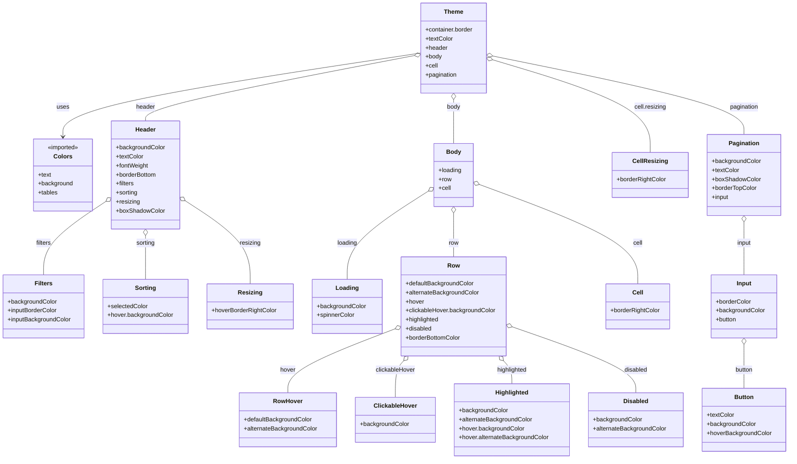

# Diagram: web/portal/src/components/organisms/base-table/Styles/Themes/LightTheme.js

> Auto-generated by Obscura crawlers

## Mermaid

### SVG

<svg id="container" width="2096.978515625" xmlns="http://www.w3.org/2000/svg" class="classDiagram" height="1222" viewBox="0 0 2096.978515625 1222" role="graphics-document document" aria-roledescription="class"><g><defs><marker id="container_class-aggregationStart" class="marker aggregation class" refX="18" refY="7" markerWidth="190" markerHeight="240" orient="auto"><path d="M 18,7 L9,13 L1,7 L9,1 Z"></path></marker></defs><defs><marker id="container_class-aggregationEnd" class="marker aggregation class" refX="1" refY="7" markerWidth="20" markerHeight="28" orient="auto"><path d="M 18,7 L9,13 L1,7 L9,1 Z"></path></marker></defs><defs><marker id="container_class-extensionStart" class="marker extension class" refX="18" refY="7" markerWidth="190" markerHeight="240" orient="auto"><path d="M 1,7 L18,13 V 1 Z"></path></marker></defs><defs><marker id="container_class-extensionEnd" class="marker extension class" refX="1" refY="7" markerWidth="20" markerHeight="28" orient="auto"><path d="M 1,1 V 13 L18,7 Z"></path></marker></defs><defs><marker id="container_class-compositionStart" class="marker composition class" refX="18" refY="7" markerWidth="190" markerHeight="240" orient="auto"><path d="M 18,7 L9,13 L1,7 L9,1 Z"></path></marker></defs><defs><marker id="container_class-compositionEnd" class="marker composition class" refX="1" refY="7" markerWidth="20" markerHeight="28" orient="auto"><path d="M 18,7 L9,13 L1,7 L9,1 Z"></path></marker></defs><defs><marker id="container_class-dependencyStart" class="marker dependency class" refX="6" refY="7" markerWidth="190" markerHeight="240" orient="auto"><path d="M 5,7 L9,13 L1,7 L9,1 Z"></path></marker></defs><defs><marker id="container_class-dependencyEnd" class="marker dependency class" refX="13" refY="7" markerWidth="20" markerHeight="28" orient="auto"><path d="M 18,7 L9,13 L14,7 L9,1 Z"></path></marker></defs><defs><marker id="container_class-lollipopStart" class="marker lollipop class" refX="13" refY="7" markerWidth="190" markerHeight="240" orient="auto"><circle stroke="black" fill="transparent" cx="7" cy="7" r="6"></circle></marker></defs><defs><marker id="container_class-lollipopEnd" class="marker lollipop class" refX="1" refY="7" markerWidth="190" markerHeight="240" orient="auto"><circle stroke="black" fill="transparent" cx="7" cy="7" r="6"></circle></marker></defs><g class="root"><g class="clusters"></g><g class="edgePaths"><path d="M1115.914,141.415L957.778,165.346C799.642,189.277,483.37,237.138,325.234,274.236C167.098,311.333,167.098,337.667,167.098,350.833L167.098,364" id="id_Theme_Colors_1" class="edge-thickness-normal edge-pattern-solid relation" style=";;;" data-edge="true" data-et="edge" data-id="id_Theme_Colors_1" data-points="W3sieCI6MTExNS45MTQwNjI1LCJ5IjoxNDEuNDE1MjA2MDg3NTU1Njd9LHsieCI6MTY3LjA5NzY1NjI1LCJ5IjoyODV9LHsieCI6MTY3LjA5NzY1NjI1LCJ5IjozNzB9XQ==" marker-end="url(#container_class-dependencyEnd)"></path><path d="M1098.974,148.304L980.498,171.087C862.022,193.87,625.07,239.435,506.593,268.384C388.117,297.333,388.117,309.667,388.117,315.833L388.117,322" id="id_Theme_Header_2" class="edge-thickness-normal edge-pattern-solid relation" style=";;;" data-edge="true" data-et="edge" data-id="id_Theme_Header_2" data-points="W3sieCI6MTExNS45MTQwNjI1LCJ5IjoxNDUuMDQ2ODMwMjk1MjAxMTh9LHsieCI6Mzg4LjExNzE4NzUsInkiOjI4NX0seyJ4IjozODguMTE3MTg3NSwieSI6MzIyfV0=" marker-start="url(#container_class-aggregationStart)"></path><path d="M1204.563,265.25L1204.563,268.542C1204.563,271.833,1204.563,278.417,1204.563,297.875C1204.563,317.333,1204.563,349.667,1204.563,365.833L1204.563,382" id="id_Theme_Body_3" class="edge-thickness-normal edge-pattern-solid relation" style=";;;" data-edge="true" data-et="edge" data-id="id_Theme_Body_3" data-points="W3sieCI6MTIwNC41NjI1LCJ5IjoyNDh9LHsieCI6MTIwNC41NjI1LCJ5IjoyODV9LHsieCI6MTIwNC41NjI1LCJ5IjozODJ9XQ==" marker-start="url(#container_class-aggregationStart)"></path><path d="M1309.74,159.406L1379.842,180.338C1449.944,201.27,1590.149,243.135,1660.251,284.234C1730.354,325.333,1730.354,365.667,1730.354,385.833L1730.354,406" id="id_Theme_CellResizing_4" class="edge-thickness-normal edge-pattern-solid relation" style=";;;" data-edge="true" data-et="edge" data-id="id_Theme_CellResizing_4" data-points="W3sieCI6MTI5My4yMTA5Mzc1LCJ5IjoxNTQuNDcwMjIxNTc4MzUxMDd9LHsieCI6MTczMC4zNTM1MTU2MjUsInkiOjI4NX0seyJ4IjoxNzMwLjM1MzUxNTYyNSwieSI6NDA2fV0=" marker-start="url(#container_class-aggregationStart)"></path><path d="M1310.116,149.428L1421.421,172.023C1532.725,194.619,1755.334,239.809,1866.639,274.571C1977.943,309.333,1977.943,333.667,1977.943,345.833L1977.943,358" id="id_Theme_Pagination_5" class="edge-thickness-normal edge-pattern-solid relation" style=";;;" data-edge="true" data-et="edge" data-id="id_Theme_Pagination_5" data-points="W3sieCI6MTI5My4yMTA5Mzc1LCJ5IjoxNDUuOTk2MDU1MjY2NjczNTh9LHsieCI6MTk3Ny45NDMzNTkzNzUsInkiOjI4NX0seyJ4IjoxOTc3Ljk0MzM1OTM3NSwieSI6MzU4fV0=" marker-start="url(#container_class-aggregationStart)"></path><path d="M282.774,536.197L255.061,554.665C227.348,573.132,171.922,610.066,144.209,642.7C116.496,675.333,116.496,703.667,116.496,717.833L116.496,732" id="id_Header_Filters_6" class="edge-thickness-normal edge-pattern-solid relation" style=";;;" data-edge="true" data-et="edge" data-id="id_Header_Filters_6" data-points="W3sieCI6Mjk3LjEyODkwNjI1LCJ5Ijo1MjYuNjMxODExMzE4MDQxM30seyJ4IjoxMTYuNDk2MDkzNzUsInkiOjY0N30seyJ4IjoxMTYuNDk2MDkzNzUsInkiOjczMn1d" marker-start="url(#container_class-aggregationStart)"></path><path d="M388.117,627.25L388.117,630.542C388.117,633.833,388.117,640.417,388.117,659.875C388.117,679.333,388.117,711.667,388.117,727.833L388.117,744" id="id_Header_Sorting_7" class="edge-thickness-normal edge-pattern-solid relation" style=";;;" data-edge="true" data-et="edge" data-id="id_Header_Sorting_7" data-points="W3sieCI6Mzg4LjExNzE4NzUsInkiOjYxMH0seyJ4IjozODguMTE3MTg3NSwieSI6NjQ3fSx7IngiOjM4OC4xMTcxODc1LCJ5Ijo3NDR9XQ==" marker-start="url(#container_class-aggregationStart)"></path><path d="M493.553,534.781L522.223,553.485C550.893,572.188,608.234,609.594,636.904,646.464C665.574,683.333,665.574,719.667,665.574,737.833L665.574,756" id="id_Header_Resizing_8" class="edge-thickness-normal edge-pattern-solid relation" style=";;;" data-edge="true" data-et="edge" data-id="id_Header_Resizing_8" data-points="W3sieCI6NDc5LjEwNTQ2ODc1LCJ5Ijo1MjUuMzU2NTAyMjczNzE5Mn0seyJ4Ijo2NjUuNTc0MjE4NzUsInkiOjY0N30seyJ4Ijo2NjUuNTc0MjE4NzUsInkiOjc1Nn1d" marker-start="url(#container_class-aggregationStart)"></path><path d="M1137.629,508.896L1101.714,531.913C1065.798,554.931,993.967,600.965,958.052,640.149C922.137,679.333,922.137,711.667,922.137,727.833L922.137,744" id="id_Body_Loading_9" class="edge-thickness-normal edge-pattern-solid relation" style=";;;" data-edge="true" data-et="edge" data-id="id_Body_Loading_9" data-points="W3sieCI6MTE1Mi4xNTIzNDM3NSwieSI6NDk5LjU4ODQyODkyOTA2MDQ2fSx7IngiOjkyMi4xMzY3MTg3NSwieSI6NjQ3fSx7IngiOjkyMi4xMzY3MTg3NSwieSI6NzQ0fV0=" marker-start="url(#container_class-aggregationStart)"></path><path d="M1204.563,567.25L1204.563,580.542C1204.563,593.833,1204.563,620.417,1204.563,639.875C1204.563,659.333,1204.563,671.667,1204.563,677.833L1204.563,684" id="id_Body_Row_10" class="edge-thickness-normal edge-pattern-solid relation" style=";;;" data-edge="true" data-et="edge" data-id="id_Body_Row_10" data-points="W3sieCI6MTIwNC41NjI1LCJ5Ijo1NTB9LHsieCI6MTIwNC41NjI1LCJ5Ijo2NDd9LHsieCI6MTIwNC41NjI1LCJ5Ijo2ODR9XQ==" marker-start="url(#container_class-aggregationStart)"></path><path d="M1273.155,491.318L1343.453,517.265C1413.75,543.212,1554.345,595.106,1624.642,639.22C1694.939,683.333,1694.939,719.667,1694.939,737.833L1694.939,756" id="id_Body_Cell_11" class="edge-thickness-normal edge-pattern-solid relation" style=";;;" data-edge="true" data-et="edge" data-id="id_Body_Cell_11" data-points="W3sieCI6MTI1Ni45NzI2NTYyNSwieSI6NDg1LjM0NDc4ODE2OTE3Nzl9LHsieCI6MTY5NC45Mzk0NTMxMjUsInkiOjY0N30seyJ4IjoxNjk0LjkzOTQ1MzEyNSwieSI6NzU2fV0=" marker-start="url(#container_class-aggregationStart)"></path><path d="M1048.268,876.148L1001.127,894.29C953.985,912.432,859.703,948.716,812.561,977.025C765.42,1005.333,765.42,1025.667,765.42,1035.833L765.42,1046" id="id_Row_RowHover_12" class="edge-thickness-normal edge-pattern-solid relation" style=";;;" data-edge="true" data-et="edge" data-id="id_Row_RowHover_12" data-points="W3sieCI6MTA2NC4zNjcxODc1LCJ5Ijo4NjkuOTUyODgyMjU5MDE4Nn0seyJ4Ijo3NjUuNDE5OTIxODc1LCJ5Ijo5ODV9LHsieCI6NzY1LjQxOTkyMTg3NSwieSI6MTA0Nn1d" marker-start="url(#container_class-aggregationStart)"></path><path d="M1072.141,960.727L1068.44,964.772C1064.738,968.818,1057.335,976.909,1053.633,993.121C1049.932,1009.333,1049.932,1033.667,1049.932,1045.833L1049.932,1058" id="id_Row_ClickableHover_13" class="edge-thickness-normal edge-pattern-solid relation" style=";;;" data-edge="true" data-et="edge" data-id="id_Row_ClickableHover_13" data-points="W3sieCI6MTA4My43ODU3MzQwOTc2MzMyLCJ5Ijo5NDh9LHsieCI6MTA0OS45MzE2NDA2MjUsInkiOjk4NX0seyJ4IjoxMDQ5LjkzMTY0MDYyNSwieSI6MTA1OH1d" marker-start="url(#container_class-aggregationStart)"></path><path d="M1336.984,960.727L1340.685,964.772C1344.387,968.818,1351.79,976.909,1355.492,987.121C1359.193,997.333,1359.193,1009.667,1359.193,1015.833L1359.193,1022" id="id_Row_Highlighted_14" class="edge-thickness-normal edge-pattern-solid relation" style=";;;" data-edge="true" data-et="edge" data-id="id_Row_Highlighted_14" data-points="W3sieCI6MTMyNS4zMzkyNjU5MDIzNjY4LCJ5Ijo5NDh9LHsieCI6MTM1OS4xOTMzNTkzNzUsInkiOjk4NX0seyJ4IjoxMzU5LjE5MzM1OTM3NSwieSI6MTAyMn1d" marker-start="url(#container_class-aggregationStart)"></path><path d="M1361.049,870.467L1415.892,889.556C1470.735,908.645,1580.421,946.822,1635.264,976.078C1690.107,1005.333,1690.107,1025.667,1690.107,1035.833L1690.107,1046" id="id_Row_Disabled_15" class="edge-thickness-normal edge-pattern-solid relation" style=";;;" data-edge="true" data-et="edge" data-id="id_Row_Disabled_15" data-points="W3sieCI6MTM0NC43NTc4MTI1LCJ5Ijo4NjQuNzk2NzM2OTEzNjY0Mn0seyJ4IjoxNjkwLjEwNzQyMTg3NSwieSI6OTg1fSx7IngiOjE2OTAuMTA3NDIxODc1LCJ5IjoxMDQ2fV0=" marker-start="url(#container_class-aggregationStart)"></path><path d="M1977.943,591.25L1977.943,600.542C1977.943,609.833,1977.943,628.417,1977.943,651.875C1977.943,675.333,1977.943,703.667,1977.943,717.833L1977.943,732" id="id_Pagination_Input_16" class="edge-thickness-normal edge-pattern-solid relation" style=";;;" data-edge="true" data-et="edge" data-id="id_Pagination_Input_16" data-points="W3sieCI6MTk3Ny45NDMzNTkzNzUsInkiOjU3NH0seyJ4IjoxOTc3Ljk0MzM1OTM3NSwieSI6NjQ3fSx7IngiOjE5NzcuOTQzMzU5Mzc1LCJ5Ijo3MzJ9XQ==" marker-start="url(#container_class-aggregationStart)"></path><path d="M1977.943,917.25L1977.943,928.542C1977.943,939.833,1977.943,962.417,1977.943,981.875C1977.943,1001.333,1977.943,1017.667,1977.943,1025.833L1977.943,1034" id="id_Input_Button_17" class="edge-thickness-normal edge-pattern-solid relation" style=";;;" data-edge="true" data-et="edge" data-id="id_Input_Button_17" data-points="W3sieCI6MTk3Ny45NDMzNTkzNzUsInkiOjkwMH0seyJ4IjoxOTc3Ljk0MzM1OTM3NSwieSI6OTg1fSx7IngiOjE5NzcuOTQzMzU5Mzc1LCJ5IjoxMDM0fV0=" marker-start="url(#container_class-aggregationStart)"></path></g><g class="edgeLabels"><g class="edgeLabel" transform="translate(167.09765625, 285)"><g class="label" data-id="id_Theme_Colors_1" transform="translate(-16.4921875, -12)"><foreignObject width="32.984375" height="24">

uses

</foreignObject></g></g><g class="edgeLabel" transform="translate(388.1171875, 285)"><g class="label" data-id="id_Theme_Header_2" transform="translate(-25.5546875, -12)"><foreignObject width="51.109375" height="24">

header

</foreignObject></g></g><g class="edgeLabel" transform="translate(1204.5625, 285)"><g class="label" data-id="id_Theme_Body_3" transform="translate(-18.1484375, -12)"><foreignObject width="36.296875" height="24">

body

</foreignObject></g></g><g class="edgeLabel" transform="translate(1730.353515625, 285)"><g class="label" data-id="id_Theme_CellResizing_4" transform="translate(-42.46875, -12)"><foreignObject width="84.9375" height="24">

cell.resizing

</foreignObject></g></g><g class="edgeLabel" transform="translate(1977.943359375, 285)"><g class="label" data-id="id_Theme_Pagination_5" transform="translate(-38.90625, -12)"><foreignObject width="77.8125" height="24">

pagination

</foreignObject></g></g><g class="edgeLabel" transform="translate(116.49609375, 647)"><g class="label" data-id="id_Header_Filters_6" transform="translate(-20.78125, -12)"><foreignObject width="41.5625" height="24">

filters

</foreignObject></g></g><g class="edgeLabel" transform="translate(388.1171875, 647)"><g class="label" data-id="id_Header_Sorting_7" transform="translate(-25.4921875, -12)"><foreignObject width="50.984375" height="24">

sorting

</foreignObject></g></g><g class="edgeLabel" transform="translate(665.57421875, 647)"><g class="label" data-id="id_Header_Resizing_8" transform="translate(-27.8046875, -12)"><foreignObject width="55.609375" height="24">

resizing

</foreignObject></g></g><g class="edgeLabel" transform="translate(922.13671875, 647)"><g class="label" data-id="id_Body_Loading_9" transform="translate(-27.140625, -12)"><foreignObject width="54.28125" height="24">

loading

</foreignObject></g></g><g class="edgeLabel" transform="translate(1204.5625, 647)"><g class="label" data-id="id_Body_Row_10" transform="translate(-13.2578125, -12)"><foreignObject width="26.515625" height="24">

row

</foreignObject></g></g><g class="edgeLabel" transform="translate(1694.939453125, 647)"><g class="label" data-id="id_Body_Cell_11" transform="translate(-12.71875, -12)"><foreignObject width="25.4375" height="24">

cell

</foreignObject></g></g><g class="edgeLabel" transform="translate(765.419921875, 985)"><g class="label" data-id="id_Row_RowHover_12" transform="translate(-20.6875, -12)"><foreignObject width="41.375" height="24">

hover

</foreignObject></g></g><g class="edgeLabel" transform="translate(1049.931640625, 985)"><g class="label" data-id="id_Row_ClickableHover_13" transform="translate(-53.4296875, -12)"><foreignObject width="106.859375" height="24">

clickableHover

</foreignObject></g></g><g class="edgeLabel" transform="translate(1359.193359375, 985)"><g class="label" data-id="id_Row_Highlighted_14" transform="translate(-41.15625, -12)"><foreignObject width="82.3125" height="24">

highlighted

</foreignObject></g></g><g class="edgeLabel" transform="translate(1690.107421875, 985)"><g class="label" data-id="id_Row_Disabled_15" transform="translate(-31.25, -12)"><foreignObject width="62.5" height="24">

disabled

</foreignObject></g></g><g class="edgeLabel" transform="translate(1977.943359375, 647)"><g class="label" data-id="id_Pagination_Input_16" transform="translate(-19.2421875, -12)"><foreignObject width="38.484375" height="24">

input

</foreignObject></g></g><g class="edgeLabel" transform="translate(1977.943359375, 985)"><g class="label" data-id="id_Input_Button_17" transform="translate(-24.4296875, -12)"><foreignObject width="48.859375" height="24">

button

</foreignObject></g></g></g><g class="nodes"><g class="node default" id="classId-Colors-0" transform="translate(167.09765625, 466)"><g class="basic label-container"><path d="M-80.03125 -96 L80.03125 -96 L80.03125 96 L-80.03125 96" stroke="none" stroke-width="0" fill="#ECECFF" style=""></path><path d="M-80.03125 -96 C-22.45637145688405 -96, 35.1185070862319 -96, 80.03125 -96 M-80.03125 -96 C-24.988531395486312 -96, 30.054187209027376 -96, 80.03125 -96 M80.03125 -96 C80.03125 -23.52481209956548, 80.03125 48.95037580086904, 80.03125 96 M80.03125 -96 C80.03125 -48.725115186580226, 80.03125 -1.4502303731604513, 80.03125 96 M80.03125 96 C16.916819317124876 96, -46.19761136575025 96, -80.03125 96 M80.03125 96 C28.09703257754611 96, -23.83718484490778 96, -80.03125 96 M-80.03125 96 C-80.03125 23.49528942590061, -80.03125 -49.00942114819878, -80.03125 -96 M-80.03125 96 C-80.03125 28.011650494890233, -80.03125 -39.976699010219534, -80.03125 -96" stroke="#9370DB" stroke-width="1.3" fill="none" stroke-dasharray="0 0" style=""></path></g><g class="annotation-group text" transform="translate(-42.671875, -72)"><g class="label" style="" transform="translate(0,-12)"><foreignObject width="85.34375" height="24">

«imported»

</foreignObject></g></g><g class="label-group text" transform="translate(-23.1015625, -48)"><g class="label" style="font-weight: bolder" transform="translate(0,-12)"><foreignObject width="46.203125" height="24">

Colors

</foreignObject></g></g><g class="members-group text" transform="translate(-68.03125, 0)"><g class="label" style="" transform="translate(0,-12)"><foreignObject width="35.5625" height="24">

+text

</foreignObject></g><g class="label" style="" transform="translate(0,12)"><foreignObject width="93.390625" height="24">

+background

</foreignObject></g><g class="label" style="" transform="translate(0,36)"><foreignObject width="52.578125" height="24">

+tables

</foreignObject></g></g><g class="methods-group text" transform="translate(-68.03125, 96)"></g><g class="divider" style=""><path d="M-80.03125 -24 C-37.66082792930972 -24, 4.709594141380563 -24, 80.03125 -24 M-80.03125 -24 C-46.745101779336245 -24, -13.45895355867249 -24, 80.03125 -24" stroke="#9370DB" stroke-width="1.3" fill="none" stroke-dasharray="0 0" style=""></path></g><g class="divider" style=""><path d="M-80.03125 72 C-36.41700574519383 72, 7.197238509612333 72, 80.03125 72 M-80.03125 72 C-26.99335745721448 72, 26.04453508557104 72, 80.03125 72" stroke="#9370DB" stroke-width="1.3" fill="none" stroke-dasharray="0 0" style=""></path></g></g><g class="node default" id="classId-Theme-1" transform="translate(1204.5625, 128)"><g class="basic label-container"><path d="M-88.6484375 -120 L88.6484375 -120 L88.6484375 120 L-88.6484375 120" stroke="none" stroke-width="0" fill="#ECECFF" style=""></path><path d="M-88.6484375 -120 C-26.64312888846736 -120, 35.36217972306528 -120, 88.6484375 -120 M-88.6484375 -120 C-29.422158017073656 -120, 29.80412146585269 -120, 88.6484375 -120 M88.6484375 -120 C88.6484375 -50.18902689289742, 88.6484375 19.621946214205167, 88.6484375 120 M88.6484375 -120 C88.6484375 -70.50217048484326, 88.6484375 -21.004340969686524, 88.6484375 120 M88.6484375 120 C18.75002107735625 120, -51.1483953452875 120, -88.6484375 120 M88.6484375 120 C52.811636864576755 120, 16.97483622915351 120, -88.6484375 120 M-88.6484375 120 C-88.6484375 58.33753315184717, -88.6484375 -3.3249336963056635, -88.6484375 -120 M-88.6484375 120 C-88.6484375 53.647988264819915, -88.6484375 -12.70402347036017, -88.6484375 -120" stroke="#9370DB" stroke-width="1.3" fill="none" stroke-dasharray="0 0" style=""></path></g><g class="annotation-group text" transform="translate(0, -96)"></g><g class="label-group text" transform="translate(-24.53125, -96)"><g class="label" style="font-weight: bolder" transform="translate(0,-12)"><foreignObject width="49.0625" height="24">

Theme

</foreignObject></g></g><g class="members-group text" transform="translate(-76.6484375, -48)"><g class="label" style="" transform="translate(0,-12)"><foreignObject width="128.765625" height="24">

+container.border

</foreignObject></g><g class="label" style="" transform="translate(0,12)"><foreignObject width="73.671875" height="24">

+textColor

</foreignObject></g><g class="label" style="" transform="translate(0,36)"><foreignObject width="59.09375" height="24">

+header

</foreignObject></g><g class="label" style="" transform="translate(0,60)"><foreignObject width="44.28125" height="24">

+body

</foreignObject></g><g class="label" style="" transform="translate(0,84)"><foreignObject width="33.421875" height="24">

+cell

</foreignObject></g><g class="label" style="" transform="translate(0,108)"><foreignObject width="85.796875" height="24">

+pagination

</foreignObject></g></g><g class="methods-group text" transform="translate(-76.6484375, 120)"></g><g class="divider" style=""><path d="M-88.6484375 -72 C-30.79387315715885 -72, 27.060691185682302 -72, 88.6484375 -72 M-88.6484375 -72 C-40.93212837652521 -72, 6.784180746949573 -72, 88.6484375 -72" stroke="#9370DB" stroke-width="1.3" fill="none" stroke-dasharray="0 0" style=""></path></g><g class="divider" style=""><path d="M-88.6484375 96 C-38.926042793971355 96, 10.79635191205729 96, 88.6484375 96 M-88.6484375 96 C-25.019444795209836 96, 38.60954790958033 96, 88.6484375 96" stroke="#9370DB" stroke-width="1.3" fill="none" stroke-dasharray="0 0" style=""></path></g></g><g class="node default" id="classId-Header-2" transform="translate(388.1171875, 466)"><g class="basic label-container"><path d="M-90.98828125 -144 L90.98828125 -144 L90.98828125 144 L-90.98828125 144" stroke="none" stroke-width="0" fill="#ECECFF" style=""></path><path d="M-90.98828125 -144 C-28.81705409484747 -144, 33.35417306030506 -144, 90.98828125 -144 M-90.98828125 -144 C-20.144013401194215 -144, 50.70025444761157 -144, 90.98828125 -144 M90.98828125 -144 C90.98828125 -82.97530869975134, 90.98828125 -21.950617399502676, 90.98828125 144 M90.98828125 -144 C90.98828125 -43.6820886882912, 90.98828125 56.635822623417596, 90.98828125 144 M90.98828125 144 C54.5583466064777 144, 18.128411962955397 144, -90.98828125 144 M90.98828125 144 C25.76117055993143 144, -39.46594013013714 144, -90.98828125 144 M-90.98828125 144 C-90.98828125 86.01356873887948, -90.98828125 28.027137477758956, -90.98828125 -144 M-90.98828125 144 C-90.98828125 33.89101009693242, -90.98828125 -76.21797980613516, -90.98828125 -144" stroke="#9370DB" stroke-width="1.3" fill="none" stroke-dasharray="0 0" style=""></path></g><g class="annotation-group text" transform="translate(0, -120)"></g><g class="label-group text" transform="translate(-26.4765625, -120)"><g class="label" style="font-weight: bolder" transform="translate(0,-12)"><foreignObject width="52.953125" height="24">

Header

</foreignObject></g></g><g class="members-group text" transform="translate(-78.98828125, -72)"><g class="label" style="" transform="translate(0,-12)"><foreignObject width="131.5" height="24">

+backgroundColor

</foreignObject></g><g class="label" style="" transform="translate(0,12)"><foreignObject width="73.671875" height="24">

+textColor

</foreignObject></g><g class="label" style="" transform="translate(0,36)"><foreignObject width="87.203125" height="24">

+fontWeight

</foreignObject></g><g class="label" style="" transform="translate(0,60)"><foreignObject width="110.4375" height="24">

+borderBottom

</foreignObject></g><g class="label" style="" transform="translate(0,84)"><foreignObject width="49.296875" height="24">

+filters

</foreignObject></g><g class="label" style="" transform="translate(0,108)"><foreignObject width="58.96875" height="24">

+sorting

</foreignObject></g><g class="label" style="" transform="translate(0,132)"><foreignObject width="63.59375" height="24">

+resizing

</foreignObject></g><g class="label" style="" transform="translate(0,156)"><foreignObject width="129.75" height="24">

+boxShadowColor

</foreignObject></g></g><g class="methods-group text" transform="translate(-78.98828125, 144)"></g><g class="divider" style=""><path d="M-90.98828125 -96 C-40.91009036019309 -96, 9.168100529613824 -96, 90.98828125 -96 M-90.98828125 -96 C-18.81625574021514 -96, 53.35576976956972 -96, 90.98828125 -96" stroke="#9370DB" stroke-width="1.3" fill="none" stroke-dasharray="0 0" style=""></path></g><g class="divider" style=""><path d="M-90.98828125 120 C-54.490897104237746 120, -17.993512958475492 120, 90.98828125 120 M-90.98828125 120 C-43.39323083295329 120, 4.201819584093414 120, 90.98828125 120" stroke="#9370DB" stroke-width="1.3" fill="none" stroke-dasharray="0 0" style=""></path></g></g><g class="node default" id="classId-Filters-3" transform="translate(116.49609375, 816)"><g class="basic label-container"><path d="M-108.49609375 -84 L108.49609375 -84 L108.49609375 84 L-108.49609375 84" stroke="none" stroke-width="0" fill="#ECECFF" style=""></path><path d="M-108.49609375 -84 C-61.244153713198685 -84, -13.99221367639737 -84, 108.49609375 -84 M-108.49609375 -84 C-46.01845056277573 -84, 16.459192624448534 -84, 108.49609375 -84 M108.49609375 -84 C108.49609375 -19.0831011200206, 108.49609375 45.8337977599588, 108.49609375 84 M108.49609375 -84 C108.49609375 -18.671779844251745, 108.49609375 46.65644031149651, 108.49609375 84 M108.49609375 84 C38.1122137100358 84, -32.271666329928394 84, -108.49609375 84 M108.49609375 84 C35.091466980920586 84, -38.31315978815883 84, -108.49609375 84 M-108.49609375 84 C-108.49609375 25.711513694804204, -108.49609375 -32.57697261039159, -108.49609375 -84 M-108.49609375 84 C-108.49609375 26.255133994112143, -108.49609375 -31.489732011775715, -108.49609375 -84" stroke="#9370DB" stroke-width="1.3" fill="none" stroke-dasharray="0 0" style=""></path></g><g class="annotation-group text" transform="translate(0, -60)"></g><g class="label-group text" transform="translate(-22.6328125, -60)"><g class="label" style="font-weight: bolder" transform="translate(0,-12)"><foreignObject width="45.265625" height="24">

Filters

</foreignObject></g></g><g class="members-group text" transform="translate(-96.49609375, -12)"><g class="label" style="" transform="translate(0,-12)"><foreignObject width="131.5" height="24">

+backgroundColor

</foreignObject></g><g class="label" style="" transform="translate(0,12)"><foreignObject width="133.8125" height="24">

+inputBorderColor

</foreignObject></g><g class="label" style="" transform="translate(0,36)"><foreignObject width="170.359375" height="24">

+inputBackgroundColor

</foreignObject></g></g><g class="methods-group text" transform="translate(-96.49609375, 84)"></g><g class="divider" style=""><path d="M-108.49609375 -36 C-64.07086699395819 -36, -19.645640237916368 -36, 108.49609375 -36 M-108.49609375 -36 C-61.05921822802301 -36, -13.622342706046027 -36, 108.49609375 -36" stroke="#9370DB" stroke-width="1.3" fill="none" stroke-dasharray="0 0" style=""></path></g><g class="divider" style=""><path d="M-108.49609375 60 C-48.70658274020547 60, 11.082928269589061 60, 108.49609375 60 M-108.49609375 60 C-43.09546640726185 60, 22.305160935476295 60, 108.49609375 60" stroke="#9370DB" stroke-width="1.3" fill="none" stroke-dasharray="0 0" style=""></path></g></g><g class="node default" id="classId-Sorting-4" transform="translate(388.1171875, 816)"><g class="basic label-container"><path d="M-113.125 -72 L113.125 -72 L113.125 72 L-113.125 72" stroke="none" stroke-width="0" fill="#ECECFF" style=""></path><path d="M-113.125 -72 C-43.97516448899553 -72, 25.174671022008937 -72, 113.125 -72 M-113.125 -72 C-28.918324735213332 -72, 55.288350529573336 -72, 113.125 -72 M113.125 -72 C113.125 -33.44523927976906, 113.125 5.109521440461876, 113.125 72 M113.125 -72 C113.125 -39.3531142645115, 113.125 -6.706228529022994, 113.125 72 M113.125 72 C35.47973433166236 72, -42.165531336675286 72, -113.125 72 M113.125 72 C44.1684025067658 72, -24.788194986468397 72, -113.125 72 M-113.125 72 C-113.125 38.50245286857327, -113.125 5.004905737146544, -113.125 -72 M-113.125 72 C-113.125 39.70591490068622, -113.125 7.411829801372434, -113.125 -72" stroke="#9370DB" stroke-width="1.3" fill="none" stroke-dasharray="0 0" style=""></path></g><g class="annotation-group text" transform="translate(0, -48)"></g><g class="label-group text" transform="translate(-26.828125, -48)"><g class="label" style="font-weight: bolder" transform="translate(0,-12)"><foreignObject width="53.65625" height="24">

Sorting

</foreignObject></g></g><g class="members-group text" transform="translate(-101.125, 0)"><g class="label" style="" transform="translate(0,-12)"><foreignObject width="107.09375" height="24">

+selectedColor

</foreignObject></g><g class="label" style="" transform="translate(0,12)"><foreignObject width="175.421875" height="24">

+hover.backgroundColor

</foreignObject></g></g><g class="methods-group text" transform="translate(-101.125, 72)"></g><g class="divider" style=""><path d="M-113.125 -24 C-37.94919457806519 -24, 37.22661084386962 -24, 113.125 -24 M-113.125 -24 C-31.719040179479663 -24, 49.686919641040674 -24, 113.125 -24" stroke="#9370DB" stroke-width="1.3" fill="none" stroke-dasharray="0 0" style=""></path></g><g class="divider" style=""><path d="M-113.125 48 C-25.33885578499303 48, 62.44728843001394 48, 113.125 48 M-113.125 48 C-54.378932335508274 48, 4.367135328983451 48, 113.125 48" stroke="#9370DB" stroke-width="1.3" fill="none" stroke-dasharray="0 0" style=""></path></g></g><g class="node default" id="classId-Resizing-5" transform="translate(665.57421875, 816)"><g class="basic label-container"><path d="M-114.33203125 -60 L114.33203125 -60 L114.33203125 60 L-114.33203125 60" stroke="none" stroke-width="0" fill="#ECECFF" style=""></path><path d="M-114.33203125 -60 C-27.156032804003573 -60, 60.019965641992854 -60, 114.33203125 -60 M-114.33203125 -60 C-49.49137392075964 -60, 15.349283408480716 -60, 114.33203125 -60 M114.33203125 -60 C114.33203125 -30.082673990855607, 114.33203125 -0.16534798171121423, 114.33203125 60 M114.33203125 -60 C114.33203125 -23.540195597845596, 114.33203125 12.919608804308808, 114.33203125 60 M114.33203125 60 C38.65415985868786 60, -37.023711532624276 60, -114.33203125 60 M114.33203125 60 C41.29020139209409 60, -31.75162846581182 60, -114.33203125 60 M-114.33203125 60 C-114.33203125 13.327720417720478, -114.33203125 -33.344559164559044, -114.33203125 -60 M-114.33203125 60 C-114.33203125 20.53032629225344, -114.33203125 -18.939347415493117, -114.33203125 -60" stroke="#9370DB" stroke-width="1.3" fill="none" stroke-dasharray="0 0" style=""></path></g><g class="annotation-group text" transform="translate(0, -36)"></g><g class="label-group text" transform="translate(-30.3046875, -36)"><g class="label" style="font-weight: bolder" transform="translate(0,-12)"><foreignObject width="60.609375" height="24">

Resizing

</foreignObject></g></g><g class="members-group text" transform="translate(-102.33203125, 12)"><g class="label" style="" transform="translate(0,-12)"><foreignObject width="174.359375" height="24">

+hoverBorderRightColor

</foreignObject></g></g><g class="methods-group text" transform="translate(-102.33203125, 60)"></g><g class="divider" style=""><path d="M-114.33203125 -12 C-60.99774907858074 -12, -7.663466907161478 -12, 114.33203125 -12 M-114.33203125 -12 C-27.777937554839426 -12, 58.77615614032115 -12, 114.33203125 -12" stroke="#9370DB" stroke-width="1.3" fill="none" stroke-dasharray="0 0" style=""></path></g><g class="divider" style=""><path d="M-114.33203125 36 C-55.20256137687562 36, 3.926908496248757 36, 114.33203125 36 M-114.33203125 36 C-64.73423556726124 36, -15.136439884522488 36, 114.33203125 36" stroke="#9370DB" stroke-width="1.3" fill="none" stroke-dasharray="0 0" style=""></path></g></g><g class="node default" id="classId-Body-6" transform="translate(1204.5625, 466)"><g class="basic label-container"><path d="M-52.41015625 -84 L52.41015625 -84 L52.41015625 84 L-52.41015625 84" stroke="none" stroke-width="0" fill="#ECECFF" style=""></path><path d="M-52.41015625 -84 C-24.258442454191833 -84, 3.893271341616334 -84, 52.41015625 -84 M-52.41015625 -84 C-27.834121833213967 -84, -3.2580874164279336 -84, 52.41015625 -84 M52.41015625 -84 C52.41015625 -36.581577780840995, 52.41015625 10.83684443831801, 52.41015625 84 M52.41015625 -84 C52.41015625 -47.475463307049125, 52.41015625 -10.95092661409825, 52.41015625 84 M52.41015625 84 C14.419037122364308 84, -23.572082005271383 84, -52.41015625 84 M52.41015625 84 C14.907022895264348 84, -22.596110459471305 84, -52.41015625 84 M-52.41015625 84 C-52.41015625 47.60636677456895, -52.41015625 11.212733549137894, -52.41015625 -84 M-52.41015625 84 C-52.41015625 33.190789695737514, -52.41015625 -17.61842060852497, -52.41015625 -84" stroke="#9370DB" stroke-width="1.3" fill="none" stroke-dasharray="0 0" style=""></path></g><g class="annotation-group text" transform="translate(0, -60)"></g><g class="label-group text" transform="translate(-18.5546875, -60)"><g class="label" style="font-weight: bolder" transform="translate(0,-12)"><foreignObject width="37.109375" height="24">

Body

</foreignObject></g></g><g class="members-group text" transform="translate(-40.41015625, -12)"><g class="label" style="" transform="translate(0,-12)"><foreignObject width="62.265625" height="24">

+loading

</foreignObject></g><g class="label" style="" transform="translate(0,12)"><foreignObject width="34.5" height="24">

+row

</foreignObject></g><g class="label" style="" transform="translate(0,36)"><foreignObject width="33.421875" height="24">

+cell

</foreignObject></g></g><g class="methods-group text" transform="translate(-40.41015625, 84)"></g><g class="divider" style=""><path d="M-52.41015625 -36 C-16.562893464638528 -36, 19.284369320722945 -36, 52.41015625 -36 M-52.41015625 -36 C-21.649055610426192 -36, 9.112045029147616 -36, 52.41015625 -36" stroke="#9370DB" stroke-width="1.3" fill="none" stroke-dasharray="0 0" style=""></path></g><g class="divider" style=""><path d="M-52.41015625 60 C-10.964602775670294 60, 30.480950698659413 60, 52.41015625 60 M-52.41015625 60 C-20.72877316352209 60, 10.952609922955823 60, 52.41015625 60" stroke="#9370DB" stroke-width="1.3" fill="none" stroke-dasharray="0 0" style=""></path></g></g><g class="node default" id="classId-Loading-7" transform="translate(922.13671875, 816)"><g class="basic label-container"><path d="M-92.23046875 -72 L92.23046875 -72 L92.23046875 72 L-92.23046875 72" stroke="none" stroke-width="0" fill="#ECECFF" style=""></path><path d="M-92.23046875 -72 C-29.915032523016933 -72, 32.400403703966134 -72, 92.23046875 -72 M-92.23046875 -72 C-41.67964336059113 -72, 8.871182028817742 -72, 92.23046875 -72 M92.23046875 -72 C92.23046875 -34.959685902621786, 92.23046875 2.0806281947564287, 92.23046875 72 M92.23046875 -72 C92.23046875 -24.228149780570412, 92.23046875 23.543700438859176, 92.23046875 72 M92.23046875 72 C42.9040010237545 72, -6.422466702490993 72, -92.23046875 72 M92.23046875 72 C40.578019711366345 72, -11.07442932726731 72, -92.23046875 72 M-92.23046875 72 C-92.23046875 24.00013885598439, -92.23046875 -23.999722288031222, -92.23046875 -72 M-92.23046875 72 C-92.23046875 16.366774981353757, -92.23046875 -39.266450037292486, -92.23046875 -72" stroke="#9370DB" stroke-width="1.3" fill="none" stroke-dasharray="0 0" style=""></path></g><g class="annotation-group text" transform="translate(0, -48)"></g><g class="label-group text" transform="translate(-28.9609375, -48)"><g class="label" style="font-weight: bolder" transform="translate(0,-12)"><foreignObject width="57.921875" height="24">

Loading

</foreignObject></g></g><g class="members-group text" transform="translate(-80.23046875, 0)"><g class="label" style="" transform="translate(0,-12)"><foreignObject width="131.5" height="24">

+backgroundColor

</foreignObject></g><g class="label" style="" transform="translate(0,12)"><foreignObject width="101.234375" height="24">

+spinnerColor

</foreignObject></g></g><g class="methods-group text" transform="translate(-80.23046875, 72)"></g><g class="divider" style=""><path d="M-92.23046875 -24 C-45.60409710032338 -24, 1.0222745493532415 -24, 92.23046875 -24 M-92.23046875 -24 C-49.94603918632927 -24, -7.6616096226585455 -24, 92.23046875 -24" stroke="#9370DB" stroke-width="1.3" fill="none" stroke-dasharray="0 0" style=""></path></g><g class="divider" style=""><path d="M-92.23046875 48 C-45.95604595539542 48, 0.31837683920916504 48, 92.23046875 48 M-92.23046875 48 C-37.24899040165137 48, 17.732487946697262 48, 92.23046875 48" stroke="#9370DB" stroke-width="1.3" fill="none" stroke-dasharray="0 0" style=""></path></g></g><g class="node default" id="classId-Row-8" transform="translate(1204.5625, 816)"><g class="basic label-container"><path d="M-140.1953125 -132 L140.1953125 -132 L140.1953125 132 L-140.1953125 132" stroke="none" stroke-width="0" fill="#ECECFF" style=""></path><path d="M-140.1953125 -132 C-68.00694925524661 -132, 4.18141398950678 -132, 140.1953125 -132 M-140.1953125 -132 C-47.79075340550773 -132, 44.61380568898454 -132, 140.1953125 -132 M140.1953125 -132 C140.1953125 -28.351511123582796, 140.1953125 75.29697775283441, 140.1953125 132 M140.1953125 -132 C140.1953125 -27.663900307558322, 140.1953125 76.67219938488336, 140.1953125 132 M140.1953125 132 C55.10027670815606 132, -29.99475908368788 132, -140.1953125 132 M140.1953125 132 C59.08026122411074 132, -22.034790051778515 132, -140.1953125 132 M-140.1953125 132 C-140.1953125 39.97065373909389, -140.1953125 -52.05869252181222, -140.1953125 -132 M-140.1953125 132 C-140.1953125 42.88899328999395, -140.1953125 -46.222013420012104, -140.1953125 -132" stroke="#9370DB" stroke-width="1.3" fill="none" stroke-dasharray="0 0" style=""></path></g><g class="annotation-group text" transform="translate(0, -108)"></g><g class="label-group text" transform="translate(-15.484375, -108)"><g class="label" style="font-weight: bolder" transform="translate(0,-12)"><foreignObject width="30.96875" height="24">

Row

</foreignObject></g></g><g class="members-group text" transform="translate(-128.1953125, -60)"><g class="label" style="" transform="translate(0,-12)"><foreignObject width="183.65625" height="24">

+defaultBackgroundColor

</foreignObject></g><g class="label" style="" transform="translate(0,12)"><foreignObject width="197.640625" height="24">

+alternateBackgroundColor

</foreignObject></g><g class="label" style="" transform="translate(0,36)"><foreignObject width="49.359375" height="24">

+hover

</foreignObject></g><g class="label" style="" transform="translate(0,60)"><foreignObject width="240.90625" height="24">

+clickableHover.backgroundColor

</foreignObject></g><g class="label" style="" transform="translate(0,84)"><foreignObject width="90.296875" height="24">

+highlighted

</foreignObject></g><g class="label" style="" transform="translate(0,108)"><foreignObject width="70.484375" height="24">

+disabled

</foreignObject></g><g class="label" style="" transform="translate(0,132)"><foreignObject width="148.546875" height="24">

+borderBottomColor

</foreignObject></g></g><g class="methods-group text" transform="translate(-128.1953125, 132)"></g><g class="divider" style=""><path d="M-140.1953125 -84 C-40.982345809609825 -84, 58.23062088078035 -84, 140.1953125 -84 M-140.1953125 -84 C-70.25279645622088 -84, -0.31028041244175597 -84, 140.1953125 -84" stroke="#9370DB" stroke-width="1.3" fill="none" stroke-dasharray="0 0" style=""></path></g><g class="divider" style=""><path d="M-140.1953125 108 C-49.02344729063823 108, 42.14841791872354 108, 140.1953125 108 M-140.1953125 108 C-33.80369233378171 108, 72.58792783243658 108, 140.1953125 108" stroke="#9370DB" stroke-width="1.3" fill="none" stroke-dasharray="0 0" style=""></path></g></g><g class="node default" id="classId-RowHover-9" transform="translate(765.419921875, 1118)"><g class="basic label-container"><path d="M-129.36328125 -72 L129.36328125 -72 L129.36328125 72 L-129.36328125 72" stroke="none" stroke-width="0" fill="#ECECFF" style=""></path><path d="M-129.36328125 -72 C-75.72412475657211 -72, -22.084968263144205 -72, 129.36328125 -72 M-129.36328125 -72 C-57.56426844930897 -72, 14.234744351382062 -72, 129.36328125 -72 M129.36328125 -72 C129.36328125 -40.0018189559082, 129.36328125 -8.003637911816398, 129.36328125 72 M129.36328125 -72 C129.36328125 -36.490723542013114, 129.36328125 -0.9814470840262288, 129.36328125 72 M129.36328125 72 C77.31874414147276 72, 25.27420703294551 72, -129.36328125 72 M129.36328125 72 C56.29763603407868 72, -16.768009181842643 72, -129.36328125 72 M-129.36328125 72 C-129.36328125 30.28209857014575, -129.36328125 -11.435802859708502, -129.36328125 -72 M-129.36328125 72 C-129.36328125 18.422305830668662, -129.36328125 -35.155388338662675, -129.36328125 -72" stroke="#9370DB" stroke-width="1.3" fill="none" stroke-dasharray="0 0" style=""></path></g><g class="annotation-group text" transform="translate(0, -48)"></g><g class="label-group text" transform="translate(-37.0859375, -48)"><g class="label" style="font-weight: bolder" transform="translate(0,-12)"><foreignObject width="74.171875" height="24">

RowHover

</foreignObject></g></g><g class="members-group text" transform="translate(-117.36328125, 0)"><g class="label" style="" transform="translate(0,-12)"><foreignObject width="183.65625" height="24">

+defaultBackgroundColor

</foreignObject></g><g class="label" style="" transform="translate(0,12)"><foreignObject width="197.640625" height="24">

+alternateBackgroundColor

</foreignObject></g></g><g class="methods-group text" transform="translate(-117.36328125, 72)"></g><g class="divider" style=""><path d="M-129.36328125 -24 C-34.43922360234242 -24, 60.484834045315154 -24, 129.36328125 -24 M-129.36328125 -24 C-72.25269164500801 -24, -15.142102040016027 -24, 129.36328125 -24" stroke="#9370DB" stroke-width="1.3" fill="none" stroke-dasharray="0 0" style=""></path></g><g class="divider" style=""><path d="M-129.36328125 48 C-57.45514324665773 48, 14.452994756684546 48, 129.36328125 48 M-129.36328125 48 C-34.01792990861199 48, 61.32742143277602 48, 129.36328125 48" stroke="#9370DB" stroke-width="1.3" fill="none" stroke-dasharray="0 0" style=""></path></g></g><g class="node default" id="classId-ClickableHover-10" transform="translate(1049.931640625, 1118)"><g class="basic label-container"><path d="M-105.1484375 -60 L105.1484375 -60 L105.1484375 60 L-105.1484375 60" stroke="none" stroke-width="0" fill="#ECECFF" style=""></path><path d="M-105.1484375 -60 C-55.329754290652986 -60, -5.511071081305971 -60, 105.1484375 -60 M-105.1484375 -60 C-37.091322898739236 -60, 30.96579170252153 -60, 105.1484375 -60 M105.1484375 -60 C105.1484375 -12.159155917251617, 105.1484375 35.681688165496766, 105.1484375 60 M105.1484375 -60 C105.1484375 -26.645076774796472, 105.1484375 6.709846450407056, 105.1484375 60 M105.1484375 60 C24.19851506139311 60, -56.75140737721378 60, -105.1484375 60 M105.1484375 60 C32.601274416298764 60, -39.94588866740247 60, -105.1484375 60 M-105.1484375 60 C-105.1484375 12.804330487310615, -105.1484375 -34.39133902537877, -105.1484375 -60 M-105.1484375 60 C-105.1484375 26.64297086931422, -105.1484375 -6.714058261371562, -105.1484375 -60" stroke="#9370DB" stroke-width="1.3" fill="none" stroke-dasharray="0 0" style=""></path></g><g class="annotation-group text" transform="translate(0, -36)"></g><g class="label-group text" transform="translate(-54.796875, -36)"><g class="label" style="font-weight: bolder" transform="translate(0,-12)"><foreignObject width="109.59375" height="24">

ClickableHover

</foreignObject></g></g><g class="members-group text" transform="translate(-93.1484375, 12)"><g class="label" style="" transform="translate(0,-12)"><foreignObject width="131.5" height="24">

+backgroundColor

</foreignObject></g></g><g class="methods-group text" transform="translate(-93.1484375, 60)"></g><g class="divider" style=""><path d="M-105.1484375 -12 C-38.026210863189434 -12, 29.096015773621133 -12, 105.1484375 -12 M-105.1484375 -12 C-33.04268594051452 -12, 39.06306561897097 -12, 105.1484375 -12" stroke="#9370DB" stroke-width="1.3" fill="none" stroke-dasharray="0 0" style=""></path></g><g class="divider" style=""><path d="M-105.1484375 36 C-45.63572194681292 36, 13.876993606374157 36, 105.1484375 36 M-105.1484375 36 C-49.41500866287817 36, 6.318420174243656 36, 105.1484375 36" stroke="#9370DB" stroke-width="1.3" fill="none" stroke-dasharray="0 0" style=""></path></g></g><g class="node default" id="classId-Highlighted-11" transform="translate(1359.193359375, 1118)"><g class="basic label-container"><path d="M-154.11328125 -96 L154.11328125 -96 L154.11328125 96 L-154.11328125 96" stroke="none" stroke-width="0" fill="#ECECFF" style=""></path><path d="M-154.11328125 -96 C-46.83013224575396 -96, 60.45301675849208 -96, 154.11328125 -96 M-154.11328125 -96 C-31.222666536338025 -96, 91.66794817732395 -96, 154.11328125 -96 M154.11328125 -96 C154.11328125 -47.849422084629126, 154.11328125 0.3011558307417488, 154.11328125 96 M154.11328125 -96 C154.11328125 -24.42614799421804, 154.11328125 47.14770401156392, 154.11328125 96 M154.11328125 96 C62.542498521940246 96, -29.02828420611951 96, -154.11328125 96 M154.11328125 96 C67.4509008720114 96, -19.211479505977195 96, -154.11328125 96 M-154.11328125 96 C-154.11328125 51.58109543779078, -154.11328125 7.162190875581558, -154.11328125 -96 M-154.11328125 96 C-154.11328125 47.51856065892004, -154.11328125 -0.9628786821599249, -154.11328125 -96" stroke="#9370DB" stroke-width="1.3" fill="none" stroke-dasharray="0 0" style=""></path></g><g class="annotation-group text" transform="translate(0, -72)"></g><g class="label-group text" transform="translate(-42.4296875, -72)"><g class="label" style="font-weight: bolder" transform="translate(0,-12)"><foreignObject width="84.859375" height="24">

Highlighted

</foreignObject></g></g><g class="members-group text" transform="translate(-142.11328125, -24)"><g class="label" style="" transform="translate(0,-12)"><foreignObject width="131.5" height="24">

+backgroundColor

</foreignObject></g><g class="label" style="" transform="translate(0,12)"><foreignObject width="197.640625" height="24">

+alternateBackgroundColor

</foreignObject></g><g class="label" style="" transform="translate(0,36)"><foreignObject width="175.421875" height="24">

+hover.backgroundColor

</foreignObject></g><g class="label" style="" transform="translate(0,60)"><foreignObject width="241.796875" height="24">

+hover.alternateBackgroundColor

</foreignObject></g></g><g class="methods-group text" transform="translate(-142.11328125, 96)"></g><g class="divider" style=""><path d="M-154.11328125 -48 C-62.62921306207768 -48, 28.854855125844637 -48, 154.11328125 -48 M-154.11328125 -48 C-57.52859257136251 -48, 39.05609610727498 -48, 154.11328125 -48" stroke="#9370DB" stroke-width="1.3" fill="none" stroke-dasharray="0 0" style=""></path></g><g class="divider" style=""><path d="M-154.11328125 72 C-45.78248691999228 72, 62.54830741001544 72, 154.11328125 72 M-154.11328125 72 C-57.67991187807263 72, 38.75345749385474 72, 154.11328125 72" stroke="#9370DB" stroke-width="1.3" fill="none" stroke-dasharray="0 0" style=""></path></g></g><g class="node default" id="classId-Disabled-12" transform="translate(1690.107421875, 1118)"><g class="basic label-container"><path d="M-126.80078125 -72 L126.80078125 -72 L126.80078125 72 L-126.80078125 72" stroke="none" stroke-width="0" fill="#ECECFF" style=""></path><path d="M-126.80078125 -72 C-75.19664652394032 -72, -23.592511797880633 -72, 126.80078125 -72 M-126.80078125 -72 C-33.95352668470824 -72, 58.893727880583526 -72, 126.80078125 -72 M126.80078125 -72 C126.80078125 -29.381366560652353, 126.80078125 13.237266878695294, 126.80078125 72 M126.80078125 -72 C126.80078125 -32.07990352180485, 126.80078125 7.840192956390297, 126.80078125 72 M126.80078125 72 C52.82669143954216 72, -21.14739837091568 72, -126.80078125 72 M126.80078125 72 C58.72050567388959 72, -9.359769902220819 72, -126.80078125 72 M-126.80078125 72 C-126.80078125 32.98822087860582, -126.80078125 -6.023558242788354, -126.80078125 -72 M-126.80078125 72 C-126.80078125 32.18702795007061, -126.80078125 -7.625944099858785, -126.80078125 -72" stroke="#9370DB" stroke-width="1.3" fill="none" stroke-dasharray="0 0" style=""></path></g><g class="annotation-group text" transform="translate(0, -48)"></g><g class="label-group text" transform="translate(-31.9609375, -48)"><g class="label" style="font-weight: bolder" transform="translate(0,-12)"><foreignObject width="63.921875" height="24">

Disabled

</foreignObject></g></g><g class="members-group text" transform="translate(-114.80078125, 0)"><g class="label" style="" transform="translate(0,-12)"><foreignObject width="131.5" height="24">

+backgroundColor

</foreignObject></g><g class="label" style="" transform="translate(0,12)"><foreignObject width="197.640625" height="24">

+alternateBackgroundColor

</foreignObject></g></g><g class="methods-group text" transform="translate(-114.80078125, 72)"></g><g class="divider" style=""><path d="M-126.80078125 -24 C-57.83750229903501 -24, 11.125776651929982 -24, 126.80078125 -24 M-126.80078125 -24 C-53.71998034528977 -24, 19.36082055942046 -24, 126.80078125 -24" stroke="#9370DB" stroke-width="1.3" fill="none" stroke-dasharray="0 0" style=""></path></g><g class="divider" style=""><path d="M-126.80078125 48 C-68.98831635645634 48, -11.175851462912675 48, 126.80078125 48 M-126.80078125 48 C-66.9170833411911 48, -7.033385432382204 48, 126.80078125 48" stroke="#9370DB" stroke-width="1.3" fill="none" stroke-dasharray="0 0" style=""></path></g></g><g class="node default" id="classId-Cell-13" transform="translate(1694.939453125, 816)"><g class="basic label-container"><path d="M-85.1953125 -60 L85.1953125 -60 L85.1953125 60 L-85.1953125 60" stroke="none" stroke-width="0" fill="#ECECFF" style=""></path><path d="M-85.1953125 -60 C-18.304896076929623 -60, 48.585520346140754 -60, 85.1953125 -60 M-85.1953125 -60 C-18.00275443059772 -60, 49.18980363880456 -60, 85.1953125 -60 M85.1953125 -60 C85.1953125 -22.789851890241962, 85.1953125 14.420296219516075, 85.1953125 60 M85.1953125 -60 C85.1953125 -29.48352637739816, 85.1953125 1.0329472452036796, 85.1953125 60 M85.1953125 60 C18.532041400106735 60, -48.13122969978653 60, -85.1953125 60 M85.1953125 60 C30.215018188894902 60, -24.765276122210196 60, -85.1953125 60 M-85.1953125 60 C-85.1953125 34.19855990602119, -85.1953125 8.397119812042376, -85.1953125 -60 M-85.1953125 60 C-85.1953125 12.073348066022703, -85.1953125 -35.853303867954594, -85.1953125 -60" stroke="#9370DB" stroke-width="1.3" fill="none" stroke-dasharray="0 0" style=""></path></g><g class="annotation-group text" transform="translate(0, -36)"></g><g class="label-group text" transform="translate(-13.609375, -36)"><g class="label" style="font-weight: bolder" transform="translate(0,-12)"><foreignObject width="27.21875" height="24">

Cell

</foreignObject></g></g><g class="members-group text" transform="translate(-73.1953125, 12)"><g class="label" style="" transform="translate(0,-12)"><foreignObject width="132.78125" height="24">

+borderRightColor

</foreignObject></g></g><g class="methods-group text" transform="translate(-73.1953125, 60)"></g><g class="divider" style=""><path d="M-85.1953125 -12 C-27.89547696306571 -12, 29.404358573868578 -12, 85.1953125 -12 M-85.1953125 -12 C-20.13419046539518 -12, 44.92693156920964 -12, 85.1953125 -12" stroke="#9370DB" stroke-width="1.3" fill="none" stroke-dasharray="0 0" style=""></path></g><g class="divider" style=""><path d="M-85.1953125 36 C-25.63356608170293 36, 33.92818033659414 36, 85.1953125 36 M-85.1953125 36 C-35.62013068307163 36, 13.955051133856742 36, 85.1953125 36" stroke="#9370DB" stroke-width="1.3" fill="none" stroke-dasharray="0 0" style=""></path></g></g><g class="node default" id="classId-CellResizing-14" transform="translate(1730.353515625, 466)"><g class="basic label-container"><path d="M-100.34765625 -60 L100.34765625 -60 L100.34765625 60 L-100.34765625 60" stroke="none" stroke-width="0" fill="#ECECFF" style=""></path><path d="M-100.34765625 -60 C-35.1795852571622 -60, 29.988485735675596 -60, 100.34765625 -60 M-100.34765625 -60 C-23.838707598721 -60, 52.670241052558 -60, 100.34765625 -60 M100.34765625 -60 C100.34765625 -14.263027642923106, 100.34765625 31.473944714153788, 100.34765625 60 M100.34765625 -60 C100.34765625 -26.55813054487391, 100.34765625 6.883738910252177, 100.34765625 60 M100.34765625 60 C41.56406836552158 60, -17.219519518956844 60, -100.34765625 60 M100.34765625 60 C33.086621750474706 60, -34.17441274905059 60, -100.34765625 60 M-100.34765625 60 C-100.34765625 14.522710875949706, -100.34765625 -30.95457824810059, -100.34765625 -60 M-100.34765625 60 C-100.34765625 35.901732348452505, -100.34765625 11.80346469690501, -100.34765625 -60" stroke="#9370DB" stroke-width="1.3" fill="none" stroke-dasharray="0 0" style=""></path></g><g class="annotation-group text" transform="translate(0, -36)"></g><g class="label-group text" transform="translate(-43.9140625, -36)"><g class="label" style="font-weight: bolder" transform="translate(0,-12)"><foreignObject width="87.828125" height="24">

CellResizing

</foreignObject></g></g><g class="members-group text" transform="translate(-88.34765625, 12)"><g class="label" style="" transform="translate(0,-12)"><foreignObject width="132.78125" height="24">

+borderRightColor

</foreignObject></g></g><g class="methods-group text" transform="translate(-88.34765625, 60)"></g><g class="divider" style=""><path d="M-100.34765625 -12 C-26.199165434656877 -12, 47.94932538068625 -12, 100.34765625 -12 M-100.34765625 -12 C-39.46434916230151 -12, 21.41895792539698 -12, 100.34765625 -12" stroke="#9370DB" stroke-width="1.3" fill="none" stroke-dasharray="0 0" style=""></path></g><g class="divider" style=""><path d="M-100.34765625 36 C-34.165929341248145 36, 32.01579756750371 36, 100.34765625 36 M-100.34765625 36 C-40.34297066155557 36, 19.661714926888862 36, 100.34765625 36" stroke="#9370DB" stroke-width="1.3" fill="none" stroke-dasharray="0 0" style=""></path></g></g><g class="node default" id="classId-Pagination-15" transform="translate(1977.943359375, 466)"><g class="basic label-container"><path d="M-97.2421875 -108 L97.2421875 -108 L97.2421875 108 L-97.2421875 108" stroke="none" stroke-width="0" fill="#ECECFF" style=""></path><path d="M-97.2421875 -108 C-33.117988322159704 -108, 31.006210855680592 -108, 97.2421875 -108 M-97.2421875 -108 C-46.18910871987736 -108, 4.863970060245279 -108, 97.2421875 -108 M97.2421875 -108 C97.2421875 -42.79079998063892, 97.2421875 22.418400038722154, 97.2421875 108 M97.2421875 -108 C97.2421875 -47.55205260543075, 97.2421875 12.895894789138495, 97.2421875 108 M97.2421875 108 C23.361255037961854 108, -50.51967742407629 108, -97.2421875 108 M97.2421875 108 C27.713886091353345 108, -41.81441531729331 108, -97.2421875 108 M-97.2421875 108 C-97.2421875 23.547894371203782, -97.2421875 -60.904211257592436, -97.2421875 -108 M-97.2421875 108 C-97.2421875 60.85132156520227, -97.2421875 13.702643130404539, -97.2421875 -108" stroke="#9370DB" stroke-width="1.3" fill="none" stroke-dasharray="0 0" style=""></path></g><g class="annotation-group text" transform="translate(0, -84)"></g><g class="label-group text" transform="translate(-38.984375, -84)"><g class="label" style="font-weight: bolder" transform="translate(0,-12)"><foreignObject width="77.96875" height="24">

Pagination

</foreignObject></g></g><g class="members-group text" transform="translate(-85.2421875, -36)"><g class="label" style="" transform="translate(0,-12)"><foreignObject width="131.5" height="24">

+backgroundColor

</foreignObject></g><g class="label" style="" transform="translate(0,12)"><foreignObject width="73.671875" height="24">

+textColor

</foreignObject></g><g class="label" style="" transform="translate(0,36)"><foreignObject width="129.75" height="24">

+boxShadowColor

</foreignObject></g><g class="label" style="" transform="translate(0,60)"><foreignObject width="121.359375" height="24">

+borderTopColor

</foreignObject></g><g class="label" style="" transform="translate(0,84)"><foreignObject width="46.46875" height="24">

+input

</foreignObject></g></g><g class="methods-group text" transform="translate(-85.2421875, 108)"></g><g class="divider" style=""><path d="M-97.2421875 -60 C-20.22683462997037 -60, 56.78851824005926 -60, 97.2421875 -60 M-97.2421875 -60 C-37.798105314952984 -60, 21.64597687009403 -60, 97.2421875 -60" stroke="#9370DB" stroke-width="1.3" fill="none" stroke-dasharray="0 0" style=""></path></g><g class="divider" style=""><path d="M-97.2421875 84 C-45.92999160882541 84, 5.3822042823491785 84, 97.2421875 84 M-97.2421875 84 C-55.32159711395732 84, -13.401006727914634 84, 97.2421875 84" stroke="#9370DB" stroke-width="1.3" fill="none" stroke-dasharray="0 0" style=""></path></g></g><g class="node default" id="classId-Input-16" transform="translate(1977.943359375, 816)"><g class="basic label-container"><path d="M-87.453125 -84 L87.453125 -84 L87.453125 84 L-87.453125 84" stroke="none" stroke-width="0" fill="#ECECFF" style=""></path><path d="M-87.453125 -84 C-46.77973293711629 -84, -6.106340874232586 -84, 87.453125 -84 M-87.453125 -84 C-38.33013879910003 -84, 10.792847401799946 -84, 87.453125 -84 M87.453125 -84 C87.453125 -27.518859068449594, 87.453125 28.962281863100813, 87.453125 84 M87.453125 -84 C87.453125 -43.3452979901599, 87.453125 -2.6905959803197987, 87.453125 84 M87.453125 84 C18.978036707571235 84, -49.49705158485753 84, -87.453125 84 M87.453125 84 C26.39193817888536 84, -34.66924864222928 84, -87.453125 84 M-87.453125 84 C-87.453125 33.14016691379735, -87.453125 -17.719666172405297, -87.453125 -84 M-87.453125 84 C-87.453125 47.091744262954265, -87.453125 10.18348852590853, -87.453125 -84" stroke="#9370DB" stroke-width="1.3" fill="none" stroke-dasharray="0 0" style=""></path></g><g class="annotation-group text" transform="translate(0, -60)"></g><g class="label-group text" transform="translate(-19.40625, -60)"><g class="label" style="font-weight: bolder" transform="translate(0,-12)"><foreignObject width="38.8125" height="24">

Input

</foreignObject></g></g><g class="members-group text" transform="translate(-75.453125, -12)"><g class="label" style="" transform="translate(0,-12)"><foreignObject width="95.109375" height="24">

+borderColor

</foreignObject></g><g class="label" style="" transform="translate(0,12)"><foreignObject width="131.5" height="24">

+backgroundColor

</foreignObject></g><g class="label" style="" transform="translate(0,36)"><foreignObject width="56.84375" height="24">

+button

</foreignObject></g></g><g class="methods-group text" transform="translate(-75.453125, 84)"></g><g class="divider" style=""><path d="M-87.453125 -36 C-29.30194026028282 -36, 28.84924447943436 -36, 87.453125 -36 M-87.453125 -36 C-21.098283767626896 -36, 45.25655746474621 -36, 87.453125 -36" stroke="#9370DB" stroke-width="1.3" fill="none" stroke-dasharray="0 0" style=""></path></g><g class="divider" style=""><path d="M-87.453125 60 C-25.412488005623857 60, 36.62814898875229 60, 87.453125 60 M-87.453125 60 C-43.7559963034981 60, -0.05886760699620197 60, 87.453125 60" stroke="#9370DB" stroke-width="1.3" fill="none" stroke-dasharray="0 0" style=""></path></g></g><g class="node default" id="classId-Button-17" transform="translate(1977.943359375, 1118)"><g class="basic label-container"><path d="M-111.03515625 -84 L111.03515625 -84 L111.03515625 84 L-111.03515625 84" stroke="none" stroke-width="0" fill="#ECECFF" style=""></path><path d="M-111.03515625 -84 C-43.59329451932008 -84, 23.848567211359835 -84, 111.03515625 -84 M-111.03515625 -84 C-56.28168760461537 -84, -1.5282189592307418 -84, 111.03515625 -84 M111.03515625 -84 C111.03515625 -27.236019847792484, 111.03515625 29.527960304415032, 111.03515625 84 M111.03515625 -84 C111.03515625 -30.63905212861691, 111.03515625 22.72189574276618, 111.03515625 84 M111.03515625 84 C53.33222797599559 84, -4.370700298008813 84, -111.03515625 84 M111.03515625 84 C62.43883605361304 84, 13.842515857226076 84, -111.03515625 84 M-111.03515625 84 C-111.03515625 17.403667376760183, -111.03515625 -49.192665246479635, -111.03515625 -84 M-111.03515625 84 C-111.03515625 23.143617711302355, -111.03515625 -37.71276457739529, -111.03515625 -84" stroke="#9370DB" stroke-width="1.3" fill="none" stroke-dasharray="0 0" style=""></path></g><g class="annotation-group text" transform="translate(0, -60)"></g><g class="label-group text" transform="translate(-24.8359375, -60)"><g class="label" style="font-weight: bolder" transform="translate(0,-12)"><foreignObject width="49.671875" height="24">

Button

</foreignObject></g></g><g class="members-group text" transform="translate(-99.03515625, -12)"><g class="label" style="" transform="translate(0,-12)"><foreignObject width="73.671875" height="24">

+textColor

</foreignObject></g><g class="label" style="" transform="translate(0,12)"><foreignObject width="131.5" height="24">

+backgroundColor

</foreignObject></g><g class="label" style="" transform="translate(0,36)"><foreignObject width="173.234375" height="24">

+hoverBackgroundColor

</foreignObject></g></g><g class="methods-group text" transform="translate(-99.03515625, 84)"></g><g class="divider" style=""><path d="M-111.03515625 -36 C-56.11415448003992 -36, -1.1931527100798434 -36, 111.03515625 -36 M-111.03515625 -36 C-46.879880189491956 -36, 17.275395871016087 -36, 111.03515625 -36" stroke="#9370DB" stroke-width="1.3" fill="none" stroke-dasharray="0 0" style=""></path></g><g class="divider" style=""><path d="M-111.03515625 60 C-40.401782447228456 60, 30.231591355543088 60, 111.03515625 60 M-111.03515625 60 C-60.08781122491567 60, -9.140466199831337 60, 111.03515625 60" stroke="#9370DB" stroke-width="1.3" fill="none" stroke-dasharray="0 0" style=""></path></g></g></g></g></g></svg>
