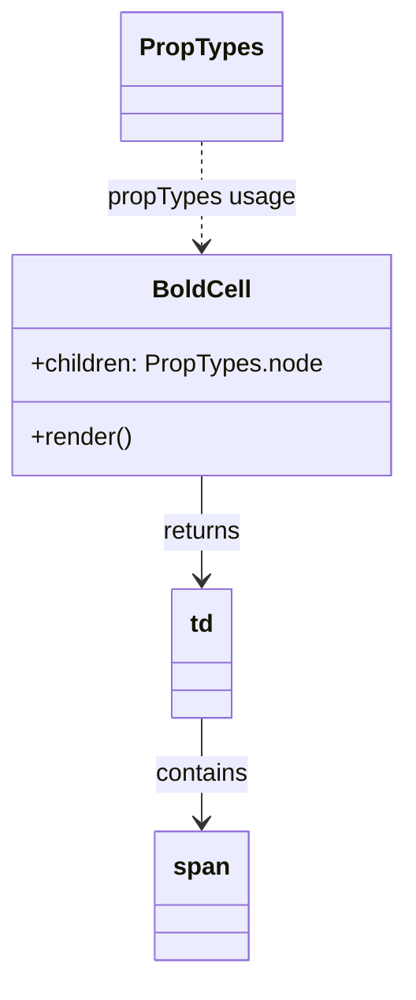

# Diagram: web/portal/src/components/organisms/bootstrap-table/Cell/BoldCell.js

> Auto-generated by Obscura crawlers

## Mermaid

### SVG

<svg id="container" width="261.5" xmlns="http://www.w3.org/2000/svg" class="classDiagram" height="634" viewBox="0 0 261.5 634" role="graphics-document document" aria-roledescription="class"><g><defs><marker id="container_class-aggregationStart" class="marker aggregation class" refX="18" refY="7" markerWidth="190" markerHeight="240" orient="auto"><path d="M 18,7 L9,13 L1,7 L9,1 Z"></path></marker></defs><defs><marker id="container_class-aggregationEnd" class="marker aggregation class" refX="1" refY="7" markerWidth="20" markerHeight="28" orient="auto"><path d="M 18,7 L9,13 L1,7 L9,1 Z"></path></marker></defs><defs><marker id="container_class-extensionStart" class="marker extension class" refX="18" refY="7" markerWidth="190" markerHeight="240" orient="auto"><path d="M 1,7 L18,13 V 1 Z"></path></marker></defs><defs><marker id="container_class-extensionEnd" class="marker extension class" refX="1" refY="7" markerWidth="20" markerHeight="28" orient="auto"><path d="M 1,1 V 13 L18,7 Z"></path></marker></defs><defs><marker id="container_class-compositionStart" class="marker composition class" refX="18" refY="7" markerWidth="190" markerHeight="240" orient="auto"><path d="M 18,7 L9,13 L1,7 L9,1 Z"></path></marker></defs><defs><marker id="container_class-compositionEnd" class="marker composition class" refX="1" refY="7" markerWidth="20" markerHeight="28" orient="auto"><path d="M 18,7 L9,13 L1,7 L9,1 Z"></path></marker></defs><defs><marker id="container_class-dependencyStart" class="marker dependency class" refX="6" refY="7" markerWidth="190" markerHeight="240" orient="auto"><path d="M 5,7 L9,13 L1,7 L9,1 Z"></path></marker></defs><defs><marker id="container_class-dependencyEnd" class="marker dependency class" refX="13" refY="7" markerWidth="20" markerHeight="28" orient="auto"><path d="M 18,7 L9,13 L14,7 L9,1 Z"></path></marker></defs><defs><marker id="container_class-lollipopStart" class="marker lollipop class" refX="13" refY="7" markerWidth="190" markerHeight="240" orient="auto"><circle stroke="black" fill="transparent" cx="7" cy="7" r="6"></circle></marker></defs><defs><marker id="container_class-lollipopEnd" class="marker lollipop class" refX="1" refY="7" markerWidth="190" markerHeight="240" orient="auto"><circle stroke="black" fill="transparent" cx="7" cy="7" r="6"></circle></marker></defs><g class="root"><g class="clusters"></g><g class="edgePaths"><path d="M130.75,310L130.75,316.167C130.75,322.333,130.75,334.667,130.75,346C130.75,357.333,130.75,367.667,130.75,372.833L130.75,378" id="id_BoldCell_td_1" class="edge-thickness-normal edge-pattern-solid relation" style=";;;" data-edge="true" data-et="edge" data-id="id_BoldCell_td_1" data-points="W3sieCI6MTMwLjc1LCJ5IjozMTB9LHsieCI6MTMwLjc1LCJ5IjozNDd9LHsieCI6MTMwLjc1LCJ5IjozODR9XQ==" marker-end="url(#container_class-dependencyEnd)"></path><path d="M130.75,468L130.75,474.167C130.75,480.333,130.75,492.667,130.75,504C130.75,515.333,130.75,525.667,130.75,530.833L130.75,536" id="id_td_span_2" class="edge-thickness-normal edge-pattern-solid relation" style=";;;" data-edge="true" data-et="edge" data-id="id_td_span_2" data-points="W3sieCI6MTMwLjc1LCJ5Ijo0Njh9LHsieCI6MTMwLjc1LCJ5Ijo1MDV9LHsieCI6MTMwLjc1LCJ5Ijo1NDJ9XQ==" marker-end="url(#container_class-dependencyEnd)"></path><path d="M130.75,92L130.75,98.167C130.75,104.333,130.75,116.667,130.75,128C130.75,139.333,130.75,149.667,130.75,154.833L130.75,160" id="id_PropTypes_BoldCell_3" class="edge-thickness-normal edge-pattern-dashed relation" style=";;;" data-edge="true" data-et="edge" data-id="id_PropTypes_BoldCell_3" data-points="W3sieCI6MTMwLjc1LCJ5Ijo5Mn0seyJ4IjoxMzAuNzUsInkiOjEyOX0seyJ4IjoxMzAuNzUsInkiOjE2Nn1d" marker-end="url(#container_class-dependencyEnd)"></path></g><g class="edgeLabels"><g class="edgeLabel" transform="translate(130.75, 347)"><g class="label" data-id="id_BoldCell_td_1" transform="translate(-26.265625, -12)"><foreignObject width="52.53125" height="24">

returns

</foreignObject></g></g><g class="edgeLabel" transform="translate(130.75, 505)"><g class="label" data-id="id_td_span_2" transform="translate(-30.890625, -12)"><foreignObject width="61.78125" height="24">

contains

</foreignObject></g></g><g class="edgeLabel" transform="translate(130.75, 129)"><g class="label" data-id="id_PropTypes_BoldCell_3" transform="translate(-60.7265625, -12)"><foreignObject width="121.453125" height="24">

propTypes usage

</foreignObject></g></g></g><g class="nodes"><g class="node default" id="classId-BoldCell-0" transform="translate(130.75, 238)"><g class="basic label-container"><path d="M-122.75 -72 L122.75 -72 L122.75 72 L-122.75 72" stroke="none" stroke-width="0" fill="#ECECFF" style=""></path><path d="M-122.75 -72 C-69.8521190955681 -72, -16.9542381911362 -72, 122.75 -72 M-122.75 -72 C-60.696791741401576 -72, 1.3564165171968483 -72, 122.75 -72 M122.75 -72 C122.75 -19.75283292863587, 122.75 32.49433414272826, 122.75 72 M122.75 -72 C122.75 -18.785737925231118, 122.75 34.428524149537765, 122.75 72 M122.75 72 C41.95809080834401 72, -38.83381838331198 72, -122.75 72 M122.75 72 C34.47612904338037 72, -53.797741913239264 72, -122.75 72 M-122.75 72 C-122.75 32.357691917798164, -122.75 -7.284616164403673, -122.75 -72 M-122.75 72 C-122.75 30.35702989799777, -122.75 -11.285940204004461, -122.75 -72" stroke="#9370DB" stroke-width="1.3" fill="none" stroke-dasharray="0 0" style=""></path></g><g class="annotation-group text" transform="translate(0, -48)"></g><g class="label-group text" transform="translate(-30.359375, -48)"><g class="label" style="font-weight: bolder" transform="translate(0,-12)"><foreignObject width="60.71875" height="24">

BoldCell

</foreignObject></g></g><g class="members-group text" transform="translate(-110.75, 0)"><g class="label" style="" transform="translate(0,-12)"><foreignObject width="191.140625" height="24">

+children: PropTypes.node

</foreignObject></g></g><g class="methods-group text" transform="translate(-110.75, 48)"><g class="label" style="" transform="translate(0,-12)"><foreignObject width="66.609375" height="24">

+render()

</foreignObject></g></g><g class="divider" style=""><path d="M-122.75 -24 C-38.92790189447639 -24, 44.894196211047216 -24, 122.75 -24 M-122.75 -24 C-39.4189401829983 -24, 43.9121196340034 -24, 122.75 -24" stroke="#9370DB" stroke-width="1.3" fill="none" stroke-dasharray="0 0" style=""></path></g><g class="divider" style=""><path d="M-122.75 24 C-28.382131943232977 24, 65.98573611353405 24, 122.75 24 M-122.75 24 C-59.84709854796244 24, 3.0558029040751222 24, 122.75 24" stroke="#9370DB" stroke-width="1.3" fill="none" stroke-dasharray="0 0" style=""></path></g></g><g class="node default" id="classId-td-1" transform="translate(130.75, 426)"><g class="basic label-container"><path d="M-19.75 -42 L19.75 -42 L19.75 42 L-19.75 42" stroke="none" stroke-width="0" fill="#ECECFF" style=""></path><path d="M-19.75 -42 C-7.76747417604043 -42, 4.2150516479191396 -42, 19.75 -42 M-19.75 -42 C-5.792281644090092 -42, 8.165436711819815 -42, 19.75 -42 M19.75 -42 C19.75 -8.403477292774731, 19.75 25.193045414450538, 19.75 42 M19.75 -42 C19.75 -11.468482501456712, 19.75 19.063034997086575, 19.75 42 M19.75 42 C7.105165669783775 42, -5.539668660432451 42, -19.75 42 M19.75 42 C10.413093624347168 42, 1.0761872486943354 42, -19.75 42 M-19.75 42 C-19.75 22.153359499190476, -19.75 2.3067189983809513, -19.75 -42 M-19.75 42 C-19.75 10.524468333605377, -19.75 -20.951063332789246, -19.75 -42" stroke="#9370DB" stroke-width="1.3" fill="none" stroke-dasharray="0 0" style=""></path></g><g class="annotation-group text" transform="translate(0, -18)"></g><g class="label-group text" transform="translate(-7.75, -18)"><g class="label" style="font-weight: bolder" transform="translate(0,-12)"><foreignObject width="15.5" height="24">

td

</foreignObject></g></g><g class="members-group text" transform="translate(-7.75, 30)"></g><g class="methods-group text" transform="translate(-7.75, 60)"></g><g class="divider" style=""><path d="M-19.75 6 C-4.176025004370661 6, 11.397949991258677 6, 19.75 6 M-19.75 6 C-11.511710126111998 6, -3.273420252223996 6, 19.75 6" stroke="#9370DB" stroke-width="1.3" fill="none" stroke-dasharray="0 0" style=""></path></g><g class="divider" style=""><path d="M-19.75 24 C-5.697692311441777 24, 8.354615377116446 24, 19.75 24 M-19.75 24 C-10.94273630019047 24, -2.1354726003809397 24, 19.75 24" stroke="#9370DB" stroke-width="1.3" fill="none" stroke-dasharray="0 0" style=""></path></g></g><g class="node default" id="classId-span-2" transform="translate(130.75, 584)"><g class="basic label-container"><path d="M-29.5625 -42 L29.5625 -42 L29.5625 42 L-29.5625 42" stroke="none" stroke-width="0" fill="#ECECFF" style=""></path><path d="M-29.5625 -42 C-13.707334487343642 -42, 2.1478310253127155 -42, 29.5625 -42 M-29.5625 -42 C-9.73865773553679 -42, 10.085184528926419 -42, 29.5625 -42 M29.5625 -42 C29.5625 -15.657231853356606, 29.5625 10.685536293286788, 29.5625 42 M29.5625 -42 C29.5625 -18.752988983927647, 29.5625 4.494022032144706, 29.5625 42 M29.5625 42 C8.234752558861224 42, -13.092994882277551 42, -29.5625 42 M29.5625 42 C17.3992201434327 42, 5.235940286865397 42, -29.5625 42 M-29.5625 42 C-29.5625 15.571034067053173, -29.5625 -10.857931865893654, -29.5625 -42 M-29.5625 42 C-29.5625 15.91181762227881, -29.5625 -10.176364755442378, -29.5625 -42" stroke="#9370DB" stroke-width="1.3" fill="none" stroke-dasharray="0 0" style=""></path></g><g class="annotation-group text" transform="translate(0, -18)"></g><g class="label-group text" transform="translate(-17.5625, -18)"><g class="label" style="font-weight: bolder" transform="translate(0,-12)"><foreignObject width="35.125" height="24">

span

</foreignObject></g></g><g class="members-group text" transform="translate(-17.5625, 30)"></g><g class="methods-group text" transform="translate(-17.5625, 60)"></g><g class="divider" style=""><path d="M-29.5625 6 C-6.586560416770009 6, 16.38937916645998 6, 29.5625 6 M-29.5625 6 C-15.760782033087239 6, -1.9590640661744771 6, 29.5625 6" stroke="#9370DB" stroke-width="1.3" fill="none" stroke-dasharray="0 0" style=""></path></g><g class="divider" style=""><path d="M-29.5625 24 C-16.588461106674465 24, -3.614422213348927 24, 29.5625 24 M-29.5625 24 C-7.917334148890099 24, 13.727831702219802 24, 29.5625 24" stroke="#9370DB" stroke-width="1.3" fill="none" stroke-dasharray="0 0" style=""></path></g></g><g class="node default" id="classId-PropTypes-3" transform="translate(130.75, 50)"><g class="basic label-container"><path d="M-50.2578125 -42 L50.2578125 -42 L50.2578125 42 L-50.2578125 42" stroke="none" stroke-width="0" fill="#ECECFF" style=""></path><path d="M-50.2578125 -42 C-19.89895120796472 -42, 10.459910084070557 -42, 50.2578125 -42 M-50.2578125 -42 C-29.623843769367994 -42, -8.989875038735988 -42, 50.2578125 -42 M50.2578125 -42 C50.2578125 -9.296236184995493, 50.2578125 23.407527630009014, 50.2578125 42 M50.2578125 -42 C50.2578125 -12.365679715404536, 50.2578125 17.26864056919093, 50.2578125 42 M50.2578125 42 C14.934372155058185 42, -20.38906818988363 42, -50.2578125 42 M50.2578125 42 C15.437799032434889 42, -19.382214435130223 42, -50.2578125 42 M-50.2578125 42 C-50.2578125 8.709115815068259, -50.2578125 -24.581768369863482, -50.2578125 -42 M-50.2578125 42 C-50.2578125 19.900047889395864, -50.2578125 -2.1999042212082713, -50.2578125 -42" stroke="#9370DB" stroke-width="1.3" fill="none" stroke-dasharray="0 0" style=""></path></g><g class="annotation-group text" transform="translate(0, -18)"></g><g class="label-group text" transform="translate(-38.2578125, -18)"><g class="label" style="font-weight: bolder" transform="translate(0,-12)"><foreignObject width="76.515625" height="24">

PropTypes

</foreignObject></g></g><g class="members-group text" transform="translate(-38.2578125, 30)"></g><g class="methods-group text" transform="translate(-38.2578125, 60)"></g><g class="divider" style=""><path d="M-50.2578125 6 C-18.243587833572604 6, 13.770636832854791 6, 50.2578125 6 M-50.2578125 6 C-18.404960002859237 6, 13.447892494281525 6, 50.2578125 6" stroke="#9370DB" stroke-width="1.3" fill="none" stroke-dasharray="0 0" style=""></path></g><g class="divider" style=""><path d="M-50.2578125 24 C-24.67824991145586 24, 0.9013126770882778 24, 50.2578125 24 M-50.2578125 24 C-12.27137586536454 24, 25.71506076927092 24, 50.2578125 24" stroke="#9370DB" stroke-width="1.3" fill="none" stroke-dasharray="0 0" style=""></path></g></g></g></g></g></svg>
