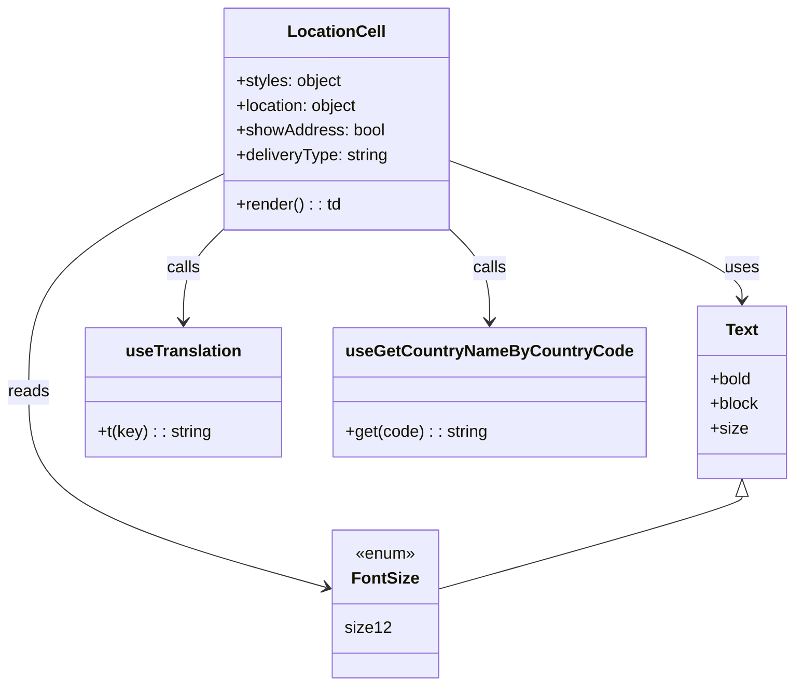

# Diagram: web/portal/src/components/organisms/bootstrap-table/Cell/LocationCell.js


> Auto-generated by Obscura crawlers

## Diagram 1



### SVG

<svg id="container" width="759.609375" xmlns="http://www.w3.org/2000/svg" class="classDiagram" height="668" viewBox="0 0 759.609375 668" role="graphics-document document" aria-roledescription="class"><style>#container{font-family:"trebuchet ms",verdana,arial,sans-serif;font-size:16px;fill:#333;}@keyframes edge-animation-frame{from{stroke-dashoffset:0;}}@keyframes dash{to{stroke-dashoffset:0;}}#container .edge-animation-slow{stroke-dasharray:9,5!important;stroke-dashoffset:900;animation:dash 50s linear infinite;stroke-linecap:round;}#container .edge-animation-fast{stroke-dasharray:9,5!important;stroke-dashoffset:900;animation:dash 20s linear infinite;stroke-linecap:round;}#container .error-icon{fill:#552222;}#container .error-text{fill:#552222;stroke:#552222;}#container .edge-thickness-normal{stroke-width:1px;}#container .edge-thickness-thick{stroke-width:3.5px;}#container .edge-pattern-solid{stroke-dasharray:0;}#container .edge-thickness-invisible{stroke-width:0;fill:none;}#container .edge-pattern-dashed{stroke-dasharray:3;}#container .edge-pattern-dotted{stroke-dasharray:2;}#container .marker{fill:#333333;stroke:#333333;}#container .marker.cross{stroke:#333333;}#container svg{font-family:"trebuchet ms",verdana,arial,sans-serif;font-size:16px;}#container p{margin:0;}#container g.classGroup text{fill:#9370DB;stroke:none;font-family:"trebuchet ms",verdana,arial,sans-serif;font-size:10px;}#container g.classGroup text .title{font-weight:bolder;}#container .nodeLabel,#container .edgeLabel{color:#131300;}#container .edgeLabel .label rect{fill:#ECECFF;}#container .label text{fill:#131300;}#container .labelBkg{background:#ECECFF;}#container .edgeLabel .label span{background:#ECECFF;}#container .classTitle{font-weight:bolder;}#container .node rect,#container .node circle,#container .node ellipse,#container .node polygon,#container .node path{fill:#ECECFF;stroke:#9370DB;stroke-width:1px;}#container .divider{stroke:#9370DB;stroke-width:1;}#container g.clickable{cursor:pointer;}#container g.classGroup rect{fill:#ECECFF;stroke:#9370DB;}#container g.classGroup line{stroke:#9370DB;stroke-width:1;}#container .classLabel .box{stroke:none;stroke-width:0;fill:#ECECFF;opacity:0.5;}#container .classLabel .label{fill:#9370DB;font-size:10px;}#container .relation{stroke:#333333;stroke-width:1;fill:none;}#container .dashed-line{stroke-dasharray:3;}#container .dotted-line{stroke-dasharray:1 2;}#container #compositionStart,#container .composition{fill:#333333!important;stroke:#333333!important;stroke-width:1;}#container #compositionEnd,#container .composition{fill:#333333!important;stroke:#333333!important;stroke-width:1;}#container #dependencyStart,#container .dependency{fill:#333333!important;stroke:#333333!important;stroke-width:1;}#container #dependencyStart,#container .dependency{fill:#333333!important;stroke:#333333!important;stroke-width:1;}#container #extensionStart,#container .extension{fill:transparent!important;stroke:#333333!important;stroke-width:1;}#container #extensionEnd,#container .extension{fill:transparent!important;stroke:#333333!important;stroke-width:1;}#container #aggregationStart,#container .aggregation{fill:transparent!important;stroke:#333333!important;stroke-width:1;}#container #aggregationEnd,#container .aggregation{fill:transparent!important;stroke:#333333!important;stroke-width:1;}#container #lollipopStart,#container .lollipop{fill:#ECECFF!important;stroke:#333333!important;stroke-width:1;}#container #lollipopEnd,#container .lollipop{fill:#ECECFF!important;stroke:#333333!important;stroke-width:1;}#container .edgeTerminals{font-size:11px;line-height:initial;}#container .classTitleText{text-anchor:middle;font-size:18px;fill:#333;}#container .label-icon{display:inline-block;height:1em;overflow:visible;vertical-align:-0.125em;}#container .node .label-icon path{fill:currentColor;stroke:revert;stroke-width:revert;}#container :root{--mermaid-font-family:"trebuchet ms",verdana,arial,sans-serif;}</style><g><defs><marker id="container_class-aggregationStart" class="marker aggregation class" refX="18" refY="7" markerWidth="190" markerHeight="240" orient="auto"><path d="M 18,7 L9,13 L1,7 L9,1 Z"></path></marker></defs><defs><marker id="container_class-aggregationEnd" class="marker aggregation class" refX="1" refY="7" markerWidth="20" markerHeight="28" orient="auto"><path d="M 18,7 L9,13 L1,7 L9,1 Z"></path></marker></defs><defs><marker id="container_class-extensionStart" class="marker extension class" refX="18" refY="7" markerWidth="190" markerHeight="240" orient="auto"><path d="M 1,7 L18,13 V 1 Z"></path></marker></defs><defs><marker id="container_class-extensionEnd" class="marker extension class" refX="1" refY="7" markerWidth="20" markerHeight="28" orient="auto"><path d="M 1,1 V 13 L18,7 Z"></path></marker></defs><defs><marker id="container_class-compositionStart" class="marker composition class" refX="18" refY="7" markerWidth="190" markerHeight="240" orient="auto"><path d="M 18,7 L9,13 L1,7 L9,1 Z"></path></marker></defs><defs><marker id="container_class-compositionEnd" class="marker composition class" refX="1" refY="7" markerWidth="20" markerHeight="28" orient="auto"><path d="M 18,7 L9,13 L1,7 L9,1 Z"></path></marker></defs><defs><marker id="container_class-dependencyStart" class="marker dependency class" refX="6" refY="7" markerWidth="190" markerHeight="240" orient="auto"><path d="M 5,7 L9,13 L1,7 L9,1 Z"></path></marker></defs><defs><marker id="container_class-dependencyEnd" class="marker dependency class" refX="13" refY="7" markerWidth="20" markerHeight="28" orient="auto"><path d="M 18,7 L9,13 L14,7 L9,1 Z"></path></marker></defs><defs><marker id="container_class-lollipopStart" class="marker lollipop class" refX="13" refY="7" markerWidth="190" markerHeight="240" orient="auto"><circle stroke="black" fill="transparent" cx="7" cy="7" r="6"></circle></marker></defs><defs><marker id="container_class-lollipopEnd" class="marker lollipop class" refX="1" refY="7" markerWidth="190" markerHeight="240" orient="auto"><circle stroke="black" fill="transparent" cx="7" cy="7" r="6"></circle></marker></defs><g class="root"><g class="clusters"></g><g class="edgePaths"><path d="M432.096,157.094L478.126,174.411C524.156,191.729,616.217,226.365,662.247,248.849C708.277,271.333,708.277,281.667,708.277,286.833L708.277,292" id="id_LocationCell_Text_1" class="edge-thickness-normal edge-pattern-solid relation" style=";;;" data-edge="true" data-et="edge" data-id="id_LocationCell_Text_1" data-points="W3sieCI6NDMyLjA5NTcwMzEyNSwieSI6MTU3LjA5MzcwNjQ0OTYzNDg4fSx7IngiOjcwOC4yNzczNDM3NSwieSI6MjYxfSx7IngiOjcwOC4yNzczNDM3NSwieSI6Mjk4fV0=" marker-end="url(#container_class-dependencyEnd)"></path><path d="M213.643,169.713L182.703,184.927C151.764,200.142,89.886,230.571,58.947,265.952C28.008,301.333,28.008,341.667,28.008,380C28.008,418.333,28.008,454.667,75.695,486.433C123.382,518.199,218.756,545.398,266.443,558.997L314.13,572.597" id="id_LocationCell_FontSize_2" class="edge-thickness-normal edge-pattern-solid relation" style=";;;" data-edge="true" data-et="edge" data-id="id_LocationCell_FontSize_2" data-points="W3sieCI6MjEzLjY0MjU3ODEyNSwieSI6MTY5LjcxMjg4MTQ1MjQ4MzYzfSx7IngiOjI4LjAwNzgxMjUsInkiOjI2MX0seyJ4IjoyOC4wMDc4MTI1LCJ5IjozODJ9LHsieCI6MjguMDA3ODEyNSwieSI6NDkxfSx7IngiOjMxOS45MDAzOTA2MjUsInkiOjU3NC4yNDIyNDA4Mzk3NDA3fV0=" marker-end="url(#container_class-dependencyEnd)"></path><path d="M214.51,224L208.323,230.167C202.135,236.333,189.761,248.667,183.574,263.5C177.387,278.333,177.387,295.667,177.387,304.333L177.387,313" id="id_LocationCell_useTranslation_3" class="edge-thickness-normal edge-pattern-solid relation" style=";;;" data-edge="true" data-et="edge" data-id="id_LocationCell_useTranslation_3" data-points="W3sieCI6MjE0LjUwOTgxOTUwNDMxMDM0LCJ5IjoyMjR9LHsieCI6MTc3LjM4NjcxODc1LCJ5IjoyNjF9LHsieCI6MTc3LjM4NjcxODc1LCJ5IjozMTl9XQ==" marker-end="url(#container_class-dependencyEnd)"></path><path d="M431.228,224L437.416,230.167C443.603,236.333,455.977,248.667,462.164,263.5C468.352,278.333,468.352,295.667,468.352,304.333L468.352,313" id="id_LocationCell_useGetCountryNameByCountryCode_4" class="edge-thickness-normal edge-pattern-solid relation" style=";;;" data-edge="true" data-et="edge" data-id="id_LocationCell_useGetCountryNameByCountryCode_4" data-points="W3sieCI6NDMxLjIyODQ2MTc0NTY4OTYzLCJ5IjoyMjR9LHsieCI6NDY4LjM1MTU2MjUsInkiOjI2MX0seyJ4Ijo0NjguMzUxNTYyNSwieSI6MzE5fV0=" marker-end="url(#container_class-dependencyEnd)"></path><path d="M708.277,483.25L708.277,484.542C708.277,485.833,708.277,488.417,659.629,503.582C610.98,518.747,513.682,546.495,465.034,560.369L416.385,574.242" id="id_Text_FontSize_5" class="edge-thickness-normal edge-pattern-solid relation" style=";;;" data-edge="true" data-et="edge" data-id="id_Text_FontSize_5" data-points="W3sieCI6NzA4LjI3NzM0Mzc1LCJ5Ijo0NjZ9LHsieCI6NzA4LjI3NzM0Mzc1LCJ5Ijo0OTF9LHsieCI6NDE2LjM4NDc2NTYyNSwieSI6NTc0LjI0MjI0MDgzOTc0MDd9XQ==" marker-start="url(#container_class-extensionStart)"></path></g><g class="edgeLabels"><g class="edgeLabel" transform="translate(708.27734375, 261)"><g class="label" data-id="id_LocationCell_Text_1" transform="translate(-16.4921875, -12)"><foreignObject width="32.984375" height="24"><div xmlns="http://www.w3.org/1999/xhtml" class="labelBkg" style="display: table-cell; white-space: nowrap; line-height: 1.5; max-width: 200px; text-align: center;"><span class="edgeLabel"><p>uses</p></span></div></foreignObject></g></g><g class="edgeLabel" transform="translate(28.0078125, 382)"><g class="label" data-id="id_LocationCell_FontSize_2" transform="translate(-20.0078125, -12)"><foreignObject width="40.015625" height="24"><div xmlns="http://www.w3.org/1999/xhtml" class="labelBkg" style="display: table-cell; white-space: nowrap; line-height: 1.5; max-width: 200px; text-align: center;"><span class="edgeLabel"><p>reads</p></span></div></foreignObject></g></g><g class="edgeLabel" transform="translate(177.38671875, 261)"><g class="label" data-id="id_LocationCell_useTranslation_3" transform="translate(-16.4453125, -12)"><foreignObject width="32.890625" height="24"><div xmlns="http://www.w3.org/1999/xhtml" class="labelBkg" style="display: table-cell; white-space: nowrap; line-height: 1.5; max-width: 200px; text-align: center;"><span class="edgeLabel"><p>calls</p></span></div></foreignObject></g></g><g class="edgeLabel" transform="translate(468.3515625, 261)"><g class="label" data-id="id_LocationCell_useGetCountryNameByCountryCode_4" transform="translate(-16.4453125, -12)"><foreignObject width="32.890625" height="24"><div xmlns="http://www.w3.org/1999/xhtml" class="labelBkg" style="display: table-cell; white-space: nowrap; line-height: 1.5; max-width: 200px; text-align: center;"><span class="edgeLabel"><p>calls</p></span></div></foreignObject></g></g><g class="edgeLabel"><g class="label" data-id="id_Text_FontSize_5" transform="translate(0, 0)"><foreignObject width="0" height="0"><div xmlns="http://www.w3.org/1999/xhtml" class="labelBkg" style="display: table-cell; white-space: nowrap; line-height: 1.5; max-width: 200px; text-align: center;"><span class="edgeLabel"></span></div></foreignObject></g></g></g><g class="nodes"><g class="node default" id="classId-LocationCell-0" transform="translate(322.869140625, 116)"><g class="basic label-container"><path d="M-109.2265625 -108 L109.2265625 -108 L109.2265625 108 L-109.2265625 108" stroke="none" stroke-width="0" fill="#ECECFF" style=""></path><path d="M-109.2265625 -108 C-60.970159098647095 -108, -12.71375569729419 -108, 109.2265625 -108 M-109.2265625 -108 C-38.748947923266556 -108, 31.728666653466888 -108, 109.2265625 -108 M109.2265625 -108 C109.2265625 -48.268112953337344, 109.2265625 11.463774093325313, 109.2265625 108 M109.2265625 -108 C109.2265625 -53.31900016357055, 109.2265625 1.3619996728589001, 109.2265625 108 M109.2265625 108 C53.707399156140355 108, -1.811764187719291 108, -109.2265625 108 M109.2265625 108 C53.62485300134352 108, -1.9768564973129656 108, -109.2265625 108 M-109.2265625 108 C-109.2265625 55.29147051270436, -109.2265625 2.582941025408715, -109.2265625 -108 M-109.2265625 108 C-109.2265625 63.99543215766954, -109.2265625 19.99086431533908, -109.2265625 -108" stroke="#9370DB" stroke-width="1.3" fill="none" stroke-dasharray="0 0" style=""></path></g><g class="annotation-group text" transform="translate(0, -84)"></g><g class="label-group text" transform="translate(-44.953125, -84)"><g class="label" style="font-weight: bolder" transform="translate(0,-12)"><foreignObject width="89.90625" height="24"><div xmlns="http://www.w3.org/1999/xhtml" style="display: table-cell; white-space: nowrap; line-height: 1.5; max-width: 139px; text-align: center;"><span class="nodeLabel markdown-node-label" style=""><p>LocationCell</p></span></div></foreignObject></g></g><g class="members-group text" transform="translate(-97.2265625, -36)"><g class="label" style="" transform="translate(0,-12)"><foreignObject width="103.390625" height="24"><div xmlns="http://www.w3.org/1999/xhtml" style="display: table-cell; white-space: nowrap; line-height: 1.5; max-width: 161px; text-align: center;"><span class="nodeLabel markdown-node-label" style=""><p>+styles: object</p></span></div></foreignObject></g><g class="label" style="" transform="translate(0,12)"><foreignObject width="120.703125" height="24"><div xmlns="http://www.w3.org/1999/xhtml" style="display: table-cell; white-space: nowrap; line-height: 1.5; max-width: 178px; text-align: center;"><span class="nodeLabel markdown-node-label" style=""><p>+location: object</p></span></div></foreignObject></g><g class="label" style="" transform="translate(0,36)"><foreignObject width="144.125" height="24"><div xmlns="http://www.w3.org/1999/xhtml" style="display: table-cell; white-space: nowrap; line-height: 1.5; max-width: 202px; text-align: center;"><span class="nodeLabel markdown-node-label" style=""><p>+showAddress: bool</p></span></div></foreignObject></g><g class="label" style="" transform="translate(0,60)"><foreignObject width="149.5" height="24"><div xmlns="http://www.w3.org/1999/xhtml" style="display: table-cell; white-space: nowrap; line-height: 1.5; max-width: 208px; text-align: center;"><span class="nodeLabel markdown-node-label" style=""><p>+deliveryType: string</p></span></div></foreignObject></g></g><g class="methods-group text" transform="translate(-97.2265625, 84)"><g class="label" style="" transform="translate(0,-12)"><foreignObject width="102.125" height="24"><div xmlns="http://www.w3.org/1999/xhtml" style="display: table-cell; white-space: nowrap; line-height: 1.5; max-width: 159px; text-align: center;"><span class="nodeLabel markdown-node-label" style=""><p>+render() : : td</p></span></div></foreignObject></g></g><g class="divider" style=""><path d="M-109.2265625 -60 C-26.13905470272249 -60, 56.94845309455502 -60, 109.2265625 -60 M-109.2265625 -60 C-59.414900308841716 -60, -9.603238117683432 -60, 109.2265625 -60" stroke="#9370DB" stroke-width="1.3" fill="none" stroke-dasharray="0 0" style=""></path></g><g class="divider" style=""><path d="M-109.2265625 60 C-61.24781019555876 60, -13.269057891117527 60, 109.2265625 60 M-109.2265625 60 C-50.38588285978075 60, 8.4547967804385 60, 109.2265625 60" stroke="#9370DB" stroke-width="1.3" fill="none" stroke-dasharray="0 0" style=""></path></g></g><g class="node default" id="classId-Text-1" transform="translate(708.27734375, 382)"><g class="basic label-container"><path d="M-43.33203125 -84 L43.33203125 -84 L43.33203125 84 L-43.33203125 84" stroke="none" stroke-width="0" fill="#ECECFF" style=""></path><path d="M-43.33203125 -84 C-13.416442027167488 -84, 16.499147195665024 -84, 43.33203125 -84 M-43.33203125 -84 C-17.404533325104953 -84, 8.522964599790093 -84, 43.33203125 -84 M43.33203125 -84 C43.33203125 -38.94405798751441, 43.33203125 6.111884024971175, 43.33203125 84 M43.33203125 -84 C43.33203125 -23.051183062263455, 43.33203125 37.89763387547309, 43.33203125 84 M43.33203125 84 C24.997694892323185 84, 6.66335853464637 84, -43.33203125 84 M43.33203125 84 C20.42400173139816 84, -2.4840277872036793 84, -43.33203125 84 M-43.33203125 84 C-43.33203125 38.386851051612666, -43.33203125 -7.226297896774668, -43.33203125 -84 M-43.33203125 84 C-43.33203125 39.75978463293219, -43.33203125 -4.4804307341356235, -43.33203125 -84" stroke="#9370DB" stroke-width="1.3" fill="none" stroke-dasharray="0 0" style=""></path></g><g class="annotation-group text" transform="translate(0, -60)"></g><g class="label-group text" transform="translate(-15.3828125, -60)"><g class="label" style="font-weight: bolder" transform="translate(0,-12)"><foreignObject width="30.765625" height="24"><div xmlns="http://www.w3.org/1999/xhtml" style="display: table-cell; white-space: nowrap; line-height: 1.5; max-width: 80px; text-align: center;"><span class="nodeLabel markdown-node-label" style=""><p>Text</p></span></div></foreignObject></g></g><g class="members-group text" transform="translate(-31.33203125, -12)"><g class="label" style="" transform="translate(0,-12)"><foreignObject width="41.015625" height="24"><div xmlns="http://www.w3.org/1999/xhtml" style="display: table-cell; white-space: nowrap; line-height: 1.5; max-width: 98px; text-align: center;"><span class="nodeLabel markdown-node-label" style=""><p>+bold</p></span></div></foreignObject></g><g class="label" style="" transform="translate(0,12)"><foreignObject width="47.28125" height="24"><div xmlns="http://www.w3.org/1999/xhtml" style="display: table-cell; white-space: nowrap; line-height: 1.5; max-width: 105px; text-align: center;"><span class="nodeLabel markdown-node-label" style=""><p>+block</p></span></div></foreignObject></g><g class="label" style="" transform="translate(0,36)"><foreignObject width="35.578125" height="24"><div xmlns="http://www.w3.org/1999/xhtml" style="display: table-cell; white-space: nowrap; line-height: 1.5; max-width: 93px; text-align: center;"><span class="nodeLabel markdown-node-label" style=""><p>+size</p></span></div></foreignObject></g></g><g class="methods-group text" transform="translate(-31.33203125, 84)"></g><g class="divider" style=""><path d="M-43.33203125 -36 C-9.651419921843477 -36, 24.029191406313046 -36, 43.33203125 -36 M-43.33203125 -36 C-25.231652192093684 -36, -7.131273134187367 -36, 43.33203125 -36" stroke="#9370DB" stroke-width="1.3" fill="none" stroke-dasharray="0 0" style=""></path></g><g class="divider" style=""><path d="M-43.33203125 60 C-17.573511519206836 60, 8.185008211586329 60, 43.33203125 60 M-43.33203125 60 C-12.290079429700501 60, 18.751872390598997 60, 43.33203125 60" stroke="#9370DB" stroke-width="1.3" fill="none" stroke-dasharray="0 0" style=""></path></g></g><g class="node default" id="classId-FontSize-2" transform="translate(368.142578125, 588)"><g class="basic label-container"><path d="M-48.2421875 -72 L48.2421875 -72 L48.2421875 72 L-48.2421875 72" stroke="none" stroke-width="0" fill="#ECECFF" style=""></path><path d="M-48.2421875 -72 C-12.313549794025668 -72, 23.615087911948663 -72, 48.2421875 -72 M-48.2421875 -72 C-26.462138845981816 -72, -4.682090191963631 -72, 48.2421875 -72 M48.2421875 -72 C48.2421875 -39.86549370101162, 48.2421875 -7.730987402023246, 48.2421875 72 M48.2421875 -72 C48.2421875 -40.60356263003382, 48.2421875 -9.207125260067649, 48.2421875 72 M48.2421875 72 C14.465826221425061 72, -19.310535057149878 72, -48.2421875 72 M48.2421875 72 C12.376910719348608 72, -23.488366061302784 72, -48.2421875 72 M-48.2421875 72 C-48.2421875 28.594332409710752, -48.2421875 -14.811335180578496, -48.2421875 -72 M-48.2421875 72 C-48.2421875 26.60044550323311, -48.2421875 -18.79910899353378, -48.2421875 -72" stroke="#9370DB" stroke-width="1.3" fill="none" stroke-dasharray="0 0" style=""></path></g><g class="annotation-group text" transform="translate(-29.53125, -48)"><g class="label" style="" transform="translate(0,-12)"><foreignObject width="59.0625" height="24"><div xmlns="http://www.w3.org/1999/xhtml" style="display: table-cell; white-space: nowrap; line-height: 1.5; max-width: 109px; text-align: center;"><span class="nodeLabel markdown-node-label" style=""><p>«enum»</p></span></div></foreignObject></g></g><g class="label-group text" transform="translate(-30.84375, -24)"><g class="label" style="font-weight: bolder" transform="translate(0,-12)"><foreignObject width="61.6875" height="24"><div xmlns="http://www.w3.org/1999/xhtml" style="display: table-cell; white-space: nowrap; line-height: 1.5; max-width: 111px; text-align: center;"><span class="nodeLabel markdown-node-label" style=""><p>FontSize</p></span></div></foreignObject></g></g><g class="members-group text" transform="translate(-36.2421875, 24)"><g class="label" style="" transform="translate(0,-12)"><foreignObject width="41.640625" height="24"><div xmlns="http://www.w3.org/1999/xhtml" style="display: table-cell; white-space: nowrap; line-height: 1.5; max-width: 92px; text-align: center;"><span class="nodeLabel markdown-node-label" style=""><p>size12</p></span></div></foreignObject></g></g><g class="methods-group text" transform="translate(-36.2421875, 72)"></g><g class="divider" style=""><path d="M-48.2421875 0 C-26.73608537780725 0, -5.229983255614499 0, 48.2421875 0 M-48.2421875 0 C-14.20361716500927 0, 19.83495316998146 0, 48.2421875 0" stroke="#9370DB" stroke-width="1.3" fill="none" stroke-dasharray="0 0" style=""></path></g><g class="divider" style=""><path d="M-48.2421875 48 C-12.895604693419003 48, 22.450978113161995 48, 48.2421875 48 M-48.2421875 48 C-12.10699000300923 48, 24.02820749398154 48, 48.2421875 48" stroke="#9370DB" stroke-width="1.3" fill="none" stroke-dasharray="0 0" style=""></path></g></g><g class="node default" id="classId-useTranslation-3" transform="translate(177.38671875, 382)"><g class="basic label-container"><path d="M-94.37109375 -63 L94.37109375 -63 L94.37109375 63 L-94.37109375 63" stroke="none" stroke-width="0" fill="#ECECFF" style=""></path><path d="M-94.37109375 -63 C-54.43603310909778 -63, -14.500972468195556 -63, 94.37109375 -63 M-94.37109375 -63 C-45.01698735978138 -63, 4.337119030437236 -63, 94.37109375 -63 M94.37109375 -63 C94.37109375 -28.64151336627166, 94.37109375 5.71697326745668, 94.37109375 63 M94.37109375 -63 C94.37109375 -14.458760222485871, 94.37109375 34.08247955502826, 94.37109375 63 M94.37109375 63 C54.19245399263715 63, 14.013814235274296 63, -94.37109375 63 M94.37109375 63 C39.873619921122376 63, -14.623853907755247 63, -94.37109375 63 M-94.37109375 63 C-94.37109375 23.42928690845261, -94.37109375 -16.14142618309478, -94.37109375 -63 M-94.37109375 63 C-94.37109375 15.986361259132622, -94.37109375 -31.027277481734757, -94.37109375 -63" stroke="#9370DB" stroke-width="1.3" fill="none" stroke-dasharray="0 0" style=""></path></g><g class="annotation-group text" transform="translate(0, -39)"></g><g class="label-group text" transform="translate(-54.0859375, -39)"><g class="label" style="font-weight: bolder" transform="translate(0,-12)"><foreignObject width="108.171875" height="24"><div xmlns="http://www.w3.org/1999/xhtml" style="display: table-cell; white-space: nowrap; line-height: 1.5; max-width: 157px; text-align: center;"><span class="nodeLabel markdown-node-label" style=""><p>useTranslation</p></span></div></foreignObject></g></g><g class="members-group text" transform="translate(-82.37109375, 9)"></g><g class="methods-group text" transform="translate(-82.37109375, 39)"><g class="label" style="" transform="translate(0,-12)"><foreignObject width="110.65625" height="24"><div xmlns="http://www.w3.org/1999/xhtml" style="display: table-cell; white-space: nowrap; line-height: 1.5; max-width: 169px; text-align: center;"><span class="nodeLabel markdown-node-label" style=""><p>+t(key) : : string</p></span></div></foreignObject></g></g><g class="divider" style=""><path d="M-94.37109375 -15 C-39.73205815956708 -15, 14.906977430865837 -15, 94.37109375 -15 M-94.37109375 -15 C-54.01068423343615 -15, -13.650274716872303 -15, 94.37109375 -15" stroke="#9370DB" stroke-width="1.3" fill="none" stroke-dasharray="0 0" style=""></path></g><g class="divider" style=""><path d="M-94.37109375 9 C-44.22525253875573 9, 5.920588672488535 9, 94.37109375 9 M-94.37109375 9 C-50.67024600708279 9, -6.9693982641655765 9, 94.37109375 9" stroke="#9370DB" stroke-width="1.3" fill="none" stroke-dasharray="0 0" style=""></path></g></g><g class="node default" id="classId-useGetCountryNameByCountryCode-4" transform="translate(468.3515625, 382)"><g class="basic label-container"><path d="M-146.59375 -63 L146.59375 -63 L146.59375 63 L-146.59375 63" stroke="none" stroke-width="0" fill="#ECECFF" style=""></path><path d="M-146.59375 -63 C-31.147492065340202 -63, 84.2987658693196 -63, 146.59375 -63 M-146.59375 -63 C-76.01428924484087 -63, -5.434828489681735 -63, 146.59375 -63 M146.59375 -63 C146.59375 -37.65467123599391, 146.59375 -12.309342471987819, 146.59375 63 M146.59375 -63 C146.59375 -28.36451677628112, 146.59375 6.2709664474377576, 146.59375 63 M146.59375 63 C38.8952192148374 63, -68.8033115703252 63, -146.59375 63 M146.59375 63 C75.62482130453978 63, 4.655892609079558 63, -146.59375 63 M-146.59375 63 C-146.59375 31.362016566662504, -146.59375 -0.2759668666749917, -146.59375 -63 M-146.59375 63 C-146.59375 37.625664121544254, -146.59375 12.251328243088508, -146.59375 -63" stroke="#9370DB" stroke-width="1.3" fill="none" stroke-dasharray="0 0" style=""></path></g><g class="annotation-group text" transform="translate(0, -39)"></g><g class="label-group text" transform="translate(-131.28125, -39)"><g class="label" style="font-weight: bolder" transform="translate(0,-12)"><foreignObject width="262.5625" height="24"><div xmlns="http://www.w3.org/1999/xhtml" style="display: table-cell; white-space: nowrap; line-height: 1.5; max-width: 309px; text-align: center;"><span class="nodeLabel markdown-node-label" style=""><p>useGetCountryNameByCountryCode</p></span></div></foreignObject></g></g><g class="members-group text" transform="translate(-134.59375, 9)"></g><g class="methods-group text" transform="translate(-134.59375, 39)"><g class="label" style="" transform="translate(0,-12)"><foreignObject width="137.90625" height="24"><div xmlns="http://www.w3.org/1999/xhtml" style="display: table-cell; white-space: nowrap; line-height: 1.5; max-width: 196px; text-align: center;"><span class="nodeLabel markdown-node-label" style=""><p>+get(code) : : string</p></span></div></foreignObject></g></g><g class="divider" style=""><path d="M-146.59375 -15 C-39.55092171441383 -15, 67.49190657117234 -15, 146.59375 -15 M-146.59375 -15 C-52.4059719126259 -15, 41.7818061747482 -15, 146.59375 -15" stroke="#9370DB" stroke-width="1.3" fill="none" stroke-dasharray="0 0" style=""></path></g><g class="divider" style=""><path d="M-146.59375 9 C-85.03601185947717 9, -23.47827371895434 9, 146.59375 9 M-146.59375 9 C-31.630456278480906 9, 83.33283744303819 9, 146.59375 9" stroke="#9370DB" stroke-width="1.3" fill="none" stroke-dasharray="0 0" style=""></path></g></g></g></g></g></svg>

## Diagram 2

```mermaid
flowchart TD
    A[Start: LocationCell props] --> B{deliveryType exists?}
    B -- no --> C[deliveryTypeTranslated = null]
    B -- yes --> D{toLowerCase == "attended"?}
    D -- yes --> E[deliveryTypeTranslated = t("components:Attended")]
    D -- no --> F{toLowerCase == "unattended"?}
    F -- yes --> G[deliveryTypeTranslated = t("components:Unattended")]
    F -- no --> C
    E --> H[Compute countryName via useGetCountryNameByCountryCode(location.country)]
    G --> H
    C --> H
    H --> I{showAddress true?}
    I -- yes --> J[Render code, name, address, city/state/postal, countryName(if any)]
    I -- no --> K[Render code and name only]
    J --> L{deliveryTypeTranslated?}
    K --> L
    L -- yes --> M[Render Delivery Type line]
    L -- no --> N[Skip Delivery Type]
    M --> Z[End: return <td>]
    N --> Z
```

> SVG rendering failed for this diagram.
