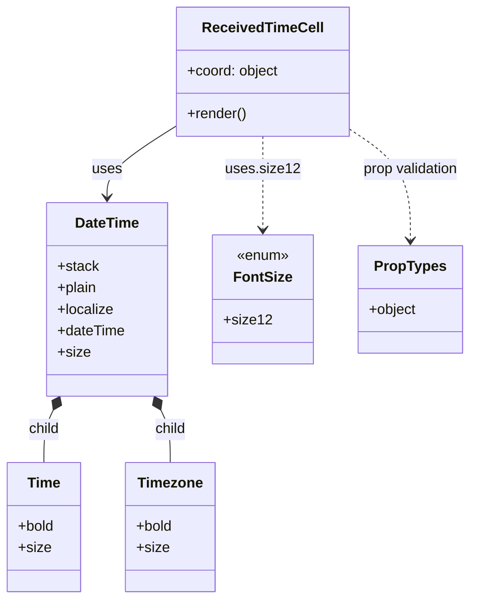

# Diagram: web/portal/src/components/organisms/bootstrap-table/Cell/ReceivedTimeCell.js


> Auto-generated by Obscura crawlers

## Diagram 1



### SVG

<svg id="container" width="515.455078125" xmlns="http://www.w3.org/2000/svg" class="classDiagram" height="668" viewBox="0 0 515.455078125 668" role="graphics-document document" aria-roledescription="class"><style>#container{font-family:"trebuchet ms",verdana,arial,sans-serif;font-size:16px;fill:#333;}@keyframes edge-animation-frame{from{stroke-dashoffset:0;}}@keyframes dash{to{stroke-dashoffset:0;}}#container .edge-animation-slow{stroke-dasharray:9,5!important;stroke-dashoffset:900;animation:dash 50s linear infinite;stroke-linecap:round;}#container .edge-animation-fast{stroke-dasharray:9,5!important;stroke-dashoffset:900;animation:dash 20s linear infinite;stroke-linecap:round;}#container .error-icon{fill:#552222;}#container .error-text{fill:#552222;stroke:#552222;}#container .edge-thickness-normal{stroke-width:1px;}#container .edge-thickness-thick{stroke-width:3.5px;}#container .edge-pattern-solid{stroke-dasharray:0;}#container .edge-thickness-invisible{stroke-width:0;fill:none;}#container .edge-pattern-dashed{stroke-dasharray:3;}#container .edge-pattern-dotted{stroke-dasharray:2;}#container .marker{fill:#333333;stroke:#333333;}#container .marker.cross{stroke:#333333;}#container svg{font-family:"trebuchet ms",verdana,arial,sans-serif;font-size:16px;}#container p{margin:0;}#container g.classGroup text{fill:#9370DB;stroke:none;font-family:"trebuchet ms",verdana,arial,sans-serif;font-size:10px;}#container g.classGroup text .title{font-weight:bolder;}#container .nodeLabel,#container .edgeLabel{color:#131300;}#container .edgeLabel .label rect{fill:#ECECFF;}#container .label text{fill:#131300;}#container .labelBkg{background:#ECECFF;}#container .edgeLabel .label span{background:#ECECFF;}#container .classTitle{font-weight:bolder;}#container .node rect,#container .node circle,#container .node ellipse,#container .node polygon,#container .node path{fill:#ECECFF;stroke:#9370DB;stroke-width:1px;}#container .divider{stroke:#9370DB;stroke-width:1;}#container g.clickable{cursor:pointer;}#container g.classGroup rect{fill:#ECECFF;stroke:#9370DB;}#container g.classGroup line{stroke:#9370DB;stroke-width:1;}#container .classLabel .box{stroke:none;stroke-width:0;fill:#ECECFF;opacity:0.5;}#container .classLabel .label{fill:#9370DB;font-size:10px;}#container .relation{stroke:#333333;stroke-width:1;fill:none;}#container .dashed-line{stroke-dasharray:3;}#container .dotted-line{stroke-dasharray:1 2;}#container #compositionStart,#container .composition{fill:#333333!important;stroke:#333333!important;stroke-width:1;}#container #compositionEnd,#container .composition{fill:#333333!important;stroke:#333333!important;stroke-width:1;}#container #dependencyStart,#container .dependency{fill:#333333!important;stroke:#333333!important;stroke-width:1;}#container #dependencyStart,#container .dependency{fill:#333333!important;stroke:#333333!important;stroke-width:1;}#container #extensionStart,#container .extension{fill:transparent!important;stroke:#333333!important;stroke-width:1;}#container #extensionEnd,#container .extension{fill:transparent!important;stroke:#333333!important;stroke-width:1;}#container #aggregationStart,#container .aggregation{fill:transparent!important;stroke:#333333!important;stroke-width:1;}#container #aggregationEnd,#container .aggregation{fill:transparent!important;stroke:#333333!important;stroke-width:1;}#container #lollipopStart,#container .lollipop{fill:#ECECFF!important;stroke:#333333!important;stroke-width:1;}#container #lollipopEnd,#container .lollipop{fill:#ECECFF!important;stroke:#333333!important;stroke-width:1;}#container .edgeTerminals{font-size:11px;line-height:initial;}#container .classTitleText{text-anchor:middle;font-size:18px;fill:#333;}#container .label-icon{display:inline-block;height:1em;overflow:visible;vertical-align:-0.125em;}#container .node .label-icon path{fill:currentColor;stroke:revert;stroke-width:revert;}#container :root{--mermaid-font-family:"trebuchet ms",verdana,arial,sans-serif;}</style><g><defs><marker id="container_class-aggregationStart" class="marker aggregation class" refX="18" refY="7" markerWidth="190" markerHeight="240" orient="auto"><path d="M 18,7 L9,13 L1,7 L9,1 Z"></path></marker></defs><defs><marker id="container_class-aggregationEnd" class="marker aggregation class" refX="1" refY="7" markerWidth="20" markerHeight="28" orient="auto"><path d="M 18,7 L9,13 L1,7 L9,1 Z"></path></marker></defs><defs><marker id="container_class-extensionStart" class="marker extension class" refX="18" refY="7" markerWidth="190" markerHeight="240" orient="auto"><path d="M 1,7 L18,13 V 1 Z"></path></marker></defs><defs><marker id="container_class-extensionEnd" class="marker extension class" refX="1" refY="7" markerWidth="20" markerHeight="28" orient="auto"><path d="M 1,1 V 13 L18,7 Z"></path></marker></defs><defs><marker id="container_class-compositionStart" class="marker composition class" refX="18" refY="7" markerWidth="190" markerHeight="240" orient="auto"><path d="M 18,7 L9,13 L1,7 L9,1 Z"></path></marker></defs><defs><marker id="container_class-compositionEnd" class="marker composition class" refX="1" refY="7" markerWidth="20" markerHeight="28" orient="auto"><path d="M 18,7 L9,13 L1,7 L9,1 Z"></path></marker></defs><defs><marker id="container_class-dependencyStart" class="marker dependency class" refX="6" refY="7" markerWidth="190" markerHeight="240" orient="auto"><path d="M 5,7 L9,13 L1,7 L9,1 Z"></path></marker></defs><defs><marker id="container_class-dependencyEnd" class="marker dependency class" refX="13" refY="7" markerWidth="20" markerHeight="28" orient="auto"><path d="M 18,7 L9,13 L14,7 L9,1 Z"></path></marker></defs><defs><marker id="container_class-lollipopStart" class="marker lollipop class" refX="13" refY="7" markerWidth="190" markerHeight="240" orient="auto"><circle stroke="black" fill="transparent" cx="7" cy="7" r="6"></circle></marker></defs><defs><marker id="container_class-lollipopEnd" class="marker lollipop class" refX="1" refY="7" markerWidth="190" markerHeight="240" orient="auto"><circle stroke="black" fill="transparent" cx="7" cy="7" r="6"></circle></marker></defs><g class="root"><g class="clusters"></g><g class="edgePaths"><path d="M193.982,141.452L181.665,149.376C169.348,157.301,144.714,173.151,132.397,186.242C120.08,199.333,120.08,209.667,120.08,214.833L120.08,220" id="id_ReceivedTimeCell_DateTime_1" class="edge-thickness-normal edge-pattern-solid relation" style=";;;" data-edge="true" data-et="edge" data-id="id_ReceivedTimeCell_DateTime_1" data-points="W3sieCI6MTkzLjk4MjQyMTg3NSwieSI6MTQxLjQ1MTY3MTY2MjQzOTQ4fSx7IngiOjEyMC4wODAwNzgxMjUsInkiOjE4OX0seyJ4IjoxMjAuMDgwMDc4MTI1LCJ5IjoyMjZ9XQ==" marker-end="url(#container_class-dependencyEnd)"></path><path d="M59.866,457.505L58.12,461.088C56.373,464.67,52.88,471.835,51.133,481.584C49.387,491.333,49.387,503.667,49.387,509.833L49.387,516" id="id_DateTime_Time_2" class="edge-thickness-normal edge-pattern-solid relation" style=";;;" data-edge="true" data-et="edge" data-id="id_DateTime_Time_2" data-points="W3sieCI6NjcuNDI1NzEzOTAwODYyMDYsInkiOjQ0Mn0seyJ4Ijo0OS4zODY3MTg3NSwieSI6NDc5fSx7IngiOjQ5LjM4NjcxODc1LCJ5Ijo1MTZ9XQ==" marker-start="url(#container_class-compositionStart)"></path><path d="M180.294,457.505L182.041,461.088C183.787,464.67,187.28,471.835,189.027,481.584C190.773,491.333,190.773,503.667,190.773,509.833L190.773,516" id="id_DateTime_Timezone_3" class="edge-thickness-normal edge-pattern-solid relation" style=";;;" data-edge="true" data-et="edge" data-id="id_DateTime_Timezone_3" data-points="W3sieCI6MTcyLjczNDQ0MjM0OTEzNzk0LCJ5Ijo0NDJ9LHsieCI6MTkwLjc3MzQzNzUsInkiOjQ3OX0seyJ4IjoxOTAuNzczNDM3NSwieSI6NTE2fV0=" marker-start="url(#container_class-compositionStart)"></path><path d="M289.494,152L289.494,158.167C289.494,164.333,289.494,176.667,289.494,194C289.494,211.333,289.494,233.667,289.494,244.833L289.494,256" id="id_ReceivedTimeCell_FontSize_4" class="edge-thickness-normal edge-pattern-dashed relation" style=";;;" data-edge="true" data-et="edge" data-id="id_ReceivedTimeCell_FontSize_4" data-points="W3sieCI6Mjg5LjQ5NDE0MDYyNSwieSI6MTUyfSx7IngiOjI4OS40OTQxNDA2MjUsInkiOjE4OX0seyJ4IjoyODkuNDk0MTQwNjI1LCJ5IjoyNjJ9XQ==" marker-end="url(#container_class-dependencyEnd)"></path><path d="M385.006,145.028L395.77,152.356C406.535,159.685,428.063,174.343,438.827,194.838C449.592,215.333,449.592,241.667,449.592,254.833L449.592,268" id="id_ReceivedTimeCell_PropTypes_5" class="edge-thickness-normal edge-pattern-dashed relation" style=";;;" data-edge="true" data-et="edge" data-id="id_ReceivedTimeCell_PropTypes_5" data-points="W3sieCI6Mzg1LjAwNTg1OTM3NSwieSI6MTQ1LjAyNzY2ODY1OTI2NTZ9LHsieCI6NDQ5LjU5MTc5Njg3NSwieSI6MTg5fSx7IngiOjQ0OS41OTE3OTY4NzUsInkiOjI3NH1d" marker-end="url(#container_class-dependencyEnd)"></path></g><g class="edgeLabels"><g class="edgeLabel" transform="translate(120.080078125, 189)"><g class="label" data-id="id_ReceivedTimeCell_DateTime_1" transform="translate(-16.4921875, -12)"><foreignObject width="32.984375" height="24"><div xmlns="http://www.w3.org/1999/xhtml" class="labelBkg" style="display: table-cell; white-space: nowrap; line-height: 1.5; max-width: 200px; text-align: center;"><span class="edgeLabel"><p>uses</p></span></div></foreignObject></g></g><g class="edgeLabel" transform="translate(49.38671875, 479)"><g class="label" data-id="id_DateTime_Time_2" transform="translate(-17.859375, -12)"><foreignObject width="35.71875" height="24"><div xmlns="http://www.w3.org/1999/xhtml" class="labelBkg" style="display: table-cell; white-space: nowrap; line-height: 1.5; max-width: 200px; text-align: center;"><span class="edgeLabel"><p>child</p></span></div></foreignObject></g></g><g class="edgeLabel" transform="translate(190.7734375, 479)"><g class="label" data-id="id_DateTime_Timezone_3" transform="translate(-17.859375, -12)"><foreignObject width="35.71875" height="24"><div xmlns="http://www.w3.org/1999/xhtml" class="labelBkg" style="display: table-cell; white-space: nowrap; line-height: 1.5; max-width: 200px; text-align: center;"><span class="edgeLabel"><p>child</p></span></div></foreignObject></g></g><g class="edgeLabel" transform="translate(289.494140625, 189)"><g class="label" data-id="id_ReceivedTimeCell_FontSize_4" transform="translate(-39.2578125, -12)"><foreignObject width="78.515625" height="24"><div xmlns="http://www.w3.org/1999/xhtml" class="labelBkg" style="display: table-cell; white-space: nowrap; line-height: 1.5; max-width: 200px; text-align: center;"><span class="edgeLabel"><p>uses.size12</p></span></div></foreignObject></g></g><g class="edgeLabel" transform="translate(449.591796875, 189)"><g class="label" data-id="id_ReceivedTimeCell_PropTypes_5" transform="translate(-55.46875, -12)"><foreignObject width="110.9375" height="24"><div xmlns="http://www.w3.org/1999/xhtml" class="labelBkg" style="display: table-cell; white-space: nowrap; line-height: 1.5; max-width: 200px; text-align: center;"><span class="edgeLabel"><p>prop validation</p></span></div></foreignObject></g></g></g><g class="nodes"><g class="node default" id="classId-ReceivedTimeCell-0" transform="translate(289.494140625, 80)"><g class="basic label-container"><path d="M-95.51171875 -72 L95.51171875 -72 L95.51171875 72 L-95.51171875 72" stroke="none" stroke-width="0" fill="#ECECFF" style=""></path><path d="M-95.51171875 -72 C-41.21065017809347 -72, 13.090418393813053 -72, 95.51171875 -72 M-95.51171875 -72 C-28.782715258334136 -72, 37.94628823333173 -72, 95.51171875 -72 M95.51171875 -72 C95.51171875 -36.55784158276836, 95.51171875 -1.1156831655367228, 95.51171875 72 M95.51171875 -72 C95.51171875 -35.28625482105719, 95.51171875 1.4274903578856168, 95.51171875 72 M95.51171875 72 C27.850155521356413 72, -39.811407707287174 72, -95.51171875 72 M95.51171875 72 C31.51347822415515 72, -32.4847623016897 72, -95.51171875 72 M-95.51171875 72 C-95.51171875 28.68139296774791, -95.51171875 -14.637214064504178, -95.51171875 -72 M-95.51171875 72 C-95.51171875 19.431757605073308, -95.51171875 -33.136484789853384, -95.51171875 -72" stroke="#9370DB" stroke-width="1.3" fill="none" stroke-dasharray="0 0" style=""></path></g><g class="annotation-group text" transform="translate(0, -48)"></g><g class="label-group text" transform="translate(-64.1953125, -48)"><g class="label" style="font-weight: bolder" transform="translate(0,-12)"><foreignObject width="128.390625" height="24"><div xmlns="http://www.w3.org/1999/xhtml" style="display: table-cell; white-space: nowrap; line-height: 1.5; max-width: 177px; text-align: center;"><span class="nodeLabel markdown-node-label" style=""><p>ReceivedTimeCell</p></span></div></foreignObject></g></g><g class="members-group text" transform="translate(-83.51171875, 0)"><g class="label" style="" transform="translate(0,-12)"><foreignObject width="102.828125" height="24"><div xmlns="http://www.w3.org/1999/xhtml" style="display: table-cell; white-space: nowrap; line-height: 1.5; max-width: 160px; text-align: center;"><span class="nodeLabel markdown-node-label" style=""><p>+coord: object</p></span></div></foreignObject></g></g><g class="methods-group text" transform="translate(-83.51171875, 48)"><g class="label" style="" transform="translate(0,-12)"><foreignObject width="66.609375" height="24"><div xmlns="http://www.w3.org/1999/xhtml" style="display: table-cell; white-space: nowrap; line-height: 1.5; max-width: 124px; text-align: center;"><span class="nodeLabel markdown-node-label" style=""><p>+render()</p></span></div></foreignObject></g></g><g class="divider" style=""><path d="M-95.51171875 -24 C-40.68225675331045 -24, 14.147205243379105 -24, 95.51171875 -24 M-95.51171875 -24 C-44.64757895527498 -24, 6.21656083945004 -24, 95.51171875 -24" stroke="#9370DB" stroke-width="1.3" fill="none" stroke-dasharray="0 0" style=""></path></g><g class="divider" style=""><path d="M-95.51171875 24 C-37.7577156333296 24, 19.996287483340794 24, 95.51171875 24 M-95.51171875 24 C-47.076120894890046 24, 1.359476960219908 24, 95.51171875 24" stroke="#9370DB" stroke-width="1.3" fill="none" stroke-dasharray="0 0" style=""></path></g></g><g class="node default" id="classId-DateTime-1" transform="translate(120.080078125, 334)"><g class="basic label-container"><path d="M-67.1796875 -108 L67.1796875 -108 L67.1796875 108 L-67.1796875 108" stroke="none" stroke-width="0" fill="#ECECFF" style=""></path><path d="M-67.1796875 -108 C-35.047589926624134 -108, -2.9154923532482684 -108, 67.1796875 -108 M-67.1796875 -108 C-28.318267605218487 -108, 10.543152289563025 -108, 67.1796875 -108 M67.1796875 -108 C67.1796875 -33.371191931272776, 67.1796875 41.25761613745445, 67.1796875 108 M67.1796875 -108 C67.1796875 -25.82530543176685, 67.1796875 56.3493891364663, 67.1796875 108 M67.1796875 108 C27.349532759034325 108, -12.48062198193135 108, -67.1796875 108 M67.1796875 108 C22.580400852400828 108, -22.018885795198344 108, -67.1796875 108 M-67.1796875 108 C-67.1796875 33.62702788153116, -67.1796875 -40.745944236937675, -67.1796875 -108 M-67.1796875 108 C-67.1796875 52.46785189705862, -67.1796875 -3.064296205882755, -67.1796875 -108" stroke="#9370DB" stroke-width="1.3" fill="none" stroke-dasharray="0 0" style=""></path></g><g class="annotation-group text" transform="translate(0, -84)"></g><g class="label-group text" transform="translate(-34.625, -84)"><g class="label" style="font-weight: bolder" transform="translate(0,-12)"><foreignObject width="69.25" height="24"><div xmlns="http://www.w3.org/1999/xhtml" style="display: table-cell; white-space: nowrap; line-height: 1.5; max-width: 118px; text-align: center;"><span class="nodeLabel markdown-node-label" style=""><p>DateTime</p></span></div></foreignObject></g></g><g class="members-group text" transform="translate(-55.1796875, -36)"><g class="label" style="" transform="translate(0,-12)"><foreignObject width="45.671875" height="24"><div xmlns="http://www.w3.org/1999/xhtml" style="display: table-cell; white-space: nowrap; line-height: 1.5; max-width: 104px; text-align: center;"><span class="nodeLabel markdown-node-label" style=""><p>+stack</p></span></div></foreignObject></g><g class="label" style="" transform="translate(0,12)"><foreignObject width="44.703125" height="24"><div xmlns="http://www.w3.org/1999/xhtml" style="display: table-cell; white-space: nowrap; line-height: 1.5; max-width: 102px; text-align: center;"><span class="nodeLabel markdown-node-label" style=""><p>+plain</p></span></div></foreignObject></g><g class="label" style="" transform="translate(0,36)"><foreignObject width="62.78125" height="24"><div xmlns="http://www.w3.org/1999/xhtml" style="display: table-cell; white-space: nowrap; line-height: 1.5; max-width: 120px; text-align: center;"><span class="nodeLabel markdown-node-label" style=""><p>+localize</p></span></div></foreignObject></g><g class="label" style="" transform="translate(0,60)"><foreignObject width="75.734375" height="24"><div xmlns="http://www.w3.org/1999/xhtml" style="display: table-cell; white-space: nowrap; line-height: 1.5; max-width: 133px; text-align: center;"><span class="nodeLabel markdown-node-label" style=""><p>+dateTime</p></span></div></foreignObject></g><g class="label" style="" transform="translate(0,84)"><foreignObject width="35.578125" height="24"><div xmlns="http://www.w3.org/1999/xhtml" style="display: table-cell; white-space: nowrap; line-height: 1.5; max-width: 93px; text-align: center;"><span class="nodeLabel markdown-node-label" style=""><p>+size</p></span></div></foreignObject></g></g><g class="methods-group text" transform="translate(-55.1796875, 108)"></g><g class="divider" style=""><path d="M-67.1796875 -60 C-33.43239689591427 -60, 0.31489370817145357 -60, 67.1796875 -60 M-67.1796875 -60 C-35.31699360804251 -60, -3.454299716085025 -60, 67.1796875 -60" stroke="#9370DB" stroke-width="1.3" fill="none" stroke-dasharray="0 0" style=""></path></g><g class="divider" style=""><path d="M-67.1796875 84 C-16.794722201195917 84, 33.590243097608166 84, 67.1796875 84 M-67.1796875 84 C-40.22861650496593 84, -13.277545509931848 84, 67.1796875 84" stroke="#9370DB" stroke-width="1.3" fill="none" stroke-dasharray="0 0" style=""></path></g></g><g class="node default" id="classId-Time-2" transform="translate(49.38671875, 588)"><g class="basic label-container"><path d="M-41.38671875 -72 L41.38671875 -72 L41.38671875 72 L-41.38671875 72" stroke="none" stroke-width="0" fill="#ECECFF" style=""></path><path d="M-41.38671875 -72 C-20.334583974920815 -72, 0.7175508001583708 -72, 41.38671875 -72 M-41.38671875 -72 C-21.930909539832886 -72, -2.4751003296657714 -72, 41.38671875 -72 M41.38671875 -72 C41.38671875 -15.961505121468868, 41.38671875 40.076989757062265, 41.38671875 72 M41.38671875 -72 C41.38671875 -41.07900715001857, 41.38671875 -10.158014300037145, 41.38671875 72 M41.38671875 72 C16.84255199670561 72, -7.701614756588782 72, -41.38671875 72 M41.38671875 72 C12.19075022659089 72, -17.00521829681822 72, -41.38671875 72 M-41.38671875 72 C-41.38671875 40.402150239220745, -41.38671875 8.80430047844149, -41.38671875 -72 M-41.38671875 72 C-41.38671875 30.536260711644715, -41.38671875 -10.92747857671057, -41.38671875 -72" stroke="#9370DB" stroke-width="1.3" fill="none" stroke-dasharray="0 0" style=""></path></g><g class="annotation-group text" transform="translate(0, -48)"></g><g class="label-group text" transform="translate(-17.7578125, -48)"><g class="label" style="font-weight: bolder" transform="translate(0,-12)"><foreignObject width="35.515625" height="24"><div xmlns="http://www.w3.org/1999/xhtml" style="display: table-cell; white-space: nowrap; line-height: 1.5; max-width: 85px; text-align: center;"><span class="nodeLabel markdown-node-label" style=""><p>Time</p></span></div></foreignObject></g></g><g class="members-group text" transform="translate(-29.38671875, 0)"><g class="label" style="" transform="translate(0,-12)"><foreignObject width="41.015625" height="24"><div xmlns="http://www.w3.org/1999/xhtml" style="display: table-cell; white-space: nowrap; line-height: 1.5; max-width: 98px; text-align: center;"><span class="nodeLabel markdown-node-label" style=""><p>+bold</p></span></div></foreignObject></g><g class="label" style="" transform="translate(0,12)"><foreignObject width="35.578125" height="24"><div xmlns="http://www.w3.org/1999/xhtml" style="display: table-cell; white-space: nowrap; line-height: 1.5; max-width: 93px; text-align: center;"><span class="nodeLabel markdown-node-label" style=""><p>+size</p></span></div></foreignObject></g></g><g class="methods-group text" transform="translate(-29.38671875, 72)"></g><g class="divider" style=""><path d="M-41.38671875 -24 C-12.773640464308173 -24, 15.839437821383655 -24, 41.38671875 -24 M-41.38671875 -24 C-16.649202066679287 -24, 8.088314616641426 -24, 41.38671875 -24" stroke="#9370DB" stroke-width="1.3" fill="none" stroke-dasharray="0 0" style=""></path></g><g class="divider" style=""><path d="M-41.38671875 48 C-12.147307670056641 48, 17.092103409886718 48, 41.38671875 48 M-41.38671875 48 C-15.32070107552109 48, 10.745316598957821 48, 41.38671875 48" stroke="#9370DB" stroke-width="1.3" fill="none" stroke-dasharray="0 0" style=""></path></g></g><g class="node default" id="classId-Timezone-3" transform="translate(190.7734375, 588)"><g class="basic label-container"><path d="M-50 -72 L50 -72 L50 72 L-50 72" stroke="none" stroke-width="0" fill="#ECECFF" style=""></path><path d="M-50 -72 C-11.36589545001145 -72, 27.2682090999771 -72, 50 -72 M-50 -72 C-17.60872939485047 -72, 14.782541210299058 -72, 50 -72 M50 -72 C50 -27.836142909353356, 50 16.327714181293288, 50 72 M50 -72 C50 -16.62396640073284, 50 38.75206719853432, 50 72 M50 72 C20.079324732924874 72, -9.841350534150251 72, -50 72 M50 72 C23.460367332437382 72, -3.0792653351252355 72, -50 72 M-50 72 C-50 30.480268973881664, -50 -11.039462052236672, -50 -72 M-50 72 C-50 19.409406066826456, -50 -33.18118786634709, -50 -72" stroke="#9370DB" stroke-width="1.3" fill="none" stroke-dasharray="0 0" style=""></path></g><g class="annotation-group text" transform="translate(0, -48)"></g><g class="label-group text" transform="translate(-34.984375, -48)"><g class="label" style="font-weight: bolder" transform="translate(0,-12)"><foreignObject width="69.96875" height="24"><div xmlns="http://www.w3.org/1999/xhtml" style="display: table-cell; white-space: nowrap; line-height: 1.5; max-width: 119px; text-align: center;"><span class="nodeLabel markdown-node-label" style=""><p>Timezone</p></span></div></foreignObject></g></g><g class="members-group text" transform="translate(-38, 0)"><g class="label" style="" transform="translate(0,-12)"><foreignObject width="41.015625" height="24"><div xmlns="http://www.w3.org/1999/xhtml" style="display: table-cell; white-space: nowrap; line-height: 1.5; max-width: 98px; text-align: center;"><span class="nodeLabel markdown-node-label" style=""><p>+bold</p></span></div></foreignObject></g><g class="label" style="" transform="translate(0,12)"><foreignObject width="35.578125" height="24"><div xmlns="http://www.w3.org/1999/xhtml" style="display: table-cell; white-space: nowrap; line-height: 1.5; max-width: 93px; text-align: center;"><span class="nodeLabel markdown-node-label" style=""><p>+size</p></span></div></foreignObject></g></g><g class="methods-group text" transform="translate(-38, 72)"></g><g class="divider" style=""><path d="M-50 -24 C-10.643263885105846 -24, 28.71347222978831 -24, 50 -24 M-50 -24 C-25.187731480742904 -24, -0.37546296148580893 -24, 50 -24" stroke="#9370DB" stroke-width="1.3" fill="none" stroke-dasharray="0 0" style=""></path></g><g class="divider" style=""><path d="M-50 48 C-17.34999634874945 48, 15.3000073025011 48, 50 48 M-50 48 C-17.35207741503455 48, 15.2958451699309 48, 50 48" stroke="#9370DB" stroke-width="1.3" fill="none" stroke-dasharray="0 0" style=""></path></g></g><g class="node default" id="classId-FontSize-4" transform="translate(289.494140625, 334)"><g class="basic label-container"><path d="M-52.234375 -72 L52.234375 -72 L52.234375 72 L-52.234375 72" stroke="none" stroke-width="0" fill="#ECECFF" style=""></path><path d="M-52.234375 -72 C-17.182366998300303 -72, 17.869641003399394 -72, 52.234375 -72 M-52.234375 -72 C-18.182162112872383 -72, 15.870050774255233 -72, 52.234375 -72 M52.234375 -72 C52.234375 -37.15067829345202, 52.234375 -2.301356586904035, 52.234375 72 M52.234375 -72 C52.234375 -40.4058868752019, 52.234375 -8.811773750403802, 52.234375 72 M52.234375 72 C28.27181709040263 72, 4.309259180805263 72, -52.234375 72 M52.234375 72 C27.136574678854842 72, 2.038774357709684 72, -52.234375 72 M-52.234375 72 C-52.234375 33.442072844352936, -52.234375 -5.115854311294129, -52.234375 -72 M-52.234375 72 C-52.234375 36.47110283213821, -52.234375 0.9422056642764147, -52.234375 -72" stroke="#9370DB" stroke-width="1.3" fill="none" stroke-dasharray="0 0" style=""></path></g><g class="annotation-group text" transform="translate(-29.53125, -48)"><g class="label" style="" transform="translate(0,-12)"><foreignObject width="59.0625" height="24"><div xmlns="http://www.w3.org/1999/xhtml" style="display: table-cell; white-space: nowrap; line-height: 1.5; max-width: 109px; text-align: center;"><span class="nodeLabel markdown-node-label" style=""><p>«enum»</p></span></div></foreignObject></g></g><g class="label-group text" transform="translate(-30.84375, -24)"><g class="label" style="font-weight: bolder" transform="translate(0,-12)"><foreignObject width="61.6875" height="24"><div xmlns="http://www.w3.org/1999/xhtml" style="display: table-cell; white-space: nowrap; line-height: 1.5; max-width: 111px; text-align: center;"><span class="nodeLabel markdown-node-label" style=""><p>FontSize</p></span></div></foreignObject></g></g><g class="members-group text" transform="translate(-40.234375, 24)"><g class="label" style="" transform="translate(0,-12)"><foreignObject width="49.625" height="24"><div xmlns="http://www.w3.org/1999/xhtml" style="display: table-cell; white-space: nowrap; line-height: 1.5; max-width: 107px; text-align: center;"><span class="nodeLabel markdown-node-label" style=""><p>+size12</p></span></div></foreignObject></g></g><g class="methods-group text" transform="translate(-40.234375, 72)"></g><g class="divider" style=""><path d="M-52.234375 0 C-31.27676643655321 0, -10.31915787310642 0, 52.234375 0 M-52.234375 0 C-24.13696429475046 0, 3.960446410499081 0, 52.234375 0" stroke="#9370DB" stroke-width="1.3" fill="none" stroke-dasharray="0 0" style=""></path></g><g class="divider" style=""><path d="M-52.234375 48 C-20.18185818830213 48, 11.870658623395741 48, 52.234375 48 M-52.234375 48 C-22.84393896355441 48, 6.546497072891178 48, 52.234375 48" stroke="#9370DB" stroke-width="1.3" fill="none" stroke-dasharray="0 0" style=""></path></g></g><g class="node default" id="classId-PropTypes-5" transform="translate(449.591796875, 334)"><g class="basic label-container"><path d="M-57.86328125 -60 L57.86328125 -60 L57.86328125 60 L-57.86328125 60" stroke="none" stroke-width="0" fill="#ECECFF" style=""></path><path d="M-57.86328125 -60 C-30.866252836266813 -60, -3.8692244225336268 -60, 57.86328125 -60 M-57.86328125 -60 C-28.214058703884604 -60, 1.4351638422307929 -60, 57.86328125 -60 M57.86328125 -60 C57.86328125 -31.10950594579944, 57.86328125 -2.219011891598882, 57.86328125 60 M57.86328125 -60 C57.86328125 -12.236658257989845, 57.86328125 35.52668348402031, 57.86328125 60 M57.86328125 60 C24.489137537794583 60, -8.885006174410833 60, -57.86328125 60 M57.86328125 60 C20.04748468476361 60, -17.76831188047278 60, -57.86328125 60 M-57.86328125 60 C-57.86328125 31.319198298530665, -57.86328125 2.6383965970613303, -57.86328125 -60 M-57.86328125 60 C-57.86328125 35.343889723803386, -57.86328125 10.687779447606772, -57.86328125 -60" stroke="#9370DB" stroke-width="1.3" fill="none" stroke-dasharray="0 0" style=""></path></g><g class="annotation-group text" transform="translate(0, -36)"></g><g class="label-group text" transform="translate(-38.2578125, -36)"><g class="label" style="font-weight: bolder" transform="translate(0,-12)"><foreignObject width="76.515625" height="24"><div xmlns="http://www.w3.org/1999/xhtml" style="display: table-cell; white-space: nowrap; line-height: 1.5; max-width: 125px; text-align: center;"><span class="nodeLabel markdown-node-label" style=""><p>PropTypes</p></span></div></foreignObject></g></g><g class="members-group text" transform="translate(-45.86328125, 12)"><g class="label" style="" transform="translate(0,-12)"><foreignObject width="53.46875" height="24"><div xmlns="http://www.w3.org/1999/xhtml" style="display: table-cell; white-space: nowrap; line-height: 1.5; max-width: 111px; text-align: center;"><span class="nodeLabel markdown-node-label" style=""><p>+object</p></span></div></foreignObject></g></g><g class="methods-group text" transform="translate(-45.86328125, 60)"></g><g class="divider" style=""><path d="M-57.86328125 -12 C-15.630434494665202 -12, 26.602412260669595 -12, 57.86328125 -12 M-57.86328125 -12 C-18.281145152164868 -12, 21.300990945670264 -12, 57.86328125 -12" stroke="#9370DB" stroke-width="1.3" fill="none" stroke-dasharray="0 0" style=""></path></g><g class="divider" style=""><path d="M-57.86328125 36 C-28.062788847522466 36, 1.7377035549550683 36, 57.86328125 36 M-57.86328125 36 C-14.702457309121996 36, 28.458366631756007 36, 57.86328125 36" stroke="#9370DB" stroke-width="1.3" fill="none" stroke-dasharray="0 0" style=""></path></g></g></g></g></g></svg>

## Diagram 2

```mermaid
flowchart LR
  A[ReceivedTimeCell(coord)] --> B[td]
  B --> C[DateTime]
  C --> D[DateTime.Time\n(bold, size=FontSize.size12)]
  C --> E[DateTime.Timezone\n(bold, size=FontSize.size12)]
  A --> F[coord.db_time]
  C -->|dateTime=coord.db_time| F
  C -->|size=FontSize.size12| G[FontSize.size12]
```

> SVG rendering failed for this diagram.
