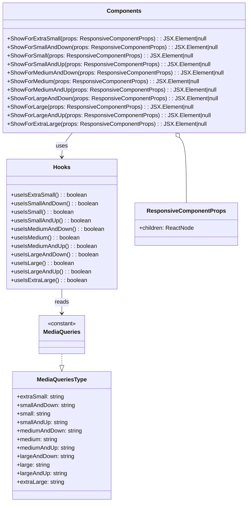

# Diagram: web/portal/src/components/responsive.d.ts

> Auto-generated by Obscura crawlers

## Mermaid

```mermaid
classDiagram
class MediaQueriesType {
  +extraSmall: string
  +smallAndDown: string
  +small: string
  +smallAndUp: string
  +mediumAndDown: string
  +medium: string
  +mediumAndUp: string
  +largeAndDown: string
  +large: string
  +largeAndUp: string
  +extraLarge: string
}
class MediaQueries <<constant>> 

MediaQueries ..|> MediaQueriesType

class Hooks {
  +useIsExtraSmall(): boolean
  +useIsSmallAndDown(): boolean
  +useIsSmall(): boolean
  +useIsSmallAndUp(): boolean
  +useIsMediumAndDown(): boolean
  +useIsMedium(): boolean
  +useIsMediumAndUp(): boolean
  +useIsLargeAndDown(): boolean
  +useIsLarge(): boolean
  +useIsLargeAndUp(): boolean
  +useIsExtraLarge(): boolean
}

class ResponsiveComponentProps {
  +children: ReactNode
}

class Components {
  +ShowForExtraSmall(props: ResponsiveComponentProps): JSX.Element|null
  +ShowForSmallAndDown(props: ResponsiveComponentProps): JSX.Element|null
  +ShowForSmall(props: ResponsiveComponentProps): JSX.Element|null
  +ShowForSmallAndUp(props: ResponsiveComponentProps): JSX.Element|null
  +ShowForMediumAndDown(props: ResponsiveComponentProps): JSX.Element|null
  +ShowForMedium(props: ResponsiveComponentProps): JSX.Element|null
  +ShowForMediumAndUp(props: ResponsiveComponentProps): JSX.Element|null
  +ShowForLargeAndDown(props: ResponsiveComponentProps): JSX.Element|null
  +ShowForLarge(props: ResponsiveComponentProps): JSX.Element|null
  +ShowForLargeAndUp(props: ResponsiveComponentProps): JSX.Element|null
  +ShowForExtraLarge(props: ResponsiveComponentProps): JSX.Element|null
}

Components o-- ResponsiveComponentProps
Components --> Hooks : uses
Hooks --> MediaQueries : reads
```

> SVG rendering failed for this diagram.
