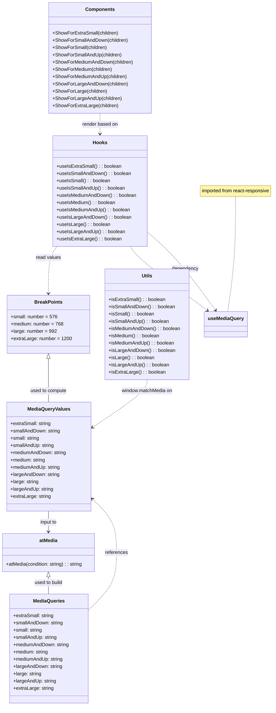

# Diagram: web/portal/src/components/responsive.js

> Auto-generated by Obscura crawlers

## Mermaid

### SVG

<svg id="container" width="904.67578125" xmlns="http://www.w3.org/2000/svg" class="classDiagram" height="2330" viewBox="0 0 904.67578125 2330" role="graphics-document document" aria-roledescription="class"><g><defs><marker id="container_class-aggregationStart" class="marker aggregation class" refX="18" refY="7" markerWidth="190" markerHeight="240" orient="auto"><path d="M 18,7 L9,13 L1,7 L9,1 Z"></path></marker></defs><defs><marker id="container_class-aggregationEnd" class="marker aggregation class" refX="1" refY="7" markerWidth="20" markerHeight="28" orient="auto"><path d="M 18,7 L9,13 L1,7 L9,1 Z"></path></marker></defs><defs><marker id="container_class-extensionStart" class="marker extension class" refX="18" refY="7" markerWidth="190" markerHeight="240" orient="auto"><path d="M 1,7 L18,13 V 1 Z"></path></marker></defs><defs><marker id="container_class-extensionEnd" class="marker extension class" refX="1" refY="7" markerWidth="20" markerHeight="28" orient="auto"><path d="M 1,1 V 13 L18,7 Z"></path></marker></defs><defs><marker id="container_class-compositionStart" class="marker composition class" refX="18" refY="7" markerWidth="190" markerHeight="240" orient="auto"><path d="M 18,7 L9,13 L1,7 L9,1 Z"></path></marker></defs><defs><marker id="container_class-compositionEnd" class="marker composition class" refX="1" refY="7" markerWidth="20" markerHeight="28" orient="auto"><path d="M 18,7 L9,13 L1,7 L9,1 Z"></path></marker></defs><defs><marker id="container_class-dependencyStart" class="marker dependency class" refX="6" refY="7" markerWidth="190" markerHeight="240" orient="auto"><path d="M 5,7 L9,13 L1,7 L9,1 Z"></path></marker></defs><defs><marker id="container_class-dependencyEnd" class="marker dependency class" refX="13" refY="7" markerWidth="20" markerHeight="28" orient="auto"><path d="M 18,7 L9,13 L14,7 L9,1 Z"></path></marker></defs><defs><marker id="container_class-lollipopStart" class="marker lollipop class" refX="13" refY="7" markerWidth="190" markerHeight="240" orient="auto"><circle stroke="black" fill="transparent" cx="7" cy="7" r="6"></circle></marker></defs><defs><marker id="container_class-lollipopEnd" class="marker lollipop class" refX="1" refY="7" markerWidth="190" markerHeight="240" orient="auto"><circle stroke="black" fill="transparent" cx="7" cy="7" r="6"></circle></marker></defs><g class="root"><g class="clusters"></g><g class="edgePaths"><path d="M775.434,649L775.434,682.667C775.434,716.333,775.434,783.667,771.082,847C766.731,910.333,758.028,969.667,753.676,999.333L749.325,1029" id="edgeNote1" class="edge-thickness-normal edge-pattern-dotted relation" style="fill: none;;;fill: none" data-edge="true" data-et="edge" data-id="edgeNote1" data-points="W3sieCI6Nzc1LjQzMzU5Mzc1LCJ5Ijo2NDl9LHsieCI6Nzc1LjQzMzU5Mzc1LCJ5Ijo4NTF9LHsieCI6NzQ5LjMyNDYwOTM3NSwieSI6MTAyOX1d"></path><path d="M163.527,1184.25L163.527,1202.042C163.527,1219.833,163.527,1255.417,163.527,1279.375C163.527,1303.333,163.527,1315.667,163.527,1321.833L163.527,1328" id="id_BreakPoints_MediaQueryValues_1" class="edge-thickness-normal edge-pattern-solid relation" style=";;;" data-edge="true" data-et="edge" data-id="id_BreakPoints_MediaQueryValues_1" data-points="W3sieCI6MTYzLjUyNzM0Mzc1LCJ5IjoxMTY3fSx7IngiOjE2My41MjczNDM3NSwieSI6MTI5MX0seyJ4IjoxNjMuNTI3MzQzNzUsInkiOjEzMjh9XQ==" marker-start="url(#container_class-extensionStart)"></path><path d="M163.527,1688L163.527,1694.167C163.527,1700.333,163.527,1712.667,163.527,1724C163.527,1735.333,163.527,1745.667,163.527,1750.833L163.527,1756" id="id_MediaQueryValues_atMedia_2" class="edge-thickness-normal edge-pattern-solid relation" style=";;;" data-edge="true" data-et="edge" data-id="id_MediaQueryValues_atMedia_2" data-points="W3sieCI6MTYzLjUyNzM0Mzc1LCJ5IjoxNjg4fSx7IngiOjE2My41MjczNDM3NSwieSI6MTcyNX0seyJ4IjoxNjMuNTI3MzQzNzUsInkiOjE3NjJ9XQ==" marker-end="url(#container_class-dependencyEnd)"></path><path d="M163.527,1905.25L163.527,1908.542C163.527,1911.833,163.527,1918.417,163.527,1927.875C163.527,1937.333,163.527,1949.667,163.527,1955.833L163.527,1962" id="id_atMedia_MediaQueries_3" class="edge-thickness-normal edge-pattern-solid relation" style=";;;" data-edge="true" data-et="edge" data-id="id_atMedia_MediaQueries_3" data-points="W3sieCI6MTYzLjUyNzM0Mzc1LCJ5IjoxODg4fSx7IngiOjE2My41MjczNDM3NSwieSI6MTkyNX0seyJ4IjoxNjMuNTI3MzQzNzUsInkiOjE5NjJ9XQ==" marker-start="url(#container_class-extensionStart)"></path><path d="M293.652,2018.346L310.024,2002.788C326.396,1987.23,359.139,1956.115,375.511,1923.891C391.883,1891.667,391.883,1858.333,391.883,1825C391.883,1791.667,391.883,1758.333,377.685,1728.174C363.486,1698.016,335.09,1671.031,320.891,1657.539L306.693,1644.047" id="id_MediaQueries_MediaQueryValues_4" class="edge-thickness-normal edge-pattern-dashed relation" style=";;;" data-edge="true" data-et="edge" data-id="id_MediaQueries_MediaQueryValues_4" data-points="W3sieCI6MjkzLjY1MjM0Mzc1LCJ5IjoyMDE4LjM0NTc0NjU5MTYyODN9LHsieCI6MzkxLjg4MjgxMjUsInkiOjE5MjV9LHsieCI6MzkxLjg4MjgxMjUsInkiOjE4MjV9LHsieCI6MzkxLjg4MjgxMjUsInkiOjE3MjV9LHsieCI6MzAyLjM0Mzc1LCJ5IjoxNjM5LjkxMzQ2MDcxNjA1NzR9XQ==" marker-end="url(#container_class-dependencyEnd)"></path><path d="M191.408,814L186.761,820.167C182.115,826.333,172.821,838.667,168.174,864.5C163.527,890.333,163.527,929.667,163.527,949.333L163.527,969" id="id_Hooks_BreakPoints_5" class="edge-thickness-normal edge-pattern-dashed relation" style=";;;" data-edge="true" data-et="edge" data-id="id_Hooks_BreakPoints_5" data-points="W3sieCI6MTkxLjQwODA3ODgzNTIyNzMsInkiOjgxNH0seyJ4IjoxNjMuNTI3MzQzNzUsInkiOjg1MX0seyJ4IjoxNjMuNTI3MzQzNzUsInkiOjk3NX1d" marker-end="url(#container_class-dependencyEnd)"></path><path d="M431.246,814L434.681,820.167C438.117,826.333,444.987,838.667,486.906,873.897C528.826,909.128,605.794,967.256,644.279,996.32L682.763,1025.384" id="id_Hooks_useMediaQuery_6" class="edge-thickness-normal edge-pattern-dashed relation" style=";;;" data-edge="true" data-et="edge" data-id="id_Hooks_useMediaQuery_6" data-points="W3sieCI6NDMxLjI0NjI4MDE4NDY1OTEsInkiOjgxNH0seyJ4Ijo0NTEuODU3NDIxODc1LCJ5Ijo4NTF9LHsieCI6Njg3LjU1MDk3NjU2MjUsInkiOjEwMjl9XQ==" marker-end="url(#container_class-dependencyEnd)"></path><path d="M329.305,374L329.305,380.167C329.305,386.333,329.305,398.667,329.305,410C329.305,421.333,329.305,431.667,329.305,436.833L329.305,442" id="id_Components_Hooks_7" class="edge-thickness-normal edge-pattern-dashed relation" style=";;;" data-edge="true" data-et="edge" data-id="id_Components_Hooks_7" data-points="W3sieCI6MzI5LjMwNDY4NzUsInkiOjM3NH0seyJ4IjozMjkuMzA0Njg3NSwieSI6NDExfSx7IngiOjMyOS4zMDQ2ODc1LCJ5Ijo0NDh9XQ==" marker-end="url(#container_class-dependencyEnd)"></path><path d="M485.367,1254L485.367,1260.167C485.367,1266.333,485.367,1278.667,455.692,1304.841C426.018,1331.016,366.668,1371.033,336.993,1391.041L307.319,1411.049" id="id_Utils_MediaQueryValues_8" class="edge-thickness-normal edge-pattern-dashed relation" style=";;;" data-edge="true" data-et="edge" data-id="id_Utils_MediaQueryValues_8" data-points="W3sieCI6NDg1LjM2NzE4NzUsInkiOjEyNTR9LHsieCI6NDg1LjM2NzE4NzUsInkiOjEyOTF9LHsieCI6MzAyLjM0Mzc1LCJ5IjoxNDE0LjQwMzI2MDA2NDgxM31d" marker-end="url(#container_class-dependencyEnd)"></path><path d="M708.465,1024.18L687.074,995.316C665.683,966.453,622.901,908.727,585.516,865.834C548.13,822.941,516.141,794.882,500.147,780.853L484.152,766.823" id="id_useMediaQuery_Hooks_9" class="edge-thickness-normal edge-pattern-dashed relation" style=";;;" data-edge="true" data-et="edge" data-id="id_useMediaQuery_Hooks_9" data-points="W3sieCI6NzEyLjAzNzMwNDY4NzUsInkiOjEwMjl9LHsieCI6NTgwLjExOTE0MDYyNSwieSI6ODUxfSx7IngiOjQ4NC4xNTIzNDM3NSwieSI6NzY2LjgyMzQ1MDE2NjI1NTN9XQ==" marker-start="url(#container_class-dependencyStart)"></path></g><g class="edgeLabels"><g class="edgeLabel"><g class="label" data-id="edgeNote1" transform="translate(0, 0)"><foreignObject width="0" height="0">

</foreignObject></g></g><g class="edgeLabel" transform="translate(163.52734375, 1291)"><g class="label" data-id="id_BreakPoints_MediaQueryValues_1" transform="translate(-60.9453125, -12)"><foreignObject width="121.890625" height="24">

used to compute

</foreignObject></g></g><g class="edgeLabel" transform="translate(163.52734375, 1725)"><g class="label" data-id="id_MediaQueryValues_atMedia_2" transform="translate(-28.8046875, -12)"><foreignObject width="57.609375" height="24">

input to

</foreignObject></g></g><g class="edgeLabel" transform="translate(163.52734375, 1925)"><g class="label" data-id="id_atMedia_MediaQueries_3" transform="translate(-47.96875, -12)"><foreignObject width="95.9375" height="24">

used to build

</foreignObject></g></g><g class="edgeLabel" transform="translate(391.8828125, 1825)"><g class="label" data-id="id_MediaQueries_MediaQueryValues_4" transform="translate(-37.828125, -12)"><foreignObject width="75.65625" height="24">

references

</foreignObject></g></g><g class="edgeLabel" transform="translate(163.52734375, 851)"><g class="label" data-id="id_Hooks_BreakPoints_5" transform="translate(-41.5625, -12)"><foreignObject width="83.125" height="24">

read values

</foreignObject></g></g><g class="edgeLabel" transform="translate(552.80522, 927.23759)"><g class="label" data-id="id_Hooks_useMediaQuery_6" transform="translate(-16.4453125, -12)"><foreignObject width="32.890625" height="24">

calls

</foreignObject></g></g><g class="edgeLabel" transform="translate(329.3046875, 411)"><g class="label" data-id="id_Components_Hooks_7" transform="translate(-59.5546875, -12)"><foreignObject width="119.109375" height="24">

render based on

</foreignObject></g></g><g class="edgeLabel" transform="translate(485.3671875, 1291)"><g class="label" data-id="id_Utils_MediaQueryValues_8" transform="translate(-85.578125, -12)"><foreignObject width="171.15625" height="24">

window.matchMedia on

</foreignObject></g></g><g class="edgeLabel" transform="translate(608.07456, 888.72085)"><g class="label" data-id="id_useMediaQuery_Hooks_9" transform="translate(-44.5390625, -12)"><foreignObject width="89.078125" height="24">

dependency

</foreignObject></g></g></g><g class="nodes"><g class="node default" id="classId-BreakPoints-0" transform="translate(163.52734375, 1071)"><g class="basic label-container"><path d="M-132.91015625 -96 L132.91015625 -96 L132.91015625 96 L-132.91015625 96" stroke="none" stroke-width="0" fill="#ECECFF" style=""></path><path d="M-132.91015625 -96 C-43.45654033152111 -96, 45.99707558695778 -96, 132.91015625 -96 M-132.91015625 -96 C-43.447273961587555 -96, 46.01560832682489 -96, 132.91015625 -96 M132.91015625 -96 C132.91015625 -51.42416513186607, 132.91015625 -6.848330263732137, 132.91015625 96 M132.91015625 -96 C132.91015625 -52.84292533020004, 132.91015625 -9.685850660400078, 132.91015625 96 M132.91015625 96 C53.22466906317898 96, -26.460818123642042 96, -132.91015625 96 M132.91015625 96 C66.6688485188891 96, 0.4275407877782129 96, -132.91015625 96 M-132.91015625 96 C-132.91015625 53.83751365803662, -132.91015625 11.67502731607324, -132.91015625 -96 M-132.91015625 96 C-132.91015625 44.12899358612091, -132.91015625 -7.742012827758174, -132.91015625 -96" stroke="#9370DB" stroke-width="1.3" fill="none" stroke-dasharray="0 0" style=""></path></g><g class="annotation-group text" transform="translate(0, -72)"></g><g class="label-group text" transform="translate(-44.1015625, -72)"><g class="label" style="font-weight: bolder" transform="translate(0,-12)"><foreignObject width="88.203125" height="24">

BreakPoints

</foreignObject></g></g><g class="members-group text" transform="translate(-120.91015625, -24)"><g class="label" style="" transform="translate(0,-12)"><foreignObject width="151.515625" height="24">

+small: number = 576

</foreignObject></g><g class="label" style="" transform="translate(0,12)"><foreignObject width="172.96875" height="24">

+medium: number = 768

</foreignObject></g><g class="label" style="" transform="translate(0,36)"><foreignObject width="149.75" height="24">

+large: number = 992

</foreignObject></g><g class="label" style="" transform="translate(0,60)"><foreignObject width="197.71875" height="24">

+extraLarge: number = 1200

</foreignObject></g></g><g class="methods-group text" transform="translate(-120.91015625, 96)"></g><g class="divider" style=""><path d="M-132.91015625 -48 C-56.49154169609196 -48, 19.927072857816086 -48, 132.91015625 -48 M-132.91015625 -48 C-67.84061668597349 -48, -2.7710771219469734 -48, 132.91015625 -48" stroke="#9370DB" stroke-width="1.3" fill="none" stroke-dasharray="0 0" style=""></path></g><g class="divider" style=""><path d="M-132.91015625 72 C-55.89748792764023 72, 21.115180394719545 72, 132.91015625 72 M-132.91015625 72 C-66.40863587066559 72, 0.09288450866881703 72, 132.91015625 72" stroke="#9370DB" stroke-width="1.3" fill="none" stroke-dasharray="0 0" style=""></path></g></g><g class="node default" id="classId-MediaQueryValues-1" transform="translate(163.52734375, 1508)"><g class="basic label-container"><path d="M-138.81640625 -180 L138.81640625 -180 L138.81640625 180 L-138.81640625 180" stroke="none" stroke-width="0" fill="#ECECFF" style=""></path><path d="M-138.81640625 -180 C-50.35097035055037 -180, 38.11446554889926 -180, 138.81640625 -180 M-138.81640625 -180 C-60.69239865042165 -180, 17.431608949156697 -180, 138.81640625 -180 M138.81640625 -180 C138.81640625 -56.94399564203077, 138.81640625 66.11200871593846, 138.81640625 180 M138.81640625 -180 C138.81640625 -84.48653004830999, 138.81640625 11.026939903380025, 138.81640625 180 M138.81640625 180 C40.958510700864 180, -56.89938484827201 180, -138.81640625 180 M138.81640625 180 C76.99355897026362 180, 15.170711690527227 180, -138.81640625 180 M-138.81640625 180 C-138.81640625 99.41670300398968, -138.81640625 18.833406007979363, -138.81640625 -180 M-138.81640625 180 C-138.81640625 71.99358522674136, -138.81640625 -36.01282954651728, -138.81640625 -180" stroke="#9370DB" stroke-width="1.3" fill="none" stroke-dasharray="0 0" style=""></path></g><g class="annotation-group text" transform="translate(0, -156)"></g><g class="label-group text" transform="translate(-67.7890625, -156)"><g class="label" style="font-weight: bolder" transform="translate(0,-12)"><foreignObject width="135.578125" height="24">

MediaQueryValues

</foreignObject></g></g><g class="members-group text" transform="translate(-126.81640625, -108)"><g class="label" style="" transform="translate(0,-12)"><foreignObject width="134.640625" height="24">

+extraSmall: string

</foreignObject></g><g class="label" style="" transform="translate(0,12)"><foreignObject width="165.421875" height="24">

+smallAndDown: string

</foreignObject></g><g class="label" style="" transform="translate(0,36)"><foreignObject width="96.96875" height="24">

+small: string

</foreignObject></g><g class="label" style="" transform="translate(0,60)"><foreignObject width="145.015625" height="24">

+smallAndUp: string

</foreignObject></g><g class="label" style="" transform="translate(0,84)"><foreignObject width="185.84375" height="24">

+mediumAndDown: string

</foreignObject></g><g class="label" style="" transform="translate(0,108)"><foreignObject width="117.234375" height="24">

+medium: string

</foreignObject></g><g class="label" style="" transform="translate(0,132)"><foreignObject width="165.453125" height="24">

+mediumAndUp: string

</foreignObject></g><g class="label" style="" transform="translate(0,156)"><foreignObject width="162.34375" height="24">

+largeAndDown: string

</foreignObject></g><g class="label" style="" transform="translate(0,180)"><foreignObject width="93.734375" height="24">

+large: string

</foreignObject></g><g class="label" style="" transform="translate(0,204)"><foreignObject width="141.9375" height="24">

+largeAndUp: string

</foreignObject></g><g class="label" style="" transform="translate(0,228)"><foreignObject width="133.375" height="24">

+extraLarge: string

</foreignObject></g></g><g class="methods-group text" transform="translate(-126.81640625, 180)"></g><g class="divider" style=""><path d="M-138.81640625 -132 C-74.14774190939563 -132, -9.479077568791269 -132, 138.81640625 -132 M-138.81640625 -132 C-57.628684059328364 -132, 23.55903813134327 -132, 138.81640625 -132" stroke="#9370DB" stroke-width="1.3" fill="none" stroke-dasharray="0 0" style=""></path></g><g class="divider" style=""><path d="M-138.81640625 156 C-65.04452225490456 156, 8.727361740190872 156, 138.81640625 156 M-138.81640625 156 C-72.66381004429054 156, -6.511213838581085 156, 138.81640625 156" stroke="#9370DB" stroke-width="1.3" fill="none" stroke-dasharray="0 0" style=""></path></g></g><g class="node default" id="classId-atMedia-2" transform="translate(163.52734375, 1825)"><g class="basic label-container"><path d="M-155.52734375 -63 L155.52734375 -63 L155.52734375 63 L-155.52734375 63" stroke="none" stroke-width="0" fill="#ECECFF" style=""></path><path d="M-155.52734375 -63 C-71.78466871802961 -63, 11.958006313940786 -63, 155.52734375 -63 M-155.52734375 -63 C-47.88045702219608 -63, 59.766429705607834 -63, 155.52734375 -63 M155.52734375 -63 C155.52734375 -36.11677217934049, 155.52734375 -9.23354435868098, 155.52734375 63 M155.52734375 -63 C155.52734375 -29.09813343752228, 155.52734375 4.803733124955443, 155.52734375 63 M155.52734375 63 C72.98176438004724 63, -9.563814989905524 63, -155.52734375 63 M155.52734375 63 C77.53033278963883 63, -0.4666781707223322 63, -155.52734375 63 M-155.52734375 63 C-155.52734375 37.63133357702194, -155.52734375 12.262667154043882, -155.52734375 -63 M-155.52734375 63 C-155.52734375 16.648380222952234, -155.52734375 -29.703239554095532, -155.52734375 -63" stroke="#9370DB" stroke-width="1.3" fill="none" stroke-dasharray="0 0" style=""></path></g><g class="annotation-group text" transform="translate(0, -39)"></g><g class="label-group text" transform="translate(-29.6171875, -39)"><g class="label" style="font-weight: bolder" transform="translate(0,-12)"><foreignObject width="59.234375" height="24">

atMedia

</foreignObject></g></g><g class="members-group text" transform="translate(-143.52734375, 9)"></g><g class="methods-group text" transform="translate(-143.52734375, 39)"><g class="label" style="" transform="translate(0,-12)"><foreignObject width="257.4375" height="24">

+atMedia(condition: string) : : string

</foreignObject></g></g><g class="divider" style=""><path d="M-155.52734375 -15 C-46.53485360290195 -15, 62.457636544196106 -15, 155.52734375 -15 M-155.52734375 -15 C-37.599596726856475 -15, 80.32815029628705 -15, 155.52734375 -15" stroke="#9370DB" stroke-width="1.3" fill="none" stroke-dasharray="0 0" style=""></path></g><g class="divider" style=""><path d="M-155.52734375 9 C-40.463094729206546 9, 74.60115429158691 9, 155.52734375 9 M-155.52734375 9 C-48.950433981417206 9, 57.62647578716559 9, 155.52734375 9" stroke="#9370DB" stroke-width="1.3" fill="none" stroke-dasharray="0 0" style=""></path></g></g><g class="node default" id="classId-MediaQueries-3" transform="translate(163.52734375, 2142)"><g class="basic label-container"><path d="M-130.125 -180 L130.125 -180 L130.125 180 L-130.125 180" stroke="none" stroke-width="0" fill="#ECECFF" style=""></path><path d="M-130.125 -180 C-67.09739586656843 -180, -4.069791733136881 -180, 130.125 -180 M-130.125 -180 C-57.64673765189487 -180, 14.831524696210266 -180, 130.125 -180 M130.125 -180 C130.125 -80.9866785717532, 130.125 18.026642856493595, 130.125 180 M130.125 -180 C130.125 -102.93412114443616, 130.125 -25.868242288872324, 130.125 180 M130.125 180 C47.46539244182293 180, -35.194215116354144 180, -130.125 180 M130.125 180 C65.87855867358716 180, 1.6321173471743293 180, -130.125 180 M-130.125 180 C-130.125 38.03256693933125, -130.125 -103.9348661213375, -130.125 -180 M-130.125 180 C-130.125 87.45769891592236, -130.125 -5.084602168155271, -130.125 -180" stroke="#9370DB" stroke-width="1.3" fill="none" stroke-dasharray="0 0" style=""></path></g><g class="annotation-group text" transform="translate(0, -156)"></g><g class="label-group text" transform="translate(-50.40625, -156)"><g class="label" style="font-weight: bolder" transform="translate(0,-12)"><foreignObject width="100.8125" height="24">

MediaQueries

</foreignObject></g></g><g class="members-group text" transform="translate(-118.125, -108)"><g class="label" style="" transform="translate(0,-12)"><foreignObject width="134.640625" height="24">

+extraSmall: string

</foreignObject></g><g class="label" style="" transform="translate(0,12)"><foreignObject width="165.421875" height="24">

+smallAndDown: string

</foreignObject></g><g class="label" style="" transform="translate(0,36)"><foreignObject width="96.96875" height="24">

+small: string

</foreignObject></g><g class="label" style="" transform="translate(0,60)"><foreignObject width="145.015625" height="24">

+smallAndUp: string

</foreignObject></g><g class="label" style="" transform="translate(0,84)"><foreignObject width="185.84375" height="24">

+mediumAndDown: string

</foreignObject></g><g class="label" style="" transform="translate(0,108)"><foreignObject width="117.234375" height="24">

+medium: string

</foreignObject></g><g class="label" style="" transform="translate(0,132)"><foreignObject width="165.453125" height="24">

+mediumAndUp: string

</foreignObject></g><g class="label" style="" transform="translate(0,156)"><foreignObject width="162.34375" height="24">

+largeAndDown: string

</foreignObject></g><g class="label" style="" transform="translate(0,180)"><foreignObject width="93.734375" height="24">

+large: string

</foreignObject></g><g class="label" style="" transform="translate(0,204)"><foreignObject width="141.9375" height="24">

+largeAndUp: string

</foreignObject></g><g class="label" style="" transform="translate(0,228)"><foreignObject width="133.375" height="24">

+extraLarge: string

</foreignObject></g></g><g class="methods-group text" transform="translate(-118.125, 180)"></g><g class="divider" style=""><path d="M-130.125 -132 C-27.138148384310625 -132, 75.84870323137875 -132, 130.125 -132 M-130.125 -132 C-73.1383829169749 -132, -16.15176583394981 -132, 130.125 -132" stroke="#9370DB" stroke-width="1.3" fill="none" stroke-dasharray="0 0" style=""></path></g><g class="divider" style=""><path d="M-130.125 156 C-49.86257718482891 156, 30.399845630342185 156, 130.125 156 M-130.125 156 C-69.14812790758273 156, -8.171255815165466 156, 130.125 156" stroke="#9370DB" stroke-width="1.3" fill="none" stroke-dasharray="0 0" style=""></path></g></g><g class="node default" id="classId-Hooks-4" transform="translate(329.3046875, 631)"><g class="basic label-container"><path d="M-154.84765625 -183 L154.84765625 -183 L154.84765625 183 L-154.84765625 183" stroke="none" stroke-width="0" fill="#ECECFF" style=""></path><path d="M-154.84765625 -183 C-50.45533699162448 -183, 53.936982266751045 -183, 154.84765625 -183 M-154.84765625 -183 C-70.08845385284275 -183, 14.670748544314506 -183, 154.84765625 -183 M154.84765625 -183 C154.84765625 -58.306678627022094, 154.84765625 66.38664274595581, 154.84765625 183 M154.84765625 -183 C154.84765625 -95.68929742292714, 154.84765625 -8.37859484585428, 154.84765625 183 M154.84765625 183 C42.575445245969846 183, -69.69676575806031 183, -154.84765625 183 M154.84765625 183 C54.722358473485144 183, -45.40293930302971 183, -154.84765625 183 M-154.84765625 183 C-154.84765625 109.10417870334372, -154.84765625 35.20835740668744, -154.84765625 -183 M-154.84765625 183 C-154.84765625 105.72961244454099, -154.84765625 28.45922488908198, -154.84765625 -183" stroke="#9370DB" stroke-width="1.3" fill="none" stroke-dasharray="0 0" style=""></path></g><g class="annotation-group text" transform="translate(0, -159)"></g><g class="label-group text" transform="translate(-22.9140625, -159)"><g class="label" style="font-weight: bolder" transform="translate(0,-12)"><foreignObject width="45.828125" height="24">

Hooks

</foreignObject></g></g><g class="members-group text" transform="translate(-142.84765625, -111)"></g><g class="methods-group text" transform="translate(-142.84765625, -81)"><g class="label" style="" transform="translate(0,-12)"><foreignObject width="212.671875" height="24">

+useIsExtraSmall() : : boolean

</foreignObject></g><g class="label" style="" transform="translate(0,12)"><foreignObject width="244.859375" height="24">

+useIsSmallAndDown() : : boolean

</foreignObject></g><g class="label" style="" transform="translate(0,36)"><foreignObject width="176.25" height="24">

+useIsSmall() : : boolean

</foreignObject></g><g class="label" style="" transform="translate(0,60)"><foreignObject width="224.453125" height="24">

+useIsSmallAndUp() : : boolean

</foreignObject></g><g class="label" style="" transform="translate(0,84)"><foreignObject width="262.78125" height="24">

+useIsMediumAndDown() : : boolean

</foreignObject></g><g class="label" style="" transform="translate(0,108)"><foreignObject width="194.171875" height="24">

+useIsMedium() : : boolean

</foreignObject></g><g class="label" style="" transform="translate(0,132)"><foreignObject width="242.375" height="24">

+useIsMediumAndUp() : : boolean

</foreignObject></g><g class="label" style="" transform="translate(0,156)"><foreignObject width="243.734375" height="24">

+useIsLargeAndDown() : : boolean

</foreignObject></g><g class="label" style="" transform="translate(0,180)"><foreignObject width="175.125" height="24">

+useIsLarge() : : boolean

</foreignObject></g><g class="label" style="" transform="translate(0,204)"><foreignObject width="223.34375" height="24">

+useIsLargeAndUp() : : boolean

</foreignObject></g><g class="label" style="" transform="translate(0,228)"><foreignObject width="211.546875" height="24">

+useIsExtraLarge() : : boolean

</foreignObject></g></g><g class="divider" style=""><path d="M-154.84765625 -135 C-62.492251283511436 -135, 29.863153682977128 -135, 154.84765625 -135 M-154.84765625 -135 C-72.6454485653616 -135, 9.55675911927679 -135, 154.84765625 -135" stroke="#9370DB" stroke-width="1.3" fill="none" stroke-dasharray="0 0" style=""></path></g><g class="divider" style=""><path d="M-154.84765625 -111 C-67.6123021472852 -111, 19.623051955429588 -111, 154.84765625 -111 M-154.84765625 -111 C-32.05255617298096 -111, 90.74254390403809 -111, 154.84765625 -111" stroke="#9370DB" stroke-width="1.3" fill="none" stroke-dasharray="0 0" style=""></path></g></g><g class="node default" id="classId-Components-5" transform="translate(329.3046875, 191)"><g class="basic label-container"><path d="M-167.875 -183 L167.875 -183 L167.875 183 L-167.875 183" stroke="none" stroke-width="0" fill="#ECECFF" style=""></path><path d="M-167.875 -183 C-57.61528573982902 -183, 52.64442852034196 -183, 167.875 -183 M-167.875 -183 C-72.97456290918119 -183, 21.925874181637624 -183, 167.875 -183 M167.875 -183 C167.875 -40.33773796024468, 167.875 102.32452407951064, 167.875 183 M167.875 -183 C167.875 -98.36215459945095, 167.875 -13.724309198901892, 167.875 183 M167.875 183 C37.608577011893146 183, -92.65784597621371 183, -167.875 183 M167.875 183 C79.48086109486573 183, -8.91327781026854 183, -167.875 183 M-167.875 183 C-167.875 67.53941938493298, -167.875 -47.92116123013403, -167.875 -183 M-167.875 183 C-167.875 80.4229755017106, -167.875 -22.15404899657881, -167.875 -183" stroke="#9370DB" stroke-width="1.3" fill="none" stroke-dasharray="0 0" style=""></path></g><g class="annotation-group text" transform="translate(0, -159)"></g><g class="label-group text" transform="translate(-45.921875, -159)"><g class="label" style="font-weight: bolder" transform="translate(0,-12)"><foreignObject width="91.84375" height="24">

Components

</foreignObject></g></g><g class="members-group text" transform="translate(-155.875, -111)"></g><g class="methods-group text" transform="translate(-155.875, -81)"><g class="label" style="" transform="translate(0,-12)"><foreignObject width="215.71875" height="24">

+ShowForExtraSmall(children)

</foreignObject></g><g class="label" style="" transform="translate(0,12)"><foreignObject width="247.90625" height="24">

+ShowForSmallAndDown(children)

</foreignObject></g><g class="label" style="" transform="translate(0,36)"><foreignObject width="179.296875" height="24">

+ShowForSmall(children)

</foreignObject></g><g class="label" style="" transform="translate(0,60)"><foreignObject width="227.515625" height="24">

+ShowForSmallAndUp(children)

</foreignObject></g><g class="label" style="" transform="translate(0,84)"><foreignObject width="265.828125" height="24">

+ShowForMediumAndDown(children)

</foreignObject></g><g class="label" style="" transform="translate(0,108)"><foreignObject width="197.21875" height="24">

+ShowForMedium(children)

</foreignObject></g><g class="label" style="" transform="translate(0,132)"><foreignObject width="245.4375" height="24">

+ShowForMediumAndUp(children)

</foreignObject></g><g class="label" style="" transform="translate(0,156)"><foreignObject width="246.796875" height="24">

+ShowForLargeAndDown(children)

</foreignObject></g><g class="label" style="" transform="translate(0,180)"><foreignObject width="178.1875" height="24">

+ShowForLarge(children)

</foreignObject></g><g class="label" style="" transform="translate(0,204)"><foreignObject width="226.390625" height="24">

+ShowForLargeAndUp(children)

</foreignObject></g><g class="label" style="" transform="translate(0,228)"><foreignObject width="214.59375" height="24">

+ShowForExtraLarge(children)

</foreignObject></g></g><g class="divider" style=""><path d="M-167.875 -135 C-83.91235831094782 -135, 0.05028337810435346 -135, 167.875 -135 M-167.875 -135 C-58.6479749741292 -135, 50.5790500517416 -135, 167.875 -135" stroke="#9370DB" stroke-width="1.3" fill="none" stroke-dasharray="0 0" style=""></path></g><g class="divider" style=""><path d="M-167.875 -111 C-67.600417393634 -111, 32.67416521273199 -111, 167.875 -111 M-167.875 -111 C-55.82040605965089 -111, 56.234187880698215 -111, 167.875 -111" stroke="#9370DB" stroke-width="1.3" fill="none" stroke-dasharray="0 0" style=""></path></g></g><g class="node default" id="classId-Utils-6" transform="translate(485.3671875, 1071)"><g class="basic label-container"><path d="M-138.9296875 -183 L138.9296875 -183 L138.9296875 183 L-138.9296875 183" stroke="none" stroke-width="0" fill="#ECECFF" style=""></path><path d="M-138.9296875 -183 C-30.528726150686694 -183, 77.87223519862661 -183, 138.9296875 -183 M-138.9296875 -183 C-78.64336694531599 -183, -18.357046390631993 -183, 138.9296875 -183 M138.9296875 -183 C138.9296875 -89.06874304910171, 138.9296875 4.862513901796575, 138.9296875 183 M138.9296875 -183 C138.9296875 -39.11412624868777, 138.9296875 104.77174750262446, 138.9296875 183 M138.9296875 183 C81.21157917000258 183, 23.49347084000516 183, -138.9296875 183 M138.9296875 183 C62.35178857995501 183, -14.226110340089974 183, -138.9296875 183 M-138.9296875 183 C-138.9296875 85.06085881844312, -138.9296875 -12.878282363113755, -138.9296875 -183 M-138.9296875 183 C-138.9296875 62.501129160247075, -138.9296875 -57.99774167950585, -138.9296875 -183" stroke="#9370DB" stroke-width="1.3" fill="none" stroke-dasharray="0 0" style=""></path></g><g class="annotation-group text" transform="translate(0, -159)"></g><g class="label-group text" transform="translate(-16.796875, -159)"><g class="label" style="font-weight: bolder" transform="translate(0,-12)"><foreignObject width="33.59375" height="24">

Utils

</foreignObject></g></g><g class="members-group text" transform="translate(-126.9296875, -111)"></g><g class="methods-group text" transform="translate(-126.9296875, -81)"><g class="label" style="" transform="translate(0,-12)"><foreignObject width="186.953125" height="24">

+isExtraSmall() : : boolean

</foreignObject></g><g class="label" style="" transform="translate(0,12)"><foreignObject width="219.140625" height="24">

+isSmallAndDown() : : boolean

</foreignObject></g><g class="label" style="" transform="translate(0,36)"><foreignObject width="150.53125" height="24">

+isSmall() : : boolean

</foreignObject></g><g class="label" style="" transform="translate(0,60)"><foreignObject width="198.75" height="24">

+isSmallAndUp() : : boolean

</foreignObject></g><g class="label" style="" transform="translate(0,84)"><foreignObject width="237.0625" height="24">

+isMediumAndDown() : : boolean

</foreignObject></g><g class="label" style="" transform="translate(0,108)"><foreignObject width="168.453125" height="24">

+isMedium() : : boolean

</foreignObject></g><g class="label" style="" transform="translate(0,132)"><foreignObject width="216.671875" height="24">

+isMediumAndUp() : : boolean

</foreignObject></g><g class="label" style="" transform="translate(0,156)"><foreignObject width="218.03125" height="24">

+isLargeAndDown() : : boolean

</foreignObject></g><g class="label" style="" transform="translate(0,180)"><foreignObject width="149.421875" height="24">

+isLarge() : : boolean

</foreignObject></g><g class="label" style="" transform="translate(0,204)"><foreignObject width="197.625" height="24">

+isLargeAndUp() : : boolean

</foreignObject></g><g class="label" style="" transform="translate(0,228)"><foreignObject width="185.828125" height="24">

+isExtraLarge() : : boolean

</foreignObject></g></g><g class="divider" style=""><path d="M-138.9296875 -135 C-69.76480454532144 -135, -0.5999215906428788 -135, 138.9296875 -135 M-138.9296875 -135 C-65.35765271015734 -135, 8.214382079685322 -135, 138.9296875 -135" stroke="#9370DB" stroke-width="1.3" fill="none" stroke-dasharray="0 0" style=""></path></g><g class="divider" style=""><path d="M-138.9296875 -111 C-48.143138278049605 -111, 42.64341094390079 -111, 138.9296875 -111 M-138.9296875 -111 C-38.21891520544723 -111, 62.49185708910554 -111, 138.9296875 -111" stroke="#9370DB" stroke-width="1.3" fill="none" stroke-dasharray="0 0" style=""></path></g></g><g class="node default" id="classId-useMediaQuery-7" transform="translate(743.1640625, 1071)"><g class="basic label-container"><path d="M-68.8671875 -42 L68.8671875 -42 L68.8671875 42 L-68.8671875 42" stroke="none" stroke-width="0" fill="#ECECFF" style=""></path><path d="M-68.8671875 -42 C-23.820512752373276 -42, 21.22616199525345 -42, 68.8671875 -42 M-68.8671875 -42 C-18.40671853012836 -42, 32.05375043974328 -42, 68.8671875 -42 M68.8671875 -42 C68.8671875 -20.701892313008255, 68.8671875 0.5962153739834903, 68.8671875 42 M68.8671875 -42 C68.8671875 -13.540111619963575, 68.8671875 14.91977676007285, 68.8671875 42 M68.8671875 42 C39.9569851597674 42, 11.04678281953479 42, -68.8671875 42 M68.8671875 42 C36.34028296840994 42, 3.8133784368198747 42, -68.8671875 42 M-68.8671875 42 C-68.8671875 19.748994949142162, -68.8671875 -2.502010101715676, -68.8671875 -42 M-68.8671875 42 C-68.8671875 21.452604920544367, -68.8671875 0.9052098410887339, -68.8671875 -42" stroke="#9370DB" stroke-width="1.3" fill="none" stroke-dasharray="0 0" style=""></path></g><g class="annotation-group text" transform="translate(0, -18)"></g><g class="label-group text" transform="translate(-56.8671875, -18)"><g class="label" style="font-weight: bolder" transform="translate(0,-12)"><foreignObject width="113.734375" height="24">

useMediaQuery

</foreignObject></g></g><g class="members-group text" transform="translate(-56.8671875, 30)"></g><g class="methods-group text" transform="translate(-56.8671875, 60)"></g><g class="divider" style=""><path d="M-68.8671875 6 C-23.265464984035262 6, 22.336257531929476 6, 68.8671875 6 M-68.8671875 6 C-28.1616730702739 6, 12.543841359452202 6, 68.8671875 6" stroke="#9370DB" stroke-width="1.3" fill="none" stroke-dasharray="0 0" style=""></path></g><g class="divider" style=""><path d="M-68.8671875 24 C-15.01150403062907 24, 38.84417943874186 24, 68.8671875 24 M-68.8671875 24 C-19.401436259578922 24, 30.064314980842155 24, 68.8671875 24" stroke="#9370DB" stroke-width="1.3" fill="none" stroke-dasharray="0 0" style=""></path></g></g><g class="node undefined" id="note0" transform="translate(775.43359375, 631)"><g class="basic label-container"><path d="M-121.2421875 -18 L121.2421875 -18 L121.2421875 18 L-121.2421875 18" stroke="none" stroke-width="0" fill="#fff5ad" style="fill:#fff5ad !important;stroke:#aaaa33 !important"></path><path d="M-121.2421875 -18 C-57.13516709531048 -18, 6.971853309379043 -18, 121.2421875 -18 M-121.2421875 -18 C-31.402848817660356 -18, 58.43648986467929 -18, 121.2421875 -18 M121.2421875 -18 C121.2421875 -4.474723253554767, 121.2421875 9.050553492890465, 121.2421875 18 M121.2421875 -18 C121.2421875 -5.208370961128267, 121.2421875 7.583258077743466, 121.2421875 18 M121.2421875 18 C54.11620968130383 18, -13.009768137392342 18, -121.2421875 18 M121.2421875 18 C36.012052611971754 18, -49.21808227605649 18, -121.2421875 18 M-121.2421875 18 C-121.2421875 10.06655400276464, -121.2421875 2.13310800552928, -121.2421875 -18 M-121.2421875 18 C-121.2421875 4.215287487158037, -121.2421875 -9.569425025683927, -121.2421875 -18" stroke="#aaaa33" stroke-width="1.3" fill="none" stroke-dasharray="0 0" style="fill:#fff5ad !important;stroke:#aaaa33 !important"></path></g><g class="label" style="text-align:left !important;white-space:nowrap !important" transform="translate(-115.2421875, -12)"><rect></rect><foreignObject width="230.484375" height="24">

imported from react-responsive

</foreignObject></g></g></g></g></g></svg>
