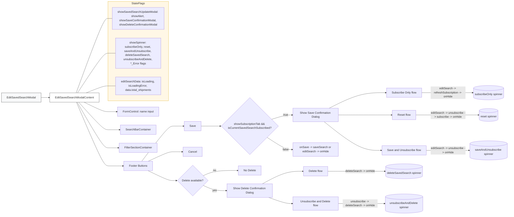

# Diagram: web/portal/src/components/saved-search/EditSavedSearchModal.js

> Auto-generated by Obscura crawlers

## Mermaid

### SVG

<svg id="container" width="2906.46875" xmlns="http://www.w3.org/2000/svg" class="flowchart" height="1232.6640625" viewBox="0 0 2906.46875 1232.6640625" role="graphics-document document" aria-roledescription="flowchart-v2"><g><marker id="container_flowchart-v2-pointEnd" class="marker flowchart-v2" viewBox="0 0 10 10" refX="5" refY="5" markerUnits="userSpaceOnUse" markerWidth="8" markerHeight="8" orient="auto"><path d="M 0 0 L 10 5 L 0 10 z" class="arrowMarkerPath" style="stroke-width: 1; stroke-dasharray: 1, 0;"></path></marker><marker id="container_flowchart-v2-pointStart" class="marker flowchart-v2" viewBox="0 0 10 10" refX="4.5" refY="5" markerUnits="userSpaceOnUse" markerWidth="8" markerHeight="8" orient="auto"><path d="M 0 5 L 10 10 L 10 0 z" class="arrowMarkerPath" style="stroke-width: 1; stroke-dasharray: 1, 0;"></path></marker><marker id="container_flowchart-v2-circleEnd" class="marker flowchart-v2" viewBox="0 0 10 10" refX="11" refY="5" markerUnits="userSpaceOnUse" markerWidth="11" markerHeight="11" orient="auto"><circle cx="5" cy="5" r="5" class="arrowMarkerPath" style="stroke-width: 1; stroke-dasharray: 1, 0;"></circle></marker><marker id="container_flowchart-v2-circleStart" class="marker flowchart-v2" viewBox="0 0 10 10" refX="-1" refY="5" markerUnits="userSpaceOnUse" markerWidth="11" markerHeight="11" orient="auto"><circle cx="5" cy="5" r="5" class="arrowMarkerPath" style="stroke-width: 1; stroke-dasharray: 1, 0;"></circle></marker><marker id="container_flowchart-v2-crossEnd" class="marker cross flowchart-v2" viewBox="0 0 11 11" refX="12" refY="5.2" markerUnits="userSpaceOnUse" markerWidth="11" markerHeight="11" orient="auto"><path d="M 1,1 l 9,9 M 10,1 l -9,9" class="arrowMarkerPath" style="stroke-width: 2; stroke-dasharray: 1, 0;"></path></marker><marker id="container_flowchart-v2-crossStart" class="marker cross flowchart-v2" viewBox="0 0 11 11" refX="-1" refY="5.2" markerUnits="userSpaceOnUse" markerWidth="11" markerHeight="11" orient="auto"><path d="M 1,1 l 9,9 M 10,1 l -9,9" class="arrowMarkerPath" style="stroke-width: 2; stroke-dasharray: 1, 0;"></path></marker><g class="root"><g class="clusters"><g class="cluster" id="StateFlags" data-look="classic"><rect style="fill:#fff7e6 !important;stroke:#dba800 !important;stroke-width:1px !important" x="614.140625" y="8" width="345.109375" height="572"></rect><g class="cluster-label" transform="translate(749.7578125, 8)"><foreignObject width="73.875" height="24">

StateFlags

</foreignObject></g></g></g><g class="edgePaths"><path d="M232.688,559.797L236.854,559.797C241.021,559.797,249.354,559.797,257.021,559.797C264.688,559.797,271.688,559.797,275.188,559.797L278.688,559.797" id="L_A_B_0" class="edge-thickness-normal edge-pattern-solid edge-thickness-normal edge-pattern-solid flowchart-link" style=";" data-edge="true" data-et="edge" data-id="L_A_B_0" data-points="W3sieCI6MjMyLjY4NzUsInkiOjU1OS43OTY4NzV9LHsieCI6MjU3LjY4NzUsInkiOjU1OS43OTY4NzV9LHsieCI6MjgyLjY4NzUsInkiOjU1OS43OTY4NzV9XQ==" marker-end="url(#container_flowchart-v2-pointEnd)"></path><path d="M477.848,586.797L496.397,595.997C514.945,605.198,552.043,623.599,574.758,632.799C597.474,642,605.807,642,617.993,642C630.18,642,646.219,642,654.238,642L662.258,642" id="L_B_C_0" class="edge-thickness-normal edge-pattern-solid edge-thickness-normal edge-pattern-solid flowchart-link" style=";" data-edge="true" data-et="edge" data-id="L_B_C_0" data-points="W3sieCI6NDc3Ljg0NzcyNTMwMTc0ODcsInkiOjU4Ni43OTY4NzV9LHsieCI6NTg5LjE0MDYyNSwieSI6NjQyfSx7IngiOjYxNC4xNDA2MjUsInkiOjY0Mn0seyJ4Ijo2NjYuMjU3ODEyNSwieSI6NjQyfV0=" marker-end="url(#container_flowchart-v2-pointEnd)"></path><path d="M447.445,586.797L471.061,613.331C494.677,639.865,541.909,692.932,569.691,719.466C597.474,746,605.807,746,621.081,746C636.354,746,658.568,746,669.674,746L680.781,746" id="L_B_D_0" class="edge-thickness-normal edge-pattern-solid edge-thickness-normal edge-pattern-solid flowchart-link" style=";" data-edge="true" data-et="edge" data-id="L_B_D_0" data-points="W3sieCI6NDQ3LjQ0NDkwMDc5ODIyOTQsInkiOjU4Ni43OTY4NzV9LHsieCI6NTg5LjE0MDYyNSwieSI6NzQ2fSx7IngiOjYxNC4xNDA2MjUsInkiOjc0Nn0seyJ4Ijo2ODQuNzgxMjUsInkiOjc0Nn1d" marker-end="url(#container_flowchart-v2-pointEnd)"></path><path d="M438.833,586.797L463.884,630.664C488.936,674.531,539.038,762.266,568.256,806.133C597.474,850,605.807,850,619.604,850C633.401,850,652.661,850,662.292,850L671.922,850" id="L_B_E_0" class="edge-thickness-normal edge-pattern-solid edge-thickness-normal edge-pattern-solid flowchart-link" style=";" data-edge="true" data-et="edge" data-id="L_B_E_0" data-points="W3sieCI6NDM4LjgzMjk3NzA1MzM4Mzk2LCJ5Ijo1ODYuNzk2ODc1fSx7IngiOjU4OS4xNDA2MjUsInkiOjg1MH0seyJ4Ijo2MTQuMTQwNjI1LCJ5Ijo4NTB9LHsieCI6Njc1LjkyMTg3NSwieSI6ODUwfV0=" marker-end="url(#container_flowchart-v2-pointEnd)"></path><path d="M434.765,586.797L460.494,647.997C486.224,709.198,537.682,831.599,567.578,892.799C597.474,954,605.807,954,624.133,954C642.458,954,670.776,954,684.935,954L699.094,954" id="L_B_F_0" class="edge-thickness-normal edge-pattern-solid edge-thickness-normal edge-pattern-solid flowchart-link" style=";" data-edge="true" data-et="edge" data-id="L_B_F_0" data-points="W3sieCI6NDM0Ljc2NTEwNjkzMjk5MzgsInkiOjU4Ni43OTY4NzV9LHsieCI6NTg5LjE0MDYyNSwieSI6OTU0fSx7IngiOjYxNC4xNDA2MjUsInkiOjk1NH0seyJ4Ijo3MDMuMDkzNzUsInkiOjk1NH1d" marker-end="url(#container_flowchart-v2-pointEnd)"></path><path d="M807.04,927L832.408,893.333C857.777,859.667,908.513,792.333,938.048,758.667C967.583,725,975.917,725,990.523,725C1005.13,725,1026.01,725,1036.451,725L1046.891,725" id="L_F_SaveBtn_0" class="edge-thickness-normal edge-pattern-solid edge-thickness-normal edge-pattern-solid flowchart-link" style=";" data-edge="true" data-et="edge" data-id="L_F_SaveBtn_0" data-points="W3sieCI6ODA3LjA0MDE4ODMxODc3NzMsInkiOjkyN30seyJ4Ijo5NTkuMjUsInkiOjcyNX0seyJ4Ijo5ODQuMjUsInkiOjcyNX0seyJ4IjoxMDUwLjg5MDYyNSwieSI6NzI1fV0=" marker-end="url(#container_flowchart-v2-pointEnd)"></path><path d="M843.372,927L862.685,917.799C881.998,908.599,920.624,890.198,944.104,880.997C967.583,871.797,975.917,871.797,989.365,871.797C1002.813,871.797,1021.375,871.797,1030.656,871.797L1039.938,871.797" id="L_F_CancelBtn_0" class="edge-thickness-normal edge-pattern-solid edge-thickness-normal edge-pattern-solid flowchart-link" style=";" data-edge="true" data-et="edge" data-id="L_F_CancelBtn_0" data-points="W3sieCI6ODQzLjM3MTcwNDgyMDg1MTUsInkiOjkyN30seyJ4Ijo5NTkuMjUsInkiOjg3MS43OTY4NzV9LHsieCI6OTg0LjI1LCJ5Ijo4NzEuNzk2ODc1fSx7IngiOjEwNDMuOTM3NSwieSI6ODcxLjc5Njg3NX1d" marker-end="url(#container_flowchart-v2-pointEnd)"></path><path d="M842.628,981L862.065,990.383C881.502,999.766,920.376,1018.531,943.98,1027.914C967.583,1037.297,975.917,1037.297,983.583,1037.297C991.25,1037.297,998.25,1037.297,1001.75,1037.297L1005.25,1037.297" id="L_F_DeleteBtn_0" class="edge-thickness-normal edge-pattern-solid edge-thickness-normal edge-pattern-solid flowchart-link" style=";" data-edge="true" data-et="edge" data-id="L_F_DeleteBtn_0" data-points="W3sieCI6ODQyLjYyNzUwMTU4MjcyMzcsInkiOjk4MX0seyJ4Ijo5NTkuMjUsInkiOjEwMzcuMjk2ODc1fSx7IngiOjk4NC4yNSwieSI6MTAzNy4yOTY4NzV9LHsieCI6MTAwOS4yNSwieSI6MTAzNy4yOTY4NzV9XQ==" marker-end="url(#container_flowchart-v2-pointEnd)"></path><path d="M1158.278,1065.268L1169.108,1070.273C1179.938,1075.278,1201.598,1085.287,1223.278,1090.292C1244.958,1095.297,1266.659,1095.297,1277.509,1095.297L1288.359,1095.297" id="L_DeleteBtn_DeleteConfirm_0" class="edge-thickness-normal edge-pattern-solid edge-thickness-normal edge-pattern-solid flowchart-link" style=";" data-edge="true" data-et="edge" data-id="L_DeleteBtn_DeleteConfirm_0" data-points="W3sieCI6MTE1OC4yNzg0Mzg4NDM3MTQyLCJ5IjoxMDY1LjI2ODQzNjE1NjI4NTh9LHsieCI6MTIyMy4yNTc4MTI1LCJ5IjoxMDk1LjI5Njg3NX0seyJ4IjoxMjkyLjM1OTM3NSwieSI6MTA5NS4yOTY4NzV9XQ==" marker-end="url(#container_flowchart-v2-pointEnd)"></path><path d="M1158.278,1009.325L1169.108,1004.321C1179.938,999.316,1201.598,989.306,1234.018,984.302C1266.438,979.297,1309.617,979.297,1331.207,979.297L1352.797,979.297" id="L_DeleteBtn_DeleteNoop_0" class="edge-thickness-normal edge-pattern-solid edge-thickness-normal edge-pattern-solid flowchart-link" style=";" data-edge="true" data-et="edge" data-id="L_DeleteBtn_DeleteNoop_0" data-points="W3sieCI6MTE1OC4yNzg0Mzg4NDM3MTQyLCJ5IjoxMDA5LjMyNTMxMzg0MzcxNDF9LHsieCI6MTIyMy4yNTc4MTI1LCJ5Ijo5NzkuMjk2ODc1fSx7IngiOjEzNTYuNzk2ODc1LCJ5Ijo5NzkuMjk2ODc1fV0=" marker-end="url(#container_flowchart-v2-pointEnd)"></path><path d="M1144.609,725L1157.717,725C1170.826,725,1197.042,725,1215.651,725C1234.26,725,1245.263,725,1250.764,725L1256.266,725" id="L_SaveBtn_CheckSubscription_0" class="edge-thickness-normal edge-pattern-solid edge-thickness-normal edge-pattern-solid flowchart-link" style=";" data-edge="true" data-et="edge" data-id="L_SaveBtn_CheckSubscription_0" data-points="W3sieCI6MTE0NC42MDkzNzUsInkiOjcyNX0seyJ4IjoxMjIzLjI1NzgxMjUsInkiOjcyNX0seyJ4IjoxMjYwLjI2NTYyNSwieSI6NzI1fV0=" marker-end="url(#container_flowchart-v2-pointEnd)"></path><path d="M1545.789,686.336L1559.27,682.113C1572.75,677.891,1599.711,669.445,1619.561,665.223C1639.411,661,1652.151,661,1658.521,661L1664.891,661" id="L_CheckSubscription_SaveConfirm_0" class="edge-thickness-normal edge-pattern-solid edge-thickness-normal edge-pattern-solid flowchart-link" style=";" data-edge="true" data-et="edge" data-id="L_CheckSubscription_SaveConfirm_0" data-points="W3sieCI6MTU0NS43ODkyNTM1ODE0MTE3LCJ5Ijo2ODYuMzM2MTI4NTgxNDExNn0seyJ4IjoxNjI2LjY3MTg3NSwieSI6NjYxfSx7IngiOjE2NjguODkwNjI1LCJ5Ijo2NjF9XQ==" marker-end="url(#container_flowchart-v2-pointEnd)"></path><path d="M1520.034,789.419L1537.807,801.141C1555.58,812.863,1591.126,836.306,1615.269,848.028C1639.411,859.75,1652.151,859.75,1658.521,859.75L1664.891,859.75" id="L_CheckSubscription_OnSave_0" class="edge-thickness-normal edge-pattern-solid edge-thickness-normal edge-pattern-solid flowchart-link" style=";" data-edge="true" data-et="edge" data-id="L_CheckSubscription_OnSave_0" data-points="W3sieCI6MTUyMC4wMzM5MzE0NTE2MTMsInkiOjc4OS40MTkxOTM1NDgzODd9LHsieCI6MTYyNi42NzE4NzUsInkiOjg1OS43NX0seyJ4IjoxNjY4Ljg5MDYyNSwieSI6ODU5Ljc1fV0=" marker-end="url(#container_flowchart-v2-pointEnd)"></path><path d="M1876.209,622L1905.822,607.063C1935.436,592.125,1994.663,562.25,2048.733,547.313C2102.802,532.375,2151.714,532.375,2176.169,532.375L2200.625,532.375" id="L_SaveConfirm_SubscribeOnly_0" class="edge-thickness-normal edge-pattern-solid edge-thickness-normal edge-pattern-solid flowchart-link" style=";" data-edge="true" data-et="edge" data-id="L_SaveConfirm_SubscribeOnly_0" data-points="W3sieCI6MTg3Ni4yMDg3MDk2NDc2Njc4LCJ5Ijo2MjJ9LHsieCI6MjA1My44OTA2MjUsInkiOjUzMi4zNzU0OTk3MjUzNDE4fSx7IngiOjIyMDQuNjI1LCJ5Ijo1MzIuMzc1NDk5NzI1MzQxOH1d" marker-end="url(#container_flowchart-v2-pointEnd)"></path><path d="M2407.734,532.375L2432.857,532.375C2457.979,532.375,2508.224,532.375,2556.634,532.375C2605.044,532.375,2651.62,532.375,2674.908,532.375L2698.195,532.375" id="L_SubscribeOnly_SpinnerSub_0" class="edge-thickness-normal edge-pattern-solid edge-thickness-normal edge-pattern-solid flowchart-link" style=";" data-edge="true" data-et="edge" data-id="L_SubscribeOnly_SpinnerSub_0" data-points="W3sieCI6MjQwNy43MzQzNzUsInkiOjUzMi4zNzU0OTk3MjUzNDE4fSx7IngiOjI1NTguNDY4NzUsInkiOjUzMi4zNzU0OTk3MjUzNDE4fSx7IngiOjI3MDIuMTk1MzEyNSwieSI6NTMyLjM3NTQ5OTcyNTM0MTh9XQ==" marker-end="url(#container_flowchart-v2-pointEnd)"></path><path d="M1928.891,661L1949.724,661C1970.557,661,2012.224,661,2063.224,661C2114.224,661,2174.557,661,2204.724,661L2234.891,661" id="L_SaveConfirm_Reset_0" class="edge-thickness-normal edge-pattern-solid edge-thickness-normal edge-pattern-solid flowchart-link" style=";" data-edge="true" data-et="edge" data-id="L_SaveConfirm_Reset_0" data-points="W3sieCI6MTkyOC44OTA2MjUsInkiOjY2MX0seyJ4IjoyMDUzLjg5MDYyNSwieSI6NjYxfSx7IngiOjIyMzguODkwNjI1LCJ5Ijo2NjF9XQ==" marker-end="url(#container_flowchart-v2-pointEnd)"></path><path d="M2373.469,661L2404.302,661C2435.135,661,2496.802,661,2556.488,661C2616.174,661,2673.88,661,2702.733,661L2731.586,661" id="L_Reset_SpinnerReset_0" class="edge-thickness-normal edge-pattern-solid edge-thickness-normal edge-pattern-solid flowchart-link" style=";" data-edge="true" data-et="edge" data-id="L_Reset_SpinnerReset_0" data-points="W3sieCI6MjM3My40Njg3NSwieSI6NjYxfSx7IngiOjI1NTguNDY4NzUsInkiOjY2MX0seyJ4IjoyNzM1LjU4NTkzNzUsInkiOjY2MX1d" marker-end="url(#container_flowchart-v2-pointEnd)"></path><path d="M1847.672,700L1882.042,727.478C1916.412,754.956,1985.151,809.912,2039.688,837.39C2094.224,864.868,2134.557,864.868,2154.724,864.868L2174.891,864.868" id="L_SaveConfirm_SaveAndUnsub_0" class="edge-thickness-normal edge-pattern-solid edge-thickness-normal edge-pattern-solid flowchart-link" style=";" data-edge="true" data-et="edge" data-id="L_SaveConfirm_SaveAndUnsub_0" data-points="W3sieCI6MTg0Ny42NzIxMzQzMTEyNTMsInkiOjcwMH0seyJ4IjoyMDUzLjg5MDYyNSwieSI6ODY0Ljg2ODIzMDgxOTcwMjF9LHsieCI6MjE3OC44OTA2MjUsInkiOjg2NC44NjgyMzA4MTk3MDIxfV0=" marker-end="url(#container_flowchart-v2-pointEnd)"></path><path d="M2433.469,864.868L2454.302,864.868C2475.135,864.868,2516.802,864.868,2557.802,864.868C2598.802,864.868,2639.135,864.868,2659.302,864.868L2679.469,864.868" id="L_SaveAndUnsub_SpinnerSaveUnsub_0" class="edge-thickness-normal edge-pattern-solid edge-thickness-normal edge-pattern-solid flowchart-link" style=";" data-edge="true" data-et="edge" data-id="L_SaveAndUnsub_SpinnerSaveUnsub_0" data-points="W3sieCI6MjQzMy40Njg3NSwieSI6ODY0Ljg2ODIzMDgxOTcwMjF9LHsieCI6MjU1OC40Njg3NSwieSI6ODY0Ljg2ODIzMDgxOTcwMjF9LHsieCI6MjY4My40Njg3NSwieSI6ODY0Ljg2ODIzMDgxOTcwMjF9XQ==" marker-end="url(#container_flowchart-v2-pointEnd)"></path><path d="M1494.578,1056.297L1516.594,1044.408C1538.609,1032.519,1582.641,1008.741,1620.938,996.852C1659.234,984.963,1691.797,984.963,1708.078,984.963L1724.359,984.963" id="L_DeleteConfirm_DeleteDirect_0" class="edge-thickness-normal edge-pattern-solid edge-thickness-normal edge-pattern-solid flowchart-link" style=";" data-edge="true" data-et="edge" data-id="L_DeleteConfirm_DeleteDirect_0" data-points="W3sieCI6MTQ5NC41NzgyMjQ1OTc3NjczLCJ5IjoxMDU2LjI5Njg3NX0seyJ4IjoxNjI2LjY3MTg3NSwieSI6OTg0Ljk2Mjk3MjY0MDk5MTJ9LHsieCI6MTcyOC4zNTkzNzUsInkiOjk4NC45NjI5NzI2NDA5OTEyfV0=" marker-end="url(#container_flowchart-v2-pointEnd)"></path><path d="M1869.422,984.963L1900.167,984.963C1930.911,984.963,1992.401,984.963,2046.841,984.963C2101.281,984.963,2148.672,984.963,2172.367,984.963L2196.063,984.963" id="L_DeleteDirect_SpinnerDelete_0" class="edge-thickness-normal edge-pattern-solid edge-thickness-normal edge-pattern-solid flowchart-link" style=";" data-edge="true" data-et="edge" data-id="L_DeleteDirect_SpinnerDelete_0" data-points="W3sieCI6MTg2OS40MjE4NzUsInkiOjk4NC45NjI5NzI2NDA5OTEyfSx7IngiOjIwNTMuODkwNjI1LCJ5Ijo5ODQuOTYyOTcyNjQwOTkxMn0seyJ4IjoyMjAwLjA2MjUsInkiOjk4NC45NjI5NzI2NDA5OTEyfV0=" marker-end="url(#container_flowchart-v2-pointEnd)"></path><path d="M1529.814,1134.297L1545.957,1140.156C1562.1,1146.015,1594.386,1157.733,1616.899,1163.592C1639.411,1169.451,1652.151,1169.451,1658.521,1169.451L1664.891,1169.451" id="L_DeleteConfirm_UnsubAndDelete_0" class="edge-thickness-normal edge-pattern-solid edge-thickness-normal edge-pattern-solid flowchart-link" style=";" data-edge="true" data-et="edge" data-id="L_DeleteConfirm_UnsubAndDelete_0" data-points="W3sieCI6MTUyOS44MTM5Nzc1NDIxNDk0LCJ5IjoxMTM0LjI5Njg3NX0seyJ4IjoxNjI2LjY3MTg3NSwieSI6MTE2OS40NTA4NjQ3OTE4NzAxfSx7IngiOjE2NjguODkwNjI1LCJ5IjoxMTY5LjQ1MDg2NDc5MTg3MDF9XQ==" marker-end="url(#container_flowchart-v2-pointEnd)"></path><path d="M1928.891,1169.451L1949.724,1169.451C1970.557,1169.451,2012.224,1169.451,2056.522,1169.451C2100.82,1169.451,2147.75,1169.451,2171.215,1169.451L2194.68,1169.451" id="L_UnsubAndDelete_SpinnerUnsubDelete_0" class="edge-thickness-normal edge-pattern-solid edge-thickness-normal edge-pattern-solid flowchart-link" style=";" data-edge="true" data-et="edge" data-id="L_UnsubAndDelete_SpinnerUnsubDelete_0" data-points="W3sieCI6MTkyOC44OTA2MjUsInkiOjExNjkuNDUwODY0NzkxODcwMX0seyJ4IjoyMDUzLjg5MDYyNSwieSI6MTE2OS40NTA4NjQ3OTE4NzAxfSx7IngiOjIxOTguNjc5Njg3NSwieSI6MTE2OS40NTA4NjQ3OTE4NzAxfV0=" marker-end="url(#container_flowchart-v2-pointEnd)"></path><path d="M433.274,532.797L459.252,461.664C485.23,390.531,537.185,248.266,567.33,177.133C597.474,106,605.807,106,614.141,106C622.474,106,630.807,106,634.974,106L639.141,106" id="L_B_S1_0" class="edge-thickness-normal edge-pattern-solid edge-thickness-normal edge-pattern-solid flowchart-link" style=";" data-edge="true" data-et="edge" data-id="L_B_S1_0" data-points="W3sieCI6NDMzLjI3NDQ1OTE1MzIzODMsInkiOjUzMi43OTY4NzV9LHsieCI6NTg5LjE0MDYyNSwieSI6MTA2fSx7IngiOjYxNC4xNDA2MjUsInkiOjEwNn0seyJ4Ijo2MzkuMTQwNjI1LCJ5IjoxMDZ9XQ=="></path><path d="M441.045,532.797L465.727,494.997C490.41,457.198,539.775,381.599,568.625,343.799C597.474,306,605.807,306,617.066,306C628.326,306,642.51,306,649.603,306L656.695,306" id="L_B_S2_0" class="edge-thickness-normal edge-pattern-solid edge-thickness-normal edge-pattern-solid flowchart-link" style=";" data-edge="true" data-et="edge" data-id="L_B_S2_0" data-points="W3sieCI6NDQxLjA0NDc2NDk1NjQ0MjgsInkiOjUzMi43OTY4NzV9LHsieCI6NTg5LjE0MDYyNSwieSI6MzA2fSx7IngiOjYxNC4xNDA2MjUsInkiOjMwNn0seyJ4Ijo2NTYuNjk1MzEyNSwieSI6MzA2fV0="></path><path d="M491.421,532.797L507.707,526.331C523.994,519.865,556.567,506.932,577.021,500.466C597.474,494,605.807,494,617.066,494C628.326,494,642.51,494,649.603,494L656.695,494" id="L_B_S3_0" class="edge-thickness-normal edge-pattern-solid edge-thickness-normal edge-pattern-solid flowchart-link" style=";" data-edge="true" data-et="edge" data-id="L_B_S3_0" data-points="W3sieCI6NDkxLjQyMDU5MzAxNTMxNywieSI6NTMyLjc5Njg3NX0seyJ4Ijo1ODkuMTQwNjI1LCJ5Ijo0OTR9LHsieCI6NjE0LjE0MDYyNSwieSI6NDk0fSx7IngiOjY1Ni42OTUzMTI1LCJ5Ijo0OTR9XQ=="></path></g><g class="edgeLabels"><g class="edgeLabel"><g class="label" data-id="L_A_B_0" transform="translate(0, 0)"><foreignObject width="0" height="0">

</foreignObject></g></g><g class="edgeLabel"><g class="label" data-id="L_B_C_0" transform="translate(0, 0)"><foreignObject width="0" height="0">

</foreignObject></g></g><g class="edgeLabel"><g class="label" data-id="L_B_D_0" transform="translate(0, 0)"><foreignObject width="0" height="0">

</foreignObject></g></g><g class="edgeLabel"><g class="label" data-id="L_B_E_0" transform="translate(0, 0)"><foreignObject width="0" height="0">

</foreignObject></g></g><g class="edgeLabel"><g class="label" data-id="L_B_F_0" transform="translate(0, 0)"><foreignObject width="0" height="0">

</foreignObject></g></g><g class="edgeLabel"><g class="label" data-id="L_F_SaveBtn_0" transform="translate(0, 0)"><foreignObject width="0" height="0">

</foreignObject></g></g><g class="edgeLabel"><g class="label" data-id="L_F_CancelBtn_0" transform="translate(0, 0)"><foreignObject width="0" height="0">

</foreignObject></g></g><g class="edgeLabel"><g class="label" data-id="L_F_DeleteBtn_0" transform="translate(0, 0)"><foreignObject width="0" height="0">

</foreignObject></g></g><g class="edgeLabel" transform="translate(1223.2578125, 1095.296875)"><g class="label" data-id="L_DeleteBtn_DeleteConfirm_0" transform="translate(-12.0078125, -12)"><foreignObject width="24.015625" height="24">

yes

</foreignObject></g></g><g class="edgeLabel" transform="translate(1223.2578125, 979.296875)"><g class="label" data-id="L_DeleteBtn_DeleteNoop_0" transform="translate(-9.3671875, -12)"><foreignObject width="18.734375" height="24">

no

</foreignObject></g></g><g class="edgeLabel"><g class="label" data-id="L_SaveBtn_CheckSubscription_0" transform="translate(0, 0)"><foreignObject width="0" height="0">

</foreignObject></g></g><g class="edgeLabel" transform="translate(1626.671875, 661)"><g class="label" data-id="L_CheckSubscription_SaveConfirm_0" transform="translate(-14.9921875, -12)"><foreignObject width="29.984375" height="24">

true

</foreignObject></g></g><g class="edgeLabel" transform="translate(1626.671875, 859.75)"><g class="label" data-id="L_CheckSubscription_OnSave_0" transform="translate(-17.21875, -12)"><foreignObject width="34.4375" height="24">

false

</foreignObject></g></g><g class="edgeLabel"><g class="label" data-id="L_SaveConfirm_SubscribeOnly_0" transform="translate(0, 0)"><foreignObject width="0" height="0">

</foreignObject></g></g><g class="edgeLabel" transform="translate(2558.46875, 532.3754997253418)"><g class="label" data-id="L_SubscribeOnly_SpinnerSub_0" transform="translate(-100, -36)"><foreignObject width="200" height="72">

editSearch -&gt; refreshSubscription -&gt; onHide

</foreignObject></g></g><g class="edgeLabel"><g class="label" data-id="L_SaveConfirm_Reset_0" transform="translate(0, 0)"><foreignObject width="0" height="0">

</foreignObject></g></g><g class="edgeLabel" transform="translate(2558.46875, 661)"><g class="label" data-id="L_Reset_SpinnerReset_0" transform="translate(-100, -24)"><foreignObject width="200" height="48">

editSearch -&gt; unsubscribe -&gt; subscribe -&gt; onHide

</foreignObject></g></g><g class="edgeLabel"><g class="label" data-id="L_SaveConfirm_SaveAndUnsub_0" transform="translate(0, 0)"><foreignObject width="0" height="0">

</foreignObject></g></g><g class="edgeLabel" transform="translate(2558.46875, 864.8682308197021)"><g class="label" data-id="L_SaveAndUnsub_SpinnerSaveUnsub_0" transform="translate(-100, -24)"><foreignObject width="200" height="48">

editSearch -&gt; unsubscribe -&gt; onHide

</foreignObject></g></g><g class="edgeLabel"><g class="label" data-id="L_DeleteConfirm_DeleteDirect_0" transform="translate(0, 0)"><foreignObject width="0" height="0">

</foreignObject></g></g><g class="edgeLabel" transform="translate(2053.890625, 984.9629726409912)"><g class="label" data-id="L_DeleteDirect_SpinnerDelete_0" transform="translate(-84.953125, -12)"><foreignObject width="169.90625" height="24">

deleteSearch -&gt; onHide

</foreignObject></g></g><g class="edgeLabel"><g class="label" data-id="L_DeleteConfirm_UnsubAndDelete_0" transform="translate(0, 0)"><foreignObject width="0" height="0">

</foreignObject></g></g><g class="edgeLabel" transform="translate(2053.890625, 1169.4508647918701)"><g class="label" data-id="L_UnsubAndDelete_SpinnerUnsubDelete_0" transform="translate(-100, -24)"><foreignObject width="200" height="48">

unsubscribe -&gt; deleteSearch -&gt; onHide

</foreignObject></g></g><g class="edgeLabel"><g class="label" data-id="L_B_S1_0" transform="translate(0, 0)"><foreignObject width="0" height="0">

</foreignObject></g></g><g class="edgeLabel"><g class="label" data-id="L_B_S2_0" transform="translate(0, 0)"><foreignObject width="0" height="0">

</foreignObject></g></g><g class="edgeLabel"><g class="label" data-id="L_B_S3_0" transform="translate(0, 0)"><foreignObject width="0" height="0">

</foreignObject></g></g></g><g class="nodes"><g class="node default" id="flowchart-A-0" transform="translate(120.34375, 559.796875)"><rect class="basic label-container" style="fill:#f8f9fa !important;stroke:#333 !important;stroke-width:1px !important" x="-112.34375" y="-27" width="224.6875" height="54"></rect><g class="label" style="" transform="translate(-82.34375, -12)"><rect></rect><foreignObject width="164.6875" height="24">

EditSavedSearchModal

</foreignObject></g></g><g class="node default" id="flowchart-B-1" transform="translate(423.4140625, 559.796875)"><rect class="basic label-container" style="fill:#ffffff !important;stroke:#333 !important;stroke-width:1px !important" x="-140.7265625" y="-27" width="281.453125" height="54"></rect><g class="label" style="" transform="translate(-110.7265625, -12)"><rect></rect><foreignObject width="221.453125" height="24">

EditSavedSearchModalContent

</foreignObject></g></g><g class="node default" id="flowchart-C-3" transform="translate(786.6953125, 642)"><rect class="basic label-container" style="" x="-120.4375" y="-27" width="240.875" height="54"></rect><g class="label" style="" transform="translate(-90.4375, -12)"><rect></rect><foreignObject width="180.875" height="24">

FormControl: name input

</foreignObject></g></g><g class="node default" id="flowchart-D-5" transform="translate(786.6953125, 746)"><rect class="basic label-container" style="" x="-101.9140625" y="-27" width="203.828125" height="54"></rect><g class="label" style="" transform="translate(-71.9140625, -12)"><rect></rect><foreignObject width="143.828125" height="24">

SearchBarContainer

</foreignObject></g></g><g class="node default" id="flowchart-E-7" transform="translate(786.6953125, 850)"><rect class="basic label-container" style="" x="-110.7734375" y="-27" width="221.546875" height="54"></rect><g class="label" style="" transform="translate(-80.7734375, -12)"><rect></rect><foreignObject width="161.546875" height="24">

FilterSectionContainer

</foreignObject></g></g><g class="node default" id="flowchart-F-9" transform="translate(786.6953125, 954)"><rect class="basic label-container" style="" x="-83.6015625" y="-27" width="167.203125" height="54"></rect><g class="label" style="" transform="translate(-53.6015625, -12)"><rect></rect><foreignObject width="107.203125" height="24">

Footer Buttons

</foreignObject></g></g><g class="node default" id="flowchart-SaveBtn-11" transform="translate(1097.75, 725)"><rect class="basic label-container" style="" x="-46.859375" y="-27" width="93.71875" height="54"></rect><g class="label" style="" transform="translate(-16.859375, -12)"><rect></rect><foreignObject width="33.71875" height="24">

Save

</foreignObject></g></g><g class="node default" id="flowchart-CancelBtn-13" transform="translate(1097.75, 871.796875)"><rect class="basic label-container" style="" x="-53.8125" y="-27" width="107.625" height="54"></rect><g class="label" style="" transform="translate(-23.8125, -12)"><rect></rect><foreignObject width="47.625" height="24">

Cancel

</foreignObject></g></g><g class="node default" id="flowchart-DeleteBtn-15" transform="translate(1097.75, 1037.296875)"><polygon points="88.5,0 177,-88.5 88.5,-177 0,-88.5" class="label-container" transform="translate(-88, 88.5)"></polygon><g class="label" style="" transform="translate(-61.5, -12)"><rect></rect><foreignObject width="123" height="24">

Delete available?

</foreignObject></g></g><g class="node default" id="flowchart-DeleteConfirm-17" transform="translate(1422.359375, 1095.296875)"><rect class="basic label-container" style="" x="-130" y="-39" width="260" height="78"></rect><g class="label" style="" transform="translate(-100, -24)"><rect></rect><foreignObject width="200" height="48">

Show Delete Confirmation Dialog

</foreignObject></g></g><g class="node default" id="flowchart-DeleteNoop-19" transform="translate(1422.359375, 979.296875)"><rect class="basic label-container" style="" x="-65.5625" y="-27" width="131.125" height="54"></rect><g class="label" style="" transform="translate(-35.5625, -12)"><rect></rect><foreignObject width="71.125" height="24">

No Delete

</foreignObject></g></g><g class="node default" id="flowchart-CheckSubscription-21" transform="translate(1422.359375, 725)"><polygon points="162.09375,0 324.1875,-162.09375 162.09375,-324.1875 0,-162.09375" class="label-container" transform="translate(-161.59375, 162.09375)"></polygon><g class="label" style="" transform="translate(-123.09375, -24)"><rect></rect><foreignObject width="246.1875" height="48">

showSubscriptionTab &amp;&amp; isCurrentSavedSearchSubscribed?

</foreignObject></g></g><g class="node default" id="flowchart-SaveConfirm-23" transform="translate(1798.890625, 661)"><rect class="basic label-container" style="" x="-130" y="-39" width="260" height="78"></rect><g class="label" style="" transform="translate(-100, -24)"><rect></rect><foreignObject width="200" height="48">

Show Save Confirmation Dialog

</foreignObject></g></g><g class="node default" id="flowchart-OnSave-25" transform="translate(1798.890625, 859.75)"><rect class="basic label-container" style="" x="-130" y="-39" width="260" height="78"></rect><g class="label" style="" transform="translate(-100, -24)"><rect></rect><foreignObject width="200" height="48">

onSave -&gt; saveSearch or editSearch -&gt; onHide

</foreignObject></g></g><g class="node default" id="flowchart-SubscribeOnly-27" transform="translate(2306.1796875, 532.3754997253418)"><rect class="basic label-container" style="" x="-101.5546875" y="-27" width="203.109375" height="54"></rect><g class="label" style="" transform="translate(-71.5546875, -12)"><rect></rect><foreignObject width="143.109375" height="24">

Subscribe Only flow

</foreignObject></g></g><g class="node default" id="flowchart-SpinnerSub-29" transform="translate(2790.96875, 532.3754997253418)"><path d="M0,14.671022052367919 a88.7734375,14.671022052367919 0,0,0 177.546875,0 a88.7734375,14.671022052367919 0,0,0 -177.546875,0 l0,53.67102205236792 a88.7734375,14.671022052367919 0,0,0 177.546875,0 l0,-53.67102205236792" class="basic label-container" style="" transform="translate(-88.7734375, -41.506533078551875)"></path><g class="label" style="" transform="translate(-81.2734375, -2)"><rect></rect><foreignObject width="162.546875" height="24">

subscribeOnly spinner

</foreignObject></g></g><g class="node default" id="flowchart-Reset-31" transform="translate(2306.1796875, 661)"><rect class="basic label-container" style="" x="-67.2890625" y="-27" width="134.578125" height="54"></rect><g class="label" style="" transform="translate(-37.2890625, -12)"><rect></rect><foreignObject width="74.578125" height="24">

Reset flow

</foreignObject></g></g><g class="node default" id="flowchart-SpinnerReset-33" transform="translate(2790.96875, 661)"><path d="M0,11.745311153820666 a55.3828125,11.745311153820666 0,0,0 110.765625,0 a55.3828125,11.745311153820666 0,0,0 -110.765625,0 l0,50.745311153820666 a55.3828125,11.745311153820666 0,0,0 110.765625,0 l0,-50.745311153820666" class="basic label-container" style="" transform="translate(-55.3828125, -37.117966730731)"></path><g class="label" style="" transform="translate(-47.8828125, -2)"><rect></rect><foreignObject width="95.765625" height="24">

reset spinner

</foreignObject></g></g><g class="node default" id="flowchart-SaveAndUnsub-35" transform="translate(2306.1796875, 864.8682308197021)"><rect class="basic label-container" style="" x="-127.2890625" y="-27" width="254.578125" height="54"></rect><g class="label" style="" transform="translate(-97.2890625, -12)"><rect></rect><foreignObject width="194.578125" height="24">

Save and Unsubscribe flow

</foreignObject></g></g><g class="node default" id="flowchart-SpinnerSaveUnsub-37" transform="translate(2790.96875, 864.8682308197021)"><path d="M0,15.808823529411764 a107.5,15.808823529411764 0,0,0 215,0 a107.5,15.808823529411764 0,0,0 -215,0 l0,78.80882352941177 a107.5,15.808823529411764 0,0,0 215,0 l0,-78.80882352941177" class="basic label-container" style="" transform="translate(-107.5, -55.21323529411765)"></path><g class="label" style="" transform="translate(-100, -14)"><rect></rect><foreignObject width="200" height="48">

saveAndUnsubscribe spinner

</foreignObject></g></g><g class="node default" id="flowchart-DeleteDirect-39" transform="translate(1798.890625, 984.9629726409912)"><rect class="basic label-container" style="" x="-70.53125" y="-27" width="141.0625" height="54"></rect><g class="label" style="" transform="translate(-40.53125, -12)"><rect></rect><foreignObject width="81.0625" height="24">

Delete flow

</foreignObject></g></g><g class="node default" id="flowchart-SpinnerDelete-41" transform="translate(2306.1796875, 984.9629726409912)"><path d="M0,15.733447620812676 a106.1171875,15.733447620812676 0,0,0 212.234375,0 a106.1171875,15.733447620812676 0,0,0 -212.234375,0 l0,54.733447620812676 a106.1171875,15.733447620812676 0,0,0 212.234375,0 l0,-54.733447620812676" class="basic label-container" style="" transform="translate(-106.1171875, -43.10017143121901)"></path><g class="label" style="" transform="translate(-98.6171875, -2)"><rect></rect><foreignObject width="197.234375" height="24">

deleteSavedSearch spinner

</foreignObject></g></g><g class="node default" id="flowchart-UnsubAndDelete-43" transform="translate(1798.890625, 1169.4508647918701)"><rect class="basic label-container" style="" x="-130" y="-39" width="260" height="78"></rect><g class="label" style="" transform="translate(-100, -24)"><rect></rect><foreignObject width="200" height="48">

Unsubscribe and Delete flow

</foreignObject></g></g><g class="node default" id="flowchart-SpinnerUnsubDelete-45" transform="translate(2306.1796875, 1169.4508647918701)"><path d="M0,15.808823529411764 a107.5,15.808823529411764 0,0,0 215,0 a107.5,15.808823529411764 0,0,0 -215,0 l0,78.80882352941177 a107.5,15.808823529411764 0,0,0 215,0 l0,-78.80882352941177" class="basic label-container" style="" transform="translate(-107.5, -55.21323529411765)"></path><g class="label" style="" transform="translate(-100, -14)"><rect></rect><foreignObject width="200" height="48">

unsubscribeAndDelete spinner

</foreignObject></g></g><g class="node default" id="flowchart-S1-46" transform="translate(786.6953125, 106)"><rect class="basic label-container" style="" x="-147.5546875" y="-63" width="295.109375" height="126"></rect><g class="label" style="" transform="translate(-117.5546875, -48)"><rect></rect><foreignObject width="235.109375" height="96">

showSavedSearchUpdateModal: showAlert, showSaveConfirmationModal, showDeleteConfirmationModal

</foreignObject></g></g><g class="node default" id="flowchart-S2-47" transform="translate(786.6953125, 306)"><rect class="basic label-container" style="" x="-130" y="-87" width="260" height="174"></rect><g class="label" style="" transform="translate(-100, -72)"><rect></rect><foreignObject width="200" height="144">

showSpinner: subscribeOnly, reset, saveAndUnsubscribe, deleteSavedSearch, unsubscribeAndDelete, *_Error flags

</foreignObject></g></g><g class="node default" id="flowchart-S3-48" transform="translate(786.6953125, 494)"><rect class="basic label-container" style="" x="-130" y="-51" width="260" height="102"></rect><g class="label" style="" transform="translate(-100, -36)"><rect></rect><foreignObject width="200" height="72">

editSearchData: isLoading, isLoadingError, data.total_shipments

</foreignObject></g></g></g></g></g></svg>
