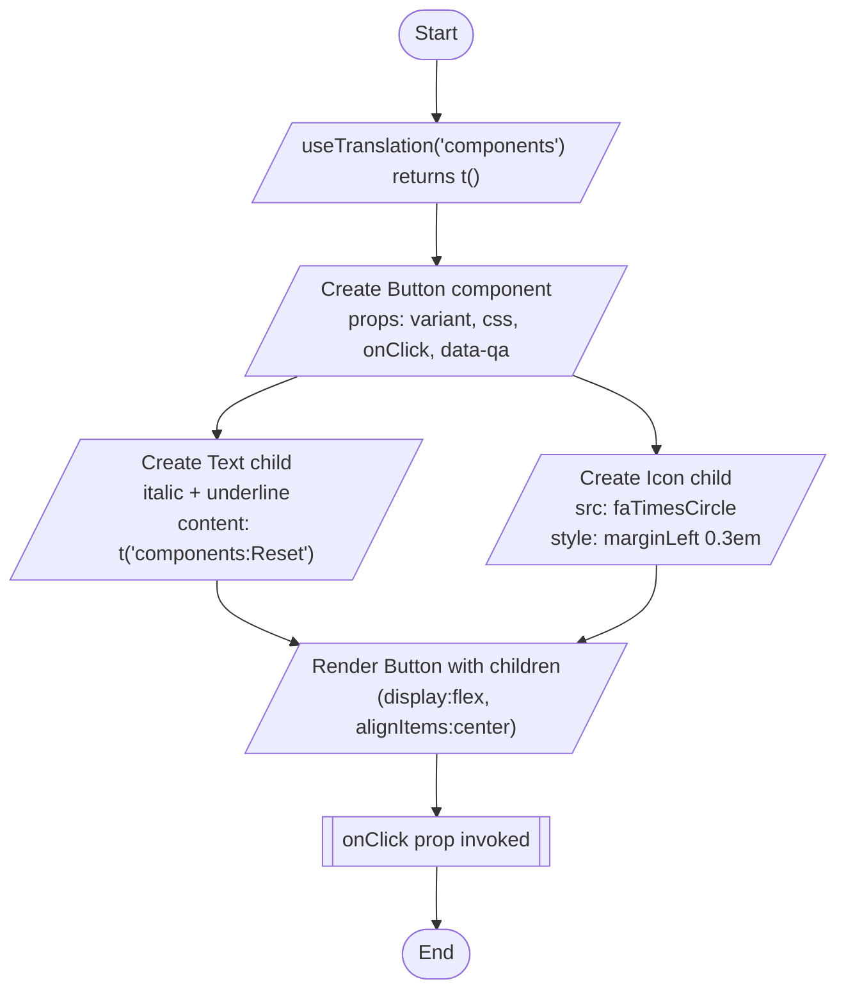

# Diagram: web/portal/src/components/saved-search/ResetSearchButton.js


> Auto-generated by Obscura crawlers

## Diagram 1

```mermaid
classDiagram
    class ResetSearchButton {
        +onClick: func = () => {}
        +render()
    }
    class Button {
        +variant: string
        +css: object
        +onClick: func
        +data-qa: string
    }
    class Text {
        +italic: bool
        +underline: bool
        +children
    }
    class Icon {
        +src
        +style
    }
    class useTranslation {
        +t(key): string
    }
    class Colors {
        <<enum>>
        TEXT_GRAY
        BACKGROUND_DARK_BLUE
    }
    class faTimesCircle {
        <<icon>>
    }

    ResetSearchButton ..> useTranslation : calls
    ResetSearchButton ..> Colors : references
    ResetSearchButton ..> faTimesCircle : references
    ResetSearchButton ..> Button : composes
    ResetSearchButton ..> Text : composes
    ResetSearchButton ..> Icon : composes
```

> SVG rendering failed for this diagram.

## Diagram 2



### SVG

<svg id="container" width="670" xmlns="http://www.w3.org/2000/svg" class="flowchart" height="781" viewBox="0 0 670 781" role="graphics-document document" aria-roledescription="flowchart-v2"><style>#container{font-family:"trebuchet ms",verdana,arial,sans-serif;font-size:16px;fill:#333;}@keyframes edge-animation-frame{from{stroke-dashoffset:0;}}@keyframes dash{to{stroke-dashoffset:0;}}#container .edge-animation-slow{stroke-dasharray:9,5!important;stroke-dashoffset:900;animation:dash 50s linear infinite;stroke-linecap:round;}#container .edge-animation-fast{stroke-dasharray:9,5!important;stroke-dashoffset:900;animation:dash 20s linear infinite;stroke-linecap:round;}#container .error-icon{fill:#552222;}#container .error-text{fill:#552222;stroke:#552222;}#container .edge-thickness-normal{stroke-width:1px;}#container .edge-thickness-thick{stroke-width:3.5px;}#container .edge-pattern-solid{stroke-dasharray:0;}#container .edge-thickness-invisible{stroke-width:0;fill:none;}#container .edge-pattern-dashed{stroke-dasharray:3;}#container .edge-pattern-dotted{stroke-dasharray:2;}#container .marker{fill:#333333;stroke:#333333;}#container .marker.cross{stroke:#333333;}#container svg{font-family:"trebuchet ms",verdana,arial,sans-serif;font-size:16px;}#container p{margin:0;}#container .label{font-family:"trebuchet ms",verdana,arial,sans-serif;color:#333;}#container .cluster-label text{fill:#333;}#container .cluster-label span{color:#333;}#container .cluster-label span p{background-color:transparent;}#container .label text,#container span{fill:#333;color:#333;}#container .node rect,#container .node circle,#container .node ellipse,#container .node polygon,#container .node path{fill:#ECECFF;stroke:#9370DB;stroke-width:1px;}#container .rough-node .label text,#container .node .label text,#container .image-shape .label,#container .icon-shape .label{text-anchor:middle;}#container .node .katex path{fill:#000;stroke:#000;stroke-width:1px;}#container .rough-node .label,#container .node .label,#container .image-shape .label,#container .icon-shape .label{text-align:center;}#container .node.clickable{cursor:pointer;}#container .root .anchor path{fill:#333333!important;stroke-width:0;stroke:#333333;}#container .arrowheadPath{fill:#333333;}#container .edgePath .path{stroke:#333333;stroke-width:2.0px;}#container .flowchart-link{stroke:#333333;fill:none;}#container .edgeLabel{background-color:rgba(232,232,232, 0.8);text-align:center;}#container .edgeLabel p{background-color:rgba(232,232,232, 0.8);}#container .edgeLabel rect{opacity:0.5;background-color:rgba(232,232,232, 0.8);fill:rgba(232,232,232, 0.8);}#container .labelBkg{background-color:rgba(232, 232, 232, 0.5);}#container .cluster rect{fill:#ffffde;stroke:#aaaa33;stroke-width:1px;}#container .cluster text{fill:#333;}#container .cluster span{color:#333;}#container div.mermaidTooltip{position:absolute;text-align:center;max-width:200px;padding:2px;font-family:"trebuchet ms",verdana,arial,sans-serif;font-size:12px;background:hsl(80, 100%, 96.2745098039%);border:1px solid #aaaa33;border-radius:2px;pointer-events:none;z-index:100;}#container .flowchartTitleText{text-anchor:middle;font-size:18px;fill:#333;}#container rect.text{fill:none;stroke-width:0;}#container .icon-shape,#container .image-shape{background-color:rgba(232,232,232, 0.8);text-align:center;}#container .icon-shape p,#container .image-shape p{background-color:rgba(232,232,232, 0.8);padding:2px;}#container .icon-shape rect,#container .image-shape rect{opacity:0.5;background-color:rgba(232,232,232, 0.8);fill:rgba(232,232,232, 0.8);}#container .label-icon{display:inline-block;height:1em;overflow:visible;vertical-align:-0.125em;}#container .node .label-icon path{fill:currentColor;stroke:revert;stroke-width:revert;}#container :root{--mermaid-font-family:"trebuchet ms",verdana,arial,sans-serif;}</style><g><marker id="container_flowchart-v2-pointEnd" class="marker flowchart-v2" viewBox="0 0 10 10" refX="5" refY="5" markerUnits="userSpaceOnUse" markerWidth="8" markerHeight="8" orient="auto"><path d="M 0 0 L 10 5 L 0 10 z" class="arrowMarkerPath" style="stroke-width: 1; stroke-dasharray: 1, 0;"></path></marker><marker id="container_flowchart-v2-pointStart" class="marker flowchart-v2" viewBox="0 0 10 10" refX="4.5" refY="5" markerUnits="userSpaceOnUse" markerWidth="8" markerHeight="8" orient="auto"><path d="M 0 5 L 10 10 L 10 0 z" class="arrowMarkerPath" style="stroke-width: 1; stroke-dasharray: 1, 0;"></path></marker><marker id="container_flowchart-v2-circleEnd" class="marker flowchart-v2" viewBox="0 0 10 10" refX="11" refY="5" markerUnits="userSpaceOnUse" markerWidth="11" markerHeight="11" orient="auto"><circle cx="5" cy="5" r="5" class="arrowMarkerPath" style="stroke-width: 1; stroke-dasharray: 1, 0;"></circle></marker><marker id="container_flowchart-v2-circleStart" class="marker flowchart-v2" viewBox="0 0 10 10" refX="-1" refY="5" markerUnits="userSpaceOnUse" markerWidth="11" markerHeight="11" orient="auto"><circle cx="5" cy="5" r="5" class="arrowMarkerPath" style="stroke-width: 1; stroke-dasharray: 1, 0;"></circle></marker><marker id="container_flowchart-v2-crossEnd" class="marker cross flowchart-v2" viewBox="0 0 11 11" refX="12" refY="5.2" markerUnits="userSpaceOnUse" markerWidth="11" markerHeight="11" orient="auto"><path d="M 1,1 l 9,9 M 10,1 l -9,9" class="arrowMarkerPath" style="stroke-width: 2; stroke-dasharray: 1, 0;"></path></marker><marker id="container_flowchart-v2-crossStart" class="marker cross flowchart-v2" viewBox="0 0 11 11" refX="-1" refY="5.2" markerUnits="userSpaceOnUse" markerWidth="11" markerHeight="11" orient="auto"><path d="M 1,1 l 9,9 M 10,1 l -9,9" class="arrowMarkerPath" style="stroke-width: 2; stroke-dasharray: 1, 0;"></path></marker><g class="root"><g class="clusters"></g><g class="edgePaths"><path d="M335.5,47.5L335.417,51.583C335.333,55.667,335.167,63.833,335.154,71.5C335.141,79.167,335.281,86.334,335.351,89.917L335.422,93.501" id="L_Start_UT_0" class="edge-thickness-normal edge-pattern-solid edge-thickness-normal edge-pattern-solid flowchart-link" style=";" data-edge="true" data-et="edge" data-id="L_Start_UT_0" data-points="W3sieCI6MzM1LjUsInkiOjQ3LjV9LHsieCI6MzM1LCJ5Ijo3Mn0seyJ4IjozMzUuNSwieSI6OTcuNX1d" marker-end="url(#container_flowchart-v2-pointEnd)"></path><path d="M335.5,160.5L335.417,164.583C335.333,168.667,335.167,176.833,335.154,184.5C335.141,192.167,335.281,199.334,335.351,202.917L335.422,206.501" id="L_UT_BuildButton_0" class="edge-thickness-normal edge-pattern-solid edge-thickness-normal edge-pattern-solid flowchart-link" style=";" data-edge="true" data-et="edge" data-id="L_UT_BuildButton_0" data-points="W3sieCI6MzM1LjUsInkiOjE2MC41fSx7IngiOjMzNSwieSI6MTg1fSx7IngiOjMzNS41LCJ5IjoyMTAuNX1d" marker-end="url(#container_flowchart-v2-pointEnd)"></path><path d="M214.158,321.5L204.965,325.583C195.772,329.667,177.386,337.833,168.263,345.5C159.141,353.167,159.281,360.334,159.351,363.917L159.422,367.501" id="L_BuildButton_TextNode_0" class="edge-thickness-normal edge-pattern-solid edge-thickness-normal edge-pattern-solid flowchart-link" style=";" data-edge="true" data-et="edge" data-id="L_BuildButton_TextNode_0" data-points="W3sieCI6MjE0LjE1ODM4NTA5MzE2NzcsInkiOjMyMS41fSx7IngiOjE1OSwieSI6MzQ2fSx7IngiOjE1OS41LCJ5IjozNzEuNX1d" marker-end="url(#container_flowchart-v2-pointEnd)"></path><path d="M445.576,316.347L456.48,321.289C467.384,326.232,489.192,336.116,500.166,344.641C511.141,353.167,511.281,360.334,511.351,363.917L511.422,367.501" id="L_BuildButton_IconNode_0" class="edge-thickness-normal edge-pattern-solid edge-thickness-normal edge-pattern-solid flowchart-link" style=";" data-edge="true" data-et="edge" data-id="L_BuildButton_IconNode_0" data-points="W3sieCI6NDQ1LjU3NjMwMDU3ODAzNDcsInkiOjMxNi4zNDczOTg4NDM5MzA2NX0seyJ4Ijo1MTEsInkiOjM0Nn0seyJ4Ijo1MTEuNSwieSI6MzcxLjV9XQ==" marker-end="url(#container_flowchart-v2-pointEnd)"></path><path d="M159.5,458.5L159.417,462.583C159.333,466.667,159.167,474.833,169.847,483.154C180.528,491.475,202.055,499.95,212.819,504.187L223.583,508.425" id="L_TextNode_Render_0" class="edge-thickness-normal edge-pattern-solid edge-thickness-normal edge-pattern-solid flowchart-link" style=";" data-edge="true" data-et="edge" data-id="L_TextNode_Render_0" data-points="W3sieCI6MTU5LjUsInkiOjQ1OC41fSx7IngiOjE1OSwieSI6NDgzfSx7IngiOjIyNy4zMDQ5OTQwNTQ2OTY3OCwieSI6NTA5Ljg5MDAxMTg5MDYwNjQ0fV0=" marker-end="url(#container_flowchart-v2-pointEnd)"></path><path d="M511.5,458.5L511.417,462.583C511.333,466.667,511.167,474.833,501.08,482.919C490.993,491.005,470.987,499.009,460.983,503.012L450.98,507.014" id="L_IconNode_Render_0" class="edge-thickness-normal edge-pattern-solid edge-thickness-normal edge-pattern-solid flowchart-link" style=";" data-edge="true" data-et="edge" data-id="L_IconNode_Render_0" data-points="W3sieCI6NTExLjUsInkiOjQ1OC41fSx7IngiOjUxMSwieSI6NDgzfSx7IngiOjQ0Ny4yNjY0MjMzNTc2NjQyLCJ5Ijo1MDguNX1d" marker-end="url(#container_flowchart-v2-pointEnd)"></path><path d="M335.5,595.5L335.417,599.583C335.333,603.667,335.167,611.833,335.154,619.5C335.141,627.167,335.281,634.334,335.351,637.917L335.422,641.501" id="L_Render_ClickEvent_0" class="edge-thickness-normal edge-pattern-solid edge-thickness-normal edge-pattern-solid flowchart-link" style=";" data-edge="true" data-et="edge" data-id="L_Render_ClickEvent_0" data-points="W3sieCI6MzM1LjUsInkiOjU5NS41fSx7IngiOjMzNSwieSI6NjIwfSx7IngiOjMzNS41LCJ5Ijo2NDUuNX1d" marker-end="url(#container_flowchart-v2-pointEnd)"></path><path d="M335.5,684.5L335.417,688.583C335.333,692.667,335.167,700.833,335.154,708.5C335.141,716.167,335.281,723.334,335.351,726.917L335.422,730.501" id="L_ClickEvent_End_0" class="edge-thickness-normal edge-pattern-solid edge-thickness-normal edge-pattern-solid flowchart-link" style=";" data-edge="true" data-et="edge" data-id="L_ClickEvent_End_0" data-points="W3sieCI6MzM1LjUsInkiOjY4NC41fSx7IngiOjMzNSwieSI6NzA5fSx7IngiOjMzNS41LCJ5Ijo3MzQuNX1d" marker-end="url(#container_flowchart-v2-pointEnd)"></path></g><g class="edgeLabels"><g class="edgeLabel"><g class="label" data-id="L_Start_UT_0" transform="translate(0, 0)"><foreignObject width="0" height="0"><div xmlns="http://www.w3.org/1999/xhtml" class="labelBkg" style="display: table-cell; white-space: nowrap; line-height: 1.5; max-width: 200px; text-align: center;"><span class="edgeLabel"></span></div></foreignObject></g></g><g class="edgeLabel"><g class="label" data-id="L_UT_BuildButton_0" transform="translate(0, 0)"><foreignObject width="0" height="0"><div xmlns="http://www.w3.org/1999/xhtml" class="labelBkg" style="display: table-cell; white-space: nowrap; line-height: 1.5; max-width: 200px; text-align: center;"><span class="edgeLabel"></span></div></foreignObject></g></g><g class="edgeLabel"><g class="label" data-id="L_BuildButton_TextNode_0" transform="translate(0, 0)"><foreignObject width="0" height="0"><div xmlns="http://www.w3.org/1999/xhtml" class="labelBkg" style="display: table-cell; white-space: nowrap; line-height: 1.5; max-width: 200px; text-align: center;"><span class="edgeLabel"></span></div></foreignObject></g></g><g class="edgeLabel"><g class="label" data-id="L_BuildButton_IconNode_0" transform="translate(0, 0)"><foreignObject width="0" height="0"><div xmlns="http://www.w3.org/1999/xhtml" class="labelBkg" style="display: table-cell; white-space: nowrap; line-height: 1.5; max-width: 200px; text-align: center;"><span class="edgeLabel"></span></div></foreignObject></g></g><g class="edgeLabel"><g class="label" data-id="L_TextNode_Render_0" transform="translate(0, 0)"><foreignObject width="0" height="0"><div xmlns="http://www.w3.org/1999/xhtml" class="labelBkg" style="display: table-cell; white-space: nowrap; line-height: 1.5; max-width: 200px; text-align: center;"><span class="edgeLabel"></span></div></foreignObject></g></g><g class="edgeLabel"><g class="label" data-id="L_IconNode_Render_0" transform="translate(0, 0)"><foreignObject width="0" height="0"><div xmlns="http://www.w3.org/1999/xhtml" class="labelBkg" style="display: table-cell; white-space: nowrap; line-height: 1.5; max-width: 200px; text-align: center;"><span class="edgeLabel"></span></div></foreignObject></g></g><g class="edgeLabel"><g class="label" data-id="L_Render_ClickEvent_0" transform="translate(0, 0)"><foreignObject width="0" height="0"><div xmlns="http://www.w3.org/1999/xhtml" class="labelBkg" style="display: table-cell; white-space: nowrap; line-height: 1.5; max-width: 200px; text-align: center;"><span class="edgeLabel"></span></div></foreignObject></g></g><g class="edgeLabel"><g class="label" data-id="L_ClickEvent_End_0" transform="translate(0, 0)"><foreignObject width="0" height="0"><div xmlns="http://www.w3.org/1999/xhtml" class="labelBkg" style="display: table-cell; white-space: nowrap; line-height: 1.5; max-width: 200px; text-align: center;"><span class="edgeLabel"></span></div></foreignObject></g></g></g><g class="nodes"><g class="node default" id="flowchart-Start-0" transform="translate(335, 27.5)"><g class="basic label-container outer-path"><path d="M-10.3984375 -19.5 C-4.149009686806333 -19.5, 2.100418126387334 -19.5, 10.3984375 -19.5 C10.3984375 -19.5, 10.398437499999998 -19.5, 10.398437499999998 -19.5 C10.81173057483355 -19.486746495516257, 11.225023649667104 -19.473492991032515, 11.6478067896239 -19.45993515863156 C12.10846864558967 -19.41549566341348, 12.569130501555442 -19.3710561681954, 12.892042152847864 -19.3399052695533 C13.364401084930353 -19.26353794061243, 13.83676001701284 -19.187170611671565, 14.126030759676757 -19.140403561325776 C14.396447815599176 -19.078682632947686, 14.666864871521593 -19.0169617045696, 15.34470188623539 -18.862249829261074 C15.712087561306816 -18.753211689346635, 16.079473236378245 -18.644173549432196, 16.543047751460602 -18.50658706670804 C16.98636585310776 -18.343441907314276, 17.429683954754918 -18.18029674792051, 17.716144095147794 -18.074876768247425 C17.970334133751535 -17.962354378437137, 18.224524172355277 -17.84983198862685, 18.85917041279238 -17.568892924097174 C19.16567169307588 -17.408991402496714, 19.472172973359378 -17.249089880896253, 19.967429764076783 -16.990714730406097 C20.247526621333922 -16.82091836950498, 20.52762347859106 -16.65112200860386, 21.036368073605697 -16.342718045390892 C21.424371011313433 -16.07206399242244, 21.812373949021165 -15.80140993945399, 22.061592844578712 -15.627565626425154 C22.318627485848406 -15.422587339991637, 22.575662127118104 -15.21760905355812, 23.03889120850187 -14.848196188198123 C23.24903821634775 -14.657346235857636, 23.459185224193625 -14.466496283517149, 23.964247236767985 -14.007812326905688 C24.151288432023478 -13.814676936436673, 24.338329627278966 -13.621541545967657, 24.833858442968648 -13.10986736009568 C25.08729128642074 -12.812170721439541, 25.340724129872832 -12.5144740827834, 25.644151408126582 -12.158051136245305 C25.890379471893397 -11.828127962635847, 26.136607535660215 -11.498204789026387, 26.391796464640635 -11.156274872382312 C26.56789596914734 -10.885738744121923, 26.743995473654042 -10.615202615861536, 27.073721378604247 -10.108655082055241 C27.23992945320921 -9.81353581520155, 27.406137527814174 -9.51841654834786, 27.6871239742735 -9.019496659696287 C27.83903689754781 -8.704046224101333, 27.99094982082212 -8.388595788506377, 28.22948364880834 -7.893275190886684 C28.369182157726367 -7.548217172972224, 28.508880666644398 -7.203159155057764, 28.698571729970325 -6.734618561215508 C28.84316314623132 -6.299132252951021, 28.987754562492313 -5.863645944686533, 29.09246063421488 -5.548287939305138 C29.206199825560773 -5.1145511078258945, 29.319939016906666 -4.68081427634665, 29.40953178754556 -4.339158212148133 C29.475254059989986 -4.001688233553201, 29.540976332434415 -3.6642182549582696, 29.648482276581777 -3.1121979531509023 C29.70692112508227 -2.6589577842369927, 29.76535997358276 -2.205717615323083, 29.808330202509367 -1.872449005199798 C29.83148357543775 -1.5118165327739685, 29.854636948366135 -1.1511840603481394, 29.888418715913414 -0.6250057626472757 C29.888418715913414 -0.31401411572870613, 29.888418715913414 -0.0030224688101365693, 29.888418715913414 0.625005762647271 C29.859856095380547 1.0698916327789825, 29.831293474847683 1.5147775029106938, 29.808330202509367 1.8724490051997846 C29.757267779371123 2.268479075644057, 29.706205356232875 2.6645091460883292, 29.648482276581777 3.1121979531508885 C29.5582373738226 3.575586455552326, 29.46799247106342 4.038974957953763, 29.40953178754556 4.339158212148129 C29.335288043889015 4.622281784152585, 29.261044300232466 4.905405356157042, 29.092460634214884 5.548287939305125 C28.95957282630863 5.948524843921898, 28.826685018402376 6.348761748538669, 28.69857172997033 6.734618561215495 C28.53951428694974 7.127493520642813, 28.38045684392915 7.52036848007013, 28.229483648808344 7.893275190886679 C28.023846029196825 8.320286107950201, 27.818208409585306 8.747297025013724, 27.687123974273504 9.019496659696284 C27.456789704598346 9.428478479378485, 27.22645543492319 9.837460299060687, 27.07372137860425 10.108655082055236 C26.802427121864177 10.525435913116265, 26.5311328651241 10.942216744177294, 26.39179646464064 11.156274872382301 C26.181148584783063 11.438523840974819, 25.970500704925485 11.720772809567336, 25.644151408126582 12.158051136245302 C25.40915901476198 12.434086572937343, 25.174166621397376 12.710122009629384, 24.83385844296866 13.10986736009567 C24.615549537866613 13.335289228107971, 24.39724063276457 13.560711096120272, 23.96424723676799 14.007812326905684 C23.648126207026735 14.294905082012583, 23.332005177285485 14.58199783711948, 23.038891208501887 14.848196188198111 C22.673119711072665 15.139889223809583, 22.307348213643447 15.431582259421054, 22.061592844578715 15.627565626425152 C21.73836220639302 15.853037327194684, 21.41513156820733 16.078509027964216, 21.036368073605708 16.34271804539089 C20.61104314080235 16.600552519143026, 20.185718207998992 16.858386992895166, 19.967429764076787 16.990714730406093 C19.691507590569817 17.134663151588093, 19.415585417062847 17.278611572770092, 18.859170412792388 17.56889292409717 C18.575510404102857 17.694460795468835, 18.291850395413327 17.8200286668405, 17.716144095147804 18.07487676824742 C17.300478762330517 18.2278454530924, 16.88481342951323 18.380814137937374, 16.543047751460616 18.506587066708033 C16.302843168426076 18.577878526093098, 16.062638585391536 18.649169985478167, 15.344701886235413 18.86224982926107 C14.884512256966868 18.967285109123637, 14.424322627698324 19.072320388986206, 14.126030759676766 19.140403561325773 C13.817180824608677 19.190336023660564, 13.508330889540588 19.240268485995355, 12.892042152847878 19.3399052695533 C12.544593245222245 19.373423247803498, 12.19714433759661 19.406941226053693, 11.6478067896239 19.45993515863156 C11.255059382840571 19.472529803530648, 10.862311976057244 19.485124448429737, 10.398437500000004 19.5 C10.398437500000002 19.5, 10.398437500000002 19.5, 10.3984375 19.5 C3.413159386403814 19.5, -3.572118727192372 19.5, -10.398437499999996 19.5 C-10.71977363406088 19.48969537562351, -11.041109768121762 19.479390751247017, -11.647806789623893 19.45993515863156 C-12.0386236708152 19.4222335241291, -12.429440552006508 19.384531889626643, -12.892042152847871 19.3399052695533 C-13.199215909258118 19.29024379878495, -13.506389665668367 19.240582328016597, -14.126030759676759 19.140403561325773 C-14.45856668219898 19.064504407009768, -14.7911026047212 18.988605252693763, -15.344701886235388 18.862249829261074 C-15.810637207135757 18.723962671762255, -16.276572528036127 18.585675514263432, -16.54304775146059 18.506587066708043 C-16.877279217082958 18.383586797757214, -17.211510682705324 18.260586528806382, -17.716144095147797 18.074876768247425 C-18.147308840472128 17.884012925540084, -18.578473585796456 17.69314908283274, -18.85917041279238 17.568892924097174 C-19.18407947794597 17.399388072920733, -19.508988543099566 17.229883221744295, -19.96742976407678 16.990714730406097 C-20.34378995990955 16.762562967954263, -20.720150155742317 16.534411205502426, -21.036368073605686 16.3427180453909 C-21.372563190738962 16.108202885330783, -21.708758307872237 15.87368772527067, -22.061592844578712 15.627565626425156 C-22.281272439283875 15.452376995567318, -22.500952033989034 15.27718836470948, -23.03889120850187 14.848196188198125 C-23.38929957481448 14.529964581210335, -23.73970794112709 14.211732974222542, -23.964247236767974 14.007812326905697 C-24.274123318275638 13.687839831449601, -24.5839993997833 13.367867335993507, -24.833858442968655 13.109867360095677 C-25.07596143987909 12.825479403873896, -25.318064436789527 12.541091447652112, -25.64415140812658 12.158051136245307 C-25.837782551756607 11.898603043941147, -26.031413695386632 11.63915495163699, -26.391796464640635 11.156274872382316 C-26.542577053706385 10.924635397319989, -26.693357642772135 10.692995922257664, -27.073721378604244 10.108655082055249 C-27.248451186688673 9.798404614489684, -27.423180994773098 9.488154146924117, -27.6871239742735 9.019496659696289 C-27.892315500633487 8.593412064814443, -28.097507026993473 8.167327469932598, -28.22948364880834 7.893275190886686 C-28.379916973313343 7.521701970928862, -28.530350297818345 7.150128750971037, -28.698571729970325 6.73461856121551 C-28.846136718487198 6.290176327090709, -28.99370170700407 5.845734092965908, -29.09246063421488 5.5482879393051325 C-29.20911760105612 5.103424365290226, -29.325774567897362 4.658560791275319, -29.409531787545557 4.339158212148136 C-29.482154138754723 3.9662577874284475, -29.554776489963885 3.593357362708759, -29.648482276581777 3.112197953150904 C-29.686306951246422 2.818837245778769, -29.724131625911067 2.5254765384066347, -29.808330202509364 1.872449005199809 C-29.833193059841882 1.485189933308595, -29.858055917174404 1.0979308614173808, -29.888418715913414 0.6250057626472781 C-29.888418715913414 0.2500157859836921, -29.888418715913414 -0.1249741906798939, -29.888418715913414 -0.6250057626472687 C-29.86811553892695 -0.9412441326409449, -29.847812361940484 -1.257482502634621, -29.808330202509367 -1.8724490051997822 C-29.744419377694644 -2.368128741842929, -29.68050855287992 -2.8638084784860753, -29.648482276581777 -3.112197953150895 C-29.596044097387498 -3.381456920500427, -29.54360591819322 -3.6507158878499584, -29.40953178754556 -4.339158212148126 C-29.302885688994667 -4.745846006634174, -29.196239590443774 -5.152533801120223, -29.092460634214884 -5.548287939305123 C-28.97788663926638 -5.893366557202981, -28.86331264431788 -6.238445175100838, -28.698571729970332 -6.734618561215485 C-28.57430950999967 -7.041548646989612, -28.450047290029005 -7.3484787327637395, -28.229483648808344 -7.893275190886676 C-28.021995592869946 -8.32412857857596, -27.814507536931547 -8.754981966265245, -27.687123974273504 -9.019496659696282 C-27.502203305254362 -9.347842032788003, -27.31728263623522 -9.676187405879727, -27.073721378604247 -10.108655082055243 C-26.809869446219494 -10.514002504362589, -26.54601751383474 -10.919349926669936, -26.39179646464064 -11.156274872382308 C-26.228708864143982 -11.374797399461778, -26.06562126364732 -11.59331992654125, -25.644151408126586 -12.158051136245302 C-25.41777564001672 -12.42396499461326, -25.191399871906857 -12.68987885298122, -24.833858442968662 -13.10986736009567 C-24.631869356633825 -13.31843767534879, -24.42988027029899 -13.527007990601907, -23.964247236767996 -14.007812326905677 C-23.76373201202471 -14.189914948675405, -23.563216787281426 -14.372017570445133, -23.038891208501887 -14.848196188198107 C-22.747090046645752 -15.080899849623343, -22.455288884789617 -15.31360351104858, -22.06159284457872 -15.627565626425149 C-21.701115347985493 -15.879019123229263, -21.340637851392266 -16.130472620033377, -21.03636807360571 -16.342718045390885 C-20.797556162807517 -16.487487229131315, -20.558744252009323 -16.632256412871744, -19.96742976407679 -16.99071473040609 C-19.558850861381263 -17.20387008223507, -19.150271958685735 -17.417025434064048, -18.859170412792388 -17.56889292409717 C-18.5915083340739 -17.687378986432385, -18.323846255355416 -17.8058650487676, -17.716144095147804 -18.07487676824742 C-17.391594159431815 -18.19431414469762, -17.067044223715826 -18.313751521147825, -16.54304775146062 -18.506587066708033 C-16.292791410973607 -18.58086183494224, -16.04253507048659 -18.655136603176448, -15.344701886235413 -18.862249829261067 C-15.000321565637524 -18.940852390145924, -14.655941245039635 -19.01945495103078, -14.126030759676768 -19.140403561325773 C-13.80357302799974 -19.19253602668626, -13.481115296322713 -19.244668492046742, -12.89204215284788 -19.3399052695533 C-12.591176205586002 -19.36892944564141, -12.290310258324123 -19.397953621729524, -11.647806789623903 -19.45993515863156 C-11.315429196244635 -19.470593861117493, -10.983051602865364 -19.481252563603427, -10.398437500000005 -19.5 C-10.398437500000004 -19.5, -10.398437500000004 -19.5, -10.3984375 -19.5" stroke="none" stroke-width="0" fill="#ECECFF" style=""></path><path d="M-10.3984375 -19.5 C-4.623312538941339 -19.5, 1.151812422117322 -19.5, 10.3984375 -19.5 M-10.3984375 -19.5 C-4.036559020474724 -19.5, 2.3253194590505526 -19.5, 10.3984375 -19.5 M10.3984375 -19.5 C10.3984375 -19.5, 10.398437499999998 -19.5, 10.398437499999998 -19.5 M10.3984375 -19.5 C10.3984375 -19.5, 10.398437499999998 -19.5, 10.398437499999998 -19.5 M10.398437499999998 -19.5 C10.74484827259367 -19.488891280770584, 11.091259045187343 -19.477782561541172, 11.6478067896239 -19.45993515863156 M10.398437499999998 -19.5 C10.832264994621566 -19.48608799664148, 11.266092489243134 -19.472175993282956, 11.6478067896239 -19.45993515863156 M11.6478067896239 -19.45993515863156 C11.996387888499816 -19.426307959253105, 12.344968987375733 -19.392680759874654, 12.892042152847864 -19.3399052695533 M11.6478067896239 -19.45993515863156 C12.094826163804457 -19.416811737223814, 12.541845537985017 -19.373688315816068, 12.892042152847864 -19.3399052695533 M12.892042152847864 -19.3399052695533 C13.292870804748853 -19.27510240158657, 13.693699456649844 -19.21029953361984, 14.126030759676757 -19.140403561325776 M12.892042152847864 -19.3399052695533 C13.306551454877146 -19.27289062016885, 13.72106075690643 -19.205875970784405, 14.126030759676757 -19.140403561325776 M14.126030759676757 -19.140403561325776 C14.478142046695426 -19.060036457804646, 14.830253333714094 -18.97966935428352, 15.34470188623539 -18.862249829261074 M14.126030759676757 -19.140403561325776 C14.433628153875935 -19.0701964633604, 14.74122554807511 -18.99998936539502, 15.34470188623539 -18.862249829261074 M15.34470188623539 -18.862249829261074 C15.811665662683387 -18.72365743155419, 16.278629439131386 -18.585065033847307, 16.543047751460602 -18.50658706670804 M15.34470188623539 -18.862249829261074 C15.677681885893747 -18.76342311321016, 16.010661885552103 -18.664596397159244, 16.543047751460602 -18.50658706670804 M16.543047751460602 -18.50658706670804 C17.00021331021788 -18.33834591509326, 17.45737886897516 -18.170104763478484, 17.716144095147794 -18.074876768247425 M16.543047751460602 -18.50658706670804 C16.84924597166913 -18.39390329120598, 17.155444191877663 -18.28121951570392, 17.716144095147794 -18.074876768247425 M17.716144095147794 -18.074876768247425 C18.160886831581355 -17.87800235165282, 18.605629568014912 -17.68112793505822, 18.85917041279238 -17.568892924097174 M17.716144095147794 -18.074876768247425 C18.090494697617192 -17.909162861250294, 18.46484530008659 -17.74344895425316, 18.85917041279238 -17.568892924097174 M18.85917041279238 -17.568892924097174 C19.116925217480464 -17.434422407591235, 19.374680022168548 -17.299951891085293, 19.967429764076783 -16.990714730406097 M18.85917041279238 -17.568892924097174 C19.11364882378149 -17.436131700085358, 19.368127234770597 -17.303370476073543, 19.967429764076783 -16.990714730406097 M19.967429764076783 -16.990714730406097 C20.336409373364894 -16.767037122890773, 20.705388982653005 -16.54335951537545, 21.036368073605697 -16.342718045390892 M19.967429764076783 -16.990714730406097 C20.351917831303496 -16.757635804550578, 20.736405898530208 -16.524556878695062, 21.036368073605697 -16.342718045390892 M21.036368073605697 -16.342718045390892 C21.361086223898013 -16.116208720569144, 21.68580437419033 -15.889699395747394, 22.061592844578712 -15.627565626425154 M21.036368073605697 -16.342718045390892 C21.424965798839413 -16.071649094392253, 21.81356352407313 -15.800580143393615, 22.061592844578712 -15.627565626425154 M22.061592844578712 -15.627565626425154 C22.36464866172017 -15.385886676908827, 22.66770447886163 -15.144207727392502, 23.03889120850187 -14.848196188198123 M22.061592844578712 -15.627565626425154 C22.31063794482646 -15.428958786346023, 22.55968304507421 -15.230351946266893, 23.03889120850187 -14.848196188198123 M23.03889120850187 -14.848196188198123 C23.314793440131538 -14.597629081405081, 23.590695671761207 -14.34706197461204, 23.964247236767985 -14.007812326905688 M23.03889120850187 -14.848196188198123 C23.348884955891073 -14.56666806880435, 23.658878703280276 -14.285139949410578, 23.964247236767985 -14.007812326905688 M23.964247236767985 -14.007812326905688 C24.214923779646075 -13.748968215457136, 24.465600322524164 -13.490124104008586, 24.833858442968648 -13.10986736009568 M23.964247236767985 -14.007812326905688 C24.227796950462945 -13.735675609681739, 24.491346664157902 -13.46353889245779, 24.833858442968648 -13.10986736009568 M24.833858442968648 -13.10986736009568 C25.10908010913482 -12.786576330460449, 25.38430177530099 -12.463285300825214, 25.644151408126582 -12.158051136245305 M24.833858442968648 -13.10986736009568 C25.08937037511397 -12.809728505556977, 25.344882307259287 -12.509589651018276, 25.644151408126582 -12.158051136245305 M25.644151408126582 -12.158051136245305 C25.898663744506713 -11.817027792046764, 26.153176080886844 -11.476004447848224, 26.391796464640635 -11.156274872382312 M25.644151408126582 -12.158051136245305 C25.88786786934596 -11.831493281237712, 26.13158433056534 -11.504935426230121, 26.391796464640635 -11.156274872382312 M26.391796464640635 -11.156274872382312 C26.623013454746605 -10.801063485124216, 26.854230444852575 -10.445852097866121, 27.073721378604247 -10.108655082055241 M26.391796464640635 -11.156274872382312 C26.640804005254353 -10.773732422112598, 26.889811545868074 -10.391189971842884, 27.073721378604247 -10.108655082055241 M27.073721378604247 -10.108655082055241 C27.30455442997628 -9.698787624963114, 27.535387481348316 -9.288920167870986, 27.6871239742735 -9.019496659696287 M27.073721378604247 -10.108655082055241 C27.25823616361908 -9.781030397113385, 27.44275094863391 -9.453405712171527, 27.6871239742735 -9.019496659696287 M27.6871239742735 -9.019496659696287 C27.84124505625205 -8.69946093530495, 27.9953661382306 -8.379425210913611, 28.22948364880834 -7.893275190886684 M27.6871239742735 -9.019496659696287 C27.7996281489845 -8.785879333705187, 27.9121323236955 -8.552262007714088, 28.22948364880834 -7.893275190886684 M28.22948364880834 -7.893275190886684 C28.336620535694863 -7.628645008926183, 28.44375742258138 -7.364014826965681, 28.698571729970325 -6.734618561215508 M28.22948364880834 -7.893275190886684 C28.328365922842202 -7.649034062264332, 28.427248196876064 -7.404792933641979, 28.698571729970325 -6.734618561215508 M28.698571729970325 -6.734618561215508 C28.814129751964135 -6.386576210640607, 28.92968777395794 -6.038533860065707, 29.09246063421488 -5.548287939305138 M28.698571729970325 -6.734618561215508 C28.80412066522749 -6.416721985159972, 28.90966960048466 -6.098825409104436, 29.09246063421488 -5.548287939305138 M29.09246063421488 -5.548287939305138 C29.217544094434743 -5.071290493972225, 29.3426275546546 -4.594293048639313, 29.40953178754556 -4.339158212148133 M29.09246063421488 -5.548287939305138 C29.202457194297352 -5.128823382899968, 29.312453754379828 -4.709358826494798, 29.40953178754556 -4.339158212148133 M29.40953178754556 -4.339158212148133 C29.50023165052031 -3.8734335851956274, 29.590931513495057 -3.4077089582431213, 29.648482276581777 -3.1121979531509023 M29.40953178754556 -4.339158212148133 C29.491624983499815 -3.917627001326153, 29.573718179454065 -3.4960957905041723, 29.648482276581777 -3.1121979531509023 M29.648482276581777 -3.1121979531509023 C29.700050818075766 -2.7122425286838556, 29.751619359569755 -2.312287104216809, 29.808330202509367 -1.872449005199798 M29.648482276581777 -3.1121979531509023 C29.68292167926786 -2.8450927467469214, 29.717361081953946 -2.57798754034294, 29.808330202509367 -1.872449005199798 M29.808330202509367 -1.872449005199798 C29.839294056050072 -1.3901619927305613, 29.87025790959078 -0.9078749802613247, 29.888418715913414 -0.6250057626472757 M29.808330202509367 -1.872449005199798 C29.82991792611727 -1.536202784709837, 29.851505649725173 -1.199956564219876, 29.888418715913414 -0.6250057626472757 M29.888418715913414 -0.6250057626472757 C29.888418715913414 -0.15214393170502305, 29.888418715913414 0.3207178992372296, 29.888418715913414 0.625005762647271 M29.888418715913414 -0.6250057626472757 C29.888418715913414 -0.22568634836192614, 29.888418715913414 0.17363306592342342, 29.888418715913414 0.625005762647271 M29.888418715913414 0.625005762647271 C29.864403569934566 0.9990610459447602, 29.84038842395572 1.3731163292422495, 29.808330202509367 1.8724490051997846 M29.888418715913414 0.625005762647271 C29.856798205097295 1.1175207422252662, 29.825177694281177 1.6100357218032615, 29.808330202509367 1.8724490051997846 M29.808330202509367 1.8724490051997846 C29.752872419217027 2.3025686210371696, 29.697414635924687 2.7326882368745546, 29.648482276581777 3.1121979531508885 M29.808330202509367 1.8724490051997846 C29.77211558008795 2.1533224653142398, 29.73590095766653 2.4341959254286945, 29.648482276581777 3.1121979531508885 M29.648482276581777 3.1121979531508885 C29.594129850697765 3.3912861726760153, 29.539777424813753 3.6703743922011416, 29.40953178754556 4.339158212148129 M29.648482276581777 3.1121979531508885 C29.558891930546533 3.5722254451155333, 29.46930158451129 4.0322529370801785, 29.40953178754556 4.339158212148129 M29.40953178754556 4.339158212148129 C29.32130653883888 4.675599322531375, 29.233081290132194 5.012040432914622, 29.092460634214884 5.548287939305125 M29.40953178754556 4.339158212148129 C29.28617298606566 4.809578786233748, 29.16281418458576 5.279999360319367, 29.092460634214884 5.548287939305125 M29.092460634214884 5.548287939305125 C28.94697302900196 5.9864734259045065, 28.80148542378904 6.4246589125038875, 28.69857172997033 6.734618561215495 M29.092460634214884 5.548287939305125 C28.97157921213349 5.912363522775207, 28.8506977900521 6.27643910624529, 28.69857172997033 6.734618561215495 M28.69857172997033 6.734618561215495 C28.537026551142166 7.133638276184617, 28.375481372314002 7.532657991153738, 28.229483648808344 7.893275190886679 M28.69857172997033 6.734618561215495 C28.560836015078607 7.074828439936937, 28.423100300186885 7.415038318658379, 28.229483648808344 7.893275190886679 M28.229483648808344 7.893275190886679 C28.056468699540282 8.252544434968687, 27.88345375027222 8.611813679050696, 27.687123974273504 9.019496659696284 M28.229483648808344 7.893275190886679 C28.10631129630026 8.149045216335868, 27.983138943792174 8.404815241785057, 27.687123974273504 9.019496659696284 M27.687123974273504 9.019496659696284 C27.442738449610548 9.453427905453177, 27.19835292494759 9.887359151210072, 27.07372137860425 10.108655082055236 M27.687123974273504 9.019496659696284 C27.53973232961953 9.28120544980185, 27.392340684965554 9.542914239907418, 27.07372137860425 10.108655082055236 M27.07372137860425 10.108655082055236 C26.882958808742423 10.401717616285456, 26.692196238880598 10.694780150515674, 26.39179646464064 11.156274872382301 M27.07372137860425 10.108655082055236 C26.804342740419905 10.522493008599062, 26.534964102235556 10.936330935142886, 26.39179646464064 11.156274872382301 M26.39179646464064 11.156274872382301 C26.21068567998681 11.39894682428653, 26.029574895332974 11.641618776190757, 25.644151408126582 12.158051136245302 M26.39179646464064 11.156274872382301 C26.14608758354022 11.48550238851731, 25.90037870243979 11.814729904652317, 25.644151408126582 12.158051136245302 M25.644151408126582 12.158051136245302 C25.388827321584753 12.45796933664943, 25.13350323504292 12.757887537053561, 24.83385844296866 13.10986736009567 M25.644151408126582 12.158051136245302 C25.358731663555204 12.493321409062391, 25.073311918983826 12.82859168187948, 24.83385844296866 13.10986736009567 M24.83385844296866 13.10986736009567 C24.633989889021898 13.316248051559153, 24.43412133507514 13.522628743022638, 23.96424723676799 14.007812326905684 M24.83385844296866 13.10986736009567 C24.62179928400245 13.32883585210902, 24.409740125036244 13.54780434412237, 23.96424723676799 14.007812326905684 M23.96424723676799 14.007812326905684 C23.68539047432566 14.261062660410182, 23.406533711883334 14.51431299391468, 23.038891208501887 14.848196188198111 M23.96424723676799 14.007812326905684 C23.701990993655766 14.245986507980255, 23.43973475054354 14.484160689054827, 23.038891208501887 14.848196188198111 M23.038891208501887 14.848196188198111 C22.793984358212022 15.043502884059286, 22.549077507922156 15.23880957992046, 22.061592844578715 15.627565626425152 M23.038891208501887 14.848196188198111 C22.733354045622548 15.091853944909014, 22.42781688274321 15.335511701619915, 22.061592844578715 15.627565626425152 M22.061592844578715 15.627565626425152 C21.81259454002654 15.80125606471787, 21.56359623547437 15.974946503010589, 21.036368073605708 16.34271804539089 M22.061592844578715 15.627565626425152 C21.702747616794145 15.877880523168125, 21.343902389009575 16.128195419911098, 21.036368073605708 16.34271804539089 M21.036368073605708 16.34271804539089 C20.789480894590383 16.492382504180085, 20.54259371557506 16.642046962969285, 19.967429764076787 16.990714730406093 M21.036368073605708 16.34271804539089 C20.663978512035936 16.568462786018458, 20.291588950466167 16.794207526646023, 19.967429764076787 16.990714730406093 M19.967429764076787 16.990714730406093 C19.624259434112314 17.169746471737472, 19.281089104147842 17.34877821306885, 18.859170412792388 17.56889292409717 M19.967429764076787 16.990714730406093 C19.602528284088827 17.18108359878526, 19.237626804100866 17.371452467164424, 18.859170412792388 17.56889292409717 M18.859170412792388 17.56889292409717 C18.615668225819785 17.676684119034206, 18.372166038847183 17.784475313971242, 17.716144095147804 18.07487676824742 M18.859170412792388 17.56889292409717 C18.519516238567178 17.719247751543573, 18.179862064341968 17.86960257898998, 17.716144095147804 18.07487676824742 M17.716144095147804 18.07487676824742 C17.330176791018403 18.21691630400969, 16.944209486888997 18.35895583977196, 16.543047751460616 18.506587066708033 M17.716144095147804 18.07487676824742 C17.395301069904068 18.19294996737753, 17.074458044660336 18.311023166507635, 16.543047751460616 18.506587066708033 M16.543047751460616 18.506587066708033 C16.163741156436036 18.619163273090383, 15.784434561411452 18.731739479472733, 15.344701886235413 18.86224982926107 M16.543047751460616 18.506587066708033 C16.244160007989596 18.59529538007645, 15.945272264518575 18.684003693444872, 15.344701886235413 18.86224982926107 M15.344701886235413 18.86224982926107 C14.95859512523668 18.950376177876947, 14.572488364237946 19.038502526492827, 14.126030759676766 19.140403561325773 M15.344701886235413 18.86224982926107 C15.04276591677108 18.931164743974968, 14.740829947306745 19.000079658688865, 14.126030759676766 19.140403561325773 M14.126030759676766 19.140403561325773 C13.698577081465498 19.209510957066186, 13.271123403254231 19.278618352806603, 12.892042152847878 19.3399052695533 M14.126030759676766 19.140403561325773 C13.752304963709046 19.200824649731, 13.378579167741325 19.26124573813623, 12.892042152847878 19.3399052695533 M12.892042152847878 19.3399052695533 C12.409247774492021 19.386479862588097, 11.926453396136164 19.433054455622894, 11.6478067896239 19.45993515863156 M12.892042152847878 19.3399052695533 C12.471663375644441 19.380458704610668, 12.051284598441004 19.421012139668033, 11.6478067896239 19.45993515863156 M11.6478067896239 19.45993515863156 C11.285719436821617 19.47154659527565, 10.923632084019335 19.483158031919743, 10.398437500000004 19.5 M11.6478067896239 19.45993515863156 C11.187006916777044 19.474712113661216, 10.72620704393019 19.489489068690872, 10.398437500000004 19.5 M10.398437500000004 19.5 C10.398437500000004 19.5, 10.398437500000002 19.5, 10.3984375 19.5 M10.398437500000004 19.5 C10.398437500000002 19.5, 10.398437500000002 19.5, 10.3984375 19.5 M10.3984375 19.5 C6.165367556620393 19.5, 1.9322976132407863 19.5, -10.398437499999996 19.5 M10.3984375 19.5 C4.508097999455233 19.5, -1.3822415010895348 19.5, -10.398437499999996 19.5 M-10.398437499999996 19.5 C-10.78641111849819 19.4875584411996, -11.174384736996384 19.4751168823992, -11.647806789623893 19.45993515863156 M-10.398437499999996 19.5 C-10.784775191913585 19.48761090218103, -11.171112883827174 19.47522180436206, -11.647806789623893 19.45993515863156 M-11.647806789623893 19.45993515863156 C-11.999016282237209 19.426054401270367, -12.350225774850523 19.39217364390917, -12.892042152847871 19.3399052695533 M-11.647806789623893 19.45993515863156 C-11.998224339096367 19.426130799072713, -12.348641888568842 19.392326439513862, -12.892042152847871 19.3399052695533 M-12.892042152847871 19.3399052695533 C-13.308410549430624 19.272590056178938, -13.724778946013377 19.20527484280458, -14.126030759676759 19.140403561325773 M-12.892042152847871 19.3399052695533 C-13.205104763967318 19.289291734424314, -13.518167375086767 19.238678199295332, -14.126030759676759 19.140403561325773 M-14.126030759676759 19.140403561325773 C-14.472763494626983 19.061264077215935, -14.819496229577208 18.982124593106096, -15.344701886235388 18.862249829261074 M-14.126030759676759 19.140403561325773 C-14.577584441760228 19.03733938005338, -15.0291381238437 18.93427519878098, -15.344701886235388 18.862249829261074 M-15.344701886235388 18.862249829261074 C-15.587259221183576 18.790260085457884, -15.829816556131764 18.718270341654698, -16.54304775146059 18.506587066708043 M-15.344701886235388 18.862249829261074 C-15.729079770109099 18.74816849096804, -16.11345765398281 18.63408715267501, -16.54304775146059 18.506587066708043 M-16.54304775146059 18.506587066708043 C-16.950728652505 18.356556726562765, -17.358409553549407 18.206526386417483, -17.716144095147797 18.074876768247425 M-16.54304775146059 18.506587066708043 C-16.9080116145514 18.37227699140166, -17.272975477642206 18.237966916095274, -17.716144095147797 18.074876768247425 M-17.716144095147797 18.074876768247425 C-18.10384101580856 17.90325484209144, -18.491537936469317 17.731632915935453, -18.85917041279238 17.568892924097174 M-17.716144095147797 18.074876768247425 C-18.144590114121016 17.885216425047567, -18.573036133094238 17.69555608184771, -18.85917041279238 17.568892924097174 M-18.85917041279238 17.568892924097174 C-19.167679242133953 17.40794406543901, -19.476188071475526 17.24699520678085, -19.96742976407678 16.990714730406097 M-18.85917041279238 17.568892924097174 C-19.273146348297796 17.352921943708242, -19.687122283803212 17.136950963319308, -19.96742976407678 16.990714730406097 M-19.96742976407678 16.990714730406097 C-20.313411707166765 16.780978443289367, -20.659393650256753 16.571242156172634, -21.036368073605686 16.3427180453909 M-19.96742976407678 16.990714730406097 C-20.26088994774058 16.81281744250564, -20.55435013140438 16.63492015460518, -21.036368073605686 16.3427180453909 M-21.036368073605686 16.3427180453909 C-21.276306746349317 16.175347214062683, -21.516245419092947 16.007976382734462, -22.061592844578712 15.627565626425156 M-21.036368073605686 16.3427180453909 C-21.244927758074354 16.197235837908785, -21.45348744254302 16.051753630426674, -22.061592844578712 15.627565626425156 M-22.061592844578712 15.627565626425156 C-22.290518042522727 15.445003873020164, -22.519443240466746 15.262442119615175, -23.03889120850187 14.848196188198125 M-22.061592844578712 15.627565626425156 C-22.355379589644194 15.393278515229055, -22.64916633470968 15.158991404032951, -23.03889120850187 14.848196188198125 M-23.03889120850187 14.848196188198125 C-23.362414044692663 14.554381308314822, -23.685936880883457 14.260566428431517, -23.964247236767974 14.007812326905697 M-23.03889120850187 14.848196188198125 C-23.250700074440623 14.655836980308043, -23.462508940379376 14.463477772417964, -23.964247236767974 14.007812326905697 M-23.964247236767974 14.007812326905697 C-24.220957638240353 13.742737761069542, -24.47766803971273 13.477663195233385, -24.833858442968655 13.109867360095677 M-23.964247236767974 14.007812326905697 C-24.220665200255535 13.74303972729847, -24.477083163743096 13.478267127691243, -24.833858442968655 13.109867360095677 M-24.833858442968655 13.109867360095677 C-25.028471844748513 12.881263384548786, -25.223085246528374 12.652659409001894, -25.64415140812658 12.158051136245307 M-24.833858442968655 13.109867360095677 C-25.156012660991763 12.731446684511429, -25.478166879014875 12.35302600892718, -25.64415140812658 12.158051136245307 M-25.64415140812658 12.158051136245307 C-25.80380288269716 11.944132704869272, -25.96345435726774 11.730214273493237, -26.391796464640635 11.156274872382316 M-25.64415140812658 12.158051136245307 C-25.85602915331428 11.874154260153464, -26.06790689850198 11.59025738406162, -26.391796464640635 11.156274872382316 M-26.391796464640635 11.156274872382316 C-26.538965738326063 10.930183347518124, -26.68613501201149 10.704091822653933, -27.073721378604244 10.108655082055249 M-26.391796464640635 11.156274872382316 C-26.62753691119312 10.794114241304243, -26.863277357745602 10.43195361022617, -27.073721378604244 10.108655082055249 M-27.073721378604244 10.108655082055249 C-27.278613043456478 9.744849183579259, -27.483504708308708 9.38104328510327, -27.6871239742735 9.019496659696289 M-27.073721378604244 10.108655082055249 C-27.258085119893494 9.781298590542999, -27.442448861182744 9.45394209903075, -27.6871239742735 9.019496659696289 M-27.6871239742735 9.019496659696289 C-27.801674952953814 8.781629101468319, -27.916225931634123 8.543761543240349, -28.22948364880834 7.893275190886686 M-27.6871239742735 9.019496659696289 C-27.81583508974239 8.752225274448447, -27.944546205211278 8.484953889200607, -28.22948364880834 7.893275190886686 M-28.22948364880834 7.893275190886686 C-28.36217822458663 7.565517023239222, -28.494872800364917 7.237758855591757, -28.698571729970325 6.73461856121551 M-28.22948364880834 7.893275190886686 C-28.40069028655349 7.470391485601002, -28.571896924298645 7.0475077803153185, -28.698571729970325 6.73461856121551 M-28.698571729970325 6.73461856121551 C-28.79200517445019 6.453211913039897, -28.885438618930053 6.171805264864283, -29.09246063421488 5.5482879393051325 M-28.698571729970325 6.73461856121551 C-28.851682081272784 6.273474577914101, -29.004792432575243 5.812330594612691, -29.09246063421488 5.5482879393051325 M-29.09246063421488 5.5482879393051325 C-29.15722382055659 5.301317841241673, -29.221987006898303 5.054347743178213, -29.409531787545557 4.339158212148136 M-29.09246063421488 5.5482879393051325 C-29.180102798865352 5.214070381138446, -29.267744963515824 4.879852822971759, -29.409531787545557 4.339158212148136 M-29.409531787545557 4.339158212148136 C-29.492042079616365 3.915485300920953, -29.574552371687172 3.4918123896937696, -29.648482276581777 3.112197953150904 M-29.409531787545557 4.339158212148136 C-29.469808991524634 4.029647509307162, -29.530086195503706 3.7201368064661895, -29.648482276581777 3.112197953150904 M-29.648482276581777 3.112197953150904 C-29.690363707696047 2.7873738438526363, -29.73224513881032 2.462549734554369, -29.808330202509364 1.872449005199809 M-29.648482276581777 3.112197953150904 C-29.702018909740687 2.696978398374387, -29.755555542899597 2.2817588435978697, -29.808330202509364 1.872449005199809 M-29.808330202509364 1.872449005199809 C-29.831947436389612 1.5045915240268632, -29.85556467026986 1.1367340428539174, -29.888418715913414 0.6250057626472781 M-29.808330202509364 1.872449005199809 C-29.82545428544381 1.60572759118484, -29.84257836837826 1.3390061771698714, -29.888418715913414 0.6250057626472781 M-29.888418715913414 0.6250057626472781 C-29.888418715913414 0.34458699365676154, -29.888418715913414 0.06416822466624494, -29.888418715913414 -0.6250057626472687 M-29.888418715913414 0.6250057626472781 C-29.888418715913414 0.24384975415872412, -29.888418715913414 -0.1373062543298299, -29.888418715913414 -0.6250057626472687 M-29.888418715913414 -0.6250057626472687 C-29.85690848866511 -1.1158029866372479, -29.825398261416808 -1.606600210627227, -29.808330202509367 -1.8724490051997822 M-29.888418715913414 -0.6250057626472687 C-29.862970446414458 -1.0213831015669048, -29.837522176915506 -1.417760440486541, -29.808330202509367 -1.8724490051997822 M-29.808330202509367 -1.8724490051997822 C-29.749014890593372 -2.332486851287046, -29.68969957867738 -2.79252469737431, -29.648482276581777 -3.112197953150895 M-29.808330202509367 -1.8724490051997822 C-29.774099236846475 -2.1379376152124423, -29.739868271183582 -2.403426225225102, -29.648482276581777 -3.112197953150895 M-29.648482276581777 -3.112197953150895 C-29.58488830022734 -3.4387395811392665, -29.521294323872905 -3.7652812091276373, -29.40953178754556 -4.339158212148126 M-29.648482276581777 -3.112197953150895 C-29.563561285537574 -3.5482492941050694, -29.47864029449337 -3.984300635059244, -29.40953178754556 -4.339158212148126 M-29.40953178754556 -4.339158212148126 C-29.324277409116437 -4.664270106579714, -29.239023030687314 -4.989382001011301, -29.092460634214884 -5.548287939305123 M-29.40953178754556 -4.339158212148126 C-29.31871087256458 -4.685497723004157, -29.227889957583596 -5.0318372338601876, -29.092460634214884 -5.548287939305123 M-29.092460634214884 -5.548287939305123 C-28.9433441693452 -5.997402973010406, -28.794227704475514 -6.4465180067156895, -28.698571729970332 -6.734618561215485 M-29.092460634214884 -5.548287939305123 C-28.97433974931755 -5.904049224608696, -28.856218864420214 -6.259810509912269, -28.698571729970332 -6.734618561215485 M-28.698571729970332 -6.734618561215485 C-28.59471970648279 -6.991135067072, -28.490867682995244 -7.247651572928516, -28.229483648808344 -7.893275190886676 M-28.698571729970332 -6.734618561215485 C-28.577427822423008 -7.033846355015498, -28.45628391487568 -7.333074148815511, -28.229483648808344 -7.893275190886676 M-28.229483648808344 -7.893275190886676 C-28.105001225849666 -8.151765605657538, -27.98051880289099 -8.410256020428399, -27.687123974273504 -9.019496659696282 M-28.229483648808344 -7.893275190886676 C-28.102914360428993 -8.15609902635533, -27.976345072049646 -8.418922861823983, -27.687123974273504 -9.019496659696282 M-27.687123974273504 -9.019496659696282 C-27.55285209620684 -9.257909975705648, -27.418580218140182 -9.496323291715013, -27.073721378604247 -10.108655082055243 M-27.687123974273504 -9.019496659696282 C-27.545036143681077 -9.271787990866162, -27.402948313088647 -9.524079322036041, -27.073721378604247 -10.108655082055243 M-27.073721378604247 -10.108655082055243 C-26.8977733093896 -10.378958565040964, -26.721825240174955 -10.649262048026683, -26.39179646464064 -11.156274872382308 M-27.073721378604247 -10.108655082055243 C-26.80326196228044 -10.524153374050847, -26.532802545956635 -10.939651666046451, -26.39179646464064 -11.156274872382308 M-26.39179646464064 -11.156274872382308 C-26.207498347954346 -11.403217558838115, -26.023200231268046 -11.650160245293923, -25.644151408126586 -12.158051136245302 M-26.39179646464064 -11.156274872382308 C-26.118706834554363 -11.522190097720811, -25.845617204468084 -11.888105323059316, -25.644151408126586 -12.158051136245302 M-25.644151408126586 -12.158051136245302 C-25.37358897157215 -12.475869169660914, -25.103026535017715 -12.793687203076527, -24.833858442968662 -13.10986736009567 M-25.644151408126586 -12.158051136245302 C-25.462901459346096 -12.370957639497117, -25.281651510565606 -12.583864142748931, -24.833858442968662 -13.10986736009567 M-24.833858442968662 -13.10986736009567 C-24.558794517366287 -13.393893446448404, -24.283730591763913 -13.677919532801136, -23.964247236767996 -14.007812326905677 M-24.833858442968662 -13.10986736009567 C-24.61591560374688 -13.33491123503203, -24.3979727645251 -13.55995510996839, -23.964247236767996 -14.007812326905677 M-23.964247236767996 -14.007812326905677 C-23.64706066676512 -14.295872777485528, -23.329874096762246 -14.58393322806538, -23.038891208501887 -14.848196188198107 M-23.964247236767996 -14.007812326905677 C-23.599940742533928 -14.338665845947423, -23.235634248299856 -14.66951936498917, -23.038891208501887 -14.848196188198107 M-23.038891208501887 -14.848196188198107 C-22.720071347037617 -15.102446543563037, -22.40125148557335 -15.356696898927968, -22.06159284457872 -15.627565626425149 M-23.038891208501887 -14.848196188198107 C-22.760609127292533 -15.07011874256538, -22.482327046083178 -15.292041296932654, -22.06159284457872 -15.627565626425149 M-22.06159284457872 -15.627565626425149 C-21.807184609160252 -15.805029798298062, -21.552776373741786 -15.982493970170975, -21.03636807360571 -16.342718045390885 M-22.06159284457872 -15.627565626425149 C-21.67289739961062 -15.898702742480275, -21.284201954642523 -16.1698398585354, -21.03636807360571 -16.342718045390885 M-21.03636807360571 -16.342718045390885 C-20.754811976901312 -16.513399005820375, -20.47325588019691 -16.684079966249865, -19.96742976407679 -16.99071473040609 M-21.03636807360571 -16.342718045390885 C-20.780831600801307 -16.497625756903915, -20.525295127996902 -16.652533468416944, -19.96742976407679 -16.99071473040609 M-19.96742976407679 -16.99071473040609 C-19.734417094119554 -17.11227729107104, -19.501404424162313 -17.233839851735997, -18.859170412792388 -17.56889292409717 M-19.96742976407679 -16.99071473040609 C-19.602199051807457 -17.181255359055566, -19.236968339538123 -17.371795987705042, -18.859170412792388 -17.56889292409717 M-18.859170412792388 -17.56889292409717 C-18.605545546749052 -17.681165128780215, -18.351920680705717 -17.79343733346326, -17.716144095147804 -18.07487676824742 M-18.859170412792388 -17.56889292409717 C-18.60628229445481 -17.68083899242572, -18.35339417611723 -17.79278506075427, -17.716144095147804 -18.07487676824742 M-17.716144095147804 -18.07487676824742 C-17.37517227092888 -18.200357551468976, -17.034200446709956 -18.32583833469053, -16.54304775146062 -18.506587066708033 M-17.716144095147804 -18.07487676824742 C-17.338792730753827 -18.21374555854218, -16.961441366359846 -18.352614348836937, -16.54304775146062 -18.506587066708033 M-16.54304775146062 -18.506587066708033 C-16.273956351948097 -18.58645198159377, -16.00486495243558 -18.666316896479504, -15.344701886235413 -18.862249829261067 M-16.54304775146062 -18.506587066708033 C-16.22590761637114 -18.600712594100052, -15.90876748128166 -18.69483812149207, -15.344701886235413 -18.862249829261067 M-15.344701886235413 -18.862249829261067 C-14.948276744684122 -18.95273128090434, -14.551851603132834 -19.043212732547616, -14.126030759676768 -19.140403561325773 M-15.344701886235413 -18.862249829261067 C-15.099483930770674 -18.918219227399188, -14.854265975305934 -18.97418862553731, -14.126030759676768 -19.140403561325773 M-14.126030759676768 -19.140403561325773 C-13.86578217035123 -19.182478534989972, -13.60553358102569 -19.224553508654175, -12.89204215284788 -19.3399052695533 M-14.126030759676768 -19.140403561325773 C-13.777863441529822 -19.196692553245892, -13.429696123382875 -19.252981545166016, -12.89204215284788 -19.3399052695533 M-12.89204215284788 -19.3399052695533 C-12.569734502855724 -19.37099790091638, -12.247426852863567 -19.402090532279463, -11.647806789623903 -19.45993515863156 M-12.89204215284788 -19.3399052695533 C-12.437118542294389 -19.383791203137704, -11.982194931740898 -19.42767713672211, -11.647806789623903 -19.45993515863156 M-11.647806789623903 -19.45993515863156 C-11.181933412290135 -19.474874811075136, -10.716060034956365 -19.48981446351871, -10.398437500000005 -19.5 M-11.647806789623903 -19.45993515863156 C-11.378693451055408 -19.468565099602113, -11.109580112486915 -19.477195040572667, -10.398437500000005 -19.5 M-10.398437500000005 -19.5 C-10.398437500000004 -19.5, -10.398437500000002 -19.5, -10.3984375 -19.5 M-10.398437500000005 -19.5 C-10.398437500000004 -19.5, -10.398437500000002 -19.5, -10.3984375 -19.5" stroke="#9370DB" stroke-width="1.3" fill="none" stroke-dasharray="0 0" style=""></path></g><g class="label" style="" transform="translate(-17.5234375, -12)"><rect></rect><foreignObject width="35.046875" height="24"><div xmlns="http://www.w3.org/1999/xhtml" style="display: table-cell; white-space: nowrap; line-height: 1.5; max-width: 200px; text-align: center;"><span class="nodeLabel"><p>Start</p></span></div></foreignObject></g></g><g class="node default" id="flowchart-UT-1" transform="translate(335, 128.5)"><polygon points="-31.5,0 232.953125,0 264.453125,-63 0,-63" class="label-container" transform="translate(-116.4765625,31.5)"></polygon><g class="label" style="" transform="translate(-108.9765625, -24)"><rect></rect><foreignObject width="217.953125" height="48"><div xmlns="http://www.w3.org/1999/xhtml" style="display: table; white-space: break-spaces; line-height: 1.5; max-width: 200px; text-align: center; width: 200px;"><span class="nodeLabel"><p>useTranslation('components') returns t()</p></span></div></foreignObject></g></g><g class="node default" id="flowchart-BuildButton-2" transform="translate(335, 265.5)"><polygon points="-55.5,0 215,0 270.5,-111 0,-111" class="label-container" transform="translate(-107.5,55.5)"></polygon><g class="label" style="" transform="translate(-100, -48)"><rect></rect><foreignObject width="200" height="96"><div xmlns="http://www.w3.org/1999/xhtml" style="display: table; white-space: break-spaces; line-height: 1.5; max-width: 200px; text-align: center; width: 200px;"><span class="nodeLabel"><p>Create Button component\nprops: variant, css, onClick, data-qa</p></span></div></foreignObject></g></g><g class="node default" id="flowchart-TextNode-3" transform="translate(159, 414.5)"><polygon points="-43.5,0 215,0 258.5,-87 0,-87" class="label-container" transform="translate(-107.5,43.5)"></polygon><g class="label" style="" transform="translate(-100, -36)"><rect></rect><foreignObject width="200" height="72"><div xmlns="http://www.w3.org/1999/xhtml" style="display: table; white-space: break-spaces; line-height: 1.5; max-width: 200px; text-align: center; width: 200px;"><span class="nodeLabel"><p>Create Text child\nitalic + underline\ncontent: t('components:Reset')</p></span></div></foreignObject></g></g><g class="node default" id="flowchart-IconNode-4" transform="translate(511, 414.5)"><polygon points="-43.5,0 215,0 258.5,-87 0,-87" class="label-container" transform="translate(-107.5,43.5)"></polygon><g class="label" style="" transform="translate(-100, -36)"><rect></rect><foreignObject width="200" height="72"><div xmlns="http://www.w3.org/1999/xhtml" style="display: table; white-space: break-spaces; line-height: 1.5; max-width: 200px; text-align: center; width: 200px;"><span class="nodeLabel"><p>Create Icon child\nsrc: faTimesCircle\nstyle: marginLeft 0.3em</p></span></div></foreignObject></g></g><g class="node default" id="flowchart-Render-5" transform="translate(335, 551.5)"><polygon points="-43.5,0 215,0 258.5,-87 0,-87" class="label-container" transform="translate(-107.5,43.5)"></polygon><g class="label" style="" transform="translate(-100, -36)"><rect></rect><foreignObject width="200" height="72"><div xmlns="http://www.w3.org/1999/xhtml" style="display: table; white-space: break-spaces; line-height: 1.5; max-width: 200px; text-align: center; width: 200px;"><span class="nodeLabel"><p>Render Button with children\n(display:flex, alignItems:center)</p></span></div></foreignObject></g></g><g class="node default" id="flowchart-ClickEvent-6" transform="translate(335, 664.5)"><polygon points="0,0 167.359375,0 167.359375,-39 0,-39 0,0 -8,0 175.359375,0 175.359375,-39 -8,-39 -8,0" class="label-container" transform="translate(-83.6796875,19.5)"></polygon><g class="label" style="" transform="translate(-76.1796875, -12)"><rect></rect><foreignObject width="152.359375" height="24"><div xmlns="http://www.w3.org/1999/xhtml" style="display: table-cell; white-space: nowrap; line-height: 1.5; max-width: 200px; text-align: center;"><span class="nodeLabel"><p>onClick prop invoked</p></span></div></foreignObject></g></g><g class="node default" id="flowchart-End-7" transform="translate(335, 753.5)"><g class="basic label-container outer-path"><path d="M-6.5546875 -19.5 C-3.336893906539256 -19.5, -0.11910031307851199 -19.5, 6.5546875 -19.5 C6.5546875 -19.5, 6.554687499999999 -19.5, 6.554687499999999 -19.5 C6.91100328170009 -19.488573646407474, 7.267319063400181 -19.477147292814948, 7.8040567896239 -19.45993515863156 C8.123235315070373 -19.429144390150075, 8.442413840516846 -19.398353621668594, 9.048292152847864 -19.3399052695533 C9.369495188643885 -19.287975653692545, 9.690698224439904 -19.23604603783179, 10.282280759676757 -19.140403561325776 C10.65731664383064 -19.05480406810551, 11.032352527984523 -18.969204574885246, 11.50095188623539 -18.862249829261074 C11.965693458473416 -18.72431697009912, 12.430435030711442 -18.58638411093717, 12.699297751460602 -18.50658706670804 C13.116025064538023 -18.353227563310494, 13.532752377615445 -18.199868059912948, 13.872394095147794 -18.074876768247425 C14.264827852413395 -17.90115798503974, 14.657261609678995 -17.72743920183206, 15.015420412792382 -17.568892924097174 C15.37089415659918 -17.383442499644968, 15.726367900405979 -17.19799207519276, 16.123679764076783 -16.990714730406097 C16.527831482423213 -16.745715583685364, 16.931983200769643 -16.500716436964634, 17.192618073605697 -16.342718045390892 C17.561015244661174 -16.0857401265191, 17.929412415716648 -15.828762207647301, 18.217842844578712 -15.627565626425154 C18.496371304226134 -15.405446591809929, 18.774899763873556 -15.183327557194701, 19.19514120850187 -14.848196188198123 C19.42007414322295 -14.643918048283764, 19.64500707794403 -14.439639908369406, 20.120497236767985 -14.007812326905688 C20.362425374590927 -13.758001661933989, 20.60435351241387 -13.508190996962291, 20.990108442968648 -13.10986736009568 C21.209913106786857 -12.85167229473513, 21.429717770605063 -12.593477229374576, 21.800401408126582 -12.158051136245305 C22.011774982542434 -11.874829803056837, 22.223148556958282 -11.591608469868369, 22.548046464640635 -11.156274872382312 C22.74640724669028 -10.851539443825953, 22.94476802873992 -10.546804015269592, 23.229971378604247 -10.108655082055241 C23.404787455710295 -9.798251435106101, 23.579603532816346 -9.48784778815696, 23.8433739742735 -9.019496659696287 C24.052653216934935 -8.584923834451367, 24.261932459596366 -8.150351009206448, 24.38573364880834 -7.893275190886684 C24.56856014448013 -7.441690211867538, 24.751386640151917 -6.990105232848392, 24.854821729970325 -6.734618561215508 C24.948912905486118 -6.451230931954893, 25.043004081001907 -6.167843302694277, 25.24871063421488 -5.548287939305138 C25.327935400668622 -5.246169568586036, 25.407160167122367 -4.944051197866934, 25.56578178754556 -4.339158212148133 C25.655438883735155 -3.8787879722485545, 25.74509597992475 -3.418417732348976, 25.804732276581777 -3.1121979531509023 C25.845883835714716 -2.793034586810319, 25.887035394847658 -2.4738712204697357, 25.964580202509367 -1.872449005199798 C25.986679615393026 -1.5282328112117987, 26.008779028276685 -1.1840166172237994, 26.044668715913414 -0.6250057626472757 C26.044668715913414 -0.3104366770762623, 26.044668715913414 0.00413240849475105, 26.044668715913414 0.625005762647271 C26.0224830322013 0.9705656944250218, 26.000297348489187 1.3161256262027727, 25.964580202509367 1.8724490051997846 C25.906638248519876 2.321835358409285, 25.848696294530388 2.7712217116187854, 25.804732276581777 3.1121979531508885 C25.739592665532356 3.446676088627989, 25.67445305448294 3.781154224105089, 25.56578178754556 4.339158212148129 C25.470738896725468 4.701597946694592, 25.375696005905375 5.064037681241054, 25.248710634214884 5.548287939305125 C25.15448009422769 5.832095312148896, 25.060249554240496 6.115902684992665, 24.85482172997033 6.734618561215495 C24.743608115945054 7.00931833802688, 24.632394501919777 7.284018114838266, 24.385733648808344 7.893275190886679 C24.214496295855515 8.248853218185639, 24.043258942902686 8.6044312454846, 23.843373974273504 9.019496659696284 C23.679221727868416 9.310965595405918, 23.515069481463325 9.602434531115554, 23.22997137860425 10.108655082055236 C23.063908018744915 10.363772997055081, 22.897844658885578 10.618890912054928, 22.54804646464064 11.156274872382301 C22.274304274339876 11.523064468958761, 22.00056208403911 11.889854065535221, 21.800401408126582 12.158051136245302 C21.55387275876228 12.44763771566615, 21.30734410939798 12.737224295087, 20.99010844296866 13.10986736009567 C20.79149857683063 13.314948353056447, 20.592888710692606 13.520029346017225, 20.12049723676799 14.007812326905684 C19.879728674856384 14.226471964446743, 19.63896011294478 14.445131601987802, 19.195141208501887 14.848196188198111 C18.878099230261665 15.101028729003325, 18.56105725202144 15.353861269808537, 18.217842844578715 15.627565626425152 C17.9100436972734 15.842272987175004, 17.602244549968088 16.056980347924856, 17.192618073605708 16.34271804539089 C16.93942926026463 16.496202591940868, 16.68624044692356 16.64968713849085, 16.123679764076787 16.990714730406093 C15.745901732031333 17.187801287745827, 15.368123699985878 17.384887845085565, 15.015420412792386 17.56889292409717 C14.656707873109143 17.72768432458552, 14.297995333425899 17.886475725073876, 13.872394095147804 18.07487676824742 C13.577523626916218 18.18339182630937, 13.282653158684631 18.291906884371326, 12.699297751460616 18.506587066708033 C12.271279924614236 18.63362051100462, 11.843262097767855 18.76065395530121, 11.500951886235413 18.86224982926107 C11.245398185958715 18.920578293705482, 10.989844485682019 18.978906758149893, 10.282280759676766 19.140403561325773 C9.899847173569896 19.202232457710778, 9.517413587463025 19.26406135409578, 9.048292152847878 19.3399052695533 C8.574526903157283 19.385608833404874, 8.100761653466686 19.431312397256452, 7.804056789623901 19.45993515863156 C7.450010679283638 19.471288728281223, 7.0959645689433755 19.482642297930887, 6.5546875000000036 19.5 C6.554687500000003 19.5, 6.554687500000002 19.5, 6.5546875 19.5 C1.5425260530637743 19.5, -3.4696353938724513 19.5, -6.5546874999999964 19.5 C-6.955156109720657 19.48715775115112, -7.355624719441319 19.47431550230224, -7.8040567896238935 19.45993515863156 C-8.271705276707864 19.41482167151216, -8.739353763791836 19.36970818439276, -9.048292152847871 19.3399052695533 C-9.364696668951282 19.28875144114337, -9.681101185054695 19.23759761273344, -10.282280759676759 19.140403561325773 C-10.556127388936792 19.07789985521343, -10.829974018196825 19.01539614910109, -11.500951886235388 18.862249829261074 C-11.798370503014635 18.773977544983172, -12.095789119793881 18.68570526070527, -12.699297751460593 18.506587066708043 C-13.048756707387696 18.377982940563694, -13.3982156633148 18.24937881441934, -13.872394095147797 18.074876768247425 C-14.3044970647341 17.88359760149074, -14.736600034320402 17.69231843473406, -15.01542041279238 17.568892924097174 C-15.442253076879826 17.346214596642124, -15.869085740967273 17.12353626918707, -16.12367976407678 16.990714730406097 C-16.53427739492454 16.741808033646674, -16.9448750257723 16.49290133688725, -17.192618073605686 16.3427180453909 C-17.422315277970164 16.182491219057958, -17.65201248233464 16.022264392725017, -18.217842844578712 15.627565626425156 C-18.484961255987873 15.414545801645806, -18.752079667397037 15.201525976866458, -19.19514120850187 14.848196188198125 C-19.428040517067735 14.636683198336634, -19.660939825633598 14.425170208475144, -20.120497236767974 14.007812326905697 C-20.38871978076257 13.73085052875087, -20.656942324757168 13.453888730596045, -20.990108442968655 13.109867360095677 C-21.156242090025394 12.914717324990512, -21.322375737082137 12.71956728988535, -21.80040140812658 12.158051136245307 C-21.986740683919304 11.908373482540307, -22.173079959712027 11.658695828835308, -22.548046464640635 11.156274872382316 C-22.691003072906575 10.936655132861516, -22.833959681172512 10.717035393340714, -23.229971378604244 10.108655082055249 C-23.408676421490036 9.791346182563686, -23.58738146437583 9.474037283072123, -23.8433739742735 9.019496659696289 C-24.006865586636643 8.680002828464112, -24.17035719899979 8.340508997231936, -24.38573364880834 7.893275190886686 C-24.5304964787768 7.535708202065674, -24.67525930874526 7.178141213244663, -24.854821729970325 6.73461856121551 C-24.99636942083773 6.308299468884723, -25.137917111705136 5.881980376553937, -25.24871063421488 5.5482879393051325 C-25.332902285250224 5.227228685014994, -25.417093936285568 4.906169430724855, -25.565781787545557 4.339158212148136 C-25.661304372946017 3.8486699248223486, -25.75682695834648 3.358181637496561, -25.804732276581777 3.112197953150904 C-25.856356498292236 2.7118106839202256, -25.907980720002694 2.311423414689547, -25.964580202509364 1.872449005199809 C-25.989286537900814 1.4876278888829693, -26.013992873292267 1.1028067725661295, -26.044668715913414 0.6250057626472781 C-26.044668715913414 0.2720102968788991, -26.044668715913414 -0.08098516888947993, -26.044668715913414 -0.6250057626472687 C-26.019054217080104 -1.0239722576273813, -25.993439718246798 -1.4229387526074941, -25.964580202509367 -1.8724490051997822 C-25.92166590270315 -2.2052838401097805, -25.878751602896934 -2.538118675019779, -25.804732276581777 -3.112197953150895 C-25.739282168185984 -3.4482704268779965, -25.673832059790186 -3.7843429006050973, -25.56578178754556 -4.339158212148126 C-25.501852593085854 -4.582947937711139, -25.437923398626143 -4.826737663274151, -25.248710634214884 -5.548287939305123 C-25.124252632948966 -5.923135609428492, -24.99979463168305 -6.297983279551862, -24.854821729970332 -6.734618561215485 C-24.72864001078072 -7.0462898471714075, -24.60245829159111 -7.35796113312733, -24.385733648808344 -7.893275190886676 C-24.24594005004461 -8.183559589823421, -24.10614645128087 -8.473843988760168, -23.843373974273504 -9.019496659696282 C-23.688224455275776 -9.294980341269145, -23.533074936278048 -9.570464022842009, -23.229971378604247 -10.108655082055243 C-23.056261978202222 -10.375519368578027, -22.8825525778002 -10.642383655100812, -22.54804646464064 -11.156274872382308 C-22.328859056738153 -11.449966030587992, -22.10967164883567 -11.743657188793676, -21.800401408126586 -12.158051136245302 C-21.47760678297062 -12.537224070487998, -21.154812157814657 -12.916397004730696, -20.990108442968662 -13.10986736009567 C-20.7878254990802 -13.318741107399063, -20.585542555191736 -13.527614854702454, -20.120497236767996 -14.007812326905677 C-19.84473060950046 -14.258256281404925, -19.568963982232926 -14.508700235904172, -19.195141208501887 -14.848196188198107 C-18.981855159631465 -15.018286136392144, -18.76856911076104 -15.188376084586178, -18.21784284457872 -15.627565626425149 C-18.006141639800326 -15.775239222481105, -17.794440435021937 -15.92291281853706, -17.19261807360571 -16.342718045390885 C-16.841230845095048 -16.555731048294614, -16.489843616584384 -16.768744051198343, -16.12367976407679 -16.99071473040609 C-15.885052776075453 -17.115206277198507, -15.646425788074115 -17.239697823990927, -15.01542041279239 -17.56889292409717 C-14.701790020485612 -17.707727795256346, -14.388159628178835 -17.846562666415526, -13.872394095147806 -18.07487676824742 C-13.519211360879623 -18.204851279243517, -13.166028626611439 -18.334825790239616, -12.699297751460618 -18.506587066708033 C-12.275433051269525 -18.632387884813536, -11.851568351078432 -18.75818870291904, -11.500951886235413 -18.862249829261067 C-11.06069411314182 -18.96273579301922, -10.620436340048228 -19.063221756777374, -10.282280759676768 -19.140403561325773 C-9.899786588394111 -19.20224225265215, -9.517292417111456 -19.264080943978534, -9.04829215284788 -19.3399052695533 C-8.779347344331534 -19.365850051777414, -8.510402535815187 -19.391794834001534, -7.804056789623903 -19.45993515863156 C-7.3882135218340315 -19.473270442839762, -6.97237025404416 -19.486605727047966, -6.554687500000006 -19.5 C-6.554687500000004 -19.5, -6.554687500000003 -19.5, -6.5546875 -19.5" stroke="none" stroke-width="0" fill="#ECECFF" style=""></path><path d="M-6.5546875 -19.5 C-3.279953365147341 -19.5, -0.005219230294682298 -19.5, 6.5546875 -19.5 M-6.5546875 -19.5 C-1.5725054232404263 -19.5, 3.4096766535191474 -19.5, 6.5546875 -19.5 M6.5546875 -19.5 C6.5546875 -19.5, 6.554687499999999 -19.5, 6.554687499999999 -19.5 M6.5546875 -19.5 C6.5546875 -19.5, 6.554687499999999 -19.5, 6.554687499999999 -19.5 M6.554687499999999 -19.5 C6.996235127365699 -19.4858404270107, 7.437782754731399 -19.471680854021404, 7.8040567896239 -19.45993515863156 M6.554687499999999 -19.5 C6.9266625053989435 -19.48807148558228, 7.298637510797887 -19.476142971164563, 7.8040567896239 -19.45993515863156 M7.8040567896239 -19.45993515863156 C8.270507543274903 -19.414937215415954, 8.736958296925906 -19.369939272200348, 9.048292152847864 -19.3399052695533 M7.8040567896239 -19.45993515863156 C8.18315136135407 -19.423364361224678, 8.56224593308424 -19.386793563817793, 9.048292152847864 -19.3399052695533 M9.048292152847864 -19.3399052695533 C9.450324518996725 -19.274907794401916, 9.852356885145586 -19.209910319250532, 10.282280759676757 -19.140403561325776 M9.048292152847864 -19.3399052695533 C9.467347461634704 -19.272155657051098, 9.886402770421544 -19.2044060445489, 10.282280759676757 -19.140403561325776 M10.282280759676757 -19.140403561325776 C10.644484855625276 -19.05773284002814, 11.006688951573794 -18.97506211873051, 11.50095188623539 -18.862249829261074 M10.282280759676757 -19.140403561325776 C10.594208672929993 -19.06920805064559, 10.906136586183226 -18.9980125399654, 11.50095188623539 -18.862249829261074 M11.50095188623539 -18.862249829261074 C11.839028785258039 -18.761910380233008, 12.177105684280688 -18.661570931204942, 12.699297751460602 -18.50658706670804 M11.50095188623539 -18.862249829261074 C11.88849103875644 -18.74723024302735, 12.27603019127749 -18.632210656793625, 12.699297751460602 -18.50658706670804 M12.699297751460602 -18.50658706670804 C12.971943805720285 -18.40625079842798, 13.244589859979966 -18.305914530147916, 13.872394095147794 -18.074876768247425 M12.699297751460602 -18.50658706670804 C12.990039760488823 -18.399591319795984, 13.280781769517045 -18.29259557288393, 13.872394095147794 -18.074876768247425 M13.872394095147794 -18.074876768247425 C14.299291832322536 -17.885901803471604, 14.726189569497278 -17.696926838695788, 15.015420412792382 -17.568892924097174 M13.872394095147794 -18.074876768247425 C14.220421253713553 -17.920815469009217, 14.568448412279313 -17.766754169771005, 15.015420412792382 -17.568892924097174 M15.015420412792382 -17.568892924097174 C15.369530866699076 -17.384153727112622, 15.723641320605768 -17.199414530128074, 16.123679764076783 -16.990714730406097 M15.015420412792382 -17.568892924097174 C15.297559136134803 -17.42170133284791, 15.579697859477225 -17.274509741598646, 16.123679764076783 -16.990714730406097 M16.123679764076783 -16.990714730406097 C16.425911030375655 -16.807500360667653, 16.72814229667453 -16.62428599092921, 17.192618073605697 -16.342718045390892 M16.123679764076783 -16.990714730406097 C16.421633649307946 -16.81009333420758, 16.719587534539112 -16.629471938009065, 17.192618073605697 -16.342718045390892 M17.192618073605697 -16.342718045390892 C17.533139622866077 -16.10518495356714, 17.873661172126454 -15.867651861743383, 18.217842844578712 -15.627565626425154 M17.192618073605697 -16.342718045390892 C17.39859293159147 -16.19903890096791, 17.604567789577242 -16.05535975654493, 18.217842844578712 -15.627565626425154 M18.217842844578712 -15.627565626425154 C18.549720953989496 -15.36290166581745, 18.88159906340028 -15.098237705209746, 19.19514120850187 -14.848196188198123 M18.217842844578712 -15.627565626425154 C18.432579619923878 -15.456318762472966, 18.64731639526904 -15.285071898520778, 19.19514120850187 -14.848196188198123 M19.19514120850187 -14.848196188198123 C19.50962395181281 -14.562591281480554, 19.82410669512375 -14.276986374762982, 20.120497236767985 -14.007812326905688 M19.19514120850187 -14.848196188198123 C19.44074302305853 -14.625147118485682, 19.686344837615195 -14.40209804877324, 20.120497236767985 -14.007812326905688 M20.120497236767985 -14.007812326905688 C20.456786465419633 -13.660566088463716, 20.79307569407128 -13.313319850021744, 20.990108442968648 -13.10986736009568 M20.120497236767985 -14.007812326905688 C20.304631917311852 -13.817678151505723, 20.488766597855715 -13.627543976105756, 20.990108442968648 -13.10986736009568 M20.990108442968648 -13.10986736009568 C21.207136315099394 -12.854934072255144, 21.42416418723014 -12.600000784414608, 21.800401408126582 -12.158051136245305 M20.990108442968648 -13.10986736009568 C21.197858188266935 -12.865832687972926, 21.405607933565218 -12.621798015850171, 21.800401408126582 -12.158051136245305 M21.800401408126582 -12.158051136245305 C22.042262445027802 -11.833979380791416, 22.28412348192902 -11.509907625337524, 22.548046464640635 -11.156274872382312 M21.800401408126582 -12.158051136245305 C22.053325058627635 -11.819156486392465, 22.306248709128692 -11.480261836539626, 22.548046464640635 -11.156274872382312 M22.548046464640635 -11.156274872382312 C22.783874217738177 -10.793980115005942, 23.019701970835715 -10.43168535762957, 23.229971378604247 -10.108655082055241 M22.548046464640635 -11.156274872382312 C22.75555410070794 -10.837487419780606, 22.96306173677525 -10.518699967178899, 23.229971378604247 -10.108655082055241 M23.229971378604247 -10.108655082055241 C23.451889388883618 -9.714617183168938, 23.67380739916299 -9.320579284282635, 23.8433739742735 -9.019496659696287 M23.229971378604247 -10.108655082055241 C23.469783368347276 -9.682844610669314, 23.7095953580903 -9.257034139283386, 23.8433739742735 -9.019496659696287 M23.8433739742735 -9.019496659696287 C23.988589933699675 -8.717952612824053, 24.133805893125853 -8.41640856595182, 24.38573364880834 -7.893275190886684 M23.8433739742735 -9.019496659696287 C23.9838479654568 -8.727799411342255, 24.124321956640095 -8.436102162988222, 24.38573364880834 -7.893275190886684 M24.38573364880834 -7.893275190886684 C24.542297020838443 -7.506560635025451, 24.69886039286855 -7.119846079164219, 24.854821729970325 -6.734618561215508 M24.38573364880834 -7.893275190886684 C24.50590612581013 -7.596446849315475, 24.626078602811923 -7.299618507744266, 24.854821729970325 -6.734618561215508 M24.854821729970325 -6.734618561215508 C24.980027646089237 -6.357518290718967, 25.105233562208152 -5.980418020222426, 25.24871063421488 -5.548287939305138 M24.854821729970325 -6.734618561215508 C24.97309610486477 -6.378394988495948, 25.091370479759217 -6.0221714157763895, 25.24871063421488 -5.548287939305138 M25.24871063421488 -5.548287939305138 C25.355737683518296 -5.1401474144946215, 25.462764732821714 -4.732006889684105, 25.56578178754556 -4.339158212148133 M25.24871063421488 -5.548287939305138 C25.354939033512533 -5.1431930131037085, 25.461167432810182 -4.738098086902278, 25.56578178754556 -4.339158212148133 M25.56578178754556 -4.339158212148133 C25.627377282142643 -4.022878365604507, 25.688972776739725 -3.7065985190608814, 25.804732276581777 -3.1121979531509023 M25.56578178754556 -4.339158212148133 C25.654400526432784 -3.8841197175393405, 25.743019265320008 -3.4290812229305483, 25.804732276581777 -3.1121979531509023 M25.804732276581777 -3.1121979531509023 C25.843956138508226 -2.8079854256770025, 25.883180000434674 -2.503772898203103, 25.964580202509367 -1.872449005199798 M25.804732276581777 -3.1121979531509023 C25.863928272485854 -2.6530854984904453, 25.923124268389934 -2.193973043829988, 25.964580202509367 -1.872449005199798 M25.964580202509367 -1.872449005199798 C25.99492706954644 -1.399772055547238, 26.025273936583506 -0.9270951058946778, 26.044668715913414 -0.6250057626472757 M25.964580202509367 -1.872449005199798 C25.98525477866087 -1.5504257934226175, 26.005929354812373 -1.228402581645437, 26.044668715913414 -0.6250057626472757 M26.044668715913414 -0.6250057626472757 C26.044668715913414 -0.1469371894252961, 26.044668715913414 0.3311313837966835, 26.044668715913414 0.625005762647271 M26.044668715913414 -0.6250057626472757 C26.044668715913414 -0.18118463282121322, 26.044668715913414 0.26263649700484926, 26.044668715913414 0.625005762647271 M26.044668715913414 0.625005762647271 C26.019306258251515 1.020046512938689, 25.99394380058962 1.415087263230107, 25.964580202509367 1.8724490051997846 M26.044668715913414 0.625005762647271 C26.01969437287261 1.0140013144346467, 25.994720029831807 1.402996866222022, 25.964580202509367 1.8724490051997846 M25.964580202509367 1.8724490051997846 C25.909624271957394 2.2986763502849272, 25.85466834140542 2.72490369537007, 25.804732276581777 3.1121979531508885 M25.964580202509367 1.8724490051997846 C25.924007338831434 2.187124123867691, 25.883434475153496 2.5017992425355975, 25.804732276581777 3.1121979531508885 M25.804732276581777 3.1121979531508885 C25.71750709591235 3.5600808208399353, 25.630281915242925 4.007963688528982, 25.56578178754556 4.339158212148129 M25.804732276581777 3.1121979531508885 C25.720655879801512 3.5439124810648006, 25.636579483021247 3.9756270089787127, 25.56578178754556 4.339158212148129 M25.56578178754556 4.339158212148129 C25.48693860070902 4.639821454409188, 25.40809541387248 4.9404846966702465, 25.248710634214884 5.548287939305125 M25.56578178754556 4.339158212148129 C25.44792528486394 4.788596136204525, 25.33006878218232 5.238034060260921, 25.248710634214884 5.548287939305125 M25.248710634214884 5.548287939305125 C25.16231403100084 5.808500742756483, 25.0759174277868 6.0687135462078405, 24.85482172997033 6.734618561215495 M25.248710634214884 5.548287939305125 C25.121660603540278 5.930942389023664, 24.99461057286567 6.313596838742203, 24.85482172997033 6.734618561215495 M24.85482172997033 6.734618561215495 C24.74856511812574 6.99707444680347, 24.642308506281147 7.259530332391446, 24.385733648808344 7.893275190886679 M24.85482172997033 6.734618561215495 C24.733441067630935 7.03443114392926, 24.61206040529154 7.334243726643025, 24.385733648808344 7.893275190886679 M24.385733648808344 7.893275190886679 C24.18604481680942 8.307933323188985, 23.986355984810494 8.72259145549129, 23.843373974273504 9.019496659696284 M24.385733648808344 7.893275190886679 C24.19950948610978 8.279973649289019, 24.01328532341121 8.666672107691362, 23.843373974273504 9.019496659696284 M23.843373974273504 9.019496659696284 C23.636447804643726 9.386915027420754, 23.42952163501395 9.754333395145226, 23.22997137860425 10.108655082055236 M23.843373974273504 9.019496659696284 C23.71101450745975 9.254514295873472, 23.578655040645998 9.48953193205066, 23.22997137860425 10.108655082055236 M23.22997137860425 10.108655082055236 C22.993311238352813 10.47222860962724, 22.756651098101376 10.835802137199245, 22.54804646464064 11.156274872382301 M23.22997137860425 10.108655082055236 C23.086812175200173 10.328586062112628, 22.943652971796098 10.54851704217002, 22.54804646464064 11.156274872382301 M22.54804646464064 11.156274872382301 C22.29567811602521 11.494425468297447, 22.04330976740978 11.832576064212592, 21.800401408126582 12.158051136245302 M22.54804646464064 11.156274872382301 C22.345756312657016 11.427325247028394, 22.14346616067339 11.698375621674485, 21.800401408126582 12.158051136245302 M21.800401408126582 12.158051136245302 C21.553685192775475 12.447858041347061, 21.30696897742437 12.73766494644882, 20.99010844296866 13.10986736009567 M21.800401408126582 12.158051136245302 C21.595567766270634 12.398660387333704, 21.39073412441468 12.639269638422107, 20.99010844296866 13.10986736009567 M20.99010844296866 13.10986736009567 C20.768794853344218 13.338391811566533, 20.547481263719778 13.566916263037394, 20.12049723676799 14.007812326905684 M20.99010844296866 13.10986736009567 C20.734842166023185 13.373450748792969, 20.47957588907771 13.637034137490268, 20.12049723676799 14.007812326905684 M20.12049723676799 14.007812326905684 C19.847801225322137 14.255467629359721, 19.575105213876288 14.503122931813758, 19.195141208501887 14.848196188198111 M20.12049723676799 14.007812326905684 C19.92447577886875 14.185833828526206, 19.728454320969508 14.363855330146729, 19.195141208501887 14.848196188198111 M19.195141208501887 14.848196188198111 C18.93843542984807 15.052912215446867, 18.681729651194253 15.257628242695624, 18.217842844578715 15.627565626425152 M19.195141208501887 14.848196188198111 C18.866723674816775 15.110100431754379, 18.538306141131663 15.372004675310647, 18.217842844578715 15.627565626425152 M18.217842844578715 15.627565626425152 C17.959630209526807 15.807683582792547, 17.701417574474902 15.98780153915994, 17.192618073605708 16.34271804539089 M18.217842844578715 15.627565626425152 C17.82112124502413 15.90430144047318, 17.424399645469546 16.181037254521208, 17.192618073605708 16.34271804539089 M17.192618073605708 16.34271804539089 C16.77291425749998 16.597144965167576, 16.353210441394253 16.851571884944264, 16.123679764076787 16.990714730406093 M17.192618073605708 16.34271804539089 C16.94198245161366 16.49465483234087, 16.69134682962162 16.646591619290852, 16.123679764076787 16.990714730406093 M16.123679764076787 16.990714730406093 C15.83096945049009 17.14342151351437, 15.538259136903392 17.296128296622644, 15.015420412792386 17.56889292409717 M16.123679764076787 16.990714730406093 C15.771724516962326 17.174329557387612, 15.419769269847864 17.35794438436913, 15.015420412792386 17.56889292409717 M15.015420412792386 17.56889292409717 C14.62009715143981 17.743890805050064, 14.224773890087231 17.91888868600296, 13.872394095147804 18.07487676824742 M15.015420412792386 17.56889292409717 C14.628365326272643 17.74023072931826, 14.241310239752899 17.911568534539352, 13.872394095147804 18.07487676824742 M13.872394095147804 18.07487676824742 C13.508621017782964 18.208748623399146, 13.144847940418124 18.342620478550874, 12.699297751460616 18.506587066708033 M13.872394095147804 18.07487676824742 C13.557543613526617 18.190744655929965, 13.242693131905428 18.30661254361251, 12.699297751460616 18.506587066708033 M12.699297751460616 18.506587066708033 C12.340438560388979 18.613094590927762, 11.98157936931734 18.719602115147495, 11.500951886235413 18.86224982926107 M12.699297751460616 18.506587066708033 C12.382557087136599 18.600594033273726, 12.065816422812581 18.694600999839423, 11.500951886235413 18.86224982926107 M11.500951886235413 18.86224982926107 C11.19438594843842 18.93222150403353, 10.887820010641427 19.00219317880599, 10.282280759676766 19.140403561325773 M11.500951886235413 18.86224982926107 C11.237522818286003 18.922375794985204, 10.974093750336591 18.982501760709336, 10.282280759676766 19.140403561325773 M10.282280759676766 19.140403561325773 C9.892201554944737 19.203468542037434, 9.502122350212709 19.266533522749096, 9.048292152847878 19.3399052695533 M10.282280759676766 19.140403561325773 C9.864962216645598 19.207872387009417, 9.44764367361443 19.27534121269306, 9.048292152847878 19.3399052695533 M9.048292152847878 19.3399052695533 C8.778758649574252 19.36590684245264, 8.509225146300626 19.391908415351985, 7.804056789623901 19.45993515863156 M9.048292152847878 19.3399052695533 C8.701586081223303 19.373351587307866, 8.354880009598727 19.40679790506243, 7.804056789623901 19.45993515863156 M7.804056789623901 19.45993515863156 C7.348005611593495 19.474559832261228, 6.891954433563089 19.489184505890893, 6.5546875000000036 19.5 M7.804056789623901 19.45993515863156 C7.386929498241713 19.473311618977167, 6.9698022068595264 19.486688079322775, 6.5546875000000036 19.5 M6.5546875000000036 19.5 C6.554687500000003 19.5, 6.554687500000002 19.5, 6.5546875 19.5 M6.5546875000000036 19.5 C6.554687500000002 19.5, 6.554687500000001 19.5, 6.5546875 19.5 M6.5546875 19.5 C1.7825355892982344 19.5, -2.989616321403531 19.5, -6.5546874999999964 19.5 M6.5546875 19.5 C3.845309253090461 19.5, 1.1359310061809218 19.5, -6.5546874999999964 19.5 M-6.5546874999999964 19.5 C-6.848816629298435 19.49056785131102, -7.142945758596873 19.481135702622037, -7.8040567896238935 19.45993515863156 M-6.5546874999999964 19.5 C-7.044191891486228 19.484302546927534, -7.533696282972459 19.468605093855068, -7.8040567896238935 19.45993515863156 M-7.8040567896238935 19.45993515863156 C-8.22155859239623 19.41965926183749, -8.639060395168565 19.379383365043424, -9.048292152847871 19.3399052695533 M-7.8040567896238935 19.45993515863156 C-8.154407368122458 19.42613725968202, -8.504757946621021 19.392339360732482, -9.048292152847871 19.3399052695533 M-9.048292152847871 19.3399052695533 C-9.310894326397749 19.297449786644027, -9.573496499947627 19.25499430373475, -10.282280759676759 19.140403561325773 M-9.048292152847871 19.3399052695533 C-9.34428015232526 19.292052225219013, -9.640268151802648 19.244199180884728, -10.282280759676759 19.140403561325773 M-10.282280759676759 19.140403561325773 C-10.668287823259394 19.052299967994532, -11.054294886842028 18.964196374663292, -11.500951886235388 18.862249829261074 M-10.282280759676759 19.140403561325773 C-10.531453503699906 19.083531508506603, -10.780626247723054 19.026659455687433, -11.500951886235388 18.862249829261074 M-11.500951886235388 18.862249829261074 C-11.82688086574375 18.765515818979118, -12.152809845252111 18.66878180869716, -12.699297751460593 18.506587066708043 M-11.500951886235388 18.862249829261074 C-11.936060472102698 18.73311188490723, -12.371169057970008 18.603973940553388, -12.699297751460593 18.506587066708043 M-12.699297751460593 18.506587066708043 C-13.022789572731066 18.387539086154895, -13.346281394001538 18.268491105601743, -13.872394095147797 18.074876768247425 M-12.699297751460593 18.506587066708043 C-12.955092722572882 18.41245215279593, -13.210887693685171 18.318317238883814, -13.872394095147797 18.074876768247425 M-13.872394095147797 18.074876768247425 C-14.160396891007064 17.947386473819922, -14.448399686866331 17.81989617939242, -15.01542041279238 17.568892924097174 M-13.872394095147797 18.074876768247425 C-14.328415720089811 17.87300952228647, -14.784437345031826 17.671142276325515, -15.01542041279238 17.568892924097174 M-15.01542041279238 17.568892924097174 C-15.241259554268321 17.45107278864605, -15.46709869574426 17.333252653194926, -16.12367976407678 16.990714730406097 M-15.01542041279238 17.568892924097174 C-15.348485788395529 17.395132930983564, -15.681551163998678 17.22137293786996, -16.12367976407678 16.990714730406097 M-16.12367976407678 16.990714730406097 C-16.473209562585364 16.7788277124851, -16.82273936109395 16.5669406945641, -17.192618073605686 16.3427180453909 M-16.12367976407678 16.990714730406097 C-16.495928319344 16.76505546862778, -16.868176874611223 16.539396206849464, -17.192618073605686 16.3427180453909 M-17.192618073605686 16.3427180453909 C-17.564754655629034 16.08313167530441, -17.93689123765238 15.82354530521792, -18.217842844578712 15.627565626425156 M-17.192618073605686 16.3427180453909 C-17.57840257243215 16.073611479351353, -17.964187071258614 15.804504913311803, -18.217842844578712 15.627565626425156 M-18.217842844578712 15.627565626425156 C-18.421874514912787 15.464855798844505, -18.62590618524686 15.302145971263855, -19.19514120850187 14.848196188198125 M-18.217842844578712 15.627565626425156 C-18.566773042320914 15.349303079148275, -18.915703240063117 15.071040531871391, -19.19514120850187 14.848196188198125 M-19.19514120850187 14.848196188198125 C-19.479828996098256 14.589650271929182, -19.764516783694646 14.331104355660237, -20.120497236767974 14.007812326905697 M-19.19514120850187 14.848196188198125 C-19.404466166658572 14.658092799635103, -19.613791124815275 14.46798941107208, -20.120497236767974 14.007812326905697 M-20.120497236767974 14.007812326905697 C-20.329946463317047 13.791538804392479, -20.539395689866115 13.57526528187926, -20.990108442968655 13.109867360095677 M-20.120497236767974 14.007812326905697 C-20.38788137526286 13.731716251263695, -20.655265513757744 13.455620175621695, -20.990108442968655 13.109867360095677 M-20.990108442968655 13.109867360095677 C-21.20903498785666 12.85270378319692, -21.427961532744668 12.595540206298166, -21.80040140812658 12.158051136245307 M-20.990108442968655 13.109867360095677 C-21.255485852844902 12.79813995405264, -21.520863262721146 12.486412548009604, -21.80040140812658 12.158051136245307 M-21.80040140812658 12.158051136245307 C-22.088511450932653 11.772009926250027, -22.376621493738728 11.385968716254746, -22.548046464640635 11.156274872382316 M-21.80040140812658 12.158051136245307 C-21.978169527416654 11.919858051405438, -22.15593764670673 11.681664966565567, -22.548046464640635 11.156274872382316 M-22.548046464640635 11.156274872382316 C-22.757833767964232 10.833985238698574, -22.96762107128783 10.511695605014834, -23.229971378604244 10.108655082055249 M-22.548046464640635 11.156274872382316 C-22.77655664079191 10.805221878239953, -23.00506681694318 10.454168884097589, -23.229971378604244 10.108655082055249 M-23.229971378604244 10.108655082055249 C-23.377428841427324 9.84682942512562, -23.52488630425041 9.58500376819599, -23.8433739742735 9.019496659696289 M-23.229971378604244 10.108655082055249 C-23.36287239905958 9.87267586254918, -23.49577341951491 9.636696643043111, -23.8433739742735 9.019496659696289 M-23.8433739742735 9.019496659696289 C-24.044218775196804 8.60243813318874, -24.245063576120106 8.18537960668119, -24.38573364880834 7.893275190886686 M-23.8433739742735 9.019496659696289 C-24.03157476291758 8.62869369522507, -24.21977555156166 8.237890730753852, -24.38573364880834 7.893275190886686 M-24.38573364880834 7.893275190886686 C-24.536650595472384 7.52050741484583, -24.687567542136428 7.147739638804974, -24.854821729970325 6.73461856121551 M-24.38573364880834 7.893275190886686 C-24.488159898395878 7.640280374128651, -24.590586147983416 7.387285557370617, -24.854821729970325 6.73461856121551 M-24.854821729970325 6.73461856121551 C-24.954718992744603 6.433743922206711, -25.05461625551888 6.132869283197913, -25.24871063421488 5.5482879393051325 M-24.854821729970325 6.73461856121551 C-24.93917055818978 6.4805733297792125, -25.023519386409234 6.226528098342914, -25.24871063421488 5.5482879393051325 M-25.24871063421488 5.5482879393051325 C-25.318336071448062 5.282775971279637, -25.38796150868124 5.017264003254141, -25.565781787545557 4.339158212148136 M-25.24871063421488 5.5482879393051325 C-25.318206226593706 5.28327112598441, -25.38770181897253 5.018254312663686, -25.565781787545557 4.339158212148136 M-25.565781787545557 4.339158212148136 C-25.62053266814481 4.058024011873689, -25.675283548744062 3.776889811599243, -25.804732276581777 3.112197953150904 M-25.565781787545557 4.339158212148136 C-25.646486873331824 3.924754653661589, -25.727191959118088 3.510351095175042, -25.804732276581777 3.112197953150904 M-25.804732276581777 3.112197953150904 C-25.847964487668627 2.7768974611270067, -25.891196698755472 2.44159696910311, -25.964580202509364 1.872449005199809 M-25.804732276581777 3.112197953150904 C-25.84852986055392 2.772512540674173, -25.89232744452606 2.432827128197441, -25.964580202509364 1.872449005199809 M-25.964580202509364 1.872449005199809 C-25.989452011113595 1.4850505100263578, -26.014323819717827 1.0976520148529065, -26.044668715913414 0.6250057626472781 M-25.964580202509364 1.872449005199809 C-25.986529193708275 1.5305757503699673, -26.008478184907183 1.1887024955401253, -26.044668715913414 0.6250057626472781 M-26.044668715913414 0.6250057626472781 C-26.044668715913414 0.14540386636448438, -26.044668715913414 -0.3341980299183094, -26.044668715913414 -0.6250057626472687 M-26.044668715913414 0.6250057626472781 C-26.044668715913414 0.2952141766201833, -26.044668715913414 -0.03457740940691156, -26.044668715913414 -0.6250057626472687 M-26.044668715913414 -0.6250057626472687 C-26.0141928675424 -1.099691700687878, -25.983717019171383 -1.5743776387284871, -25.964580202509367 -1.8724490051997822 M-26.044668715913414 -0.6250057626472687 C-26.023643771114113 -0.9524862489263869, -26.00261882631481 -1.279966735205505, -25.964580202509367 -1.8724490051997822 M-25.964580202509367 -1.8724490051997822 C-25.928625659400716 -2.15130534152287, -25.892671116292068 -2.4301616778459576, -25.804732276581777 -3.112197953150895 M-25.964580202509367 -1.8724490051997822 C-25.91426113726507 -2.262713738611225, -25.86394207202077 -2.6529784720226672, -25.804732276581777 -3.112197953150895 M-25.804732276581777 -3.112197953150895 C-25.74068691320198 -3.4410573581138095, -25.676641549822182 -3.769916763076724, -25.56578178754556 -4.339158212148126 M-25.804732276581777 -3.112197953150895 C-25.713404073687062 -3.5811489727927452, -25.622075870792344 -4.050099992434595, -25.56578178754556 -4.339158212148126 M-25.56578178754556 -4.339158212148126 C-25.44534621834291 -4.79843123462371, -25.324910649140257 -5.257704257099293, -25.248710634214884 -5.548287939305123 M-25.56578178754556 -4.339158212148126 C-25.463025042170784 -4.731014217317303, -25.36026829679601 -5.12287022248648, -25.248710634214884 -5.548287939305123 M-25.248710634214884 -5.548287939305123 C-25.156876573231795 -5.824877499215604, -25.065042512248706 -6.101467059126084, -24.854821729970332 -6.734618561215485 M-25.248710634214884 -5.548287939305123 C-25.139677313111385 -5.876678930368321, -25.03064399200789 -6.2050699214315195, -24.854821729970332 -6.734618561215485 M-24.854821729970332 -6.734618561215485 C-24.684534242460995 -7.155231947648151, -24.514246754951657 -7.575845334080816, -24.385733648808344 -7.893275190886676 M-24.854821729970332 -6.734618561215485 C-24.720109760562067 -7.067359730132651, -24.5853977911538 -7.400100899049816, -24.385733648808344 -7.893275190886676 M-24.385733648808344 -7.893275190886676 C-24.275938158858338 -8.121267875015006, -24.166142668908332 -8.349260559143337, -23.843373974273504 -9.019496659696282 M-24.385733648808344 -7.893275190886676 C-24.238749410912913 -8.19849110583542, -24.09176517301748 -8.503707020784162, -23.843373974273504 -9.019496659696282 M-23.843373974273504 -9.019496659696282 C-23.700476579172474 -9.27322545462848, -23.557579184071443 -9.526954249560678, -23.229971378604247 -10.108655082055243 M-23.843373974273504 -9.019496659696282 C-23.700446447117407 -9.273278957143452, -23.55751891996131 -9.527061254590622, -23.229971378604247 -10.108655082055243 M-23.229971378604247 -10.108655082055243 C-22.962481688030614 -10.51959107781556, -22.694991997456977 -10.930527073575877, -22.54804646464064 -11.156274872382308 M-23.229971378604247 -10.108655082055243 C-22.976241498200793 -10.49845231436778, -22.722511617797338 -10.888249546680315, -22.54804646464064 -11.156274872382308 M-22.54804646464064 -11.156274872382308 C-22.258233242332775 -11.544598187747146, -21.968420020024908 -11.932921503111984, -21.800401408126586 -12.158051136245302 M-22.54804646464064 -11.156274872382308 C-22.285914221155593 -11.507508197913618, -22.02378197767055 -11.858741523444925, -21.800401408126586 -12.158051136245302 M-21.800401408126586 -12.158051136245302 C-21.570738838196107 -12.427825859056076, -21.341076268265628 -12.697600581866851, -20.990108442968662 -13.10986736009567 M-21.800401408126586 -12.158051136245302 C-21.5734957116551 -12.4245874786206, -21.34659001518361 -12.691123820995898, -20.990108442968662 -13.10986736009567 M-20.990108442968662 -13.10986736009567 C-20.679032535199386 -13.43107877467445, -20.36795662743011 -13.75229018925323, -20.120497236767996 -14.007812326905677 M-20.990108442968662 -13.10986736009567 C-20.773275886745992 -13.33376477667952, -20.556443330523322 -13.55766219326337, -20.120497236767996 -14.007812326905677 M-20.120497236767996 -14.007812326905677 C-19.825473927264124 -14.275744690708073, -19.530450617760252 -14.543677054510468, -19.195141208501887 -14.848196188198107 M-20.120497236767996 -14.007812326905677 C-19.862418767059747 -14.242192364712583, -19.6043402973515 -14.476572402519489, -19.195141208501887 -14.848196188198107 M-19.195141208501887 -14.848196188198107 C-18.84521823734203 -15.127250445856758, -18.49529526618218 -15.406304703515408, -18.21784284457872 -15.627565626425149 M-19.195141208501887 -14.848196188198107 C-18.83042289021126 -15.139049341472827, -18.465704571920632 -15.429902494747544, -18.21784284457872 -15.627565626425149 M-18.21784284457872 -15.627565626425149 C-17.809439823237152 -15.912449894631177, -17.401036801895582 -16.197334162837205, -17.19261807360571 -16.342718045390885 M-18.21784284457872 -15.627565626425149 C-17.88894570846601 -15.856990030849824, -17.560048572353303 -16.0864144352745, -17.19261807360571 -16.342718045390885 M-17.19261807360571 -16.342718045390885 C-16.78375971418506 -16.5905703855901, -16.374901354764408 -16.838422725789318, -16.12367976407679 -16.99071473040609 M-17.19261807360571 -16.342718045390885 C-16.815620495342557 -16.571256192817692, -16.438622917079403 -16.799794340244503, -16.12367976407679 -16.99071473040609 M-16.12367976407679 -16.99071473040609 C-15.740676068012455 -17.190527513317278, -15.35767237194812 -17.39034029622847, -15.01542041279239 -17.56889292409717 M-16.12367976407679 -16.99071473040609 C-15.8441812327899 -17.13652893515111, -15.56468270150301 -17.282343139896124, -15.01542041279239 -17.56889292409717 M-15.01542041279239 -17.56889292409717 C-14.590225591746579 -17.757114058417923, -14.16503077070077 -17.945335192738675, -13.872394095147806 -18.07487676824742 M-15.01542041279239 -17.56889292409717 C-14.724606473453221 -17.697627628353615, -14.433792534114055 -17.826362332610064, -13.872394095147806 -18.07487676824742 M-13.872394095147806 -18.07487676824742 C-13.573764712350934 -18.184775141616424, -13.275135329554061 -18.294673514985426, -12.699297751460618 -18.506587066708033 M-13.872394095147806 -18.07487676824742 C-13.62643330138293 -18.16539261398955, -13.380472507618052 -18.25590845973168, -12.699297751460618 -18.506587066708033 M-12.699297751460618 -18.506587066708033 C-12.331578910557692 -18.61572408849244, -11.963860069654764 -18.72486111027684, -11.500951886235413 -18.862249829261067 M-12.699297751460618 -18.506587066708033 C-12.227549337370979 -18.64659951975188, -11.75580092328134 -18.78661197279573, -11.500951886235413 -18.862249829261067 M-11.500951886235413 -18.862249829261067 C-11.166311700310098 -18.938629267967226, -10.831671514384784 -19.015008706673388, -10.282280759676768 -19.140403561325773 M-11.500951886235413 -18.862249829261067 C-11.18887867216828 -18.933478503903853, -10.876805458101144 -19.004707178546635, -10.282280759676768 -19.140403561325773 M-10.282280759676768 -19.140403561325773 C-9.911865729048564 -19.200289390866278, -9.54145069842036 -19.26017522040678, -9.04829215284788 -19.3399052695533 M-10.282280759676768 -19.140403561325773 C-9.897831804868192 -19.20255828689305, -9.513382850059616 -19.26471301246033, -9.04829215284788 -19.3399052695533 M-9.04829215284788 -19.3399052695533 C-8.769602421401013 -19.36679013277254, -8.490912689954143 -19.393674995991777, -7.804056789623903 -19.45993515863156 M-9.04829215284788 -19.3399052695533 C-8.778031578889376 -19.36597698208718, -8.507771004930873 -19.392048694621064, -7.804056789623903 -19.45993515863156 M-7.804056789623903 -19.45993515863156 C-7.43601127856612 -19.471737661814053, -7.067965767508336 -19.483540164996548, -6.554687500000006 -19.5 M-7.804056789623903 -19.45993515863156 C-7.472815494749566 -19.470557422236112, -7.14157419987523 -19.481179685840665, -6.554687500000006 -19.5 M-6.554687500000006 -19.5 C-6.5546875000000036 -19.5, -6.554687500000002 -19.5, -6.5546875 -19.5 M-6.554687500000006 -19.5 C-6.554687500000004 -19.5, -6.554687500000003 -19.5, -6.5546875 -19.5" stroke="#9370DB" stroke-width="1.3" fill="none" stroke-dasharray="0 0" style=""></path></g><g class="label" style="" transform="translate(-13.6796875, -12)"><rect></rect><foreignObject width="27.359375" height="24"><div xmlns="http://www.w3.org/1999/xhtml" style="display: table-cell; white-space: nowrap; line-height: 1.5; max-width: 200px; text-align: center;"><span class="nodeLabel"><p>End</p></span></div></foreignObject></g></g></g></g></g></svg>
