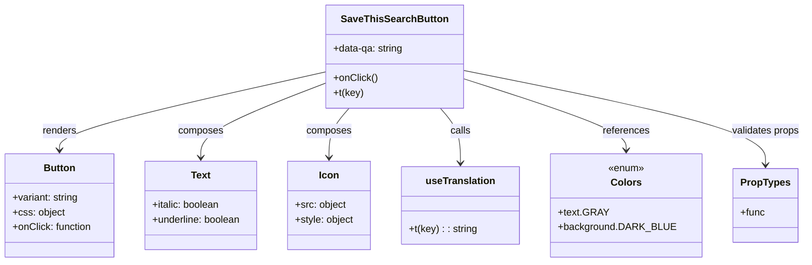

# Diagram: web/portal/src/components/saved-search/SaveThisSearchButton.js

> Auto-generated by Obscura crawlers

## Mermaid

### SVG

<svg id="container" width="1293.88671875" xmlns="http://www.w3.org/2000/svg" class="classDiagram" height="426" viewBox="0 0 1293.88671875 426" role="graphics-document document" aria-roledescription="class"><g><defs><marker id="container_class-aggregationStart" class="marker aggregation class" refX="18" refY="7" markerWidth="190" markerHeight="240" orient="auto"><path d="M 18,7 L9,13 L1,7 L9,1 Z"></path></marker></defs><defs><marker id="container_class-aggregationEnd" class="marker aggregation class" refX="1" refY="7" markerWidth="20" markerHeight="28" orient="auto"><path d="M 18,7 L9,13 L1,7 L9,1 Z"></path></marker></defs><defs><marker id="container_class-extensionStart" class="marker extension class" refX="18" refY="7" markerWidth="190" markerHeight="240" orient="auto"><path d="M 1,7 L18,13 V 1 Z"></path></marker></defs><defs><marker id="container_class-extensionEnd" class="marker extension class" refX="1" refY="7" markerWidth="20" markerHeight="28" orient="auto"><path d="M 1,1 V 13 L18,7 Z"></path></marker></defs><defs><marker id="container_class-compositionStart" class="marker composition class" refX="18" refY="7" markerWidth="190" markerHeight="240" orient="auto"><path d="M 18,7 L9,13 L1,7 L9,1 Z"></path></marker></defs><defs><marker id="container_class-compositionEnd" class="marker composition class" refX="1" refY="7" markerWidth="20" markerHeight="28" orient="auto"><path d="M 18,7 L9,13 L1,7 L9,1 Z"></path></marker></defs><defs><marker id="container_class-dependencyStart" class="marker dependency class" refX="6" refY="7" markerWidth="190" markerHeight="240" orient="auto"><path d="M 5,7 L9,13 L1,7 L9,1 Z"></path></marker></defs><defs><marker id="container_class-dependencyEnd" class="marker dependency class" refX="13" refY="7" markerWidth="20" markerHeight="28" orient="auto"><path d="M 18,7 L9,13 L14,7 L9,1 Z"></path></marker></defs><defs><marker id="container_class-lollipopStart" class="marker lollipop class" refX="13" refY="7" markerWidth="190" markerHeight="240" orient="auto"><circle stroke="black" fill="transparent" cx="7" cy="7" r="6"></circle></marker></defs><defs><marker id="container_class-lollipopEnd" class="marker lollipop class" refX="1" refY="7" markerWidth="190" markerHeight="240" orient="auto"><circle stroke="black" fill="transparent" cx="7" cy="7" r="6"></circle></marker></defs><g class="root"><g class="clusters"></g><g class="edgePaths"><path d="M534.77,116.375L461.828,132.479C388.887,148.583,243.004,180.792,170.063,202.062C97.121,223.333,97.121,233.667,97.121,238.833L97.121,244" id="id_SaveThisSearchButton_Button_1" class="edge-thickness-normal edge-pattern-solid relation" style=";;;" data-edge="true" data-et="edge" data-id="id_SaveThisSearchButton_Button_1" data-points="W3sieCI6NTM0Ljc2OTUzMTI1LCJ5IjoxMTYuMzc0OTAxMTA1NDgwMzZ9LHsieCI6OTcuMTIxMDkzNzUsInkiOjIxM30seyJ4Ijo5Ny4xMjEwOTM3NSwieSI6MjUwfV0=" marker-end="url(#container_class-dependencyEnd)"></path><path d="M534.77,134.239L500.46,147.366C466.15,160.493,397.53,186.746,363.22,207.04C328.91,227.333,328.91,241.667,328.91,248.833L328.91,256" id="id_SaveThisSearchButton_Text_2" class="edge-thickness-normal edge-pattern-solid relation" style=";;;" data-edge="true" data-et="edge" data-id="id_SaveThisSearchButton_Text_2" data-points="W3sieCI6NTM0Ljc2OTUzMTI1LCJ5IjoxMzQuMjM5MzMxNTQ2NTA4OX0seyJ4IjozMjguOTEwMTU2MjUsInkiOjIxM30seyJ4IjozMjguOTEwMTU2MjUsInkiOjI2Mn1d" marker-end="url(#container_class-dependencyEnd)"></path><path d="M571.593,176L566.192,182.167C560.79,188.333,549.987,200.667,544.585,214C539.184,227.333,539.184,241.667,539.184,248.833L539.184,256" id="id_SaveThisSearchButton_Icon_3" class="edge-thickness-normal edge-pattern-solid relation" style=";;;" data-edge="true" data-et="edge" data-id="id_SaveThisSearchButton_Icon_3" data-points="W3sieCI6NTcxLjU5MzIzMzQ3MTA3NDQsInkiOjE3Nn0seyJ4Ijo1MzkuMTgzNTkzNzUsInkiOjIxM30seyJ4Ijo1MzkuMTgzNTkzNzUsInkiOjI2Mn1d" marker-end="url(#container_class-dependencyEnd)"></path><path d="M718.751,176L724.152,182.167C729.554,188.333,740.357,200.667,745.759,215.5C751.16,230.333,751.16,247.667,751.16,256.333L751.16,265" id="id_SaveThisSearchButton_useTranslation_4" class="edge-thickness-normal edge-pattern-solid relation" style=";;;" data-edge="true" data-et="edge" data-id="id_SaveThisSearchButton_useTranslation_4" data-points="W3sieCI6NzE4Ljc1MDUxNjUyODkyNTYsInkiOjE3Nn0seyJ4Ijo3NTEuMTYwMTU2MjUsInkiOjIxM30seyJ4Ijo3NTEuMTYwMTU2MjUsInkiOjI3MX1d" marker-end="url(#container_class-dependencyEnd)"></path><path d="M755.574,128.367L798.395,142.473C841.216,156.578,926.858,184.789,969.679,204.061C1012.5,223.333,1012.5,233.667,1012.5,238.833L1012.5,244" id="id_SaveThisSearchButton_Colors_5" class="edge-thickness-normal edge-pattern-solid relation" style=";;;" data-edge="true" data-et="edge" data-id="id_SaveThisSearchButton_Colors_5" data-points="W3sieCI6NzU1LjU3NDIxODc1LCJ5IjoxMjguMzY3MTY3ODkzMTQ3M30seyJ4IjoxMDEyLjUsInkiOjIxM30seyJ4IjoxMDEyLjUsInkiOjI1MH1d" marker-end="url(#container_class-dependencyEnd)"></path><path d="M755.574,114.829L834.699,131.191C913.824,147.553,1072.074,180.276,1151.199,205.805C1230.324,231.333,1230.324,249.667,1230.324,258.833L1230.324,268" id="id_SaveThisSearchButton_PropTypes_6" class="edge-thickness-normal edge-pattern-solid relation" style=";;;" data-edge="true" data-et="edge" data-id="id_SaveThisSearchButton_PropTypes_6" data-points="W3sieCI6NzU1LjU3NDIxODc1LCJ5IjoxMTQuODI5NDExNDExMjkxMTN9LHsieCI6MTIzMC4zMjQyMTg3NSwieSI6MjEzfSx7IngiOjEyMzAuMzI0MjE4NzUsInkiOjI3NH1d" marker-end="url(#container_class-dependencyEnd)"></path></g><g class="edgeLabels"><g class="edgeLabel" transform="translate(97.12109375, 213)"><g class="label" data-id="id_SaveThisSearchButton_Button_1" transform="translate(-27.75, -12)"><foreignObject width="55.5" height="24">

renders

</foreignObject></g></g><g class="edgeLabel" transform="translate(328.91015625, 213)"><g class="label" data-id="id_SaveThisSearchButton_Text_2" transform="translate(-36.453125, -12)"><foreignObject width="72.90625" height="24">

composes

</foreignObject></g></g><g class="edgeLabel" transform="translate(539.18359375, 213)"><g class="label" data-id="id_SaveThisSearchButton_Icon_3" transform="translate(-36.453125, -12)"><foreignObject width="72.90625" height="24">

composes

</foreignObject></g></g><g class="edgeLabel" transform="translate(751.16015625, 213)"><g class="label" data-id="id_SaveThisSearchButton_useTranslation_4" transform="translate(-16.4453125, -12)"><foreignObject width="32.890625" height="24">

calls

</foreignObject></g></g><g class="edgeLabel" transform="translate(1012.5, 213)"><g class="label" data-id="id_SaveThisSearchButton_Colors_5" transform="translate(-37.828125, -12)"><foreignObject width="75.65625" height="24">

references

</foreignObject></g></g><g class="edgeLabel" transform="translate(1230.32421875, 213)"><g class="label" data-id="id_SaveThisSearchButton_PropTypes_6" transform="translate(-55.5625, -12)"><foreignObject width="111.125" height="24">

validates props

</foreignObject></g></g></g><g class="nodes"><g class="node default" id="classId-SaveThisSearchButton-0" transform="translate(645.171875, 92)"><g class="basic label-container"><path d="M-110.40234375 -84 L110.40234375 -84 L110.40234375 84 L-110.40234375 84" stroke="none" stroke-width="0" fill="#ECECFF" style=""></path><path d="M-110.40234375 -84 C-65.12806883741476 -84, -19.853793924829517 -84, 110.40234375 -84 M-110.40234375 -84 C-28.022031990383553 -84, 54.358279769232894 -84, 110.40234375 -84 M110.40234375 -84 C110.40234375 -31.765562516034407, 110.40234375 20.468874967931185, 110.40234375 84 M110.40234375 -84 C110.40234375 -41.996830302672336, 110.40234375 0.006339394655327624, 110.40234375 84 M110.40234375 84 C63.67982645111407 84, 16.957309152228135 84, -110.40234375 84 M110.40234375 84 C31.735877302162393 84, -46.930589145675214 84, -110.40234375 84 M-110.40234375 84 C-110.40234375 28.281185561547495, -110.40234375 -27.43762887690501, -110.40234375 -84 M-110.40234375 84 C-110.40234375 35.97104334586226, -110.40234375 -12.057913308275474, -110.40234375 -84" stroke="#9370DB" stroke-width="1.3" fill="none" stroke-dasharray="0 0" style=""></path></g><g class="annotation-group text" transform="translate(0, -60)"></g><g class="label-group text" transform="translate(-81.8984375, -60)"><g class="label" style="font-weight: bolder" transform="translate(0,-12)"><foreignObject width="163.796875" height="24">

SaveThisSearchButton

</foreignObject></g></g><g class="members-group text" transform="translate(-98.40234375, -12)"><g class="label" style="" transform="translate(0,-12)"><foreignObject width="114.90625" height="24">

+data-qa: string

</foreignObject></g></g><g class="methods-group text" transform="translate(-98.40234375, 36)"><g class="label" style="" transform="translate(0,-12)"><foreignObject width="70.921875" height="24">

+onClick()

</foreignObject></g><g class="label" style="" transform="translate(0,12)"><foreignObject width="48.625" height="24">

+t(key)

</foreignObject></g></g><g class="divider" style=""><path d="M-110.40234375 -36 C-63.333121683240996 -36, -16.263899616481993 -36, 110.40234375 -36 M-110.40234375 -36 C-24.949091757137793 -36, 60.50416023572441 -36, 110.40234375 -36" stroke="#9370DB" stroke-width="1.3" fill="none" stroke-dasharray="0 0" style=""></path></g><g class="divider" style=""><path d="M-110.40234375 12 C-24.083674869054747 12, 62.23499401189051 12, 110.40234375 12 M-110.40234375 12 C-31.788866442393314 12, 46.82461086521337 12, 110.40234375 12" stroke="#9370DB" stroke-width="1.3" fill="none" stroke-dasharray="0 0" style=""></path></g></g><g class="node default" id="classId-Button-1" transform="translate(97.12109375, 334)"><g class="basic label-container"><path d="M-89.12109375 -84 L89.12109375 -84 L89.12109375 84 L-89.12109375 84" stroke="none" stroke-width="0" fill="#ECECFF" style=""></path><path d="M-89.12109375 -84 C-42.315083769146234 -84, 4.4909262117075315 -84, 89.12109375 -84 M-89.12109375 -84 C-30.785770165065507 -84, 27.549553419868985 -84, 89.12109375 -84 M89.12109375 -84 C89.12109375 -24.867519721036658, 89.12109375 34.264960557926685, 89.12109375 84 M89.12109375 -84 C89.12109375 -47.172989967730715, 89.12109375 -10.345979935461429, 89.12109375 84 M89.12109375 84 C51.35800885972672 84, 13.594923969453447 84, -89.12109375 84 M89.12109375 84 C28.678367854515784 84, -31.764358040968432 84, -89.12109375 84 M-89.12109375 84 C-89.12109375 36.98503235337411, -89.12109375 -10.029935293251782, -89.12109375 -84 M-89.12109375 84 C-89.12109375 50.308169400909286, -89.12109375 16.61633880181857, -89.12109375 -84" stroke="#9370DB" stroke-width="1.3" fill="none" stroke-dasharray="0 0" style=""></path></g><g class="annotation-group text" transform="translate(0, -60)"></g><g class="label-group text" transform="translate(-24.8359375, -60)"><g class="label" style="font-weight: bolder" transform="translate(0,-12)"><foreignObject width="49.671875" height="24">

Button

</foreignObject></g></g><g class="members-group text" transform="translate(-77.12109375, -12)"><g class="label" style="" transform="translate(0,-12)"><foreignObject width="108.46875" height="24">

+variant: string

</foreignObject></g><g class="label" style="" transform="translate(0,12)"><foreignObject width="83.96875" height="24">

+css: object

</foreignObject></g><g class="label" style="" transform="translate(0,36)"><foreignObject width="129.40625" height="24">

+onClick: function

</foreignObject></g></g><g class="methods-group text" transform="translate(-77.12109375, 84)"></g><g class="divider" style=""><path d="M-89.12109375 -36 C-22.480609772110654 -36, 44.15987420577869 -36, 89.12109375 -36 M-89.12109375 -36 C-21.347575412559053 -36, 46.425942924881895 -36, 89.12109375 -36" stroke="#9370DB" stroke-width="1.3" fill="none" stroke-dasharray="0 0" style=""></path></g><g class="divider" style=""><path d="M-89.12109375 60 C-32.64618557339776 60, 23.828722603204483 60, 89.12109375 60 M-89.12109375 60 C-23.559873982192187 60, 42.00134578561563 60, 89.12109375 60" stroke="#9370DB" stroke-width="1.3" fill="none" stroke-dasharray="0 0" style=""></path></g></g><g class="node default" id="classId-Text-2" transform="translate(328.91015625, 334)"><g class="basic label-container"><path d="M-92.66796875 -72 L92.66796875 -72 L92.66796875 72 L-92.66796875 72" stroke="none" stroke-width="0" fill="#ECECFF" style=""></path><path d="M-92.66796875 -72 C-35.30297995887082 -72, 22.062008832258357 -72, 92.66796875 -72 M-92.66796875 -72 C-49.663491045132794 -72, -6.659013340265588 -72, 92.66796875 -72 M92.66796875 -72 C92.66796875 -16.755735285600224, 92.66796875 38.48852942879955, 92.66796875 72 M92.66796875 -72 C92.66796875 -16.667460204715994, 92.66796875 38.66507959056801, 92.66796875 72 M92.66796875 72 C30.24322274842232 72, -32.18152325315536 72, -92.66796875 72 M92.66796875 72 C49.101941876407565 72, 5.5359150028151305 72, -92.66796875 72 M-92.66796875 72 C-92.66796875 40.81299629170746, -92.66796875 9.625992583414913, -92.66796875 -72 M-92.66796875 72 C-92.66796875 21.035502704055077, -92.66796875 -29.928994591889847, -92.66796875 -72" stroke="#9370DB" stroke-width="1.3" fill="none" stroke-dasharray="0 0" style=""></path></g><g class="annotation-group text" transform="translate(0, -48)"></g><g class="label-group text" transform="translate(-15.3828125, -48)"><g class="label" style="font-weight: bolder" transform="translate(0,-12)"><foreignObject width="30.765625" height="24">

Text

</foreignObject></g></g><g class="members-group text" transform="translate(-80.66796875, 0)"><g class="label" style="" transform="translate(0,-12)"><foreignObject width="111.140625" height="24">

+italic: boolean

</foreignObject></g><g class="label" style="" transform="translate(0,12)"><foreignObject width="145.953125" height="24">

+underline: boolean

</foreignObject></g></g><g class="methods-group text" transform="translate(-80.66796875, 72)"></g><g class="divider" style=""><path d="M-92.66796875 -24 C-49.49385120556576 -24, -6.319733661131522 -24, 92.66796875 -24 M-92.66796875 -24 C-25.157620257673344 -24, 42.35272823465331 -24, 92.66796875 -24" stroke="#9370DB" stroke-width="1.3" fill="none" stroke-dasharray="0 0" style=""></path></g><g class="divider" style=""><path d="M-92.66796875 48 C-19.816677479895915 48, 53.03461379020817 48, 92.66796875 48 M-92.66796875 48 C-45.657773619601436 48, 1.3524215107971287 48, 92.66796875 48" stroke="#9370DB" stroke-width="1.3" fill="none" stroke-dasharray="0 0" style=""></path></g></g><g class="node default" id="classId-Icon-3" transform="translate(539.18359375, 334)"><g class="basic label-container"><path d="M-67.60546875 -72 L67.60546875 -72 L67.60546875 72 L-67.60546875 72" stroke="none" stroke-width="0" fill="#ECECFF" style=""></path><path d="M-67.60546875 -72 C-25.83497041435345 -72, 15.935527921293101 -72, 67.60546875 -72 M-67.60546875 -72 C-35.298786773838046 -72, -2.9921047976760917 -72, 67.60546875 -72 M67.60546875 -72 C67.60546875 -20.081630634502588, 67.60546875 31.836738730994824, 67.60546875 72 M67.60546875 -72 C67.60546875 -23.704118799657593, 67.60546875 24.591762400684814, 67.60546875 72 M67.60546875 72 C30.241611746200434 72, -7.122245257599133 72, -67.60546875 72 M67.60546875 72 C36.50419292822758 72, 5.402917106455156 72, -67.60546875 72 M-67.60546875 72 C-67.60546875 41.66470372118552, -67.60546875 11.329407442371036, -67.60546875 -72 M-67.60546875 72 C-67.60546875 33.098164740858834, -67.60546875 -5.803670518282331, -67.60546875 -72" stroke="#9370DB" stroke-width="1.3" fill="none" stroke-dasharray="0 0" style=""></path></g><g class="annotation-group text" transform="translate(0, -48)"></g><g class="label-group text" transform="translate(-15.3046875, -48)"><g class="label" style="font-weight: bolder" transform="translate(0,-12)"><foreignObject width="30.609375" height="24">

Icon

</foreignObject></g></g><g class="members-group text" transform="translate(-55.60546875, 0)"><g class="label" style="" transform="translate(0,-12)"><foreignObject width="82.421875" height="24">

+src: object

</foreignObject></g><g class="label" style="" transform="translate(0,12)"><foreignObject width="95.90625" height="24">

+style: object

</foreignObject></g></g><g class="methods-group text" transform="translate(-55.60546875, 72)"></g><g class="divider" style=""><path d="M-67.60546875 -24 C-30.126155969657717 -24, 7.353156810684567 -24, 67.60546875 -24 M-67.60546875 -24 C-31.320162112471962 -24, 4.9651445250560755 -24, 67.60546875 -24" stroke="#9370DB" stroke-width="1.3" fill="none" stroke-dasharray="0 0" style=""></path></g><g class="divider" style=""><path d="M-67.60546875 48 C-34.79391147481578 48, -1.9823541996315583 48, 67.60546875 48 M-67.60546875 48 C-26.090370266637414 48, 15.424728216725171 48, 67.60546875 48" stroke="#9370DB" stroke-width="1.3" fill="none" stroke-dasharray="0 0" style=""></path></g></g><g class="node default" id="classId-Colors-4" transform="translate(1012.5, 334)"><g class="basic label-container"><path d="M-116.96875 -84 L116.96875 -84 L116.96875 84 L-116.96875 84" stroke="none" stroke-width="0" fill="#ECECFF" style=""></path><path d="M-116.96875 -84 C-30.75340604863996 -84, 55.46193790272008 -84, 116.96875 -84 M-116.96875 -84 C-34.34406293738397 -84, 48.280624125232066 -84, 116.96875 -84 M116.96875 -84 C116.96875 -37.123475838012645, 116.96875 9.75304832397471, 116.96875 84 M116.96875 -84 C116.96875 -32.604206998211566, 116.96875 18.791586003576867, 116.96875 84 M116.96875 84 C35.38426973742958 84, -46.20021052514085 84, -116.96875 84 M116.96875 84 C36.323867314433016 84, -44.32101537113397 84, -116.96875 84 M-116.96875 84 C-116.96875 27.86871389413946, -116.96875 -28.26257221172108, -116.96875 -84 M-116.96875 84 C-116.96875 22.005975798770372, -116.96875 -39.988048402459256, -116.96875 -84" stroke="#9370DB" stroke-width="1.3" fill="none" stroke-dasharray="0 0" style=""></path></g><g class="annotation-group text" transform="translate(-29.53125, -60)"><g class="label" style="" transform="translate(0,-12)"><foreignObject width="59.0625" height="24">

«enum»

</foreignObject></g></g><g class="label-group text" transform="translate(-23.1015625, -36)"><g class="label" style="font-weight: bolder" transform="translate(0,-12)"><foreignObject width="46.203125" height="24">

Colors

</foreignObject></g></g><g class="members-group text" transform="translate(-104.96875, 12)"><g class="label" style="" transform="translate(0,-12)"><foreignObject width="76.109375" height="24">

+text.GRAY

</foreignObject></g><g class="label" style="" transform="translate(0,12)"><foreignObject width="180.40625" height="24">

+background.DARK_BLUE

</foreignObject></g></g><g class="methods-group text" transform="translate(-104.96875, 84)"></g><g class="divider" style=""><path d="M-116.96875 -12 C-47.8210250391968 -12, 21.326699921606405 -12, 116.96875 -12 M-116.96875 -12 C-47.2652479451034 -12, 22.438254109793206 -12, 116.96875 -12" stroke="#9370DB" stroke-width="1.3" fill="none" stroke-dasharray="0 0" style=""></path></g><g class="divider" style=""><path d="M-116.96875 60 C-52.34365621683013 60, 12.281437566339747 60, 116.96875 60 M-116.96875 60 C-63.07947041786652 60, -9.190190835733034 60, 116.96875 60" stroke="#9370DB" stroke-width="1.3" fill="none" stroke-dasharray="0 0" style=""></path></g></g><g class="node default" id="classId-useTranslation-5" transform="translate(751.16015625, 334)"><g class="basic label-container"><path d="M-94.37109375 -63 L94.37109375 -63 L94.37109375 63 L-94.37109375 63" stroke="none" stroke-width="0" fill="#ECECFF" style=""></path><path d="M-94.37109375 -63 C-35.882769400923856 -63, 22.60555494815229 -63, 94.37109375 -63 M-94.37109375 -63 C-52.508697053873824 -63, -10.646300357747648 -63, 94.37109375 -63 M94.37109375 -63 C94.37109375 -25.757701239302108, 94.37109375 11.484597521395784, 94.37109375 63 M94.37109375 -63 C94.37109375 -17.358761218078833, 94.37109375 28.282477563842335, 94.37109375 63 M94.37109375 63 C42.18794277567598 63, -9.995208198648044 63, -94.37109375 63 M94.37109375 63 C55.27873238977989 63, 16.18637102955978 63, -94.37109375 63 M-94.37109375 63 C-94.37109375 29.402951243251806, -94.37109375 -4.194097513496388, -94.37109375 -63 M-94.37109375 63 C-94.37109375 16.766445407413734, -94.37109375 -29.467109185172532, -94.37109375 -63" stroke="#9370DB" stroke-width="1.3" fill="none" stroke-dasharray="0 0" style=""></path></g><g class="annotation-group text" transform="translate(0, -39)"></g><g class="label-group text" transform="translate(-54.0859375, -39)"><g class="label" style="font-weight: bolder" transform="translate(0,-12)"><foreignObject width="108.171875" height="24">

useTranslation

</foreignObject></g></g><g class="members-group text" transform="translate(-82.37109375, 9)"></g><g class="methods-group text" transform="translate(-82.37109375, 39)"><g class="label" style="" transform="translate(0,-12)"><foreignObject width="110.65625" height="24">

+t(key) : : string

</foreignObject></g></g><g class="divider" style=""><path d="M-94.37109375 -15 C-38.064082645125936 -15, 18.24292845974813 -15, 94.37109375 -15 M-94.37109375 -15 C-36.70181756202498 -15, 20.967458625950044 -15, 94.37109375 -15" stroke="#9370DB" stroke-width="1.3" fill="none" stroke-dasharray="0 0" style=""></path></g><g class="divider" style=""><path d="M-94.37109375 9 C-47.78278822069603 9, -1.1944826913920537 9, 94.37109375 9 M-94.37109375 9 C-37.44244682252013 9, 19.486200104959735 9, 94.37109375 9" stroke="#9370DB" stroke-width="1.3" fill="none" stroke-dasharray="0 0" style=""></path></g></g><g class="node default" id="classId-PropTypes-6" transform="translate(1230.32421875, 334)"><g class="basic label-container"><path d="M-50.85546875 -60 L50.85546875 -60 L50.85546875 60 L-50.85546875 60" stroke="none" stroke-width="0" fill="#ECECFF" style=""></path><path d="M-50.85546875 -60 C-18.862857301121565 -60, 13.12975414775687 -60, 50.85546875 -60 M-50.85546875 -60 C-16.76271429199413 -60, 17.33004016601174 -60, 50.85546875 -60 M50.85546875 -60 C50.85546875 -24.34379288124601, 50.85546875 11.31241423750798, 50.85546875 60 M50.85546875 -60 C50.85546875 -32.975457177349114, 50.85546875 -5.95091435469822, 50.85546875 60 M50.85546875 60 C17.249722896476506 60, -16.35602295704699 60, -50.85546875 60 M50.85546875 60 C23.74146196580708 60, -3.3725448183858404 60, -50.85546875 60 M-50.85546875 60 C-50.85546875 22.9287850765716, -50.85546875 -14.1424298468568, -50.85546875 -60 M-50.85546875 60 C-50.85546875 30.599961225755585, -50.85546875 1.1999224515111706, -50.85546875 -60" stroke="#9370DB" stroke-width="1.3" fill="none" stroke-dasharray="0 0" style=""></path></g><g class="annotation-group text" transform="translate(0, -36)"></g><g class="label-group text" transform="translate(-38.2578125, -36)"><g class="label" style="font-weight: bolder" transform="translate(0,-12)"><foreignObject width="76.515625" height="24">

PropTypes

</foreignObject></g></g><g class="members-group text" transform="translate(-38.85546875, 12)"><g class="label" style="" transform="translate(0,-12)"><foreignObject width="39.453125" height="24">

+func

</foreignObject></g></g><g class="methods-group text" transform="translate(-38.85546875, 60)"></g><g class="divider" style=""><path d="M-50.85546875 -12 C-12.393563891904087 -12, 26.068340966191826 -12, 50.85546875 -12 M-50.85546875 -12 C-26.008324049234687 -12, -1.1611793484693749 -12, 50.85546875 -12" stroke="#9370DB" stroke-width="1.3" fill="none" stroke-dasharray="0 0" style=""></path></g><g class="divider" style=""><path d="M-50.85546875 36 C-22.912533365632726 36, 5.030402018734549 36, 50.85546875 36 M-50.85546875 36 C-28.03399420376322 36, -5.2125196575264425 36, 50.85546875 36" stroke="#9370DB" stroke-width="1.3" fill="none" stroke-dasharray="0 0" style=""></path></g></g></g></g></g></svg>
