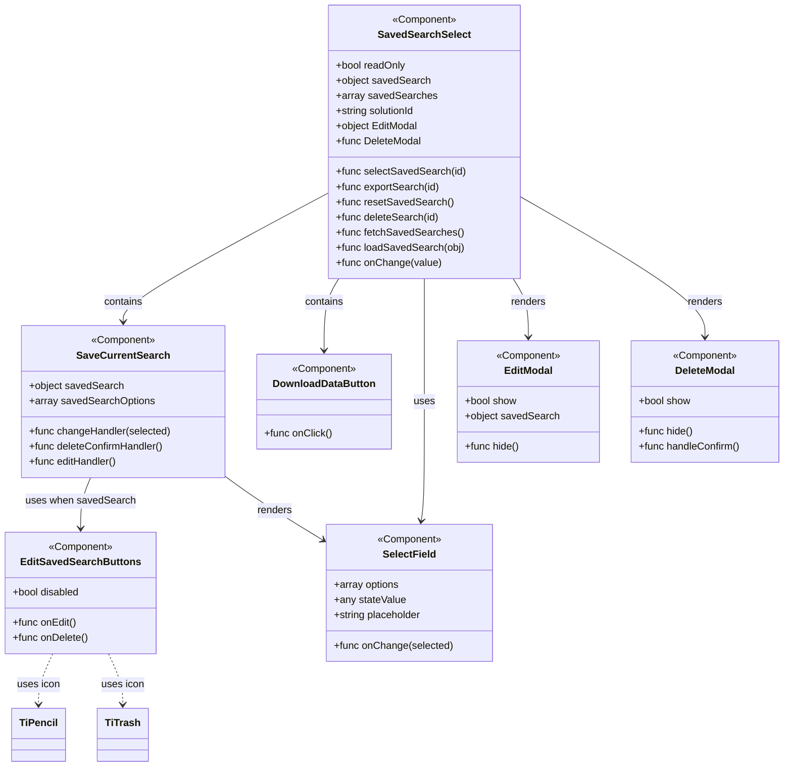

# Diagram: web/portal/src/components/saved-search/SavedSearchSelect.js


> Auto-generated by Obscura crawlers

## Diagram 1



> SVG rendering failed for this diagram.

## Diagram 2

```mermaid
flowchart LR
    A[App mounts] --> B[SavedSearchSelect]
    B -->|calls on mount| C[fetchSavedSearches()]
    C --> D[populate savedSearches]
    D --> B
    B --> E{readOnly?}
    E -- false --> F[Show DownloadDataButton]
    F --> G[User clicks export] --> H[exportSearch(solutionId)]
    E -- false --> I[Show SaveCurrentSearch]
    I --> J{savedSearch exists?}
    J -- no --> K[Show Save Current Search Button]
    K --> L[User clicks -> editHandler -> show EditModal]
    J -- yes --> M[Show EditSavedSearchButtons]
    M --> N[onEdit -> show EditModal]
    M --> O[onDelete -> show DeleteModal]
    O --> P[confirmDelete -> deleteSearch(id) + resetSavedSearch()]
    I --> Q[SelectField]
    Q --> R[onChange -> selectedSavedSearch -> selectSavedSearch(obj)]
    B --> S[EditModal hide -> setShowEditSearchModal(false)]
    B --> T[DeleteModal hide -> setShowDeleteSearchModal(false)]
```

> SVG rendering failed for this diagram.
