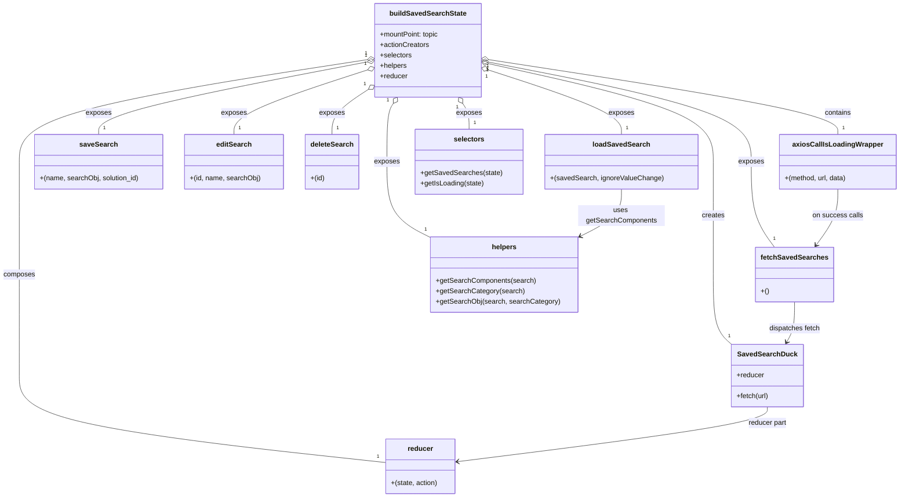
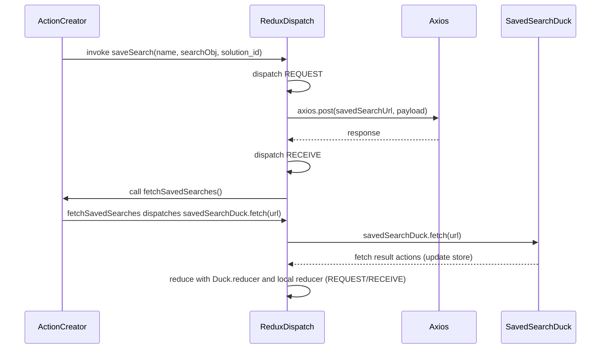

# Diagram: web/portal/src/components/saved-search/SavedSearchStateBuilder.js

> Auto-generated by Obscura crawlers

## Diagram 1

### SVG

<svg id="container" width="2042.70703125" xmlns="http://www.w3.org/2000/svg" class="classDiagram" height="1122" viewBox="0 0 2042.70703125 1122" role="graphics-document document" aria-roledescription="class"><g><defs><marker id="container_class-aggregationStart" class="marker aggregation class" refX="18" refY="7" markerWidth="190" markerHeight="240" orient="auto"><path d="M 18,7 L9,13 L1,7 L9,1 Z"></path></marker></defs><defs><marker id="container_class-aggregationEnd" class="marker aggregation class" refX="1" refY="7" markerWidth="20" markerHeight="28" orient="auto"><path d="M 18,7 L9,13 L1,7 L9,1 Z"></path></marker></defs><defs><marker id="container_class-extensionStart" class="marker extension class" refX="18" refY="7" markerWidth="190" markerHeight="240" orient="auto"><path d="M 1,7 L18,13 V 1 Z"></path></marker></defs><defs><marker id="container_class-extensionEnd" class="marker extension class" refX="1" refY="7" markerWidth="20" markerHeight="28" orient="auto"><path d="M 1,1 V 13 L18,7 Z"></path></marker></defs><defs><marker id="container_class-compositionStart" class="marker composition class" refX="18" refY="7" markerWidth="190" markerHeight="240" orient="auto"><path d="M 18,7 L9,13 L1,7 L9,1 Z"></path></marker></defs><defs><marker id="container_class-compositionEnd" class="marker composition class" refX="1" refY="7" markerWidth="20" markerHeight="28" orient="auto"><path d="M 18,7 L9,13 L1,7 L9,1 Z"></path></marker></defs><defs><marker id="container_class-dependencyStart" class="marker dependency class" refX="6" refY="7" markerWidth="190" markerHeight="240" orient="auto"><path d="M 5,7 L9,13 L1,7 L9,1 Z"></path></marker></defs><defs><marker id="container_class-dependencyEnd" class="marker dependency class" refX="13" refY="7" markerWidth="20" markerHeight="28" orient="auto"><path d="M 18,7 L9,13 L14,7 L9,1 Z"></path></marker></defs><defs><marker id="container_class-lollipopStart" class="marker lollipop class" refX="13" refY="7" markerWidth="190" markerHeight="240" orient="auto"><circle stroke="black" fill="transparent" cx="7" cy="7" r="6"></circle></marker></defs><defs><marker id="container_class-lollipopEnd" class="marker lollipop class" refX="1" refY="7" markerWidth="190" markerHeight="240" orient="auto"><circle stroke="black" fill="transparent" cx="7" cy="7" r="6"></circle></marker></defs><g class="root"><g class="clusters"></g><g class="edgePaths"><path d="M1116.699,147.698L1200.265,166.582C1283.83,185.466,1450.962,223.233,1534.528,260.783C1618.094,298.333,1618.094,335.667,1618.094,373C1618.094,410.333,1618.094,447.667,1618.094,487C1618.094,526.333,1618.094,567.667,1618.094,609C1618.094,650.333,1618.094,691.667,1625.093,718.5C1632.092,745.333,1646.09,757.667,1653.089,763.833L1660.088,770" id="id_buildSavedSearchState_SavedSearchDuck_1" class="edge-thickness-normal edge-pattern-solid relation" style=";;;" data-edge="true" data-et="edge" data-id="id_buildSavedSearchState_SavedSearchDuck_1" data-points="W3sieCI6MTA5OS44NzMwNDY4NzUsInkiOjE0My44OTYxNzU0NDU1Mzg1Mn0seyJ4IjoxNjE4LjA5Mzc1LCJ5IjoyNjF9LHsieCI6MTYxOC4wOTM3NSwieSI6MzczfSx7IngiOjE2MTguMDkzNzUsInkiOjQ4NX0seyJ4IjoxNjE4LjA5Mzc1LCJ5Ijo2MDl9LHsieCI6MTYxOC4wOTM3NSwieSI6NzMzfSx7IngiOjE2NjAuMDg4MDMzOTczNjIzOSwieSI6NzcwfV0=" marker-start="url(#container_class-aggregationStart)"></path><path d="M1116.915,138.03L1247.619,158.525C1378.323,179.02,1639.732,220.01,1770.436,248.672C1901.141,277.333,1901.141,293.667,1901.141,301.833L1901.141,310" id="id_buildSavedSearchState_axiosCallIsLoadingWrapper_2" class="edge-thickness-normal edge-pattern-solid relation" style=";;;" data-edge="true" data-et="edge" data-id="id_buildSavedSearchState_axiosCallIsLoadingWrapper_2" data-points="W3sieCI6MTA5OS44NzMwNDY4NzUsInkiOjEzNS4zNTc0MjU3MzIxMTgxNH0seyJ4IjoxOTAxLjE0MDYyNSwieSI6MjYxfSx7IngiOjE5MDEuMTQwNjI1LCJ5IjozMTB9XQ==" marker-start="url(#container_class-aggregationStart)"></path><path d="M1116.79,144.007L1214.515,163.506C1312.241,183.004,1507.693,222.002,1605.419,260.168C1703.145,298.333,1703.145,335.667,1703.145,373C1703.145,410.333,1703.145,447.667,1711.261,476.5C1719.378,505.333,1735.612,525.667,1743.728,535.833L1751.845,546" id="id_buildSavedSearchState_fetchSavedSearches_3" class="edge-thickness-normal edge-pattern-solid relation" style=";;;" data-edge="true" data-et="edge" data-id="id_buildSavedSearchState_fetchSavedSearches_3" data-points="W3sieCI6MTA5OS44NzMwNDY4NzUsInkiOjE0MC42MzEzODQwMjY1OTYzNX0seyJ4IjoxNzAzLjE0NDUzMTI1LCJ5IjoyNjF9LHsieCI6MTcwMy4xNDQ1MzEyNSwieSI6MzczfSx7IngiOjE3MDMuMTQ0NTMxMjUsInkiOjQ4NX0seyJ4IjoxNzUxLjg0NTE4MzM0MTczNCwieSI6NTQ2fV0=" marker-start="url(#container_class-aggregationStart)"></path><path d="M836.039,143.157L734.51,162.798C632.981,182.438,429.924,221.719,328.396,249.526C226.867,277.333,226.867,293.667,226.867,301.833L226.867,310" id="id_buildSavedSearchState_saveSearch_4" class="edge-thickness-normal edge-pattern-solid relation" style=";;;" data-edge="true" data-et="edge" data-id="id_buildSavedSearchState_saveSearch_4" data-points="W3sieCI6ODUyLjk3NDYwOTM3NSwieSI6MTM5Ljg4MDk2NjA5MTkzNDU3fSx7IngiOjIyNi44NjcxODc1LCJ5IjoyNjF9LHsieCI6MjI2Ljg2NzE4NzUsInkiOjMxMH1d" marker-start="url(#container_class-aggregationStart)"></path><path d="M836.592,162.105L786.602,178.587C736.612,195.07,636.632,228.035,586.642,252.684C536.652,277.333,536.652,293.667,536.652,301.833L536.652,310" id="id_buildSavedSearchState_editSearch_5" class="edge-thickness-normal edge-pattern-solid relation" style=";;;" data-edge="true" data-et="edge" data-id="id_buildSavedSearchState_editSearch_5" data-points="W3sieCI6ODUyLjk3NDYwOTM3NSwieSI6MTU2LjcwMzI2ODI5ODk2NTY0fSx7IngiOjUzNi42NTIzNDM3NSwieSI6MjYxfSx7IngiOjUzNi42NTIzNDM3NSwieSI6MzEwfV0=" marker-start="url(#container_class-aggregationStart)"></path><path d="M838.625,207.928L825.366,216.773C812.107,225.619,785.588,243.309,772.329,260.321C759.07,277.333,759.07,293.667,759.07,301.833L759.07,310" id="id_buildSavedSearchState_deleteSearch_6" class="edge-thickness-normal edge-pattern-solid relation" style=";;;" data-edge="true" data-et="edge" data-id="id_buildSavedSearchState_deleteSearch_6" data-points="W3sieCI6ODUyLjk3NDYwOTM3NSwieSI6MTk4LjM1NDk0NDUxMTgzODk3fSx7IngiOjc1OS4wNzAzMTI1LCJ5IjoyNjF9LHsieCI6NzU5LjA3MDMxMjUsInkiOjMxMH1d" marker-start="url(#container_class-aggregationStart)"></path><path d="M1116.239,162.559L1165.509,178.965C1214.779,195.372,1313.319,228.186,1362.589,252.76C1411.859,277.333,1411.859,293.667,1411.859,301.833L1411.859,310" id="id_buildSavedSearchState_loadSavedSearch_7" class="edge-thickness-normal edge-pattern-solid relation" style=";;;" data-edge="true" data-et="edge" data-id="id_buildSavedSearchState_loadSavedSearch_7" data-points="W3sieCI6MTA5OS44NzMwNDY4NzUsInkiOjE1Ny4xMDg1NzkzMjI5NjU5N30seyJ4IjoxNDExLjg1OTM3NSwieSI6MjYxfSx7IngiOjE0MTEuODU5Mzc1LCJ5IjozMTB9XQ==" marker-start="url(#container_class-aggregationStart)"></path><path d="M897.942,238.526L895.543,242.271C893.144,246.017,888.345,253.509,885.946,275.921C883.547,298.333,883.547,335.667,883.547,373C883.547,410.333,883.547,447.667,899.867,473.994C916.188,500.322,948.828,515.644,965.148,523.305L981.469,530.966" id="id_buildSavedSearchState_helpers_8" class="edge-thickness-normal edge-pattern-solid relation" style=";;;" data-edge="true" data-et="edge" data-id="id_buildSavedSearchState_helpers_8" data-points="W3sieCI6OTA3LjI0NjUxMTMxNDY1NTIsInkiOjIyNH0seyJ4Ijo4ODMuNTQ2ODc1LCJ5IjoyNjF9LHsieCI6ODgzLjU0Njg3NSwieSI6MzczfSx7IngiOjg4My41NDY4NzUsInkiOjQ4NX0seyJ4Ijo5ODEuNDY4NzUsInkiOjUzMC45NjY0MDI0NjA2NjQ5fV0=" marker-start="url(#container_class-aggregationStart)"></path><path d="M1054.905,238.526L1057.305,242.271C1059.704,246.017,1064.502,253.509,1066.902,263.421C1069.301,273.333,1069.301,285.667,1069.301,291.833L1069.301,298" id="id_buildSavedSearchState_selectors_9" class="edge-thickness-normal edge-pattern-solid relation" style=";;;" data-edge="true" data-et="edge" data-id="id_buildSavedSearchState_selectors_9" data-points="W3sieCI6MTA0NS42MDExNDQ5MzUzNDQ4LCJ5IjoyMjR9LHsieCI6MTA2OS4zMDA3ODEyNSwieSI6MjYxfSx7IngiOjEwNjkuMzAwNzgxMjUsInkiOjI5OH1d" marker-start="url(#container_class-aggregationStart)"></path><path d="M835.93,137.859L704.017,158.382C572.104,178.906,308.279,219.953,176.366,259.143C44.453,298.333,44.453,335.667,44.453,373C44.453,410.333,44.453,447.667,44.453,487C44.453,526.333,44.453,567.667,44.453,609C44.453,650.333,44.453,691.667,44.453,730.5C44.453,769.333,44.453,805.667,44.453,842C44.453,878.333,44.453,914.667,182.892,948.038C321.331,981.408,598.21,1011.817,736.649,1027.021L875.088,1042.225" id="id_buildSavedSearchState_reducer_10" class="edge-thickness-normal edge-pattern-solid relation" style=";;;" data-edge="true" data-et="edge" data-id="id_buildSavedSearchState_reducer_10" data-points="W3sieCI6ODUyLjk3NDYwOTM3NSwieSI6MTM1LjIwNjc1OTAzMDg2NzQ2fSx7IngiOjQ0LjQ1MzEyNSwieSI6MjYxfSx7IngiOjQ0LjQ1MzEyNSwieSI6MzczfSx7IngiOjQ0LjQ1MzEyNSwieSI6NDg1fSx7IngiOjQ0LjQ1MzEyNSwieSI6NjA5fSx7IngiOjQ0LjQ1MzEyNSwieSI6NzMzfSx7IngiOjQ0LjQ1MzEyNSwieSI6ODQyfSx7IngiOjQ0LjQ1MzEyNSwieSI6OTUxfSx7IngiOjg3NS4wODc4OTA2MjUsInkiOjEwNDIuMjI1MDkzNDY5ODcxOH1d" marker-start="url(#container_class-aggregationStart)"></path><path d="M1741.807,914L1741.807,920.167C1741.807,926.333,1741.807,938.667,1624.978,959.681C1508.15,980.696,1274.493,1010.393,1157.665,1025.241L1040.837,1040.089" id="id_SavedSearchDuck_reducer_11" class="edge-thickness-normal edge-pattern-solid relation" style=";;;" data-edge="true" data-et="edge" data-id="id_SavedSearchDuck_reducer_11" data-points="W3sieCI6MTc0MS44MDY2NDA2MjUsInkiOjkxNH0seyJ4IjoxNzQxLjgwNjY0MDYyNSwieSI6OTUxfSx7IngiOjEwMzQuODg0NzY1NjI1LCJ5IjoxMDQwLjg0NTQwMjI4MTczMTR9XQ==" marker-end="url(#container_class-dependencyEnd)"></path><path d="M1901.141,436L1901.141,444.167C1901.141,452.333,1901.141,468.667,1893.648,486.219C1886.155,503.77,1871.169,522.541,1863.676,531.926L1856.183,541.311" id="id_axiosCallIsLoadingWrapper_fetchSavedSearches_12" class="edge-thickness-normal edge-pattern-solid relation" style=";;;" data-edge="true" data-et="edge" data-id="id_axiosCallIsLoadingWrapper_fetchSavedSearches_12" data-points="W3sieCI6MTkwMS4xNDA2MjUsInkiOjQzNn0seyJ4IjoxOTAxLjE0MDYyNSwieSI6NDg1fSx7IngiOjE4NTIuNDM5OTcyOTA4MjY2LCJ5Ijo1NDZ9XQ==" marker-end="url(#container_class-dependencyEnd)"></path><path d="M1411.859,436L1411.859,444.167C1411.859,452.333,1411.859,468.667,1396.444,484.069C1381.029,499.472,1350.199,513.945,1334.784,521.181L1319.369,528.417" id="id_loadSavedSearch_helpers_13" class="edge-thickness-normal edge-pattern-solid relation" style=";;;" data-edge="true" data-et="edge" data-id="id_loadSavedSearch_helpers_13" data-points="W3sieCI6MTQxMS44NTkzNzUsInkiOjQzNn0seyJ4IjoxNDExLjg1OTM3NSwieSI6NDg1fSx7IngiOjEzMTMuOTM3NSwieSI6NTMwLjk2NjQwMjQ2MDY2NDl9XQ==" marker-end="url(#container_class-dependencyEnd)"></path><path d="M1802.143,672L1802.143,682.167C1802.143,692.333,1802.143,712.667,1799.213,728.125C1796.284,743.584,1790.426,754.167,1787.497,759.459L1784.567,764.751" id="id_fetchSavedSearches_SavedSearchDuck_14" class="edge-thickness-normal edge-pattern-solid relation" style=";;;" data-edge="true" data-et="edge" data-id="id_fetchSavedSearches_SavedSearchDuck_14" data-points="W3sieCI6MTgwMi4xNDI1NzgxMjUsInkiOjY3Mn0seyJ4IjoxODAyLjE0MjU3ODEyNSwieSI6NzMzfSx7IngiOjE3ODEuNjYxNTcxODE3NjYwNiwieSI6NzcwfV0=" marker-end="url(#container_class-dependencyEnd)"></path></g><g class="edgeLabels"><g class="edgeLabel" transform="translate(1618.09375, 485)"><g class="label" data-id="id_buildSavedSearchState_SavedSearchDuck_1" transform="translate(-26.171875, -12)"><foreignObject width="52.34375" height="24">

creates

</foreignObject></g></g><g class="edgeLabel" transform="translate(1901.140625, 261)"><g class="label" data-id="id_buildSavedSearchState_axiosCallIsLoadingWrapper_2" transform="translate(-30.890625, -12)"><foreignObject width="61.78125" height="24">

contains

</foreignObject></g></g><g class="edgeLabel" transform="translate(1703.14453125, 373)"><g class="label" data-id="id_buildSavedSearchState_fetchSavedSearches_3" transform="translate(-29.4296875, -12)"><foreignObject width="58.859375" height="24">

exposes

</foreignObject></g></g><g class="edgeLabel" transform="translate(226.8671875, 261)"><g class="label" data-id="id_buildSavedSearchState_saveSearch_4" transform="translate(-29.4296875, -12)"><foreignObject width="58.859375" height="24">

exposes

</foreignObject></g></g><g class="edgeLabel" transform="translate(536.65234375, 261)"><g class="label" data-id="id_buildSavedSearchState_editSearch_5" transform="translate(-29.4296875, -12)"><foreignObject width="58.859375" height="24">

exposes

</foreignObject></g></g><g class="edgeLabel" transform="translate(759.0703125, 261)"><g class="label" data-id="id_buildSavedSearchState_deleteSearch_6" transform="translate(-29.4296875, -12)"><foreignObject width="58.859375" height="24">

exposes

</foreignObject></g></g><g class="edgeLabel" transform="translate(1411.859375, 261)"><g class="label" data-id="id_buildSavedSearchState_loadSavedSearch_7" transform="translate(-29.4296875, -12)"><foreignObject width="58.859375" height="24">

exposes

</foreignObject></g></g><g class="edgeLabel" transform="translate(883.546875, 373)"><g class="label" data-id="id_buildSavedSearchState_helpers_8" transform="translate(-29.4296875, -12)"><foreignObject width="58.859375" height="24">

exposes

</foreignObject></g></g><g class="edgeLabel" transform="translate(1069.30078125, 261)"><g class="label" data-id="id_buildSavedSearchState_selectors_9" transform="translate(-29.4296875, -12)"><foreignObject width="58.859375" height="24">

exposes

</foreignObject></g></g><g class="edgeLabel" transform="translate(44.453125, 609)"><g class="label" data-id="id_buildSavedSearchState_reducer_10" transform="translate(-36.453125, -12)"><foreignObject width="72.90625" height="24">

composes

</foreignObject></g></g><g class="edgeLabel" transform="translate(1741.806640625, 951)"><g class="label" data-id="id_SavedSearchDuck_reducer_11" transform="translate(-44.8828125, -12)"><foreignObject width="89.765625" height="24">

reducer part

</foreignObject></g></g><g class="edgeLabel" transform="translate(1901.140625, 485)"><g class="label" data-id="id_axiosCallIsLoadingWrapper_fetchSavedSearches_12" transform="translate(-57.515625, -12)"><foreignObject width="115.03125" height="24">

on success calls

</foreignObject></g></g><g class="edgeLabel" transform="translate(1411.859375, 485)"><g class="label" data-id="id_loadSavedSearch_helpers_13" transform="translate(-99.875, -12)"><foreignObject width="199.75" height="24">

uses getSearchComponents

</foreignObject></g></g><g class="edgeLabel" transform="translate(1802.142578125, 733)"><g class="label" data-id="id_fetchSavedSearches_SavedSearchDuck_14" transform="translate(-59.5390625, -12)"><foreignObject width="119.078125" height="24">

dispatches fetch

</foreignObject></g></g><g class="edgeTerminals" transform="translate(1113.6364242296256, 162.38453456258074)"><g class="inner" transform="translate(0, 0)"><foreignObject style="width: 9px; height: 12px;">
1
</foreignObject></g></g><g class="edgeTerminals" transform="translate(1114.8381160697138, 152.88730737124632)"><g class="inner" transform="translate(0, 0)"><foreignObject style="width: 9px; height: 12px;">
1
</foreignObject></g></g><g class="edgeTerminals" transform="translate(1114.0997242371404, 158.7656501281731)"><g class="inner" transform="translate(0, 0)"><foreignObject style="width: 9px; height: 12px;">
1
</foreignObject></g></g><g class="edgeTerminals" transform="translate(832.9442394179904, 128.47770890820266)"><g class="inner" transform="translate(0, 0)"><foreignObject style="width: 9px; height: 12px;">
1
</foreignObject></g></g><g class="edgeTerminals" transform="translate(831.6576856455476, 147.93749946352924)"><g class="inner" transform="translate(0, 0)"><foreignObject style="width: 9px; height: 12px;">
1
</foreignObject></g></g><g class="edgeTerminals" transform="translate(830.0923645156514, 195.58856186549818)"><g class="inner" transform="translate(0, 0)"><foreignObject style="width: 9px; height: 12px;">
1
</foreignObject></g></g><g class="edgeTerminals" transform="translate(1111.7375158728562, 176.86925639605198)"><g class="inner" transform="translate(0, 0)"><foreignObject style="width: 9px; height: 12px;">
1
</foreignObject></g></g><g class="edgeTerminals" transform="translate(885.1764979247898, 230.64564140248285)"><g class="inner" transform="translate(0, 0)"><foreignObject style="width: 9px; height: 12px;">
1
</foreignObject></g></g><g class="edgeTerminals" transform="translate(1042.4091054650778, 246.82675973710883)"><g class="inner" transform="translate(0, 0)"><foreignObject style="width: 9px; height: 12px;">
1
</foreignObject></g></g><g class="edgeTerminals" transform="translate(833.3766259092573, 123.07543183787)"><g class="inner" transform="translate(0, 0)"><foreignObject style="width: 9px; height: 12px;">
1
</foreignObject></g></g><g class="edgeTerminals" transform="translate(1651.8737492528394, 742.1763638715081)"><g class="inner" transform="translate(0, 0)"></g><foreignObject style="width: 9px; height: 12px;">
1
</foreignObject></g><g class="edgeTerminals" transform="translate(1911.1406274999997, 287.50000214285717)"><g class="inner" transform="translate(0, 0)"></g><foreignObject style="width: 9px; height: 12px;">
1
</foreignObject></g><g class="edgeTerminals" transform="translate(1747.648946752052, 517.9651560721142)"><g class="inner" transform="translate(0, 0)"></g><foreignObject style="width: 9px; height: 12px;">
1
</foreignObject></g><g class="edgeTerminals" transform="translate(236.86718874999997, 287.5000010714286)"><g class="inner" transform="translate(0, 0)"></g><foreignObject style="width: 9px; height: 12px;">
1
</foreignObject></g><g class="edgeTerminals" transform="translate(546.6523418749999, 287.49999839285715)"><g class="inner" transform="translate(0, 0)"></g><foreignObject style="width: 9px; height: 12px;">
1
</foreignObject></g><g class="edgeTerminals" transform="translate(769.07031125, 287.4999989285714)"><g class="inner" transform="translate(0, 0)"></g><foreignObject style="width: 9px; height: 12px;">
1
</foreignObject></g><g class="edgeTerminals" transform="translate(1421.8593774999997, 287.50000214285717)"><g class="inner" transform="translate(0, 0)"></g><foreignObject style="width: 9px; height: 12px;">
1
</foreignObject></g><g class="edgeTerminals" transform="translate(967.0012505998884, 504.95173067730116)"><g class="inner" transform="translate(0, 0)"></g><foreignObject style="width: 9px; height: 12px;">
1
</foreignObject></g><g class="edgeTerminals" transform="translate(1079.300780625, 275.49999946428574)"><g class="inner" transform="translate(0, 0)"></g><foreignObject style="width: 9px; height: 12px;">
1
</foreignObject></g><g class="edgeTerminals" transform="translate(854.3300239691088, 1020.40428408144)"><g class="inner" transform="translate(0, 0)"></g><foreignObject style="width: 9px; height: 12px;">
1
</foreignObject></g></g><g class="nodes"><g class="node default" id="classId-buildSavedSearchState-0" transform="translate(976.423828125, 116)"><g class="basic label-container"><path d="M-123.44921875 -108 L123.44921875 -108 L123.44921875 108 L-123.44921875 108" stroke="none" stroke-width="0" fill="#ECECFF" style=""></path><path d="M-123.44921875 -108 C-66.60867240992627 -108, -9.768126069852528 -108, 123.44921875 -108 M-123.44921875 -108 C-53.12419076780513 -108, 17.200837214389736 -108, 123.44921875 -108 M123.44921875 -108 C123.44921875 -60.235135510907014, 123.44921875 -12.470271021814028, 123.44921875 108 M123.44921875 -108 C123.44921875 -58.651103835048104, 123.44921875 -9.302207670096209, 123.44921875 108 M123.44921875 108 C71.40058146631372 108, 19.35194418262745 108, -123.44921875 108 M123.44921875 108 C47.62139621168053 108, -28.206426326638933 108, -123.44921875 108 M-123.44921875 108 C-123.44921875 34.72725128898823, -123.44921875 -38.545497422023544, -123.44921875 -108 M-123.44921875 108 C-123.44921875 56.2804499739424, -123.44921875 4.560899947884806, -123.44921875 -108" stroke="#9370DB" stroke-width="1.3" fill="none" stroke-dasharray="0 0" style=""></path></g><g class="annotation-group text" transform="translate(0, -84)"></g><g class="label-group text" transform="translate(-84.8671875, -84)"><g class="label" style="font-weight: bolder" transform="translate(0,-12)"><foreignObject width="169.734375" height="24">

buildSavedSearchState

</foreignObject></g></g><g class="members-group text" transform="translate(-111.44921875, -36)"><g class="label" style="" transform="translate(0,-12)"><foreignObject width="138.03125" height="24">

+mountPoint: topic

</foreignObject></g><g class="label" style="" transform="translate(0,12)"><foreignObject width="113.078125" height="24">

+actionCreators

</foreignObject></g><g class="label" style="" transform="translate(0,36)"><foreignObject width="73.453125" height="24">

+selectors

</foreignObject></g><g class="label" style="" transform="translate(0,60)"><foreignObject width="62.40625" height="24">

+helpers

</foreignObject></g><g class="label" style="" transform="translate(0,84)"><foreignObject width="63.515625" height="24">

+reducer

</foreignObject></g></g><g class="methods-group text" transform="translate(-111.44921875, 108)"></g><g class="divider" style=""><path d="M-123.44921875 -60 C-60.9693661014684 -60, 1.510486547063195 -60, 123.44921875 -60 M-123.44921875 -60 C-34.39992080700516 -60, 54.64937713598968 -60, 123.44921875 -60" stroke="#9370DB" stroke-width="1.3" fill="none" stroke-dasharray="0 0" style=""></path></g><g class="divider" style=""><path d="M-123.44921875 84 C-26.310136645672912 84, 70.82894545865418 84, 123.44921875 84 M-123.44921875 84 C-74.04748023308605 84, -24.645741716172097 84, 123.44921875 84" stroke="#9370DB" stroke-width="1.3" fill="none" stroke-dasharray="0 0" style=""></path></g></g><g class="node default" id="classId-SavedSearchDuck-1" transform="translate(1741.806640625, 842)"><g class="basic label-container"><path d="M-81.8125 -72 L81.8125 -72 L81.8125 72 L-81.8125 72" stroke="none" stroke-width="0" fill="#ECECFF" style=""></path><path d="M-81.8125 -72 C-31.380127352366813 -72, 19.052245295266374 -72, 81.8125 -72 M-81.8125 -72 C-42.33025244154487 -72, -2.848004883089743 -72, 81.8125 -72 M81.8125 -72 C81.8125 -23.624636667253448, 81.8125 24.750726665493104, 81.8125 72 M81.8125 -72 C81.8125 -34.89687194947148, 81.8125 2.2062561010570363, 81.8125 72 M81.8125 72 C18.577722806793005 72, -44.65705438641399 72, -81.8125 72 M81.8125 72 C22.863450456533656 72, -36.08559908693269 72, -81.8125 72 M-81.8125 72 C-81.8125 32.40641416008774, -81.8125 -7.187171679824516, -81.8125 -72 M-81.8125 72 C-81.8125 43.15496219920095, -81.8125 14.309924398401897, -81.8125 -72" stroke="#9370DB" stroke-width="1.3" fill="none" stroke-dasharray="0 0" style=""></path></g><g class="annotation-group text" transform="translate(0, -48)"></g><g class="label-group text" transform="translate(-64.84375, -48)"><g class="label" style="font-weight: bolder" transform="translate(0,-12)"><foreignObject width="129.6875" height="24">

SavedSearchDuck

</foreignObject></g></g><g class="members-group text" transform="translate(-69.8125, 0)"><g class="label" style="" transform="translate(0,-12)"><foreignObject width="63.515625" height="24">

+reducer

</foreignObject></g></g><g class="methods-group text" transform="translate(-69.8125, 48)"><g class="label" style="" transform="translate(0,-12)"><foreignObject width="74.78125" height="24">

+fetch(url)

</foreignObject></g></g><g class="divider" style=""><path d="M-81.8125 -24 C-47.926243182317144 -24, -14.039986364634288 -24, 81.8125 -24 M-81.8125 -24 C-47.47128525315131 -24, -13.130070506302616 -24, 81.8125 -24" stroke="#9370DB" stroke-width="1.3" fill="none" stroke-dasharray="0 0" style=""></path></g><g class="divider" style=""><path d="M-81.8125 24 C-21.239238241627014 24, 39.33402351674597 24, 81.8125 24 M-81.8125 24 C-20.03761247337396 24, 41.73727505325208 24, 81.8125 24" stroke="#9370DB" stroke-width="1.3" fill="none" stroke-dasharray="0 0" style=""></path></g></g><g class="node default" id="classId-axiosCallIsLoadingWrapper-2" transform="translate(1901.140625, 373)"><g class="basic label-container"><path d="M-133.56640625 -63 L133.56640625 -63 L133.56640625 63 L-133.56640625 63" stroke="none" stroke-width="0" fill="#ECECFF" style=""></path><path d="M-133.56640625 -63 C-45.75889327815176 -63, 42.04861969369648 -63, 133.56640625 -63 M-133.56640625 -63 C-30.811671734056873 -63, 71.94306278188625 -63, 133.56640625 -63 M133.56640625 -63 C133.56640625 -34.47279371709638, 133.56640625 -5.945587434192767, 133.56640625 63 M133.56640625 -63 C133.56640625 -36.789772020217455, 133.56640625 -10.57954404043491, 133.56640625 63 M133.56640625 63 C77.63977425236354 63, 21.71314225472709 63, -133.56640625 63 M133.56640625 63 C39.282454119710565 63, -55.00149801057887 63, -133.56640625 63 M-133.56640625 63 C-133.56640625 16.761533582349927, -133.56640625 -29.476932835300147, -133.56640625 -63 M-133.56640625 63 C-133.56640625 15.688681051974363, -133.56640625 -31.622637896051273, -133.56640625 -63" stroke="#9370DB" stroke-width="1.3" fill="none" stroke-dasharray="0 0" style=""></path></g><g class="annotation-group text" transform="translate(0, -39)"></g><g class="label-group text" transform="translate(-99.2421875, -39)"><g class="label" style="font-weight: bolder" transform="translate(0,-12)"><foreignObject width="198.484375" height="24">

axiosCallIsLoadingWrapper

</foreignObject></g></g><g class="members-group text" transform="translate(-121.56640625, 9)"></g><g class="methods-group text" transform="translate(-121.56640625, 39)"><g class="label" style="" transform="translate(0,-12)"><foreignObject width="143.890625" height="24">

+(method, url, data)

</foreignObject></g></g><g class="divider" style=""><path d="M-133.56640625 -15 C-53.47701809208925 -15, 26.612370065821494 -15, 133.56640625 -15 M-133.56640625 -15 C-62.33709508346256 -15, 8.892216083074885 -15, 133.56640625 -15" stroke="#9370DB" stroke-width="1.3" fill="none" stroke-dasharray="0 0" style=""></path></g><g class="divider" style=""><path d="M-133.56640625 9 C-34.10181444953933 9, 65.36277735092133 9, 133.56640625 9 M-133.56640625 9 C-28.933904111773288 9, 75.69859802645342 9, 133.56640625 9" stroke="#9370DB" stroke-width="1.3" fill="none" stroke-dasharray="0 0" style=""></path></g></g><g class="node default" id="classId-fetchSavedSearches-3" transform="translate(1802.142578125, 609)"><g class="basic label-container"><path d="M-85.671875 -63 L85.671875 -63 L85.671875 63 L-85.671875 63" stroke="none" stroke-width="0" fill="#ECECFF" style=""></path><path d="M-85.671875 -63 C-19.203970099179983 -63, 47.26393480164003 -63, 85.671875 -63 M-85.671875 -63 C-22.484110289373632 -63, 40.703654421252736 -63, 85.671875 -63 M85.671875 -63 C85.671875 -20.557470810622334, 85.671875 21.885058378755332, 85.671875 63 M85.671875 -63 C85.671875 -29.502905985826736, 85.671875 3.994188028346528, 85.671875 63 M85.671875 63 C49.67265424239069 63, 13.673433484781384 63, -85.671875 63 M85.671875 63 C49.13001329950899 63, 12.588151599017976 63, -85.671875 63 M-85.671875 63 C-85.671875 36.87545012314264, -85.671875 10.750900246285283, -85.671875 -63 M-85.671875 63 C-85.671875 22.864116927269563, -85.671875 -17.271766145460873, -85.671875 -63" stroke="#9370DB" stroke-width="1.3" fill="none" stroke-dasharray="0 0" style=""></path></g><g class="annotation-group text" transform="translate(0, -39)"></g><g class="label-group text" transform="translate(-73.671875, -39)"><g class="label" style="font-weight: bolder" transform="translate(0,-12)"><foreignObject width="147.34375" height="24">

fetchSavedSearches

</foreignObject></g></g><g class="members-group text" transform="translate(-73.671875, 9)"></g><g class="methods-group text" transform="translate(-73.671875, 39)"><g class="label" style="" transform="translate(0,-12)"><foreignObject width="18.359375" height="24">

+()

</foreignObject></g></g><g class="divider" style=""><path d="M-85.671875 -15 C-30.993716027582394 -15, 23.68444294483521 -15, 85.671875 -15 M-85.671875 -15 C-30.10243173042045 -15, 25.467011539159103 -15, 85.671875 -15" stroke="#9370DB" stroke-width="1.3" fill="none" stroke-dasharray="0 0" style=""></path></g><g class="divider" style=""><path d="M-85.671875 9 C-30.773047963099728 9, 24.125779073800544 9, 85.671875 9 M-85.671875 9 C-30.509528676846998 9, 24.652817646306005 9, 85.671875 9" stroke="#9370DB" stroke-width="1.3" fill="none" stroke-dasharray="0 0" style=""></path></g></g><g class="node default" id="classId-saveSearch-4" transform="translate(226.8671875, 373)"><g class="basic label-container"><path d="M-147.4140625 -63 L147.4140625 -63 L147.4140625 63 L-147.4140625 63" stroke="none" stroke-width="0" fill="#ECECFF" style=""></path><path d="M-147.4140625 -63 C-44.949250103603234 -63, 57.51556229279353 -63, 147.4140625 -63 M-147.4140625 -63 C-73.18243184993608 -63, 1.04919880012784 -63, 147.4140625 -63 M147.4140625 -63 C147.4140625 -37.61315049944816, 147.4140625 -12.22630099889632, 147.4140625 63 M147.4140625 -63 C147.4140625 -36.04352896601104, 147.4140625 -9.087057932022084, 147.4140625 63 M147.4140625 63 C63.010796434021316 63, -21.39246963195737 63, -147.4140625 63 M147.4140625 63 C31.553620752121134 63, -84.30682099575773 63, -147.4140625 63 M-147.4140625 63 C-147.4140625 36.851059429347664, -147.4140625 10.702118858695329, -147.4140625 -63 M-147.4140625 63 C-147.4140625 15.97577474293601, -147.4140625 -31.04845051412798, -147.4140625 -63" stroke="#9370DB" stroke-width="1.3" fill="none" stroke-dasharray="0 0" style=""></path></g><g class="annotation-group text" transform="translate(0, -39)"></g><g class="label-group text" transform="translate(-41.21875, -39)"><g class="label" style="font-weight: bolder" transform="translate(0,-12)"><foreignObject width="82.4375" height="24">

saveSearch

</foreignObject></g></g><g class="members-group text" transform="translate(-135.4140625, 9)"></g><g class="methods-group text" transform="translate(-135.4140625, 39)"><g class="label" style="" transform="translate(0,-12)"><foreignObject width="229.609375" height="24">

+(name, searchObj, solution_id)

</foreignObject></g></g><g class="divider" style=""><path d="M-147.4140625 -15 C-71.66194982440983 -15, 4.090162851180338 -15, 147.4140625 -15 M-147.4140625 -15 C-73.61024374530814 -15, 0.1935750093837214 -15, 147.4140625 -15" stroke="#9370DB" stroke-width="1.3" fill="none" stroke-dasharray="0 0" style=""></path></g><g class="divider" style=""><path d="M-147.4140625 9 C-60.07828421992343 9, 27.257494060153135 9, 147.4140625 9 M-147.4140625 9 C-58.5689094957542 9, 30.276243508491604 9, 147.4140625 9" stroke="#9370DB" stroke-width="1.3" fill="none" stroke-dasharray="0 0" style=""></path></g></g><g class="node default" id="classId-editSearch-5" transform="translate(536.65234375, 373)"><g class="basic label-container"><path d="M-112.37109375 -63 L112.37109375 -63 L112.37109375 63 L-112.37109375 63" stroke="none" stroke-width="0" fill="#ECECFF" style=""></path><path d="M-112.37109375 -63 C-30.713473032235783 -63, 50.944147685528435 -63, 112.37109375 -63 M-112.37109375 -63 C-55.630090570488335 -63, 1.1109126090233303 -63, 112.37109375 -63 M112.37109375 -63 C112.37109375 -29.529196846497328, 112.37109375 3.941606307005344, 112.37109375 63 M112.37109375 -63 C112.37109375 -31.046372078407824, 112.37109375 0.9072558431843518, 112.37109375 63 M112.37109375 63 C52.51709642021019 63, -7.336900909579626 63, -112.37109375 63 M112.37109375 63 C54.906168096466004 63, -2.5587575570679917 63, -112.37109375 63 M-112.37109375 63 C-112.37109375 24.48555513791512, -112.37109375 -14.028889724169758, -112.37109375 -63 M-112.37109375 63 C-112.37109375 27.550159098076975, -112.37109375 -7.89968180384605, -112.37109375 -63" stroke="#9370DB" stroke-width="1.3" fill="none" stroke-dasharray="0 0" style=""></path></g><g class="annotation-group text" transform="translate(0, -39)"></g><g class="label-group text" transform="translate(-39.2734375, -39)"><g class="label" style="font-weight: bolder" transform="translate(0,-12)"><foreignObject width="78.546875" height="24">

editSearch

</foreignObject></g></g><g class="members-group text" transform="translate(-100.37109375, 9)"></g><g class="methods-group text" transform="translate(-100.37109375, 39)"><g class="label" style="" transform="translate(0,-12)"><foreignObject width="161.46875" height="24">

+(id, name, searchObj)

</foreignObject></g></g><g class="divider" style=""><path d="M-112.37109375 -15 C-37.90762512472864 -15, 36.55584350054272 -15, 112.37109375 -15 M-112.37109375 -15 C-42.039611636521414 -15, 28.291870476957172 -15, 112.37109375 -15" stroke="#9370DB" stroke-width="1.3" fill="none" stroke-dasharray="0 0" style=""></path></g><g class="divider" style=""><path d="M-112.37109375 9 C-54.40183093803491 9, 3.5674318739301754 9, 112.37109375 9 M-112.37109375 9 C-56.80050279421633 9, -1.2299118384326562 9, 112.37109375 9" stroke="#9370DB" stroke-width="1.3" fill="none" stroke-dasharray="0 0" style=""></path></g></g><g class="node default" id="classId-deleteSearch-6" transform="translate(759.0703125, 373)"><g class="basic label-container"><path d="M-60.046875 -63 L60.046875 -63 L60.046875 63 L-60.046875 63" stroke="none" stroke-width="0" fill="#ECECFF" style=""></path><path d="M-60.046875 -63 C-18.475390982454364 -63, 23.096093035091272 -63, 60.046875 -63 M-60.046875 -63 C-16.889066436078863 -63, 26.268742127842273 -63, 60.046875 -63 M60.046875 -63 C60.046875 -19.617216761342817, 60.046875 23.765566477314366, 60.046875 63 M60.046875 -63 C60.046875 -22.948878840669835, 60.046875 17.10224231866033, 60.046875 63 M60.046875 63 C31.78245732413548 63, 3.518039648270957 63, -60.046875 63 M60.046875 63 C15.193850120359457 63, -29.659174759281086 63, -60.046875 63 M-60.046875 63 C-60.046875 26.268982747022918, -60.046875 -10.462034505954165, -60.046875 -63 M-60.046875 63 C-60.046875 17.091712839976815, -60.046875 -28.81657432004637, -60.046875 -63" stroke="#9370DB" stroke-width="1.3" fill="none" stroke-dasharray="0 0" style=""></path></g><g class="annotation-group text" transform="translate(0, -39)"></g><g class="label-group text" transform="translate(-48.046875, -39)"><g class="label" style="font-weight: bolder" transform="translate(0,-12)"><foreignObject width="96.09375" height="24">

deleteSearch

</foreignObject></g></g><g class="members-group text" transform="translate(-48.046875, 9)"></g><g class="methods-group text" transform="translate(-48.046875, 39)"><g class="label" style="" transform="translate(0,-12)"><foreignObject width="32.4375" height="24">

+(id)

</foreignObject></g></g><g class="divider" style=""><path d="M-60.046875 -15 C-16.308174841996788 -15, 27.430525316006424 -15, 60.046875 -15 M-60.046875 -15 C-13.425621285963814 -15, 33.19563242807237 -15, 60.046875 -15" stroke="#9370DB" stroke-width="1.3" fill="none" stroke-dasharray="0 0" style=""></path></g><g class="divider" style=""><path d="M-60.046875 9 C-22.295229371388523 9, 15.456416257222955 9, 60.046875 9 M-60.046875 9 C-35.50923237628166 9, -10.971589752563311 9, 60.046875 9" stroke="#9370DB" stroke-width="1.3" fill="none" stroke-dasharray="0 0" style=""></path></g></g><g class="node default" id="classId-loadSavedSearch-7" transform="translate(1411.859375, 373)"><g class="basic label-container"><path d="M-171.234375 -63 L171.234375 -63 L171.234375 63 L-171.234375 63" stroke="none" stroke-width="0" fill="#ECECFF" style=""></path><path d="M-171.234375 -63 C-89.35801336738747 -63, -7.4816517347749425 -63, 171.234375 -63 M-171.234375 -63 C-55.91299823776973 -63, 59.408378524460545 -63, 171.234375 -63 M171.234375 -63 C171.234375 -27.490373890574553, 171.234375 8.019252218850895, 171.234375 63 M171.234375 -63 C171.234375 -30.645130551159028, 171.234375 1.7097388976819445, 171.234375 63 M171.234375 63 C40.463431700804136 63, -90.30751159839173 63, -171.234375 63 M171.234375 63 C96.01197673567475 63, 20.7895784713495 63, -171.234375 63 M-171.234375 63 C-171.234375 24.143148552043805, -171.234375 -14.713702895912391, -171.234375 -63 M-171.234375 63 C-171.234375 33.768475483518436, -171.234375 4.536950967036873, -171.234375 -63" stroke="#9370DB" stroke-width="1.3" fill="none" stroke-dasharray="0 0" style=""></path></g><g class="annotation-group text" transform="translate(0, -39)"></g><g class="label-group text" transform="translate(-62.921875, -39)"><g class="label" style="font-weight: bolder" transform="translate(0,-12)"><foreignObject width="125.84375" height="24">

loadSavedSearch

</foreignObject></g></g><g class="members-group text" transform="translate(-159.234375, 9)"></g><g class="methods-group text" transform="translate(-159.234375, 39)"><g class="label" style="" transform="translate(0,-12)"><foreignObject width="255.546875" height="24">

+(savedSearch, ignoreValueChange)

</foreignObject></g></g><g class="divider" style=""><path d="M-171.234375 -15 C-78.94076765555475 -15, 13.352839688890498 -15, 171.234375 -15 M-171.234375 -15 C-68.45708348848063 -15, 34.32020802303873 -15, 171.234375 -15" stroke="#9370DB" stroke-width="1.3" fill="none" stroke-dasharray="0 0" style=""></path></g><g class="divider" style=""><path d="M-171.234375 9 C-81.06523520348208 9, 9.10390459303585 9, 171.234375 9 M-171.234375 9 C-90.80722772678527 9, -10.380080453570542 9, 171.234375 9" stroke="#9370DB" stroke-width="1.3" fill="none" stroke-dasharray="0 0" style=""></path></g></g><g class="node default" id="classId-helpers-8" transform="translate(1147.703125, 609)"><g class="basic label-container"><path d="M-166.234375 -87 L166.234375 -87 L166.234375 87 L-166.234375 87" stroke="none" stroke-width="0" fill="#ECECFF" style=""></path><path d="M-166.234375 -87 C-77.57866930425327 -87, 11.077036391493465 -87, 166.234375 -87 M-166.234375 -87 C-91.53904095788666 -87, -16.84370691577331 -87, 166.234375 -87 M166.234375 -87 C166.234375 -29.415128392853312, 166.234375 28.169743214293376, 166.234375 87 M166.234375 -87 C166.234375 -31.46777273748554, 166.234375 24.06445452502892, 166.234375 87 M166.234375 87 C53.383979851879445 87, -59.46641529624111 87, -166.234375 87 M166.234375 87 C93.5631243761956 87, 20.891873752391206 87, -166.234375 87 M-166.234375 87 C-166.234375 31.645396927123564, -166.234375 -23.709206145752873, -166.234375 -87 M-166.234375 87 C-166.234375 37.248449093998126, -166.234375 -12.503101812003749, -166.234375 -87" stroke="#9370DB" stroke-width="1.3" fill="none" stroke-dasharray="0 0" style=""></path></g><g class="annotation-group text" transform="translate(0, -63)"></g><g class="label-group text" transform="translate(-27.578125, -63)"><g class="label" style="font-weight: bolder" transform="translate(0,-12)"><foreignObject width="55.15625" height="24">

helpers

</foreignObject></g></g><g class="members-group text" transform="translate(-154.234375, -15)"></g><g class="methods-group text" transform="translate(-154.234375, 15)"><g class="label" style="" transform="translate(0,-12)"><foreignObject width="228.34375" height="24">

+getSearchComponents(search)

</foreignObject></g><g class="label" style="" transform="translate(0,12)"><foreignObject width="200.296875" height="24">

+getSearchCategory(search)

</foreignObject></g><g class="label" style="" transform="translate(0,36)"><foreignObject width="280.890625" height="24">

+getSearchObj(search, searchCategory)

</foreignObject></g></g><g class="divider" style=""><path d="M-166.234375 -39 C-63.0092905488316 -39, 40.2157939023368 -39, 166.234375 -39 M-166.234375 -39 C-79.51785107895793 -39, 7.198672842084136 -39, 166.234375 -39" stroke="#9370DB" stroke-width="1.3" fill="none" stroke-dasharray="0 0" style=""></path></g><g class="divider" style=""><path d="M-166.234375 -15 C-66.82611011618685 -15, 32.58215476762629 -15, 166.234375 -15 M-166.234375 -15 C-76.83071353942914 -15, 12.572947921141719 -15, 166.234375 -15" stroke="#9370DB" stroke-width="1.3" fill="none" stroke-dasharray="0 0" style=""></path></g></g><g class="node default" id="classId-selectors-9" transform="translate(1069.30078125, 373)"><g class="basic label-container"><path d="M-121.32421875 -75 L121.32421875 -75 L121.32421875 75 L-121.32421875 75" stroke="none" stroke-width="0" fill="#ECECFF" style=""></path><path d="M-121.32421875 -75 C-53.2793908531914 -75, 14.765437043617197 -75, 121.32421875 -75 M-121.32421875 -75 C-31.98829198566895 -75, 57.3476347786621 -75, 121.32421875 -75 M121.32421875 -75 C121.32421875 -25.776483632820387, 121.32421875 23.447032734359226, 121.32421875 75 M121.32421875 -75 C121.32421875 -24.290152239557784, 121.32421875 26.41969552088443, 121.32421875 75 M121.32421875 75 C55.54636533559601 75, -10.231488078807985 75, -121.32421875 75 M121.32421875 75 C32.62662435522688 75, -56.07097003954624 75, -121.32421875 75 M-121.32421875 75 C-121.32421875 41.89887326459758, -121.32421875 8.797746529195166, -121.32421875 -75 M-121.32421875 75 C-121.32421875 44.26524600899641, -121.32421875 13.530492017992813, -121.32421875 -75" stroke="#9370DB" stroke-width="1.3" fill="none" stroke-dasharray="0 0" style=""></path></g><g class="annotation-group text" transform="translate(0, -51)"></g><g class="label-group text" transform="translate(-33.4609375, -51)"><g class="label" style="font-weight: bolder" transform="translate(0,-12)"><foreignObject width="66.921875" height="24">

selectors

</foreignObject></g></g><g class="members-group text" transform="translate(-109.32421875, -3)"></g><g class="methods-group text" transform="translate(-109.32421875, 27)"><g class="label" style="" transform="translate(0,-12)"><foreignObject width="185.1875" height="24">

+getSavedSearches(state)

</foreignObject></g><g class="label" style="" transform="translate(0,12)"><foreignObject width="146.4375" height="24">

+getIsLoading(state)

</foreignObject></g></g><g class="divider" style=""><path d="M-121.32421875 -27 C-40.419811627826135 -27, 40.48459549434773 -27, 121.32421875 -27 M-121.32421875 -27 C-68.55268732262539 -27, -15.78115589525079 -27, 121.32421875 -27" stroke="#9370DB" stroke-width="1.3" fill="none" stroke-dasharray="0 0" style=""></path></g><g class="divider" style=""><path d="M-121.32421875 -3 C-28.53638872919396 -3, 64.25144129161208 -3, 121.32421875 -3 M-121.32421875 -3 C-62.004206692412566 -3, -2.6841946348251327 -3, 121.32421875 -3" stroke="#9370DB" stroke-width="1.3" fill="none" stroke-dasharray="0 0" style=""></path></g></g><g class="node default" id="classId-reducer-10" transform="translate(954.986328125, 1051)"><g class="basic label-container"><path d="M-79.8984375 -63 L79.8984375 -63 L79.8984375 63 L-79.8984375 63" stroke="none" stroke-width="0" fill="#ECECFF" style=""></path><path d="M-79.8984375 -63 C-46.042808726117194 -63, -12.187179952234388 -63, 79.8984375 -63 M-79.8984375 -63 C-23.472987764932213 -63, 32.95246197013557 -63, 79.8984375 -63 M79.8984375 -63 C79.8984375 -26.330261334255354, 79.8984375 10.339477331489292, 79.8984375 63 M79.8984375 -63 C79.8984375 -37.09358940827662, 79.8984375 -11.187178816553242, 79.8984375 63 M79.8984375 63 C40.51276214515229 63, 1.127086790304574 63, -79.8984375 63 M79.8984375 63 C21.519796514597104 63, -36.85884447080579 63, -79.8984375 63 M-79.8984375 63 C-79.8984375 24.37721381345233, -79.8984375 -14.245572373095342, -79.8984375 -63 M-79.8984375 63 C-79.8984375 22.05689052386535, -79.8984375 -18.886218952269303, -79.8984375 -63" stroke="#9370DB" stroke-width="1.3" fill="none" stroke-dasharray="0 0" style=""></path></g><g class="annotation-group text" transform="translate(0, -39)"></g><g class="label-group text" transform="translate(-28.0625, -39)"><g class="label" style="font-weight: bolder" transform="translate(0,-12)"><foreignObject width="56.125" height="24">

reducer

</foreignObject></g></g><g class="members-group text" transform="translate(-67.8984375, 9)"></g><g class="methods-group text" transform="translate(-67.8984375, 39)"><g class="label" style="" transform="translate(0,-12)"><foreignObject width="107.734375" height="24">

+(state, action)

</foreignObject></g></g><g class="divider" style=""><path d="M-79.8984375 -15 C-33.3014826822703 -15, 13.295472135459406 -15, 79.8984375 -15 M-79.8984375 -15 C-41.8733487215481 -15, -3.8482599430961955 -15, 79.8984375 -15" stroke="#9370DB" stroke-width="1.3" fill="none" stroke-dasharray="0 0" style=""></path></g><g class="divider" style=""><path d="M-79.8984375 9 C-31.029448226679698 9, 17.839541046640605 9, 79.8984375 9 M-79.8984375 9 C-17.046950010899387 9, 45.804537478201226 9, 79.8984375 9" stroke="#9370DB" stroke-width="1.3" fill="none" stroke-dasharray="0 0" style=""></path></g></g></g></g></g></svg>

## Diagram 2

### SVG

<svg id="container" width="1280" xmlns="http://www.w3.org/2000/svg" height="741" viewBox="-50 -10 1280 741" role="graphics-document document" aria-roledescription="sequence"><g><rect x="1030" y="655" fill="#eaeaea" stroke="#666" width="150" height="65" name="Duck" rx="3" ry="3" class="actor actor-bottom"></rect><text x="1105" y="687.5" dominant-baseline="central" alignment-baseline="central" class="actor actor-box" style="text-anchor: middle; font-size: 16px; font-weight: 400;"><tspan x="1105" dy="0">SavedSearchDuck</tspan></text></g><g><rect x="830" y="655" fill="#eaeaea" stroke="#666" width="150" height="65" name="Axios" rx="3" ry="3" class="actor actor-bottom"></rect><text x="905" y="687.5" dominant-baseline="central" alignment-baseline="central" class="actor actor-box" style="text-anchor: middle; font-size: 16px; font-weight: 400;"><tspan x="905" dy="0">Axios</tspan></text></g><g><rect x="498" y="655" fill="#eaeaea" stroke="#666" width="150" height="65" name="Dispatch" rx="3" ry="3" class="actor actor-bottom"></rect><text x="573" y="687.5" dominant-baseline="central" alignment-baseline="central" class="actor actor-box" style="text-anchor: middle; font-size: 16px; font-weight: 400;"><tspan x="573" dy="0">ReduxDispatch</tspan></text></g><g><rect x="0" y="655" fill="#eaeaea" stroke="#666" width="150" height="65" name="Caller" rx="3" ry="3" class="actor actor-bottom"></rect><text x="75" y="687.5" dominant-baseline="central" alignment-baseline="central" class="actor actor-box" style="text-anchor: middle; font-size: 16px; font-weight: 400;"><tspan x="75" dy="0">ActionCreator</tspan></text></g><g><line id="actor3" x1="1105" y1="65" x2="1105" y2="655" class="actor-line 200" stroke-width="0.5px" stroke="#999" name="Duck"></line><g id="root-3"><rect x="1030" y="0" fill="#eaeaea" stroke="#666" width="150" height="65" name="Duck" rx="3" ry="3" class="actor actor-top"></rect><text x="1105" y="32.5" dominant-baseline="central" alignment-baseline="central" class="actor actor-box" style="text-anchor: middle; font-size: 16px; font-weight: 400;"><tspan x="1105" dy="0">SavedSearchDuck</tspan></text></g></g><g><line id="actor2" x1="905" y1="65" x2="905" y2="655" class="actor-line 200" stroke-width="0.5px" stroke="#999" name="Axios"></line><g id="root-2"><rect x="830" y="0" fill="#eaeaea" stroke="#666" width="150" height="65" name="Axios" rx="3" ry="3" class="actor actor-top"></rect><text x="905" y="32.5" dominant-baseline="central" alignment-baseline="central" class="actor actor-box" style="text-anchor: middle; font-size: 16px; font-weight: 400;"><tspan x="905" dy="0">Axios</tspan></text></g></g><g><line id="actor1" x1="573" y1="65" x2="573" y2="655" class="actor-line 200" stroke-width="0.5px" stroke="#999" name="Dispatch"></line><g id="root-1"><rect x="498" y="0" fill="#eaeaea" stroke="#666" width="150" height="65" name="Dispatch" rx="3" ry="3" class="actor actor-top"></rect><text x="573" y="32.5" dominant-baseline="central" alignment-baseline="central" class="actor actor-box" style="text-anchor: middle; font-size: 16px; font-weight: 400;"><tspan x="573" dy="0">ReduxDispatch</tspan></text></g></g><g><line id="actor0" x1="75" y1="65" x2="75" y2="655" class="actor-line 200" stroke-width="0.5px" stroke="#999" name="Caller"></line><g id="root-0"><rect x="0" y="0" fill="#eaeaea" stroke="#666" width="150" height="65" name="Caller" rx="3" ry="3" class="actor actor-top"></rect><text x="75" y="32.5" dominant-baseline="central" alignment-baseline="central" class="actor actor-box" style="text-anchor: middle; font-size: 16px; font-weight: 400;"><tspan x="75" dy="0">ActionCreator</tspan></text></g></g><g></g><defs><symbol id="computer" width="24" height="24"><path transform="scale(.5)" d="M2 2v13h20v-13h-20zm18 11h-16v-9h16v9zm-10.228 6l.466-1h3.524l.467 1h-4.457zm14.228 3h-24l2-6h2.104l-1.33 4h18.45l-1.297-4h2.073l2 6zm-5-10h-14v-7h14v7z"></path></symbol></defs><defs><symbol id="database" fill-rule="evenodd" clip-rule="evenodd"><path transform="scale(.5)" d="M12.258.001l.256.004.255.005.253.008.251.01.249.012.247.015.246.016.242.019.241.02.239.023.236.024.233.027.231.028.229.031.225.032.223.034.22.036.217.038.214.04.211.041.208.043.205.045.201.046.198.048.194.05.191.051.187.053.183.054.18.056.175.057.172.059.168.06.163.061.16.063.155.064.15.066.074.033.073.033.071.034.07.034.069.035.068.035.067.035.066.035.064.036.064.036.062.036.06.036.06.037.058.037.058.037.055.038.055.038.053.038.052.038.051.039.05.039.048.039.047.039.045.04.044.04.043.04.041.04.04.041.039.041.037.041.036.041.034.041.033.042.032.042.03.042.029.042.027.042.026.043.024.043.023.043.021.043.02.043.018.044.017.043.015.044.013.044.012.044.011.045.009.044.007.045.006.045.004.045.002.045.001.045v17l-.001.045-.002.045-.004.045-.006.045-.007.045-.009.044-.011.045-.012.044-.013.044-.015.044-.017.043-.018.044-.02.043-.021.043-.023.043-.024.043-.026.043-.027.042-.029.042-.03.042-.032.042-.033.042-.034.041-.036.041-.037.041-.039.041-.04.041-.041.04-.043.04-.044.04-.045.04-.047.039-.048.039-.05.039-.051.039-.052.038-.053.038-.055.038-.055.038-.058.037-.058.037-.06.037-.06.036-.062.036-.064.036-.064.036-.066.035-.067.035-.068.035-.069.035-.07.034-.071.034-.073.033-.074.033-.15.066-.155.064-.16.063-.163.061-.168.06-.172.059-.175.057-.18.056-.183.054-.187.053-.191.051-.194.05-.198.048-.201.046-.205.045-.208.043-.211.041-.214.04-.217.038-.22.036-.223.034-.225.032-.229.031-.231.028-.233.027-.236.024-.239.023-.241.02-.242.019-.246.016-.247.015-.249.012-.251.01-.253.008-.255.005-.256.004-.258.001-.258-.001-.256-.004-.255-.005-.253-.008-.251-.01-.249-.012-.247-.015-.245-.016-.243-.019-.241-.02-.238-.023-.236-.024-.234-.027-.231-.028-.228-.031-.226-.032-.223-.034-.22-.036-.217-.038-.214-.04-.211-.041-.208-.043-.204-.045-.201-.046-.198-.048-.195-.05-.19-.051-.187-.053-.184-.054-.179-.056-.176-.057-.172-.059-.167-.06-.164-.061-.159-.063-.155-.064-.151-.066-.074-.033-.072-.033-.072-.034-.07-.034-.069-.035-.068-.035-.067-.035-.066-.035-.064-.036-.063-.036-.062-.036-.061-.036-.06-.037-.058-.037-.057-.037-.056-.038-.055-.038-.053-.038-.052-.038-.051-.039-.049-.039-.049-.039-.046-.039-.046-.04-.044-.04-.043-.04-.041-.04-.04-.041-.039-.041-.037-.041-.036-.041-.034-.041-.033-.042-.032-.042-.03-.042-.029-.042-.027-.042-.026-.043-.024-.043-.023-.043-.021-.043-.02-.043-.018-.044-.017-.043-.015-.044-.013-.044-.012-.044-.011-.045-.009-.044-.007-.045-.006-.045-.004-.045-.002-.045-.001-.045v-17l.001-.045.002-.045.004-.045.006-.045.007-.045.009-.044.011-.045.012-.044.013-.044.015-.044.017-.043.018-.044.02-.043.021-.043.023-.043.024-.043.026-.043.027-.042.029-.042.03-.042.032-.042.033-.042.034-.041.036-.041.037-.041.039-.041.04-.041.041-.04.043-.04.044-.04.046-.04.046-.039.049-.039.049-.039.051-.039.052-.038.053-.038.055-.038.056-.038.057-.037.058-.037.06-.037.061-.036.062-.036.063-.036.064-.036.066-.035.067-.035.068-.035.069-.035.07-.034.072-.034.072-.033.074-.033.151-.066.155-.064.159-.063.164-.061.167-.06.172-.059.176-.057.179-.056.184-.054.187-.053.19-.051.195-.05.198-.048.201-.046.204-.045.208-.043.211-.041.214-.04.217-.038.22-.036.223-.034.226-.032.228-.031.231-.028.234-.027.236-.024.238-.023.241-.02.243-.019.245-.016.247-.015.249-.012.251-.01.253-.008.255-.005.256-.004.258-.001.258.001zm-9.258 20.499v.01l.001.021.003.021.004.022.005.021.006.022.007.022.009.023.01.022.011.023.012.023.013.023.015.023.016.024.017.023.018.024.019.024.021.024.022.025.023.024.024.025.052.049.056.05.061.051.066.051.07.051.075.051.079.052.084.052.088.052.092.052.097.052.102.051.105.052.11.052.114.051.119.051.123.051.127.05.131.05.135.05.139.048.144.049.147.047.152.047.155.047.16.045.163.045.167.043.171.043.176.041.178.041.183.039.187.039.19.037.194.035.197.035.202.033.204.031.209.03.212.029.216.027.219.025.222.024.226.021.23.02.233.018.236.016.24.015.243.012.246.01.249.008.253.005.256.004.259.001.26-.001.257-.004.254-.005.25-.008.247-.011.244-.012.241-.014.237-.016.233-.018.231-.021.226-.021.224-.024.22-.026.216-.027.212-.028.21-.031.205-.031.202-.034.198-.034.194-.036.191-.037.187-.039.183-.04.179-.04.175-.042.172-.043.168-.044.163-.045.16-.046.155-.046.152-.047.148-.048.143-.049.139-.049.136-.05.131-.05.126-.05.123-.051.118-.052.114-.051.11-.052.106-.052.101-.052.096-.052.092-.052.088-.053.083-.051.079-.052.074-.052.07-.051.065-.051.06-.051.056-.05.051-.05.023-.024.023-.025.021-.024.02-.024.019-.024.018-.024.017-.024.015-.023.014-.024.013-.023.012-.023.01-.023.01-.022.008-.022.006-.022.006-.022.004-.022.004-.021.001-.021.001-.021v-4.127l-.077.055-.08.053-.083.054-.085.053-.087.052-.09.052-.093.051-.095.05-.097.05-.1.049-.102.049-.105.048-.106.047-.109.047-.111.046-.114.045-.115.045-.118.044-.12.043-.122.042-.124.042-.126.041-.128.04-.13.04-.132.038-.134.038-.135.037-.138.037-.139.035-.142.035-.143.034-.144.033-.147.032-.148.031-.15.03-.151.03-.153.029-.154.027-.156.027-.158.026-.159.025-.161.024-.162.023-.163.022-.165.021-.166.02-.167.019-.169.018-.169.017-.171.016-.173.015-.173.014-.175.013-.175.012-.177.011-.178.01-.179.008-.179.008-.181.006-.182.005-.182.004-.184.003-.184.002h-.37l-.184-.002-.184-.003-.182-.004-.182-.005-.181-.006-.179-.008-.179-.008-.178-.01-.176-.011-.176-.012-.175-.013-.173-.014-.172-.015-.171-.016-.17-.017-.169-.018-.167-.019-.166-.02-.165-.021-.163-.022-.162-.023-.161-.024-.159-.025-.157-.026-.156-.027-.155-.027-.153-.029-.151-.03-.15-.03-.148-.031-.146-.032-.145-.033-.143-.034-.141-.035-.14-.035-.137-.037-.136-.037-.134-.038-.132-.038-.13-.04-.128-.04-.126-.041-.124-.042-.122-.042-.12-.044-.117-.043-.116-.045-.113-.045-.112-.046-.109-.047-.106-.047-.105-.048-.102-.049-.1-.049-.097-.05-.095-.05-.093-.052-.09-.051-.087-.052-.085-.053-.083-.054-.08-.054-.077-.054v4.127zm0-5.654v.011l.001.021.003.021.004.021.005.022.006.022.007.022.009.022.01.022.011.023.012.023.013.023.015.024.016.023.017.024.018.024.019.024.021.024.022.024.023.025.024.024.052.05.056.05.061.05.066.051.07.051.075.052.079.051.084.052.088.052.092.052.097.052.102.052.105.052.11.051.114.051.119.052.123.05.127.051.131.05.135.049.139.049.144.048.147.048.152.047.155.046.16.045.163.045.167.044.171.042.176.042.178.04.183.04.187.038.19.037.194.036.197.034.202.033.204.032.209.03.212.028.216.027.219.025.222.024.226.022.23.02.233.018.236.016.24.014.243.012.246.01.249.008.253.006.256.003.259.001.26-.001.257-.003.254-.006.25-.008.247-.01.244-.012.241-.015.237-.016.233-.018.231-.02.226-.022.224-.024.22-.025.216-.027.212-.029.21-.03.205-.032.202-.033.198-.035.194-.036.191-.037.187-.039.183-.039.179-.041.175-.042.172-.043.168-.044.163-.045.16-.045.155-.047.152-.047.148-.048.143-.048.139-.05.136-.049.131-.05.126-.051.123-.051.118-.051.114-.052.11-.052.106-.052.101-.052.096-.052.092-.052.088-.052.083-.052.079-.052.074-.051.07-.052.065-.051.06-.05.056-.051.051-.049.023-.025.023-.024.021-.025.02-.024.019-.024.018-.024.017-.024.015-.023.014-.023.013-.024.012-.022.01-.023.01-.023.008-.022.006-.022.006-.022.004-.021.004-.022.001-.021.001-.021v-4.139l-.077.054-.08.054-.083.054-.085.052-.087.053-.09.051-.093.051-.095.051-.097.05-.1.049-.102.049-.105.048-.106.047-.109.047-.111.046-.114.045-.115.044-.118.044-.12.044-.122.042-.124.042-.126.041-.128.04-.13.039-.132.039-.134.038-.135.037-.138.036-.139.036-.142.035-.143.033-.144.033-.147.033-.148.031-.15.03-.151.03-.153.028-.154.028-.156.027-.158.026-.159.025-.161.024-.162.023-.163.022-.165.021-.166.02-.167.019-.169.018-.169.017-.171.016-.173.015-.173.014-.175.013-.175.012-.177.011-.178.009-.179.009-.179.007-.181.007-.182.005-.182.004-.184.003-.184.002h-.37l-.184-.002-.184-.003-.182-.004-.182-.005-.181-.007-.179-.007-.179-.009-.178-.009-.176-.011-.176-.012-.175-.013-.173-.014-.172-.015-.171-.016-.17-.017-.169-.018-.167-.019-.166-.02-.165-.021-.163-.022-.162-.023-.161-.024-.159-.025-.157-.026-.156-.027-.155-.028-.153-.028-.151-.03-.15-.03-.148-.031-.146-.033-.145-.033-.143-.033-.141-.035-.14-.036-.137-.036-.136-.037-.134-.038-.132-.039-.13-.039-.128-.04-.126-.041-.124-.042-.122-.043-.12-.043-.117-.044-.116-.044-.113-.046-.112-.046-.109-.046-.106-.047-.105-.048-.102-.049-.1-.049-.097-.05-.095-.051-.093-.051-.09-.051-.087-.053-.085-.052-.083-.054-.08-.054-.077-.054v4.139zm0-5.666v.011l.001.02.003.022.004.021.005.022.006.021.007.022.009.023.01.022.011.023.012.023.013.023.015.023.016.024.017.024.018.023.019.024.021.025.022.024.023.024.024.025.052.05.056.05.061.05.066.051.07.051.075.052.079.051.084.052.088.052.092.052.097.052.102.052.105.051.11.052.114.051.119.051.123.051.127.05.131.05.135.05.139.049.144.048.147.048.152.047.155.046.16.045.163.045.167.043.171.043.176.042.178.04.183.04.187.038.19.037.194.036.197.034.202.033.204.032.209.03.212.028.216.027.219.025.222.024.226.021.23.02.233.018.236.017.24.014.243.012.246.01.249.008.253.006.256.003.259.001.26-.001.257-.003.254-.006.25-.008.247-.01.244-.013.241-.014.237-.016.233-.018.231-.02.226-.022.224-.024.22-.025.216-.027.212-.029.21-.03.205-.032.202-.033.198-.035.194-.036.191-.037.187-.039.183-.039.179-.041.175-.042.172-.043.168-.044.163-.045.16-.045.155-.047.152-.047.148-.048.143-.049.139-.049.136-.049.131-.051.126-.05.123-.051.118-.052.114-.051.11-.052.106-.052.101-.052.096-.052.092-.052.088-.052.083-.052.079-.052.074-.052.07-.051.065-.051.06-.051.056-.05.051-.049.023-.025.023-.025.021-.024.02-.024.019-.024.018-.024.017-.024.015-.023.014-.024.013-.023.012-.023.01-.022.01-.023.008-.022.006-.022.006-.022.004-.022.004-.021.001-.021.001-.021v-4.153l-.077.054-.08.054-.083.053-.085.053-.087.053-.09.051-.093.051-.095.051-.097.05-.1.049-.102.048-.105.048-.106.048-.109.046-.111.046-.114.046-.115.044-.118.044-.12.043-.122.043-.124.042-.126.041-.128.04-.13.039-.132.039-.134.038-.135.037-.138.036-.139.036-.142.034-.143.034-.144.033-.147.032-.148.032-.15.03-.151.03-.153.028-.154.028-.156.027-.158.026-.159.024-.161.024-.162.023-.163.023-.165.021-.166.02-.167.019-.169.018-.169.017-.171.016-.173.015-.173.014-.175.013-.175.012-.177.01-.178.01-.179.009-.179.007-.181.006-.182.006-.182.004-.184.003-.184.001-.185.001-.185-.001-.184-.001-.184-.003-.182-.004-.182-.006-.181-.006-.179-.007-.179-.009-.178-.01-.176-.01-.176-.012-.175-.013-.173-.014-.172-.015-.171-.016-.17-.017-.169-.018-.167-.019-.166-.02-.165-.021-.163-.023-.162-.023-.161-.024-.159-.024-.157-.026-.156-.027-.155-.028-.153-.028-.151-.03-.15-.03-.148-.032-.146-.032-.145-.033-.143-.034-.141-.034-.14-.036-.137-.036-.136-.037-.134-.038-.132-.039-.13-.039-.128-.041-.126-.041-.124-.041-.122-.043-.12-.043-.117-.044-.116-.044-.113-.046-.112-.046-.109-.046-.106-.048-.105-.048-.102-.048-.1-.05-.097-.049-.095-.051-.093-.051-.09-.052-.087-.052-.085-.053-.083-.053-.08-.054-.077-.054v4.153zm8.74-8.179l-.257.004-.254.005-.25.008-.247.011-.244.012-.241.014-.237.016-.233.018-.231.021-.226.022-.224.023-.22.026-.216.027-.212.028-.21.031-.205.032-.202.033-.198.034-.194.036-.191.038-.187.038-.183.04-.179.041-.175.042-.172.043-.168.043-.163.045-.16.046-.155.046-.152.048-.148.048-.143.048-.139.049-.136.05-.131.05-.126.051-.123.051-.118.051-.114.052-.11.052-.106.052-.101.052-.096.052-.092.052-.088.052-.083.052-.079.052-.074.051-.07.052-.065.051-.06.05-.056.05-.051.05-.023.025-.023.024-.021.024-.02.025-.019.024-.018.024-.017.023-.015.024-.014.023-.013.023-.012.023-.01.023-.01.022-.008.022-.006.023-.006.021-.004.022-.004.021-.001.021-.001.021.001.021.001.021.004.021.004.022.006.021.006.023.008.022.01.022.01.023.012.023.013.023.014.023.015.024.017.023.018.024.019.024.02.025.021.024.023.024.023.025.051.05.056.05.06.05.065.051.07.052.074.051.079.052.083.052.088.052.092.052.096.052.101.052.106.052.11.052.114.052.118.051.123.051.126.051.131.05.136.05.139.049.143.048.148.048.152.048.155.046.16.046.163.045.168.043.172.043.175.042.179.041.183.04.187.038.191.038.194.036.198.034.202.033.205.032.21.031.212.028.216.027.22.026.224.023.226.022.231.021.233.018.237.016.241.014.244.012.247.011.25.008.254.005.257.004.26.001.26-.001.257-.004.254-.005.25-.008.247-.011.244-.012.241-.014.237-.016.233-.018.231-.021.226-.022.224-.023.22-.026.216-.027.212-.028.21-.031.205-.032.202-.033.198-.034.194-.036.191-.038.187-.038.183-.04.179-.041.175-.042.172-.043.168-.043.163-.045.16-.046.155-.046.152-.048.148-.048.143-.048.139-.049.136-.05.131-.05.126-.051.123-.051.118-.051.114-.052.11-.052.106-.052.101-.052.096-.052.092-.052.088-.052.083-.052.079-.052.074-.051.07-.052.065-.051.06-.05.056-.05.051-.05.023-.025.023-.024.021-.024.02-.025.019-.024.018-.024.017-.023.015-.024.014-.023.013-.023.012-.023.01-.023.01-.022.008-.022.006-.023.006-.021.004-.022.004-.021.001-.021.001-.021-.001-.021-.001-.021-.004-.021-.004-.022-.006-.021-.006-.023-.008-.022-.01-.022-.01-.023-.012-.023-.013-.023-.014-.023-.015-.024-.017-.023-.018-.024-.019-.024-.02-.025-.021-.024-.023-.024-.023-.025-.051-.05-.056-.05-.06-.05-.065-.051-.07-.052-.074-.051-.079-.052-.083-.052-.088-.052-.092-.052-.096-.052-.101-.052-.106-.052-.11-.052-.114-.052-.118-.051-.123-.051-.126-.051-.131-.05-.136-.05-.139-.049-.143-.048-.148-.048-.152-.048-.155-.046-.16-.046-.163-.045-.168-.043-.172-.043-.175-.042-.179-.041-.183-.04-.187-.038-.191-.038-.194-.036-.198-.034-.202-.033-.205-.032-.21-.031-.212-.028-.216-.027-.22-.026-.224-.023-.226-.022-.231-.021-.233-.018-.237-.016-.241-.014-.244-.012-.247-.011-.25-.008-.254-.005-.257-.004-.26-.001-.26.001z"></path></symbol></defs><defs><symbol id="clock" width="24" height="24"><path transform="scale(.5)" d="M12 2c5.514 0 10 4.486 10 10s-4.486 10-10 10-10-4.486-10-10 4.486-10 10-10zm0-2c-6.627 0-12 5.373-12 12s5.373 12 12 12 12-5.373 12-12-5.373-12-12-12zm5.848 12.459c.202.038.202.333.001.372-1.907.361-6.045 1.111-6.547 1.111-.719 0-1.301-.582-1.301-1.301 0-.512.77-5.447 1.125-7.445.034-.192.312-.181.343.014l.985 6.238 5.394 1.011z"></path></symbol></defs><defs><marker id="arrowhead" refX="7.9" refY="5" markerUnits="userSpaceOnUse" markerWidth="12" markerHeight="12" orient="auto-start-reverse"><path d="M -1 0 L 10 5 L 0 10 z"></path></marker></defs><defs><marker id="crosshead" markerWidth="15" markerHeight="8" orient="auto" refX="4" refY="4.5"><path fill="none" stroke="#000000" stroke-width="1pt" d="M 1,2 L 6,7 M 6,2 L 1,7" style="stroke-dasharray: 0, 0;"></path></marker></defs><defs><marker id="filled-head" refX="15.5" refY="7" markerWidth="20" markerHeight="28" orient="auto"><path d="M 18,7 L9,13 L14,7 L9,1 Z"></path></marker></defs><defs><marker id="sequencenumber" refX="15" refY="15" markerWidth="60" markerHeight="40" orient="auto"><circle cx="15" cy="15" r="6"></circle></marker></defs><text x="323" y="80" text-anchor="middle" dominant-baseline="middle" alignment-baseline="middle" class="messageText" dy="1em" style="font-size: 16px; font-weight: 400;">invoke saveSearch(name, searchObj, solution_id)</text><line x1="76" y1="113" x2="569" y2="113" class="messageLine0" stroke-width="2" stroke="none" marker-end="url(#arrowhead)" style="fill: none;"></line><text x="574" y="128" text-anchor="middle" dominant-baseline="middle" alignment-baseline="middle" class="messageText" dy="1em" style="font-size: 16px; font-weight: 400;">dispatch REQUEST</text><path d="M 574,161 C 634,151 634,191 574,181" class="messageLine0" stroke-width="2" stroke="none" marker-end="url(#arrowhead)" style="fill: none;"></path><text x="738" y="206" text-anchor="middle" dominant-baseline="middle" alignment-baseline="middle" class="messageText" dy="1em" style="font-size: 16px; font-weight: 400;">axios.post(savedSearchUrl, payload)</text><line x1="574" y1="239" x2="901" y2="239" class="messageLine0" stroke-width="2" stroke="none" marker-end="url(#arrowhead)" style="fill: none;"></line><text x="741" y="254" text-anchor="middle" dominant-baseline="middle" alignment-baseline="middle" class="messageText" dy="1em" style="font-size: 16px; font-weight: 400;">response</text><line x1="904" y1="287" x2="577" y2="287" class="messageLine1" stroke-width="2" stroke="none" marker-end="url(#arrowhead)" style="stroke-dasharray: 3, 3; fill: none;"></line><text x="574" y="302" text-anchor="middle" dominant-baseline="middle" alignment-baseline="middle" class="messageText" dy="1em" style="font-size: 16px; font-weight: 400;">dispatch RECEIVE</text><path d="M 574,335 C 634,325 634,365 574,355" class="messageLine0" stroke-width="2" stroke="none" marker-end="url(#arrowhead)" style="fill: none;"></path><text x="326" y="380" text-anchor="middle" dominant-baseline="middle" alignment-baseline="middle" class="messageText" dy="1em" style="font-size: 16px; font-weight: 400;">call fetchSavedSearches()</text><line x1="572" y1="413" x2="79" y2="413" class="messageLine0" stroke-width="2" stroke="none" marker-end="url(#arrowhead)" style="fill: none;"></line><text x="323" y="428" text-anchor="middle" dominant-baseline="middle" alignment-baseline="middle" class="messageText" dy="1em" style="font-size: 16px; font-weight: 400;">fetchSavedSearches dispatches savedSearchDuck.fetch(url)</text><line x1="76" y1="461" x2="569" y2="461" class="messageLine0" stroke-width="2" stroke="none" marker-end="url(#arrowhead)" style="fill: none;"></line><text x="838" y="476" text-anchor="middle" dominant-baseline="middle" alignment-baseline="middle" class="messageText" dy="1em" style="font-size: 16px; font-weight: 400;">savedSearchDuck.fetch(url)</text><line x1="574" y1="509" x2="1101" y2="509" class="messageLine0" stroke-width="2" stroke="none" marker-end="url(#arrowhead)" style="fill: none;"></line><text x="841" y="524" text-anchor="middle" dominant-baseline="middle" alignment-baseline="middle" class="messageText" dy="1em" style="font-size: 16px; font-weight: 400;">fetch result actions (update store)</text><line x1="1104" y1="557" x2="577" y2="557" class="messageLine1" stroke-width="2" stroke="none" marker-end="url(#arrowhead)" style="stroke-dasharray: 3, 3; fill: none;"></line><text x="574" y="572" text-anchor="middle" dominant-baseline="middle" alignment-baseline="middle" class="messageText" dy="1em" style="font-size: 16px; font-weight: 400;">reduce with Duck.reducer and local reducer (REQUEST/RECEIVE)</text><path d="M 574,605 C 634,595 634,635 574,625" class="messageLine0" stroke-width="2" stroke="none" marker-end="url(#arrowhead)" style="fill: none;"></path></svg>
