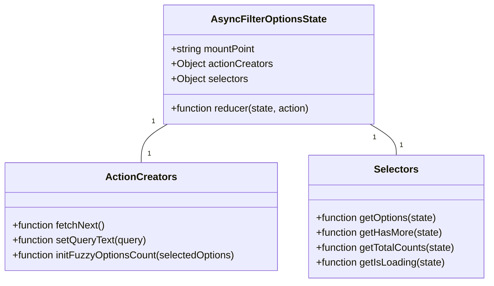

# Diagram: web/portal/src/components/search-bar/AsyncFilterOptionsStateBuilder.js


> Auto-generated by Obscura crawlers

## Diagram 1

```mermaid
flowchart TD
  A[call fetchNext()] --> B[getState()]
  B --> C{cancel previous?}
  C -- yes --> C1[call tokens[tokenKey].cancelRequest(CANCELED)]
  C -- no --> D[create cancelToken]
  D --> E[dispatch FETCH_NEXT]
  E --> F[getRequestUrl(), getHeaders(), getParams()]
  F --> G[axios.request(config)]
  G --> H{response}
  H -- success --> I[getResponseData(response.data) => results]
  I --> J[transformResult for each result]
  J --> K[compute hasMore, meta]
  K --> L[dispatch RECEIVE_NEXT with payload(options, hasMore, lastResponse)]
  H -- error (not CANCELED) --> M[console.error && dispatch FETCH_NEXT_ERROR]
```

> SVG rendering failed for this diagram.

## Diagram 2



### SVG

<svg id="container" width="792.625" xmlns="http://www.w3.org/2000/svg" class="classDiagram" height="456" viewBox="0 0 792.625 456" role="graphics-document document" aria-roledescription="class"><style>#container{font-family:"trebuchet ms",verdana,arial,sans-serif;font-size:16px;fill:#333;}@keyframes edge-animation-frame{from{stroke-dashoffset:0;}}@keyframes dash{to{stroke-dashoffset:0;}}#container .edge-animation-slow{stroke-dasharray:9,5!important;stroke-dashoffset:900;animation:dash 50s linear infinite;stroke-linecap:round;}#container .edge-animation-fast{stroke-dasharray:9,5!important;stroke-dashoffset:900;animation:dash 20s linear infinite;stroke-linecap:round;}#container .error-icon{fill:#552222;}#container .error-text{fill:#552222;stroke:#552222;}#container .edge-thickness-normal{stroke-width:1px;}#container .edge-thickness-thick{stroke-width:3.5px;}#container .edge-pattern-solid{stroke-dasharray:0;}#container .edge-thickness-invisible{stroke-width:0;fill:none;}#container .edge-pattern-dashed{stroke-dasharray:3;}#container .edge-pattern-dotted{stroke-dasharray:2;}#container .marker{fill:#333333;stroke:#333333;}#container .marker.cross{stroke:#333333;}#container svg{font-family:"trebuchet ms",verdana,arial,sans-serif;font-size:16px;}#container p{margin:0;}#container g.classGroup text{fill:#9370DB;stroke:none;font-family:"trebuchet ms",verdana,arial,sans-serif;font-size:10px;}#container g.classGroup text .title{font-weight:bolder;}#container .nodeLabel,#container .edgeLabel{color:#131300;}#container .edgeLabel .label rect{fill:#ECECFF;}#container .label text{fill:#131300;}#container .labelBkg{background:#ECECFF;}#container .edgeLabel .label span{background:#ECECFF;}#container .classTitle{font-weight:bolder;}#container .node rect,#container .node circle,#container .node ellipse,#container .node polygon,#container .node path{fill:#ECECFF;stroke:#9370DB;stroke-width:1px;}#container .divider{stroke:#9370DB;stroke-width:1;}#container g.clickable{cursor:pointer;}#container g.classGroup rect{fill:#ECECFF;stroke:#9370DB;}#container g.classGroup line{stroke:#9370DB;stroke-width:1;}#container .classLabel .box{stroke:none;stroke-width:0;fill:#ECECFF;opacity:0.5;}#container .classLabel .label{fill:#9370DB;font-size:10px;}#container .relation{stroke:#333333;stroke-width:1;fill:none;}#container .dashed-line{stroke-dasharray:3;}#container .dotted-line{stroke-dasharray:1 2;}#container #compositionStart,#container .composition{fill:#333333!important;stroke:#333333!important;stroke-width:1;}#container #compositionEnd,#container .composition{fill:#333333!important;stroke:#333333!important;stroke-width:1;}#container #dependencyStart,#container .dependency{fill:#333333!important;stroke:#333333!important;stroke-width:1;}#container #dependencyStart,#container .dependency{fill:#333333!important;stroke:#333333!important;stroke-width:1;}#container #extensionStart,#container .extension{fill:transparent!important;stroke:#333333!important;stroke-width:1;}#container #extensionEnd,#container .extension{fill:transparent!important;stroke:#333333!important;stroke-width:1;}#container #aggregationStart,#container .aggregation{fill:transparent!important;stroke:#333333!important;stroke-width:1;}#container #aggregationEnd,#container .aggregation{fill:transparent!important;stroke:#333333!important;stroke-width:1;}#container #lollipopStart,#container .lollipop{fill:#ECECFF!important;stroke:#333333!important;stroke-width:1;}#container #lollipopEnd,#container .lollipop{fill:#ECECFF!important;stroke:#333333!important;stroke-width:1;}#container .edgeTerminals{font-size:11px;line-height:initial;}#container .classTitleText{text-anchor:middle;font-size:18px;fill:#333;}#container .label-icon{display:inline-block;height:1em;overflow:visible;vertical-align:-0.125em;}#container .node .label-icon path{fill:currentColor;stroke:revert;stroke-width:revert;}#container :root{--mermaid-font-family:"trebuchet ms",verdana,arial,sans-serif;}</style><g><defs><marker id="container_class-aggregationStart" class="marker aggregation class" refX="18" refY="7" markerWidth="190" markerHeight="240" orient="auto"><path d="M 18,7 L9,13 L1,7 L9,1 Z"></path></marker></defs><defs><marker id="container_class-aggregationEnd" class="marker aggregation class" refX="1" refY="7" markerWidth="20" markerHeight="28" orient="auto"><path d="M 18,7 L9,13 L1,7 L9,1 Z"></path></marker></defs><defs><marker id="container_class-extensionStart" class="marker extension class" refX="18" refY="7" markerWidth="190" markerHeight="240" orient="auto"><path d="M 1,7 L18,13 V 1 Z"></path></marker></defs><defs><marker id="container_class-extensionEnd" class="marker extension class" refX="1" refY="7" markerWidth="20" markerHeight="28" orient="auto"><path d="M 1,1 V 13 L18,7 Z"></path></marker></defs><defs><marker id="container_class-compositionStart" class="marker composition class" refX="18" refY="7" markerWidth="190" markerHeight="240" orient="auto"><path d="M 18,7 L9,13 L1,7 L9,1 Z"></path></marker></defs><defs><marker id="container_class-compositionEnd" class="marker composition class" refX="1" refY="7" markerWidth="20" markerHeight="28" orient="auto"><path d="M 18,7 L9,13 L1,7 L9,1 Z"></path></marker></defs><defs><marker id="container_class-dependencyStart" class="marker dependency class" refX="6" refY="7" markerWidth="190" markerHeight="240" orient="auto"><path d="M 5,7 L9,13 L1,7 L9,1 Z"></path></marker></defs><defs><marker id="container_class-dependencyEnd" class="marker dependency class" refX="13" refY="7" markerWidth="20" markerHeight="28" orient="auto"><path d="M 18,7 L9,13 L14,7 L9,1 Z"></path></marker></defs><defs><marker id="container_class-lollipopStart" class="marker lollipop class" refX="13" refY="7" markerWidth="190" markerHeight="240" orient="auto"><circle stroke="black" fill="transparent" cx="7" cy="7" r="6"></circle></marker></defs><defs><marker id="container_class-lollipopEnd" class="marker lollipop class" refX="1" refY="7" markerWidth="190" markerHeight="240" orient="auto"><circle stroke="black" fill="transparent" cx="7" cy="7" r="6"></circle></marker></defs><g class="root"><g class="clusters"></g><g class="edgePaths"><path d="M271.291,200L264.175,204.167C257.059,208.333,242.826,216.667,235.71,227C228.594,237.333,228.594,249.667,228.594,255.833L228.594,262" id="id_AsyncFilterOptionsState_ActionCreators_1" class="edge-thickness-normal edge-pattern-solid relation" style=";;;" data-edge="true" data-et="edge" data-id="id_AsyncFilterOptionsState_ActionCreators_1" data-points="W3sieCI6MjcxLjI5MTMyMjMxNDA0OTYsInkiOjIwMH0seyJ4IjoyMjguNTkzNzUsInkiOjIyNX0seyJ4IjoyMjguNTkzNzUsInkiOjI2Mn1d"></path><path d="M599.209,200L606.325,204.167C613.441,208.333,627.674,216.667,634.79,225C641.906,233.333,641.906,241.667,641.906,245.833L641.906,250" id="id_AsyncFilterOptionsState_Selectors_2" class="edge-thickness-normal edge-pattern-solid relation" style=";;;" data-edge="true" data-et="edge" data-id="id_AsyncFilterOptionsState_Selectors_2" data-points="W3sieCI6NTk5LjIwODY3NzY4NTk1MDQsInkiOjIwMH0seyJ4Ijo2NDEuOTA2MjUsInkiOjIyNX0seyJ4Ijo2NDEuOTA2MjUsInkiOjI1MH1d"></path></g><g class="edgeLabels"><g class="edgeLabel"><g class="label" data-id="id_AsyncFilterOptionsState_ActionCreators_1" transform="translate(0, 0)"><foreignObject width="0" height="0"><div xmlns="http://www.w3.org/1999/xhtml" class="labelBkg" style="display: table-cell; white-space: nowrap; line-height: 1.5; max-width: 200px; text-align: center;"><span class="edgeLabel"></span></div></foreignObject></g></g><g class="edgeLabel"><g class="label" data-id="id_AsyncFilterOptionsState_Selectors_2" transform="translate(0, 0)"><foreignObject width="0" height="0"><div xmlns="http://www.w3.org/1999/xhtml" class="labelBkg" style="display: table-cell; white-space: nowrap; line-height: 1.5; max-width: 200px; text-align: center;"><span class="edgeLabel"></span></div></foreignObject></g></g><g class="edgeTerminals" transform="translate(248.61043084744682, 195.8979106223925)"><g class="inner" transform="translate(0, 0)"><foreignObject style="width: 9px; height: 12px;"><div xmlns="http://www.w3.org/1999/xhtml" style="display: inline-block; padding-right: 1px; white-space: nowrap;"><span class="edgeLabel">1</span></div></foreignObject></g></g><g class="edgeTerminals" transform="translate(606.7313485333973, 221.78667937760747)"><g class="inner" transform="translate(0, 0)"><foreignObject style="width: 9px; height: 12px;"><div xmlns="http://www.w3.org/1999/xhtml" style="display: inline-block; padding-right: 1px; white-space: nowrap;"><span class="edgeLabel">1</span></div></foreignObject></g></g><g class="edgeTerminals" transform="translate(238.59375, 239.5)"><g class="inner" transform="translate(0, 0)"></g><foreignObject style="width: 9px; height: 12px;"><div xmlns="http://www.w3.org/1999/xhtml" style="display: inline-block; padding-right: 1px; white-space: nowrap;"><span class="edgeLabel">1</span></div></foreignObject></g><g class="edgeTerminals" transform="translate(647.0088407048842, 225.83370374019768)"><g class="inner" transform="translate(0, 0)"></g><foreignObject style="width: 9px; height: 12px;"><div xmlns="http://www.w3.org/1999/xhtml" style="display: inline-block; padding-right: 1px; white-space: nowrap;"><span class="edgeLabel">1</span></div></foreignObject></g></g><g class="nodes"><g class="node default" id="classId-AsyncFilterOptionsState-0" transform="translate(435.25, 104)"><g class="basic label-container"><path d="M-169.98046875 -96 L169.98046875 -96 L169.98046875 96 L-169.98046875 96" stroke="none" stroke-width="0" fill="#ECECFF" style=""></path><path d="M-169.98046875 -96 C-98.23855049129601 -96, -26.49663223259202 -96, 169.98046875 -96 M-169.98046875 -96 C-55.39101891425118 -96, 59.198430921497646 -96, 169.98046875 -96 M169.98046875 -96 C169.98046875 -27.694827501613588, 169.98046875 40.610344996772824, 169.98046875 96 M169.98046875 -96 C169.98046875 -44.072504481180516, 169.98046875 7.8549910376389676, 169.98046875 96 M169.98046875 96 C74.02276744290253 96, -21.93493386419493 96, -169.98046875 96 M169.98046875 96 C86.08865818381082 96, 2.1968476176216427 96, -169.98046875 96 M-169.98046875 96 C-169.98046875 33.73479005697988, -169.98046875 -28.530419886040235, -169.98046875 -96 M-169.98046875 96 C-169.98046875 36.95942090931585, -169.98046875 -22.081158181368295, -169.98046875 -96" stroke="#9370DB" stroke-width="1.3" fill="none" stroke-dasharray="0 0" style=""></path></g><g class="annotation-group text" transform="translate(0, -72)"></g><g class="label-group text" transform="translate(-88.0078125, -72)"><g class="label" style="font-weight: bolder" transform="translate(0,-12)"><foreignObject width="176.015625" height="24"><div xmlns="http://www.w3.org/1999/xhtml" style="display: table-cell; white-space: nowrap; line-height: 1.5; max-width: 223px; text-align: center;"><span class="nodeLabel markdown-node-label" style=""><p>AsyncFilterOptionsState</p></span></div></foreignObject></g></g><g class="members-group text" transform="translate(-157.98046875, -24)"><g class="label" style="" transform="translate(0,-12)"><foreignObject width="139.203125" height="24"><div xmlns="http://www.w3.org/1999/xhtml" style="display: table-cell; white-space: nowrap; line-height: 1.5; max-width: 197px; text-align: center;"><span class="nodeLabel markdown-node-label" style=""><p>+string mountPoint</p></span></div></foreignObject></g><g class="label" style="" transform="translate(0,12)"><foreignObject width="164.765625" height="24"><div xmlns="http://www.w3.org/1999/xhtml" style="display: table-cell; white-space: nowrap; line-height: 1.5; max-width: 222px; text-align: center;"><span class="nodeLabel markdown-node-label" style=""><p>+Object actionCreators</p></span></div></foreignObject></g><g class="label" style="" transform="translate(0,36)"><foreignObject width="124.890625" height="24"><div xmlns="http://www.w3.org/1999/xhtml" style="display: table-cell; white-space: nowrap; line-height: 1.5; max-width: 182px; text-align: center;"><span class="nodeLabel markdown-node-label" style=""><p>+Object selectors</p></span></div></foreignObject></g></g><g class="methods-group text" transform="translate(-157.98046875, 72)"><g class="label" style="" transform="translate(0,-12)"><foreignObject width="227.953125" height="24"><div xmlns="http://www.w3.org/1999/xhtml" style="display: table-cell; white-space: nowrap; line-height: 1.5; max-width: 285px; text-align: center;"><span class="nodeLabel markdown-node-label" style=""><p>+function reducer(state, action)</p></span></div></foreignObject></g></g><g class="divider" style=""><path d="M-169.98046875 -48 C-39.157975461291926 -48, 91.66451782741615 -48, 169.98046875 -48 M-169.98046875 -48 C-76.82927176864621 -48, 16.321925212707583 -48, 169.98046875 -48" stroke="#9370DB" stroke-width="1.3" fill="none" stroke-dasharray="0 0" style=""></path></g><g class="divider" style=""><path d="M-169.98046875 48 C-100.47794187132592 48, -30.97541499265185 48, 169.98046875 48 M-169.98046875 48 C-44.49392442382653 48, 80.99261990234695 48, 169.98046875 48" stroke="#9370DB" stroke-width="1.3" fill="none" stroke-dasharray="0 0" style=""></path></g></g><g class="node default" id="classId-ActionCreators-1" transform="translate(228.59375, 349)"><g class="basic label-container"><path d="M-220.59375 -87 L220.59375 -87 L220.59375 87 L-220.59375 87" stroke="none" stroke-width="0" fill="#ECECFF" style=""></path><path d="M-220.59375 -87 C-77.47657350090557 -87, 65.64060299818885 -87, 220.59375 -87 M-220.59375 -87 C-124.59718356452534 -87, -28.600617129050676 -87, 220.59375 -87 M220.59375 -87 C220.59375 -19.684124798519832, 220.59375 47.631750402960336, 220.59375 87 M220.59375 -87 C220.59375 -19.06015406453227, 220.59375 48.87969187093546, 220.59375 87 M220.59375 87 C87.00753136893712 87, -46.578687262125754 87, -220.59375 87 M220.59375 87 C54.057740805387766 87, -112.47826838922447 87, -220.59375 87 M-220.59375 87 C-220.59375 28.03392899087622, -220.59375 -30.93214201824756, -220.59375 -87 M-220.59375 87 C-220.59375 38.68722483163943, -220.59375 -9.625550336721133, -220.59375 -87" stroke="#9370DB" stroke-width="1.3" fill="none" stroke-dasharray="0 0" style=""></path></g><g class="annotation-group text" transform="translate(0, -63)"></g><g class="label-group text" transform="translate(-53.96875, -63)"><g class="label" style="font-weight: bolder" transform="translate(0,-12)"><foreignObject width="107.9375" height="24"><div xmlns="http://www.w3.org/1999/xhtml" style="display: table-cell; white-space: nowrap; line-height: 1.5; max-width: 156px; text-align: center;"><span class="nodeLabel markdown-node-label" style=""><p>ActionCreators</p></span></div></foreignObject></g></g><g class="members-group text" transform="translate(-208.59375, -15)"></g><g class="methods-group text" transform="translate(-208.59375, 15)"><g class="label" style="" transform="translate(0,-12)"><foreignObject width="152.578125" height="24"><div xmlns="http://www.w3.org/1999/xhtml" style="display: table-cell; white-space: nowrap; line-height: 1.5; max-width: 210px; text-align: center;"><span class="nodeLabel markdown-node-label" style=""><p>+function fetchNext()</p></span></div></foreignObject></g><g class="label" style="" transform="translate(0,12)"><foreignObject width="219.3125" height="24"><div xmlns="http://www.w3.org/1999/xhtml" style="display: table-cell; white-space: nowrap; line-height: 1.5; max-width: 277px; text-align: center;"><span class="nodeLabel markdown-node-label" style=""><p>+function setQueryText(query)</p></span></div></foreignObject></g><g class="label" style="" transform="translate(0,36)"><foreignObject width="363.21875" height="24"><div xmlns="http://www.w3.org/1999/xhtml" style="display: table-cell; white-space: nowrap; line-height: 1.5; max-width: 421px; text-align: center;"><span class="nodeLabel markdown-node-label" style=""><p>+function initFuzzyOptionsCount(selectedOptions)</p></span></div></foreignObject></g></g><g class="divider" style=""><path d="M-220.59375 -39 C-66.10921601889561 -39, 88.37531796220878 -39, 220.59375 -39 M-220.59375 -39 C-112.37535194263387 -39, -4.15695388526774 -39, 220.59375 -39" stroke="#9370DB" stroke-width="1.3" fill="none" stroke-dasharray="0 0" style=""></path></g><g class="divider" style=""><path d="M-220.59375 -15 C-56.67170124489226 -15, 107.25034751021548 -15, 220.59375 -15 M-220.59375 -15 C-118.9893731693081 -15, -17.38499633861619 -15, 220.59375 -15" stroke="#9370DB" stroke-width="1.3" fill="none" stroke-dasharray="0 0" style=""></path></g></g><g class="node default" id="classId-Selectors-2" transform="translate(641.90625, 349)"><g class="basic label-container"><path d="M-142.71875 -99 L142.71875 -99 L142.71875 99 L-142.71875 99" stroke="none" stroke-width="0" fill="#ECECFF" style=""></path><path d="M-142.71875 -99 C-64.44009387277704 -99, 13.838562254445918 -99, 142.71875 -99 M-142.71875 -99 C-71.10366399615387 -99, 0.5114220076922606 -99, 142.71875 -99 M142.71875 -99 C142.71875 -57.04080378312091, 142.71875 -15.081607566241814, 142.71875 99 M142.71875 -99 C142.71875 -36.936877470203314, 142.71875 25.126245059593373, 142.71875 99 M142.71875 99 C67.35641751350099 99, -8.005914972998028 99, -142.71875 99 M142.71875 99 C56.883197201360275 99, -28.95235559727945 99, -142.71875 99 M-142.71875 99 C-142.71875 32.25930265477567, -142.71875 -34.48139469044867, -142.71875 -99 M-142.71875 99 C-142.71875 23.9189470898269, -142.71875 -51.1621058203462, -142.71875 -99" stroke="#9370DB" stroke-width="1.3" fill="none" stroke-dasharray="0 0" style=""></path></g><g class="annotation-group text" transform="translate(0, -75)"></g><g class="label-group text" transform="translate(-34.171875, -75)"><g class="label" style="font-weight: bolder" transform="translate(0,-12)"><foreignObject width="68.34375" height="24"><div xmlns="http://www.w3.org/1999/xhtml" style="display: table-cell; white-space: nowrap; line-height: 1.5; max-width: 117px; text-align: center;"><span class="nodeLabel markdown-node-label" style=""><p>Selectors</p></span></div></foreignObject></g></g><g class="members-group text" transform="translate(-130.71875, -27)"></g><g class="methods-group text" transform="translate(-130.71875, 3)"><g class="label" style="" transform="translate(0,-12)"><foreignObject width="198.78125" height="24"><div xmlns="http://www.w3.org/1999/xhtml" style="display: table-cell; white-space: nowrap; line-height: 1.5; max-width: 256px; text-align: center;"><span class="nodeLabel markdown-node-label" style=""><p>+function getOptions(state)</p></span></div></foreignObject></g><g class="label" style="" transform="translate(0,12)"><foreignObject width="204.828125" height="24"><div xmlns="http://www.w3.org/1999/xhtml" style="display: table-cell; white-space: nowrap; line-height: 1.5; max-width: 262px; text-align: center;"><span class="nodeLabel markdown-node-label" style=""><p>+function getHasMore(state)</p></span></div></foreignObject></g><g class="label" style="" transform="translate(0,36)"><foreignObject width="227.265625" height="24"><div xmlns="http://www.w3.org/1999/xhtml" style="display: table-cell; white-space: nowrap; line-height: 1.5; max-width: 285px; text-align: center;"><span class="nodeLabel markdown-node-label" style=""><p>+function getTotalCounts(state)</p></span></div></foreignObject></g><g class="label" style="" transform="translate(0,60)"><foreignObject width="211.140625" height="24"><div xmlns="http://www.w3.org/1999/xhtml" style="display: table-cell; white-space: nowrap; line-height: 1.5; max-width: 269px; text-align: center;"><span class="nodeLabel markdown-node-label" style=""><p>+function getIsLoading(state)</p></span></div></foreignObject></g></g><g class="divider" style=""><path d="M-142.71875 -51 C-30.857980311173293 -51, 81.00278937765341 -51, 142.71875 -51 M-142.71875 -51 C-75.03865729413633 -51, -7.358564588272657 -51, 142.71875 -51" stroke="#9370DB" stroke-width="1.3" fill="none" stroke-dasharray="0 0" style=""></path></g><g class="divider" style=""><path d="M-142.71875 -27 C-64.01969478932027 -27, 14.679360421359462 -27, 142.71875 -27 M-142.71875 -27 C-39.28402100848484 -27, 64.15070798303032 -27, 142.71875 -27" stroke="#9370DB" stroke-width="1.3" fill="none" stroke-dasharray="0 0" style=""></path></g></g></g></g></g></svg>

## Diagram 3

```mermaid
flowchart TD
  subgraph ReducerState
    RS1[requestMap: Map] --> RS2[hasMore: boolean]
    RS2 --> RS3[query: string]
    RS3 --> RS4[requestOrderIndex: number]
    RS4 --> RS5[totalCounts: object]
    RS5 --> RS6[isLoading: boolean]
    RS6 --> RS7[lastResponse: object]
  end
  subgraph Actions
    A1[SET_QUERY_TEXT] -->|resets| RS1
    A2[FETCH_NEXT] -->|increment requestOrderIndex, isLoading=true| RS4
    A3[RECEIVE_NEXT] -->|merge options into requestMap, isLoading=false, hasMore, totalCounts, lastResponse| RS1
    A4[FUZZY_OPTION_COUNT] -->|update totalCounts[query]| RS5
    A5[FETCH_NEXT_ERROR] -->|isLoading=false, hasMore=false| RS2
    A6[SET_ACTIVE_ORGANIZATION] -->|reset to initialState| RS1
  end
```

> SVG rendering failed for this diagram.
